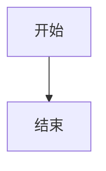

# Obsidian Markdown 规范

> 本 skill **继承 `markdown` skill 的全部规则**（CommonMark + GFM），以下文档列出所有基础规则并在此基础上添加 Obsidian 专属扩展和覆盖。当两者冲突时，**Obsidian 规则优先**。

在本 Wiki 项目中，任何创建或编辑 markdown 文件的操作都应使用此 skill。生成的内容遵循 Obsidian 特有的语法规范。即使任务看起来简单（如"写个页面"、"更新索引"），也要先过一遍语法规则——wikilink、callout、frontmatter、尖括号/方括号包裹等细节容易被忽略。

---

## 一、基础语法（继承自 CommonMark + GFM）

### 标题

```markdown
# H1 — 页面唯一标题
## H2 — 主要章节
### H3 — 子章节
#### H4 — 少用，层级不宜超过 H4
```

标题级别反映内容层次，不要为了视觉效果跳级（如 H1 直接跳 H3）。每个文档通常只有一个 H1。

### 段落与换行

```markdown
这是第一段。

这是第二段。段落之间用一个空行分隔。

行尾加两个空格  
可以强制换行，但尽量少用——换一段更清晰。
```

### 强调

```markdown
*斜体* 或 _斜体_
**粗体** 或 __粗体__
***粗斜体***
~~删除线~~
```

### 列表

无序列表统一用 `-`，不混用 `*` 和 `+`：

```markdown
- 第一项
- 第二项
  - 嵌套项（缩进 2 空格）
  - 嵌套项
- 第三项
```

有序列表编号从 `1.` 开始，后续编号不影响渲染，但保持语义上连续：

```markdown
1. 第一步
2. 第二步
3. 第三步
```

列表项内容较长时，用空行分隔会让每项渲染为段落（松散列表）——仅在必要时使用：

```markdown
- 这是一个短项

- 这是一个需要更多说明的项。

  缩进 2 空格后可以追加段落或代码块。
```

### 代码

行内代码用单反引号：

```markdown
使用 `git commit -m "msg"` 提交更改。
```

代码块用三反引号，**务必标注语言**以启用语法高亮：

````markdown
```python
def hello():
    print("Hello, World!")
```
````

#### 嵌套代码块

当代码块内容中还有代码块时，外层反引号数必须严格多于内层。规则：**外层反引号数 > 内容中最长连续反引号数**。

````markdown
```markdown
这是内层代码块示例
```
````

如果内层用了三个反引号，外层改用四个：

`````markdown
````markdown
```bash
echo "hello"
```
````
`````

更深嵌套以此类推，每多一层就多加一个反引号：

``````markdown
`````markdown
````python
```python
print("三层嵌套")
```
````
`````
``````

不确定时，宁可多加一个反引号。

### 表格（GFM）

表格前后各留一个空行：

```markdown
| 列 A   | 列 B   | 列 C   |
|--------|:------:|-------:|
| 左对齐 | 居中   | 右对齐 |
| 值 1   | 值 2   | 值 3   |
```

对齐语法：`|---|` 左对齐，`|:---:|` 居中，`|---:|` 右对齐。

### 任务列表（GFM）

```markdown
- [x] 已完成
- [ ] 待完成
- [ ] 另一项
```

### 水平分割线

```markdown
---
```

三个 `-`，前后各留空行，避免与 frontmatter 或标题混淆。

### 转义

特殊字符前加 `\` 转义：

```markdown
\*不是斜体\*
\[不是链接\]
\`不是代码\`
```

常见需转义字符：`\ * _ [] () # + - . !`

---

## 二、Obsidian 扩展语法

以下语法是 Obsidian 对标准 Markdown 的扩展，在本 Wiki 项目中应优先使用。

### 内部链接 (Wikilink) — 覆盖标准链接

```markdown
[[页面名称]]
[[页面名称|显示别名]]
[[页面名称#标题]]
[[页面名称#标题|别名]]
```

> [!important] Wikilink 优先
> 交叉引用**必须**用 `[[ ]]` wikilink，不用标准 `[text](url)` 链接。标准链接仅用于外部 URL。

### 嵌入 (Transclusion) — 覆盖标准图片语法

```markdown
![[页面名称]]
![[页面名称#标题]]
![[image.png]]
![[audio.mp3]]
```

> [!important] 嵌入优先
> 嵌入图片/文件用 `![[ ]]` 语法，不用 ``。

### Callout (标注块) — 覆盖 GFM Alerts

类型: note, abstract, info, tip, success, question, warning, failure, danger, bug, example, quote

```markdown
> [!note] 标题
> 内容行
> 可以多行

> [!warning] 注意
> 这是一个警告

> [!tip]- 可折叠
> 默认折叠的内容

> [!info]+ 默认展开
> 默认展开的折叠块
```

> [!important] Callout 优先
> 重要提示**必须**用 callout，不用纯文本强调或 GFM `> [!NOTE]` 格式（Obsidian 支持更丰富的 callout 类型）。

### Frontmatter (元数据) — 必填（覆盖"如平台支持"）

```markdown
---
title: 页面标题
updated: 2026-05-05
tags: [tag1, tag2]
aliases: [别名1, 别名2]
cssclasses: []
---
```

> [!important] Frontmatter 必填
> **所有页面必须有 frontmatter**，至少包含 `title` 和 `updated` 字段。这与标准 Markdown 中"如平台支持"不同——在本 Wiki 中是强制要求。

### 标签用 `tags` frontmatter

如果需要在页面中添加标签，**必须**在 frontmatter 中使用 `tags: [tag1, tag2]`，不在正文中使用行内标签。本工作区不使用行内标签语法。

> [!important] 本工作区禁用行内标签
> 正文中所有 `#文字`（无论是 `#1`、`#3`、`#颜色初始化` 还是 `#PlayerPrefs`）都会被 Obsidian 解析为标签，导致标签视图污染和渲染歧义。因此：
>
> 1. **标签只放 frontmatter**：在 frontmatter 中统一使用 YAML `tags: [tag1, tag2]` 定义标签，不在正文中写 `#tag`
> 2. **正文中的 `#` 符号必须用反引号包裹**：任何需要表达编号、话题号、ID 号等语义时，使用行内代码。例如"问题 `#1`"、"第 `#3` 步"、"Top `#189`"、"批次 `#颜色初始化`"
>
> 3. **不使用反斜杠转义**：`\#3` 不是标准 Markdown，在不同渲染器行为不一致
>
> ```markdown
> # 错误 — Obsidian 会将 #后面的所有内容识别为标签
> ## 笔记问题 #3：服务器怎么知道"我当时看到了什么"？
> ### #颜色初始化 步骤
> #### Top 1: #189 Particle Render — 3.12ms
>
> # 正确 — 反引号包裹后作为行内代码，不会被解析为标签
> ## 笔记问题 `#3`：服务器怎么知道"我当时看到了什么"？
> ### `#颜色初始化` 步骤
> #### Top 1: `#189` Particle Render — 3.12ms
> ```

### 块引用 (Block Reference)

```markdown
[[页面名^block-id]]
一段文本 ^block-id
```

### 脚注

```markdown
这是一段文本[^1]

[^1]: 脚注内容
```

### 高亮

```markdown
==高亮文本==
```

### Mermaid 图表

````markdown

````

### 数学公式 (LaTeX)

```markdown
$E = mc^2$

$$
\int_0^\infty e^{-x^2} dx = \frac{\sqrt{\pi}}{2}
$$
```

### 属性列表 (Properties)

在 frontmatter 中定义，也可用行内语法：

```markdown
主题:: 渲染管线
状态:: 草稿
```

### 特殊符号包裹：尖括号与方括号

在正文（代码块外部）出现尖括号 `<>` 或方括号 `[]` 时，必须用反引号包裹整个表达式，防止 Obsidian/Markdown 解析器将其误解为 HTML 标签或链接语法。

#### 尖括号 `<>`

Obsidian 会将裸 `<T>` 解析为 HTML 标签，导致内容从页面消失。不要使用 `\<T\>` 反斜杠转义——这不是标准 Markdown，在不同渲染器中行为不一致。

```markdown
❌ IEnumerable<T> 是一种泛型接口        → 渲染异常：<T> 被当作 HTML 标签
❌ IEnumerable\<T\> 是一种泛型接口      → 非标准转义，行为不一致
✅ `IEnumerable<T>` 是一种泛型接口      → 正确渲染为行内代码

❌ 使用 Span<int> 切片数据              → 渲染异常
❌ 使用 Span\<int\> 切片数据            → 非标准转义
✅ 使用 `Span<int>` 切片数据            → 正确渲染

❌ **Task<T>** 已堆分配                 → 加粗中的尖括号同样会被解析
✅ **`Task<T>`** 已堆分配               → 先反引号包裹，再整体加粗
```

尖括号常见场景：泛型参数（`<T>`、`<int>`、`<string>`）、泛型类型（`List<T>`、`Dictionary<K,V>`）、约束（`where T : struct`）。

#### 方括号 `[]`

Markdown 将 `[text](url)` 解析为链接。当 `[...]` 出现在正文中且可能被跟随 `(...)` 时，会意外形成链接。更常见的是 C# 特性如 `[SerializeField]`、`[Command]` 等——这些 `[...]` 不是 Wikilink，必须用反引号包裹。

```markdown
❌ 通过 [SerializeField] 暴露字段       → 无 URL 跟随，暂不形成链接但语义模糊
❌ 详见 [Mirror](https://...) 的文档    → 这是正确的标准链接，无需修改
✅ 通过 `[SerializeField]` 暴露字段     → 明确表示代码标识符

❌ 使用 [Command] + [ClientRpc] 同步    → 方括号内容易与链接语法混淆
✅ 使用 `[Command]` + `[ClientRpc]` 同步 → 正确渲染
```

方括号常见场景：C# 特性（`[SerializeField]`、`[Command]`、`[SyncVar]`）、标记文本（`[WIP]`、`[DRAFT]`）、协议标记（`[SYN]`、`[ACK]`——这些在代码块内无问题）。

> [!warning] 代码块内的特殊符号不要包裹
> ` ```csharp ` 内部是代码环境，Obsidian 不会将其中 `<T>` 或 `[Attribute]` 解析为 HTML/链接，保持原样即可。Wikilink `[[...]]` 和嵌入 `![[...]]` 在代码块外才是 Obsidian 语法，无需额外处理。

---

## 三、书写规则（完整合并版）

以下规则合并了 `markdown` skill 的基础规则与 Obsidian 扩展规则，冲突处以 Obsidian 为准。

### 通用规则（继承自 markdown）

1. **标题唯一性**：每个文档只有一个 H1，作为文档标题
2. **标题不跳级**：层级连续，H2 之后接 H3，不要直接跳 H4
3. **列表符号统一**：同一文档内无序列表只用 `-`
4. **代码块标注语言**：所有代码块必须写语言标识符，无明确语言时用 `text`
5. **嵌套代码块加反引号**：内容中含 ` ``` ` 时外层用四个反引号，以此类推。原则：外层反引号数严格大于内容中最长的连续反引号串
6. **表格前后空行**：表格与上下文之间各留一个空行
7. **链接文本有意义**：用描述性文字，不要用"点击这里"或裸 URL（外部链接仍用标准格式）
8. **段落间空行**：段落、标题、列表、代码块、表格之间保留空行，确保解析器正确分块
9. **避免行尾空格**：除非需要强制换行，行尾不留空格
10. **图片 alt 文本有意义**：描述图片内容，不要留空

### Obsidian 专属规则（覆盖与新增）

11. **Frontmatter 必填**：所有页面必须有 frontmatter，至少包含 `title` 和 `updated` 字段 — 覆盖规则 #10 中"如平台支持"的表述
12. **交叉引用用 wikilink**：内部引用用 `[[ ]]`，不用标准 `[text](url)`；外部 URL 仍用标准链接 — 覆盖通用链接规则
13. **关键概念首次出现时用 wikilink**，即使目标页面尚不存在
14. **重要提示用 callout**：不用纯文本强调 — 覆盖通用引用块规则
15. **本工作区不使用行内标签**：标签只放 frontmatter `tags: [tag1, tag2]`，不在正文中写 `#tag`。正文中任何需要表达 `#文字` 的语义（如编号、话题号、步骤号）必须用反引号包裹 — 覆盖通用标签语法
16. **嵌入图片/文件用 `![[ ]]`** — 覆盖标准 `` 图片语法
17. **任务清单用 `- [ ]`** 语法
18. **特殊符号用反引号包裹**：正文中出现 `<T>`、`<int>` 等尖括号或 `[SerializeField]`、`[Command]` 等方括号时必须用反引号包裹。尖括号防止被当作 HTML 标签，方括号防止与链接语法混淆。不要用 `\<T\>` 反斜杠转义。代码块内部除外 — 覆盖通用转义规则
19. **保持 Obsidian 兼容性**：不使用 HTML 标签，优先使用 Obsidian 原生语法
20. **嵌套代码块外层加反引号**：当代码块内容中包含 ```` ``` ```` 时，外层必须使用 ```` ```` ````（四个反引号）；更深嵌套依此类推，每层多加一个反引号。原则：外层反引号数严格大于内容中最长的连续反引号串

---

## 四、常见错误

```markdown
❌ # 标题
内容紧跟标题没有空行          → 部分解析器不识别为标题

✅ # 标题

内容与标题之间有空行
```

```markdown
❌ ```                         → 没有语言标识，无语法高亮
✅ ```python
```

```markdown
❌ [点击这里](https://...)     → 链接文本无意义
✅ [查看安装文档](https://...)
```

```markdown
❌ [概念名称](概念名称.md)     → 内部引用不应使用标准链接
✅ [[概念名称]]                → 使用 wikilink
```

```markdown
❌ **注意：** 这个配置很重要   → 纯文本强调不醒目
✅ > [!warning] 注意
> 这个配置很重要               → 使用 callout
```

```markdown
❌ ---
title: 缺少 updated
---
✅ ---
title: 页面标题
updated: 2026-06-05
---                            → frontmatter 必须包含 title 和 updated
```
