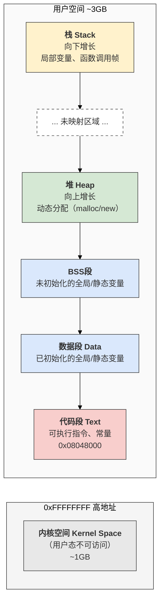
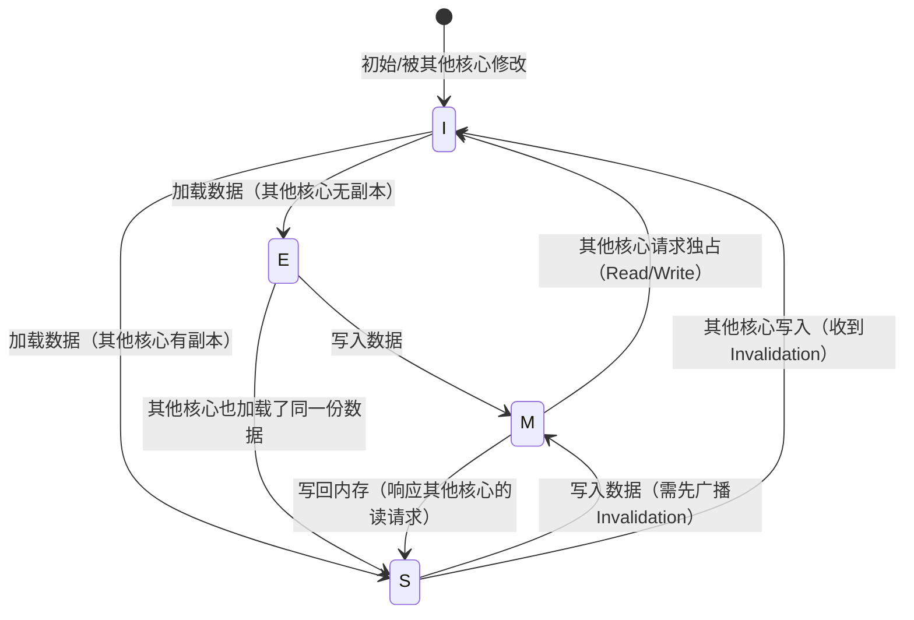
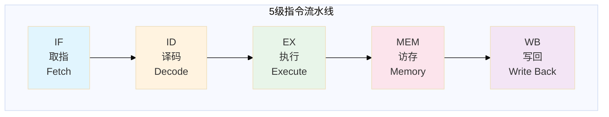
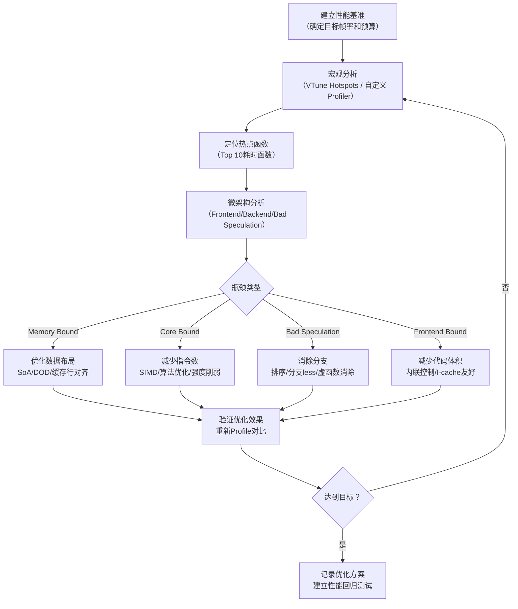
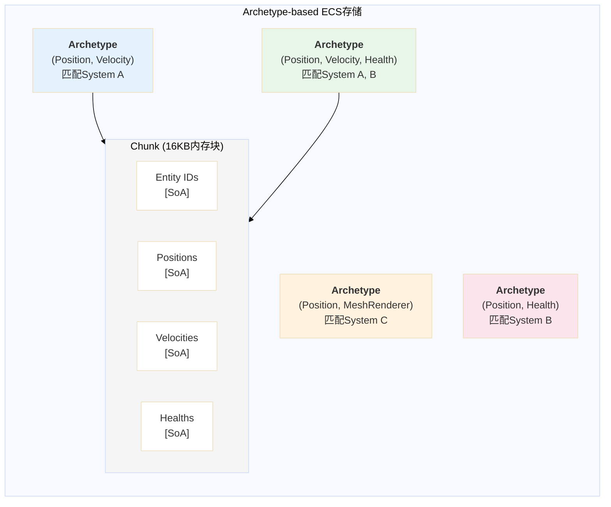
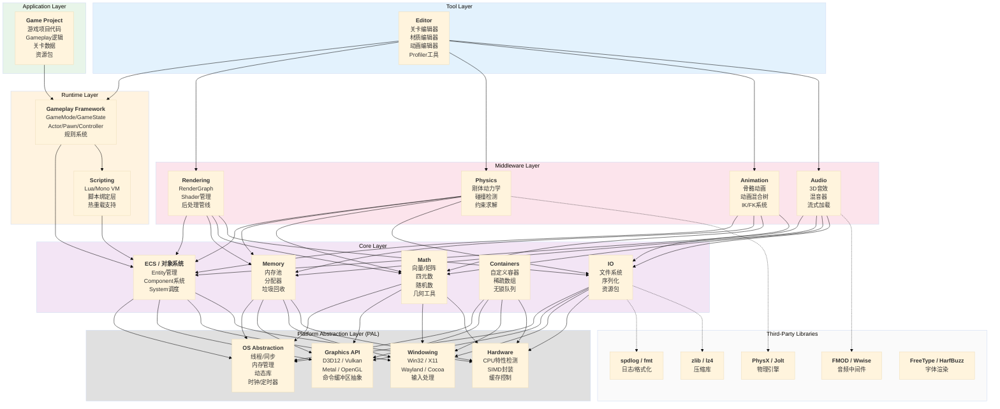

# 第二阶段：计算机科学核心

> **阶段定位**：在掌握了C++语言、基础数据结构和数学工具之后，我们进入计算机科学核心知识的学习。这一阶段的目标是建立对计算机系统底层运作原理的深刻理解——操作系统如何管理资源、CPU如何执行指令、软件架构如何组织复杂系统。这些知识是后续理解游戏引擎架构、性能优化、多线程渲染和ECS系统设计的基础。

---

## 2.1 操作系统原理

操作系统（Operating System, OS）是硬件与应用程序之间的中间层。对于游戏引擎开发者而言，理解操作系统并非为了编写内核代码，而是为了在引擎层面做出正确的性能决策：何时创建线程、如何分配内存、怎样避免同步开销、IO如何不阻塞渲染循环。本节从六个维度深入解析操作系统的核心机制，并始终锚定一个目标——**这些知识如何转化为引擎开发中的具体工程实践**。

### 2.1.1 进程与线程管理

#### 进程地址空间布局

当一个应用程序被执行时，操作系统为其创建一个进程（Process），并分配一块虚拟地址空间（Virtual Address Space）。理解这块空间的布局，是理解内存管理、栈溢出、堆碎片化等问题的基础。

在32位Linux系统中，典型的进程地址空间布局如下所示：



地址空间的分段设计并非随意安排，而是基于访问频率、权限需求和增长方向的综合考虑。代码段（Text Segment）通常具有只读和可执行权限，操作系统可以将其映射为多个进程共享（例如同时运行多个相同程序实例时），从而节省物理内存。数据段（Data Segment）和BSS段存放全局状态，其大小在编译期就已确定。堆（Heap）和栈（Stack）是运行时的动态区域，但增长方向相反——栈向低地址递减，堆向高地址递增——这种设计使得两者之间可以共享一块弹性空间，最大化内存利用率。

**对游戏引擎的启示**：引擎中大量使用动态内存分配（游戏对象创建、资源加载），频繁的堆分配会导致内存碎片和分配器开销。后续我们将讨论引擎如何构建自定义内存池（Memory Pool）来规避这些问题。

#### 线程调度策略与上下文切换

线程（Thread）是CPU调度的基本单位。一个进程可以包含多个线程，它们共享同一地址空间，但各自拥有独立的程序计数器（Program Counter）、寄存器组和栈。

现代操作系统采用**抢占式多任务调度**（Preemptive Multitasking）。每个线程被分配一个时间片（Time Slice），当时间片耗尽或线程主动放弃CPU时，操作系统调度器选择下一个运行的线程。这一过程中发生的关键操作是**上下文切换**（Context Switch），即保存当前线程的CPU状态（所有通用寄存器、程序计数器、栈指针等），并恢复下一个线程的状态。

上下文切换的开销来源于几个方面：首先是寄存器状态的保存与恢复（数十到数百个时钟周期）；其次是CPU缓存失效——新线程的工作集（Working Set）很可能与之前运行的线程完全不同，导致L1/L2缓存大量未命中；最后是从用户态到内核态的切换本身需要额外的特权级转换开销。

| 调度策略 | 适用场景 | 时间片分配 | 引擎应用 |
|---------|---------|-----------|---------|
| CFS（完全公平调度器） | 通用计算、后台任务 | 动态计算，保证各线程公平获得CPU时间 | 资源加载线程、音频解码线程 |
| SCHED_FIFO（实时先进先出） | 硬实时任务 | 无时间片限制，直到线程主动放弃或被更高优先级抢占 | 不推荐直接用于游戏（需root权限），但类似概念可用于引擎的任务优先级系统 |
| SCHED_RR（实时轮询） | 软实时任务 | 固定时间片，同优先级线程间轮转 | 物理模拟固定步长更新 |
| EDF（最早截止时间优先） | 嵌入式实时系统 | 动态优先级，截止时间最近者优先 | 不适用通用OS，但思想可用于引擎帧时间预算分配 |

**CFS**（Completely Fair Scheduler）是Linux默认的调度器，它为每个线程维护一个虚拟运行时间（vruntime），始终选择vruntime最小的线程执行。这种设计保证了长期公平性，但可能导致游戏主线程因其他后台线程的竞争而出现不可预测的延迟——这对于需要稳定帧率的游戏是致命的。因此，游戏引擎通常不依赖OS的调度策略，而是自己实现**任务调度器**（Job Scheduler），将引擎的工作分解为细粒度任务，由引擎自己管理执行顺序和线程亲和性（Thread Affinity）。

上下文切换的精确开销难以一概而论，因为它与CPU架构、缓存状态、内核实现等因素密切相关。但在现代x86处理器上，纯内核态的上下文切换通常在**1~10微秒**量级。对于追求60FPS（每帧16.67ms）或120FPS（每帧8.33ms）的游戏而言，无节制的线程创建和同步将导致不可忽略的性能损耗。

### 2.1.2 内存管理深度解析

#### 虚拟内存机制

虚拟内存（Virtual Memory）是操作系统提供的一种内存抽象，它使得每个进程都认为自己拥有连续且私有的地址空间，而实际上物理内存（RAM）可能被多个进程共享，且部分数据可能暂存于磁盘（交换空间/页面文件）。

虚拟内存的核心价值在于三点：

**隔离性**：进程A无法直接访问进程B的内存空间，除非通过操作系统提供的显式机制（如共享内存）。这防止了恶意或错误程序破坏整个系统的稳定性。

**透明的大地址空间**：32位系统上的进程可以使用4GB虚拟地址空间（其中约3GB用户态可用），即使物理内存只有1GB。未使用的虚拟页不需要占用物理内存。

**按需加载与交换**：程序启动时无需将全部代码和数据装入物理内存。操作系统仅在访问某个虚拟页时才将其映射到物理页框（Page Frame），未活跃的页可以被换出（Swap Out）到磁盘，腾出物理内存给其他进程。

虚拟地址到物理地址的转换由CPU的**内存管理单元**（Memory Management Unit, MMU）硬件完成。MMU使用页表（Page Table）作为翻译映射。

#### 页表与TLB

页表是一个分层的数据结构，存储虚拟页号（Virtual Page Number, VPN）到物理页框号（Physical Frame Number, PFN）的映射关系。在x86-64架构中，通常采用四级页表结构：

```
虚拟地址 [CR3] → PML4 → PDP → PD → PT → 物理页内偏移
```

其中CR3是一个特殊寄存器，存放最高层页表（PML4）的物理地址。每次虚拟地址访问需要多达四次内存读取（每层页表一次），这在性能上是不可接受的。因此CPU引入了**TLB**（Translation Lookaside Buffer）。

TLB是一个位于CPU内部的全相联高速缓存（Fully-associative Cache），专门缓存近期使用过的VPN→PFN映射。TLB命中时地址转换几乎零开销；TLB未命中（TLB Miss）时，CPU需要遍历页表，代价可达数十到数百个时钟周期。现代CPU的TLB容量有限——Intel Skylake架构的L1 dTLB约有64项，覆盖256KB内存（以4KB页计算）。这意味着访问大范围内存（如扫描大型数组）时，TLB未命中将成为显著的性能瓶颈。

**游戏引擎中的应对策略**：引擎应尽量避免随机访问大范围内存，优先使用顺序访问模式（如线性遍历数组）。对于超大纹理或顶点缓冲区，可以使用**大页**（Huge Pages，2MB或1GB的页大小）来减少TLB压力，因为单个大页TLB项可覆盖512倍于标准4KB页的内存。

#### 页面置换算法

当物理内存不足时，操作系统必须选择某些页面换出到磁盘。页面置换算法的目标是最小化缺页中断（Page Fault）的频率。

| 算法 | 策略描述 | 优点 | 缺点 | 实际采用情况 |
|------|---------|------|------|------------|
| OPT（最优置换） | 置换未来最长时间不会被访问的页面 | 理论最优，可作为评估基准 | 需要预知未来访问序列，不可实现 | 仅理论分析 |
| FIFO（先进先出） | 置换最早装入内存的页面 | 实现简单，仅需队列维护 | 可能置换活跃页面（Belady异常） | 不用于现代OS |
| LRU（最近最少使用） | 置换最久未被访问的页面 | 接近OPT性能，适应局部性原理 | 精确实现开销大（需维护访问时间戳） | 近似实现（Clock算法） |
| Clock（时钟/二次机会） | 环形链表+访问位，给被访问页面第二次机会 | 近似LRU，实现高效 | 性能略低于精确LRU | **Linux等主流OS采用** |
| Working Set（工作集） | 仅保留最近Δ时间内被访问的页面 | 防止抖动（Thrashing） | 需精确计时，开销较大 | 思想用于内核内存管理 |

Linux内核采用的页面置换策略是一个复杂的组合算法，融合了LRU列表（活跃与非活跃链表）、工作集估计和回收优先级（匿名页vs文件映射页）。对于游戏引擎开发者，理解这些算法的意义在于：**理解内存访问模式对性能的影响**。如果引擎的内存访问模式违背了局部性原理（如随机跳转访问），将导致频繁的TLB未命中和缺页中断，从而引发不可预测的卡顿。

### 2.1.3 CPU缓存层级体系

CPU缓存（CPU Cache）是位于CPU与主内存之间的高速存储器层次，是现代处理器弥合CPU速度（纳秒级）与内存速度（百纳秒级）差距的核心机制。对于追求极致性能的游戏引擎而言，缓存行为往往决定了算法的实际运行效率，而非理论时间复杂度。

#### L1/L2/L3缓存结构

现代多核处理器通常采用三级缓存架构：

| 缓存层级 | 典型大小（x86桌面级） | 访问延迟（周期） | 共享范围 | 设计目标 |
|---------|-------------------|---------------|---------|---------|
| L1 I-Cache（指令缓存） | 32KB | ~4 | 每核心独立 | 高速供给CPU指令流 |
| L1 D-Cache（数据缓存） | 32-48KB | ~4 | 每核心独立 | 高速供给数据读写 |
| L2 Cache（统一缓存） | 256-512KB | ~12 | 每核心独立（部分架构共享） | 承接L1未命中 |
| L3 Cache（LLC末级缓存） | 8-64MB | ~40-50 | 整颗CPU共享 | 承接L2未命中，多核间共享数据 |

**缓存行（Cache Line）** 是缓存与主内存之间数据传输的最小单位，典型大小为64字节（x86架构）。当CPU访问某个内存地址时，整个64字节的缓存行被加载到L1 D-Cache中。这意味着**顺序访问数组**时，首次访问触发缓存行加载，后续7个（假设8字节元素）元素的访问直接从L1缓存命中——这是缓存友好型代码的核心特征。

#### 伪共享（False Sharing）

伪共享是并发编程中一个隐蔽的性能陷阱。当两个线程频繁修改位于同一缓存行但逻辑上无关的变量时，即使它们使用了不同的锁或无锁机制，也会引发缓存一致性协议下的无效化风暴。

让我们通过一个具体实验来理解其影响：

```cpp
#include <thread>
#include <chrono>
#include <atomic>
#include <iostream>
#include <cstring>

// ========== 未优化的版本：存在伪共享 ==========
struct UnalignedCounter {
    std::atomic<uint64_t> count1{0};
    std::atomic<uint64_t> count2{0};  // 与count1很可能位于同一缓存行
};

// ========== 优化后的版本：消除伪共享 ==========
struct alignas(64) PaddedCounter {
    std::atomic<uint64_t> count{0};
    char padding[64 - sizeof(std::atomic<uint64_t>)];  // 填充至完整缓存行
};

struct AlignedCounters {
    PaddedCounter c1;
    PaddedCounter c2;  // 保证位于不同缓存行（各64字节对齐）
};

static constexpr int ITERATIONS = 100000000;

void benchmark_unaligned() {
    UnalignedCounter counters;
    auto t1 = std::thread([&]() {
        for (int i = 0; i < ITERATIONS; ++i) {
            counters.count1.fetch_add(1, std::memory_order_relaxed);
        }
    });
    auto t2 = std::thread([&]() {
        for (int i = 0; i < ITERATIONS; ++i) {
            counters.count2.fetch_add(1, std::memory_order_relaxed);
        }
    });
    t1.join();
    t2.join();
}

void benchmark_aligned() {
    AlignedCounters counters;
    auto t1 = std::thread([&]() {
        for (int i = 0; i < ITERATIONS; ++i) {
            counters.c1.count.fetch_add(1, std::memory_order_relaxed);
        }
    });
    auto t2 = std::thread([&]() {
        for (int i = 0; i < ITERATIONS; ++i) {
            counters.c2.count.fetch_add(1, std::memory_order_relaxed);
        }
    });
    t1.join();
    t2.join();
}

// 实际测试中，benchmark_aligned() 通常比 benchmark_unaligned() 快 5~20 倍
```

**原理分析**：在未优化版本中，`count1`和`count2`在内存中紧邻，大概率落入同一64字节缓存行。当线程1修改`count1`时，MESI协议（见下文）会将该缓存行标记为Modified（M），同时使线程2核心中同一缓存行的副本变为Invalid（I）。线程2随后访问`count2`时，尽管`count2`未被线程1实际修改，也不得不重新从线程1的缓存或主内存加载整个缓存行。两个线程轮流"抢夺"同一缓存行的所有权，大量CPU时间浪费在缓存一致性通信上。

优化版本通过`alignas(64)`确保每个计数器独占一个缓存行，两个线程的操作不再产生缓存行竞争，性能显著提升。

#### 缓存一致性协议（MESI）

在多核系统中，每个核心拥有独立的L1/L2缓存，但共享主内存和L3缓存。**缓存一致性协议**（Cache Coherence Protocol）确保所有核心对同一内存地址的观察是一致的。

MESI协议是Intel x86处理器采用的一致性协议，其名称来源于缓存行的四种状态：

| 状态 | 名称 | 含义 | 允许的操作 |
|------|------|------|-----------|
| **M** | Modified（已修改） | 缓存行已被修改，仅当前核心拥有有效副本，与主内存不一致 | 可读写；写回（Write Back）时需更新内存 |
| **E** | Exclusive（独占） | 缓存行与主内存一致，仅当前核心拥有 | 可读写；写入时无需通知其他核心 |
| **S** | Shared（共享） | 缓存行与主内存一致，多个核心可能拥有副本 | 可读；写入需先广播Invalidation |
| **I** | Invalid（无效） | 缓存行内容已失效，不可使用 | 需重新从其他核心或内存加载 |



MESI协议通过**窥探总线**（Snooping）实现：每个核心监控总线上的内存访问请求，当发现其他核心访问自己缓存中对应的数据时，相应地转换缓存行状态。在游戏引擎的多线程场景中，理解MESI的意义在于**最小化核心间共享可变数据**。理想情况下，每个核心处理独立的数据分区，仅在必要时刻通过同步点交换结果。

### 2.1.4 并发编程模型

#### 锁的种类与适用场景

锁（Lock）是协调多线程访问共享资源的基本同步原语。不同锁的实现适用于不同的并发模式。

| 锁类型 | 实现机制 | 优点 | 缺点 | 引擎适用场景 |
|--------|---------|------|------|-------------|
| **互斥锁**（Mutex） | 操作系统内核对象/ futex | 阻塞等待不占用CPU | 线程上下文切换开销 | 低频竞争的资源保护（文件句柄、GPU上下文） |
| **自旋锁**（Spinlock） | 原子变量忙等待 | 无上下文切换，等待时间短时高效 | 占用CPU资源（忙等待） | 极低延迟要求的场景（内存分配器内部锁） |
| **读写锁**（RWLock） | 读者计数+写者互斥 | 多读单写场景扩展性好 | 写者饥饿、实现复杂 | 配置表访问、只读资源引用计数 |
| **递归锁**（Recursive Mutex） | 记录持有者线程与嵌套深度 | 允许同一线程多次加锁 | 易隐藏设计缺陷、额外开销 | 回调链中的资源保护（慎用） |

```cpp
#include <mutex>
#include <shared_mutex>
#include <atomic>
#include <thread>

// ===== 互斥锁示例：引擎资源管理器 =====
class ResourceManager {
private:
    std::mutex m_mutex;  // 保护资源表
    std::unordered_map<std::string, Texture*> m_resources;
public:
    Texture* LoadTexture(const std::string& path) {
        std::lock_guard<std::mutex> lock(m_mutex);  // RAII自动解锁
        auto it = m_resources.find(path);
        if (it != m_resources.end()) return it->second;
        
        Texture* tex = new Texture(path);  // 实际实现应使用对象池
        m_resources[path] = tex;
        return tex;
    }
};

// ===== 读写锁示例：只读配置表 =====
class GameConfig {
private:
    std::shared_mutex m_rwlock;
    std::unordered_map<std::string, float> m_params;
public:
    float GetParam(const std::string& key) const {
        std::shared_lock<std::shared_mutex> lock(m_rwlock);  // 共享读
        auto it = m_params.find(key);
        return (it != m_params.end()) ? it->second : 0.0f;
    }
    void SetParam(const std::string& key, float value) {
        std::unique_lock<std::shared_mutex> lock(m_rwlock);  // 独占写
        m_params[key] = value;
    }
};

// ===== 自旋锁实现 =====
class SpinLock {
private:
    std::atomic_flag m_flag = ATOMIC_FLAG_INIT;
public:
    void Lock() {
        while (m_flag.test_and_set(std::memory_order_acquire)) {
            // 自旋等待；实际实现可加入pause指令或指数退避
            _mm_pause();  // x86 SSE2 pause指令，减少功耗和总线竞争
        }
    }
    void Unlock() {
        m_flag.clear(std::memory_order_release);
    }
};
```

#### 无锁数据结构

无锁编程（Lock-free Programming）并非完全没有同步，而是指不使用传统锁机制，而是依赖**原子操作**（Atomic Operations）和**内存序**（Memory Ordering）来保证线程安全。一个数据结构被称为"无锁"，如果至少有一个线程能在有限步骤内完成操作，即使其他线程同时也在操作。

**无锁队列（Lock-free Queue）** 是游戏引擎中最常用的无锁数据结构，特别适用于**单生产者-单消费者**（SPSC）场景——例如渲染线程从主线程接收渲染命令。

```cpp
#include <atomic>
#include <memory>

// ===== 基于数组的SPSC无锁队列（Ring Buffer） =====
template<typename T, size_t Capacity>
class SPSCRingQueue {
    static_assert((Capacity & (Capacity - 1)) == 0, "Capacity must be power of 2");
private:
    alignas(64) std::atomic<size_t> m_head{0};  // 生产者写入位置
    alignas(64) std::atomic<size_t> m_tail{0};  // 消费者读取位置
    T m_buffer[Capacity];  // 循环缓冲区
    
    static size_t Index(size_t pos) { return pos & (Capacity - 1); }  // 位运算取模
public:
    // 生产者调用：入队
    bool Enqueue(const T& value) {
        const size_t currentHead = m_head.load(std::memory_order_relaxed);
        const size_t nextHead = currentHead + 1;
        
        // 队列满检查（留一个空位区分满与空）
        if (Index(nextHead) == Index(m_tail.load(std::memory_order_acquire))) {
            return false;  // 队列已满
        }
        
        m_buffer[Index(currentHead)] = value;
        m_head.store(nextHead, std::memory_order_release);  // Release语义：确保数据写入对消费者可见
        return true;
    }
    
    // 消费者调用：出队
    bool Dequeue(T& value) {
        const size_t currentTail = m_tail.load(std::memory_order_relaxed);
        
        if (currentTail == m_head.load(std::memory_order_acquire)) {
            return false;  // 队列空
        }
        
        value = m_buffer[Index(currentTail)];
        m_tail.store(currentTail + 1, std::memory_order_release);
        return true;
    }
};
```

此实现的关键设计点包括：使用缓存行对齐（`alignas(64)`）避免head和tail之间的伪共享；利用2的幂容量以位运算替代取模；通过`memory_order_acquire/release`建立正确的happens-before关系，确保数据可见性而不付出全序同步的开销。

#### 条件变量与信号量

条件变量（Condition Variable）用于线程间的**事件通知**。一个线程等待某个条件成立，另一个线程在条件满足时发出通知。

```cpp
#include <condition_variable>
#include <mutex>
#include <queue>

// ===== 引擎任务队列：多生产者-多消费者 =====
class TaskQueue {
private:
    std::mutex m_mutex;
    std::condition_variable m_cv;
    std::queue<std::function<void()>> m_tasks;
    bool m_shutdown = false;
public:
    void Push(std::function<void()> task) {
        {
            std::lock_guard<std::mutex> lock(m_mutex);
            m_tasks.push(std::move(task));
        }
        m_cv.notify_one();  // 唤醒一个等待的工作线程
    }
    
    std::function<void()> Pop() {
        std::unique_lock<std::mutex> lock(m_mutex);
        m_cv.wait(lock, [this]() {  // 原子地释放锁并等待
            return m_shutdown || !m_tasks.empty();
        });
        if (m_shutdown && m_tasks.empty()) return nullptr;
        
        auto task = std::move(m_tasks.front());
        m_tasks.pop();
        return task;
    }
    
    void Shutdown() {
        {
            std::lock_guard<std::mutex> lock(m_mutex);
            m_shutdown = true;
        }
        m_cv.notify_all();  // 唤醒所有等待的线程
    }
};
```

条件变量必须与互斥锁配合使用，且存在**虚假唤醒**（Spurious Wakeup）的可能性——`wait()`可能在没有`notify()`的情况下返回。因此条件变量总是与谓词检查配合使用，如上例中的lambda表达式。`notify_one()`在只需唤醒单个工作线程处理新任务时使用，`notify_all()`在需要所有线程响应状态变更（如关闭）时使用。

### 2.1.5 文件系统与IO

#### 同步IO vs 异步IO

IO操作（文件读写、网络通信）相对于CPU计算而言极为缓慢——磁盘访问需要毫秒级时间，比内存访问慢约十万倍。游戏引擎必须精心管理IO以避免阻塞渲染循环。

| IO模型 | 调用方式 | 等待期间调用者状态 | 实现复杂度 | 引擎适用性 |
|--------|---------|-----------------|-----------|-----------|
| 阻塞IO（Blocking） | `read()`/`write()` | 线程阻塞，等待内核完成 | 最简单 | 仅用于加载线程 |
| 非阻塞IO（Non-blocking） | `O_NONBLOCK`标志 | 立即返回，需轮询 | 需配合事件循环 | 不适合文件IO |
| IO多路复用 | `select`/`poll`/`epoll` | 阻塞等待多个IO就绪 | 中等 | 网络IO |
| 异步IO（AIO） | `io_uring`（Linux）/`IOCP`（Windows） | 提交请求后立即返回，内核完成后回调/通知 | 较复杂 | **大文件加载首选** |
| 内存映射 | `mmap()` | 无显式读写调用，访问内存即触发页加载 | 中等 | **资源文件首选** |

**io_uring** 是Linux 5.1+引入的高性能异步IO接口。它通过一对共享内存环形队列（提交队列SQ和完成队列CQ）实现用户态与内核态的高效通信，避免了传统AIO的系统调用开销。在Windows平台上，**IO完成端口**（IO Completion Port, IOCP）提供了类似机制。现代游戏引擎通常封装这些平台原语，提供统一的异步IO抽象。

#### 内存映射文件

内存映射文件（Memory-mapped File）将磁盘文件的内容映射到进程的虚拟地址空间，使得文件访问如同内存访问一般。

```cpp
#include <sys/mman.h>
#include <fcntl.h>
#include <unistd.h>
#include <sys/stat.h>

// ===== Linux：内存映射文件读取 =====
class MemoryMappedFile {
private:
    int m_fd = -1;
    void* m_data = MAP_FAILED;
    size_t m_size = 0;
public:
    bool Open(const char* path) {
        m_fd = open(path, O_RDONLY);
        if (m_fd < 0) return false;
        
        struct stat st;
        if (fstat(m_fd, &st) < 0) { close(m_fd); return false; }
        m_size = st.st_size;
        
        // 将文件内容映射到虚拟地址空间
        m_data = mmap(nullptr, m_size, PROT_READ, MAP_PRIVATE, m_fd, 0);
        if (m_data == MAP_FAILED) { close(m_fd); return false; }
        
        // 建议内核预读（异步）
        madvise(m_data, m_size, MADV_SEQUENTIAL);
        return true;
    }
    
    const void* Data() const { return m_data; }
    size_t Size() const { return m_size; }
    
    void Close() {
        if (m_data != MAP_FAILED) munmap(m_data, m_size);
        if (m_fd >= 0) close(m_fd);
        m_data = MAP_FAILED;
        m_fd = -1;
    }
};
```

内存映射文件的性能优势来自**按需分页**机制：文件不会一次性全部读入内存，而是随着访问逐页加载。对于大文件（如几GB的开放世界地形数据），这避免了显式管理缓冲区的复杂性。配合`madvise`的`MADV_SEQUENTIAL`或`MADV_WILLNEED`提示，可以指导内核的预读策略。

#### 零拷贝技术

零拷贝（Zero-copy）指数据在传输过程中无需经过用户态缓冲区中转，从而减少数据复制和上下文切换。

传统的文件发送流程涉及四次数据拷贝和四次上下文切换：磁盘→内核页缓存→用户态缓冲区→内核socket缓冲区→网卡。通过`sendfile()`系统调用，数据可以直接从内核页缓存传输到网卡，消除中间两次拷贝。

在游戏引擎中，零拷贝的思想同样适用。例如，GPU上传纹理数据时，使用**持久映射缓冲区**（Persistently Mapped Buffer）或**DMA**（Direct Memory Access）可以在不经过CPU干预的情况下将磁盘数据直接传输到显存。

### 2.1.6 操作系统对游戏引擎的影响

#### 引擎多线程架构设计

现代游戏引擎的线程架构通常采用**线程池**加**任务系统**（Job System）的模式，而非为每个子系统创建独立线程。其核心设计原则包括：

1. **线程数与CPU逻辑核心数匹配**：通常创建一个与逻辑核心数相等的工作线程池，避免过量线程导致的上下文切换开销。
2. **任务窃取**（Work Stealing）：每个工作线程维护一个局部队列，当自己的队列为空时，从其他线程的队列"窃取"任务执行，实现负载均衡。
3. **无锁同步优先**：线程间通信优先使用无锁队列（SPSC Ring Buffer），仅在必要时使用互斥锁。
4. **避免跨核数据共享**：将可并行的工作按数据分区（Data Partitioning）分配到不同核心，最小化缓存一致性流量。

```cpp
// ===== 简化版引擎任务系统（Job System）骨架 =====
#include <thread>
#include <vector>
#include <atomic>
#include <functional>
#include <queue>

class JobSystem {
private:
    static constexpr uint32_t MAX_JOB_COUNT = 4096;
    
    struct Job {
        std::function<void()> task;
        std::atomic<uint32_t>* counter = nullptr;  // 未完成引用计数
    };
    
    // 每个工作线程一个局部队列
    struct WorkQueue {
        std::atomic<uint32_t> bottom{0};
        std::atomic<uint32_t> top{0};
        Job jobs[MAX_JOB_COUNT];
    };
    
    std::vector<std::unique_ptr<WorkQueue>> m_queues;
    std::vector<std::thread> m_threads;
    std::atomic<bool> m_running{true};
    
    void WorkerLoop(uint32_t workerIndex) {
        while (m_running) {
            Job job;
            if (StealJob(workerIndex, job) || TryStealFromOthers(workerIndex, job)) {
                job.task();
                if (job.counter) {
                    job.counter->fetch_sub(1, std::memory_order_release);
                }
            } else {
                _mm_pause();  // 无任务时短暂休息
            }
        }
    }
    
    bool StealJob(uint32_t index, Job& out) {
        // 从自己的队列弹出
        WorkQueue* q = m_queues[index].get();
        uint32_t b = q->bottom.load(std::memory_order_relaxed);
        uint32_t t = q->top.load(std::memory_order_acquire);
        if (t < b) {
            out = q->jobs[(b - 1) & (MAX_JOB_COUNT - 1)];
            q->bottom.store(b - 1, std::memory_order_release);
            return true;
        }
        return false;
    }
    
    bool TryStealFromOthers(uint32_t selfIndex, Job& out) {
        const uint32_t numQueues = static_cast<uint32_t>(m_queues.size());
        for (uint32_t i = 0; i < numQueues; ++i) {
            if (i == selfIndex) continue;
            uint32_t victim = (selfIndex + i) % numQueues;
            WorkQueue* q = m_queues[victim].get();
            uint32_t t = q->top.load(std::memory_order_acquire);
            uint32_t b = q->bottom.load(std::memory_order_acquire);
            if (t < b) {
                if (q->top.compare_exchange_weak(t, t + 1, std::memory_order_seq_cst)) {
                    out = q->jobs[t & (MAX_JOB_COUNT - 1)];
                    return true;
                }
            }
        }
        return false;
    }

public:
    void Initialize(uint32_t numWorkers = std::thread::hardware_concurrency()) {
        m_queues.reserve(numWorkers);
        for (uint32_t i = 0; i < numWorkers; ++i) {
            m_queues.push_back(std::make_unique<WorkQueue>());
        }
        for (uint32_t i = 0; i < numWorkers; ++i) {
            m_threads.emplace_back(&JobSystem::WorkerLoop, this, i);
        }
    }
    
    void Submit(uint32_t queueIndex, std::function<void()> task, std::atomic<uint32_t>* counter = nullptr) {
        if (counter) counter->fetch_add(1, std::memory_order_relaxed);
        WorkQueue* q = m_queues[queueIndex % m_queues.size()].get();
        uint32_t b = q->bottom.load(std::memory_order_relaxed);
        q->jobs[b & (MAX_JOB_COUNT - 1)] = Job{std::move(task), counter};
        q->bottom.store(b + 1, std::memory_order_release);
    }
    
    void Wait(std::atomic<uint32_t>& counter) {
        while (counter.load(std::memory_order_acquire) > 0) {
            Job job;
            // 等待期间帮助执行其他任务
            if (TryStealFromOthers(0, job)) {  // 使用主线程队列索引
                job.task();
                if (job.counter) {
                    job.counter->fetch_sub(1, std::memory_order_release);
                }
            } else {
                _mm_pause();
            }
        }
    }
    
    void Shutdown() {
        m_running = false;
        for (auto& t : m_threads) t.join();
    }
};
```

#### 内存池与自定义分配器

标准库的`malloc`/`free`是通用分配器，针对小对象频繁分配/释放的场景性能不佳。游戏引擎通常实现多层分配策略：

```cpp
// ===== 固定大小内存池：适用于同类型对象的批量分配 =====
class FixedPool {
private:
    struct FreeNode { FreeNode* next; };
    FreeNode* m_freeList = nullptr;
    std::vector<void*> m_chunks;  // 向OS申请的大块内存
    size_t m_blockSize;
    size_t m_blocksPerChunk;
public:
    FixedPool(size_t blockSize, size_t blocksPerChunk = 256)
        : m_blockSize(std::max(blockSize, sizeof(FreeNode)))
        , m_blocksPerChunk(blocksPerChunk) {
        AllocateChunk();  // 预分配第一个chunk
    }
    
    void* Allocate() {
        if (!m_freeList) AllocateChunk();
        FreeNode* node = m_freeList;
        m_freeList = m_freeList->next;
        return node;
    }
    
    void Deallocate(void* ptr) {
        FreeNode* node = static_cast<FreeNode*>(ptr);
        node->next = m_freeList;
        m_freeList = node;
    }
private:
    void AllocateChunk() {
        size_t chunkSize = m_blockSize * m_blocksPerChunk;
        char* chunk = static_cast<char*>(::operator new(chunkSize));
        m_chunks.push_back(chunk);
        
        // 将chunk切分成block，链接到free list
        for (size_t i = 0; i < m_blocksPerChunk; ++i) {
            FreeNode* node = reinterpret_cast<FreeNode*>(chunk + i * m_blockSize);
            node->next = m_freeList;
            m_freeList = node;
        }
    }
};
```

游戏引擎中的分配器层次通常包括：**线性分配器**（Linear/Bump Allocator，用于每帧分配的临时数据，只需重置指针即可"释放"所有内存）；**栈分配器**（Stack Allocator，LIFO语义，适用于作用域明确的资源）；**池分配器**（Pool Allocator，如上所示，适用于固定大小对象的频繁分配）；以及**自由列表分配器**（Free List Allocator）。

#### 避免系统调用开销

系统调用（System Call）是从用户态陷入（Trap）到内核态执行特权操作的机制，其开销通常在**100~1000个时钟周期**。游戏引擎的热路径（Hot Path，如每帧调用的渲染循环、物理更新）应尽量避免系统调用。

常见优化策略：使用自定义内存分配器替代`malloc`/`free`（减少`brk`/`mmap`调用）；批量文件IO而非频繁小读写；使用内存映射文件替代`read`/`write`；避免在热路径中创建/销毁线程；使用条件变量时批量处理任务以减少`futex`调用次数。


---

## 2.2 计算机体系结构

如果说操作系统是管理计算机资源的"指挥官"，那么计算机体系结构就是定义资源如何工作的"物理法则"。理解体系结构，意味着理解CPU执行指令的真实过程、数据在寄存器与内存间的流动路径、以及SIMD单元如何并行处理多个数据。这些知识直接决定了引擎代码能否达到理论上的性能上限。

### 2.2.1 CPU架构基础

#### 指令集架构（ISA）

指令集架构（Instruction Set Architecture, ISA）是软件与硬件之间的契约，定义了CPU支持的指令、寄存器和内存模型。当前游戏引擎开发主要涉及两种ISA：

| 架构 | 代表厂商 | 特点 | 游戏平台 |
|------|---------|------|---------|
| **x86-64** | Intel, AMD | CISC复杂指令集，向后兼容历史指令；寄存器数量多（16个通用GPR）；成熟的SIMD生态（SSE/AVX） | PC, PlayStation, Xbox |
| **ARM64 (AArch64)** | ARM, Apple | RISC精简指令集，固定长度指令；功耗效率高；NEON SIMD | Nintendo Switch, iOS, Android, Apple Silicon Mac |
| **RISC-V** | 开源社区 | 模块化ISA设计，可定制扩展 | 目前未进入主流游戏平台 |

从引擎开发者的角度，ISA的差异主要体现在三个层面：首先是**内联汇编**或**编译器内建函数**（Intrinsics）的语法不同；其次是SIMD寄存器宽度和指令命名的差异（AVX-512的512位ZMM寄存器 vs NEON的128位V寄存器）；最后是**内存模型**的强弱——x86提供相对较强的顺序保证（TSO, Total Store Order），而ARM是弱内存模型（Weak Memory Model），需要更谨慎地使用内存屏障（Memory Barrier）。

#### 流水线与分支预测

现代CPU采用**指令流水线**（Instruction Pipeline）技术，将指令执行拆分为多个阶段（取指、译码、执行、访存、写回），使得多条指令可以重叠执行。一个5级流水线在理想状态下可以同时处理5条指令的不同阶段，理论吞吐量达到每周期一条指令（CPI = 1）。



然而，流水线的效率受限于三种冒险（Hazard）：**结构冒险**（硬件资源冲突，双发射处理器中两条指令争用同一执行单元）、**数据冒险**（后续指令需要前面指令的结果）和**控制冒险**（分支指令改变执行流）。其中控制冒险最难处理，因为CPU在取指阶段就需要知道下一条指令的地址，但条件分支的结果要到执行阶段才能确定。

**分支预测器**（Branch Predictor）是解决控制冒险的核心硬件。它猜测分支的方向（跳转或不跳转）和目标地址，提前从预测路径取指令。如果预测正确，流水线满载运行；如果预测错误，需要冲刷（Flush）流水线中所有错误推测的指令，重新从正确路径取指——代价通常在15~25个时钟周期。

现代CPU的分支预测器极为复杂，采用多级混合策略：**两级自适应预测器**（Two-level Adaptive）根据分支历史模式预测；**分支目标缓冲区**（Branch Target Buffer, BTB）缓存分支目标地址；**返回地址栈**（Return Address Stack, RAS）专门预测函数返回地址。Intel Core i9系列处理器的分支预测准确率通常超过95%，但剩余的5%预测失败对于热路径循环仍可能产生显著影响。

#### 超标量执行与乱序执行

**超标量**（Superscalar）指CPU每周期可以发射（Issue）和执行多条指令。现代x86处理器通常是4-wide到6-wide的超标量设计，即每周期最多发射4~6条指令到不同的执行端口。

**乱序执行**（Out-of-Order Execution, OoOE）允许CPU在指令间存在数据依赖的情况下，先执行后续无依赖的指令。CPU内部的**重排序缓冲区**（Reorder Buffer, ROB）跟踪所有在飞（In-flight）指令的状态，确保它们按程序顺序提交（Commit），从而维持正确的程序语义。

对引擎开发者的启示：编译器会为我们做大量指令调度工作，但代码的结构仍然影响执行效率。减少指令间的数据依赖链（如将长依赖计算拆分为多条独立短链）可以帮助乱序执行引擎更充分地利用执行单元。

```cpp
// 长依赖链：每条乘法依赖前一条结果，无法并行
float SequentialChain(float a, float b, float c, float d) {
    float r1 = a * b;  // cycle 1
    float r2 = r1 * c; // 必须等待r1完成, cycle 2
    float r3 = r2 * d; // 必须等待r2完成, cycle 3
    return r3;
    // 延迟 = 3 * mul_latency (~4 cycles each) = ~12 cycles
}

// 短依赖树：减少关键路径长度，允许更多并行
float ParallelTree(float a, float b, float c, float d) {
    float r1 = a * b;  // 独立
    float r2 = c * d;  // 独立，可与r1同时执行
    float r3 = r1 * r2;// 仅需等待r1和r2
    return r3;
    // 延迟 = 2 * mul_latency = ~8 cycles
}
```

### 2.2.2 SIMD指令集编程

SIMD（Single Instruction Multiple Data，单指令多数据）是一种并行计算范式，一条指令同时操作多个数据元素。与标量运算相比，SIMD可以在相同时间内处理4倍、8倍甚至16倍的数据量，是游戏引擎中批量数据处理（顶点变换、粒子更新、碰撞检测 broadly-phase）的核心优化手段。

#### SSE/AVX编程（x86平台）

SSE（Streaming SIMD Extensions）使用128位XMM寄存器，可同时处理4个float或2个double。AVX（Advanced Vector Extensions）将寄存器扩展至256位YMM，AVX-512进一步扩展至512位ZMM。

```cpp
#include <immintrin.h>  // AVX intrinsics 头文件
#include <cstring>

// ===== 标量版本：4x4矩阵乘向量 =====
void Mat4VecMul_Scalar(const float* mat4x4, const float* vec4, float* out4) {
    for (int row = 0; row < 4; ++row) {
        float sum = 0.0f;
        for (int col = 0; col < 4; ++col) {
            sum += mat4x4[row * 4 + col] * vec4[col];
        }
        out4[row] = sum;
    }
}

// ===== SSE版本：利用128位XMM寄存器 =====
void Mat4VecMul_SSE(const float* mat4x4, const float* vec4, float* out4) {
    __m128 v = _mm_loadu_ps(vec4);  // 加载4个float到XMM寄存器
    
    for (int row = 0; row < 4; ++row) {
        __m128 rowVec = _mm_loadu_ps(mat4x4 + row * 4);  // 加载矩阵的一行
        __m128 mul = _mm_mul_ps(rowVec, v);               // 4个float并行相乘
        // 水平求和: [a,b,c,d] -> a+b+c+d
        __m128 shuf1 = _mm_shuffle_ps(mul, mul, _MM_SHUFFLE(1, 0, 3, 2)); // [c,d,a,b]
        __m128 sum1 = _mm_add_ps(mul, shuf1);                              // [a+c, b+d, a+c, b+d]
        __m128 shuf2 = _mm_movehl_ps(sum1, sum1);                          // [b+d, b+d, _, _]
        __m128 sum2 = _mm_add_ss(sum1, shuf2);                             // [a+b+c+d, ...]
        _mm_store_ss(out4 + row, sum2);
    }
}

// ===== AVX版本：批量处理两个4D向量（256位YMM寄存器） =====
void Mat4VecMul_AVX_Batch2(const float* mat4x4, const float* vec4a, 
                           const float* vec4b, float* out4a, float* out4b) {
    __m256 va = _mm256_loadu_ps(vec4a);  // [a.x, a.y, a.z, a.w, b.x, b.y, b.z, b.w]
    __m256 vb = _mm256_permute2f128_ps(va, va, 0x01);  // 提取高128位
    
    // 实际实现中需要将两个向量的元素交织排列
    // 这里展示核心思路：利用256位寄存器同时计算两个向量的变换
    for (int row = 0; row < 4; ++row) {
        __m256 rowBroadcast = _mm256_set1_ps(mat4x4[row * 4 + 0]);  // 广播元素
        // ... 完整的矩阵乘法实现
    }
}

// ===== AVX批量顶点位置变换（引擎核心场景） =====
// 将N个3D顶点通过4x4矩阵批量变换，存储到输出数组
void TransformVertices_AVX(const float* verticesIn,  // [N][4] (x,y,z,w)
                           float* verticesOut,        // [N][4]
                           size_t count,
                           const float* matrix4x4) {
    const size_t simdWidth = 8;  // AVX每256位处理8个float
    size_t i = 0;
    
    // 预加载矩阵列（按列存储以便广播）
    __m256 mCol0 = _mm256_set1_ps(matrix4x4[0]);
    __m256 mCol1 = _mm256_set1_ps(matrix4x4[4]);
    __m256 mCol2 = _mm256_set1_ps(matrix4x4[8]);
    __m256 mCol3 = _mm256_set1_ps(matrix4x4[12]);
    
    for (; i + simdWidth <= count; i += simdWidth) {
        // 加载8个顶点的x分量
        __m256 x = _mm256_loadu_ps(verticesIn + i * 4 + 0);
        __m256 y = _mm256_loadu_ps(verticesIn + i * 4 + 8);
        __m256 z = _mm256_loadu_ps(verticesIn + i * 4 + 16);
        __m256 w = _mm256_loadu_ps(verticesIn + i * 4 + 24);
        
        // out.x = x*m00 + y*m01 + z*m02 + w*m03 (简化，实际需按完整矩阵)
        __m256 outX = _mm256_add_ps(
            _mm256_add_ps(_mm256_mul_ps(x, mCol0), _mm256_mul_ps(y, mCol1)),
            _mm256_add_ps(_mm256_mul_ps(z, mCol2), _mm256_mul_ps(w, mCol3))
        );
        
        _mm256_storeu_ps(verticesOut + i * 4, outX);
    }
    
    // 标量处理剩余顶点
    for (; i < count; ++i) {
        // 标量回退实现
        const float* v = verticesIn + i * 4;
        verticesOut[i * 4 + 0] = v[0]*matrix4x4[0] + v[1]*matrix4x4[1] + v[2]*matrix4x4[2] + v[3]*matrix4x4[3];
        // ... y, z, w 同理
    }
}
```

#### NEON编程（ARM平台）

NEON是ARM架构的SIMD扩展，使用16个128位Q寄存器。NEON指令集设计比SSE/AVX更为规整，几乎所有数据类型（8/16/32/64位，整数和浮点）都有统一的指令命名。

```cpp
#include <arm_neon.h>

// ===== NEON：4x4矩阵乘向量 =====
void Mat4VecMul_NEON(const float* mat4x4, const float* vec4, float* out4) {
    float32x4_t v = vld1q_f32(vec4);  // 加载4个float到128位寄存器
    
    float32x4_t row0 = vld1q_f32(mat4x4 + 0);
    float32x4_t row1 = vld1q_f32(mat4x4 + 4);
    float32x4_t row2 = vld1q_f32(mat4x4 + 8);
    float32x4_t row3 = vld1q_f32(mat4x4 + 12);
    
    // NEON的乘法-加法-水平求和
    // vmulq_f32: 并行乘法，vpaddq_f32: 成对加法
    float32x4_t mul0 = vmulq_f32(row0, v);
    float32x4_t mul1 = vmulq_f32(row1, v);
    float32x4_t mul2 = vmulq_f32(row2, v);
    float32x4_t mul3 = vmulq_f32(row3, v);
    
    // 水平求和（NEON使用vpadd或提取到标量）
    // AArch64有更直接的指令如 faddp
    float sum0 = vaddvq_f32(mul0);  // 水平求和（AArch64）
    float sum1 = vaddvq_f32(mul1);
    float sum2 = vaddvq_f32(mul2);
    float sum3 = vaddvq_f32(mul3);
    
    out4[0] = sum0;
    out4[1] = sum1;
    out4[2] = sum2;
    out4[3] = sum3;
}
```

#### SIMD在引擎中的应用策略

| 应用场景 | 数据规模 | SIMD加速比 | 关键考量 |
|---------|---------|-----------|---------|
| 顶点变换（Skinned Mesh） | 每帧数千~数万个顶点 | 4~8x | 内存带宽通常是瓶颈而非计算 |
| 粒子系统更新 | 数千~数万个粒子 | 4~8x | SoA布局使SIMD加载更高效 |
| 批量矩阵运算 | 骨骼矩阵批量乘法 | 4~6x | 注意矩阵存储格式（行主vs列主） |
| 碰撞检测Broad-phase | AABB批量测试 | 2~4x | 分支较多，可能需要分支less实现 |
| 音频DSP处理 | 每帧数百~数千采样 | 4~8x | 实时性要求，延迟敏感 |
| 图像处理（后处理） | 全屏像素 | 8~16x | GPU通常更合适，CPU用于回退 |

SIMD编程的核心挑战不在于编写指令本身，而在于**数据布局**（见下节DOD）。SIMD需要连续对齐的数据才能高效加载，如果数据结构中存在指针跳转或不连续存储，SIMD的优势将被内存访问的开销抵消。

### 2.2.3 数据导向设计（DOD）

数据导向设计（Data-Oriented Design, DOD）是一种以数据布局为中心的编程范式，其核心思想是：**代码的组织应服务于数据的高效访问，而非遵循面向对象的概念模型**。DOD并非反对面向对象（OOP），而是强调在性能敏感的场景中，内存访问模式（Memory Access Pattern）对性能的影响远大于代码的抽象层次。

#### 面向对象 vs 数据导向

考虑一个典型的游戏对象场景：场景中有10000个Entity，每个Entity有Position和Velocity组件，每帧需要更新位置。

```cpp
// ===== 面向对象方案（OOP）：每个对象管理自己的状态 =====
class GameObject {
private:
    float m_posX, m_posY, m_posZ;
    float m_velX, m_velY, m_velZ;
    // 其他成员：名称、ID、状态标志、脚本引用、碰撞体指针...
    std::string m_name;
    uint32_t m_id;
    bool m_active;
    Script* m_script;
    Collider* m_collider;
    // 可能还有虚函数表指针（vptr）
public:
    virtual void Update(float dt) {  // 虚函数调用！
        if (!m_active) return;       // 分支
        m_posX += m_velX * dt;
        m_posY += m_velY * dt;
        m_posZ += m_velZ * dt;
    }
};

// 每帧调用
gameObject[i]->Update(dt);  // 10000次间接调用
```

这个OOP方案存在多个性能问题：首先，GameObject实例在内存中分散分配（通过`new`零散地从堆中获取），`gameObject[i]`遍历的是一个指针数组，实际访问的对象可能在内存中相距甚远，每次访问大概率L1缓存未命中。其次，每个对象约72字节（或更多），但每帧更新仅使用其中的24字节（Position+Velocity），大量数据被不必要地加载到缓存中。最后，虚函数调用引入了分支预测风险和间接跳转开销。

```cpp
// ===== 数据导向方案（DOD）：按组件类型连续存储 =====
struct PositionData {
    float* x;  // 连续数组
    float* y;
    float* z;
};

struct VelocityData {
    float* x;
    float* y;
    float* z;
};

struct MovementSystem {
    PositionData positions;
    VelocityData velocities;
    uint32_t count;
    // 活跃标志单独存储，可利用SIMD或位集优化
    uint64_t* activeBitset;  // 每bit表示一个entity是否活跃
    
    void Update(float dt) {
        // 连续内存访问，SIMD友好
        // 编译器可以自动向量化此循环
        for (uint32_t i = 0; i < count; ++i) {
            positions.x[i] += velocities.x[i] * dt;
            positions.y[i] += velocities.y[i] * dt;
            positions.z[i] += velocities.z[i] * dt;
        }
    }
};
```

在DOD方案中，所有Position的X分量存储在一个连续数组中，Y分量和Z分量同理。遍历更新时，CPU以完美的顺序访问模式读取内存——这是缓存最友好、预取最准确的访问模式。编译器可以轻松地将此循环自动向量化（Auto-vectorization），生成SIMD指令而无需手写Intrinsics。

#### SoA vs AoS

SoA（Structure of Arrays，结构体数组的转置）和AoS（Array of Structures，数组结构体）是两种数据组织方式，选择哪种取决于访问模式。

| 布局方式 | 内存排布 | 优点 | 缺点 | 适用场景 |
|---------|---------|------|------|---------|
| **AoS** | `{xyzxyzxyz...}` | 访问单个实体的所有字段高效（仅需一次缓存行加载） | 批量处理同一字段时缓存效率低（每个缓存行只有1/3有效数据） | 实体属性常被一起访问、随机访问单个实体 |
| **SoA** | `{xxxx...yyyy...zzzz...}` | 批量处理同一字段时极致高效（缓存行满载有效数据、SIMD友好） | 访问单个实体的多个字段需要多次内存访问 | 批量处理同一字段、顺序遍历 |
| **AoSoA** | 混合：N个实体的SoA块组成的数组 | 兼顾两者，每个块内SIMD友好，块间仍有实体局部性 | 实现复杂，需要管理块大小 | 大规模实体系统（ECS Chunk存储） |

```cpp
// ===== AoS to SoA 转换示例 =====
struct VertexAoS {
    float posX, posY, posZ;    // 12 bytes
    float texU, texV;          // 8 bytes
    float normalX, normalY, normalZ; // 12 bytes
};

struct VertexSoA {
    float* posX; float* posY; float* posZ;
    float* texU; float* texV;
    float* normalX; float* normalY; float* normalZ;
};

// AoS -> SoA 转换函数（引擎加载资源时一次性执行）
void ConvertAoSToSoA(const VertexAoS* aos, VertexSoA& soa, size_t count) {
    for (size_t i = 0; i < count; ++i) {
        soa.posX[i] = aos[i].posX;
        soa.posY[i] = aos[i].posY;
        soa.posZ[i] = aos[i].posZ;
        soa.texU[i] = aos[i].texU;
        soa.texV[i] = aos[i].texV;
        soa.normalX[i] = aos[i].normalX;
        soa.normalY[i] = aos[i].normalY;
        soa.normalZ[i] = aos[i].normalZ;
    }
}

// SoA布局下批量计算顶点法线长度（SIMD友好）
void ComputeNormalLengths_SoA(const VertexSoA& soa, float* lengths, size_t count) {
    size_t i = 0;
    #if defined(__AVX2__)
    for (; i + 8 <= count; i += 8) {
        __m256 nx = _mm256_loadu_ps(soa.normalX + i);
        __m256 ny = _mm256_loadu_ps(soa.normalY + i);
        __m256 nz = _mm256_loadu_ps(soa.normalZ + i);
        
        __m256 lenSq = _mm256_add_ps(
            _mm256_add_ps(_mm256_mul_ps(nx, nx), _mm256_mul_ps(ny, ny)),
            _mm256_mul_ps(nz, nz)
        );
        // _mm256_sqrt_ps计算平方根
        _mm256_storeu_ps(lengths + i, _mm256_sqrt_ps(lenSq));
    }
    #endif
    // 标量处理剩余元素
    for (; i < count; ++i) {
        float nx = soa.normalX[i], ny = soa.normalY[i], nz = soa.normalZ[i];
        lengths[i] = std::sqrt(nx*nx + ny*ny + nz*nz);
    }
}
```

**何时转换**：资源加载时（磁盘→内存）通常以AoS格式存储（匹配文件结构和人类阅读习惯），在加载到引擎后进行AoS→SoA转换。这个转换是一次性开销，换来的是每帧批量处理时的持续性能收益。

#### 缓存友好型数据结构

除了SoA布局，DOD还倡导其他缓存友好设计原则：

**指针解引用扁平化**：避免数据结构中的指针跳转。如将树结构改为线性数组存储（隐式堆），将链表改为连续数组索引。

**热/冷数据分离**：将频繁访问的数据（"热"数据，如Transform）与不频繁访问的数据（"冷"数据，如Entity名称、编辑元数据）分离到不同结构体中，避免冷数据污染缓存行。

**对齐与填充**：确保关键数据结构按缓存行大小（64字节）对齐，避免单个结构体跨越多条缓存行。但也要注意过度填充会增加内存占用和带宽压力。

```cpp
// 热/冷数据分离示例
struct TransformComponent {  // 频繁访问：每帧更新
    alignas(16) float matrix[16];  // 64字节，恰好一个缓存行
};

struct EntityMetaData {  // 不频繁访问：仅在编辑/UI时读取
    std::string name;
    std::string tag;
    uint64_t creationTimestamp;
    EditorFlags editorFlags;
    // 与TransformComponent分开存储，不污染其缓存行
};
```

### 2.2.4 分支预测与优化

#### 分支预测器工作原理

现代CPU采用**动态分支预测**，基于历史执行模式预测条件分支的方向。常用技术包括：

- **1位/2位饱和计数器**：记录分支的历史方向，2位计数器有4个状态（强不取、弱不取、弱取、强取），需要两次预测错误才改变预测方向。
- **两级自适应预测器**：使用分支地址索引历史寄存器（记录最近N次分支模式），再用历史模式索引模式历史表（PHT），可以识别周期性模式。
- **分支目标缓冲区（BTB）**：缓存分支指令的目标地址，预测分支方向的同时也预测跳转位置。
- **返回栈缓冲区（RSB）**：专门预测`call`/`ret`配对，深度通常为16~32项。

#### 减少分支预测失败

分支预测失败（Branch Misprediction）的代价很高（15~25个时钟周期冲刷流水线）。以下是引擎中常见的优化策略：

**将高频路径线性化**：

```cpp
// 分支较多：每个实体都检查active、visible、hasAnimation
for (int i = 0; i < entityCount; ++i) {
    if (entities[i].active) {           // 分支1
        if (entities[i].visible) {      // 分支2
            if (entities[i].hasAnimation) {  // 分支3
                UpdateAnimated(entities[i]);
            } else {
                UpdateStatic(entities[i]);
            }
        }
    }
}
// 10000个实体 × 3个分支 = 大量预测机会，且分支模式可能不规则

// 优化：将活跃实体预先筛选到连续数组中
// 只遍历确定需要处理的实体
for (int i = 0; i < animatedCount; ++i) {
    UpdateAnimated(animatedEntities[i]);  // 无分支
}
for (int i = 0; i < staticCount; ++i) {
    UpdateStatic(staticEntities[i]);       // 无分支
}
// 筛选步骤一次性完成，后续处理无分支
```

**分支消除（Branchless Programming）**：使用条件移动指令或位运算替代条件分支。

```cpp
// 有分支版本：预测可能失败
float BranchingMax(float a, float b) {
    if (a > b) return a;  // 分支
    return b;
}

// 无分支版本：使用位运算（编译器通常会自动优化）
#include <cmath>
float BranchlessMax(float a, float b) {
    // 条件选择，编译器生成CMOVcc指令
    return (a > b) ? a : b;  // 编译器通常优化为cmov指令
}

// 手动位运算版本（极端场景）
int32_t BranchlessAbs(int32_t x) {
    int32_t mask = x >> 31;           // 算术右移：负数=-1(0xFFFFFFFF)，正数=0
    return (x ^ mask) - mask;          // 负数: (x ^ -1) - (-1) = ~x + 1 = -x
}
```

现代编译器在优化等级-O2及以上时，会自动将简单的条件表达式转换为**条件移动指令**（Conditional Move, CMOVcc on x86; CSEL on ARM）。条件移动指令不依赖分支预测——它同时计算两个分支的结果，然后根据条件选择其一。代价是执行了两条路径的计算，但在分支方向难以预测时，这通常比预测失败更便宜。

**排序后处理以利用分支预测**：

```cpp
// 对混合类型实体的处理：分支模式混乱，预测困难
for (auto* entity : mixedEntities) {
    if (entity->type == Type::Enemy) ProcessEnemy(entity);      // 不可预测
    else if (entity->type == Type::Item) ProcessItem(entity);   // 不可预测
    else ProcessProp(entity);
}

// 优化：按类型排序后分组处理
std::sort(mixedEntities.begin(), mixedEntities.end(), 
          [](auto* a, auto* b) { return a->type < b->type; });

// 现在相同类型的实体连续处理，分支方向长期稳定
size_t i = 0;
while (i < mixedEntities.size() && mixedEntities[i]->type == Type::Enemy) {
    ProcessEnemy(mixedEntities[i++]);  // 分支长期预测"true"
}
while (i < mixedEntities.size() && mixedEntities[i]->type == Type::Item) {
    ProcessItem(mixedEntities[i++]);    // 分支长期预测"true"
}
while (i < mixedEntities.size()) {
    ProcessProp(mixedEntities[i++]);
}
```

### 2.2.5 性能分析方法论

性能优化必须基于**数据**而非猜测。本节介绍游戏引擎开发中最常用的性能分析工具和方法。

#### CPU Profiler：Intel VTune

Intel VTune Profiler是功能最强大的CPU性能分析工具之一，支持多种分析模式：

| 分析类型 | 数据收集方式 | 适用场景 | 精度与开销 |
|---------|------------|---------|-----------|
| **Hotspots** | 硬件性能计数器（PMU） | 定位消耗CPU时间最多的函数 | 高精度，低开销 |
| **Microarchitecture Exploration** | PMU事件（uops retired, cache miss等） | 识别微架构层面的瓶颈（前端绑定/后端绑定/退休受限） | 最详细，中等开销 |
| **Memory Consumption** | 堆分配跟踪 | 定位内存泄漏和频繁分配点 | 较高开销 |
| **Threading** | 线程状态采样 | 分析线程竞争、锁等待时间 | 中等开销 |

**微架构分析**中的关键概念是**Top-Down微架构分析方法**。它将CPU执行时间分为四类：

- **Frontend Bound**（前端受限）：CPU无法足够快地解码和分发指令。原因可能是指令缓存未命中、ITLB未命中或复杂指令解码瓶颈。
- **Backend Bound**（后端受限）：执行单元或内存子系统成为瓶颈。进一步分为**Core Bound**（执行单元饱和）和**Memory Bound**（L1/L2/L3缓存未命中或内存带宽不足）。
- **Bad Speculation**（错误推测）：分支预测失败导致流水线冲刷。
- **Retiring**（正常退休）：指令正常执行完成的比例——这是理想状态，越高越好。

对于游戏引擎，最常见的瓶颈是**Backend Memory Bound**（数据访问模式不友好，缓存未命中）和**Bad Speculation**（分支密集、虚函数调用过多）。

#### 火焰图（Flame Graph）解读

火焰图是由Brendan Gregg开发的可视化工具，它以图形方式展示调用栈的采样数据。解读火焰图的方法：

- **X轴**：样本数量（比例），不按时间排列。某个函数的宽度越大，说明它在总执行时间中占比越高。
- **Y轴**：调用栈深度，从底部的主函数向上延伸到被调用函数。
- **颜色**：通常无特定含义（随机或按函数类别着色），用于视觉区分。

火焰图的分析策略是**寻找"平顶山"**——宽但不太高的矩形区域代表某个函数自身消耗了大量CPU时间（而非通过子函数间接消耗），这是直接优化的目标。如果是高而窄的调用链，说明问题可能在于调用频率过高。

```cpp
// ===== 简单自实现：基于采样的Profiler（用于引擎内嵌 profiling） =====
#include <chrono>
#include <string>
#include <vector>
#include <unordered_map>
#include <stack>
#include <sstream>

class SimpleProfiler {
public:
    struct ScopeRecord {
        std::string name;
        uint64_t enterTime;  // 微秒
        uint64_t totalTime = 0;
        uint64_t callCount = 0;
    };
    
private:
    std::unordered_map<std::string, ScopeRecord> m_records;
    std::stack<std::string> m_scopeStack;
    using Clock = std::chrono::high_resolution_clock;
    
public:
    void BeginScope(const char* name) {
        m_scopeStack.push(name);
        m_records[name].name = name;
        m_records[name].enterTime = MicrosNow();
    }
    
    void EndScope() {
        auto end = MicrosNow();
        std::string name = m_scopeStack.top();
        m_scopeStack.pop();
        auto& rec = m_records[name];
        rec.totalTime += (end - rec.enterTime);
        rec.callCount++;
    }
    
    std::string GenerateReport() const {
        std::stringstream ss;
        ss << "=== Profile Report ===\n";
        ss << "Function | Calls | Total(ms) | Avg(us)\n";
        for (const auto& [key, rec] : m_records) {
            double ms = rec.totalTime / 1000.0;
            double avg = rec.callCount > 0 ? (double)rec.totalTime / rec.callCount : 0;
            ss << rec.name << " | " << rec.callCount << " | " 
               << ms << " | " << avg << "\n";
        }
        return ss.str();
    }
    
private:
    static uint64_t MicrosNow() {
        return std::chrono::duration_cast<std::chrono::microseconds>(
            Clock::now().time_since_epoch()).count();
    }
};

// 使用宏简化scope标记
#define PROFILE_SCOPE(profiler, name) \
    profiler.BeginScope(name); \
    auto _guard_##__LINE__ = [&]() { profiler.EndScope(); };
```

#### 性能瓶颈定位方法论

系统化的性能瓶颈定位遵循以下流程：



**性能预算**（Performance Budget）是游戏开发中的重要概念。以60FPS为目标，每帧有16.67ms的时间预算，分配给各个子系统：渲染（~8ms）、物理（~3ms）、游戏逻辑（~3ms）、动画（~2ms）、音频（~0.5ms）、IO（异步，不占用帧时间）。优化不是无限制的，而是将各子系统的消耗控制在预算之内。


---

## 2.3 软件设计模式与架构

游戏引擎是软件工程中最复杂的系统之一——它集成了渲染、物理、音频、动画、脚本、网络、编辑器等众多子系统，需要支持从2D独立游戏到3A开放世界的不确定需求，还要在多种硬件平台上达到实时性能要求。面对如此复杂性，良好的架构设计不是"锦上添花"，而是决定项目成败的核心因素。

本节从设计模式出发，逐步深入到ECS架构、事件系统、数据驱动设计、插件系统和引擎整体架构，始终以一个问题贯穿：**这种模式或架构如何解决游戏引擎开发中的实际问题？**

### 2.3.1 经典设计模式在游戏引擎中的应用

设计模式（Design Pattern）是经过验证的面向对象设计问题的解决方案。本节选取四个在游戏引擎中最具代表性的模式，每个模式都提供引擎中的真实应用场景和完整代码实现。

#### 单例模式（Singleton）：资源管理器

单例模式确保一个类只有一个实例，并提供一个全局访问点。在引擎中，某些系统本质上是唯一的——文件系统、日志系统、渲染设备、资源管理器等。

```cpp
// ===== 线程安全的单例模式实现（C++11及以后） =====
template<typename T>
class Singleton {
protected:
    Singleton() = default;
    virtual ~Singleton() = default;
    Singleton(const Singleton&) = delete;
    Singleton& operator=(const Singleton&) = delete;
public:
    static T& Instance() {
        // C++11保证静态局部变量的初始化是线程安全的
        static T instance;
        return instance;
    }
};

// ===== 资源管理器：单例应用 =====
class ResourceManager : public Singleton<ResourceManager> {
    friend class Singleton<ResourceManager>;
private:
    ResourceManager() = default;
    
    // 引用计数：资源名 -> (指针, 引用计数)
    std::unordered_map<std::string, std::pair<void*, uint32_t>> m_resources;
    std::shared_mutex m_mutex;
    
public:
    // 加载资源，如果已存在则增加引用计数
    template<typename T>
    T* Load(const std::string& path) {
        std::unique_lock<std::shared_mutex> lock(m_mutex);
        auto it = m_resources.find(path);
        if (it != m_resources.end()) {
            it->second.second++;  // 引用计数+1
            return static_cast<T*>(it->second.first);
        }
        
        // 加载新资源
        T* resource = new T();  // 实际应使用对象池
        resource->LoadFromFile(path);
        m_resources[path] = {resource, 1};
        return resource;
    }
    
    // 释放引用，引用计数归零时销毁资源
    template<typename T>
    void Release(const std::string& path) {
        std::unique_lock<std::shared_mutex> lock(m_mutex);
        auto it = m_resources.find(path);
        if (it != m_resources.end()) {
            if (--it->second.second == 0) {
                delete static_cast<T*>(it->second.first);
                m_resources.erase(it);
            }
        }
    }
};

// 使用
// Texture* tex = ResourceManager::Instance().Load<Texture>("hero.png");
```

**单例模式的争议与替代方案**：单例模式因引入全局状态、隐藏依赖关系、不利于单元测试而备受批评。在引擎设计中，更现代的做法是**依赖注入**（Dependency Injection）——将所需系统作为参数传递给使用者，而非通过全局访问点获取。但在实践层面，某些底层系统（如日志、内存分配器）确实具有全局唯一性，完全避免单例会增加不必要的复杂性。一个折中方案是**服务定位器**（Service Locator）模式：提供一个注册表，各系统在启动时注册，使用者通过类型安全的方式查询依赖——这既避免了硬编码全局访问点，又允许在测试中替换Mock实现。

#### 观察者模式（Observer）：事件系统基础

观察者模式定义了对象间的一对多依赖关系——当一个对象（Subject）状态改变时，所有依赖它的观察者（Observer）自动收到通知。这是游戏引擎事件系统的理论基础。

```cpp
// ===== 观察者模式：游戏对象状态变更通知 =====
class IGameEventObserver {
public:
    virtual ~IGameEventObserver() = default;
    virtual void OnPlayerHealthChanged(int newHealth, int maxHealth) = 0;
    virtual void OnEnemyDied(int enemyId) = 0;
};

class Subject {
private:
    std::vector<IGameEventObserver*> m_observers;
    std::mutex m_mutex;  // 保护观察者列表
public:
    void AddObserver(IGameEventObserver* observer) {
        std::lock_guard<std::mutex> lock(m_mutex);
        m_observers.push_back(observer);
    }
    
    void RemoveObserver(IGameEventObserver* observer) {
        std::lock_guard<std::mutex> lock(m_mutex);
        auto it = std::find(m_observers.begin(), m_observers.end(), observer);
        if (it != m_observers.end()) m_observers.erase(it);
    }
    
    void NotifyHealthChanged(int newHealth, int maxHealth) {
        std::lock_guard<std::mutex> lock(m_mutex);
        // 注意：通知期间持有锁，可能导致死锁（如果回调中又修改观察者列表）
        for (auto* obs : m_observers) {
            obs->OnPlayerHealthChanged(newHealth, maxHealth);
        }
    }
};

// ===== 具体观察者 =====
class UIManager : public IGameEventObserver {
public:
    void OnPlayerHealthChanged(int newHealth, int maxHealth) override {
        UpdateHealthBar(newHealth / (float)maxHealth);
    }
    void OnEnemyDied(int enemyId) override {
        ShowKillFeedback(enemyId);
    }
private:
    void UpdateHealthBar(float ratio) { /* 更新血条UI */ }
    void ShowKillFeedback(int id) { /* 显示击杀提示 */ }
};

class AchievementSystem : public IGameEventObserver {
public:
    void OnPlayerHealthChanged(int newHealth, int maxHealth) override {
        if (newHealth == 1) CheckAchievement("Survivor");  // 濒生成就
    }
    void OnEnemyDied(int enemyId) override {
        killCount++;
        if (killCount >= 100) CheckAchievement("Centurion");
    }
private:
    int killCount = 0;
    void CheckAchievement(const char* name) { /* ... */ }
};
```

观察者模式的弱点在于**紧耦合的接口**：所有观察者必须继承同一接口，且Subject需要知道所有可能的回调函数签名。现代引擎更倾向于使用**委托/信号槽**机制（见2.3.3节），它允许更松散的订阅关系。

#### 工厂模式（Factory）：对象创建与类型解耦

工厂模式将对象的创建逻辑封装起来，使得调用者无需知道具体的类名即可创建对象。在引擎中，这被广泛用于：根据配置文件创建不同类型的组件、从资源文件反序列化游戏对象、插件系统中创建插件实例。

```cpp
// ===== 组件工厂：根据类型名创建组件 =====
class IComponent {
public:
    virtual ~IComponent() = default;
    virtual const char* GetTypeName() const = 0;
    virtual void Deserialize(const json& data) = 0;
};

// 前向声明所有组件类型
class TransformComponent;
class MeshRendererComponent;
class RigidBodyComponent;

// 工厂注册表
template<typename T> std::unique_ptr<IComponent> CreateComponent() {
    return std::make_unique<T>();
}

class ComponentFactory : public Singleton<ComponentFactory> {
    friend class Singleton<ComponentFactory>;
private:
    ComponentFactory() = default;
    using CreatorFunc = std::function<std::unique_ptr<IComponent>()>;
    std::unordered_map<std::string, CreatorFunc> m_registry;
    
public:
    // 注册组件类型（引擎初始化时调用）
    template<typename T>
    void Register(const std::string& typeName) {
        m_registry[typeName] = []() -> std::unique_ptr<IComponent> {
            return std::make_unique<T>();
        };
    }
    
    // 根据类型名创建组件实例
    std::unique_ptr<IComponent> Create(const std::string& typeName) const {
        auto it = m_registry.find(typeName);
        if (it != m_registry.end()) {
            return it->second();  // 调用工厂函数
        }
        return nullptr;  // 未知类型
    }
    
    // 从JSON反序列化完整组件
    std::unique_ptr<IComponent> CreateFromJson(const json& data) const {
        std::string type = data.value("type", "");
        auto comp = Create(type);
        if (comp) comp->Deserialize(data);
        return comp;
    }
};

// 注册宏，简化注册过程
#define REGISTER_COMPONENT(Type) \
    static bool _reg_##Type = []() { \
        ComponentFactory::Instance().Register<Type>(#Type); \
        return true; \
    }()

// 使用
// class TransformComponent : public IComponent { ... };
// REGISTER_COMPONENT(TransformComponent);

// 从关卡文件加载时：
// auto comp = ComponentFactory::Instance().CreateFromJson(jsonData);
```

工厂模式配合**反射系统**（见2.3.4节），可以实现完全数据驱动的对象创建——关卡编辑器保存的JSON/XML文件中只包含类型名和属性值，加载时工厂根据类型名创建对应实例并反序列化属性。

#### 策略模式（Strategy）：渲染算法切换

策略模式定义了一系列算法族，分别封装起来，使它们可以互相替换。引擎中渲染路径的选择（Forward Rendering vs Deferred Rendering）、寻路算法的选择（A* vs Dijkstra vs NavMesh）、物理求解器的选择，都适合使用策略模式。

```cpp
// ===== 策略模式：可切换的渲染路径 =====
class IRenderStrategy {
public:
    virtual ~IRenderStrategy() = default;
    virtual void RenderFrame(const Scene& scene, const Camera& camera) = 0;
    virtual const char* GetName() const = 0;
};

// 前向渲染：适合简单场景、透明物体、MSAA
class ForwardRenderingStrategy : public IRenderStrategy {
public:
    const char* GetName() const override { return "Forward"; }
    
    void RenderFrame(const Scene& scene, const Camera& camera) override {
        BindGBufferPass();  // 前向渲染不需要G-Buffer
        for (const auto* obj : scene.GetVisibleObjects(camera)) {
            SetupLighting(obj, camera);  // 逐对象计算光照
            DrawObject(obj);
        }
    }
private:
    void SetupLighting(const RenderObject* obj, const Camera& cam) {
        // 设置逐物体光照 uniform
    }
    void DrawObject(const RenderObject* obj) { /* ... */ }
    void BindGBufferPass() { /* 前向渲染无G-Buffer */ }
};

// 延迟渲染：适合大量动态光源
class DeferredRenderingStrategy : public IRenderStrategy {
public:
    const char* GetName() const override { return "Deferred"; }
    
    void RenderFrame(const Scene& scene, const Camera& camera) override {
        // G-Buffer Pass：写入几何信息
        BindGBuffer();
        for (const auto* obj : scene.GetVisibleObjects(camera)) {
            WriteGBuffer(obj);
        }
        
        // Lighting Pass：屏幕空间光照计算
        BindLightingBuffer();
        for (const auto* light : scene.GetLights()) {
            AccumulateLighting(light, camera);
        }
        
        // 合成：将光照结果与G-Buffer合成
        CompositeFrame();
    }
private:
    void BindGBuffer() { /* 绑定G-Buffer渲染目标 */ }
    void WriteGBuffer(const RenderObject* obj) { /* 写入 albedo, normal, depth */ }
    void BindLightingBuffer() { /* ... */ }
    void AccumulateLighting(const Light* light, const Camera& cam) { /* ... */ }
    void CompositeFrame() { /* ... */ }
};

// 渲染器持有策略引用，可在运行时切换
class Renderer {
private:
    std::unique_ptr<IRenderStrategy> m_strategy;
    
public:
    void SetStrategy(std::unique_ptr<IRenderStrategy> strategy) {
        m_strategy = std::move(strategy);
    }
    
    void Render(const Scene& scene, const Camera& camera) {
        if (m_strategy) {
            m_strategy->RenderFrame(scene, camera);
        }
    }
    
    const char* GetCurrentStrategyName() const {
        return m_strategy ? m_strategy->GetName() : "None";
    }
};

// 运行时根据场景复杂度切换
// if (scene.GetLightCount() > 50) {
//     renderer.SetStrategy(std::make_unique<DeferredRenderingStrategy>());
// } else {
//     renderer.SetStrategy(std::make_unique<ForwardRenderingStrategy>());
// }
```

策略模式的优势在于**算法的可插拔性**——新增渲染路径无需修改Renderer类，符合开闭原则（Open/Closed Principle）。对于支持多平台的引擎，策略模式还可以封装不同图形API（DirectX 12 vs Vulkan vs Metal）的实现差异。

### 2.3.2 组件模式与ECS架构

#### 传统继承方案的问题

考虑一个典型RPG游戏中的角色继承体系：

```cpp
// ===== 传统深度继承方案（反模式） =====
class GameObject {
public:
    virtual void Update(float dt) = 0;
    virtual void Render() = 0;
    Vector3 position;
};

class Character : public GameObject {
public:
    float health;
    float mana;
    virtual void TakeDamage(float dmg) { health -= dmg; }
};

class Player : public Character {
public:
    uint32_t experience;
    Inventory inventory;  // 玩家特有
    void Update(float dt) override { /* 玩家更新逻辑 */ }
};

class NPC : public Character {
public:
    DialogTree dialogs;   // NPC特有
    AIBehavior behavior;  // AI特有
    void Update(float dt) override { /* NPC更新逻辑 */ }
};

class Enemy : public Character {
public:
    float aggroRange;
    LootTable loot;       // 敌人特有
    AIBehavior behavior;
    void Update(float dt) override { /* 敌人更新逻辑 */ }
};

// 问题1：如果需要一个"有AI但不可受伤"的TrainingDummy？
// 问题2：如果需要一个"有Inventory但不是Character"的容器箱？
// 问题3：如果Player和Enemy都需要物理，但NPC不需要？
// 问题4：多重继承？虚继承？菱形继承噩梦。
```

传统继承的问题在于**类型体系的刚性**。游戏对象的组合方式几乎是无限的，任何基于分类的继承层次都会在某个时刻被设计需求打破。

#### 组件模式：组合优于继承

组件模式（Component Pattern）将游戏对象的行为和状态分解为独立的、可组合的组件：

```cpp
// ===== 组件模式：实体是组件的容器 =====
class Entity {
private:
    uint32_t m_id;
    std::unordered_map<std::type_index, std::unique_ptr<IComponent>> m_components;
    
public:
    explicit Entity(uint32_t id) : m_id(id) {}
    
    template<typename T>
    void AddComponent(std::unique_ptr<T> comp) {
        m_components[std::type_index(typeid(T))] = std::move(comp);
    }
    
    template<typename T>
    T* GetComponent() const {
        auto it = m_components.find(std::type_index(typeid(T)));
        return (it != m_components.end()) ? static_cast<T*>(it->second.get()) : nullptr;
    }
    
    uint32_t GetId() const { return m_id; }
};

// 组件只有数据，无行为（或只有简单的数据操作方法）
struct TransformComponent {
    Vector3 position{0, 0, 0};
    Vector3 rotation{0, 0, 0};
    Vector3 scale{1, 1, 1};
    
    Matrix4x4 GetMatrix() const {
        return Matrix4x4::TRS(position, rotation, scale);
    }
};

struct HealthComponent {
    float currentHealth;
    float maxHealth;
    bool isAlive() const { return currentHealth > 0; }
};

struct MeshRendererComponent {
    Mesh* mesh;
    Material* material;
    bool castShadows = true;
    bool receiveShadows = true;
};

struct AIBehaviorComponent {
    AIState currentState;
    float detectionRadius;
    std::vector<Vector3> patrolPoints;
};

// 使用：灵活组合
// Entity player(1);
// player.AddComponent(std::make_unique<TransformComponent>());
// player.AddComponent(std::make_unique<HealthComponent>(100, 100));
// player.AddComponent(std::make_unique<MeshRendererComponent>(heroMesh, heroMat));
// 
// Entity trainingDummy(2);
// trainingDummy.AddComponent(std::make_unique<TransformComponent>());
// trainingDummy.AddComponent(std::make_unique<HealthComponent>(9999, 9999));
// // 没有AI，没有MeshRenderer
```

组件模式解决了继承的刚性问题，但它仍然有一些性能缺陷：每个Entity的组件存储在独立的哈希表中，遍历时需要多次哈希查找；组件在内存中分散存储，缓存局部性差；`GetComponent<T>()`的查找是运行时开销。

#### ECS三要素：Entity/Component/System

ECS（Entity-Component-System）架构是组件模式的演进版本，其核心区别在于：**Component是纯数据（POD，Plain Old Data），所有行为由System实现**。ECS的目标不是更好的抽象，而是**极致的性能和缓存友好性**。

| 概念 | 职责 | 关键特征 |
|------|------|---------|
| **Entity（实体）** | 游戏对象的唯一标识 | 通常只是一个整数ID（如uint32_t），不含任何数据和行为 |
| **Component（组件）** | 实体的属性数据 | 纯POD结构体，无方法、无虚函数、无指针；连续存储 |
| **System（系统）** | 处理特定组件集合的逻辑 | 只访问它关心的组件类型，顺序处理，天然支持批量SIMD优化 |

```cpp
// ===== ECS基础实现 =====
using EntityID = uint32_t;
constexpr EntityID MAX_ENTITIES = 100000;

// Component = 纯数据
struct Position { float x, y, z; };
struct Velocity { float x, y, z; };
struct Health { float current; float max; };

// 稀疏集合：EntityID到组件数组索引的映射
// 利用ECS的特性：EntityID是密集分配的小整数
template<typename T>
class ComponentArray {
private:
    std::array<T, MAX_ENTITIES> m_components;  // 密集存储
    std::array<EntityID, MAX_ENTITIES> m_entityToIndex;  // Entity -> 数组索引
    std::array<EntityID, MAX_ENTITIES> m_indexToEntity;  // 数组索引 -> Entity
    uint32_t m_size = 0;
    
public:
    void Insert(EntityID entity, T component) {
        uint32_t index = m_size;
        m_entityToIndex[entity] = index;
        m_indexToEntity[index] = entity;
        m_components[index] = component;
        m_size++;
    }
    
    void Remove(EntityID entity) {
        // 用最后一个元素填充被删除的位置，保持数组密集
        uint32_t removedIndex = m_entityToIndex[entity];
        uint32_t lastIndex = m_size - 1;
        EntityID lastEntity = m_indexToEntity[lastIndex];
        
        m_components[removedIndex] = m_components[lastIndex];
        m_entityToIndex[lastEntity] = removedIndex;
        m_indexToEntity[removedIndex] = lastEntity;
        
        m_size--;
    }
    
    T& Get(EntityID entity) {
        return m_components[m_entityToIndex[entity]];
    }
    
    bool Has(EntityID entity) const {
        // 实际需要额外的存在性标记（如bitset）
        return m_entityToIndex[entity] < m_size && 
               m_indexToEntity[m_entityToIndex[entity]] == entity;
    }
    
    uint32_t Size() const { return m_size; }
    T* Data() { return m_components.data(); }
    EntityID* EntityData() { return m_indexToEntity.data(); }
};

// System = 行为逻辑
class MovementSystem {
public:
    void Update(float dt, ComponentArray<Position>& positions, 
                ComponentArray<Velocity>& velocities, uint32_t count) {
        // 直接遍历连续数组——极致缓存友好
        Position* posData = positions.Data();
        Velocity* velData = velocities.Data();
        
        for (uint32_t i = 0; i < count; ++i) {
            posData[i].x += velData[i].x * dt;
            posData[i].y += velData[i].y * dt;
            posData[i].z += velData[i].z * dt;
        }
    }
};
```

#### Archetype与Chunk-based存储

上述基础ECS实现存在一个问题：如果一个System需要同时访问多个组件类型（如MovementSystem需要Position和Velocity），它需要确保这些组件的遍历顺序一致。更高级的ECS实现（如Unity DOTS、Bevy、EnTT）采用**Archetype**（原型）模式：



**Archetype**是一组组件类型的唯一组合。所有具有相同组件组合的Entity属于同一Archetype，存储在同一块连续内存（Chunk）中。Chunk的大小通常为16KB（匹配CPU缓存页），内部采用SoA布局。当Entity添加或移除组件时，它在Archetype之间迁移。

这种设计的优势在于：System执行时，通过查询匹配特定组件组合的Archetype，直接对这些Archetype的Chunk进行顺序遍历——无需任何哈希查找或间接索引。例如，`MovementSystem`查询所有包含`(Position, Velocity)`的Archetype，然后对每个Chunk中的`Position`数组和`Velocity`数组进行线性SIMD处理。

| 特性 | OOP继承 | 组件模式（传统） | ECS（Archetype） |
|------|---------|---------------|----------------|
| 代码耦合度 | 高（继承层次紧耦合） | 中（Entity聚合组件） | 低（数据与行为完全分离） |
| 内存局部性 | 差（对象分散，含大量无关数据） | 中（组件哈希存储，不连续） | **优**（同Archetype连续SoA存储） |
| 批量处理效率 | 差（虚函数调用，缓存不友好） | 中（需逐个Entity查找组件） | **优**（线性遍历，自动向量化） |
| 组合灵活性 | 差（受继承层次限制） | 优（运行时添加组件） | 优（运行时添加组件） |
| 实现复杂度 | 低 | 中 | 高（需管理Archetype迁移、Chunk分配） |
| 调试友好性 | 优（类名直接反映类型） | 优（组件名可读） | 中（Entity仅为ID，需工具辅助） |

Unity在2018年后大力推行DOTS（Data-Oriented Technology Stack），其核心就是ECS架构。从实际项目数据来看，在实体数量达到数千以上的场景中，ECS版本通常比传统OOP版本快3~10倍——差距主要来自缓存效率和自动SIMD向量化的可能性。

### 2.3.3 事件驱动架构

事件驱动架构（Event-Driven Architecture）是游戏引擎中各子系统解耦通信的核心机制。渲染系统不需要知道UI系统如何响应窗口大小变化——它只需发出"窗口已改变大小"事件，由事件系统分发给所有关心此事件的订阅者。

#### 事件队列

事件队列（Event Queue）是事件系统的基础设施，它解耦了事件的发送时机和处理时机：

```cpp
// ===== 类型安全的事件队列 =====
using EventTypeID = uint32_t;

// 事件基类：所有事件继承此类
struct IEvent {
    virtual ~IEvent() = default;
    virtual EventTypeID GetTypeID() const = 0;
    virtual const char* GetName() const = 0;
};

// 事件类型ID生成（编译期常量）
template<typename T>
struct EventType {
    static EventTypeID ID() {
        static EventTypeID id = GenerateUniqueID();
        return id;
    }
private:
    static EventTypeID GenerateUniqueID() {
        static EventTypeID counter = 0;
        return counter++;
    }
};

// 具体事件定义
struct WindowResizeEvent : IEvent {
    int width, height;
    explicit WindowResizeEvent(int w, int h) : width(w), height(h) {}
    EventTypeID GetTypeID() const override { return EventType<WindowResizeEvent>::ID(); }
    const char* GetName() const override { return "WindowResize"; }
};

struct KeyPressedEvent : IEvent {
    int keyCode;
    bool repeat;
    KeyPressedEvent(int code, bool rpt) : keyCode(code), repeat(rpt) {}
    EventTypeID GetTypeID() const override { return EventType<KeyPressedEvent>::ID(); }
    const char* GetName() const override { return "KeyPressed"; }
};

struct EntityDestroyedEvent : IEvent {
    EntityID entity;
    explicit EntityDestroyedEvent(EntityID e) : entity(e) {}
    EventTypeID GetTypeID() const override { return EventType<EntityDestroyedEvent>::ID(); }
    const char* GetName() const override { return "EntityDestroyed"; }
};
```

#### 发布-订阅模式实现

```cpp
// ===== 完整的发布-订阅事件系统 =====
class EventBus {
private:
    // 回调封装：类型擦除，支持任意可调用对象
    struct HandlerBase {
        virtual ~HandlerBase() = default;
        virtual void Invoke(const IEvent& event) = 0;
    };
    
    template<typename EventT, typename Callback>
    struct Handler : HandlerBase {
        Callback callback;
        explicit Handler(Callback cb) : callback(std::move(cb)) {}
        
        void Invoke(const IEvent& event) override {
            // 安全的向下转换
            callback(static_cast<const EventT&>(event));
        }
    };
    
    // 按EventTypeID分桶存储handler列表
    std::unordered_map<EventTypeID, std::vector<std::unique_ptr<HandlerBase>>> m_handlers;
    
    // 延迟处理队列（防止回调中触发新事件导致递归）
    std::vector<std::unique_ptr<IEvent>> m_eventQueue;
    bool m_processing = false;
    
public:
    // 订阅事件：返回SubscriptionHandle用于取消订阅
    template<typename EventT, typename Callback>
    void Subscribe(Callback&& callback) {
        EventTypeID typeID = EventType<EventT>::ID();
        auto handler = std::make_unique<Handler<EventT, Callback>>(
            std::forward<Callback>(callback));
        m_handlers[typeID].push_back(std::move(handler));
    }
    
    // 发布事件（立即处理或入队）
    template<typename EventT>
    void Publish(EventT event) {
        auto ev = std::make_unique<EventT>(std::move(event));
        if (m_processing) {
            // 如果在回调中发布新事件，加入队列延迟处理
            m_eventQueue.push_back(std::move(ev));
        } else {
            Dispatch(*ev);
        }
    }
    
    // 处理所有延迟事件
    void ProcessQueue() {
        while (!m_eventQueue.empty()) {
            auto events = std::move(m_eventQueue);
            m_eventQueue.clear();
            for (auto& ev : events) {
                Dispatch(*ev);
            }
        }
    }
    
private:
    void Dispatch(const IEvent& event) {
        EventTypeID typeID = event.GetTypeID();
        auto it = m_handlers.find(typeID);
        if (it != m_handlers.end()) {
            m_processing = true;
            for (auto& handler : it->second) {
                handler->Invoke(event);
            }
            m_processing = false;
        }
    }
};

// ===== 使用示例 =====
class InputSystem {
private:
    EventBus* m_bus;
public:
    explicit InputSystem(EventBus* bus) : m_bus(bus) {}
    
    void OnKeyPressed(int keyCode) {
        m_bus->Publish(KeyPressedEvent(keyCode, false));
    }
};

class UISystem {
public:
    void Register(EventBus& bus) {
        bus.Subscribe<WindowResizeEvent>([this](const WindowResizeEvent& e) {
            this->OnWindowResize(e.width, e.height);
        });
        
        bus.Subscribe<KeyPressedEvent>([this](const KeyPressedEvent& e) {
            if (e.keyCode == KEY_ESCAPE) {
                this->TogglePauseMenu();
            }
        });
    }
    
private:
    void OnWindowResize(int w, int h) {
        // 调整所有UI元素的布局
    }
    void TogglePauseMenu() {
        // 暂停菜单逻辑
    }
};

class GameplaySystem {
public:
    void Register(EventBus& bus) {
        bus.Subscribe<EntityDestroyedEvent>([this](const EntityDestroyedEvent& e) {
            this->OnEntityDestroyed(e.entity);
        });
    }
private:
    void OnEntityDestroyed(EntityID entity) {
        // 处理对象销毁：更新任务状态、触发特效、清理引用
    }
};

// 初始化
// EventBus eventBus;
// UISystem ui;
// GameplaySystem gameplay;
// ui.Register(eventBus);
// gameplay.Register(eventBus);
// 
// 运行时
// eventBus.Publish(EntityDestroyedEvent(enemyId));
```

#### 委托与信号槽机制

**委托**（Delegate）是C++中对函数指针的类型安全泛化，支持绑定普通函数、成员函数和Lambda。Unreal Engine的委托系统是其事件机制的核心。

```cpp
// ===== 简化的委托实现（类似Unreal的Single-cast Delegate） =====
template<typename... Args>
class Delegate {
private:
    // 类型擦除存储
    struct CallableBase {
        virtual ~CallableBase() = default;
        virtual void Invoke(Args... args) = 0;
        virtual bool IsBoundTo(void* object, void* methodPtr) const = 0;
    };
    
    template<typename Obj, typename Method>
    struct Callable : CallableBase {
        Obj* object;
        Method method;
        Callable(Obj* obj, Method mth) : object(obj), method(mth) {}
        
        void Invoke(Args... args) override {
            (object->*method)(std::forward<Args>(args)...);
        }
        
        bool IsBoundTo(void* obj, void* mth) const override {
            return object == obj && 
                   *reinterpret_cast<void**>(&method) == mth;
        }
    };
    
    std::unique_ptr<CallableBase> m_callable;
    
public:
    // 绑定成员函数
    template<typename Obj, typename Method>
    void Bind(Obj* object, Method method) {
        m_callable = std::make_unique<Callable<Obj, Method>>(object, method);
    }
    
    // 绑定Lambda（使用std::function包装）
    void BindLambda(std::function<void(Args...)> func) {
        struct LambdaCallable : CallableBase {
            std::function<void(Args...)> func;
            explicit LambdaCallable(std::function<void(Args...)> f) : func(std::move(f)) {}
            void Invoke(Args... args) override { func(std::forward<Args>(args)...); }
            bool IsBoundTo(void*, void*) const override { return false; }
        };
        m_callable = std::make_unique<LambdaCallable>(std::move(func));
    }
    
    bool IsBound() const { return m_callable != nullptr; }
    
    void Execute(Args... args) const {
        if (m_callable) {
            m_callable->Invoke(std::forward<Args>(args)...);
        }
    }
    
    void Unbind() { m_callable.reset(); }
};

// 多播委托（一个事件多个监听者）
template<typename... Args>
class MulticastDelegate {
private:
    struct Listener {
        uint32_t handle;
        std::function<void(Args...)> callback;
    };
    std::vector<Listener> m_listeners;
    uint32_t m_nextHandle = 1;
    
public:
    uint32_t AddListener(std::function<void(Args...)> callback) {
        uint32_t handle = m_nextHandle++;
        m_listeners.push_back({handle, std::move(callback)});
        return handle;
    }
    
    void RemoveListener(uint32_t handle) {
        auto it = std::remove_if(m_listeners.begin(), m_listeners.end(),
            [handle](const Listener& l) { return l.handle == handle; });
        m_listeners.erase(it, m_listeners.end());
    }
    
    void Broadcast(Args... args) const {
        for (const auto& listener : m_listeners) {
            listener.callback(args...);
        }
    }
    
    void Clear() { m_listeners.clear(); }
};

// 使用示例
// MulticastDelegate<int, int> OnHealthChanged;
// auto handle = OnHealthChanged.AddListener([](int newHP, int maxHP) {
//     UpdateHealthUI(newHP, maxHP);
// });
// OnHealthChanged.Broadcast(80, 100);  // 广播给所有监听者
```

#### 事件排序与优先级

在复杂场景中，事件的处理顺序可能很重要。例如，`EntityDestroyed`事件应在`ScoreChanged`事件之前处理，否则计分系统可能引用已销毁的实体。

```cpp
// ===== 支持优先级的事件队列 =====
struct PrioritizedEvent {
    std::unique_ptr<IEvent> event;
    int priority;       // 数值越大优先级越高
    uint64_t sequence;  // 同优先级时按FIFO
};

class PriorityEventQueue {
private:
    // 使用最小堆（priority_queue默认最大堆，用负值或反向比较器）
    std::vector<PrioritizedEvent> m_heap;
    uint64_t m_sequenceCounter = 0;
    
    // 堆比较：priority降序，sequence升序
    static bool Compare(const PrioritizedEvent& a, const PrioritizedEvent& b) {
        if (a.priority != b.priority) return a.priority < b.priority;  // 大优先级在前
        return a.sequence > b.sequence;  // 同优先级先来的在前
    }
    
public:
    void Push(std::unique_ptr<IEvent> event, int priority = 0) {
        m_heap.push_back({std::move(event), priority, m_sequenceCounter++});
        std::push_heap(m_heap.begin(), m_heap.end(), Compare);
    }
    
    bool IsEmpty() const { return m_heap.empty(); }
    
    std::unique_ptr<IEvent> Pop() {
        std::pop_heap(m_heap.begin(), m_heap.end(), Compare);
        auto result = std::move(m_heap.back().event);
        m_heap.pop_back();
        return result;
    }
};

// 优先级定义
namespace EventPriority {
    constexpr int CRITICAL = 100;   // 系统级事件（窗口关闭、设备丢失）
    constexpr int HIGH = 50;        // 游戏状态变更（关卡切换、实体销毁）
    constexpr int NORMAL = 0;       // 一般游戏事件（碰撞、伤害）
    constexpr int LOW = -50;        // 视觉效果、音效触发
    constexpr int BACKGROUND = -100; // 日志、遥测
}
```

### 2.3.4 数据驱动设计（DDD）

数据驱动设计（Data-Driven Design, DDD）是一种设计理念，其核心思想是：**将行为从硬编码中抽离，交由外部数据定义，使引擎能够不重新编译就改变游戏逻辑**。这与ECS中的"Component是纯数据"相辅相成——DDD定义了数据的来源和解释方式。

#### 配置化行为

最简单的数据驱动形式是**配置文件**。引擎读取配置文件来决定行为参数，而非将参数硬编码在代码中。

```cpp
// ===== JSON配置驱动的敌人属性 =====
// enemies.json:
// {
//   "goblin": {
//     "health": 50,
//     "speed": 3.5,
//     "damage": 10,
//     "detection_range": 8.0,
//     "loot_table": ["gold_small", "rusty_dagger"]
//   },
//   "dragon": {
//     "health": 5000,
//     "speed": 8.0,
//     "damage": 200,
//     "detection_range": 30.0,
//     "loot_table": ["dragon_scale", "legendary_weapon"]
//   }
// }

class EnemyDatabase {
private:
    std::unordered_map<std::string, EnemyTemplate> m_templates;
    
public:
    bool LoadFromJson(const std::string& path) {
        auto json = ParseJson(ReadFile(path));
        for (auto& [name, data] : json.items()) {
            EnemyTemplate tmpl;
            tmpl.health = data.value("health", 100.0f);
            tmpl.speed = data.value("speed", 1.0f);
            tmpl.damage = data.value("damage", 5.0f);
            tmpl.detectionRange = data.value("detection_range", 5.0f);
            for (auto& item : data["loot_table"]) {
                tmpl.lootTable.push_back(item.get<std::string>());
            }
            m_templates[name] = std::move(tmpl);
        }
        return true;
    }
    
    const EnemyTemplate* GetTemplate(const std::string& name) const {
        auto it = m_templates.find(name);
        return (it != m_templates.end()) ? &it->second : nullptr;
    }
};

// 使用：根据配置创建敌人
// const EnemyTemplate* tmpl = enemyDB.GetTemplate("goblin");
// entity.AddComponent<Health>(tmpl->health, tmpl->health);
// entity.AddComponent<Movement>(tmpl->speed);
```

#### 脚本与引擎的交互

配置文件的表达能力有限——它只能调整参数，无法定义新的行为逻辑。**脚本系统**通过嵌入解释型语言（如Lua、Python、C#）来弥补这一缺口，允许设计师编写完整的游戏逻辑而无需重新编译引擎。

```cpp
// ===== Lua脚本绑定示例（使用sol2库） =====
#include <sol/sol.hpp>

class ScriptSystem {
private:
    sol::state m_lua;
    
public:
    void Initialize() {
        m_lua.open_libraries(sol::lib::base, sol::lib::math, sol::lib::table);
        
        // 将引擎类型暴露给Lua
        m_lua.new_usertype<Vector3>("Vector3",
            sol::constructors<Vector3(), Vector3(float, float, float)>(),
            "x", &Vector3::x,
            "y", &Vector3::y,
            "z", &Vector3::z,
            "Length", &Vector3::Length,
            "Normalize", &Vector3::Normalize
        );
        
        // 将Entity操作暴露给Lua
        m_lua.set_function("GetEntityPosition", [this](EntityID id) -> Vector3 {
            return m_ecs->GetComponent<Position>(id).ToVector3();
        });
        
        m_lua.set_function("SetEntityPosition", [this](EntityID id, float x, float y, float z) {
            m_ecs->GetComponent<Position>(id).x = x;
            m_ecs->GetComponent<Position>(id).y = y;
            m_ecs->GetComponent<Position>(id).z = z;
        });
        
        m_lua.set_function("ApplyDamage", [this](EntityID target, float damage) {
            m_eventBus->Publish(DamageEvent{target, damage});
        });
    }
    
    void ExecuteScript(const std::string& scriptPath) {
        m_lua.script_file(scriptPath);
    }
    
    // 调用Lua函数（如敌人的AI更新）
    void CallUpdate(EntityID entity, const std::string& behaviorName, float dt) {
        sol::protected_function func = m_lua[behaviorName + "_Update"];
        if (func.valid()) {
            auto result = func(entity, dt);
            if (!result.valid()) {
                sol::error err = result;
                LogError("Lua error: {}", err.what());
            }
        }
    }
};

// Lua脚本示例（enemy_ai.lua）：
// function goblin_Update(entityId, dt)
//     local pos = GetEntityPosition(entityId)
//     local playerPos = GetEntityPosition(PlayerEntity)
//     local dist = (playerPos - pos):Length()
//     
//     if dist < 8.0 then  -- detection_range来自配置
//         local dir = (playerPos - pos):Normalize()
//         SetEntityPosition(entityId, 
//             pos.x + dir.x * 3.5 * dt,
//             pos.y + dir.y * 3.5 * dt,
//             pos.z + dir.z * 3.5 * dt)
//     end
// end
```

引擎与脚本的交互边界设计是一个关键决策。Lua适合逻辑脚本（AI行为、任务系统、UI交互），但不应在热路径（每帧大量调用的渲染循环、物理模拟）中使用——脚本调用的开销（栈操作、类型检查）是原生C++代码的数十到数百倍。

#### 反射系统实现原理

**反射**（Reflection）是程序在运行时查询和操作自身结构的能力。C++本身不支持反射（C++23引入了部分静态反射），但游戏引擎通常通过预处理器、代码生成或宏来实现运行时类型信息（RTTI）。

```cpp
// ===== 简化的反射系统 =====
// 1. 类型注册宏
#define REFLECT_TYPE(Type) \
    namespace Reflection { \
        template<> struct TypeRegistry<Type> { \
            static const TypeInfo* GetInfo() { \
                static TypeInfo info{#Type, sizeof(Type), alignof(Type)}; \
                return &info; \
            } \
        }; \
    }

#define REFLECT_FIELD(Type, Field) \
    namespace Reflection { \
        struct FieldRegistrar_##Type##_##Field { \
            FieldRegistrar_##Type##_##Field() { \
                TypeInfo* info = const_cast<TypeInfo*>(TypeRegistry<Type>::GetInfo()); \
                info->AddField(FieldInfo{#Field, offsetof(Type, Field), \
                    TypeRegistry<decltype(Type::Field)>::GetInfo()}); \
            } \
        } static _reg_##Type##_##Field; \
    }

// 2. 类型信息结构
struct TypeInfo {
    const char* name;
    size_t size;
    size_t alignment;
    std::vector<FieldInfo> fields;
    
    void AddField(FieldInfo field) { fields.push_back(field); }
};

struct FieldInfo {
    const char* name;
    size_t offset;           // 字段在结构体中的偏移
    const TypeInfo* type;    // 字段类型信息
    
    // 获取对象上该字段的指针
    void* GetPtr(void* object) const {
        return static_cast<char*>(object) + offset;
    }
};

// 3. 序列化/反序列化（利用反射）
class JsonSerializer {
public:
    // 将任意反射类型序列化为JSON
    template<typename T>
    json Serialize(const T& obj) {
        const TypeInfo* info = Reflection::TypeRegistry<T>::GetInfo();
        json result;
        result["__type__"] = info->name;
        
        for (const auto& field : info->fields) {
            result[field.name] = SerializeField(field.GetPtr(const_cast<T*>(&obj)), field.type);
        }
        return result;
    }
    
    // 反序列化
    template<typename T>
    T Deserialize(const json& data) {
        T obj{};
        const TypeInfo* info = Reflection::TypeRegistry<T>::GetInfo();
        
        for (const auto& field : info->fields) {
            if (data.contains(field.name)) {
                DeserializeField(data[field.name], field.GetPtr(&obj), field.type);
            }
        }
        return obj;
    }
    
private:
    json SerializeField(const void* ptr, const TypeInfo* type);
    void DeserializeField(const json& data, void* ptr, const TypeInfo* type);
};

// 使用
// struct PlayerData {
//     std::string name;
//     int level;
//     float health;
// };
// REFLECT_TYPE(PlayerData)
// REFLECT_FIELD(PlayerData, name)
// REFLECT_FIELD(PlayerData, level)
// REFLECT_FIELD(PlayerData, health)
// 
// PlayerData player{"Hero", 10, 100.0f};
// json j = serializer.Serialize(player);
// // {"__type__":"PlayerData","name":"Hero","level":10,"health":100.0}
```

反射系统的实现方式在业界有多种选择：宏+模板元编程（如上述示例）、外部代码生成工具（扫描头文件生成反射信息，如Unreal的UHT、Qt的moc）、或编译器插件。现代C++23的`std::meta`有望简化这一领域。

### 2.3.5 插件系统架构

插件系统（Plugin System）允许引擎在运行时加载外部模块，扩展功能而无需修改核心代码。这对于支持多种渲染API、物理引擎、音频后端、平台特性和第三方工具集成至关重要。

#### 动态加载DLL/DSO

| 平台 | 动态库格式 | 加载API | 符号查找 |
|------|----------|--------|---------|
| **Windows** | .dll (Dynamic Link Library) | `LoadLibrary()` | `GetProcAddress()` |
| **Linux** | .so (Shared Object) | `dlopen()` | `dlsym()` |
| **macOS** | .dylib (Dynamic Library) | `dlopen()` | `dlsym()` |

```cpp
// ===== 跨平台动态库加载封装 =====
class DynamicLibrary {
private:
#ifdef _WIN32
    HMODULE m_handle = nullptr;
#else
    void* m_handle = nullptr;
#endif
    
public:
    bool Load(const std::string& path) {
#ifdef _WIN32
        m_handle = LoadLibraryA(path.c_str());
#else
        m_handle = dlopen(path.c_str(), RTLD_NOW | RTLD_LOCAL);
        if (!m_handle) {
            std::cerr << "dlopen failed: " << dlerror() << std::endl;
        }
#endif
        return m_handle != nullptr;
    }
    
    template<typename Func>
    Func* GetFunction(const std::string& name) {
#ifdef _WIN32
        return reinterpret_cast<Func*>(GetProcAddress(m_handle, name.c_str()));
#else
        return reinterpret_cast<Func*>(dlsym(m_handle, name.c_str()));
#endif
    }
    
    void Unload() {
        if (m_handle) {
#ifdef _WIN32
            FreeLibrary(m_handle);
#else
            dlclose(m_handle);
#endif
            m_handle = nullptr;
        }
    }
    
    ~DynamicLibrary() { Unload(); }
};
```

#### 插件接口设计

插件接口是插件系统的核心契约，必须精心设计以确保ABI（Application Binary Interface）兼容性。以下是两种主流设计思路：

**方案A：C++纯虚接口**（简单但ABI脆弱）

```cpp
// ===== 插件接口（C++虚函数表方案） =====
// CoreAPI.h - 引擎提供给插件的核心API
class ICoreAPI {
public:
    virtual ~ICoreAPI() = default;
    virtual ILogger* GetLogger() = 0;
    virtual IResourceManager* GetResourceManager() = 0;
    virtual IEventBus* GetEventBus() = 0;
    virtual void RegisterRenderer(IRenderer* renderer) = 0;
};

// PluginAPI.h - 插件需要实现的接口
class IPlugin {
public:
    virtual ~IPlugin() = default;
    virtual const char* GetName() const = 0;
    virtual const char* GetVersion() const = 0;
    virtual bool Initialize(ICoreAPI* core) = 0;
    virtual void Shutdown() = 0;
    virtual void Update(float dt) = 0;
};

// 插件导出函数（每个插件必须实现）
extern "C" {
    // 创建插件实例
    PLUGIN_EXPORT IPlugin* CreatePlugin();
    // 销毁插件实例
    PLUGIN_EXPORT void DestroyPlugin(IPlugin* plugin);
    // 查询插件兼容性版本
    PLUGIN_EXPORT uint32_t GetPluginAPIVersion();
}

// ===== 渲染器插件实现示例 =====
class VulkanRendererPlugin : public IPlugin, public IRenderer {
public:
    const char* GetName() const override { return "VulkanRenderer"; }
    const char* GetVersion() const override { return "1.2.0"; }
    
    bool Initialize(ICoreAPI* core) override {
        m_logger = core->GetLogger();
        m_logger->Info("Vulkan renderer initializing...");
        
        // 初始化Vulkan实例、设备、交换链...
        if (!InitializeVulkan()) {
            m_logger->Error("Failed to initialize Vulkan");
            return false;
        }
        
        core->RegisterRenderer(this);
        return true;
    }
    
    void Shutdown() override {
        CleanupVulkan();
    }
    
    void Update(float dt) override {
        // 渲染器插件通常不需要每帧Update
    }
    
    // IRenderer接口实现
    void BeginFrame() override { /* 开始Vulkan渲染帧 */ }
    void EndFrame() override { /* 提交渲染命令，呈现到屏幕 */ }
    void DrawMesh(const Mesh& mesh, const Material& mat, const Matrix4x4& transform) override;
    void SetViewport(int x, int y, int w, int h) override;
    
private:
    ILogger* m_logger = nullptr;
    VkInstance m_instance = VK_NULL_HANDLE;
    VkDevice m_device = VK_NULL_HANDLE;
    // ... Vulkan特有数据
    
    bool InitializeVulkan();
    void CleanupVulkan();
};

// 导出函数实现
PLUGIN_EXPORT IPlugin* CreatePlugin() {
    return new VulkanRendererPlugin();
}

PLUGIN_EXPORT void DestroyPlugin(IPlugin* plugin) {
    delete plugin;
}

PLUGIN_EXPORT uint32_t GetPluginAPIVersion() {
    return 1;  // 插件API版本号，用于兼容性检查
}
```

**方案B：C接口+不透明指针**（ABI稳定，推荐用于长期维护的插件系统）

```cpp
// ===== C接口方案（ABI更稳定） =====
#ifdef __cplusplus
extern "C" {
#endif

// 不透明句柄类型
typedef struct PluginContext* PluginContextHandle;
typedef struct CoreAPI* CoreAPIHandle;

// 插件函数表（vtable的手动实现）
typedef struct {
    const char* (*GetName)(PluginContextHandle ctx);
    const char* (*GetVersion)(PluginContextHandle ctx);
    int (*Initialize)(PluginContextHandle ctx, CoreAPIHandle core);
    void (*Shutdown)(PluginContextHandle ctx);
    void (*Update)(PluginContextHandle ctx, float dt);
} PluginFunctionTable;

// 插件导出函数
typedef PluginContextHandle (*PFN_CreatePlugin)(const PluginFunctionTable** outTable);
typedef void (*PFN_DestroyPlugin)(PluginContextHandle ctx);
typedef uint32_t (*PFN_GetPluginAPIVersion)();

#ifdef __cplusplus
}
#endif
```

C接口方案的优势在于ABI稳定性：C++虚函数表的布局随编译器不同可能有差异，而C函数指针的布局是标准化的。此外，C接口使得其他语言编写的插件（Rust、Zig甚至脚本语言）也可以通过FFI（Foreign Function Interface）集成。

#### 插件间的依赖管理

```cpp
// ===== 插件依赖解析与加载顺序 =====
struct PluginDescriptor {
    std::string name;
    std::string libraryPath;
    std::vector<std::string> dependencies;  // 依赖的其他插件名
    int loadPriority = 0;  // 同层级依赖中的加载优先级
};

class PluginManager {
private:
    std::vector<PluginDescriptor> m_descriptors;
    std::unordered_map<std::string, std::unique_ptr<IPlugin>> m_loadedPlugins;
    std::unordered_map<std::string, DynamicLibrary> m_libraries;
    
public:
    // 拓扑排序确定加载顺序
    bool LoadPlugins() {
        // 构建依赖图
        std::unordered_map<std::string, std::vector<std::string>> adjList;
        std::unordered_map<std::string, int> inDegree;
        
        for (const auto& desc : m_descriptors) {
            inDegree[desc.name] = 0;
        }
        for (const auto& desc : m_descriptors) {
            for (const auto& dep : desc.dependencies) {
                adjList[dep].push_back(desc.name);  // dep -> desc
                inDegree[desc.name]++;
            }
        }
        
        // Kahn算法拓扑排序
        std::queue<std::string> queue;
        for (auto& [name, degree] : inDegree) {
            if (degree == 0) queue.push(name);
        }
        
        std::vector<std::string> loadOrder;
        while (!queue.empty()) {
            std::string current = queue.front(); queue.pop();
            loadOrder.push_back(current);
            
            for (const auto& dependent : adjList[current]) {
                if (--inDegree[dependent] == 0) {
                    queue.push(dependent);
                }
            }
        }
        
        // 检查环
        if (loadOrder.size() != m_descriptors.size()) {
            LogError("Plugin dependency cycle detected!");
            return false;
        }
        
        // 按拓扑顺序加载
        for (const auto& name : loadOrder) {
            auto it = std::find_if(m_descriptors.begin(), m_descriptors.end(),
                [&name](const auto& d) { return d.name == name; });
            if (it != m_descriptors.end() && !LoadSinglePlugin(*it)) {
                return false;
            }
        }
        return true;
    }
    
private:
    bool LoadSinglePlugin(const PluginDescriptor& desc) {
        DynamicLibrary lib;
        if (!lib.Load(desc.libraryPath)) {
            LogError("Failed to load plugin library: {}", desc.libraryPath);
            return false;
        }
        
        auto CreatePlugin = lib.GetFunction<IPlugin()>("CreatePlugin");
        auto GetVersion = lib.GetFunction<uint32_t()>("GetPluginAPIVersion");
        
        if (!CreatePlugin || !GetVersion) {
            LogError("Plugin {} missing required exports", desc.name);
            return false;
        }
        
        // 检查API版本兼容性
        if (GetVersion() != CURRENT_PLUGIN_API_VERSION) {
            LogError("Plugin {} API version mismatch", desc.name);
            return false;
        }
        
        IPlugin* plugin = CreatePlugin();
        if (!plugin->Initialize(m_coreAPI)) {
            LogError("Plugin {} initialization failed", desc.name);
            return false;
        }
        
        m_libraries[desc.name] = std::move(lib);
        m_loadedPlugins[desc.name].reset(plugin);
        LogInfo("Plugin {} loaded successfully", desc.name);
        return true;
    }
};
```

### 2.3.6 引擎整体架构模式

#### 分层架构

游戏引擎通常采用**分层架构**（Layered Architecture），将系统按抽象层次组织，上层依赖下层，下层不依赖上层。



#### 模块化设计原则

分层架构之上的模块化设计遵循以下原则：

**依赖方向控制**：层内模块可以相互依赖（但应尽量避免循环依赖），跨层依赖必须严格向下。核心层不应知道运行时层的存在。这一规则通过物理隔离（每个模块一个静态库/动态库）强制执行。

**接口与实现分离**：每层对外暴露接口头文件，实现细节隐藏。例如，渲染模块对外暴露`IRenderDevice`接口，内部可以有`D3D12RenderDevice`、`VulkanRenderDevice`等不同实现，编译时或运行时选择。

**初始化顺序与生命周期管理**：

```cpp
// ===== 引擎模块生命周期管理 =====
enum class ModulePhase {
    Core,       // 核心系统（日志、内存、平台）
    Foundation, // 基础服务（文件系统、反射、序列化）
    Engine,     // 引擎子系统（渲染、物理、音频）
    Gameplay,   // 游戏框架（ECS、脚本、AI）
    Application // 应用层（编辑器、游戏本身）
};

class IEngineModule {
public:
    virtual ~IEngineModule() = default;
    virtual const char* GetName() const = 0;
    virtual ModulePhase GetPhase() const = 0;
    virtual bool Initialize() = 0;
    virtual void PostInitialize() {}  // 所有同阶段模块初始化后调用
    virtual void Shutdown() = 0;
    virtual void Update(float dt) {}   // 每帧更新
};

class ModuleManager {
private:
    std::vector<IEngineModule*> m_modules;
    
public:
    void RegisterModule(IEngineModule* module) {
        m_modules.push_back(module);
    }
    
    bool InitializeAll() {
        // 按Phase分组排序
        std::sort(m_modules.begin(), m_modules.end(),
            [](auto* a, auto* b) { return a->GetPhase() < b->GetPhase(); });
        
        // 按阶段初始化
        for (auto* mod : m_modules) {
            if (!mod->Initialize()) {
                std::cerr << "Module " << mod->GetName() << " initialization failed!\n";
                return false;
            }
        }
        
        // Post-initialize阶段
        for (auto* mod : m_modules) {
            mod->PostInitialize();
        }
        return true;
    }
    
    void ShutdownAll() {
        // 按初始化逆序关闭
        for (auto it = m_modules.rbegin(); it != m_modules.rend(); ++it) {
            (*it)->Shutdown();
        }
    }
};
```

#### 核心层/平台抽象层/运行时层划分

| 层级 | 职责范围 | 技术特征 | 可替换性 |
|------|---------|---------|---------|
| **核心层**（Core） | 平台无关的基础工具：数学库、容器、字符串处理、内存分配器、日志 | 纯头文件或轻量级实现；无外部依赖 | 低（引擎的基石） |
| **平台抽象层**（PAL） | 封装操作系统和硬件差异：线程、文件、网络、图形API、窗口管理 | 接口统一，平台特定实现分离 | 高（新平台只需重写PAL） |
| **运行时层**（Runtime） | 引擎子系统：渲染、物理、动画、音频、ECS、脚本 | 基于Core和PAL构建；可配置、可扩展 | 中（模块可替换，如切换物理引擎） |
| **编辑器层**（Editor） | 可视化开发工具 | 基于运行时层；仅开发时存在 | 高（可剥离用于纯运行时构建） |
| **应用层**（Application） | 具体游戏项目 | 使用引擎API | 完全由开发者控制 |

这种分层架构的优势在于**可移植性和可维护性**。当需要将引擎移植到新平台（如从Windows移植到Nintendo Switch）时，只需重写平台抽象层中与该平台相关的模块，上层的渲染逻辑、物理模拟、游戏代码完全无需改动。同样，当需要升级渲染技术（如从Deferred Rendering升级到Path Tracing）时，只需替换渲染模块的实现，不影响其他子系统。

在实际的商业引擎中，这些分层并非严格割裂——性能关键路径上可能存在跨层优化。但作为架构设计的指导原则，分层提供了清晰的模块边界和责任划分，是管理复杂性的有效工具。

