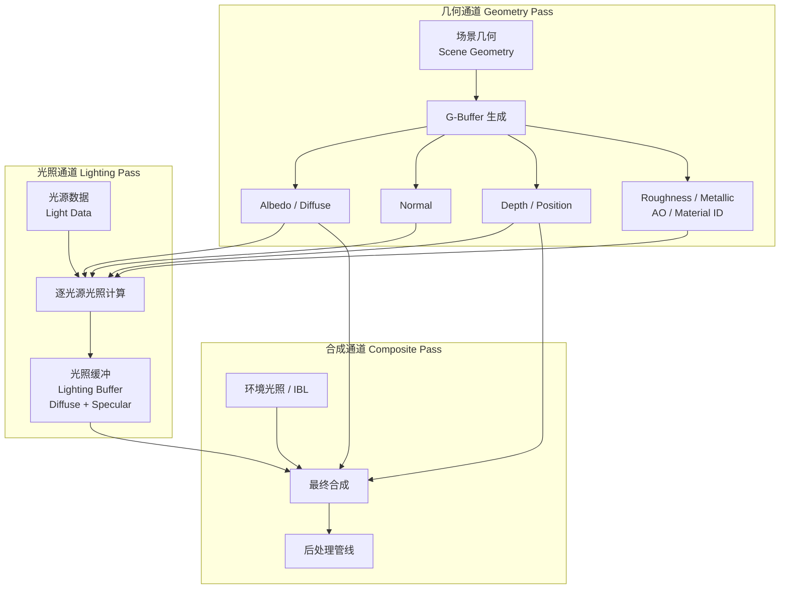
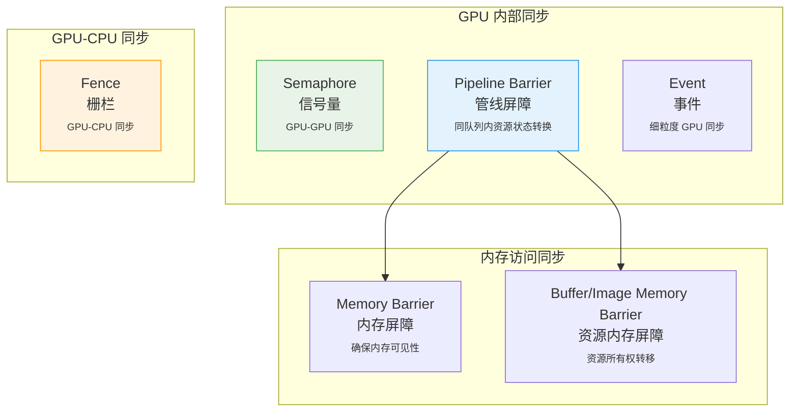
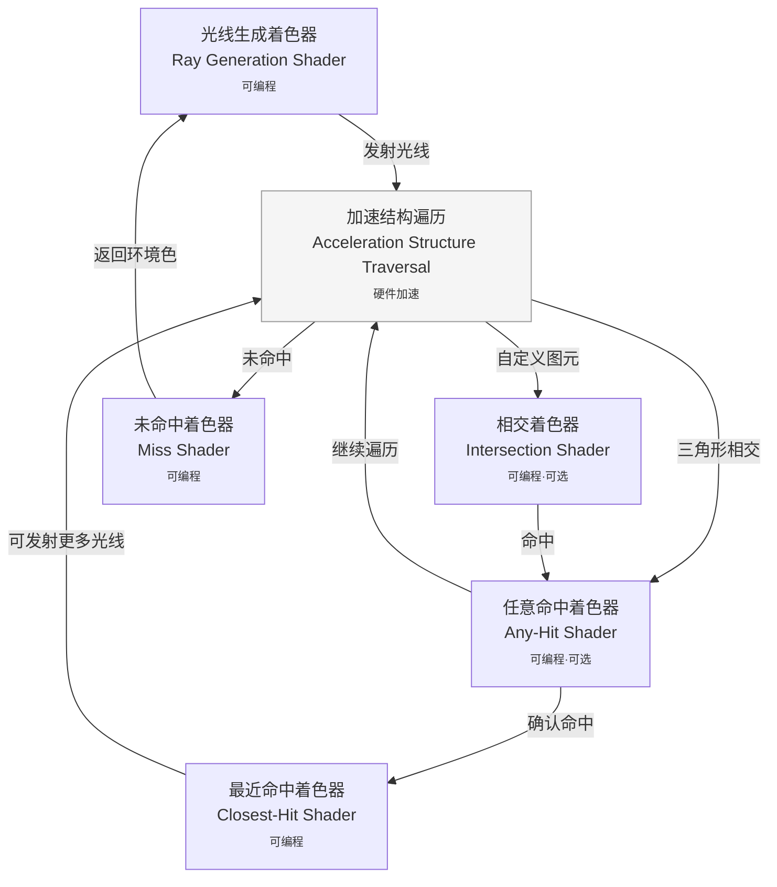
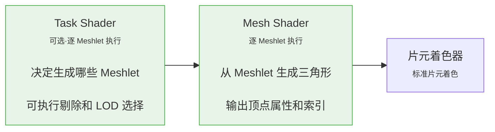
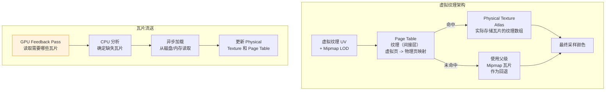

# 第三阶段：计算机图形学

计算机图形学（Computer Graphics）是游戏引擎开发中最核心的技术领域。从第一个三角形出现在屏幕上，到逼真的全局光照、复杂的材质系统和后处理管线，图形学决定了游戏视觉表现的边界。对于引擎开发工程师而言，深入理解图形学原理并精通现代 Graphics API 的编程模型，是不可或缺的核心能力。

本阶段的学习目标是建立从理论到实践的完整知识体系：我们首先剖析光栅化渲染管线的每个阶段，建立坚实的理论基础；随后深入 OpenGL、Vulkan 和 DirectX 12 三大主流 API 的编程模型，理解它们的设计哲学差异；最后探索 PBR、实时光线追踪、GPU Driven Rendering 等前沿技术。这一知识体系将直接支撑第四阶段渲染引擎架构的设计与实现。

---

## 3.1 计算机图形学理论基础

在接触任何 Graphics API 之前，我们必须先理解渲染管线的理论基础。这些原理独立于具体 API 存在——无论使用 OpenGL、Vulkan 还是 DirectX，光栅化的数学本质、光照模型的物理推导、纹理采样的信号处理原理都是相通的。本节将从光栅化管线出发，逐步建立完整的图形学理论框架。

### 3.1.1 光栅化渲染管线

光栅化（Rasterization）是实时渲染的核心机制，其本质是将三维几何场景转换为二维像素图像的过程。理解管线的每个阶段对引擎优化至关重要——瓶颈可能出现在顶点处理、片元着色或输出合并的任何环节。

#### 完整管线流程

现代 GPU 的渲染管线是一个高度并行化的多阶段处理流水线。下图展示了完整的管线结构，其中蓝色阶段为可编程阶段，灰色阶段为固定功能阶段：

```mermaid
graph LR
    A["顶点输入<br/>Vertex Input<br/><span style='font-size:11px'>固定功能</span>"] --> B["顶点着色器<br/>Vertex Shader<br/><span style='font-size:11px; color:#2196F3'>可编程</span>"]
    B --> C["曲面细分<br/>Tessellation<br/><span style='font-size:11px'>可选</span>"]
    C --> D["几何着色器<br/>Geometry Shader<br/><span style='font-size:11px; color:#2196F3'>可编程·可选</span>"]
    D --> E["图元装配<br/>Primitive Assembly<br/><span style='font-size:11px'>固定功能</span>"]
    E --> F["裁剪与透视除法<br/>Clipping & Perspective Divide<br/><span style='font-size:11px'>固定功能</span>"]
    F --> G["视口变换<br/>Viewport Transform<br/><span style='font-size:11px'>固定功能</span>"]
    G --> H["光栅化<br/>Rasterization<br/><span style='font-size:11px'>固定功能</span>"]
    H --> I["片元着色器<br/>Fragment Shader<br/><span style='font-size:11px; color:#2196F3'>可编程</span>"]
    I --> J["逐片元操作<br/>Per-Fragment Operations<br/><span style='font-size:11px'>固定功能</span>"]
    J --> K["帧缓冲<br/>Framebuffer<br/><span style='font-size:11px'>固定功能</span>"]

    style C fill:#f5f5f5,stroke:#999
    style D fill:#f5f5f5,stroke:#999
```



#### 阶段详解

**顶点输入阶段（Vertex Input）** 负责从内存中读取顶点数据。引擎在此阶段配置顶点属性布局（Vertex Attribute Layout），指定每个顶点包含的位置、法线、UV 等数据的内存格式和偏移。GPU 根据顶点缓冲（Vertex Buffer）和索引缓冲（Index Buffer）组装出完整的图元拓扑结构（点、线、三角形列表/条带/扇形）。顶点数据在 GPU 显存中的布局直接影响缓存效率——引擎应采用交错布局（Interleaved Layout，即单个顶点所有属性连续存储）而非平面布局（Planar Layout，即每种属性分别存储），因为交错布局能更好地利用顶点缓存的局部性原理。

**顶点着色器（Vertex Shader）** 是管线的第一个可编程阶段，对每个顶点执行一次。其核心任务是将顶点从模型局部坐标系变换到裁剪坐标系（Clip Space）。这个变换通常通过矩阵级联实现：

$$\mathbf{v}_{clip} = \mathbf{P} \cdot \mathbf{V} \cdot \mathbf{M} \cdot \mathbf{v}_{local}$$

其中 $\mathbf{M}$（Model Matrix）将局部坐标变换到世界坐标，$\mathbf{V}$（View Matrix）将世界坐标变换到相机观察空间，$\mathbf{P}$（Projection Matrix）执行透视或正交投影。这三个矩阵通常在 CPU 端计算并作为 Uniform 传递给着色器。顶点着色器还负责将法线、切线等向量变换到合适的坐标空间（通常是观察空间或世界空间），为后续的光照计算做准备。

**曲面细分阶段（Tessellation）** 是可选的可编程阶段，由外壳着色器（Hull Shader）、细分器（Tessellator）和域着色器（Domain Shader）组成。它允许根据视图距离或屏幕空间占有率动态增加几何细节。例如地形渲染中，远处地块使用低细分级别，近处高细分级别，实现 LOD 的连续过渡。DirectX 11 引入的硬件曲面细分是地形和角色渲染的重要工具。

**几何着色器（Geometry Shader）** 在图元装配之后执行，对每个完整图元（而非单个顶点）进行处理。它可以输出零个或多个图元，常用于公告牌（Billboard）渲染、几何体膨胀（Shell 渲染用于毛发/草皮效果）和流输出（Stream Output，将变换后的顶点写回缓冲区）。但由于其并行效率较低（输出量不确定导致线程分歧），现代引擎更倾向于使用计算着色器或 Mesh Shader 替代。

**图元装配与裁剪（Primitive Assembly & Clipping）** 是固定功能阶段。图元装配将顶点组装为三角形、线段或点，然后进行视锥裁剪（View Frustum Clipping）。裁剪在齐次裁剪空间（Homogeneous Clip Space）中进行，确保只保留位于视锥内的几何体部分。随后执行透视除法（Perspective Division），将齐次坐标转换为归一化设备坐标（Normalized Device Coordinates, NDC）：

$$\mathbf{v}_{ndc} = \begin{bmatrix} x_c/w_c \\ y_c/w_c \\ z_c/w_c \end{bmatrix}$$

NDC 空间是一个左手或右手坐标系（取决于 API），所有可见顶点的坐标范围在 $[-1, 1]$ 之内。

**视口变换（Viewport Transform）** 将 NDC 空间的坐标映射到屏幕空间像素坐标。这个变换是线性的，由视口的左上角位置和宽高决定：

$$x_{screen} = \frac{w}{2} \cdot x_{ndc} + (x + \frac{w}{2})$$
$$y_{screen} = \frac{h}{2} \cdot (-y_{ndc}) + (y + \frac{h}{2})$$

注意 Y 轴翻转——NDC 中 $y=1$ 对应屏幕顶部，而大多数 API 中屏幕坐标的原点在左上角。

**光栅化（Rasterization）** 是整个管线中最关键的阶段。它确定哪些像素（更准确地说是片元，Fragment）被三角形覆盖。光栅化的核心算法是边缘函数法（Edge Function Method），通过计算采样点相对于三角形三条边的有符号距离来判断点是否在三角形内部。对于由顶点 $\mathbf{v}_0, \mathbf{v}_1, \mathbf{v}_2$ 定义的三角形，边缘函数定义为：

$$E_{ij}(\mathbf{p}) = (\mathbf{v}_j - \mathbf{v}_i) \times (\mathbf{p} - \mathbf{v}_i)$$

当且仅当 $E_{01}(\mathbf{p}) \geq 0$、$E_{12}(\mathbf{p}) \geq 0$、$E_{20}(\mathbf{p}) \geq 0$（对逆时针三角形）时，点 $\mathbf{p}$ 位于三角形内部。GPU 利用这种函数的线性特性，通过增量计算高效地遍历三角形覆盖的像素块。

光栅化阶段还负责顶点属性的插值。顶点着色器输出的属性（颜色、UV、法线等）需要在三角形内部进行线性插值。但直接在屏幕空间插值会导致透视错误——透视校正插值（Perspective-Correct Interpolation）通过对 $1/w$ 和 $a/w$ 进行线性插值来保证插值结果在三维空间中的线性：

$$a_{correct} = \frac{\text{lerp}(a_0/w_0, a_1/w_1)}{\text{lerp}(1/w_0, 1/w_1)}$$

其中 $\text{lerp}$ 表示屏幕空间的双线性插值。所有现代 GPU 在硬件层面自动执行透视校正插值，开发者通常无需手动处理，但理解这一原理对调试 UV 扭曲等问题至关重要。

**片元着色器（Fragment Shader）** 是管线中计算密度最高的阶段，对每个光栅化生成的片元执行一次。片元着色器的核心任务包括：纹理采样、光照计算、材质属性评估。由于逐像素执行的计算量极大，片元着色器的性能直接影响整体渲染效率——引擎优化中常提到的"Overdraw"（重复绘制）问题，就是指多个不透明片元对同一像素进行冗余计算。

**逐片元操作（Per-Fragment Operations）** 包含深度测试、模板测试、混合等固定功能操作。深度测试（Depth Test）通过比较片元深度值与深度缓冲中存储的值来决定片元是否可见：

$$\text{visible} = \text{CompareOp}(z_{fragment}, z_{buffer})$$

混合（Blending）用于透明物体的渲染，将源片元颜色与目标帧缓冲颜色按混合因子组合：

$$\mathbf{C}_{result} = \mathbf{C}_{src} \cdot F_{src} + \mathbf{C}_{dst} \cdot F_{dst}$$

标准的 Alpha 混合使用 $F_{src} = \alpha_{src}$ 和 $F_{dst} = 1 - \alpha_{src}$。

| 管线阶段 | 可编程性 | 执行频率 | 主要任务 | 性能敏感因素 |
|:---------|:---------|:---------|:---------|:-------------|
| 顶点输入 | 固定功能 | 每顶点 | 数据读取、拓扑组装 | 顶点缓冲布局、带宽 |
| 顶点着色器 | 可编程 | 每顶点 | 坐标变换、属性传递 | 顶点数量、着色复杂度 |
| 曲面细分 | 可编程（可选） | 每 Patch | 动态 LOD、细节增加 | 细分级别、输出顶点数 |
| 几何着色器 | 可编程（可选） | 每图元 | 图元处理、流输出 | 输出图元数量（分歧） |
| 图元装配与裁剪 | 固定功能 | 每图元 | 裁剪、透视除法 | 几何复杂度 |
| 光栅化 | 固定功能 | 每图元 | 片元生成、属性插值 | 三角形面积、填充率 |
| 片元着色器 | 可编程 | 每片元 | 纹理采样、光照计算 | Overdraw、纹理带宽 |
| 逐片元操作 | 固定功能 | 每片元 | 深度/模板测试、混合 | 带宽、Early-Z 效率 |

上表梳理了管线各阶段的关键属性。理解每个阶段的执行频率和性能敏感因素，是进行渲染优化的基础。例如，当场景顶点数极高但每个三角形覆盖的像素很少时（如密集网格），瓶颈通常在顶点着色器阶段；相反，当大三角形覆盖大量像素且片元着色器复杂时，瓶颈则在片元着色器阶段。引擎开发中常用的性能分析工具（如 RenderDoc、PIX、NSight）可以精确显示每个阶段的耗时，帮助定位瓶颈。

#### 可编程阶段与固定功能阶段的演进

GPU 架构经历了从固定功能到通用计算平台的演进。早期的 GPU（如 1999 年的 GeForce 256）几乎所有阶段都是固定的；2001 年的 GeForce 3 首次引入了可编程顶点着色器；2002 年的 Radeon 9700 推出了可编程片元着色器。这种演进趋势反映了硬件设计者对灵活性与效率的权衡——固定功能阶段以极高的效率执行确定性的操作（如光栅化、深度测试），而可编程阶段则赋予开发者表达复杂算法的能力。

现代 GPU（NVIDIA Turing/Ada、AMD RDNA、Intel Xe）的可编程能力已经扩展到计算着色器（Compute Shader），可以完全脱离传统渲染管线进行通用 GPU 计算。这一趋势催生了基于计算管线的渲染方案（如计算着色器视锥剔除、GPU Driven Rendering），我们将在后续章节详细讨论。

### 3.1.2 颜色科学与色彩空间

图形学中"颜色"的处理比直觉复杂得多。从物理光照的线性叠加到显示设备的非线性响应，颜色科学贯穿渲染管线的始终。忽略这些细节会导致混合错误、光照不自然等视觉问题。

#### RGB 颜色模型与加色原理

RGB（Red, Green, Blue）模型基于三原色加色原理：通过不同比例的红、绿、蓝光叠加来产生各种颜色。在物理层面，颜色是光谱功率分布（Spectral Power Distribution, SPD）——不同波长光的强度分布。RGB 模型是对无限维 SPD 的三维近似，其基础是 CIE 1931 标准观察者色匹配函数。

计算机中的 RGB 值通常用归一化的浮点数 $[0, 1]$ 或 8 位无符号整数 $[0, 255]$ 表示。对于物理正确的光照计算，必须使用浮点表示——光照能量的线性叠加很容易超出 $[0, 1]$ 范围。这也是 HDR（High Dynamic Range）渲染的基础。

#### 线性工作流与 Gamma 校正

显示设备（CRT、LCD、OLED）对输入信号的响应是非线性的。这个非线性响应大致符合幂函数关系，指数称为 Gamma（$\gamma \approx 2.2$）。如果直接将线性光照计算结果输出到显示器，暗部会显得过于明亮，整体画面发灰。

正确的颜色管线要求：所有光照计算（纹理混合、光照叠加、混合）在线性空间进行；最终结果输出到显示器前进行 Gamma 校正（Gamma Correction），即应用 $1/\gamma$ 的幂变换：

$$V_{encoded} = V_{linear}^{1/\gamma}$$

$$V_{linear} = V_{encoded}^{\gamma}$$

常见错误是直接在 Gamma 编码的颜色上进行光照计算。例如，将两张纹理相乘时，如果纹理存储的是 Gamma 编码值，乘法操作实际上执行的是：

$$(A^{\gamma} \cdot B^{\gamma}) = (A \cdot B)^{\gamma} \neq (A \cdot B)^{1/\gamma}$$

结果不是正确的线性响应。正确的流程是：先将纹理从 sRGB 空间解码到线性空间，执行所有光照计算，最后对输出进行 Gamma 编码。

| 纹理类型 | 存储空间 | 是否需要 sRGB 解码 | 原因 |
|:---------|:---------|:-------------------|:-----|
| Albedo / Diffuse | sRGB | 是 | 表示反射率，物理量在线性空间 |
| Normal Map | 线性 | 否 | 法线向量本身就是线性量 |
| Roughness/Metallic | 线性 | 否 | PBR 参数是物理线性量 |
| Ambient Occlusion | 线性 | 否 | 遮蔽值是线性比例 |
| HDR Environment Map | 线性（浮点） | 否 | 存储线性辐射度 |
| Light Map | 线性（通常 HDR） | 否 | 预计算的光照结果是线性的 |
| UI / 照片纹理 | sRGB | 视用途而定 | 直接显示时需要保持 sRGB |

上述表格列出了常见纹理的存储空间选择。引擎的纹理导入管线应根据纹理用途自动设置正确的颜色空间——Albedo 纹理需要从 sRGB 解码，而 Roughness 和 Normal 纹理直接使用线性值。现代 Graphics API 提供了 sRGB 纹理格式（如 `GL_SRGB8_ALPHA8`、`VK_FORMAT_R8G8B8A8_SRGB`），硬件在采样时自动执行 sRGB 到线性的转换，简化了着色器代码。

#### sRGB 色域与宽色域

sRGB 是 1996 年由 HP 和 Microsoft 定义的标准色彩空间，定义了红、绿、蓝三原色的色度坐标和白点。其色域（Gamut）——即可表示的颜色范围——覆盖了人类视觉可见颜色的一部分。大多数显示器设计为覆盖 sRGB 色域。

高端显示器支持更宽的色域，如 DCI-P3（色域比 sRGB 大约 25%，尤其在红色和绿色区域）和 Rec.2020（超高清电视标准，色域极大）。现代引擎和操作系统（macOS、Windows 11、iOS、Android）开始支持广色域渲染，核心挑战是：引擎渲染管线的工作色域必须至少与目标显示色域一样宽，且需要正确的色域转换矩阵来将渲染结果映射到不同显示设备的色域。

#### HDR 与色调映射

HDR（High Dynamic Range）渲染允许光照计算的中间结果超出显示设备的 $[0, 1]$ 亮度范围。物理世界的亮度动态范围极广：室内阴影约为 $1 \text{ cd/m}^2$，阳光下的雪可达 $100000 \text{ cd/m}^2$。HDR 渲染管线通过浮点帧缓冲（FP16 或 R11G11B10）保留这种高动态范围。

但显示器的亮度范围有限（SDR 显示器约 $100 \text{ cd/m}^2$），因此需要色调映射（Tone Mapping）将 HDR 值压缩到显示范围。色调映射不仅是简单的截断或缩放——良好的色调映射应保留局部对比度，避免"过曝"或"欠曝"。经典的 Reinhard 色调映射公式为：

$$L_{mapped} = \frac{L_{hdr}}{1 + L_{hdr}}$$

这个公式将 $[0, \infty)$ 映射到 $[0, 1)$，但暗部对比度损失较大。ACES（Academy Color Encoding System）色调映射曲线是当前业界标准，它在暗部保持对比度，在高光部分提供柔和的"肩膀"压缩，比 Reinhard 产生更自然的视觉效果。我们将在 3.3.3 节提供 ACES 色调映射的完整实现。

### 3.1.3 光照模型演进

光照模型（Lighting Model / Shading Model）描述了光线与材质表面的交互方式。从早期的经验模型到基于物理的模型，光照理论的演进直接推动了实时渲染质量的飞跃。

#### Lambert 漫反射模型

漫反射（Diffuse Reflection）描述光线进入材质表面内部、发生多次散射后从表面各方向均匀反射的现象。Lambert 模型是最基础的漫反射近似，它假设反射辐射度与观察方向无关，仅取决于入射光方向和表面法线的夹角：

$$f_{lambert} = \frac{\mathbf{c}_{diffuse}}{\pi}$$

其中 $\mathbf{c}_{diffuse}$ 是材质的漫反射颜色（Albedo），$\pi$ 是归一化因子，确保能量守恒——即半球积分的结果不超过 1：

$$\int_{\Omega} f_{lambert} \cos\theta_i \, d\omega_i = \mathbf{c}_{diffuse} \leq 1$$

Lambert 模型虽然在物理上做了大量简化（忽略了表面微观结构和次表面散射），但对于不透明材质的漫反射分量提供了合理的近似，且计算成本极低。

#### Phong 与 Blinn-Phong 高光模型

Phong 高光模型描述了镜面反射（Specular Reflection）——光线在光滑表面按反射定律集中反射的现象。Phong 模型通过反射方向 $\mathbf{R}$ 和观察方向 $\mathbf{V}$ 的夹角来量化镜面反射强度：

$$f_{phong} = k_s \cdot (\mathbf{R} \cdot \mathbf{V})^{\alpha}$$

其中 $k_s$ 是镜面反射系数，$\alpha$ 是光滑度指数（越大高光越锐利）。Phong 模型需要逐光源计算反射向量 $\mathbf{R} = 2(\mathbf{N} \cdot \mathbf{L})\mathbf{N} - \mathbf{L}$。

Blinn-Phong 模型用半角向量（Halfway Vector）$\mathbf{H} = \frac{\mathbf{L} + \mathbf{V}}{|\mathbf{L} + \mathbf{V}|}$ 替代了反射向量：

$$f_{blinn-phong} = k_s \cdot (\mathbf{N} \cdot \mathbf{H})^{\alpha'}$$

Blinn-Phong 的优势在于当光源和观察方向都在无穷远处时（方向光 + 正交相机），$\mathbf{H}$ 对所有片元是常量，减少了逐片元的计算量。此外，Blinn-Phong 的高光分布比 Phong 更接近某些真实材质。$\alpha'$ 通常取为 Phong 指数的 $4$ 倍左右以获得相似的视觉锐利度。

但 Phong/Blinn-Phong 模型存在根本性的物理缺陷：首先，它们没有能量守恒——高光强度可以任意大，且模型没有保证反射能量不超过入射能量；其次，高光与漫反射是独立控制的参数（$k_d$ 和 $k_s$），缺乏物理关联——真实材质中高光和漫反射竞争同一能量。这些缺陷推动了 BRDF 理论的发展。

#### BRDF 基础与反射方程

BRDF（Bidirectional Reflectance Distribution Function，双向反射分布函数）是描述表面反射的通用数学框架。它定义了从入射方向 $\omega_i$ 到出射方向 $\omega_o$ 的光线反射比例：

$$f_r(\omega_i, \omega_o) = \frac{dL_o(\omega_o)}{L_i(\omega_i) \cos\theta_i \, d\omega_i}$$

BRDF 必须满足两个基本约束：**互换性（Reciprocity）** $f_r(\omega_i, \omega_o) = f_r(\omega_o, \omega_i)$ 和 **能量守恒** $\int_{\Omega} f_r(\omega_i, \omega_o) \cos\theta_o \, d\omega_o \leq 1$。

基于 BRDF 的反射方程描述了表面某点在所有入射光照下的总出射辐射度：

$$L_o(\mathbf{p}, \omega_o) = \int_{\Omega} f_r(\mathbf{p}, \omega_i, \omega_o) \cdot L_i(\mathbf{p}, \omega_i) \cdot \cos\theta_i \, d\omega_i$$

这个积分方程是渲染的核心——所有光照计算本质上都是在求解或近似这个积分。实时渲染中的挑战在于，精确求解这个积分需要对半球上所有入射方向进行采样，计算量巨大。各种光照模型的本质就是对这一积分的不同近似策略。

#### PBR（基于物理的渲染）核心理论

PBR（Physically Based Rendering）不是单一模型，而是一套遵循物理原理的渲染方法论。其核心理念包括：

**微表面模型（Microfacet Model）** 假设宏观表面由大量微观镜面平面（微表面）组成。表面的粗糙度决定了微表面法线的分布——光滑表面微法线集中朝向宏观法线，粗糙表面则分布广泛。Cook-Torrance BRDF 是实时 PBR 的标准微表面模型：

$$f_{cook-torrance} = \frac{D(\mathbf{h}) \cdot F(\mathbf{v}, \mathbf{h}) \cdot G(\mathbf{l}, \mathbf{v}, \mathbf{h})}{4(\mathbf{n} \cdot \mathbf{l})(\mathbf{n} \cdot \mathbf{v})}$$

其中 $D$ 是法线分布函数（NDF），$F$ 是菲涅尔方程，$G$ 是几何遮蔽函数。这三项分别描述了微表面的三个关键物理现象，我们将在 3.3.1 节详细推导每一项的物理意义和具体公式。

**金属度-粗糙度工作流（Metallic-Roughness Workflow）** 是游戏引擎中最常用的 PBR 参数化方案。它使用两个纹理参数来控制材质属性：

- **Metallic（金属度）**：二元参数，$0$ 表示非金属（介质），$1$ 表示金属。金属的漫反射为黑色，反射带有颜色（如金、铜）；非金属有彩色漫反射和中性白色镜面反射。
- **Roughness（粗糙度）**：$0$ 表示理想镜面，$1$ 表示完全漫反射表面。直接控制法线分布函数 $D$ 中的分布参数。

这种参数化方案的优点是参数直观、纹理通道利用率高（通常 Metalness 和 Roughness 各占一个通道），且能表示绝大多数真实世界材质。

### 3.1.4 纹理映射技术

纹理映射（Texture Mapping）是将二维图像数据映射到三维几何表面的过程。它是增加表面视觉复杂度而不增加几何复杂度的核心技术。

#### UV 展开原理

UV 坐标是三维表面在二维纹理空间中的参数化表示。每个顶点关联一个二维坐标 $(u, v) \in [0, 1]^2$，光栅化阶段通过透视校正插值在三角形内部生成连续的 UV 坐标，用于从纹理图像中采样颜色。

UV 展开的质量直接影响纹理的拉伸和接缝可见性。对于复杂模型，通常需要专业美术使用 Maya、Blender、RizomUV 等工具进行手动或半自动 UV 展开。引擎开发中，程序化生成的几何（如地形、Impostor）需要算法自动生成 UV——例如球面投影、圆柱投影或基于参数化曲面的展开。

#### 纹理过滤

纹理过滤（Texture Filtering）解决当屏幕像素与纹理像素（Texel）的比例不为 1:1 时的采样问题。主要有以下几种过滤模式：

| 过滤模式 | 原理 | 质量 | 性能开销 | 适用场景 |
|:---------|:-----|:-----|:---------|:---------|
| 最近邻（Nearest） | 取最近 Texel 的颜色 | 最低，出现马赛克 | 极低 | 像素风格游戏、Debug |
| 双线性（Bilinear） | 在 2x2 Texel 邻域内线性插值 | 中等，轻微模糊 | 低 | 2D 游戏、简单 3D 场景 |
| 三线性（Trilinear） | Bilinear + Mipmap 层级间插值 | 较好，减少 Mipmap 跳变 | 中 | 一般 3D 场景 |
| 各向异性（Anisotropic） | 沿像素投影方向采样多个 Texel | 最高，斜视角清晰 | 较高（2x-16x） | 地形、地面纹理 |

各向异性过滤（Anisotropic Filtering, AF）解决了当表面法线接近垂直于观察方向时（如远处的地面），屏幕像素在纹理空间中投影为长而窄的椭圆的问题。标准双线性/三线性过滤假设纹理空间中的采样区域是正方形，而 AF 允许沿投影方向采样更多 Texel。AF 的质量由采样率表示（2x、4x、8x、16x），数字越大沿长轴采样越多。现代 GPU 在 16x AF 下的性能损失通常小于 10%，因此建议在高画质设置中默认启用。

#### Mipmap 生成原理与 LOD 选择

Mipmap 是一组预先计算的纹理图像金字塔，每一层分辨率是上一层的 $1/2 \times 1/2$。Mipmap 的生成不仅是简单的下采样——使用盒式滤波器（Box Filter）会导致混叠（Aliasing），正确的做法是对每一层执行高质量的下采样滤波。

Mipmap 层级（LOD, Level of Detail）的选择基于屏幕像素在纹理空间中的覆盖范围。纹理坐标对屏幕坐标的偏导数 $\partial u / \partial x$、$\partial u / \partial y$、$\partial v / \partial x$、$\partial v / \partial y$（由 GPU 硬件计算）决定了纹理空间中的采样面积：

$$\lambda = \log_2\left(\max\left(\sqrt{\left(\frac{\partial u}{\partial x}\right)^2 + \left(\frac{\partial v}{\partial x}\right)^2}, \sqrt{\left(\frac{\partial u}{\partial y}\right)^2 + \left(\frac{\partial v}{\partial y}\right)^2}\right) \cdot w\right)$$

其中 $\lambda$ 是 Mipmap LOD 层级，$w$ 是纹理宽度。GPU 根据 $\lambda$ 选择对应的 Mipmap 层级进行采样。启用三线性过滤时，还会对相邻两个层级进行插值。

#### 纹理环绕模式

当 UV 坐标超出 $[0, 1]$ 范围时，环绕模式（Wrap Mode）定义了如何确定采样值：

- **Repeat（重复）**：小数部分取模，纹理平铺
- **Clamp（钳制）**：超出范围的部分取边界值，避免接缝
- **Mirror（镜像）**：纹理交替翻转平铺，减少平铺重复感
- **Border Color（边界颜色）**：超出范围的部分返回指定颜色

Repeat 模式是最常用的——它允许用一张小纹理覆盖大面积表面，但要求纹理设计为无缝平铺（Tileable）。Clamp 模式用于 UI 元素和不应平铺的纹理。Mirror 模式在某些特定场景（如水面反射）中使用。

### 3.1.5 抗锯齿技术

锯齿（Aliasing）是数字图像中由采样率不足引起的一种 artifacts——几何边缘呈现阶梯状，高频细节产生摩尔纹。抗锯齿（Anti-Aliasing, AA）技术的本质是提高有效采样率或通过后处理减少锯齿可见性。

#### 锯齿成因分析

锯齿的根源是采样定理（Nyquist-Shannon Sampling Theorem）：要从离散采样中完全重建连续信号，采样频率必须至少是信号最高频率的两倍。在渲染中，图像边缘（几何轮廓、纹理边界）对应信号中的高频分量，而像素网格的采样率往往不足以捕获这些高频信息，导致频谱混叠（Spectral Aliasing）——高频信号"伪装"成低频信号，表现为锯齿和闪烁。

#### SSAA 与 MSAA

| 技术 | 原理 | 质量 | 性能开销 | 内存开销 | 主要限制 | 适用场景 |
|:-----|:-----|:-----|:---------|:---------|:---------|:---------|
| SSAA | 整个场景以更高分辨率渲染，然后下采样 | 最高，全面抗锯齿 | 极高（4x = 4倍像素） | 极高 | 片元着色器全量执行 | 静态截图、极高画质预设 |
| MSAA | 仅在光栅化阶段多采样，片元着色器每像素执行一次 | 高，几何边缘平滑 | 中等（4x ≈ 1.5-2倍） | 较高 | 延迟渲染管线不兼容 | 前向渲染、传统 3D 游戏 |
| FXAA | 后处理边缘检测与模糊 | 低-中等，可能模糊纹理 | 极低 | 无额外 | 不能处理亚像素细节 | 性能敏感场景、手游 |
| SMAA | 改进的边缘检测，模式识别 | 中等，优于 FXAA | 低 | 无额外 | 仍可能误判边缘 | 平衡质量与性能的选择 |
| TAA | 利用时间累积，子像素抖动采样 | 很高，接近 MSAA 4x | 中等 | 需要历史缓冲 | 运动场景产生鬼影 | 现代 3A 游戏标配 |
| DLSS/FSR/XeSS | AI/时序上采样，内建抗锯齿 | 极高 | 较低（运行在网络） | 需要运动向量等 | 需要特定硬件支持 | 新一代游戏标准 |

**SSAA（Super Sample Anti-Aliasing，超采样抗锯齿）** 是最朴素的抗锯齿方法：将场景渲染到 $N$ 倍分辨率的缓冲中，然后通过下采样滤波（通常是高斯或盒式滤波）得到最终图像。例如 4x SSAA 渲染到 $2\times$ 宽、$2\times$ 高的分辨率。SSAA 提供了最佳的图像质量——几何边缘、着色器高频、纹理细节都能得到平滑。但其代价是片元着色器执行次数与分辨率成正比，4x SSAA 意味着片元着色器执行 4 倍，这对现代复杂片元着色器是不可接受的。

**MSAA（Multi-Sample Anti-Aliasing，多重采样抗锯齿）** 是对 SSAA 的关键优化。它认识到大多数锯齿出现在三角形边缘（ coverage 变化处），而三角形内部的着色通常是低频的。因此 MSAA 在光栅化阶段对每个像素执行多个采样点（Coverage Sample），判断每个采样点被哪些三角形覆盖；但片元着色器只在三角形内部执行一次，执行结果被复制到该三角形覆盖的所有采样点。只有在三角形边缘（即一个像素被多个三角形覆盖时），才需要执行多次片元着色器。这种优化使得 4x MSAA 的性能开销通常在 1.5-2 倍之间，远低于 4x SSAA。

MSAA 的局限性在于：首先，它与延迟渲染管线天然不兼容——延迟渲染的 G-Buffer 生成阶段没有几何信息来执行多重采样；其次，MSAA 不能解决着色器内部的锯齿（如高光闪烁、Alpha Test 边缘）。这些限制推动了后处理抗锯齿和时间性抗锯齿的发展。

#### 后处理抗锯齿

**FXAA（Fast Approximate Anti-Aliasing）** 是纯后处理抗锯齿，不需要任何额外的几何或颜色缓冲。它通过对屏幕图像进行亮度边缘检测，找到高对比度边缘并进行局部模糊来减少锯齿。FXAA 的优点是性能开销极低（通常小于 1ms）、无额外内存需求、与任何渲染管线兼容。缺点是容易对非边缘区域（如纹理细节）产生不必要的模糊，且对子像素级别的锯齿无效。

**SMAA（Subpixel Morphological Anti-Aaliasing）** 改进了 FXAA 的边缘检测算法，通过模式识别（Pattern Recognition）更精确地定位边缘，并使用局部对比度自适应的混合策略，减少了纹理模糊。SMAA 提供了接近 MSAA 的视觉质量，同时保持了后处理抗锯齿的兼容性和低内存开销。

#### 时间性抗锯齿（TAA）

TAA（Temporal Anti-Aliasing）是现代 3A 游戏中最主流的抗锯齿方案。它利用了时序维度的信息：每帧对投影矩阵施加一个子像素偏移（Jitter），使得相邻帧采样的是略微不同的子像素位置；然后通过帧间混合（通常使用指数移动平均）累积历史颜色：

$$\mathbf{C}_{current} = \alpha \cdot \mathbf{C}_{new} + (1 - \alpha) \cdot \mathbf{C}_{history}$$

其中 $\alpha$ 通常取 $0.1$ 左右，意味着历史颜色占主导，当前帧贡献较小。TAA 的核心优势在于：对于静态画面，$N$ 帧的累积等效于 $N$ 倍超采样的效果；对于动态画面，有效采样率仍然高于单帧。

TAA 的实现需要解决几个关键技术问题：首先是**重投影（Reprojection）**——需要根据场景运动和相机运动，将历史帧的像素坐标变换到当前帧坐标，以找到对应的累积位置。这需要每帧生成运动向量（Motion Vector，即场景在屏幕空间的速度场）。其次是**鬼影（Ghosting）**问题——当遮挡关系发生变化（如物体移动揭露新背景）时，累积的历史颜色可能来自被遮挡的物体，导致拖影。解决方案包括深度测试、邻域裁剪（Neighborhood Clipping）——将历史颜色限制在当前像素 3x3 邻域的颜色包围盒内，以及基于运动向量长度调整混合因子。

TAA 与超分辨率技术（DLSS、FSR 2.0、XeSS）结合使用已成为现代游戏的标准做法。这些技术本质上是在 TAA 的基础上增加了上采样步骤，以较低的内部渲染分辨率达到接近原生分辨率的视觉效果。

### 3.1.6 延迟渲染与前向渲染

场景中的光照计算是所有渲染方案的核心。前向渲染（Forward Rendering）和延迟渲染（Deferred Rendering）是两种主要的光照架构，各有其适用场景。

#### 前向渲染管线流程与优缺点

前向渲染是最直接的渲染方式：对每个物体，遍历所有影响它的光源，在片元着色器中执行光照计算。其伪代码如下：

```cpp
// 前向渲染伪代码
for each object in scene:
    bind(object.material)
    for each light affecting object:
        bind(light)
        draw(object)
        // 累加到帧缓冲（使用 Additive Blending）
```

前向渲染的优点是：支持透明物体（因为着色时访问了完整的材质属性和光照信息）；支持逐物体的材质多样性（每个物体可以使用完全不同的着色器）；内存开销低（不需要额外的 G-Buffer）。

其致命缺点是光源数量带来的复杂度爆炸。假设场景有 $M$ 个物体和 $N$ 个光源，每个物体平均受 $K$ 个光源影响，则总绘制调用复杂度为 $O(M \cdot K)$。当 $N$ 很大时（如开放世界中的数十个点光源），性能急剧下降。传统的优化方案是限制逐像素光源数量（如早期 OpenGL 固定管线的 8 光源限制），但这限制了场景的视觉丰富度。

#### 延迟渲染与 G-Buffer 设计

延迟渲染（Deferred Rendering）将光照计算与几何渲染解耦：首先将所有不透明物体的材质属性渲染到一组屏幕空间纹理中（称为 G-Buffer，Geometry Buffer），然后对每个光源执行一次全屏或局部 Pass，读取 G-Buffer 中的数据执行光照计算，将结果累加到光照缓冲中。



G-Buffer 的布局设计是延迟渲染的关键决策。设计目标是在信息完整性和带宽之间取得平衡——每个额外的 G-Buffer 纹理都意味着几何 Pass 的带宽增加。

| G-Buffer 布局方案 | 包含数据 | 纹理数量 | 带宽 | 适用场景 |
|:-------------------|:---------|:---------|:-----|:---------|
| 紧凑布局 | Albedo(RGB8)+Roughness, Normal(RG16f)+Metallic, Depth(R32f) | 3 | 较低 | 基础 PBR |
| 标准布局 | Albedo(RGBA8), Normal(RGBA16f), Depth(R32f), Material(RGBA8) | 4 | 中等 | 标准 PBR |
| 扩展布局 | + Emissive, + AO, + Subsurface, + Material ID | 6-8 | 较高 | 复杂材质 |
| 简化布局 | Albedo+Normal(合并在 RGBA16f), Depth | 2 | 低 | 移动端、性能敏感 |

紧凑布局将 Roughness 打包到 Albedo 的 Alpha 通道，将 Metallic 打包到 Normal 的 Alpha 通道或 Blue 通道（Normal 可以重建 Z 分量，只需存储 XY），在保持功能完整的同时减少纹理数量。深度纹理（Depth）可以从 Depth Pre-Pass 复用，或者直接从深度缓冲复制。MRT（Multiple Render Targets）技术允许几何 Pass 同时输出到多个纹理。

延迟渲染的核心优势是光照复杂度从 $O(M \cdot K)$ 降低到 $O(N_{pixels} + N_{lights})$——每个光源只影响其光照范围内的像素。对于大量光源的场景，这是数量级的性能提升。通过模板测试或 Light Volume 几何体，可以精确限制每个光源的受影响像素范围。

延迟渲染的主要限制是：不支持透明物体（没有深度信息来排序和混合），需要额外的前向渲染 Pass 处理透明物体；G-Buffer 带宽高，对填充率敏感；不支持 MSAA（G-Buffer 的多重采样开销极大）；材质多样性受限（所有物体使用统一的 G-Buffer 布局）。

#### Forward+ / Clustered 渲染

为了结合前向渲染的灵活性和延迟渲染的光照效率，业界发展了 **Forward+（Tile-based Forward Rendering）** 和 **Clustered Rendering** 方案。

Forward+ 的工作流程是：首先执行一个深度预 Pass（Depth Pre-Pass），仅写入深度缓冲，禁用颜色输出。然后基于深度缓冲，将屏幕划分为 $N \times N$（通常为 8x8 或 16x16）的 Tile，对每个 Tile 根据深度范围确定哪些光源可能影响该 Tile 内的像素。最后在前向渲染的片元着色器中，只遍历与该像素所在 Tile 关联的光源进行光照计算。

Clustered Rendering 进一步将视锥体在深度方向上划分为对数分布的 Cluster（簇），形成一个 3D 的 Tile-Cluster 网格。这种划分更符合透视投影的特性——远处物体在屏幕上的面积小但深度范围大，近处则相反。每个 Cluster 维护一个可能影响它的光源列表，片元着色器根据像素位置确定所属 Cluster，只遍历相关光源。

| 方案 | 核心思想 | 光源复杂度 | 透明物体 | MSAA | 材质灵活性 | 额外开销 |
|:-----|:---------|:-----------|:---------|:-----|:-----------|:---------|
| Forward | 逐物体逐光源 | $O(M \cdot K)$ | 原生支持 | 支持 | 完全灵活 | 无 |
| Deferred | G-Buffer + 逐像素光源 | $O(Pixel + N)$ | 需额外 Pass | 不支持 | 受限 | G-Buffer 带宽 |
| Forward+ | Tile 光源剔除 + Forward | $O(M \cdot K_{tile})$ | 原生支持 | 支持 | 完全灵活 | 光源剔除 Pass |
| Clustered | 3D Cluster 光源剔除 | $O(M \cdot K_{cluster})$ | 原生支持 | 支持 | 完全灵活 | 光源剔除 Pass |

Clustered Rendering 已成为现代引擎（如 Unity HDRP、Unreal Engine 4+、Frostbite）的默认渲染方案，它在保持前向渲染优势的同时，通过高效的光源剔除实现了对大量光源的支持。

### 3.1.7 阴影技术

阴影是增强场景深度感和空间关系的最重要视觉线索。实时阴影技术需要在质量、性能和内存之间做出权衡。

#### Shadow Map 原理与实现

Shadow Map（阴影贴图）是实时渲染中最广泛使用的阴影技术，由 Lance Williams 于 1978 年提出。其核心思想是从光源视角渲染场景的深度信息，存储为一张深度纹理；在正式渲染时，将片元位置变换到光源空间，与 Shadow Map 中存储的深度比较，判断该片元是否被遮挡。

实现 Shadow Map 需要两次渲染过程：

1. **Shadow Pass**：从光源位置设置相机（光源的视图矩阵和投影矩阵），渲染场景到深度纹理。对于方向光使用正交投影，对于点光/聚光使用透视投影。
2. **Lighting Pass**：在片元着色器中，将世界空间位置变换到光源裁剪空间，执行透视除法得到 UV 坐标和深度值 $z_{fragment}$，采样 Shadow Map 获取 $z_{shadow}$，比较判断是否 $z_{fragment} > z_{shadow} + \text{bias}$。

Shadow Map 存在三个主要问题：

**自阴影 acne（Shadow Acne）** 是由于深度缓冲的精度和量化导致的。片元深度 $z_{fragment}$ 和 Shadow Map 中存储的深度 $z_{shadow}$ 理论上应该相等（对于未被遮挡的表面），但由于浮点精度限制和光栅化差异，两者可能略有偏差。解决方案是添加 Shadow Bias——在比较时给当前片元深度一个小的偏移量：

$$\text{shadowed} = z_{fragment} > z_{shadow} + \text{bias}$$

但 Bias 过大会导致另一个问题——**Peter-Panning（阴影与物体分离）**。自适应 Bias 方案根据表面法线与光源方向的夹角动态调整 Bias：

$$\text{bias} = \text{bias}_{base} \cdot \tan(\arccos(\mathbf{N} \cdot \mathbf{L}))$$

**锯齿（Aliasing）** 是 Shadow Map 分辨率有限导致的。当 Shadow Map 的一个纹素对应屏幕上的多个像素时，阴影边缘呈现锯齿。以下技术用于解决这个问题。

#### 级联阴影贴图（CSM）

CSM（Cascaded Shadow Maps，级联阴影贴图）解决大场景中 Shadow Map 分辨率不足的问题。它将相机视锥体沿深度方向划分为多个级联（Cascade），每个级联使用独立的 Shadow Map：

| 级联 | 覆盖范围 | Shadow Map 分辨率 | 每像素精度 |
|:-----|:---------|:-------------------|:-----------|
| Cascade 0 | 近处 (0.1-5m) | 2048x2048 | 约 2.4mm/texel |
| Cascade 1 | 中近处 (5-20m) | 2048x2048 | 约 7.3mm/texel |
| Cascade 2 | 中远处 (20-80m) | 1024x1024 | 约 58mm/texel |
| Cascade 3 | 远处 (80-500m) | 1024x1024 | 约 390mm/texel |

每个级联的 Shadow Map 只覆盖对应视锥体子集，因此近处物体获得高分辨率阴影，远处物体使用低分辨率。级联之间的过渡需要混合处理以避免硬切。级联的分割通常使用对数或指数分割方案，使各级的 texel 密度尽量均匀。

CSM 的实现要点包括：每个级联有独立的视图/投影矩阵；片元着色器根据深度确定所属级联并采样对应的 Shadow Map；级联边界需要平滑过渡。CSM 是现代引擎中方向光阴影的标准方案。

#### 软阴影（PCF / PCSS）

真实世界的阴影没有硬边缘——半影区（Penumbra）的存在使阴影从完全阴影过渡到完全光照。PCF（Percentage Closer Filtering）通过采样 Shadow Map 的邻域并平均比较结果来模拟软阴影：

$$\text{visibility} = \frac{1}{N} \sum_{i=1}^{N} \mathbb{I}(z_{fragment} > z_{shadow}(p_i) + \text{bias})$$

其中 $\mathbb{I}$ 是指示函数（被遮挡为 0，未被遮挡为 1），$p_i$ 是 Shadow Map 采样位置。PCF 3x3 使用 9 个采样点，PCF 5x5 使用 25 个。PCF 产生固定宽度的软阴影，但不能模拟光源大小导致的半影变化。

PCSS（Percentage Closer Soft Shadows）改进了 PCF，根据遮挡物与受影面的距离动态调整滤波核大小：

$$w_{penumbra} = \frac{(d_{receiver} - d_{blocker}) \cdot w_{light}}{d_{blocker}}$$

其中 $d_{blocker}$ 是遮挡物到光源的平均距离（通过 Shadow Map 采样估算），$d_{receiver}$ 是受影面到光源的距离，$w_{light}$ 是光源大小。这产生了物理上更可信的软阴影——靠近物体的阴影锐利，远离物体的阴影模糊。

#### VSM / EVSM

VSM（Variance Shadow Maps）是 Shadow Map 的预过滤方案。它不存储原始深度，而是存储深度值 $z$ 和深度平方 $z^2$。通过切比雪夫不等式（Chebyshev's Inequality），可以计算阴影概率的上界：

$$P(z_{fragment} \geq z) \leq \frac{\sigma^2}{\sigma^2 + (\mu - z_{fragment})^2}$$

其中 $\mu = E[z]$ 是期望深度，$\sigma^2 = E[z^2] - E[z]^2$ 是方差。由于 VSM 可以预先对 Shadow Map 进行高斯模糊，软阴影的计算只需要单次纹理采样，性能极佳。但 VSM 存在 Light Bleeding（漏光）问题——当多个遮挡物在深度方向上重叠时，方差计算导致非零的阴影概率。

EVSM（Exponential Variance Shadow Maps）通过指数 warp 减少 Light Bleeding：

$$z_{warped} = e^{c \cdot z}, \quad z_{warped}^2 = e^{2c \cdot z}$$

其中 $c$ 是控制参数。EVSM 在保持 VSM 预过滤优势的同时，大幅减少了 Light Bleeding，是目前高质量的软阴影方案之一。


---

## 3.2 Graphics API 实战

理论知识需要通过具体的 Graphics API 落地实现。本节将深入三大主流 API——OpenGL、Vulkan 和 DirectX 12，从基础概念到高级特性逐一讲解。理解这些 API 的设计哲学和编程模型差异，是引擎开发中进行渲染系统架构设计的前提。

### 3.2.1 OpenGL 基础

OpenGL（Open Graphics Library）是最古老且广泛使用的跨平台图形 API。虽然现代引擎开发正逐步迁移到低层 API（Vulkan/D3D12），OpenGL 仍然是学习图形学、快速原型验证和移动端（OpenGL ES）开发的重要工具。

#### 上下文创建

OpenGL 需要依赖平台相关的窗口系统创建渲染上下文。以下是使用 GLFW 库创建 OpenGL 4.6 Core Profile 上下文的完整代码：

```cpp
// OpenGL 上下文创建完整代码
#include <glad/glad.h>  // GLAD 必须在 GLFW 之前包含
#include <GLFW/glfw3.h>
#include <iostream>

// 窗口大小回调——确保视口随窗口变化
void framebuffer_size_callback(GLFWwindow* window, int width, int height) {
    glViewport(0, 0, width, height);
}

int main() {
    // 初始化 GLFW
    if (!glfwInit()) {
        std::cerr << "Failed to initialize GLFW\n";
        return -1;
    }

    // 配置 OpenGL 版本：4.6 Core Profile
    glfwWindowHint(GLFW_CONTEXT_VERSION_MAJOR, 4);
    glfwWindowHint(GLFW_CONTEXT_VERSION_MINOR, 6);
    glfwWindowHint(GLFW_OPENGL_PROFILE, GLFW_OPENGL_CORE_PROFILE);
    // 在 macOS 上需要设置向前兼容
#ifdef __APPLE__
    glfwWindowHint(GLFW_OPENGL_FORWARD_COMPAT, GL_TRUE);
#endif

    // 创建窗口
    GLFWwindow* window = glfwCreateWindow(1280, 720, "OpenGL Base", nullptr, nullptr);
    if (!window) {
        std::cerr << "Failed to create GLFW window\n";
        glfwTerminate();
        return -1;
    }
    glfwMakeContextCurrent(window);
    // 启用 VSync，防止画面撕裂
    glfwSwapInterval(1);
    glfwSetFramebufferSizeCallback(window, framebuffer_size_callback);

    // 使用 GLAD 加载 OpenGL 函数指针
    if (!gladLoadGLLoader((GLADloadproc)glfwGetProcAddress)) {
        std::cerr << "Failed to initialize GLAD\n";
        return -1;
    }

    std::cout << "OpenGL Version: " << glGetString(GL_VERSION) << "\n";
    std::cout << "GPU: " << glGetString(GL_RENDERER) << "\n";

    // 主循环
    while (!glfwWindowShouldClose(window)) {
        // 清除颜色缓冲和深度缓冲
        glClearColor(0.1f, 0.1f, 0.15f, 1.0f);
        glClear(GL_COLOR_BUFFER_BIT | GL_DEPTH_BUFFER_BIT);

        // === 渲染代码将在这里插入 ===

        // 交换前后缓冲
        glfwSwapBuffers(window);
        // 处理窗口事件
        glfwPollEvents();
    }

    glfwDestroyWindow(window);
    glfwTerminate();
    return 0;
}
```

上述代码建立了 OpenGL 程序的基本框架。`glfwWindowHint` 配置的 Core Profile 移除了 OpenGL 中已弃用的固定功能管线，强制使用可编程管线。GLAD 是一个函数指针加载库，因为 OpenGL 的实现是驱动程序提供的，运行时加载函数指针是必需的。

#### VAO / VBO / EBO

现代 OpenGL 使用顶点缓冲对象（VBO）和顶点数组对象（VAO）管理顶点数据。VBO 存储顶点数据在 GPU 显存中，避免每帧从 CPU 传输数据；VAO 缓存了顶点属性配置，使得切换不同顶点格式时只需绑定 VAO 即可。

```cpp
// 三角形顶点数据：位置(x,y,z) + 颜色(r,g,b)
float vertices[] = {
    // 位置              // 颜色
    -0.5f, -0.5f, 0.0f,  1.0f, 0.0f, 0.0f,  // 左下 红
     0.5f, -0.5f, 0.0f,  0.0f, 1.0f, 0.0f,  // 右下 绿
     0.0f,  0.5f, 0.0f,  0.0f, 0.0f, 1.0f   // 顶部 蓝
};

// 索引数据：使用 EBO 复用顶点
unsigned int indices[] = {
    0, 1, 2  // 一个三角形
};

GLuint VAO, VBO, EBO;
// 生成对象
 glGenVertexArrays(1, &VAO);
glGenBuffers(1, &VBO);
glGenBuffers(1, &EBO);

// 绑定 VAO —— 后续的顶点配置将记录到 VAO 中
glBindVertexArray(VAO);

// 配置 VBO：将顶点数据上传到 GPU
glBindBuffer(GL_ARRAY_BUFFER, VBO);
glBufferData(GL_ARRAY_BUFFER, sizeof(vertices), vertices, GL_STATIC_DRAW);
// GL_STATIC_DRAW 表示数据不会频繁修改
// GL_DYNAMIC_DRAW 表示数据会频繁更新
// GL_STREAM_DRAW 表示数据每帧都不同

// 配置 EBO：将索引数据上传到 GPU
glBindBuffer(GL_ELEMENT_ARRAY_BUFFER, EBO);
glBufferData(GL_ELEMENT_ARRAY_BUFFER, sizeof(indices), indices, GL_STATIC_DRAW);

// 配置顶点属性指针
// 属性 0：位置，3 个 float，步长 6*sizeof(float)，偏移 0
glVertexAttribPointer(0, 3, GL_FLOAT, GL_FALSE, 6 * sizeof(float), (void*)0);
glEnableVertexAttribArray(0);
// 属性 1：颜色，3 个 float，步长 6*sizeof(float)，偏移 3*sizeof(float)
glVertexAttribPointer(1, 3, GL_FLOAT, GL_FALSE, 6 * sizeof(float),
                      (void*)(3 * sizeof(float)));
glEnableVertexAttribArray(1);

// 解绑（可选，防止意外修改）
glBindVertexArray(0);
```

`glVertexAttribPointer` 的参数含义是：索引（对应着色器中的 `layout(location=0)`）、分量数（3 表示 vec3）、数据类型、是否归一化、步长（Stride，相邻顶点同属性之间的字节距离）、偏移量。理解 stride 和 offset 的正确计算是避免顶点数据错位的基础。

#### 基础着色器编写

着色器（Shader）是在 GPU 上执行的小程序。OpenGL 使用 GLSL（OpenGL Shading Language）编写着色器。以下是一对完整的顶点着色器和片元着色器：

```glsl
// ========== vertex.glsl ==========
#version 460 core

// 输入：匹配 VAO 的属性配置
layout(location = 0) in vec3 aPos;
layout(location = 1) in vec3 aColor;

// 输出到片元着色器
out vec3 vColor;

// Uniform：模型-视图-投影矩阵
uniform mat4 uMVP;

void main() {
    // gl_Position 是预定义输出，必须在裁剪空间
    gl_Position = uMVP * vec4(aPos, 1.0);
    vColor = aColor;
}

// ========== fragment.glsl ==========
#version 460 core

// 输入：来自顶点着色器（经过插值）
in vec3 vColor;

// 输出：颜色附件
out vec4 FragColor;

void main() {
    FragColor = vec4(vColor, 1.0);
}
```

着色器的编译和链接在 CPU 端执行：

```cpp
// 辅助函数：编译单个着色器
GLuint compileShader(const char* source, GLenum type) {
    GLuint shader = glCreateShader(type);
    glShaderSource(shader, 1, &source, nullptr);
    glCompileShader(shader);
    // 检查编译状态
    int success;
    glGetShaderiv(shader, GL_COMPILE_STATUS, &success);
    if (!success) {
        char infoLog[512];
        glGetShaderInfoLog(shader, 512, nullptr, infoLog);
        std::cerr << "Shader compilation failed:\n" << infoLog << "\n";
    }
    return shader;
}

// 创建着色器程序
GLuint createShaderProgram(const char* vertSource, const char* fragSource) {
    GLuint vertShader = compileShader(vertSource, GL_VERTEX_SHADER);
    GLuint fragShader = compileShader(fragSource, GL_FRAGMENT_SHADER);

    GLuint program = glCreateProgram();
    glAttachShader(program, vertShader);
    glAttachShader(program, fragShader);
    glLinkProgram(program);

    // 检查链接状态
    int success;
    glGetProgramiv(program, GL_LINK_STATUS, &success);
    if (!success) {
        char infoLog[512];
        glGetProgramInfoLog(program, 512, nullptr, infoLog);
        std::cerr << "Program linking failed:\n" << infoLog << "\n";
    }

    // 着色器已链接到程序中，可以删除独立的着色器对象
    glDeleteShader(vertShader);
    glDeleteShader(fragShader);

    return program;
}
```

#### 纹理绑定与采样

纹理映射需要在 CPU 端加载纹理数据并配置采样参数，在 GPU 端通过采样器（Sampler）从纹理中读取数据。

```cpp
// 使用 stb_image 加载纹理
#define STB_IMAGE_IMPLEMENTATION
#include <stb_image.h>

GLuint loadTexture(const char* path) {
    GLuint texture;
    glGenTextures(1, &texture);
    glBindTexture(GL_TEXTURE_2D, texture);

    // 配置纹理环绕和过滤参数
    glTexParameteri(GL_TEXTURE_2D, GL_TEXTURE_WRAP_S, GL_REPEAT);
    glTexParameteri(GL_TEXTURE_2D, GL_TEXTURE_WRAP_T, GL_REPEAT);
    glTexParameteri(GL_TEXTURE_2D, GL_TEXTURE_MIN_FILTER, GL_LINEAR_MIPMAP_LINEAR);
    glTexParameteri(GL_TEXTURE_2D, GL_TEXTURE_MAG_FILTER, GL_LINEAR);

    // 加载图像
    int width, height, channels;
    // stbi_load 将图像从文件解码为原始 RGBA 字节数组
    unsigned char* data = stbi_load(path, &width, &height, &channels, 4);
    if (data) {
        // 上传纹理数据到 GPU，自动生成 Mipmap
        glTexImage2D(GL_TEXTURE_2D, 0, GL_SRGB8_ALPHA8, width, height,
                     0, GL_RGBA, GL_UNSIGNED_BYTE, data);
        glGenerateMipmap(GL_TEXTURE_2D);
        stbi_image_free(data);
    } else {
        std::cerr << "Failed to load texture: " << path << "\n";
    }
    return texture;
}
```

`GL_LINEAR_MIPMAP_LINEAR` 表示使用三线性过滤（在 Mipmap 层级之间和每个层级内部都进行线性插值），这是标准 3D 场景的最高质量过滤模式。`GL_SRGB8_ALPHA8` 指定纹理以 sRGB 格式存储，硬件在采样时自动执行 sRGB 到线性的转换，确保光照计算在线性空间进行。

片元着色器中的采样：

```glsl
#version 460 core

in vec2 vTexCoord;    // 顶点着色器传来的 UV
out vec4 FragColor;

uniform sampler2D uTexture;  // 纹理采样器

void main() {
    // texture() 函数执行纹理采样（含过滤和 Mipmap 选择）
    FragColor = texture(uTexture, vTexCoord);
}
```

CPU 端绑定纹理到采样器：

```cpp
// 激活纹理单元 0
 glActiveTexture(GL_TEXTURE0);
// 绑定纹理到该单元
glBindTexture(GL_TEXTURE_2D, texture);
// 设置着色器的 sampler2D uniform 为纹理单元索引
 glUseProgram(shaderProgram);
glUniform1i(glGetUniformLocation(shaderProgram, "uTexture"), 0);
```

### 3.2.2 OpenGL 进阶

掌握基础后，我们需要了解 OpenGL 的进阶特性，这些特性是实现复杂渲染效果的基础。

#### 帧缓冲对象（FBO）

FBO（FrameBuffer Object）允许将渲染输出到纹理而非默认窗口缓冲。这是实现离屏渲染、后处理效果和延迟渲染的核心机制。

```cpp
// 创建 FBO 用于离屏渲染
GLuint fbo;
glGenFramebuffers(1, &fbo);
glBindFramebuffer(GL_FRAMEBUFFER, fbo);

// 创建颜色附件纹理
GLuint colorTexture;
glGenTextures(1, &colorTexture);
glBindTexture(GL_TEXTURE_2D, colorTexture);
// 使用 FP16 格式支持 HDR 渲染
 glTexImage2D(GL_TEXTURE_2D, 0, GL_RGBA16F, width, height, 0, GL_RGBA, GL_FLOAT, nullptr);
glTexParameteri(GL_TEXTURE_2D, GL_TEXTURE_MIN_FILTER, GL_LINEAR);
glTexParameteri(GL_TEXTURE_2D, GL_TEXTURE_MAG_FILTER, GL_LINEAR);
// 将颜色纹理附加到 FBO
glFramebufferTexture2D(GL_FRAMEBUFFER, GL_COLOR_ATTACHMENT0, GL_TEXTURE_2D, colorTexture, 0);

// 创建深度/模板附件（Renderbuffer 或纹理）
GLuint depthTexture;
glGenTextures(1, &depthTexture);
glBindTexture(GL_TEXTURE_2D, depthTexture);
glTexImage2D(GL_TEXTURE_2D, 0, GL_DEPTH24_STENCIL8, width, height, 0,
              GL_DEPTH_STENCIL, GL_UNSIGNED_INT_24_8, nullptr);
glFramebufferTexture2D(GL_FRAMEBUFFER, GL_DEPTH_STENCIL_ATTACHMENT, GL_TEXTURE_2D, depthTexture, 0);

// 检查 FBO 完整性
if (glCheckFramebufferStatus(GL_FRAMEBUFFER) != GL_FRAMEBUFFER_COMPLETE) {
    std::cerr << "Framebuffer is not complete!\n";
}

// 恢复默认帧缓冲
glBindFramebuffer(GL_FRAMEBUFFER, 0);
```

使用 FBO 进行离屏渲染时，先将视口设置为 FBO 的尺寸，绑定 FBO 执行渲染 Pass，完成后切换回默认帧缓冲，将 FBO 的颜色纹理作为普通纹理使用。

#### 多重采样

多重采样抗锯齿通过 `GL_TEXTURE_2D_MULTISAMPLE` 实现：

```cpp
// 创建多重采样纹理
GLuint msColor;
glGenTextures(1, &msColor);
glBindTexture(GL_TEXTURE_2D_MULTISAMPLE, msColor);
glTexImage2DMultisample(GL_TEXTURE_2D_MULTISAMPLE, 4, GL_RGBA8, width, height, GL_TRUE);

// 附加到 FBO
glFramebufferTexture2D(GL_FRAMEBUFFER, GL_COLOR_ATTACHMENT0,
                       GL_TEXTURE_2D_MULTISAMPLE, msColor, 0);

// 将 MSAA 纹理解析（Resolve）到普通纹理用于后处理
glBindFramebuffer(GL_READ_FRAMEBUFFER, msaaFBO);
glBindFramebuffer(GL_DRAW_FRAMEBUFFER, resolveFBO);
glBlitFramebuffer(0, 0, width, height, 0, 0, width, height,
                  GL_COLOR_BUFFER_BIT, GL_LINEAR);
```

`glBlitFramebuffer` 将多重采样纹理解析为普通纹理，这个操作在硬件中高效执行，支持的颜色附件数量和采样级别取决于 GPU 能力。

#### 查询对象

查询对象（Query Object）用于测量 GPU 操作的性能或获取统计信息。

```cpp
// 遮挡查询：判断一组几何体是否可见
GLuint query;
glGenQueries(1, &query);

// 在绘制前开始查询
glBeginQuery(GL_OCCLUSION_QUERY, query);
drawComplexGeometry();
glEndQuery(GL_OCCLUSION_QUERY);

// 稍后获取结果（可以异步查询，避免 CPU 等待）
GLuint pixelsDrawn;
glGetQueryObjectuiv(query, GL_QUERY_RESULT, &pixelsDrawn);
if (pixelsDrawn > 0) {
    // 几何体至少部分可见
}

// GPU 时间查询：测量 GPU 执行时间
GLuint64 gpuTime;
GLuint timeQuery;
glGenQueries(1, &timeQuery);
glBeginQuery(GL_TIME_ELAPSED, timeQuery);
// ... 渲染操作 ...
glEndQuery(GL_TIME_ELAPSED);
glGetQueryObjectui64v(timeQuery, GL_QUERY_RESULT, &gpuTime);
// gpuTime 单位为纳秒
```

时间查询是引擎性能分析的核心工具。注意 `GL_TIME_ELAPSED` 查询需要在 GPU 完成该命令后才能返回结果，如果立即查询会导致 CPU 阻塞等待 GPU。生产环境中应使用异步查询模式——每帧查询前几帧的结果，避免同步开销。

#### Uniform Buffer Object（UBO）

UBO 允许将多个 Uniform 变量组织到缓冲对象中，一次绑定即可供多个着色器程序使用。相比逐个设置 Uniform，UBO 显著减少了 CPU 到 GPU 的数据传输开销。

```cpp
// 定义 Uniform 块布局（std140 是标准内存布局）
layout(std140, binding = 0) uniform CameraBlock {
    mat4 view;        // 偏移 0,    大小 64
    mat4 projection;  // 偏移 64,   大小 64
    vec3 position;    // 偏移 128,  大小 16（vec4 对齐）
    float near;       // 偏移 144,  大小 4
    float far;        // 偏移 148,  大小 4
    vec2 padding;     // 填充至 16 字节对齐
};

// C++ 端创建和更新 UBO
 GLuint ubo;
glGenBuffers(1, &ubo);
glBindBuffer(GL_UNIFORM_BUFFER, ubo);
// 分配缓冲（std140 布局需要计算对齐后的总大小）
 glBufferData(GL_UNIFORM_BUFFER, 256, nullptr, GL_DYNAMIC_DRAW);

// 更新数据
 glBufferSubData(GL_UNIFORM_BUFFER, 0, sizeof(glm::mat4), glm::value_ptr(viewMatrix));
glBufferSubData(GL_UNIFORM_BUFFER, 64, sizeof(glm::mat4), glm::value_ptr(projMatrix));
// ...

// 绑定到绑定点
glBindBufferBase(GL_UNIFORM_BUFFER, 0, ubo);
```

`std140` 布局规则要求：标量和向量按 4 字节对齐，vec3/vec4 按 16 字节对齐，mat4 按列存储，每列按 vec4 对齐。这种严格的布局保证了 C++ 端和 GLSL 端的内存布局一致。

### 3.2.3 Vulkan 核心概念

Vulkan 是 Khronos Group 推出的低开销、跨平台图形 API。与 OpenGL 相比，Vulkan 将驱动程序的大部分工作转移给应用程序，提供了对 GPU 硬件的显式控制。这种设计使 Vulkan 能够实现更高的 CPU 效率和更多的线程并行性，但也显著增加了 API 的复杂度。

#### Instance / Device / Queue

Vulkan 的初始化流程从创建 Instance 开始，依次创建物理设备、逻辑设备和命令队列。

```cpp
// Vulkan 从 Instance 到 Swapchain 完整创建代码
#include <vulkan/vulkan.h>
#include <vector>
#include <iostream>

// 创建 Vulkan Instance
VkInstance createInstance() {
    VkApplicationInfo appInfo{};
    appInfo.sType = VK_STRUCTURE_TYPE_APPLICATION_INFO;
    appInfo.pApplicationName = "GraphicsEngine";
    appInfo.applicationVersion = VK_MAKE_VERSION(1, 0, 0);
    appInfo.pEngineName = "CustomEngine";
    appInfo.engineVersion = VK_MAKE_VERSION(1, 0, 0);
    appInfo.apiVersion = VK_API_VERSION_1_3;  // 使用 Vulkan 1.3

    // 启用验证层（Debug 模式必需）
    const char* validationLayers[] = {"VK_LAYER_KHRONOS_validation"};
    // 需要启用的扩展
    const char* extensions[] = {
        VK_EXT_DEBUG_UTILS_EXTENSION_NAME,  // Debug 工具
        VK_KHR_SURFACE_EXTENSION_NAME,      // 窗口表面
        // 平台相关的 Surface 扩展，例如：
        VK_KHR_WIN32_SURFACE_EXTENSION_NAME,  // Windows
        // VK_KHR_XCB_SURFACE_EXTENSION_NAME, // Linux
    };

    VkInstanceCreateInfo createInfo{};
    createInfo.sType = VK_STRUCTURE_TYPE_INSTANCE_CREATE_INFO;
    createInfo.pApplicationInfo = &appInfo;
    createInfo.enabledLayerCount = 1;
    createInfo.ppEnabledLayerNames = validationLayers;
    createInfo.enabledExtensionCount = 3;
    createInfo.ppEnabledExtensionNames = extensions;

    VkInstance instance;
    VkResult result = vkCreateInstance(&createInfo, nullptr, &instance);
    if (result != VK_SUCCESS) {
        std::cerr << "Failed to create Vulkan instance\n";
        return VK_NULL_HANDLE;
    }
    return instance;
}
```

Instance 是 Vulkan API 的全局入口点，用于管理驱动级资源和验证层。创建 Instance 后，需要枚举可用的物理设备（Physical Device）：

```cpp
// 选择物理设备（GPU）
VkPhysicalDevice selectPhysicalDevice(VkInstance instance) {
    uint32_t deviceCount = 0;
    vkEnumeratePhysicalDevices(instance, &deviceCount, nullptr);
    std::vector<VkPhysicalDevice> devices(deviceCount);
    vkEnumeratePhysicalDevices(instance, &deviceCount, devices.data());

    for (VkPhysicalDevice device : devices) {
        // 查询设备属性
        VkPhysicalDeviceProperties props;
        vkGetPhysicalDeviceProperties(device, &props);
        std::cout << "GPU: " << props.deviceName << "\n";
        std::cout << "API Version: " << props.apiVersion << "\n";

        // 查询设备特性
        VkPhysicalDeviceFeatures features;
        vkGetPhysicalDeviceFeatures(device, &features);

        // 选择策略：优先选择独立显卡
        if (props.deviceType == VK_PHYSICAL_DEVICE_TYPE_DISCRETE_GPU) {
            return device;
        }
    }
    return devices.empty() ? VK_NULL_HANDLE : devices[0];
}
```

接下来创建逻辑设备（Logical Device）和队列（Queue）：

```cpp
// 创建逻辑设备和队列
struct QueueFamilyIndices {
    uint32_t graphicsFamily;  // 图形队列族索引
    uint32_t presentFamily;   // 显示队列族索引
    bool graphicsFound = false;
    bool presentFound = false;
};

QueueFamilyIndices findQueueFamilies(VkPhysicalDevice device, VkSurfaceKHR surface) {
    QueueFamilyIndices indices;
    uint32_t queueFamilyCount = 0;
    vkGetPhysicalDeviceQueueFamilyProperties(device, &queueFamilyCount, nullptr);
    std::vector<VkQueueFamilyProperties> queueFamilies(queueFamilyCount);
    vkGetPhysicalDeviceQueueFamilyProperties(device, &queueFamilyCount, queueFamilies.data());

    for (uint32_t i = 0; i < queueFamilyCount; i++) {
        // 检查是否支持图形操作
        if (queueFamilies[i].queueFlags & VK_QUEUE_GRAPHICS_BIT) {
            indices.graphicsFamily = i;
            indices.graphicsFound = true;
        }
        // 检查是否支持 Surface 呈现
        VkBool32 presentSupport = false;
        vkGetPhysicalDeviceSurfaceSupportKHR(device, i, surface, &presentSupport);
        if (presentSupport) {
            indices.presentFamily = i;
            indices.presentFound = true;
        }
    }
    return indices;
}

VkDevice createLogicalDevice(VkPhysicalDevice physicalDevice,
                             const QueueFamilyIndices& indices) {
    // 队列创建信息
    float queuePriority = 1.0f;
    VkDeviceQueueCreateInfo queueCreateInfo{};
    queueCreateInfo.sType = VK_STRUCTURE_TYPE_DEVICE_QUEUE_CREATE_INFO;
    queueCreateInfo.queueFamilyIndex = indices.graphicsFamily;
    queueCreateInfo.queueCount = 1;
    queueCreateInfo.pQueuePriorities = &queuePriority;

    // 需要启用的设备扩展
    const char* deviceExtensions[] = {
        VK_KHR_SWAPCHAIN_EXTENSION_NAME,
    };

    VkPhysicalDeviceFeatures deviceFeatures{};
    // 显式启用需要的特性
    deviceFeatures.samplerAnisotropy = VK_TRUE;
    deviceFeatures.fillModeNonSolid = VK_TRUE;
    deviceFeatures.wideLines = VK_TRUE;

    VkDeviceCreateInfo createInfo{};
    createInfo.sType = VK_STRUCTURE_TYPE_DEVICE_CREATE_INFO;
    createInfo.queueCreateInfoCount = 1;
    createInfo.pQueueCreateInfos = &queueCreateInfo;
    createInfo.enabledExtensionCount = 1;
    createInfo.ppEnabledExtensionNames = deviceExtensions;
    createInfo.pEnabledFeatures = &deviceFeatures;

    VkDevice device;
    if (vkCreateDevice(physicalDevice, &createInfo, nullptr, &device) != VK_SUCCESS) {
        std::cerr << "Failed to create logical device\n";
        return VK_NULL_HANDLE;
    }
    return device;
}
```

Vulkan 中 Queue 是命令提交的实际通道。同一个 Queue Family 中的 Queue 共享硬件资源，不同的 Queue Family 可能有独立的执行引擎。常见的 Queue Family 类型包括：图形队列（Graphics，支持图形和计算操作）、计算队列（Compute，仅支持计算操作）、传输队列（Transfer，专门用于数据传输）。多队列异步操作是实现 CPU-GPU 并行和 GPU 内部并行的重要手段。

#### Swapchain

Swapchain 管理窗口系统的图像交换——它维护了一组图像（通常 2-3 张），应用程序依次在这些图像上渲染，然后提交给窗口系统显示。

```cpp
// 创建 Swapchain
struct SwapchainSupportDetails {
    VkSurfaceCapabilitiesKHR capabilities;
    std::vector<VkSurfaceFormatKHR> formats;
    std::vector<VkPresentModeKHR> presentModes;
};

SwapchainSupportDetails querySwapchainSupport(VkPhysicalDevice device, VkSurfaceKHR surface) {
    SwapchainSupportDetails details;
    vkGetPhysicalDeviceSurfaceCapabilitiesKHR(device, surface, &details.capabilities);

    uint32_t formatCount;
    vkGetPhysicalDeviceSurfaceFormatsKHR(device, surface, &formatCount, nullptr);
    if (formatCount > 0) {
        details.formats.resize(formatCount);
        vkGetPhysicalDeviceSurfaceFormatsKHR(device, surface, &formatCount, details.formats.data());
    }

    uint32_t presentModeCount;
    vkGetPhysicalDeviceSurfacePresentModesKHR(device, surface, &presentModeCount, nullptr);
    if (presentModeCount > 0) {
        details.presentModes.resize(presentModeCount);
        vkGetPhysicalDeviceSurfacePresentModesKHR(device, surface, &presentModeCount,
                                                   details.presentModes.data());
    }
    return details;
}

VkSwapchainKHR createSwapchain(VkDevice device, VkPhysicalDevice physicalDevice,
                                VkSurfaceKHR surface, uint32_t graphicsFamily,
                                uint32_t presentFamily, uint32_t width, uint32_t height) {
    SwapchainSupportDetails support = querySwapchainSupport(physicalDevice, surface);

    // 选择 Surface 格式：优先选择 B8G8R8A8_SRGB + COLOR_SPACE_SRGB_NONLINEAR
    VkSurfaceFormatKHR surfaceFormat = support.formats[0];
    for (const auto& availableFormat : support.formats) {
        if (availableFormat.format == VK_FORMAT_B8G8R8A8_SRGB &&
            availableFormat.colorSpace == VK_COLOR_SPACE_SRGB_NONLINEAR_KHR) {
            surfaceFormat = availableFormat;
            break;
        }
    }

    // 选择呈现模式：优先 MAILBOX（低延迟单缓冲），其次 FIFO（垂直同步）
    VkPresentModeKHR presentMode = VK_PRESENT_MODE_FIFO_KHR;
    for (const auto& availableMode : support.presentModes) {
        if (availableMode == VK_PRESENT_MODE_MAILBOX_KHR) {
            presentMode = availableMode;  // 最低延迟，无撕裂
            break;
        }
    }

    // 选择交换链图像数量（通常比最小值多 1）
    uint32_t imageCount = support.capabilities.minImageCount + 1;
    if (support.capabilities.maxImageCount > 0 &&
        imageCount > support.capabilities.maxImageCount) {
        imageCount = support.capabilities.maxImageCount;
    }

    VkSwapchainCreateInfoKHR createInfo{};
    createInfo.sType = VK_STRUCTURE_TYPE_SWAPCHAIN_CREATE_INFO_KHR;
    createInfo.surface = surface;
    createInfo.minImageCount = imageCount;
    createInfo.imageFormat = surfaceFormat.format;
    createInfo.imageColorSpace = surfaceFormat.colorSpace;
    createInfo.imageExtent = VkExtent2D{width, height};
    createInfo.imageArrayLayers = 1;
    // 图像用途：颜色附件（渲染目标）
    createInfo.imageUsage = VK_IMAGE_USAGE_COLOR_ATTACHMENT_BIT;
    createInfo.preTransform = support.capabilities.currentTransform;
    createInfo.compositeAlpha = VK_COMPOSITE_ALPHA_OPAQUE_BIT_KHR;
    createInfo.presentMode = presentMode;
    createInfo.clipped = VK_TRUE;  // 被遮挡的像素可以裁剪
    createInfo.oldSwapchain = VK_NULL_HANDLE;

    // 如果图形队列和显示队列不同，需要设置并发模式
    uint32_t queueFamilyIndices[] = {graphicsFamily, presentFamily};
    if (graphicsFamily != presentFamily) {
        createInfo.imageSharingMode = VK_SHARING_MODE_CONCURRENT;
        createInfo.queueFamilyIndexCount = 2;
        createInfo.pQueueFamilyIndices = queueFamilyIndices;
    } else {
        createInfo.imageSharingMode = VK_SHARING_MODE_EXCLUSIVE;
    }

    VkSwapchainKHR swapchain;
    if (vkCreateSwapchainKHR(device, &createInfo, nullptr, &swapchain) != VK_SUCCESS) {
        std::cerr << "Failed to create swapchain\n";
        return VK_NULL_HANDLE;
    }
    return swapchain;
}
```

Swapchain 的呈现模式直接影响延迟和画面流畅度：

| 呈现模式 | 原理 | 延迟 | 撕裂 | 适用场景 |
|:---------|:-----|:-----|:-----|:---------|
| VK_PRESENT_MODE_IMMEDIATE_KHR | 立即提交，不等待垂直同步 | 最低 | 可能出现 | 竞技游戏、低延迟需求 |
| VK_PRESENT_MODE_FIFO_KHR | 垂直同步，队列最多持有一张图像 | 中等 | 无 | 标准 VSync 体验 |
| VK_PRESENT_MODE_FIFO_RELAXED_KHR | 类似 FIFO，但允许延迟时立即提交 | 中等 | 可能 | 可变帧率场景 |
| VK_PRESENT_MODE_MAILBOX_KHR | 单槽替换，始终持有一张最新图像 | 低 | 无 | 高帧率、流畅体验 |

#### Render Pass 与 Framebuffer

Render Pass 是 Vulkan 中描述渲染子过程及其依赖关系的对象。它定义了渲染过程中使用的附件（Attachment，如颜色缓冲、深度缓冲）、加载/存储操作、以及子过程之间的依赖关系。

```cpp
// 创建 Render Pass
VkRenderPass createRenderPass(VkDevice device, VkFormat swapchainFormat,
                               VkFormat depthFormat) {
    // 附件描述
    VkAttachmentDescription colorAttachment{};
    colorAttachment.format = swapchainFormat;
    colorAttachment.samples = VK_SAMPLE_COUNT_1_BIT;
    // 加载时清除（每帧开始清除颜色缓冲）
    colorAttachment.loadOp = VK_ATTACHMENT_LOAD_OP_CLEAR;
    // 存储时保留（渲染结果需要保存）
    colorAttachment.storeOp = VK_ATTACHMENT_STORE_OP_STORE;
    colorAttachment.initialLayout = VK_IMAGE_LAYOUT_UNDEFINED;
    colorAttachment.finalLayout = VK_IMAGE_LAYOUT_PRESENT_SRC_KHR;

    VkAttachmentDescription depthAttachment{};
    depthAttachment.format = depthFormat;
    depthAttachment.samples = VK_SAMPLE_COUNT_1_BIT;
    depthAttachment.loadOp = VK_ATTACHMENT_LOAD_OP_CLEAR;
    depthAttachment.storeOp = VK_ATTACHMENT_STORE_OP_DONT_CARE;  // 深度缓冲不需要保留
    depthAttachment.initialLayout = VK_IMAGE_LAYOUT_UNDEFINED;
    depthAttachment.finalLayout = VK_IMAGE_LAYOUT_DEPTH_STENCIL_ATTACHMENT_OPTIMAL;

    // 附件引用：子过程引用附件的索引
    VkAttachmentReference colorRef{0, VK_IMAGE_LAYOUT_COLOR_ATTACHMENT_OPTIMAL};
    VkAttachmentReference depthRef{1, VK_IMAGE_LAYOUT_DEPTH_STENCIL_ATTACHMENT_OPTIMAL};

    // 子过程描述
    VkSubpassDescription subpass{};
    subpass.pipelineBindPoint = VK_PIPELINE_BIND_POINT_GRAPHICS;
    subpass.colorAttachmentCount = 1;
    subpass.pColorAttachments = &colorRef;
    subpass.pDepthStencilAttachment = &depthRef;

    // 子过程依赖：确保在颜色输出之前完成
    VkSubpassDependency dependency{};
    dependency.srcSubpass = VK_SUBPASS_EXTERNAL;  // 外部（隐式子过程）
    dependency.dstSubpass = 0;
    dependency.srcStageMask = VK_PIPELINE_STAGE_COLOR_ATTACHMENT_OUTPUT_BIT;
    dependency.dstStageMask = VK_PIPELINE_STAGE_COLOR_ATTACHMENT_OUTPUT_BIT;
    dependency.srcAccessMask = 0;
    dependency.dstAccessMask = VK_ACCESS_COLOR_ATTACHMENT_WRITE_BIT;

    VkAttachmentDescription attachments[] = {colorAttachment, depthAttachment};

    VkRenderPassCreateInfo renderPassInfo{};
    renderPassInfo.sType = VK_STRUCTURE_TYPE_RENDER_PASS_CREATE_INFO;
    renderPassInfo.attachmentCount = 2;
    renderPassInfo.pAttachments = attachments;
    renderPassInfo.subpassCount = 1;
    renderPassInfo.pSubpasses = &subpass;
    renderPassInfo.dependencyCount = 1;
    renderPassInfo.pDependencies = &dependency;

    VkRenderPass renderPass;
    vkCreateRenderPass(device, &renderPassInfo, nullptr, &renderPass);
    return renderPass;
}
```

Framebuffer 将 Render Pass 的附件与具体的图像视图（Image View）绑定：

```cpp
// 为每个 Swapchain 图像创建 Framebuffer
std::vector<VkFramebuffer> createFramebuffers(VkDevice device, VkRenderPass renderPass,
                                               const std::vector<VkImageView>& swapchainViews,
                                               VkImageView depthView,
                                               uint32_t width, uint32_t height) {
    std::vector<VkFramebuffer> framebuffers(swapchainViews.size());
    for (size_t i = 0; i < swapchainViews.size(); i++) {
        VkImageView attachments[] = {swapchainViews[i], depthView};
        VkFramebufferCreateInfo fbInfo{};
        fbInfo.sType = VK_STRUCTURE_TYPE_FRAMEBUFFER_CREATE_INFO;
        fbInfo.renderPass = renderPass;  // 兼容的 Render Pass
        fbInfo.attachmentCount = 2;
        fbInfo.pAttachments = attachments;
        fbInfo.width = width;
        fbInfo.height = height;
        fbInfo.layers = 1;
        vkCreateFramebuffer(device, &fbInfo, nullptr, &framebuffers[i]);
    }
    return framebuffers;
}
```

#### Pipeline State Object（PSO）

Vulkan 是严格的状态式 API——所有图形管线状态（着色器、光栅化配置、混合模式、深度测试等）必须预先编译为 Pipeline State Object（PSO）。这与 OpenGL 的即时状态修改形成了鲜明对比。PSO 预编译的优势在于驱动可以在创建时进行全面的优化，减少运行时的状态验证开销。

```cpp
// 创建 Graphics Pipeline 的简化版本
VkPipeline createGraphicsPipeline(VkDevice device, VkRenderPass renderPass,
                                   VkPipelineLayout layout,
                                   VkShaderModule vertShader,
                                   VkShaderModule fragShader,
                                   uint32_t width, uint32_t height) {
    // 着色器阶段
    VkPipelineShaderStageCreateInfo vertStage{};
    vertStage.sType = VK_STRUCTURE_TYPE_PIPELINE_SHADER_STAGE_CREATE_INFO;
    vertStage.stage = VK_SHADER_STAGE_VERTEX_BIT;
    vertStage.module = vertShader;
    vertStage.pName = "main";

    VkPipelineShaderStageCreateInfo fragStage{};
    fragStage.sType = VK_STRUCTURE_TYPE_PIPELINE_SHADER_STAGE_CREATE_INFO;
    fragStage.stage = VK_SHADER_STAGE_FRAGMENT_BIT;
    fragStage.module = fragShader;
    fragStage.pName = "main";

    VkPipelineShaderStageCreateInfo shaderStages[] = {vertStage, fragStage};

    // 顶点输入状态
    VkPipelineVertexInputStateCreateInfo vertexInput{};
    vertexInput.sType = VK_STRUCTURE_TYPE_PIPELINE_VERTEX_INPUT_STATE_CREATE_INFO;

    // 定义顶点属性布局（与 OpenGL VAO 配置等价）
    VkVertexInputBindingDescription bindingDesc{};
    bindingDesc.binding = 0;
    bindingDesc.stride = sizeof(float) * 6;  // 位置(3) + 颜色(3)
    bindingDesc.inputRate = VK_VERTEX_INPUT_RATE_VERTEX;

    VkVertexInputAttributeDescription attrDescs[2];
    // 位置属性
    attrDescs[0].binding = 0;
    attrDescs[0].location = 0;
    attrDescs[0].format = VK_FORMAT_R32G32B32_SFLOAT;
    attrDescs[0].offset = 0;
    // 颜色属性
    attrDescs[1].binding = 0;
    attrDescs[1].location = 1;
    attrDescs[1].format = VK_FORMAT_R32G32B32_SFLOAT;
    attrDescs[1].offset = sizeof(float) * 3;

    vertexInput.vertexBindingDescriptionCount = 1;
    vertexInput.pVertexBindingDescriptions = &bindingDesc;
    vertexInput.vertexAttributeDescriptionCount = 2;
    vertexInput.pVertexAttributeDescriptions = attrDescs;

    // 输入装配：三角形列表
    VkPipelineInputAssemblyStateCreateInfo inputAssembly{};
    inputAssembly.sType = VK_STRUCTURE_TYPE_PIPELINE_INPUT_ASSEMBLY_STATE_CREATE_INFO;
    inputAssembly.topology = VK_PRIMITIVE_TOPOLOGY_TRIANGLE_LIST;

    // 视口和裁剪矩形
    VkViewport viewport{0.0f, 0.0f, (float)width, (float)height, 0.0f, 1.0f};
    VkRect2D scissor{{0, 0}, {width, height}};
    VkPipelineViewportStateCreateInfo viewportState{};
    viewportState.sType = VK_STRUCTURE_TYPE_PIPELINE_VIEWPORT_STATE_CREATE_INFO;
    viewportState.viewportCount = 1;
    viewportState.pViewports = &viewport;
    viewportState.scissorCount = 1;
    viewportState.pScissors = &scissor;

    // 光栅化状态
    VkPipelineRasterizationStateCreateInfo rasterizer{};
    rasterizer.sType = VK_STRUCTURE_TYPE_PIPELINE_RASTERIZATION_STATE_CREATE_INFO;
    rasterizer.polygonMode = VK_POLYGON_MODE_FILL;
    rasterizer.cullMode = VK_CULL_MODE_BACK_BIT;
    rasterizer.frontFace = VK_FRONT_FACE_COUNTER_CLOCKWISE;
    rasterizer.lineWidth = 1.0f;

    // 多重采样
    VkPipelineMultisampleStateCreateInfo multisampling{};
    multisampling.sType = VK_STRUCTURE_TYPE_PIPELINE_MULTISAMPLE_STATE_CREATE_INFO;
    multisampling.rasterizationSamples = VK_SAMPLE_COUNT_1_BIT;

    // 深度和模板测试
    VkPipelineDepthStencilStateCreateInfo depthStencil{};
    depthStencil.sType = VK_STRUCTURE_TYPE_PIPELINE_DEPTH_STENCIL_STATE_CREATE_INFO;
    depthStencil.depthTestEnable = VK_TRUE;
    depthStencil.depthWriteEnable = VK_TRUE;
    depthStencil.depthCompareOp = VK_COMPARE_OP_LESS;

    // 颜色混合
    VkPipelineColorBlendAttachmentState colorBlendAttachment{};
    colorBlendAttachment.colorWriteMask = VK_COLOR_COMPONENT_R_BIT |
                                          VK_COLOR_COMPONENT_G_BIT |
                                          VK_COLOR_COMPONENT_B_BIT |
                                          VK_COLOR_COMPONENT_A_BIT;

    VkPipelineColorBlendStateCreateInfo colorBlending{};
    colorBlending.sType = VK_STRUCTURE_TYPE_PIPELINE_COLOR_BLEND_STATE_CREATE_INFO;
    colorBlending.attachmentCount = 1;
    colorBlending.pAttachments = &colorBlendAttachment;

    // 创建 Pipeline
    VkGraphicsPipelineCreateInfo pipelineInfo{};
    pipelineInfo.sType = VK_STRUCTURE_TYPE_GRAPHICS_PIPELINE_CREATE_INFO;
    pipelineInfo.stageCount = 2;
    pipelineInfo.pStages = shaderStages;
    pipelineInfo.pVertexInputState = &vertexInput;
    pipelineInfo.pInputAssemblyState = &inputAssembly;
    pipelineInfo.pViewportState = &viewportState;
    pipelineInfo.pRasterizationState = &rasterizer;
    pipelineInfo.pMultisampleState = &multisampling;
    pipelineInfo.pDepthStencilState = &depthStencil;
    pipelineInfo.pColorBlendState = &colorBlending;
    pipelineInfo.layout = layout;
    pipelineInfo.renderPass = renderPass;
    pipelineInfo.subpass = 0;

    VkPipeline pipeline;
    vkCreateGraphicsPipelines(device, VK_NULL_HANDLE, 1, &pipelineInfo, nullptr, &pipeline);
    return pipeline;
}
```

Vulkan PSO 包含数十个状态配置，涵盖了从顶点输入到颜色输出的整个管线。在引擎开发中，通常会将 PSO 按材质分类缓存，避免每帧重复创建。材质变化（如从不透明切换到透明混合）意味着切换 PSO，这是一个相对昂贵的操作，因此引擎应该按 PSO 对绘制调用排序（State Sorting）以最小化 PSO 切换次数。

### 3.2.4 Vulkan 同步机制

Vulkan 是显式同步的 API——驱动不会自动插入同步操作。理解 Vulkan 的同步原语及其交互关系，是编写正确且高效 Vulkan 代码的关键。

#### 同步原语关系图



#### Fence：GPU-CPU 同步

Fence 用于 CPU 等待 GPU 完成特定操作。例如，CPU 需要知道第 $N$ 帧的渲染是否完成，才能安全地更新该帧使用的 Uniform Buffer。

```cpp
// 每帧同步：CPU 等待上一帧的 Fence，然后在渲染完成后 Signal 新的 Fence
class FrameSync {
public:
    VkFence inFlightFence;       // 该帧的 GPU 完成信号
    VkSemaphore imageAvailable;  // Swapchain 图像可用信号
    VkSemaphore renderFinished;  // 渲染完成信号
};

// 渲染循环
void renderFrame(FrameSync& sync) {
    // CPU 等待该帧的 Fence（确保上一帧使用该资源已完成）
    vkWaitForFences(device, 1, &sync.inFlightFence, VK_TRUE, UINT64_MAX);
    vkResetFences(device, 1, &sync.inFlightFence);

    // 获取下一帧 Swapchain 图像
    uint32_t imageIndex;
    vkAcquireNextImageKHR(device, swapchain, UINT64_MAX,
                          sync.imageAvailable, VK_NULL_HANDLE, &imageIndex);

    // 录制 Command Buffer...
    VkCommandBuffer cmd = recordCommands(imageIndex);

    // 提交 Command Buffer
    VkPipelineStageFlags waitStages[] = {VK_PIPELINE_STAGE_COLOR_ATTACHMENT_OUTPUT_BIT};
    VkSubmitInfo submitInfo{};
    submitInfo.sType = VK_STRUCTURE_TYPE_SUBMIT_INFO;
    submitInfo.waitSemaphoreCount = 1;
    submitInfo.pWaitSemaphores = &sync.imageAvailable;  // 等待图像可用
    submitInfo.pWaitDstStageMask = waitStages;
    submitInfo.commandBufferCount = 1;
    submitInfo.pCommandBuffers = &cmd;
    submitInfo.signalSemaphoreCount = 1;
    submitInfo.pSignalSemaphores = &sync.renderFinished;  // 渲染完成后信号

    vkQueueSubmit(graphicsQueue, 1, &submitInfo, sync.inFlightFence);

    // 呈现到屏幕
    VkPresentInfoKHR presentInfo{};
    presentInfo.sType = VK_STRUCTURE_TYPE_PRESENT_INFO_KHR;
    presentInfo.waitSemaphoreCount = 1;
    presentInfo.pWaitSemaphores = &sync.renderFinished;  // 等待渲染完成
    presentInfo.swapchainCount = 1;
    presentInfo.pSwapchains = &swapchain;
    presentInfo.pImageIndices = &imageIndex;
    vkQueuePresentKHR(presentQueue, &presentInfo);
}
```

Fence 的等待是 CPU 阻塞操作——`vkWaitForFences` 在 Fence 被 Signal 之前不会返回。生产代码中通常采用双缓冲或三缓冲策略——CPU 准备第 $N+1$ 帧的数据时，GPU 正在执行第 $N$ 帧的渲染。这样可以实现 CPU 和 GPU 的并行工作。

#### Semaphore：GPU-GPU 同步

Semaphore 用于协调不同 GPU 操作之间的执行顺序。它不能被 CPU 等待或 Signal——纯粹是 GPU 内部的同步机制。上图的渲染-呈现流程中，`imageAvailable` Semaphore 确保在 Swapchain 图像可用后才开始渲染；`renderFinished` Semaphore 确保渲染完成后才执行呈现操作。

Semaphore 有 Binary（二元）和 Timeline（时间线）两种类型。Timeline Semaphore（Vulkan 1.2+）通过单调递增的整数值实现更灵活的同步，可以替代 Fence+Semaphore 的组合使用场景。

#### Pipeline Barrier

Pipeline Barrier 是 Vulkan 中最复杂的同步机制，用于在同一队列内的命令之间建立执行依赖和资源状态转换。典型的使用场景是将纹理从渲染目标状态转换到采样状态：

```cpp
// Image Memory Barrier：纹理从 COLOR_ATTACHMENT_OPTIMAL 转为 SHADER_READ_OPTIMAL
void transitionImageLayout(VkCommandBuffer cmd, VkImage image,
                            VkImageLayout oldLayout, VkImageLayout newLayout) {
    VkImageMemoryBarrier barrier{};
    barrier.sType = VK_STRUCTURE_TYPE_IMAGE_MEMORY_BARRIER;
    barrier.oldLayout = oldLayout;
    barrier.newLayout = newLayout;
    barrier.srcQueueFamilyIndex = VK_QUEUE_FAMILY_IGNORED;
    barrier.dstQueueFamilyIndex = VK_QUEUE_FAMILY_IGNORED;
    barrier.image = image;
    barrier.subresourceRange.aspectMask = VK_IMAGE_ASPECT_COLOR_BIT;
    barrier.subresourceRange.baseMipLevel = 0;
    barrier.subresourceRange.levelCount = 1;
    barrier.subresourceRange.baseArrayLayer = 0;
    barrier.subresourceRange.layerCount = 1;

    // 根据布局转换确定访问掩码和阶段掩码
    VkPipelineStageFlags srcStage, dstStage;
    if (oldLayout == VK_IMAGE_LAYOUT_UNDEFINED &&
        newLayout == VK_IMAGE_LAYOUT_TRANSFER_DST_OPTIMAL) {
        barrier.srcAccessMask = 0;
        barrier.dstAccessMask = VK_ACCESS_TRANSFER_WRITE_BIT;
        srcStage = VK_PIPELINE_STAGE_TOP_OF_PIPE_BIT;
        dstStage = VK_PIPELINE_STAGE_TRANSFER_BIT;
    } else if (oldLayout == VK_IMAGE_LAYOUT_TRANSFER_DST_OPTIMAL &&
               newLayout == VK_IMAGE_LAYOUT_SHADER_READ_ONLY_OPTIMAL) {
        barrier.srcAccessMask = VK_ACCESS_TRANSFER_WRITE_BIT;
        barrier.dstAccessMask = VK_ACCESS_SHADER_READ_BIT;
        srcStage = VK_PIPELINE_STAGE_TRANSFER_BIT;
        dstStage = VK_PIPELINE_STAGE_FRAGMENT_SHADER_BIT;
    } else if (oldLayout == VK_IMAGE_LAYOUT_COLOR_ATTACHMENT_OPTIMAL &&
               newLayout == VK_IMAGE_LAYOUT_SHADER_READ_ONLY_OPTIMAL) {
        barrier.srcAccessMask = VK_ACCESS_COLOR_ATTACHMENT_WRITE_BIT;
        barrier.dstAccessMask = VK_ACCESS_SHADER_READ_BIT;
        srcStage = VK_PIPELINE_STAGE_COLOR_ATTACHMENT_OUTPUT_BIT;
        dstStage = VK_PIPELINE_STAGE_FRAGMENT_SHADER_BIT;
    }

    vkCmdPipelineBarrier(cmd, srcStage, dstStage, 0,
                         0, nullptr,    // Memory Barriers
                         0, nullptr,    // Buffer Memory Barriers
                         1, &barrier);  // Image Memory Barriers
}
```

Pipeline Barrier 的三个关键参数是：

- **Source Stage / Access**：Barrier 之前的操作需要完成到的阶段和访问类型
- **Destination Stage / Access**：Barrier 之后的操作可以开始的阶段和访问类型
- **Layout Transition**：图像从旧布局转换为新布局

正确配置这些参数是 Vulkan 编程中最容易出错的地方。过度同步（使用 `VK_PIPELINE_STAGE_ALL_COMMANDS_BIT` 和 `VK_ACCESS_MEMORY_READ_BIT | VK_ACCESS_MEMORY_WRITE_BIT`）虽然安全但会严重损害性能，因为 GPU 无法并行执行被 Barrier 分隔的操作。

#### Render Pass 内的子通道依赖

Render Pass 的子通道（Subpass）依赖是另一种同步机制。当 Render Pass 包含多个子通道时（例如延迟渲染的 G-Buffer Pass 和光照 Pass），子通道依赖自动插入 Pipeline Barrier 来确保数据可用性。

```cpp
// 延迟渲染 Render Pass：子通道 0 写 G-Buffer，子通道 1 读 G-Buffer 执行光照
VkSubpassDependency dependencies[2];
// G-Buffer -> Lighting 的依赖
 dependencies[0].srcSubpass = 0;  // G-Buffer Subpass
 dependencies[0].dstSubpass = 1;  // Lighting Subpass
dependencies[0].srcStageMask = VK_PIPELINE_STAGE_COLOR_ATTACHMENT_OUTPUT_BIT;
dependencies[0].dstStageMask = VK_PIPELINE_STAGE_FRAGMENT_SHADER_BIT;
dependencies[0].srcAccessMask = VK_ACCESS_COLOR_ATTACHMENT_WRITE_BIT;
dependencies[0].dstAccessMask = VK_ACCESS_INPUT_ATTACHMENT_READ_BIT;
dependencies[0].dependencyFlags = VK_DEPENDENCY_BY_REGION_BIT;  // 允许逐 Tile 执行

// Lighting -> 外部（呈现）的依赖
 dependencies[1].srcSubpass = 1;
dependencies[1].dstSubpass = VK_SUBPASS_EXTERNAL;
dependencies[1].srcStageMask = VK_PIPELINE_STAGE_COLOR_ATTACHMENT_OUTPUT_BIT;
dependencies[1].dstStageMask = VK_PIPELINE_STAGE_BOTTOM_OF_PIPE_BIT;
dependencies[1].srcAccessMask = VK_ACCESS_COLOR_ATTACHMENT_WRITE_BIT;
dependencies[1].dstAccessMask = VK_ACCESS_MEMORY_READ_BIT;
```

`VK_DEPENDENCY_BY_REGION_BIT` 是一个重要的性能优化标志——它告诉驱动同步只需要在 Tile 级别执行（因为 GPU 通常以 Tile 为单位处理渲染），而不需要等待整个图像完成。

### 3.2.5 Vulkan 描述符系统

描述符（Descriptor）是 Vulkan 中将资源（Uniform Buffer、纹理、采样器等）绑定到着色器的机制。Vulkan 的描述符系统比 OpenGL 的 Uniform/Texture 绑定更复杂但更高效——它允许批量绑定和重用描述符配置。

#### Descriptor Set Layout

Descriptor Set Layout 定义了一组描述符的绑定点和类型：

```cpp
// 创建 Descriptor Set Layout（PBR 材质示例）
VkDescriptorSetLayout createPBRDescriptorSetLayout(VkDevice device) {
    VkDescriptorSetLayoutBinding bindings[5];

    // Binding 0: Camera UBO（每帧更新）
    bindings[0].binding = 0;
    bindings[0].descriptorType = VK_DESCRIPTOR_TYPE_UNIFORM_BUFFER;
    bindings[0].descriptorCount = 1;
    bindings[0].stageFlags = VK_SHADER_STAGE_VERTEX_BIT | VK_SHADER_STAGE_FRAGMENT_BIT;
    bindings[0].pImmutableSamplers = nullptr;

    // Binding 1: Albedo 纹理
    bindings[1].binding = 1;
    bindings[1].descriptorType = VK_DESCRIPTOR_TYPE_COMBINED_IMAGE_SAMPLER;
    bindings[1].descriptorCount = 1;
    bindings[1].stageFlags = VK_SHADER_STAGE_FRAGMENT_BIT;

    // Binding 2: Normal 纹理
    bindings[2].binding = 2;
    bindings[2].descriptorType = VK_DESCRIPTOR_TYPE_COMBINED_IMAGE_SAMPLER;
    bindings[2].descriptorCount = 1;
    bindings[2].stageFlags = VK_SHADER_STAGE_FRAGMENT_BIT;

    // Binding 3: Metallic-Roughness 纹理
    bindings[3].binding = 3;
    bindings[3].descriptorType = VK_DESCRIPTOR_TYPE_COMBINED_IMAGE_SAMPLER;
    bindings[3].descriptorCount = 1;
    bindings[3].stageFlags = VK_SHADER_STAGE_FRAGMENT_BIT;

    // Binding 4: 材质参数 UBO
    bindings[4].binding = 4;
    bindings[4].descriptorType = VK_DESCRIPTOR_TYPE_UNIFORM_BUFFER;
    bindings[4].descriptorCount = 1;
    bindings[4].stageFlags = VK_SHADER_STAGE_FRAGMENT_BIT;

    VkDescriptorSetLayoutCreateInfo layoutInfo{};
    layoutInfo.sType = VK_STRUCTURE_TYPE_DESCRIPTOR_SET_LAYOUT_CREATE_INFO;
    layoutInfo.bindingCount = 5;
    layoutInfo.pBindings = bindings;

    VkDescriptorSetLayout layout;
    vkCreateDescriptorSetLayout(device, &layoutInfo, nullptr, &layout);
    return layout;
}
```

#### Descriptor Pool 与 Descriptor Set 分配

Descriptor Pool 是描述符的内存池，从中分配 Descriptor Set：

```cpp
// 创建 Descriptor Pool
VkDescriptorPool createDescriptorPool(VkDevice device, uint32_t maxSets) {
    VkDescriptorPoolSize poolSizes[] = {
        {VK_DESCRIPTOR_TYPE_UNIFORM_BUFFER, maxSets * 2},           // UBO
        {VK_DESCRIPTOR_TYPE_COMBINED_IMAGE_SAMPLER, maxSets * 3},  // 纹理
        {VK_DESCRIPTOR_TYPE_STORAGE_BUFFER, maxSets},               // SSBO
    };

    VkDescriptorPoolCreateInfo poolInfo{};
    poolInfo.sType = VK_STRUCTURE_TYPE_DESCRIPTOR_POOL_CREATE_INFO;
    poolInfo.poolSizeCount = 3;
    poolInfo.pPoolSizes = poolSizes;
    poolInfo.maxSets = maxSets;
    // VK_DESCRIPTOR_POOL_CREATE_FREE_DESCRIPTOR_SET_BIT 允许单独释放 Set
    poolInfo.flags = VK_DESCRIPTOR_POOL_CREATE_FREE_DESCRIPTOR_SET_BIT;

    VkDescriptorPool pool;
    vkCreateDescriptorPool(device, &poolInfo, nullptr, &pool);
    return pool;
}

// 从 Pool 中分配 Descriptor Set
 VkDescriptorSet allocateDescriptorSet(VkDevice device, VkDescriptorPool pool,
                                       VkDescriptorSetLayout layout) {
    VkDescriptorSetAllocateInfo allocInfo{};
    allocInfo.sType = VK_STRUCTURE_TYPE_DESCRIPTOR_SET_ALLOCATE_INFO;
    allocInfo.descriptorPool = pool;
    allocInfo.descriptorSetCount = 1;
    allocInfo.pSetLayouts = &layout;

    VkDescriptorSet descriptorSet;
    vkAllocateDescriptorSets(device, &allocInfo, &descriptorSet);
    return descriptorSet;
}
```

#### 更新 Descriptor Set

Descriptor Set 分配后需要通过 `vkUpdateDescriptorSets` 将实际的资源（Buffer、Image View、Sampler）写入：

```cpp
// 更新 Descriptor Set 中的资源绑定
void updatePBRDescriptorSet(VkDevice device, VkDescriptorSet set,
                             VkBuffer cameraBuffer, VkDeviceSize cameraBufferSize,
                             VkImageView albedoView, VkSampler sampler,
                             VkImageView normalView,
                             VkImageView metallicRoughnessView,
                             VkBuffer materialBuffer) {
    VkDescriptorBufferInfo cameraInfo{};
    cameraInfo.buffer = cameraBuffer;
    cameraInfo.offset = 0;
    cameraInfo.range = cameraBufferSize;

    VkDescriptorImageInfo albedoInfo{};
    albedoInfo.imageLayout = VK_IMAGE_LAYOUT_SHADER_READ_ONLY_OPTIMAL;
    albedoInfo.imageView = albedoView;
    albedoInfo.sampler = sampler;

    VkDescriptorImageInfo normalInfo{};
    normalInfo.imageLayout = VK_IMAGE_LAYOUT_SHADER_READ_ONLY_OPTIMAL;
    normalInfo.imageView = normalView;
    normalInfo.sampler = sampler;

    VkDescriptorImageInfo mrInfo{};
    mrInfo.imageLayout = VK_IMAGE_LAYOUT_SHADER_READ_ONLY_OPTIMAL;
    mrInfo.imageView = metallicRoughnessView;
    mrInfo.sampler = sampler;

    VkDescriptorBufferInfo materialInfo{};
    materialInfo.buffer = materialBuffer;
    materialInfo.offset = 0;
    materialInfo.range = sizeof(MaterialParams);

    VkWriteDescriptorSet writes[5]{};
    writes[0].sType = VK_STRUCTURE_TYPE_WRITE_DESCRIPTOR_SET;
    writes[0].dstSet = set;
    writes[0].dstBinding = 0;
    writes[0].descriptorType = VK_DESCRIPTOR_TYPE_UNIFORM_BUFFER;
    writes[0].descriptorCount = 1;
    writes[0].pBufferInfo = &cameraInfo;

    writes[1].sType = VK_STRUCTURE_TYPE_WRITE_DESCRIPTOR_SET;
    writes[1].dstSet = set;
    writes[1].dstBinding = 1;
    writes[1].descriptorType = VK_DESCRIPTOR_TYPE_COMBINED_IMAGE_SAMPLER;
    writes[1].descriptorCount = 1;
    writes[1].pImageInfo = &albedoInfo;

    writes[2] = writes[1];
    writes[2].dstBinding = 2;
    writes[2].pImageInfo = &normalInfo;

    writes[3] = writes[1];
    writes[3].dstBinding = 3;
    writes[3].pImageInfo = &mrInfo;

    writes[4].sType = VK_STRUCTURE_TYPE_WRITE_DESCRIPTOR_SET;
    writes[4].dstSet = set;
    writes[4].dstBinding = 4;
    writes[4].descriptorType = VK_DESCRIPTOR_TYPE_UNIFORM_BUFFER;
    writes[4].descriptorCount = 1;
    writes[4].pBufferInfo = &materialInfo;

    // 批量更新所有描述符（通常将一帧的所有更新批量提交）
    vkUpdateDescriptorSets(device, 5, writes, 0, nullptr);
}
```

`vkUpdateDescriptorSets` 不是 GPU 命令——它直接修改 CPU 可见的描述符内存，通常在初始化或资源切换时调用，而不是在渲染循环中。描述符更新是 Vulkan 中 CPU 开销的主要来源之一，优化策略包括：使用 Descriptor Set 缓存（相同材质组合复用 Descriptor Set）、使用 Push Descriptor（Vulkan 扩展，在 Command Buffer 中内联更新少量描述符）、以及使用 Bindless 描述符方案。

#### Push Constant

Push Constant 是 Vulkan 中传递少量数据（通常是矩阵、材质参数）到着色器的最快方式——它不需要 Descriptor Set，数据直接嵌入 Command Buffer 中：

```cpp
// 在 Pipeline Layout 中定义 Push Constant 范围
 VkPushConstantRange pushConstantRange{};
pushConstantRange.stageFlags = VK_SHADER_STAGE_VERTEX_BIT;
pushConstantRange.offset = 0;
pushConstantRange.size = sizeof(glm::mat4);  // 最多 128 字节（规范保证的最小值）

// 在 Command Buffer 中设置 Push Constant
 glm::mat4 modelMatrix = calculateModelMatrix();
vkCmdPushConstants(cmd, pipelineLayout,
                   VK_SHADER_STAGE_VERTEX_BIT, 0,
                   sizeof(glm::mat4), &modelMatrix);
```

```glsl
// 顶点着色器中使用 Push Constant
layout(push_constant) uniform PushConstants {
    mat4 model;
    vec4 tintColor;
} pc;

void main() {
    gl_Position = uViewProj * pc.model * vec4(aPos, 1.0);
}
```

Push Constant 的典型用途是传递逐物体的变换矩阵和少量参数。由于数据直接嵌入命令流，没有额外的内存访问开销，是最高效的数据传递方式。但其大小受硬件限制（至少 128 字节，通常为 256 字节），不适合传递大量数据。

### 3.2.6 Vulkan 多线程渲染

Vulkan 被设计为支持多线程命令录制——多个 CPU 线程可以并行录制 Command Buffer，然后在主线程统一提交到 Queue。这是 Vulkan 相对于 OpenGL 最显著的优势之一，可以大幅提升 CPU 侧的渲染效率。

#### Command Pool per Thread

Command Buffer 从 Command Pool 中分配，而 Command Pool 不是线程安全的——多个线程不能同时从同一个 Pool 分配 Command Buffer。因此多线程渲染的基本模式是**每个线程一个 Command Pool**：

```cpp
// 多线程渲染架构
 class ThreadRenderContext {
public:
    VkCommandPool commandPool;
    std::vector<VkCommandBuffer> commandBuffers;
    uint32_t threadIndex;
};

class MultiThreadedRenderer {
private:
    std::vector<ThreadRenderContext> threadContexts;
    std::vector<VkCommandBuffer> primaryCommandBuffers;  // 主 Command Buffer

public:
    void initialize(VkDevice device, uint32_t queueFamilyIndex, uint32_t threadCount) {
        threadContexts.resize(threadCount);
        for (uint32_t i = 0; i < threadCount; i++) {
            // 每个线程创建独立的 Command Pool
            VkCommandPoolCreateInfo poolInfo{};
            poolInfo.sType = VK_STRUCTURE_TYPE_COMMAND_POOL_CREATE_INFO;
            poolInfo.queueFamilyIndex = queueFamilyIndex;
            // RESET_COMMAND_BUFFER 允许单独重置 Command Buffer
            poolInfo.flags = VK_COMMAND_POOL_CREATE_RESET_COMMAND_BUFFER_BIT;
            vkCreateCommandPool(device, &poolInfo, nullptr, &threadContexts[i].commandPool);
            threadContexts[i].threadIndex = i;
        }
    }

    // 多线程录制命令
    void recordCommandsMultiThreaded(VkDevice device, uint32_t frameIndex,
                                      const std::vector<RenderObject>& objects) {
        // 将渲染对象按线程数均匀分配
        uint32_t threadCount = threadContexts.size();
        uint32_t objectsPerThread = objects.size() / threadCount;

        std::vector<std::thread> threads;
        for (uint32_t i = 0; i < threadCount; i++) {
            threads.emplace_back([this, i, frameIndex, &objects, objectsPerThread, device]() {
                ThreadRenderContext& ctx = threadContexts[i];
                uint32_t start = i * objectsPerThread;
                uint32_t end = (i == threadCount - 1) ? objects.size() : start + objectsPerThread;

                // 从该线程的 Pool 分配 Command Buffer
                VkCommandBufferAllocateInfo allocInfo{};
                allocInfo.sType = VK_STRUCTURE_TYPE_COMMAND_BUFFER_ALLOCATE_INFO;
                allocInfo.commandPool = ctx.commandPool;
                // SECONDARY_CB 允许作为主 Command Buffer 的子命令执行
                allocInfo.level = VK_COMMAND_BUFFER_LEVEL_SECONDARY;
                allocInfo.commandBufferCount = 1;

                VkCommandBuffer cmd;
                vkAllocateCommandBuffers(device, &allocInfo, &cmd);

                // 录制该线程负责的所有对象的绘制命令
                VkCommandBufferInheritanceInfo inheritInfo{};
                inheritInfo.sType = VK_STRUCTURE_TYPE_COMMAND_BUFFER_INHERITANCE_INFO;
                inheritInfo.renderPass = currentRenderPass;
                inheritInfo.subpass = 0;
                inheritInfo.framebuffer = currentFramebuffer;

                VkCommandBufferBeginInfo beginInfo{};
                beginInfo.sType = VK_STRUCTURE_TYPE_COMMAND_BUFFER_BEGIN_INFO;
                beginInfo.flags = VK_COMMAND_BUFFER_USAGE_RENDER_PASS_CONTINUE_BIT;
                beginInfo.pInheritanceInfo = &inheritInfo;
                vkBeginCommandBuffer(cmd, &beginInfo);

                for (uint32_t objIdx = start; objIdx < end; objIdx++) {
                    drawObject(cmd, objects[objIdx]);
                }

                vkEndCommandBuffer(cmd);
                ctx.commandBuffers.push_back(cmd);
            });
        }

        // 等待所有线程完成
        for (auto& t : threads) {
            t.join();
        }
    }

    // 主线程：提交所有 Secondary Command Buffer
    void submitFrame(VkDevice device, VkQueue queue, uint32_t frameIndex) {
        VkCommandBuffer primaryCmd = primaryCommandBuffers[frameIndex];

        // 开始主 Command Buffer
        VkCommandBufferBeginInfo beginInfo{};
        beginInfo.sType = VK_STRUCTURE_TYPE_COMMAND_BUFFER_BEGIN_INFO;
        vkBeginCommandBuffer(primaryCmd, &beginInfo);

        // 开始 Render Pass
        VkRenderPassBeginInfo rpBegin{};
        rpBegin.sType = VK_STRUCTURE_TYPE_RENDER_PASS_BEGIN_INFO;
        rpBegin.renderPass = currentRenderPass;
        rpBegin.framebuffer = currentFramebuffer;
        rpBegin.renderArea.extent = swapchainExtent;
        rpBegin.clearValueCount = 2;
        rpBegin.pClearValues = clearValues;
        vkCmdBeginRenderPass(primaryCmd, &rpBegin, VK_SUBPASS_CONTENTS_SECONDARY_COMMAND_BUFFERS);

        // 执行所有线程录制的 Secondary Command Buffer
        std::vector<VkCommandBuffer> allSecondaryCBs;
        for (auto& ctx : threadContexts) {
            allSecondaryCBs.insert(allSecondaryCBs.end(),
                                    ctx.commandBuffers.begin(), ctx.commandBuffers.end());
        }
        vkCmdExecuteCommands(primaryCmd, allSecondaryCBs.size(), allSecondaryCBs.data());

        vkCmdEndRenderPass(primaryCmd);
        vkEndCommandBuffer(primaryCmd);

        // 提交到队列
        VkSubmitInfo submitInfo{};
        submitInfo.sType = VK_STRUCTURE_TYPE_SUBMIT_INFO;
        submitInfo.commandBufferCount = 1;
        submitInfo.pCommandBuffers = &primaryCmd;
        vkQueueSubmit(queue, 1, &submitInfo, frameFence);
    }
};
```

上述架构展示了 Vulkan 多线程渲染的核心模式：

1. **每个工作线程拥有独立的 Command Pool**，避免分配时的线程竞争
2. **线程录制 Secondary Command Buffer**——这些 Command Buffer 继承自 Primary Command Buffer 的 Render Pass 状态，可以并行录制
3. **主线程的 Primary Command Buffer** 负责整体控制流（Begin/End Render Pass），通过 `vkCmdExecuteCommands` 执行所有 Secondary Command Buffer
4. **最终的提交**在主线程完成，确保命令顺序正确

| 多线程策略 | 并行度 | 实现复杂度 | 适用场景 |
|:-----------|:-------|:-----------|:---------|
| 单线程录制 | 无 | 低 | 简单应用、学习阶段 |
| 按 Pass 分配线程 | 中 | 中 | 各 Pass 工作量均衡的场景 |
| 按物体分配线程（Secondary CB） | 高 | 高 | 大量物体、复杂场景 |
 | 按物体分配 + 并行提交 | 最高 | 极高 | 需要极致 CPU 效率的引擎 |

实际引擎中的多线程渲染通常更复杂——需要考虑场景图的并行遍历、视锥剔除的并行化、以及动态负载均衡（某些线程可能比其他线程更早完成）。Frostbite 引擎的 Job System 和 Unreal Engine 的 Task Graph 都是优秀的并行渲染架构参考。

### 3.2.7 DirectX 12 对比学习

DirectX 12（D3D12）是微软推出的低开销图形 API，与 Vulkan 的设计理念高度相似——两者都是显式控制、无全局状态、手动同步的 API。对于 Windows 平台的引擎开发，D3D12 通常比 Vulkan 更成熟、工具支持更好（PIX 调试器是业界标杆）。本节通过与 Vulkan 的对比，帮助已掌握 Vulkan 的开发者快速迁移到 D3D12。

#### ComPtr 智能指针

D3D12 使用 COM（Component Object Model）接口，微软提供了 `ComPtr` 智能指针自动管理引用计数：

```cpp
#include <wrl/client.h>
using Microsoft::WRL::ComPtr;

// ComPtr 自动管理 AddRef/Release
 ComPtr<ID3D12Device> device;
ComPtr<ID3D12CommandQueue> commandQueue;
ComPtr<IDXGISwapChain3> swapChain;
ComPtr<ID3D12DescriptorHeap> rtvHeap;
```

对比 Vulkan 的手动对象管理（`vkCreateXxx` / `vkDestroyXxx`），ComPtr 显著减少了内存管理的样板代码。在引擎开发中，可以为 Vulkan 编写类似的 RAII 包装类来达到类似效果。

#### Root Signature 对比 Descriptor Set Layout

D3D12 的 Root Signature 概念上等同于 Vulkan 的 Pipeline Layout + Descriptor Set Layout，但组织方式不同：

| 概念 | Vulkan | D3D12 | 差异说明 |
|:-----|:-------|:------|:---------|
| 描述符布局 | Descriptor Set Layout | Root Signature (Root Parameters) | D3D12 更扁平 |
| 描述符表 | Descriptor Set | Descriptor Table | D3D12 通过 Heap 直接索引 |
| 内联常量 | Push Constant | Root Constant (32-bit values) | D3D12 Root 空间更大（64 DWORD） |
| 描述符存储 | Descriptor Pool | Descriptor Heap | D3D12 Heap 类型更少 |
| 描述符视图 | 直接使用 ImageView/Buffer | 需要 Create*View | D3D12 多一步创建 View |

```cpp
// D3D12 Root Signature 示例（对应 Vulkan 的 Descriptor Set Layout）
D3D12_ROOT_PARAMETER rootParams[3];

// Root Parameter 0: CBV（Constant Buffer View）对应 Uniform Buffer
 rootParams[0].ParameterType = D3D12_ROOT_PARAMETER_TYPE_CBV;
rootParams[0].Descriptor.ShaderRegister = 0;  // b0
rootParams[0].Descriptor.RegisterSpace = 0;
rootParams[0].ShaderVisibility = D3D12_SHADER_VISIBILITY_ALL;

// Root Parameter 1: Descriptor Table（纹理数组）
 D3D12_DESCRIPTOR_RANGE range{};
range.RangeType = D3D12_DESCRIPTOR_RANGE_TYPE_SRV;  // Shader Resource View
 range.NumDescriptors = 4;  // 4 张纹理
 range.BaseShaderRegister = 0;  // t0-t3
 range.RegisterSpace = 0;
range.OffsetInDescriptorsFromTableStart = D3D12_DESCRIPTOR_RANGE_OFFSET_APPEND;

rootParams[1].ParameterType = D3D12_ROOT_PARAMETER_TYPE_DESCRIPTOR_TABLE;
rootParams[1].DescriptorTable.NumDescriptorRanges = 1;
rootParams[1].DescriptorTable.pDescriptorRanges = &range;
rootParams[1].ShaderVisibility = D3D12_SHADER_VISIBILITY_PIXEL;

// Root Parameter 2: Root Constant（对应 Push Constant）
 rootParams[2].ParameterType = D3D12_ROOT_PARAMETER_TYPE_32BIT_CONSTANTS;
rootParams[2].Constants.Num32BitValues = 16;  // 4x4 矩阵 = 16 个 float
 rootParams[2].Constants.ShaderRegister = 1;   // b1
 rootParams[2].Constants.RegisterSpace = 0;
rootParams[2].ShaderVisibility = D3D12_SHADER_VISIBILITY_VERTEX;

D3D12_ROOT_SIGNATURE_DESC rootSigDesc{};
rootSigDesc.NumParameters = 3;
rootSigDesc.pParameters = rootParams;
rootSigDesc.Flags = D3D12_ROOT_SIGNATURE_FLAG_ALLOW_INPUT_ASSEMBLER_INPUT_LAYOUT;
```

D3D12 的 Root Signature 提供了三级访问效率层次：Root Constants（最快，直接内联）、Root Descriptor（CBV/SRV/UAV 直接引用，无中间表）、Descriptor Table（通过 Heap 引用，最灵活但稍慢）。相比之下，Vulkan 的 Push Constant 大小受限（128-256 字节），没有 Root Descriptor 的中间层次。

#### Command List / Allocator 对比 Command Buffer / Pool

| 概念 | Vulkan | D3D12 | 说明 |
|:-----|:-------|:------|:-----|
| 命令分配器 | Command Pool | Command Allocator | 功能等价，都需要 Reset |
| 命令录制器 | Command Buffer | Command List | D3D12 需要 Close 后才能提交 |
| 命令类型 | Primary / Secondary | Direct / Bundle | Bundle 可预录制多次执行 |
| 命令队列 | Queue | Command Queue | 都需要显式 Submit/Execute |
| 栅栏 | Fence | Fence | D3D12 Fence 是 uint64 计数器 |

D3D12 的 Command Allocator 与 Command List 的关系与 Vulkan 的 Command Pool 与 Command Buffer 完全相同——Allocator 分配内存，List 在其中录制命令。关键差异是 D3D12 的 Command List 需要显式 `Close()` 后才能提交，而 Vulkan 的 Command Buffer 在 `vkEndCommandBuffer` 后自动就绪。

#### Resource Barrier 对比 Pipeline Barrier

D3D12 的资源屏障在概念上与 Vulkan 的 Pipeline Barrier 等价，但 API 设计更简洁：

```cpp
// D3D12 资源屏障示例：纹理从渲染目标转换为着色器资源
D3D12_RESOURCE_BARRIER barrier{};
barrier.Type = D3D12_RESOURCE_BARRIER_TYPE_TRANSITION;
barrier.Transition.pResource = colorTexture;
barrier.Transition.StateBefore = D3D12_RESOURCE_STATE_RENDER_TARGET;
barrier.Transition.StateAfter = D3D12_RESOURCE_STATE_PIXEL_SHADER_RESOURCE;
barrier.Transition.Subresource = D3D12_RESOURCE_BARRIER_ALL_SUBRESOURCES;
commandList->ResourceBarrier(1, &barrier);
```

对比 Vulkan 需要显式指定 Source Stage、Destination Stage、Source Access 和 Destination Access，D3D12 的 Resource Barrier 只需指定 Before/After 状态，驱动自动推断所需的阶段和访问同步。这在大多数情况下更简洁，但在需要精确控制同步粒度时，Vulkan 提供了更细粒度的控制。

#### Descriptor Heap

D3D12 的 Descriptor Heap 是描述符的连续数组，所有描述符通过 Heap 中的偏移量索引。这与 Vulkan 的 Descriptor Pool（从其中分配独立的 Descriptor Set）在概念上不同——D3D12 更接近 Bindless 的设计理念。

```cpp
// D3D12 创建 RTV Descriptor Heap
 D3D12_DESCRIPTOR_HEAP_DESC rtvHeapDesc{};
rtvHeapDesc.NumDescriptors = FrameCount;  // Swapchain 图像数量
 rtvHeapDesc.Type = D3D12_DESCRIPTOR_HEAP_TYPE_RTV;
rtvHeapDesc.Flags = D3D12_DESCRIPTOR_HEAP_FLAG_NONE;
device->CreateDescriptorHeap(&rtvHeapDesc, IID_PPV_ARGS(&rtvHeap));

// 获取描述符大小（硬件相关）
 UINT rtvDescriptorSize = device->GetDescriptorHandleIncrementSize(D3D12_DESCRIPTOR_HEAP_TYPE_RTV);

// 为每个 Swapchain Buffer 创建 RTV
 CD3DX12_CPU_DESCRIPTOR_HANDLE rtvHandle(rtvHeap->GetCPUDescriptorHandleForHeapStart());
for (UINT i = 0; i < FrameCount; i++) {
    swapChain->GetBuffer(i, IID_PPV_ARGS(&renderTargets[i]));
    device->CreateRenderTargetView(renderTargets[i].Get(), nullptr, rtvHandle);
    rtvHandle.Offset(rtvDescriptorSize);  // 偏移到下一个描述符位置
}
```

### 3.2.8 Shader 编程实战

Shader 是 GPU 上执行的程序，直接控制渲染管线的可编程阶段。掌握 GLSL（OpenGL/Vulkan）和 HLSL（DirectX）的语法差异和最佳实践，是图形编程的基础技能。

#### GLSL / HLSL 语法对比

| 特性 | GLSL | HLSL | 说明 |
|:-----|:-----|:-----|:-----|
| 版本声明 | `#version 460 core` | 无（由 API 编译时指定） | GLSL 需要显式版本 |
| 入口函数 | `main()` | 任意函数名（通常 `main`） | HLSL 通过编译选项指定入口 |
| 输入/输出 | `in` / `out` | `SV_Position` 等语义 | HLSL 使用语义绑定系统 |
| Uniform | `uniform` / `layout(set=,binding=)` | `cbuffer` / `ConstantBuffer` | HLSL 使用寄存器绑定 |
| 纹理采样 | `texture()` / `textureLod()` | `Sample()` / `SampleLevel()` | HLSL 使用 SamplerState 对象 |
| 矩阵类型 | `mat4`（列主序） | `float4x4`（行主序） | 数据布局不同，需转置 |
| 矩阵乘法 | `M * v`（右乘向量） | `mul(v, M)` 或 `M * v` | HLSL 默认行向量左乘 |
| 打包结构 | `std140` / `std430` | 无（需要手动对齐） | GLSL 有更严格的布局规则 |
| 计算着色器 | `layout(local_size_x=)` | `[numthreads()]` | 局部工作组大小声明 |

#### 顶点着色器：坐标变换

以下是一个完整的 PBR 顶点着色器，展示了坐标变换和属性传递：

```glsl
#version 460 core

// 顶点输入
layout(location = 0) in vec3 aPosition;
layout(location = 1) in vec3 aNormal;
layout(location = 2) in vec2 aTexCoord;
layout(location = 3) in vec4 aTangent;

// 输出到片元着色器
layout(location = 0) out vec3 vWorldPos;
layout(location = 1) out vec3 vNormal;
layout(location = 2) out vec2 vTexCoord;
layout(location = 3) out vec4 vTangent;

// UBO：相机数据
layout(set = 0, binding = 0) uniform CameraUBO {
    mat4 view;
    mat4 projection;
    vec3 position;
} camera;

// Push Constant：逐物体模型矩阵
layout(push_constant) uniform PushConstants {
    mat4 model;
    mat4 normalMatrix;  // 用于将法线变换到世界空间（非等比缩放时需要）
} pc;

void main() {
    // 世界空间位置（用于光照计算）
    vec4 worldPos = pc.model * vec4(aPosition, 1.0);
    vWorldPos = worldPos.xyz;

    // 法线和切线变换到世界空间
    // normalMatrix 是 model 矩阵的逆转置，用于处理非等比缩放
    vNormal = normalize((pc.normalMatrix * vec4(aNormal, 0.0)).xyz);
    vTangent = vec4(normalize((pc.normalMatrix * vec4(aTangent.xyz, 0.0)).xyz), aTangent.w);

    vTexCoord = aTexCoord;

    // 裁剪空间位置（光栅化所需）
    gl_Position = camera.projection * camera.view * worldPos;
}
```

对应的 HLSL 版本：

```hlsl
// PBRVertex.hlsl
struct VSInput {
    float3 position : POSITION;
    float3 normal   : NORMAL;
    float2 texCoord : TEXCOORD0;
    float4 tangent  : TANGENT;
};

struct VSOutput {
    float4 position  : SV_Position;
    float3 worldPos  : TEXCOORD0;
    float3 normal    : TEXCOORD1;
    float2 texCoord  : TEXCOORD2;
    float4 tangent   : TEXCOORD3;
};

cbuffer CameraCB : register(b0) {
    float4x4 view;
    float4x4 projection;
    float3   cameraPosition;
};

cbuffer ObjectCB : register(b1) {
    float4x4 model;
    float4x4 normalMatrix;
};

VSOutput main(VSInput input) {
    VSOutput output;
    float4 worldPos = mul(float4(input.position, 1.0), model);
    output.worldPos = worldPos.xyz;
    output.position = mul(mul(worldPos, view), projection);
    output.normal = normalize(mul(float4(input.normal, 0.0), normalMatrix).xyz);
    output.texCoord = input.texCoord;
    output.tangent = float4(normalize(mul(float4(input.tangent.xyz, 0.0), normalMatrix).xyz),
                            input.tangent.w);
    return output;
}
```

注意 HLSL 默认使用行主序矩阵，向量左乘（`mul(vector, matrix)`），而 GLSL 使用列主序矩阵，向量右乘（`matrix * vector`）。在跨 API 开发时，需要统一矩阵存储格式或在着色器中统一乘法顺序。

#### 片元着色器：光照计算

```glsl
#version 460 core

layout(location = 0) in vec3 vWorldPos;
layout(location = 1) in vec3 vNormal;
layout(location = 2) in vec2 vTexCoord;
layout(location = 3) in vec4 vTangent;

layout(location = 0) out vec4 FragColor;

// 材质纹理
layout(set = 1, binding = 0) uniform sampler2D uAlbedoMap;
layout(set = 1, binding = 1) uniform sampler2D uNormalMap;
layout(set = 1, binding = 2) uniform sampler2D uMetallicRoughnessMap;

// IBL 贴图
layout(set = 2, binding = 0) uniform samplerCube uIrradianceMap;
layout(set = 2, binding = 1) uniform samplerCube uPrefilterMap;
layout(set = 2, binding = 2) uniform sampler2D uBrdfLUT;

// 点光源数据
struct PointLight {
    vec3 position;
    vec3 color;
    float intensity;
    float radius;
};

layout(set = 0, binding = 1) uniform LightUBO {
    PointLight lights[4];
    int numLights;
    vec3 ambientColor;
} lighting;

const float PI = 3.14159265359;

// 从法线贴图重建 TBN 空间法线
 vec3 getNormalFromMap() {
    vec3 tangentNormal = texture(uNormalMap, vTexCoord).rgb * 2.0 - 1.0;

    vec3 N = normalize(vNormal);
    vec3 T = normalize(vTangent.xyz);
    // Gram-Schmidt 正交化，确保 T 与 N 正交
    T = normalize(T - dot(T, N) * N);
    vec3 B = cross(N, T) * vTangent.w;  // w 表示手性（镜像 UV）

    mat3 TBN = mat3(T, B, N);
    return normalize(TBN * tangentNormal);
}

// 法线分布函数：Trowbridge-Reitz GGX
 float DistributionGGX(vec3 N, vec3 H, float roughness) {
    float a = roughness * roughness;
    float a2 = a * a;
    float NdotH = max(dot(N, H), 0.0);
    float NdotH2 = NdotH * NdotH;

    float num = a2;
    float denom = (NdotH2 * (a2 - 1.0) + 1.0);
    denom = PI * denom * denom;

    return num / denom;
}

// 几何遮蔽函数：Schlick-GGX
 float GeometrySchlickGGX(float NdotV, float roughness) {
    float r = (roughness + 1.0);
    float k = (r * r) / 8.0;  // 直接光照使用此 k 值
    float num = NdotV;
    float denom = NdotV * (1.0 - k) + k;

    return num / denom;
}

float GeometrySmith(vec3 N, vec3 V, vec3 L, float roughness) {
    float NdotV = max(dot(N, V), 0.0);
    float NdotL = max(dot(N, L), 0.0);
    float ggx2 = GeometrySchlickGGX(NdotV, roughness);
    float ggx1 = GeometrySchlickGGX(NdotL, roughness);

    return ggx1 * ggx2;
}

// 菲涅尔方程：Schlick 近似
 vec3 FresnelSchlick(float cosTheta, vec3 F0) {
    return F0 + (1.0 - F0) * pow(clamp(1.0 - cosTheta, 0.0, 1.0), 5.0);
}

// IBL 菲涅尔（考虑粗糙度）
 vec3 FresnelSchlickRoughness(float cosTheta, vec3 F0, float roughness) {
    return F0 + (max(vec3(1.0 - roughness), F0) - F0) *
           pow(clamp(1.0 - cosTheta, 0.0, 1.0), 5.0);
}

void main() {
    // 采样材质纹理
    vec4 albedoSample = texture(uAlbedoMap, vTexCoord);
    // 从 sRGB 解码到线性空间
    vec3 albedo = pow(albedoSample.rgb, vec3(2.2));
    // Metallic 在 B 通道，Roughness 在 G 通道（glTF 标准）
    float metallic = texture(uMetallicRoughnessMap, vTexCoord).b;
    float roughness = texture(uMetallicRoughnessMap, vTexCoord).g;

    vec3 N = getNormalFromMap();
    vec3 V = normalize(camera.position - vWorldPos);
    float NdotV = max(dot(N, V), 0.0);

    // 非金属的 F0 为 0.04（介质反射率），金属使用 Albedo 作为 F0
    vec3 F0 = vec3(0.04);
    F0 = mix(F0, albedo, metallic);

    // === 直接光照 ===
    vec3 Lo = vec3(0.0);
    for (int i = 0; i < lighting.numLights; i++) {
        PointLight light = lighting.lights[i];
        vec3 L = normalize(light.position - vWorldPos);
        vec3 H = normalize(V + L);
        float distance = length(light.position - vWorldPos);
        // 基于半径的衰减
        float attenuation = pow(clamp(1.0 - pow(distance / light.radius, 4.0), 0.0, 1.0), 2.0)
                            / (distance * distance + 1.0);
        vec3 radiance = light.color * light.intensity * attenuation;

        // Cook-Torrance BRDF
        float NDF = DistributionGGX(N, H, roughness);
        float G = GeometrySmith(N, V, L, roughness);
        vec3 F = FresnelSchlick(max(dot(H, V), 0.0), F0);

        vec3 numerator = NDF * G * F;
        float denominator = 4.0 * NdotV * max(dot(N, L), 0.0) + 0.001;  // 避免除零
        vec3 specular = numerator / denominator;

        // 能量守恒：镜面反射比例 kS 由菲涅尔决定，漫反射 kD = 1 - kS
        vec3 kS = F;
        vec3 kD = vec3(1.0) - kS;
        kD *= 1.0 - metallic;  // 金属没有漫反射

        float NdotL = max(dot(N, L), 0.0);
        Lo += (kD * albedo / PI + specular) * radiance * NdotL;
    }

    // === 间接光照（IBL）===
    vec3 F = FresnelSchlickRoughness(NdotV, F0, roughness);
    vec3 kS = F;
    vec3 kD = 1.0 - kS;
    kD *= 1.0 - metallic;

    // 漫反射 IBL
    vec3 irradiance = texture(uIrradianceMap, N).rgb;
    vec3 diffuse = irradiance * albedo;

    // 镜面反射 IBL：根据粗糙度选择预过滤 Mipmap 层级
    vec3 R = reflect(-V, N);
    const float MAX_REFLECTION_LOD = 4.0;
    vec3 prefilteredColor = textureLod(uPrefilterMap, R, roughness * MAX_REFLECTION_LOD).rgb;
    vec2 brdf = texture(uBrdfLUT, vec2(NdotV, roughness)).rg;
    vec3 specular = prefilteredColor * (F * brdf.x + brdf.y);

    vec3 ambient = (kD * diffuse + specular);
    vec3 color = ambient + Lo;

    // HDR 色调映射和 Gamma 校正（通常在后续后处理 Pass 中完成）
    // color = color / (color + vec3(1.0));  // Reinhard
    // color = pow(color, vec3(1.0 / 2.2));

    FragColor = vec4(color, albedoSample.a);
}
```

上述片元着色器实现了一个完整的 PBR 光照模型，包括直接光照（Cook-Torrance BRDF）和间接光照（IBL）。我们将在 3.3.1 节详细解释每个 BRDF 项的物理意义。注意这个着色器在输出时保留了线性 HDR 颜色（不进行色调映射和 Gamma 校正），因为后处理管线会统一处理这些操作。

#### 计算着色器：GPU 并行计算

计算着色器（Compute Shader）是在渲染管线之外执行的通用 GPU 计算程序。它是实现 GPU Driven Rendering、后处理和粒子模拟的核心工具。

```glsl
#version 460 core

// 局部工作组大小：64x1x1（一维线程布局）
layout(local_size_x = 64, local_size_y = 1, local_size_z = 1) in;

// 输入：物体包围盒和变换矩阵
struct BoundingBox {
    vec4 min;
    vec4 max;
};

layout(std430, set = 0, binding = 0) readonly buffer BoundingBoxes {
    BoundingBox boxes[];
} boundingBoxes;

layout(std430, set = 0, binding = 1) buffer VisibleIndices {
    uint indices[];
} visibleIndices;

// 视锥体平面（CPU 计算后传入）
layout(set = 0, binding = 2) uniform FrustumUBO {
    vec4 planes[6];  // 左、右、上、下、近、远
} frustum;

// 计数器（原子操作）
layout(set = 0, binding = 3) buffer DrawCount {
    uint count;
} drawCount;

// 视锥体剔除：判断包围盒是否在视锥体内
 bool frustumCulls(BoundingBox box) {
    for (int i = 0; i < 6; i++) {
        vec3 normal = frustum.planes[i].xyz;
        float d = frustum.planes[i].w;
        // 计算包围盒在法线方向上的最远点
        vec3 p;
        p.x = normal.x > 0 ? box.max.x : box.min.x;
        p.y = normal.y > 0 ? box.max.y : box.min.y;
        p.z = normal.z > 0 ? box.max.z : box.min.z;
        if (dot(normal, p) + d < 0) {
            return true;  // 在平面外侧，不可见
        }
    }
    return false;  // 可见
}

void main() {
    uint idx = gl_GlobalInvocationID.x;
    if (idx >= boundingBoxes.boxes.length()) return;

    BoundingBox box = boundingBoxes.boxes[idx];

    if (!frustumCulls(box)) {
        // 可见：原子递增计数器并写入索引
        uint slot = atomicAdd(drawCount.count, 1);
        visibleIndices.indices[slot] = idx;
    }
}
```

这个计算着色器实现了 GPU 端的视锥体剔除——每 64 个线程并行处理 64 个物体的包围盒测试，通过的物体索引通过原子操作写入输出缓冲。这种 GPU 端剔除避免了 CPU-GPU 的数据往返，是 GPU Driven Rendering 的基础技术。


---

## 3.3 高级渲染技术

在掌握了图形学理论和 Graphics API 编程的基础上，本节将深入现代游戏引擎中使用的高级渲染技术。这些技术是实现高品质视觉效果的核心——从 PBR 材质系统到后处理管线，从屏幕空间效果到光线追踪，每一项都是当代 3A 游戏引擎渲染系统的关键组成部分。

### 3.3.1 PBR 渲染管线完整实现

基于物理的渲染（Physically Based Rendering, PBR）是现代游戏引擎的标准光照模型。与 Phong/Blinn-Phong 等经验模型不同，PBR 基于微表面模型和能量守恒原理，使用物理可解释的参数来描述材质属性。这使得在不同光照条件下的渲染结果更加一致和可预测。

#### Metallic-Roughness 工作流

游戏引擎中最常用的 PBR 参数化方案是 Metallic-Roughness 工作流，它使用两个核心参数描述材质：

**Metallic（金属度）** 是一个二元参数，控制材质是金属还是非金属（电介质）。当 Metallic = 1.0 时，材质被视为金属——漫反射分量为零（所有入射光都被镜面反射或吸收），镜面反射带有颜色（由 Albedo 纹理提供，如金的黄色、铜的橙色）。当 Metallic = 0.0 时，材质为非金属——有彩色漫反射和中性白色镜面反射（F0 = 0.04，这是大多数非金属材质的典型反射率）。

**Roughness（粗糙度）** 控制表面的光滑程度。Roughness = 0 表示理想镜面（所有微法线都朝向宏观法线），Roughness = 1 表示完全漫反射（微法线在半球上均匀分布）。Roughness 直接输入法线分布函数 $D$ 的 $\alpha$ 参数：$\alpha = \text{Roughness}^2$（迪士尼建议的映射，使 Roughness 的视觉效果更线性）。

| 材质 | Metallic | Roughness | Albedo | 说明 |
|:-----|:---------|:----------|:-------|:-----|
| 木材 | 0.0 | 0.3-0.8 | 棕色 | 非金属，漫反射材质 |
| 石头 | 0.0 | 0.6-1.0 | 灰色 | 非金属，高粗糙度 |
| 塑料 | 0.0 | 0.1-0.3 | 彩色 | 非金属，较光滑 |
| 铁 | 1.0 | 0.2-0.6 | 浅灰色 | 金属，F0 由 Albedo 决定 |
| 金 | 1.0 | 0.1-0.3 | 金黄色 | 金属，有色 F0 |
| 铜 | 1.0 | 0.1-0.4 | 橙红色 | 金属，有色 F0 |
| 水/玻璃 | 0.0 | 0.0-0.1 | 白色/无色 | 非金属，极低粗糙度 |
| 生锈金属 | 1.0 | 0.5-1.0 | 红褐色 | 金属，高粗糙度 |

#### Cook-Torrance BRDF 公式推导

Cook-Torrance BRDF 是微表面模型的标准实现。它将反射分解为漫反射和镜面反射两个分量：

$$f_r = k_d \cdot f_{lambert} + k_s \cdot f_{cook-torrance}$$

其中 $k_d$ 是漫反射比例，$k_s$ 是镜面反射比例。根据能量守恒，两者满足 $k_d + k_s \leq 1$。

镜面反射项的 Cook-Torrance 模型为：

$$f_{cook-torrance} = \frac{D(\mathbf{h}) \cdot F(\mathbf{v}, \mathbf{h}) \cdot G(\mathbf{l}, \mathbf{v}, \mathbf{h})}{4(\mathbf{n} \cdot \mathbf{l})(\mathbf{n} \cdot \mathbf{v})}$$

下面逐项推导每个函数的物理意义和数学形式。

**法线分布函数 D（Normal Distribution Function, NDF）** 描述了微表面法线朝向给定方向的统计分布。在光滑表面上，大多数微法线朝向宏观法线；在粗糙表面上，微法线分布更分散。最常用的 NDF 是 Trowbridge-Reitz GGX（由 Walter 等人在 2007 年引入）：

$$D_{GGX}(\mathbf{h}) = \frac{\alpha^2}{\pi((\mathbf{n} \cdot \mathbf{h})^2(\alpha^2 - 1) + 1)^2}$$

其中 $\alpha = \text{Roughness}^2$ 是粗糙度参数，$\mathbf{h} = \frac{\mathbf{l} + \mathbf{v}}{|\mathbf{l} + \mathbf{v}|}$ 是半角向量（光源方向和观察方向的角平分线）。

GGX 分布的物理意义是：对于给定的宏观表面法线 $\mathbf{n}$ 和半角向量 $\mathbf{h}$，计算有多少比例的微表面法线恰好朝向 $\mathbf{h}$（即能将入射光 $\mathbf{l}$ 镜面反射到观察方向 $\mathbf{v}$）。GGX 相比早期的 Beckmann 分布，其"长尾"特性使得高光的拖尾更符合真实材质的观察。

**几何遮蔽函数 G（Geometry Function）** 模拟微表面之间的自遮挡效应。当光线以掠射角入射或观察时，微表面的凹凸会导致部分表面被自身遮挡。Schlick 对 GGX 的几何函数近似为：

$$G_{GGX}(\mathbf{l}, \mathbf{v}, \mathbf{h}) = G_1(\mathbf{l}) \cdot G_1(\mathbf{v})$$

$$G_1(\mathbf{v}) = \frac{\mathbf{n} \cdot \mathbf{v}}{(\mathbf{n} \cdot \mathbf{v})(1 - k) + k}$$

其中 $k$ 的取值取决于直接光照还是 IBL：对于直接光照 $k = \frac{(\alpha + 1)^2}{8}$，对于 IBL $k = \frac{\alpha^2}{2}$。

$G$ 函数的物理意义是：考虑微表面的自遮挡后，实际到达观察者的反射光比例。在法线方向（$\mathbf{n} \cdot \mathbf{v} = 1$）时无遮挡；在掠射角时遮挡最严重。

**菲涅尔方程 F（Fresnel Equation）** 描述了反射率随入射角的变化。当视线垂直于表面时反射率最低（$F_0$，基础反射率）；当视线以掠射角观察时反射率趋近于 1（所有光滑表面在掠射角时都是完美反射镜）。Schlick 近似是实时渲染中常用的简化：

$$F_{Schlick}(\cos\theta, F_0) = F_0 + (1 - F_0)(1 - \cos\theta)^5$$

其中 $\cos\theta = \mathbf{h} \cdot \mathbf{v}$（直接光照中）或 $\cos\theta = \mathbf{n} \cdot \mathbf{v}$（IBL 中），$F_0$ 是基础反射率。对于非金属，$F_0 \approx 0.04$；对于金属，$F_0$ 等于 Albedo 颜色。

菲涅尔项的 $F$ 同时决定了漫反射和镜面反射的能量分配：镜面反射比例 $k_s = F$，漫反射比例 $k_d = 1 - k_s$，且金属材质（Metallic = 1）的 $k_d = 0$（金属没有漫反射）。

**分母项 $4(\mathbf{n} \cdot \mathbf{l})(\mathbf{n} \cdot \mathbf{v})$** 是微表面模型的归一化因子，来源于从微表面统计到宏观 BRDF 的投影变换。这一项确保了 BRDF 的积分满足能量守恒。

#### IBL 环境光照

Image-Based Lighting（IBL）使用环境贴图（Environment Map）模拟来自四面八方的间接光照。IBL 解决了反射方程中环境光照积分的实时计算问题——直接求解半球积分太慢，因此需要预计算。

IBL 分为漫反射和镜面反射两个分量：

**漫反射 IBL** 预计算辐照度贴图（Irradiance Map），对环境贴图在每个法线方向上的漫反射光照进行卷积：

$$\text{diffuse}(\mathbf{n}) = \frac{1}{\pi} \int_{\Omega} L_i(\mathbf{l}) \cdot (\mathbf{n} \cdot \mathbf{l}) \, d\omega_l$$

这个卷积可以在离线阶段完成，将结果存储为立方体贴图（Cubemap）。运行时只需根据法线方向采样即可。

**镜面反射 IBL** 更为复杂，因为镜面反射依赖于粗糙度（越粗糙的表面对环境反射越模糊）。Split Sum Approximation（由 Karis 在 2013 年提出）将镜面积分分解为两部分：

$$\int_{\Omega} L_i(\mathbf{l}) \cdot f_r(\mathbf{l}, \mathbf{v}) \cdot (\mathbf{n} \cdot \mathbf{l}) \, d\omega_l \approx \underbrace{\int_{\Omega} L_i(\mathbf{l}) \cdot D(\mathbf{h}) \, d\omega_l}_{\text{Prefiltered Map}} \cdot \underbrace{\int_{\Omega} \frac{F(\mathbf{h}) \cdot G(\mathbf{l}, \mathbf{v})}{4(\mathbf{n} \cdot \mathbf{l})(\mathbf{n} \cdot \mathbf{v})} \cdot (\mathbf{n} \cdot \mathbf{l}) \, d\omega_l}_{\text{BRDF LUT}}$$

Prefiltered Map 是在离线阶段使用重要性采样（Importance Sampling）生成的——根据 GGX 分布的 PDF（概率密度函数）采样环境贴图的不同方向，对不同的粗糙度层级存储不同程度的模糊结果。粗糙度从 0 到 1 映射到 Mipmap 的不同层级。

BRDF LUT 是一个二维查找表（Look-Up Texture），输入为 $(\mathbf{n} \cdot \mathbf{v}, \text{Roughness})$，输出为 $(\text{Scale}, \text{Bias})$，用于快速计算菲涅尔项的积分效果。

以下是在线生成 BRDF LUT 的片元着色器：

```glsl
#version 460 core
layout(location = 0) in vec2 vTexCoord;
layout(location = 0) out vec2 FragColor;

const float PI = 3.14159265359;
const uint SAMPLE_COUNT = 1024u;

// 低差异序列：Hammersley 采样
 vec2 Hammersley(uint i, uint N) {
    uint bits = (i << 16u) | (i >> 16u);
    bits = ((bits & 0x55555555u) << 1u) | ((bits & 0xAAAAAAAAu) >> 1u);
    bits = ((bits & 0x33333333u) << 2u) | ((bits & 0xCCCCCCCCu) >> 2u);
    bits = ((bits & 0x0F0F0F0Fu) << 4u) | ((bits & 0xF0F0F0F0u) >> 4u);
    bits = ((bits & 0x00FF00FFu) << 8u) | ((bits & 0xFF00FF00u) >> 8u);
    float rdi = float(bits) * 2.3283064365386963e-10;  // / 0x100000000
    return vec2(float(i) / float(N), rdi);
}

// 重要性采样：GGX 分布
 vec3 ImportanceSampleGGX(vec2 Xi, vec3 N, float roughness) {
    float a = roughness * roughness;
    float phi = 2.0 * PI * Xi.x;
    float cosTheta = sqrt((1.0 - Xi.y) / (1.0 + (a * a - 1.0) * Xi.y));
    float sinTheta = sqrt(1.0 - cosTheta * cosTheta);

    // 球坐标到笛卡尔坐标
    vec3 H;
    H.x = cos(phi) * sinTheta;
    H.y = sin(phi) * sinTheta;
    H.z = cosTheta;

    // 从切线空间变换到世界空间
    vec3 up = abs(N.z) < 0.999 ? vec3(0.0, 0.0, 1.0) : vec3(1.0, 0.0, 0.0);
    vec3 tangent = normalize(cross(up, N));
    vec3 bitangent = cross(N, tangent);
    vec3 sampleVec = tangent * H.x + bitangent * H.y + N * H.z;
    return normalize(sampleVec);
}

// 几何函数（Schlick-GGX，IBL 版本）
 float GeometrySchlickGGX_IBL(float NdotV, float roughness) {
    float a = roughness;
    float k = (a * a) / 2.0;  // IBL 使用此 k 值
    float denom = NdotV * (1.0 - k) + k;
    return NdotV / denom;
}

float GeometrySmith_IBL(vec3 N, vec3 V, vec3 L, float roughness) {
    float NdotV = max(dot(N, V), 0.0);
    float NdotL = max(dot(N, L), 0.0);
    return GeometrySchlickGGX_IBL(NdotV, roughness) *
           GeometrySchlickGGX_IBL(NdotL, roughness);
}

// 菲涅尔 Schlick
 vec3 FresnelSchlick(float cosTheta, vec3 F0) {
    return F0 + (1.0 - F0) * pow(1.0 - cosTheta, 5.0);
}

void main() {
    float NdotV = vTexCoord.x;  // 输入范围 [0, 1]
    float roughness = vTexCoord.y;
    vec3 V = vec3(sqrt(1.0 - NdotV * NdotV), 0.0, NdotV);
    vec3 N = vec3(0.0, 0.0, 1.0);

    float scale = 0.0;
    float bias = 0.0;
    vec3 F0 = vec3(1.0);  // 假设 F0 = 1，在着色器中与真实 F0 混合

    for (uint i = 0u; i < SAMPLE_COUNT; i++) {
        vec2 Xi = Hammersley(i, SAMPLE_COUNT);
        vec3 H = ImportanceSampleGGX(Xi, N, roughness);
        vec3 L = normalize(2.0 * dot(V, H) * H - V);

        float NdotL = max(L.z, 0.0);
        float NdotH = max(H.z, 0.0);
        float VdotH = max(dot(V, H), 0.0);

        if (NdotL > 0.0) {
            float G = GeometrySmith_IBL(N, V, L, roughness);
            float G_Vis = (G * VdotH) / (NdotH * NdotV);
            float Fc = pow(1.0 - VdotH, 5.0);

            scale += (1.0 - Fc) * G_Vis;
            bias += Fc * G_Vis;
        }
    }

    scale /= float(SAMPLE_COUNT);
    bias /= float(SAMPLE_COUNT);

    FragColor = vec2(scale, bias);
}
```

这个着色器生成 256x256 的 BRDF LUT，每个像素对应一个 $(NdotV, \text{Roughness})$ 组合的预计算结果。Hammersley 序列提供了均匀的低差异采样分布，1024 个样本通常足够收敛到无噪点的结果。

### 3.3.2 屏幕空间效果

屏幕空间效果（Screen Space Effects）是只在可见像素上操作的后处理技术，其核心优势是计算复杂度与场景几何复杂度无关——只与屏幕分辨率相关。

#### 屏幕空间环境光遮蔽（SSAO）

AO（Ambient Occlusion，环境光遮蔽）模拟间接光照中由于邻近几何遮挡导致的亮度衰减。SSAO（Screen Space Ambient Occlusion）在屏幕空间近似这一效果，避免了离线烘焙的开销。

**实现原理**：对于每个像素，在其周围半球上采样若干点，将这些采样点从视图空间变换到屏幕空间，采样对应位置的深度值。如果采样点的深度值比当前像素深度更近（在表面上），则认为该方向被遮挡。

**核心 SSAO 片元着色器**：

```glsl
#version 460 core

layout(location = 0) in vec2 vTexCoord;
layout(location = 0) out float FragColor;

layout(set = 0, binding = 0) uniform sampler2D uDepthMap;   // 线性深度
layout(set = 0, binding = 1) uniform sampler2D uNormalMap;  // 视图空间法线

layout(set = 0, binding = 2) uniform SSAOParams {
    float radius;       // 采样半径
    float bias;         // 深度偏差，防止自遮蔽
    float intensity;    // 遮蔽强度
    int sampleCount;    // 每像素采样数（通常 16-64）
    vec4 samples[64];   // 预计算的半球采样点
    mat4 projection;
    vec2 screenSize;
} params;

//  reconstruct 视图空间位置 from 深度
 vec3 reconstructViewPosition(vec2 uv, float depth) {
    vec4 clip = vec4(uv * 2.0 - 1.0, depth, 1.0);
    vec4 view = inverse(params.projection) * clip;
    return view.xyz / view.w;
}

void main() {
    float depth = texture(uDepthMap, vTexCoord).r;
    vec3 fragPos = reconstructViewPosition(vTexCoord, depth);
    vec3 normal = normalize(texture(uNormalMap, vTexCoord).rgb);

    // 随机旋转采样核（使用噪声纹理或哈希函数）
    vec2 noiseScale = params.screenSize / 4.0;
    vec3 randomVec = vec3(
        fract(sin(dot(vTexCoord, vec2(12.9898, 78.233))) * 43758.5453),
        fract(sin(dot(vTexCoord, vec2(93.9898, 67.345))) * 24634.6345),
        0.0
    );

    // 构建 TBN 矩阵，将采样从切线空间变换到视图空间
    vec3 tangent = normalize(randomVec - normal * dot(randomVec, normal));
    vec3 bitangent = cross(normal, tangent);
    mat3 TBN = mat3(tangent, bitangent, normal);

    float occlusion = 0.0;
    for (int i = 0; i < params.sampleCount; i++) {
        // 采样点在视图空间
        vec3 samplePos = fragPos + TBN * params.samples[i].xyz * params.radius;

        // 变换到屏幕空间
        vec4 offset = params.projection * vec4(samplePos, 1.0);
        offset.xyz = offset.xyz / offset.w * 0.5 + 0.5;  // NDC -> UV

        // 采样场景深度
        float sampleDepth = texture(uDepthMap, offset.xy).r;
        vec3 sampleViewPos = reconstructViewPosition(offset.xy, sampleDepth);

        // 范围检查：确保采样点深度在当前像素的有效范围内
        float rangeCheck = smoothstep(0.0, 1.0, params.radius / abs(fragPos.z - sampleViewPos.z));

        // 如果采样点深度 < 当前采样点深度（更接近相机），则遮蔽
        occlusion += (sampleViewPos.z >= samplePos.z + params.bias ? 1.0 : 0.0) * rangeCheck;
    }

    occlusion = 1.0 - (occlusion / float(params.sampleCount));
    FragColor = pow(occlusion, params.intensity);
}
```

SSAO 的实现有几个关键点需要注意：首先是**随机旋转采样核**——如果不做旋转，固定的采样模式会在平面上产生明显的条带 artifacts。噪声纹理提供了逐像素的随机旋转，消除这种条带。其次是**范围检查（Range Check）**——避免远处深度值被错误地计入当前像素的遮蔽，这是 SSAO 产生"光环" artifacts 的主要原因。最后是** Bias 参数**——防止由于深度精度问题导致的表面自遮蔽。

SSAO 结果通常需要进行高斯模糊来平滑噪声，然后将遮蔽值乘到环境光照项上：

$$L_{ambient} = \text{albedo} \cdot \text{irradiance} \cdot \text{SSAO}$$

更现代的 HBAO（Horizon-Based Ambient Occlusion）和 GTAO（Ground Truth Ambient Occlusion）提供了更精确的遮蔽计算，考虑了地平线角度和多次反弹。GTAO 尤其值得注意——它基于射线追踪的地面 truth 进行近似，考虑了法线方向、视角方向和环境光的颜色分布，是当前最高质量的屏幕空间 AO 方案。

#### 屏幕空间反射（SSR）

SSR（Screen Space Reflections）在屏幕空间追踪反射射线，仅反射屏幕上可见的内容。其核心思想是：对于每个片元，计算视线关于法线的反射方向，然后在屏幕空间沿该方向步进，寻找与场景深度的交点。

**实现原理**：

1. 计算反射射线：$\mathbf{R} = \text{reflect}(-\mathbf{V}, \mathbf{N})$
2. 将射线从视图空间变换到屏幕空间（3D 射线投影到 2D 屏幕空间）
3. 沿屏幕空间的射线方向进行步进或二分查找
4. 当射线深度与场景深度相交时，采样对应的屏幕颜色作为反射颜色

SSR 的主要限制是只能反射屏幕上可见的内容——无法反射屏幕外的物体和背面。因此 SSR 通常作为反射方案的一部分，配合反射探针（Reflection Probe）和 Planar Reflection 使用。

#### 屏幕空间次表面散射（SSSSS）

SSSSS（Screen Space Subsurface Scattering）模拟光线在半透明材质（皮肤、蜡、玉石等）内部的散射效果。其核心是基于屏幕空间的高斯模糊——根据材质的散射距离配置文件，对屏幕空间的漫反射光照进行可分离的高斯模糊。

实现分为两步：首先在光照 Pass 中输出单独的漫反射光照缓冲（不包含镜面反射）；然后对这个缓冲执行可分离的两次高斯模糊（水平和垂直），模糊核的权重和步长由散射距离配置文件决定；最后将模糊后的结果与原始漫反射相混合，同时保持镜面反射的锐利。

### 3.3.3 后处理管线

后处理（Post-Processing）管线是在场景渲染完成后对最终图像进行的一系列处理。现代游戏引擎的后处理管线通常包含十余个阶段，每个阶段实现特定的视觉效果。

#### 泛光（Bloom）

Bloom 模拟了相机镜头和眼睛在观察极高亮度区域时的光晕效果。它的实现分为三个步骤：

1. **亮度提取（Brightness Extraction）**：从 HDR 图像中提取超过阈值的亮色区域
2. **下采样与模糊（Downsample & Blur）**：对亮色区域进行多次下采样，每次使用高斯模糊
3. **上采样与叠加（Upsample & Add）**：将模糊后的各级亮度图上采样并累加，叠加到原图上

**两遍高斯模糊着色器**是 Bloom 的核心：

```glsl
#version 460 core

// ========== BloomBlurHorizontal.glsl ==========
layout(location = 0) in vec2 vTexCoord;
layout(location = 0) out vec3 FragColor;

layout(set = 0, binding = 0) uniform sampler2D uSourceTex;
layout(set = 0, binding = 1) uniform BlurParams {
    float texelSizeX;  // 1.0 / textureWidth
    float texelSizeY;
} params;

void main() {
    vec2 texelSize = vec2(params.texelSizeX, params.texelSizeY);
    vec3 result = vec3(0.0);

    // 7-tap 高斯模糊（水平方向）
    // 权重基于标准高斯分布，sigma = 2.0
    result += texture(uSourceTex, vTexCoord + vec2(-3.0 * texelSize.x, 0.0)).rgb * 0.064;
    result += texture(uSourceTex, vTexCoord + vec2(-2.0 * texelSize.x, 0.0)).rgb * 0.121;
    result += texture(uSourceTex, vTexCoord + vec2(-1.0 * texelSize.x, 0.0)).rgb * 0.194;
    result += texture(uSourceTex, vTexCoord).rgb * 0.242;
    result += texture(uSourceTex, vTexCoord + vec2( 1.0 * texelSize.x, 0.0)).rgb * 0.194;
    result += texture(uSourceTex, vTexCoord + vec2( 2.0 * texelSize.x, 0.0)).rgb * 0.121;
    result += texture(uSourceTex, vTexCoord + vec2( 3.0 * texelSize.x, 0.0)).rgb * 0.064;

    FragColor = result;
}

// ========== BloomBlurVertical.glsl ==========
// 结构与水平版本相同，仅在 Y 方向采样
 void main() {
    vec2 texelSize = vec2(params.texelSizeX, params.texelSizeY);
    vec3 result = vec3(0.0);

    result += texture(uSourceTex, vTexCoord + vec2(0.0, -3.0 * texelSize.y)).rgb * 0.064;
    result += texture(uSourceTex, vTexCoord + vec2(0.0, -2.0 * texelSize.y)).rgb * 0.121;
    result += texture(uSourceTex, vTexCoord + vec2(0.0, -1.0 * texelSize.y)).rgb * 0.194;
    result += texture(uSourceTex, vTexCoord).rgb * 0.242;
    result += texture(uSourceTex, vTexCoord + vec2(0.0,  1.0 * texelSize.y)).rgb * 0.194;
    result += texture(uSourceTex, vTexCoord + vec2(0.0,  2.0 * texelSize.y)).rgb * 0.121;
    result += texture(uSourceTex, vTexCoord + vec2(0.0,  3.0 * texelSize.y)).rgb * 0.064;

    FragColor = result;
}
```

高斯模糊的可分离性（Separability）是关键优化——二维 $N \times N$ 高斯模糊需要 $N^2$ 次采样，而分离为水平和垂直两次一维模糊只需 $2N$ 次采样。对于 7-tap 模糊，从 49 次采样降到 14 次。

现代引擎中更高效的 Bloom 方案采用双向下采样+上采样（Dual Filtering）或 Kawase Blur，在保持视觉质量的同时减少采样次数。

#### 色调映射（Tone Mapping）

色调映射将 HDR 的宽动态范围压缩到显示设备的有限范围内。ACES（Academy Color Encoding System）色调映射曲线是当前业界标准，由电影艺术与科学学院开发，在影视和游戏行业广泛应用。

**ACES Filmic Tone Mapping 片元着色器**：

```glsl
#version 460 core

layout(location = 0) in vec2 vTexCoord;
layout(location = 0) out vec4 FragColor;

layout(set = 0, binding = 0) uniform sampler2D uHDRBuffer;
layout(set = 0, binding = 1) uniform ToneMappingParams {
    float exposure;       // 曝光值
    float whitePoint;     // 白点（最大亮度）
    float saturation;     // 饱和度调整
} params;

// ACES 输入变换矩阵（将 Rec.709/sRGB 转换到 ACES 色彩空间）
 const mat3 ACES_INPUT_MAT = mat3(
    0.59719, 0.35458, 0.04823,
    0.07600, 0.90834, 0.01566,
    0.02840, 0.13383, 0.83777
);

// ACES 输出变换矩阵（从 ACES 转换回 sRGB）
 const mat3 ACES_OUTPUT_MAT = mat3(
    1.60475, -0.53108, -0.07367,
    -0.10208,  1.10813, -0.00605,
    -0.00327, -0.07276,  1.07602
);

// RRT + ODT 拟合（简化版 ACES Filmic）
 vec3 RRTAndODTFit(vec3 v) {
    vec3 a = v * (v + 0.0245786) - 0.000090537;
    vec3 b = v * (0.983729 * v + 0.4329510) + 0.238081;
    return a / b;
}

vec3 ACESFitted(vec3 color) {
    // 1. 转换到 ACES 色彩空间
    color = ACES_INPUT_MAT * color;
    // 2. 应用 RRT + ODT 拟合
    color = RRTAndODTFit(color);
    // 3. 转换回 sRGB 色彩空间
    color = ACES_OUTPUT_MAT * color;
    // 4. 钳制到有效范围
    return clamp(color, 0.0, 1.0);
}

// 更简单的 ACES 近似（Stephen Hill 版本）
 vec3 ACESApprox(vec3 x) {
    float a = 2.51;
    float b = 0.03;
    float c = 2.43;
    float d = 0.59;
    float e = 0.14;
    return clamp((x * (a * x + b)) / (x * (c * x + d) + e), 0.0, 1.0);
}

void main() {
    vec3 hdrColor = texture(uHDRBuffer, vTexCoord).rgb;

    // 应用曝光
    vec3 exposed = hdrColor * params.exposure;

    // ACES 色调映射
    vec3 mapped = ACESFitted(exposed);

    // Gamma 校正（sRGB OETF）
    vec3 gammaCorrected = pow(mapped, vec3(1.0 / 2.2));

    FragColor = vec4(gammaCorrected, 1.0);
}
```

ACES 色调映射相比 Reinhard 和简单的对数映射，在暗部保持更好的对比度，在高光部分提供更自然的"肩部"压缩。ACES 拟合版本通过矩阵变换将颜色先转换到 ACES 色彩空间，应用非线性压缩，再转换回 sRGB——这个过程同时处理了色调映射和色域映射。

#### 色彩分级（Color Grading / LUT）

色彩分级是美术调整图像整体色调和氛围的工具。实时渲染中使用 3D LUT（Look-Up Texture，查找纹理）来实现色彩分级——离线使用 DaVinci Resolve、Adobe Lightroom 等工具对参考图像进行调色，然后将调色结果烘焙为 3D LUT 纹理。

3D LUT 是一个 $N \times N \times N$ 的三维纹理（通常 $N = 32$ 或 $64$），输入 $(R, G, B)$ 颜色直接映射到 LUT 中的纹理坐标，输出为调色后的颜色。由于大多数 GPU 对 3D 纹理的采样效率不如 2D 纹理，实际实现中常将 3D LUT "展开"为 2D 纹理（一个 $N \times N$ 的网格，每个格子是一张 $N \times N$ 的切片）。

色彩分级的 Pass 非常简单——在色调映射之后，对颜色执行一次 LUT 采样即可：

```glsl
// 色彩分级 LUT 采样（使用 2D 展开的 3D LUT）
 vec3 applyColorGrading(vec3 color, sampler2D lutTexture, float lutSize) {
    // 将颜色 [0,1] 映射到 LUT 纹理坐标
    color = clamp(color, 0.0, 1.0);
    float blueIndex = color.b * (lutSize - 1.0);
    float blueIndexFract = fract(blueIndex);

    // 2D LUT 展开：计算所在的 slice 和偏移
    float halfTexel = 0.5 / lutSize;
    float scale = (lutSize - 1.0) / lutSize;
    vec2 lutUV = (color.rg * scale + halfTexel);

    // 计算两个相邻 blue slice 的位置
    float sliceSize = 1.0 / lutSize;
    float sliceOffset = floor(blueIndex) * sliceSize;
    lutUV.x += sliceOffset;

    vec3 lutColor1 = texture(lutTexture, lutUV).rgb;
    lutUV.x += sliceSize;
    vec3 lutColor2 = texture(lutTexture, lutUV).rgb;

    // 在两个 blue slice 之间插值
    return mix(lutColor1, lutColor2, blueIndexFract);
}
```

### 3.3.4 实时光线追踪

光线追踪（Ray Tracing）通过追踪光线从相机出发经过像素、与场景相交、反射/折射的路径来计算颜色。与光栅化相比，光线追踪能自然处理反射、折射、阴影和全局光照，但计算成本更高。

#### DXR / Vulkan Ray Tracing 扩展

NVIDIA 在 2018 年推出 RTX 技术后，实时光线追踪成为主流 GPU 的功能。微软推出了 DirectX Raytracing（DXR）API，Khronos 推出了 Vulkan Ray Tracing 扩展（`VK_KHR_ray_tracing_pipeline` 和 `VK_KHR_ray_query`）。

#### 加速结构（BLAS / TLAS）

光线追踪的核心性能优化是加速结构（Acceleration Structure, AS），它通过空间层次结构快速剔除不可能与光线相交的几何体。

| 加速结构类型 | 全称 | 构建内容 | 更新频率 | 说明 |
|:-------------|:-----|:---------|:---------|:-----|
| BLAS | Bottom-Level Acceleration Structure | 单个物体的三角形网格 | 低（物体变形时） | 每个 Mesh 一个 BLAS |
| TLAS | Top-Level Acceleration Structure | 场景中所有物体的实例 | 每帧（物体移动时） | 实例包含变换矩阵和 BLAS 引用 |

BLAS 在场景加载时构建，每个静态 Mesh 构建一次即可。TLAS 每帧重建（或更新），包含场景中所有需要光线追踪的物体实例——每个实例引用了对应的 BLAS 和变换矩阵。

#### 光线追踪管线

光线追踪管线与光栅化管线截然不同。它包含五种新的着色器阶段：



- **Ray Generation Shader**：程序入口，每个像素执行一次，发射初始光线
- **Intersection Shader**：自定义几何相交测试（如程序化球体、隐式曲面）
- **Any-Hit Shader**：光线与三角形相交时调用，可用于 Alpha Test（丢弃透明片元）
- **Closest-Hit Shader**：找到最近的交点后调用，计算反射/折射/阴影颜色，可发射新的光线
- **Miss Shader**：光线未与任何物体相交时调用，返回天空盒/环境光颜色

**Vulkan Ray Tracing 管线设置代码**：

```cpp
// 简化版 Vulkan Ray Tracing 管线设置

// 1. 创建 BLAS（Bottom-Level Acceleration Structure）
void createBLAS(VkDevice device, const MeshGeometry& mesh) {
    // 获取加速结构构建地址
    VkAccelerationStructureGeometryKHR geometry{};
    geometry.sType = VK_STRUCTURE_TYPE_ACCELERATION_STRUCTURE_GEOMETRY_KHR;
    geometry.geometryType = VK_GEOMETRY_TYPE_TRIANGLES_KHR;
    geometry.geometry.triangles.sType =
        VK_STRUCTURE_TYPE_ACCELERATION_STRUCTURE_GEOMETRY_TRIANGLES_DATA_KHR;
    geometry.geometry.triangles.vertexFormat = VK_FORMAT_R32G32B32_SFLOAT;
    geometry.geometry.triangles.vertexData.deviceAddress = mesh.vertexBufferAddress;
    geometry.geometry.triangles.maxVertex = mesh.vertexCount;
    geometry.geometry.triangles.vertexStride = sizeof(Vertex);
    geometry.geometry.triangles.indexType = VK_INDEX_TYPE_UINT32;
    geometry.geometry.triangles.indexData.deviceAddress = mesh.indexBufferAddress;
    geometry.flags = VK_GEOMETRY_OPAQUE_BIT_KHR;  // 不透明几何（跳过 Any-Hit）

    VkAccelerationStructureBuildGeometryInfoKHR buildInfo{};
    buildInfo.sType = VK_STRUCTURE_TYPE_ACCELERATION_STRUCTURE_BUILD_GEOMETRY_INFO_KHR;
    buildInfo.type = VK_ACCELERATION_STRUCTURE_TYPE_BOTTOM_LEVEL_KHR;
    buildInfo.flags = VK_BUILD_ACCELERATION_STRUCTURE_PREFER_FAST_TRACE_BIT_KHR;
    buildInfo.geometryCount = 1;
    buildInfo.pGeometries = &geometry;

    // 查询构建所需内存大小
    VkAccelerationStructureBuildSizesInfoKHR sizeInfo{};
    sizeInfo.sType = VK_STRUCTURE_TYPE_ACCELERATION_STRUCTURE_BUILD_SIZES_INFO_KHR;
    vkGetAccelerationStructureBuildSizesKHR(
        device, VK_ACCELERATION_STRUCTURE_BUILD_TYPE_DEVICE_KHR,
        &buildInfo, &primitiveCount, &sizeInfo);

    // 分配加速结构缓冲和 scratch 缓冲
    VkBuffer asBuffer = createBuffer(device, sizeInfo.accelerationStructureSize,
                                      VK_BUFFER_USAGE_ACCELERATION_STRUCTURE_STORAGE_BIT_KHR);
    VkBuffer scratchBuffer = createBuffer(device, sizeInfo.buildScratchSize,
                                          VK_BUFFER_USAGE_SHADER_DEVICE_ADDRESS_BIT);

    // 创建加速结构对象
    VkAccelerationStructureCreateInfoKHR createInfo{};
    createInfo.sType = VK_STRUCTURE_TYPE_ACCELERATION_STRUCTURE_CREATE_INFO_KHR;
    createInfo.buffer = asBuffer;
    createInfo.size = sizeInfo.accelerationStructureSize;
    createInfo.type = VK_ACCELERATION_STRUCTURE_TYPE_BOTTOM_LEVEL_KHR;
    vkCreateAccelerationStructureKHR(device, &createInfo, nullptr, &blas);

    // 在命令缓冲中构建 BLAS
    buildInfo.dstAccelerationStructure = blas;
    buildInfo.scratchData.deviceAddress = getBufferAddress(scratchBuffer);
    VkAccelerationStructureBuildRangeInfoKHR rangeInfo{primitiveCount, 0, 0, 0};
    const VkAccelerationStructureBuildRangeInfoKHR* pRangeInfo = &rangeInfo;
    vkCmdBuildAccelerationStructuresKHR(cmd, 1, &buildInfo, &pRangeInfo);
}

// 2. 创建 TLAS（Top-Level Acceleration Structure）
void createTLAS(VkDevice device, const std::vector<ObjectInstance>& instances) {
    std::vector<VkAccelerationStructureInstanceKHR> asInstances;
    for (const auto& inst : instances) {
        VkAccelerationStructureInstanceKHR asInst{};
        // 将 glm::mat4 转换为 VkTransformMatrixKHR（行主序 3x4 矩阵）
        glm::mat4x3 transform = glm::mat4x3(inst.transform);
        memcpy(&asInst.transform, &transform, sizeof(asInst.transform));
        asInst.instanceCustomIndex = inst.meshIndex;
        asInst.mask = 0xFF;  // 可见性掩码
        asInst.instanceShaderBindingTableRecordOffset = 0;
        asInst.flags = VK_GEOMETRY_INSTANCE_TRIANGLE_FACING_CULL_DISABLE_BIT_KHR;
        // 设置 BLAS 设备地址
        asInst.accelerationStructureReference = getBLASAddress(inst.meshIndex);
        asInstances.push_back(asInst);
    }

    // 将实例数据上传到 GPU 缓冲
    VkBuffer instancesBuffer = createBuffer(device,
        asInstances.size() * sizeof(VkAccelerationStructureInstanceKHR),
        VK_BUFFER_USAGE_SHADER_DEVICE_ADDRESS_BIT |
        VK_BUFFER_USAGE_ACCELERATION_STRUCTURE_BUILD_INPUT_READ_ONLY_BIT_KHR);
    uploadBuffer(instancesBuffer, asInstances.data(), asInstances.size());

    // 构建 TLAS（与 BLAS 构建类似，使用 VK_ACCELERATION_STRUCTURE_TYPE_TOP_LEVEL_KHR）
    // ... 省略与 BLAS 类似的构建代码
}

// 3. Shader Binding Table（SBT）创建
// SBT 将光线类型（RayGen, Miss, HitGroup）映射到对应的着色器
void createSBT(VkDevice device, VkPipeline rtPipeline) {
    // 获取管线属性
    VkPhysicalDeviceRayTracingPipelinePropertiesKHR rtProps{};
    // ... 填充属性

    uint32_t handleSize = rtProps.shaderGroupHandleSize;
    uint32_t handleSizeAligned = alignUp(handleSize, rtProps.shaderGroupHandleAlignment);

    // 获取着色器组句柄
    std::vector<uint8_t> shaderHandles(handleSizeAligned * NUM_SHADER_GROUPS);
    vkGetRayTracingShaderGroupHandlesKHR(device, rtPipeline, 0, NUM_SHADER_GROUPS,
                                          shaderHandles.size(), shaderHandles.data());

    // 将句柄写入 GPU 缓冲，创建 SBT
    // RayGen SBT: 1 个条目
    // Miss SBT: N 个 miss 着色器
    // HitGroup SBT: 每种材质一个 hit group
}
```

**Ray Generation Shader（HLSL）**：

```hlsl
// RayGen.hlsl
RWTexture2D<float4> outputImage : register(u0);
RaytracingAccelerationStructure SceneAS : register(t0);

struct RayPayload {
    float4 color;
    int recursionDepth;
};

[shader("raygeneration")]
void RayGen() {
    uint3 launchIndex = DispatchRaysIndex();
    uint3 launchDim = DispatchRaysDimensions();

    // 计算像素中心的标准化设备坐标
    float2 pixelCenter = (launchIndex.xy + 0.5) / launchDim.xy;
    float2 ndc = pixelCenter * 2.0 - 1.0;

    // 从相机发射光线
    float3 origin = mul(float4(0, 0, 0, 1), inverseView).xyz;
    float3 direction = normalize(mul(float4(ndc.x, -ndc.y, 1, 0), inverseViewProj).xyz);

    RayDesc ray;
    ray.Origin = origin;
    ray.Direction = direction;
    ray.TMin = 0.001;  // 避免自相交
    ray.TMax = 10000.0;

    RayPayload payload;
    payload.recursionDepth = 0;

    TraceRay(SceneAS, RAY_FLAG_CULL_BACK_FACING_TRIANGLES, 0xFF, 0, 1, 0, ray, payload);

    outputImage[launchIndex.xy] = payload.color;
}

[shader("closesthit")]
void ClosestHit(inout RayPayload payload, in BuiltInTriangleIntersectionAttributes attr) {
    // 获取命中点信息
    float3 barycentrics = float3(1.0 - attr.barycentrics.x - attr.barycentrics.y,
                                  attr.barycentrics.x, attr.barycentrics.y);

    // 获取实例和三角形索引
    uint instanceIndex = InstanceIndex();
    uint primitiveIndex = PrimitiveIndex();

    // 插值顶点属性（法线、UV、切线）
    Vertex v0, v1, v2;
    LoadVertices(instanceIndex, primitiveIndex, v0, v1, v2);
    float3 normal = normalize(v0.normal * barycentrics.x +
                               v1.normal * barycentrics.y +
                               v2.normal * barycentrics.z);

    float3 hitPos = WorldRayOrigin() + RayTCurrent() * WorldRayDirection();

    // === 阴影射线 ===
    float shadowFactor = 1.0;
    if (payload.recursionDepth < MAX_RECURSION) {
        RayDesc shadowRay;
        shadowRay.Origin = hitPos + normal * 0.001;
        shadowRay.Direction = normalize(lightPosition - hitPos);
        shadowRay.TMin = 0.0;
        shadowRay.TMax = length(lightPosition - hitPos);

        RayPayload shadowPayload;
        shadowPayload.recursionDepth = payload.recursionDepth + 1;

        TraceRay(SceneAS, RAY_FLAG_ACCEPT_FIRST_HIT_AND_END_SEARCH |
                  RAY_FLAG_SKIP_CLOSEST_HIT_SHADER,
                  0xFF, 1, 1, 1, shadowRay, shadowPayload);

        shadowFactor = shadowPayload.color.x > 0.0 ? 1.0 : 0.0;
    }

    // === 反射射线 ===
    float3 reflectionColor = float3(0, 0, 0);
    if (payload.recursionDepth < MAX_RECURSION && roughness < 0.5) {
        float3 reflectDir = reflect(WorldRayDirection(), normal);

        RayDesc reflectRay;
        reflectRay.Origin = hitPos + normal * 0.001;
        reflectRay.Direction = reflectDir;
        reflectRay.TMin = 0.001;
        reflectRay.TMax = 10000.0;

        RayPayload reflectPayload;
        reflectPayload.recursionDepth = payload.recursionDepth + 1;

        TraceRay(SceneAS, RAY_FLAG_CULL_BACK_FACING_TRIANGLES,
                  0xFF, 0, 1, 0, reflectRay, reflectPayload);

        reflectionColor = reflectPayload.color.rgb;
    }

    // 合成直接光照、阴影和反射
    float3 litColor = calculateLighting(hitPos, normal, shadowFactor);
    payload.color = float4(lerp(litColor, reflectionColor, metallic * (1.0 - roughness)), 1.0);
}

[shader("miss")]
void Miss(inout RayPayload payload) {
    // 未命中时返回天空盒颜色
    float3 dir = WorldRayDirection();
    payload.color = skyboxTexture.SampleLevel(skyboxSampler, dir, 0);
}
```

#### 光线追踪与光栅化的混合渲染

在实时光线追踪游戏中，通常采用混合渲染管线——光栅化处理大部分渲染工作，光线追踪只用于需要精确光线模拟的效果：

| 效果 | 光栅化方案 | 光线追踪方案 | 质量提升 | 性能开销 |
|:-----|:-----------|:-------------|:---------|:---------|
| 阴影 | Shadow Map / CSM | RT Shadow | 接触阴影更精确、无分辨率限制 | 中等 |
| 反射 | SSR + 反射探针 | RT Reflection | 屏幕外反射、物理正确 | 高 |
| 全局光照 | Lightmap / VXGI / SSGI | RTGI | 完全动态、物理正确 | 极高 |
| 环境光遮蔽 | SSAO / GTAO | RTAO | 真正的遮蔽信息、无过暗 | 中等 |
| 半透明 | 排序+Alpha Blend | 折射+散射 | 物理正确 | 高 |

现代引擎（Unreal Engine 5、Unity HDRP、CryEngine）都实现了混合渲染管线，允许开发者逐效果选择光栅化或光线追踪方案。UE5 的 Lumen 技术是一个重要的发展方向——它使用软件光线追踪（在计算着色器中遍历 Signed Distance Field）作为硬件光线追踪的替代，在保持较高质量的同时降低了对 RTX 硬件的依赖。

### 3.3.5 GPU Driven Rendering

GPU Driven Rendering 是一种将渲染的决策和控制从 CPU 转移到 GPU 的架构范式。传统渲染中 CPU 负责视锥剔除、LOD 选择和绘制调用提交，这些操作成为大规模场景渲染的 CPU 瓶颈。GPU Driven Rendering 通过在 GPU 上执行这些操作，显著降低了 CPU 开销。

#### 间接绘制（Indirect Draw）

Indirect Draw 允许 GPU 直接生成绘制调用的参数（顶点数、实例数等），而无需 CPU 参与。

```cpp
// Vulkan Indirect Draw 设置

// 1. 创建间接绘制缓冲（GPU 可写）
VkBuffer indirectDrawBuffer;
VkDeviceMemory indirectDrawMemory;

VkBufferCreateInfo bufferInfo{};
bufferInfo.sType = VK_STRUCTURE_TYPE_BUFFER_CREATE_INFO;
bufferInfo.size = MAX_DRAW_COMMANDS * sizeof(VkDrawIndexedIndirectCommand);
bufferInfo.usage = VK_BUFFER_USAGE_INDIRECT_BUFFER_BIT |
                   VK_BUFFER_USAGE_STORAGE_BUFFER_BIT;  // 计算着色器可写
 vkCreateBuffer(device, &bufferInfo, nullptr, &indirectDrawBuffer);

// 2. 计算着色器写入间接绘制命令
// compute_cull.comp
 layout(local_size_x = 256) in;

struct DrawCommand {
    uint indexCount;
    uint instanceCount;
    uint firstIndex;
    int  vertexOffset;
    uint firstInstance;
};

layout(set = 0, binding = 0) readonly buffer InBounds {
    uint visibleIndices[];
} inBounds;

layout(set = 0, binding = 1) buffer OutDrawCommands {
    DrawCommand commands[];
} outDraws;

layout(set = 0, binding = 2) buffer DrawCount {
    uint count;
} drawCount;

// 每个 Mesh 的绘制参数
 layout(set = 0, binding = 3) readonly buffer MeshParams {
    uint indexCounts[];
    uint firstIndices[];
    int  vertexOffsets[];
} meshParams;

void main() {
    uint idx = gl_GlobalInvocationID.x;
    if (idx >= inBounds.visibleIndices.length()) return;

    uint meshIndex = inBounds.visibleIndices[idx];

    DrawCommand cmd;
    cmd.indexCount = meshParams.indexCounts[meshIndex];
    cmd.instanceCount = 1;
    cmd.firstIndex = meshParams.firstIndices[meshIndex];
    cmd.vertexOffset = meshParams.vertexOffsets[meshIndex];
    cmd.firstInstance = meshIndex;  // 用于在 vertex shader 中标识物体

    uint slot = atomicAdd(drawCount.count, 1);
    outDraws.commands[slot] = cmd;
}

// 3. CPU 端执行间接绘制
 void renderIndirect(VkCommandBuffer cmd, VkBuffer indirectBuffer,
                     VkBuffer countBuffer) {
    // 绑定管线、描述符集、顶点缓冲...
    // vkCmdBindPipeline, vkCmdBindDescriptorSets, vkCmdBindVertexBuffers...

    // 使用 GPU 生成的绘制计数和命令执行绘制
    vkCmdDrawIndexedIndirectCount(cmd,
        indirectBuffer,        // 间接命令缓冲
        0,                     // 偏移
        countBuffer,           // 绘制计数缓冲
        0,                     // 计数偏移
        MAX_DRAW_COMMANDS,     // 最大绘制数
        sizeof(VkDrawIndexedIndirectCommand));  // 步长
}
```

`vkCmdDrawIndexedIndirectCount`（Vulkan 1.2+）是关键的 API——它从 GPU 缓冲中读取绘制命令数量和命令数组，完全绕过了 CPU 端的绘制调用循环。这使得单个 `vkCmdDrawIndexedIndirectCount` 命令可以绘制数千个物体。

#### 计算着色器视锥剔除

上一节已经展示了视锥剔除的计算着色器实现。在现代 GPU Driven 管线中，整个剔除流程包括：

1. **视锥剔除**：根据相机视锥体剔除不可见物体
2. **遮挡剔除**：使用上一帧的深度缓冲判断物体是否被遮挡
3. **LOD 选择**：根据屏幕空间大小选择合适的 LOD 层级
4. **绘制命令生成**：将可见的 LOD 组合成间接绘制命令

所有这些步骤都在 GPU 上通过计算着色器完成，CPU 只需要提交几个计算 Dispatch 和一个间接 Draw 命令。

#### Mesh Shader 管线

Mesh Shader（NVIDIA Turing+ 的 `NV_mesh_shader` 扩展，Vulkan 1.3 / DirectX 12 Ultimate 标准化）是 GPU Driven Rendering 的终极形态。它完全替代了传统的顶点着色器-曲面细分-几何着色器管线，允许 GPU 直接生成几何。



Mesh Shader 的核心单位是 **Meshlet**——一组最多 64-256 个顶点的小三角形簇。Mesh Shader 每次处理一个 Meshlet，从显存读取压缩的顶点数据，解压缩并生成三角形索引。这种设计完美契合 GPU 的 SIMT 执行模型——每个线程处理一个顶点，整个 Wave/Warp 协作处理一个 Meshlet。

| 特性 | 传统管线 | Mesh Shader 管线 | 优势 |
|:-----|:---------|:-------------------|:-----|
| CPU Draw Calls | 每 Mesh 一次 | 每 Mesh Group 一次 | CPU 开销大幅降低 |
| 顶点获取 | 固定功能 | 可编程（显存任意布局） | 自定义压缩格式 |
| LOD | CPU 决策 | Task Shader GPU 决策 | 零 CPU 开销 |
| 剔除 | CPU 或 Compute | Task Shader 内置 | 更细粒度（Meshlet 级） |
| 三角形生成 | 固定功能 | 可编程 | 程序几何、细分 |

Task Shader（可选）在 Mesh Shader 之前执行，用于高级剔除和 LOD 选择。一个 Task Shader 可以决定生成多少个 Meshlet，甚至完全跳过某些 Meshlet。这种两级结构使得 GPU 可以在 Wave 级别高效地剔除不可见几何。

Mesh Shader 尚未在所有硬件上普及（需要 NVIDIA Turing/AMD RDNA2/Intel Arc 及更新架构），但它代表了 GPU Driven Rendering 的发展方向。Unity DOTS 渲染系统和 Unreal Engine 5 的 Nanite 技术都采用了类似 Mesh Shader 的理念来实现海量几何的实时渲染。

### 3.3.6 虚拟纹理技术

虚拟纹理（Virtual Texturing）解决大规模场景中纹理内存不足的问题。它的核心思想类似于操作系统的虚拟内存——只有当前可见的纹理区域才加载到显存中，其余部分存储在磁盘上。

#### 虚拟纹理原理

虚拟纹理系统将纹理空间划分为固定大小的**瓦片（Tile / Page）**，通常为 128x128 或 256x256 像素。每个瓦片在不同 Mipmap 层级上有不同分辨率——远处物体使用低 Mipmap 层级的瓦片，近处使用高 Mipmap 层级的瓦片。

渲染时，片元着色器将 UV 坐标和 Mipmap 层级转换为虚拟纹理坐标，通过**页表（Page Table）**查找对应的物理纹理中的瓦片位置。如果瓦片不在显存中，则使用较低 Mipmap 层级的可用瓦片作为回退（Feedback）。



#### GPU Feedback 机制

GPU Feedback 是虚拟纹理的核心机制——它告诉系统哪些纹理瓦片是可见的。实现方式通常是一个低分辨率的反馈 Pass：

```glsl
// Feedback Pass 片元着色器
// 输出所需的虚拟页坐标和 Mipmap 层级
#version 460 core

layout(location = 0) in vec2 vTexCoord;
layout(location = 0) out uvec2 FeedbackValue;

uniform float uMipmapLod;  // 从 ddx/ddy 计算的 dudv

void main() {
    // 计算当前像素的虚拟页坐标和 LOD
    uint pageX = uint(vTexCoord.x * VIRTUAL_TEXTURE_SIZE / PAGE_SIZE);
    uint pageY = uint(vTexCoord.y * VIRTUAL_TEXTURE_SIZE / PAGE_SIZE);
    uint lod = uint(clamp(uMipmapLod, 0.0, MAX_MIPMAP_LEVEL));

    // 将反馈值写入反馈纹理
    // 32 位：高 16 位 = pageX | pageY << 8 | lod << 16
    FeedbackValue = uvec2(pageX | (pageY << 16), lod);
}
```

Feedback Pass 以较低分辨率执行（如屏幕分辨率的 1/8），将每个像素需要的虚拟页 ID 输出到一张纹理中。CPU 读取这张纹理，收集需要加载的瓦片列表，然后异步加载缺失的瓦片。

#### 纹理流送（Texture Streaming）策略

纹理流送（Texture Streaming）是虚拟纹理的运行时管理机制，负责在磁盘、内存和显存之间迁移纹理数据。

| 策略 | 原理 | 优点 | 缺点 |
|:-----|:-----|:-----|:-----|
| 静态预加载 | 关卡加载时加载所有纹理 | 无运行时卡顿 | 内存占用大、加载时间长 |
| 按需加载 | Feedback 驱动，缺页时加载 | 内存效率高 | 可能出现瓦片缺失（pop-in） |
| 预测性加载 | 根据相机运动预加载前方纹理 | 减少 pop-in | 预测错误时浪费带宽 |
| 优先级队列 | 根据屏幕空间大小排序加载 | 优先保证近处质量 | 实现复杂 |
| 渐进加载 | 先加载低 Mipmap，逐步提升 | 快速显示、逐步清晰 | 远处可能暂时模糊 |

现代引擎通常采用混合策略——预测性加载 + 优先级队列 + 渐进加载。例如，Unreal Engine 的 Texture Streaming 系统根据视野和相机运动方向预测即将需要的纹理，按优先级排序加载，并在纹理完全加载前使用低 Mipmap 层级的数据作为占位。

以下是一个简化的纹理流送管理器：

```cpp
// 简化版纹理流送管理器
 class TextureStreamingManager {
public:
    struct PageRequest {
        uint32_t textureId;   // 虚拟纹理 ID
        uint32_t pageX;       // 页 X 坐标
        uint32_t pageY;       // 页 Y 坐标
        uint32_t mipLevel;    // Mipmap 层级
        float priority;       // 优先级（屏幕空间大小等）
    };

private:
    // 物理纹理图集：实际存储瓦片的 GPU 纹理
    std::unique_ptr<Texture2D> physicalTexture;
    // 页表：虚拟页 -> 物理页的映射
    std::unique_ptr<Texture2D> pageTable;

    // LRU 缓存管理
    struct PhysicalPage {
        uint32_t x, y;           // 在物理纹理中的位置
        uint32_t virtualPageId;  // 当前存储的虚拟页
        uint64_t lastUsed;       // 最后使用帧号
        bool occupied = false;
    };
    std::vector<PhysicalPage> physicalPages;

    // 异步加载队列
    ThreadPool threadPool;
    std::mutex requestMutex;
    std::priority_queue<PageRequest> pendingRequests;

public:
    // 每帧处理 GPU 反馈
    void processFeedback(const uint32_t* feedbackData, size_t count, uint32_t frameNumber) {
        for (size_t i = 0; i < count; i++) {
            uint32_t packed = feedbackData[i];
            if (packed == 0) continue;  // 空像素

            PageRequest req;
            req.textureId = packed & 0xFF;
            req.pageX = (packed >> 8) & 0xFF;
            req.pageY = (packed >> 16) & 0xFF;
            req.mipLevel = (packed >> 24) & 0xFF;
            // 根据 Mipmap 层级和相机距离计算优先级
            req.priority = calculatePriority(req);

            if (!isPageResident(req)) {
                std::lock_guard<std::mutex> lock(requestMutex);
                pendingRequests.push(req);
            }
        }
    }

    // 异步加载线程主循环
    void loadingThread() {
        while (running) {
            PageRequest req;
            {
                std::lock_guard<std::mutex> lock(requestMutex);
                if (pendingRequests.empty()) {
                    std::this_thread::sleep_for(std::chrono::milliseconds(1));
                    continue;
                }
                req = pendingRequests.top();
                pendingRequests.pop();
            }

            // 从磁盘加载瓦片数据
            std::vector<uint8_t> tileData = loadTileFromDisk(req);

            // 分配到物理纹理
            PhysicalPage* page = allocatePhysicalPage();
            if (page) {
                // 上传到 GPU 纹理
                uploadToPhysicalTexture(page->x, page->y, tileData);
                // 更新页表
                updatePageTable(req, page->x, page->y);
                page->occupied = true;
                page->virtualPageId = packVirtualPageId(req);
            }
        }
    }

    // 定期回收不常用页面
    void evictOldPages(uint32_t frameNumber, uint32_t maxAge) {
        for (auto& page : physicalPages) {
            if (page.occupied && frameNumber - page.lastUsed > maxAge) {
                page.occupied = false;
                // 页表中的对应条目自动失效（使用回退 Mipmap）
            }
        }
    }
};
```

虚拟纹理技术被广泛应用于开放世界游戏中——《狂怒》（Rage，2011 年 id Tech 5 引擎）是首个大规模使用虚拟纹理的商业游戏；现代引擎如 Unreal Engine 的 Virtual Texture 系统支持运行时虚拟纹理（Runtime Virtual Texture，RVT，用于地形和大型场景）和稀疏体积纹理（Sparse Volume Texture）。

| 技术 | 典型用途 | 页大小 | 物理纹理大小 | 关键挑战 |
|:-----|:---------|:-------|:-------------|:---------|
| 传统虚拟纹理 | 大型地形纹理 | 128x128 | 4096x4096 | Pop-in、磁盘带宽 |
| 稀疏纹理（Sparse/Partially Resident） | 硬件支持 | 64x64 | 由 GPU 管理 | API 兼容性 |
| 运行时虚拟纹理（RVT） | 地形混合、贴花 | 256x256 | 动态分配 | 缓存一致性 |
| 纳米虚拟纹理（Nanite VSM） | UE5 虚拟阴影 | 128x128 | 动态分配 | 阴影质量与性能平衡 |

---

## 学习路径与阶段过渡

本阶段涵盖了游戏引擎图形系统所需的核心理论和技术。学习这些内容需要循序渐进——建议按以下顺序进行：

首先深入理解 3.1 节的理论基础，光栅化管线、颜色科学、光照模型和 BRDF 推导是后续所有技术的根基。理论部分不需要编程——通过推导公式和绘制示意图来理解即可。特别要掌握 Cook-Torrance BRDF 的每个函数的物理意义，因为这是 PBR 渲染的核心。

然后选择 OpenGL 作为入门 API，跟随 3.2.1-3.2.2 节完成从三角形到纹理、FBO 和后处理的完整实践。OpenGL 的简洁性有助于快速建立渲染编程的直觉，而不被复杂的同步和资源管理所干扰。

在熟悉基础渲染后，学习 Vulkan（3.2.3-3.2.6）。Vulkan 的学习曲线陡峭，但它揭示的底层原理（同步、内存屏障、描述符、多线程）对所有现代图形编程都至关重要。建议从一个最小可运行的 Vulkan 程序开始，逐步添加功能，而不是试图一次性理解所有概念。RenderDoc 是调试 Vulkan 程序的必备工具。

高级渲染技术（3.3 节）应在掌握 API 编程后学习。PBR 实现（3.3.1）是最优先的——理解完整的 PBR 管线后，后处理（3.3.3）和屏幕空间效果（3.3.2）是自然的延伸。光线追踪（3.3.4）和 GPU Driven Rendering（3.3.5）代表前沿方向，可以根据个人兴趣和硬件条件选择性深入。虚拟纹理（3.3.6）则是特定类型项目（开放世界）中的关键技术。

进入第四阶段前，确保你能够独立实现：一个包含 PBR 材质、多光源+IBL 光照、后处理管线的完整渲染器。这将是第四阶段引擎核心系统开发的核心资产。

