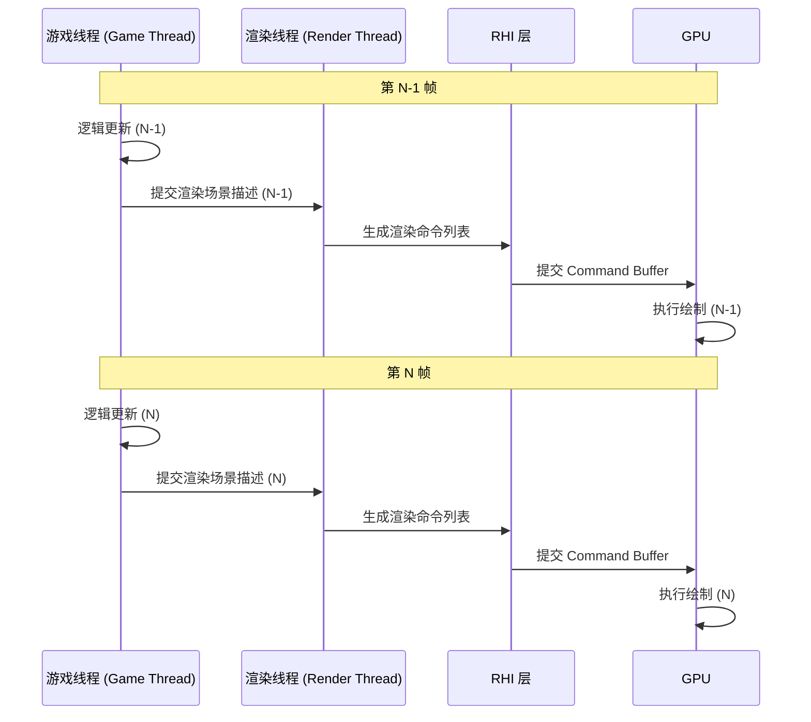
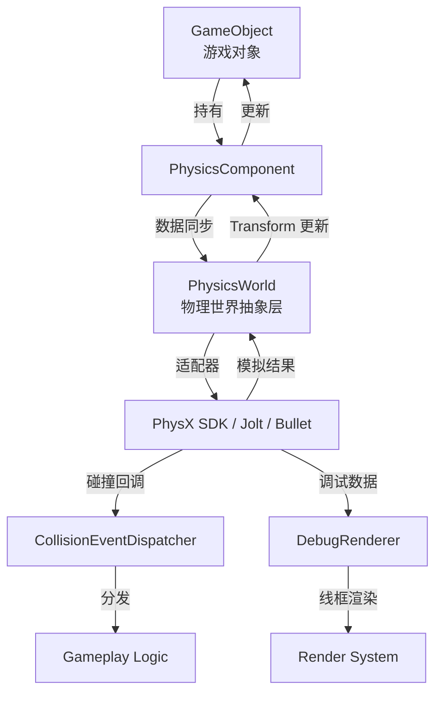
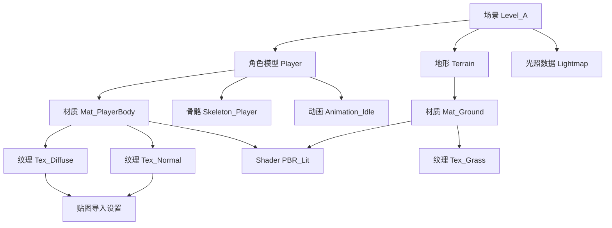

# 第四阶段：引擎核心系统

经过前三个阶段的学习，我们已经建立了坚实的计算机图形学基础，掌握了光栅化管线、现代图形 API（OpenGL、Vulkan、DirectX 12）的编程方法，并深入理解了基于物理的渲染（PBR）、后处理技术和光线追踪的原理。本阶段将这些知识整合起来，系统性地学习游戏引擎的各个核心子系统。一个工业级游戏引擎通常包含数十个子系统，它们相互协作，共同支撑起复杂的交互式虚拟世界。本阶段聚焦于其中最为关键的系统：渲染引擎架构、物理引擎、动画系统，以及资源管理、音频、内存管理、脚本、网络和地形管理等支撑性子系统。

理解这些核心系统的设计思想与实现方式，是成为一名合格的引擎开发工程师的关键分水岭。这不仅要求我们理解每个子系统内部的算法与数据结构，更需要我们把握子系统之间的交互关系、数据流动路径，以及在面对不同硬件平台和项目需求时的工程权衡。

---

## 4.1 渲染引擎架构

渲染引擎是游戏引擎中最为复杂的子系统。在前面的阶段中，我们主要聚焦于单线程环境下的渲染管线实现。然而，现代商业引擎的渲染架构必须充分利用多核 CPU 和异步 GPU 的特性，以在复杂的游戏场景下维持稳定的帧率。本节从多线程渲染架构入手，逐步深入到 Render Graph、Shader 系统、跨平台抽象和可见性裁剪等核心主题。

### 4.1.1 多线程渲染架构

现代游戏引擎的渲染架构普遍采用**游戏线程（Game Thread，GT）**与**渲染线程（Render Thread，RT）**分离的设计模式。这种设计的核心动机源于 CPU 与 GPU 之间的性能鸿沟：CPU 负责游戏逻辑更新、物理模拟、动画计算等任务，而 GPU 负责执行实际的绘制命令。如果所有工作都在单个线程上串行执行，那么当 CPU 完成一帧的逻辑更新后，GPU 才能开始渲染，这将导致严重的流水线气泡（Pipeline Bubble），无法充分利用硬件并行性。

#### 游戏线程与渲染线程的分离原理

在游戏线程与渲染线程分离的架构中，两个线程以**双缓冲（Double Buffering）**或**三缓冲（Triple Buffering）**的方式协作。游戏线程负责第 $N$ 帧的逻辑更新，同时渲染线程负责将第 $N-1$ 帧已准备好的渲染命令提交给 GPU。这种并行结构可以用以下公式描述帧时间的理想情况：

$$T_{frame} = \max(T_{game}, T_{render})$$

其中 $T_{game}$ 是游戏线程的处理时间，$T_{render}$ 是渲染线程的处理时间。在理想情况下，总帧时间取两者中的较大值，而非两者之和。这意味着只要游戏线程和渲染线程的工作负载相对均衡，我们就能有效隐藏一方的延迟。

下面的 Mermaid 序列图展示了两帧内游戏线程、渲染线程和 GPU 之间的时序关系：



从图中可以看到，游戏线程在第 $N$ 帧进行逻辑更新的同时，GPU 正在执行第 $N-1$ 帧的绘制命令（假设渲染线程的延迟为一帧）。这种流水线结构是现代引擎实现高帧率的核心基础。

#### 渲染场景描述（Render Scene Description）的构建

游戏线程与渲染线程之间的数据传递并非直接传递渲染命令，而是传递一份**渲染场景描述（Render Scene Description）**，也称为**渲染中间表示（Intermediate Render Representation）**。这份数据结构包含了渲染一帧所需的所有信息，但不包含任何平台特定的命令。其核心组成包括：

- **可见物体列表**：经过裁剪后需要渲染的 Mesh 实例，包含世界变换矩阵、材质引用、LOD 级别等信息。
- **光源数据**：所有影响当前视图的光源参数（位置、方向、颜色、强度、阴影参数等）。
- **相机参数**：视图矩阵（View Matrix）和投影矩阵（Projection Matrix）、近远裁剪面、FOV 等。
- **后处理设置**：曝光、色调映射、Bloom、SSAO 等后处理效果的参数。
- **渲染特性开关**：例如是否开启阴影、反射、体积光等。

这份渲染场景描述通常存储在**环形缓冲区（Ring Buffer）**中，以避免每帧分配内存。游戏线程写入第 $N$ 帧的数据，渲染线程读取第 $N-1$ 帧的数据，两者通过原子操作同步读写指针。

#### RHI（Render Hardware Interface）抽象层设计

**RHI（Render Hardware Interface，渲染硬件接口）**是渲染架构中的关键抽象层，它屏蔽了底层图形 API（DirectX 12、Vulkan、Metal 等）的差异，为上层渲染代码提供统一的接口。RHI 层的设计遵循**桥接模式（Bridge Pattern）**，将抽象接口与平台特定实现分离。

RHI 的核心设计原则包括：

1. **最小抽象**：RHI 只抽象 GPU 资源的创建、状态设置和命令提交，不抽象渲染算法。渲染管线的具体编排由上层**渲染器（Renderer）**负责。
2. **显式资源管理**：RHI 采用显式的资源创建/销毁模式，上层代码负责管理资源生命周期。这与现代图形 API（DX12/Vulkan）的设计理念一致。
3. **命令列表模型**：RHI 提供命令列表（Command List）或命令缓冲区（Command Buffer）接口，渲染线程将命令录制到列表中，然后批量提交给 GPU。
4. **同步原语**：RHI 提供 Fence、Semaphore 等同步原语，用于管理 GPU 与 CPU 之间、以及 GPU 内部不同队列之间的同步。

下面的代码展示了一个简化但完整的 RHI 抽象层接口设计：

```cpp
// ============================================================
// 简化版 RHI 抽象层接口设计
// 展示了现代引擎 RHI 层的核心抽象概念
// ============================================================
#pragma once
#include <cstdint>
#include <vector>
#include <memory>
#include <string>

namespace rhi {

// 前向声明
class IRHICommandList;
class IRHIResource;
class IRHITexture;
class IRHIBuffer;
class IRHIShader;
class IRHIPipelineState;
class IRHIFence;
class IRHISwapChain;

// 支持的图形后端枚举
enum class ERHIBackend : uint8_t {
    Vulkan,     // Vulkan 1.2+
    DirectX12,  // DirectX 12
    Metal,      // Apple Metal
    OpenGL,     // OpenGL 4.6 (兼容性后端)
    Count
};

// 资源格式枚举 (简化)
enum class EFormat : uint8_t {
    R8G8B8A8_UNORM,
    B8G8R8A8_UNORM,
    R32G32B32A32_FLOAT,
    R32G32_FLOAT,
    R32_FLOAT,
    R16G16B16A16_FLOAT,
    D32_FLOAT,
    D24_UNORM_S8_UINT,
    R11G11B10_FLOAT,  // HDR 常用格式
    Count
};

// 纹理描述符
struct TextureDesc {
    uint32_t width = 1;
    uint32_t height = 1;
    uint32_t depth = 1;        // 对于 3D 纹理
    uint32_t mipLevels = 1;
    uint32_t arraySize = 1;
    EFormat format = EFormat::R8G8B8A8_UNORM;
    uint32_t sampleCount = 1;  // MSAA 样本数
    // 使用位掩码标记用途，一个纹理可同时用于多种用途
    uint32_t usageFlags = 0;   // RenderTarget | DepthStencil | ShaderResource | UnorderedAccess
    std::string debugName;     // 用于 GPU 调试工具 (RenderDoc, PIX)
};

// 缓冲区描述符
struct BufferDesc {
    uint32_t sizeInBytes = 0;       // 缓冲区总大小
    uint32_t strideInBytes = 0;     // 结构化缓冲区中每个元素的步长
    uint32_t usageFlags = 0;        // VertexBuffer | IndexBuffer | ConstantBuffer | ShaderResource | UnorderedAccess
    EFormat elementFormat = EFormat::R32_FLOAT; // 用于 ByteAddressBuffer 或 Typed Buffer
    std::string debugName;
};

// 视口和裁剪矩形
struct Viewport {
    float x = 0.0f, y = 0.0f;
    float width = 0.0f, height = 0.0f;
    float minDepth = 0.0f, maxDepth = 1.0f;
};

struct ScissorRect {
    int32_t left = 0, top = 0;
    int32_t right = 0, bottom = 0;
};

// 渲染通道附件描述（用于 Render Pass）
struct RenderPassAttachment {
    IRHITexture* texture = nullptr;
    // loadOp: 开始渲染通道时如何处置已有内容
    // 可选: Load (保留), Clear (清除为指定值), DontCare (未定义)
    uint8_t loadOp = 0;
    // storeOp: 结束渲染通道时如何处置结果
    // 可选: Store (保存), DontCare (丢弃)
    uint8_t storeOp = 0;
    float clearColor[4] = {0.0f, 0.0f, 0.0f, 0.0f};
};

// 渲染通道描述符
struct RenderPassDesc {
    // Color 附件 (MRT - Multiple Render Targets)
    std::vector<RenderPassAttachment> colorAttachments;
    // Depth/Stencil 附件 (可选)
    RenderPassAttachment depthStencilAttachment;
    // Render Area - 限制实际渲染的像素区域，用于优化 Tiled GPU
    int32_t renderAreaX = 0, renderAreaY = 0;
    uint32_t renderAreaWidth = 0, renderAreaHeight = 0;
};

// ============================================================
// RHI 设备接口 - 负责资源创建和全局状态管理
// IRHIDevice 对应一个逻辑 GPU 设备
// ============================================================
class IRHIDevice {
public:
    virtual ~IRHIDevice() = default;

    // 资源创建接口 - 所有资源通过 Device 创建
    virtual std::unique_ptr<IRHITexture> CreateTexture(const TextureDesc& desc) = 0;
    virtual std::unique_ptr<IRHIBuffer> CreateBuffer(const BufferDesc& desc) = 0;
    virtual std::unique_ptr<IRHIShader> CreateShader(const std::string& entryPoint,
                                                       const std::vector<uint8_t>& byteCode,
                                                       uint32_t shaderStage) = 0;
    virtual std::unique_ptr<IRHIPipelineState> CreateGraphicsPipelineState(
        const struct GraphicsPipelineDesc& desc) = 0;
    virtual std::unique_ptr<IRHIFence> CreateFence() = 0;
    virtual std::unique_ptr<IRHISwapChain> CreateSwapChain(const struct SwapChainDesc& desc) = 0;

    // 命令列表创建 - 每帧可创建多个 CommandList 用于并行录制
    virtual std::unique_ptr<IRHICommandList> CreateCommandList() = 0;

    // 全局同步接口
    // 等待 GPU 完成所有已提交的工作 - 用于关键同步点（如调整窗口大小）
    virtual void WaitIdle() = 0;
    
    // 查询 GPU 能力信息
    virtual void GetDeviceCapabilities(struct RHICapabilities& outCaps) = 0;
};

// ============================================================
// 命令列表接口 - 对应 DX12 的 ID3D12CommandList 或 Vulkan 的 VkCommandBuffer
// 所有 GPU 命令通过此接口录制
// ============================================================
class IRHICommandList {
public:
    virtual ~IRHICommandList() = default;

    // 生命周期管理
    virtual void Begin() = 0;    // 开始录制命令
    virtual void End() = 0;      // 结束录制命令
    virtual void Reset() = 0;    // 重置命令列表（复用内存）

    // 渲染通道管理
    virtual void BeginRenderPass(const RenderPassDesc& desc) = 0;
    virtual void EndRenderPass() = 0;

    // 管线状态绑定
    virtual void SetPipelineState(IRHIPipelineState* pipeline) = 0;
    virtual void SetViewport(const Viewport& viewport) = 0;
    virtual void SetScissorRect(const ScissorRect& scissor) = 0;

    // 顶点/索引缓冲区绑定
    virtual void SetVertexBuffer(uint32_t slot, IRHIBuffer* buffer, uint32_t offset) = 0;
    virtual void SetIndexBuffer(IRHIBuffer* buffer, uint32_t offset, bool b32Bit) = 0;

    // 描述符/资源绑定
    // 绑定常量缓冲区、纹理、采样器等资源到着色器槽位
    virtual void SetGraphicsRootConstantBuffer(uint32_t slot, IRHIBuffer* buffer) = 0;
    virtual void SetGraphicsRootTexture(uint32_t slot, IRHITexture* texture) = 0;
    virtual void SetGraphicsRootSampler(uint32_t slot, struct SamplerDesc* sampler) = 0;

    // 绘制命令
    virtual void DrawIndexed(uint32_t indexCount, uint32_t instanceCount,
                             uint32_t firstIndex, int32_t vertexOffset,
                             uint32_t firstInstance) = 0;
    virtual void Draw(uint32_t vertexCount, uint32_t instanceCount,
                      uint32_t firstVertex, uint32_t firstInstance) = 0;
    // 间接绘制 - 从 GPU 缓冲区读取绘制参数，用于 GPU-Driven 渲染
    virtual void DrawIndexedIndirect(IRHIBuffer* argsBuffer, uint32_t argsOffset) = 0;

    // 资源屏障 - 显式管理资源状态转换（Texture -> ShaderResource 等）
    virtual void ResourceBarrier(IRHIResource* resource, uint32_t beforeState,
                                  uint32_t afterState) = 0;

    // 计算着色器相关
    virtual void SetComputePipelineState(IRHIPipelineState* pipeline) = 0;
    virtual void Dispatch(uint32_t groupX, uint32_t groupY, uint32_t groupZ) = 0;

    // 数据上传接口
    virtual void CopyBufferToTexture(IRHIBuffer* src, IRHITexture* dst,
                                     const struct TextureCopyDesc& copyDesc) = 0;
    virtual void CopyBuffer(IRHIBuffer* src, IRHIBuffer* dst, uint32_t size,
                            uint32_t srcOffset = 0, uint32_t dstOffset = 0) = 0;
};

// ============================================================
// 交换链接口 - 管理前后缓冲和 Present 操作
// ============================================================
class IRHISwapChain {
public:
    virtual ~IRHISwapChain() = default;
    virtual IRHITexture* GetBackBuffer(uint32_t index) = 0;
    virtual uint32_t GetCurrentBackBufferIndex() = 0;
    virtual void Present(uint32_t syncInterval) = 0;
    virtual void Resize(uint32_t width, uint32_t height) = 0;
    virtual uint32_t GetBackBufferCount() = 0;
};

// ============================================================
// Fence - CPU/GPU 同步原语
// 用于渲染线程等待 GPU 完成特定工作
// ============================================================
class IRHIFence {
public:
    virtual ~IRHIFence() = default;
    virtual void SignalFromGPU(IRHICommandList* cmdList, uint64_t value) = 0;
    virtual void WaitOnGPU(IRHICommandList* cmdList, uint64_t value) = 0;
    virtual void WaitOnCPU(uint64_t value) = 0;
    virtual uint64_t GetCompletedValue() = 0;
};

// 工厂函数 - 根据平台创建具体的 RHI 实现
std::unique_ptr<IRHIDevice> CreateRHIDevice(ERHIBackend backend, void* platformWindow);

} // namespace rhi
```

这段代码展示了一个现代 RHI 层的核心设计。其中几个关键设计决策值得深入讨论：

首先是**显式资源屏障（Explicit Resource Barrier）**接口。在 DX12 和 Vulkan 中，资源在同一帧内可能处于不同的状态——例如一张纹理可能先作为渲染目标写入，然后作为着色器资源读取。RHI 层通过 `ResourceBarrier` 接口暴露这种状态转换，上层代码（如 Render Graph）负责在正确的位置插入屏障。这种显式控制虽然增加了代码复杂度，但允许引擎精确控制 GPU 的同步点，消除不必要的等待。

其次是**DrawIndexedIndirect**接口。这是 GPU-Driven 渲染的核心 API，它允许 GPU 直接从缓冲区读取绘制参数（索引数、实例数等），而无需 CPU 介入。在实现遮挡剔除、GPU 粒子系统等高级特性时，这个接口至关重要。

最后是**命令列表的 Reset 机制**。现代图形 API 允许命令列表在提交后被重置并复用其底层内存分配，这避免了每帧创建和销毁命令列表的开销。RHI 层暴露这个接口，使得渲染线程可以维护一个命令列表池（Command List Pool）。

#### 多线程命令录制

在大型场景中，渲染命令的数量可能非常庞大（数万次 Draw Call）。如果所有命令都由单个渲染线程录制，该线程可能成为瓶颈。现代引擎通常采用**多线程命令录制（Multi-threaded Command Recording）**来进一步并行化。

具体实现方式是：渲染线程作为主线程，负责生成渲染场景描述和确定渲染管线的整体结构（哪些 Pass、Pass 之间的依赖关系）。然后将每个 Render Pass 的录制任务分发到**工作线程池（Worker Thread Pool）**中的多个线程上并行执行。每个工作线程录制自己的命令列表，最后由渲染线程将这些命令列表合并并提交给 GPU。

这种架构的挑战在于 Pass 之间的资源依赖管理——如果一个 Pass 的输出是下一个 Pass 的输入，那么工作线程之间需要正确的同步。这正是 Render Graph（将在下一节讨论）所解决的核心问题。


### 4.1.2 渲染图/帧图（Render Graph）

**Render Graph（渲染图，也称 Frame Graph）** 是现代游戏引擎渲染架构中的一项革命性设计，最早由 Yuriy O'Donnell 在 GDC 2017 的《FrameGraph: A Retained Mode Rendering Paradigm》演讲中系统性地提出。它从根本上改变了渲染管线的组织方式——从命令式的"按顺序录制渲染命令"转变为声明式的"描述渲染通道及其依赖关系，由系统自动调度和优化"。

#### Render Graph 的核心思想

Render Graph 的核心理念是将一帧的渲染过程抽象为一个**有向无环图（Directed Acyclic Graph, DAG）**，其中：

- **节点（Node）**代表渲染通道（Render Pass），如"基础颜色 Pass"、"阴影 Pass"、"SSAO Pass"、"后处理 Pass"等。每个节点包含一个执行回调（Lambda 函数），在其中录制实际的 RHI 命令。
- **边（Edge）**代表资源依赖关系。如果 Pass A 输出一张纹理，Pass B 使用这张纹理作为输入，那么就存在一条从 A 到 B 的有向边。
- **资源（Resource）**是节点之间传递的数据，包括纹理、缓冲区等。Render Graph 管理这些资源的整个生命周期。

Render Graph 的执行分为两个阶段：

1. **构建阶段（Setup Phase）**：在这一阶段，渲染代码声明性地注册所有的 Pass 和它们之间的资源依赖关系。此阶段不执行任何实际的 GPU 命令，只构建图结构。
2. **编译与执行阶段（Compile & Execute Phase）**：Render Graph 分析构建好的 DAG，执行依赖排序、资源分配、屏障插入等优化，然后按拓扑排序的顺序执行每个 Pass 的回调函数。

Render Graph 带来了以下工程优势：

- **自动资源管理**：渲染中间资源（如 G-Buffer、SSAO 纹理）由 Render Graph 自动分配和回收。引擎可以根据实际需求决定这些纹理的格式、尺寸，甚至可以将生命周期不重叠的资源复用到同一块 GPU 内存中（内存别名，Memory Aliasing）。
- **自动屏障插入**：Render Graph 根据资源在 Pass 之间的读写关系，自动计算并插入必要的资源屏障（Resource Barrier），避免了手动管理屏障的繁琐和易错。
- **渲染管线可视化**：由于整个渲染管线以图的形式显式描述，引擎可以轻松生成渲染管线的可视化表示（如 RenderDoc 的截图），极大地方便了调试和优化。
- **跨平台优化**：Render Graph 可以在编译阶段执行平台特定的优化。例如，在移动端 Tiled GPU 上，它可以合并多个小 Pass 为一个大的 Render Pass，以减少 Tile 内存的往返传输。

#### Render Graph 的简化实现

下面的代码展示了一个简化但功能完整的 Render Graph 实现。这个实现包含了资源声明、Pass 注册、依赖分析和自动执行的核心逻辑。

```cpp
// ============================================================
// 简化版 Render Graph 实现
// 包含核心概念：RenderPass、RenderResource、依赖分析和执行
// ============================================================
#pragma once
#include <string>
#include <vector>
#include <unordered_map>
#include <unordered_set>
#include <functional>
#include <memory>
#include <queue>
#include <algorithm>
#include <cassert>

namespace rendergraph {

// 资源类型
enum class ERGResourceType : uint8_t {
    Texture,
    Buffer
};

// 资源访问权限
enum class ERGAccess : uint8_t {
    None,
    Read,       // 着色器资源读取
    Write,      // 渲染目标 / 深度缓冲区写入
    ReadWrite   // UAV 读写
};

// 前向声明
class RenderGraph;
class RenderPassBuilder;
class RGTexture;
class RGBuffer;
class RGPass;

// ============================================================
// Render Graph 资源句柄 - 使用类型安全的方式引用资源
// 这些句柄在 Setup Phase 创建，在执行阶段解析为实际的 RHI 资源
// ============================================================
template<typename T>
class RGHandle {
public:
    RGHandle() = default;
    explicit RGHandle(uint32_t id) : m_id(id) {}
    bool IsValid() const { return m_id != kInvalidID; }
    uint32_t GetID() const { return m_id; }
private:
    static constexpr uint32_t kInvalidID = 0xFFFFFFFF;
    uint32_t m_id = kInvalidID;
};

using RGTextureHandle = RGHandle<RGTexture>;
using RGBufferHandle = RGHandle<RGBuffer>;

// ============================================================
// 纹理描述符 - 在 Setup Phase 描述纹理需求
// Render Graph 根据此描述分配实际的 GPU 资源
// ============================================================
struct RGTextureDesc {
    uint32_t width = 1;
    uint32_t height = 1;
    uint32_t mipLevels = 1;
    uint32_t arraySize = 1;
    uint32_t format = 0;       // RHI 格式枚举
    uint32_t sampleCount = 1;  // MSAA
    uint32_t usageFlags = 0;
    std::string debugName;
};

// ============================================================
// Render Pass 构建器 - 在 Setup Phase 使用
// 用于声明 Pass 的输入输出资源依赖
// ============================================================
class RenderPassBuilder {
public:
    explicit RenderPassBuilder(RGPass* pass) : m_pass(pass) {}

    // 声明读取依赖 - 本 Pass 会读取该资源
    void Read(RGTextureHandle handle, ERGAccess access = ERGAccess::Read);
    // 声明写入依赖 - 本 Pass 会写入该资源
    void Write(RGTextureHandle handle, ERGAccess access = ERGAccess::Write);
    // 声明渲染目标输出 - 特殊标记，用于确定 Pass 的渲染目标
    void SetRenderTarget(uint32_t slot, RGTextureHandle handle);
    // 声明深度模板输出
    void SetDepthStencil(RGTextureHandle handle);

private:
    RGPass* m_pass = nullptr;
};

// ============================================================
// Render Pass - 渲染图的基本执行单元
// ============================================================
class RGPass {
public:
    using SetupFunc = std::function<void(RenderPassBuilder&)>;
    // ExecuteFunc 接收 RHI CommandList，在其中录制实际渲染命令
    using ExecuteFunc = std::function<void(class rhi::IRHICommandList*)>;

    RGPass(const std::string& name, SetupFunc setup, ExecuteFunc execute)
        : m_name(name), m_setup(setup), m_execute(execute) {}

    const std::string& GetName() const { return m_name; }

    // 构建阶段调用 - 收集资源依赖
    void Setup(RenderPassBuilder& builder) { m_setup(builder); }
    // 执行阶段调用 - 录制 RHI 命令
    void Execute(rhi::IRHICommandList* cmdList) { m_execute(cmdList); }

    // 依赖关系
    std::vector<RGTextureHandle> GetReadTextures() const { return m_readTextures; }
    std::vector<RGTextureHandle> GetWriteTextures() const { return m_writeTextures; }

    // 拓扑排序辅助
    uint32_t GetInDegree() const { return m_inDegree; }
    void SetInDegree(uint32_t degree) { m_inDegree = degree; }
    void DecrementInDegree() { --m_inDegree; }

    // 渲染目标设置
    void SetRenderTarget(uint32_t slot, RGTextureHandle handle);
    void SetDepthStencilTarget(RGTextureHandle handle) { m_depthStencil = handle; }

private:
    std::string m_name;
    SetupFunc m_setup;
    ExecuteFunc m_execute;

    std::vector<RGTextureHandle> m_readTextures;
    std::vector<RGTextureHandle> m_writeTextures;
    std::unordered_map<uint32_t, RGTextureHandle> m_renderTargets;
    RGTextureHandle m_depthStencil;

    uint32_t m_inDegree = 0;    // 入度，用于拓扑排序
    uint32_t m_executionOrder = 0;

    friend class RenderGraph;
    friend class RenderPassBuilder;
};

// ============================================================
// Render Graph 主类
// ============================================================
class RenderGraph {
public:
    // 创建纹理资源 - 返回一个句柄，实际的 GPU 资源延迟分配
    RGTextureHandle CreateTexture(const RGTextureDesc& desc);
    // 导入外部纹理（如 SwapChain BackBuffer、已加载的贴图）
    RGTextureHandle ImportTexture(const std::string& name, class rhi::IRHITexture* externalTexture);

    // 注册渲染通道 - 核心 API
    // setup: 声明资源依赖的 lambda
    // execute: 录制实际渲染命令的 lambda
    void AddPass(const std::string& name,
                 RGPass::SetupFunc setup,
                 RGPass::ExecuteFunc execute);

    // 编译 Render Graph - 分析依赖、分配资源、计算执行顺序
    void Compile();
    // 执行 Render Graph - 按拓扑排序的顺序执行所有 Pass
    void Execute(class rhi::IRHIDevice* device);

    // 获取资源分配统计，用于调试和优化
    void DumpStatistics();

private:
    // 依赖分析和拓扑排序
    void BuildDependencyGraph();
    bool TopologicalSort();
    // 资源分配 - 使用内存别名优化
    void AllocateResources();
    // 自动插入资源屏障
    void InsertResourceBarriers();

private:
    std::vector<std::unique_ptr<RGPass>> m_passes;
    std::vector<RGTextureDesc> m_textureDescriptions;
    std::vector<std::unique_ptr<class rhi::IRHITexture>> m_allocatedTextures;

    // 导入的外部纹理 - 不管理其生命周期
    std::unordered_map<uint32_t, class rhi::IRHITexture*> m_importedTextures;

    // 执行顺序（拓扑排序结果）
    std::vector<RGPass*> m_executionOrder;

    // 邻接表表示的依赖图
    std::unordered_map<uint32_t, std::vector<uint32_t>> m_adjacencyList;

    uint32_t m_nextTextureID = 0;
    bool m_compiled = false;
};

// ============================================================
// 实现部分
// ============================================================

void RenderPassBuilder::Read(RGTextureHandle handle, ERGAccess access) {
    m_pass->m_readTextures.push_back(handle);
}

void RenderPassBuilder::Write(RGTextureHandle handle, ERGAccess access) {
    m_pass->m_writeTextures.push_back(handle);
}

void RenderPassBuilder::SetRenderTarget(uint32_t slot, RGTextureHandle handle) {
    m_pass->SetRenderTarget(slot, handle);
    m_pass->m_writeTextures.push_back(handle);  // 渲染目标也是写入
}

void RenderPassBuilder::SetDepthStencil(RGTextureHandle handle) {
    m_pass->SetDepthStencilTarget(handle);
    m_pass->m_writeTextures.push_back(handle);
}

RGTextureHandle RenderGraph::CreateTexture(const RGTextureDesc& desc) {
    uint32_t id = m_nextTextureID++;
    m_textureDescriptions.push_back(desc);
    return RGTextureHandle(id);
}

void RenderGraph::AddPass(const std::string& name,
                          RGPass::SetupFunc setup,
                          RGPass::ExecuteFunc execute) {
    auto pass = std::make_unique<RGPass>(name, setup, execute);
    m_passes.push_back(std::move(pass));
}

void RenderGraph::BuildDependencyGraph() {
    // 建立资源生产者 -> 消费者映射
    // resourceID -> 生产该资源的 Pass 索引
    std::unordered_map<uint32_t, uint32_t> resourceProducers;
    // resourceID -> 消费该资源的 Pass 索引列表
    std::unordered_map<uint32_t, std::vector<uint32_t>> resourceConsumers;

    for (uint32_t passIdx = 0; passIdx < m_passes.size(); ++passIdx) {
        RGPass* pass = m_passes[passIdx].get();
        // 收集 Setup 阶段的依赖声明
        RenderPassBuilder builder(pass);
        pass->Setup(builder);

        // 写入该资源的 Pass 是生产者
        for (const auto& writeHandle : pass->GetWriteTextures()) {
            resourceProducers[writeHandle.GetID()] = passIdx;
        }
        // 读取该资源的 Pass 是消费者
        for (const auto& readHandle : pass->GetReadTextures()) {
            resourceConsumers[readHandle.GetID()].push_back(passIdx);
        }
    }

    // 构建邻接表：如果 Pass A 生产了 Pass B 消费的资源，则 A -> B
    for (uint32_t passIdx = 0; passIdx < m_passes.size(); ++passIdx) {
        for (const auto& readHandle : m_passes[passIdx]->GetReadTextures()) {
            auto it = resourceProducers.find(readHandle.GetID());
            if (it != resourceProducers.end() && it->second != passIdx) {
                uint32_t producerIdx = it->second;
                m_adjacencyList[producerIdx].push_back(passIdx);
            }
        }
    }

    // 计算入度
    for (uint32_t passIdx = 0; passIdx < m_passes.size(); ++passIdx) {
        uint32_t inDegree = 0;
        for (const auto& [src, dsts] : m_adjacencyList) {
            for (uint32_t dst : dsts) {
                if (dst == passIdx) ++inDegree;
            }
        }
        m_passes[passIdx]->SetInDegree(inDegree);
    }
}

bool RenderGraph::TopologicalSort() {
    std::queue<RGPass*> queue;

    // 将所有入度为 0 的节点加入队列
    for (auto& pass : m_passes) {
        if (pass->GetInDegree() == 0) {
            queue.push(pass.get());
        }
    }

    m_executionOrder.clear();

    while (!queue.empty()) {
        RGPass* current = queue.front();
        queue.pop();
        m_executionOrder.push_back(current);

        // 获取当前 Pass 在 m_passes 中的索引
        uint32_t currentIdx = static_cast<uint32_t>(
            std::distance(m_passes.begin(),
                std::find_if(m_passes.begin(), m_passes.end(),
                    [current](const auto& p) { return p.get() == current; })));

        // 减少邻接节点的入度
        auto it = m_adjacencyList.find(currentIdx);
        if (it != m_adjacencyList.end()) {
            for (uint32_t neighborIdx : it->second) {
                m_passes[neighborIdx]->DecrementInDegree();
                if (m_passes[neighborIdx]->GetInDegree() == 0) {
                    queue.push(m_passes[neighborIdx].get());
                }
            }
        }
    }

    // 如果排序后的节点数不等于总节点数，说明图中存在环
    if (m_executionOrder.size() != m_passes.size()) {
        assert(false && "Render Graph contains a cycle!");
        return false;
    }
    return true;
}

void RenderGraph::Compile() {
    BuildDependencyGraph();
    TopologicalSort();
    AllocateResources();
    InsertResourceBarriers();
    m_compiled = true;
}

void RenderGraph::AllocateResources() {
    // 简化实现：为每个 Render Graph 纹理创建一个实际的 RHI 纹理
    // 实际引擎中会在这里实现内存别名优化：
    // 1. 计算每个纹理的生命周期（首次使用 Pass 到最后使用 Pass）
    // 2. 将生命周期不重叠且格式兼容的纹理映射到同一块 GPU 内存
    // 3. 这可以显著减少中间渲染资源的总内存占用（30-50% 节省）
    m_allocatedTextures.reserve(m_textureDescriptions.size());
    // ... 实际分配逻辑依赖于具体的 RHI 实现
}

void RenderGraph::InsertResourceBarriers() {
    // 根据拓扑排序后的执行顺序和资源依赖关系
    // 在每个 Pass 的开始和结束处插入资源状态转换屏障
    // 实际实现需要追踪每个纹理在当前时刻的状态
    // 并在状态变化时生成 ResourceBarrier 命令
}

void RenderGraph::Execute(rhi::IRHIDevice* device) {
    if (!m_compiled) {
        Compile();
    }

    auto cmdList = device->CreateCommandList();
    cmdList->Begin();

    for (RGPass* pass : m_executionOrder) {
        pass->Execute(cmdList.get());
    }

    cmdList->End();
    // 提交到 GPU 队列
}

} // namespace rendergraph
```

这个简化实现展示了 Render Graph 的核心机制。在实际商业引擎中（如 Unreal Engine 的 FRDG、Unity 的 Render Graph API），实现会更加复杂，但核心概念是一致的。

#### 使用 Render Graph 组织延迟渲染管线

下面展示如何使用上述 Render Graph 来实现一个典型的延迟渲染管线：

```cpp
// ============================================================
// 使用 Render Graph 实现延迟渲染管线的示例
// ============================================================
void RenderDeferredFrame(RenderGraph& graph, const SceneView& view) {
    // 1. 声明所有中间资源
    RGTextureDesc gbufferBaseColorDesc;
    gbufferBaseColorDesc.width = view.viewportWidth;
    gbufferBaseColorDesc.height = view.viewportHeight;
    gbufferBaseColorDesc.format = RHIFormat_R8G8B8A8_UNORM;
    gbufferBaseColorDesc.debugName = "GBuffer_BaseColor";
    auto gbufferBaseColor = graph.CreateTexture(gbufferBaseColorDesc);

    RGTextureDesc gbufferNormalDesc = gbufferBaseColorDesc;
    gbufferNormalDesc.format = RHIFormat_R16G16B16A16_FLOAT;
    gbufferNormalDesc.debugName = "GBuffer_Normal";
    auto gbufferNormal = graph.CreateTexture(gbufferNormalDesc);

    RGTextureDesc depthDesc = gbufferBaseColorDesc;
    depthDesc.format = RHIFormat_D32_FLOAT;
    depthDesc.debugName = "SceneDepth";
    auto sceneDepth = graph.CreateTexture(depthDesc);

    RGTextureDesc lightingDesc = gbufferBaseColorDesc;
    lightingDesc.format = RHIFormat_R16G16B16A16_FLOAT; // HDR
    lightingDesc.debugName = "Lighting";
    auto lightingBuffer = graph.CreateTexture(lightingDesc);

    // 2. GBuffer Pass - 写入 GBuffer 和深度
    graph.AddPass("GBuffer",
        [&](RenderPassBuilder& builder) {
            // 声明输出：三个渲染目标
            builder.SetRenderTarget(0, gbufferBaseColor);
            builder.SetRenderTarget(1, gbufferNormal);
            builder.SetDepthStencil(sceneDepth);
        },
        [&](rhi::IRHICommandList* cmd) {
            // 绑定 GBuffer 渲染管线
            // 遍历场景中的不透明物体，绘制到 GBuffer
            // cmd->SetPipelineState(gbufferPSO);
            // cmd->DrawIndexed(...);
        });

    // 3. SSAO Pass - 读取深度和法线，输出 AO
    RGTextureDesc aoDesc = gbufferBaseColorDesc;
    aoDesc.format = RHIFormat_R8_UNORM;
    aoDesc.debugName = "SSAO";
    auto aoTexture = graph.CreateTexture(aoDesc);

    graph.AddPass("SSAO",
        [&](RenderPassBuilder& builder) {
            builder.Read(sceneDepth);   // 需要深度
            builder.Read(gbufferNormal); // 需要法线
            builder.Write(aoTexture);   // 输出 AO
        },
        [&](rhi::IRHICommandList* cmd) {
            // 执行 SSAO 计算着色器
        });

    // 4. 延迟光照 Pass - 读取 GBuffer 和 AO，输出光照
    graph.AddPass("DeferredLighting",
        [&](RenderPassBuilder& builder) {
            builder.Read(gbufferBaseColor);
            builder.Read(gbufferNormal);
            builder.Read(sceneDepth);
            builder.Read(aoTexture);
            builder.Write(lightingBuffer);
        },
        [&](rhi::IRHICommandList* cmd) {
            // 对每个光源，执行延迟光照计算
        });

    // 5. 天空盒 Pass - 读取深度，写入光照缓冲
    graph.AddPass("Skybox",
        [&](RenderPassBuilder& builder) {
            builder.Read(sceneDepth);
            builder.Write(lightingBuffer);
            builder.SetDepthStencil(sceneDepth);
        },
        [&](rhi::IRHICommandList* cmd) {
            // 绘制天空盒
        });

    // 6. 后处理 Pass - 读取光照缓冲，输出到 BackBuffer
    auto backBuffer = graph.ImportTexture("BackBuffer", GetSwapChainBackBuffer());

    graph.AddPass("Tonemap",
        [&](RenderPassBuilder& builder) {
            builder.Read(lightingBuffer);
            builder.Write(backBuffer);
        },
        [&](rhi::IRHICommandList* cmd) {
            // 执行色调映射 + Gamma 校正
        });
}
```

这个例子清晰展示了 Render Graph 的声明式编程模型。每个 Pass 只关心自己的输入和输出，而不需要关心其他 Pass 的执行顺序或资源状态管理。Render Graph 自动推断出正确的执行顺序（GBuffer -> SSAO -> DeferredLighting -> Skybox -> Tonemap），并在 Pass 之间插入必要的资源屏障。

### 4.1.3 Shader 系统

Shader 是现代渲染管线的核心程序。一个工业级引擎的 Shader 系统需要解决三个核心问题：Shader 变体管理、热重载（Hot Reload），以及为美术人员提供可视化编辑能力。

#### Shader 变体（Variant）管理

在实际游戏开发中，同一套 Shader 源码需要生成大量的**变体（Shader Variant）**来适应不同的渲染需求。例如，一个标准的光照着色器可能需要支持：

- 是否使用法线贴图
- 是否使用高光贴图
- 是否启用遮罩裁剪（Alpha Clip）
- 是否接收阴影（主光源阴影 / 级联阴影 / 点光源阴影）
- 光照模型的选择（Blinn-Phong / GGX）
- 是否启用在骨骼动画
- 渲染路径（前向 / 延迟）

这些选项的组合可能产生数百甚至数千个 Shader 变体。直接手写每个变体显然不现实，因此引擎通常采用**条件编译 + 自动变体生成**的方案。

Unreal Engine 使用 `*.ush`（Unreal Shader Header）和 `*.usf`（Unreal Shader File）文件，通过 C++ 代码中的 `FShaderPermutationParameters` 结构来定义变体维度。每个维度对应一个编译器宏，Shader 源码中使用 `#if` / `#ifdef` 来根据宏的值选择代码路径。编译时，引擎根据材质设置和渲染配置自动确定需要哪些变体，并调用着色器编译器（如 DirectX 的 FXC/dxc、Vulkan 的 glslang）生成对应的字节码。

变体管理的一个重要挑战是**变体爆炸（Shader Variant Explosion）**——随着维度数量增加，变体数量呈指数增长。控制变体数量的策略包括：

1. **变体剥离（Variant Stripping）**：在打包时剔除项目中实际未使用的变体。例如，如果游戏从不在移动平台上使用某个复杂的 Shader，那么该平台的对应变体可以被移除。
2. **按需编译（On-demand Compilation）**：只在实际需要某个变体时才编译它，而不是预先编译所有可能组合。
3. **变体缓存**：将编译好的变体缓存到磁盘，下次启动时直接加载，避免重复编译。

#### Shader 热重载（Hot Reload）

**Shader 热重载**允许开发者在不重启引擎的情况下，修改 Shader 源码后立即看到效果。这是渲染调试和迭代效率的关键特性。实现 Shader 热重载的基本流程如下：

1. **文件监控**：引擎启动一个后台线程，监控 Shader 源码文件的修改时间戳。
2. **变更检测**：当检测到文件修改时，标记对应的 Shader 及其所有变体为"脏"。
3. **异步编译**：在工作线程上重新编译受影响的 Shader 变体。
4. **运行时替换**：编译完成后，更新材质实例引用的 Shader 对象，并在下一帧使用新版本。

实现热重载的关键是 Shader 对象的**引用计数和惰性更新**机制。材质不直接持有 Shader 指针，而是持有 Shader 的引用句柄。当 Shader 重新编译时，引擎更新句柄背后的实际 Shader 对象，所有引用该句柄的材质自动使用新版本，无需逐一通知。

#### Shader 可视化节点编辑器设计

Shader 节点编辑器（如 Unreal 的 Material Editor、Unity 的 Shader Graph）允许美术人员通过连接节点的方式创建自定义材质，而无需编写代码。其设计核心是一个**节点图到 Shader 源码的编译器**。

节点编辑器的架构通常包含以下组件：

1. **节点定义系统**：每个节点对应一个 Shader 函数或操作（如加法、乘法、纹理采样、法线变换等）。节点定义包含输入/输出引脚（Pin）的类型和数量。
2. **图验证器**：检查节点图的合法性，包括类型匹配（不能将 Float4 连接到 Float1 输入）、循环依赖检测等。
3. **HLSL/GLSL 代码生成器**：遍历节点图，将每个节点翻译为对应的 Shader 代码语句。这本质上是一个从数据流图到命令式代码的转换过程。
4. **预览系统**：使用一个简化的渲染场景（通常是球体或平面）实时预览材质效果。

代码生成的过程类似于拓扑排序遍历。代码生成器从输出节点（如最终颜色）开始，递归地访问其输入连接的节点，为每个访问的节点生成对应的代码片段。为了避免重复计算，代码生成器使用一个缓存机制：如果同一个节点的输出被多个后续节点引用，其计算结果会被存储在一个临时变量中。

### 4.1.4 跨平台渲染抽象

现代游戏引擎需要支持多个平台（PC、游戏主机、移动设备），每个平台使用不同的图形 API。RHI 层是实现跨平台支持的基础，但要达到各平台的最佳性能，还需要平台特定的优化策略。

#### 平台特定优化策略

不同平台的 GPU 架构差异显著，主要可以分两类：

| 平台类型 | 代表硬件/API | GPU 架构特点 | 优化策略 |
|---------|------------|------------|---------|
| 桌面独立 GPU | NVIDIA RTX / AMD Radeon (DX12/Vulkan) | 大带宽显存、大量计算单元、Tile-based 光追核心 | 最大化并行度、充分利用异步计算队列、DLSS/FSR 升频 |
| 游戏主机 | PS5 (RDNA2) / Xbox Series X (DX12) | 统一内存架构(UMA)、硬件加速光线追踪、高速 SSD | 减少 CPU-GPU 数据传输、利用硬件特性（如 PS5 的 Geometry Engine）|
| 移动 GPU | Apple M系列 / Qualcomm Adreno / ARM Mali (Metal/Vulkan) | Tiled Deferred 渲染架构、带宽敏感、计算资源有限 | 减少 Render Pass 数量、避免 TBDR 架构中的"全屏三角形"陷阱、使用内存加载/存储优化 |
| 集成 GPU | Intel Iris Xe | 共享系统内存、计算单元较少 | 降低分辨率、简化着色器、优先保证带宽效率 |

在 **桌面独立 GPU** 上，优化的重点是最大化 GPU 的并行计算能力。这包括利用异步计算队列（Async Compute）并行执行图形和计算工作负载（例如，在光栅化 GBuffer 的同时，使用计算着色器执行 SSAO 或 Bloom），以及通过使用 DLSS（NVIDIA）或 FSR（AMD）等升频技术来降低渲染分辨率。

在 **游戏主机** 上，统一内存架构（UMA）意味着 CPU 和 GPU 共享同一块物理内存，不存在 PCIe 传输瓶颈。这为引擎架构带来了新的可能性——例如，GPU 可以直接访问由 CPU 生成的数据结构（如 GPU-Driven 渲染中的间接绘制缓冲区），而无需显式的上传操作。此外，主机的硬件特性通常是公开且有文档的，引擎可以利用这些特性实现桌面平台无法达到的优化（如 PS5 的 Primitive Shader 和 Mesh Shader 等几何处理流水线）。

**移动 GPU** 是最需要特殊处理的平台。绝大多数移动 GPU 采用 **Tiled Deferred Rendering（TBDR）** 架构（如 PowerVR 的 Tile-Based Deferred Rendering、ARM Mali 的 Tile-Based Rendering）。在这种架构下，GPU 将屏幕划分为小块（Tile），对每个 Tile 依次执行几何处理、光栅化和像素着色。Pass 之间的全屏读写操作会导致 Tile 内存与主内存之间的数据传输（称为"Resolve"操作），这在移动平台上是非常消耗带宽的。

针对移动平台的优化策略包括：

1. **Render Pass 合并**：将多个小的 Render Pass 合并为一个大的 Pass，避免中间结果的 Resolve 操作。例如，将基础颜色、法线和材质的渲染合并到同一个 GBuffer Pass 中。
2. **避免 Shader 中的分支**：移动 GPU 的线程调度器对动态分支（dynamic branch）的处理效率通常低于桌面 GPU。尽量使用静态分支（编译时确定的 `#ifdef`）或将分支转换为 lerp/mix 操作。
3. **使用 ASTC/ETC 纹理压缩**：移动平台的显存带宽有限，使用硬件支持的压缩纹理格式（ASTC 是目前的最佳选择）可以显著减少带宽占用。
4. **MSAA 解析优化**：在 TBDR 架构上，MSAA 的解析可以在 Tile 内存中完成，不产生额外的带宽开销，这使得 MSAA 在移动平台上的成本远低于桌面平台。

#### 图形 API 切换策略

在 RHI 层实现图形 API 的切换能力，需要仔细设计抽象层次。过于底层的抽象会失去平台优化的空间，过于高层的抽象则可能导致某些平台特性无法使用。

现代引擎通常采用**分层策略**：核心渲染算法（如延迟渲染、后处理效果）使用统一的 RHI 接口编写，而平台特定的优化通过**平台后端（Platform Backend）**的特化实现来完成。例如，Unreal Engine 的 RHI 层在 `FRHICommandList` 上提供统一的接口，但每个平台（D3D12RHI、VulkanRHI、MetalRHI）有自己的实现，可以在不修改上层代码的情况下注入平台特定的优化。

### 4.1.5 可见性裁剪系统

可见性裁剪（Visibility Culling）是渲染引擎中最重要的性能优化系统之一。它的目标是以最小的开销确定哪些物体对当前相机视图是可见的，从而避免将不可见物体发送到渲染管线中。即使 GPU 级别的硬件遮挡查询已经非常高效，CPU 级别的裁剪仍然是必不可少的——因为发送一个 Draw Call 本身就有 CPU 开销，且顶点着色器对不可见物体的处理也是浪费。

可见性裁剪系统通常包含多个层次，从粗粒度到细粒度依次执行：

#### 视锥裁剪（Frustum Culling）

**视锥裁剪**是最基础的裁剪方法。它基于一个简单的几何事实：如果物体的包围盒完全位于相机视锥（View Frustum）的六个裁剪平面之外，那么该物体对当前视图完全不可见。

视锥由六个平面定义：左、右、上、下、近、远。对于每个物体，我们使用其**轴对齐包围盒（Axis-Aligned Bounding Box, AABB）**或**球包围体（Bounding Sphere）**与视锥进行相交测试。

AABB 与视锥的相交测试算法使用**分离轴定理（Separating Axis Theorem, SAT）**的一个特例。对于视锥的每个裁剪平面，我们测试 AABB 是否完全位于该平面的负侧（外侧）。如果是，则 AABB 完全在视锥外。如果 AABB 跨越所有平面的正侧（内侧），则它至少部分在视锥内。

AABB 与平面测试的关键优化是**快速拒绝测试（Quick Rejection Test）**。对于由中心点 $C$ 和半边长 $E = (e_x, e_y, e_z)$ 定义的 AABB，与法线为 $N$、距离为 $d$ 的平面的测试过程如下：

$$r = e_x |N_x| + e_y |N_y| + e_z |N_z|$$

$$s = N \cdot C + d$$

如果 $s + r < 0$，AABB 完全在平面负侧（外部）；如果 $s - r > 0$，AABB 完全在平面正侧（内部）；否则，AABB 与平面相交。

其中 $r$ 是 AABB 在平面法线方向上的"有效半径"，即 AABB 在法线方向上的最大投影范围。这个公式的巧妙之处在于，它避免了逐顶点测试，而是利用 AABB 的几何特性直接判断整个包围盒与平面的关系。

#### 遮挡裁剪（Occlusion Culling）

视锥裁剪只能处理视锥外部的物体，但对于视锥内部被其他物体完全遮挡的物体无能为力。**遮挡裁剪（Occlusion Culling）** 就是解决这个问题的技术。

遮挡裁剪的主要方法包括：

1. **硬件遮挡查询（Hardware Occlusion Queries）**：利用 GPU 的遮挡查询功能（如 OpenGL 的 `GL_ARB_occlusion_query`、D3D 的 `ID3D12QueryHeap`）。基本流程是：先用简化的几何体（如包围盒）渲染一次，查询该包围盒是否有任何片段通过深度测试。如果有，则内部的详细几何体需要渲染；如果没有，则完全跳过。这种方法的缺点是 GPU-CPU 同步延迟——查询结果可能需要几帧才能返回。

2. **软件光栅化遮挡裁剪（Software Rasterization Occlusion Culling）**：在 CPU 上维护一个低分辨率的深度缓冲区的软件光栅化版本。每帧先用简化的几何体更新这个软件深度缓冲区，然后用它来测试物体的可见性。这种方法避免了 GPU-CPU 同步，但增加了 CPU 开销。CryEngine 的遮挡裁剪系统就采用了这种方法。

3. **基于层次 Z 缓冲区的遮挡裁剪（Hierarchical Z-Buffer Occlusion Culling）**：维护一个层级化的深度缓冲区（Hi-Z Buffer），从低分辨率到高分辨率逐级测试物体的可见性。这种方法结合了硬件和软件方法的优点，是目前主流引擎（如 Unreal Engine 5）采用的方案。

#### 层次裁剪结构（BVH / KD-Tree）

对于包含大量物体的场景，逐一对每个物体执行视锥裁剪的效率太低。**空间分割数据结构**通过将场景划分为层次化的区域，使得裁剪可以快速地排除大块空间中的大量物体。

**包围体层次结构（Bounding Volume Hierarchy, BVH）** 是一种常用的层次裁剪结构。BVH 是一棵二叉树（或多叉树），每个内部节点存储一个包围其所有子节点包围体的包围盒，每个叶节点存储实际的物体。BVH 的构建过程如下：

1. 计算所有物体的 AABB。
2. 递归地将物体集合分成两个子集。分割策略通常采用**表面积启发式（Surface Area Heuristic, SAH）**：选择使左右子树的包围盒表面积之和最小的分割轴和分割位置。
3. 当子集中的物体数量少于阈值时，创建叶节点。

BVH 的裁剪过程从根节点开始递归执行：

1. 测试当前节点的包围盒与视锥的相交关系。
2. 如果完全在外部，跳过整个子树。
3. 如果完全在内部，子树中所有物体都标记为可见。
4. 如果相交，递归测试子节点。

**KD-Tree（K-Dimensional Tree）** 是另一种空间分割结构，它沿坐标轴交替分割空间。与 BVH 不同，KD-Tree 分割的是空间本身，而不是物体集合。KD-Tree 在静态场景中的查询效率非常高，但对于动态物体的更新成本较高。

对于大型开放世界场景，现代引擎通常采用**多层次的裁剪策略**：顶层使用四叉树（Quadtree，2D）或八叉树（Octree，3D）管理地形块，中层使用 BVH 管理每个地形块内的静态物体，底层对动态物体使用简单的 AABB 列表。

下面的代码展示了 BVH 的简化实现：

```cpp
// ============================================================
// 简化版 BVH（包围体层次结构）实现
// 用于加速视锥裁剪和射线检测
// ============================================================
#pragma once
#include <vector>
#include <memory>
#include <algorithm>
#include <cmath>
#include <limits>

// AABB 定义
struct AABB {
    float minX, minY, minZ;
    float maxX, maxY, maxZ;

    // 计算表面积 - 用于 SAH 启发式
    float SurfaceArea() const {
        float dx = maxX - minX;
        float dy = maxY - minY;
        float dz = maxZ - minZ;
        return 2.0f * (dx * dy + dy * dz + dz * dx);
    }

    // 扩展 AABB 以包含另一个 AABB
    void Expand(const AABB& other) {
        minX = std::min(minX, other.minX);
        minY = std::min(minY, other.minY);
        minZ = std::min(minZ, other.minZ);
        maxX = std::max(maxX, other.maxX);
        maxY = std::max(maxY, other.maxY);
        maxZ = std::max(maxZ, other.maxZ);
    }

    // 与平面进行快速相交测试
    // 返回值: -1 = 完全在外侧, 0 = 相交, 1 = 完全在内侧
    int ClassifyAgainstPlane(const float plane[4]) const {
        // 计算 AABB 中心
        float cx = (minX + maxX) * 0.5f;
        float cy = (minY + maxY) * 0.5f;
        float cz = (minZ + maxZ) * 0.5f;

        // 计算有效半径
        float ex = (maxX - minX) * 0.5f;
        float ey = (maxY - minY) * 0.5f;
        float ez = (maxZ - minZ) * 0.5f;

        float nx = plane[0], ny = plane[1], nz = plane[2];
        float d = plane[3];

        // 有效半径 = 半长在各轴上的投影之和
        float r = ex * std::abs(nx) + ey * std::abs(ny) + ez * std::abs(nz);
        float s = nx * cx + ny * cy + nz * cz + d;

        if (s + r < 0.0f) return -1;  // 完全在外侧
        if (s - r > 0.0f) return 1;   // 完全在内侧 (仅对单个平面而言)
        return 0;                      // 相交
    }
};

// BVH 节点
struct BVHNode {
    AABB bounds;
    uint32_t leftChild = 0xFFFFFFFF;   // 左子节点索引 (0xFFFFFFFF = 叶节点)
    uint32_t rightChild = 0xFFFFFFFF;  // 右子节点索引
    uint32_t objectStart = 0;          // 叶节点中的起始物体索引
    uint32_t objectCount = 0;          // 叶节点中的物体数量

    bool IsLeaf() const { return leftChild == 0xFFFFFFFF; }
};

// 物体引用 - BVH 叶节点存储的引用
struct BVHObject {
    AABB bounds;
    uint32_t objectID;  // 指向实际场景物体的索引
};

// ============================================================
// BVH 构建器和查询器
// ============================================================
class BVH {
public:
    void Build(std::vector<BVHObject>&& objects);
    void FrustumCull(const float frustumPlanes[6][4], std::vector<uint32_t>& outVisibleObjects) const;

private:
    uint32_t BuildRecursive(uint32_t start, uint32_t end);
    void FrustumCullNode(uint32_t nodeIdx, const float frustumPlanes[6][4],
                         std::vector<uint32_t>& outVisibleObjects) const;
    AABB ComputeBounds(uint32_t start, uint32_t end);

    std::vector<BVHNode> m_nodes;
    std::vector<BVHObject> m_objects;
    uint32_t m_rootNode = 0xFFFFFFFF;
    static constexpr uint32_t kMaxLeafObjects = 8;  // 每个叶节点最多容纳的物体数
};

// SAH 分割 - 选择最优的分割轴和位置
static void FindSplitSAH(const std::vector<BVHObject>& objects, uint32_t start, uint32_t end,
                         uint32_t& outAxis, uint32_t& outSplitIndex) {
    AABB totalBounds = objects[start].bounds;
    for (uint32_t i = start + 1; i < end; ++i) {
        totalBounds.Expand(objects[i].bounds);
    }

    // 选择最长的轴作为分割轴
    float dx = totalBounds.maxX - totalBounds.minX;
    float dy = totalBounds.maxY - totalBounds.minY;
    float dz = totalBounds.maxZ - totalBounds.minZ;
    uint32_t axis = (dx >= dy && dx >= dz) ? 0 : (dy >= dz ? 1 : 2);

    // 按选中轴的 AABB 中点排序
    std::vector<uint32_t> indices(end - start);
    for (uint32_t i = 0; i < end - start; ++i) indices[i] = start + i;

    std::sort(indices.begin(), indices.end(), [&](uint32_t a, uint32_t b) {
        float ca = (axis == 0) ? (objects[a].bounds.minX + objects[a].bounds.maxX) * 0.5f
                 : (axis == 1) ? (objects[a].bounds.minY + objects[a].bounds.maxY) * 0.5f
                 : (objects[a].bounds.minZ + objects[a].bounds.maxZ) * 0.5f;
        float cb = (axis == 0) ? (objects[b].bounds.minX + objects[b].bounds.maxX) * 0.5f
                 : (axis == 1) ? (objects[b].bounds.minY + objects[b].bounds.maxY) * 0.5f
                 : (objects[b].bounds.minZ + objects[b].bounds.maxZ) * 0.5f;
        return ca < cb;
    });

    // 重新排列 objects 数组
    std::vector<BVHObject> sortedObjects;
    sortedObjects.reserve(end - start);
    for (uint32_t idx : indices) sortedObjects.push_back(objects[idx]);
    for (uint32_t i = 0; i < end - start; ++i) {
        const_cast<BVHObject&>(objects[start + i]) = sortedObjects[i];
    }

    outAxis = axis;
    // 使用中位数分割
    outSplitIndex = start + (end - start) / 2;
}

AABB BVH::ComputeBounds(uint32_t start, uint32_t end) {
    AABB bounds = m_objects[start].bounds;
    for (uint32_t i = start + 1; i < end; ++i) {
        bounds.Expand(m_objects[i].bounds);
    }
    return bounds;
}

uint32_t BVH::BuildRecursive(uint32_t start, uint32_t end) {
    uint32_t nodeIdx = static_cast<uint32_t>(m_nodes.size());
    m_nodes.emplace_back();

    AABB bounds = ComputeBounds(start, end);
    m_nodes[nodeIdx].bounds = bounds;

    uint32_t count = end - start;
    if (count <= kMaxLeafObjects) {
        // 创建叶节点
        m_nodes[nodeIdx].objectStart = start;
        m_nodes[nodeIdx].objectCount = count;
        return nodeIdx;
    }

    // 使用 SAH 选择分割
    uint32_t axis, splitIndex;
    FindSplitSAH(m_objects, start, end, axis, splitIndex);

    uint32_t leftChild = BuildRecursive(start, splitIndex);
    uint32_t rightChild = BuildRecursive(splitIndex, end);

    m_nodes[nodeIdx].leftChild = leftChild;
    m_nodes[nodeIdx].rightChild = rightChild;

    return nodeIdx;
}

void BVH::Build(std::vector<BVHObject>&& objects) {
    m_objects = std::move(objects);
    m_nodes.clear();
    if (m_objects.empty()) return;
    m_rootNode = BuildRecursive(0, static_cast<uint32_t>(m_objects.size()));
}

void BVH::FrustumCull(const float frustumPlanes[6][4], std::vector<uint32_t>& outVisibleObjects) const {
    outVisibleObjects.clear();
    if (m_rootNode != 0xFFFFFFFF) {
        FrustumCullNode(m_rootNode, frustumPlanes, outVisibleObjects);
    }
}

void BVH::FrustumCullNode(uint32_t nodeIdx, const float frustumPlanes[6][4],
                          std::vector<uint32_t>& outVisibleObjects) const {
    const BVHNode& node = m_nodes[nodeIdx];

    // 测试该节点的包围盒与视锥的相交关系
    // 如果完全在外部，直接返回
    for (int i = 0; i < 6; ++i) {
        if (node.bounds.ClassifyAgainstPlane(frustumPlanes[i]) == -1) {
            return;  // 完全在裁剪面外侧
        }
    }

    if (node.IsLeaf()) {
        // 叶节点：将其中所有物体标记为可见
        for (uint32_t i = 0; i < node.objectCount; ++i) {
            outVisibleObjects.push_back(m_objects[node.objectStart + i].objectID);
        }
    } else {
        // 内部节点：递归测试子节点
        FrustumCullNode(node.leftChild, frustumPlanes, outVisibleObjects);
        FrustumCullNode(node.rightChild, frustumPlanes, outVisibleObjects);
    }
}
```

这个 BVH 实现包含了 SAH 分割策略和视锥裁剪的核心逻辑。在实际引擎中，BVH 还需要支持动态更新（对于移动的物体）、射线检测（用于拾取和碰撞检测）等功能。现代引擎通常采用 **TLAS/BLAS 双层结构**（如 DXR/Vulkan Ray Tracing 中的加速结构）来分别管理动态和静态几何体。


---

## 4.2 物理引擎

物理引擎负责模拟虚拟世界中的力学行为，使游戏对象的运动符合物理直觉。从角色跳跃的抛物线轨迹到车辆碰撞后的碎片飞溅，从布料的自然飘动到堆叠箱子的稳定塌落——这些效果的背后都是物理引擎在实时计算。本节从刚体动力学的数学基础出发，逐步深入到碰撞检测、约束求解和高级物理模拟技术。

### 4.2.1 刚体动力学

**刚体（Rigid Body）**是物理引擎中最基本的模拟对象，其定义为在运动过程中内部任意两点之间距离保持不变的理想化物体。虽然真实物体在受力时都会产生形变，但在大多数游戏场景中，将物体近似为刚体可以极大地简化计算，同时产生足够真实的视觉效果。

#### 牛顿力学在游戏中的实现

刚体的运动由两部分组成：**平动（Translation）**和**转动（Rotation）**。平动描述物体位置的变化，转动描述物体朝向的变化。这两者的运动方程分别由牛顿第二定律和欧拉旋转方程描述。

**平动方程**：

$$\mathbf{F} = m \cdot \mathbf{a}$$

其中 $\mathbf{F}$ 是合外力，$m$ 是质量，$\mathbf{a}$ 是加速度。在游戏循环中，我们通常从已知的力计算加速度，然后通过数值积分更新速度和位置。

**转动方程**：

$$\boldsymbol{\tau} = \mathbf{I} \cdot \boldsymbol{\alpha}$$

其中 $\boldsymbol{\tau}$ 是合外力矩（Torque），$\mathbf{I}$ 是转动惯量张量（Inertia Tensor），$\boldsymbol{\alpha}$ 是角加速度。

力矩的计算方式是力与力臂的叉乘：

$$\boldsymbol{\tau} = \mathbf{r} \times \mathbf{F}$$

其中 $\mathbf{r}$ 是从质心到力作用点的向量。这个公式的直观理解是：力作用在离质心越远的位置，产生的旋转效果越强；力与力臂平行时（$\mathbf{r}$ 与 $\mathbf{F}$ 共线），不产生旋转。

#### 质量、质心与转动惯量

**质量（Mass）** 是物体惯性的度量，决定了改变物体运动状态的难易程度。在物理引擎中，质量通常以标量 $m$ 表示，其倒数 $1/m$ 被称为**逆质量（Inverse Mass）**，在计算中更常用——静态物体（如地面、墙壁）的逆质量设为 0，这避免了除零之外的特殊处理。

**质心（Center of Mass, COM）** 是物体质量分布的平均位置。对于均匀密度的物体，质心与几何中心重合。在物理模拟中，质心是物体平动运动方程的参考点——外力作用在物体上的效果等价于外力作用在质心上的效果。

**转动惯量张量（Inertia Tensor）** 是一个 $3 \times 3$ 的对称矩阵，描述了物体绕各轴旋转的惯性。对于任意形状的物体，转动惯量张量的定义为：

$$\mathbf{I} = \begin{bmatrix}
I_{xx} & I_{xy} & I_{xz} \\
I_{xy} & I_{yy} & I_{yz} \\
I_{xz} & I_{yz} & I_{zz}
\end{bmatrix}$$

其中对角元素 $I_{xx}$, $I_{yy}$, $I_{zz}$ 分别表示绕 $x$, $y$, $z$ 轴的转动惯量：

$$I_{xx} = \int (y^2 + z^2) \, dm$$

非对角元素称为**惯性积（Products of Inertia）**：

$$I_{xy} = -\int xy \, dm$$

在实际实现中，转动惯量张量通常在模型的局部坐标系（Local Space）中预计算。当物体旋转时，需要将局部坐标系的转动惯量转换到世界坐标系：

$$\mathbf{I}_{world} = \mathbf{R} \cdot \mathbf{I}_{local} \cdot \mathbf{R}^T$$

其中 $\mathbf{R}$ 是物体的旋转矩阵。这个变换的必要性在于转动惯量依赖于坐标系的取向。

对于常见几何体，转动惯量张量有解析解。例如，一个质量为 $m$、半边长为 $(a, b, c)$ 的均匀长方体的局部转动惯量张量为：

$$\mathbf{I}_{box} = \frac{m}{12} \begin{bmatrix}
b^2 + c^2 & 0 & 0 \\
0 & a^2 + c^2 & 0 \\
0 & 0 & a^2 + b^2
\end{bmatrix}$$

这个公式的物理意义是：物体绕某轴的转动惯量与该轴垂直方向上尺寸的平方成正比。一个扁平的长方体绕其短轴旋转的惯性大，绕长轴旋转的惯性小。

#### 力与冲量

在游戏中，力通常以两种形式作用于物体：持续力（如重力、风力）和瞬时冲量（如碰撞反弹、跳跃）。

**冲量（Impulse）** 是力对时间的积分，表示力在一段时间内产生的总动量变化：

$$\mathbf{J} = \int_{t_1}^{t_2} \mathbf{F}(t) \, dt = \Delta \mathbf{p} = m \cdot \Delta \mathbf{v}$$

在离散的游戏循环中，冲量通常作为瞬时事件处理——在单个时间步内改变物体的速度，而不需要积分计算。碰撞响应就是冲量最典型的应用场景。

碰撞冲量的计算遵循**动量守恒**和**恢复系数（Coefficient of Restitution）**原则。对于两个刚体 $A$ 和 $B$ 在接触点 $C$ 的碰撞，沿碰撞法线 $\mathbf{n}$ 方向的冲量大小为：

$$j = \frac{-(1+e) \cdot \mathbf{v}_{rel} \cdot \mathbf{n}}{\frac{1}{m_A} + \frac{1}{m_B} + (\mathbf{r}_A \times \mathbf{n}) \cdot \mathbf{I}_A^{-1} \cdot (\mathbf{r}_A \times \mathbf{n}) + (\mathbf{r}_B \times \mathbf{n}) \cdot \mathbf{I}_B^{-1} \cdot (\mathbf{r}_B \times \mathbf{n})}$$

其中：
- $e$ 是恢复系数（$e=1$ 为完全弹性碰撞，$e=0$ 为完全非弹性碰撞）
- $\mathbf{v}_{rel}$ 是两物体在接触点的相对速度
- $\mathbf{r}_A$ 和 $\mathbf{r}_B$ 是从各自质心到接触点的向量
- $m_A$, $m_B$ 是两物体的质量
- $\mathbf{I}_A$, $\mathbf{I}_B$ 是转动惯量张量

分母中的四项分别代表：$A$ 的线性运动阻力、$B$ 的线性运动阻力、$A$ 的旋转运动阻力、$B$ 的旋转运动阻力。这个公式的物理意义是：冲量大小与相对速度成正比，与系统的总"运动阻力"成反比。

#### 数值积分方法

物理引擎的核心是在离散的时间步长 $\Delta t$ 上求解运动微分方程。由于游戏中通常以固定帧率（如 60 FPS，对应 $\Delta t \approx 16.67$ ms）更新，我们需要**数值积分方法**来从当前状态 $(\mathbf{x}_n, \mathbf{v}_n)$ 计算下一时刻的状态 $(\mathbf{x}_{n+1}, \mathbf{v}_{n+1})$。

游戏物理中常用的数值积分方法包括：

| 方法 | 公式 | 阶数 | 稳定性 | 能量守恒 | 适用场景 |
|------|------|------|--------|---------|---------|
| 显式欧拉 | $\mathbf{v}_{n+1} = \mathbf{v}_n + \Delta t \cdot \mathbf{a}_n$<br>$\mathbf{x}_{n+1} = \mathbf{x}_n + \Delta t \cdot \mathbf{v}_n$ | 1阶 | 差 | 否（能量发散）| 仅教学，不用于生产 |
| 半隐式欧拉 | $\mathbf{v}_{n+1} = \mathbf{v}_n + \Delta t \cdot \mathbf{a}_n$<br>$\mathbf{x}_{n+1} = \mathbf{x}_n + \Delta t \cdot \mathbf{v}_{n+1}$ | 1阶 | 好 | 近似 | 游戏物理的标准选择 |
| 隐式欧拉 | $\mathbf{v}_{n+1} = \mathbf{v}_n + \Delta t \cdot \mathbf{a}_{n+1}$<br>$\mathbf{x}_{n+1} = \mathbf{x}_n + \Delta t \cdot \mathbf{v}_{n+1}$ | 1阶 | 优秀 | 否（能量衰减）| 布料、柔体模拟 |
| Velocity Verlet | $\mathbf{x}_{n+1} = \mathbf{x}_n + \Delta t \cdot \mathbf{v}_n + \frac{1}{2}\Delta t^2 \cdot \mathbf{a}_n$<br>$\mathbf{v}_{n+1} = \mathbf{v}_n + \frac{1}{2}\Delta t \cdot (\mathbf{a}_n + \mathbf{a}_{n+1})$ | 2阶 | 好 | 近似 | 分子动力学模拟 |
| RK4 | 四阶龙格-库塔，通过四次中间评估达到高阶精度 | 4阶 | 好 | 近似 | 高精度需求（如轨道模拟）|

**显式欧拉法（Explicit Euler）** 是最简单的积分方法，但它有一个致命的缺陷——能量不守恒，且误差会随时间累积导致系统能量发散。例如，一个使用显式欧拉法模拟的弹簧系统，其振幅会越来越大，最终爆炸。

**半隐式欧拉法（Semi-implicit Euler，也称 Symplectic Euler）** 是游戏物理引擎中最常用的积分方法。与显式欧拉的区别在于，它使用更新后的速度来计算位置更新：$\mathbf{x}_{n+1} = \mathbf{x}_n + \Delta t \cdot \mathbf{v}_{n+1}$ 而非 $\mathbf{x}_{n+1} = \mathbf{x}_n + \Delta t \cdot \mathbf{v}_n$。这个微小的改动带来了显著的稳定性提升——半隐式欧拉法虽然仍是 1 阶精度，但它是**辛积分器（Symplectic Integrator）**，对哈密顿系统（无摩擦的力学系统）能保证相空间体积守恒，因此能量误差有界而不会发散。

对于需要更高稳定性的场景（如布料模拟），**隐式欧拉法（Implicit Euler）** 是更好的选择。隐式欧拉使用下一时刻的加速度来计算更新，这要求求解一个（通常是非线性的）方程组。隐式方法的优点是稳定性极强——即使使用很大的时间步长也不会发散；缺点是引入了数值阻尼，系统能量会衰减，且每步的计算成本较高。

下面的代码展示了物理引擎中刚体的更新循环，使用半隐式欧拉法进行数值积分：

```cpp
// ============================================================
// 刚体动力学核心实现
// 包含半隐式欧拉积分、力与力矩的施加、碰撞冲量计算
// ============================================================
#pragma once
#include <array>
#include <vector>
#include <cmath>

// 3D 向量工具函数 (简化实现)
struct Vec3 {
    float x, y, z;
    Vec3() : x(0), y(0), z(0) {}
    Vec3(float x_, float y_, float z_) : x(x_), y(y_), z(z_) {}

    Vec3 operator+(const Vec3& o) const { return Vec3(x + o.x, y + o.y, z + o.z); }
    Vec3 operator-(const Vec3& o) const { return Vec3(x - o.x, y - o.y, z - o.z); }
    Vec3 operator*(float s) const { return Vec3(x * s, y * s, z * s); }
    Vec3 operator/(float s) const { return Vec3(x / s, y / s, z / s); }
};

inline Vec3 operator*(float s, const Vec3& v) { return v * s; }

inline float Dot(const Vec3& a, const Vec3& b) {
    return a.x * b.x + a.y * b.y + a.z * b.z;
}

inline Vec3 Cross(const Vec3& a, const Vec3& b) {
    return Vec3(
        a.y * b.z - a.z * b.y,
        a.z * b.x - a.x * b.z,
        a.x * b.y - a.y * b.x
    );
}

// 简化 3x3 矩阵 (用于转动惯量和旋转)
struct Mat3 {
    float m[3][3];

    Vec3 operator*(const Vec3& v) const {
        return Vec3(
            m[0][0]*v.x + m[0][1]*v.y + m[0][2]*v.z,
            m[1][0]*v.x + m[1][1]*v.y + m[1][2]*v.z,
            m[2][0]*v.x + m[2][1]*v.y + m[2][2]*v.z
        );
    }

    // 矩阵乘法
    Mat3 operator*(const Mat3& o) const;
    Mat3 Transpose() const;
    Mat3 Inverse() const;
};

// 四元数 - 用于表示旋转
struct Quaternion {
    float x, y, z, w;  // (x, y, z, w)，其中 w 是实部

    Quaternion() : x(0), y(0), z(0), w(1) {}  // 单位四元数
    Quaternion(float x_, float y_, float z_, float w_) : x(x_), y(y_), z(z_), w(w_) {}

    // 从轴角构造四元数
    static Quaternion FromAxisAngle(const Vec3& axis, float angle) {
        float halfAngle = angle * 0.5f;
        float s = std::sin(halfAngle);
        return Quaternion(axis.x * s, axis.y * s, axis.z * s, std::cos(halfAngle));
    }

    // 四元数乘法 (组合旋转)
    Quaternion operator*(const Quaternion& o) const {
        return Quaternion(
            w * o.x + x * o.w + y * o.z - z * o.y,
            w * o.y - x * o.z + y * o.w + z * o.x,
            w * o.z + x * o.y - y * o.x + z * o.w,
            w * o.w - x * o.x - y * o.y - z * o.z
        );
    }

    Quaternion Conjugate() const { return Quaternion(-x, -y, -z, w); }

    float LengthSq() const { return x*x + y*y + z*z + w*w; }

    void Normalize() {
        float len = std::sqrt(LengthSq());
        x /= len; y /= len; z /= len; w /= len;
    }
};

// 将四元数转换为旋转矩阵
inline Mat3 QuaternionToMatrix(const Quaternion& q) {
    Mat3 mat;
    float xx = q.x * q.x, yy = q.y * q.y, zz = q.z * q.z;
    float xy = q.x * q.y, xz = q.x * q.z, yz = q.y * q.z;
    float wx = q.w * q.x, wy = q.w * q.y, wz = q.w * q.z;
    mat.m[0][0] = 1.0f - 2.0f*(yy + zz);
    mat.m[0][1] = 2.0f*(xy - wz);
    mat.m[0][2] = 2.0f*(xz + wy);
    mat.m[1][0] = 2.0f*(xy + wz);
    mat.m[1][1] = 1.0f - 2.0f*(xx + zz);
    mat.m[1][2] = 2.0f*(yz - wx);
    mat.m[2][0] = 2.0f*(xz - wy);
    mat.m[2][1] = 2.0f*(yz + wx);
    mat.m[2][2] = 1.0f - 2.0f*(xx + yy);
    return mat;
}

// ============================================================
// 刚体定义
// ============================================================
struct RigidBody {
    // 质量属性
    float mass = 1.0f;
    float invMass = 1.0f;           // 逆质量，静态物体设为 0
    Mat3 inertiaLocal;              // 局部坐标系的转动惯量张量
    Mat3 invInertiaLocal;           // 局部坐标系的逆转动惯量张量

    // 运动学状态
    Vec3 position;                  // 质心位置 (世界坐标)
    Quaternion orientation;         // 旋转 (世界坐标)
    Vec3 linearVelocity;            // 线速度
    Vec3 angularVelocity;           // 角速度

    // 累积力和力矩 (每帧清零)
    Vec3 accumulatedForce;
    Vec3 accumulatedTorque;

    // 材质属性
    float restitution = 0.5f;       // 恢复系数 [0, 1]
    float friction = 0.5f;          // 摩擦系数 [0, 1]

    // AABB 包围盒 (用于 Broad Phase)
    struct { Vec3 min, max; } aabb;

    // 施加力 (力作用在质心上，不产生力矩)
    void AddForce(const Vec3& force) {
        accumulatedForce = accumulatedForce + force;
    }

    // 施加力到特定世界坐标点 (产生力矩)
    void AddForceAtPoint(const Vec3& force, const Vec3& worldPoint) {
        accumulatedForce = accumulatedForce + force;
        Vec3 r = worldPoint - position;  // 从质心到力作用点的向量
        accumulatedTorque = accumulatedTorque + Cross(r, force);
    }

    // 获取世界坐标系的逆转动惯量张量
    Mat3 GetWorldInvInertia() const {
        // I_world = R * I_local * R^T
        // inv(I_world) = R * inv(I_local) * R^T (因为 R 是正交矩阵)
        Mat3 R = QuaternionToMatrix(orientation);
        Mat3 RT = R.Transpose();
        return R * (invInertiaLocal * RT);  // 简化的矩阵链式乘法
    }
};

// ============================================================
// 物理世界 - 管理所有刚体并执行模拟步进
// ============================================================
class PhysicsWorld {
public:
    PhysicsWorld() = default;

    void AddBody(RigidBody* body) { m_bodies.push_back(body); }
    void RemoveBody(RigidBody* body);

    // 固定时间步长的物理模拟更新
    void Step(float deltaTime);

    // 重力设置
    void SetGravity(const Vec3& g) { m_gravity = g; }

private:
    void Integrate(float deltaTime);
    void UpdateAABBs();
    void SolveCollisions();
    void ApplyCollisionImpulse(RigidBody* a, RigidBody* b,
                               const Vec3& contactPoint,
                               const Vec3& normal,
                               float penetration);

private:
    std::vector<RigidBody*> m_bodies;
    Vec3 m_gravity = Vec3(0.0f, -9.81f, 0.0f);
    float m_fixedDeltaTime = 1.0f / 60.0f;  // 固定 60Hz 物理更新
};

// ============================================================
// 半隐式欧拉积分
// ============================================================
void PhysicsWorld::Integrate(float deltaTime) {
    for (RigidBody* body : m_bodies) {
        if (body->invMass <= 0.0f) continue;  // 静态物体不更新

        // 1. 计算加速度 F = ma -> a = F/m
        Vec3 linearAccel = body->accumulatedForce * body->invMass;

        // 2. 计算角加速度 tau = I * alpha -> alpha = I^-1 * tau
        Mat3 invInertiaWorld = body->GetWorldInvInertia();
        Vec3 angularAccel = invInertiaWorld * body->accumulatedTorque;

        // 3. 半隐式欧拉积分：先更新速度，再用新速度更新位置
        //    v_{n+1} = v_n + dt * a_n
        body->linearVelocity = body->linearVelocity + linearAccel * deltaTime;

        //    omega_{n+1} = omega_n + dt * alpha_n
        body->angularVelocity = body->angularVelocity + angularAccel * deltaTime;

        // 施加线性阻尼（模拟空气阻力）
        body->linearVelocity = body->linearVelocity * (1.0f - 0.01f);
        body->angularVelocity = body->angularVelocity * (1.0f - 0.01f);

        // 4. 用更新后的速度更新位置
        //    x_{n+1} = x_n + dt * v_{n+1}
        body->position = body->position + body->linearVelocity * deltaTime;

        // 5. 用更新后的角速度更新旋转
        //    角速度 omega 定义了瞬时旋转轴和速率
        //    dq/dt = 0.5 * (0, omega) * q
        Vec3 omega = body->angularVelocity;
        float omegaLen = std::sqrt(Dot(omega, omega));
        if (omegaLen > 1e-6f) {
            // 使用四元数微分方程的近似积分
            Vec3 axis = omega * (1.0f / omegaLen);
            float angle = omegaLen * deltaTime;
            Quaternion deltaQ = Quaternion::FromAxisAngle(axis, angle);
            body->orientation = deltaQ * body->orientation;
            body->orientation.Normalize();  // 数值误差累积会导致四元数偏离单位长度，需要定期归一化
        }

        // 6. 清零累积力和力矩
        body->accumulatedForce = Vec3();
        body->accumulatedTorque = Vec3();

        // 7. 施加重力
        body->AddForce(body->mass * m_gravity);
    }
}

// ============================================================
// 碰撞冲量计算
// 基于动量守恒和恢复系数的冲量响应
// ============================================================
void PhysicsWorld::ApplyCollisionImpulse(RigidBody* a, RigidBody* b,
                                         const Vec3& contactPoint,
                                         const Vec3& normal,
                                         float penetration) {
    // 位置修正（防止物体穿透）
    float totalInvMass = a->invMass + b->invMass;
    if (totalInvMass > 0.0f) {
        float correction = penetration / totalInvMass * 0.4f;  // 0.4 是位置修正系数(Percent Correction)
        a->position = a->position + normal * (correction * a->invMass);
        b->position = b->position - normal * (correction * b->invMass);
    }

    // 计算接触点相对于各物体质心的位置
    Vec3 ra = contactPoint - a->position;
    Vec3 rb = contactPoint - b->position;

    // 计算接触点处的相对速度
    // v_contact = v_linear + omega x r
    Vec3 va = a->linearVelocity + Cross(a->angularVelocity, ra);
    Vec3 vb = b->linearVelocity + Cross(b->angularVelocity, rb);
    Vec3 vrel = va - vb;

    // 沿碰撞法线的相对速度分量
    float vrelAlongNormal = Dot(vrel, normal);

    // 如果物体正在分离，不需要处理
    if (vrelAlongNormal > 0.0f) return;

    // 计算冲量大小
    float e = std::min(a->restitution, b->restitution);  // 使用较小的恢复系数

    // 计算法线方向冲量的分母
    // j = -(1+e) * vrel·n / (1/ma + 1/mb + (ra×n)·IA^-1·(ra×n) + (rb×n)·IB^-1·(rb×n))
    Vec3 raCrossN = Cross(ra, normal);
    Vec3 rbCrossN = Cross(rb, normal);

    float denominator = a->invMass + b->invMass;
    denominator += Dot(raCrossN, a->GetWorldInvInertia() * raCrossN);
    denominator += Dot(rbCrossN, b->GetWorldInvInertia() * rbCrossN);

    if (denominator < 1e-6f) return;

    float j = -(1.0f + e) * vrelAlongNormal / denominator;

    // 施加法线方向冲量
    Vec3 impulse = normal * j;

    a->linearVelocity = a->linearVelocity + impulse * a->invMass;
    b->linearVelocity = b->linearVelocity - impulse * b->invMass;
    a->angularVelocity = a->angularVelocity + (a->GetWorldInvInertia() * Cross(ra, impulse));
    b->angularVelocity = b->angularVelocity - (b->GetWorldInvInertia() * Cross(rb, impulse));

    // 摩擦力处理 (Coulomb 摩擦模型)
    // 重新计算切线方向相对速度
    va = a->linearVelocity + Cross(a->angularVelocity, ra);
    vb = b->linearVelocity + Cross(b->angularVelocity, rb);
    vrel = va - vb;

    // 移除法线分量得到切线分量
    Vec3 tangent = vrel - normal * Dot(vrel, normal);
    float tangentLen = std::sqrt(Dot(tangent, tangent));

    if (tangentLen > 1e-6f) {
        tangent = tangent / tangentLen;  // 归一化

        // 计算切线方向冲量
        Vec3 raCrossT = Cross(ra, tangent);
        Vec3 rbCrossT = Cross(rb, tangent);
        float tangentDenom = a->invMass + b->invMass;
        tangentDenom += Dot(raCrossT, a->GetWorldInvInertia() * raCrossT);
        tangentDenom += Dot(rbCrossT, b->GetWorldInvInertia() * rbCrossT);

        float jt = -Dot(vrel, tangent) / tangentDenom;

        // Coulomb 摩擦约束: |jt| <= μ * |j|
        float mu = std::sqrt(a->friction * a->friction + b->friction * b->friction);
        jt = std::max(-mu * j, std::min(mu * j, jt));  // Clamp

        Vec3 frictionImpulse = tangent * jt;
        a->linearVelocity = a->linearVelocity + frictionImpulse * a->invMass;
        b->linearVelocity = b->linearVelocity - frictionImpulse * b->invMass;
        a->angularVelocity = a->angularVelocity + (a->GetWorldInvInertia() * Cross(ra, frictionImpulse));
        b->angularVelocity = b->angularVelocity - (b->GetWorldInvInertia() * Cross(rb, frictionImpulse));
    }
}

void PhysicsWorld::Step(float deltaTime) {
    // 使用固定时间步长，如果需要多次子步进
    int numSubSteps = static_cast<int>(std::ceil(deltaTime / m_fixedDeltaTime));
    numSubSteps = std::min(numSubSteps, 8);  // 最多 8 个子步，防止卡顿时的性能爆炸

    float dt = deltaTime / numSubSteps;
    for (int i = 0; i < numSubSteps; ++i) {
        Integrate(dt);
        UpdateAABBs();
        SolveCollisions();
    }
}
```

这个实现展示了刚体物理的核心算法：半隐式欧拉积分、四元数旋转更新、以及基于冲量的碰撞响应。实际商业引擎的物理系统会更加复杂，需要考虑休眠（Sleeping）机制（对静止物体暂停模拟以节省性能）、连续碰撞检测（CCD，防止高速物体穿透），以及更复杂的约束求解。

### 4.2.2 碰撞检测系统

碰撞检测是物理引擎中计算开销最大的部分之一。为了高效地处理大量物体之间的碰撞检测，物理引擎通常采用**两阶段检测**策略：**Broad Phase（粗检测阶段）**和 **Narrow Phase（精检测阶段）**。

#### Broad Phase：动态 AABB 树

Broad Phase 的目标是快速排除明显不可能相交的物体对。由于 Narrow Phase 的精确碰撞测试计算成本很高，Broad Phase 通过使用简单的包围体（通常是 AABB）来快速过滤掉大量不相交的物体对。

对于动态场景，**动态 AABB 树（Dynamic AABB Tree）** 是最高效的 Broad Phase 数据结构之一。它是一种自平衡的包围体层次树，支持高效的插入、删除和查询操作。

动态 AABB 树的核心操作包括：

1. **插入（Insert）**：为新物体创建叶节点，自底向上更新包围盒。如果插入导致树的平衡性变差，可能触发局部重组。
2. **移除（Remove）**：移除叶节点并更新父节点的包围盒。
3. **更新（Update）**：当物体移动时，其 AABB 可能变化。如果新的 AABB 仍然在父节点的包围盒内，只需更新叶节点；如果超出了父包围盒，则需要重新插入。
4. **碰撞查询（Query）**：给定一个 AABB，查询与之重叠的所有叶节点。这用于 Broad Phase 的配对检测。

动态 AABB 树的一个重要优化是**延迟更新（Deferred Update）**。在每一帧，先批量更新所有物体的 AABB（标记需要更新的节点），然后在帧末统一执行树的再平衡操作，而不是每次更新都立即调整树结构。

#### Narrow Phase：GJK 和 EPA 算法

当 Broad Phase 确定两个物体的 AABB 重叠后，Narrow Phase 需要精确计算两个**凸形体（Convex Shape）**之间的碰撞信息：是否相交、接触点位置、穿透深度和碰撞法线。

**GJK（Gilbert-Johnson-Keerthi）** 算法是计算两个凸形体之间最小距离的经典算法。它的核心思想是**闵可夫斯基差（Minkowski Difference）**：

$$A \ominus B = \{a - b \mid a \in A, b \in B\}$$

两个凸形体 $A$ 和 $B$ 相交，当且仅当它们的闵可夫斯基差包含原点：$0 \in A \ominus B$。

直接计算闵可夫斯基差是不可行的（它可能有 $O(nm)$ 个顶点，其中 $n$ 和 $m$ 是两个物体的顶点数）。GJK 的巧妙之处在于它不需要显式构造闵可夫斯基差，而是通过**支持函数（Support Function）** 来隐式地操作它。

支持函数 $S_C(\mathbf{d})$ 返回凸形体 $C$ 在方向 $\mathbf{d}$ 上最远的点：

$$S_C(\mathbf{d}) = \arg\max_{p \in C} \mathbf{d} \cdot p$$

闵可夫斯基差的支持函数等于两个物体支持函数的差：

$$S_{A \ominus B}(\mathbf{d}) = S_A(\mathbf{d}) - S_B(-\mathbf{d})$$

GJK 算法使用迭代的方式，维护一个包含原点的单纯形（Simplex，在 3D 中是点、线段、三角形或四面体），逐步逼近原点到闵可夫斯基差的距离。算法流程如下：

1. 初始化一个任意的搜索方向 $\mathbf{d}$（通常取两物体中心的差向量）。
2. 使用支持函数获取闵可夫斯基差在方向 $\mathbf{d}$ 上的点 $s = S_{A \ominus B}(\mathbf{d})$。
3. 将 $s$ 加入单纯形。
4. 在单纯形上找到离原点最近的点，更新搜索方向 $\mathbf{d}$ 为该方向。
5. 如果单纯形包含原点，则两物体相交；如果搜索方向不再改善，则两物体不相交。
6. 重复步骤 2-5，直到满足终止条件。

下面的代码展示了 GJK 算法的简化实现：

```cpp
// ============================================================
// GJK (Gilbert-Johnson-Keerthi) 算法实现
// 用于检测两个凸形体是否相交
// ============================================================
#pragma once
#include <array>
#include <cstdint>
#include <cmath>

// 支持函数接口 - 每个凸形体需要提供此函数
using SupportFunc = Vec3(*)(const void* shapeData, const Vec3& direction);

// GJK 简单形 (最多 4 个点 - 3D 中的四面体)
struct GJKSimplx {
    Vec3 points[4];       // 简单形的顶点 (闵可夫斯基差空间中的点)
    Vec3 shapeAPoints[4]; // 对应的物体 A 中的点
    Vec3 shapeBPoints[4]; // 对应的物体 B 中的点
    int32_t count = 0;    // 当前简单形的顶点数

    void AddPoint(const Vec3& p, const Vec3& a, const Vec3& b) {
        points[count] = p;
        shapeAPoints[count] = a;
        shapeBPoints[count] = b;
        ++count;
    }
};

// GJK 结果
struct GJKResult {
    bool intersect = false;   // 是否相交
    Vec3 closestPoint;        // 闵可夫斯基差中离原点最近的点
    float distanceSq = 0.0f;  // 最近距离的平方
};

// ============================================================
// GJK 核心算法
// ============================================================
class GJK {
public:
    // 执行 GJK 检测
    // shapeA/BData: 指向形体数据的指针
    // supportA/B: 支持函数
    static GJKResult Test(const void* shapeAData, SupportFunc supportA,
                          const void* shapeBData, SupportFunc supportB);

private:
    // 支持函数包装 - 直接计算闵可夫斯基差的支持点
    static Vec3 Support(const void* shapeAData, SupportFunc supportA,
                        const void* shapeBData, SupportFunc supportB,
                        const Vec3& direction) {
        Vec3 a = supportA(shapeAData, direction);
        Vec3 b = supportB(shapeBData, direction * -1.0f);  // B 取反方向
        return a - b;
    }

    // 从简单形中提取最接近原点的子集并返回新的搜索方向
    static Vec3 ProcessSimplex(GJKSimplx& simplex);

    // 线段子情况：找线段上离原点最近的点
    static Vec3 LineCase(const Vec3& a, const Vec3& b, GJKSimplx& simplex);
    // 三角形子情况：找三角形上离原点最近的点
    static Vec3 TriangleCase(const Vec3& a, const Vec3& b, const Vec3& c, GJKSimplx& simplex);
    // 四面体子情况：判断原点是否在四面体内
    static Vec3 TetrahedronCase(const Vec3& a, const Vec3& b, const Vec3& c,
                                const Vec3& d, GJKSimplx& simplex, bool& containsOrigin);
};

// GJK 主算法
GJKResult GJK::Test(const void* shapeAData, SupportFunc supportA,
                    const void* shapeBData, SupportFunc supportB) {
    GJKResult result;
    GJKSimplx simplex;

    // 初始搜索方向 - 可以使用两形体中心的差
    Vec3 direction = Vec3(1.0f, 0.0f, 0.0f);

    // 获取第一个支持点
    Vec3 a = Support(shapeAData, supportA, shapeBData, supportB, direction);
    simplex.AddPoint(a, Vec3(), Vec3());

    // 搜索方向变为指向原点的方向
    direction = a * -1.0f;

    static constexpr int32_t kMaxIterations = 32;
    for (int32_t iter = 0; iter < kMaxIterations; ++iter) {
        // 获取新的支持点
        Vec3 newPoint = Support(shapeAData, supportA, shapeBData, supportB, direction);

        // 如果新点没有在搜索方向上超过原点，说明不可能包含原点
        if (Dot(newPoint, direction) < 0.0f) {
            // 不相交
            result.intersect = false;
            result.closestPoint = ProcessSimplex(simplex);
            result.distanceSq = Dot(result.closestPoint, result.closestPoint);
            return result;
        }

        // 将新点加入简单形
        simplex.AddPoint(newPoint, Vec3(), Vec3());

        // 处理简单形，找到最接近原点的子集和新的搜索方向
        bool containsOrigin = false;
        if (simplex.count == 4) {
            direction = TetrahedronCase(simplex.points[0], simplex.points[1],
                                        simplex.points[2], simplex.points[3],
                                        simplex, containsOrigin);
            if (containsOrigin) {
                result.intersect = true;
                return result;
            }
        } else {
            direction = ProcessSimplex(simplex);
        }

        // 检查收敛性
        float dirLenSq = Dot(direction, direction);
        if (dirLenSq < 1e-6f) {
            result.intersect = false;
            return result;
        }
    }

    // 达到最大迭代次数，假设不相交
    result.intersect = false;
    return result;
}

// 处理不同维度的简单形
Vec3 GJK::ProcessSimplex(GJKSimplx& simplex) {
    if (simplex.count == 2) {
        return LineCase(simplex.points[0], simplex.points[1], simplex);
    } else if (simplex.count == 3) {
        return TriangleCase(simplex.points[0], simplex.points[1], simplex.points[2], simplex);
    }
    return simplex.points[0];
}

// 线段上离原点最近的点
Vec3 GJK::LineCase(const Vec3& a, const Vec3& b, GJKSimplx& simplex) {
    // a 是最新加入的点，b 是上一个点
    // 原点到线段 ab 的垂足
    Vec3 ab = b - a;
    Vec3 ao = a * -1.0f;

    // 使用三重积找到垂直于 ab 且指向原点的方向
    // 但实际上我们只需要判断原点在哪一侧
    if (Dot(ab, ao) > 0.0f) {
        // 原点在 ab 的"前方"，最近点在线段上
        // 使用叉积找到垂直方向
        Vec3 abCrossAo = Cross(ab, ao);
        Vec3 newDir = Cross(abCrossAo, ab);
        // 保持 a 和 b，新的搜索方向
        return newDir;
    } else {
        // 原点在 a 的"后方"，最近点是 a
        simplex.points[1] = simplex.points[0];
        simplex.count = 1;
        return ao;  // 搜索方向就是 a 指向原点的方向
    }
}

// 三角形上离原点最近的点
Vec3 GJK::TriangleCase(const Vec3& a, const Vec3& b, const Vec3& c, GJKSimplx& simplex) {
    Vec3 ab = b - a;
    Vec3 ac = c - a;
    Vec3 abc = Cross(ab, ac);  // 三角形法线
    Vec3 ao = a * -1.0f;

    // 检查原点是否在三角形 abc 的 voronoi 区域中
    Vec3 abCrossAbc = Cross(ab, abc);
    if (Dot(abCrossAbc, ao) > 0.0f) {
        // 原点在 ab 边的外侧，退化到线段 ab
        simplex.points[2] = simplex.points[0];
        simplex.count = 2;
        return LineCase(a, b, simplex);
    }

    Vec3 abcCrossAc = Cross(abc, ac);
    if (Dot(abcCrossAc, ao) > 0.0f) {
        // 原点在 ac 边的外侧，退化到线段 ac
        simplex.points[1] = simplex.points[0];
        simplex.count = 2;
        return LineCase(a, c, simplex);
    }

    // 原点在三角形区域内，检查在法线的哪一侧
    if (Dot(abc, ao) > 0.0f) {
        // 原点在法线正侧，保持三角形 abc
        return abc;  // 搜索方向沿法线
    } else {
        // 原点在法线负侧，交换 b 和 c 的顺序使法线指向原点
        Vec3 temp = simplex.points[1];
        simplex.points[1] = simplex.points[2];
        simplex.points[2] = temp;
        return abc * -1.0f;
    }
}

// 四面体：判断原点是否在内部
Vec3 GJK::TetrahedronCase(const Vec3& a, const Vec3& b, const Vec3& c,
                          const Vec3& d, GJKSimplx& simplex, bool& containsOrigin) {
    Vec3 ab = b - a;
    Vec3 ac = c - a;
    Vec3 ad = d - a;
    Vec3 ao = a * -1.0f;

    // 检查四个面的法线方向
    Vec3 abc = Cross(ab, ac);
    Vec3 acd = Cross(ac, ad);
    Vec3 adb = Cross(ad, ab);

    // 检查原点在哪个 voronoi 区域
    if (Dot(abc, ao) > 0.0f) {
        // 在 abc 面外，退化到三角形
        simplex.points[3] = simplex.points[0];
        simplex.count = 3;
        return TriangleCase(a, b, c, simplex);
    }
    if (Dot(acd, ao) > 0.0f) {
        simplex.points[1] = simplex.points[0];
        simplex.count = 3;
        return TriangleCase(a, c, d, simplex);
    }
    if (Dot(adb, ao) > 0.0f) {
        simplex.points[2] = simplex.points[0];
        simplex.count = 3;
        return TriangleCase(a, d, b, simplex);
    }

    // 原点在四面体内
    containsOrigin = true;
    return Vec3();
}
```

**EPA（Expanding Polytope Algorithm，扩展多面体算法）** 是 GJK 的补充算法。当 GJK 确定两个凸形体相交后，EPA 用于计算碰撞的精确信息：穿透深度和碰撞法线。EPA 从 GJK 终止时的四面体开始，逐步扩展多面体直到找到闵可夫斯基差表面上离原点最近的点，该点给出了穿透深度和法线方向。

对于非凸形体（如角色模型、复杂建筑），物理引擎通常将其分解为多个凸包（Convex Decomposition），或使用简化的凸包近似（如胶囊体、凸包包裹）来进行碰撞检测。

### 4.2.3 约束求解

在游戏物理中，刚体之间通常不是完全自由的——它们通过各种**约束（Constraint）**相互连接。例如，门被铰链约束限制只能绕一个轴旋转，车轮通过滑块约束连接到底盘，布料上的质点通过距离约束连接在一起。

#### 约束类型

游戏物理中常用的约束类型包括：

| 约束类型 | 自由度限制 | 数学描述 | 典型应用 |
|---------|----------|---------|---------|
| 点约束 (Point/Contact Constraint) | 限制两点的相对位置 | C(p1, p2) = p1 - p2 = 0 | 碰撞接触、钉住物体 |
| 铰链约束 (Hinge Constraint) | 5 DOF: 只允许绕一个轴旋转 | 限制相对位置 + 限制两个旋转轴 | 门、膝关节、机械臂 |
| 滑块约束 (Slider/Prismatic) | 5 DOF: 只允许沿一个轴平移 | 限制5个相对自由度 | 活塞、抽屉、电梯 |
| 固定约束 (Fixed Constraint) | 6 DOF: 完全固定相对位姿 | 位置+旋转完全相等 | 焊接、粘合物体 |
| 距离约束 (Distance Constraint) | 1 DOF: 保持距离不变 | C(p1, p2) = \|p1-p2\| - d = 0 | 绳子、布料、摆 |
| 弹簧阻尼器 (Spring-Damper) | 软约束，施加恢复力 | F = -k·x - c·v | 车辆悬挂、柔体连接 |

约束的数学描述通常使用**约束方程（Constraint Equation）** $C(\mathbf{q}) = 0$，其中 $\mathbf{q}$ 是系统的广义坐标（包括所有刚体的位置和旋转）。约束的目标是让 $C(\mathbf{q})$ 尽可能接近零。

#### 迭代求解器：Sequential Impulse

**顺序冲量法（Sequential Impulse, SI）** 是游戏物理引擎中最常用的约束求解方法。它的核心思想是将复杂的约束系统分解为单个约束的冲量求解，然后迭代地应用这些冲量，直到系统收敛。

SI 算法的基本流程如下：

1. **初始化**：对所有刚体进行积分，得到不考虑约束的预测位置和速度。
2. **碰撞检测**：找出所有接触约束（碰撞法线和穿透深度）。
3. **迭代求解**：重复以下步骤 N 次（N 是迭代次数，通常为 4-20 次）：
   a. 对于每个约束（包括碰撞接触和非碰撞约束）：
      - 计算约束的违反程度（Error）。
      - 计算消除该违反所需的冲量大小。
      - 将该冲量应用到涉及的刚体上。
      - 对冲量大小进行约束（如摩擦锥约束）。
4. **位置修正**：使用 Baumgarte 稳定化或直接的迭代位置修正来消除穿透。

SI 方法的优点是简单、鲁棒且易于并行化。虽然单次迭代只考虑一个约束的局部信息，但经过多次迭代后，整个约束系统会趋于收敛。迭代次数是收敛速度与计算开销之间的权衡——更多迭代带来更精确的结果，但消耗更多 CPU 时间。

#### Baumgarte 稳定化

数值积分误差会导致约束的违反逐渐累积——例如，堆叠的箱子可能 slowly 穿透彼此。**Baumgarte 稳定化** 通过在速度层面引入反馈项来纠正位置层面的错误。

约束的完整方程（包含 Baumgarte 项）为：

$$\dot{C} + \frac{\beta}{\Delta t} C + \gamma \lambda = 0$$

其中：
- $\dot{C}$ 是约束的速度层面方程
- $\frac{\beta}{\Delta t} C$ 是 Baumgarte 位置修正项，$\beta$ 是稳定化参数（通常取 0.1-0.3）
- $\gamma \lambda$ 是阻尼项

Baumgarte 稳定化的直观理解是：如果两个物体已经穿透了（$C < 0$），不仅要在速度层面阻止进一步穿透，还要在速度层面增加一个"推回"的分量，使它们在下一帧分离。

然而，Baumgarte 稳定化也可能引入不稳定性——如果 $\beta$ 设置过大，系统可能振荡。现代引擎通常结合**直接的迭代位置修正（Post-Stabilization）**作为替代方案：在速度求解完成后，额外进行一轮位置层面的约束修正。

### 4.2.4 高级物理特性

#### 布料模拟

布料是游戏中最常见的柔性物体。**质点-弹簧系统（Mass-Spring System）** 是最直观的布料模拟方法：将布料表示为一个由质点组成的网格，相邻质点之间用弹簧连接。

每个质点的运动遵循牛顿第二定律，弹簧力由胡克定律计算：

$$\mathbf{F}_{spring} = -k_s (|\mathbf{x}_i - \mathbf{x}_j| - l_0) \frac{\mathbf{x}_i - \mathbf{x}_j}{|\mathbf{x}_i - \mathbf{x}_j|}$$

其中 $k_s$ 是弹簧刚度，$l_0$ 是弹簧的静止长度。为了模拟布料的阻尼特性，还需要添加与速度差成正比的阻尼力：

$$\mathbf{F}_{damping} = -k_d (\mathbf{v}_i - \mathbf{v}_j)$$

质点-弹簧系统的数值稳定性是一个重要挑战。使用显式积分时，弹簧刚度 $k_s$ 和时间步长 $\Delta t$ 必须满足以下条件才能保证稳定：

$$\Delta t < \frac{2}{\omega} = 2\sqrt{\frac{m}{k_s}}$$

这个约束意味着高刚度的弹簧需要非常小的时间步长，这在实时应用中往往不现实。因此，布料模拟通常使用**隐式积分**或**位置约束（Position Based Dynamics, PBD）**方法。

PBD 方法由 Matthias Müller 等人提出，它将布料模拟从基于力的框架转换到基于位置约束的框架。PBD 的基本步骤是：

1. 对所有质点进行预测位置的显式积分。
2. 迭代求解约束（如距离约束、碰撞约束），直接修正质点的位置。
3. 用修正后的位置更新速度。

PBD 的优点是稳定、快速且易于控制，因此在游戏引擎中得到了广泛应用。NVIDIA 的 Flex 和 Unreal Engine 的 Chaos 物理系统都支持 PBD 布料模拟。

#### 破坏系统与布娃娃系统

**破坏系统（Destructible System）** 允许游戏中的物体在被击中或受到冲击时碎裂成多个碎片。实现破坏系统的关键技术包括：

1. **Voronoi 分解**：将网格按照 Voronoi 图模式分割成多个碎片区域。Voronoi 图的细胞状结构能生成视觉上自然的碎裂效果。
2. **运行时物理生成**：当破坏事件触发时，用预计算的碎片替换原物体，并为每个碎片创建独立的刚体。
3. **性能优化**：限制同时激活的碎片数量，对远处的碎片使用简化物理，一段时间后将碎片标记为静态或移除。

**布娃娃系统（Ragdoll）** 用于在角色死亡或被击晕时，从动画驱动切换到物理驱动。布娃娃本质上是一组通过关节约束连接的刚体（对应角色的躯干、四肢、头部等），使用约束求解器实时模拟其运动。布娃娃系统的关键技术包括：

1. **关节限制**：每个关节（如肩关节、膝关节）有特定的运动范围限制，需要实现为物理约束。例如，膝关节只能在一个轴上旋转，角度范围约为 0-150 度。
2. **动画与物理的混合**：在角色倒地过程中，可以逐渐从动画驱动过渡到物理驱动（Blend 权重从 1 降到 0），使过渡更自然。
3. **布娃娃稳定化**：布娃娃系统容易出现抖动和不稳定，需要通过调整约束的迭代次数、使用角度限制软约束、以及在质心位置施加额外的稳定化力来解决。

### 4.2.5 第三方物理引擎集成

从头实现一个完整的物理引擎是一项巨大的工程。在实际游戏项目中，通常集成成熟的第三方物理引擎。以下是主流物理引擎的对比分析：

| 特性 | NVIDIA PhysX | Havok Physics | Jolt Physics | Bullet Physics |
|------|-------------|---------------|--------------|----------------|
| 开发商 | NVIDIA | Microsoft (原 Havok) | Jorrit Rouwe (个人) | Erwin Coumans (开源社区) |
| 许可模式 | 免费 (BSD-3) | 商业许可 / 免费(部分) | MIT 开源 | zlib 开源 |
| 刚体动力学 | 优秀 | 优秀 | 优秀 | 良好 |
| 碰撞检测 | 支持 GPU 加速 (GJK+SAT) | 高效 (多线程优化) | 高效 (宽相优化) | 完整 (GJK+EPA) |
| 布料/柔体 | 支持 (Cloth/SoftBody) | 支持 (Cloth) | 有限支持 | 支持 (SoftBody) |
| 破坏系统 | Blast SDK | 支持 | 基础支持 | 有限 |
| 角色控制器 | 内置 | 内置 | 内置 | 内置 |
| 多线程 | 优秀 | 优秀 | 优秀 | 一般 |
| GPU 加速 | 是 (CUDA) | 否 (CPU 优化) | 否 | 有限 (OpenCL) |
| 主要用户 | Unreal Engine, Unity | 大量 3A 游戏 | Godot 4, 独立项目 | Blender, 早期项目 |
| 源码质量 | 良好 | 优秀 | 优秀 (现代 C++) | 良好 |
| 平台支持 | 全平台 | 全平台 | 全平台 | 全平台 |

**NVIDIA PhysX** 是目前游戏行业中使用最广泛的物理引擎。它与 NVIDIA GPU 深度集成，支持 GPU 加速的刚体和粒子模拟。PhysX 的 Blast 破坏 SDK 提供了业界领先的破坏模拟能力。Unreal Engine 的 Chaos 物理系统最初基于 PhysX，后来逐渐转向自主实现，但仍然保留了 PhysX 的接口兼容性。

**Havok Physics** 是 3A 游戏行业的事实标准，尤其是在主机游戏领域。它以极高的稳定性和优化的多线程性能著称。Havok 的核心优势在于其经过大量商业项目验证的鲁棒性和精细的调参能力。

**Jolt Physics** 是相对较新的开源物理引擎，由前 Guerrilla Games 的引擎程序员 Jorrit Rouwe 开发。Jolt 的设计目标是成为"最好用的游戏物理引擎"，它采用现代 C++ 编写，API 设计简洁直观，性能优异。Godot 4 引擎选择了 Jolt 作为其默认物理后端。

**Bullet Physics** 是最早的开源物理引擎之一，被广泛用于学术研究和早期游戏项目。Bullet 的功能非常全面，但代码库较为陈旧，多线程支持不如新引擎。

#### 集成架构设计

将第三方物理引擎集成到游戏引擎中，通常采用**适配器模式（Adapter Pattern）**：

1. **物理世界封装**：在引擎层创建一个 `PhysicsWorld` 抽象类，封装物理引擎的具体 `World` / `Scene` 对象。引擎的其他系统只与 `PhysicsWorld` 交互，不直接操作物理引擎的 API。
2. **组件桥接**：游戏对象的物理属性（如质量、摩擦力）通过引擎的组件系统（如 `PhysicsComponent`）管理。`PhysicsComponent` 在初始化时同步数据到物理引擎的刚体对象，并在每帧将物理引擎的模拟结果（位置、旋转）同步回游戏对象。
3. **回调系统**：物理引擎的碰撞事件通过回调函数通知引擎层。引擎层将这些事件分发到游戏逻辑系统（如伤害计算、音效触发）。
4. **调试可视化**：物理引擎通常提供调试绘制接口（Debug Draw），用于可视化碰撞体、约束和接触点。引擎层将这些调试信息转发到渲染系统。

下面是一个简化的物理引擎集成架构图：



物理世界与游戏世界的同步通常遵循**固定时间步长（Fixed Timestep）**模式：物理引擎以固定的频率（如 60Hz 或 120Hz）更新，而游戏逻辑和渲染可能以不同的频率运行。每帧物理更新时，将所有刚体的 Transform 数据从游戏世界同步到物理世界，执行物理模拟步进，然后将模拟结果同步回游戏世界。对于可变帧率的游戏循环，可以使用多次子步进（Sub-stepping）来保证物理模拟的稳定性。


---

## 4.3 动画系统

动画系统赋予了虚拟角色和物体生命的错觉。一个高质量的动画系统需要同时满足多个需求：流畅自然的角色运动、动画之间的平滑过渡、对游戏状态（如速度、方向）的实时响应、以及与环境的自适应交互。本节从骨骼动画的数学基础出发，逐步深入到蒙皮技术、动画混合、状态机、逆向运动学和动画压缩等核心主题。

### 4.3.1 骨骼动画原理

**骨骼动画（Skeletal Animation）**，也称**蒙皮动画（Skinned Animation）**，是现代 3D 游戏中最主流的动画技术。它的核心思想是将角色模型（Mesh）的顶点绑定到一个**骨骼层级（Skeleton Hierarchy）**上，通过变换骨骼来驱动模型变形。

#### 骨骼层级（Skeleton Hierarchy）

骨骼由一组**关节（Joint/Bone）**以**树形结构**组织而成。每个关节有一个父关节（根关节除外），这种层级关系使得子关节自动继承父关节的变换——例如，当肩关节旋转时，整个手臂（包括肘关节、腕关节和手指）都会随之移动。

从数学角度看，骨骼层级是一个有向无环图（树），其中：

- **根关节（Root Joint）**是树的根节点，通常位于角色的骨盆或脚底。根关节的位置和旋转决定了角色在世界空间中的整体位姿。
- **内部关节**有父关节和若干子关节。
- **叶关节**是树的叶节点，没有子关节（如手指末端）。

每个关节在局部坐标系中定义，包含一个变换矩阵（局部变换矩阵），该矩阵由以下分量组合而成：

$$\mathbf{M}_{local} = \mathbf{T} \cdot \mathbf{R} \cdot \mathbf{S}$$

其中 $\mathbf{T}$ 是平移矩阵（关节相对于父关节的偏移位置），$\mathbf{R}$ 是旋转矩阵（通常存储为四元数以避免万向节死锁），$\mathbf{S}$ 是缩放矩阵（通常为单位矩阵，因为骨骼通常不做不均匀缩放）。

#### 绑定姿势（Bind Pose）

**绑定姿势（Bind Pose）**，也称参考姿势（Reference Pose）或 T-Pose，是角色在绑定（Rigging）阶段的初始姿势。在这个姿势下，骨骼处于标准位置，模型处于未变形状态。绑定姿势有两个重要作用：

1. 它是**绑定姿势矩阵（Bind Pose Matrix）**的参考系。每个关节的绑定姿势矩阵 $\mathbf{M}_{bind}$ 描述了该关节从局部空间到模型空间的变换。
2. 蒙皮的**绑定姿势逆矩阵（Inverse Bind Pose Matrix）** $\mathbf{M}_{bind}^{-1}$ 是蒙皮计算的关键数据，它将模型空间的顶点变换回关节的局部空间。

#### 姿势矩阵（Pose Matrix）计算

动画数据本质上是一组**动画曲线（Animation Curves）**，每帧为每个关节提供一组变换参数（平移、旋转、缩放）。**姿势矩阵（Pose Matrix，也称 Skinning Matrix）**的计算过程如下：

**第一步：局部姿势更新**

对于每个关节，从其动画曲线中采样当前的局部变换 $\mathbf{M}_{local}(t)$。对于非动画控制的关节（如 IK 关节），使用程序生成的变换。

**第二步：世界矩阵计算**

从根关节开始，使用深度优先遍历计算每个关节的**世界变换矩阵（World Matrix）**：

$$\mathbf{M}_{world}^{(i)} = \mathbf{M}_{world}^{(parent(i))} \cdot \mathbf{M}_{local}^{(i)}$$

其中 $\mathbf{M}_{world}^{(root)} = \mathbf{M}_{local}^{(root)}$（根关节的局部变换就是世界变换）。

这个公式表示子关节的世界变换等于父关节的世界变换与自身局部变换的级联。这种级联关系是骨骼动画的自然特性的数学表达——移动父关节会带动所有子关节。

**第三步：姿势矩阵计算**

姿势矩阵（Skinning Matrix）是顶点蒙皮使用的最终变换矩阵：

$$\mathbf{M}_{skin}^{(i)} = \mathbf{M}_{world}^{(i)} \cdot \mathbf{M}_{bind}^{-1(i)}$$

其中 $\mathbf{M}_{bind}^{-1(i)}$ 是关节 $i$ 的绑定姿势逆矩阵。这个公式的含义是：

1. $\mathbf{M}_{bind}^{-1}$ 将顶点从模型空间变换到关节 $i$ 的局部空间。
2. $\mathbf{M}_{world}$ 将关节 $i$ 从局部空间变换到当前动画姿势下的世界空间。
3. 两者组合后，顶点先被"撤销"绑定姿势的变换，再应用当前姿势的变换，实现了从绑定姿势到动画姿势的变形。

下面的代码展示了骨骼矩阵计算的完整实现：

```cpp
// ============================================================
// 骨骼动画系统核心实现
// 包含骨骼层级、姿势矩阵计算和动画采样
// ============================================================
#pragma once
#include <vector>
#include <string>
#include <array>
#include <algorithm>
#include <cmath>

// ============================================================
// 变换结构 - 使用 SRT (Scale/Rotation/Translation) 分解
// 四元数用于旋转以避免万向节死锁
// ============================================================
struct Transform {
    Vec3 translation;
    Quaternion rotation;
    Vec3 scale;

    Transform() : scale(1.0f, 1.0f, 1.0f) {}

    // 转换为 4x4 矩阵
    Mat4x4 ToMatrix() const;
};

// 4x4 矩阵 (用于 skinning，需要齐次坐标)
struct Mat4x4 {
    float m[4][4];

    static Mat4x4 Identity() {
        Mat4x4 mat = {};
        mat.m[0][0] = mat.m[1][1] = mat.m[2][2] = mat.m[3][3] = 1.0f;
        return mat;
    }

    Mat4x4 operator*(const Mat4x4& o) const {
        Mat4x4 result = {};
        for (int i = 0; i < 4; ++i) {
            for (int j = 0; j < 4; ++j) {
                for (int k = 0; k < 4; ++k) {
                    result.m[i][j] += m[i][k] * o.m[k][j];
                }
            }
        }
        return result;
    }

    Mat4x4 Inverse() const;  // 矩阵求逆

    // 从 Mat3 + Vec3 构造
    static Mat4x4 FromRotationTranslation(const Mat3& rot, const Vec3& trans);
};

Mat4x4 Mat4x4::FromRotationTranslation(const Mat3& rot, const Vec3& trans) {
    Mat4x4 mat = Identity();
    for (int i = 0; i < 3; ++i)
        for (int j = 0; j < 3; ++j)
            mat.m[i][j] = rot.m[i][j];
    mat.m[0][3] = trans.x;
    mat.m[1][3] = trans.y;
    mat.m[2][3] = trans.z;
    return mat;
}

Mat4x4 Transform::ToMatrix() const {
    Mat3 rotMat = QuaternionToMatrix(rotation);
    Mat4x4 mat = Mat4x4::FromRotationTranslation(rotMat, translation);
    // 应用缩放
    for (int i = 0; i < 3; ++i) {
        mat.m[0][i] *= scale.x;
        mat.m[1][i] *= scale.y;
        mat.m[2][i] *= scale.z;
    }
    return mat;
}

// ============================================================
// 骨骼关节定义
// ============================================================
struct Joint {
    std::string name;
    int32_t parentIndex = -1;        // -1 表示根关节
    Transform bindPoseLocal;         // 绑定姿势下的局部变换
    Mat4x4 bindPoseWorld;            // 绑定姿势下的世界变换 (预计算)
    Mat4x4 inverseBindPose;          // 绑定姿势世界变换的逆 (蒙皮必需)
};

// ============================================================
// 骨骼
// ============================================================
class Skeleton {
public:
    void AddJoint(const Joint& joint) { m_joints.push_back(joint); }
    uint32_t GetJointCount() const { return static_cast<uint32_t>(m_joints.size()); }
    Joint& GetJoint(uint32_t index) { return m_joints[index]; }
    const Joint& GetJoint(uint32_t index) const { return m_joints[index]; }

    // 根据名称查找关节索引
    int32_t FindJointIndex(const std::string& name) const {
        for (uint32_t i = 0; i < m_joints.size(); ++i) {
            if (m_joints[i].name == name) return static_cast<int32_t>(i);
        }
        return -1;
    }

    // 预计算绑定姿势的世界变换和逆绑定矩阵
    void ComputeBindPoseMatrices();

private:
    void ComputeBindPoseRecursive(uint32_t jointIdx, const Mat4x4& parentWorld);

    std::vector<Joint> m_joints;
};

void Skeleton::ComputeBindPoseMatrices() {
    // 根关节的父变换是单位矩阵
    for (uint32_t i = 0; i < m_joints.size(); ++i) {
        if (m_joints[i].parentIndex == -1) {
            ComputeBindPoseRecursive(i, Mat4x4::Identity());
        }
    }
}

void Skeleton::ComputeBindPoseRecursive(uint32_t jointIdx, const Mat4x4& parentWorld) {
    Joint& joint = m_joints[jointIdx];
    Mat4x4 localMatrix = joint.bindPoseLocal.ToMatrix();
    joint.bindPoseWorld = parentWorld * localMatrix;
    joint.inverseBindPose = joint.bindPoseWorld.Inverse();

    // 递归处理子关节
    for (uint32_t i = 0; i < m_joints.size(); ++i) {
        if (m_joints[i].parentIndex == static_cast<int32_t>(jointIdx)) {
            ComputeBindPoseRecursive(i, joint.bindPoseWorld);
        }
    }
}

// ============================================================
// 动画姿势 - 每帧为每个关节存储一个局部变换
// ============================================================
struct Pose {
    std::vector<Transform> localTransforms;  // 每个关节的局部变换

    explicit Pose(uint32_t jointCount) : localTransforms(jointCount) {}

    // 从动画数据采样填充 localTransforms
    void ApplyAnimation(const class AnimationClip& clip, float time);
};

// ============================================================
// 动画采样和姿势矩阵计算
// ============================================================
class AnimationSystem {
public:
    // 计算所有关节的姿势矩阵 (Skinning Matrices)
    // 这些矩阵将直接传递给 GPU 用于蒙皮
    void ComputeSkinningMatrices(const Skeleton& skeleton,
                                  const Pose& pose,
                                  std::vector<Mat4x4>& outSkinningMatrices);

private:
    void ComputeWorldMatricesRecursive(const Skeleton& skeleton,
                                        const Pose& pose,
                                        uint32_t jointIdx,
                                        const Mat4x4& parentWorld,
                                        std::vector<Mat4x4>& outWorldMatrices);
};

void AnimationSystem::ComputeSkinningMatrices(const Skeleton& skeleton,
                                               const Pose& pose,
                                               std::vector<Mat4x4>& outSkinningMatrices) {
    uint32_t jointCount = skeleton.GetJointCount();
    outSkinningMatrices.resize(jointCount);

    std::vector<Mat4x4> worldMatrices(jointCount);

    // 计算世界变换矩阵 (从根关节开始递归)
    for (uint32_t i = 0; i < jointCount; ++i) {
        if (skeleton.GetJoint(i).parentIndex == -1) {
            ComputeWorldMatricesRecursive(skeleton, pose, i,
                                           Mat4x4::Identity(), worldMatrices);
        }
    }

    // 计算姿势矩阵: M_skin = M_world * M_inverseBindPose
    for (uint32_t i = 0; i < jointCount; ++i) {
        outSkinningMatrices[i] = worldMatrices[i] * skeleton.GetJoint(i).inverseBindPose;
    }
}

void AnimationSystem::ComputeWorldMatricesRecursive(const Skeleton& skeleton,
                                                      const Pose& pose,
                                                      uint32_t jointIdx,
                                                      const Mat4x4& parentWorld,
                                                      std::vector<Mat4x4>& outWorldMatrices) {
    Mat4x4 localMatrix = pose.localTransforms[jointIdx].ToMatrix();
    outWorldMatrices[jointIdx] = parentWorld * localMatrix;

    // 递归处理子关节
    for (uint32_t i = 0; i < skeleton.GetJointCount(); ++i) {
        if (skeleton.GetJoint(i).parentIndex == static_cast<int32_t>(jointIdx)) {
            ComputeWorldMatricesRecursive(skeleton, pose, i,
                                           outWorldMatrices[jointIdx], outWorldMatrices);
        }
    }
}

// ============================================================
// 动画曲线关键帧插值
// ============================================================
template<typename T>
struct Keyframe {
    float time;     // 关键帧时间 (秒)
    T value;        // 关键帧值 (Vec3/Quaternion)
};

// 球面线性插值 (SLERP) - 用于四元数插值
inline Quaternion Slerp(const Quaternion& a, const Quaternion& b, float t) {
    // 计算点积判断方向
    float dot = a.x * b.x + a.y * b.y + a.z * b.z + a.w * b.w;
    Quaternion b2 = b;

    // 如果点积为负，反转一个四元数以选择最短路径
    if (dot < 0.0f) {
        b2 = Quaternion(-b.x, -b.y, -b.z, -b.w);
        dot = -dot;
    }

    // 如果四元数非常接近，使用线性插值（更快且足够精确）
    constexpr float DOT_THRESHOLD = 0.9995f;
    if (dot > DOT_THRESHOLD) {
        Quaternion result = Quaternion(
            a.x + t * (b2.x - a.x),
            a.y + t * (b2.y - a.y),
            a.z + t * (b2.z - a.z),
            a.w + t * (b2.w - a.w)
        );
        result.Normalize();
        return result;
    }

    // SLERP
    float theta_0 = std::acos(dot);        // theta_0 = 两四元数夹角
    float theta = theta_0 * t;              // theta = 当前插值角度
    float sin_theta = std::sin(theta);
    float sin_theta_0 = std::sin(theta_0);

    float s0 = std::cos(theta) - dot * sin_theta / sin_theta_0;  // sin(theta_0 - theta) / sin(theta_0)
    float s1 = sin_theta / sin_theta_0;

    return Quaternion(
        a.x * s0 + b2.x * s1,
        a.y * s0 + b2.y * s1,
        a.z * s0 + b2.z * s1,
        a.w * s0 + b2.w * s1
    );
}
```

这段代码展示了骨骼动画的核心流程：骨骼定义、绑定姿势预计算、动画采样、世界矩阵的层级递推计算，以及最终的姿势矩阵（Skinning Matrix）计算。其中几个关键设计决策值得讨论：

首先是**四元数的使用**。旋转的表示方式有三种常见选择：欧拉角、旋转矩阵和四元数。欧拉角虽然直观，但存在**万向节死锁（Gimbal Lock）**问题——当两个旋转轴对齐时，会丢失一个自由度。旋转矩阵没有万向节死锁问题，但存储成本高（9 个浮点数）且插值困难。四元数（4 个浮点数）没有万向节死锁，支持高效的球面线性插值（SLERP），是现代引擎中旋转表示的标准选择。

其次是**SLERP 中的近似优化**。当两个四元数非常接近时（点积接近 1），SLERP 退化为线性插值（LERP）加归一化。这是因为当夹角很小时，$\sin(\theta) \approx \theta$，SLERP 和 LERP 的结果几乎相同。这个优化在实际项目中很重要，因为大多数相邻关键帧的四元数都很接近。

### 4.3.2 蒙皮技术

蒙皮（Skinning）是将骨骼的变换应用到模型顶点上的过程。每个顶点可以被一个或多个关节影响，影响程度由**权重（Weight）**决定。

#### 顶点蒙皮算法

**线性混合蒙皮（Linear Blend Skinning, LBS）** 是最常用的蒙皮算法。对于顶点 $\mathbf{v}$，其蒙皮后的位置计算公式为：

$$\mathbf{v}' = \sum_{i=0}^{N-1} w_i \cdot \mathbf{M}_{skin}^{(i)} \cdot \mathbf{v}$$

其中：
- $N$ 是影响该顶点的关节数量（通常为 4，GPU 着色器中有优化）
- $w_i$ 是第 $i$ 个关节的权重，满足 $\sum w_i = 1$
- $\mathbf{M}_{skin}^{(i)}$ 是第 $i$ 个关节的姿势矩阵

这个公式的含义是：每个顶点被多个关节同时"拉动"，最终位置是各关节影响的加权平均。

LBS 有一个已知的问题：**糖果包装纸效应（Candy Wrapper Effect）**。当关节旋转接近 180 度时，线性插值会导致顶点路径穿过骨骼而非绕骨骼旋转，产生不自然的体积塌陷。这个问题可以通过**对偶四元数蒙皮（Dual Quaternion Skinning, DQS）** 来缓解。

**对偶四元数蒙皮（DQS）** 使用对偶四元数来表示刚体变换（旋转+平移），并在对偶四元数空间中进行混合。对偶四元数的混合保持了变换的刚性（顶点到关节的距离不变），因此能更好地保持体积。DQS 的计算公式为：

$$\hat{\mathbf{q}} = \frac{\sum_{i} w_i \hat{\mathbf{q}}_i}{\|\sum_{i} w_i \hat{\mathbf{q}}_i\|}$$

其中 $\hat{\mathbf{q}}_i$ 是对偶四元数形式的姿势矩阵。DQS 在角色关节大幅弯曲时（如肘部、膝盖）能产生更自然的体积保持效果，但其计算成本略高于 LBS，且对缩放变换的支持不佳。现代引擎通常同时支持两种蒙皮方式，由美术人员根据角色需求选择。

#### GPU Skinning 实现

在现代 GPU 上，蒙皮计算通常在**顶点着色器（Vertex Shader）**中完成。CPU 每帧计算好姿势矩阵后，将这些矩阵以**统一缓冲区（Uniform Buffer）**或**纹理**的形式上传到 GPU。

下面的 HLSL 代码展示了 GPU Skinning 的顶点着色器实现：

```hlsl
// ============================================================
// GPU Skinning 顶点着色器 (HLSL)
// 支持线性混合蒙皮 (LBS)
// ============================================================

// 常量缓冲区 - 每帧由 CPU 更新
cbuffer FrameConstants : register(b0) {
    float4x4 g_viewMatrix;
    float4x4 g_projectionMatrix;
    float4x4 g_viewProjectionMatrix;
};

// 骨骼矩阵常量缓冲区
// 假设最多 256 个关节 (可根据需求调整)
cbuffer BoneConstants : register(b1) {
    float4x4 g_boneMatrices[256];
};

// 顶点输入结构
struct VertexInput {
    float3 position     : POSITION;       // 模型空间顶点位置
    float3 normal       : NORMAL;         // 模型空间法线
    float4 tangent      : TANGENT;        // 切线 (xyz) + 手性 (w)
    float2 texCoord     : TEXCOORD0;      // UV 坐标
    uint4  boneIndices  : BLENDINDICES;   // 影响顶点的 4 个关节索引
    float4 boneWeights  : BLENDWEIGHT;    // 对应的 4 个权重
};

// 顶点输出结构 (传递给像素着色器)
struct VertexOutput {
    float4 positionCS   : SV_POSITION;    // 裁剪空间位置
    float3 positionWS   : TEXCOORD0;      // 世界空间位置 (用于光照)
    float3 normalWS     : TEXCOORD1;      // 世界空间法线
    float4 tangentWS    : TEXCOORD2;      // 世界空间切线
    float2 texCoord     : TEXCOORD3;      // UV 坐标
};

// 主入口函数
VertexOutput VS_Main(VertexInput input) {
    VertexOutput output;

    // ============================================================
    // 蒙皮计算 - 在模型空间中执行
    // ============================================================
    float4 skinnedPosition = float4(0.0, 0.0, 0.0, 0.0);
    float3 skinnedNormal = float3(0.0, 0.0, 0.0);
    float3 skinnedTangent = float3(0.0, 0.0, 0.0);

    // 对每个影响关节，计算其变换贡献
    // unroll 提示编译器展开循环以获得更好性能
    [unroll]
    for (int i = 0; i < 4; ++i) {
        uint boneIdx = input.boneIndices[i];
        float weight = input.boneWeights[i];

        // 跳过零权重 (优化：通常只有 1-2 个关节有显著权重)
        if (weight > 0.0) {
            float4x4 boneMatrix = g_boneMatrices[boneIdx];

            // 变换位置
            skinnedPosition += weight * mul(boneMatrix, float4(input.position, 1.0));
            // 变换法线 (使用矩阵的 3x3 旋转部分，假设无缩放)
            skinnedNormal += weight * mul((float3x3)boneMatrix, input.normal);
            // 变换切线
            skinnedTangent += weight * mul((float3x3)boneMatrix, input.tangent.xyz);
        }
    }

    // w 分量应该接近 1.0 (权重和为 1 的情况下)
    skinnedPosition.w = 1.0;

    // 归一化法线和切线 (蒙皮后可能不再单位长度)
    skinnedNormal = normalize(skinnedNormal);
    skinnedTangent = normalize(skinnedTangent);

    // ============================================================
    // 世界空间变换 (这里假设模型矩阵是单位矩阵或已在 boneMatrix 中)
    // 如果需要额外的模型变换，在这里应用
    // ============================================================
    float3 positionWS = skinnedPosition.xyz;  // 如果 boneMatrix 已包含模型到世界的变换

    // 裁剪空间变换
    output.positionCS = mul(g_viewProjectionMatrix, float4(positionWS, 1.0));
    output.positionWS = positionWS;
    output.normalWS = skinnedNormal;
    output.tangentWS = float4(skinnedTangent, input.tangent.w);  // 保持手性
    output.texCoord = input.texCoord;

    return output;
}
```

这个顶点着色器的核心逻辑是：对于每个顶点，根据 4 组骨骼索引和权重，从骨骼矩阵数组中取出对应的矩阵，进行加权混合变换。几个关键细节需要注意：

1. **法线变换**：法线不能直接用骨骼矩阵变换，因为非均匀缩放会导致法线不再垂直于表面。正确的法线变换需要使用矩阵的**逆转置矩阵（Inverse Transpose）**。在上面的代码中，我们假设骨骼矩阵只包含旋转和平移（无缩放），因此可以直接使用矩阵的 3x3 旋转部分。如果骨骼有缩放，需要在 CPU 端计算逆转置矩阵并单独上传。

2. **权重归一化**：如果顶点的权重之和不等于 1（例如，因为使用了少于 4 个骨骼），需要进行归一化。通常在导出时由美术工具（如 Blender、Maya）确保权重和为 1。

3. **零权重跳过**：在现代 GPU 上，动态分支（`if (weight > 0.0)`）的性能开销通常小于无条件执行所有 4 次矩阵乘法。这是因为大多数顶点实际上只受 1-2 个关节的显著影响。

4. **骨骼矩阵存储**：对于骨骼数量超过统一缓冲区限制的情况（如超过 256 个关节），可以使用纹理（Texture Buffer）或**存储缓冲区（Storage Buffer，Vulkan/DX12）**来存储骨骼矩阵。

### 4.3.3 动画混合

单一动画剪辑（Animation Clip）只能表示一种运动（如"步行"或"跑步"）。游戏中的角色需要根据当前状态（速度、方向、是否持武器等）实时混合多个动画，产生连续自然的运动。

#### Blend Tree（混合树）

**Blend Tree（混合树）** 是一种通过参数控制动画混合的图形化结构。Blend Tree 中的节点可以是动画剪辑、混合节点或其他子树。最常用的 Blend Tree 类型是 **Blend Space（混合空间）**。

**1D Blend Space** 根据单个参数（如速度）在两个或多个动画之间进行线性插值。例如，角色速度为 0 时播放"Idle"动画，速度为 5 m/s 时播放"Walk"动画，速度为 10 m/s 时播放"Run"动画。中间速度值对应的姿势通过相邻动画姿势的 LERP 计算。

**2D Blend Space** 根据两个参数（如速度和方向）在二维平面上混合多个动画。例如，角色的移动可以用速度和方向角度两个参数来描述：

```
       方向 = -90 (左)
            |
  WalkLeft | WalkForward | WalkRight
            |     (0)     |
速度 = 0 ---+-------------+--- 速度 = 10
   (Idle)  |             |
  RunLeft  |  RunForward | RunRight
            |
       方向 = 90 (右)
```

2D Blend Space 的实现方式是：将各动画样本放置在二维参数空间中，对于当前参数值，找到包围该点的三角形（Delaunay 三角剖分），然后使用**重心坐标（Barycentric Coordinates）**在三个顶点动画之间进行混合。

#### Blend Node 类型

动画混合节点按功能分为以下几类：

| Blend Node 类型 | 功能 | 输出公式 | 应用场景 |
|----------------|------|---------|---------|
| Lerp Blend | 两个动画之间的线性插值 | $\mathbf{P}_{out} = (1-t) \cdot \mathbf{P}_A + t \cdot \mathbf{P}_B$ | 基于参数的基本混合 |
| Additive | 在基础动画上叠加差异 | $\mathbf{P}_{out} = \mathbf{P}_{base} + \mathbf{P}_{additive}$ | 叠加呼吸、受击反应 |
| Override | 完全覆盖指定关节 | 指定关节用新动画替换 | 上半身射击+下半身行走 |
| Masked Blend | 按骨骼遮罩混合 | 遮罩关节用 A，其余用 B | 上下半身分离动画 |

**叠加混合（Additive Blending）** 是一种特别重要的混合类型。叠加动画存储的不是绝对姿势，而是相对于参考姿势的**差异（Delta）**。当叠加到基础动画上时，它将这个差异加到基础动画的对应关节上。叠加混合的典型应用包括：

1. **呼吸动画**：一个微妙的胸部起伏叠加动画，可以叠加到任何基础动画（Idle、Walk、Run）上。
2. **受击反应**：当角色被击中时，叠加一个"身体后仰"的差异动画。
3. **瞄准偏移（Aim Offset）**：根据准星方向叠加微小的姿势差异，使角色始终朝向瞄准方向。

#### 动画过渡（Transition）

动画过渡处理不同动画状态之间的切换。直接切换会导致视觉上的"跳变"，因此需要**过渡混合（Transition Blend）**：在一段时间内（过渡持续时间），从源动画逐渐混合到目标动画。

过渡的混合权重通常使用**平滑步函数（Smoothstep）** 计算：

$$w(t) = 3\left(\frac{t}{T}\right)^2 - 2\left(\frac{t}{T}\right)^3$$

其中 $t$ 是过渡经过的时间，$T$ 是过渡总时长。这个函数在 $t=0$ 时 $w=0$，在 $t=T$ 时 $w=1$，且在两端的变化率为零，产生平滑的加减速效果。

### 4.3.4 动画状态机

**动画状态机（Animation State Machine，ASM）** 是管理角色动画切换的核心系统。它将角色的行为抽象为**状态（State）**和**转换（Transition）**，根据游戏条件自动选择合适的动画。

#### 状态与转换条件

动画状态机的基本组成包括：

- **状态（State）**：代表角色的一个行为状态，如 Idle、Walk、Run、Jump、Attack 等。每个状态关联一个动画剪辑或 Blend Tree。
- **转换（Transition）**：连接两个状态的有向边，定义了从源状态到目标状态的切换条件。转换条件可以是：
  - 布尔参数变化（如 `IsInAir = true` 触发 Idle -> Jump）
  - 浮点参数阈值（如 `Speed > 5.0` 触发 Walk -> Run）
  - 动画播放完成（如攻击动画结束自动回到 Idle）
  - 触发器（Trigger，一次性事件如 `OnHit`）
- **参数（Parameter）**：状态机的外部输入变量，由游戏逻辑系统更新。

#### 状态机运行时实现

下面的代码展示了一个简化但功能完整的动画状态机实现：

```cpp
// ============================================================
// 动画状态机 (Animation State Machine) 实现
// ============================================================
#pragma once
#include <string>
#include <vector>
#include <unordered_map>
#include <functional>
#include <memory>
#include <cassert>

// ============================================================
// 动画状态机参数系统
// ============================================================
enum class ASMParamType : uint8_t {
    Float,
    Bool,
    Int,
    Trigger    // 一次性触发器，激活后自动重置
};

struct ASMParameter {
    std::string name;
    ASMParamType type;
    union {
        float floatValue;
        bool boolValue;
        int32_t intValue;
    };
    bool triggerActive = false;  // 仅用于 Trigger 类型
};

// ============================================================
// 转换条件
// ============================================================
enum class ASMConditionType : uint8_t {
    Greater,        // float > value
    Less,           // float < value
    Equals,         // int == value, bool == value
    NotEquals,
    Trigger         // trigger activated
};

struct ASMCondition {
    std::string paramName;
    ASMConditionType type;
    union {
        float floatValue;
        bool boolValue;
        int32_t intValue;
    };
};

// ============================================================
// 状态转换
// ============================================================
struct ASMTransition {
    uint32_t targetStateID = 0xFFFFFFFF;   // 目标状态索引
    std::vector<ASMCondition> conditions;   // 所有条件必须同时满足
    float duration = 0.25f;                // 过渡持续时间 (秒)
    bool hasExitTime = false;              // 是否要求源动画播放完成
    float exitTime = 1.0f;                 // 触发退出时间 (归一化 [0,1])
    bool canInterrupt = true;              // 是否可以被其他转换打断
};

// ============================================================
// 动画状态
// ============================================================
struct ASMState {
    std::string name;
    uint32_t stateID = 0;

    // 状态关联的动画源 - 可以是单个剪辑或 Blend Tree
    uint32_t animationClipID = 0xFFFFFFFF;
    uint32_t blendTreeID = 0xFFFFFFFF;

    // 速度倍率 (可以减慢或加快动画播放)
    float speed = 1.0f;

    // 从此状态出发的转换
    std::vector<ASMTransition> transitions;

    // 是否循环播放
    bool loop = true;
};

// ============================================================
// 动画状态机
// ============================================================
class AnimationStateMachine {
public:
    using AnimationClipRef = std::shared_ptr<class AnimationClip>;

    // 构建状态机
    uint32_t AddState(const std::string& name);
    void SetStateAsDefault(uint32_t stateID) { m_defaultStateID = stateID; }
    void AddTransition(uint32_t fromState, const ASMTransition& transition);
    void AddParameter(const std::string& name, ASMParamType type);

    // 运行时更新
    void Initialize();
    void Update(float deltaTime);

    // 参数设置 (由游戏逻辑调用)
    void SetFloat(const std::string& name, float value);
    void SetBool(const std::string& name, bool value);
    void SetInt(const std::string& name, int32_t value);
    void SetTrigger(const std::string& name);

    // 获取当前应播放的动画和混合权重
    uint32_t GetCurrentAnimationID() const;
    float GetCurrentNormalizedTime() const;
    bool IsInTransition() const { return m_inTransition; }

    // 获取过渡混合权重 (0 = 完全源状态, 1 = 完全目标状态)
    float GetTransitionWeight() const { return m_transitionWeight; }
    uint32_t GetSourceStateID() const { return m_sourceStateID; }
    uint32_t GetTargetStateID() const { return m_targetStateID; }

private:
    bool EvaluateConditions(const std::vector<ASMCondition>& conditions);
    void StartTransition(uint32_t targetStateID, float duration);
    void CompleteTransition();

private:
    std::vector<ASMState> m_states;
    std::unordered_map<std::string, uint32_t> m_stateNameToID;
    std::unordered_map<std::string, ASMParameter> m_parameters;

    uint32_t m_defaultStateID = 0;

    // 运行时状态
    uint32_t m_currentStateID = 0;
    float m_stateTime = 0.0f;          // 当前状态的已播放时间
    float m_normalizedTime = 0.0f;     // 归一化播放进度 [0, 1]
    bool m_inTransition = false;

    // 过渡状态
    uint32_t m_sourceStateID = 0;
    uint32_t m_targetStateID = 0;
    float m_transitionTime = 0.0f;     // 过渡已进行时间
    float m_transitionDuration = 0.25f;
    float m_transitionWeight = 0.0f;   // 当前混合权重
};

// ============================================================
// 实现
// ============================================================
uint32_t AnimationStateMachine::AddState(const std::string& name) {
    ASMState state;
    state.name = name;
    state.stateID = static_cast<uint32_t>(m_states.size());
    m_stateNameToID[name] = state.stateID;
    m_states.push_back(std::move(state));
    return m_states.back().stateID;
}

void AnimationStateMachine::AddTransition(uint32_t fromState, const ASMTransition& transition) {
    assert(fromState < m_states.size());
    m_states[fromState].transitions.push_back(transition);
}

void AnimationStateMachine::AddParameter(const std::string& name, ASMParamType type) {
    ASMParameter param;
    param.name = name;
    param.type = type;
    if (type == ASMParamType::Float) param.floatValue = 0.0f;
    else if (type == ASMParamType::Bool) param.boolValue = false;
    else if (type == ASMParamType::Int) param.intValue = 0;
    m_parameters[name] = param;
}

void AnimationStateMachine::Initialize() {
    m_currentStateID = m_defaultStateID;
    m_stateTime = 0.0f;
    m_normalizedTime = 0.0f;
    m_inTransition = false;
}

void AnimationStateMachine::Update(float deltaTime) {
    const ASMState& currentState = m_states[m_currentStateID];

    // 更新归一化时间
    float animDuration = 1.0f; // 从动画剪辑获取实际时长
    if (!m_inTransition) {
        m_stateTime += deltaTime * currentState.speed;
        m_normalizedTime = m_stateTime / animDuration;
        if (currentState.loop) {
            m_normalizedTime = m_normalizedTime - std::floor(m_normalizedTime);
        } else {
            m_normalizedTime = std::min(m_normalizedTime, 1.0f);
        }
    }

    // 检查转换条件
    if (!m_inTransition) {
        for (const ASMTransition& trans : currentState.transitions) {
            // 检查 exit time 条件
            if (trans.hasExitTime && m_normalizedTime < trans.exitTime) {
                continue;
            }

            // 检查参数条件
            if (EvaluateConditions(trans.conditions)) {
                StartTransition(trans.targetStateID, trans.duration);
                break;
            }
        }
    } else {
        // 更新过渡
        m_transitionTime += deltaTime;
        m_transitionWeight = std::min(1.0f, m_transitionTime / m_transitionDuration);

        // 使用 smoothstep 使过渡更平滑
        float t = m_transitionWeight;
        m_transitionWeight = t * t * (3.0f - 2.0f * t);

        if (m_transitionWeight >= 1.0f) {
            CompleteTransition();
        }
    }
}

bool AnimationStateMachine::EvaluateConditions(const std::vector<ASMCondition>& conditions) {
    for (const ASMCondition& cond : conditions) {
        auto it = m_parameters.find(cond.paramName);
        if (it == m_parameters.end()) return false;

        const ASMParameter& param = it->second;
        bool satisfied = false;

        switch (cond.type) {
            case ASMConditionType::Greater:
                if (param.type == ASMParamType::Float)
                    satisfied = param.floatValue > cond.floatValue;
                break;
            case ASMConditionType::Less:
                if (param.type == ASMParamType::Float)
                    satisfied = param.floatValue < cond.floatValue;
                break;
            case ASMConditionType::Equals:
                if (param.type == ASMParamType::Bool)
                    satisfied = param.boolValue == cond.boolValue;
                else if (param.type == ASMParamType::Int)
                    satisfied = param.intValue == cond.intValue;
                break;
            case ASMConditionType::Trigger:
                if (param.type == ASMParamType::Trigger)
                    satisfied = param.triggerActive;
                break;
        }

        if (!satisfied) return false;
    }
    return true;
}

void AnimationStateMachine::StartTransition(uint32_t targetStateID, float duration) {
    m_inTransition = true;
    m_sourceStateID = m_currentStateID;
    m_targetStateID = targetStateID;
    m_transitionTime = 0.0f;
    m_transitionDuration = duration;
    m_transitionWeight = 0.0f;
}

void AnimationStateMachine::CompleteTransition() {
    m_currentStateID = m_targetStateID;
    m_stateTime = 0.0f;
    m_normalizedTime = 0.0f;
    m_inTransition = false;

    // 重置所有 trigger 参数
    for (auto& [name, param] : m_parameters) {
        if (param.type == ASMParamType::Trigger) {
            param.triggerActive = false;
        }
    }
}

void AnimationStateMachine::SetFloat(const std::string& name, float value) {
    auto it = m_parameters.find(name);
    if (it != m_parameters.end() && it->second.type == ASMParamType::Float) {
        it->second.floatValue = value;
    }
}

void AnimationStateMachine::SetBool(const std::string& name, bool value) {
    auto it = m_parameters.find(name);
    if (it != m_parameters.end() && it->second.type == ASMParamType::Bool) {
        it->second.boolValue = value;
    }
}

void AnimationStateMachine::SetTrigger(const std::string& name) {
    auto it = m_parameters.find(name);
    if (it != m_parameters.end() && it->second.type == ASMParamType::Trigger) {
        it->second.triggerActive = true;
    }
}
```

这个状态机实现包含了核心功能：状态管理、转换条件评估、过渡动画和参数系统。实际引擎中的状态机通常还支持更高级的功能：

- **子状态机（Sub-state Machine）**：将一组相关状态封装为子状态机，简化主状态机的复杂度。例如，将 Grounded 状态内部的所有子状态（Idle、Walk、Run）封装为一个子状态机。
- **AnyState 转换**：定义可以从任何状态触发的转换（如死亡、受击）。
- **转换中断（Transition Interruption）**：允许在过渡过程中被更高优先级的转换打断。

#### 分层动画（Animation Layer）

**分层动画（Animation Layering）** 允许在同一时刻从多个独立的状态机或动画源播放动画，然后按骨骼遮罩（Bone Mask）和层权重进行组合。这在需要上下半身独立控制时非常有用。

例如，角色的下半身（腿、骨盆）由"移动状态机"控制（处理行走、跑步、跳跃），而上半身（躯干、手臂、头部）由"战斗状态机"控制（处理瞄准、射击、换弹）。两个状态机独立运行，最终通过骨骼遮罩混合成最终姿势。

分层动画的混合公式为：

$$\mathbf{P}_{final}^{(i)} = \begin{cases}
\mathbf{P}_{layer1}^{(i)} & \text{if } mask[i] = 1 \text{ and layer1 is active} \\
\mathbf{P}_{layer2}^{(i)} & \text{if } mask[i] = 0 \text{ and layer2 is active} \\
\text{LERP}(\mathbf{P}_{layer1}^{(i)}, \mathbf{P}_{layer2}^{(i)}, w) & \text{if } mask[i] \in (0, 1)
\end{cases}$$

### 4.3.5 逆向运动学（IK）

**逆向运动学（Inverse Kinematics，IK）** 是正向运动学（Forward Kinematics，FK）的逆问题。在 FK 中，给定关节角度，计算末端执行器（如手掌）的位置。在 IK 中，给定末端执行器的目标位置，求解使末端到达目标的关节角度。

IK 在游戏中的典型应用包括：

1. **脚部 IK**：角色站在不平整地面上时，自动调整脚部位置和角度以适应地面高度。
2. **瞄准 IK**：角色的头部和手臂跟随准星方向，使角色始终朝向瞄准目标。
3. **交互 IK**：角色伸手去拿物品、开门、爬梯子等交互动作。
4. **攀爬系统**：角色的四肢根据攀爬点自动调整位置。

#### 解析法 IK：Two Bone IK

**双骨骼 IK（Two Bone IK）** 是游戏中最常用的 IK 类型，用于解决三个关节（根关节、中间关节、末端关节）的 IK 问题。最典型的应用是肘部/膝关节（UpperArm -> Elbow -> Hand 或 Thigh -> Knee -> Foot）。

双骨骼 IK 有解析解，计算效率极高。推导过程如下：

设三根骨骼的长度分别为 $L_1$（上臂/大腿）、$L_2$（前臂/小腿），末端需要到达的目标位置为 $\mathbf{P}_{target}$，根关节位置为 $\mathbf{P}_{root}$。定义目标到根的距离为：

$$D = |\mathbf{P}_{target} - \mathbf{P}_{root}|$$

**第一步：求解中间关节角度**

中间关节（肘/膝）的弯曲角度 $\theta$ 可以用余弦定理求解：

$$D^2 = L_1^2 + L_2^2 - 2 L_1 L_2 \cos(\pi - \theta)$$

$$
\cos(\theta) = \frac{D^2 - L_1^2 - L_2^2}{2 L_1 L_2}$$

$$
\theta = \arccos\left(\frac{D^2 - L_1^2 - L_2^2}{2 L_1 L_2}\right)$$

如果 $D > L_1 + L_2$，目标超出了可达范围，需要归一化到最远点。

**第二步：求解根关节旋转**

根关节需要将第一根骨骼对准目标方向。设目标方向为 $\mathbf{d} = \frac{\mathbf{P}_{target} - \mathbf{P}_{root}}{|\mathbf{P}_{target} - \mathbf{P}_{root}|}$。

在绑定姿势下，第一根骨骼的朝向为 $\mathbf{d}_{bind}$。根关节的旋转为将 $\mathbf{d}_{bind}$ 对齐到 $\mathbf{d}$ 的旋转。

**第三步：应用极向量（Pole Vector）**

**极向量（Pole Vector）** 或 **扭转轴（Twist Axis）** 控制中间关节的弯曲方向。在双骨骼 IK 中，三根骨骼始终位于一个由根位置、目标位置和极向量定义的平面内。极向量通常设置为垂直于地面的方向（如角色的上方），使膝盖或肘部朝正确的方向弯曲。

下面的代码展示了双骨骼 IK 的实现：

```cpp
// ============================================================
// Two Bone IK - 解析法 IK 实现
// 用于肘部/膝关节等双关节链的 IK 求解
// ============================================================
#pragma once
#include <cmath>

struct TwoBoneIKResult {
    Quaternion rootRotation;      // 根关节的旋转
    Quaternion midRotation;       // 中间关节的旋转
    bool reachable = true;        // 目标是否在可达范围内
};

// ============================================================
// Two Bone IK 求解器
// ============================================================
class TwoBoneIK {
public:
    // jointRoot: 根关节世界位置 (如肩关节/髋关节)
    // jointMid: 中间关节世界位置 (如肘关节/膝关节) - 仅用于获取初始方向
    // jointEnd: 末端关节世界位置 (如手腕/脚踝)
    // targetPos: IK 目标位置
    // poleVector: 极向量 - 控制弯曲方向 (如角色上方)
    // boneLength1, boneLength2: 两根骨骼的长度
    TwoBoneIKResult Solve(const Vec3& jointRoot,
                          const Vec3& jointMid,
                          const Vec3& jointEnd,
                          const Vec3& targetPos,
                          const Vec3& poleVector,
                          float boneLength1,
                          float boneLength2);
};

TwoBoneIKResult TwoBoneIK::Solve(const Vec3& jointRoot,
                                  const Vec3& /*jointMid*/,
                                  const Vec3& /*jointEnd*/,
                                  const Vec3& targetPos,
                                  const Vec3& poleVector,
                                  float boneLength1,
                                  float boneLength2) {
    TwoBoneIKResult result;

    // 计算根到目标的距离
    Vec3 rootToTarget = targetPos - jointRoot;
    float targetDist = std::sqrt(Dot(rootToTarget, rootToTarget));

    // 可达性检查
    float totalLength = boneLength1 + boneLength2;
    if (targetDist > totalLength * 0.999f) {
        // 目标超出可达范围，延伸到最远点
        targetDist = totalLength * 0.999f;
        result.reachable = false;
    } else if (targetDist < std::abs(boneLength1 - boneLength2) * 1.001f) {
        // 目标太近，折叠到最小距离
        targetDist = std::abs(boneLength1 - boneLength2) * 1.001f;
    }

    // ============================================================
    // 步骤 1: 使用余弦定理计算中间关节角度
    // c^2 = a^2 + b^2 - 2ab*cos(C)
    // 其中 C 是上臂和前臂之间的夹角
    // ============================================================
    float cosMidAngle = (boneLength1 * boneLength1 + boneLength2 * boneLength2
                        - targetDist * targetDist) / (2.0f * boneLength1 * boneLength2);
    cosMidAngle = std::max(-1.0f, std::min(1.0f, cosMidAngle));  // 数值安全钳制
    float midAngle = std::acos(cosMidAngle);

    // 中间关节的旋转角度 = PI - midAngle (展开角)
    float midJointAngle = 3.14159265f - midAngle;

    // ============================================================
    // 步骤 2: 计算根关节的第一部分旋转 (将骨骼对准目标方向)
    // ============================================================
    // 在绑定姿势中，上臂通常沿某个轴 (如 +X 或 +Y)
    // 这里假设绑定姿势中 bone1 沿 +X 轴
    Vec3 bone1BindDir(1.0f, 0.0f, 0.0f);

    // 目标方向 (归一化)
    Vec3 targetDir = rootToTarget * (1.0f / std::sqrt(Dot(rootToTarget, rootToTarget)));
    if (!result.reachable) {
        targetDir = rootToTarget * (1.0f / std::sqrt(Dot(rootToTarget, rootToTarget)));
    }

    // 计算根关节需要的旋转 (从绑定方向到目标方向)
    // 使用轴角旋转
    Vec3 rotationAxis = Cross(bone1BindDir, targetDir);
    float rotationAxisLen = std::sqrt(Dot(rotationAxis, rotationAxis));

    Quaternion rootRotation;
    if (rotationAxisLen > 1e-6f) {
        rotationAxis = rotationAxis / rotationAxisLen;
        float cosAngle = Dot(bone1BindDir, targetDir);
        cosAngle = std::max(-1.0f, std::min(1.0f, cosAngle));
        float angle = std::acos(cosAngle);
        rootRotation = Quaternion::FromAxisAngle(rotationAxis, angle);
    } else {
        rootRotation = Quaternion();  // 单位四元数
    }

    // ============================================================
    // 步骤 3: 计算根关节的第二部分旋转 (极向量约束)
    // 使用极向量确保中间关节弯曲方向正确
    // ============================================================
    // 首先计算"当前"中间关节的位置 (不考虑极向量)
    // 使用余弦定理计算上臂与根到目标连线之间的角度
    float cosRootAngle = (boneLength1 * boneLength1 + targetDist * targetDist
                         - boneLength2 * boneLength2) / (2.0f * boneLength1 * targetDist);
    cosRootAngle = std::max(-1.0f, std::min(1.0f, cosRootAngle));
    float rootAngleOffset = std::acos(cosRootAngle);

    // 现在应用极向量 - 将 IK 链旋转到极向量定义的平面
    // 当前链的法线 = targetDir x poleVector (如果不平行)
    Vec3 currentChainNormal = Cross(targetDir, poleVector);
    float chainNormalLen = std::sqrt(Dot(currentChainNormal, currentChainNormal));

    if (chainNormalLen > 1e-6f) {
        currentChainNormal = currentChainNormal / chainNormalLen;

        // 构建一个旋转使中间关节向极向量方向弯曲
        // 旋转轴是 targetDir (围绕目标方向旋转)
        float poleRotationAngle = 0.0f;  // 需要根据初始中间关节位置计算

        // 简化的极向量应用:
        // 1. 找到包含 root, target 和 poleVector 的平面
        // 2. 计算中间关节在这个平面上的位置
        Vec3 poleDir = poleVector;
        float poleDirLen = std::sqrt(Dot(poleDir, poleDir));
        if (poleDirLen > 1e-6f) {
            poleDir = poleDir / poleDirLen;

            // 移除 poleDir 中沿 targetDir 方向的分量
            float proj = Dot(poleDir, targetDir);
            Vec3 polePerp = poleDir - targetDir * proj;
            float polePerpLen = std::sqrt(Dot(polePerp, polePerp));

            if (polePerpLen > 1e-6f) {
                polePerp = polePerp / polePerpLen;

                // 中间关节在这个平面上的位置
                // 从 root 出发，沿 targetDir 走 boneLength1*cos(rootAngleOffset)，
                // 然后沿 polePerp 方向走 boneLength1*sin(rootAngleOffset)
                // 但方向取决于弯曲方向
                // 这里简化处理，假设 polePerp 方向就是弯曲方向
            }
        }
    }

    // 中间关节的旋转 (相对于根关节旋转后的局部坐标系)
    // 旋转轴垂直于骨骼平面
    Vec3 midRotationAxis(0.0f, 0.0f, 1.0f);  // 假设围绕 Z 轴弯曲
    result.midRotation = Quaternion::FromAxisAngle(midRotationAxis, midJointAngle);

    // 组合根关节旋转
    result.rootRotation = rootRotation;

    return result;
}
```

#### 数值法 IK：CCD 和 FABRIK

对于超过两个关节的 IK 链（如脊柱、尾巴、章鱼触手），需要使用数值方法求解。两种最常用的算法是 **CCD（Cyclic Coordinate Descent，循环坐标下降）** 和 **FABRIK（Forward And Backward Reaching Inverse Kinematics）**。

**CCD 算法** 的工作流程如下：

1. 从末端关节开始，向根关节方向依次处理每个关节。
2. 对于每个关节，计算使下一关节（沿链向末端方向）更接近目标位置的旋转。
3. 重复步骤 1-2 直到末端关节足够接近目标，或达到最大迭代次数。

单个关节的旋转计算使用简单的几何方法：从当前关节到末端的向量为 $\mathbf{v}_1$，从当前关节到目标的向量为 $\mathbf{v}_2$，关节的旋转就是将 $\mathbf{v}_1$ 对齐到 $\mathbf{v}_2$ 的旋转。

**FABRIK 算法** 是 CCD 的一种更直观、收敛更快的变体。它不直接操作角度，而是操作位置：

1. **Forward Reaching（正向到达）**：从末端开始，将末端放到目标位置，然后依次将前面的关节放在保持骨骼长度不变的最近位置。
2. **Backward Reaching（反向到达）**：从根关节开始，将根关节放回原始位置，然后依次将后面的关节放在保持骨骼长度不变的最近位置。
3. 重复步骤 1-2 直到收敛。

FABRIK 的优势在于：

- **不收玫到局部最优**：与 CCD 不同，FABRIK 通常能收敛到全局最优解。
- **直观**：操作的是位置而非角度，更容易理解和调试。
- **支持约束**：可以很容易地添加关节角度限制。

下面的代码展示了 CCD IK 的实现：

```cpp
// ============================================================
// CCD IK (Cyclic Coordinate Descent) 实现
// 适用于多关节 IK 链
// ============================================================
#pragma once
#include <vector>

struct CCDJoint {
    Vec3 position;           // 关节世界位置 (运行时更新)
    Vec3 bindPosition;       // 绑定姿势位置
    float maxAnglePerAxis;   // 每轴最大旋转角度 (约束)
};

class CCDIK {
public:
    // joints: 从根到末端的关节列表 (根关节在索引 0)
    // target: IK 目标位置
    // maxIterations: 最大迭代次数
    // threshold: 收敛阈值 (末端到目标的距离)
    static bool Solve(std::vector<CCDJoint>& joints,
                      const Vec3& target,
                      int maxIterations = 10,
                      float threshold = 0.01f);

private:
    // 计算将 fromDir 旋转到 toDir 所需的四元数
    static Quaternion RotationFromTo(const Vec3& fromDir, const Vec3& toDir);
};

Quaternion CCDIK::RotationFromTo(const Vec3& fromDir, const Vec3& toDir) {
    Vec3 from = fromDir;  // 假设已归一化
    Vec3 to = toDir;      // 假设已归一化

    float cosTheta = Dot(from, to);
    if (cosTheta > 0.9999f) {
        return Quaternion();  // 方向相同，无需旋转
    }
    if (cosTheta < -0.9999f) {
        // 方向相反，需要 180 度旋转
        // 选择一个垂直于 from 的轴
        Vec3 axis = std::abs(from.x) < 0.9f ? Vec3(1, 0, 0) : Vec3(0, 1, 0);
        axis = Cross(from, axis);
        axis = axis / std::sqrt(Dot(axis, axis));
        return Quaternion::FromAxisAngle(axis, 3.14159265f);
    }

    Vec3 axis = Cross(from, to);
    axis = axis / std::sqrt(Dot(axis, axis));
    float angle = std::acos(std::max(-1.0f, std::min(1.0f, cosTheta)));
    return Quaternion::FromAxisAngle(axis, angle);
}

bool CCDIK::Solve(std::vector<CCDJoint>& joints,
                   const Vec3& target,
                   int maxIterations,
                   float threshold) {
    if (joints.size() < 2) return false;

    Vec3 rootPosition = joints[0].position;
    float totalChainLength = 0.0f;
    for (size_t i = 0; i < joints.size() - 1; ++i) {
        Vec3 diff = joints[i + 1].bindPosition - joints[i].bindPosition;
        totalChainLength += std::sqrt(Dot(diff, diff));
    }

    // 可达性检查
    Vec3 rootToTarget = target - rootPosition;
    float rootToTargetDist = std::sqrt(Dot(rootToTarget, rootToTarget));
    if (rootToTargetDist > totalChainLength) {
        // 目标不可达，将链拉伸到目标方向
        return false;
    }

    for (int iter = 0; iter < maxIterations; ++iter) {
        // 检查是否收敛
        Vec3 endToTarget = target - joints.back().position;
        float endToTargetDist = std::sqrt(Dot(endToTarget, endToTarget));
        if (endToTargetDist < threshold) {
            return true;  // 已收敛
        }

        // CCD 核心: 从末端关节开始，逐个关节旋转
        for (int i = static_cast<int>(joints.size()) - 2; i >= 0; --i) {
            // 从当前关节到末端的向量
            Vec3 jointToEnd = joints.back().position - joints[i].position;
            float jointToEndLen = std::sqrt(Dot(jointToEnd, jointToEnd));
            if (jointToEndLen < 1e-6f) continue;
            jointToEnd = jointToEnd / jointToEndLen;

            // 从当前关节到目标的向量
            Vec3 jointToTarget = target - joints[i].position;
            float jointToTargetLen = std::sqrt(Dot(jointToTarget, jointToTarget));
            if (jointToTargetLen < 1e-6f) continue;
            jointToTarget = jointToTarget / jointToTargetLen;

            // 计算旋转
            Quaternion rot = RotationFromTo(jointToEnd, jointToTarget);

            // 应用旋转到当前关节之后的所有关节
            Mat3 rotMat = QuaternionToMatrix(rot);
            for (size_t j = i + 1; j < joints.size(); ++j) {
                Vec3 offset = joints[j].position - joints[i].position;
                joints[j].position = joints[i].position + rotMat * offset;
            }
        }
    }

    // 最终检查
    Vec3 finalEndToTarget = target - joints.back().position;
    float finalDist = std::sqrt(Dot(finalEndToTarget, finalEndToTarget));
    return finalDist < threshold * 10.0f;  // 放宽阈值
}
```

### 4.3.6 动画压缩与优化

动画数据（骨骼姿势的时间序列）是游戏资源中占用空间较大的数据类型之一。一个包含 100 个关节、60 FPS、10 秒时长的动画剪辑，如果 uncompressed 存储，需要的空间为：

$$100 \text{ joints} \times 60 \text{ fps} \times 10 \text{ s} \times (3+4) \text{ floats} \times 4 \text{ bytes} = \sim 1.68 \text{ MB}$$

虽然单条动画的体积不大，但一个角色可能有数百条动画剪辑，总体积可能达到数百 MB。因此，**动画压缩**是引擎资源优化的重要环节。

#### 浮点量化

**浮点量化（Floating-point Quantization）** 是最基础的压缩方法。骨骼的平移和旋转通常用 32 位浮点数存储，但实际精度需求远低于此。

- **平移**：关节的平移范围通常有限（在人体骨骼范围内），可以用 16 位定点数表示，将误差控制在亚毫米级别。
- **旋转**：四元数有 4 个分量，但由于 $x^2 + y^2 + z^2 + w^2 = 1$，只存储 3 个分量，第 4 个通过开方恢复。每个分量可以用 16 位整数表示，将 $[-1, 1]$ 映射到 $[-32768, 32767]$。

Unreal Engine 使用的压缩格式 **Additive Animations** 将动画姿势存储为相对于绑定姿势的差异，差异值通常更小，因此可以用更低的精度表示。

#### 关键帧抽稀（Curve Fitting）

**关键帧抽稀（Keyframe Reduction / Curve Fitting）** 通过移除冗余的关键帧来减少数据量。核心思想是：如果一段动画曲线可以通过相邻关键帧的线性插值（或更高阶插值）在允许误差范围内近似，那么中间的关键帧可以安全移除。

关键帧抽稀算法通常采用**贪心算法**：

1. 保留第一个和最后一个关键帧。
2. 找到当前区间内误差最大的中间关键帧。
3. 如果该最大误差超过阈值，则保留该关键帧，并递归处理左右两个子区间。
4. 如果最大误差低于阈值，则区间内所有中间关键帧都可以移除。

这种方法可以在可控的视觉误差范围内，将关键帧数量减少 50-90%。

#### 动画压缩算法对比

| 压缩方法 | 压缩比 | 解码开销 | 质量损失 | 适用场景 |
|---------|--------|---------|---------|---------|
| 不做压缩 (Raw Floats) | 1x | 无 | 无 | 调试、过场动画 |
| 浮点量化 (16-bit) | ~2x | 极低 | 不可感知 | 所有骨骼动画 |
| 关键帧抽稀 | 2-10x | 低 | 可控 (误差阈值) | 曲线平滑的动画 |
| 逐骨骼自适应精度 | 3-15x | 中 | 不可感知 | 高精度需求项目 |
| 有损变换 (Wavelet) | 5-20x | 中 | 轻微 | 长动画、背景角色 |
| 机器学习压缩 | 10-50x | 高 (GPU) | 轻微 | 未来方向 (研究中) |

**逐骨骼自适应精度**是 Unreal Engine 5 引入的先进压缩方法。其原理基于一个观察：不同关节对视觉误差的敏感度不同。例如，根关节（骨盆）的微小误差会导致整个角色的位置偏移，非常显眼；而手指末端关节的误差几乎不可察觉。因此，可以为每个关节独立设置压缩精度，对视觉敏感的关节使用高精度，对其他关节使用低精度。这种方法可以在几乎不损失视觉质量的情况下达到 5-10 倍的压缩比。


---

## 4.4 其他核心子系统

除了渲染、物理和动画三大核心系统外，一个完整的游戏引擎还包含多个支撑性子系统。这些系统虽然不如渲染和物理那样"耀眼"，但它们是确保引擎稳定运行、开发效率高效和游戏体验完整的关键基础设施。本节将讨论资源管理、音频、内存管理、脚本、网络同步和地形管理等六个子系统。

### 4.4.1 资源管理系统

资源管理系统负责引擎中所有外部资产（模型、纹理、音效、脚本、配置文件等）的加载、生命周期管理和内存优化。在大型游戏项目中，资源总量可能达到数十 GB，因此资源管理系统的设计直接影响游戏的加载时间、内存占用和运行时性能。

#### 资源依赖图（DAG）

游戏资源之间通常存在复杂的依赖关系。例如，一个角色模型依赖于其材质、骨骼、动画和纹理；一个材质依赖于其 Shader 和纹理参数；一个场景依赖于其中所有的模型、光照和特效资源。这些依赖关系形成一个**有向无环图（Directed Acyclic Graph, DAG）**。

资源依赖图的管理需要解决以下问题：

1. **自动依赖解析**：加载一个资源时，系统自动识别并加载其所有依赖资源。例如，加载一个模型时，引擎需要自动加载该模型引用的所有材质和纹理。
2. **循环依赖检测**：虽然理论上不应该存在循环依赖，但错误的资源配置可能导致循环引用。引擎需要在加载时检测并报告这种错误。
3. **引用计数**：每个资源维护一个引用计数，当引用计数归零时，资源可以被卸载。
4. **依赖版本管理**：当资源更新时，其所有依赖项也需要被检查和更新。

下面的 Mermaid 图展示了一个典型的资源依赖关系：



#### 异步加载（Async Loading）

在现代游戏中，资源加载通常采用**异步加载（Asynchronous Loading）**机制，以避免在加载大型资源时阻塞游戏线程。异步加载的核心架构包括：

1. **加载队列（Load Queue）**：游戏线程提交资源加载请求到队列，不等待加载完成。
2. **加载线程（Load Thread）**：一个或多个后台线程从队列中取出请求，执行实际的文件 I/O 和解码操作。
3. **回调/通知机制**：资源加载完成后，通过回调函数或事件系统通知请求者。
4. **加载优先级**：不同资源可以有不同的加载优先级（如场景切换时的必加载资源 vs. 远景资源的预加载）。

异步加载的一个重要优化是**流式加载（Streaming）**：根据玩家的位置和视线方向，动态加载和卸载场景中的资源。这种技术在开放世界游戏中至关重要——玩家接近一个区域时，相关资源被加载；远离时，资源被卸载以释放内存。

流式加载的实现通常基于**场景分块（World Chunking）**：将游戏世界划分为固定大小的区域（Chunk），每个区域有独立的资源集合。引擎维护一个以玩家为中心的加载半径，半径内的 Chunk 被加载，半径外的 Chunk 被卸载。

#### 热更新机制

**热更新（Hot Reload）** 允许在开发过程中修改资源后，引擎自动重新加载更新后的资源而无需重启。热更新的实现流程如下：

1. **文件监控**：资源管理器监控资源文件的最后修改时间。
2. **变更检测**：当文件被修改时，标记该资源为"脏"。
3. **依赖传播**：将该资源的所有依赖项也标记为"脏"。
4. **运行时重载**：在下一帧的资源更新阶段，重新加载"脏"资源并更新引用。
5. **引用更新**：所有引用该资源的对象自动使用新版本。

热更新的关键技术挑战是**状态一致性**——如果游戏代码持有资源的旧版本指针，在资源重载后这些指针可能失效。解决方案包括使用**资源句柄（Resource Handle）**而非裸指针，资源重载时只更新句柄背后的实际资源对象。

下面的代码展示了一个简化但完整的资源管理系统架构：

```cpp
// ============================================================
// 资源管理系统架构
// 包含资源句柄、异步加载、引用计数和依赖管理
// ============================================================
#pragma once
#include <string>
#include <unordered_map>
#include <vector>
#include <memory>
#include <mutex>
#include <atomic>
#include <queue>
#include <functional>
#include <thread>
#include <condition_variable>
#include <future>
#include <cassert>

// ============================================================
// 资源类型枚举
// ============================================================
enum class EResourceType : uint8_t {
    Texture,
    Mesh,
    Material,
    Shader,
    Animation,
    Audio,
    Script,
    Scene,
    Count
};

// ============================================================
// 资源 ID - 全局唯一标识符
// 使用 64 位值: 高 32 位为类型哈希，低 32 位为实例 ID
// ============================================================
using ResourceID = uint64_t;

inline ResourceID MakeResourceID(EResourceType type, uint32_t instanceID) {
    return (static_cast<uint64_t>(static_cast<uint8_t>(type)) << 32) | instanceID;
}

inline EResourceType GetResourceType(ResourceID id) {
    return static_cast<EResourceType>(static_cast<uint8_t>(id >> 32));
}

// ============================================================
// 资源基类 - 所有资源类型的公共接口
// ============================================================
class IResource {
public:
    virtual ~IResource() = default;

    ResourceID GetID() const { return m_id; }
    const std::string& GetPath() const { return m_path; }
    EResourceType GetType() const { return m_type; }

    // 引用计数管理
    void AddRef() const { ++m_refCount; }
    void Release() const {
        if (--m_refCount == 0) {
            // 通知资源管理器释放
        }
    }
    uint32_t GetRefCount() const { return m_refCount.load(); }

    // 加载状态
    enum class ELoadState : uint8_t {
        Unloaded,
        Loading,      // 异步加载中
        Loaded,
        Failed,
        Reloading     // 热更新重载中
    };
    ELoadState GetLoadState() const { return m_loadState; }
    void SetLoadState(ELoadState state) { m_loadState = state; }

protected:
    IResource(ResourceID id, const std::string& path, EResourceType type)
        : m_id(id), m_path(path), m_type(type) {}

    ResourceID m_id;
    std::string m_path;
    EResourceType m_type;
    std::atomic<uint32_t> m_refCount{0};
    ELoadState m_loadState = ELoadState::Unloaded;

    friend class ResourceManager;
};

// ============================================================
// 资源句柄 - 安全的资源引用
// 使用 RAII 自动管理引用计数
// ============================================================
template<typename T>
class ResourceHandle {
public:
    ResourceHandle() = default;
    explicit ResourceHandle(T* ptr) : m_ptr(ptr) {
        if (m_ptr) const_cast<IResource*>(static_cast<const IResource*>(m_ptr))->AddRef();
    }
    ~ResourceHandle() { Reset(); }

    // 拷贝构造
    ResourceHandle(const ResourceHandle& other) : m_ptr(other.m_ptr) {
        if (m_ptr) const_cast<IResource*>(static_cast<const IResource*>(m_ptr))->AddRef();
    }

    // 移动构造
    ResourceHandle(ResourceHandle&& other) noexcept : m_ptr(other.m_ptr) {
        other.m_ptr = nullptr;
    }

    ResourceHandle& operator=(const ResourceHandle& other) {
        if (this != &other) {
            Reset();
            m_ptr = other.m_ptr;
            if (m_ptr) const_cast<IResource*>(static_cast<const IResource*>(m_ptr))->AddRef();
        }
        return *this;
    }

    T* Get() const { return m_ptr; }
    T* operator->() const { return m_ptr; }
    T& operator*() const { return *m_ptr; }
    bool IsValid() const { return m_ptr != nullptr && m_ptr->GetLoadState() == IResource::ELoadState::Loaded; }

    void Reset() {
        if (m_ptr) {
            const_cast<IResource*>(static_cast<const IResource*>(m_ptr))->Release();
            m_ptr = nullptr;
        }
    }

private:
    T* m_ptr = nullptr;
};

// ============================================================
// 加载请求
// ============================================================
struct LoadRequest {
    std::string resourcePath;
    EResourceType type;
    int32_t priority = 0;  // 数值越大优先级越高
    std::function<void(IResource*)> onComplete;
};

// ============================================================
// 资源管理器
// ============================================================
class ResourceManager {
public:
    static ResourceManager& GetInstance() {
        static ResourceManager instance;
        return instance;
    }

    void Initialize();
    void Shutdown();

    // 同步加载 - 阻塞直到加载完成 (仅用于初始化阶段)
    template<typename T>
    ResourceHandle<T> LoadSync(const std::string& path);

    // 异步加载 - 非阻塞，加载完成后回调
    template<typename T>
    void LoadAsync(const std::string& path,
                   std::function<void(ResourceHandle<T>)> callback,
                   int32_t priority = 0);

    // 注册已加载的资源
    void RegisterResource(IResource* resource);

    // 获取已加载的资源
    template<typename T>
    ResourceHandle<T> GetResource(ResourceID id);

    // 卸载未使用的资源
    void UnloadUnusedResources();

    // 热更新检查 - 每帧调用
    void CheckHotReload();

    // 依赖注册
    void RegisterDependency(ResourceID dependent, ResourceID dependency);

    // 帧更新 - 处理完成的异步加载
    void Update();

private:
    ResourceManager() = default;

    void LoadThreadFunc();  // 后台加载线程主函数
    IResource* LoadResourceInternal(const LoadRequest& request);

private:
    std::unordered_map<ResourceID, IResource*> m_resources;
    std::unordered_map<std::string, ResourceID> m_pathToID;

    // 依赖图: dependent -> list of dependencies
    std::unordered_map<ResourceID, std::vector<ResourceID>> m_dependencyGraph;
    // 反向依赖: dependency -> list of dependents (用于热更新传播)
    std::unordered_map<ResourceID, std::vector<ResourceID>> m_reverseDependencies;

    // 异步加载队列和线程
    std::queue<LoadRequest> m_loadQueue;
    std::mutex m_queueMutex;
    std::condition_variable m_queueCV;
    std::vector<std::thread> m_loadThreads;
    std::atomic<bool> m_running{false};

    // 完成的加载请求 (由加载线程推送，主线程消费)
    std::vector<std::pair<LoadRequest, IResource*>> m_completedLoads;
    std::mutex m_completedMutex;

    // 热更新文件监控
    std::unordered_map<std::string, uint64_t> m_fileModifyTimes;
    std::vector<ResourceID> m_dirtyResources;
};

void ResourceManager::Initialize() {
    m_running = true;
    unsigned int threadCount = std::max(1u, std::thread::hardware_concurrency() / 2);
    for (unsigned int i = 0; i < threadCount; ++i) {
        m_loadThreads.emplace_back(&ResourceManager::LoadThreadFunc, this);
    }
}

void ResourceManager::Shutdown() {
    m_running = false;
    m_queueCV.notify_all();
    for (auto& thread : m_loadThreads) {
        if (thread.joinable()) thread.join();
    }
}

void ResourceManager::LoadThreadFunc() {
    while (m_running) {
        LoadRequest request;
        {
            std::unique_lock<std::mutex> lock(m_queueMutex);
            m_queueCV.wait(lock, [this] { return !m_loadQueue.empty() || !m_running; });
            if (!m_running) break;
            request = m_loadQueue.front();
            m_loadQueue.pop();
        }

        // 执行实际加载
        IResource* resource = LoadResourceInternal(request);

        // 通知完成
        {
            std::lock_guard<std::mutex> lock(m_completedMutex);
            m_completedLoads.emplace_back(request, resource);
        }
    }
}

IResource* ResourceManager::LoadResourceInternal(const LoadRequest& request) {
    // 实际实现根据资源类型调用对应的加载器
    // Texture -> 调用图像解码 (PNG/DDS/BCn)
    // Mesh -> 调用模型解析 (FBX/glTF)
    // Shader -> 调用着色器编译器
    // ...
    return nullptr;
}

void ResourceManager::Update() {
    // 处理完成的异步加载请求
    std::vector<std::pair<LoadRequest, IResource*>> completed;
    {
        std::lock_guard<std::mutex> lock(m_completedMutex);
        completed = std::move(m_completedLoads);
    }

    for (auto& [request, resource] : completed) {
        if (resource && request.onComplete) {
            request.onComplete(resource);
        }
    }
}

void ResourceManager::CheckHotReload() {
    // 遍历所有已加载资源，检查文件修改时间
    // 如果文件被修改，标记资源为 dirty，并在 Update 中重载
    // 同时将所有依赖该资源的资源也标记为 dirty
}

void ResourceManager::RegisterDependency(ResourceID dependent, ResourceID dependency) {
    m_dependencyGraph[dependent].push_back(dependency);
    m_reverseDependencies[dependency].push_back(dependent);
}
```

这个资源管理系统展示了核心设计模式：资源句柄（RAII + 引用计数）、异步加载队列、后台加载线程和依赖图。实际商业引擎的实现会更加复杂，需要处理资源打包（将多个小资源合并为一个文件以减少 I/O 开销）、资源压缩/解压、内存预算管理和跨平台资源格式差异等问题。

### 4.4.2 音频引擎

音频是游戏体验的重要组成部分，但它在引擎架构中的存在感往往不如渲染和物理那么强。一个专业的音频引擎需要处理 3D 空间音频、动态混音、音频流式播放以及与音频中间件的集成。

#### 3D 空间音频原理

**3D 空间音频**的目标是让玩家通过耳机或音箱感知声源的三维位置。实现 3D 空间音频的核心技术包括：

1. **距离衰减（Distance Attenuation）**：声源的音量随距离增加而衰减。常用的衰减模型包括：
   - **线性衰减**：$Volume = 1 - \frac{distance}{maxDistance}$
   - **对数衰减**：$Volume = \frac{refDistance}{refDistance + rolloff \cdot (distance - refDistance)}$
   - **平方反比衰减**：$Volume = (\frac{refDistance}{distance})^2$（最符合物理规律）

2. **多普勒效应（Doppler Effect）**：当声源和听者之间存在相对运动时，声音的频率会发生变化：
   $$f' = f \cdot \frac{c + v_{listener}}{c - v_{source}}$$
   其中 $c$ 是声速，$v_{listener}$ 和 $v_{source}$ 分别是听者和声源朝向彼此的速度分量。

3. **HRTF（Head-Related Transfer Function，头部相关传递函数）**：这是实现**双耳音频（Binaural Audio）**的关键技术。HRTF 描述了声音从空间某一点传播到人耳鼓膜时的频率响应变化，包含了以下空间线索：
   - **ITD（Interaural Time Difference，耳间时间差）**：声音到达两只耳朵的时间差异，提供水平方向的定位线索。
   - **ILD（Interaural Level Difference，耳间强度差）**：由于头部遮挡，声音到达远侧耳朵时强度减弱，也提供水平定位线索。
   - **频谱滤波**：头部、肩部和耳廓（Pinna）对来自不同方向的声波产生不同的频率响应，提供高度和前后方向的定位线索。

HRTF 因人而异——每个人的头部大小、耳廓形状都不同，因此理论上需要个性化的 HRTF 才能达到最精确的空间定位效果。商业音频中间件通常提供几组基于标准人头模型的 HRTF（如 KEMAR 人工头），玩家可以选择最接近自己感受的一组。

#### 音频中间件集成

现代游戏项目通常使用**音频中间件（Audio Middleware）**而非直接使用底层音频 API（如 XAudio2、OpenAL、Core Audio）。音频中间件提供了更高层次的抽象，使音频设计师可以独立于程序员工作。

| 特性 | Audiokinetic Wwise | Firelight FMOD | Unity Audio | Unreal Audio |
|------|-------------------|----------------|-------------|--------------|
| 定位 | 行业标准 | 广泛使用的替代方案 | 内置 | 内置 |
| 事件驱动 | 是 (Event-based) | 是 | 基础支持 | 基础支持 |
| 3D 音频 | HRTF/Surround | HRTF/Surround | 基础 3D | 基础 3D |
| 混音系统 | 专业级 | 专业级 | 基础 | 基础 |
| 音频中间件SDK | 完善 | 完善 | N/A | N/A |
| 实时参数控制 (RTPC) | 完善 | 完善 | 有限 | 有限 |
| 音频动态混音 | 优秀 | 优秀 | 基础 | 基础 |
| 分析工具 | 优秀 | 良好 | 基础 | 基础 |
| 许可模式 | 商业/免费(收入限制) | 商业/免费(收入限制) | 免费 | 免费 |

**Wwise** 是游戏音频行业的标准中间件，被绝大多数 3A 游戏采用。它的核心设计理念是**事件驱动（Event-Driven）**：游戏代码不直接播放音频文件，而是触发**事件（Event）**，事件在 Wwise 的编辑器中定义，包含完整的音频逻辑（播放哪些声音、应用哪些效果、响应哪些参数）。这种解耦使音频设计师可以独立调整游戏的音频体验。

**Wwise 的 RTPC（Real-Time Parameter Control）** 系统允许游戏代码实时推送参数值（如玩家血量、车辆速度、环境湿度），这些参数在 Wwise 内部驱动音频属性的动态变化。例如，可以将"玩家血量"参数映射到低通滤波器的截止频率——血量越低，声音越沉闷。

#### 混音系统（Mixer）

**混音系统（Mixer）** 负责将多个同时播放的音频源混合为最终的输出信号。混音系统的核心组件包括：

1. **总线（Bus）**：音频信号的树形路由结构。每个播放的音频被发送到一个总线，总线可以应用效果（如均衡器、混响、压缩），然后将处理后的信号发送到父总线。典型的总线结构包括：
   - SFX Bus（音效总线）-> Master Bus
   - Music Bus（音乐总线）-> Master Bus
   - Voice Bus（语音总线）-> Master Bus
   - Ambient Bus（环境音总线）-> Master Bus

2. **动态混音（Dynamic Mixing）**：根据游戏状态自动调整各总线的音量和效果。例如，当角色进入战斗时，音乐的音量提升，环境音的音量降低；当角色对话时，所有其他音频的音量被"闪避（Duck）"降低。

3. **快照（Snapshot）**：保存混音器完整状态的预设，可以在游戏过程中快速切换。例如，"室内"快照可能提升混响效果、降低高频响应；"水下"快照可能应用低通滤波和特殊的混响参数。

#### 音频流式播放

大型音频文件（如背景音乐、过场配音）不适合一次性加载到内存中，而需要**流式播放（Streaming）**。流式播放的基本原理是：

1. 预加载音频文件的前几秒数据到内存缓冲区。
2. 开始播放缓冲区的音频。
3. 在播放的同时，后台线程持续从磁盘读取后续数据到缓冲区。
4. 使用环形缓冲区（Ring Buffer）管理播放指针和写入指针，确保播放不中断。

流式播放的关键参数是**缓冲区大小**——缓冲区过小可能导致播放中断（当读取速度跟不上播放速度时），缓冲区过大则增加内存占用。通常，流式缓冲区的大小设置为 1-2 秒的音频数据，以平衡延迟和安全性。

### 4.4.3 内存管理系统

游戏引擎对内存管理有极高的要求：需要最小化分配开销、避免内存碎片、保证分配的确定性延迟（不能有不可预测的停顿），并且需要在严格的内存预算内运行。标准的 C++ 内存分配（`new`/`malloc`）通常无法满足这些要求，因此引擎实现了自定义的内存分配器。

#### 自定义分配器

| 分配器类型 | 分配复杂度 | 释放复杂度 | 内存碎片 | 特点 | 适用场景 |
|-----------|-----------|-----------|---------|------|---------|
| Pool Allocator | $O(1)$ | $O(1)$ | 无 | 固定大小块 | 游戏对象、粒子、音频源 |
| Stack Allocator | $O(1)$ | $O(1)$ | 无 | 只能按分配逆序释放 | 帧临时数据、命令缓冲 |
| Free List | $O(1)$ | $O(1)$ | 中等 | 维护空闲块链表 | 通用固定大小分配 |
| Buddy Allocator | $O(\log n)$ | $O(\log n)$ | 低 | 二分分割内存块 | 纹理/模型加载 |
| TLSF | $O(1)$ | $O(1)$ | 低 | 两级空闲链表 | 实时系统、控制台 |

**Pool Allocator（池分配器）** 是最常用的游戏引擎分配器。它预先分配一大块内存，将其分割为固定大小的块，然后维护一个空闲块链表。分配时从链表中取出一个块；释放时将块放回链表。池分配器的时间复杂度为 $O(1)$，且无内存碎片。

下面的代码展示了 Pool Allocator 的实现：

```cpp
// ============================================================
// Pool Allocator - 固定大小内存块分配器
// ============================================================
#pragma once
#include <cstddef>
#include <cstdint>
#include <cassert>
#include <vector>

class PoolAllocator {
public:
    PoolAllocator(size_t blockSize, size_t blockCount)
        : m_blockSize(std::max(blockSize, sizeof(FreeBlock))),
          m_blockCount(blockCount) {
        // 分配一大块连续内存
        m_memory = new uint8_t[m_blockSize * m_blockCount];

        // 初始化空闲链表
        // 每个空闲块的前几个字节存储指向下一个空闲块的指针
        FreeBlock* current = reinterpret_cast<FreeBlock*>(m_memory);
        m_freeList = current;

        for (size_t i = 0; i < m_blockCount - 1; ++i) {
            current->next = reinterpret_cast<FreeBlock*>(
                reinterpret_cast<uint8_t*>(current) + m_blockSize);
            current = current->next;
        }
        current->next = nullptr;  // 链表末尾
    }

    ~PoolAllocator() {
        delete[] m_memory;
    }

    // 禁止拷贝和移动 (内存不可重定位)
    PoolAllocator(const PoolAllocator&) = delete;
    PoolAllocator& operator=(const PoolAllocator&) = delete;

    // 分配一个块 - O(1)
    void* Allocate() {
        if (!m_freeList) {
            // 池已满 - 可以选择扩展或返回 nullptr
            return nullptr;
        }

        FreeBlock* block = m_freeList;
        m_freeList = m_freeList->next;
        ++m_usedBlocks;
        return block;  // 返回空闲块的内存地址
    }

    // 释放一个块 - O(1)
    void Free(void* ptr) {
        if (!ptr) return;

        // 验证指针是否属于本池
        assert(ptr >= m_memory && ptr < m_memory + m_blockSize * m_blockCount);

        FreeBlock* block = reinterpret_cast<FreeBlock*>(ptr);
        block->next = m_freeList;
        m_freeList = block;
        --m_usedBlocks;
    }

    size_t GetUsedBlockCount() const { return m_usedBlocks; }
    size_t GetTotalBlockCount() const { return m_blockCount; }
    size_t GetBlockSize() const { return m_blockSize; }
    bool IsFull() const { return m_freeList == nullptr; }

    // 重置 - 将所有块放回空闲链表
    void Reset() {
        FreeBlock* current = reinterpret_cast<FreeBlock*>(m_memory);
        m_freeList = current;
        for (size_t i = 0; i < m_blockCount - 1; ++i) {
            current->next = reinterpret_cast<FreeBlock*>(
                reinterpret_cast<uint8_t*>(current) + m_blockSize);
            current = current->next;
        }
        current->next = nullptr;
        m_usedBlocks = 0;
    }

private:
    // 空闲块结构 - 复用空闲内存存储链表指针
    struct FreeBlock {
        FreeBlock* next;
    };

    uint8_t* m_memory = nullptr;
    FreeBlock* m_freeList = nullptr;
    size_t m_blockSize = 0;
    size_t m_blockCount = 0;
    size_t m_usedBlocks = 0;
};
```

**Stack Allocator（栈分配器）** 是另一种高效的分配器，它按照栈的方式管理内存：分配时从栈顶向下分配，释放时必须按分配顺序的逆序释放。栈分配器非常适合管理**帧临时数据**——每帧开始时重置栈指针，帧内分配的所有临时数据（如渲染命令、裁剪结果）在帧结束时一并释放。

```cpp
// ============================================================
// Stack Allocator - 线性栈式分配器
// 适合帧临时数据的分配和释放
// ============================================================
class StackAllocator {
public:
    explicit StackAllocator(size_t capacity) : m_capacity(capacity) {
        m_memory = new uint8_t[capacity];
        m_current = m_memory;
        m_topMarker = m_memory;  // 初始栈顶标记
    }

    ~StackAllocator() { delete[] m_memory; }

    // 分配内存 - O(1)
    void* Allocate(size_t size, size_t alignment = 8) {
        // 对齐到指定字节边界
        uint8_t* aligned = AlignPointer(m_current, alignment);
        uint8_t* newCurrent = aligned + size;

        if (newCurrent > m_memory + m_capacity) {
            return nullptr;  // 栈溢出
        }

        m_current = newCurrent;
        return aligned;
    }

    // 获取当前栈顶标记 (用于回滚)
    uintptr_t GetMarker() const {
        return reinterpret_cast<uintptr_t>(m_current);
    }

    // 回滚到指定标记 - O(1)
    void RollbackToMarker(uintptr_t marker) {
        assert(marker >= reinterpret_cast<uintptr_t>(m_memory));
        assert(marker <= reinterpret_cast<uintptr_t>(m_current));
        m_current = reinterpret_cast<uint8_t*>(marker);
    }

    // 释放到栈顶标记 (释放该标记之后的所有分配)
    void FreeToMarker(uintptr_t marker) {
        RollbackToMarker(marker);
    }

    // 重置整个栈
    void Reset() { m_current = m_memory; }

    size_t GetUsedSize() const {
        return static_cast<size_t>(m_current - m_memory);
    }
    size_t GetCapacity() const { return m_capacity; }

private:
    static uint8_t* AlignPointer(uint8_t* ptr, size_t alignment) {
        uintptr_t addr = reinterpret_cast<uintptr_t>(ptr);
        uintptr_t aligned = (addr + alignment - 1) & ~(alignment - 1);
        return reinterpret_cast<uint8_t*>(aligned);
    }

    uint8_t* m_memory = nullptr;
    uint8_t* m_current = nullptr;      // 当前栈顶
    uint8_t* m_topMarker = nullptr;    // 最高使用的标记 (用于调试)
    size_t m_capacity = 0;
};
```

栈分配器的关键设计是**Marker 机制**：在需要保护的位置（如帧开始时）获取一个 Marker，之后可以随意分配和回滚到这个 Marker。这种机制非常适合嵌套的临时数据管理——例如，渲染系统的不同 Pass 可以在各自的 Marker 范围内分配数据，Pass 结束时回滚到 Marker。

#### TLSF 分配器（实时系统）

**TLSF（Two-Level Segregated Fit）** 是一种为**实时系统**设计的通用内存分配器。与标准 `malloc` 不同，TLSF 提供了**最坏情况执行时间有界（Worst-Case Execution Time Bounded）**的分配和释放操作——这在游戏主机和实时系统中至关重要，因为不可预测的 GC 停顿或分配延迟可能导致帧率下降。

TLSF 的核心数据结构是**两级空闲链表**：

- **第一级**：根据空闲块的大小，将其分到若干个大小范围（如 16-31, 32-63, 64-127, ...）。
- **第二级**：每个第一级范围内部再细分（如 16-17, 18-19, ..., 30-31）。

这种两级结构使得查找合适大小的空闲块可以在 $O(1)$ 时间完成。TLSF 还使用位图（Bitmap）来快速判断某个大小范围内是否存在空闲块，避免了遍历链表的开销。

TLSF 分配器的典型应用场景是**游戏主机的主内存管理**。主机有固定的内存预算（如 PS5 的 16 GB），需要在整个游戏过程中高效管理。TLSF 的低碎片特性和确定性延迟使其成为主机引擎的首选通用分配器。

#### 内存碎片处理

内存碎片是长时间运行的游戏中不可避免的问题。**内存碎片**分为外部碎片（空闲内存总量足够但无法满足大块分配需求，因为空闲块被分割成小块）和内部碎片（分配块中未被使用的部分）。

游戏引擎处理内存碎片的策略包括：

1. **内存分区（Memory Partitioning）**：将可用内存划分为多个用途固定的区域（渲染内存、纹理内存、音频内存、脚本内存等），每个区域使用适合其分配模式的分配器。
2. **资源预加载和驻留**：在关卡加载时预分配所有需要的资源内存，运行时不再进行动态分配。
3. **内存整理（Defragmentation）**：对于支持内存重定位的资源（如纹理），定期整理内存以消除碎片。这需要所有引用该资源的指针都通过句柄间接访问。
4. **虚拟内存映射**：在支持虚拟内存的平台上（现代游戏主机都支持），使用虚拟地址到物理地址的映射来消除外部碎片的影响。

### 4.4.4 脚本系统

脚本系统允许使用高级脚本语言（而非 C++）来编写游戏逻辑。这为游戏开发带来了两个主要优势：快速迭代（脚本修改后无需重新编译整个引擎即可生效）和降低门槛（脚本语言通常比 C++ 更容易学习，使游戏设计师和策划也能参与逻辑开发）。

#### 脚本语言绑定

游戏引擎中常用的脚本语言包括：

| 脚本语言 | 特点 | 绑定复杂度 | 典型用户 | 代表引擎 |
|---------|------|----------|---------|---------|
| Lua | 轻量、嵌入简单、速度快 | 低 (sol2) | 游戏设计师、程序员 | WoW, Angry Birds |
| C# | 类型安全、生态丰富、JIT | 中 (HostFXR/Mono) | 开发者 | Unity |
| Python | 生态极丰富、易学 | 高 (pybind11/boost) | 工具开发 | Maya 插件 |
| JavaScript | Web 生态、异步模型 | 中 (V8/Duktape) | Web 开发者 | 部分 Web 引擎 |
| 自定义 (如 UE Blueprint) | 可视化、引擎深度集成 | N/A | 设计师 | Unreal Engine |

**Lua** 是游戏行业使用最广泛的脚本语言，其优势在于：

- **极小的运行时**：Lua 解释器的体积只有约 200 KB，适合嵌入式使用。
- **简单的 C API**：Lua 提供了非常简洁的 C API 用于与宿主程序交互。
- **高效的 JIT 实现**：LuaJIT 是 Lua 的高性能 JIT 编译器，执行速度接近原生 C 代码。

#### C++ 与脚本交互（反射/绑定层）

C++ 与脚本语言的交互需要解决两个方向的问题：

1. **C++ -> 脚本**：从 C++ 调用脚本函数、读取/修改脚本变量。
2. **脚本 -> C++**：从脚本调用 C++ 函数、访问 C++ 类的成员。

**反射（Reflection）** 是实现脚本绑定的关键技术。由于 C++ 本身不支持运行时反射，引擎通常通过以下方式实现：

1. **手动绑定**：为每个需要暴露给脚本的 C++ 类和函数编写绑定代码。这是最直接但最繁琐的方式。
2. **代码生成**：使用解析工具（如 Clang LibTooling）扫描 C++ 源码，自动生成绑定代码。
3. **宏系统**：使用 C++ 宏来标记需要暴露的类和函数，编译时展开为绑定代码。

下面的代码展示了使用 **sol2**（一个现代 C++17 Lua 绑定库）进行 C++ 与 Lua 交互的示例：

```cpp
// ============================================================
// Lua 脚本系统集成 (使用 sol2 绑定库)
// 展示 C++ 暴露类、函数、事件系统给 Lua 的完整示例
// ============================================================
#pragma once
#include <sol/sol.hpp>  // sol2 绑定库
#include <string>
#include <functional>
#include <vector>
#include <memory>

// ============================================================
// 游戏对象组件基类 - 需要暴露给 Lua
// ============================================================
class GameObject {
public:
    GameObject(const std::string& name) : m_name(name) {}
    virtual ~GameObject() = default;

    const std::string& GetName() const { return m_name; }

    // 变换接口
    void SetPosition(float x, float y, float z) {
        m_positionX = x; m_positionY = y; m_positionZ = z;
    }
    float GetPositionX() const { return m_positionX; }
    float GetPositionY() const { return m_positionY; }
    float GetPositionZ() const { return m_positionZ; }

    // 激活状态
    void SetActive(bool active) { m_active = active; }
    bool IsActive() const { return m_active; }

    // 发送消息 (Lua 回调)
    void SendMessage(const std::string& msg);

private:
    std::string m_name;
    float m_positionX = 0.0f, m_positionY = 0.0f, m_positionZ = 0.0f;
    bool m_active = true;
};

// ============================================================
// 脚本组件 - 附加到 GameObject 上，执行 Lua 逻辑
// ============================================================
class ScriptComponent {
public:
    ScriptComponent(GameObject* owner, const std::string& scriptPath)
        : m_owner(owner), m_scriptPath(scriptPath) {}

    void Initialize(sol::state& lua);
    void Update(float deltaTime);
    void OnCollisionEnter(GameObject* other);

private:
    GameObject* m_owner = nullptr;
    std::string m_scriptPath;

    // Lua 回调引用
    sol::protected_function m_luaUpdate;
    sol::protected_function m_luaOnCollisionEnter;
    bool m_hasUpdate = false;
    bool m_hasOnCollisionEnter = false;
};

// ============================================================
// 脚本系统 - 管理 Lua 状态和所有脚本组件
// ============================================================
class ScriptSystem {
public:
    void Initialize();
    void Shutdown();

    // 帧更新 - 调用所有脚本组件的 Update
    void Update(float deltaTime);

    // 加载并执行 Lua 脚本
    bool ExecuteScript(const std::string& path);
    bool ExecuteString(const std::string& code);

    // 暴露 C++ 类型和函数给 Lua
    void BindEngineAPI();

    // 创建绑定到 GameObject 的脚本组件
    std::unique_ptr<ScriptComponent> CreateScriptComponent(GameObject* owner,
                                                             const std::string& scriptPath);

    // 热重载
    void CheckHotReload();

    sol::state& GetLuaState() { return m_lua; }

private:
    void BindMathLibrary();
    void BindInputSystem();
    void BindEventSystem();

private:
    sol::state m_lua;  // sol2 的 Lua 状态封装
    std::vector<ScriptComponent*> m_scriptComponents;
    std::unordered_map<std::string, uint64_t> m_scriptFileTimes;
};

// ============================================================
// 实现
// ============================================================

void ScriptSystem::Initialize() {
    // 打开 Lua 标准库
    m_lua.open_libraries(
        sol::lib::base,
        sol::lib::package,
        sol::lib::coroutine,
        sol::lib::string,
        sol::lib::os,
        sol::lib::math,
        sol::lib::table,
        sol::lib::debug,
        sol::lib::bit32,
        sol::lib::io,
        sol::lib::utf8
    );

    // 暴露引擎 API
    BindEngineAPI();
}

void ScriptSystem::BindEngineAPI() {
    // ============================================================
    // 绑定 GameObject 类到 Lua
    // Lua 中可以通过 obj:GetName()、obj:SetPosition(x,y,z) 等调用
    // ============================================================
    m_lua.new_usertype<GameObject>("GameObject",
        sol::constructors<GameObject(const std::string&)>(),
        "GetName", &GameObject::GetName,
        "SetPosition", &GameObject::SetPosition,
        "GetPositionX", &GameObject::GetPositionX,
        "GetPositionY", &GameObject::GetPositionY,
        "GetPositionZ", &GameObject::GetPositionZ,
        "SetActive", &GameObject::SetActive,
        "IsActive", &GameObject::IsActive,
        "SendMessage", &GameObject::SendMessage
    );

    // ============================================================
    // 绑定数学库 (简化版)
    // ============================================================
    BindMathLibrary();

    // ============================================================
    // 绑定全局函数
    // ============================================================
    m_lua.set_function("LogInfo", [](const std::string& msg) {
        // 输出到引擎的日志系统
        printf("[Lua] %s\n", msg.c_str());
    });

    m_lua.set_function("LogWarning", [](const std::string& msg) {
        printf("[Lua Warning] %s\n", msg.c_str());
    });

    m_lua.set_function("LogError", [](const std::string& msg) {
        printf("[Lua Error] %s\n", msg.c_str());
    });

    // ============================================================
    // 绑定时间函数
    // ============================================================
    m_lua.set_function("GetDeltaTime", [this]() -> float {
        // 返回当前帧的 deltaTime
        return 1.0f / 60.0f;
    });

    m_lua.set_function("GetTime", []() -> float {
        // 返回自游戏开始以来的时间
        return 0.0f;
    });

    // ============================================================
    // 绑定对象创建/查找函数
    // ============================================================
    m_lua.set_function("FindObjectByName", [](const std::string& name) -> GameObject* {
        // 实际实现从场景管理器中查找对象
        return nullptr;
    });

    m_lua.set_function("Instantiate", [](const std::string& prefabPath) -> GameObject* {
        // 实例化预制体
        return nullptr;
    });

    m_lua.set_function("Destroy", [](GameObject* obj) {
        // 标记对象待销毁
    });
}

void ScriptSystem::BindMathLibrary() {
    // 绑定 Vec3 到 Lua
    m_lua.new_usertype<Vec3>("Vec3",
        sol::constructors<Vec3(), Vec3(float, float, float)>(),
        "x", &Vec3::x,
        "y", &Vec3::y,
        "z", &Vec3::z,
        // 元方法支持运算符重载
        sol::meta_function::addition, [](const Vec3& a, const Vec3& b) { return a + b; },
        sol::meta_function::subtraction, [](const Vec3& a, const Vec3& b) { return a - b; },
        sol::meta_function::multiplication, [](const Vec3& v, float s) { return v * s; }
    );

    // 绑定数学函数
    sol::table mathExtra = m_lua.create_named_table("Math");
    mathExtra.set_function("Lerp", [](float a, float b, float t) {
        return a + (b - a) * t;
    });
    mathExtra.set_function("Clamp", [](float value, float min, float max) {
        return value < min ? min : (value > max ? max : value);
    });
    mathExtra.set_function("Normalize", [](const Vec3& v) -> Vec3 {
        float len = std::sqrt(Dot(v, v));
        if (len > 1e-6f) return v / len;
        return v;
    });
}

void ScriptSystem::Update(float deltaTime) {
    for (ScriptComponent* script : m_scriptComponents) {
        if (script) {
            script->Update(deltaTime);
        }
    }
}

// ============================================================
// 脚本组件实现
// ============================================================
void ScriptComponent::Initialize(sol::state& lua) {
    try {
        // 加载脚本文件
        sol::load_result script = lua.load_file(m_scriptPath);
        if (!script.valid()) {
            sol::error err = script;
            printf("Failed to load script '%s': %s\n", m_scriptPath.c_str(), err.what());
            return;
        }

        // 执行脚本以注册类型和函数
        script();

        // 获取脚本中定义的 Update 函数
        sol::optional<sol::protected_function> updateFunc =
            lua[m_owner->GetName()]["Update"];
        if (updateFunc.has_value()) {
            m_luaUpdate = updateFunc.value();
            m_hasUpdate = true;
        }

        // 获取 OnCollisionEnter 回调
        sol::optional<sol::protected_function> collisionFunc =
            lua[m_owner->GetName()]["OnCollisionEnter"];
        if (collisionFunc.has_value()) {
            m_luaOnCollisionEnter = collisionFunc.value();
            m_hasOnCollisionEnter = true;
        }

        // 调用脚本的 Awake/Start 初始化函数
        sol::optional<sol::protected_function> startFunc =
            lua[m_owner->GetName()]["Start"];
        if (startFunc.has_value()) {
            sol::protected_function_result result = startFunc.value()(m_owner);
            if (!result.valid()) {
                sol::error err = result;
                printf("Script '%s' Start error: %s\n", m_scriptPath.c_str(), err.what());
            }
        }
    } catch (const std::exception& e) {
        printf("Script initialization error for '%s': %s\n", m_scriptPath.c_str(), e.what());
    }
}

void ScriptComponent::Update(float deltaTime) {
    if (!m_hasUpdate) return;

    try {
        sol::protected_function_result result = m_luaUpdate(m_owner, deltaTime);
        if (!result.valid()) {
            sol::error err = result;
            printf("Script '%s' Update error: %s\n", m_scriptPath.c_str(), err.what());
        }
    } catch (...) {
        // 脚本执行异常，避免崩溃
    }
}

void ScriptComponent::OnCollisionEnter(GameObject* other) {
    if (!m_hasOnCollisionEnter) return;

    try {
        sol::protected_function_result result = m_luaOnCollisionEnter(m_owner, other);
        if (!result.valid()) {
            sol::error err = result;
            printf("Script '%s' OnCollisionEnter error: %s\n", m_scriptPath.c_str(), err.what());
        }
    } catch (...) {}
}
```

这段代码展示了一个完整的脚本系统架构，包括：

1. **GameObject 绑定**：使用 sol2 的 `new_usertype` 将 C++ 的 `GameObject` 类暴露给 Lua。
2. **全局函数绑定**：将日志、时间查询、对象创建等引擎功能暴露为 Lua 全局函数。
3. **数学库绑定**：将 `Vec3` 等数学类型暴露给 Lua，支持运算符重载。
4. **脚本组件**：每个脚本对应一个 `ScriptComponent`，管理 Lua 回调的生命周期。
5. **错误处理**：使用 sol2 的 `protected_function` 捕获脚本运行时错误，防止脚本崩溃导致引擎崩溃。

#### 脚本热重载

脚本热重载的实现比 C++ 代码的热重载简单得多——只需重新加载 Lua 脚本文件并重新绑定回调即可。实现步骤如下：

1. 监控脚本文件的修改时间戳。
2. 检测到变更后，重新加载脚本文件。
3. 重新获取脚本中定义的回调函数引用。
4. 调用脚本的 `OnReload` 函数（如果存在），让脚本有机会恢复状态。

#### 垃圾回收桥接

Lua 使用**增量式垃圾回收（Incremental GC）**来管理内存。当 C++ 对象被 Lua 引用时（如通过 `new_usertype` 绑定的对象），需要确保对象的生命周期正确管理。

sol2 提供了两种生命周期管理策略：

1. **值语义**：Lua 持有 C++ 对象的副本。适用于小对象。
2. **引用/指针语义**：Lua 持有 C++ 对象的指针，需要 C++ 侧确保对象存活期间 Lua 不会访问它。适用于由 C++ 管理的游戏对象。

对于游戏对象这类由 C++ 管理生命周期的对象，通常使用指针语义，并在对象销毁时清除 Lua 中的引用，防止悬空指针。

### 4.4.5 网络同步系统

网络同步是多人游戏的核心技术挑战。在多个客户端之间保持游戏状态的一致性，同时最小化延迟对玩家体验的影响，是网络同步系统设计的目标。

#### 状态同步 vs 帧同步

多人游戏的网络同步架构主要分为两种范式：

| 特性 | 状态同步（State Synchronization） | 帧同步（Lockstep / Deterministic Simulation） |
|------|----------------------------------|---------------------------------------------|
| 同步对象 | 游戏状态（位置、速度、生命值等） | 玩家输入（按键、鼠标移动） |
| 网络流量 | 较高（每帧发送状态数据） | 较低（每帧只发送输入） |
| 延迟处理 | 预测+插值 | 等所有玩家输入到达后才推进 |
| 确定性要求 | 不需要 | 严格需要（浮点数计算必须完全一致） |
| 回放/观战 | 需要额外录制 | 天然支持（只需记录输入） |
| 掉线处理 | 较容易（状态快照恢复） | 较难（需要重放或等待） |
| 作弊防护 | 较好（服务器验证） | 较差（客户端可伪造输入） |
| 代表游戏 | CS:GO, Overwatch, Fortnite | 星际争霸, 街霸, 王者荣耀 |

**状态同步**是现代 FPS 和 MOBA 游戏的主流选择。其核心思想是服务器作为权威（Authoritative）状态源，持续向客户端广播游戏状态。客户端在本地进行预测和插值，以掩盖网络延迟。

**帧同步**在 RTS 游戏和格斗游戏中更为常见。其核心思想是所有客户端运行完全相同的确定性模拟，只同步玩家的输入。由于模拟是确定性的，相同的输入必然产生相同的状态。

#### 客户端预测（Client-side Prediction）

在状态同步架构中，如果客户端等待服务器返回状态更新后才渲染，玩家会感受到明显的输入延迟（等于网络往返时间 RTT）。**客户端预测** 通过在本地立即执行玩家输入来消除这种延迟。

客户端预测的基本原理是：

1. 客户端发送输入到服务器的同时，立即在本地应用该输入。
2. 服务器接收输入、处理逻辑，返回确认的状态。
3. 当客户端收到服务器返回的状态时，将其与本地预测的状态进行比较。
4. 如果存在差异（由于其他玩家的影响或服务器校验），客户端进行**回滚（Rollback）**并重新模拟。

下面的代码展示了客户端预测的简化实现：

```cpp
// ============================================================
// 网络同步系统 - 客户端预测 + 服务器校验
// 展示状态同步架构的核心逻辑
// ============================================================
#pragma once
#include <cstdint>
#include <vector>
#include <deque>
#include <unordered_map>
#include <functional>
#include <cmath>

// ============================================================
// 输入结构 - 每帧从客户端发送到服务器
// ============================================================
struct PlayerInput {
    uint32_t frameNumber = 0;      // 输入对应的帧号
    float moveX = 0.0f;            // 移动输入 [-1, 1]
    float moveY = 0.0f;
    float lookYaw = 0.0f;          // 视角旋转
    float lookPitch = 0.0f;
    uint32_t buttons = 0;          // 按键状态 (跳跃、射击等，用位掩码)

    // 序列化/反序列化
    std::vector<uint8_t> Serialize() const;
    void Deserialize(const uint8_t* data, size_t size);
};

// ============================================================
// 状态快照 - 服务器广播给客户端的完整游戏状态
// ============================================================
struct StateSnapshot {
    uint32_t serverFrame = 0;      // 快照对应的服务器帧号
    float serverTime = 0.0f;       // 服务器时间

    struct PlayerState {
        uint32_t playerID = 0;
        float posX = 0.0f, posY = 0.0f, posZ = 0.0f;
        float velX = 0.0f, velY = 0.0f, velZ = 0.0f;
        float yaw = 0.0f, pitch = 0.0f;
        float health = 100.0f;
    };
    std::vector<PlayerState> players;
};

// ============================================================
// 客户端预测系统
// ============================================================
class ClientPredictionSystem {
public:
    // 初始化
    void Initialize(uint32_t localPlayerID);

    // 每帧调用 - 记录输入并执行预测
    void RecordInput(const PlayerInput& input);

    // 应用预测 - 在本地立即执行输入效果
    void ApplyPrediction(PlayerInput& input, PlayerState& localState, float deltaTime);

    // 接收服务器快照 - 校验和校正
    void ReceiveServerSnapshot(const StateSnapshot& snapshot);

    // 获取当前渲染用的状态 (插值后的状态)
    void GetInterpolatedState(PlayerState& outState);

    // 获取当前网络延迟 (RTT/2)
    float GetLatency() const { return m_latency; }

private:
    // 将本地状态回滚到指定帧，然后重新模拟所有后续输入
    void ReconcileWithServer(const PlayerState& serverState, uint32_t serverFrame);

    // 物理模拟步进 (与服务器使用完全相同的逻辑)
    void SimulateStep(PlayerState& state, const PlayerInput& input, float dt);

private:
    uint32_t m_localPlayerID = 0;
    uint32_t m_currentFrame = 0;

    // 已发送但未确认的输入历史
    std::deque<std::pair<uint32_t, PlayerInput>> m_inputHistory;

    // 本地预测状态
    PlayerState m_predictedState;

    // 服务器快照历史 (用于快照插值)
    std::deque<StateSnapshot> m_snapshotHistory;

    // 网络延迟估计
    float m_latency = 0.05f;  // 默认 50ms

    // 回滚容差 - 低于此值的差异不触发回滚
    static constexpr float kReconciliationThreshold = 0.01f;
};

// ============================================================
// 服务器权威系统
// ============================================================
class ServerAuthoritativeSystem {
public:
    void Initialize();

    // 接收客户端输入
    void ReceivePlayerInput(uint32_t playerID, const PlayerInput& input);

    // 固定频率的物理/逻辑更新 (如 60Hz)
    void FixedUpdate(float fixedDeltaTime);

    // 广播状态快照给所有客户端
    void BroadcastSnapshot();

    // 添加玩家
    void AddPlayer(uint32_t playerID);

    // 移除玩家
    void RemovePlayer(uint32_t playerID);

private:
    struct ServerPlayer {
        uint32_t playerID = 0;
        PlayerState state;
        std::deque<PlayerInput> pendingInputs;  // 待处理的输入队列
        float lastInputTime = 0.0f;
        bool connected = true;
    };

    std::unordered_map<uint32_t, ServerPlayer> m_players;
    uint32_t m_serverFrame = 0;
    float m_serverTime = 0.0f;

    // 物理模拟 (与客户端使用完全相同的代码)
    void SimulatePlayer(ServerPlayer& player, const PlayerInput& input, float dt);
};

// ============================================================
// 实现
// ============================================================

void ClientPredictionSystem::RecordInput(const PlayerInput& input) {
    PlayerInput mutableInput = input;
    mutableInput.frameNumber = m_currentFrame;

    // 1. 保存输入到历史
    m_inputHistory.push_back({m_currentFrame, mutableInput});

    // 2. 限制历史长度 (防止无限增长)
    while (m_inputHistory.size() > 120) {  // 保留 2 秒 (60fps)
        m_inputHistory.pop_front();
    }

    // 3. 在本地立即应用预测
    ApplyPrediction(mutableInput, m_predictedState, 1.0f / 60.0f);

    // 4. 发送输入到服务器 (通过 NetworkManager)
    // NetworkManager::Send(input.Serialize());

    ++m_currentFrame;
}

void ClientPredictionSystem::ApplyPrediction(PlayerInput& input,
                                               PlayerState& localState,
                                               float deltaTime) {
    SimulateStep(localState, input, deltaTime);
}

void ClientPredictionSystem::SimulateStep(PlayerState& state,
                                            const PlayerInput& input,
                                            float dt) {
    // 移动速度
    const float moveSpeed = 5.0f;

    // 根据输入计算速度
    float vx = input.moveX * moveSpeed;
    float vz = input.moveY * moveSpeed;

    // 应用速度 (考虑视角方向 - 简化处理，假设 moveY 是前后)
    float yawRad = input.lookYaw * 3.14159f / 180.0f;
    float forwardX = std::sin(yawRad);
    float forwardZ = std::cos(yawRad);

    // 将输入转换到世界空间
    state.velX = vx * std::cos(yawRad) + vz * forwardX;
    state.velZ = -vx * std::sin(yawRad) + vz * forwardZ;

    // 重力
    state.velY -= 9.81f * dt;

    // 应用跳跃
    if (input.buttons & 0x01) {  // 跳跃按钮
        if (state.posY <= 0.01f) {  // 在地面上
            state.velY = 8.0f;
        }
    }

    // 积分位置
    state.posX += state.velX * dt;
    state.posY += state.velY * dt;
    state.posZ += state.velZ * dt;

    // 地面碰撞
    if (state.posY < 0.0f) {
        state.posY = 0.0f;
        state.velY = 0.0f;
    }

    // 更新视角
    state.yaw = input.lookYaw;
    state.pitch = input.lookPitch;
}

void ClientPredictionSystem::ReceiveServerSnapshot(const StateSnapshot& snapshot) {
    // 保存快照到历史
    m_snapshotHistory.push_back(snapshot);
    while (m_snapshotHistory.size() > 32) {
        m_snapshotHistory.pop_front();
    }

    // 找到本地玩家在快照中的状态
    const StateSnapshot::PlayerState* serverLocalState = nullptr;
    for (const auto& ps : snapshot.players) {
        if (ps.playerID == m_localPlayerID) {
            serverLocalState = &ps;
            break;
        }
    }

    if (!serverLocalState) return;

    // 校验收到的帧号
    uint32_t serverFrame = snapshot.serverFrame;

    // 找到对应的输入历史位置
    // 回滚到服务器帧的状态，然后重新应用所有后续输入
    ReconcileWithServer(*reinterpret_cast<const PlayerState*>(serverLocalState), serverFrame);
}

void ClientPredictionSystem::ReconcileWithServer(const PlayerState& serverState,
                                                    uint32_t serverFrame) {
    // 计算服务器状态与本地预测的差异
    float dx = m_predictedState.posX - serverState.posX;
    float dy = m_predictedState.posY - serverState.posY;
    float dz = m_predictedState.posZ - serverState.posZ;
    float errorSq = dx * dx + dy * dy + dz * dz;

    // 如果差异在容差范围内，不做校正
    if (errorSq < kReconciliationThreshold * kReconciliationThreshold) {
        return;
    }

    // 差异较大，需要回滚和重模拟
    // 1. 将本地状态设置为服务器状态
    m_predictedState = serverState;

    // 2. 重新应用服务器帧之后的所有输入
    for (const auto& [frame, input] : m_inputHistory) {
        if (frame > serverFrame) {
            SimulateStep(m_predictedState, input, 1.0f / 60.0f);
        }
    }
}

void ClientPredictionSystem::GetInterpolatedState(PlayerState& outState) {
    // 对于其他玩家（非本地控制），使用快照插值
    // 取最近两个快照，根据时间进行 Lerp 插值
    if (m_snapshotHistory.size() >= 2) {
        const auto& snapA = m_snapshotHistory[m_snapshotHistory.size() - 2];
        const auto& snapB = m_snapshotHistory[m_snapshotHistory.size() - 1];

        // 计算插值因子 (考虑网络延迟)
        float renderDelay = 0.1f;  // 100ms 渲染延迟缓冲区
        float t = 1.0f - (m_latency / renderDelay);
        t = std::max(0.0f, std::min(1.0f, t));

        // 对远程玩家的状态进行插值
        for (const auto& playerB : snapB.players) {
            if (playerB.playerID == m_localPlayerID) continue;  // 本地玩家使用预测状态

            // 在 snapA 中查找同一玩家
            const StateSnapshot::PlayerState* playerA = nullptr;
            for (const auto& pa : snapA.players) {
                if (pa.playerID == playerB.playerID) {
                    playerA = &pa;
                    break;
                }
            }

            if (playerA) {
                // 线性插值位置
                outState.posX = playerA->posX + t * (playerB.posX - playerA->posX);
                outState.posY = playerA->posY + t * (playerB.posY - playerA->posY);
                outState.posZ = playerA->posZ + t * (playerB.posZ - playerA->posZ);
            }
        }
    }

    // 本地玩家使用预测状态
    outState = m_predictedState;
}

// ============================================================
// 服务器实现
// ============================================================

void ServerAuthoritativeSystem::ReceivePlayerInput(uint32_t playerID,
                                                      const PlayerInput& input) {
    auto it = m_players.find(playerID);
    if (it == m_players.end()) return;

    // 将输入加入队列
    it->second.pendingInputs.push_back(input);

    // 限制输入队列长度 (防止恶意客户端发送过多输入)
    while (it->second.pendingInputs.size() > 60) {
        it->second.pendingInputs.pop_front();
    }
}

void ServerAuthoritativeSystem::FixedUpdate(float fixedDeltaTime) {
    ++m_serverFrame;
    m_serverTime += fixedDeltaTime;

    // 处理每个玩家的输入
    for (auto& [id, player] : m_players) {
        if (!player.connected) continue;

        if (!player.pendingInputs.empty()) {
            // 使用最早的待处理输入
            const PlayerInput& input = player.pendingInputs.front();
            SimulatePlayer(player, input, fixedDeltaTime);
            player.pendingInputs.pop_front();
        } else {
            // 没有输入，使用上一帧的状态继续模拟
            PlayerInput emptyInput;
            SimulatePlayer(player, emptyInput, fixedDeltaTime);
        }
    }
}

void ServerAuthoritativeSystem::SimulatePlayer(ServerPlayer& player,
                                                const PlayerInput& input,
                                                float dt) {
    // 使用与客户端完全相同的模拟逻辑
    // 这是确保客户端预测能够正确的关键

    const float moveSpeed = 5.0f;
    float vx = input.moveX * moveSpeed;
    float vz = input.moveY * moveSpeed;
    float yawRad = input.lookYaw * 3.14159f / 180.0f;

    player.state.velX = vx * std::cos(yawRad) + vz * std::sin(yawRad);
    player.state.velZ = -vx * std::sin(yawRad) + vz * std::cos(yawRad);
    player.state.velY -= 9.81f * dt;

    if (input.buttons & 0x01 && player.state.posY <= 0.01f) {
        player.state.velY = 8.0f;
    }

    player.state.posX += player.state.velX * dt;
    player.state.posY += player.state.velY * dt;
    player.state.posZ += player.state.velZ * dt;

    if (player.state.posY < 0.0f) {
        player.state.posY = 0.0f;
        player.state.velY = 0.0f;
    }

    player.state.yaw = input.lookYaw;
    player.state.pitch = input.lookPitch;
}

void ServerAuthoritativeSystem::BroadcastSnapshot() {
    StateSnapshot snapshot;
    snapshot.serverFrame = m_serverFrame;
    snapshot.serverTime = m_serverTime;

    for (const auto& [id, player] : m_players) {
        if (!player.connected) continue;
        snapshot.players.push_back(player.state);
    }

    // 发送给所有客户端 (通过 NetworkManager::Broadcast)
    // 使用 Delta 压缩: 只发送与上一快照的差异
}
```

这个实现展示了状态同步架构的核心组件：

1. **客户端预测**：输入在本地立即生效，消除输入延迟。
2. **服务器校验**：服务器运行权威模拟，客户端将预测状态与服务器状态对比。
3. **回滚与重模拟**：当预测与服务器状态不一致时，客户端回滚到服务器状态并重新模拟后续输入。
4. **快照插值**：对于远程玩家的状态，使用多个历史快照进行插值，使运动更平滑。
5. **服务器权威**：服务器是最终的状态仲裁者，防止客户端作弊。

#### 快照插值（Snapshot Interpolation）

对于远程玩家的状态，直接使用服务器发送的最新快照会导致"卡顿"效果（因为快照以固定频率到达，而非每帧）。**快照插值**通过在两个历史快照之间进行插值来解决这个问题。

具体做法是：客户端维护一个快照环形缓冲区，渲染时使用比最新快照落后一定时间（如 100ms）的时间点，在包围该时间点的两个快照之间进行线性插值。这种方法引入了可控的延迟，但换来了远程玩家运动的平滑性。

延迟缓冲区的大小需要根据网络抖动（Jitter）来调整。如果网络抖动较大（延迟变化剧烈），需要更大的缓冲区来确保总是有足够的历史快照可供插值。一些引擎采用**自适应缓冲区大小**算法，根据测量的网络抖动动态调整插值延迟。

### 4.4.6 地形与场景管理

大型游戏世界的高效管理是开放世界游戏的核心技术挑战。地形系统需要在内存预算内渲染数平方公里甚至更大的场景，同时保持视觉质量和运行性能。

#### LOD 系统（Level of Detail）

**LOD（Level of Detail，细节层次）** 是减少远距离物体渲染开销的核心技术。其基本原理是：物体离相机越远，使用越简化的模型和纹理来渲染，因为远距离的细节玩家难以察觉。

LOD 系统主要有以下几种实现方式：

| LOD 类型 | 切换方式 | 视觉质量 | 实现复杂度 | 适用场景 |
|---------|---------|---------|----------|---------|
| 离散 LOD | 距离阈值切换不同模型 | 可能有跳变 | 低 | 角色、道具 |
| 连续 LOD (CLOD) | 渐进网格，顶点逐步减少 | 平滑 | 高 | 地形、大规模场景 |
| 网格 LOD (Mesh LOD) | 预计算多个 LOD 模型 | 良好 | 中 | 角色、建筑 |
| 材质 LOD (Shader LOD) | 远距离切换简化 Shader | 良好 | 低 | 所有物体 |
| 纹理 LOD (Mipmap) | GPU 自动选择 Mipmap 层级 | 优秀 | 极低 | 所有纹理 |

**离散 LOD** 是最简单的实现方式。美术人员为每个模型制作多个 LOD 级别（如 LOD0 为最高精度，LOD1 减少 50% 面数，LOD2 减少 75% 面数），引擎根据物体到相机的距离自动切换。为了防止 LOD 切换时的视觉跳变（Pop），可以使用**距离过渡融合（Distance Transition Blending）**或**屏幕空间抖动（Dithered LOD Transition）**来在两个 LOD 级别之间进行交叉淡入淡出。

**连续 LOD（CLOD）** 在运行时动态调整模型的细节级别。对于地形系统，最常用的 CLOD 技术是**Geomipmapping**和**ROAM（Real-time Optimally Adapting Meshes）**。这些技术根据地形块到相机的距离，动态调整网格的分辨率——近处使用高密度网格，远处使用低密度网格。

#### 四叉树地形

**四叉树（Quadtree）** 是管理大型地形的高效数据结构。它将地形平面递归地划分为四个相等的子区域，每个节点对应一个地形块（Terrain Chunk）。

四叉树地形的核心特性：

1. **视锥裁剪**：四叉树的层次结构使得视锥裁剪非常高效。如果一个节点不在视锥内，其所有子节点也不需要处理。
2. **LOD 管理**：四叉树的深度对应 LOD 级别——根节点是最粗略的表示，叶节点是最详细的表示。根据距离选择不同深度的节点来渲染。
3. **裂缝修补**：相邻的地形块可能处于不同的 LOD 级别，导致接缝处出现裂缝（T-junction）。解决方案包括**裙边法（Skirts）**在接缝处添加垂直面，以及**索引修补（Index Stitching）**调整边界处的索引连接。

四叉树的**剔除效率**来自一个重要的观察：如果一个地形块（四叉树节点）完全在视锥外或被更近的地形完全遮挡，那么它的所有子节点也不需要渲染。这种层次化剔除将视锥测试的数量从 $O(n)$（每个地形块单独测试）降低到 $O(\log n)$。

现代引擎（如 Unreal Engine 5）引入了更先进的**虚拟几何（Virtualized Geometry）**技术（Nanite），它将几何体分解为微多边形集群，使用 GPU-Driven 流水线进行自动 LOD 和剔除。这种技术使得使用电影级精度的模型在实时场景中成为可能，从根本上改变了 LOD 的概念。

#### 遮挡剔除系统

**遮挡剔除（Occlusion Culling）** 是去除被其他物体完全遮挡的物体的技术。即使一个物体在视锥内，如果它被更近的大型物体（如建筑、山丘）完全遮挡，那么渲染它也是浪费。

遮挡剔除的主要方法包括：

1. **软件光栅化遮挡查询**：在 CPU 上维护一个低分辨率（如 256x256）的深度缓冲区，用简化的几何体（如包围盒）光栅化场景，然后用它来测试其他物体的可见性。这种方法的优点是无需 GPU-CPU 同步，缺点是增加了 CPU 开销。

2. **硬件遮挡查询**：使用 GPU 的遮挡查询功能（如 `BeginOcclusionQuery` / `EndOcclusionQuery`）。先渲染大型遮挡物（如建筑），然后对可能被遮挡的物体执行遮挡查询。这种方法的优点是精确，缺点是 GPU-CPU 同步延迟。

3. **预计算可见性（Precomputed Visibility）**：对于静态场景，可以预计算每个可能相机位置的可见物体集合。存储方式通常使用**潜在可见集（Potentially Visible Set, PVS）**。这种方法在运行时开销极低，但内存占用较大，且不适用于动态物体。

4. **遮挡网格（Occlusion Mesh）**：为遮挡物生成简化的遮挡网格（仅包含外轮廓），用这些简化网格进行遮挡测试。

Unreal Engine 5 引入了**Lumen** 全局光照系统，它使用了硬件加速的射线追踪来实现更高效的遮挡查询和光照计算。

#### 场景图（Scene Graph）设计

**场景图（Scene Graph）** 是组织和管理场景中所有对象的层次化数据结构。它是渲染系统、物理系统和动画系统共享的核心数据结构。

场景图的基本组成包括：

1. **节点（Node）**：场景图中的基本单元，每个节点有一个局部变换矩阵。
2. **父子关系**：子节点继承父节点的变换（世界变换 = 父世界变换 × 局部变换）。
3. **组件（Component）**：节点可以附加各种组件（MeshRenderer、Light、Camera、Collider 等）。

场景图的设计需要考虑以下权衡：

| 设计选择 | 优点 | 缺点 |
|---------|------|------|
| 严格树结构 | 简单、缓存友好 | 难以表达共享（一个物体属于多个父节点）|
| DAG (有向无环图) | 支持实例化和共享 | 复杂性增加 |
| 扁平化 + 空间结构 | 渲染效率高 | 失去变换继承 |
| 组件化 (ECS) | 数据局部性好、缓存友好 | 设计复杂度高 |

现代游戏引擎（如 Unity、Unreal、Bevy）越来越倾向于使用**ECS（Entity-Component-System）**架构来替代传统的场景图。ECS 将场景拆分为三个部分：

- **Entity（实体）**：一个唯一的标识符（通常只是一个整数）。
- **Component（组件）**：纯数据，不包含逻辑。例如 `TransformComponent`（位置+旋转+缩放）、`MeshComponent`（Mesh 引用+材质引用）。
- **System（系统）**：处理特定 Component 类型的逻辑。例如 `RenderSystem` 处理所有有 `MeshComponent` 的实体。

ECS 的核心优势是**数据局部性（Data Locality）**：相同类型的 Component 被连续存储在内存中，系统处理时可以顺序访问，充分利用 CPU 缓存。这种架构对现代 CPU 的缓存行非常友好，能显著提升性能。

一个典型的 ECS 实现使用**稀疏集（Sparse Set）**或**Archetype（原型）**来组织 Component 存储。以 Bevy 引擎的 Archetype 模型为例，具有相同 Component 组合的实体被存储在一起（如所有同时有 Transform + Mesh 的实体存储在一个 Archetype 中），系统可以高效地遍历特定 Archetype 中的所有实体。

下面的代码展示了一个简化但功能完整的 ECS 实现：

```cpp
// ============================================================
// 简化版 ECS (Entity-Component-System) 实现
// 使用 Sparse Set 存储组件，提供高效查询和遍历
// ============================================================
#pragma once
#include <cstdint>
#include <vector>
#include <unordered_map>
#include <typeindex>
#include <type_traits>
#include <memory>
#include <bitset>
#include <cassert>

// ============================================================
// Entity - 唯一的实体标识符
// ============================================================
using Entity = uint32_t;
static constexpr Entity kInvalidEntity = 0xFFFFFFFF;

// ============================================================
// 组件类型 ID
// ============================================================
using ComponentTypeID = uint32_t;

class ComponentManager {
public:
    template<typename T>
    ComponentTypeID RegisterComponent() {
        std::type_index typeIdx = std::type_index(typeid(T));
        auto it = m_componentTypeIDs.find(typeIdx);
        if (it != m_componentTypeIDs.end()) {
            return it->second;
        }
        ComponentTypeID id = m_nextComponentTypeID++;
        m_componentTypeIDs[typeIdx] = id;
        return id;
    }

    template<typename T>
    ComponentTypeID GetComponentTypeID() {
        return m_componentTypeIDs.at(std::type_index(typeid(T)));
    }

private:
    std::unordered_map<std::type_index, ComponentTypeID> m_componentTypeIDs;
    ComponentTypeID m_nextComponentTypeID = 0;
};

// ============================================================
// 组件存储基类 - 类型擦除接口
// ============================================================
class IComponentArray {
public:
    virtual ~IComponentArray() = default;
    virtual void EntityDestroyed(Entity entity) = 0;
};

// ============================================================
// 类型化的组件数组 - 使用 Sparse Set
// 提供了 O(1) 的组件查找、插入和删除
// ============================================================
template<typename T>
class ComponentArray : public IComponentArray {
public:
    void Insert(Entity entity, const T& component) {
        assert(m_entityToIndex.find(entity) == m_entityToIndex.end() &&
               "Component already exists for entity.");

        size_t index = m_components.size();
        m_entityToIndex[entity] = index;
        m_indexToEntity.push_back(entity);
        m_components.push_back(component);
    }

    void Remove(Entity entity) {
        auto it = m_entityToIndex.find(entity);
        assert(it != m_entityToIndex.end() && "Removing non-existent component.");

        size_t removedIndex = it->second;
        size_t lastIndex = m_components.size() - 1;

        // 用最后一个组件填充被删除的位置，保持数组紧凑
        m_components[removedIndex] = m_components[lastIndex];
        Entity lastEntity = m_indexToEntity[lastIndex];
        m_entityToIndex[lastEntity] = removedIndex;
        m_indexToEntity[removedIndex] = lastEntity;

        m_components.pop_back();
        m_indexToEntity.pop_back();
        m_entityToIndex.erase(it);
    }

    T& Get(Entity entity) {
        return m_components[m_entityToIndex.at(entity)];
    }

    bool Has(Entity entity) const {
        return m_entityToIndex.find(entity) != m_entityToIndex.end();
    }

    // 遍历所有组件
    const std::vector<T>& GetAllComponents() const { return m_components; }
    const std::vector<Entity>& GetAllEntities() const { return m_indexToEntity; }

    void EntityDestroyed(Entity entity) override {
        auto it = m_entityToIndex.find(entity);
        if (it != m_entityToIndex.end()) {
            Remove(entity);
        }
    }

private:
    std::vector<T> m_components;                    // 紧凑存储的组件数组
    std::unordered_map<Entity, size_t> m_entityToIndex;  // Entity -> 数组索引
    std::vector<Entity> m_indexToEntity;            // 数组索引 -> Entity
};

// ============================================================
// 实体管理器
// ============================================================
class EntityManager {
public:
    EntityManager() {
        // 预分配实体池
        for (Entity i = 0; i < kMaxEntities; ++i) {
            m_availableEntities.push(i);
        }
    }

    Entity CreateEntity() {
        assert(m_entityCount < kMaxEntities && "Too many entities.");
        Entity id = m_availableEntities.front();
        m_availableEntities.pop();
        ++m_entityCount;
        return id;
    }

    void DestroyEntity(Entity entity) {
        m_signatures[entity].reset();
        m_availableEntities.push(entity);
        --m_entityCount;
    }

    // 设置实体的组件签名
    std::bitset<32>& GetSignature(Entity entity) {
        return m_signatures[entity];
    }

private:
    static constexpr size_t kMaxEntities = 10000;
    std::queue<Entity> m_availableEntities;
    std::array<std::bitset<32>, kMaxEntities> m_signatures;
    uint32_t m_entityCount = 0;
};

// ============================================================
// 系统 - 处理具有特定组件签名的实体
// ============================================================
class System {
public:
    std::vector<Entity> m_entities;  // 系统关心的实体列表

    // 系统虚方法 - 子类覆盖
    virtual void OnUpdate(float deltaTime, class ECSWorld& world) {}
    virtual void OnEntityAdded(Entity entity) {}
    virtual void OnEntityRemoved(Entity entity) {}
};

// ============================================================
// 系统管理器
// ============================================================
class SystemManager {
public:
    template<typename T>
    std::shared_ptr<T> RegisterSystem() {
        std::type_index typeIdx = std::type_index(typeid(T));
        auto system = std::make_shared<T>();
        m_systems[typeIdx] = system;
        return system;
    }

    template<typename T>
    void SetSignature(const std::bitset<32>& signature) {
        m_signatures[std::type_index(typeid(T))] = signature;
    }

    void EntitySignatureChanged(Entity entity, const std::bitset<32>& newSignature);
    void EntityDestroyed(Entity entity);

private:
    std::unordered_map<std::type_index, std::shared_ptr<System>> m_systems;
    std::unordered_map<std::type_index, std::bitset<32>> m_signatures;
};

// ============================================================
// ECS World - 整合所有管理器
// ============================================================
class ECSWorld {
public:
    void Initialize() {
        m_componentManager = std::make_unique<ComponentManager>();
        m_entityManager = std::make_unique<EntityManager>();
        m_systemManager = std::make_unique<SystemManager>();
    }

    Entity CreateEntity() { return m_entityManager->CreateEntity(); }
    void DestroyEntity(Entity entity);

    // 组件操作
    template<typename T>
    void RegisterComponent() {
        m_componentManager->RegisterComponent<T>();
    }

    template<typename T>
    void AddComponent(Entity entity, const T& component) {
        ComponentTypeID typeID = m_componentManager->GetComponentTypeID<T>();

        // 获取或创建组件数组
        auto it = m_componentArrays.find(typeID);
        if (it == m_componentArrays.end()) {
            auto arr = std::make_shared<ComponentArray<T>>();
            m_componentArrays[typeID] = arr;
            it = m_componentArrays.find(typeID);
        }

        auto* arr = static_cast<ComponentArray<T>*>(it->second.get());
        arr->Insert(entity, component);

        // 更新实体签名
        auto& signature = m_entityManager->GetSignature(entity);
        signature.set(typeID);
        m_systemManager->EntitySignatureChanged(entity, signature);
    }

    template<typename T>
    void RemoveComponent(Entity entity) {
        ComponentTypeID typeID = m_componentManager->GetComponentTypeID<T>();
        auto it = m_componentArrays.find(typeID);
        if (it != m_componentArrays.end()) {
            auto* arr = static_cast<ComponentArray<T>*>(it->second.get());
            arr->Remove(entity);
        }

        auto& signature = m_entityManager->GetSignature(entity);
        signature.reset(typeID);
        m_systemManager->EntitySignatureChanged(entity, signature);
    }

    template<typename T>
    T& GetComponent(Entity entity) {
        ComponentTypeID typeID = m_componentManager->GetComponentTypeID<T>();
        auto* arr = static_cast<ComponentArray<T>*>(m_componentArrays[typeID].get());
        return arr->Get(entity);
    }

    template<typename T>
    bool HasComponent(Entity entity) {
        ComponentTypeID typeID = m_componentManager->GetComponentTypeID<T>();
        auto it = m_componentArrays.find(typeID);
        if (it == m_componentArrays.end()) return false;
        auto* arr = static_cast<ComponentArray<T>*>(it->second.get());
        return arr->Has(entity);
    }

    // 系统操作
    template<typename T>
    std::shared_ptr<T> RegisterSystem() {
        return m_systemManager->RegisterSystem<T>();
    }

    template<typename T, typename... ComponentTypes>
    void SetSystemSignature() {
        std::bitset<32> signature;
        (signature.set(m_componentManager->GetComponentTypeID<ComponentTypes>()), ...);
        m_systemManager->SetSignature<T>(signature);
    }

    // 帧更新
    void Update(float deltaTime);

private:
    std::unique_ptr<ComponentManager> m_componentManager;
    std::unique_ptr<EntityManager> m_entityManager;
    std::unique_ptr<SystemManager> m_systemManager;
    std::unordered_map<ComponentTypeID, std::shared_ptr<IComponentArray>> m_componentArrays;
};

// ============================================================
// 使用示例: 渲染系统
// ============================================================
struct TransformComponent {
    Vec3 position;
    Quaternion rotation;
    Vec3 scale = Vec3(1.0f, 1.0f, 1.0f);
};

struct MeshComponent {
    uint32_t meshID = 0;
    uint32_t materialID = 0;
};

struct CameraComponent {
    float fov = 60.0f;
    float nearPlane = 0.1f;
    float farPlane = 1000.0f;
};

class RenderSystem : public System {
public:
    void OnUpdate(float deltaTime, ECSWorld& world) override {
        for (Entity entity : m_entities) {
            TransformComponent& transform = world.GetComponent<TransformComponent>(entity);
            MeshComponent& mesh = world.GetComponent<MeshComponent>(entity);

            // 将 Transform + Mesh 提交到渲染管线
            // Renderer::Submit(mesh.meshID, transform, mesh.materialID);
        }
    }
};
```

这个 ECS 实现展示了核心设计模式：**Sparse Set** 组件存储（提供 $O(1)$ 的查找、插入和删除）、**Component Signature** 实体分类、以及**System** 的自动实体注册。ECS 架构的优势在于其**数据导向（Data-Oriented）**的设计——数据按类型紧凑存储，系统按类型批量处理，最大化了 CPU 缓存效率。在实际引擎中，ECS 还需要处理组件的序列化/反序列化、网络同步、编辑器集成等高级功能。

ECS 与传统场景图的对比可以总结如下：传统场景图以**对象**为中心（"这是一个角色，它有位置、模型和动画"），而 ECS 以**数据**为中心（"这些是位置数据，这些是模型引用，系统将它们组合在一起"）。ECS 的数据导向设计更贴合现代 CPU 的架构特性（缓存行、SIMD 指令），因此在性能敏感的场景下表现更优。

