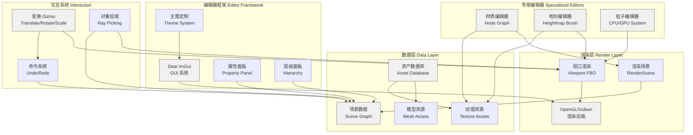

# 第五阶段：工具链与编辑器

在前面的阶段中，我们逐步构建了渲染引擎、物理模拟、动画系统、音频处理和网络同步等核心子系统。这些模块构成了游戏引擎的运行时（Runtime）基础，但要将这些技术转化为实际的游戏产品，我们还需要一个同样重要的组成部分——工具链（Toolchain）。工具链是连接引擎技术与内容创作者的桥梁，其质量直接决定了开发团队的迭代效率和最终产品的表现力。一个设计精良的编辑器能够让美术师、设计师和程序员在统一的 Workflow 中高效协作；而一条自动化的资产流水线（Asset Pipeline）则能确保从源资产到运行时资源的无缝、可重复、可追溯的转换过程。

本阶段将深入探讨两个核心主题：编辑器开发和资产流水线。前者聚焦于如何使用 Dear ImGui 构建专业的游戏编辑器，涵盖场景编辑、材质节点图、地形编辑和粒子系统编辑等关键工具的实现；后者则关注如何设计和实现一条高效的资产流水线，包括多格式导入器、纹理压缩、模型 LOD 生成、资产数据库以及构建系统。这些内容不仅是引擎开发的必要技能，更是区分一个"可用的引擎"与一个"生产级的引擎"的关键标志。

## 5.1 编辑器开发

游戏编辑器是开发团队日常交互最频繁的界面。从早期的命令行工具到现代的所见即所得（WYSIWYG）环境，编辑器的设计理念经历了深刻的演变。现代游戏引擎普遍采用即时模式图形用户界面（Immediate Mode GUI，简称 IMGUI）框架来构建编辑器界面，其中 Dear ImGui（简称 ImGui）因其轻量、高效和与图形 API 的紧密集成而成为业界事实上的标准选择。

### 5.1.1 Immediate Mode GUI：Dear ImGui 框架深入

Dear ImGui 的核心设计哲学与传统的保留模式 GUI（Retained Mode GUI，如 Qt、WPF）截然不同。在保留模式中，UI 状态存储于一棵持久化的控件树中，每次更新需要同步数据和 UI 状态；而 ImGui 则采用函数调用驱动的范式——每一帧，用户代码直接描述"这一帧应该显示什么"，ImGui 负责处理输入、布局和绘制。这种设计带来了几个关键优势：首先，与游戏循环的集成极为自然，因为每一帧都重新生成 UI，天然支持动态数据和实时预览；其次，状态管理被大幅简化，无需维护复杂的控件生命周期；最后，ImGui 的实现极为紧凑，核心库仅包含数千行代码，便于理解和定制。

#### ImGui 与 OpenGL 的集成

将 ImGui 集成到自研引擎中的首要任务是建立渲染后端（Render Backend）和平台后端（Platform Backend）。渲染后端负责将 ImGui 生成的顶点数据提交到 GPU，平台后端则处理窗口事件和输入。以下是一个完整的 OpenGL 3.3 Core Profile 后端实现，包含初始化、每帧更新和渲染的完整流程。

```cpp
// imgui_opengl_backend.h
// Dear ImGui OpenGL 3.3 Core Profile 渲染后端
#pragma once

#include <imgui.h>
#include <GL/glew.h>
#include <GLFW/glfw3.h>

namespace engine {

// ImGuiOpenGLBackend 负责将 ImGui 的绘制命令转换为 OpenGL 调用
class ImGuiOpenGLBackend {
public:
    // Shader 程序句柄
    GLuint shaderProgram_ = 0;
    // 顶点数组对象（VAO），用于存储顶点属性配置
    GLuint vao_ = 0;
    // 顶点缓冲对象（VBO），存储 ImGui 生成的顶点数据
    GLuint vbo_ = 0;
    // 索引缓冲对象（EBO），存储绘制顺序
    GLuint ebo_ = 0;
    // 字体纹理 ID
    GLuint fontTexture_ = 0;
    // Uniform 变量位置缓存
    GLint locTex_ = 0;      // 纹理采样器位置
    GLint locProjMtx_ = 0;  // 投影矩阵位置
    // 顶点缓冲区容量，用于动态扩容
    size_t vboCapacity_ = 0;
    size_t eboCapacity_ = 0;

    // 构造函数仅做基础初始化，实际的 OpenGL 资源创建在 Init() 中完成
    ImGuiOpenGLBackend() = default;

    // 初始化：编译 Shader、创建缓冲区、构建字体纹理
    bool Init() {
        // 顶点 Shader：将 ImGui 的顶点坐标从物体空间转换到裁剪空间
        const char* vertexShaderSource = R"(#version 330 core
            layout(location = 0) in vec2 aPos;       // 顶点位置（像素坐标）
            layout(location = 1) in vec2 aTexCoord;  // 纹理坐标
            layout(location = 2) in vec4 aColor;     // 顶点颜色（RGBA）
            uniform mat4 uProjMtx;                    // 正交投影矩阵
            out vec4 vColor;                          // 传递给片段 Shader 的颜色
            out vec2 vTexCoord;                       // 传递给片段 Shader 的纹理坐标
            void main() {
                gl_Position = uProjMtx * vec4(aPos.xy, 0.0, 1.0);
                vColor = aColor;
                vTexCoord = aTexCoord;
            }
        )";

        // 片段 Shader：采样字体纹理并与顶点颜色相乘
        const char* fragmentShaderSource = R"(#version 330 core
            in vec4 vColor;
            in vec2 vTexCoord;
            uniform sampler2D uTexture;  // 字体纹理采样器
            out vec4 FragColor;
            void main() {
                // ImGui 使用纹理的 R 通道存储字体距离场/灰度信息
                FragColor = vColor * texture(uTexture, vTexCoord).r;
            }
        )";

        // 编译和链接 Shader 程序
        GLuint vertShader = glCreateShader(GL_VERTEX_SHADER);
        glShaderSource(vertShader, 1, &vertexShaderSource, nullptr);
        glCompileShader(vertShader);

        GLuint fragShader = glCreateShader(GL_FRAGMENT_SHADER);
        glShaderSource(fragShader, 1, &fragmentShaderSource, nullptr);
        glCompileShader(fragShader);

        shaderProgram_ = glCreateProgram();
        glAttachShader(shaderProgram_, vertShader);
        glAttachShader(shaderProgram_, fragShader);
        glLinkProgram(shaderProgram_);
        glDeleteShader(vertShader);
        glDeleteShader(fragShader);

        // 获取 Uniform 变量位置，避免每帧重复查询
        locTex_ = glGetUniformLocation(shaderProgram_, "uTexture");
        locProjMtx_ = glGetUniformLocation(shaderProgram_, "uProjMtx");

        // 创建 VAO/VBO/EBO，使用 OpenGL 3.3 Core Profile 要求的 VAO
        glGenVertexArrays(1, &vao_);
        glGenBuffers(1, &vbo_);
        glGenBuffers(1, &ebo_);

        glBindVertexArray(vao_);
        glBindBuffer(GL_ARRAY_BUFFER, vbo_);
        // 顶点结构：vec2 pos + vec2 uv + uint32 color = 20 字节
        glEnableVertexAttribArray(0);
        glVertexAttribPointer(0, 2, GL_FLOAT, GL_FALSE, sizeof(ImDrawVert),
                              (void*)offsetof(ImDrawVert, pos));
        glEnableVertexAttribArray(1);
        glVertexAttribPointer(1, 2, GL_FLOAT, GL_FALSE, sizeof(ImDrawVert),
                              (void*)offsetof(ImDrawVert, uv));
        glEnableVertexAttribArray(2);
        // ImGui 将颜色打包为 32 位无符号整数（RGBA8），需要以 GL_UNSIGNED_BYTE 解析
        glVertexAttribPointer(2, 4, GL_UNSIGNED_BYTE, GL_TRUE, sizeof(ImDrawVert),
                              (void*)offsetof(ImDrawVert, col));

        // 构建字体纹理：ImGui 需要一张纹理来渲染所有文本
        BuildFontTexture();
        return true;
    }

    // 构建字体纹理：将 ImGui 的字体图集上传到 GPU
    void BuildFontTexture() {
        ImGuiIO& io = ImGui::GetIO();
        unsigned char* pixels;
        int width, height;
        // 加载默认字体并生成 8 位灰度图集（Alpha 通道）
        io.Fonts->GetTexDataAsAlpha8(&pixels, &width, &height);

        glGenTextures(1, &fontTexture_);
        glBindTexture(GL_TEXTURE_2D, fontTexture_);
        glTexParameteri(GL_TEXTURE_2D, GL_TEXTURE_MIN_FILTER, GL_LINEAR);
        glTexParameteri(GL_TEXTURE_2D, GL_TEXTURE_MAG_FILTER, GL_LINEAR);
        glTexParameteri(GL_TEXTURE_2D, GL_TEXTURE_WRAP_S, GL_CLAMP_TO_EDGE);
        glTexParameteri(GL_TEXTURE_2D, GL_TEXTURE_WRAP_T, GL_CLAMP_TO_EDGE);
        glTexImage2D(GL_TEXTURE_2D, 0, GL_R8, width, height, 0, GL_RED, GL_UNSIGNED_BYTE, pixels);

        // 将纹理 ID 存储到 ImGuiIO 中，供 ImGui 在生成绘制命令时使用
        io.Fonts->SetTexID((ImTextureID)(intptr_t)fontTexture_);
    }

    // 每帧调用：将 ImGui 的绘制数据提交到 GPU
    void RenderDrawData(ImDrawData* drawData) {
        if (drawData->CmdListsCount == 0) return;

        // 保存当前的 OpenGL 状态，渲染完成后恢复
        GLint lastProgram, lastVAO, lastVBO, lastEBO, lastTexture;
        glGetIntegerv(GL_CURRENT_PROGRAM, &lastProgram);
        glGetIntegerv(GL_VERTEX_ARRAY_BINDING, &lastVAO);
        glGetIntegerv(GL_ARRAY_BUFFER_BINDING, &lastVBO);
        glGetIntegerv(GL_ELEMENT_ARRAY_BUFFER_BINDING, &lastEBO);
        glGetIntegerv(GL_TEXTURE_BINDING_2D, &lastTexture);

        // 计算正交投影矩阵，将 ImGui 的屏幕坐标映射到 OpenGL 裁剪空间
        // ImGui 的坐标系：原点 (0,0) 在左上角，X 向右，Y 向下
        float L = drawData->DisplayPos.x;
        float R = drawData->DisplayPos.x + drawData->DisplaySize.x;
        float T = drawData->DisplayPos.y;
        float B = drawData->DisplayPos.y + drawData->DisplaySize.y;
        const float orthoProj[4][4] = {
            { 2.0f/(R-L),   0.0f,           0.0f, 0.0f },
            { 0.0f,         2.0f/(T-B),     0.0f, 0.0f },  // 注意 Y 轴翻转
            { 0.0f,         0.0f,          -1.0f, 0.0f },  // Z 轴映射到 [-1, 0]
            { (R+L)/(L-R),  (T+B)/(B-T),    0.0f, 1.0f },
        };

        glUseProgram(shaderProgram_);
        glUniformMatrix4fv(locProjMtx_, 1, GL_FALSE, &orthoProj[0][0]);
        glUniform1i(locTex_, 0);  // 激活纹理单元 0

        glBindVertexArray(vao_);

        // 遍历所有 ImDrawList（每个窗口对应一个 DrawList）
        for (int n = 0; n < drawData->CmdListsCount; n++) {
            const ImDrawList* cmdList = drawData->CmdLists[n];

            // 动态扩容 VBO 以确保容纳所有顶点数据
            size_t vtxBufferSize = cmdList->VtxBuffer.Size * sizeof(ImDrawVert);
            if (vboCapacity_ < vtxBufferSize) {
                vboCapacity_ = vtxBufferSize;
                glBufferData(GL_ARRAY_BUFFER, vboCapacity_, nullptr, GL_STREAM_DRAW);
            }
            glBufferSubData(GL_ARRAY_BUFFER, 0, vtxBufferSize, cmdList->VtxBuffer.Data);

            // 动态扩容 EBO
            size_t idxBufferSize = cmdList->IdxBuffer.Size * sizeof(ImDrawIdx);
            if (eboCapacity_ < idxBufferSize) {
                eboCapacity_ = idxBufferSize;
                glBufferData(GL_ELEMENT_ARRAY_BUFFER, eboCapacity_, nullptr, GL_STREAM_DRAW);
            }
            glBufferSubData(GL_ELEMENT_ARRAY_BUFFER, 0, idxBufferSize, cmdList->IdxBuffer.Data);

            // 遍历绘制命令，每个命令对应一个渲染批次（通常是一个纹理切换或裁剪区域变更）
            for (int cmdI = 0; cmdI < cmdList->CmdBuffer.Size; cmdI++) {
                const ImDrawCmd* pcmd = &cmdList->CmdBuffer[cmdI];

                // 设置裁剪矩形（scissor），ImGui 使用像素坐标
                GLint clipX = (GLint)(pcmd->ClipRect.x - drawData->DisplayPos.x);
                GLint clipY = (GLint)(pcmd->ClipRect.y - drawData->DisplayPos.y);
                GLint clipW = (GLint)(pcmd->ClipRect.z - pcmd->ClipRect.x);
                GLint clipH = (GLint)(pcmd->ClipRect.w - pcmd->ClipRect.y);
                glScissor(clipX, clipY, clipW, clipH);
                glEnable(GL_SCISSOR_TEST);

                // 绑定纹理并绘制
                glActiveTexture(GL_TEXTURE0);
                glBindTexture(GL_TEXTURE_2D, (GLuint)(intptr_t)pcmd->TextureId);
                // 使用 GL_TRIANGLES 模式绘制索引几何体
                glDrawElements(GL_TRIANGLES, (GLsizei)pcmd->ElemCount,
                               sizeof(ImDrawIdx) == 2 ? GL_UNSIGNED_SHORT : GL_UNSIGNED_INT,
                               (void*)(intptr_t)(pcmd->IdxOffset * sizeof(ImDrawIdx)));
            }
        }

        // 恢复 OpenGL 状态
        glDisable(GL_SCISSOR_TEST);
        glUseProgram(lastProgram);
        glBindVertexArray(lastVAO);
        glBindBuffer(GL_ARRAY_BUFFER, lastVBO);
        glBindBuffer(GL_ELEMENT_ARRAY_BUFFER, lastEBO);
        glBindTexture(GL_TEXTURE_2D, lastTexture);
    }

    // 释放所有 OpenGL 资源
    void Shutdown() {
        glDeleteTextures(1, &fontTexture_);
        glDeleteBuffers(1, &vbo_);
        glDeleteBuffers(1, &ebo_);
        glDeleteVertexArrays(1, &vao_);
        glDeleteProgram(shaderProgram_);
    }
};

} // namespace engine
```

上述代码展示了 ImGui 渲染后端的核心机制。关键在于理解 ImGui 如何将复杂的 UI 层次结构分解为简单的绘制命令流。每帧，`ImDrawData` 包含多个 `ImDrawList`，每个 `ImDrawList` 又包含顶点缓冲区、索引缓冲区和绘制命令列表。`ImDrawCmd` 描述了一个渲染批次：它引用了纹理 ID、定义了裁剪矩形，并指定了索引缓冲区中的范围。这种设计使得后端实现极为通用——无论 UI 多么复杂，最终都归结为"绑定纹理、设置裁剪、绘制三角形"这一基本操作。

在平台后端方面，我们需要将窗口系统的输入事件传递给 ImGui。以 GLFW 为例，鼠标、键盘和字符输入需要被转发：

```cpp
// imgui_glfw_platform.h
// Dear ImGui GLFW 平台后端：处理输入事件转发
#pragma once

#include <imgui.h>
#include <GLFW/glfw3.h>

namespace engine {

class ImGuiGlfwPlatform {
public:
    GLFWwindow* window_ = nullptr;
    // 存储上一帧的鼠标位置，用于计算鼠标增量
    double lastMouseX_ = 0.0, lastMouseY_ = 0.0;

    void Init(GLFWwindow* window) {
        window_ = window;
        ImGuiIO& io = ImGui::GetIO();

        // 设置 ImGuiIO 的关键配置
        io.BackendPlatformName = "engine_glfw";
        io.ConfigFlags |= ImGuiConfigFlags_DockingEnable;  // 启用窗口停靠
        io.ConfigFlags |= ImGuiConfigFlags_ViewportsEnable; // 允许多视口（窗口拖出主窗口）

        // 绑定 GLFW 回调函数
        glfwSetMouseButtonCallback(window, MouseButtonCallback);
        glfwSetScrollCallback(window, ScrollCallback);
        glfwSetKeyCallback(window, KeyCallback);
        glfwSetCharCallback(window, CharCallback);

        // 将 this 指针存储到 GLFW 窗口用户指针中，供回调函数访问
        glfwSetWindowUserPointer(window, this);
    }

    // 每帧更新：同步鼠标位置、更新显示尺寸、处理时间增量
    void NewFrame() {
        ImGuiIO& io = ImGui::GetIO();

        // 获取窗口尺寸（考虑高 DPI 显示器的帧缓冲区缩放）
        int w, h;
        int displayW, displayH;
        glfwGetWindowSize(window_, &w, &h);
        glfwGetFramebufferSize(window_, &displayW, &displayH);
        // DisplaySize 使用逻辑像素（窗口坐标），帧缓冲比例用于缩放输入坐标
        io.DisplaySize = ImVec2((float)w, (float)h);
        io.DisplayFramebufferScale = ImVec2(
            w > 0 ? ((float)displayW / w) : 0.0f,
            h > 0 ? ((float)displayH / h) : 0.0f
        );

        // 更新时间增量（Delta Time）
        double currentTime = glfwGetTime();
        io.DeltaTime = lastTime_ > 0.0 ? (float)(currentTime - lastTime_) : 1.0f / 60.0f;
        lastTime_ = currentTime;

        // 更新鼠标位置
        if (glfwGetWindowAttrib(window_, GLFW_FOCUSED)) {
            double mouseX, mouseY;
            glfwGetCursorPos(window_, &mouseX, &mouseY);
            io.MousePos = ImVec2((float)mouseX * io.DisplayFramebufferScale.x,
                                 (float)mouseY * io.DisplayFramebufferScale.y);
        } else {
            io.MousePos = ImVec2(-FLT_MAX, -FLT_MAX);
        }

        // 更新鼠标按钮状态（ImGui 需要跟踪鼠标按下/释放以处理点击）
        for (int i = 0; i < 3; i++) {
            io.MouseDown[i] = mousePressed_[i] || glfwGetMouseButton(window_, i) != 0;
            mousePressed_[i] = false;  // 重置单帧事件标志
        }

        // 更新鼠标滚轮
        io.MouseWheel = mouseWheelY_;
        mouseWheelY_ = 0.0f;
    }

private:
    double lastTime_ = 0.0;
    bool mousePressed_[3] = {false, false, false};
    float mouseWheelY_ = 0.0f;

    static void MouseButtonCallback(GLFWwindow* window, int button, int action, int /*mods*/) {
        auto* platform = static_cast<ImGuiGlfwPlatform*>(glfwGetWindowUserPointer(window));
        if (button >= 0 && button < 3 && action == GLFW_PRESS) {
            platform->mousePressed_[button] = true;
        }
    }

    static void ScrollCallback(GLFWwindow* window, double /*xoffset*/, double yoffset) {
        auto* platform = static_cast<ImGuiGlfwPlatform*>(glfwGetWindowUserPointer(window));
        platform->mouseWheelY_ = (float)yoffset;
    }

    static void KeyCallback(GLFWwindow* window, int key, int /*scancode*/, int action, int /*mods*/) {
        ImGuiIO& io = ImGui::GetIO();
        if (key >= 0 && key < IM_ARRAYSIZE(io.KeysDown)) {
            io.KeysDown[key] = (action == GLFW_PRESS || action == GLFW_REPEAT);
        }
        io.KeyCtrl = io.KeysDown[GLFW_KEY_LEFT_CONTROL] || io.KeysDown[GLFW_KEY_RIGHT_CONTROL];
        io.KeyShift = io.KeysDown[GLFW_KEY_LEFT_SHIFT] || io.KeysDown[GLFW_KEY_RIGHT_SHIFT];
        io.KeyAlt = io.KeysDown[GLFW_KEY_LEFT_ALT] || io.KeysDown[GLFW_KEY_RIGHT_ALT];
    }

    static void CharCallback(GLFWwindow* /*window*/, unsigned int c) {
        ImGuiIO& io = ImGui::GetIO();
        io.AddInputCharacter(c);  // 将 UTF-16 字符码点传递给 ImGui
    }
};

} // namespace engine
```

在引擎的主循环中，ImGui 的调用顺序遵循固定的三阶段模式：`ImGui::NewFrame()` 开始一帧的 UI 描述，`ImGui::Render()` 结束描述并生成绘制数据，最后由后端执行实际的 GPU 提交：

```cpp
// engine_editor_main.cpp
// 引擎主循环中的 ImGui 集成示例
#include <imgui.h>
#include <GLFW/glfw3.h>
#include "imgui_opengl_backend.h"
#include "imgui_glfw_platform.h"

int main() {
    // 初始化 GLFW 窗口和 OpenGL 上下文
    glfwInit();
    GLFWwindow* window = glfwCreateWindow(1600, 900, "Engine Editor", nullptr, nullptr);
    glfwMakeContextCurrent(window);
    glewInit();

    // 初始化 ImGui 上下文
    IMGUI_CHECKVERSION();
    ImGui::CreateContext();
    ImGui::StyleColorsDark();  // 使用暗色主题

    // 初始化平台后端和渲染后端
    engine::ImGuiGlfwPlatform platform;
    platform.Init(window);
    engine::ImGuiOpenGLBackend renderer;
    renderer.Init();

    // 主循环
    while (!glfwWindowShouldClose(window)) {
        glfwPollEvents();

        // 阶段 1：开始新帧
        platform.NewFrame();
        ImGui::NewFrame();

        // 阶段 2：描述所有 UI 元素（这一部分是开发者主要编写的内容）
        ShowEditorUI();

        // 阶段 3：生成绘制数据并提交到 GPU
        ImGui::Render();
        int displayW, displayH;
        glfwGetFramebufferSize(window, &displayW, &displayH);
        glViewport(0, 0, displayW, displayH);
        glClearColor(0.1f, 0.1f, 0.1f, 1.0f);
        glClear(GL_COLOR_BUFFER_BIT);
        renderer.RenderDrawData(ImGui::GetDrawData());

        glfwSwapBuffers(window);
    }

    // 清理
    renderer.Shutdown();
    ImGui::DestroyContext();
    glfwDestroyWindow(window);
    glfwTerminate();
    return 0;
}
```

#### 控件系统与自定义绘制

ImGui 提供了丰富的内置控件，包括窗口（`Begin/End`）、按钮（`Button`）、文本输入（`InputText`）、滑动条（`SliderFloat`）、树形控件（`TreeNode`）等。这些控件的使用遵循统一的模式：调用函数即表示"创建并使用"，返回值表示用户是否与之交互。对于游戏编辑器而言，几个关键控件值得深入理解。

树形控件在场景层次结构（Scene Hierarchy）面板中 indispensable。`ImGui::TreeNodeEx` 允许通过标志控制节点的展开状态、选中状态和叶节点标识：

```cpp
// 场景层次面板示例：递归渲染场景图
void DrawSceneHierarchy(GameObject* root, GameObject*& selectedObject) {
    // ImGuiTreeNodeFlags_OpenOnArrow：仅在点击箭头时展开，点击标签则选中
    // ImGuiTreeNodeFlags_SpanAvailWidth：节点宽度铺满整个面板
    ImGuiTreeNodeFlags flags = ImGuiTreeNodeFlags_OpenOnArrow |
                               ImGuiTreeNodeFlags_SpanAvailWidth;
    if (root->children.empty()) {
        flags |= ImGuiTreeNodeFlags_Leaf;  // 无子节点时显示为叶子
    }
    if (selectedObject == root) {
        flags |= ImGuiTreeNodeFlags_Selected;  // 高亮当前选中的对象
    }

    bool nodeOpen = ImGui::TreeNodeEx(root->name.c_str(), flags);
    // 处理点击选中：点击节点标签时设为选中对象
    if (ImGui::IsItemClicked() && !ImGui::IsItemToggledOpen()) {
        selectedObject = root;
    }

    if (nodeOpen) {
        for (auto* child : root->children) {
            DrawSceneHierarchy(child, selectedObject);
        }
        ImGui::TreePop();  // 必须与 TreeNodeEx 成对调用
    }
}
```

属性面板（Property Panel）是编辑器的另一个核心组件，它允许用户查看和修改选中对象的各种属性。利用 ImGui 的数据编辑控件和反射系统，可以自动为任意 C++ 结构体生成编辑界面。以下是一个基于模板和类型萃取的自动属性面板框架：

```cpp
// property_panel.h
// 基于类型反射的自动属性面板
#pragma once

#include <imgui.h>
#include <string>
#include <vector>
#include <functional>
#include <glm/glm.hpp>
#include <glm/gtc/type_ptr.hpp>

namespace engine {

// 属性描述符，用于存储字段的元数据
struct PropertyField {
    std::string name;           // 属性显示名称
    std::string typeName;       // 类型名称
    size_t offset;              // 在结构体中的字节偏移
    std::function<void(void* obj, const PropertyField& field)> drawer;  // 绘制函数
};

// 属性注册宏，简化反射信息注册
#define REGISTER_PROPERTY(TYPE, FIELD) \
    properties.push_back({#FIELD, #TYPE, offsetof(CLASS_TYPE, FIELD), \
        [](void* obj, const PropertyField& f) { \
            auto* ptr = static_cast<CLASS_TYPE*>(obj); \
            DrawPropertyEditor(#FIELD, ptr->FIELD); \
        }})

// 类型特化的属性编辑器
inline void DrawPropertyEditor(const char* label, float& value) {
    ImGui::DragFloat(label, &value, 0.1f);  // 拖动编辑浮点数
}

inline void DrawPropertyEditor(const char* label, int& value) {
    ImGui::DragInt(label, &value, 1);
}

inline void DrawPropertyEditor(const char* label, bool& value) {
    ImGui::Checkbox(label, &value);
}

inline void DrawPropertyEditor(const char* label, glm::vec3& value) {
    ImGui::DragFloat3(label, glm::value_ptr(value), 0.1f);
}

inline void DrawPropertyEditor(const char* label, glm::vec4& value) {
    ImGui::ColorEdit4(label, glm::value_ptr(value));  // 颜色拾取器
}

inline void DrawPropertyEditor(const char* label, std::string& value) {
    // std::string 需要转换为固定缓冲区进行编辑
    char buffer[256];
    strncpy(buffer, value.c_str(), sizeof(buffer) - 1);
    buffer[sizeof(buffer) - 1] = '\0';
    if (ImGui::InputText(label, buffer, sizeof(buffer))) {
        value = buffer;
    }
}

// 通用属性面板绘制函数
inline void DrawPropertyPanel(const char* title, void* object,
                             const std::vector<PropertyField>& properties) {
    ImGui::Begin(title);
    for (const auto& prop : properties) {
        void* fieldPtr = static_cast<char*>(object) + prop.offset;
        prop.drawer(fieldPtr, prop);
    }
    ImGui::End();
}

} // namespace engine
```

在实际使用中，我们只需为每个组件类型注册其字段，然后调用 `DrawPropertyPanel` 即可自动生成编辑界面：

```cpp
// 使用示例：为 Transform 组件自动生成属性面板
void ShowTransformEditor(TransformComponent& transform) {
    #undef CLASS_TYPE
    #define CLASS_TYPE TransformComponent
    std::vector<engine::PropertyField> props;
    REGISTER_PROPERTY(glm::vec3, position);
    REGISTER_PROPERTY(glm::vec3, rotation);
    REGISTER_PROPERTY(glm::vec3, scale);
    engine::DrawPropertyPanel("Transform", &transform, props);
}
```

#### 主题定制与编辑器视觉风格

ImGui 内置了 Classic、Light 和 Dark 三种主题，但专业编辑器通常需要定制化的视觉风格以匹配引擎品牌。主题定制通过修改 `ImGuiStyle` 结构体中的颜色和参数来实现。`ImGuiStyle` 定义了 50+ 个颜色条目（`ImGuiCol_*` 枚举），覆盖从窗口背景到按钮高亮的所有视觉元素。

以下是一个为游戏引擎编辑器设计的专业暗色主题：

```cpp
void SetupEngineEditorTheme() {
    ImGuiStyle& style = ImGui::GetStyle();
    ImVec4* colors = style.Colors;

    // 基础色调：深蓝灰色系，减少视觉疲劳
    colors[ImGuiCol_WindowBg]             = ImVec4(0.15f, 0.16f, 0.18f, 1.0f);
    colors[ImGuiCol_ChildBg]              = ImVec4(0.13f, 0.14f, 0.16f, 1.0f);
    colors[ImGuiCol_MenuBarBg]            = ImVec4(0.12f, 0.13f, 0.15f, 1.0f);
    colors[ImGuiCol_TitleBg]              = ImVec4(0.10f, 0.11f, 0.13f, 1.0f);
    colors[ImGuiCol_TitleBgActive]        = ImVec4(0.18f, 0.40f, 0.80f, 1.0f);  // 激活窗口标题使用蓝色
    colors[ImGuiCol_TitleBgCollapsed]     = ImVec4(0.10f, 0.11f, 0.13f, 0.5f);

    // 交互元素
    colors[ImGuiCol_Button]               = ImVec4(0.20f, 0.22f, 0.25f, 1.0f);
    colors[ImGuiCol_ButtonHovered]        = ImVec4(0.28f, 0.30f, 0.35f, 1.0f);
    colors[ImGuiCol_ButtonActive]         = ImVec4(0.35f, 0.50f, 0.90f, 1.0f);
    colors[ImGuiCol_FrameBg]              = ImVec4(0.10f, 0.11f, 0.13f, 1.0f);
    colors[ImGuiCol_FrameBgHovered]       = ImVec4(0.18f, 0.20f, 0.23f, 1.0f);
    colors[ImGuiCol_FrameBgActive]        = ImVec4(0.25f, 0.45f, 0.85f, 1.0f);

    // 选中与强调色
    colors[ImGuiCol_Header]               = ImVec4(0.18f, 0.40f, 0.80f, 0.5f);
    colors[ImGuiCol_HeaderHovered]        = ImVec4(0.22f, 0.50f, 0.95f, 0.7f);
    colors[ImGuiCol_HeaderActive]         = ImVec4(0.25f, 0.55f, 1.0f, 1.0f);

    // 边框与分割线
    colors[ImGuiCol_Border]               = ImVec4(0.08f, 0.09f, 0.10f, 0.5f);
    colors[ImGuiCol_Separator]            = ImVec4(0.20f, 0.22f, 0.25f, 0.5f);
    colors[ImGuiCol_SeparatorHovered]     = ImVec4(0.35f, 0.50f, 0.90f, 0.7f);
    colors[ImGuiCol_SeparatorActive]      = ImVec4(0.35f, 0.50f, 0.90f, 1.0f);

    // 文本颜色
    colors[ImGuiCol_Text]                 = ImVec4(0.85f, 0.87f, 0.91f, 1.0f);
    colors[ImGuiCol_TextDisabled]         = ImVec4(0.45f, 0.47f, 0.50f, 1.0f);

    // 样式参数调整
    style.WindowRounding    = 4.0f;   // 窗口圆角
    style.FrameRounding     = 3.0f;   // 输入框圆角
    style.GrabRounding      = 3.0f;   // 滑块抓取器圆角
    style.ChildRounding     = 3.0f;
    style.PopupRounding     = 4.0f;
    style.ScrollbarRounding = 6.0f;
    style.TabRounding       = 4.0f;
    style.WindowBorderSize  = 1.0f;
    style.FrameBorderSize   = 0.0f;
    style.PopupBorderSize   = 1.0f;
    style.WindowPadding     = ImVec2(8.0f, 8.0f);
    style.FramePadding      = ImVec2(6.0f, 4.0f);
    style.ItemSpacing       = ImVec2(6.0f, 4.0f);
    style.IndentSpacing     = 20.0f;
}
```

除了全局主题，ImGui 还支持自定义绘制（`ImDrawList` API），允许开发者在任意窗口内绘制基本几何体、文本和图像。这在实现视口叠加信息（Viewport Overlay）、Gizmo 可视化、曲线编辑器等方面至关重要。`ImDrawList` 提供了 `AddLine`、`AddRect`、`AddCircle`、`AddText`、`AddImage` 等方法，这些方法与 ImGui 的自动布局系统无缝协作。

#### 编辑器整体架构

游戏编辑器的模块间协作关系可以用以下架构图描述。该架构展示了从底层渲染后端到上层专用工具的层次关系，以及各模块之间的数据流向：



该架构采用分层设计：渲染层负责与 GPU 交互，提供 ImGui 绘制和场景渲染的基础能力；编辑器框架层提供通用的 UI 控件和布局系统；交互系统处理用户的鼠标/键盘输入，将其转换为对场景数据的操作；专用编辑器则面向特定的子系统（材质、地形、粒子）提供专业的可视化编辑环境。所有编辑器最终操作的数据统一存储在场景图和资产数据库中，确保了数据的一致性和持久性。


### 5.1.2 场景编辑器

场景编辑器是游戏开发工具链中最核心的组件。它为开发团队提供了一个所见即所得的环境，用于构建游戏世界、布置游戏对象、调整光照和相机参数。一个功能完备的场景编辑器需要包含四个关键子系统：视口渲染（Viewport）、变换操控器（Gizmo）、对象选择（Picking）和撤销重做（Undo/Redo）。

#### 视口渲染（Viewport）

视口是场景编辑器的核心交互区域，它将引擎的渲染输出嵌入到编辑器窗口中。在 ImGui 中实现视口的技术方案是将场景渲染到帧缓冲对象（Framebuffer Object，FBO），然后将 FBO 的颜色附件作为纹理在 ImGui 窗口中显示。

```cpp
// viewport.h
// 场景视口：将引擎渲染输出嵌入 ImGui 窗口
#pragma once

#include <GL/glew.h>
#include <imgui.h>
#include <glm/glm.hpp>
#include <glm/gtc/matrix_transform.hpp>

namespace engine {

class SceneViewport {
public:
    // FBO 相关 OpenGL 对象
    GLuint fbo_ = 0;              // 帧缓冲对象
    GLuint colorTexture_ = 0;     // 颜色附件纹理
    GLuint depthRbo_ = 0;         // 深度渲染缓冲对象
    int width_ = 1280;            // 当前 FBO 宽度
    int height_ = 720;            // 当前 FBO 高度

    // 编辑器相机参数
    glm::vec3 cameraPos_ = glm::vec3(10.0f, 10.0f, 10.0f);
    glm::vec3 cameraTarget_ = glm::vec3(0.0f, 0.0f, 0.0f);
    float cameraYaw_ = -45.0f;    // 水平旋转角度
    float cameraPitch_ = -35.0f;  // 垂直俯仰角度
    float cameraDistance_ = 17.3f;// 到目标的距离
    float fov_ = 60.0f;           // 视场角
    float nearPlane_ = 0.1f;
    float farPlane_ = 1000.0f;

    bool isFocused_ = false;      // 视口是否获得焦点
    bool isHovered_ = false;      // 鼠标是否悬停在视口上

    void Init() {
        CreateFramebuffer(width_, height_);
    }

    // 创建/重建帧缓冲，当视口尺寸变化时调用
    void CreateFramebuffer(int w, int h) {
        // 删除旧资源
        if (fbo_) { glDeleteFramebuffers(1, &fbo_); }
        if (colorTexture_) { glDeleteTextures(1, &colorTexture_); }
        if (depthRbo_) { glDeleteRenderbuffers(1, &depthRbo_); }

        width_ = w; height_ = h;

        // 创建颜色附件纹理
        glGenTextures(1, &colorTexture_);
        glBindTexture(GL_TEXTURE_2D, colorTexture_);
        glTexImage2D(GL_TEXTURE_2D, 0, GL_RGBA8, w, h, 0, GL_RGBA, GL_UNSIGNED_BYTE, nullptr);
        glTexParameteri(GL_TEXTURE_2D, GL_TEXTURE_MIN_FILTER, GL_LINEAR);
        glTexParameteri(GL_TEXTURE_2D, GL_TEXTURE_MAG_FILTER, GL_LINEAR);

        // 创建深度/模板渲染缓冲
        glGenRenderbuffers(1, &depthRbo_);
        glBindRenderbuffer(GL_RENDERBUFFER, depthRbo_);
        glRenderbufferStorage(GL_RENDERBUFFER, GL_DEPTH24_STENCIL8, w, h);

        // 组装 FBO
        glGenFramebuffers(1, &fbo_);
        glBindFramebuffer(GL_FRAMEBUFFER, fbo_);
        glFramebufferTexture2D(GL_FRAMEBUFFER, GL_COLOR_ATTACHMENT0, GL_TEXTURE_2D, colorTexture_, 0);
        glFramebufferRenderbuffer(GL_FRAMEBUFFER, GL_DEPTH_STENCIL_ATTACHMENT, GL_RENDERBUFFER, depthRbo_);

        GLenum status = glCheckFramebufferStatus(GL_FRAMEBUFFER);
        if (status != GL_FRAMEBUFFER_COMPLETE) {
            // 错误处理：帧缓冲不完整
        }
        glBindFramebuffer(GL_FRAMEBUFFER, 0);
    }

    // 计算编辑器的观察矩阵和投影矩阵
    void UpdateCameraMatrices(glm::mat4& outView, glm::mat4& outProj) {
        // 球坐标转换为笛卡尔坐标
        float yawRad = glm::radians(cameraYaw_);
        float pitchRad = glm::radians(cameraPitch_);
        cameraPos_.x = cameraTarget_.x + cameraDistance_ * cosf(pitchRad) * cosf(yawRad);
        cameraPos_.y = cameraTarget_.y + cameraDistance_ * sinf(pitchRad);
        cameraPos_.z = cameraTarget_.z + cameraDistance_ * cosf(pitchRad) * sinf(yawRad);

        outView = glm::lookAt(cameraPos_, cameraTarget_, glm::vec3(0.0f, 1.0f, 0.0f));
        float aspect = width_ > 0 && height_ > 0 ? (float)width_ / (float)height_ : 1.0f;
        outProj = glm::perspective(glm::radians(fov_), aspect, nearPlane_, farPlane_);
    }

    // 每帧调用：渲染视口 ImGui 窗口和内部场景
    void Render(class Scene* scene, class Renderer* renderer) {
        ImGui::PushStyleVar(ImGuiStyleVar_WindowPadding, ImVec2(0, 0));
        ImGui::Begin("Scene Viewport", nullptr,
                     ImGuiWindowFlags_NoCollapse | ImGuiWindowFlags_MenuBar);

        isFocused_ = ImGui::IsWindowFocused();
        isHovered_ = ImGui::IsWindowHovered();

        // 获取内容区域尺寸
        ImVec2 contentSize = ImGui::GetContentRegionAvail();
        int newW = (int)contentSize.x;
        int newH = (int)contentSize.y;

        // 尺寸变化时重建 FBO
        if (newW > 0 && newH > 0 && (newW != width_ || newH != height_)) {
            CreateFramebuffer(newW, newH);
        }

        // 绑定 FBO 渲染场景
        glBindFramebuffer(GL_FRAMEBUFFER, fbo_);
        glViewport(0, 0, width_, height_);
        glClearColor(0.2f, 0.2f, 0.25f, 1.0f);
        glClear(GL_COLOR_BUFFER_BIT | GL_DEPTH_BUFFER_BIT);
        glEnable(GL_DEPTH_TEST);

        // 获取相机矩阵并渲染场景
        glm::mat4 view, proj;
        UpdateCameraMatrices(view, proj);
        if (scene && renderer && width_ > 0 && height_ > 0) {
            renderer->RenderScene(scene, view, proj, cameraPos_);
        }
        glBindFramebuffer(GL_FRAMEBUFFER, 0);

        // 在 ImGui 窗口中显示 FBO 纹理
        ImGui::Image((ImTextureID)(intptr_t)colorTexture_, contentSize,
                     ImVec2(0, 1), ImVec2(1, 0));  // UV 翻转：OpenGL 原点在左下，ImGui 在左上

        // 处理相机控制（仅在视口被悬停且按住右键时）
        HandleCameraInput();

        ImGui::End();
        ImGui::PopStyleVar();
    }

    // 处理编辑器相机的鼠标/键盘输入
    void HandleCameraInput() {
        if (!isHovered_) return;
        ImGuiIO& io = ImGui::GetIO();

        // 鼠标右键拖拽：旋转相机
        if (ImGui::IsMouseDown(ImGuiMouseButton_Right)) {
            ImVec2 delta = io.MouseDelta;
            cameraYaw_ += delta.x * 0.3f;
            cameraPitch_ += delta.y * 0.3f;
            // 限制俯仰角避免万向节死锁
            cameraPitch_ = glm::clamp(cameraPitch_, -89.0f, 89.0f);
        }

        // 鼠标中键拖拽：平移相机目标点
        if (ImGui::IsMouseDown(ImGuiMouseButton_Middle)) {
            ImVec2 delta = io.MouseDelta;
            glm::vec3 right = glm::normalize(
                glm::cross(cameraTarget_ - cameraPos_, glm::vec3(0.0f, 1.0f, 0.0f)));
            glm::vec3 up = glm::vec3(0.0f, 1.0f, 0.0f);
            cameraTarget_ += right * (-delta.x * 0.01f * cameraDistance_ * 0.1f);
            cameraTarget_ += up * (delta.y * 0.01f * cameraDistance_ * 0.1f);
        }

        // 滚轮：缩放相机距离
        cameraDistance_ -= io.MouseWheel * cameraDistance_ * 0.1f;
        cameraDistance_ = glm::clamp(cameraDistance_, 0.1f, 500.0f);
    }

    void Shutdown() {
        glDeleteFramebuffers(1, &fbo_);
        glDeleteTextures(1, &colorTexture_);
        glDeleteRenderbuffers(1, &depthRbo_);
    }
};

} // namespace engine
```

视口渲染的核心在于双缓冲策略：编辑器的 UI 渲染到默认帧缓冲，而 3D 场景渲染到离屏 FBO。这种方式的优势在于 ImGui 的窗口管理（停靠、浮动、调整大小）可以自然应用于 3D 视口，无需修改底层渲染器。FBO 的颜色附件以 `ImGui::Image` 的形式嵌入 UI，UV 坐标需要翻转（`ImVec2(0,1)` 到 `ImVec2(1,0)`），因为 OpenGL 的纹理原点在左下角，而 ImGui 的图像坐标原点在左上角。

#### Gizmo 实现：平移、旋转、缩放

变换操控器（Transform Gizmo）是场景编辑器中最关键的交互组件。它允许用户通过直观的鼠标拖拽来调整场景中对象的位置、旋转和缩放。Gizmo 的数学本质是在屏幕空间将 2D 鼠标位移映射到 3D 空间中的变换操作。

经典 Gizmo 设计使用三轴箭头（平移）、三个圆环（旋转）和三轴缩放手柄（缩放），每个轴使用标准颜色编码：X 红色、Y 绿色、Z 蓝色。以下是一个完整的平移 Gizmo 实现：

```cpp
// gizmo.h
// 3D 变换 Gizmo 实现：支持平移、旋转、缩放
#pragma once

#include <glm/glm.hpp>
#include <glm/gtc/matrix_transform.hpp>
#include <glm/gtx/intersect.hpp>
#include <glm/gtx/quaternion.hpp>
#include <imgui.h>
#include <algorithm>

namespace engine {

enum class GizmoOperation {
    Translate,
    Rotate,
    Scale
};

enum class GizmoAxis {
    None = -1,
    X = 0,
    Y = 1,
    Z = 2,
    XY = 3,
    YZ = 4,
    ZX = 5,
    XYZ = 6  // 均匀缩放
};

class TransformGizmo {
public:
    GizmoOperation operation_ = GizmoOperation::Translate;
    GizmoAxis activeAxis_ = GizmoAxis::None;

    // Gizmo 视觉参数
    float gizmoSize_ = 0.15f;       // 占屏幕的比例
    float arrowLength_ = 1.0f;
    float arrowHeadSize_ = 0.2f;
    float lineThickness_ = 3.0f;
    float hoverLineThickness_ = 5.0f;
    float circleRadius_ = 1.0f;
    float circleSegments_ = 64.0f;

    // 拖拽状态
    bool isDragging_ = false;
    glm::vec3 dragStartPosition_;    // 拖拽开始时的对象位置
    glm::vec3 dragStartPoint_;       // 拖拽开始时鼠标射线与操作平面的交点
    glm::quat dragStartRotation_;    // 拖拽开始时的对象旋转
    glm::vec3 dragStartScale_;       // 拖拽开始时的对象缩放

    // 轴颜色
    glm::vec4 axisColors_[3] = {
        glm::vec4(0.85f, 0.20f, 0.20f, 1.0f),  // X - 红
        glm::vec4(0.20f, 0.85f, 0.20f, 1.0f),  // Y - 绿
        glm::vec4(0.20f, 0.40f, 0.95f, 1.0f),  // Z - 蓝
    };
    glm::vec4 hoverColor_ = glm::vec4(1.0f, 1.0f, 0.0f, 1.0f);  // 悬停高亮 - 黄

    // 使用 ImDrawList 在视口窗口中绘制 Gizmo
    void Draw(ImDrawList* drawList, const glm::mat4& viewProj, const glm::vec2& viewportPos,
              const glm::vec2& viewportSize, TransformComponent& transform) {
        // 计算对象在屏幕空间的投影位置
        glm::vec4 worldPos = transform.GetModelMatrix() * glm::vec4(0.0f, 0.0f, 0.0f, 1.0f);
        glm::vec4 clipPos = viewProj * worldPos;
        if (clipPos.w <= 0.0f) return;  // 在相机后方，不绘制

        glm::vec2 screenPos = WorldToScreen(worldPos, viewProj, viewportPos, viewportSize);

        // 根据 Gizmo 占屏幕比例计算世界空间中的实际尺寸
        float screenSize = std::min(viewportSize.x, viewportSize.y) * gizmoSize_;
        float worldScale = CalculateWorldScale(worldPos, viewProj, viewportSize, screenSize);

        switch (operation_) {
            case GizmoOperation::Translate:
                DrawTranslateGizmo(drawList, viewProj, viewportPos, viewportSize,
                                   screenPos, worldScale, transform);
                break;
            case GizmoOperation::Rotate:
                DrawRotateGizmo(drawList, viewProj, viewportPos, viewportSize,
                                screenPos, worldScale, transform);
                break;
            case GizmoOperation::Scale:
                DrawScaleGizmo(drawList, viewProj, viewportPos, viewportSize,
                               screenPos, worldScale, transform);
                break;
        }
    }

    // 处理鼠标交互：射线检测和拖拽逻辑
    bool HandleInput(const glm::vec2& mousePos, const glm::vec2& viewportPos,
                     const glm::vec2& viewportSize, const glm::mat4& view, const glm::mat4& proj,
                     TransformComponent& transform) {
        glm::mat4 viewProj = proj * view;
        glm::vec3 worldPos = transform.position;

        // 构建鼠标射线
        glm::vec3 rayOrigin, rayDir;
        ScreenToWorldRay(mousePos, viewportPos, viewportSize, view, proj, rayOrigin, rayDir);

        if (!isDragging_) {
            // 射线检测：找到悬停的轴
            GizmoAxis prevAxis = activeAxis_;
            activeAxis_ = RaycastAxis(rayOrigin, rayDir, worldPos, viewProj, viewportSize, transform);
            return activeAxis_ != GizmoAxis::None;
        } else {
            // 正在拖拽：根据操作类型应用变换
            ApplyDragging(mousePos, viewportPos, viewportSize, view, proj, transform);
            // 检测鼠标释放
            if (!ImGui::IsMouseDown(ImGuiMouseButton_Left)) {
                isDragging_ = false;
                activeAxis_ = GizmoAxis::None;
            }
            return true;
        }
    }

    // 开始拖拽
    void StartDragging(const TransformComponent& transform) {
        isDragging_ = true;
        dragStartPosition_ = transform.position;
        dragStartRotation_ = transform.rotation;
        dragStartScale_ = transform.scale;
    }

private:
    // 将世界坐标转换为屏幕坐标
    glm::vec2 WorldToScreen(const glm::vec4& worldPos, const glm::mat4& viewProj,
                            const glm::vec2& viewportPos, const glm::vec2& viewportSize) {
        glm::vec4 clip = viewProj * worldPos;
        glm::vec3 ndc = glm::vec3(clip) / clip.w;
        return glm::vec2(
            viewportPos.x + (ndc.x * 0.5f + 0.5f) * viewportSize.x,
            viewportPos.y + (-ndc.y * 0.5f + 0.5f) * viewportSize.y  // Y 翻转
        );
    }

    // 计算使 Gizmo 在屏幕保持固定大小所需的世界空间缩放
    float CalculateWorldScale(const glm::vec4& worldPos, const glm::mat4& viewProj,
                             const glm::vec2& viewportSize, float desiredScreenSize) {
        glm::vec4 clip = viewProj * worldPos;
        // 使用视锥体参数估算世界缩放
        float fov = glm::radians(60.0f);
        float dist = glm::length(glm::vec3(worldPos) - glm::vec3(
            glm::inverse(viewProj)[3]));
        return (dist * desiredScreenSize) / viewportSize.y * 2.0f * tanf(fov * 0.5f);
    }

    // 绘制平移 Gizmo：三个轴向箭头 + 三个平面四边形
    void DrawTranslateGizmo(ImDrawList* drawList, const glm::mat4& viewProj,
                            const glm::vec2& vpPos, const glm::vec2& vpSize,
                            const glm::vec2& screenCenter, float worldScale,
                            const TransformComponent& transform) {
        // 三轴方向（考虑对象的局部/世界旋转模式）
        glm::vec3 axes[3] = {
            transform.GetRight(),
            transform.GetUp(),
            transform.GetForward()
        };

        for (int i = 0; i < 3; i++) {
            glm::vec3 axisWorld = axes[i];
            glm::vec4 startWorld = glm::vec4(transform.position, 1.0f);
            glm::vec4 endWorld = glm::vec4(transform.position + axisWorld * arrowLength_ * worldScale, 1.0f);

            glm::vec2 startScreen = WorldToScreen(startWorld, viewProj, vpPos, vpSize);
            glm::vec2 endScreen = WorldToScreen(endWorld, viewProj, vpPos, vpSize);

            bool isHovered = (activeAxis_ == (GizmoAxis)i);
            glm::vec4 color = isHovered ? hoverColor_ : axisColors_[i];
            float thickness = isHovered ? hoverLineThickness_ : lineThickness_;

            // 绘制轴线
            drawList->AddLine(
                ImVec2(startScreen.x, startScreen.y),
                ImVec2(endScreen.x, endScreen.y),
                ImGui::ColorConvertFloat4ToU32(ImVec4(color.r, color.g, color.b, color.a)),
                thickness
            );

            // 绘制箭头尖端（三角形）
            float tipSize = arrowHeadSize_ * worldScale * 100.0f;  // 屏幕像素大小
            glm::vec2 dir = glm::normalize(endScreen - startScreen);
            glm::vec2 perp(-dir.y, dir.x);
            ImVec2 tipLeft(endScreen.x - dir.x * tipSize * 0.5f + perp.x * tipSize * 0.3f,
                           endScreen.y - dir.y * tipSize * 0.5f + perp.y * tipSize * 0.3f);
            ImVec2 tipRight(endScreen.x - dir.x * tipSize * 0.5f - perp.x * tipSize * 0.3f,
                            endScreen.y - dir.y * tipSize * 0.5f - perp.y * tipSize * 0.3f);
            drawList->AddTriangleFilled(
                ImVec2(endScreen.x, endScreen.y), tipLeft, tipRight,
                ImGui::ColorConvertFloat4ToU32(ImVec4(color.r, color.g, color.b, color.a))
            );
        }
    }

    // 绘制旋转 Gizmo：三个正交圆环
    void DrawRotateGizmo(ImDrawList* drawList, const glm::mat4& viewProj,
                         const glm::vec2& vpPos, const glm::vec2& vpSize,
                         const glm::vec2& screenCenter, float worldScale,
                         const TransformComponent& transform) {
        glm::vec3 axes[3] = {
            glm::vec3(1.0f, 0.0f, 0.0f),
            glm::vec3(0.0f, 1.0f, 0.0f),
            glm::vec3(0.0f, 0.0f, 1.0f)
        };

        for (int i = 0; i < 3; i++) {
            bool isHovered = (activeAxis_ == (GizmoAxis)i);
            glm::vec4 color = isHovered ? hoverColor_ : axisColors_[i];

            // 将圆环离散化为线段绘制
            float radius = circleRadius_ * worldScale * 100.0f;  // 转换为屏幕像素
            glm::vec3 primaryAxis = axes[i];
            // 找到两个正交向量构建圆环平面
            glm::vec3 ortho1 = (abs(primaryAxis.y) < 0.99f)
                ? glm::normalize(glm::cross(primaryAxis, glm::vec3(0.0f, 1.0f, 0.0f)))
                : glm::normalize(glm::cross(primaryAxis, glm::vec3(1.0f, 0.0f, 0.0f)));
            glm::vec3 ortho2 = glm::cross(primaryAxis, ortho1);

            // 在屏幕空间绘制圆环
            ImVector<ImVec2> points;
            for (int seg = 0; seg <= (int)circleSegments_; seg++) {
                float angle = (float)seg / circleSegments_ * 2.0f * 3.1415926f;
                glm::vec3 worldPoint = transform.position +
                    (ortho1 * cosf(angle) + ortho2 * sinf(angle)) * circleRadius_ * worldScale;
                glm::vec2 screenPt = WorldToScreen(glm::vec4(worldPoint, 1.0f), viewProj, vpPos, vpSize);
                points.push_back(ImVec2(screenPt.x, screenPt.y));
            }
            drawList->AddPolyline(points.Data, points.Size,
                ImGui::ColorConvertFloat4ToU32(ImVec4(color.r, color.g, color.b, color.a)),
                false, isHovered ? hoverLineThickness_ : lineThickness_);
        }
    }

    // 绘制缩放 Gizmo：三个轴向线段 + 立方体手柄
    void DrawScaleGizmo(ImDrawList* drawList, const glm::mat4& viewProj,
                        const glm::vec2& vpPos, const glm::vec2& vpSize,
                        const glm::vec2& screenCenter, float worldScale,
                        const TransformComponent& transform) {
        // 缩放 Gizmo 的绘制与平移类似，但手柄使用立方体代替箭头
        glm::vec3 axes[3] = {
            transform.GetRight(),
            transform.GetUp(),
            transform.GetForward()
        };

        for (int i = 0; i < 3; i++) {
            glm::vec4 startWorld = glm::vec4(transform.position, 1.0f);
            glm::vec4 endWorld = glm::vec4(transform.position + axes[i] * arrowLength_ * worldScale, 1.0f);

            glm::vec2 startScreen = WorldToScreen(startWorld, viewProj, vpPos, vpSize);
            glm::vec2 endScreen = WorldToScreen(endWorld, viewProj, vpPos, vpSize);

            bool isHovered = (activeAxis_ == (GizmoAxis)i);
            glm::vec4 color = isHovered ? hoverColor_ : axisColors_[i];

            drawList->AddLine(
                ImVec2(startScreen.x, startScreen.y),
                ImVec2(endScreen.x, endScreen.y),
                ImGui::ColorConvertFloat4ToU32(ImVec4(color.r, color.g, color.b, color.a)),
                isHovered ? hoverLineThickness_ : lineThickness_
            );

            // 绘制立方体手柄
            float boxSize = arrowHeadSize_ * worldScale * 50.0f;
            drawList->AddRectFilled(
                ImVec2(endScreen.x - boxSize * 0.5f, endScreen.y - boxSize * 0.5f),
                ImVec2(endScreen.x + boxSize * 0.5f, endScreen.y + boxSize * 0.5f),
                ImGui::ColorConvertFloat4ToU32(ImVec4(color.r, color.g, color.b, color.a))
            );
        }
    }

    // 射线与 Gizmo 轴的相交检测
    GizmoAxis RaycastAxis(const glm::vec3& rayOrigin, const glm::vec3& rayDir,
                          const glm::vec3& gizmoPos, const glm::mat4& viewProj,
                          const glm::vec2& viewportSize, const TransformComponent& transform) {
        float closestDist = FLT_MAX;
        GizmoAxis closestAxis = GizmoAxis::None;

        glm::vec3 axes[3] = {
            transform.GetRight(),
            transform.GetUp(),
            transform.GetForward()
        };

        for (int i = 0; i < 3; i++) {
            // 射线到线段的最近距离
            glm::vec3 segStart = gizmoPos;
            glm::vec3 segEnd = gizmoPos + axes[i] * arrowLength_;
            float t, s;
            glm::vec3 closestPoint, closestOnSeg;
            float dist = RayToSegmentDistance(rayOrigin, rayDir, segStart, segEnd,
                                               t, closestPoint, closestOnSeg);
            // 将距离转换为屏幕像素进行判断
            float screenDist = WorldDistToScreenDist(dist, gizmoPos, viewProj, viewportSize);
            if (screenDist < 15.0f && dist < closestDist) {  // 15 像素容差
                closestDist = dist;
                closestAxis = (GizmoAxis)i;
            }
        }
        return closestAxis;
    }

    // 射线到线段的最短距离
    float RayToSegmentDistance(const glm::vec3& rayOrigin, const glm::vec3& rayDir,
                                const glm::vec3& segStart, const glm::vec3& segEnd,
                                float& outT, glm::vec3& outRayPoint, glm::vec3& outSegPoint) {
        glm::vec3 segDir = segEnd - segStart;
        glm::vec3 w0 = rayOrigin - segStart;
        float a = glm::dot(rayDir, rayDir);
        float b = glm::dot(rayDir, segDir);
        float c = glm::dot(segDir, segDir);
        float d = glm::dot(rayDir, w0);
        float e = glm::dot(segDir, w0);
        float denom = a * c - b * b;
        float t, s;
        if (denom < 1e-6f) {
            // 射线与线段近乎平行
            t = 0.0f;
            s = glm::clamp(-e / c, 0.0f, 1.0f);
        } else {
            t = glm::clamp((b * e - c * d) / denom, 0.0f, FLT_MAX);
            s = glm::clamp((a * e - b * d) / denom, 0.0f, 1.0f);
        }
        outT = t;
        outRayPoint = rayOrigin + t * rayDir;
        outSegPoint = segStart + s * segDir;
        return glm::length(outRayPoint - outSegPoint);
    }

    // 将世界空间距离转换为屏幕像素距离
    float WorldDistToScreenDist(float worldDist, const glm::vec3& refPos,
                                 const glm::mat4& viewProj, const glm::vec2& viewportSize) {
        glm::vec4 p1 = viewProj * glm::vec4(refPos, 1.0f);
        glm::vec4 p2 = viewProj * glm::vec4(refPos + glm::vec3(worldDist, 0.0f, 0.0f), 1.0f);
        return abs((p2.x / p2.w - p1.x / p1.w) * viewportSize.x * 0.5f);
    }

    // 屏幕坐标到世界射线
    void ScreenToWorldRay(const glm::vec2& screenPos, const glm::vec2& vpPos,
                          const glm::vec2& vpSize, const glm::mat4& view,
                          const glm::mat4& proj, glm::vec3& outOrigin, glm::vec3& outDir) {
        // 将屏幕坐标转换为 NDC
        float x = ((screenPos.x - vpPos.x) / vpSize.x) * 2.0f - 1.0f;
        float y = (1.0f - (screenPos.y - vpPos.y) / vpSize.y) * 2.0f - 1.0f;
        glm::vec4 rayStartNDC(x, y, -1.0f, 1.0f);   // 近裁剪面
        glm::vec4 rayEndNDC(x, y, 1.0f, 1.0f);      // 远裁剪面

        glm::mat4 invViewProj = glm::inverse(proj * view);
        glm::vec4 rayStartWorld = invViewProj * rayStartNDC;
        glm::vec4 rayEndWorld = invViewProj * rayEndNDC;
        rayStartWorld /= rayStartWorld.w;
        rayEndWorld /= rayEndWorld.w;

        outOrigin = glm::vec3(rayStartWorld);
        outDir = glm::normalize(glm::vec3(rayEndWorld - rayStartWorld));
    }

    // 应用拖拽变换
    void ApplyDragging(const glm::vec2& mousePos, const glm::vec2& vpPos,
                       const glm::vec2& vpSize, const glm::mat4& view,
                       const glm::mat4& proj, TransformComponent& transform) {
        glm::vec3 rayOrigin, rayDir;
        ScreenToWorldRay(mousePos, vpPos, vpSize, view, proj, rayOrigin, rayDir);

        if (operation_ == GizmoOperation::Translate) {
            // 平移：计算射线沿操作轴的投影位移
            glm::vec3 axisDir;
            switch (activeAxis_) {
                case GizmoAxis::X: axisDir = transform.GetRight(); break;
                case GizmoAxis::Y: axisDir = transform.GetUp(); break;
                case GizmoAxis::Z: axisDir = transform.GetForward(); break;
                default: return;
            }

            // 射线与包含操作轴的平面求交
            // 平面通过 gizmo 中心，法线为相机方向与轴的叉积
            glm::vec3 planeNormal = glm::normalize(glm::cross(
                glm::normalize(rayOrigin - transform.position), axisDir));
            if (abs(glm::dot(rayDir, planeNormal)) < 1e-4f) return;

            float t = glm::dot(dragStartPoint_ - rayOrigin, planeNormal)
                      / glm::dot(rayDir, planeNormal);
            glm::vec3 hitPoint = rayOrigin + t * rayDir;

            // 将交点投影到操作轴上计算位移
            float proj = glm::dot(hitPoint - dragStartPoint_, axisDir);
            transform.position = dragStartPosition_ + axisDir * proj;
        }
        else if (operation_ == GizmoOperation::Rotate) {
            // 旋转：计算鼠标在旋转平面上的角度变化
            // ...（类似的平面射线求交和角度计算）
        }
        else if (operation_ == GizmoOperation::Scale) {
            // 缩放：沿选定轴的比例变化
            // ...
        }
    }
};

} // namespace engine
```

Gizmo 的数学核心在于射线与几何体的求交，以及屏幕空间到世界空间的坐标映射。对于平移操作，我们定义一个包含操作轴的平面，计算鼠标射线与该平面的交点，然后将交点在轴上的投影差值应用到对象位置。这个平面通常以 Gizmo 中心为原点，法线方向取相机视线与操作轴的叉积——这样选择的平面在大多数视角下都能提供直观的操控体验。

旋转操作则使用"虚拟轨迹球"（Virtual Trackball）的概念：当用户点击旋转圆环时，我们在 Gizmo 所在平面建立一个参考方向，然后追踪鼠标在平面上的移动角度，将该角度变化直接转换为四元数旋转。缩放操作与平移类似，但将位移量解释为缩放因子。

#### 对象选择（Picking）

对象选择是场景编辑的基础交互。选择系统需要解决的核心问题是：给定屏幕坐标 `(x, y)`，确定用户点击了哪个 3D 对象。最常用的技术是基于射线的包围盒检测（Ray-AABB Intersection）。

```cpp
// picking_system.h
// 射线拾取系统：支持 AABB 和 Mesh 级精度
#pragma once

#include <glm/glm.hpp>
#include <vector>
#include <optional>
#include <algorithm>

namespace engine {

struct Ray {
    glm::vec3 origin;
    glm::vec3 direction;  // 必须已归一化
};

struct AABB {
    glm::vec3 min;
    glm::vec3 max;

    // AABB 与射线的相交检测，使用 slab method
    bool Intersect(const Ray& ray, float& outT) const {
        float tmin = 0.0f;
        float tmax = FLT_MAX;

        for (int i = 0; i < 3; i++) {
            if (abs(ray.direction[i]) < 1e-6f) {
                // 射线与 slab 平行：检查原点是否在 slab 内
                if (ray.origin[i] < min[i] || ray.origin[i] > max[i])
                    return false;
            } else {
                float ood = 1.0f / ray.direction[i];
                float t1 = (min[i] - ray.origin[i]) * ood;
                float t2 = (max[i] - ray.origin[i]) * ood;
                if (t1 > t2) std::swap(t1, t2);
                tmin = std::max(tmin, t1);
                tmax = std::min(tmax, t2);
                if (tmin > tmax) return false;
            }
        }
        outT = tmin;
        return true;
    }

    // 从模型空间的 AABB 变换到世界空间
    AABB Transform(const glm::mat4& modelMatrix) const {
        glm::vec3 corners[8] = {
            {min.x, min.y, min.z}, {max.x, min.y, min.z},
            {min.x, max.y, min.z}, {max.x, max.y, min.z},
            {min.x, min.y, max.z}, {max.x, min.y, max.z},
            {min.x, max.y, max.z}, {max.x, max.y, max.z},
        };
        AABB result;
        result.min = glm::vec3(FLT_MAX);
        result.max = glm::vec3(-FLT_MAX);
        for (int i = 0; i < 8; i++) {
            glm::vec3 world = glm::vec3(modelMatrix * glm::vec4(corners[i], 1.0f));
            result.min = glm::min(result.min, world);
            result.max = glm::max(result.max, world);
        }
        return result;
    }
};

struct PickResult {
    GameObject* object = nullptr;
    float distance = FLT_MAX;
    glm::vec3 hitPoint;
    int triangleIndex = -1;
};

class PickingSystem {
public:
    // 执行射线拾取，返回最近的命中对象
    std::optional<PickResult> Pick(const Ray& worldRay,
                                    const std::vector<GameObject*>& objects,
                                    bool useMeshPicking = false) {
        PickResult best;

        for (auto* obj : objects) {
            if (!obj->IsVisible()) continue;

            // 获取世界空间的 AABB
            AABB worldAABB = obj->GetLocalAABB().Transform(obj->transform.GetModelMatrix());

            float t;
            if (worldAABB.Intersect(worldRay, t)) {
                // AABB 级别命中
                if (t < best.distance) {
                    // 如果启用 Mesh 级拾取，进行更精确的三角形检测
                    if (useMeshPicking && obj->GetMesh()) {
                        float meshT;
                        glm::vec3 meshHit;
                        int triIdx;
                        if (RayMeshIntersect(worldRay, obj, meshT, meshHit, triIdx)) {
                            if (meshT < best.distance) {
                                best = {obj, meshT, meshHit, triIdx};
                            }
                        }
                    } else {
                        best = {obj, t, worldRay.origin + worldRay.direction * t, -1};
                    }
                }
            }
        }
        return best.object ? std::optional(best) : std::nullopt;
    }

    // 射线与 Mesh 的精确相交检测（Moller-Trumbore 算法）
    bool RayMeshIntersect(const Ray& worldRay, GameObject* obj,
                          float& outT, glm::vec3& outPoint, int& outTriIndex) {
        auto* mesh = obj->GetMesh();
        if (!mesh) return false;

        const auto& vertices = mesh->GetVertices();
        const auto& indices = mesh->GetIndices();
        glm::mat4 model = obj->transform.GetModelMatrix();
        glm::mat3 normalModel = glm::mat3(glm::transpose(glm::inverse(model)));

        bool hit = false;
        float closestT = FLT_MAX;

        // 遍历所有三角形（对大型 Mesh 应使用 BVH 加速）
        for (size_t i = 0; i < indices.size(); i += 3) {
            glm::vec3 v0 = glm::vec3(model * glm::vec4(vertices[indices[i]].position, 1.0f));
            glm::vec3 v1 = glm::vec3(model * glm::vec4(vertices[indices[i + 1]].position, 1.0f));
            glm::vec3 v2 = glm::vec3(model * glm::vec4(vertices[indices[i + 2]].position, 1.0f));

            float t, u, v;
            if (RayTriangleIntersect(worldRay, v0, v1, v2, t, u, v)) {
                if (t < closestT && t > 0.0f) {
                    closestT = t;
                    outT = t;
                    outPoint = worldRay.origin + t * worldRay.direction;
                    outTriIndex = (int)(i / 3);
                    hit = true;
                }
            }
        }
        return hit;
    }

private:
    // Moller-Trumbore 射线-三角形相交算法
    // 使用重心坐标 (u, v) 表示交点位置，t 为射线参数
    bool RayTriangleIntersect(const Ray& ray,
                               const glm::vec3& v0, const glm::vec3& v1, const glm::vec3& v2,
                               float& t, float& u, float& v) {
        const float EPSILON = 1e-6f;
        glm::vec3 edge1 = v1 - v0;
        glm::vec3 edge2 = v2 - v0;
        glm::vec3 h = glm::cross(ray.direction, edge2);
        float a = glm::dot(edge1, h);
        if (a > -EPSILON && a < EPSILON) return false;  // 射线与三角形平行

        float f = 1.0f / a;
        glm::vec3 s = ray.origin - v0;
        u = f * glm::dot(s, h);
        if (u < 0.0f || u > 1.0f) return false;

        glm::vec3 q = glm::cross(s, edge1);
        v = f * glm::dot(ray.direction, q);
        if (v < 0.0f || u + v > 1.0f) return false;

        t = f * glm::dot(edge2, q);
        return t > EPSILON;  // t > 0 确保交点在射线前方
    }
};

} // namespace engine
```

射线-AABB 相交使用 slab method，这是一种高效且数值稳定的算法。其核心思想是将 AABB 视为三个正交 slab（一对平行平面）的交集，分别计算射线在每个 slab 上的入口和出口参数 $t_{min}$ 和 $t_{max}$，然后取所有维度上的交集。如果最终 $t_{min} \leq t_{max}$ 且 $t_{max} \geq 0$，则射线命中包围盒。

对于需要更高精度的场景（如密集排列的小物体），可以使用射线-三角形相交的 Moller-Trumbore 算法。该算法利用重心坐标将射线方程与三角形平面方程联立求解，直接得到交点的重心坐标 $(u, v)$ 和射线参数 $t$。其数学推导基于 Cramer 法则求解线性方程组，仅需一次叉积和若干点积，计算效率极高。

对于大型 Mesh（数十万到数百万三角形），逐三角形检测不可行，需要引入空间加速结构。最常用的方案是层次包围盒（Bounding Volume Hierarchy，BVH），它将三角形递归地分组到层次化的包围盒树中，通过剪枝大幅减少需要检测的三角形数量。

#### 撤销重做系统（Command Pattern）

撤销重做是专业编辑器不可或缺的特性。其实现的核心设计模式是命令模式（Command Pattern），它将每个可撤销的操作封装为一个独立的命令对象，命令对象存储执行操作所需的全部状态，并提供 `Execute()`、`Undo()` 和 `Redo()` 方法。

```cpp
// command_system.h
// 基于 Command Pattern 的撤销重做系统
#pragma once

#include <memory>
#include <vector>
#include <string>
#include <functional>
#include <glm/glm.hpp>

namespace engine {

// 命令接口：所有可撤销操作的基础类
class ICommand {
public:
    virtual ~ICommand() = default;
    virtual void Execute() = 0;   // 首次执行
    virtual void Undo() = 0;      // 撤销
    virtual void Redo() = 0;      // 重做（默认实现通常与 Execute 相同）
    virtual const char* GetName() const = 0;  // 用于 UI 显示的命令描述
    virtual bool Merge(ICommand* other) { return false; }  // 尝试合并连续命令
};

// 变换修改命令：修改 GameObject 的位置、旋转或缩放
class TransformCommand : public ICommand {
public:
    // 被修改的对象引用和属性路径
    GameObject* target_;
    glm::vec3 oldPosition_;
    glm::vec3 newPosition_;
    glm::quat oldRotation_;
    glm::quat newRotation_;
    glm::vec3 oldScale_;
    glm::vec3 newScale_;
    std::string name_;

    TransformCommand(GameObject* target,
                     const glm::vec3& oldPos, const glm::vec3& newPos,
                     const glm::quat& oldRot, const glm::quat& newRot,
                     const glm::vec3& oldScale, const glm::vec3& newScale,
                     const std::string& desc)
        : target_(target), oldPosition_(oldPos), newPosition_(newPos),
          oldRotation_(oldRot), newRotation_(newRot),
          oldScale_(oldScale), newScale_(newScale), name_(desc) {}

    void Execute() override {
        target_->transform.position = newPosition_;
        target_->transform.rotation = newRotation_;
        target_->transform.scale = newScale_;
    }

    void Undo() override {
        target_->transform.position = oldPosition_;
        target_->transform.rotation = oldRotation_;
        target_->transform.scale = oldScale_;
    }

    void Redo() override { Execute(); }

    const char* GetName() const override { return name_.c_str(); }

    // 合并连续的变换命令（例如连续拖拽产生的多个小位移）
    bool Merge(ICommand* other) override {
        TransformCommand* otherTransform = dynamic_cast<TransformCommand*>(other);
        if (!otherTransform || otherTransform->target_ != target_) return false;
        // 如果两次操作间隔足够短（例如同一帧内），合并为一次操作
        newPosition_ = otherTransform->newPosition_;
        newRotation_ = otherTransform->newRotation_;
        newScale_ = otherTransform->newScale_;
        return true;
    }
};

// 批量命令：将多个命令组合为一个原子操作
class CompositeCommand : public ICommand {
public:
    std::vector<std::unique_ptr<ICommand>> commands_;
    std::string name_;

    explicit CompositeCommand(std::string name) : name_(std::move(name)) {}

    void AddCommand(std::unique_ptr<ICommand> cmd) {
        commands_.push_back(std::move(cmd));
    }

    void Execute() override {
        for (auto& cmd : commands_) cmd->Execute();
    }

    void Undo() override {
        // 撤销顺序必须与执行顺序相反
        for (auto it = commands_.rbegin(); it != commands_.rend(); ++it) {
            (*it)->Undo();
        }
    }

    void Redo() override { Execute(); }
    const char* GetName() const override { return name_.c_str(); }
};

// 撤销重做管理器：维护命令栈，处理执行/撤销/重做
class UndoRedoManager {
public:
    static constexpr size_t MAX_HISTORY_SIZE = 256;  // 最大历史记录数

    std::vector<std::unique_ptr<ICommand>> history_;  // 命令历史栈
    int currentIndex_ = -1;  // 当前位置，-1 表示栈空

    // 执行新命令：清除当前位置之后的所有历史（分支历史被丢弃）
    void Execute(std::unique_ptr<ICommand> command) {
        command->Execute();

        // 如果当前不在栈顶，丢弃当前位置之后的所有命令（处理分支）
        if (currentIndex_ < (int)history_.size() - 1) {
            history_.erase(history_.begin() + currentIndex_ + 1, history_.end());
        }

        // 尝试合并：如果最后一个命令与新命令类型相同且支持合并
        if (!history_.empty() && currentIndex_ >= 0) {
            if (history_[currentIndex_]->Merge(command.get())) {
                return;  // 合并成功，不添加新命令
            }
        }

        history_.push_back(std::move(command));
        currentIndex_++;

        // 超过最大容量时移除最旧的命令
        if (history_.size() > MAX_HISTORY_SIZE) {
            history_.erase(history_.begin());
            currentIndex_--;
        }
    }

    // 撤销最后一个操作
    bool Undo() {
        if (currentIndex_ < 0) return false;  // 无操作可撤销
        history_[currentIndex_]->Undo();
        currentIndex_--;
        return true;
    }

    // 重做下一个操作
    bool Redo() {
        if (currentIndex_ >= (int)history_.size() - 1) return false;
        currentIndex_++;
        history_[currentIndex_]->Redo();
        return true;
    }

    // 获取当前可撤销/可重做的命令描述
    const char* GetUndoName() const {
        return (currentIndex_ >= 0) ? history_[currentIndex_]->GetName() : nullptr;
    }
    const char* GetRedoName() const {
        return (currentIndex_ < (int)history_.size() - 1)
               ? history_[currentIndex_ + 1]->GetName() : nullptr;
    }

    // 清空历史
    void Clear() {
        history_.clear();
        currentIndex_ = -1;
    }
};

} // namespace engine
```

撤销重做系统的关键设计决策在于命令的粒度控制。过细的粒度会导致用户需要多次撤销才能完成一个逻辑操作（例如拖拽对象位置时每一帧都产生一个命令），过粗的粒度则丧失了撤销的精确性。解决方案是引入命令合并机制：`Merge()` 方法允许将时间上连续、目标相同的命令合并为一个。在实际实现中，Gizmo 拖拽开始时创建一个命令，拖拽过程中持续调用 `Merge()` 合并中间状态，拖拽结束时最终的位置被记录为一个可撤销的操作。

另一个重要的设计是批量命令（`CompositeCommand`）。在场景编辑中，很多操作涉及多个对象或多个属性的同时修改——例如删除一个父对象及其所有子对象。批量命令将多个子命令组合为一个原子操作，确保撤销和重做时所有子操作作为一个整体被处理。


### 5.1.3 材质编辑器

材质编辑器允许美术师以可视化的方式创建和编辑着色器材质，而无需直接编写 Shader 代码。其核心设计是一个节点图编辑器（Node Graph Editor），用户通过连接代表数学运算和渲染状态的节点来构建材质逻辑，编辑器则将这些节点图编译为可执行的 GPU Shader 代码。

#### 节点图编辑器设计

节点图的数据模型需要支持有向无环图（Directed Acyclic Graph，DAG）结构。每个节点包含输入端口（Pin）、输出端口和内部运算逻辑。连接（Link）将上游节点的输出端口与下游节点的输入端口关联。

```cpp
// node_graph.h
// 材质节点图：数据模型和编辑框架
#pragma once

#include <vector>
#include <string>
#include <memory>
#include <unordered_map>
#include <glm/glm.hpp>
#include <imgui.h>

namespace engine {

// 端口数据类型枚举
enum class PinType {
    Float,
    Vec2,
    Vec3,
    Vec4,
    Texture2D,
    Bool,
    Int,
    ShaderOutput  // 特殊类型：材质输出节点的最终输出
};

// 端口方向
enum class PinDirection {
    Input,
    Output
};

// 端口定义
struct NodePin {
    uint32_t id;           // 唯一标识符
    std::string name;      // 显示名称
    PinType type;          // 数据类型
    PinDirection dir;      // 方向
    uint32_t parentNode;   // 所属节点 ID
    // 默认值：当端口未连接时使用
    union {
        float defaultFloat;
        int defaultInt;
        bool defaultBool;
    };
    glm::vec4 defaultVector;  // Vec2/Vec3/Vec4 的默认值
};

// 连接定义
struct NodeLink {
    uint32_t id;
    uint32_t fromPin;   // 输出端口 ID
    uint32_t toPin;     // 输入端口 ID
};

// 节点类型枚举
enum class NodeType {
    // 输入节点：提供常量或引擎数据
    ValueFloat,
    ValueVec3,
    TextureSample,
    Time,
    // 数学运算节点
    Add,
    Multiply,
    Subtract,
    Divide,
    Power,
    Sine,
    Lerp,
    DotProduct,
    CrossProduct,
    // 向量操作
    SplitVec3,      // Vec3 -> 三个 Float
    CombineVec3,    // 三个 Float -> Vec3
    Normalize,
    Length,
    // 材质输出节点
    MaterialOutput,
    // 其他实用节点
    Fresnel,
    VertexNormal,
    WorldPosition,
    UV,
};

// 节点定义
struct Node {
    uint32_t id;
    std::string name;
    NodeType type;
    ImVec2 position;  // 在节点图中的位置

    std::vector<NodePin> inputPins;
    std::vector<NodePin> outputPins;

    // 节点特定属性
    std::string texturePath;   // TextureSample 节点的纹理路径
    float floatValue = 0.0f;   // ValueFloat 节点的值
    glm::vec3 vec3Value = glm::vec3(0.0f);  // ValueVec3 节点的值
};

// 节点图容器
class NodeGraph {
public:
    std::vector<std::unique_ptr<Node>> nodes;
    std::vector<NodeLink> links;
    uint32_t nextId_ = 1;  // 自增 ID 生成器

    uint32_t GenId() { return nextId_++; }

    Node* CreateNode(NodeType type, const ImVec2& position) {
        auto node = std::make_unique<Node>();
        node->id = GenId();
        node->type = type;
        node->position = position;
        SetupNodePins(node.get());
        Node* ptr = node.get();
        nodes.push_back(std::move(node));
        return ptr;
    }

    // 根据节点类型配置输入输出端口
    void SetupNodePins(Node* node) {
        switch (node->type) {
            case NodeType::ValueFloat:
                node->name = "Float";
                node->outputPins.push_back({GenId(), "Value", PinType::Float, PinDirection::Output, node->id});
                break;
            case NodeType::ValueVec3:
                node->name = "Vector3";
                node->outputPins.push_back({GenId(), "Value", PinType::Vec3, PinDirection::Output, node->id});
                break;
            case NodeType::TextureSample:
                node->name = "Texture Sample";
                node->inputPins.push_back({GenId(), "UV", PinType::Vec2, PinDirection::Input, node->id});
                node->outputPins.push_back({GenId(), "RGB", PinType::Vec3, PinDirection::Output, node->id});
                node->outputPins.push_back({GenId(), "RGBA", PinType::Vec4, PinDirection::Output, node->id});
                node->outputPins.push_back({GenId(), "R", PinType::Float, PinDirection::Output, node->id});
                break;
            case NodeType::Multiply:
                node->name = "Multiply";
                node->inputPins.push_back({GenId(), "A", PinType::Float, PinDirection::Input, node->id});
                node->inputPins.push_back({GenId(), "B", PinType::Float, PinDirection::Input, node->id});
                node->outputPins.push_back({GenId(), "Result", PinType::Float, PinDirection::Output, node->id});
                break;
            case NodeType::Lerp:
                node->name = "Lerp";
                node->inputPins.push_back({GenId(), "A", PinType::Vec3, PinDirection::Input, node->id});
                node->inputPins.push_back({GenId(), "B", PinType::Vec3, PinDirection::Input, node->id});
                node->inputPins.push_back({GenId(), "T", PinType::Float, PinDirection::Input, node->id});
                node->outputPins.push_back({GenId(), "Result", PinType::Vec3, PinDirection::Output, node->id});
                break;
            case NodeType::MaterialOutput:
                node->name = "Material Output";
                node->inputPins.push_back({GenId(), "Base Color", PinType::Vec3, PinDirection::Input, node->id});
                node->inputPins.push_back({GenId(), "Metallic", PinType::Float, PinDirection::Input, node->id});
                node->inputPins.push_back({GenId(), "Roughness", PinType::Float, PinDirection::Input, node->id});
                node->inputPins.push_back({GenId(), "Normal", PinType::Vec3, PinDirection::Input, node->id});
                node->inputPins.push_back({GenId(), "Emissive", PinType::Vec3, PinDirection::Input, node->id});
                break;
            case NodeType::Time:
                node->name = "Time";
                node->outputPins.push_back({GenId(), "Time", PinType::Float, PinDirection::Output, node->id});
                break;
            case NodeType::UV:
                node->name = "UV";
                node->outputPins.push_back({GenId(), "UV", PinType::Vec2, PinDirection::Output, node->id});
                break;
            // ... 其他节点类型
        }
    }

    // 创建连接：验证类型兼容性
    bool CreateLink(uint32_t fromPinId, uint32_t toPinId) {
        NodePin* from = FindPin(fromPinId);
        NodePin* to = FindPin(toPinId);
        if (!from || !to) return false;
        if (from->dir != PinDirection::Output || to->dir != PinDirection::Input) return false;
        // 类型必须相同或可隐式转换
        if (from->type != to->type) return false;
        // 检查 toPin 是否已被连接（单输入端口限制）
        for (const auto& link : links) {
            if (link.toPin == toPinId) return false;
        }
        // 检查是否会产生环
        if (WouldCreateCycle(fromPinId, toPinId)) return false;

        links.push_back({GenId(), fromPinId, toPinId});
        return true;
    }

    NodePin* FindPin(uint32_t pinId) {
        for (auto& node : nodes) {
            for (auto& pin : node->inputPins) if (pin.id == pinId) return &pin;
            for (auto& pin : node->outputPins) if (pin.id == pinId) return &pin;
        }
        return nullptr;
    }

    Node* FindNode(uint32_t nodeId) {
        for (auto& node : nodes) {
            if (node->id == nodeId) return node.get();
        }
        return nullptr;
    }

    // 检测连接是否会创建有向环
    bool WouldCreateCycle(uint32_t fromPinId, uint32_t toPinId) {
        NodePin* to = FindPin(toPinId);
        if (!to) return false;
        Node* toNode = FindNode(to->parentNode);
        if (!toNode) return false;
        // 从 toNode 出发 DFS 搜索，检查是否能到达 fromPin 所属节点
        uint32_t fromNodeId = FindPin(fromPinId)->parentNode;
        std::unordered_map<uint32_t, bool> visited;
        return DFSReachable(toNode->id, fromNodeId, visited);
    }

    bool DFSReachable(uint32_t current, uint32_t target,
                      std::unordered_map<uint32_t, bool>& visited) {
        if (current == target) return true;
        if (visited.count(current)) return false;
        visited[current] = true;
        // 遍历 current 节点的所有输出连接
        Node* node = FindNode(current);
        if (!node) return false;
        for (auto& pin : node->outputPins) {
            for (const auto& link : links) {
                if (link.fromPin == pin.id) {
                    NodePin* nextPin = FindPin(link.toPin);
                    if (nextPin && DFSReachable(nextPin->parentNode, target, visited))
                        return true;
                }
            }
        }
        return false;
    }

    void DeleteNode(uint32_t nodeId) {
        // 删除相关连接
        links.erase(std::remove_if(links.begin(), links.end(),
            [nodeId, this](const NodeLink& link) {
                NodePin* from = FindPin(link.fromPin);
                NodePin* to = FindPin(link.toPin);
                return (from && from->parentNode == nodeId) ||
                       (to && to->parentNode == nodeId);
            }), links.end());
        // 删除节点
        nodes.erase(std::remove_if(nodes.begin(), nodes.end(),
            [nodeId](const auto& node) { return node->id == nodeId; }), nodes.end());
    }
};

} // namespace engine
```

节点图的数据模型采用经典的图论结构：节点作为运算单元，端口定义数据的流入流出接口，链接建立数据流向。关键的约束包括：输入端口只能有一个连接（单源），输出端口可以有多个连接（广播），连接的两端必须类型匹配，且不能形成有向环（DAG 性质）。环检测使用深度优先搜索（DFS），从目标节点出发遍历所有可达节点。

#### Shader 代码生成

节点图的最终目的是生成可执行的 Shader 代码。代码生成采用后序遍历（Post-order Traversal）算法，从材质输出节点出发，递归地访问所有输入连接，为每个已访问节点生成对应的 GLSL 代码片段。

```cpp
// shader_code_generator.h
// 节点图到 GLSL Shader 代码的编译器
#pragma once

#include "node_graph.h"
#include <sstream>
#include <set>

namespace engine {

class ShaderCodeGenerator {
public:
    std::stringstream vertexShader_;
    std::stringstream fragmentShader_;
    std::stringstream uniformDecls_;    // Uniform 变量声明
    std::stringstream functionDefs_;    // 辅助函数定义
    std::set<uint32_t> visitedNodes_;   // 防止重复生成
    int tempVarCounter_ = 0;            // 临时变量命名计数器

    struct GeneratedShader {
        std::string vertexSource;
        std::string fragmentSource;
        std::vector<std::string> textureUniforms;  // 需要绑定的纹理列表
    };

    GeneratedShader Generate(const NodeGraph& graph) {
        // 找到 MaterialOutput 节点作为生成起点
        Node* outputNode = nullptr;
        for (auto& node : graph.nodes) {
            if (node->type == NodeType::MaterialOutput) {
                outputNode = node.get();
                break;
            }
        }
        if (!outputNode) return {};

        // 生成顶点 Shader（固定模板 + 可变部分）
        GenerateVertexShader(graph);

        // 生成片段 Shader：从输出节点递归遍历
        fragmentShader_ << "#version 330 core\n";
        fragmentShader_ << "in vec2 vTexCoord;\n";
        fragmentShader_ << "in vec3 vWorldPos;\n";
        fragmentShader_ << "in vec3 vNormal;\n";
        fragmentShader_ << "out vec4 FragColor;\n\n";

        // 收集并生成所有 Uniform 声明
        CollectUniforms(graph);
        fragmentShader_ << uniformDecls_.str() << "\n";

        fragmentShader_ << "void main() {\n";

        // 递归生成节点代码
        for (auto& pin : outputNode->inputPins) {
            // 查找连接到该输入端口的链接
            for (const auto& link : graph.links) {
                if (link.toPin == pin.id) {
                    std::string varName = GenerateNodeCode(graph, link.fromPin);
                    // 将结果赋值给对应的材质参数
                    if (pin.name == "Base Color") {
                        fragmentShader_ << "    vec3 baseColor = " << varName << ";\n";
                    } else if (pin.name == "Metallic") {
                        fragmentShader_ << "    float metallic = " << varName << ";\n";
                    } else if (pin.name == "Roughness") {
                        fragmentShader_ << "    float roughness = " << varName << ";\n";
                    } else if (pin.name == "Normal") {
                        fragmentShader_ << "    vec3 normal = normalize(" << varName << ");\n";
                    } else if (pin.name == "Emissive") {
                        fragmentShader_ << "    vec3 emissive = " << varName << ";\n";
                    }
                }
            }
        }

        // 简单的 PBR 光照计算（简化版）
        fragmentShader_ << R"(
    // 简化的 PBR 光照
    vec3 lightDir = normalize(vec3(1.0, 1.0, 1.0));
    vec3 viewDir = normalize(uCameraPos - vWorldPos);
    vec3 halfDir = normalize(lightDir + viewDir);
    float NdotL = max(dot(normal, lightDir), 0.0);
    float NdotH = max(dot(normal, halfDir), 0.0);
    vec3 diffuse = baseColor * (1.0 - metallic) * NdotL;
    vec3 specular = vec3(metallic) * pow(NdotH, 32.0);
    vec3 ambient = baseColor * 0.1;
    FragColor = vec4(ambient + diffuse + specular + emissive, 1.0);
}
)";

        return {vertexShader_.str(), fragmentShader_.str(), textureUniforms_};
    }

private:
    std::vector<std::string> textureUniforms_;

    void GenerateVertexShader(const NodeGraph& graph) {
        vertexShader_ << R"(#version 330 core
layout(location = 0) in vec3 aPos;
layout(location = 1) in vec3 aNormal;
layout(location = 2) in vec2 aTexCoord;
uniform mat4 uModel;
uniform mat4 uView;
uniform mat4 uProjection;
out vec2 vTexCoord;
out vec3 vWorldPos;
out vec3 vNormal;
void main() {
    vec4 worldPos = uModel * vec4(aPos, 1.0);
    vWorldPos = worldPos.xyz;
    vNormal = mat3(transpose(inverse(uModel))) * aNormal;
    vTexCoord = aTexCoord;
    gl_Position = uProjection * uView * worldPos;
}
)";
    }

    void CollectUniforms(const NodeGraph& graph) {
        for (const auto& node : graph.nodes) {
            if (node->type == NodeType::TextureSample) {
                std::string uniformName = "uTexture_" + std::to_string(node->id);
                uniformDecls_ << "uniform sampler2D " << uniformName << ";\n";
                textureUniforms_.push_back(uniformName);
            }
        }
        uniformDecls_ << "uniform vec3 uCameraPos;\n";
    }

    // 递归生成节点代码，返回该节点输出的变量名
    std::string GenerateNodeCode(const NodeGraph& graph, uint32_t outputPinId) {
        NodePin* pin = nullptr;
        Node* node = nullptr;
        for (auto& n : graph.nodes) {
            for (auto& p : n->outputPins) {
                if (p.id == outputPinId) { pin = &p; node = n.get(); break; }
            }
            if (pin) break;
        }
        if (!node) return "";

        // 已访问则直接返回缓存的变量名
        if (visitedNodes_.count(node->id)) {
            return "node_" + std::to_string(node->id) + "_out";
        }
        visitedNodes_.insert(node->id);

        std::string outVar = "node_" + std::to_string(node->id) + "_out";

        switch (node->type) {
            case NodeType::ValueFloat: {
                fragmentShader_ << "    float " << outVar << " = "
                                << node->floatValue << ";\n";
                break;
            }
            case NodeType::ValueVec3: {
                fragmentShader_ << "    vec3 " << outVar << " = vec3("
                                << node->vec3Value.x << ", "
                                << node->vec3Value.y << ", "
                                << node->vec3Value.z << ");\n";
                break;
            }
            case NodeType::TextureSample: {
                std::string texUniform = "uTexture_" + std::to_string(node->id);
                // 获取 UV 输入
                std::string uvVar = "vTexCoord";  // 默认使用顶点 UV
                for (const auto& link : graph.links) {
                    if (link.toPin == node->inputPins[0].id) {
                        uvVar = GenerateNodeCode(graph, link.fromPin);
                        break;
                    }
                }
                // 根据输出端口类型决定返回哪个分量
                fragmentShader_ << "    vec4 " << outVar << "_rgba = texture("
                                << texUniform << ", " << uvVar << ");\n";
                // 根据请求的输出类型赋值
                if (pin->type == PinType::Vec3) {
                    fragmentShader_ << "    vec3 " << outVar << " = " << outVar << "_rgba.rgb;\n";
                } else if (pin->type == PinType::Vec4) {
                    outVar += "_rgba";
                } else if (pin->type == PinType::Float) {
                    fragmentShader_ << "    float " << outVar << " = " << outVar << "_rgba.r;\n";
                }
                break;
            }
            case NodeType::Multiply: {
                std::string aVar, bVar;
                // 获取输入值
                for (const auto& link : graph.links) {
                    for (size_t i = 0; i < node->inputPins.size(); i++) {
                        if (link.toPin == node->inputPins[i].id) {
                            std::string val = GenerateNodeCode(graph, link.fromPin);
                            if (i == 0) aVar = val;
                            else if (i == 1) bVar = val;
                        }
                    }
                }
                // 使用默认值填充未连接的端口
                if (aVar.empty()) aVar = "0.0";
                if (bVar.empty()) bVar = "0.0";
                fragmentShader_ << "    float " << outVar << " = " << aVar << " * " << bVar << ";\n";
                break;
            }
            case NodeType::Lerp: {
                std::string aVar, bVar, tVar;
                for (const auto& link : graph.links) {
                    for (size_t i = 0; i < node->inputPins.size(); i++) {
                        if (link.toPin == node->inputPins[i].id) {
                            std::string val = GenerateNodeCode(graph, link.fromPin);
                            if (i == 0) aVar = val;
                            else if (i == 1) bVar = val;
                            else if (i == 2) tVar = val;
                        }
                    }
                }
                if (aVar.empty()) aVar = "vec3(0.0)";
                if (bVar.empty()) bVar = "vec3(0.0)";
                if (tVar.empty()) tVar = "0.0";
                fragmentShader_ << "    vec3 " << outVar << " = mix(" << aVar << ", "
                                << bVar << ", " << tVar << ");\n";
                break;
            }
            case NodeType::Time: {
                fragmentShader_ << "    float " << outVar << " = uTime;\n";
                uniformDecls_ << "uniform float uTime;\n";
                break;
            }
            case NodeType::UV: {
                fragmentShader_ << "    vec2 " << outVar << " = vTexCoord;\n";
                break;
            }
            // ... 其他节点类型的代码生成
        }

        return outVar;
    }
};

} // namespace engine
```

Shader 代码生成的算法核心是从输出节点出发的深度优先遍历。对于每个节点，首先递归生成其所有输入连接的代码，然后基于已生成的输入变量名生成本节点的运算代码。这种策略确保了变量的定义总是出现在使用之前，符合 GLSL 的单向依赖要求。生成的代码使用规范化的变量命名（`node_<id>_out`），避免命名冲突。

代码生成完成后，需要通过 OpenGL Shader 编译器验证生成的代码是否正确。如果编译失败，错误信息需要映射回节点图中的具体节点，以便用户定位和修复问题。这种错误映射需要维护代码行号到节点 ID 的映射表。

实时预览是材质编辑器的另一个关键功能。当用户修改节点图时，编辑器应该在 3D 预览视窗中即时反映材质变化。实现方式是将生成的 Shader 编译为 Shader 程序，并将其应用到预览网格上。为了性能，Shader 的重新编译可以采用延迟策略：用户停止编辑后 200ms 再触发编译，避免频繁修改导致的编译开销。


### 5.1.4 地形编辑器

地形编辑器是开放世界游戏引擎的重要组成部分，它为设计师提供了一套直观的工具来创建和修改大规模地形几何。与手动建模相比，程序化地形编辑具有无可比拟的效率优势——一张 4096x4096 分辨率的高度图可以表示约 16 平方公里的地形表面，而这在传统建模流程中是不可想象的。

#### 高度图编辑

高度图（Heightmap）是地形表示的核心数据结构，本质上是一张灰度图像，每个像素的亮度值代表该位置的地形高度。在引擎中，高度图通常以 16 位无符号整数或半精度浮点格式存储，以提供足够的垂直精度。

```cpp
// terrain_editor.h
// 地形编辑系统：高度图笔刷、纹理层混合、植被工具
#pragma once

#include <vector>
#include <string>
#include <glm/glm.hpp>
#include <GL/glew.h>
#include <functional>
#include <imgui.h>

namespace engine {

// 高度图数据结构
struct Heightmap {
    int width = 0;
    int height = 0;
    std::vector<float> data;  // 高度值，范围 [0, 1]，运行时映射到实际高度范围

    float GetHeight(int x, int y) const {
        x = glm::clamp(x, 0, width - 1);
        y = glm::clamp(y, 0, height - 1);
        return data[y * width + x];
    }

    void SetHeight(int x, int y, float h) {
        x = glm::clamp(x, 0, width - 1);
        y = glm::clamp(y, 0, height - 1);
        data[y * width + x] = glm::clamp(h, 0.0f, 1.0f);
    }

    // 双线性插值采样：用于非整数坐标的高度查询
    float SampleBilinear(float x, float y) const {
        int ix0 = (int)floorf(x), iy0 = (int)floorf(y);
        int ix1 = glm::min(ix0 + 1, width - 1), iy1 = glm::min(iy0 + 1, height - 1);
        float fx = x - ix0, fy = y - iy0;
        float h00 = GetHeight(ix0, iy0);
        float h10 = GetHeight(ix1, iy0);
        float h01 = GetHeight(ix0, iy1);
        float h11 = GetHeight(ix1, iy1);
        return glm::mix(glm::mix(h00, h10, fx), glm::mix(h01, h11, fx), fy);
    }

    // 计算法线：使用中心差分
    glm::vec3 CalculateNormal(int x, int y, float horizontalScale, float heightScale) const {
        float left = GetHeight(x - 1, y);
        float right = GetHeight(x + 1, y);
        float up = GetHeight(x, y - 1);
        float down = GetHeight(x, y + 1);
        return glm::normalize(glm::vec3(
            (left - right) * heightScale,
            2.0f * horizontalScale,
            (up - down) * heightScale
        ));
    }
};

// 笔刷类型枚举
enum class BrushType {
    Raise,       // 隆起：增加高度
    Lower,       // 凹陷：降低高度
    Smooth,      // 平滑：平均邻域高度
    Flatten,     // 整平：将区域设为目标高度
    Noise,       // 噪点：添加随机扰动
    Stamp        // 图章：使用笔刷纹理作为高度模板
};

// 笔刷参数
struct BrushSettings {
    BrushType type = BrushType::Raise;
    float radius = 50.0f;          // 世界空间半径
    float strength = 0.5f;         // 操作强度 [0, 1]
    float falloff = 1.0f;          // 边缘衰减系数
    bool useDirectional = false;   // 是否沿法线方向操作
    float targetHeight = 0.0f;     // Flatten 模式的目标高度
    float noiseFrequency = 1.0f;   // 噪点频率
    float noiseAmplitude = 0.1f;   // 噪点振幅
};

// 地形编辑器核心类
class TerrainEditor {
public:
    Heightmap heightmap_;
    GLuint heightmapTexture_ = 0;   // GPU 上的高度图纹理
    GLuint normalTexture_ = 0;      // 法线贴图纹理
    int textureResolution_ = 1024;  // 高度图分辨率
    float worldSize_ = 1024.0f;     // 地形世界空间大小
    float maxHeight_ = 200.0f;      // 最大高度

    // 图层混合权重图（每像素存储每个纹理层的权重）
    struct SplatLayer {
        std::string name;
        std::string diffuseTexture;
        std::string normalTexture;
        float tileSize = 10.0f;     // 纹理平铺尺寸
        std::vector<float> weights;  // 混合权重图，尺寸与高度图相同
    };
    std::vector<SplatLayer> splatLayers_;
    GLuint splatmapTexture_ = 0;

    void Initialize(int resolution, float worldSize, float maxHeight) {
        textureResolution_ = resolution;
        worldSize_ = worldSize;
        maxHeight_ = maxHeight;
        heightmap_.width = resolution;
        heightmap_.height = resolution;
        heightmap_.data.resize(resolution * resolution, 0.0f);

        // 创建 GPU 纹理
        glGenTextures(1, &heightmapTexture_);
        glBindTexture(GL_TEXTURE_2D, heightmapTexture_);
        glTexImage2D(GL_TEXTURE_2D, 0, GL_R32F, resolution, resolution, 0, GL_RED, GL_FLOAT,
                     heightmap_.data.data());
        glTexParameteri(GL_TEXTURE_2D, GL_TEXTURE_MIN_FILTER, GL_LINEAR);
        glTexParameteri(GL_TEXTURE_2D, GL_TEXTURE_MAG_FILTER, GL_LINEAR);
        glTexParameteri(GL_TEXTURE_2D, GL_TEXTURE_WRAP_S, GL_CLAMP_TO_EDGE);
        glTexParameteri(GL_TEXTURE_2D, GL_TEXTURE_WRAP_T, GL_CLAMP_TO_EDGE);

        // 初始化默认图层
        splatLayers_.resize(4);
        for (auto& layer : splatLayers_) {
            layer.weights.resize(resolution * resolution, 0.0f);
        }
        // 第一个图层默认全覆盖
        std::fill(splatLayers_[0].weights.begin(), splatLayers_[0].weights.end(), 1.0f);
    }

    // 将世界坐标转换为高度图 UV 坐标
    glm::vec2 WorldToUV(const glm::vec3& worldPos) const {
        return glm::vec2(
            (worldPos.x + worldSize_ * 0.5f) / worldSize_,
            (worldPos.z + worldSize_ * 0.5f) / worldSize_
        );
    }

    // 将 UV 坐标转换为高度图像素坐标
    glm::ivec2 UVToPixel(const glm::vec2& uv) const {
        return glm::ivec2(
            (int)(uv.x * (heightmap_.width - 1)),
            (int)(uv.y * (heightmap_.height - 1))
        );
    }

    // 核心编辑函数：在指定世界位置应用笔刷
    void ApplyBrush(const glm::vec3& worldPos, const BrushSettings& brush) {
        glm::vec2 uv = WorldToUV(worldPos);
        glm::ivec2 center = UVToPixel(uv);
        // 将世界空间半径转换为像素半径
        float pixelRadius = (brush.radius / worldSize_) * heightmap_.width;

        int x0 = glm::max(0, (int)(center.x - pixelRadius));
        int x1 = glm::min(heightmap_.width - 1, (int)(center.x + pixelRadius));
        int y0 = glm::max(0, (int)(center.y - pixelRadius));
        int y1 = glm::min(heightmap_.height - 1, (int)(center.y + pixelRadius));

        for (int y = y0; y <= y1; y++) {
            for (int x = x0; x <= x1; x++) {
                float dx = (float)(x - center.x);
                float dy = (float)(y - center.y);
                float dist = sqrtf(dx * dx + dy * dy);
                if (dist > pixelRadius) continue;

                // 计算笔刷遮罩（边缘平滑衰减）
                float mask = 1.0f - powf(dist / pixelRadius, brush.falloff);
                mask = glm::clamp(mask, 0.0f, 1.0f);

                float currentH = heightmap_.GetHeight(x, y);
                float newH = currentH;

                switch (brush.type) {
                    case BrushType::Raise:
                        newH = currentH + brush.strength * mask * (1.0f / 255.0f);
                        break;
                    case BrushType::Lower:
                        newH = currentH - brush.strength * mask * (1.0f / 255.0f);
                        break;
                    case BrushType::Smooth: {
                        // 3x3 高斯平滑核
                        float sum = 0.0f;
                        float weights[9] = {1,2,1,2,4,2,1,2,1};
                        float totalW = 16.0f;
                        for (int dy = -1; dy <= 1; dy++) {
                            for (int dx = -1; dx <= 1; dx++) {
                                sum += heightmap_.GetHeight(x + dx, y + dy)
                                       * weights[(dy + 1) * 3 + (dx + 1)];
                            }
                        }
                        newH = glm::mix(currentH, sum / totalW, mask * brush.strength);
                        break;
                    }
                    case BrushType::Flatten:
                        newH = glm::mix(currentH, brush.targetHeight / maxHeight_,
                                        mask * brush.strength);
                        break;
                    case BrushType::Noise: {
                        // 使用 Simplex Noise 或 Value Noise 添加随机扰动
                        float nx = x * brush.noiseFrequency * 0.01f;
                        float ny = y * brush.noiseFrequency * 0.01f;
                        float noise = FractalNoise(nx, ny, 4, 0.5f);
                        newH = currentH + noise * brush.noiseAmplitude * mask * brush.strength;
                        break;
                    }
                }
                heightmap_.SetHeight(x, y, newH);
            }
        }

        // 标记需要 GPU 同步
        SyncHeightmapToGPU(x0, y0, x1 - x0 + 1, y1 - y0 + 1);
    }

    // 同步 CPU 高度图到 GPU 纹理（局部更新以优化性能）
    void SyncHeightmapToGPU(int x, int y, int w, int h) {
        glBindTexture(GL_TEXTURE_2D, heightmapTexture_);
        glTexSubImage2D(GL_TEXTURE_2D, 0, x, y, w, h, GL_RED, GL_FLOAT,
                        &heightmap_.data[y * heightmap_.width + x]);
        // 同时需要更新法线贴图
        UpdateNormalTexture(x - 1, y - 1, w + 2, h + 2);
    }

    // 从高度图重新计算法线贴图
    void UpdateNormalTexture(int x, int y, int w, int h) {
        x = glm::max(x, 0);
        y = glm::max(y, 0);
        w = glm::min(w, heightmap_.width - x);
        h = glm::min(h, heightmap_.height - y);

        if (!normalTexture_) {
            glGenTextures(1, &normalTexture_);
            glBindTexture(GL_TEXTURE_2D, normalTexture_);
            glTexImage2D(GL_TEXTURE_2D, 0, GL_RGB16_SNORM, heightmap_.width, heightmap_.height,
                         0, GL_RGB, GL_FLOAT, nullptr);
            glTexParameteri(GL_TEXTURE_2D, GL_TEXTURE_MIN_FILTER, GL_LINEAR);
            glTexParameteri(GL_TEXTURE_2D, GL_TEXTURE_MAG_FILTER, GL_LINEAR);
        }

        // 在 GPU 上使用 Compute Shader 计算法线更高效
        // 这里展示 CPU 回退方案
        std::vector<glm::vec3> normals(w * h);
        for (int iy = 0; iy < h; iy++) {
            for (int ix = 0; ix < w; ix++) {
                int px = x + ix;
                int py = y + iy;
                float hs = worldSize_ / heightmap_.width;  // 水平采样间距
                normals[iy * w + ix] = heightmap_.CalculateNormal(px, py, hs, maxHeight_);
            }
        }
        glBindTexture(GL_TEXTURE_2D, normalTexture_);
        glTexSubImage2D(GL_TEXTURE_2D, 0, x, y, w, h, GL_RGB, GL_FLOAT, normals.data());
    }

    // 分形噪声生成（用于程序化地形创建）
    float FractalNoise(float x, float y, int octaves, float persistence) const {
        float total = 0.0f;
        float amplitude = 1.0f;
        float frequency = 1.0f;
        float maxValue = 0.0f;
        for (int i = 0; i < octaves; i++) {
            total += amplitude * ValueNoise(x * frequency, y * frequency);
            maxValue += amplitude;
            amplitude *= persistence;
            frequency *= 2.0f;
        }
        return total / maxValue;
    }

    // Value Noise 基础函数
    float ValueNoise(float x, float y) const {
        int ix = (int)floorf(x);
        int iy = (int)floorf(y);
        float fx = x - ix;
        float fy = y - iy;
        // 平滑插值
        fx = fx * fx * (3.0f - 2.0f * fx);
        fy = fy * fy * (3.0f - 2.0f * fy);
        // 四个角点
        float n00 = Hash(ix, iy);
        float n10 = Hash(ix + 1, iy);
        float n01 = Hash(ix, iy + 1);
        float n11 = Hash(ix + 1, iy + 1);
        return glm::mix(glm::mix(n00, n10, fx), glm::mix(n01, n11, fx), fy);
    }

    // 哈希函数：将整数坐标映射到伪随机值
    float Hash(int x, int y) const {
        int n = x * 374761393 + y * 668265263;
        n = (n ^ (n >> 13)) * 1274126177;
        return ((n ^ (n >> 16)) & 0x7fffffff) / (float)0x7fffffff;
    }

    // 编辑纹理层权重（泼溅贴图绘制）
    void PaintSplatLayer(const glm::vec3& worldPos, int layerIndex, float opacity,
                         float radius, float hardness) {
        if (layerIndex < 0 || layerIndex >= (int)splatLayers_.size()) return;

        glm::vec2 uv = WorldToUV(worldPos);
        glm::ivec2 center = UVToPixel(uv);
        float pixelRadius = (radius / worldSize_) * heightmap_.width;

        int x0 = glm::max(0, (int)(center.x - pixelRadius));
        int x1 = glm::min(heightmap_.width - 1, (int)(center.x + pixelRadius));
        int y0 = glm::max(0, (int)(center.y - pixelRadius));
        int y1 = glm::min(heightmap_.height - 1, (int)(center.y + pixelRadius));

        for (int y = y0; y <= y1; y++) {
            for (int x = x0; x <= x1; x++) {
                float dx = (float)(x - center.x) / pixelRadius;
                float dy = (float)(y - center.y) / pixelRadius;
                float dist = sqrtf(dx * dx + dy * dy);
                if (dist > 1.0f) continue;

                float mask = 1.0f - powf(dist, hardness);
                int idx = y * heightmap_.width + x;

                // 增加目标图层的权重，同时归一化其他图层
                float* weights = (float*)alloca(splatLayers_.size() * sizeof(float));
                float sum = 0.0f;
                for (size_t i = 0; i < splatLayers_.size(); i++) {
                    if ((int)i == layerIndex) {
                        weights[i] = glm::min(splatLayers_[i].weights[idx] + mask * opacity, 1.0f);
                    } else {
                        weights[i] = splatLayers_[i].weights[idx];
                    }
                    sum += weights[i];
                }
                // 归一化确保权重和为 1
                if (sum > 0.0f) {
                    for (size_t i = 0; i < splatLayers_.size(); i++) {
                        splatLayers_[i].weights[idx] = weights[i] / sum;
                    }
                }
            }
        }

        // 同步 splatmap 到 GPU
        SyncSplatmapToGPU();
    }

    void SyncSplatmapToGPU() {
        if (!splatmapTexture_) {
            glGenTextures(1, &splatmapTexture_);
            glBindTexture(GL_TEXTURE_2D, splatmapTexture_);
            glTexParameteri(GL_TEXTURE_2D, GL_TEXTURE_MIN_FILTER, GL_LINEAR);
            glTexParameteri(GL_TEXTURE_2D, GL_TEXTURE_MAG_FILTER, GL_LINEAR);
        }
        // 将多个权重通道打包为 RGBA 纹理（最多 4 层）
        std::vector<float> splatData(heightmap_.width * heightmap_.height * 4);
        for (size_t i = 0; i < splatLayers_.size() && i < 4; i++) {
            for (size_t j = 0; j < splatLayers_[i].weights.size(); j++) {
                splatData[j * 4 + i] = splatLayers_[i].weights[j];
            }
        }
        glBindTexture(GL_TEXTURE_2D, splatmapTexture_);
        glTexImage2D(GL_TEXTURE_2D, 0, GL_RGBA32F, heightmap_.width, heightmap_.height,
                     0, GL_RGBA, GL_FLOAT, splatData.data());
    }
};

} // namespace engine
```

地形编辑的核心算法围绕高度图的像素级操作展开。隆起和凹陷笔刷直接在局部区域增加或减少高度值，平滑笔刷使用高斯核对邻域进行卷积，整平笔刷则将区域线性插值到目标高度。这些操作看似简单，但需要处理几个关键问题：首先是边界处理——笔刷影响区域可能超出高度图边界，必须通过钳制（Clamp）确保数组访问安全；其次是法线更新——每次高度图修改后，对应区域的法线贴图必须同步重新计算，否则地形光照会出现视觉错误；最后是性能优化——对于 4096x4096 甚至更高的高度图，全图 CPU 更新不可接受，必须采用局部更新策略（`glTexSubImage2D` 只更新变化区域）或将法线计算 offload 到 GPU Compute Shader。

纹理层混合（Splatting）是 terrain 渲染的另一个关键技术。地形表面通常需要多种材质（草地、泥土、岩石、雪地）的自然过渡。Splat map 为每个像素存储了每种材质的权重，Shader 中根据权重进行纹理混合。编辑器的泼溅绘制工具允许美术师直接在 3D 视口中"绘制"材质分布，其底层实现与高度图笔刷类似——修改权重值后进行归一化。

#### 植被放置工具

植被系统是地形编辑的自然延伸。手工放置每一棵草或树在大场景中不切实际，因此植被编辑器通常采用程序化散布结合手动调整的策略。

```cpp
// vegetation_editor.h
// 植被系统：程序化散布和手动放置
#pragma once

#include <vector>
#include <glm/glm.hpp>
#include <glm/gtc/matrix_transform.hpp>
#include <random>

namespace engine {

struct VegetationPrototype {
    std::string name;
    std::string meshPath;
    std::string materialPath;
    float minScale = 0.8f;
    float maxScale = 1.2f;
    float minSlope = 0.0f;      // 最小可放置坡度（度）
    float maxSlope = 30.0f;     // 最大可放置坡度
    float minHeight = 0.0f;     // 最小可放置高度
    float maxHeight = 200.0f;
    float density = 1.0f;       // 密度系数
    float cullRadius = 2.0f;    // 与其他实例的最小间距
};

struct VegetationInstance {
    glm::vec3 position;
    glm::vec3 scale;
    glm::quat rotation;
    uint32_t prototypeId;
};

class VegetationSystem {
public:
    std::vector<VegetationPrototype> prototypes_;
    std::vector<VegetationInstance> instances_;

    // 空间哈希：将世界划分为网格以加速剔除
    struct SpatialGrid {
        float cellSize = 10.0f;
        std::unordered_map<uint64_t, std::vector<size_t>> cells;  // cellId -> instance indices
    };
    SpatialGrid grid_;

    // 程序化散布植被
    void ProceduralScatter(const TerrainEditor& terrain, const VegetationPrototype& proto,
                           int seed, int count, const glm::vec2& regionCenter,
                           float regionRadius) {
        std::mt19937 rng(seed);
        std::uniform_real_distribution<float> dist01(0.0f, 1.0f);
        std::uniform_real_distribution<float> distAngle(0.0f, 2.0f * 3.1415926f);
        std::uniform_real_distribution<float> distScale(proto.minScale, proto.maxScale);

        for (int i = 0; i < count; i++) {
            // 在区域内随机生成候选位置
            float r = regionRadius * sqrtf(dist01(rng));
            float theta = distAngle(rng);
            glm::vec2 pos2D(
                regionCenter.x + r * cosf(theta),
                regionCenter.y + r * sinf(theta)
            );

            // 查询地形高度和法线
            glm::vec2 uv = terrain.WorldToUV(glm::vec3(pos2D.x, 0.0f, pos2D.y));
            if (uv.x < 0.0f || uv.x > 1.0f || uv.y < 0.0f || uv.y > 1.0f) continue;

            float h = terrain.heightmap_.SampleBilinear(
                uv.x * (terrain.heightmap_.width - 1),
                uv.y * (terrain.heightmap_.height - 1)) * terrain.maxHeight_;

            // 高度检查
            if (h < proto.minHeight || h > proto.maxHeight) continue;

            // 坡度检查
            glm::ivec2 px = terrain.UVToPixel(uv);
            glm::vec3 normal = terrain.heightmap_.CalculateNormal(
                px.x, px.y, terrain.worldSize_ / terrain.heightmap_.width, terrain.maxHeight_);
            float slope = acosf(glm::dot(normal, glm::vec3(0.0f, 1.0f, 0.0f))) * 180.0f / 3.1415926f;
            if (slope < proto.minSlope || slope > proto.maxSlope) continue;

            glm::vec3 position(pos2D.x, h, pos2D.y);

            // 间距检查（泊松盘采样近似）
            if (IsTooClose(position, proto.cullRadius)) continue;

            // 生成随机旋转和缩放
            float angle = distAngle(rng);
            glm::quat rotation = glm::angleAxis(angle, glm::vec3(0.0f, 1.0f, 0.0f));
            // 根据法线调整倾斜（使植被与地表贴合）
            glm::vec3 up(0.0f, 1.0f, 0.0f);
            if (glm::dot(up, normal) < 0.99f) {
                glm::vec3 axis = glm::cross(up, normal);
                float tiltAngle = acosf(glm::clamp(glm::dot(up, normal), -1.0f, 1.0f));
                rotation = glm::angleAxis(tiltAngle * 0.3f, glm::normalize(axis)) * rotation;
            }

            float scale = distScale(rng);
            VegetationInstance inst{position, glm::vec3(scale), rotation,
                                    (uint32_t)(&proto - &prototypes_[0])};
            instances_.push_back(inst);
            InsertToGrid(instances_.size() - 1);
        }
    }

private:
    bool IsTooClose(const glm::vec3& pos, float radius) {
        uint64_t cellId = GetCellId(pos);
        // 检查相邻的 9 个网格单元
        for (int dx = -1; dx <= 1; dx++) {
            for (int dz = -1; dz <= 1; dz++) {
                glm::vec3 offsetPos = pos + glm::vec3(dx * grid_.cellSize, 0.0f, dz * grid_.cellSize);
                uint64_t neighborId = GetCellId(offsetPos);
                auto it = grid_.cells.find(neighborId);
                if (it == grid_.cells.end()) continue;
                for (size_t idx : it->second) {
                    if (glm::distance(pos, instances_[idx].position) < radius)
                        return true;
                }
            }
        }
        return false;
    }

    uint64_t GetCellId(const glm::vec3& pos) const {
        int cx = (int)floorf(pos.x / grid_.cellSize);
        int cz = (int)floorf(pos.z / grid_.cellSize);
        return ((uint64_t)(uint32_t)cx << 32) | (uint32_t)cz;
    }

    void InsertToGrid(size_t instanceIndex) {
        uint64_t cellId = GetCellId(instances_[instanceIndex].position);
        grid_.cells[cellId].push_back(instanceIndex);
    }
};

} // namespace engine
```

植被系统的核心挑战在于性能管理。数千甚至数百万个植被实例无法以传统方式逐一渲染，必须使用 GPU Instancing 或 Indirect Draw。程序化散布使用伪随机数生成位置，结合地形高度和坡度约束进行过滤，确保植被只出现在合适的区域。泊松盘采样（Poisson Disk Sampling）保证了实例之间的最小间距，避免过度密集。空间哈希网格（Spatial Hash Grid）将实例按世界位置分桶存储，使得剔除和碰撞检测从 $O(n)$ 降低到接近 $O(1)$。

### 5.1.5 粒子编辑器

粒子系统是游戏中实现火焰、烟雾、爆炸、魔法等视觉效果的核心技术。粒子编辑器需要提供一套直观的参数面板来控制粒子的生命周期行为，并支持 CPU 和 GPU 两种更新模式。

#### CPU 粒子系统基础实现

CPU 粒子系统使用主处理器逐个更新粒子状态。虽然吞吐量不如 GPU 方案，但其灵活性高、易于调试，且能方便地与游戏逻辑交互（如碰撞检测、事件触发）。

```cpp
// particle_system.h
// CPU 粒子系统：发射器、粒子状态和更新逻辑
#pragma once

#include <vector>
#include <glm/glm.hpp>
#include <glm/gtc/random.hpp>
#include <glm/gtc/constants.hpp>
#include <functional>
#include <random>

namespace engine {

// 粒子数据：采用 SoA（Structure of Arrays）布局以优化 SIMD 和缓存
struct ParticleSoA {
    std::vector<glm::vec3> positions;
    std::vector<glm::vec3> velocities;
    std::vector<glm::vec4> colors;
    std::vector<float> sizes;
    std::vector<float> lifetimes;
    std::vector<float> maxLifetimes;
    std::vector<float> rotations;
    std::vector<float> angularVelocities;
    std::vector<bool> alive;
    size_t count = 0;        // 当前活跃粒子数
    size_t capacity = 0;     // 预分配容量

    void Reserve(size_t cap) {
        capacity = cap;
        positions.resize(cap);
        velocities.resize(cap);
        colors.resize(cap);
        sizes.resize(cap);
        lifetimes.resize(cap);
        maxLifetimes.resize(cap);
        rotations.resize(cap);
        angularVelocities.resize(cap);
        alive.resize(cap);
    }

    // 激活一个死亡粒子，返回其索引
    size_t Spawn() {
        if (count >= capacity) return (size_t)-1;
        alive[count] = true;
        return count++;
    }

    // 移除死亡粒子，使用 swap-and-pop 保持数据连续
    void RemoveDead() {
        size_t write = 0;
        for (size_t read = 0; read < count; read++) {
            if (alive[read]) {
                if (write != read) {
                    positions[write] = positions[read];
                    velocities[write] = velocities[read];
                    colors[write] = colors[read];
                    sizes[write] = sizes[read];
                    lifetimes[write] = lifetimes[read];
                    maxLifetimes[write] = maxLifetimes[read];
                    rotations[write] = rotations[read];
                    angularVelocities[write] = angularVelocities[read];
                }
                alive[write] = true;
                write++;
            }
        }
        count = write;
    }
};

// 发射器类型
enum class EmitterShape {
    Point,      // 点发射
    Sphere,     // 球体内随机
    Box,        // 立方体内随机
    Cone,       // 圆锥形发射
    Mesh,       // 从 Mesh 表面发射
    Ring        // 环形发射
};

// 粒子系统参数
struct ParticleSystemParams {
    // 发射参数
    float emissionRate = 100.0f;        // 每秒发射粒子数
    int maxParticles = 10000;
    EmitterShape shape = EmitterShape::Cone;
    float shapeParam1 = 30.0f;          // 圆锥半角（度）
    float shapeParam2 = 5.0f;           // 圆锥底面半径

    // 生命周期
    float lifetimeMin = 1.0f;
    float lifetimeMax = 3.0f;

    // 初始速度
    float speedMin = 5.0f;
    float speedMax = 10.0f;

    // 初始大小
    float startSize = 1.0f;
    float endSize = 0.1f;

    // 颜色
    glm::vec4 startColor = glm::vec4(1.0f, 0.5f, 0.0f, 1.0f);
    glm::vec4 endColor = glm::vec4(1.0f, 0.0f, 0.0f, 0.0f);

    // 物理参数
    glm::vec3 gravity = glm::vec3(0.0f, -9.8f, 0.0f);
    float drag = 0.1f;                  // 空气阻力
    bool useCollision = false;
    float bounce = 0.5f;

    // 渲染参数
    std::string texturePath;
    bool useBillboard = true;           // 始终面向相机
    bool useSoftParticles = true;       // 软粒子（深度缓冲混合）
};

class ParticleSystem {
public:
    ParticleSoA particles_;
    ParticleSystemParams params_;
    float emissionAccumulator_ = 0.0f;  // 发射累积器，处理分数粒子
    glm::vec3 emitterPosition_ = glm::vec3(0.0f);
    glm::quat emitterRotation_ = glm::quat(1.0f, 0.0f, 0.0f, 0.0f);
    std::mt19937 rng_{std::random_device{}()};

    void Initialize(const ParticleSystemParams& params) {
        params_ = params;
        particles_.Reserve(params.maxParticles);
    }

    // 主更新函数：发射 + 模拟 + 清理
    void Update(float deltaTime) {
        // 阶段 1：发射新粒子
        Emit(deltaTime);

        // 阶段 2：更新存活粒子
        Simulate(deltaTime);

        // 阶段 3：移除死亡粒子
        particles_.RemoveDead();
    }

    void Emit(float deltaTime) {
        emissionAccumulator_ += params_.emissionRate * deltaTime;
        int spawnCount = (int)emissionAccumulator_;
        emissionAccumulator_ -= spawnCount;

        for (int i = 0; i < spawnCount; i++) {
            size_t idx = particles_.Spawn();
            if (idx == (size_t)-1) break;

            InitializeParticle(idx);
        }
    }

    void InitializeParticle(size_t idx) {
        std::uniform_real_distribution<float> dist01(0.0f, 1.0f);
        std::uniform_real_distribution<float> distLifetime(params_.lifetimeMin, params_.lifetimeMax);
        std::uniform_real_distribution<float> distSpeed(params_.speedMin, params_.speedMax);

        particles_.maxLifetimes[idx] = distLifetime(rng_);
        particles_.lifetimes[idx] = particles_.maxLifetimes[idx];
        particles_.colors[idx] = params_.startColor;
        particles_.sizes[idx] = params_.startSize;
        particles_.rotations[idx] = dist01(rng_) * 2.0f * glm::pi<float>();
        particles_.angularVelocities[idx] = (dist01(rng_) - 0.5f) * 4.0f;

        // 根据发射器形状确定初始位置和速度
        switch (params_.shape) {
            case EmitterShape::Point: {
                particles_.positions[idx] = emitterPosition_;
                particles_.velocities[idx] = emitterRotation_ *
                    glm::vec3(0.0f, 1.0f, 0.0f) * distSpeed(rng_);
                break;
            }
            case EmitterShape::Sphere: {
                // 球体内均匀分布
                float u = dist01(rng_) * 2.0f - 1.0f;
                float theta = dist01(rng_) * 2.0f * glm::pi<float>();
                float r = cbrtf(dist01(rng_)) * params_.shapeParam2;
                float s = sqrtf(1.0f - u * u);
                particles_.positions[idx] = emitterPosition_ + glm::vec3(
                    r * s * cosf(theta), r * s * sinf(theta), r * u);
                particles_.velocities[idx] = glm::normalize(
                    particles_.positions[idx] - emitterPosition_) * distSpeed(rng_);
                break;
            }
            case EmitterShape::Cone: {
                float coneAngleRad = glm::radians(params_.shapeParam1);
                // 圆锥内随机方向
                float theta = dist01(rng_) * 2.0f * glm::pi<float>();
                float r = sqrtf(dist01(rng_)) * sinf(coneAngleRad);
                float y = cosf(coneAngleRad * sqrtf(dist01(rng_)));
                glm::vec3 localDir(r * cosf(theta), y, r * sinf(theta));
                glm::vec3 worldDir = emitterRotation_ * glm::normalize(localDir);
                particles_.positions[idx] = emitterPosition_;
                particles_.velocities[idx] = worldDir * distSpeed(rng_);
                break;
            }
            case EmitterShape::Box: {
                float h = params_.shapeParam2 * 0.5f;
                particles_.positions[idx] = emitterPosition_ + glm::vec3(
                    (dist01(rng_) - 0.5f) * 2.0f * h,
                    (dist01(rng_) - 0.5f) * 2.0f * h,
                    (dist01(rng_) - 0.5f) * 2.0f * h);
                particles_.velocities[idx] = emitterRotation_ *
                    glm::vec3(0.0f, 1.0f, 0.0f) * distSpeed(rng_);
                break;
            }
        }
    }

    void Simulate(float deltaTime) {
        for (size_t i = 0; i < particles_.count; i++) {
            particles_.lifetimes[i] -= deltaTime;
            if (particles_.lifetimes[i] <= 0.0f) {
                particles_.alive[i] = false;
                continue;
            }

            // 归一化生命周期 [0, 1]，0=刚生成，1=即将死亡
            float t = 1.0f - particles_.lifetimes[i] / particles_.maxLifetimes[i];

            // 物理模拟
            particles_.velocities[i] += params_.gravity * deltaTime;
            particles_.velocities[i] *= (1.0f - params_.drag * deltaTime);
            particles_.positions[i] += particles_.velocities[i] * deltaTime;
            particles_.rotations[i] += particles_.angularVelocities[i] * deltaTime;

            // 曲线插值：大小和颜色随生命周期变化
            particles_.sizes[i] = glm::mix(params_.startSize, params_.endSize, t);
            particles_.colors[i] = glm::mix(params_.startColor, params_.endColor, t);
        }
    }

    // 填充 GPU 渲染所需的实例数据
    void FillInstanceData(std::vector<glm::mat4>& outMatrices,
                          std::vector<glm::vec4>& outColors,
                          std::vector<float>& outSizes) const {
        outMatrices.resize(particles_.count);
        outColors.resize(particles_.count);
        outSizes.resize(particles_.count);
        for (size_t i = 0; i < particles_.count; i++) {
            glm::mat4 T = glm::translate(glm::mat4(1.0f), particles_.positions[i]);
            glm::mat4 R = glm::mat4_cast(glm::quat(glm::vec3(0.0f, 0.0f, particles_.rotations[i])));
            glm::mat4 S = glm::scale(glm::mat4(1.0f), glm::vec3(particles_.sizes[i]));
            outMatrices[i] = T * R * S;
            outColors[i] = particles_.colors[i];
            outSizes[i] = particles_.sizes[i];
        }
    }
};

} // namespace engine
```

CPU 粒子系统的数据结构采用 SoA（Structure of Arrays）布局而非传统的 AoS（Array of Structures）。这种布局的动机在于 SIMD 优化和缓存效率——粒子的更新逻辑通常对单一属性（如位置或速度）进行批量操作，SoA 布局确保了同属性数据在内存中连续存储，可以一次性加载到 CPU 缓存行中。死亡粒子的移除使用 swap-and-pop 策略，将死亡粒子与数组末尾的存活粒子交换然后减少计数，这种 $O(1)$ 的操作避免了大规模数据搬移。

粒子的渲染使用 GPU Instancing——所有粒子共享同一个几何体（通常是一个朝向相机的四边形，即 Billboard），但通过实例缓冲区传入每个粒子的变换矩阵、颜色和大小。Billboard 的朝向计算在顶点 Shader 中进行，CPU 只需提供粒子中心位置。

```glsl
// particle.vert
// 粒子 Billboard 顶点 Shader
#version 330 core

layout(location = 0) in vec3 aPos;        // 局部顶点位置（单位四边形）
layout(location = 1) in vec2 aTexCoord;   // UV 坐标
layout(location = 2) in vec4 aInstanceMatrixRow0;  // 实例变换矩阵（4 行 vec4）
layout(location = 3) in vec4 aInstanceMatrixRow1;
layout(location = 4) in vec4 aInstanceMatrixRow2;
layout(location = 5) in vec4 aInstanceMatrixRow3;
layout(location = 6) in vec4 aInstanceColor;

uniform mat4 uView;
uniform mat4 uProjection;
uniform vec3 uCameraRight;
uniform vec3 uCameraUp;

out vec4 vColor;
out vec2 vTexCoord;
out float vAlpha;

void main() {
    // 从实例数据重建变换矩阵
    mat4 model = mat4(aInstanceMatrixRow0, aInstanceMatrixRow1,
                      aInstanceMatrixRow2, aInstanceMatrixRow3);
    
    vec3 worldPos = (model * vec4(0.0, 0.0, 0.0, 1.0)).xyz;
    
    // Billboard 变换：将局部顶点位置转换为相机空间偏移
    // 这样粒子四边形始终面向相机
    vec3 vertexOffset = aPos.x * uCameraRight * model[0][0]
                      + aPos.y * uCameraUp * model[1][1];
    
    vec3 finalWorldPos = worldPos + vertexOffset;
    gl_Position = uProjection * uView * vec4(finalWorldPos, 1.0);
    
    vColor = aInstanceColor;
    vTexCoord = aTexCoord;
    vAlpha = aInstanceColor.a;
}
```

```glsl
// particle.frag
// 粒子片段 Shader：软粒子深度混合
#version 330 core

in vec4 vColor;
in vec2 vTexCoord;
in float vAlpha;

uniform sampler2D uParticleTexture;
uniform sampler2D uDepthTexture;    // 场景深度缓冲
uniform float uNearPlane;
uniform float uFarPlane;
uniform vec2 uScreenSize;

out vec4 FragColor;

// 将非线性深度转为线性深度
float LinearizeDepth(float depth) {
    float z = depth * 2.0 - 1.0;  // 回到 NDC
    return (2.0 * uNearPlane * uFarPlane) / (uFarPlane + uNearPlane - z * (uFarPlane - uNearPlane));
}

void main() {
    vec4 texColor = texture(uParticleTexture, vTexCoord);
    float particleAlpha = texColor.a * vColor.a;
    
    // 软粒子：根据与场景几何体的深度差调整透明度
    vec2 screenUV = gl_FragCoord.xy / uScreenSize;
    float sceneDepth = texture(uDepthTexture, screenUV).r;
    float sceneLinear = LinearizeDepth(sceneDepth);
    float particleLinear = LinearizeDepth(gl_FragCoord.z);
    float depthDiff = sceneLinear - particleLinear;
    
    // 当粒子穿透场景几何体时，根据深度差平滑淡出
    float fade = smoothstep(0.0, 0.5, depthDiff);
    particleAlpha *= fade;
    
    if (particleAlpha < 0.01) discard;
    
    FragColor = vec4(vColor.rgb * texColor.rgb, particleAlpha);
}
```

软粒子（Soft Particles）技术解决了传统粒子渲染中粒子与场景几何体相交时的硬边问题。通过比较粒子的深度值和场景深度缓冲中的值，当粒子位于场景表面附近时，逐渐降低其透明度，创造出自然的淡出效果。`smoothstep` 函数的阈值需要根据具体场景调整，通常在 0.1 到 1.0 米范围内。

#### GPU 粒子系统（Compute Shader 驱动）

当粒子数量超过数十万个时，CPU 更新成为性能瓶颈。GPU 粒子系统将粒子的发射、模拟和死亡检测全部迁移到 Compute Shader 中，利用 GPU 的并行计算能力实现数百万粒子的高帧率更新。

```cpp
// gpu_particle_system.h
// GPU 粒子系统：使用 Compute Shader 进行并行粒子更新
#pragma once

#include <GL/glew.h>
#include <glm/glm.hpp>
#include <vector>

namespace engine {

// GPU 粒子数据结构（与 Shader 中的布局严格匹配）
struct GPUParticle {
    glm::vec3 position;
    float lifetime;
    glm::vec3 velocity;
    float maxLifetime;
    glm::vec4 color;
    float size;
    float rotation;
    float angularVelocity;
    uint32_t alive;  // 使用 uint 而非 bool 以确保对齐
};

// 发射器间接参数（用于 DispatchIndirect）
struct EmitIndirectArgs {
    GLuint numGroupsX;
    GLuint numGroupsY;
    GLuint numGroupsZ;
};

// 粒子系统 GPU 状态
struct GPUParticleState {
    GLuint aliveCount;       // 当前存活粒子数（Atomic Counter）
    GLuint deadCount;        // 死亡粒子池中的数量
    GLuint emitCount;        // 本帧需要发射的粒子数
    float time;
    float deltaTime;
    glm::vec3 emitterPosition;
    float emitterParam1;
    float emitterParam2;
    uint32_t emitterShape;
};

class GPUParticleSystem {
public:
    static constexpr uint32_t MAX_PARTICLES = 1 << 20;  // 约 100 万粒子
    static constexpr uint32_t THREAD_GROUP_SIZE = 256;

    GLuint particleBuffers_[2] = {0, 0};     // 双缓冲：当前帧/下一帧
    GLuint aliveIndexBuffers_[2] = {0, 0};   // 存活粒子索引列表（双缓冲）
    GLuint deadIndexBuffer_ = 0;             // 死亡粒子索引池（栈结构）
    GLuint indirectDrawBuffer_ = 0;          // 间接绘制参数
    GLuint indirectEmitBuffer_ = 0;          // 间接发射参数
    GLuint atomicCounterBuffer_ = 0;         // 原子计数器
    GLuint stateBuffer_ = 0;                 // 系统状态 Uniform 块

    GLuint initShader_ = 0;      // 初始化粒子索引
    GLuint emitShader_ = 0;      // 发射粒子
    GLuint simulateShader_ = 0;  // 模拟更新

    int currentBuffer_ = 0;      // 当前读写缓冲索引

    struct ComputeShaderProgram {
        GLuint id = 0;
        bool Load(const char* source) {
            id = glCreateShaderProgramv(GL_COMPUTE_SHADER, 1, &source);
            GLint linked;
            glGetProgramiv(id, GL_LINK_STATUS, &linked);
            return linked == GL_TRUE;
        }
        void Dispatch(GLuint numGroupsX, GLuint numGroupsY = 1, GLuint numGroupsZ = 1) {
            glUseProgram(id);
            glDispatchCompute(numGroupsX, numGroupsY, numGroupsZ);
        }
        void DispatchIndirect(GLuint buffer, GLintptr offset = 0) {
            glUseProgram(id);
            glBindBuffer(GL_DISPATCH_INDIRECT_BUFFER, buffer);
            glDispatchComputeIndirect(offset);
        }
    };

    void Initialize() {
        const size_t particleBufferSize = MAX_PARTICLES * sizeof(GPUParticle);
        const size_t indexBufferSize = MAX_PARTICLES * sizeof(uint32_t);

        // 创建粒子数据双缓冲
        for (int i = 0; i < 2; i++) {
            glGenBuffers(1, &particleBuffers_[i]);
            glBindBuffer(GL_SHADER_STORAGE_BUFFER, particleBuffers_[i]);
            glBufferData(GL_SHADER_STORAGE_BUFFER, particleBufferSize, nullptr, GL_DYNAMIC_COPY);

            glGenBuffers(1, &aliveIndexBuffers_[i]);
            glBindBuffer(GL_SHADER_STORAGE_BUFFER, aliveIndexBuffers_[i]);
            glBufferData(GL_SHADER_STORAGE_BUFFER, indexBufferSize, nullptr, GL_DYNAMIC_COPY);
        }

        // 死亡粒子索引池
        glGenBuffers(1, &deadIndexBuffer_);
        glBindBuffer(GL_SHADER_STORAGE_BUFFER, deadIndexBuffer_);
        glBufferData(GL_SHADER_STORAGE_BUFFER, indexBufferSize, nullptr, GL_DYNAMIC_COPY);

        // 间接绘制参数缓冲
        glGenBuffers(1, &indirectDrawBuffer_);
        glBindBuffer(GL_DRAW_INDIRECT_BUFFER, indirectDrawBuffer_);
        // 结构：count, instanceCount, first, baseInstance
        GLuint drawInit[4] = {6, 0, 0, 0};  // 6 个顶点 = 2 个三角形组成 Billboard
        glBufferData(GL_DRAW_INDIRECT_BUFFER, sizeof(drawInit), drawInit, GL_DYNAMIC_COPY);

        // 间接发射参数缓冲
        glGenBuffers(1, &indirectEmitBuffer_);
        glBindBuffer(GL_DISPATCH_INDIRECT_BUFFER, indirectEmitBuffer_);
        EmitIndirectArgs emitInit = {0, 1, 1};
        glBufferData(GL_DISPATCH_INDIRECT_BUFFER, sizeof(emitInit), &emitInit, GL_DYNAMIC_COPY);

        // 原子计数器
        glGenBuffers(1, &atomicCounterBuffer_);
        glBindBuffer(GL_ATOMIC_COUNTER_BUFFER, atomicCounterBuffer_);
        glBufferData(GL_ATOMIC_COUNTER_BUFFER, 2 * sizeof(GLuint), nullptr, GL_DYNAMIC_COPY);

        // 系统状态缓冲
        glGenBuffers(1, &stateBuffer_);
        glBindBuffer(GL_UNIFORM_BUFFER, stateBuffer_);
        glBufferData(GL_UNIFORM_BUFFER, sizeof(GPUParticleState), nullptr, GL_DYNAMIC_COPY);

        LoadShaders();

        // 初始化粒子索引：填充死亡索引池为 0..MAX_PARTICLES-1
        RunInitKernel();
    }

    void LoadShaders() {
        // 发射 Compute Shader
        const char* emitCS = R"(#version 430 core
            layout(local_size_x = 256) in;
            
            struct Particle {
                vec3 position;
                float lifetime;
                vec3 velocity;
                float maxLifetime;
                vec4 color;
                float size;
                float rotation;
                float angularVelocity;
                uint alive;
            };
            
            layout(std430, binding = 0) buffer ParticleBuffer {
                Particle particles[];
            };
            layout(std430, binding = 1) buffer DeadIndexBuffer {
                uint deadIndices[];
            };
            layout(std430, binding = 2) buffer AliveIndexBuffer {
                uint aliveIndices[];
            };
            layout(binding = 3, offset = 0) uniform atomic_uint deadCount;
            layout(binding = 3, offset = 4) uniform atomic_uint aliveCount;
            
            layout(std140, binding = 4) uniform ParticleState {
                uint uAliveCount;
                uint uDeadCount;
                uint uEmitCount;
                float uTime;
                float uDeltaTime;
                vec3 uEmitterPos;
                float uParam1;
                float uParam2;
                uint uEmitterShape;
            };
            
            // 简单的哈希函数用于伪随机数
            uint Hash(uint seed) {
                seed = (seed ^ 2747636419u) * 2654435769u;
                seed = (seed ^ (seed >> 16)) * 2654435769u;
                seed = (seed ^ (seed >> 16));
                return seed;
            }
            float Random(uint seed) {
                return float(Hash(seed)) / 4294967295.0;
            }
            
            void main() {
                uint gid = gl_GlobalInvocationID.x;
                if (gid >= uEmitCount) return;
                
                // 从死亡池中弹出一个索引
                uint idx = atomicCounterDecrement(deadCount);
                if (idx >= MAX_PARTICLES) {
                    atomicCounterIncrement(deadCount);
                    return;  // 没有可用索引
                }
                uint particleIdx = deadIndices[idx];
                
                // 初始化粒子
                uint seed = uint(gid + uint(uTime * 1000.0));
                Particle p;
                p.position = uEmitterPos;
                p.maxLifetime = 1.0 + Random(seed) * 2.0;
                p.lifetime = p.maxLifetime;
                p.color = vec4(1.0, 0.5, 0.0, 1.0);
                p.size = 1.0;
                p.rotation = Random(seed + 1) * 6.28318;
                p.angularVelocity = (Random(seed + 2) - 0.5) * 4.0;
                p.alive = 1;
                
                // 根据发射器形状设置速度
                if (uEmitterShape == 0) {  // Cone
                    float angle = radians(uParam1);
                    float r = sqrt(Random(seed + 3)) * sin(angle);
                    float theta = Random(seed + 4) * 6.28318;
                    float y = cos(angle * sqrt(Random(seed + 5)));
                    vec3 dir = normalize(vec3(r * cos(theta), y, r * sin(theta)));
                    p.velocity = dir * (5.0 + Random(seed + 6) * 5.0);
                } else {  // Sphere
                    vec3 dir = normalize(vec3(
                        Random(seed + 3) * 2.0 - 1.0,
                        Random(seed + 4) * 2.0 - 1.0,
                        Random(seed + 5) * 2.0 - 1.0
                    ));
                    p.velocity = dir * (5.0 + Random(seed + 6) * 5.0);
                }
                
                particles[particleIdx] = p;
                
                // 添加到存活列表
                uint aliveIdx = atomicCounterIncrement(aliveCount);
                aliveIndices[aliveIdx] = particleIdx;
            }
        )";
        emitShader_.Load(emitCS);

        // 模拟 Compute Shader
        const char* simulateCS = R"(#version 430 core
            layout(local_size_x = 256) in;
            
            struct Particle {
                vec3 position;
                float lifetime;
                vec3 velocity;
                float maxLifetime;
                vec4 color;
                float size;
                float rotation;
                float angularVelocity;
                uint alive;
            };
            
            layout(std430, binding = 0) readonly buffer InParticleBuffer {
                Particle inParticles[];
            };
            layout(std430, binding = 1) buffer OutParticleBuffer {
                Particle outParticles[];
            };
            layout(std430, binding = 2) buffer InAliveIndexBuffer {
                uint inAliveIndices[];
            };
            layout(std430, binding = 3) buffer OutAliveIndexBuffer {
                uint outAliveIndices[];
            };
            layout(std430, binding = 4) buffer DeadIndexBuffer {
                uint deadIndices[];
            };
            layout(binding = 5, offset = 0) uniform atomic_uint deadCount;
            layout(binding = 5, offset = 4) uniform atomic_uint aliveCount;
            
            layout(std140, binding = 6) uniform ParticleState {
                uint uAliveCount;
                uint uDeadCount;
                uint uEmitCount;
                float uTime;
                float uDeltaTime;
                vec3 uEmitterPos;
                float uParam1;
                float uParam2;
                uint uEmitterShape;
            };
            
            void main() {
                uint gid = gl_GlobalInvocationID.x;
                if (gid >= uAliveCount) return;
                
                uint idx = inAliveIndices[gid];
                Particle p = inParticles[idx];
                
                p.lifetime -= uDeltaTime;
                if (p.lifetime <= 0.0) {
                    // 粒子死亡：归还索引到死亡池
                    uint deadIdx = atomicCounterIncrement(deadCount);
                    deadIndices[deadIdx] = idx;
                    return;
                }
                
                // 物理模拟
                p.velocity += vec3(0.0, -9.8, 0.0) * uDeltaTime;
                p.velocity *= (1.0 - 0.1 * uDeltaTime);
                p.position += p.velocity * uDeltaTime;
                p.rotation += p.angularVelocity * uDeltaTime;
                
                // 生命周期插值
                float t = 1.0 - p.lifetime / p.maxLifetime;
                p.size = mix(1.0, 0.1, t);
                p.color = mix(vec4(1.0, 0.5, 0.0, 1.0), vec4(1.0, 0.0, 0.0, 0.0), t);
                
                outParticles[idx] = p;
                
                // 保持存活
                uint outIdx = atomicCounterIncrement(aliveCount);
                outAliveIndices[outIdx] = idx;
            }
        )";
        simulateShader_.Load(simulateCS);
    }

    void Update(float deltaTime, float time, const glm::vec3& emitterPos,
                uint32_t emitterShape, float param1, float param2,
                uint32_t emitCount) {
        int readBuffer = currentBuffer_;
        int writeBuffer = 1 - currentBuffer_;

        // 更新 CPU 端状态
        GPUParticleState state{};
        state.emitCount = emitCount;
        state.time = time;
        state.deltaTime = deltaTime;
        state.emitterPosition = emitterPos;
        state.emitterParam1 = param1;
        state.emitterParam2 = param2;
        state.emitterShape = emitterShape;
        glBindBuffer(GL_UNIFORM_BUFFER, stateBuffer_);
        glBufferSubData(GL_UNIFORM_BUFFER, 0, sizeof(state), &state);

        // 清零原子计数器（aliveCount 需要清零，deadCount 保持上帧值）
        GLuint zero = 0;
        glBindBuffer(GL_ATOMIC_COUNTER_BUFFER, atomicCounterBuffer_);
        glBufferSubData(GL_ATOMIC_COUNTER_BUFFER, 0, sizeof(GLuint), &zero);  // aliveCount = 0

        // 阶段 1：发射新粒子
        if (emitCount > 0) {
            // 设置间接发射参数
            EmitIndirectArgs args{(emitCount + THREAD_GROUP_SIZE - 1) / THREAD_GROUP_SIZE, 1, 1};
            glBindBuffer(GL_DISPATCH_INDIRECT_BUFFER, indirectEmitBuffer_);
            glBufferSubData(GL_DISPATCH_INDIRECT_BUFFER, 0, sizeof(args), &args);

            glBindBufferBase(GL_SHADER_STORAGE_BUFFER, 0, particleBuffers_[readBuffer]);
            glBindBufferBase(GL_SHADER_STORAGE_BUFFER, 1, deadIndexBuffer_);
            glBindBufferBase(GL_SHADER_STORAGE_BUFFER, 2, aliveIndexBuffers_[writeBuffer]);
            glBindBufferBase(GL_ATOMIC_COUNTER_BUFFER, 3, atomicCounterBuffer_);
            glBindBufferBase(GL_UNIFORM_BUFFER, 4, stateBuffer_);

            emitShader_.DispatchIndirect(indirectEmitBuffer_);
        }

        // 阶段 2：模拟存活粒子
        uint32_t groups = (MAX_PARTICLES + THREAD_GROUP_SIZE - 1) / THREAD_GROUP_SIZE;
        glBindBufferBase(GL_SHADER_STORAGE_BUFFER, 0, particleBuffers_[readBuffer]);
        glBindBufferBase(GL_SHADER_STORAGE_BUFFER, 1, particleBuffers_[writeBuffer]);
        glBindBufferBase(GL_SHADER_STORAGE_BUFFER, 2, aliveIndexBuffers_[readBuffer]);
        glBindBufferBase(GL_SHADER_STORAGE_BUFFER, 3, aliveIndexBuffers_[writeBuffer]);
        glBindBufferBase(GL_SHADER_STORAGE_BUFFER, 4, deadIndexBuffer_);
        glBindBufferBase(GL_ATOMIC_COUNTER_BUFFER, 5, atomicCounterBuffer_);
        glBindBufferBase(GL_UNIFORM_BUFFER, 6, stateBuffer_);

        simulateShader_.Dispatch(groups);

        // 等待 GPU 完成
        glMemoryBarrier(GL_ATOMIC_COUNTER_BARRIER_BIT | GL_SHADER_STORAGE_BARRIER_BIT);

        // 读取 aliveCount 更新间接绘制参数
        GLuint aliveCount;
        glBindBuffer(GL_ATOMIC_COUNTER_BUFFER, atomicCounterBuffer_);
        glGetBufferSubData(GL_ATOMIC_COUNTER_BUFFER, 0, sizeof(GLuint), &aliveCount);
        GLuint drawArgs[4] = {6, aliveCount, 0, 0};
        glBindBuffer(GL_DRAW_INDIRECT_BUFFER, indirectDrawBuffer_);
        glBufferSubData(GL_DRAW_INDIRECT_BUFFER, 0, sizeof(drawArgs), drawArgs);

        currentBuffer_ = writeBuffer;
    }

    void Render() {
        // 使用间接绘制渲染所有存活粒子
        glBindBuffer(GL_DRAW_INDIRECT_BUFFER, indirectDrawBuffer_);
        glBindBufferBase(GL_SHADER_STORAGE_BUFFER, 0, particleBuffers_[currentBuffer_]);
        // ... 绑定 Shader 和纹理
        glDrawArraysIndirect(GL_TRIANGLES, 0);
    }

    void RunInitKernel() {
        // 填充死亡索引池
        std::vector<uint32_t> indices(MAX_PARTICLES);
        for (uint32_t i = 0; i < MAX_PARTICLES; i++) indices[i] = i;
        glBindBuffer(GL_SHADER_STORAGE_BUFFER, deadIndexBuffer_);
        glBufferSubData(GL_SHADER_STORAGE_BUFFER, 0, MAX_PARTICLES * sizeof(uint32_t), indices.data());

        // 初始化 deadCount = MAX_PARTICLES
        GLuint initDead = MAX_PARTICLES;
        glBindBuffer(GL_ATOMIC_COUNTER_BUFFER, atomicCounterBuffer_);
        glBufferSubData(GL_ATOMIC_COUNTER_BUFFER, 4, sizeof(GLuint), &initDead);
    }

    ComputeShaderProgram emitShader_;
    ComputeShaderProgram simulateShader_;
};

} // namespace engine
```

GPU 粒子系统的核心架构是双缓冲（Ping-Pong Buffer）和索引池管理。每个粒子通过一个唯一的索引标识，而非在数组中移动。"死亡粒子索引池"（Dead Index Pool）是一个栈结构，存储当前未被使用的粒子索引；发射粒子时从池中弹出索引，死亡粒子则将其索引归还到池中。"存活索引列表"（Alive Index List）记录了当前所有活跃粒子的索引，模拟 Shader 只处理这些索引对应的粒子，避免了遍历整个粒子数组的开销。

间接绘制（Indirect Draw）和间接分发（Dispatch Indirect）是关键优化。由于每帧的存活粒子数和需要发射的粒子数都在 GPU 上通过原子计数器计算，CPU 不需要回读这些值来构建绘制调用。相反，GPU 将计数器值写入间接参数缓冲，后续绘制调用直接读取这些参数。唯一的 CPU-GPU 同步点是读取 `aliveCount` 用于下一帧的状态估计，但这可以通过异步读取（`glGetBufferSubData` 配合双缓冲）来避免阻塞。

Compute Shader 中的原子操作（`atomicCounterIncrement` 和 `atomicCounterDecrement`）确保了多个线程同时访问索引池时的线程安全。`glMemoryBarrier` 调用在发射和模拟阶段之间插入同步点，确保 Shader 写入的数据在后续读取前已可见。双缓冲策略避免了读写冲突——模拟阶段读取上一帧的粒子状态，写入下一帧的缓冲。


## 5.2 资产流水线

资产流水线（Asset Pipeline）是游戏引擎将外部创作工具（Maya、Blender、Photoshop、Substance 等）产生的源文件转换为引擎运行时高效加载格式的一整套流程和工具链。一个设计良好的资产流水线决定了团队的内容迭代效率、游戏的加载性能和内存占用。本章节从资产导入、处理、管理到构建部署，全面覆盖流水线的各个环节。

### 5.2.1 资产导入器

资产导入器（Asset Importer）是流水线的入口，负责解析各种第三方文件格式并提取引擎所需的数据。模型资产最常见的格式包括 FBX（Autodesk 的闭源格式，业界标准）、glTF（Khronos 的开放标准，Web/移动端友好）和 OBJ（ Wavefront 的简单文本格式，适合快速原型）。

#### FBX SDK 导入实现

FBX 是 Autodesk 推出的 3D 数据交换格式，尽管其 SDK 闭源且协议复杂，但因其广泛的应用支持而成为游戏开发的事实标准。FBX SDK 提供了 C++、Python 和 .NET 接口，允许开发者读取场景图、几何体、动画、材质等完整数据。

```cpp
// fbx_importer.h
// 基于 Autodesk FBX SDK 的模型导入器
#pragma once

#include <fbxsdk.h>
#include <vector>
#include <string>
#include <glm/glm.hpp>
#include <glm/gtc/matrix_transform.hpp>
#include <glm/gtc/quaternion.hpp>
#include <memory>

namespace engine {

// 骨架关节
struct Joint {
    std::string name;
    int parentIndex;       // -1 表示根关节
    glm::mat4 localBindPose;
    glm::mat4 inverseBindPose;
    glm::mat4 globalBindPose;
};

// 顶点权重（骨骼蒙皮）
struct SkinWeight {
    uint32_t jointIndex;
    float weight;
};

// 导入的 Mesh 数据
struct ImportedMesh {
    std::string name;
    std::vector<glm::vec3> positions;
    std::vector<glm::vec3> normals;
    std::vector<glm::vec2> texCoords;
    std::vector<glm::vec4> tangents;
    std::vector<uint32_t> indices;
    std::vector<std::vector<SkinWeight>> skinWeights;  // 每顶点的骨骼权重
    std::string materialName;
    glm::mat4 localTransform;
};

// 导入的动画数据
struct ImportedAnimation {
    std::string name;
    float duration;        // 动画时长（秒）
    float frameRate;
    // 每关节的动画曲线
    struct JointTrack {
        std::vector<float> positionTimes;
        std::vector<glm::vec3> positionKeys;
        std::vector<float> rotationTimes;
        std::vector<glm::quat> rotationKeys;
        std::vector<float> scaleTimes;
        std::vector<glm::vec3> scaleKeys;
    };
    std::vector<JointTrack> jointTracks;
};

class FBXImporter {
public:
    FbxManager* sdkManager_ = nullptr;

    FBXImporter() {
        sdkManager_ = FbxManager::Create();
        FbxIOSettings* ios = FbxIOSettings::Create(sdkManager_, IOSROOT);
        sdkManager_->SetIOSettings(ios);
    }

    ~FBXImporter() {
        if (sdkManager_) sdkManager_->Destroy();
    }

    struct ImportResult {
        std::vector<ImportedMesh> meshes;
        std::vector<Joint> skeleton;
        std::vector<ImportedAnimation> animations;
        std::vector<std::string> textures;
        bool success = false;
        std::string errorMessage;
    };

    ImportResult Import(const std::string& filePath, bool importAnimations = true,
                        bool importSkin = true) {
        ImportResult result;
        FbxImporter* importer = FbxImporter::Create(sdkManager_, "");
        if (!importer->Initialize(filePath.c_str(), -1, sdkManager_->GetIOSettings())) {
            result.errorMessage = importer->GetStatus().GetErrorString();
            importer->Destroy();
            return result;
        }

        FbxScene* scene = FbxScene::Create(sdkManager_, "ImportScene");
        importer->Import(scene);
        importer->Destroy();

        // 将 FBX 坐标系（Y-up 右手系）转换到引擎坐标系
        FbxAxisSystem engineAxis(FbxAxisSystem::eYAxis, FbxAxisSystem::eRightHanded);
        engineAxis.ConvertScene(scene);

        // 转换单位到米
        FbxSystemUnit::m.ConvertScene(scene);

        // 遍历场景图提取 Mesh
        FbxNode* root = scene->GetRootNode();
        for (int i = 0; i < root->GetChildCount(); i++) {
            ProcessNodeRecursive(root->GetChild(i), result, importSkin);
        }

        // 提取动画
        if (importAnimations) {
            ImportAnimations(scene, result);
        }

        // 提取纹理引用
        ExtractTextureReferences(scene, result);

        scene->Destroy();
        result.success = true;
        return result;
    }

private:
    void ProcessNodeRecursive(FbxNode* node, ImportResult& result, bool importSkin,
                               const glm::mat4& parentTransform = glm::mat4(1.0f)) {
        // 获取节点变换矩阵
        FbxAMatrix fbxTransform = node->EvaluateLocalTransform();
        glm::mat4 localTransform = FbxMatrixToGlm(fbxTransform);
        glm::mat4 worldTransform = parentTransform * localTransform;

        FbxMesh* mesh = node->GetMesh();
        if (mesh) {
            ImportedMesh importedMesh;
            importedMesh.name = node->GetName();
            importedMesh.localTransform = worldTransform;

            // 控制点（顶点）数量
            int controlPointCount = mesh->GetControlPointsCount();
            importedMesh.positions.reserve(controlPointCount);
            importedMesh.normals.reserve(controlPointCount);
            importedMesh.texCoords.reserve(controlPointCount);

            // 提取顶点位置
            for (int i = 0; i < controlPointCount; i++) {
                FbxVector4 pos = mesh->GetControlPoint(i);
                importedMesh.positions.emplace_back((float)pos[0], (float)pos[1], (float)pos[2]);
            }

            // 提取法线和 UV
            FbxGeometryElementNormal* normalElement = mesh->GetElementNormal();
            FbxGeometryElementUV* uvElement = mesh->GetElementUV();
            FbxGeometryElementTangent* tangentElement = mesh->GetElementTangent();

            // FBX 使用索引控制顶点，需要展开为三角形索引
            int polygonCount = mesh->GetPolygonCount();
            for (int poly = 0; poly < polygonCount; poly++) {
                int polySize = mesh->GetPolygonSize(poly);
                // FBX 多边形通常是四边形，需要三角化
                for (int vert = 2; vert < polySize; vert++) {
                    // 扇形三角化：0, vert-1, vert
                    for (int v : {0, vert - 1, vert}) {
                        int controlPointIndex = mesh->GetPolygonVertex(poly, v);
                        importedMesh.indices.push_back(controlPointIndex);

                        // 提取法线
                        if (normalElement) {
                            FbxVector4 normal;
                            mesh->GetPolygonVertexNormal(poly, v, normal);
                            importedMesh.normals.push_back(
                                glm::normalize(glm::vec3((float)normal[0], (float)normal[1], (float)normal[2])));
                        }

                        // 提取 UV
                        if (uvElement) {
                            FbxStringList uvSetNames;
                            mesh->GetUVSetNames(uvSetNames);
                            if (uvSetNames.GetCount() > 0) {
                                FbxVector2 uv;
                                bool unmapped;
                                mesh->GetPolygonVertexUV(poly, v, uvSetNames[0], uv, unmapped);
                                importedMesh.texCoords.emplace_back((float)uv[0], (float)uv[1]);
                            }
                        }

                        // 提取切线
                        if (tangentElement) {
                            int tangentIndex = controlPointIndex;
                            if (tangentElement->GetMappingMode() == FbxGeometryElement::eByPolygonVertex) {
                                tangentIndex = mesh->GetTextureUVIndex(poly, v);
                            }
                            FbxVector4 tangent = tangentElement->GetDirectArray().GetAt(tangentIndex);
                            importedMesh.tangents.emplace_back(
                                (float)tangent[0], (float)tangent[1], (float)tangent[2], (float)tangent[3]);
                        }
                    }
                }
            }

            // 提取骨骼蒙皮数据
            if (importSkin && mesh->GetDeformerCount(FbxDeformer::eSkin) > 0) {
                ImportSkinWeights(mesh, importedMesh, result.skeleton);
            }

            // 提取材质名称
            if (node->GetMaterialCount() > 0) {
                importedMesh.materialName = node->GetMaterial(0)->GetName();
            }

            result.meshes.push_back(std::move(importedMesh));
        }

        // 递归处理子节点
        for (int i = 0; i < node->GetChildCount(); i++) {
            ProcessNodeRecursive(node->GetChild(i), result, importSkin, worldTransform);
        }
    }

    void ImportSkinWeights(FbxMesh* mesh, ImportedMesh& importedMesh,
                           std::vector<Joint>& skeleton) {
        importedMesh.skinWeights.resize(importedMesh.positions.size());
        int skinCount = mesh->GetDeformerCount(FbxDeformer::eSkin);
        for (int skinIdx = 0; skinIdx < skinCount; skinIdx++) {
            FbxSkin* skin = (FbxSkin*)mesh->GetDeformer(skinIdx, FbxDeformer::eSkin);
            int clusterCount = skin->GetClusterCount();
            for (int clusterIdx = 0; clusterIdx < clusterCount; clusterIdx++) {
                FbxCluster* cluster = skin->GetCluster(clusterIdx);
                std::string jointName = cluster->GetLink()->GetName();

                // 查找或创建关节
                int jointIndex = -1;
                for (size_t i = 0; i < skeleton.size(); i++) {
                    if (skeleton[i].name == jointName) { jointIndex = (int)i; break; }
                }
                if (jointIndex == -1) {
                    jointIndex = (int)skeleton.size();
                    Joint joint;
                    joint.name = jointName;
                    joint.parentIndex = -1;
                    // 提取 Bind Pose 矩阵
                    FbxAMatrix transformLinkMatrix;
                    cluster->GetTransformLinkMatrix(transformLinkMatrix);
                    joint.globalBindPose = FbxMatrixToGlm(transformLinkMatrix);
                    joint.inverseBindPose = glm::inverse(joint.globalBindPose);
                    // 提取父关节
                    FbxNode* parent = cluster->GetLink()->GetParent();
                    if (parent) {
                        for (size_t i = 0; i < skeleton.size(); i++) {
                            if (skeleton[i].name == parent->GetName()) {
                                joint.parentIndex = (int)i;
                                break;
                            }
                        }
                    }
                    skeleton.push_back(joint);
                }

                // 提取权重
                int* indices = cluster->GetControlPointIndices();
                double* weights = cluster->GetControlPointWeights();
                int indexCount = cluster->GetControlPointIndicesCount();
                for (int i = 0; i < indexCount; i++) {
                    if (weights[i] > 0.0) {
                        int cpIndex = indices[i];
                        if (cpIndex >= 0 && cpIndex < (int)importedMesh.skinWeights.size()) {
                            importedMesh.skinWeights[cpIndex].push_back(
                                {(uint32_t)jointIndex, (float)weights[i]});
                        }
                    }
                }
            }
        }

        // 限制每个顶点的骨骼权重数量为 4（GPU 蒙皮标准）
        for (auto& weights : importedMesh.skinWeights) {
            if (weights.size() > 4) {
                // 按权重排序，保留最大的 4 个
                std::sort(weights.begin(), weights.end(),
                          [](const SkinWeight& a, const SkinWeight& b) {
                              return a.weight > b.weight;
                          });
                weights.resize(4);
                // 归一化权重使和为 1
                float sum = 0.0f;
                for (auto& w : weights) sum += w.weight;
                if (sum > 0.0f) {
                    for (auto& w : weights) w.weight /= sum;
                }
            }
            // 不足 4 个的用 0 填充
            while (weights.size() < 4) {
                weights.push_back({0, 0.0f});
            }
        }
    }

    void ImportAnimations(FbxScene* scene, ImportResult& result) {
        FbxAnimStack* animStack = scene->GetCurrentAnimationStack();
        if (!animStack) return;
        FbxTimeSpan timeSpan = animStack->GetLocalTimeSpan();
        FbxTime duration = timeSpan.GetDuration();

        ImportedAnimation anim;
        anim.name = animStack->GetName();
        anim.duration = (float)duration.GetSecondDouble();
        anim.frameRate = 30.0f;  // FBX 默认帧率

        // 为每个关节提取动画曲线
        // ... 此处省略完整的动画曲线采样代码

        result.animations.push_back(std::move(anim));
    }

    void ExtractTextureReferences(FbxScene* scene, ImportResult& result) {
        int materialCount = scene->GetMaterialCount();
        for (int i = 0; i < materialCount; i++) {
            FbxSurfaceMaterial* mat = scene->GetMaterial(i);
            FbxProperty prop = mat->FindProperty(FbxDeformer::sTexture);
            int textureCount = prop.GetSrcObjectCount<FbxTexture>();
            for (int j = 0; j < textureCount; j++) {
                FbxFileTexture* tex = FbxCast<FbxFileTexture>(prop.GetSrcObject<FbxTexture>(j));
                if (tex) {
                    result.textures.push_back(tex->GetFileName());
                }
            }
        }
    }

    // FBX 矩阵到 glm::mat4 的转换
    glm::mat4 FbxMatrixToGlm(const FbxAMatrix& mat) {
        return glm::mat4(
            (float)mat.Get(0,0), (float)mat.Get(0,1), (float)mat.Get(0,2), (float)mat.Get(0,3),
            (float)mat.Get(1,0), (float)mat.Get(1,1), (float)mat.Get(1,2), (float)mat.Get(1,3),
            (float)mat.Get(2,0), (float)mat.Get(2,1), (float)mat.Get(2,2), (float)mat.Get(2,3),
            (float)mat.Get(3,0), (float)mat.Get(3,1), (float)mat.Get(3,2), (float)mat.Get(3,3)
        );
    }
};

} // namespace engine
```

FBX 导入的实现要点包括坐标系和单位转换。FBX 文件可能使用不同的坐标系（Y-up/Z-up、左手/右手系），SDK 提供了 `FbxAxisSystem::ConvertScene` 进行自动转换。三角化（Triangulation）是另一个关键步骤——FBX 中的多边形可能是任意边数，而 GPU 渲染需要三角形，因此需要将多边形扇形（Fan）或条带（Strip）三角化。骨骼蒙皮的权重提取需要处理每顶点超过 4 个骨骼引用的情况，因为 GPU 顶点着色器的常量寄存器通常限制为 4 个骨骼权重。

#### glTF 导入实现

glTF（GL Transmission Format）是 Khronos Group 推出的开放 3D 资产格式，旨在成为"3D 界的 JPEG"。与 FBX 的庞大和闭源不同，glTF 基于 JSON 描述场景结构，几何体和动画数据存储在二进制 Buffer 中，设计紧凑且解析高效。

```cpp
// gltf_importer.h
// glTF 2.0 格式导入器
#pragma once

#include <nlohmann/json.hpp>
#include <vector>
#include <string>
#include <fstream>
#include <iostream>
#include <glm/glm.hpp>
#include <glm/gtc/matrix_transform.hpp>
#include <glm/gtc/type_ptr.hpp>
#include <GL/glew.h>

namespace engine {

using json = nlohmann::json;

// glTF BufferView 和 Accessor 描述数据布局
struct GLTFAccessor {
    int bufferView = -1;
    int componentType;    // GL_FLOAT(5126), GL_UNSIGNED_SHORT(5123), etc.
    int count;
    std::string type;     // "SCALAR", "VEC2", "VEC3", "VEC4", "MAT4"
    std::vector<float> minValues;
    std::vector<float> maxValues;
    int byteOffset = 0;
};

struct GLTFBufferView {
    int buffer = 0;
    int byteOffset = 0;
    int byteLength;
    int byteStride = 0;   // 0 = 紧密排列
    int target = 0;       // GL_ARRAY_BUFFER(34962), GL_ELEMENT_ARRAY_BUFFER(34963)
};

class GLTFImporter {
public:
    struct ImportResult {
        std::vector<ImportedMesh> meshes;
        std::vector<Joint> joints;
        std::vector<uint8_t> bufferData;  // 原始二进制缓冲
        bool success = false;
        std::string errorMessage;
    };

    ImportResult Import(const std::string& filePath) {
        ImportResult result;
        std::ifstream file(filePath);
        if (!file.is_open()) {
            result.errorMessage = "Failed to open: " + filePath;
            return result;
        }

        json gltf;
        file >> gltf;

        // 加载外部二进制缓冲（.bin 文件或 glb 的 binary chunk）
        std::vector<std::vector<uint8_t>> buffers;
        if (gltf.contains("buffers")) {
            for (const auto& buf : gltf["buffers"]) {
                if (buf.contains("uri")) {
                    std::string uri = buf["uri"];
                    std::string baseDir = filePath.substr(0, filePath.find_last_of("/\\"));
                    buffers.push_back(LoadExternalBuffer(baseDir + "/" + uri));
                }
            }
        }

        // 解析 BufferViews
        std::vector<GLTFBufferView> bufferViews;
        if (gltf.contains("bufferViews")) {
            for (const auto& bv : gltf["bufferViews"]) {
                GLTFBufferView view;
                view.buffer = bv.value("buffer", 0);
                view.byteOffset = bv.value("byteOffset", 0);
                view.byteLength = bv["byteLength"];
                view.byteStride = bv.value("byteStride", 0);
                view.target = bv.value("target", 0);
                bufferViews.push_back(view);
            }
        }

        // 解析 Accessors
        std::vector<GLTFAccessor> accessors;
        if (gltf.contains("accessors")) {
            for (const auto& acc : gltf["accessors"]) {
                GLTFAccessor accessor;
                accessor.bufferView = acc.value("bufferView", -1);
                accessor.componentType = acc["componentType"];
                accessor.count = acc["count"];
                accessor.type = acc["type"];
                accessor.byteOffset = acc.value("byteOffset", 0);
                if (acc.contains("min")) {
                    for (auto& v : acc["min"]) accessor.minValues.push_back(v);
                }
                if (acc.contains("max")) {
                    for (auto& v : acc["max"]) accessor.maxValues.push_back(v);
                }
                accessors.push_back(accessor);
            }
        }

        // 解析 Mesh 并提取几何数据
        if (gltf.contains("meshes")) {
            for (const auto& meshJson : gltf["meshes"]) {
                ImportedMesh mesh;
                mesh.name = meshJson.value("name", "UnnamedMesh");

                for (const auto& prim : meshJson["primitives"]) {
                    // 提取索引数据
                    if (prim.contains("indices")) {
                        int accessorIdx = prim["indices"];
                        const auto& acc = accessors[accessorIdx];
                        const auto& bv = bufferViews[acc.bufferView];
                        const uint8_t* dataPtr = buffers[bv.buffer].data()
                                                 + bv.byteOffset + acc.byteOffset;
                        mesh.indices.reserve(acc.count);
                        if (acc.componentType == GL_UNSIGNED_SHORT) {
                            const uint16_t* data = (const uint16_t*)dataPtr;
                            for (int i = 0; i < acc.count; i++) mesh.indices.push_back(data[i]);
                        } else if (acc.componentType == GL_UNSIGNED_INT) {
                            const uint32_t* data = (const uint32_t*)dataPtr;
                            for (int i = 0; i < acc.count; i++) mesh.indices.push_back(data[i]);
                        }
                    }

                    // 提取顶点属性
                    const auto& attrs = prim["attributes"];
                    if (attrs.contains("POSITION")) {
                        ReadAccessorData(glm::value_ptr(mesh.positions),
                                         accessors[attrs["POSITION"]],
                                         bufferViews, buffers, 3);
                    }
                    if (attrs.contains("NORMAL")) {
                        std::vector<glm::vec3> normals;
                        ReadAccessorData(glm::value_ptr(normals),
                                         accessors[attrs["NORMAL"]],
                                         bufferViews, buffers, 3);
                        mesh.normals = std::move(normals);
                    }
                    if (attrs.contains("TEXCOORD_0")) {
                        std::vector<glm::vec2> uvs;
                        ReadAccessorData(glm::value_ptr(uvs),
                                         accessors[attrs["TEXCOORD_0"]],
                                         bufferViews, buffers, 2);
                        mesh.texCoords = std::move(uvs);
                    }
                }
                result.meshes.push_back(std::move(mesh));
            }
        }

        result.success = true;
        return result;
    }

private:
    std::vector<uint8_t> LoadExternalBuffer(const std::string& path) {
        std::ifstream file(path, std::ios::binary | std::ios::ate);
        if (!file.is_open()) return {};
        size_t size = file.tellg();
        file.seekg(0, std::ios::beg);
        std::vector<uint8_t> data(size);
        file.read((char*)data.data(), size);
        return data;
    }

    // 从 Accessor + BufferView 读取类型化数据到目标数组
    template<typename T>
    void ReadAccessorData(T* dest, const GLTFAccessor& accessor,
                          const std::vector<GLTFBufferView>& bufferViews,
                          const std::vector<std::vector<uint8_t>>& buffers,
                          int componentsPerElement) {
        if (accessor.bufferView < 0) return;
        const auto& bv = bufferViews[accessor.bufferView];
        const uint8_t* src = buffers[bv.buffer].data() + bv.byteOffset + accessor.byteOffset;

        size_t elementSize = componentsPerElement * sizeof(T);
        size_t stride = bv.byteStride > 0 ? bv.byteStride : elementSize;

        // 这里需要根据 componentType 进行类型转换
        // 简化处理：假设 T 匹配 componentType
        for (int i = 0; i < accessor.count; i++) {
            memcpy((uint8_t*)dest + i * elementSize, src + i * stride, elementSize);
        }
    }
};

} // namespace engine
```

glTF 的解析流程反映了其格式设计的核心思想——通过 Accessor + BufferView + Buffer 的三层间接机制描述数据布局。Accessor 定义了数据的语义（类型、分量数、取值范围），BufferView 定义了数据的物理布局（偏移、步幅、目标用途），Buffer 则是原始二进制数据。这种设计允许多个 Accessor 共享同一个 BufferView（例如，紧密排列的顶点属性），也允许多个 BufferView 指向同一个 Buffer 的不同区域，最大化空间利用率。

与 FBX SDK 相比，glTF 的解析不依赖外部库（JSON 解析后手动读取二进制缓冲），因此更轻量且可控。但对于生产环境，建议使用 TinyGLTF 等成熟库来处理 glTF 的所有细节（动画、材质、扩展等）。

#### OBJ 格式快速导入

OBJ 格式虽然功能有限（不支持骨骼、动画、PBR 材质），但其纯文本格式和简洁的结构使其成为快速原型和测试的理想选择。一个简单的 OBJ 导入器可以在数百行代码内完成。

```cpp
// obj_importer.h
// Wavefront OBJ 格式极简导入器
#pragma once

#include <vector>
#include <string>
#include <fstream>
#include <sstream>
#include <unordered_map>
#include <glm/glm.hpp>

namespace engine {

struct OBJMesh {
    std::string name;
    std::vector<glm::vec3> positions;
    std::vector<glm::vec3> normals;
    std::vector<glm::vec2> texCoords;
    std::vector<uint32_t> indices;
};

class OBJImporter {
public:
    // 使用哈希去重顶点（位置/法线/UV 组合）
    struct VertexKey {
        uint32_t posIdx, uvIdx, normIdx;
        bool operator==(const VertexKey& o) const {
            return posIdx == o.posIdx && uvIdx == o.uvIdx && normIdx == o.normIdx;
        }
    };
    struct VertexKeyHash {
        size_t operator()(const VertexKey& k) const {
            return ((k.posIdx * 73856093u) ^ (k.uvIdx * 19349663u) ^ (k.normIdx * 83492791u));
        }
    };

    OBJMesh Import(const std::string& filePath) {
        OBJMesh mesh;
        std::ifstream file(filePath);
        std::string line;

        // 临时存储原始数据
        std::vector<glm::vec3> tempPositions = {{0,0,0}};  // OBJ 索引从 1 开始
        std::vector<glm::vec2> tempTexCoords = {{0,0}};
        std::vector<glm::vec3> tempNormals = {{0,0,0}};
        std::unordered_map<VertexKey, uint32_t, VertexKeyHash> vertexMap;

        while (std::getline(file, line)) {
            std::istringstream iss(line);
            std::string prefix;
            iss >> prefix;

            if (prefix == "v") {
                float x, y, z;
                iss >> x >> y >> z;
                tempPositions.push_back({x, y, z});
            } else if (prefix == "vt") {
                float u, v;
                iss >> u >> v;
                tempTexCoords.push_back({u, 1.0f - v});  // OBJ 使用左下角原点
            } else if (prefix == "vn") {
                float x, y, z;
                iss >> x >> y >> z;
                tempNormals.push_back({x, y, z});
            } else if (prefix == "f") {
                // 解析面定义 "f pos/uv/norm pos/uv/norm pos/uv/norm"
                std::string verts[3];
                iss >> verts[0] >> verts[1] >> verts[2];
                for (int i = 0; i < 3; i++) {
                    VertexKey key = ParseFaceIndex(verts[i]);
                    auto it = vertexMap.find(key);
                    if (it != vertexMap.end()) {
                        mesh.indices.push_back(it->second);
                    } else {
                        uint32_t newIdx = (uint32_t)mesh.positions.size();
                        vertexMap[key] = newIdx;
                        mesh.positions.push_back(tempPositions[key.posIdx]);
                        mesh.texCoords.push_back(tempTexCoords[key.uvIdx]);
                        mesh.normals.push_back(tempNormals[key.normIdx]);
                        mesh.indices.push_back(newIdx);
                    }
                }
            }
        }
        return mesh;
    }

private:
    VertexKey ParseFaceIndex(const std::string& s) {
        VertexKey key{0, 0, 0};
        std::sscanf(s.c_str(), "%u/%u/%u", &key.posIdx, &key.uvIdx, &key.normIdx);
        return key;
    }
};

} // namespace engine
```

OBJ 导入器的核心挑战在于面定义中的顶点索引去重。OBJ 允许每个三角形角点引用不同的位置、UV 和法线索引，而 GPU 渲染需要每个顶点拥有唯一的属性组合。通过哈希表将 `(posIdx, uvIdx, normIdx)` 三元组映射到合并后的顶点索引，实现了高效的重复顶点消除。OBJ 使用左手坐标系和左下角 UV 原点，导入时需要翻转 V 坐标以匹配 OpenGL 的 UV 约定。


### 5.2.2 资产处理管线

原始导入的资产数据通常不直接适合运行时加载，需要经过一系列处理步骤（Cooking）来优化性能、减小体积和适配目标平台。这一系列的自动化处理构成了资产处理管线（Asset Processing Pipeline）。

#### 纹理压缩

纹理是游戏中内存占用最大的资源类别之一。一张未压缩的 4K 纹理（RGBA8）占用 64MB 显存，而一个典型的游戏包含数百甚至数千张纹理。纹理压缩技术通过专用的 GPU 压缩格式，在保持硬件解压能力的同时将内存占用降低 4-8 倍。

| 压缩格式 | 块大小 | 每像素比特 | 支持通道 | 透明通道 | 主要支持平台 | 质量特点 |
|----------|--------|-----------|----------|----------|-------------|----------|
| BC1 (DXT1) | 4x4 | 4 bpp | RGB | 1-bit | 全平台 | 颜色渐变可能有明显带状瑕疵 |
| BC3 (DXT5) | 4x4 | 8 bpp | RGBA | 8-bit | 全平台 | 颜色与 BC1 相同，Alpha 质量高 |
| BC5 | 4x4 | 8 bpp | RG | N/A | 全平台 | 专为法线贴图的 XY 通道设计 |
| BC6H | 4x4 | 8 bpp | RGB HDR | N/A | DX11+/Vulkan | HDR 纹理专用，支持 16-bit 浮点 |
| BC7 | 4x4 | 8 bpp | RGBA | 8-bit | DX11+/Vulkan | 最高质量，颜色与 Alpha 均无损 |
| ETC2_RGB | 4x4 | 4 bpp | RGB | No | OpenGL ES 3.0+ | 移动端标准，质量略优于 ETC1 |
| ETC2_RGBA8 | 4x4 | 8 bpp | RGBA | 8-bit | OpenGL ES 3.0+ | 完整的 Alpha 支持 |
| ASTC 4x4 | 4x4 | 8 bpp | RGBA | 8-bit | ARM/Mali/PowerVR | 最高质量/灵活性，可调整块大小 |
| ASTC 8x8 | 8x8 | 2 bpp | RGBA | 8-bit | ARM Mali | 低内存占用场景的平衡选择 |

BC（Block Compression，块压缩）系列是 DirectX 平台上的标准纹理压缩格式。其核心思想是将 4x4 像素块压缩为固定大小的比特序列。BC1 使用 64 比特存储每个 4x4 块：两个 16 位基准颜色加上 16 个 2 位插值索引，实现 4bpp 的压缩比。BC3 在 BC1 基础上额外增加 64 比特的 Alpha 压缩，达到 8bpp。BC5 使用两个 BC3 的 Alpha 通道分别存储法线贴图的 X 和 Y 分量，Z 分量在 Shader 中通过 $Z = \sqrt{1 - X^2 - Y^2}$ 重建。BC7 是最高质量的格式，为每个 4x4 块从 8 种压缩模式中选择最优方案，同时保持 8bpp 的压缩比。

ASTC（Adaptive Scalable Texture Compression）是 ARM 推出的纹理压缩标准，以其灵活性和高质量著称。ASTC 的独特之处在于支持 4x4 到 12x12 多种块大小，允许开发者在质量和压缩比之间精确权衡。ASTC 4x4 提供与 BC7 相当的质量，而 ASTC 8x8 则达到 2bpp 的极端压缩比。ASTC 的缺点是编码速度较慢且专利授权复杂，但在现代移动端 GPU 上已成为事实标准。

ETC（Ericsson Texture Compression）系列主要面向移动端的 OpenGL ES。ETC2 是 ETC1 的扩展，增加了对 Alpha 通道和非对称块编码的支持。ETC2 在所有支持 OpenGL ES 3.0 的设备上可用，是跨安卓设备最安全的压缩选择。

纹理压缩的管线实现需要考虑平台差异。在桌面端，优先使用 BC7（高质量）或 BC5（法线贴图）；在 iOS 端，使用 ASTC（Apple A8+ 芯片原生支持）；在安卓端，需要回退到 ETC2 以兼容低端设备。处理管线应自动检测目标平台并选择最佳压缩格式：

```cpp
// texture_processor.h
// 纹理处理：压缩、Mipmap 生成、格式转换
#pragma once

#include <string>
#include <vector>

namespace engine {

enum class TargetPlatform {
    Windows,      // BC1-BC7
    iOS,          // ASTC
    Android,     // ETC2 / ASTC
    WebGL,       // ETC2 / S3TC
    NintendoSwitch // ASTC / BC
};

enum class TextureType {
    Albedo,       // RGB / RGBA
    NormalMap,    // RG (BC5/ASTC)
    Roughness,    // R
    Metallic,     // R
    HDR,          // RGB16F (BC6H)
    UI            // RGBA8 (通常不压缩以保持锐利)
};

struct TextureCompressionProfile {
    TextureType type;
    TargetPlatform platform;
    std::string compressionTool;   // nvtt, astcenc, etc.
    std::string formatFlag;        // 命令行参数
    bool generateMips;
    int maxResolution;             // 最大分辨率限制
};

class TextureProcessor {
public:
    // 根据平台和纹理类型选择最佳压缩方案
    static TextureCompressionProfile GetCompressionProfile(TextureType type,
                                                            TargetPlatform platform) {
        switch (platform) {
            case TargetPlatform::Windows:
                switch (type) {
                    case TextureType::Albedo:
                        return {type, platform, "nvtt_compress", "-bc3", true, 2048};
                    case TextureType::NormalMap:
                        return {type, platform, "nvtt_compress", "-bc5", true, 2048};
                    case TextureType::HDR:
                        return {type, platform, "nvtt_compress", "-bc6h", true, 1024};
                    default:
                        return {type, platform, "nvtt_compress", "-bc1", true, 2048};
                }
            case TargetPlatform::iOS:
                return {type, platform, "astcenc", "-cs 4x4 -medium", true, 2048};
            case TargetPlatform::Android:
                // 高端设备使用 ASTC，低端回退 ETC2
                return {type, platform, "astcenc", "-cs 6x6 -medium", true, 1024};
            default:
                return {type, platform, "", "", true, 2048};
        }
    }

    // 处理纹理：加载、调整大小、生成 Mipmap、压缩、输出
    bool ProcessTexture(const std::string& inputPath, const std::string& outputPath,
                        const TextureCompressionProfile& profile) {
        // 步骤 1：加载源图像（使用 stb_image 或 FreeImage）
        // 步骤 2：根据 maxResolution 限制调整大小
        // 步骤 3：生成 Mipmap 链
        // 步骤 4：调用外部压缩工具
        // 步骤 5：写入引擎自定义格式（包含 Mipmap 数据、格式元数据）

        std::string cmd = profile.compressionTool + " " + profile.formatFlag
                        + " \"" + inputPath + "\" \"" + outputPath + "\"";
        int ret = system(cmd.c_str());
        return ret == 0;
    }

    // Mipmap 生成：Box filter 下采样
    static std::vector<uint8_t> GenerateMipLevel(const uint8_t* src, int srcW, int srcH,
                                                  int channels) {
        int dstW = srcW / 2;
        int dstH = srcH / 2;
        if (dstW == 0) dstW = 1;
        if (dstH == 0) dstH = 1;
        std::vector<uint8_t> dst(dstW * dstH * channels);
        for (int y = 0; y < dstH; y++) {
            for (int x = 0; x < dstW; x++) {
                for (int c = 0; c < channels; c++) {
                    int sx = x * 2;
                    int sy = y * 2;
                    // 2x2 Box filter
                    uint32_t sum = src[(sy * srcW + sx) * channels + c]
                                 + src[(sy * srcW + sx + 1) * channels + c]
                                 + src[((sy + 1) * srcW + sx) * channels + c]
                                 + src[((sy + 1) * srcW + sx + 1) * channels + c];
                    dst[(y * dstW + x) * channels + c] = (uint8_t)(sum / 4);
                }
            }
        }
        return dst;
    }
};

} // namespace engine
```

#### 模型 LOD 自动生成

细节层次（Level of Detail，LOD）是渲染大场景的关键优化技术。远处的对象使用简化模型，近处的对象使用完整模型，从而在视觉上不可察觉的情况下大幅减少三角形数量。LOD 的自动生成算法从原始 Mesh 出发，通过一系列边折叠（Edge Collapse）操作逐步简化几何。

```cpp
// lod_generator.h
// Mesh 简化：基于 QEM（二次误差度量）的边折叠算法
#pragma once

#include <vector>
#include <set>
#include <map>
#include <queue>
#include <glm/glm.hpp>
#include <algorithm>

namespace engine {

// 二次误差矩阵：记录每个顶点到其关联三角形平面的距离度量
struct Quadric {
    float a2, ab, ac, ad;   // 4x4 对称矩阵的上三角
    float b2, bc, bd;
    float c2, cd;
    float d2;

    Quadric() { memset(this, 0, sizeof(*this)); }

    // 从平面方程 ax + by + cz + d = 0 构建二次误差矩阵
    static Quadric FromPlane(float a, float b, float c, float d) {
        Quadric q;
        q.a2 = a*a; q.ab = a*b; q.ac = a*c; q.ad = a*d;
        q.b2 = b*b; q.bc = b*c; q.bd = b*d;
        q.c2 = c*c; q.cd = c*d;
        q.d2 = d*d;
        return q;
    }

    Quadric operator+(const Quadric& o) const {
        Quadric r;
        r.a2 = a2 + o.a2; r.ab = ab + o.ab; r.ac = ac + o.ac; r.ad = ad + o.ad;
        r.b2 = b2 + o.b2; r.bc = bc + o.bc; r.bd = bd + o.bd;
        r.c2 = c2 + o.c2; r.cd = cd + o.cd;
        r.d2 = d2 + o.d2;
        return r;
    }

    // 计算将顶点折叠到 v 时的误差代价
    float EvaluateError(const glm::vec3& v) const {
        float x = v.x, y = v.y, z = v.z;
        return a2*x*x + 2*ab*x*y + 2*ac*x*z + 2*ad*x
             + b2*y*y + 2*bc*y*z + 2*bd*y
             + c2*z*z + 2*cd*z
             + d2;
    }
};

struct LODVertex {
    glm::vec3 position;
    Quadric q;              // 该顶点的累积二次误差
    std::set<uint32_t> faces;  // 关联的面索引
    bool removed = false;
};

struct LODFace {
    uint32_t v[3];
    bool removed = false;
};

struct EdgeCollapse {
    uint32_t from, to;      // 将 from 折叠到 to
    float cost;             // 误差代价
    glm::vec3 optimalPos;   // 最优折叠位置

    bool operator>(const EdgeCollapse& o) const { return cost > o.cost; }
};

class LODGenerator {
public:
    std::vector<LODVertex> vertices_;
    std::vector<LODFace> faces_;

    // 从导入的 Mesh 构建 LOD 数据结构
    void Build(const std::vector<glm::vec3>& positions,
               const std::vector<uint32_t>& indices) {
        vertices_.resize(positions.size());
        for (size_t i = 0; i < positions.size(); i++) {
            vertices_[i].position = positions[i];
        }

        faces_.reserve(indices.size() / 3);
        for (size_t i = 0; i < indices.size(); i += 3) {
            LODFace face{{indices[i], indices[i+1], indices[i+2]}, false};
            faces_.push_back(face);
            // 建立顶点-面关联
            for (int j = 0; j < 3; j++) {
                vertices_[face.v[j]].faces.insert((uint32_t)(faces_.size() - 1));
            }
        }

        // 初始化每个顶点的二次误差
        for (auto& face : faces_) {
            glm::vec3 v0 = vertices_[face.v[0]].position;
            glm::vec3 v1 = vertices_[face.v[1]].position;
            glm::vec3 v2 = vertices_[face.v[2]].position;
            glm::vec3 n = glm::normalize(glm::cross(v1 - v0, v2 - v0));
            float d = -glm::dot(n, v0);
            Quadric q = Quadric::FromPlane(n.x, n.y, n.z, d);
            vertices_[face.v[0]].q = vertices_[face.v[0]].q + q;
            vertices_[face.v[1]].q = vertices_[face.v[1]].q + q;
            vertices_[face.v[2]].q = vertices_[face.v[2]].q + q;
        }
    }

    // 生成目标三角形数量的简化模型
    std::vector<uint32_t> Simplify(uint32_t targetTriangleCount) {
        // 优先队列：按折叠代价排序
        std::priority_queue<EdgeCollapse, std::vector<EdgeCollapse>, std::greater<>> pq;

        // 初始化所有边的折叠代价
        std::set<std::pair<uint32_t, uint32_t>> processedEdges;
        for (const auto& face : faces_) {
            if (face.removed) continue;
            for (int i = 0; i < 3; i++) {
                uint32_t v0 = face.v[i];
                uint32_t v1 = face.v[(i+1)%3];
                if (v0 > v1) std::swap(v0, v1);
                if (processedEdges.insert({v0, v1}).second) {
                    EdgeCollapse collapse = ComputeCollapseCost(v0, v1);
                    pq.push(collapse);
                }
            }
        }

        uint32_t currentFaces = (uint32_t)faces_.size();
        while (currentFaces > targetTriangleCount && !pq.empty()) {
            EdgeCollapse collapse = pq.top();
            pq.pop();

            if (vertices_[collapse.from].removed || vertices_[collapse.to].removed)
                continue;

            // 执行边折叠
            if (CollapseEdge(collapse.from, collapse.to, collapse.optimalPos)) {
                currentFaces--;
                // 重新计算受影响边的代价
                for (uint32_t fIdx : vertices_[collapse.to].faces) {
                    if (faces_[fIdx].removed) continue;
                    for (int i = 0; i < 3; i++) {
                        uint32_t v0 = faces_[fIdx].v[i];
                        uint32_t v1 = faces_[fIdx].v[(i+1)%3];
                        if (v0 > v1) std::swap(v0, v1);
                        if (!vertices_[v0].removed && !vertices_[v1].removed) {
                            pq.push(ComputeCollapseCost(v0, v1));
                        }
                    }
                }
            }
        }

        // 收集简化后的索引
        std::vector<uint32_t> result;
        for (const auto& face : faces_) {
            if (!face.removed) {
                result.push_back(face.v[0]);
                result.push_back(face.v[1]);
                result.push_back(face.v[2]);
            }
        }
        return result;
    }

private:
    EdgeCollapse ComputeCollapseCost(uint32_t from, uint32_t to) {
        const Quadric& q0 = vertices_[from].q;
        const Quadric& q1 = vertices_[to].q;
        Quadric q = q0 + q1;

        // 计算最优折叠位置：解线性方程组
        // 简化处理：取中点或误差最小的端点
        glm::vec3 mid = (vertices_[from].position + vertices_[to].position) * 0.5f;
        float costMid = q.EvaluateError(mid);
        float costFrom = q.EvaluateError(vertices_[from].position);
        float costTo = q.EvaluateError(vertices_[to].position);

        EdgeCollapse collapse;
        collapse.from = from;
        collapse.to = to;
        if (costFrom < costMid && costFrom < costTo) {
            collapse.optimalPos = vertices_[from].position;
            collapse.cost = costFrom;
        } else if (costTo < costMid) {
            collapse.optimalPos = vertices_[to].position;
            collapse.cost = costTo;
        } else {
            collapse.optimalPos = mid;
            collapse.cost = costMid;
        }
        return collapse;
    }

    bool CollapseEdge(uint32_t from, uint32_t to, const glm::vec3& newPos) {
        // 避免拓扑退化：检查折叠后边界面法线是否翻转
        for (uint32_t fIdx : vertices_[from].faces) {
            if (faces_[fIdx].removed) continue;
            // 更新面引用：from -> to
            for (int i = 0; i < 3; i++) {
                if (faces_[fIdx].v[i] == from) {
                    faces_[fIdx].v[i] = to;
                }
            }
        }

        // 标记退化的面（两个顶点相同）
        for (uint32_t fIdx : vertices_[from].faces) {
            if (faces_[fIdx].removed) continue;
            auto& f = faces_[fIdx];
            if (f.v[0] == f.v[1] || f.v[1] == f.v[2] || f.v[2] == f.v[0]) {
                faces_[fIdx].removed = true;
            }
        }

        // 合并顶点的面集合和二次误差
        vertices_[to].faces.insert(vertices_[from].faces.begin(),
                                    vertices_[from].faces.end());
        vertices_[to].q = vertices_[to].q + vertices_[from].q;
        vertices_[to].position = newPos;
        vertices_[from].removed = true;
        vertices_[from].faces.clear();

        return true;
    }
};

} // namespace engine
```

LOD 自动生成的核心算法是 Garland 和 Heckbert 提出的二次误差度量（Quadric Error Metrics，QEM）边折叠。其数学思想是为每个三角形定义一个平面方程 $\mathbf{n} \cdot \mathbf{x} + d = 0$，然后将每个顶点的误差定义为它到所有关联三角形平面的距离平方和。这个误差度量被编码为一个 4x4 的二次矩阵 $Q$，顶点 $\mathbf{v}$ 的误差为 $\mathbf{v}^T Q \mathbf{v}$。当折叠边 $(v_i, v_j)$ 时，新顶点 $v^\prime$ 的二次矩阵为 $Q^\prime = Q_i + Q_j$，最优折叠位置是使 $\mathbf{v}^T Q^\prime \mathbf{v}$ 最小的点（通过求解线性方程组 $\frac{\partial}{\partial \mathbf{v}} (\mathbf{v}^T Q \mathbf{v}) = 0$ 得到）。

QEM 算法的贪心策略每次选择误差代价最小的边进行折叠，通过优先队列高效实现。算法持续执行直到达到目标三角形数量。对于生产级应用，还需要考虑边界保持、纹理坐标保留、法线连续性等约束，这些约束通过在误差度量中增加惩罚项来实现。

#### 法线贴图烘焙

法线贴图（Normal Map）是一种将高分辨率模型的表面细节编码到低分辨率模型表面的技术。烘焙过程计算低模表面每个采样点对应高模表面的法线方向，并将其存储为 RGB 纹理。在实时渲染中，低模配合法线贴图可以在远低于高模面数的情况下呈现相似的视觉细节。

法线贴图烘焙的数学核心是射线求交：对于低模的每个纹素（Texel），沿其 interpolated 法线方向发射一条射线，找到与高模的最近交点，然后将交点处的法线转换为切线空间存储。切线空间法线贴图的优势在于它与低模的 UV 布局关联，而非世界坐标，因此低模可以旋转和变形而不影响法线贴图的视觉效果。

切线空间到法线空间的转换需要构建 TBN（Tangent-Bitangent-Normal）矩阵。切线（Tangent）沿 UV 的 U 方向，副切线（Bitangent）沿 V 方向，法线垂直于两者。TBN 矩阵将法线从切线空间转换到模型空间：

$$TBN = [T \quad B \quad N]$$

切线空间的法线贴图存储的是相对于表面法线的偏移方向，大多数法线贴图呈现偏蓝的色调，因为默认法线方向 $(0, 0, 1)$ 在纹理中对应 RGB $(128, 128, 255)$。

#### 资产依赖追踪

现代游戏资产之间存在复杂的依赖关系：一个材质依赖纹理、Shader 和参数配置文件；一个预制体（Prefab）依赖 Mesh、材质和子预制体；一个场景依赖所有其中引用的资产。资产处理管线必须能够追踪这些依赖关系，当一个源资产发生变化时，自动重新处理所有依赖它的资产。

依赖追踪通常通过有向无环图（DAG）实现。每个资产是一个节点，依赖关系是有向边。当资产 A 修改时，所有从 A 可达的节点都需要重新处理。图的构建在导入时完成：导入器扫描每个资产的引用关系，生成依赖描述文件。处理管线在每次构建前比较源文件的时间戳和依赖图的拓扑顺序，确定需要重新处理的最小资产集合。

### 5.2.3 资产数据库

资产数据库是引擎管理和引用所有游戏资产的核心系统。它解决的核心问题是：如何在复杂的项目结构中唯一标识和高效查找资产，同时支持版本控制、增量导入和跨平台构建。

#### 资产目录结构设计

引擎的资产目录通常采用分层结构组织，以平衡可读性、可维护性和加载效率：

```
Project/
├── Assets/                  # 源资产（由美术师/设计师编辑）
│   ├── Models/
│   │   ├── Characters/
│   │   ├── Environments/
│   │   └── Props/
│   ├── Textures/
│   │   ├── Characters/
│   │   ├── Environments/
│   │   └── UI/
│   ├── Materials/
│   ├── Animations/
│   ├── Audio/
│   ├── Prefabs/
│   └── Scenes/
├── Library/                 # 引擎处理后的运行时资产
│   ├── metadata/           # 每个源资产的元数据文件
│   ├── cache/              # 中间处理结果缓存
│   └── built/              # 最终构建输出
└── ProjectSettings/         # 引擎和项目配置文件
```

源资产（`Assets/` 目录）由内容创作者直接编辑，使用原始的第三方格式（`.fbx`、`.png`、`.wav` 等）。当这些文件被导入引擎时，导入器在 `Library/metadata/` 中生成对应的元数据文件（通常使用 YAML 或 JSON 格式），记录导入设置、处理参数和生成的运行时文件列表。`Library/cache/` 存储纹理压缩的中间结果和 LOD 生成的 Mesh 数据，避免每次导入都重新处理。`Library/built/` 则包含平台特定的最终构建产物。

这种设计的核心原则是严格分离源资产和运行时资产。源资产保留可编辑性和兼容性（美术师可以直接用 Photoshop 打开 `.png` 编辑），运行时资产则被优化为引擎的最高效格式。两者通过元数据文件建立映射关系。

#### GUID 引用系统

全局唯一标识符（Globally Unique Identifier，GUID）是资产引用的核心机制。每个源资产在首次导入时被分配一个 GUID（通常是 128 位的 UUID），后续的引用都通过 GUID 而非文件路径进行。这种设计的动机在于：文件路径经常因重构而变更（文件夹重命名、文件移动），而 GUID 在资产的整个生命周期中保持不变。当引擎需要加载一个资产时，它首先查询 GUID 到当前文件路径的映射表，然后定位实际文件。

```cpp
// asset_database.h
// 资产数据库：GUID 管理、引用追踪、增量导入
#pragma once

#include <string>
#include <vector>
#include <unordered_map>
#include <unordered_set>
#include <filesystem>
#include <fstream>
#include <nlohmann/json.hpp>

namespace engine {

using json = nlohmann::json;
namespace fs = std::filesystem;

// GUID 类型：128 位 UUID
struct GUID {
    uint64_t high = 0;
    uint64_t low = 0;

    bool operator==(const GUID& o) const { return high == o.high && low == o.low; }
    bool operator!=(const GUID& o) const { return !(*this == o); }
    bool operator<(const GUID& o) const {
        return high < o.high || (high == o.high && low < o.low);
    }

    std::string ToString() const {
        char buf[37];
        snprintf(buf, sizeof(buf), "%08X-%04X-%04X-%04X-%012llX",
                 (uint32_t)(high >> 32),
                 (uint16_t)(high >> 16),
                 (uint16_t)high,
                 (uint16_t)(low >> 48),
                 low & 0x0000FFFFFFFFFFFFULL);
        return std::string(buf);
    }

    static GUID FromString(const std::string& s) {
        GUID g;
        unsigned int h1;
        unsigned short h2, h3, h4;
        unsigned long long l;
        sscanf(s.c_str(), "%08X-%04hX-%04hX-%04hX-%012llX", &h1, &h2, &h3, &h4, &l);
        g.high = ((uint64_t)h1 << 32) | ((uint64_t)h2 << 16) | h3;
        g.low = ((uint64_t)h4 << 48) | (l & 0x0000FFFFFFFFFFFFULL);
        return g;
    }

    static GUID Generate() {
        GUID g;
        std::random_device rd;
        std::mt19937_64 gen(rd());
        std::uniform_int_distribution<uint64_t> dist;
        g.high = dist(gen);
        g.low = dist(gen);
        // 设置 UUID 版本和变位标记
        g.high = (g.high & 0xFFFFFFFFFFFF0FFFULL) | 0x0000000000004000ULL;  // Version 4
        g.low = (g.low & 0x3FFFFFFFFFFFFFFFULL) | 0x8000000000000000ULL;    // Variant 1
        return g;
    }
};

struct GUIDHash {
    size_t operator()(const GUID& g) const {
        return std::hash<uint64_t>()(g.high ^ (g.low << 1));
    }
};

// 单个资产的元数据
struct AssetMeta {
    GUID guid;
    std::string sourcePath;        // 源文件相对路径
    std::string hash;              // 文件内容哈希（SHA-256）
    int64_t lastModified;          // 最后修改时间戳
    json importSettings;           // 导入设置
    std::vector<std::string> dependencies;  // 依赖的其他资产 GUID（字符串形式）
    std::vector<std::string> outputs;       // 生成的运行时文件
};

class AssetDatabase {
public:
    static constexpr const char* META_EXTENSION = ".meta";
    static constexpr const char* DATABASE_FILE = "Library/asset_database.json";

    // GUID -> 元数据映射
    std::unordered_map<GUID, AssetMeta, GUIDHash> assets_;
    // 文件路径 -> GUID 映射（反向查询）
    std::unordered_map<std::string, GUID> pathToGuid_;
    // 依赖图：GUID -> 依赖它的 GUID 集合（反向依赖，用于变更通知）
    std::unordered_map<GUID, std::unordered_set<GUID, GUIDHash>, GUIDHash> reverseDeps_;

    void Load() {
        if (!fs::exists(DATABASE_FILE)) return;
        std::ifstream file(DATABASE_FILE);
        json db;
        file >> db;
        for (auto& [guidStr, metaJson] : db.items()) {
            AssetMeta meta;
            meta.guid = GUID::FromString(guidStr);
            meta.sourcePath = metaJson.value("sourcePath", "");
            meta.hash = metaJson.value("hash", "");
            meta.lastModified = metaJson.value("lastModified", 0);
            meta.importSettings = metaJson.value("importSettings", json::object());
            if (metaJson.contains("dependencies")) {
                for (auto& dep : metaJson["dependencies"]) {
                    meta.dependencies.push_back(dep);
                }
            }
            if (metaJson.contains("outputs")) {
                for (auto& out : metaJson["outputs"]) {
                    meta.outputs.push_back(out);
                }
            }
            assets_[meta.guid] = std::move(meta);
            pathToGuid_[meta.sourcePath] = meta.guid;
        }
        BuildReverseDeps();
    }

    void Save() {
        json db;
        for (auto& [guid, meta] : assets_) {
            json metaJson;
            metaJson["sourcePath"] = meta.sourcePath;
            metaJson["hash"] = meta.hash;
            metaJson["lastModified"] = meta.lastModified;
            metaJson["importSettings"] = meta.importSettings;
            metaJson["dependencies"] = meta.dependencies;
            metaJson["outputs"] = meta.outputs;
            db[guid.ToString()] = metaJson;
        }
        fs::create_directories(fs::path(DATABASE_FILE).parent_path());
        std::ofstream file(DATABASE_FILE);
        file << db.dump(2);
    }

    // 导入或更新资产
    GUID ImportAsset(const std::string& sourcePath, const json& importSettings = {}) {
        // 检查是否已导入
        auto it = pathToGuid_.find(sourcePath);
        if (it != pathToGuid_.end()) {
            AssetMeta& existing = assets_[it->second];
            // 检查文件是否修改
            int64_t currentMtime = fs::last_write_time(sourcePath).time_since_epoch().count();
            std::string currentHash = ComputeFileHash(sourcePath);
            if (existing.lastModified == currentMtime && existing.hash == currentHash) {
                return existing.guid;  // 未修改，跳过
            }
            // 文件已修改，重新导入
            existing.lastModified = currentMtime;
            existing.hash = currentHash;
            existing.importSettings = importSettings;
            ProcessAsset(existing);
            return existing.guid;
        }

        // 新资产：生成 GUID 并导入
        AssetMeta meta;
        meta.guid = GUID::Generate();
        meta.sourcePath = sourcePath;
        meta.lastModified = fs::last_write_time(sourcePath).time_since_epoch().count();
        meta.hash = ComputeFileHash(sourcePath);
        meta.importSettings = importSettings;
        ProcessAsset(meta);
        assets_[meta.guid] = std::move(meta);
        pathToGuid_[sourcePath] = meta.guid;
        return meta.guid;
    }

    // 获取资产的运行时路径
    std::string GetAssetPath(const GUID& guid) {
        auto it = assets_.find(guid);
        if (it == assets_.end()) return "";
        if (!it->second.outputs.empty()) {
            return it->second.outputs[0];
        }
        return it->second.sourcePath;
    }

    // 获取引用某个资产的所有资产
    std::vector<GUID> GetReferencers(const GUID& guid) {
        std::vector<GUID> result;
        auto it = reverseDeps_.find(guid);
        if (it != reverseDeps_.end()) {
            for (const GUID& ref : it->second) {
                result.push_back(ref);
            }
        }
        return result;
    }

    // 当资产变更时，获取所有需要重新导入的依赖资产
    std::vector<GUID> GetDirtyDependencies(const GUID& changedGuid) {
        std::vector<GUID> dirty;
        std::unordered_set<GUID, GUIDHash> visited;
        CollectDirtyDeps(changedGuid, dirty, visited);
        return dirty;
    }

private:
    void ProcessAsset(AssetMeta& meta) {
        std::string ext = fs::path(meta.sourcePath).extension().string();
        // 根据扩展名调用对应的处理器
        if (ext == ".fbx" || ext == ".obj" || ext == ".gltf") {
            // 调用 ModelImporter
            meta.outputs = ProcessModel(meta.sourcePath, meta.importSettings);
        } else if (ext == ".png" || ext == ".jpg" || ext == ".tga" || ext == ".hdr") {
            meta.outputs = ProcessTexture(meta.sourcePath, meta.importSettings);
        } else if (ext == ".wav" || ext == ".mp3" || ext == ".ogg") {
            meta.outputs = ProcessAudio(meta.sourcePath, meta.importSettings);
        }

        // 扫描输出文件中的 GUID 引用，更新依赖关系
        meta.dependencies = ScanGuidReferences(meta.outputs);
        BuildReverseDeps();
    }

    std::vector<std::string> ProcessModel(const std::string& path, const json& settings) {
        // 调用模型导入器和 LOD 生成器
        return {"Library/built/models/" + GUID::Generate().ToString() + ".mesh"};
    }

    std::vector<std::string> ProcessTexture(const std::string& path, const json& settings) {
        // 调用纹理压缩处理器
        return {"Library/built/textures/" + GUID::Generate().ToString() + ".dds"};
    }

    std::vector<std::string> ProcessAudio(const std::string& path, const json& settings) {
        return {"Library/built/audio/" + GUID::Generate().ToString() + ".ogg"};
    }

    std::vector<std::string> ScanGuidReferences(const std::vector<std::string>& outputs) {
        std::vector<std::string> deps;
        // 扫描运行时资产文件中的 GUID 引用
        return deps;
    }

    std::string ComputeFileHash(const std::string& path) {
        // 计算文件的 SHA-256 哈希
        std::ifstream file(path, std::ios::binary);
        std::vector<uint8_t> data((std::istreambuf_iterator<char>(file)),
                                   std::istreambuf_iterator<char>());
        // 使用 SHA-256 库计算哈希（此处简化）
        return std::to_string(data.size());  // 实际应使用 SHA-256
    }

    void BuildReverseDeps() {
        reverseDeps_.clear();
        for (auto& [guid, meta] : assets_) {
            for (const std::string& depStr : meta.dependencies) {
                GUID depGuid = GUID::FromString(depStr);
                reverseDeps_[depGuid].insert(guid);
            }
        }
    }

    void CollectDirtyDeps(const GUID& guid, std::vector<GUID>& out,
                          std::unordered_set<GUID, GUIDHash>& visited) {
        if (visited.count(guid)) return;
        visited.insert(guid);
        auto it = reverseDeps_.find(guid);
        if (it == reverseDeps_.end()) return;
        for (const GUID& dep : it->second) {
            out.push_back(dep);
            CollectDirtyDeps(dep, out, visited);
        }
    }
};

} // namespace engine
```

GUID 引用系统的核心优势在于解耦了资产的逻辑身份和物理位置。当美术师将 `Textures/Characters/Hero.png` 移动到 `Textures/Hero/` 时，所有引用该纹理的材质、预制体和场景都不需要修改——因为引用是基于 GUID 的，而 GUID 到路径的映射在数据库中统一更新。这在大型项目中尤为重要，因为手动更新数千个引用路径不仅低效，而且极易出错。

增量导入策略是资产数据库的另一个关键优化。通过比较文件的修改时间戳和内容哈希（SHA-256），系统可以识别出自上次导入以来未发生变化的文件，并跳过处理。当依赖资产变更时，反向依赖图使得系统能够精确识别需要重新导入的受影响资产，而非全量重新导入。这种增量处理在数百 GB 资产的项目中可以将导入时间从数小时缩短到数分钟。

#### 资产版本控制

游戏项目通常包含大量二进制资产（纹理、模型、音频），这些文件无法像源代码那样进行文本级别的 diff 和 merge。传统的 Git 在处理大型二进制文件时效率低下，因此游戏开发团队通常采用 Git LFS（Large File Storage）或 Perforce（Helix Core）来管理资产版本。

Perforce 是游戏行业的传统选择，其优势包括：文件级锁定机制（防止多人同时修改同一资产）、高效的二进制文件处理、以及细粒度的权限控制。Git LFS 则是 Git 生态的解决方案，它将大文件存储在单独的 LFS 服务器上，Git 仓库中只保留指针文件。对于新团队，建议根据规模选择：大型 AAA 团队倾向于 Perforce，中小型团队可以使用 Git + LFS 组合。

资产版本控制的一个重要实践是忽略 `Library/` 目录（运行时资产和缓存），只将 `Assets/`（源资产）和 `ProjectSettings/` 提交到版本控制。运行时资产可以由任何团队成员通过导入管线重新生成，而源资产是不可再生的原始创作。`.meta` 文件则必须提交，因为它们包含 GUID 和导入设置，丢失会导致所有引用断开。


### 5.2.4 构建系统

构建系统（Build System）是资产流水线的最后环节，负责将处理后的资产打包为可分发格式，并适配不同目标平台的特定要求。构建系统的设计直接影响游戏的加载时间、补丁大小和跨平台部署效率。

#### 资源打包（Asset Bundle）

Asset Bundle 是将多个资产文件组合为一个或多个打包文件的技术。打包的主要动机包括：减少文件系统开销（数万个小文件的随机读取远慢于少量大文件的顺序读取）、支持压缩（减小安装包大小）、以及实现按需加载（ DLC、关卡流送、资源热更新）。

```cpp
// asset_bundle.h
// 资产打包系统：将运行时资产打包为 Bundle 文件
#pragma once

#include <string>
#include <vector>
#include <fstream>
#include <filesystem>
#include <zlib.h>
#include <unordered_map>

namespace engine {

namespace fs = std::filesystem;

// Bundle 文件头结构
struct BundleHeader {
    static constexpr uint32_t MAGIC = 0x42554E44;  // "BUND"
    static constexpr uint32_t VERSION = 1;

    uint32_t magic = MAGIC;
    uint32_t version = VERSION;
    uint32_t compressionFlags = 0;  // 0=未压缩, 1=Zlib, 2=LZ4
    uint32_t entryCount = 0;
    uint64_t tocOffset = 0;         // 目录表在文件中的偏移
    uint64_t dataOffset = 0;        // 数据区起始偏移
    uint32_t platformId = 0;        // 目标平台标识
};

// 目录表条目
struct TOCEntry {
    char guid[36];           // 资产的 GUID 字符串
    uint64_t offset;          // 数据在 Bundle 中的偏移
    uint64_t compressedSize;  // 压缩后大小
    uint64_t originalSize;    // 原始大小
    uint32_t typeHash;        // 资产类型的哈希（用于加载时分派）
};

class AssetBundleBuilder {
public:
    struct BundleConfig {
        std::string outputPath;
        uint32_t maxBundleSize = 256 * 1024 * 1024;  // 256MB 上限
        int compressionLevel = 6;   // Zlib 压缩级别 0-9
        bool encrypt = false;
        TargetPlatform platform;
    };

    struct BundleEntry {
        GUID guid;
        std::string sourcePath;     // 运行时资产文件路径
        uint32_t typeHash;
    };

    bool BuildBundle(const std::vector<BundleEntry>& entries, const BundleConfig& config) {
        std::ofstream outFile(config.outputPath, std::ios::binary);
        if (!outFile) return false;

        // 写入占位头部
        BundleHeader header{};
        header.compressionFlags = 1;  // Zlib
        header.entryCount = (uint32_t)entries.size();
        header.platformId = (uint32_t)config.platform;
        outFile.write((const char*)&header, sizeof(header));

        // 确保数据区按 4096 字节对齐（磁盘扇区大小）
        size_t dataOffset = sizeof(header);
        size_t padding = (4096 - (dataOffset % 4096)) % 4096;
        outFile.write(std::string(padding, '\0').c_str(), padding);
        header.dataOffset = dataOffset + padding;

        // 写入资产数据
        std::vector<TOCEntry> toc;
        toc.reserve(entries.size());

        for (const auto& entry : entries) {
            // 读取源文件
            std::ifstream src(entry.sourcePath, std::ios::binary | std::ios::ate);
            size_t srcSize = src.tellg();
            src.seekg(0, std::ios::beg);
            std::vector<uint8_t> srcData(srcSize);
            src.read((char*)srcData.data(), srcSize);

            // 压缩
            uLongf compressedBound = compressBound((uLong)srcSize);
            std::vector<uint8_t> compressedData(compressedBound);
            int zret = compress2(compressedData.data(), &compressedBound,
                                 srcData.data(), (uLong)srcSize,
                                 config.compressionLevel);
            if (zret != Z_OK) {
                compressedData = srcData;  // 压缩失败则存储原始数据
                compressedBound = (uLongf)srcSize;
            }

            // 写入压缩后的数据
            uint64_t fileOffset = (uint64_t)outFile.tellp();
            outFile.write((const char*)compressedData.data(), compressedBound);

            // 对齐到 16 字节
            size_t alignPadding = (16 - (compressedBound % 16)) % 16;
            outFile.write(std::string(alignPadding, '\0').c_str(), alignPadding);

            // 记录目录条目
            TOCEntry tocEntry{};
            std::string guidStr = entry.guid.ToString();
            memcpy(tocEntry.guid, guidStr.c_str(), 36);
            tocEntry.offset = fileOffset;
            tocEntry.compressedSize = compressedBound;
            tocEntry.originalSize = srcSize;
            tocEntry.typeHash = entry.typeHash;
            toc.push_back(tocEntry);
        }

        // 写入目录表
        header.tocOffset = (uint64_t)outFile.tellp();
        outFile.write((const char*)toc.data(), toc.size() * sizeof(TOCEntry));

        // 回写最终头部
        outFile.seekp(0);
        outFile.write((const char*)&header, sizeof(header));

        return true;
    }
};

// Bundle 运行时加载器
class AssetBundleLoader {
public:
    struct LoadedEntry {
        uint64_t offset;
        uint64_t compressedSize;
        uint64_t originalSize;
        uint32_t typeHash;
    };

    std::unordered_map<std::string, LoadedEntry> toc_;  // GUID -> Entry
    std::ifstream file_;
    BundleHeader header_;

    bool Open(const std::string& bundlePath) {
        file_.open(bundlePath, std::ios::binary);
        if (!file_) return false;
        file_.read((char*)&header_, sizeof(header_));
        if (header_.magic != BundleHeader::MAGIC) return false;

        // 读取目录表
        file_.seekg((std::streamoff)header_.tocOffset);
        std::vector<TOCEntry> tocEntries(header_.entryCount);
        file_.read((char*)tocEntries.data(), header_.entryCount * sizeof(TOCEntry));

        for (const auto& e : tocEntries) {
            toc_[std::string(e.guid, 36)] = {e.offset, e.compressedSize,
                                              e.originalSize, e.typeHash};
        }
        return true;
    }

    // 从 Bundle 加载指定 GUID 的资产数据
    std::vector<uint8_t> LoadAsset(const std::string& guidStr) {
        auto it = toc_.find(guidStr);
        if (it == toc_.end()) return {};

        const auto& entry = it->second;
        std::vector<uint8_t> compressedData((size_t)entry.compressedSize);
        file_.seekg((std::streamoff)entry.offset);
        file_.read((char*)compressedData.data(), (std::streamsize)entry.compressedSize);

        if (header_.compressionFlags == 0) {
            return compressedData;  // 未压缩
        }

        // 解压
        std::vector<uint8_t> result((size_t)entry.originalSize);
        uLongf destLen = (uLongf)entry.originalSize;
        uncompress(result.data(), &destLen, compressedData.data(),
                   (uLong)entry.compressedSize);
        return result;
    }
};

} // namespace engine
```

Bundle 文件的设计遵循经典的两段式结构：头部 + 数据区 + 目录表（TOC）。头部包含文件魔数、版本号和压缩标志，用于快速识别和验证文件格式。数据区存储所有压缩后的资产数据，每个资产按固定对齐粒度（16 字节或 4096 字节）排列。目录表位于文件末尾，包含每个资产的 GUID、偏移量和大小信息。这种布局的优势在于加载器只需读取头部和目录表即可建立完整的索引，无需遍历整个文件。

Bundle 的分割策略取决于项目的具体需求。常见的分割方式包括：按场景分割（每个场景一个 Bundle，包含其所有依赖资产）、按类型分割（所有纹理一个 Bundle、所有 Mesh 一个 Bundle）、按使用频率分割（核心资产一个 Bundle、关卡特定资产各自独立）。对于支持 DLC 和热更新的项目，Bundle 的粒度需要更细，以便最小化更新包的大小。

#### 平台差异处理

不同平台（PC、iOS、Android、主机）在 GPU 架构、内存限制、文件系统和着色器编译等方面存在显著差异，构建系统需要为每个平台生成特定的资产变体。

| 平台 | 纹理压缩 | 着色器模型 | Mesh 格式 | 音频格式 | 文件系统 |
|------|---------|-----------|----------|---------|---------|
| Windows (DX11+) | BC7 / BC5 | HLSL 5.0 | 标准 | OGG Vorbis | NTFS |
| Windows (Vulkan) | BC7 / BC5 | SPIR-V | 标准 | OGG Vorbis | NTFS |
| iOS (Metal) | ASTC 4x4 | MSL | 标准 + LOD | AAC | APFS |
| Android (GLES) | ETC2 / ASTC | GLSL ES 3.0 | 标准 + LOD | Vorbis | ext4/F2FS |
| Nintendo Switch | ASTC / BC | NVN SPIR-V | 标准 + LOD | OPUS | FAT32/exFAT |
| PlayStation 5 | BC7 | PSSL | 标准 + LOD | ATRAC9 | UFS |

构建系统的平台适配层（Platform Abstraction Layer）负责根据目标平台选择正确的资产处理参数。在纹理方面，平台决定压缩格式；在着色器方面，平台决定编译目标（HLSL、SPIR-V、MSL 等）；在音频方面，平台决定压缩编解码器（Vorbis、AAC、ATRAC9）。构建管线使用条件编译和平台配置文件来管理这些差异。

#### CI/CD 管线集成

现代游戏开发将资产构建集成到持续集成/持续部署（CI/CD）流程中。当美术师提交新资产到版本控制时，CI 服务器自动触发导入和构建流程，生成目标平台的构建产物。常用的 CI/CD 工具包括 Jenkins（开源、高度可定制）、GitLab CI（与 Git 深度集成）和 GitHub Actions（云原生、与 GitHub 无缝衔接）。

```yaml
# .gitlab-ci.yml 示例：资产构建 CI/CD 配置
stages:
  - import
  - build
  - deploy

variables:
  ASSET_CACHE_DIR: "Library/cache"

# 资产导入阶段
import_assets:
  stage: import
  script:
    - engine-cli import --project . --settings ImportSettings.json
  cache:
    key: "assets-${CI_COMMIT_REF_SLUG}"
    paths:
      - Library/cache/
      - Library/metadata/
  artifacts:
    paths:
      - Library/built/
    expire_in: 1 week
  only:
    changes:
      - Assets/**/*

# 多平台构建阶段
build_windows:
  stage: build
  script:
    - engine-cli build --platform Windows --output Build/Windows/
  dependencies:
    - import_assets
  artifacts:
    paths:
      - Build/Windows/

build_android:
  stage: build
  image: android-ndk:latest
  script:
    - engine-cli build --platform Android --output Build/Android/
  dependencies:
    - import_assets
  artifacts:
    paths:
      - Build/Android/

build_ios:
  stage: build
  tags:
    - macos  # iOS 构建需要 macOS 环境
  script:
    - engine-cli build --platform iOS --output Build/iOS/
  dependencies:
    - import_assets
  artifacts:
    paths:
      - Build/iOS/
```

CI/CD 管线的关键优化是利用缓存机制避免重复处理。资产导入的缓存（`Library/cache/`）应该在不同构建之间保持，因为大多数资产在单次提交中不会变更。增量构建策略确保只有修改过的资产需要重新处理，这使得平均构建时间从全量构建的数小时缩短到数分钟。对于大型项目，构建服务器通常配置为多核高内存机器（32+ 核心、128GB+ RAM），以并行处理大量资产的导入和压缩。

#### 自动化测试框架

资产流水线同样需要自动化测试来确保质量和一致性。资产测试分为几个层次：

**导入验证测试**：确保所有源资产能够成功导入而不产生错误或警告。这类测试在每次提交后运行，快速捕获格式不兼容或数据损坏的问题。

**规范合规测试**：检查资产是否符合项目规范——纹理尺寸是否为 2 的幂次方、模型面数是否在预算内、动画帧率是否统一等。这些测试通过自定义规则引擎实现，规则以配置文件形式管理。

**视觉回归测试**：使用参考渲染比较资产的视觉效果。将处理后资产的渲染截图与基准截图进行像素级比较（允许一定的容差），检测意外的视觉变更。这类测试对于捕捉纹理压缩失真、Shader 编译错误和 LOD 切换问题尤为有效。

**性能预算测试**：验证每个资产是否在预先定义的性能预算内——纹理内存占用、Mesh 三角形数、音频采样率等。超预算的资产自动标记并通知相关开发者。

```cpp
// asset_tests.h
// 资产自动化测试框架
#pragma once

#include <string>
#include <vector>
#include <functional>
#include <iostream>
#include <filesystem>

namespace engine {

struct TestResult {
    std::string testName;
    bool passed;
    std::string message;
};

class AssetTestSuite {
public:
    using TestFunc = std::function<TestResult()>;
    std::vector<std::pair<std::string, TestFunc>> tests_;

    void Register(const std::string& name, TestFunc func) {
        tests_.push_back({name, func});
    }

    std::vector<TestResult> RunAll() {
        std::vector<TestResult> results;
        for (auto& [name, test] : tests_) {
            try {
                TestResult r = test();
                r.testName = name;
                results.push_back(r);
            } catch (...) {
                results.push_back({name, false, "Exception thrown"});
            }
        }
        return results;
    }
};

// 注册常用资产测试
void RegisterStandardTests(AssetTestSuite& suite, const std::string& assetsDir) {
    // 测试 1：所有纹理尺寸为 2 的幂次方
    suite.Register("Texture_PowerOfTwo", [&]() {
        for (auto& entry : fs::directory_iterator(assetsDir + "/Textures")) {
            if (entry.path().extension() == ".png" ||
                entry.path().extension() == ".jpg") {
                // 加载图像并检查尺寸
                int w = 1024, h = 1024;  // 示例
                if ((w & (w - 1)) != 0 || (h & (h - 1)) != 0) {
                    return TestResult{"", false,
                        "Texture " + entry.path().string() + " is not power-of-two"};
                }
            }
        }
        return TestResult{"", true, ""};
    });

    // 测试 2：模型面数检查
    suite.Register("Mesh_TriangleBudget", [&]() {
        const int MAX_TRIANGLES = 50000;
        for (auto& entry : fs::directory_iterator(assetsDir + "/Models/Characters")) {
            if (entry.path().extension() == ".fbx") {
                // 统计三角形数
                int triCount = 0;  // 从导入结果获取
                if (triCount > MAX_TRIANGLES) {
                    return TestResult{"", false,
                        "Mesh " + entry.path().string() + " exceeds triangle budget: "
                        + std::to_string(triCount) + " > " + std::to_string(MAX_TRIANGLES)};
                }
            }
        }
        return TestResult{"", true, ""};
    });

    // 测试 3：检查是否存在缺失引用
    suite.Register("No_Missing_References", [&]() {
        // 扫描所有场景和预制体文件，验证引用的 GUID 都存在
        return TestResult{"", true, ""};
    });

    // 测试 4：纹理内存预算
    suite.Register("Texture_MemoryBudget", [&]() {
        const size_t MAX_TEXTURE_MEMORY = 100 * 1024 * 1024;  // 100MB
        size_t total = 0;
        // 统计所有纹理压缩后的大小
        if (total > MAX_TEXTURE_MEMORY) {
            return TestResult{"", false,
                "Texture memory " + std::to_string(total / 1024 / 1024)
                + "MB exceeds budget " + std::to_string(MAX_TEXTURE_MEMORY / 1024 / 1024) + "MB"};
        }
        return TestResult{"", true, ""};
    });
}

} // namespace engine
```

自动化测试框架的设计采用插件式架构，每个测试是一个独立的函数对象，由测试套件统一管理执行。测试注册在引擎初始化时完成，执行可以通过命令行工具或 CI 流程触发。测试结果以结构化的格式（JSON 或 JUnit XML）输出，便于 CI 系统集成和报告生成。对于视觉回归测试，参考图像存储在版本控制中，当有意修改视觉效果时，通过更新参考基线来适应变化。

工具链与编辑器是游戏引擎开发中最贴近实际生产环境的部分。从 ImGui 构建的编辑器界面到 Compute Shader 驱动的 GPU 粒子系统，从 FBX SDK 的复杂数据解析到自动化的资产流水线——这些组件共同构成了开发团队与引擎核心之间的操作界面。掌握这些技术意味着你不仅能够构建一个"能运行"的引擎，更能够打造一个"能够高效生产游戏内容"的引擎。在下一阶段的实践项目中，本阶段所学的工具链和资产流水线知识将直接应用于实际的游戏开发 Workflow 中。
