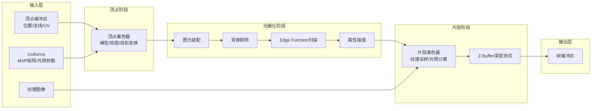
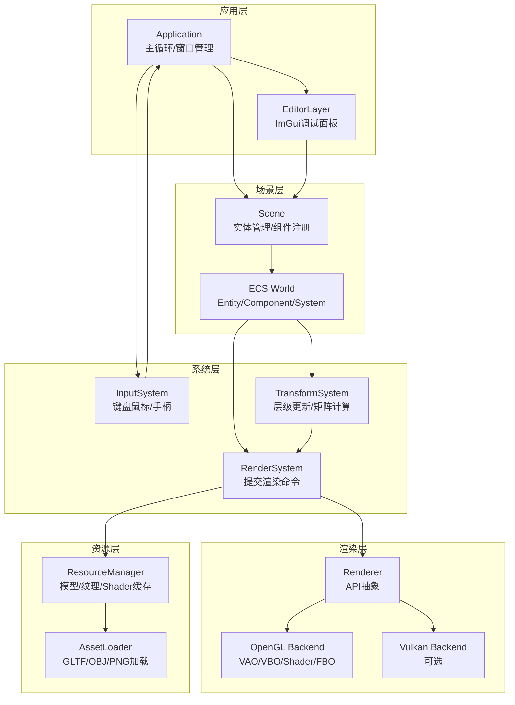
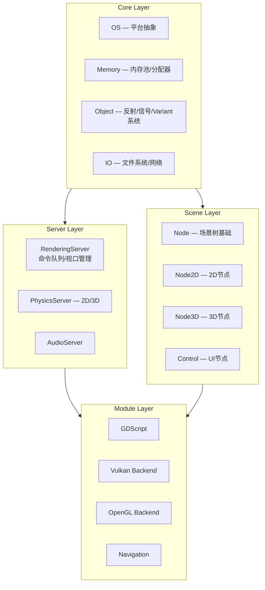
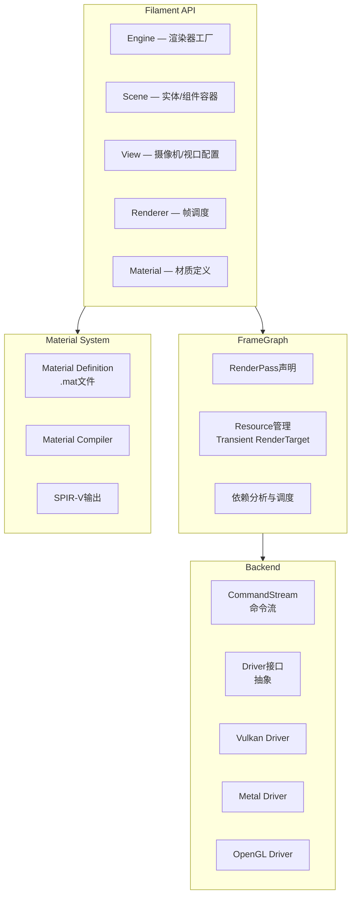
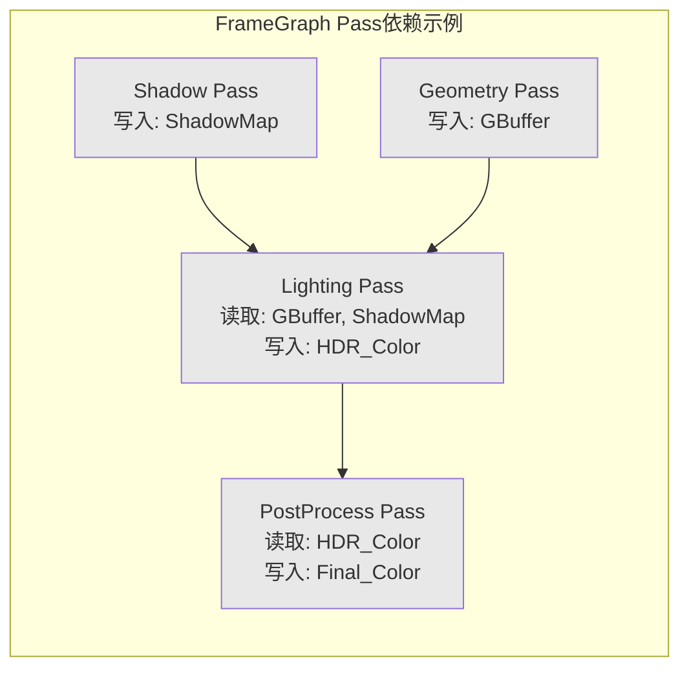
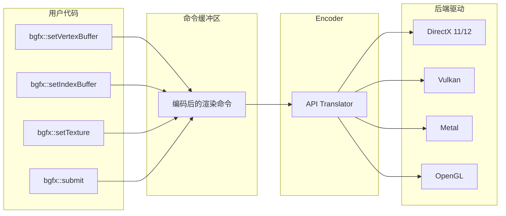
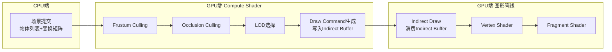
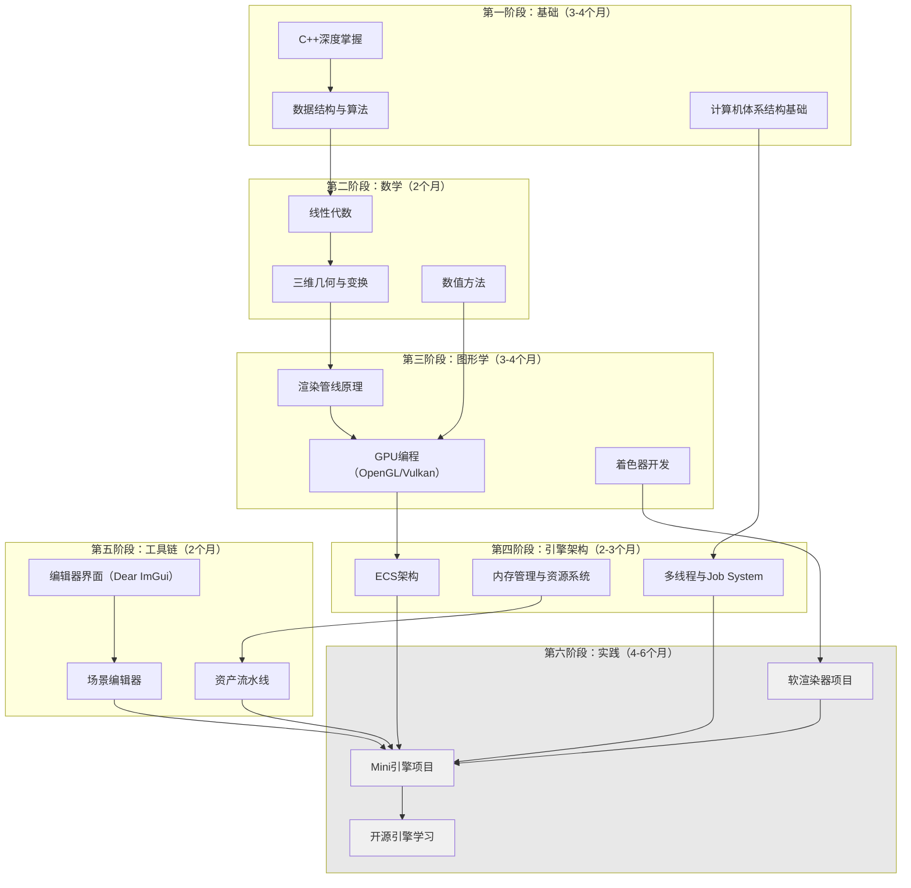

# 第六阶段 实践与进阶

前五阶段的学习构建了一条系统化的知识链：从C++语言基础到图形学理论，从数学工具到渲染管线实现，从引擎架构到编辑器开发。然而，知识的真正内化不发生在阅读与理解阶段，而发生在运用已有概念解决新问题的实践过程中。第六阶段的核心目标是将分散在各阶段的知识点融合为连贯的工程能力——你不仅要能解释某个算法如何工作，还要能将它集成到一个可运行的系统中，处理真实工程中的边界条件和性能约束。

本阶段围绕三个维度展开。第一维度是**必做项目实战**：我们将从最简单的CPU软渲染器出发，亲手实现光栅化管线的每一个环节；在此基础上构建一个基于现代API的Mini引擎，集成ECS架构、PBR渲染和骨骼动画；最后通过性能优化专项将渲染效率推向实用水平。第二维度是**开源引擎学习**：通过深入分析Godot、Filament、bgfx、Jolt Physics和EnTT这五个具有代表性的开源项目，理解工业级引擎的设计决策——为什么这样组织代码？这个抽象层解决了什么问题？第三维度是**职业发展建议**：提供清晰的技能成长路径、行业趋势判断方法、求职准备策略和可持续的学习方法论，确保你在离开这份学习路线后依然能自主成长。

与前面阶段不同，本阶段不会从零推导每一个数学公式（你已在前五阶段掌握了这些基础），而是聚焦于**系统集成**——如何将多个子系统组合成一个协调工作的整体，如何在设计约束中做出取舍，以及如何在一个真实的代码库中定位、理解和修改功能。

---

## 6.1 必做项目实战

项目驱动学习（Project-Based Learning）在游戏引擎开发领域尤为有效，因为引擎开发的本质不是记住算法步骤，而是培养对复杂系统的掌控能力。当你从零搭建一个渲染器，遇到屏幕上出现错误像素时，你必须理解管线的每一个环节——从顶点输入到像素输出——才能定位问题。这种端到端的视野正是引擎工程师的核心竞争力。

本节规划了四个由浅入深的实战项目，覆盖了从纯CPU软光栅到现代GPU渲染、从基础架构到性能优化的完整技术栈。每个项目都附带完整的目录结构、核心代码框架和实现要点说明。

---

### 6.1.1 软渲染器项目：用C++从零实现完整CPU光栅化管线

软渲染器（Software Rasterizer）是指完全在CPU上执行光栅化过程的渲染器，不依赖GPU硬件加速。为什么在学习现代GPU编程的时代还要写软渲染器？因为硬件加速是一层抽象——它隐藏了光栅化的内部机制，而软渲染器要求你亲手实现每一个步骤：从三维顶点坐标到屏幕像素颜色的完整映射。这种经历会让你在面对GPU上的调试难题时拥有直觉性的判断力。

#### 项目目标与整体架构

我们的目标是实现一个能正确渲染带纹理、有光照的三维模型的CPU光栅化器。它接受顶点数据（位置、法线、UV坐标）、纹理图像和摄像机参数，输出一张二维位图。整个管线分为六个阶段：顶点处理（Vertex Processing）、图元装配与背面剔除（Primitive Assembly & Back-face Culling）、光栅化（Rasterization）、片段处理（Fragment Processing）、深度测试（Depth Test）和颜色输出（Color Write）。



#### 项目目录结构

```
software_renderer/
├── CMakeLists.txt
├── src/
│   ├── main.cpp                  # 入口：模型加载、渲染循环、图像保存
│   ├── math/
│   │   ├── vec3.h               # 三维向量：点积、叉积、归一化
│   │   ├── vec4.h               # 四维向量（齐次坐标）
│   │   ├── mat4.h               # 4x4矩阵：乘法、逆、转置
│   │   └── math_utils.h         # 工具函数：lerp、clamp、弧度角度转换
│   ├── pipeline/
│   │   ├── vertex_shader.h/cpp  # 顶点着色器：MVP变换
│   │   ├── rasterizer.h/cpp     # 光栅化器：Edge Function、扫描
│   │   ├── fragment_shader.h/cpp # 片段着色器：纹理+光照
│   │   └── depth_buffer.h       # Z-Buffer管理
│   ├── geometry/
│   │   ├── mesh.h               # 网格数据结构
│   │   └── model_loader.h/cpp   # OBJ模型加载器
│   ├── texture/
│   │   ├── texture.h/cpp        # 纹理类：采样、过滤
│   │   └── image.h/cpp          # 图像I/O：TGA格式读写
│   └── utils/
│       ├── framebuffer.h        # 帧缓冲区：颜色+深度
│       └── timer.h              # 性能计时
├── assets/
│   ├── cube.obj                 # 测试模型
│   ├── cube_diffuse.tga         # 测试纹理
│   └── head/                    # 复杂测试模型目录
└── tests/
    └── test_math.cpp            # 单元测试
```

#### 数学基础模块实现

软渲染器的数学核心是向量和矩阵运算。以下是`vec4.h`和`mat4.h`的实现框架——我们采用列主序（Column-Major）存储矩阵，这是图形学领域的标准约定，意味着变换的组合顺序是从右到左：$\mathbf{v}' = \mathbf{M} \cdot \mathbf{v}$中，矩阵$\mathbf{M}$的最后一列是平移分量。

```cpp
// src/math/vec4.h — 四维向量，支持齐次坐标运算
#pragma once
#include "vec3.h"
#include <cmath>

struct Vec4 {
    float x, y, z, w;

    Vec4() : x(0), y(0), z(0), w(1) {}
    Vec4(float x_, float y_, float z_, float w_ = 1.0f)
        : x(x_), y(y_), z(z_), w(w_) {}
    explicit Vec4(const Vec3& v, float w_ = 1.0f)
        : x(v.x), y(v.y), z(v.z), w(w_) {}

    // 转换为Vec3（透视除法）
    Vec3 ToVec3() const {
        if (w != 0.0f && w != 1.0f) {
            return Vec3(x / w, y / w, z / w);
        }
        return Vec3(x, y, z);
    }

    // 向量加法与数乘
    Vec4 operator+(const Vec4& o) const { return Vec4(x+o.x, y+o.y, z+o.z, w+o.w); }
    Vec4 operator*(float s) const { return Vec4(x*s, y*s, z*s, w*s); }
};
```

```cpp
// src/math/mat4.h — 4x4矩阵，列主序存储
#pragma once
#include "vec4.h"
#include <cstring>

struct Mat4 {
    // m[col][row] 列主序：OpenGL/图形学标准
    float m[4][4];

    Mat4() { Identity(); }

    void Identity() {
        for (int i = 0; i < 4; ++i)
            for (int j = 0; j < 4; ++j)
                m[i][j] = (i == j) ? 1.0f : 0.0f;
    }

    // 矩阵乘法：this * other
    // 列主序下，变换的组合顺序从右到左
    Mat4 operator*(const Mat4& o) const {
        Mat4 r;
        for (int c = 0; c < 4; ++c) {
            for (int row = 0; row < 4; ++row) {
                r.m[c][row] = 0.0f;
                for (int k = 0; k < 4; ++k) {
                    r.m[c][row] += m[k][row] * o.m[c][k];
                }
            }
        }
        return r;
    }

    // 矩阵与向量乘法
    Vec4 operator*(const Vec4& v) const {
        return Vec4(
            m[0][0]*v.x + m[1][0]*v.y + m[2][0]*v.z + m[3][0]*v.w,
            m[0][1]*v.x + m[1][1]*v.y + m[2][1]*v.z + m[3][1]*v.w,
            m[0][2]*v.x + m[1][2]*v.y + m[2][2]*v.z + m[3][2]*v.w,
            m[0][3]*v.x + m[1][3]*v.y + m[2][3]*v.z + m[3][3]*v.w
        );
    }

    // 模型矩阵：平移 * 旋转 * 缩放
    static Mat4 Translate(float tx, float ty, float tz);
    static Mat4 Scale(float sx, float sy, float sz);
    static Mat4 RotateY(float angle);  // angle in radians
    static Mat4 RotateX(float angle);
    static Mat4 RotateZ(float angle);

    // 视图矩阵：摄像机从世界空间看向原点
    static Mat4 LookAt(Vec3 eye, Vec3 target, Vec3 up);

    // 透视投影矩阵
    // fov: 垂直视场角(弧度), aspect: 宽高比, near/far: 裁剪平面
    static Mat4 Perspective(float fov, float aspect, float near, float far);
};
```

`LookAt`和`Perspective`是渲染管线中最核心的两个矩阵函数。`LookAt`构建从世界空间到观察空间（View Space）的变换，其原理是构造一个以摄像机为原点的正交坐标系：`forward = normalize(eye - target)`，`right = normalize(cross(up, forward))`，`newUp = cross(forward, right)`。将这个坐标系的基向量填入矩阵的行（对于列主序视图矩阵，基向量填入列的转置位置），并将摄像机位置也纳入变换，使得世界中任意一点$\mathbf{p}$在观察空间中的坐标为$\mathbf{p}_{view} = \mathbf{V} \cdot \mathbf{p}$。

透视投影矩阵实现了从三维观察空间到裁剪空间（Clip Space）的变换，其核心是将视锥体（Viewing Frustum）压缩为规则的裁剪立方体（Canonical View Volume），同时保留深度信息用于后续Z-Buffer测试。透视投影矩阵的形式为：

$$
\mathbf{P} = \begin{bmatrix}
\frac{1}{\text{aspect} \cdot \tan(\text{fov}/2)} & 0 & 0 & 0 \\
0 & \frac{1}{\tan(\text{fov}/2)} & 0 & 0 \\
0 & 0 & \frac{\text{far} + \text{near}}{\text{near} - \text{far}} & \frac{2 \cdot \text{far} \cdot \text{near}}{\text{near} - \text{far}} \\
0 & 0 & -1 & 0
\end{bmatrix}
$$

注意矩阵的第四行是$(0, 0, -1, 0)$，这意味着变换后的$w$分量等于$-z_{view}$。经过透视除法（Perspective Divide，即用$w$除$x, y, z$）后，远处的物体被压缩，产生了近大远小的视觉效果。

#### 顶点处理阶段

顶点处理阶段接收模型空间的顶点，依次应用模型变换（Model）、视图变换（View）和投影变换（Projection），输出裁剪空间坐标。同时，我们在此阶段将法线向量从模型空间变换到世界空间，供后续光照计算使用。

```cpp
// src/pipeline/vertex_shader.h
#pragma once
#include "../math/mat4.h"
#include "../math/vec3.h"
#include "../math/vec4.h"

// 顶点输入：每个顶点携带的数据
struct VertexInput {
    Vec3 position;   // 模型空间位置
    Vec3 normal;     // 模型空间法线
    Vec2 texcoord;   // 纹理坐标
};

// 顶点输出：经过顶点着色器处理后的数据
struct VertexOutput {
    Vec4 clipPos;    // 裁剪空间位置 (xyzw)
    Vec3 worldPos;   // 世界空间位置
    Vec3 worldNormal;// 世界空间法线
    Vec2 texcoord;   // 插值后的纹理坐标
    float oneOverZ;  // 1/z 用于透视校正插值
};

// Uniforms：每帧/每物体不变的数据
struct VertexUniforms {
    Mat4 modelMatrix;
    Mat4 viewMatrix;
    Mat4 projectionMatrix;
    Mat4 normalMatrix;  // modelMatrix的逆矩阵的转置，用于正确变换法线
    Vec3 lightPos;      // 世界空间光源位置
    Vec3 cameraPos;     // 世界空间摄像机位置
};

class VertexShader {
public:
    const VertexUniforms* uniforms = nullptr;

    // 处理单个顶点
    VertexOutput Process(const VertexInput& input) const {
        VertexOutput output;

        // 模型变换：将顶点从模型空间转换到世界空间
        Vec4 worldPos4 = uniforms->modelMatrix * Vec4(input.position);
        output.worldPos = worldPos4.ToVec3();

        // 法线变换：使用Normal Matrix确保非均匀缩放下法线正确
        // 法线必须用逆-转置矩阵变换，否则非均匀缩放会导致法线不再垂直于表面
        output.worldNormal = (uniforms->normalMatrix * Vec4(input.normal, 0.0f)).ToVec3();
        output.worldNormal.Normalize();

        // MVP变换：模型 -> 视图 -> 投影 -> 裁剪空间
        Mat4 mvp = uniforms->projectionMatrix *
                   uniforms->viewMatrix *
                   uniforms->modelMatrix;
        output.clipPos = mvp * Vec4(input.position);

        // 传递纹理坐标
        output.texcoord = input.texcoord;

        return output;
    }
};
```

法线矩阵（Normal Matrix）为什么需要是模型矩阵的逆的转置？当模型矩阵只包含旋转和平移时，法线可以直接用模型矩阵的3x3子矩阵变换，因为正交矩阵的逆等于其转置。但当模型矩阵包含非均匀缩放（例如沿X轴缩放2倍，Y轴缩放1倍）时，模型矩阵的3x3子矩阵不再是正交矩阵，直接用它变换法线会导致法线不再垂直于变换后的表面。数学证明如下：设$\mathbf{t}$是切线向量（Tangent），满足$\mathbf{n} \cdot \mathbf{t} = 0$。变换后，$\mathbf{t}' = \mathbf{M}\mathbf{t}$。我们希望找到变换后的法线$\mathbf{n}'$使得$\mathbf{n}' \cdot \mathbf{t}' = 0$。由$(\mathbf{n}')^T \cdot \mathbf{M} \cdot \mathbf{t} = 0$，可得$\mathbf{n}' = (\mathbf{M}^{-1})^T \mathbf{n}$。因此法线矩阵为$(\mathbf{M}^{-1})^T$。

#### 三角形光栅化：Edge Function算法

光栅化（Rasterization）是将屏幕空间的三角形转换为一组片段（Fragment，即像素候选）的过程。我们采用Edge Function算法，这是现代GPU中普遍使用的光栅化方法，相比传统的扫描线算法更易于并行化。

Edge Function的核心思想是利用有符号距离判断一个点是否在三角形内部。对于三角形的每条边，定义一个线性函数$E(x, y) = (x - x_A)(y_B - y_A) - (y - y_A)(x_B - x_A)$，其中$(x_A, y_A)$和$(x_B, y_B)$是边的两个端点。对于三角形的三条边，如果一点$(x, y)$对三条边的Edge Function值都为正（或都为负，取决于顶点顺序），则该点在三角形内部。

```cpp
// src/pipeline/rasterizer.h
#pragma once
#include "../math/vec3.h"
#include "../math/vec4.h"
#include "vertex_shader.h"
#include <algorithm>
#include <vector>

// 片段：光栅化后的像素候选
struct Fragment {
    int x, y;            // 屏幕空间像素坐标
    float depth;         // 深度值 (0~1)
    Vec3 barycentric;    // 重心坐标 (w0, w1, w2)
    // 插值后的属性由片段着色器根据重心坐标计算
};

class Rasterizer {
public:
    int screenWidth, screenHeight;

    Rasterizer(int w, int h) : screenWidth(w), screenHeight(h) {}

    // Edge Function: 判断点(x,y)相对于边(A,B)的位置
    // 返回正值表示点在边的左侧（假设A->B逆时针）
    static float EdgeFunction(float x, float y,
                            const Vec4& A, const Vec4& B) {
        return (x - A.x) * (B.y - A.y) - (y - A.y) * (B.x - A.x);
    }

    // 光栅化单个三角形，输出所有覆盖的片段
    // v0, v1, v2: 经过透视除法后的屏幕空间坐标 (NDC -> 屏幕)
    std::vector<Fragment> RasterizeTriangle(
        const Vec4& v0_clip, const Vec4& v1_clip, const Vec4& v2_clip,
        const VertexOutput& out0, const VertexOutput& out1,
        const VertexOutput& out2) {

        std::vector<Fragment> fragments;

        // 透视除法：裁剪空间 -> 标准化设备空间(NDC)
        Vec3 v0_ndc = v0_clip.ToVec3();
        Vec3 v1_ndc = v1_clip.ToVec3();
        Vec3 v2_ndc = v2_clip.ToVec3();

        // NDC范围[-1,1]映射到屏幕空间像素坐标
        auto ToScreen = [&](const Vec3& ndc) -> Vec3 {
            return Vec3(
                (ndc.x + 1.0f) * 0.5f * screenWidth,
                (ndc.y + 1.0f) * 0.5f * screenHeight,
                ndc.z  // Z值保留用于深度测试
            );
        };

        Vec3 v0 = ToScreen(v0_ndc);
        Vec3 v1 = ToScreen(v1_ndc);
        Vec3 v2 = ToScreen(v2_ndc);

        // 计算三角形的包围盒（用于缩小扫描范围）
        int minX = static_cast<int>(std::floor(std::min({v0.x, v1.x, v2.x})));
        int minY = static_cast<int>(std::floor(std::min({v0.y, v1.y, v2.y})));
        int maxX = static_cast<int>(std::ceil(std::max({v0.x, v1.x, v2.x})));
        int maxY = static_cast<int>(std::ceil(std::max({v0.y, v1.y, v2.y})));

        // 裁剪到屏幕边界
        minX = std::max(minX, 0); minY = std::max(minY, 0);
        maxX = std::min(maxX, screenWidth - 1);
        maxY = std::min(maxY, screenHeight - 1);

        // 用Edge Function计算整个三角形的面积（2倍）
        float area2 = EdgeFunction(v0.x, v0.y, v1, v2);
        if (std::abs(area2) < 1e-6f) return fragments; // 退化三角形

        // 逐像素扫描包围盒
        for (int y = minY; y <= maxY; ++y) {
            for (int x = minX; x <= maxX; ++x) {
                // 采样点取像素中心
                float px = x + 0.5f;
                float py = y + 0.5f;

                // 计算三个Edge Function值
                float e0 = EdgeFunction(px, py, v1, v2);
                float e1 = EdgeFunction(px, py, v2, v0);
                float e2 = EdgeFunction(px, py, v0, v1);

                // 判断点是否在三角形内部（所有边同侧）
                // 假设顶点顺序为逆时针，则内部点所有E值均为正
                bool inside = (e0 >= 0) && (e1 >= 0) && (e2 >= 0);

                if (inside) {
                    // 计算重心坐标 (归一化的Edge Function值)
                    float w0 = e0 / area2;
                    float w1 = e1 / area2;
                    float w2 = e2 / area2;

                    // 用重心坐标插值深度值
                    float depth = w0 * v0.z + w1 * v1.z + w2 * v2.z;

                    Fragment frag;
                    frag.x = x;
                    frag.y = y;
                    frag.depth = depth;
                    frag.barycentric = Vec3(w0, w1, w2);
                    fragments.push_back(frag);
                }
            }
        }

        return fragments;
    }
};
```

Edge Function算法的增量优化：在实际渲染中，Edge Function是线性的，这意味着在水平方向上每移动一个像素，$E(x+1, y) = E(x, y) + (y_B - y_A)$，即增量为一个常数。利用这个性质，可以将内层循环中的乘法替换为加法，大幅提升光栅化速度。这个优化在GPU硬件中广泛采用——GPU的光栅化单元（Rasterizer Unit）正是通过这种方式在单个时钟周期内处理大量像素。

#### Z-Buffer深度测试

Z-Buffer（深度缓冲）是解决可见性问题的标准方法。其核心思想是为帧缓冲中的每个像素维护一个深度值，记录该像素位置上当前可见的最浅（或最深）的三角形片段。当新的片段到来时，比较其深度与Z-Buffer中存储的深度，仅当新片段更靠近摄像机时才更新像素颜色。

```cpp
// src/pipeline/depth_buffer.h
#pragma once
#include <vector>
#include <algorithm>
#include <limits>

class DepthBuffer {
public:
    int width, height;
    std::vector<float> buffer;

    DepthBuffer(int w, int h) : width(w), height(h) {
        // 初始化为最远深度（1.0f，即NDC中far平面的深度）
        buffer.resize(w * h, 1.0f);
    }

    void Clear() {
        std::fill(buffer.begin(), buffer.end(), 1.0f);
    }

    // 深度测试：如果newDepth < 当前深度，则通过测试（更新并返回true）
    // 使用小于比较：深度值越小表示越靠近摄像机
    bool TestAndSet(int x, int y, float newDepth) {
        int idx = y * width + x;
        if (newDepth < buffer[idx]) {
            buffer[idx] = newDepth;
            return true;  // 通过了深度测试
        }
        return false;  // 被遮挡
    }

    float Get(int x, int y) const {
        return buffer[y * width + x];
    }
};
```

Z-Buffer在GPU中的实现采用了多种优化策略。**Early-Z**（或Hi-Z）技术是在片段着色器执行之前进行深度测试，避免为被遮挡的像素执行昂贵的着色计算。现代GPU还支持**Reverse-Z**技术——将深度缓冲的映射反转（近处=1.0，远处=0.0），这利用了浮点数的精度分布特性来改善远平面附近的深度精度。由于浮点数的精度在0附近更高，Reverse-Z将近处物体映射到接近1.0的值（浮点精度较低区域），远处物体映射到接近0.0的值（浮点精度较高区域），实际上改善了远距离的深度分辨率。

#### 透视校正纹理映射

纹理映射（Texture Mapping）是将二维图像贴到三维模型表面的过程。直接在世界空间或屏幕空间线性插值UV坐标会导致纹理在近处拉伸、远处压缩的失真——这种失真称为**透视失真（Perspective Aliasing）**，其根源在于投影变换不是线性变换，而插值是线性的。

解决方案是**透视校正纹理映射（Perspective-Correct Texture Mapping）**：在屏幕空间中对$\frac{u}{z}$、$\frac{v}{z}$和$\frac{1}{z}$进行线性插值，然后在每个像素处用插值结果恢复正确的UV值：

$$
\bar{u} = \frac{\sum w_i \cdot \frac{u_i}{z_i}}{\sum w_i \cdot \frac{1}{z_i}}, \quad
\bar{v} = \frac{\sum w_i \cdot \frac{v_i}{z_i}}{\sum w_i \cdot \frac{1}{z_i}}
$$

其中$w_i$是屏幕空间重心坐标，$z_i$是摄像机空间的深度值（即裁剪空间$w$的正值版本）。

```cpp
// src/pipeline/fragment_shader.h — 含透视校正纹理映射
#pragma once
#include "../math/vec3.h"
#include "../math/vec4.h"
#include "vertex_shader.h"
#include "../texture/texture.h"

// 片段着色器输入：由光栅器插值得到
struct FragmentInput {
    Vec3 barycentric;   // 重心坐标
    Vec3 screenPos;     // 屏幕空间位置 (x, y, depth)
    // 顶点属性 (需要在光栅化阶段用透视校正方式插值)
    Vec3 worldPos;
    Vec3 worldNormal;
    Vec2 texcoord;
};

struct FragmentUniforms {
    Vec3 lightPos;       // 世界空间光源位置
    Vec3 lightColor;     // 光源颜色
    Vec3 cameraPos;      // 世界空间摄像机位置
    Texture* diffuseTex; // 漫反射纹理
};

class FragmentShader {
public:
    const FragmentUniforms* uniforms = nullptr;

    // 透视校正属性插值辅助函数
    // 输入三个顶点属性值和对应的1/z值，以及屏幕空间重心坐标
    static Vec2 InterpolateTexCoordPerspective(
        const Vec2& tc0, const Vec2& tc1, const Vec2& tc2,
        float invZ0, float invZ1, float invZ2,
        const Vec3& bary) {

        // 插值 u/z, v/z 和 1/z
        float interpInvZ = bary.x * invZ0 + bary.y * invZ1 + bary.z * invZ2;
        float interpU_Z  = bary.x * tc0.x * invZ0 +
                           bary.y * tc1.x * invZ1 +
                           bary.z * tc2.x * invZ2;
        float interpV_Z  = bary.x * tc0.y * invZ0 +
                           bary.y * tc1.y * invZ1 +
                           bary.z * tc2.y * invZ2;

        // 恢复正确的UV值：u = (u/z) / (1/z)
        float z = 1.0f / interpInvZ;
        return Vec2(interpU_Z * z, interpV_Z * z);
    }

    // 主着色函数，返回RGBA颜色
    Vec4 Shade(const FragmentInput& input,
               const VertexOutput& v0, const VertexOutput& v1,
               const VertexOutput& v2) const {

        // 获取三个顶点的1/z值（摄像机空间深度取倒数）
        // 注意：裁剪空间的w分量等于 -viewSpace.z
        float invZ0 = 1.0f / std::max(v0.clipPos.w, 1e-6f);
        float invZ1 = 1.0f / std::max(v1.clipPos.w, 1e-6f);
        float invZ2 = 1.0f / std::max(v2.clipPos.w, 1e-6f);

        // 透视校正纹理坐标插值
        Vec2 uv = InterpolateTexCoordPerspective(
            v0.texcoord, v1.texcoord, v2.texcoord,
            invZ0, invZ1, invZ2, input.barycentric);

        // 同样透视校正地插值世界空间位置和法线
        Vec3 worldPos = InterpolateVec3Perspective(
            v0.worldPos, v1.worldPos, v2.worldPos,
            invZ0, invZ1, invZ2, input.barycentric);
        Vec3 worldNormal = InterpolateVec3Perspective(
            v0.worldNormal, v1.worldNormal, v2.worldNormal,
            invZ0, invZ1, invZ2, input.barycentric);
        worldNormal.Normalize();

        // --- Gouraud/Phong光照计算 ---
        // 漫反射: Ld = max(N·L, 0) * lightColor * diffuseColor
        Vec3 lightDir = (uniforms->lightPos - worldPos);
        lightDir.Normalize();

        float NdotL = std::max(0.0f, worldNormal.Dot(lightDir));

        // 从纹理采样漫反射颜色
        Vec3 diffuseColor(1.0f, 1.0f, 1.0f); // 默认白色
        if (uniforms->diffuseTex) {
            diffuseColor = uniforms->diffuseTex->Sample(uv.x, uv.y);
        }

        Vec3 diffuse = uniforms->lightColor * NdotL * diffuseColor;

        // 环境光项（避免背面完全黑色）
        Vec3 ambient = diffuseColor * 0.15f;

        Vec3 finalColor = ambient + diffuse;

        // Gamma校正（近似：开平方）
        finalColor.x = std::sqrt(finalColor.x);
        finalColor.y = std::sqrt(finalColor.y);
        finalColor.z = std::sqrt(finalColor.z);

        return Vec4(finalColor.x, finalColor.y, finalColor.z, 1.0f);
    }

private:
    static Vec3 InterpolateVec3Perspective(
        const Vec3& a, const Vec3& b, const Vec3& c,
        float invZa, float invZb, float invZc,
        const Vec3& bary) {
        float invZ = bary.x * invZa + bary.y * invZb + bary.z * invZc;
        Vec3 result = (a * invZa * bary.x + b * invZb * bary.y +
                       c * invZc * bary.z);
        return result * (1.0f / invZ);
    }
};
```

#### 纹理采样与过滤

纹理采样的核心是将连续的浮点UV坐标转换为离散的像素颜色。原始实现中常用的技术包括最近邻采样（Nearest Neighbor）和双线性过滤（Bilinear Filtering）。双线性过滤通过对目标像素周围的四个纹理像素（Texel）进行加权平均，显著减少了纹理放大时的块状走样（Magnification Aliasing）。

```cpp
// src/texture/texture.h — 纹理类与双线性过滤
#pragma once
#include "../math/vec3.h"
#include "image.h"
#include <vector>

class Texture {
public:
    int width, height;
    std::vector<Vec3> pixels;  // RGB像素数据

    Texture() : width(0), height(0) {}

    // 从图像文件加载
    bool LoadFromFile(const char* filepath);

    // 双线性过滤采样
    // u, v 范围 [0, 1]
    Vec3 Sample(float u, float v) const {
        // 处理UV重复（Wrap模式）
        u = u - std::floor(u);
        v = v - std::floor(v);

        // 转换到纹理像素坐标
        float fx = u * (width - 1);
        float fy = v * (height - 1);

        int x0 = static_cast<int>(std::floor(fx));
        int y0 = static_cast<int>(std::floor(fy));
        int x1 = std::min(x0 + 1, width - 1);
        int y1 = std::min(y0 + 1, height - 1);

        float dx = fx - x0;
        float dy = fy - y0;

        // 双线性插值
        Vec3 c00 = GetPixel(x0, y0);
        Vec3 c10 = GetPixel(x1, y0);
        Vec3 c01 = GetPixel(x0, y1);
        Vec3 c11 = GetPixel(x1, y1);

        Vec3 top    = c00 * (1.0f - dx) + c10 * dx;
        Vec3 bottom = c01 * (1.0f - dx) + c11 * dx;
        return top * (1.0f - dy) + bottom * dy;
    }

    Vec3 GetPixel(int x, int y) const {
        return pixels[y * width + x];
    }
};
```

#### 渲染循环与背面剔除

主渲染循环将所有模块串联起来：加载模型和纹理，设置变换矩阵，逐三角形处理顶点、光栅化和着色，最后将结果保存为图像。

```cpp
// src/main.cpp — 核心渲染循环
#include "pipeline/vertex_shader.h"
#include "pipeline/rasterizer.h"
#include "pipeline/fragment_shader.h"
#include "pipeline/depth_buffer.h"
#include "utils/framebuffer.h"
#include "geometry/mesh.h"
#include "texture/texture.h"
#include "math/mat4.h"
#include <iostream>

int main() {
    const int WIDTH = 800;
    const int HEIGHT = 600;

    // 初始化缓冲区
    FrameBuffer fb(WIDTH, HEIGHT);
    DepthBuffer zbuf(WIDTH, HEIGHT);

    // 加载资源
    Mesh mesh = LoadOBJ("assets/head/head.obj");
    Texture diffuseTex;
    diffuseTex.LoadFromFile("assets/head/head_diffuse.tga");

    // 设置MVP变换矩阵
    Mat4 model = Mat4::RotateY(3.14159f * 0.3f) * Mat4::Scale(1.2f, 1.2f, 1.2f);
    Mat4 view = Mat4::LookAt(Vec3(0, 0, 3), Vec3(0, 0, 0), Vec3(0, 1, 0));
    Mat4 proj = Mat4::Perspective(3.14159f * 0.25f,
                                  (float)WIDTH / HEIGHT, 0.1f, 100.0f);

    // 设置Uniforms
    VertexUniforms vertUniforms;
    vertUniforms.modelMatrix = model;
    vertUniforms.viewMatrix = view;
    vertUniforms.projectionMatrix = proj;
    // Normal Matrix = (Model^-1)^T，这里简化处理
    vertUniforms.normalMatrix = model;  // 实际应计算逆-转置

    FragmentUniforms fragUniforms;
    fragUniforms.lightPos = Vec3(5, 5, 5);
    fragUniforms.lightColor = Vec3(1, 1, 1);
    fragUniforms.cameraPos = Vec3(0, 0, 3);
    fragUniforms.diffuseTex = &diffuseTex;

    // 初始化着色器
    VertexShader vs;
    vs.uniforms = &vertUniforms;

    FragmentShader fs;
    fs.uniforms = &fragUniforms;

    Rasterizer rasterizer(WIDTH, HEIGHT);

    // === 核心渲染循环 ===
    // 逐三角形处理
    for (size_t i = 0; i < mesh.indices.size(); i += 3) {
        uint32_t i0 = mesh.indices[i];
        uint32_t i1 = mesh.indices[i + 1];
        uint32_t i2 = mesh.indices[i + 2];

        VertexInput vin0{mesh.positions[i0], mesh.normals[i0],
                         mesh.texcoords[i0]};
        VertexInput vin1{mesh.positions[i1], mesh.normals[i1],
                         mesh.texcoords[i1]};
        VertexInput vin2{mesh.positions[i2], mesh.normals[i2],
                         mesh.texcoords[i2]};

        // 顶点处理阶段
        VertexOutput vout0 = vs.Process(vin0);
        VertexOutput vout1 = vs.Process(vin1);
        VertexOutput vout2 = vs.Process(vin2);

        // 背面剔除：检查屏幕空间三角形的朝向
        // 若三角形面积为负（顺时针），则为背面，跳过
        Vec3 ndc0 = vout0.clipPos.ToVec3();
        Vec3 ndc1 = vout1.clipPos.ToVec3();
        Vec3 ndc2 = vout2.clipPos.ToVec3();
        Vec3 screen0((ndc0.x+1)*0.5f*WIDTH, (ndc0.y+1)*0.5f*HEIGHT, 0);
        Vec3 screen1((ndc1.x+1)*0.5f*WIDTH, (ndc1.y+1)*0.5f*HEIGHT, 0);
        Vec3 screen2((ndc2.x+1)*0.5f*WIDTH, (ndc2.y+1)*0.5f*HEIGHT, 0);
        float area2 = (screen1.x - screen0.x) * (screen2.y - screen0.y)
                    - (screen1.y - screen0.y) * (screen2.x - screen0.x);
        if (area2 < 0) continue;  // 背面剔除

        // 光栅化阶段
        auto fragments = rasterizer.RasterizeTriangle(
            vout0.clipPos, vout1.clipPos, vout2.clipPos,
            vout0, vout1, vout2);

        // 片段处理与深度测试
        for (const auto& frag : fragments) {
            if (zbuf.TestAndSet(frag.x, frag.y, frag.depth)) {
                FragmentInput fin;
                fin.barycentric = frag.barycentric;
                fin.screenPos = Vec3(frag.x, frag.y, frag.depth);

                Vec4 color = fs.Shade(fin, vout0, vout1, vout2);

                fb.SetPixel(frag.x, frag.y, color.x, color.y, color.z);
            }
        }
    }

    // 保存结果
    fb.SaveTGA("output.tga");
    std::cout << "Rendering complete. Saved to output.tga\n";
    return 0;
}
```

#### 软渲染器项目阶段检查表

| 阶段 | 实现内容 | 验证标准 | 预计耗时 |
|------|----------|----------|----------|
| Stage 0 | 数学库（Vec3/Vec4/Mat4） | 矩阵乘法、逆矩阵单元测试通过 | 1-2天 |
| Stage 1 | 线框渲染 | 正确显示模型边线 | 1天 |
| Stage 2 | 顶点处理 + 透视投影 | 模型正确投影到屏幕 | 1天 |
| Stage 3 | Edge Function光栅化 + Z-Buffer | 实心填充，深度关系正确 | 2-3天 |
| Stage 4 | 透视校正纹理映射 | 纹理无近大远小失真 | 2天 |
| Stage 5 | Gouraud/Phong光照 | 有明暗变化 | 1-2天 |
| Stage 6 | 双线性纹理过滤 + OBJ加载 | 支持外部模型和纹理 | 2天 |
| Stage 7 | 优化（增量Edge Function + SIMD） | 帧率提升3x+ | 2-3天 |

完成软渲染器项目后，你将拥有一项宝贵的能力：当GPU渲染出现视觉错误时，你能够从CPU端验证管线的数学正确性，判断问题出在几何、光栅化还是着色阶段。这种"CPU与GPU交叉验证"的能力在引擎调试中经常用到。

---

### 6.1.2 Mini游戏引擎项目：基于OpenGL/Vulkan实现ECS架构

在掌握了光栅化的底层原理后，下一步是将这些知识迁移到现代GPU API上，同时构建一个具有工程结构的引擎框架。Mini游戏引擎的目标是创建一个能够加载3D场景、支持相机控制、具有基础渲染能力的可运行引擎。关键约束是代码量控制在可理解范围内（核心代码约3000-5000行），同时展示真实引擎中的核心设计模式。

#### 整体架构设计

Mini引擎采用**ECS（Entity-Component-System）**架构组织游戏对象，用**面向数据（Data-Oriented）**的设计优化缓存局部性。渲染层使用OpenGL（可选Vulkan后端），封装为Renderer抽象以隐藏API细节。



#### ECS核心实现

ECS架构将游戏对象分解为三个概念：**Entity**（实体，仅是一个ID标识）、**Component**（组件，纯数据容器）、**System**（系统，处理具有特定组件的实体的逻辑）。这种分离消除了传统OOP中深层次的继承结构，使数据布局更紧凑，缓存命中率更高。

以下是一个简化但功能完整的ECS实现，采用稀疏集（Sparse Set）作为组件存储的核心数据结构——这也是EnTT等工业级ECS框架的基础：

```cpp
// src/ecs/ecs.h — 简化版ECS框架
#pragma once
#include <vector>
#include <array>
#include <unordered_map>
#include <type_traits>
#include <bitset>
#include <cassert>
#include <queue>

namespace MiniECS {

using Entity = uint32_t;
constexpr Entity MAX_ENTITIES = 5000;
constexpr size_t MAX_COMPONENTS = 32;

// 组件类型ID分配器
using ComponentType = uint8_t;
using Signature = std::bitset<MAX_COMPONENTS>;

class ComponentManager {
public:
    template<typename T>
    void RegisterComponent() {
        const char* typeName = typeid(T).name();
        assert(componentTypes.find(typeName) == componentTypes.end()
               && "Component already registered");
        componentTypes[typeName] = nextComponentType++;
    }

    template<typename T>
    ComponentType GetComponentType() {
        const char* typeName = typeid(T).name();
        assert(componentTypes.find(typeName) != componentTypes.end()
               && "Component not registered");
        return componentTypes[typeName];
    }

private:
    std::unordered_map<const char*, ComponentType> componentTypes;
    ComponentType nextComponentType = 0;
};

// 实体管理器：分配和回收实体ID
class EntityManager {
public:
    EntityManager() {
        for (Entity e = 0; e < MAX_ENTITIES; ++e) {
            availableEntities.push(e);
        }
    }

    Entity CreateEntity() {
        assert(livingEntityCount < MAX_ENTITIES && "Too many entities");
        Entity id = availableEntities.front();
        availableEntities.pop();
        ++livingEntityCount;
        return id;
    }

    void DestroyEntity(Entity entity) {
        assert(entity < MAX_ENTITIES && "Entity out of range");
        signatures[entity].reset();
        availableEntities.push(entity);
        --livingEntityCount;
    }

    Signature& GetSignature(Entity entity) {
        assert(entity < MAX_ENTITIES && "Entity out of range");
        return signatures[entity];
    }

private:
    std::queue<Entity> availableEntities;
    std::array<Signature, MAX_ENTITIES> signatures;
    uint32_t livingEntityCount = 0;
};

// 系统基类：处理具有特定Signature的实体
class System {
public:
    std::vector<Entity> entities;  // 本系统关心的所有实体
};

class SystemManager {
public:
    template<typename T>
    std::shared_ptr<T> RegisterSystem() {
        const char* typeName = typeid(T).name();
        assert(systems.find(typeName) == systems.end()
               && "System already registered");
        auto system = std::make_shared<T>();
        systems[typeName] = system;
        return system;
    }

    template<typename T>
    void SetSignature(Signature signature) {
        const char* typeName = typeid(T).name();
        signatures[typeName] = signature;
    }

    // 当实体签名变化时，更新各系统的实体列表
    void EntitySignatureChanged(Entity entity, const Signature& sig) {
        for (auto& [name, system] : systems) {
            auto& systemSig = signatures[name];
            if ((sig & systemSig) == systemSig) {
                // 实体拥有系统所需的所有组件
                auto it = std::find(system->entities.begin(),
                                    system->entities.end(), entity);
                if (it == system->entities.end())
                    system->entities.push_back(entity);
            } else {
                auto it = std::find(system->entities.begin(),
                                    system->entities.end(), entity);
                if (it != system->entities.end())
                    system->entities.erase(it);
            }
        }
    }

private:
    std::unordered_map<const char*, Signature> signatures;
    std::unordered_map<const char*, std::shared_ptr<System>> systems;
};

// 协调器：顶层接口
class Coordinator {
public:
    void Init() {
        componentManager = std::make_unique<ComponentManager>();
        entityManager = std::make_unique<EntityManager>();
        systemManager = std::make_unique<SystemManager>();
    }

    Entity CreateEntity() { return entityManager->CreateEntity(); }
    void DestroyEntity(Entity entity) { entityManager->DestroyEntity(entity); }

    // 组件注册与附加（简化版，实际需配合ComponentArray实现）
    template<typename T>
    void RegisterComponent() { componentManager->RegisterComponent<T>(); }

    template<typename T>
    T& AddComponent(Entity entity) {
        // 实际实现中需维护每个组件类型的存储数组
        // 这里展示接口设计
        signatures[entity].set(componentManager->GetComponentType<T>());
        entityManager->GetSignature(entity) = signatures[entity];
        systemManager->EntitySignatureChanged(entity, signatures[entity]);
        return GetComponent<T>(entity);
    }

    template<typename T>
    T& GetComponent(Entity entity) {
        // 实际实现从ComponentArray中返回引用
        static T dummy;
        return dummy;
    }

    template<typename T>
    std::shared_ptr<T> RegisterSystem() {
        return systemManager->RegisterSystem<T>();
    }

    template<typename T>
    void SetSystemSignature(Signature signature) {
        systemManager->SetSignature<T>(signature);
    }

private:
    std::unique_ptr<ComponentManager> componentManager;
    std::unique_ptr<EntityManager> entityManager;
    std::unique_ptr<SystemManager> systemManager;
    std::array<Signature, MAX_ENTITIES> signatures;
};

} // namespace MiniECS
```

#### 组件定义

引擎需要以下核心组件来构建3D场景：

```cpp
// src/ecs/components.h — 引擎核心组件
#pragma once
#include "../math/math.h"  // Vec3, Mat4, Quaternion等

// 变换组件：位置、旋转、缩放
struct TransformComponent {
    Vec3 position = Vec3(0, 0, 0);
    Vec3 rotation = Vec3(0, 0, 0);  // 欧拉角（简化）
    Vec3 scale = Vec3(1, 1, 1);

    Mat4 GetModelMatrix() const {
        return Mat4::Translate(position) *
               Mat4::RotateY(rotation.y) *
               Mat4::RotateX(rotation.x) *
               Mat4::RotateZ(rotation.z) *
               Mat4::Scale(scale);
    }
};

// 网格渲染组件
struct MeshRendererComponent {
    MeshHandle mesh;       // 网格资源句柄
    MaterialHandle material; // 材质资源句柄
    bool castShadow = true;
    bool receiveShadow = true;
};

// 摄像机组件
struct CameraComponent {
    float fov = 45.0f;           // 垂直视场角（度）
    float nearPlane = 0.1f;
    float farPlane = 1000.0f;
    bool isPrimary = false;      // 主摄像机标记

    Mat4 GetProjection(float aspectRatio) const {
        return Mat4::Perspective(fov * 3.14159f / 180.0f,
                                 aspectRatio, nearPlane, farPlane);
    }
};

// 光源组件
struct LightComponent {
    enum Type { Directional, Point, Spot } type = Directional;
    Vec3 color = Vec3(1, 1, 1);
    float intensity = 1.0f;
    // 点光源/聚光灯额外参数
    float range = 10.0f;
    float spotAngle = 30.0f;  // 仅Spot
};

// 可编辑组件标记：在编辑器中显示属性面板
struct EditorSelectableComponent {};
```

#### 渲染系统设计

RenderSystem是引擎的核心系统，负责收集场景中的可见物体并提交给底层Renderer执行。它实现了基础的渲染管线：遍历所有拥有MeshRendererComponent和TransformComponent的实体，计算MVP矩阵，绑定材质和网格，执行绘制调用。

```cpp
// src/systems/render_system.h
#pragma once
#include "../ecs/ecs.h"
#include "../ecs/components.h"
#include "../renderer/renderer.h"
#include <memory>

class RenderSystem : public MiniECS::System {
public:
    std::shared_ptr<Renderer> renderer;
    float viewportWidth = 1280.0f;
    float viewportHeight = 720.0f;

    void OnUpdate(float deltaTime, MiniECS::Coordinator& coord) {
        // 1. 找到主摄像机
        Mat4 viewMatrix = Mat4::Identity();
        Mat4 projMatrix = Mat4::Identity();
        bool foundCamera = false;

        for (auto cameraEntity : cameraEntities) {
            auto& cam = coord.GetComponent<CameraComponent>(cameraEntity);
            auto& trans = coord.GetComponent<TransformComponent>(cameraEntity);
            if (cam.isPrimary) {
                viewMatrix = Mat4::LookAt(trans.position,
                                          trans.position + Forward(trans.rotation),
                                          Vec3(0, 1, 0));
                projMatrix = cam.GetProjection(viewportWidth / viewportHeight);
                foundCamera = true;
                break;
            }
        }

        if (!foundCamera) return;

        // 2. 渲染设置
        renderer->BeginFrame();
        renderer->SetViewProjection(viewMatrix, projMatrix);
        renderer->Clear(Vec3(0.1f, 0.1f, 0.15f));

        // 3. 遍历所有可渲染实体
        for (auto entity : entities) {
            auto& trans = coord.GetComponent<TransformComponent>(entity);
            auto& meshRenderer = coord.GetComponent<MeshRendererComponent>(entity);

            RenderCommand cmd;
            cmd.modelMatrix = trans.GetModelMatrix();
            cmd.mesh = meshRenderer.mesh;
            cmd.material = meshRenderer.material;

            // 提交渲染命令
            renderer->Submit(cmd);
        }

        // 4. 执行绘制
        renderer->EndFrame();
    }

    // 需要单独维护摄像机实体列表（简化处理）
    std::vector<MiniECS::Entity> cameraEntities;
};
```

#### 渲染器抽象层

Renderer抽象层封装了底层图形API的具体调用，使得引擎的上层代码不依赖于OpenGL或Vulkan的具体细节。以下是OpenGL后端的简化接口设计：

```cpp
// src/renderer/renderer.h — 渲染器抽象接口
#pragma once
#include "../math/math.h"
#include <vector>
#include <memory>
#include <string>

// 资源句柄（简化实现，实际可用句柄ID或指针）
using MeshHandle = size_t;
using MaterialHandle = size_t;
using ShaderHandle = size_t;
using TextureHandle = size_t;

struct RenderCommand {
    Mat4 modelMatrix;
    MeshHandle mesh;
    MaterialHandle material;
};

class Renderer {
public:
    virtual ~Renderer() = default;

    // 生命周期
    virtual bool Initialize(void* nativeWindow, int width, int height) = 0;
    virtual void Shutdown() = 0;

    // 帧管理
    virtual void BeginFrame() = 0;
    virtual void EndFrame() = 0;       // 执行所有已提交的命令
    virtual void Present() = 0;        // 交换缓冲区
    virtual void Clear(const Vec3& color) = 0;

    // 矩阵设置
    virtual void SetViewProjection(const Mat4& view,
                                  const Mat4& projection) = 0;

    // 命令提交
    virtual void Submit(const RenderCommand& cmd) = 0;

    // 资源管理
    virtual MeshHandle LoadMesh(const std::string& filepath) = 0;
    virtual MaterialHandle CreateMaterial(ShaderHandle shader) = 0;
    virtual ShaderHandle LoadShader(const std::string& vertPath,
                                    const std::string& fragPath) = 0;
    virtual TextureHandle LoadTexture(const std::string& filepath) = 0;
    virtual void SetMaterialParameter(MaterialHandle mat,
                                      const std::string& name,
                                      void* data, size_t size) = 0;

    // 调试
    virtual void DrawDebugLine(const Vec3& from, const Vec3& to,
                               const Vec3& color) = 0;
};

// 工厂函数
td::unique_ptr<Renderer> CreateOpenGLRenderer();
```

#### 入口点与主循环

```cpp
// src/main.cpp — Mini引擎入口
#include "ecs/ecs.h"
#include "ecs/components.h"
#include "systems/render_system.h"
#include "systems/transform_system.h"
#include "renderer/renderer.h"
#include <GLFW/glfw3.h>
#include <imgui.h>
#include <imgui_impl_glfw.h>
#include <imgui_impl_opengl3.h>
#include <iostream>

int main() {
    // 1. 初始化窗口
    glfwInit();
    GLFWwindow* window = glfwCreateWindow(1280, 720,
                                          "Mini Engine", nullptr, nullptr);
    glfwMakeContextCurrent(window);
    glfwSwapInterval(1);  // 开启VSync

    // 2. 初始化ECS
    MiniECS::Coordinator coord;
    coord.Init();
    coord.RegisterComponent<TransformComponent>();
    coord.RegisterComponent<MeshRendererComponent>();
    coord.RegisterComponent<CameraComponent>();
    coord.RegisterComponent<LightComponent>();

    // 3. 注册系统
    auto renderSystem = coord.RegisterSystem<RenderSystem>();
    MiniECS::Signature renderSig;
    renderSig.set(coord.GetComponentType<TransformComponent>());
    renderSig.set(coord.GetComponentType<MeshRendererComponent>());
    coord.SetSystemSignature<RenderSystem>(renderSig);

    // 4. 初始化渲染器
    renderSystem->renderer = CreateOpenGLRenderer();
    renderSystem->renderer->Initialize(window, 1280, 720);

    // 5. 创建场景实体
    // 摄像机
    auto camera = coord.CreateEntity();
    coord.AddComponent<TransformComponent>(camera).position = Vec3(0, 2, 5);
    coord.AddComponent<CameraComponent>(camera).isPrimary = true;
    renderSystem->cameraEntities.push_back(camera);

    // 一个立方体
    auto cube = coord.CreateEntity();
    coord.AddComponent<TransformComponent>(cube).position = Vec3(0, 0, 0);
    auto& mr = coord.AddComponent<MeshRendererComponent>(cube);
    mr.mesh = renderSystem->renderer->LoadMesh("assets/cube.gltf");
    ShaderHandle shader = renderSystem->renderer->LoadShader(
        "shaders/basic.vert", "shaders/basic.frag");
    mr.material = renderSystem->renderer->CreateMaterial(shader);

    // 方向光
    auto light = coord.CreateEntity();
    coord.AddComponent<TransformComponent>(light).rotation =
        Vec3(45, 45, 0);
    coord.AddComponent<LightComponent>(light);

    // 6. 初始化ImGui
    IMGUI_CHECKVERSION();
    ImGui::CreateContext();
    ImGui_ImplGlfw_InitForOpenGL(window, true);
    ImGui_ImplOpenGL3_Init("#version 450");

    // 7. 主循环
    float lastTime = glfwGetTime();
    while (!glfwWindowShouldClose(window)) {
        float currentTime = glfwGetTime();
        float deltaTime = currentTime - lastTime;
        lastTime = currentTime;

        glfwPollEvents();

        // 更新
        renderSystem->OnUpdate(deltaTime, coord);

        // ImGui调试面板
        ImGui_ImplOpenGL3_NewFrame();
        ImGui_ImplGlfw_NewFrame();
        ImGui::NewFrame();
        ImGui::Begin("Engine Stats");
        ImGui::Text("FPS: %.1f", 1.0f / deltaTime);
        ImGui::Text("Entities: %d", (int)renderSystem->entities.size());
        ImGui::End();
        ImGui::Render();

        // 渲染
        renderSystem->renderer->Present();
        ImGui_ImplOpenGL3_RenderDrawData(ImGui::GetDrawData());
        glfwSwapBuffers(window);
    }

    // 8. 清理
    renderSystem->renderer->Shutdown();
    ImGui_ImplOpenGL3_Shutdown();
    ImGui_ImplGlfw_Shutdown();
    ImGui::DestroyContext();
    glfwDestroyWindow(window);
    glfwTerminate();
    return 0;
}
```


---

### 6.1.3 进阶特性实现：PBR、延迟渲染、骨骼动画与脚本系统

基础Mini引擎运行起来后，接下来的目标是逐步添加现代引擎中的关键特性。这一节我们聚焦于四个核心模块：**PBR渲染**（让材质看起来更真实）、**延迟渲染管线**（支持多光源场景）、**骨骼动画系统**（让角色动起来）和**Lua脚本绑定**（让非程序员能编写游戏逻辑）。每部分的实现都遵循"可集成到现有ECS框架"的原则。

#### PBR渲染与材质系统

**基于物理的渲染（Physically Based Rendering, PBR）** 是现代实时渲染的事实标准。与Phong/Blinn等经验模型不同，PBR基于微表面模型（Microfacet Model），确保材质在任何光照条件下都遵循能量守恒和 reciprocity 原则，从而在不同环境中呈现一致的视觉效果。

PBR的核心是双向反射分布函数（Bidirectional Reflectance Distribution Function, BRDF），它将入射光照$L_i$和观察方向$V$映射到反射辐射率。实时PBR通常采用**Cook-Torrance BRDF**：

$$
f(\mathbf{L}, \mathbf{V}) = \frac{\mathbf{D}(\mathbf{h}) \cdot \mathbf{F}(\mathbf{h}, \mathbf{V}) \cdot \mathbf{G}(\mathbf{L}, \mathbf{V}, \mathbf{h})}{4 (\mathbf{N} \cdot \mathbf{L}) (\mathbf{N} \cdot \mathbf{V})}
$$

其中：
- $\mathbf{D}$是**法线分布函数（Normal Distribution Function, NDF）**，描述微表面法线的分布，常用Trowbridge-Reitz（GGX）模型：
  $$
  D_{GGX}(\mathbf{h}) = \frac{\alpha^2}{\pi ((\mathbf{N} \cdot \mathbf{h})^2 (\alpha^2 - 1) + 1)^2}
  $$
  $\alpha = \text{roughness}^2$是粗糙度参数。
- $\mathbf{F}$是**菲涅尔项（Fresnel）**，用Schlick近似：
  $$
  F_{Schlick}(F_0, \mathbf{h} \cdot \mathbf{V}) = F_0 + (1 - F_0)(1 - \mathbf{h} \cdot \mathbf{V})^5
  $$
  $F_0$是基础反射率（金属的$F_0$有颜色，非金属的$F_0$约为0.04）。
- $\mathbf{G}$是**几何遮蔽函数（Geometry）**，用Smith模型结合GGX：
  $$
  G_{GGX}(\mathbf{v}) = \frac{2(\mathbf{N} \cdot \mathbf{v})}{(\mathbf{N} \cdot \mathbf{v}) + \sqrt{\alpha^2 + (1 - \alpha^2)(\mathbf{N} \cdot \mathbf{v})^2}}
  $$
  综合项 $G = G_{GGX}(\mathbf{L}) \cdot G_{GGX}(\mathbf{V})$。

以下是完整的PBR片段着色器（GLSL 450）：

```glsl
// shaders/pbr.frag — 完整的Cook-Torrance PBR实现
#version 450 core

in vec3 vWorldPos;
in vec3 vNormal;
in vec2 vTexCoord;

layout(location = 0) out vec4 oColor;

// 材质参数（从贴图或Uniform读取）
uniform sampler2D uAlbedoMap;       // 漫反射颜色
uniform sampler2D uMetallicMap;     // 金属度 (0=非金属, 1=金属)
uniform sampler2D uRoughnessMap;    // 粗糙度
uniform sampler2D uNormalMap;       // 法线贴图 (可选)
uniform samplerCube uEnvMap;        // 环境贴图 (IBL)

uniform vec3 uCameraPos;
uniform vec3 uLightPositions[4];    // 最多4个点光源
uniform vec3 uLightColors[4];
uniform float uLightIntensity[4];

const float PI = 3.14159265359;
const float MAX_REFLECTION_LOD = 4.0;

// === D: Trowbridge-Reitz GGX ===
float DistributionGGX(vec3 N, vec3 H, float roughness) {
    float a = roughness * roughness;
    float a2 = a * a;
    float NdotH = max(dot(N, H), 0.0);
    float NdotH2 = NdotH * NdotH;

    float denom = (NdotH2 * (a2 - 1.0) + 1.0);
    denom = PI * denom * denom;
    return a2 / max(denom, 0.0001);
}

// === F: Schlick Fresnel ===
vec3 FresnelSchlick(float cosTheta, vec3 F0) {
    return F0 + (1.0 - F0) * pow(clamp(1.0 - cosTheta, 0.0, 1.0), 5.0);
}

// === G: Smith GGX Geometry ===
float GeometrySchlickGGX(float NdotV, float roughness) {
    float r = roughness + 1.0;
    float k = (r * r) / 8.0;  // 直接光照的k值
    float denom = NdotV * (1.0 - k) + k;
    return NdotV / max(denom, 0.0001);
}

float GeometrySmith(vec3 N, vec3 V, vec3 L, float roughness) {
    float NdotV = max(dot(N, V), 0.0);
    float NdotL = max(dot(N, L), 0.0);
    float ggx1 = GeometrySchlickGGX(NdotV, roughness);
    float ggx2 = GeometrySchlickGGX(NdotL, roughness);
    return ggx1 * ggx2;
}

// === 法线贴图解码 ===
vec3 GetNormalFromMap() {
    vec3 tangentNormal = texture(uNormalMap, vTexCoord).xyz * 2.0 - 1.0;

    vec3 Q1 = dFdx(vWorldPos);
    vec3 Q2 = dFdy(vWorldPos);
    vec2 st1 = dFdx(vTexCoord);
    vec2 st2 = dFdy(vTexCoord);

    vec3 N = normalize(vNormal);
    vec3 T = normalize(Q1 * st2.t - Q2 * st1.t);
    vec3 B = -normalize(cross(N, T));
    mat3 TBN = mat3(T, B, N);

    return normalize(TBN * tangentNormal);
}

void main() {
    // 采样材质参数
    vec3 albedo = pow(texture(uAlbedoMap, vTexCoord).rgb, vec3(2.2)); // sRGB -> Linear
    float metallic = texture(uMetallicMap, vTexCoord).r;
    float roughness = texture(uRoughnessMap, vTexCoord).r;

    // 法线（使用法线贴图或顶点法线）
    vec3 N = texture(uNormalMap, vTexCoord).a > 0.0
             ? GetNormalFromMap()
             : normalize(vNormal);

    vec3 V = normalize(uCameraPos - vWorldPos);

    // F0: 非金属固定0.04，金属用albedo颜色
    vec3 F0 = vec3(0.04);
    F0 = mix(F0, albedo, metallic);

    // 反射辐射率累积
    vec3 Lo = vec3(0.0);

    for (int i = 0; i < 4; ++i) {
        vec3 L = normalize(uLightPositions[i] - vWorldPos);
        vec3 H = normalize(V + L);
        float distance = length(uLightPositions[i] - vWorldPos);
        float attenuation = 1.0 / (distance * distance);
        vec3 radiance = uLightColors[i] * uLightIntensity[i] * attenuation;

        // Cook-Torrance BRDF
        float NDF = DistributionGGX(N, H, roughness);
        float G = GeometrySmith(N, V, L, roughness);
        vec3 F = FresnelSchlick(max(dot(H, V), 0.0), F0);

        vec3 kS = F;                        // 反射比例
        vec3 kD = vec3(1.0) - kS;           // 漫反射比例
        kD *= 1.0 - metallic;               // 金属无漫反射

        vec3 numerator = NDF * G * F;
        float denominator = 4.0 * max(dot(N, V), 0.0)
                               * max(dot(N, L), 0.0) + 0.0001;
        vec3 specular = numerator / denominator;

        float NdotL = max(dot(N, L), 0.0);
        Lo += (kD * albedo / PI + specular) * radiance * NdotL;
    }

    // IBL环境光照 (简化版)
    vec3 F = FresnelSchlick(max(dot(N, V), 0.0), F0);
    vec3 kS = F;
    vec3 kD = 1.0 - kS;
    kD *= 1.0 - metallic;

    vec3 irradiance = texture(uEnvMap, N).rgb;  // 漫反射环境光
    vec3 diffuse = irradiance * albedo;

    vec3 R = reflect(-V, N);
    // 根据粗糙度选择mipmap级别模拟模糊反射
    vec3 prefilteredColor = textureLod(uEnvMap, R,
                                       roughness * MAX_REFLECTION_LOD).rgb;
    vec3 envF = FresnelSchlick(max(dot(N, V), 0.0), F0);
    vec3 specular = prefilteredColor * envF;

    vec3 ambient = (kD * diffuse + specular) * 0.5;
    vec3 color = ambient + Lo;

    // HDR色调映射 (Reinhard)
    color = color / (color + vec3(1.0));
    // Gamma校正
    color = pow(color, vec3(1.0 / 2.2));

    oColor = vec4(color, 1.0);
}
```

对应的顶点着色器：

```glsl
// shaders/pbr.vert
#version 450 core
layout(location = 0) in vec3 aPosition;
layout(location = 1) in vec3 aNormal;
layout(location = 2) in vec2 aTexCoord;
layout(location = 3) in vec3 aTangent;

uniform mat4 uModel;
uniform mat4 uView;
uniform mat4 uProjection;
uniform mat4 uNormalMatrix;

out vec3 vWorldPos;
out vec3 vNormal;
out vec2 vTexCoord;
out vec3 vTangent;

void main() {
    vec4 worldPos = uModel * vec4(aPosition, 1.0);
    vWorldPos = worldPos.xyz;
    vNormal = (uNormalMatrix * vec4(aNormal, 0.0)).xyz;
    vTangent = (uModel * vec4(aTangent, 0.0)).xyz;
    vTexCoord = aTexCoord;
    gl_Position = uProjection * uView * worldPos;
}
```

**PBR材质参数系统设计**：引擎中的材质系统需要支持参数覆盖机制——全局默认值可以被实例级别的值覆盖，实例级别可以被运行时脚本覆盖。以下是C++端的材质参数管理：

```cpp
// src/renderer/material.h — PBR材质系统
#pragma once
#include "../math/math.h"
#include "renderer.h"
#include <unordered_map>
#include <variant>

// 材质参数值类型
using MaterialParamValue = std::variant<
    float, Vec3, Vec4, TextureHandle, int
>;

struct MaterialParams {
    Vec3 albedo = Vec3(1, 1, 1);
    float metallic = 0.0f;
    float roughness = 0.5f;
    float ao = 1.0f;         // 环境光遮蔽
    TextureHandle albedoMap = 0;
    TextureHandle metallicMap = 0;
    TextureHandle roughnessMap = 0;
    TextureHandle normalMap = 0;
    TextureHandle aoMap = 0;
};

class Material {
public:
    ShaderHandle shader;
    MaterialParams params;
    std::unordered_map<std::string, MaterialParamValue> overrides;

    // 绑定材质参数到Shader Uniform
    void Bind(Renderer* renderer) {
        renderer->SetMaterialParameter(shader, "uAlbedoColor",
            &params.albedo, sizeof(Vec3));
        renderer->SetMaterialParameter(shader, "uMetallic",
            &params.metallic, sizeof(float));
        renderer->SetMaterialParameter(shader, "uRoughness",
            &params.roughness, sizeof(float));
        // ... 绑定贴图采样器
    }
};
```

#### 延迟渲染管线（Deferred Rendering）

当场景中存在大量动态光源时，前向渲染（Forward Rendering）的性能急剧下降——每个光源都需要对所有受影响的物体执行一次绘制。延迟渲染（Deferred Rendering）通过将几何信息（位置、法线、材质参数）预先写入多个缓冲区（G-Buffer），再将光照计算推迟到一个全屏Pass中，实现了光源数量与场景复杂度的大幅解耦。

G-Buffer通常包含以下附件（Attachment）：

| 附件 | 格式 | 内容 | 用途 |
|------|------|------|------|
| GBuffer0 (Albedo) | RGBA8 | albedo.rgb + ao | 漫反射颜色和环境遮蔽 |
| GBuffer1 (Normal) | RGB10A2 或 RGBA16F | worldNormal.xyz + 标志位 | 光照方向计算 |
| GBuffer2 (Material) | RGBA8 | metallic, roughness, emissive, shaderID | BRDF参数 |
| Depth | D24S8 或 D32F | depth | 深度测试和位置重建 |

位置（World Position）通常不直接存储，而是通过深度缓冲和逆ViewProj矩阵重建：

$$
\mathbf{p}_{view} = \text{clipToView}(\text{screenUV}, \text{depth}), \quad
\mathbf{p}_{world} = \mathbf{V}^{-1} \cdot \mathbf{p}_{view}
$$

```cpp
// src/renderer/deferred_renderer.h — 延迟渲染器
#pragma once
#include "renderer.h"

class DeferredRenderer {
public:
    // G-Buffer FBO
    struct GBuffer {
        uint32_t fbo;
        uint32_t albedoTex;     // RGBA8
        uint32_t normalTex;     // RGB16F
        uint32_t materialTex;   // RGBA8 (metallic, roughness, emissive, id)
        uint32_t depthTex;      // D24S8
    };

    GBuffer gbuffer;
    int width, height;

    void InitGBuffer(int w, int h);
    void DestroyGBuffer();

    // 几何Pass：将所有可见物体渲染到G-Buffer
    void GeometryPass(const std::vector<RenderCommand>& commands,
                      const Mat4& view, const Mat4& proj);

    // 光照Pass：全屏四边形 + 多光源处理
    void LightingPass(const std::vector<LightData>& lights,
                      const Vec3& cameraPos);

    // 天空盒/环境贴图
    void SkyboxPass(TextureHandle envMap);

private:
    uint32_t fullScreenQuadVAO;  // 全屏四边形（用于光照Pass）
    ShaderHandle geometryShader; // 输出G-Buffer的着色器
    ShaderHandle lightingShader; // 读取G-Buffer计算光照
};
```

延迟渲染的光照着色器核心逻辑：

```glsl
// shaders/deferred_lighting.frag — 延迟渲染光照Pass
#version 450 core

in vec2 vTexCoord;
layout(location = 0) out vec4 oColor;

uniform sampler2D uGAlbedo;
uniform sampler2D uGNormal;
uniform sampler2D uGMaterial;
uniform sampler2D uGDepth;
uniform samplerCube uEnvMap;

uniform mat4 uInvViewProj;
uniform vec3 uCameraPos;
uniform vec3 uLightPos[64];
uniform vec3 uLightColor[64];
uniform int uLightCount;

vec3 ReconstructWorldPos(vec2 uv, float depth) {
    vec4 clipPos = vec4(uv * 2.0 - 1.0, depth, 1.0);
    vec4 worldPos = uInvViewProj * clipPos;
    return worldPos.xyz / worldPos.w;
}

void main() {
    float depth = texture(uGDepth, vTexCoord).r;
    if (depth >= 1.0) discard;  // 背景像素

    vec3 albedo = texture(uGAlbedo, vTexCoord).rgb;
    vec3 normal = normalize(texture(uGNormal, vTexCoord).rgb * 2.0 - 1.0);
    vec4 material = texture(uGMaterial, vTexCoord);
    float metallic = material.r;
    float roughness = material.g;

    vec3 worldPos = ReconstructWorldPos(vTexCoord, depth);
    vec3 viewDir = normalize(uCameraPos - worldPos);

    // 使用相同的PBR函数计算光照
    vec3 Lo = vec3(0.0);
    for (int i = 0; i < uLightCount; ++i) {
        // ... Cook-Torrance计算（同前向PBR）
    }

    oColor = vec4(Lo, 1.0);
}
```

#### 骨骼动画系统

骨骼动画（Skeletal Animation）通过一组层次化的骨骼（Bone/Joint）和蒙皮权重（Skin Weights）驱动顶点变形。每个顶点可以受最多4根骨骼影响，动画数据以矩阵调色板（Matrix Palette）的形式传递给顶点着色器。

```cpp
// src/animation/skeletal_animation.h
#pragma once
#include "../math/math.h"
#include <vector>
#include <string>
#include <unordered_map>

// 单个骨骼
struct Bone {
    std::string name;
    int parentIndex = -1;           // -1表示根骨骼
    Mat4 localBindPose;             // 绑定姿势下的局部变换
    Mat4 inverseBindPose;           // 绑定姿势全局变换的逆
};

// 关键帧
struct Keyframe {
    float timeStamp;
    Vec3 translation;
    Vec3 scale;
    Vec4 rotation;  // 四元数
};

// 单个骨骼的动画通道
struct AnimationChannel {
    int boneIndex;
    std::vector<Keyframe> keyframes;

    // 在指定时间点采样骨骼的局部变换
    Mat4 Sample(float time) const {
        // 找到 surrounding 关键帧
        size_t frame = 0;
        for (size_t i = 0; i < keyframes.size() - 1; ++i) {
            if (time >= keyframes[i].timeStamp &&
                time < keyframes[i+1].timeStamp) {
                frame = i;
                break;
            }
        }
        // 线性插值
        float t = (time - keyframes[frame].timeStamp) /
                  (keyframes[frame+1].timeStamp -
                   keyframes[frame].timeStamp);
        // 位置/旋转/缩放的插值...
        return Interpolate(keyframes[frame], keyframes[frame+1], t);
    }
};

struct AnimationClip {
    std::string name;
    float duration;
    float ticksPerSecond;
    std::vector<AnimationChannel> channels;
};

class Skeleton {
public:
    std::vector<Bone> bones;
    std::unordered_map<std::string, int> boneNameToIndex;

    // 从根骨骼开始递归计算每个骨骼的全局变换
    void ComputeGlobalPose(const std::vector<Mat4>& localPoses,
                           std::vector<Mat4>& outGlobalPoses) const {
        for (size_t i = 0; i < bones.size(); ++i) {
            if (bones[i].parentIndex == -1) {
                outGlobalPoses[i] = localPoses[i];
            } else {
                outGlobalPoses[i] = outGlobalPoses[bones[i].parentIndex]
                                    * localPoses[i];
            }
        }
    }

    // 计算矩阵调色板（用于Shader）
    void ComputeMatrixPalette(
        const std::vector<Mat4>& globalPoses,
        std::vector<Mat4>& outPalette) const {
        for (size_t i = 0; i < bones.size(); ++i) {
            outPalette[i] = globalPoses[i] * bones[i].inverseBindPose;
        }
    }
};

// 动画组件
struct AnimationComponent {
    Skeleton* skeleton = nullptr;
    AnimationClip* currentClip = nullptr;
    float currentTime = 0.0f;
    float playbackSpeed = 1.0f;
    bool isLooping = true;
    bool isPlaying = false;
};
```

骨骼动画的顶点着色器扩展：

```glsl
// shaders/skinned.vert
layout(location = 0) in vec3 aPosition;
layout(location = 1) in vec3 aNormal;
layout(location = 2) in vec2 aTexCoord;
layout(location = 4) in vec4 aBoneWeights;   // 骨骼权重
layout(location = 5) in uvec4 aBoneIndices;  // 骨骼索引

uniform mat4 uBoneMatrices[128];  // 矩阵调色板

void main() {
    // 用4根骨骼的加权变换影响顶点位置
    mat4 boneTransform = uBoneMatrices[aBoneIndices[0]] * aBoneWeights[0]
                       + uBoneMatrices[aBoneIndices[1]] * aBoneWeights[1]
                       + uBoneMatrices[aBoneIndices[2]] * aBoneWeights[2]
                       + uBoneMatrices[aBoneIndices[3]] * aBoneWeights[3];

    vec4 skinnedPos = boneTransform * vec4(aPosition, 1.0);
    // ... 正常的MVP变换
}
```

#### Lua脚本绑定

为引擎添加脚本支持可以让游戏逻辑（移动、碰撞响应、UI交互）在不重新编译引擎的情况下迭代。Lua是游戏行业最常用的脚本语言，因为它轻量、易嵌入且执行效率高。我们使用sol2库来绑定C++类和函数到Lua。

```cpp
// src/scripting/lua_binding.h
#pragma once
#include <sol/sol.hpp>
#include "../ecs/ecs.h"
#include "../ecs/components.h"
#include "../math/math.h"

class ScriptingEngine {
public:
    sol::state lua;

    void Initialize() {
        lua.open_libraries(sol::lib::base, sol::lib::math,
                           sol::lib::string, sol::lib::table);
        BindMath();
        BindECS();
        BindInput();
    }

    void LoadScript(const std::string& path) {
        lua.script_file(path);
    }

    void Update(float deltaTime) {
        sol::protected_function update = lua["OnUpdate"];
        if (update.valid()) {
            auto result = update(deltaTime);
            if (!result.valid()) {
                sol::error err = result;
                std::cerr << "Lua error: " << err.what() << std::endl;
            }
        }
    }

private:
    void BindMath() {
        lua.new_usertype<Vec3>("Vec3",
            sol::constructors<Vec3(), Vec3(float, float, float)>(),
            "x", &Vec3::x, "y", &Vec3::y, "z", &Vec3::z,
            "Length", &Vec3::Length,
            "Normalize", &Vec3::Normalize,
            "Dot", &Vec3::Dot,
            sol::meta_function::addition, &Vec3::operator+
        );
    }

    void BindECS() {
        // 绑定TransformComponent的读写
        lua.new_usertype<TransformComponent>("Transform",
            "position", &TransformComponent::position
        );

        // 暴露实体查询接口
        lua.set_function("GetEntityPosition",
            [&](uint32_t entityId) -> Vec3 {
                // 从ECS获取实体位置
                return Vec3(0, 0, 0);  // 简化
            });

        lua.set_function("SetEntityPosition",
            [&](uint32_t entityId, float x, float y, float z) {
                // 更新实体位置
            });
    }

    void BindInput() {
        lua.set_function("IsKeyPressed",
            [&](const std::string& key) -> bool {
                // 查询按键状态
                return false;  // 简化
            });
    }
};
```

Lua脚本示例：

```lua
-- scripts/rotator.lua — 简单的旋转组件脚本
local speed = 30.0 -- 度/秒
local entityId = 0

function OnStart(id)
    entityId = id
end

function OnUpdate(dt)
    local trans = GetTransform(entityId)
    if trans then
        trans.rotation.y = trans.rotation.y + speed * dt
    end
end
```

---

### 6.1.4 性能优化专项

一个功能完整的引擎如果不能以稳定的帧率运行，就无法投入实际使用。性能优化专项的目标是系统性地提升Mini引擎的渲染效率，涵盖 profiling 工具集成、Draw Call 优化、实例化渲染、LOD系统和多线程渲染五个方向。

#### 渲染Profiler集成

"你无法优化你无法测量的东西。" 性能优化的第一步是建立准确的测量体系。我们集成Tracy Profiler——一个现代化的帧分析工具，支持CPU和GPU时间线可视化。

```cpp
// src/profiling/profiler.h — Tracy Profiler封装
#pragma once

// 通过宏控制是否启用Profiling
#ifdef ENABLE_PROFILER
    #include <tracy/Tracy.hpp>
    #include <tracy/TracyOpenGL.hpp>
    #define PROFILER_SCOPE(name) ZoneScopedN(name)
    #define PROFILER_FRAME() FrameMark
    #define PROFILER_GPU_SCOPE(name) TracyGpuZone(name)
    #define PROFILER_GPU_COLLECT() TracyGpuCollect
    #define PROFILER_INIT_GPU() TracyGpuContext
#else
    #define PROFILER_SCOPE(name)
    #define PROFILER_FRAME()
    #define PROFILER_GPU_SCOPE(name)
    #define PROFILER_GPU_COLLECT()
    #define PROFILER_INIT_GPU()
#endif

// 自定义性能计数器
struct PerformanceCounters {
    float frameTimeMs = 0;           // 完整帧时间
    float cpuRenderTimeMs = 0;       // CPU端渲染时间
    float gpuRenderTimeMs = 0;       // GPU执行时间
    uint32_t drawCallCount = 0;      // 绘制调用次数
    uint32_t triangleCount = 0;      // 三角形数量
    uint32_t shaderBindCount = 0;    // Shader切换次数
    uint32_t textureBindCount = 0;   // 纹理切换次数
};

class PerformanceProfiler {
public:
    PerformanceCounters current;
    std::vector<PerformanceCounters> history;
    static constexpr size_t HISTORY_SIZE = 120;  // 保存2秒历史（60fps）

    void BeginFrame() {
        current = PerformanceCounters{};
        frameStartTime = GetTimeMs();
    }

    void EndFrame() {
        current.frameTimeMs = GetTimeMs() - frameStartTime;
        history.push_back(current);
        if (history.size() > HISTORY_SIZE) {
            history.erase(history.begin());
        }
    }

    // 获取平均帧时间
    float GetAverageFrameTime() const {
        if (history.empty()) return 0;
        float sum = 0;
        for (const auto& h : history) sum += h.frameTimeMs;
        return sum / history.size();
    }

    // 绘制ImGui性能面板
    void DrawImGuiPanel() {
        ImGui::Begin("Profiler");
        ImGui::Text("Frame Time: %.2f ms (%.0f FPS)",
                      current.frameTimeMs,
                      1000.0f / current.frameTimeMs);
        ImGui::Text("CPU Render: %.2f ms", current.cpuRenderTimeMs);
        ImGui::Text("GPU Render: %.2f ms", current.gpuRenderTimeMs);
        ImGui::Separator();
        ImGui::Text("Draw Calls: %d", current.drawCallCount);
        ImGui::Text("Triangles: %d", current.triangleCount);
        ImGui::Text("Shader Binds: %d", current.shaderBindCount);
        ImGui::Text("Texture Binds: %d", current.textureBindCount);

        // 绘制帧时间折线图
        if (!history.empty()) {
            static float times[HISTORY_SIZE];
            for (size_t i = 0; i < history.size(); ++i)
                times[i] = history[i].frameTimeMs;
            ImGui::PlotLines("Frame Time (ms)", times,
                             (int)history.size(), 0, nullptr,
                             0, 33.3f, ImVec2(0, 60));
        }
        ImGui::End();
    }

private:
    float frameStartTime = 0;
    float GetTimeMs() {
        auto now = std::chrono::high_resolution_clock::now();
        return std::chrono::duration<float, std::milli>(
            now.time_since_epoch()).count();
    }
};
```

在渲染系统中插入Profiler标记点：

```cpp
void RenderSystem::OnUpdate(float deltaTime, Coordinator& coord) {
    PROFILER_SCOPE("RenderSystem::OnUpdate");
    gProfiler.BeginFrame();

    {
        PROFILER_SCOPE("Camera Setup");
        // 摄像机设置...
    }

    {
        PROFILER_SCOPE("Render Submission");
        for (auto entity : entities) {
            // 收集渲染命令...
            gProfiler.current.drawCallCount++;
            gProfiler.current.triangleCount += mesh.triangleCount;
        }
    }

    {
        PROFILER_SCOPE("GPU Execution");
        PROFILER_GPU_SCOPE("GPU Render");
        renderer->EndFrame();
        renderer->Present();
        PROFILER_GPU_COLLECT();
    }

    gProfiler.EndFrame();
}
```

#### Draw Call合批（Batching）

Draw Call（绘制调用）是从CPU向GPU发送渲染命令的操作。每次Draw Call都有固定开销（状态验证、命令缓冲区提交等），因此减少Draw Call数量是CPU端渲染优化的首要目标。**合批（Batching）** 是将使用相同材质和Shader的多个网格合并为一个Draw Call提交。

```cpp
// src/renderer/render_queue.h — 排序与合批系统
#pragma once
#include "renderer.h"
#include <vector>
#include <algorithm>

struct BatchKey {
    ShaderHandle shader;
    MaterialHandle material;
    uint32_t renderLayer;  // 不透明/透明/天空盒等

    bool operator<(const BatchKey& other) const {
        if (renderLayer != other.renderLayer)
            return renderLayer < other.renderLayer;
        if (shader != other.shader)
            return shader < other.shader;
        return material < other.material;
    }

    bool operator==(const BatchKey& other) const {
        return renderLayer == other.renderLayer &&
               shader == other.shader &&
               material == other.material;
    }
};

class RenderQueue {
public:
    std::vector<RenderCommand> commands;

    void AddCommand(const RenderCommand& cmd) {
        commands.push_back(cmd);
    }

    // 按Shader/材质排序，最小化状态切换
    void Sort() {
        std::sort(commands.begin(), commands.end(),
            [](const RenderCommand& a, const RenderCommand& b) {
                // 不透明物体从前到后（Early-Z优化）
                // 透明物体从后到前（正确混合）
                return a.sortKey < b.sortKey;
            });
    }

    // 将连续相同Shader/Material的命令合并
    std::vector<RenderCommand> Batch() {
        Sort();
        std::vector<RenderCommand> batches;
        if (commands.empty()) return batches;

        // 简单合批：合并相同材质的连续命令
        // 高级合批：动态合并顶点和索引缓冲区
        BatchKey currentKey{commands[0].shader, commands[0].material, 0};
        size_t startIdx = 0;

        for (size_t i = 1; i <= commands.size(); ++i) {
            BatchKey key{i < commands.size() ? commands[i].shader : 0,
                         i < commands.size() ? commands[i].material : 0, 0};
            if (!(key == currentKey) || i == commands.size()) {
                // 将[startIdx, i)范围内的命令合并
                if (i - startIdx > 1) {
                    // TODO: 合并顶点数据（需实现动态顶点缓冲）
                }
                for (size_t j = startIdx; j < i; ++j) {
                    batches.push_back(commands[j]);
                }
                if (i < commands.size()) {
                    currentKey = key;
                    startIdx = i;
                }
            }
        }
        return batches;
    }

    void Clear() { commands.clear(); }
};
```

#### 实例化渲染（Instancing）

当场景中需要渲染大量相同网格的副本时（例如草地、树木、粒子），实例化渲染（Instancing）允许在一次Draw Call中绘制多个实例，每个实例拥有独立的变换矩阵和可选的实例数据。相比传统循环提交多个Draw Call，Instancing将Draw Call数量从N降为1，大幅提升CPU端效率。

```cpp
// src/renderer/instancing.h — 实例化渲染系统
#pragma once
#include "../math/math.h"
#include <vector>

struct InstanceData {
    Mat4 modelMatrix;
    Vec4 colorTint;       // 可选：每实例颜色
    uint32_t entityId;    // 用于鼠标拾取
};

class InstancedMeshRenderer {
public:
    uint32_t baseMeshVAO;     // 基础网格的VAO
    uint32_t instanceVBO;     // 实例数据缓冲（SSBO或属性缓冲）

    std::vector<InstanceData> instances;

    void AddInstance(const InstanceData& data) {
        instances.push_back(data);
    }

    void UploadInstances() {
        glBindBuffer(GL_ARRAY_BUFFER, instanceVBO);
        glBufferData(GL_ARRAY_BUFFER,
                     instances.size() * sizeof(InstanceData),
                     instances.data(), GL_DYNAMIC_DRAW);
    }

    // 一次性绘制所有实例
    void Render() {
        if (instances.empty()) return;

        glBindVertexArray(baseMeshVAO);
        glBindBuffer(GL_ARRAY_BUFFER, instanceVBO);

        // 设置实例属性（每个实例一个mat4）
        // mat4占用4个vec4属性槽位 (location 4,5,6,7)
        for (int i = 0; i < 4; ++i) {
            glEnableVertexAttribArray(4 + i);
            glVertexAttribPointer(4 + i, 4, GL_FLOAT, GL_FALSE,
                                  sizeof(InstanceData),
                                  (void*)(sizeof(Vec4) * i));
            glVertexAttribDivisor(4 + i, 1);  // 每实例更新一次
        }

        glDrawElementsInstanced(GL_TRIANGLES, indexCount,
                                GL_UNSIGNED_INT, nullptr,
                                (GLsizei)instances.size());
    }

    void Clear() { instances.clear(); }

private:
    GLsizei indexCount = 0;
};
```

实例化渲染的顶点着色器：

```glsl
// shaders/instanced.vert
#version 450 core
layout(location = 0) in vec3 aPosition;
layout(location = 1) in vec3 aNormal;
layout(location = 2) in vec2 aTexCoord;
layout(location = 4) in mat4 aInstanceMatrix;  // 4个vec4
layout(location = 8) in vec4 aInstanceColor;

uniform mat4 uViewProj;

out vec3 vWorldPos;
out vec3 vNormal;
out vec2 vTexCoord;
out vec4 vInstanceColor;

void main() {
    vec4 worldPos = aInstanceMatrix * vec4(aPosition, 1.0);
    vWorldPos = worldPos.xyz;
    vNormal = mat3(transpose(inverse(aInstanceMatrix))) * aNormal;
    vTexCoord = aTexCoord;
    vInstanceColor = aInstanceColor;
    gl_Position = uViewProj * worldPos;
}
```

#### LOD切换系统

**细节层次（Level of Detail, LOD）** 根据物体与摄像机的距离自动切换不同精度的模型。远处物体使用低多边形版本，近处使用高多边形版本，从而在保持视觉质量的同时减少渲染负载。

```cpp
// src/renderer/lod_system.h — LOD管理系统
#pragma once
#include "../math/math.h"
#include "renderer.h"
#include <vector>

struct LODLevel {
    MeshHandle mesh;
    float screenSpaceSize;  // 该LOD适用的最小屏幕空间尺寸
    uint32_t triangleCount;
};

struct LODComponent {
    std::vector<LODLevel> levels;  // 按精度从高到低排列
    float transitionMargin = 0.1f;  // LOD切换的过渡区间
};

class LODSystem {
public:
    // 根据摄像机距离和屏幕空间大小选择LOD级别
    static int SelectLODLevel(const LODComponent& lod,
                               float distanceToCamera,
                               float screenHeight,
                               float fov) {
        // 估算屏幕空间像素大小
        // sphereRadius为物体包围球的半径
        float sphereRadius = 1.0f;  // 从包围盒计算
        float projectedSize = (sphereRadius * screenHeight) /
                              (distanceToCamera *
                               tan(fov * 0.5f) * 2.0f);

        for (int i = 0; i < (int)lod.levels.size(); ++i) {
            if (projectedSize >= lod.levels[i].screenSpaceSize) {
                return i;
            }
        }
        return (int)lod.levels.size() - 1;  // 最低精度
    }

    // 使用LOD生成简化网格（调用mesh simplification算法）
    static MeshHandle GenerateLODMesh(MeshHandle highPolyMesh,
                                       float targetRatio);
};
```

#### 多线程渲染改造

现代引擎普遍采用**多线程渲染架构**，将CPU端的工作分配到多个线程：主线程负责游戏逻辑更新和渲染命令生成，渲染线程负责向GPU提交命令。这种模式确保GPU不会被CPU端的逻辑计算阻塞。

```cpp
// src/core/render_thread.h — 多线程渲染架构
#pragma once
#include <thread>
#include <mutex>
#include <condition_variable>
#include <vector>
#include <functional>
#include <queue>

// 渲染命令的抽象基类
struct RenderCommandBase {
    virtual ~RenderCommandBase() = default;
    virtual void Execute(class Renderer* renderer) = 0;
};

// 双缓冲命令队列
class RenderThread {
public:
    // 命令队列采用双缓冲：
    // - 主线程写入back buffer
    // - 渲染线程读取front buffer
    // 每帧交换
    std::vector<std::unique_ptr<RenderCommandBase>> commandBuffers[2];
    int writeBuffer = 0;
    int readBuffer = 1;

    std::mutex swapMutex;
    std::condition_variable cv;
    bool hasNewCommands = false;
    bool running = true;

    Renderer* renderer = nullptr;
    std::thread thread;

    void Start() {
        thread = std::thread([this]() { Run(); });
    }

    void Stop() {
        {
            std::lock_guard<std::mutex> lock(swapMutex);
            running = false;
        }
        cv.notify_one();
        if (thread.joinable()) thread.join();
    }

    // 主线程调用：将当前写入缓冲区的命令提交给渲染线程
    void Submit() {
        {
            std::lock_guard<std::mutex> lock(swapMutex);
            std::swap(writeBuffer, readBuffer);
            commandBuffers[writeBuffer].clear();  // 清空下一帧的写入缓冲
            hasNewCommands = true;
        }
        cv.notify_one();
    }

    // 主线程调用：向当前写入缓冲区添加命令
    template<typename Cmd>
    void Enqueue(Cmd&& cmd) {
        commandBuffers[writeBuffer].push_back(
            std::make_unique<std::decay_t<Cmd>>(std::forward<Cmd>(cmd)));
    }

private:
    void Run() {
        while (true) {
            std::unique_lock<std::mutex> lock(swapMutex);
            cv.wait(lock, [this]() { return hasNewCommands || !running; });
            if (!running) break;

            auto commands = std::move(commandBuffers[readBuffer]);
            hasNewCommands = false;
            lock.unlock();

            // 执行所有命令
            for (auto& cmd : commands) {
                cmd->Execute(renderer);
            }

            // 交换缓冲区呈现
            renderer->Present();
        }
    }
};
```

以下表格汇总了各优化技术的适用场景和预期收益：

| 优化技术 | 适用场景 | 主要收益 | 实现复杂度 | 典型提升 |
|----------|----------|----------|------------|----------|
| Draw Call合批 | 多个相同材质的静态物体 | 减少CPU开销 | 中 | 2-5x |
| GPU Instancing | 大量相同网格（草/树/粒子） | Draw Call从N降为1 | 低 | 10-100x |
| LOD系统 | 大规模场景（开放世界） | 减少GPU几何负载 | 中 | 2-4x |
| 多线程渲染 | CPU端逻辑复杂的场景 | GPU不被CPU阻塞 | 高 | 1.2-2x |
| Early-Z/Depth Prepass | 复杂遮挡关系的场景 | 减少过度绘制 | 低 | 1.5-3x |
| 纹理图集（Atlas） | 大量小纹理 | 减少纹理切换 | 中 | 1.2-1.5x |

这些优化技术通常组合使用。例如，在一个开放世界场景中，先用Frustum Culling剔除视锥外的物体，再用LOD为远处物体选择低精度网格，最后对同类植被使用GPU Instancing批量绘制——这一系列优化的组合可以将原始渲染负载降低一个数量级。


---

## 6.2 开源引擎学习

阅读优秀开源项目的源代码是提升引擎开发能力的加速器。与从零编写代码不同，阅读成熟代码库训练的是另一组关键能力：理解大型代码的组织结构、识别设计模式的实际应用、追踪数据在系统中的流动路径、以及理解工程师在面对工程约束时做出的设计取舍。

本节选择了五个具有代表性的开源项目，覆盖完整的引擎技术栈——从ECS框架到物理引擎，从跨平台渲染层到PBR渲染器，再到完整游戏引擎。每个项目都附带学习路径建议，帮助你高效地从中汲取设计智慧。

| 项目 | 类型 | 代码量 | 核心学习价值 | 推荐投入时间 |
|------|------|--------|--------------|-------------|
| Godot | 完整游戏引擎 | ~200万行 | 整体架构、节点系统、跨平台设计 | 4-6周 |
| Filament | PBR渲染引擎 | ~15万行 | 现代渲染管线、材质系统、后处理 | 3-4周 |
| bgfx | 跨平台渲染抽象 | ~8万行 | API抽象层设计、多后端支持 | 2-3周 |
| Jolt Physics | 物理引擎 | ~10万行 | 碰撞检测、约束求解、空间加速结构 | 3-4周 |
| EnTT | ECS框架 | ~2万行 | 稀疏集数据结构、组件存储设计 | 1-2周 |

上述五个项目的选择遵循了两个原则：一是**技术栈互补性**，它们合起来覆盖了游戏引擎的大部分子系统；二是**代码可读性**，相比Unreal Engine这种超大规模代码库，这些项目的代码量适中，设计意图更容易被识别。

---

### 6.2.1 Godot引擎：整体架构与节点系统

Godot Engine是一个开源的、跨平台的2D和3D游戏引擎，采用MIT许可证发布。截至2024年，Godot 4.x版本拥有完全重写的Vulkan渲染后端、改进的GDScript脚本系统、以及更加模块化的架构设计。Godot的核心设计哲学是**"节点即一切"**——场景由层次化的节点树构成，每个节点承担单一职责，通过信号（Signal）机制解耦通信。

#### 核心架构分析

Godot的架构可以概括为四个层次：



**节点系统（Node System）** 是Godot最核心的设计概念。每个`Node`继承自`Object`，拥有名称、唯一标识、父节点引用和子节点列表。场景（Scene）本质上是节点树的序列化表示。这种设计与传统ECS架构有本质区别：ECS将数据和行为分离，而Godot的节点将数据（通过导出变量）和行为（通过脚本）封装在同一对象中。

```mermaid
graph LR
    subgraph GodotNodeTree["Godot节点树示例"]
        Root[Node3D<br/>"MainScene"]
        Cam[Camera3D]
        Light[DirectionalLight3D]
        Player[CharacterBody3D]
        Mesh[MeshInstance3D]
        Anim[AnimationPlayer]
        UI[CanvasLayer]
        HP[Label<br/>"HP: 100"]
    end

    Root --> Cam
    Root --> Light
    Root --> Player
    Player --> Mesh
    Player --> Anim
    Root --> UI
    UI --> HP

    style Root fill:#e8e8e8
    style Player fill:#e8e8e8
    style UI fill:#e8e8e8
```

节点系统与ECS的对比值得深入理解。两者各有适用场景：节点系统适合快速原型开发和中小型项目，其封装性和直觉性的层次结构降低了学习曲线；ECS则更适合需要处理大量实体、对性能有极端要求的大型项目。值得注意的是，Godot 4.x在底层渲染和物理系统中实际上采用了数据驱动的设计（如渲染服务器的命令队列），而节点系统主要作为用户层接口。这种"高层OOP + 底层DOD"的分层设计是一种务实的工程折中。

#### 关键代码文件指引

| 目录/文件 | 内容 | 学习重点 |
|-----------|------|----------|
| `core/object/` | Object基类、信号/槽、Variant | 反射系统实现、类型擦除 |
| `core/os/` | 平台抽象层 | 跨平台架构设计模式 |
| `servers/rendering/` | 渲染服务器 | 渲染命令缓冲、视口管理 |
| `servers/rendering/renderer_rd/` | Vulkan渲染后端 | RD（Rendering Device）抽象 |
| `scene/` | 节点系统 | Node生命周期、场景序列化 |
| `scene/resources/` | 材质/网格/纹理资源 | 资源引用管理 |
| `modules/gdscript/` | GDScript编译器/VM | 脚本语言嵌入技术 |
| `drivers/vulkan/` | Vulkan底层驱动 | 同步原语、命令缓冲 |

#### 学习路径建议

阅读Godot代码库应从核心层向外层逐步扩展：

1. **第1周：Variant与Object系统**。阅读`core/variant/`目录，理解Godot的动态类型系统如何实现——`Variant`是支持所有内置类型的联合体（Union），结合类型标记实现动态分发。这是Godot脚本系统和编辑器属性面板的技术基础。

2. **第2周：节点生命周期与场景系统**。阅读`scene/main/node.cpp`，追踪`_ready()`、`_process()`、`_physics_process()`的调用链。理解`SceneTree`如何作为"根节点"协调整个应用程序的主循环。

3. **第3周：渲染服务器架构**。阅读`servers/rendering_server.cpp`和`servers/rendering/renderer_rd/`目录。理解Godot如何通过渲染命令队列将场景层的渲染请求异步传递到渲染线程——这是多线程渲染的经典实现。

4. **第4周：模块系统与扩展**。阅读`modules/`目录下的注册机制，理解Godot如何通过模块（静态链接）和GDExtension（动态链接）实现引擎的可扩展性。

#### 调试环境搭建

```bash
# 克隆并编译Godot（Linux/macOS）
git clone https://github.com/godotengine/godot.git
cd godot
git checkout 4.2-stable

# 安装依赖（Ubuntu）
sudo apt install build-essential scons pkg-config \
    libx11-dev libxcursor-dev libxinerama-dev \
    libgl1-mesa-dev libvulkan-dev

# 编译调试版本（开启符号表）
scons platform=linuxbsd target=editor dev_build=yes

# 使用VS Code调试：打开项目，配置launch.json指向编译出的二进制
```

---

### 6.2.2 Filament渲染引擎：现代PBR与材质系统

Filament是Google开发的开源PBR渲染引擎，用C++编写，支持Android、iOS、Linux、macOS和Windows平台。Filament的设计目标是提供一个轻量级的、可移植的、遵循物理正确性原则的实时渲染解决方案。其架构清晰、代码质量高，是学习现代渲染技术的绝佳材料。

#### 核心架构分析

Filament的架构分为三层：**Filament**（高层C++ API，管理引擎/视图/场景/渲染器）、**Backend**（图形API抽象层，支持Vulkan/Metal/OpenGL）和**Shaders**（材质定义与着色器生成）。



**FrameGraph** 是Filament架构中最值得关注的设计。它是一种声明式的渲染管线描述系统：每个渲染Pass声明其读取和写入的资源（纹理/缓冲），FrameGraph在运行时自动进行资源分配、生命周期管理和Pass重排序优化。相比传统的命令式渲染管线（按顺序执行绘制调用），FrameGraph的优势在于：

1. **Transient Resource优化**：只在需要时分配RenderTarget内存，Pass结束后立即回收，大幅降低显存占用。
2. **自动同步插入**：根据资源依赖关系在适当位置插入GPU管线屏障（Pipeline Barrier），避免手动同步错误。
3. **管线优化**：通过依赖分析消除不必要的RenderPass或合并相邻Pass。



#### PBR实现与材质系统

Filament的PBR实现严格遵循物理原理，其默认Shader包含了完整的Cook-Torrance BRDF、IBL（Image-Based Lighting）和 Clear Coat 等高级特性。Filament的材质系统使用**ubershader**方法——一个包含所有特性的超级Shader，通过预处理器条件编译根据材质定义生成特化版本。

材质定义文件（`.mat`）是一种声明式DSL：

```mat
// Filament材质定义示例
material {
    name : GoldMaterial,
    shadingModel : lit,
    parameters : [
        { type : float,  name : metallic },
        { type : float,  name : roughness },
        { type : float3, name : baseColor }
    ],
}

fragment {
    void material(inout MaterialInputs material) {
        prepareMaterial(material);
        material.baseColor.rgb = materialParams.baseColor;
        material.metallic = materialParams.metallic;
        material.roughness = materialParams.roughness;
    }
}
```

#### 关键代码文件指引

| 目录 | 内容 | 学习重点 |
|------|------|----------|
| `filament/src/` | Engine/View/Scene/Renderer实现 | 渲染管线的调度流程 |
| `filament/src/fg/` | FrameGraph实现 | Pass依赖分析、Transient资源管理 |
| `filament/backend/` | 图形API抽象层 | Driver接口设计、CommandStream模式 |
| `filament/backend/src/vulkan/` | Vulkan后端 | 同步、DescriptorSet管理 |
| `libs/filamat/` | 材质编译器 | Shader编译管线、条件编译 |
| `shaders/src/` | 内置Shader源码 | PBR BRDF实现、IBL计算 |
| `libs/gltfio/` | glTF加载器 | 资源加载管线、动画系统 |

#### 学习路径建议

1. **第1周：PBR Shader实现**。阅读`shaders/src/shading_lit.fs`和`shaders/src/brdf.fs`，对比第二节中我们手写的PBR Shader，理解工业级实现对数值精度、边界条件和性能优化的处理差异。特别关注Filament的IBL实现——`shaders/src/light_indirect.fs`中的漫反射和镜面反射环境光计算方法。

2. **第2周：FrameGraph机制**。阅读`filament/src/fg/FrameGraph.cpp`，理解`FrameGraph::addPass()`、`FrameGraph::execute()`的工作流程。尝试追踪一个简单的渲染场景（一立方体+一方向光）的全部Pass依赖链。

3. **第3周：Backend抽象层**。阅读`filament/backend/`目录下的`Driver`接口定义和具体实现。理解Filament如何通过`CommandStream`将高层API调用序列化为命令缓冲，再分发到Vulkan/Metal/OpenGL后端执行——这种模式是跨平台渲染层的标准设计。

---

### 6.2.3 bgfx跨平台渲染层：API抽象设计

bgfx是一个跨平台的渲染抽象层（Rendering Abstraction Layer），由Branimir Karadžić开发。它不提供完整的游戏引擎功能（没有场景管理、没有ECS、没有物理），而是专注于提供一套统一的API来屏蔽底层图形接口（DirectX 11/12、Vulkan、Metal、OpenGL、WebGPU）的差异。bgfx的代码量适中（约8万行），设计精炼，是学习API抽象层设计的理想材料。

#### 核心设计原则

bgfx的设计遵循几个核心原则，这些原则也是任何跨平台抽象层设计时应考虑的：

**1. 命令缓冲模式（Command Buffer Pattern）**：bgfx的所有API调用都被编码为命令并推入内部命令缓冲，渲染线程（或主线程）批量执行这些命令。这种模式天然支持多线程调用——任何线程都可以安全地调用`bgfx::submit()`、`bgfx::setTexture()`等函数。

**2. 视图（View）排序**：bgfx使用"View ID"来组织渲染顺序。每个绘制调用被分配到特定的View，View按ID顺序依次渲染。这提供了一种轻量级的RenderPass组织方式——View 0可以是阴影Pass，View 1是几何Pass，View 2是后处理Pass。

**3. 统一Shader语言**：bgfx使用自定义的Shader语言（基于GLSL语法），通过Shader编译器`shaderc`交叉编译到各平台的原生Shader格式（SPIR-V、DXBC、MSL等）。这避免了为每个平台维护一套Shader源码。



#### 关键代码文件指引

| 文件/目录 | 内容 | 学习重点 |
|-----------|------|----------|
| `src/bgfx.cpp` | 核心API实现、命令编码 | `encoder()`、`submit()`的实现 |
| `src/bgfx_p.h` | 内部数据结构定义 | `Context`、`Encoder`类设计 |
| `src/renderer_*.cpp` | 各平台渲染后端 | 如何统一不同API的概念差异 |
| `src/renderer_vk.cpp` | Vulkan后端 | SwapChain、Pipeline、Descriptor管理 |
| `src/shader_*.h/cpp` | Shader编译和反射 | UniformBuffer布局、Shader变体 |
| `src/config.h` | 编译期配置 | 特性开关的设计 |
| `examples/` | 示例程序 | 实际使用模式 |

#### Shader编译系统

bgfx的Shader编译系统是其跨平台能力的核心。开发者用一套GLSL-like语法编写Shader，`shaderc`工具在编译时将其转译为各平台的目标格式：

```bash
# bgfx Shader编译示例
# 编译顶点着色器（自动选择目标平台）
shaderc -f vshader.sc -o vshader.dx11.bin --type v --platform windows
shaderc -f vshader.sc -o vshader.spv.bin   --type v --platform linux

# 编译片段着色器
shaderc -f fshader.sc -o fshader.dx11.bin --type f --platform windows
```

Shader源码中通过预处理器宏屏蔽平台差异：

```glsl
// bgfx Shader示例 (vshader.sc)
$input a_position, a_texcoord0
$output v_texcoord0

#include <bgfx_shader.sh>

void main() {
    gl_Position = mul(u_modelViewProj, vec4(a_position, 1.0));
    v_texcoord0 = a_texcoord0;
}
```

#### 学习路径建议

1. **第1周：API设计与命令编码**。阅读`src/bgfx.cpp`中`Context::renderFrame()`的实现，理解命令从编码到执行的全流程。特别关注`Encoder`类如何收集单次`submit()`的状态（顶点缓冲、索引缓冲、纹理绑定、Uniform设置）。

2. **第2周：后端实现对比**。对比阅读`src/renderer_gl.cpp`和`src/renderer_vk.cpp`中相同接口的实现差异。例如，两个后端如何处理`setVertexBuffer`——OpenGL直接使用`glBindVertexArray()`，而Vulkan需要构建`VkCommandBuffer`中的绑定命令。这种对比学习能让你深刻理解不同API的设计理念。

---

### 6.2.4 Jolt Physics：现代物理引擎架构

Jolt Physics是由Jorrit Rouwe开发的开源物理引擎，被《地平线：西之绝境》等3A游戏采用。相比老牌的Bullet Physics和PhysX，Jolt采用了更现代的设计——原生支持多线程、面向数据的数据布局、以及确定性（Deterministic）模拟，代码质量极高且文档完善。

#### 核心架构

物理引擎的架构通常遵循**Broad Phase → Narrow Phase → Constraint Solver**的三阶段管线。Jolt在此基础上进行了现代化的改进：

```mermaid
graph LR
    subgraph BP["Broad Phase"]
        AABB[Dynamic AABB Tree]
        PAIR[Potential Collision Pair生成]
    end

    subgraph NP["Narrow Phase"]
        SAT[GJK/EPA/SAT<br/>精确碰撞检测]
        CP[Contact Point生成]
        CM[Contact Manifold管理]
    end

    subgraph Solver["Constraint Solver"]
        IS[Island构建]
        VI[Velocity Integration]
        SI[Sequential Impulse求解]
        PI[Position Integration]
    end

    subgraph Integration["Integration"]
        RB[Rigid Body更新]
        Sleep[Sleep/Wake判定]
    end

    BP --> NP
    NP --> Solver
    Solver --> Integration
```



**Broad Phase**的目标是快速找出"可能发生碰撞"的物体对（Broad Phase Pair），而不进行精确的碰撞检测。Jolt使用**Dynamic AABB Tree**（动态包围盒层次树）作为Broad Phase的核心数据结构。每个刚体（Rigid Body）在树中有一个对应的AABB叶节点，树的中序遍历可以快速排除不相交的物体对。当物体移动时，对应的叶节点位置被更新，必要时触发树的重平衡。

**Narrow Phase**对Broad Phase报告的潜在碰撞对进行精确检测。Jolt实现了多种碰撞检测算法：

| 形状类型 | 检测算法 | 说明 |
|----------|----------|------|
| 凸体-凸体 | GJK + EPA | Gilbert-Johnson-Keerthi算法检测相交，Expanding Polytope算法计算穿透深度 |
| 球体-球体 | 解析解法 | 最直接的碰撞检测 |
| Mesh-凸体 | SAT | Separating Axis Theorem，逐个面测试分离轴 |
| 复合形状 | 子形状递归 | 对compound shape的每个子形状分别检测 |

GJK算法的核心思想是：两个凸体A和B相交，当且仅当它们的闵可夫斯基差（Minkowski Difference）$A \ominus B = \{a - b \mid a \in A, b \in B\}$包含原点。GJK通过迭代构造一个包含原点的单纯形（Simplex，在3D中是点、线段、三角形或四面体）来判断相交性。EPA则在此基础上扩展单纯形为多面体，找到闵可夫斯基差表面上距离原点最近的一点，从而计算接触法线和穿透深度。

**Constraint Solver**负责处理碰撞响应和约束（Constraints，如关节、铰链）。Jolt使用**Sequential Impulse**方法，这是一种基于速度级（Velocity-Level）的约束求解器。其核心思想是：对每个约束，计算使约束满足所需的冲量（Impulse），按顺序应用到相关物体上，然后迭代多轮直到收敛。

#### 关键代码文件指引

| 目录/文件 | 内容 | 学习重点 |
|-----------|------|----------|
| `Jolt/Core/` | 基础数据结构（Array、HashMap、Atomics） | 定制容器的设计动机 |
| `Jolt/Geometry/` | 几何原语（AABB、OBB、Plane、Sphere） | 相交测试算法 |
| `Jolt/Math/` | 数学库（Vec3、Mat44、Quat） | SIMD优化（SSE/AVX/NEON） |
| `Jolt/Physics/` | 物理世界主类 | `PhysicsSystem`的`Update()`流程 |
| `Jolt/Physics/Body/` | 刚体定义与接口 | BodyID设计、MotionProperties |
| `Jolt/Physics/BroadPhase/` | Broad Phase实现 | Dynamic AABB Tree的插入/删除/查询 |
| `Jolt/Physics/Collision/` | Narrow Phase碰撞检测 | GJK/EPA/SAT算法实现 |
| `Jolt/Physics/Constraints/` | 约束定义与求解器 | `ContactConstraint`、`HingeConstraint` |
| `Jolt/Physics/IslandBuilder/` | 岛屿构建 | 接触图连通分量分解 |

#### 学习路径建议

1. **第1周：刚体与World结构**。阅读`Jolt/Physics/PhysicsSystem.cpp`的`Update()`函数，理解物理模拟的完整管线：BroadPhase → NarrowPhase → BuildIslands → SolveConstraints → Integrate。追踪一帧中单个刚体从输入新位置到输出更新后位置的数据流。

2. **第2周：碰撞检测算法**。阅读`Jolt/Physics/Collision/`目录下的`GJKClosestPoint.cpp`和`EPAConvexCollision.cpp`。理解GJK如何逐步逼近闵可夫斯基差中的最近点，以及EPA如何在确认相交后计算接触法线。对比这些算法的几何直觉与代码实现中的数值稳定性处理。

3. **第3周：约束求解器**。阅读`Jolt/Physics/Constraints/ContactConstraint.cpp`和`Jolt/Physics/PhysicsSystem.cpp`中的Solve步骤。理解Sequential Impulse方法中的"Baumgarte Stabilization"如何处理位置级误差（穿透），以及SI（Split Impulse）方法如何分离位置约束和速度约束的求解。

---

### 6.2.5 EnTT ECS框架：稀疏集实现与System调度

EnTT（Entity-Component-System in a Tiny Toy）是由Michele Caini开发的一个仅包含头文件的C++ ECS库。它被Minecraft（Bedrock版）、Clash Royale等商业游戏采用，以其极致的性能和优雅的实现闻名。EnTT的核心长度仅约2万行，却能支撑数百万实体的场景高效运转。

#### 稀疏集（Sparse Set）数据结构

EnTT的性能秘密在于其组件存储采用了**稀疏集（Sparse Set）**数据结构。稀疏集是一种专门用于存储整数集合的数据结构，支持$O(1)$的插入、删除和成员查询，同时保持元素的紧凑存储以优化缓存局部性。

稀疏集由两个数组组成：

- **Sparse数组**：以实体ID为索引，存储该实体在Dense数组中的位置。如果实体不拥有该组件，对应位置标记为特殊值（如`null`）。
- **Dense数组**：紧凑地存储所有拥有该组件的实体ID和对应的组件数据。Dense数组保证缓存友好——遍历所有拥有某组件的实体时，组件数据在内存中连续排列。

```mermaid
graph TB
    subgraph SparseSet["稀疏集结构 — Position组件存储"]
        subgraph Sparse["Sparse数组 (以Entity ID索引)"]
            S0[0: 0]
            S1[1: 2]
            S2[2: null]
            S3[3: 1]
            S4[4: null]
            S5[5: 3]
        end

        subgraph Dense["Dense数组 (紧凑存储)"]
            D0[0: Entity0 → Position(1,2,3)]
            D1[1: Entity3 → Position(4,5,6)]
            D2[2: Entity1 → Position(7,8,9)]
            D3[3: Entity5 → Position(0,0,0)]
        end
    end

    S0 --> D0
    S1 --> D2
    S3 --> D1
    S5 --> D3

    style S2 fill:#ffcccc
    style S4 fill:#ffcccc
```

稀疏集的成员查询（Entity是否有Component）只需访问`sparse[entity]`，若为有效索引则拥有该组件；遍历所有拥有某组件的实体只需遍历`dense`数组。删除操作通过将Dense数组最后一个元素交换到被删除位置来维持紧凑性——这也是为什么EnTT的组件迭代顺序不保证稳定。

```cpp
// EnTT稀疏集的简化实现
// 实际EnTT实现更加复杂，支持分页Sparse数组、自定义分配器等

template<typename Component>
class SparseSet {
public:
    // 为entity添加组件
    void emplace(Entity entity, Component component) {
        assert(entity < sparse.size());
        assert(!contains(entity) && "Entity already has component");
        sparse[entity] = (uint32_t)denseEntities.size();
        denseEntities.push_back(entity);
        components.push_back(std::move(component));
    }

    // 移除entity的组件
    void remove(Entity entity) {
        assert(contains(entity));
        uint32_t denseIdx = sparse[entity];
        Entity lastEntity = denseEntities.back();

        // 将最后一个元素交换到被删除位置，保持紧凑
        denseEntities[denseIdx] = lastEntity;
        components[denseIdx] = std::move(components.back());
        sparse[lastEntity] = denseIdx;

        denseEntities.pop_back();
        components.pop_back();
        sparse[entity] = null;  // null标记
    }

    // O(1)成员查询
    bool contains(Entity entity) const {
        return entity < sparse.size() &&
               sparse[entity] != null &&
               sparse[entity] < denseEntities.size() &&
               denseEntities[sparse[entity]] == entity;
    }

    // O(1)组件访问
    Component& get(Entity entity) {
        assert(contains(entity));
        return components[sparse[entity]];
    }

    // 缓存友好的遍历
    template<typename Func>
    void each(Func&& func) {
        for (size_t i = 0; i < denseEntities.size(); ++i) {
            func(denseEntities[i], components[i]);
        }
    }

private:
    std::vector<uint32_t> sparse;       // entity -> dense index
    std::vector<Entity> denseEntities;  // 紧凑的entity列表
    std::vector<Component> components;  // 紧凑的组件数据
    static constexpr uint32_t null = std::numeric_limits<uint32_t>::max();
};
```

#### System调度机制

EnTT的System调度不是传统意义上的"注册回调"。EnTT本身不提供内建的System机制——它只提供组件存储和查询（View/Group）。System的调用方式由用户决定，这给了使用者最大的灵活性。

```cpp
// EnTT的典型System使用方式
#include <entt/entt.hpp>

void MovementSystem(entt::registry& registry, float dt) {
    // 创建视图：获取所有同时拥有Transform和Velocity的实体
    auto view = registry.view<Transform, Velocity>();

    // 单线程遍历
    view.each([dt](Transform& trans, Velocity& vel) {
        trans.position += vel.value * dt;
    });

    // 或多线程并行遍历（C++17并行算法）
    std::for_each(std::execution::par,
        view.begin(), view.end(),
        [&](auto entity) {
            auto [trans, vel] = view.get<Transform, Velocity>(entity);
            trans.position += vel.value * dt;
        });
}

void RenderSystem(entt::registry& registry, Renderer& renderer) {
    auto view = registry.view<Transform, MeshRenderer>();
    view.each([&](const Transform& trans, MeshRenderer& mr) {
        renderer.Submit(mr.mesh, mr.material, trans.GetMatrix());
    });
}
```

EnTT的`view`使用一种称为"多组件遍历"的优化技术。当遍历同时拥有组件A和B的实体时，EnTT会自动选择较小（实体数量较少）的稀疏集作为外层循环，对另一个组件进行$O(1)$的成员查询。这确保了即使一个组件拥有数百万实体，另一个组件只有几百个实体，遍历的效率也仅取决于较小的那个集合。

#### Group机制：极致性能的多组件查询

当某些组件组合需要频繁一起遍历时，EnTT提供了**Group**机制。Group要求这些组件在注册时就被标记为"属于某个组"，EnTT会在内部维护一个共享的Dense数组，确保拥有该组中所有组件的实体在内存中连续排列。这使得Group的遍历速度比View更快（无需跨多个Sparse Set查询），代价是组件的添加/移除开销略微增加。

```cpp
// 注册带Group的组件
registry.group<Transform, SpriteRenderer>();

// Group遍历：比View更快，因为组件在内存中已对齐
auto group = registry.group<Transform, SpriteRenderer>();
group.each([](Transform& trans, SpriteRenderer& sprite) {
    // 连续的内存访问模式
});
```

#### 学习路径建议

1. **第3-5天：稀疏集实现**。阅读`src/entt/entity/sparse_set.hpp`，这是EnTT最核心的文件。理解EnTT如何处理Sparse数组的分页（避免为最大Entity ID预分配巨大数组）、组件数据的类型擦除（支持任意类型的组件），以及`sort()`、`remove()`等操作的实现细节。

2. **第6-10天：View与Group机制**。阅读`src/entt/entity/view.hpp`和`src/entt/entity/group.hpp`。理解View的多集合交集遍历算法和Group的内部数组共享机制。对比View的灵活性和Group的性能优势，思考在不同场景下如何选择。


---

## 6.3 职业发展建议

掌握技术只是职业道路的一部分。引擎开发是一个快速发展的领域，技术栈每3-5年就会经历一次显著迭代。本节聚焦于**职业技能的长期发展**：如何规划从初级工程师到技术总监的成长路径？如何建立对行业趋势的判断力？如何准备面试和构建个人品牌？如何建立一个可持续的学习系统，在技术浪潮中保持竞争力？

---

### 6.3.1 技能发展路径：从初级到高级的能力模型

游戏引擎开发工程师的职业路径通常分为四个阶段。每个阶段的核心能力和工作重心有显著差异，理解这些差异有助于你设定阶段性目标并评估自身进展。

#### 初级引擎工程师（0-2年）

初级工程师的核心任务是**在指导下完成具体的功能实现**。你通常会被分配到一个明确的子模块（如粒子系统编辑器、材质参数面板、资产导入器的某个格式支持），在资深工程师的技术方案框架内编写代码。

#### 中级引擎工程师（2-5年）

中级工程师开始**独立负责子系统的设计与维护**。你可能会成为渲染团队中的一员，负责前向渲染管线的维护和特性开发；或者负责物理系统集成，处理引擎与PhysX/Jolt之间的接口。此阶段的关键转变是从"写正确的代码"到"设计正确的系统"。

#### 高级引擎工程师 / 架构师（5-10年）

高级工程师的核心职责是**跨系统的技术决策和架构设计**。你需要评估引入新技术的成本与收益（"我们是否值得迁移到GPU Driven Rendering Pipeline？"），解决其他工程师无法解决的复杂问题（如多平台的渲染一致性、大规模场景的流式加载架构），并指导团队成员的技术成长。

#### 技术总监 / CTO（10年+）

技术总监的视野从单个引擎扩展到**整个公司的技术战略**。你决定团队的技术路线（自研引擎 vs. 商业引擎 vs. 开源引擎二次开发），管理技术风险，招聘和培养人才，以及与其他部门（美术、策划、运营）进行技术沟通。

| 维度 | 初级（0-2年） | 中级（2-5年） | 高级/架构师（5-10年） | 技术总监（10年+） |
|------|--------------|--------------|----------------------|------------------|
| **编码能力** | 能独立实现功能，代码结构清晰 | 能设计可扩展的模块接口 | 能制定编码规范，审查复杂设计 | 关注代码质量文化 |
| **系统设计** | 理解并使用现有架构 | 独立设计子系统，考虑边界情况 | 设计跨系统架构，评估技术债务 | 制定技术路线图 |
| **领域深度** | 精通1个方向（如渲染） | 精通1-2个方向，了解其他方向 | 多个方向的深度专家 | 全栈视野，战略判断 |
| **问题排查** | 能使用调试工具定位问题 | 能分析性能瓶颈和复杂Bug | 能诊断系统级问题，制定修复方案 | 建立问题预防机制 |
| **技术影响力** | 团队内贡献代码 | 指导初级工程师，参与技术讨论 | 推动架构演进，撰写技术方案 | 行业影响力，技术品牌 |
| **沟通能力** | 清晰描述技术问题 | 撰写设计文档，跨团队协调 | 向非技术人员解释技术决策 | 公司级技术演讲，对外合作 |
| **项目估算** | 能估算小任务（天级别） | 能估算模块开发（周级别） | 能估算复杂项目（月级别） | 能评估技术投资ROI |
| **数学能力** | 掌握线性代数基础 | 能推导并实现算法 | 能评估算法的数值稳定性 | 指导研究方向 |

这个能力模型的关键洞察在于：**每个阶段的跃迁不是线性的知识积累，而是思维模式的转变**。从初级到中级的转变是"从写代码到设计系统"；从中级到高级的转变是"从解决问题到定义问题"；从高级到总监的转变是"从技术决策到战略决策"。这些转变往往比单纯的技术学习更加困难，因为它们需要视角的拓展和责任的承担。

#### 刻意练习建议

| 阶段 | 刻意练习项目 | 目标能力 |
|------|-------------|----------|
| 初级 | 阅读公司代码库，修复10个Bug | 代码阅读能力 |
| 初级 | 为一个子系统编写完整单元测试 | 代码质量意识 |
| 中级 | 独立设计并实现一个新特性（从设计文档到上线） | 系统设计能力 |
| 中级 | 优化一个性能热点，提升30%+效率 | 性能分析能力 |
| 高级 | 主导一次技术栈升级（如渲染API迁移） | 技术决策能力 |
| 高级 | 指导2-3名初级工程师成长 | 技术影响力 |

---

### 6.3.2 行业趋势跟踪

游戏引擎技术领域正处于快速变革期。以下技术趋势正在重塑行业的技术栈，理解它们的原理和成熟度对职业决策至关重要。

#### Nanite：虚拟几何体

**Nanite**是Unreal Engine 5引入的虚拟几何体（Virtualized Geometry）系统。其核心思想是：不再为美术资产制作多个LOD级别，而是直接导入高多边形模型（如电影级ZBrush雕刻，数百万到数十亿面），在运行时根据屏幕空间大小动态选择一个合适的细节层次进行渲染。

Nanite的技术实现依赖于**GPU Driven Rendering Pipeline**。传统渲染中，CPU每帧决定哪些三角形需要绘制；而Nanite将这一决策完全移至GPU。具体流程是：

1. **Mesh Card构建（离线）**：将高模分割成小块（Cluster），构建层次化的包围盒树。
2. **GPU Culling**：每帧在Compute Shader中遍历层次结构，根据视锥、遮挡和屏幕空间大小决定哪些Cluster可见。
3. **按需加载**：只有可见的Cluster数据需要从磁盘/内存加载到显存。

这项技术的影响是深远的：它消除了LOD制作这一耗时的人工工序，使得"电影级模型直接用于游戏"成为可能。学习Nanite应重点关注其底层的GPU Driven Pipeline思想，而非仅限于Unreal的具体实现。

#### Lumen：动态全局光照

**Lumen**是UE5的动态全局光照（Global Illumination, GI）系统。全局光照指的是光线在场景中多次反射后产生的间接光照效果——角落的阴影不是纯黑，而是被周围表面反射的光线微微照亮。实时GI一直是图形学领域的核心挑战。

Lumen采用了混合方案：**Screen Space Tracing**（对屏幕空间内可见的几何进行快速光线追踪）+ **Mesh Distance Field Tracing**（对屏幕外的几何使用预计算的符号距离场进行光线追踪）。距离场（Signed Distance Field, SDF）存储了空间中每一点到最近表面的有符号距离，使得光线-场景求交可以在GPU上高效进行。

对于引擎开发者来说，学习Lumen的重点在于理解：SDF的构建与更新机制、光线追踪的GPU并行化策略、以及间接光照与直接光照的整合方式。

#### DLSS / FSR：超分辨率技术

**DLSS（Deep Learning Super Sampling）** 和 **FSR（FidelityFX Super Resolution）** 是NVIDIA和AMD分别推出的超分辨率技术。它们的核心思想是：以降低的内部分辨率渲染（如1080p），然后通过算法上采样到目标分辨率（如4K），在保持视觉质量的同时大幅提升帧率。

DLSS使用深度学习网络（基于CNN或Transformer架构），在超算中心用大量游戏画面训练，通过运动向量和历史帧信息重建高分辨率图像。FSR则采用传统的空间/时域上采样算法，不依赖专用硬件，但效果通常略逊于DLSS。

从引擎开发的角度，集成这些技术需要理解：运动向量（Motion Vector）的生成、时域抗锯齿（TAA）与超分辨率的关系、以及延迟渲染管线中何时插入上采样Pass。

#### GPU Driven Rendering Pipeline

**GPU Driven Rendering Pipeline** 是一类将原本由CPU执行的渲染决策（剔除、LOD选择、Draw Call生成）移至GPU执行的渲染架构。这种模式的兴起源于现代GPU的通用计算能力（Compute Shader）已经足够强大，可以高效处理这些任务，而CPU-GPU通信带宽成为瓶颈。

GPU Driven Pipeline的典型流程：



**Mesh Shader**（Vulkan的Mesh Shading扩展、DirectX 12的Amplification/Mesh Shader）是GPU Driven Pipeline的硬件级支持。传统管线中，顶点着色器以单个顶点为粒度处理输入；而Mesh Shader允许开发者以"Meshlet"（一组顶点，通常64-256个）为粒度自定义几何处理，彻底绕过了固定功能的顶点装配和细分阶段。

| 技术 | 成熟度 | 对引擎开发的影响 | 学习优先级 |
|------|--------|-----------------|-----------|
| GPU Driven Pipeline | 生产中广泛应用 | 改变渲染管线架构 | **高** |
| Mesh Shader | 新硬件支持（RTX 20+/RDNA 2+） | 替代传统Vertex Shader管线 | **高** |
| Nanite / Virtual Geometry | UE5生产级，其他引擎跟进中 | 改变资产制作流程 | 中 |
| Lumen / 实时GI | UE5生产级，方案持续演进 | 光照系统架构变革 | 中 |
| DLSS/FSR/XeSS | 生产中广泛应用 | 集成到后处理管线 | 中 |
| 实时光线追踪（RTX） | 成熟但性能敏感 | 混合管线设计 | 中 |
| Neural Rendering | 研究阶段 | 长期可能变革渲染范式 | 低（跟踪） |

#### 趋势跟踪方法论

保持对行业趋势的敏感度需要建立系统化的信息获取机制：

1. **关注GDC（Game Developers Conference）和Siggraph的技术演讲**。这两个会议是行业技术发布的主要渠道。GDC更偏向工程实践，Siggraph更偏向学术前沿。关注每年的技术趋势综述演讲（如"Advances in Real-Time Rendering"教程）。

2. **跟踪主流引擎的Release Notes**。Unreal Engine和Unity的每个大版本更新都会在Release Notes中详细列出新增特性和技术改进，这是判断技术成熟度的重要依据。

3. **阅读硬件厂商的技术白皮书**。NVIDIA的Developer Blog、AMD的GPUOpen、Intel的Graphics Performance Guides经常发布关于新硬件特性和优化技术的深入文章。

---

### 6.3.3 求职与面试准备

游戏引擎开发工程师的面试通常涵盖四个维度：C++语言深度、计算机图形学、数学基础、以及系统设计能力。以下表格列出了各维度的高频考点。

#### 面试考点分布

| 考察维度 | 初级岗位占比 | 中高级岗位占比 | 典型考察形式 |
|----------|------------|--------------|------------|
| C++语言深度 | 30% | 20% | 代码分析、手写代码、原理讲解 |
| 图形学/渲染 | 25% | 30% | 算法推导、管线设计、Shader编写 |
| 数学（线性代数/几何） | 20% | 15% | 现场推导、矩阵运算 |
| 系统设计与架构 | 10% | 25% | 开放性设计题、代码审查 |
| 算法与数据结构 | 10% | 5% | 标准算法题 |
| 项目经验 | 5% | 5% | 深度追问过往项目 |

#### C++高频面试题与解答

**题目1：虚函数表的实现原理与开销**

虚函数表（vtable）是每个含有虚函数的类编译器生成的一个静态函数指针数组，每个对象额外持有一个指向该类vtable的指针（vptr，通常位于对象首地址）。当通过基类指针调用虚函数时，运行时通过`obj->vptr[n]()`进行间接调用，其中$n$是函数在vtable中的索引。

开销分析：每个对象增加一个指针（64位系统8字节）；每个虚函数调用比普通函数调用多两次内存访问（读取vptr + 读取函数指针）和一次间接跳转，可能导致指令缓存未命中。构造函数和析构函数中调用虚函数不会使用动态绑定，因为此时对象的类型还未完全构造/已经开始析构。

**题目2：智能指针的选择与循环引用**

`std::unique_ptr`表示独占所有权，开销与普通指针相同（零额外开销），应作为默认选择。`std::shared_ptr`表示共享所有权，使用引用计数，有原子操作的开销和额外的控制块内存分配。`std::weak_ptr`不增加引用计数，用于打破`shared_ptr`的循环引用——典型场景是树结构中父节点持有`shared_ptr`到子节点，子节点持有`weak_ptr`到父节点。

**题目3：模板编译期多态 vs. 虚函数运行时多态**

模板（CRTP、静态多态）在编译期解析调用，无运行时开销，但增加编译时间和二进制体积（代码膨胀）。虚函数在运行时解析，有间接调用开销，但代码只生成一份。引擎开发中的典型选择：渲染后端抽象用虚函数（不同后端运行时切换），高频数学运算用模板（`Vector3<float>` vs `Vector3<double>`），ECS组件存储用类型擦除（避免模板膨胀）。

#### 图形学高频面试题与解答

**题目4：MVP变换的完整流程及各空间定义**

MVP = Model × View × Projection，依次将顶点从模型空间（Model Space，相对于模型原点）→ 世界空间（World Space，相对于场景原点）→ 观察空间（View Space，相对于摄像机，+Z通常指向屏幕内）→ 裁剪空间（Clip Space，齐次坐标，w分量用于透视除法）。经过透视除法后得到NDC（Normalized Device Coordinates，范围[-1,1]³），最后通过视口变换映射到屏幕像素坐标。

**题目5：Phong光照模型与Blinn-Phong的区别**

Phong使用$R \cdot V$（反射方向与视线方向的夹角）计算高光，Blinn-Phong使用$N \cdot H$（法线与半角向量的夹角）计算高光。Blinn-Phong的优势：$H = \frac{L+V}{\|L+V\|}$比计算$R = 2(N \cdot L)N - L$更便宜；当光照方向和视线方向都远离法线时，Blinn-Phong的高光范围更"紧凑"，视觉效果更接近物理正确；避免Phong在某些角度下的高光瑕疵。

**题目6：延迟渲染 vs. 前向渲染的优缺点**

延迟渲染的优势：光源数量与场景复杂度解耦（所有光源在屏幕空间处理）；天然支持高复杂度光照场景。劣势：高带宽需求（G-Buffer多个附件写入）；不支持MSAA（抗锯齿需通过后处理如TAA）；半透明物体需要单独的前向渲染Pass处理。前向渲染的优势：简单直接、支持MSAA、带宽友好。劣势：每光源每物体一个Pass，多光源性能差。现代引擎通常采用**混合方案**：不透明物体用延迟渲染，透明物体和特殊效果用前向渲染。

**题目7：四元数 vs. 欧拉角 vs. 旋转矩阵**

欧拉角（Euler Angles）直观但存在万向节锁（Gimbal Lock，当俯仰角为±90°时丧失一个旋转自由度）和插值困难的问题。旋转矩阵（3×3）无万向节锁，但存储9个浮点数且需要正交化，直接插值无意义。四元数（Quaternion，4个浮点数）无万向节锁、紧凑、球面插值（Slerp）平滑自然，是游戏中旋转表示的首选。四元数插值公式：$\text{Slerp}(q_1, q_2, t) = \frac{\sin((1-t)\theta)}{\sin\theta} q_1 + \frac{\sin(t\theta)}{\sin\theta} q_2$，其中$\cos\theta = q_1 \cdot q_2$。

#### 系统设计面试题

**题目8：设计一个粒子系统**

粒子系统的核心设计考量：

- **数据布局**：采用结构体数组（SoA）而非数组结构体（AoS），例如将粒子的位置、速度、生命周期分别存储在连续数组中，最大化SIMD效率。
- **生命周期管理**：使用对象池（Object Pool）或空闲列表（Free List）避免频繁的内存分配/释放。
- **发射器（Emitter）设计**：策略模式——不同发射器（点发射、球体发射、网格表面发射）实现统一的Emit接口。
- **更新管线**：分阶段更新——Spawn → Simulate（位置/速度/旋转）→ Render Preparation（构建顶点缓冲）。
- **渲染优化**：使用GPU Instancing或Compute Shader直接生成四边形顶点，避免CPU端顶点缓冲构建。

**题目9：如何设计一个跨平台的Shader系统**

关键设计决策：

- **抽象层**：定义统一的Shader描述语言（如bgfx的做法），或使用中间表示（SPIR-V）交叉编译到各平台。
- **反射（Reflection）**：编译时提取Shader的输入布局、Uniform名称/类型/偏移，自动生成C++绑定代码。
- **热重载**：开发模式下监控Shader文件修改，自动重新编译并更新Pipeline。
- **变体（Variant）管理**：通过预处理器宏生成不同功能的Shader变体（如`#define ENABLE_SHADOWS`），但需控制变体爆炸（Variant Explosion）。
- **管线状态对象（PSO）缓存**：Vulkan/DX12中PSO创建昂贵，需要根据材质特征（混合模式、深度测试模式等）缓存和复用PSO。

#### 作品集准备

引擎开发岗位的面试通常要求展示可运行的作品。以下是按优先级排列的作品集项目建议：

| 优先级 | 项目类型 | 说明 |
|--------|----------|------|
| 必做 | 软渲染器（本节6.1.1） | 展示对光栅化管线的深度理解 |
| 必做 | Mini引擎（本节6.1.2-6.1.4） | 展示系统设计和集成能力 |
| 强烈推荐 | 开源贡献 | 向Godot/EnTT/Filament等项目提交PR |
| 推荐 | 技术Demo | 实现一个前沿技术（如实时GI的简化版、GPU Culling） |
| 加分 | 技术博客 | 持续输出引擎开发相关的技术文章 |

#### 开源贡献策略

向知名开源项目贡献代码是展示技术能力和协作能力的有效方式。建议的策略：

1. **从Issue Tracker入手**：寻找标记为"good first issue"或"help wanted"的任务，这些通常是项目维护者认为适合新贡献者处理的。

2. **从小修复开始**：文档修正、拼写错误、小型Bug修复。这些看似简单的贡献帮助你熟悉项目的代码提交流程（Pull Request、Code Review、CI测试）。

3. **逐步扩大贡献范围**：在熟悉项目后，尝试实现新功能或优化性能。例如，为EnTT添加一个新的View类型，或为Filament的某个后端修复一个渲染Bug。

4. **保持沟通**：在提交大改动前，先在Issue中描述你的方案，获得维护者的反馈。这避免了你的PR因方向性分歧而被拒绝。

---

### 6.3.4 持续学习方法论

游戏引擎开发是一个技术迭代极快的领域。五年前的主流技术（如Forward Rendering + 手工LOD）正在被新的范式（GPU Driven Pipeline + Virtual Geometry）逐步取代。建立一套可持续的学习系统比掌握任何单一技术都更加重要。

#### GDC演讲学习路径

Game Developers Conference（GDC）是游戏行业最重要的技术会议，其演讲视频在GDC Vault上提供（部分免费）。以下是按主题分类的经典演讲推荐：

| 演讲标题 | 演讲者/公司 | 年份 | 核心内容 |
|----------|-----------|------|----------|
| "Parallelizing the Naughty Dog Engine Using Fibers" | Christian Gyrling, Naughty Dog | 2015 | 纤维（Fiber） Job System架构 |
| "FrameGraph: A Render System for Maintaining Performance" | Yuriy O'Donnell, EA | 2017 | FrameGraph渲染系统（Filament的灵感来源） |
| 'A Job System for the Naughty Dog Engine' | 同上 | 2017 | Job System的进阶设计 |
| "GPU-Driven Rendering" | Yuriy O'Donnell, EA | 2016 | GPU Driven Rendering Pipeline入门 |
| "Real-Time Ray Tracing in Games" | NVIDIA团队 | 2018-2020 | 实时光线追踪技术演进 |
| "The Physics of Naughty Dog's Animation System" | Judd Simantov, Naughty Dog | 2016 | 物理驱动的动画系统 |
| "Data-Oriented Design and C++" | Mike Acton, Insomniac | 2014 | DOD设计哲学的经典演讲 |
| "Myth-Busting the Architecture of 'Destiny'" | Chris Butcher, Bungie | 2015 | 大规模在线游戏的引擎架构 |
| "Halcyon Architecture" | Timothy Lottes, Riot Games | 2018 | 从零设计的现代游戏引擎架构 |

观看GDC演讲的建议方法：第一次观看时关注整体架构和设计决策；第二次观看时暂停记录关键技术细节；第三次观看时尝试在自己的Mini引擎中实现演讲中的某个简化版本。

#### Siggraph论文阅读方法

Special Interest Group on Graphics and Interactive Techniques（Siggraph）是计算机图形学领域最权威的学术会议。阅读图形学论文需要特定的技巧：

1. **先看图再读文字**：图形学论文的图通常传达了80%的核心思想。先看结果图判断方法的效果，再看流程图理解系统架构，最后阅读文字获取实现细节。

2. **重点关注Implementation Details**：Siggraph论文的"Implementation"或"Details"章节通常包含算法的关键实现参数——这些是在实际工程中复现论文结果的必要条件。

3. **利用配套资源**：越来越多的Siggraph论文附带开源代码、补充材料视频或演讲幻灯片。这些资源比论文正文更容易理解。

4. **从综述文章入门**：如果你对某个子领域不熟悉（如实时全局光照），先找该领域的综述文章（Survey/State of the Art Report），建立整体知识框架后再深入单篇论文。

经典论文推荐列表：

| 论文 | 作者 | 会议 | 核心贡献 |
|------|------|------|----------|
| "Decoupled Deferred Shading for Hardware Rasterization" | Lauritzen et al. | I3D 2010 | 延迟着色管线优化 |
| "Compact Precomputed Voxel Occupancy" | Crassin et al. | HPG 2009 | SVO（稀疏体素八叉树） |
| "Clustered Deferred and Forward Shading" | Olsson et al. | HPG 2012 | Clustered Shading |
| "Dynamic Diffuse Global Illumination with Ray-Traced Irradiance Fields" | Majercik et al. | GDC 2019 | DDGI，实用的实时GI方案 |
| "Rearchitecting PhysX for High Performance" | NVIDIA | GDC 2019 | 物理引擎并行化架构 |
| "Nanite: A Deep Dive" | Epic Games | Siggraph 2021 | UE5 Nanite技术详解 |
| "Radiance Caching for real-time Global Illumination" | Disney Research | Siggraph 2021 | 辐射度缓存实时GI |

#### 技术博客与社区

| 资源 | 类型 | 推荐内容 |
|------|------|----------|
| **Jendryscik.com / Fabian Giesen** | 个人博客 | 图形学底层原理、Ryg的优化技巧系列 |
| **The Graphics Codex** | 在线参考 | Morgan McGuire的图形学知识库 |
| **Wicked Engine DevBlog** | 引擎开发日志 | 开源引擎Wicked Engine的开发记录 |
| **Bart Wronski's Blog** | 个人博客 | 信号处理、后处理、数学推导 |
| **Our Machinery Blog** | 引擎团队博客 | 现代引擎架构设计（已停止运营但文章仍有价值） |
| **Handmade Hero** | 视频系列 | Casey Muratori从零写游戏的完整过程 |
| **Reddit r/gamedev & r/graphicsprogramming** | 社区论坛 | 讨论和问答 |
| **Graphics Programming Discord** | Discord服务器 | 实时技术讨论 |

#### 社区参与方式

1. **游戏开发者大会（GDC / CEDEC / ChinaJoy）**：参加线下的技术演讲和社交活动，建立人脉网络。中国的CGDC（中国游戏开发者大会）和腾讯TGDC也是高质量的本土技术会议。

2. **开源社区**：在GitHub上关注并参与Filament、EnTT、Jolt、bgfx等项目的讨论。通过Review他人的Pull Request学习代码审查技能。

3. **技术写作**：将自己的学习过程和项目经验写成博客文章或知乎专栏。写作迫使你理清思路，同时也是展示技术深度的最佳方式。一篇深入分析某个引擎子系统的文章往往比简历上的技能列表更有说服力。

4. **Side Project文化**：保持定期的Side Project习惯。即使每周只投入几个小时，长期来看也能积累可观的技术深度。关键是保持项目的"可完成性"——设定能在2-3个月内看到成果的目标，避免无限期拖延的"完美项目"。

---

## 学习路线全景回顾

六个阶段的学习路线构成了一条从编程新手到引擎开发工程师的成长路径。以下项目规划图展示了各阶段之间的依赖关系和推荐的完成时间线：



这条学习路线的总时长大约为**16-21个月**，具体时间取决于你的前置基础和每周可投入的时间。关键在于保持持续性——每天1-2小时的专注学习远比周末突击8小时更有效。引擎开发的知识体系是相互连接的：软渲染器中的矩阵变换知识直接应用于OpenGL/Vulkan编程，ECS架构设计经验直接体现在Mini引擎的代码中，PBR的数学推导最终转化为Filament源码中的Shader公式。当你完成第六阶段的所有项目，再回头审视第一阶段的概念时，你会发现那些最初觉得抽象的知识已经内化为直觉。

技术之路没有终点。这份学习路线为你提供了扎实的基础和自主探索的能力，但真正的成长发生在面对新问题时——当你需要实现一个软阴影算法、优化一个卡顿场景、或设计一个全新的子系统时，前五阶段积累的知识体系将成为你分析和解决问题的工具箱。保持好奇，保持实践，保持写作。祝你在引擎开发的道路上不断深入。

