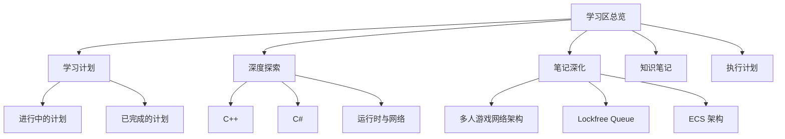

# 学习区总览

> 本仓库是 AI 程序员自我提升工作区，集中存放系统化学习计划、知识点深度探索、执行计划与知识笔记。

---

## 快速入口

| 区域 | 说明 | 入口 |
|------|------|------|
| 学习计划 | 按知识点拆分的结构化教程 | [[docs/learning-plans/INDEX]] |
| 深度探索 | 单个知识点的源码级剖析 | [[docs/deep-dives/INDEX]] |
| 笔记深化 | 基于 `drafts/` 笔记生成的深度教程 | [[docs/deeper_userNote/INDEX]] |
| 知识笔记 | 简短的知识要点与决策参考 | [[docs/knowledge-notes/INDEX]] |
| 执行计划 | 跨步骤任务与项目计划 | [[docs/exec-plans/PLAN]] |

---

## 内容地图

---

## 学习计划分类

### 游戏开发

> 涵盖游戏引擎、网络同步、AI、性能优化与核心子系统。

- [[docs/learning-plans/active/game-engine-dev/plan|游戏引擎开发]] — 从零构建游戏引擎的核心系统
- [[docs/learning-plans/active/game-performance-optimization/plan|游戏性能优化]] — 性能分析、内存、渲染与多线程优化
- [[docs/learning-plans/active/frame-state-sync/plan|帧状态同步]] — 客户端预测、回滚与网络同步
- [[docs/learning-plans/active/game-ai-fsm-bt/plan|游戏 AI：FSM 与 BT]] — 有限状态机与行为树
- [[docs/learning-plans/active/battle-system/plan|战斗系统]] — 战斗逻辑、技能与状态设计
- [[docs/learning-plans/active/ecs-system/plan|ECS 系统]] — 实体组件系统设计
- [[docs/learning-plans/active/advanced-pathfinding/plan|高级寻路]] — 寻路算法与导航系统

### C++ 底层

> 聚焦 C++ 现代特性、内存模型与并发机制。

- [[docs/learning-plans/active/cpp-for-game-engineers/plan|面向游戏工程师的 C++]] — 游戏开发所需的 C++ 工程实践
- [[docs/learning-plans/active/cpp-async-programming/plan|C++ 异步编程]] — 协程、并发与未来模型
- [[docs/learning-plans/active/cpp-memory-model/plan|C++ 内存模型]] — 原子操作、内存序与缓存一致性

### C# / .NET

- [[docs/learning-plans/active/design-patterns-csharp/plan|C# 设计模式]] — 面向对象设计模式在 C# 中的实现
- [[docs/learning-plans/active/dotnet-cli-csharp-project/plan|.NET CLI 与 C# 项目]] — 命令行构建与项目管理

### 工具与工作流

- [[docs/learning-plans/active/oh-my-pi-code-agent-使用指南/plan|Oh My Pi Code Agent 使用指南]] — AI 编程助手工作流
- [[docs/learning-plans/active/neovim-lua-config/plan|Neovim Lua 配置]] — 现代化 Neovim 配置
- [[docs/learning-plans/active/cmake-deep-dive/plan|CMake 深入]] — 构建系统
- [[docs/learning-plans/active/typescript-complete/plan|TypeScript 完整学习]] — 类型系统与工程实践
- [[docs/learning-plans/active/mermaid-syntax/plan|Mermaid 语法]] — 图表绘制

### 计划状态

- 全部进行中的计划：[[docs/learning-plans/INDEX]]
- 计划执行与跟踪：[[docs/exec-plans/PLAN]]
- 已完成计划归档：[[docs/exec-plans/PLAN_COMPLETED]]

---

## 深度探索分类

### C++ 核心机制

- [[docs/deep-dives/cpp-casts|C++ 类型转换]]
- [[docs/deep-dives/cpp-coroutines-raii|C++ 协程与 RAII]]
- [[docs/deep-dives/cpp-mem-operations|C++ 内存操作]]
- [[docs/deep-dives/cpp-memory-order-game-engine|C++ 内存序与游戏引擎]]
- [[docs/deep-dives/cpp-perfect-forwarding|C++ 完美转发]]
- [[docs/deep-dives/cpp-pmr-polymorphic-memory-resources|C++ PMR 多态内存资源]]
- [[docs/deep-dives/cpp-smart-pointers|C++ 智能指针]]
- [[docs/deep-dives/cpp-special-member-functions|C++ 特殊成员函数]]
- [[docs/deep-dives/cpp-std-expected|std::expected]]

### 内存与性能

- [[docs/deep-dives/custom-allocators-arena|自定义分配器：Arena]]
- [[docs/deep-dives/placement-new-aligned-allocation|Placement New 与对齐分配]]
- [[docs/deep-dives/raii-complete-analysis|RAII 完整分析]]
- [[docs/deep-dives/stack-unwinding|栈展开]]
- [[docs/deep-dives/lock-guard-scoped-lock|Lock Guard 与作用域锁]]
- [[docs/deep-dives/fixed-timestep|固定时间步]]

### C# 深度主题

- [[docs/deep-dives/csharp-lazy-t|`Lazy<T>`]]
- [[docs/deep-dives/csharp-record-with|C# Record 与 with]]
- [[docs/deep-dives/csharp-di-container|C# DI 容器]]
- [[docs/deep-dives/csharp-cpp-stream-deep-dive|C++ 与 C# Stream 深入]]

### 运行时与网络

- [[docs/deep-dives/luajit-vs-lua|LuaJIT 与 Lua]]
- [[docs/deep-dives/actor-model-ue-replication-skynet|Actor 模型：UE 复制与 Skynet]]
- [[docs/deep-dives/client-server-netcode|客户端-服务器网络代码]]

---

## 笔记深化

> 从 `drafts/` 中的原始笔记出发，生成的结构化深度教程。

- [[docs/deeper_userNote/gabrielgambetta-network/README|快节奏多人游戏网络架构 — 从 Gambetta 系列到工业实践]]

---

## 知识笔记

- [[docs/knowledge-notes/cpp-special-member-rules|C++ 特殊成员函数规则]] — Rule of Zero/Three/Five/Big Two 的起源、对比与决策

---

## 推荐使用路径

1. **找方向**：从 [[docs/learning-plans/INDEX]] 选择一个学习计划，阅读 `plan.md` 与 `resources.md`
2. **系统学习**：按 `tutorials/` 中的编号顺序推进，更新 `progress.md`
3. **深入单点**：遇到难点时在 [[docs/deep-dives/INDEX]] 查找对应的深度分析
4. **记录碎片**：将学到的小知识点整理到 [[docs/knowledge-notes/INDEX]]
5. **执行任务**：通过 [[docs/exec-plans/PLAN]] 跟踪跨步骤项目，完成后归档
6. **深化笔记**：从 `drafts/` 出发，将零散笔记转化为系统教程并放入 `docs/deeper_userNote/`

---

## 维护说明

> [!info] 索引自动生成
> `docs/` 下的 `INDEX.md` 与 `PLAN.md` 由 `docs-manager` Skill 自动维护，手动编辑会在下次运行时被覆盖。

> [!tip] 新增内容
> 如需新增学习计划，使用 `learning-plans` Skill；新增深度探索直接在 `docs/deep-dives/` 下创建文件，随后运行索引更新脚本。
