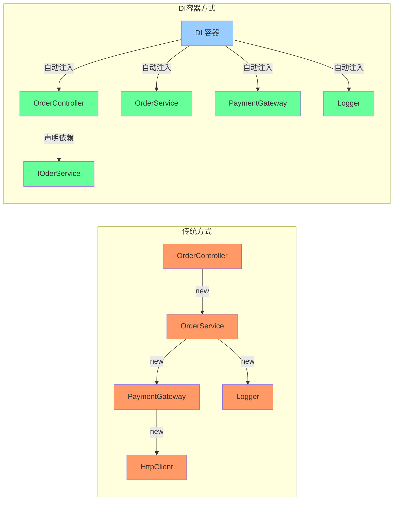
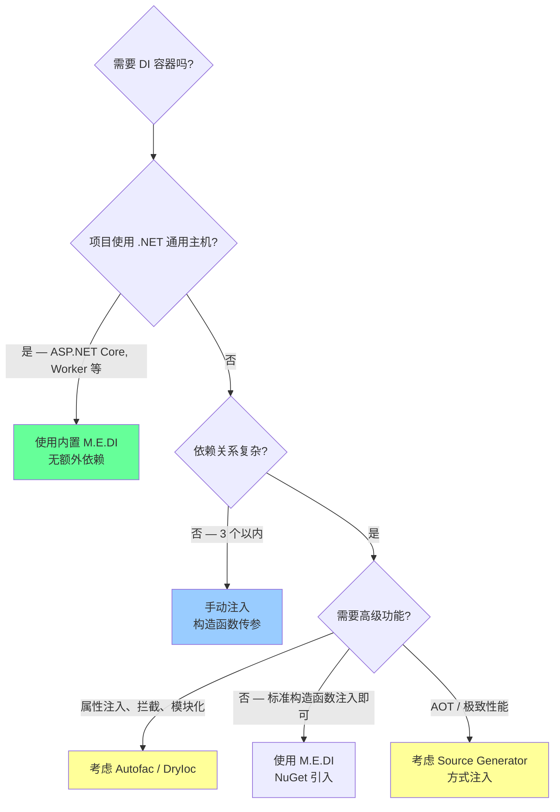
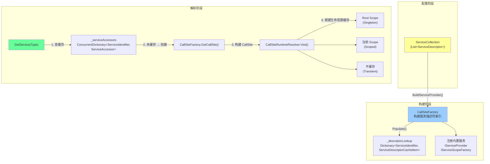

# C# DI 容器深度剖析

> 深度等级: 第 7 层（完整 7 层剖析）
> 关联学习计划: [[design-patterns-csharp|设计模式 (C#)]] → [[03-singleton|单例模式]]
> 分析日期: 2026-06-08
> 源码版本: dotnet/runtime main 分支（2026-01 commit）

---

## 第 1 层: 直觉理解

**一句话**：DI 容器是一个"对象工厂管家"——你告诉它"我需要什么类型的对象"，它负责把对象创建出来，并且自动把对象依赖的其他对象也注入进去。

**类比**：想象你在高档餐厅点了一份套餐。你不需要自己跑去厨房做饭、去农场买菜、去酒庄选酒——你只需要说"我要一份 A 套餐"。餐厅的**服务员**（DI 容器）知道 A 套餐需要牛排（依赖 `ISteak`），牛排需要黑椒酱（依赖 `IPepperSauce`），酱料需要胡椒粒（依赖 `IPepper`）。服务员会沿着依赖链一路准备，最后把完整的套餐端到你面前。

**关键区别**：如果你自己做饭（手写 `new`），你必须知道每一步的原料来源。用 DI 容器，你只声明"我需要什么"（构造函数参数），容器负责"怎么凑齐"。



> [!important] DI 容器 vs 手动依赖注入
> DI 容器**不是**依赖注入本身。依赖注入是一种设计原则（依赖从外部传入，而非内部创建）。DI 容器是**实现这个原则的自动化工具**。你可以完全不用容器，手写工厂方法来注入依赖——只是当依赖关系复杂时，手写成本太高。

---

## 第 2 层: 使用场景

### 什么时候用

| 场景 | 为什么 |
|------|--------|
| ASP.NET Core / .NET 通用主机应用 | 框架内置 `IServiceCollection`，开箱即用 |
| 中大型应用，依赖关系复杂 | 容器自动解析依赖链，避免手写大量工厂代码 |
| 需要可测试性 | 容器支持替换实现（mock/stub），构造函数注入让依赖显式可见 |
| 需要生命周期管理 | Singleton/Scoped/Transient 三种生命周期，容器自动管理创建和销毁 |
| 插件化架构 | 通过接口注册，运行时替换实现，无需修改消费者代码 |
| [[03-singleton\|单例模式]]的替代方案 | 用 `AddSingleton` 声明式管理单例，无需手写线程安全代码 |

### 什么时候不用

| 场景 | 为什么 |
|------|--------|
| 小型脚本/工具程序 | 引入容器增加复杂度，收益不大 |
| 只有两三个依赖的简单类 | 构造函数直接传参更简单直接 |
| 需要极致启动性能 | 容器构建有初始化开销（反射 + 缓存） |
| 需要编译时依赖验证 | 容器在运行时才报错，编译期无法发现缺失注册 |
| 模块边界需要显式控制 | 容器的全局注册表可能模糊模块边界 |

### 决策流程



---

## 第 3 层: API 层

### 核心类型一览

| 类型 | 所在包 | 职责 |
|------|--------|------|
| `IServiceCollection` | DependencyInjection.Abstractions | 注册服务的集合（`List<ServiceDescriptor>` 的接口） |
| `ServiceDescriptor` | DependencyInjection.Abstractions | 描述一个服务的注册信息（类型 + 生命周期 + 实现） |
| `ServiceLifetime` | DependencyInjection.Abstractions | 枚举：Singleton / Scoped / Transient |
| `ServiceProvider` | DependencyInjection | 容器核心——解析服务的实际引擎 |
| `IServiceProvider` | DependencyInjection.Abstractions | 解析接口——`GetService(Type)` / `GetRequiredService<T>()` |
| `IServiceScope` | DependencyInjection.Abstractions | Scoped 生命周期的作用域 |
| `IServiceScopeFactory` | DependencyInjection.Abstractions | 创建 Scope 的工厂 |
| `ServiceProviderOptions` | DependencyInjection | 容器配置选项 |

### `ServiceLifetime` 枚举

| 值 | 整数值 | 含义 |
|---|--------|------|
| `Singleton` | 0 | 整个容器生命周期内只创建一个实例 |
| `Scoped` | 1 | 每个 Scope 内只创建一个实例 |
| `Transient` | 2 | 每次请求都创建新实例 |

### `ServiceDescriptor` — 注册描述符

三种创建方式：

```csharp
// 1. 接口 + 实现类型 + 生命周期
ServiceDescriptor.Describe(typeof(ILogger), typeof(ConsoleLogger), ServiceLifetime.Singleton);

// 2. 接口 + 工厂方法 + 生命周期
ServiceDescriptor.Describe(typeof(ILogger), sp => new ConsoleLogger(), ServiceLifetime.Singleton);

// 3. 接口 + 已有实例（自动为 Singleton）
ServiceDescriptor.Singleton<ILogger>(new ConsoleLogger());
```

| 属性 | 类型 | 说明 |
|------|------|------|
| `ServiceType` | `Type` | 注册的服务类型（通常是接口） |
| `ImplementationType` | `Type?` | 实现类型（非 keyed 服务时可用） |
| `ImplementationFactory` | `Func<IServiceProvider, object>?` | 工厂委托 |
| `ImplementationInstance` | `object?` | 预创建的实例 |
| `Lifetime` | `ServiceLifetime` | 生命周期 |
| `ServiceKey` | `object?` | Keyed 服务的键（.NET 8+） |

### `IServiceCollection` 扩展方法

最常用的注册方法（均为 `Microsoft.Extensions.DependencyInjection.ServiceCollectionServiceExtensions`）：

| 方法 | 生命周期 | 示例 |
|------|---------|------|
| `AddSingleton<TService, TImpl>()` | Singleton | `services.AddSingleton<ILogger, ConsoleLogger>()` |
| `AddSingleton<TService>(Func<IServiceProvider, TService>)` | Singleton | `services.AddSingleton<ILogger>(sp => new ConsoleLogger())` |
| `AddSingleton<TService>(TService)` | Singleton | `services.AddSingleton<ILogger>(new ConsoleLogger())` |
| `AddScoped<TService, TImpl>()` | Scoped | `services.AddScoped<IOrderRepo, SqlOrderRepo>()` |
| `AddTransient<TService, TImpl>()` | Transient | `services.AddTransient<IEmailSender, SmtpSender>()` |
| `AddKeyedSingleton<TService, TImpl>(object key)` | Singleton (.NET 8+) | `services.AddKeyedSingleton<ILogger, FileLogger>("file")` |
| `TryAddSingleton<TService, TImpl>()` | Singleton | 仅当未注册时才添加（避免覆盖） |

### `IServiceProvider` 解析方法

| 方法 | 所在类 | 找不到时 | 示例 |
|------|--------|---------|------|
| `GetService(Type)` | `IServiceProvider` | 返回 `null` | `sp.GetService(typeof(ILogger))` |
| `GetRequiredService(Type)` | `ServiceProviderServiceExtensions` | 抛 `InvalidOperationException` | `sp.GetRequiredService(typeof(ILogger))` |
| `GetService<T>()` | `ServiceProviderServiceExtensions` | 返回 `default` | `sp.GetService<ILogger>()` |
| `GetRequiredService<T>()` | `ServiceProviderServiceExtensions` | 抛 `InvalidOperationException` | `sp.GetRequiredService<ILogger>()` |
| `GetServices(Type)` | `ServiceProviderServiceExtensions` | 返回空 `IEnumerable` | `sp.GetServices(typeof(ILogger))` |
| `GetKeyedService(Type, key)` | `IKeyedServiceProvider` (.NET 8+) | 返回 `null` | `sp.GetKeyedService(typeof(ILogger), "file")` |

### `ServiceProviderOptions` 配置

| 属性 | 默认值 | 说明 |
|------|--------|------|
| `ValidateScopes` | `false` | `true` 时验证 Scoped 服务不会被 Root Provider 解析（开发环境应开启） |
| `ValidateOnBuild` | `false` | `true` 时在 `BuildServiceProvider()` 时验证所有注册都可解析（开发环境应开启） |

---

## 第 4 层: 行为契约

### 前置条件

- 注册的服务类型必须是**接口或基类**（通常），实现类型必须有**公共构造函数**
- 构造函数的所有参数必须已注册，否则 `GetRequiredService` 抛异常
- 同一类型多次注册时，**最后注册的生效**（Last Win），但 `IEnumerable<T>` 可获取所有注册
- 开放泛型注册（如 `IRepo<>` → `Repo<>`）必须保证泛型参数数量一致

### 后置条件

- `GetRequiredService<T>()` 要么返回非 null 实例，要么抛 `InvalidOperationException`
- `GetService<T>()` 返回 `null` 表示未注册
- `BuildServiceProvider()` 返回的 `ServiceProvider` 是**不可变的**——后续修改 `ServiceCollection` 不影响已构建的容器

### 不变量

- **Singleton** 实例在 Root Scope 的 `ResolvedServices` 字典中，全局唯一
- **Scoped** 实例在当前 Scope 的 `ResolvedServices` 字典中，Scope 内唯一
- **Transient** 实例每次解析都新建，但 `IDisposable` / `IAsyncDisposable` 实例会被 Scope 追踪用于释放
- 容器释放（`Dispose`）时，按**逆注册顺序**释放所有追踪的 Disposable 对象

### 异常语义

| 场景 | 异常类型 | 说明 |
|------|---------|------|
| 未注册的服务 | `InvalidOperationException` | `GetRequiredService` 时抛出，消息为 "No service for type 'T' has been registered." |
| 循环依赖 | `InvalidOperationException` | A → B → A，解析时检测到循环链并抛出 |
| Scoped 被根解析 | `InvalidOperationException` | 当 `ValidateScopes=true` 时，从 Root Provider 解析 Scoped 服务抛出 |
| 构造函数参数未注册 | `InvalidOperationException` | 构造函数某个参数类型未在容器中注册 |
| 容器已释放 | `ObjectDisposedException` | 在 `Dispose` 后调用 `GetService` |
| 多构造函数歧义 | `InvalidOperationException` | 容器只选择参数最多的构造函数；如果有多个同数量参数的，抛异常 |

### 线程安全声明

- `ServiceProvider` 本身是**线程安全**的——多个线程可以同时调用 `GetService`
- `ServiceProviderEngineScope`（Scope）**不是线程安全**的——不应在多线程间共享同一个 Scope
- `ServiceCollection` **不是线程安全**的——只在配置阶段（单线程）使用，构建后不再修改

### 生命周期陷阱

> [!danger] Captive Dependency（被俘依赖）
> 生命周期长的服务依赖生命周期短的服务，会导致短生命周期的服务被"俘获"为更长生命周期：
>
> | 依赖关系 | 问题 | 结果 |
> |---------|------|------|
> | Singleton → Scoped | Scoped 被提升为 Singleton | 所有请求共享同一个 Scoped 实例 |
> | Singleton → Transient | Transient 被提升为 Singleton | 同上 |
> | Scoped → Transient | Transient 被提升为 Scoped | Scope 内只创建一次 |
>
> `ValidateScopes=true` 只检测 Singleton → Scoped 的俘获，不检测 Singleton → Transient。

> [!warning] Scope 必须释放
> Scope 内追踪了所有 Disposable 的 Transient 和 Scoped 实例。如果创建 Scope 后不释放，这些实例永远不会被 GC（因为 Scope 持有引用）。在 ASP.NET Core 中，框架自动为每个请求创建和释放 Scope。

---

## 第 5 层: 实现原理

### 整体架构



### 核心概念：ServiceCallSite

`ServiceCallSite` 是解析的"蓝图"——它描述了如何创建一个服务实例，包括调用哪个构造函数、注入哪些参数、结果缓存在哪里。

```text
ServiceCallSite（抽象基类）
├── ConstructorCallSite   — 通过构造函数创建
│   ├── ConstructorInfo    — 选中的构造函数
│   └── ParameterCallSites — 参数的 CallSite 递归链
├── FactoryCallSite       — 通过工厂方法创建
│   └── Factory            — Func<IServiceProvider, object>
├── ConstantCallSite      — 已有实例（直接返回）
│   └── DefaultValue       — 预创建的对象
├── ServiceProviderCallSite — 返回 IServiceProvider 自身
└── IEnumerableCallSite   — 解析同一接口的所有注册
    └── ServiceCallSites[] — 每个注册对应的 CallSite
```

每个 `ServiceCallSite` 还持有 `Cache` 信息，决定解析结果缓存在哪里：

| `ResultCacheLocation` | 含义 | 对应生命周期 |
|----------------------|------|------------|
| `Root` | 缓存在 Root Scope 的 `ResolvedServices` | Singleton |
| `Scope` | 缓存在当前 Scope 的 `ResolvedServices` | Scoped |
| `Dispose` | 不缓存，但追踪 Disposable | Transient |
| `None` | 不缓存，不追踪 | Transient（非 Disposable） |

### 解析流程伪代码

```text
function GetService(serviceType, scope):
    // 1. 查找 ServiceAccessor 缓存
    accessor = _serviceAccessors.GetOrAdd(serviceType, CreateServiceAccessor)

    // 2. 调用已编译的解析委托
    return accessor.RealizedService(scope)


function CreateServiceAccessor(serviceType):
    // 1. 构建 CallSite（依赖图）
    callSite = CallSiteFactory.GetCallSite(serviceType, callSiteChain)
    if callSite == null:
        return (_, _) => null  // 未注册

    // 2. 优化：Singleton 在构建时直接解析
    if callSite.Cache.Location == Root:
        value = CallSiteRuntimeResolver.Resolve(callSite, Root)
        return (_, _) => value  // 永远返回同一实例

    // 3. 动态编译解析委托
    return Engine.RealizeService(callSite)


function RealizeService(callSite)  [DynamicServiceProviderEngine]:
    callCount = 0
    return scope =>
        result = CallSiteRuntimeResolver.Resolve(callSite, scope)
        if Interlocked.Increment(callCount) == 2:
            // 第二次调用后，后台线程编译表达式树
            ThreadPool.QueueUserWorkItem(_ =>
                compiled = CompileToDelegate(callSite)
                ReplaceServiceAccessor(callSite, compiled)
            )
        return result
```

### 动态编译优化

`DynamicServiceProviderEngine` 的分层优化策略：

1. **第 0-1 次调用**：使用 `CallSiteRuntimeResolver` 反射解析（较慢，但无需编译开销）
2. **第 2 次调用起**：在后台线程用 **表达式树**（`Expression<T>`）编译为委托，替换解析函数
3. **后续调用**：直接调用编译后的委托，性能接近手写代码

> [!info] NativeAOT 模式
> 在 AOT 环境下（`RuntimeFeature.IsDynamicCodeCompiled == false`），无法使用表达式树编译。容器回退到 `RuntimeServiceProviderEngine`，始终使用反射解析，性能较低但 AOT 兼容。

### CallSite 构建：依赖图解析

`CallSiteFactory.CreateCallSite` 的核心逻辑：

1. **查找精确匹配**：`TryCreateExact` — 在 `_descriptorLookup` 中找到精确类型注册
2. **查找开放泛型**：`TryCreateOpenGeneric` — 对 `IRepo<Order>` 匹配 `IRepo<>` → `Repo<>` 注册
3. **查找 `IEnumerable<T>`**：`TryCreateEnumerable` — 返回所有 `T` 的注册
4. **检测循环依赖**：`CallSiteChain.CheckCircularDependency` — 在递归构建时追踪链路

```text
CreateCallSite(serviceIdentifier, callSiteChain):
    lock(serviceIdentifier):  // 防止并发构建同一 CallSite
        callSiteChain.CheckCircularDependency(serviceIdentifier)
        callSite = TryCreateExact(serviceIdentifier, callSiteChain)
               ?? TryCreateOpenGeneric(serviceIdentifier, callSiteChain)
               ?? TryCreateEnumerable(serviceIdentifier, callSiteChain)
        return callSite
```

### 生命周期缓存机制

```text
┌─────────────────────────────────────────────────────┐
│ ServiceProvider (Root)                               │
│ ┌─────────────────────────────────────────────────┐ │
│ │ ServiceProviderEngineScope (Root)               │ │
│ │ ┌─────────────────────────────────────────────┐ │ │
│ │ │ ResolvedServices: Dictionary<CacheKey, obj> │ │ │
│ │ │   ILogger → ConsoleLogger (singleton)       │ │ │ ← Singleton 缓存在这里
│ │ │   IConfig → AppConfig (singleton)           │ │ │
│ │ └─────────────────────────────────────────────┘ │ │
│ │ Disposables: List<object>                       │ │ ← 追踪所有 Disposable
│ └─────────────────────────────────────────────────┘ │
│                                                     │
│ ┌─────────────────────────────────────────────────┐ │
│ │ ServiceProviderEngineScope (Scope 1)            │ │ ← 每个请求一个
│ │ ┌─────────────────────────────────────────────┐ │ │
│ │ │ ResolvedServices: Dictionary<CacheKey, obj> │ │ │
│ │ │   IUserRepo → SqlUserRepo (scoped)          │ │ │ ← Scoped 缓存在当前 Scope
│ │ │   IOrderRepo → SqlOrderRepo (scoped)        │ │ │
│ │ └─────────────────────────────────────────────┘ │ │
│ │ Disposables: List<object>                       │ │
│ └─────────────────────────────────────────────────┘ │
│                                                     │
│ ┌─────────────────────────────────────────────────┐ │
│ │ ServiceProviderEngineScope (Scope 2)            │ │
│ │ ┌─────────────────────────────────────────────┐ │ │
│ │ │ ResolvedServices: Dictionary<CacheKey, obj> │ │ │
│ │ │   IUserRepo → SqlUserRepo (scoped)          │ │ │ ← 另一个实例
│ │ └─────────────────────────────────────────────┘ │ │
│ └─────────────────────────────────────────────────┘ │
└─────────────────────────────────────────────────────┘
```

### Dispose 机制

Scope/Root 释放时：

1. 标记 `_disposed = true`
2. 取出 `_disposables` 列表
3. **逆序遍历**（最后注册的最先释放）
4. 对每个对象：优先 `IAsyncDisposable.DisposeAsync`，回退 `IDisposable.Dispose`
5. 释放过程中异常不中断，收集后以 `AggregateException` 抛出

---

## 第 6 层: 源码分析

> 源码来源：[dotnet/runtime — Microsoft.Extensions.DependencyInjection](https://github.com/dotnet/runtime/tree/main/src/libraries/Microsoft.Extensions.DependencyInjection)
> 版本：main 分支，2026-01 最新提交

### 6.1 `ServiceProvider` — 容器入口

```csharp
// dotnet/runtime ServiceProvider.cs 行 28-35
public sealed class ServiceProvider : IServiceProvider, IKeyedServiceProvider, IDisposable, IAsyncDisposable
{
    private readonly CallSiteValidator? _callSiteValidator;
    private readonly Func<ServiceIdentifier, ServiceAccessor> _createServiceAccessor;
    internal ServiceProviderEngine _engine;
    private bool _disposed;
    private readonly ConcurrentDictionary<ServiceIdentifier, ServiceAccessor> _serviceAccessors;
    internal CallSiteFactory CallSiteFactory { get; }
    internal ServiceProviderEngineScope Root { get; }
```

**关键设计**：

1. **`_serviceAccessors`**：`ConcurrentDictionary` 缓存每个服务类型的解析委托。首次解析时构建，后续直接调用
2. **`Root`**：Root Scope，持有所有 Singleton 实例和整个容器的 Disposable 列表
3. **`_engine`**：动态编译引擎，负责将 CallSite 编译为高性能委托

### 6.2 核心解析路径

```csharp
// dotnet/runtime ServiceProvider.cs 行 172-184
internal object? GetService(ServiceIdentifier serviceIdentifier, ServiceProviderEngineScope serviceProviderEngineScope)
{
    if (_disposed) ThrowHelper.ThrowObjectDisposedException();

    // 1. 查找或创建 ServiceAccessor
    ServiceAccessor serviceAccessor = _serviceAccessors.GetOrAdd(serviceIdentifier, _createServiceAccessor);

    // 2. 验证 Scope 限制（如果开启）
    OnResolve(serviceAccessor.CallSite, serviceProviderEngineScope);

    // 3. 调用解析委托
    object? result = serviceAccessor.RealizedService?.Invoke(serviceProviderEngineScope);
    return result;
}
```

### 6.3 ServiceAccessor 创建与 Singleton 优化

```csharp
// dotnet/runtime ServiceProvider.cs 行 203-221
private ServiceAccessor CreateServiceAccessor(ServiceIdentifier serviceIdentifier)
{
    ServiceCallSite? callSite = CallSiteFactory.GetCallSite(serviceIdentifier, new CallSiteChain());
    if (callSite != null)
    {
        OnCreate(callSite);

        // 🔑 关键优化：Singleton 在创建 ServiceAccessor 时直接解析并缓存
        if (callSite.Cache.Location == CallSiteResultCacheLocation.Root)
        {
            object? value = CallSiteRuntimeResolver.Instance.Resolve(callSite, Root);
            return new ServiceAccessor { CallSite = callSite, RealizedService = scope => value };
        }

        // 非 Singleton：交给引擎动态编译
        Func<ServiceProviderEngineScope, object?> realizedService = _engine.RealizeService(callSite);
        return new ServiceAccessor { CallSite = callSite, RealizedService = realizedService };
    }
    return new ServiceAccessor { CallSite = callSite, RealizedService = _ => null };
}
```

> [!tip] Singleton 的"预解析"优化
> Singleton 服务在 `ServiceAccessor` 创建时就被解析，`RealizedService` 被替换为一个直接返回值的闭包 `scope => value`。后续所有调用直接返回缓存值，**零开销**。这是 M.E.DI 对 Singleton 性能优化的核心。

### 6.4 动态编译引擎

```csharp
// dotnet/runtime DynamicServiceProviderEngine.cs 行 16-38
public override Func<ServiceProviderEngineScope, object?> RealizeService(ServiceCallSite callSite)
{
    int callCount = 0;
    return scope =>
    {
        // 先解析，再计数 — 避免副作用影响编译
        var result = CallSiteRuntimeResolver.Instance.Resolve(callSite, scope);

        if (Interlocked.Increment(ref callCount) == 2)
        {
            // 第二次调用后，后台线程编译表达式树
            _ = ThreadPool.UnsafeQueueUserWorkItem(_ =>
            {
                try
                {
                    _serviceProvider.ReplaceServiceAccessor(callSite, base.RealizeService(callSite));
                }
                catch (Exception ex)
                {
                    DependencyInjectionEventSource.Log.ServiceRealizationFailed(ex, _serviceProvider.GetHashCode());
                }
            }, null);
        }
        return result;
    };
}
```

**设计决策**：

1. **两次阈值**：首次调用用反射（冷启动快），第二次调用触发编译（热路径快）
2. **后台编译**：`ThreadPool.UnsafeQueueUserWorkItem` 在后台线程编译，不阻塞当前请求
3. **`Unsafe` 前缀**：不捕获 `ExecutionContext`，避免线程本地状态泄漏到后台线程
4. **失败静默**：编译失败只记录日志，不抛异常——回退到反射解析仍然可用

### 6.5 CallSiteRuntimeResolver — 实际对象创建

```csharp
// dotnet/runtime CallSiteRuntimeResolver.cs 行 57-77
protected override object VisitConstructor(ConstructorCallSite constructorCallSite, RuntimeResolverContext context)
{
    object?[] parameterValues;
    if (constructorCallSite.ParameterCallSites.Length == 0)
    {
        parameterValues = Array.Empty<object>();
    }
    else
    {
        parameterValues = new object?[constructorCallSite.ParameterCallSites.Length];
        for (int index = 0; index < parameterValues.Length; index++)
        {
            // 递归解析每个参数
            parameterValues[index] = VisitCallSite(constructorCallSite.ParameterCallSites[index], context);
        }
    }
    // 反射调用构造函数
    return constructorCallSite.ConstructorInfo.Invoke(BindingFlags.DoNotWrapExceptions, binder: null, parameters: parameterValues, culture: null);
}
```

### 6.6 Singleton 缓存的线程安全

```csharp
// dotnet/runtime CallSiteRuntimeResolver.cs 行 79-115
protected override object? VisitRootCache(ServiceCallSite callSite, RuntimeResolverContext context)
{
    if (callSite.Value is object value)
        return value;  // 快速路径：已缓存

    var lockType = RuntimeResolverLock.Root;
    ServiceProviderEngineScope serviceProviderEngine = context.Scope.RootProvider.Root;

    lock (callSite)  // 🔑 以 CallSite 对象为锁
    {
        if (callSite.Value is object callSiteValue)
            return callSiteValue;  // 双重检查

        // 循环依赖检测（ThreadStatic）
        t_resolving ??= new HashSet<ServiceCallSite>(ReferenceEqualityComparer.Instance);
        if (!t_resolving.Add(callSite))
            throw new InvalidOperationException("Circular dependency detected");

        try
        {
            object? resolved = VisitCallSiteMain(callSite, ...);
            serviceProviderEngine.CaptureDisposable(resolved);
            callSite.Value = resolved;  // 缓存在 CallSite 上
            return resolved;
        }
        finally
        {
            t_resolving.Remove(callSite);
        }
    }
}
```

**关键设计**：

1. **`lock(callSite)`**：每个 CallSite 自身就是锁对象——不同服务类型不会互相阻塞
2. **双重检查**：锁外先检查 `callSite.Value`，锁内再检查——避免多数线程阻塞
3. **`callSite.Value`**：Singleton 缓存直接存在 `ServiceCallSite` 对象上——减少一层字典查找
4. **`ThreadStatic` 循环检测**：每个线程维护一个 `HashSet<ServiceCallSite>`，检测工厂方法中的循环依赖

### 6.7 Scoped 缓存

```csharp
// dotnet/runtime CallSiteRuntimeResolver.cs 行 117-155
private object? VisitCache(ServiceCallSite callSite, RuntimeResolverContext context,
    ServiceProviderEngineScope serviceProviderEngine, RuntimeResolverLock lockType)
{
    bool lockTaken = false;
    object sync = serviceProviderEngine.Sync;  // Sync = ResolvedServices 字典对象
    Dictionary<ServiceCacheKey, object?> resolvedServices = serviceProviderEngine.ResolvedServices;

    if ((context.AcquiredLocks & lockType) == 0)
        Monitor.Enter(sync, ref lockTaken);  // 🔑 以 ResolvedServices 字典为锁

    try
    {
        if (resolvedServices.TryGetValue(callSite.Cache.Key, out object? resolved))
            return resolved;

        resolved = VisitCallSiteMain(callSite, new RuntimeResolverContext
        {
            Scope = serviceProviderEngine,
            AcquiredLocks = context.AcquiredLocks | lockType
        });
        serviceProviderEngine.CaptureDisposable(resolved);
        resolvedServices.Add(callSite.Cache.Key, resolved);
        return resolved;
    }
    finally
    {
        if (lockTaken) Monitor.Exit(sync);
    }
}
```

> [!tip] Scoped 缓存的锁优化
> `AcquiredLocks` 是一个 `Flags` 枚举，记录当前已持有的锁。如果递归解析同一 Scope 内的依赖时已经持有锁，就**不再重复获取**——避免自死锁，也减少锁竞争。

### 6.8 ServiceDescriptor — 三态存储模型

```csharp
// dotnet/runtime ServiceDescriptor.cs — 关键字段
public class ServiceDescriptor
{
    public ServiceLifetime Lifetime { get; }
    public Type ServiceType { get; }
    public object? ServiceKey { get; }

    // 三种实现方式，同一时间只有一种非 null
    private Type? _implementationType;          // 方式 1：实现类型
    private object? _implementationInstance;     // 方式 2：已有实例
    private object? _implementationFactory;      // 方式 3：工厂委托（object 保存，避免泛型擦除）
}
```

三种注册方式映射到三种 `ServiceCallSite`：

| 注册方式 | `_implementationType` | `_implementationInstance` | `_implementationFactory` | 对应 CallSite |
|---------|----------------------|--------------------------|-------------------------|--------------|
| `AddSingleton<ILogger, ConsoleLogger>()` | `ConsoleLogger` | `null` | `null` | `ConstructorCallSite` |
| `AddSingleton<ILogger>(instance)` | `null` | `instance` | `null` | `ConstantCallSite` |
| `AddSingleton<ILogger>(sp => new ...)` | `null` | `null` | `Func<IServiceProvider, object>` | `FactoryCallSite` |

---

## 第 7 层: 对比与边界

### .NET DI 容器对比

| 维度 | M.E.DI (内置) | Autofac | DryIoc | Lamar |
|------|---------------|---------|--------|-------|
| **性能（解析）** | 中（反射 + 表达式树编译） | 中（表达式树编译） | 高（IL Emit / 动态代码生成） | 中 |
| **性能（构建）** | 快 | 中 | 快 | 快 |
| **属性注入** | ❌ 不支持 | ✅ 支持 | ✅ 支持 | ✅ 支持 |
| **拦截/AOP** | ❌ 不支持 | ✅ 内置 | ✅ 支持 | ✅ 支持 |
| **模块化注册** | ❌（手动扩展方法组织） | ✅ `Module` 类 | ✅ `IRegistrator` | ✅ `ServiceRegistry` |
| **Keyed 服务** | ✅ .NET 8+ | ✅ 命名注册 | ✅ 命名/Keyed | ✅ 命名 |
| **开放泛型** | ✅ | ✅ | ✅ | ✅ |
| **装饰器** | ❌（需手写） | ✅ 内置 | ✅ 内置 | ✅ |
| **生命周期** | 3 种 | 3 种 + InstancePerRequest | 6 种（含 PerResolve 等） | 3 种 |
| **AOT 兼容** | ✅（回退反射） | ❌ | ❌ | ✅（Source Generator） |
| **NuGet 依赖** | 内置 / 单包 | Autofac + 集成包 | 单包 | 单包 |
| **学习曲线** | 低 | 中 | 中高 | 低 |
| **生态集成** | ASP.NET Core 原生 | 需替换内置容器 | 需替换内置容器 | 需替换内置容器 |

### 性能特征

M.E.DI 的性能特征来自其分层设计：

| 阶段 | 操作 | 开销 |
|------|------|------|
| 构建 | `BuildServiceProvider()` | O(N) 遍历 `ServiceDescriptor`，构建 `_descriptorLookup` 字典 |
| 首次解析 | `GetService<T>()` | 反射 + CallSite 构建 + CallSite 缓存 |
| 第二次解析 | `GetService<T>()` | 反射解析 + 触发后台编译 |
| 后续解析 | `GetService<T>()` | 调用编译后的委托，接近手写 `new` |
| Singleton 解析 | `GetService<T>()` | 直接返回缓存值，**零开销**（闭包捕获） |

> [!tip] 为什么 M.E.DI 不追求极致性能
> M.E.DI 的设计目标是**正确性和安全性**，而非极致性能。典型场景下，解析开销远小于被创建服务本身的成本（数据库连接、HTTP 请求等）。如果 DI 解析成为瓶颈，DryIoc 通过 IL Emit 可以提供 5-10 倍的解析性能提升。

### 设计取舍

| 决策 | 选择 | 原因 |
|------|------|------|
| 构造函数选择策略 | 最多参数的公共构造函数 | 最"贪婪"的构造函数通常意味着最完整的初始化 |
| 同类型多注册 | Last Win + `IEnumerable<T>` 获取全部 | 简单直觉，同时保留获取全部的能力 |
| Singleton 缓存位置 | 缓存在 `CallSite.Value` + Root `ResolvedServices` | 双重缓存——ServiceAccessor 闭包直接返回值，CallSite 也在锁内缓存 |
| 线程安全模型 | CallSite 级锁 + Scope 级锁 | 细粒度锁减少竞争 |
| 编译策略 | 两次调用后后台编译 | 避免冷启动开销，同时保证热路径性能 |
| Disposable 追踪 | Scope 内 List 追踪 | 简单可靠，但 Transient + Disposable 组合会导致内存泄漏（Scope 不释放则实例不释放） |

### 边界情况

| 场景 | 行为 | 建议 |
|------|------|------|
| Transient + `IDisposable` | 实例被 Scope 追踪，Scope 释放时才 Dispose | 避免注册大量 Transient + Disposable，改用工厂模式 |
| Singleton 依赖 Scoped | Singleton 在 Root Scope 中缓存，Scoped 被提升为 Singleton | 开启 `ValidateScopes=true`，开发时检测 |
| 循环依赖 | 运行时抛 `InvalidOperationException` | 重构设计，或使用 `Lazy<T>` / `IServiceProvider` 延迟解析 |
| 容器内 `IServiceProvider` 注入 | 返回当前 Scope | 在 Singleton 中注入 `IServiceProvider` 会拿到 Root，不是当前 Scope |
| `BuildServiceProvider` 多次调用 | 每次创建新的 `ServiceProvider`，Singleton 互不共享 | 只调用一次，通常在启动时 |
| 开放泛型 + 约束 | 运行时验证约束 | 注册时不检查，解析时 `Activator.CreateInstance` 失败 |

### 与手写 Singleton 的对比

| 维度 | 手写 Singleton（`Lazy<T>`） | DI `AddSingleton` |
|------|---------------------------|-------------------|
| 线程安全 | 需手写或用 `Lazy<T>` | 容器内部保证 |
| 依赖注入 | 需手动传递或 Service Locator | 自动构造函数注入 |
| 可测试性 | 差（静态访问点，无法替换） | 好（接口注入，测试时替换实现） |
| 生命周期控制 | 需手动 `IDisposable` | 容器自动追踪和释放 |
| 依赖关系可见 | 隐藏（`Instance` 属性不暴露依赖） | 显式（构造函数签名声明所有依赖） |
| 作用域 | AppDomain 级唯一 | 容器级唯一（可有多容器） |

---

## 常见面试题

**Q1：M.E.DI 的 Singleton 和手写 `Lazy<T>` Singleton 有什么区别？**

手写 Singleton 通过 `static` 字段 + `Lazy<T>` 保证 AppDomain 级唯一，依赖隐藏，测试困难。DI Singleton 由容器管理生命周期，通过构造函数注入依赖，支持接口替换，容器自动 Dispose。DI Singleton 是**声明式**的——你只声明"这个服务是单例"，容器处理线程安全、缓存、释放。

**Q2：什么是 Captive Dependency？如何检测？**

生命周期长的服务（Singleton）直接依赖生命周期短的服务（Scoped/Transient），导致短生命周期服务被"俘获"为更长的生命周期。例如 Singleton 中注入 Scoped，该 Scoped 实例在 Root Scope 中缓存，所有请求共享同一个实例。检测方法：开发环境设置 `ValidateScopes = true`，容器在解析时抛异常。

**Q3：为什么 Transient + `IDisposable` 是一个陷阱？**

Transient 每次解析创建新实例，但 `IDisposable` 实例会被 Scope 追踪。如果在一个长生命周期 Scope（如 Root Scope）中解析大量 Transient + Disposable，这些实例永远不会释放，导致**内存泄漏**。解决方案：使用工厂模式（注入 `Func<T>` 而非 `T`），由调用方负责创建和释放。

**Q4：M.E.DI 如何实现线程安全？**

- **Singleton**：`lock(callSite)` + 双重检查 + `volatile` 语义
- **Scoped**：`lock(scope.ResolvedServices)` + `AcquiredLocks` 标志避免重入
- **服务注册**：`ConcurrentDictionary<ServiceIdentifier, ServiceAccessor>` 保证并发 `GetService` 安全
- **CallSite 构建**：`lock(serviceIdentifier)` 保证同一服务类型的 CallSite 只构建一次

**Q5：`IServiceProvider` 和 `IServiceScope` 的关系是什么？**

`IServiceProvider` 是解析服务的接口，`IServiceScope` 是 Scoped 生命周期的作用域容器。`IServiceScope` 内部持有一个 `ServiceProviderEngineScope`（它同时实现了 `IServiceProvider`），因此 `scope.ServiceProvider` 返回的是**作用域内的** `IServiceProvider`，从中解析的 Scoped 服务在当前 Scope 内唯一。Root `IServiceProvider` 就是 `ServiceProvider` 本身。

---

## 延伸主题

- [[csharp-lazy-t|`Lazy<T>` 深度剖析]] — DI 容器内部如何使用延迟初始化
- [[03-singleton|单例模式]] — DI Singleton 是单例模式的声明式实现
- **Microsoft.Extensions.Hosting** — 通用主机如何封装 DI 容器和 Scope 管理
- **Keyed Services (.NET 8+)** — 同一接口多个命名的注册与解析
- **Source Generator DI** — 编译时依赖注入，AOT 友好的替代方案
- **Autofac Modules** — 模块化注册的最佳实践
