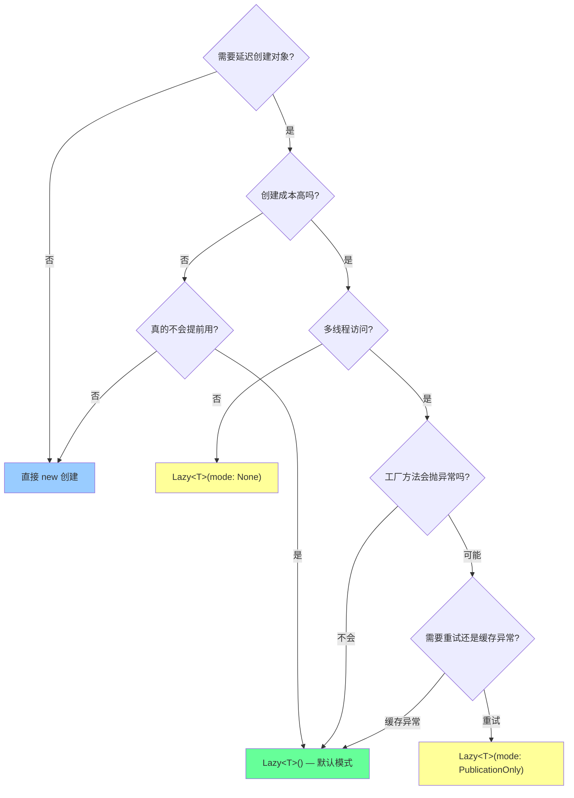
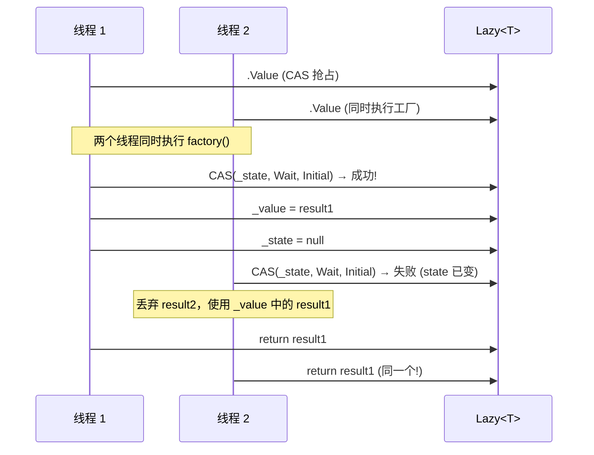

# `Lazy<T>` 深度剖析

> 深度等级: 第 7 层（完整 7 层剖析）
> 关联学习计划: [[design-patterns-csharp|设计模式 (C#)]] → [[03-singleton|单例模式]]
> 分析日期: 2026-06-08
> 源码版本: dotnet/runtime main 分支（2026-01-15 commit）

---

## 第 1 层: 直觉理解

**一句话**：`Lazy<T>` 是一个"占位符"——它承诺未来会给你一个 `T` 类型的对象，但现在不创建。等你第一次真正需要时，它才动手创建，之后永远返回同一个实例。

**类比**：想象你在图书馆办了一张借书证。办证时，图书馆不会立刻把书搬到你桌上——书还在书架上。只有当你第一次说"我要看这本书"时，馆员才去取。取来之后，书就一直在你桌上了，以后每次看都是同一本。


---

## 第 2 层: 使用场景

### 什么时候用

| 场景 | 为什么 |
|------|--------|
| [[03-singleton\|单例模式]]的线程安全实现 | `Lazy<T>` 默认线程安全，无需手写 `lock` 或双重检查 |
| 大对象延迟加载 | 对象创建昂贵（数据库连接、大数组、文件 I/O），但可能不会用到 |
| 循环依赖解耦 | A 构造时需要 B，B 构造时需要 A → 用 `Lazy<B>` 打破循环 |
| DI 容器中的延迟解析 | 有些依赖只在特定条件下才需要 |
| ORM 延迟加载 | Entity Framework 导航属性的延迟加载底层原理相同 |

### 什么时候不用

| 场景 | 为什么 |
|------|--------|
| 对象创建成本极低 | `Lazy<T>` 本身有包装开销，不值得 |
| 一定会立即使用 | 延迟没有意义，直接 `new` |
| 需要每次访问都创建新实例 | `Lazy<T>` 只创建一次，应该用 `Func<T>` |
| 对象需要显式释放（`IDisposable`） | `Lazy<T>` 不负责 `Dispose`，生命周期管理困难 |

### 决策流程



---

## 第 3 层: API 层

### 构造函数

| 构造函数 | 线程安全模式 | 工厂方法 | 说明 |
|---------|------------|---------|------|
| `Lazy<T>()` | ExecutionAndPublication | `Activator.CreateInstance<T>()` | 最常用：线程安全 + 无参构造 |
| `Lazy<T>(Func<T>)` | ExecutionAndPublication | 自定义工厂 | 最常用：线程安全 + 自定义初始化 |
| `Lazy<T>(T value)` | — | 无 | 预初始化值，`IsValueCreated` 立即返回 `true` |
| `Lazy<T>(bool isThreadSafe)` | `true`→ExecutionAndPublication, `false`→None | `Activator.CreateInstance<T>()` | 布尔控制线程安全 |
| `Lazy<T>(Func<T>, bool isThreadSafe)` | 同上 | 自定义工厂 | 工厂 + 布尔线程安全 |
| `Lazy<T>(LazyThreadSafetyMode)` | 指定模式 | `Activator.CreateInstance<T>()` | 精细控制线程安全模式 |
| `Lazy<T>(Func<T>, LazyThreadSafetyMode)` | 指定模式 | 自定义工厂 | 最完整：工厂 + 精细模式 |

### 属性

| 属性 | 类型 | 说明 |
|------|------|------|
| `Value` | `T` | 获取延迟初始化的值。首次访问触发创建，之后返回缓存 |
| `IsValueCreated` | `bool` | 值是否已创建。注意：**不是** `_value != null`，而是 `_state == null` |

### `LazyThreadSafetyMode` 枚举

| 模式 | 行为 | 异常处理 | 性能 |
|------|------|---------|------|
| `ExecutionAndPublication` | `lock` 保证只有一个线程执行工厂，其他线程等待 | **缓存异常**：工厂抛异常后，后续访问持续抛同一异常 | 有锁开销（仅首次） |
| `PublicationOnly` | 多线程可同时执行工厂，第一个完成的结果被采用 | **不缓存异常**：工厂抛异常后，后续访问重试 | 无锁（`Interlocked.CompareExchange`） |
| `None` | 无任何线程安全保证 | **缓存异常** | 无锁无同步，最快 |

### `Value` 属性的精妙之处

```csharp
// dotnet/runtime — Lazy<T>.Value 的完整实现
public T Value => _state == null ? _value! : CreateValue();
```

这一行代码的精妙之处：

1. **快速路径**：`_state == null` 意味着值已创建 → 直接返回 `_value`，无锁无分支
2. **慢速路径**：`_state != null` → 进入 `CreateValue()` 处理初始化逻辑
3. **`volatile`**：`_state` 字段声明为 `volatile`，保证读取总是最新值
4. **`_value!`**：`!` 告诉编译器"我保证它不是 null"——因为 `_state == null` 意味着 `_value` 已赋值

---

## 第 4 层: 行为契约

### 前置条件

- 工厂方法（如果提供）**不应返回 `null`**（技术上可以，但语义上不应如此）
- 工厂方法**不应递归访问 `Value`**（`ExecutionAndPublication` 模式会抛 `InvalidOperationException`）
- `T` 必须有公共无参构造器（如果使用 `Lazy<T>()` 构造）

### 后置条件

- `Value` 永远返回**同一个实例**（对 `ExecutionAndPublication` 和 `None` 模式）
- `PublicationOnly` 模式可能执行多次工厂，但**只有一个结果被采用**
- `IsValueCreated` 一旦变为 `true` 就不会变回 `false`

### 不变量

- `_state == null` ⟺ 值已成功创建 ⟺ `IsValueCreated == true`
- `_state != null` 且 `_state._exceptionDispatch != null` ⟺ 值创建失败（`ExecutionAndPublication` 和 `None` 模式）
- 工厂方法执行后，`_factory` 被置为 `null`（释放工厂闭包引用的所有对象）

### 异常语义

| 模式 | 工厂抛异常时 | 后续访问 |
|------|------------|---------|
| `ExecutionAndPublication` | 捕获异常，存入 `_exceptionDispatch`，`_state` 不变（保持异常状态） | **持续抛同一异常**（异常被缓存） |
| `PublicationOnly` | 异常不缓存，`_state` 回到初始状态 | **重试工厂方法**（可能成功） |
| `None` | 捕获异常，存入 `_exceptionDispatch` | **持续抛同一异常**（异常被缓存） |

> [!warning] 异常缓存陷阱
> `ExecutionAndPublication`（默认模式）会缓存工厂方法抛出的异常。如果工厂方法因为暂时性错误（网络超时、文件被锁）抛异常，后续所有访问都会得到同一异常，**永远无法重试**。遇到暂时性错误，应该用 `PublicationOnly` 模式。

---

## 第 5 层: 实现原理

### 核心数据结构

`Lazy<T>` 只有三个实例字段：

```text
┌─────────────────────────────────────────┐
│ Lazy<T>                                 │
├─────────────────────────────────────────┤
│ volatile _state : LazyHelper?           │  ← 状态机 + 线程同步对象
│          _factory : Func<T>?            │  ← 工厂委托（执行后置 null）
│          _value : T?                    │  ← 缓存的值
└─────────────────────────────────────────┘
```

**`_state` 的三重角色**：

1. **状态机**：`LazyHelper.State` 枚举标识当前处于哪种初始化阶段
2. **锁对象**：`ExecutionAndPublication` 模式下，`lock(_state)` 实现互斥
3. **异常容器**：创建失败时，`_state` 持有 `ExceptionDispatchInfo`

**`_state == null` 的含义**：值已创建完毕，`_value` 字段有效。这是一个精心设计的约定——用 `null` 代替特殊哨兵值，使 `Value` 的快速路径只需一次 `null` 检查。

### `ExecutionAndPublication` 模式的伪代码

```text
function get_Value():
    if _state == null:
        return _value              // 快速路径：无锁返回

    state = _state                 // volatile 读取
    if state.State == ExecutionAndPublicationViaFactory:
        lock(state):               // _state 对象本身就是锁
            if _state is still state:  // 双重检查：锁内再次验证
                factory = _factory
                _factory = null        // 释放工厂闭包引用
                try:
                    _value = factory()
                    _state = null      // volatile 写：标记完成
                except:
                    _state = new LazyHelper(mode, exception)
                    throw
        return _value

    elif state.State == NoneViaFactory:
        // 无锁模式：直接执行，无同步
        factory = _factory
        _factory = null
        try:
            _value = factory()
            _state = null
        except:
            _state = new LazyHelper(mode, exception)
            throw
        return _value
```

> [!tip] 双重检查锁定
> `ExecutionAndPublication` 模式的实现本质上是**双重检查锁定**（Double-Checked Locking），但比手写版本更安全——`volatile` 字段 + `lock(_state)` + 锁内 `ReferenceEquals` 检查，彻底避免了指令重排问题。

### `PublicationOnly` 模式的伪代码

```text
function get_Value() [PublicationOnly]:
    if _state == null:
        return _value

    state = _state
    if state.State == PublicationOnlyViaFactory:
        factory = _factory
        if factory == null:
            // 另一个线程正在发布，自旋等待
            SpinWait until _state == null
            return _value
        else:
            possibleValue = factory()   // 可能有多个线程同时执行
            // CAS：只有第一个成功的线程能设置值
            previous = Interlocked.CompareExchange(
                ref _state,
                PublicationOnlyWaitForOtherThreadToPublish,
                state)
            if previous == state:       // CAS 成功 → 我是赢家
                _factory = null
                _value = possibleValue
                _state = null           // 发布完成
            // else: CAS 失败 → 别人赢了，丢弃我的结果
        return _value
```



### 关键设计决策

1. **`_state` 既是状态又是锁**：避免了额外分配锁对象（`ExecutionAndPublication` 模式下 `LazyHelper` 对象就是锁）
2. **`_factory` 置 `null`**：工厂闭包可能捕获大量外部引用，创建完成后释放，帮助 GC
3. **`volatile _state`**：保证写入顺序——`_value` 赋值必须在 `_state = null` 之前，`volatile` 写保证这一点
4. **`SpinWait` 而非 `Monitor.Wait`**：`PublicationOnly` 模式等待发布的时间极短，自旋比上下文切换更高效

---

## 第 6 层: 源码分析

> 源码来源：[dotnet/runtime — Lazy.cs](https://github.com/dotnet/runtime/blob/main/src/libraries/System.Private.CoreLib/src/System/Lazy.cs)
> 版本：main 分支，2026-01-15 最新提交

### `LazyState` 枚举 — 状态机

```csharp
// dotnet/runtime Lazy.cs 行 20-33
internal enum LazyState
{
    NoneViaConstructor = 0,           // 无锁模式 + 默认构造器
    NoneViaFactory     = 1,           // 无锁模式 + 自定义工厂
    NoneException      = 2,           // 无锁模式 + 异常已缓存

    PublicationOnlyViaConstructor = 3, // PublicationOnly + 默认构造器
    PublicationOnlyViaFactory     = 4, // PublicationOnly + 自定义工厂
    PublicationOnlyWait           = 5, // PublicationOnly + 其他线程正在发布
    PublicationOnlyException      = 6, // PublicationOnly + 异常（不缓存，但记录状态）

    ExecutionAndPublicationViaConstructor = 7, // 默认模式 + 默认构造器
    ExecutionAndPublicationViaFactory     = 8, // 默认模式 + 自定义工厂
    ExecutionAndPublicationException      = 9, // 默认模式 + 异常已缓存
}
```

> [!info] 10 个状态的精妙之处
> 3 种线程安全模式 × 2 种初始化方式 × 2 种结果（成功/异常）= 最多 12 种状态。实际上只有 10 种，因为 `PublicationOnly` 模式不缓存异常（异常后回到初始状态重试）。状态机设计让 `CreateValue()` 可以用 `switch` 而非嵌套 `if`，性能更优。

### `Value` 属性 — 入口

```csharp
// dotnet/runtime Lazy.cs 行 302-303
[DebuggerBrowsable(DebuggerBrowsableState.Never)]
public T Value => _state == null ? _value! : CreateValue();
```

这是整个 `Lazy<T>` 最关键的一行。调试器不会因为查看 `Value` 而触发初始化（`DebuggerBrowsable.Never`），而实际运行时只做一次 `null` 检查。

### `ExecutionAndPublication` — 核心同步逻辑

```csharp
// dotnet/runtime Lazy.cs 行 227-244
private void ExecutionAndPublication(LazyHelper executionAndPublication, bool useDefaultConstructor)
{
    lock (executionAndPublication)
    {
        // 多个线程可能堆积在 lock 外，只有一个进入后，
        // 后续线程进入 lock 时需要再次检查状态
        if (ReferenceEquals(_state, executionAndPublication))
        {
            if (useDefaultConstructor)
            {
                ViaConstructor();
            }
            else
            {
                ViaFactory(LazyThreadSafetyMode.ExecutionAndPublication);
            }
        }
    }
}
```

> [!tip] 锁内双重检查的原因
> `if (ReferenceEquals(_state, executionAndPublication))` 不仅是双重检查——它还是**引用相等检查**。因为 `_state` 是 `volatile` 引用，只有当锁对象和当前状态是**同一个对象**时才执行创建。这比 `==` 更安全，避免了等值但不同对象的问题。

### `ViaFactory` — 工厂执行与异常处理

```csharp
// dotnet/runtime Lazy.cs 行 197-214
private void ViaFactory(LazyThreadSafetyMode mode)
{
    try
    {
        Func<T> factory = _factory ?? throw new InvalidOperationException(SR.Lazy_Value_RecursiveCallsToValue);
        _factory = null;  // ← 关键：释放工厂闭包引用

        _value = factory();
        _state = null;    // ← volatile 写，必须在 _value 赋值之后
    }
    catch (Exception exception)
    {
        _state = new LazyHelper(mode, exception);  // ← 缓存异常
        throw;
    }
}
```

> [!warning] 递归访问检测
> `_factory ?? throw ...` 这行检测递归：如果工厂方法内部访问 `Value`，此时 `_factory` 已经被置为 `null`（但 `_state` 还不是 `null`），会抛出 `InvalidOperationException`。这防止了死锁（`ExecutionAndPublication` 模式下，同一线程重入 `lock` 会死锁）。

### `PublicationOnly` — 无锁 CAS

```csharp
// dotnet/runtime Lazy.cs 行 246-254
private void PublicationOnly(LazyHelper publicationOnly, T possibleValue)
{
    LazyHelper? previous = Interlocked.CompareExchange(
        ref _state,
        LazyHelper.PublicationOnlyWaitForOtherThreadToPublish,
        publicationOnly);

    if (previous == publicationOnly)
    {
        _factory = null;
        _value = possibleValue;
        _state = null;  // volatile write
    }
}
```

`Interlocked.CompareExchange` 是原子操作——只有当 `_state` 仍然是 `publicationOnly`（初始状态）时，才将其替换为 `WaitForOtherThreadToPublish`。**第一个成功的线程是"赢家"**，其他线程的 `possibleValue` 被丢弃。

### `IsValueCreated` — 不是你以为的那样

```csharp
// dotnet/runtime Lazy.cs 行 294
public bool IsValueCreated => _state == null;
```

不是 `_value != null`！因为 `T` 可能是值类型（`int`、`struct`），也可能合法为 `null`（`string?`）。`_state == null` 才是唯一可靠的"值已创建"标志。

---

## 第 7 层: 对比与边界

### `Lazy<T>` vs 其他延迟初始化方案

| 维度 | `Lazy<T>` | 手写双重检查 | `Lazy<T>` + DI 容器 | `async Lazy` |
|------|-----------|------------|-------------------|-------------|
| **线程安全** | 内置 3 种模式 | 需要手写 `volatile` + `lock` | DI 容器管理 | 需要自定义 `AsyncLazy<T>` |
| **异常处理** | 可缓存或重试 | 需要手写 | DI 容器策略 | 需要手写 |
| **代码量** | 1 行 | 15-25 行 | 1 行 + 注册 | 30-40 行 |
| **性能（已初始化后）** | 1 次 `volatile` 读 | 1 次 `volatile` 读 | 依赖容器 | 1 次 `volatile` 读 |
| **性能（首次访问）** | `lock` + 工厂调用 | `lock` + 工厂调用 | 容器解析开销 | `lock` + `await` |
| **GC 影响** | `Lazy<T>` 包装对象（24 字节） + `LazyHelper`（模式相关） | 无包装 | 依赖容器 | 包装 + `Task<T>` |
| **可测试性** | 工厂可替换 | 需要重构 | 最好 | 工厂可替换 |

### `Lazy<T>` vs `Lazy<Task<T>>` vs `AsyncLazy<T>`

```csharp
// ❌ 同步工厂调用异步方法 — 死锁风险
var lazy = new Lazy<HttpClient>(() => CreateClientAsync().Result);

// ✅ Lazy<Task<T>> — 工厂返回 Task，调用方 await
var lazy = new Lazy<Task<HttpClient>>(CreateClientAsync);
var client = await lazy.Value;  // Value 返回 Task<HttpClient>

// ✅ AsyncLazy<T> — Value 本身是 async（需要自定义实现）
public class AsyncLazy<T>
{
    private readonly Lazy<Task<T>> _lazy;
    public AsyncLazy(Func<Task<T>> factory)
    {
        _lazy = new Lazy<Task<T>>(() => Task.Run(factory));
    }
    public Task<T> Value => _lazy.Value;
}
```

| 维度 | `Lazy<T>` | `Lazy<Task<T>>` | `AsyncLazy<T>` |
|------|-----------|-----------------|----------------|
| 工厂方法 | 同步 | 异步 | 异步 |
| 调用方式 | `.Value` | `await .Value` | `await .Value` |
| 死锁风险 | 有（如果工厂用 `.Result`） | 低 | 最低（`Task.Run` 避免 SUT 上下文） |
| 线程安全 | 内置 | 内置（`Lazy` 层面） | 需自定义 |

### 性能特征

| 操作 | 开销 | 说明 |
|------|------|------|
| 创建 `Lazy<T>` 实例 | ~20-50 ns | 分配 `LazyHelper` + `Func<T>` 存储 |
| 首次访问 `.Value`（已初始化后） | ~1-3 ns | 一次 `volatile` 读取 + `null` 检查 |
| 首次访问 `.Value`（首次创建） | 工厂开销 + `lock` 开销 | 与手写双重检查锁定等价 |
| `PublicationOnly` 首次访问 | 工厂开销 + CAS 开销 | 比 `lock` 更轻量，但可能多个线程同时执行工厂 |

> [!tip] 已初始化后的访问几乎零开销
> `_state == null ? _value! : CreateValue()` 在值已创建时，只是一次 `volatile` 读取和一个分支预测命中率极高的条件跳转。JIT 很可能将其优化为一次内存读取。这意味着 `Lazy<T>` 在热路径上的性能与直接字段访问几乎相同。

### 内存布局

```text
Lazy<T> 对象（64-bit 进程）:
┌──────────────────────────────┐
│ Object Header (8 bytes)      │
│ Method Table Ptr (8 bytes)   │
│ _state  (8 bytes, reference) │  → LazyHelper 对象或 null
│ _factory (8 bytes, reference)│  → Func<T> 或 null
│ _value  (8 bytes, reference) │  → T 实例或 null
└──────────────────────────────┘
≈ 40 bytes (含对齐)

LazyHelper 对象:
┌──────────────────────────────┐
│ Object Header (8 bytes)      │
│ Method Table Ptr (8 bytes)   │
│ State (4 bytes, enum)        │
│ Padding (4 bytes)            │
│ _exceptionDispatch (8 bytes) │  → ExceptionDispatchInfo 或 null
└──────────────────────────────┘
≈ 32 bytes (含对齐)
```

总开销：`Lazy<T>` 包装 ≈ 72 字节（含 `LazyHelper`）。对于单例场景，这是一次性开销，可忽略。

### 设计取舍

| 取舍 | 选择 | 理由 |
|------|------|------|
| 状态机 vs 布尔标志 | 状态机（`LazyState` 枚举） | 3 种模式 × 2 种初始化 × 2 种结果需要 10 种状态，布尔标志不够表达 |
| `lock` vs `CAS` | 两种都提供（按模式选择） | `ExecutionAndPublication` 用 `lock` 保证只执行一次工厂；`PublicationOnly` 用 `CAS` 避免阻塞 |
| 异常缓存 vs 重试 | 默认缓存，`PublicationOnly` 可重试 | 大多数场景下异常是致命的（配置错误、类型缺失），缓存避免重复失败；暂时性错误用 `PublicationOnly` |
| `_factory` 置 `null` | 创建后立即释放 | 工厂闭包可能捕获 `this`、大集合等，释放后允许 GC 回收 |
| `volatile` vs `MemoryBarrier` | `volatile` | `volatile` 在 x86/x64 上几乎零开销（仅阻止编译器优化），比 `Thread.MemoryBarrier()` 更声明式 |

---

## 常见面试题

### Q1: `Lazy<T>` 是如何保证线程安全的？

**解析**：默认模式 `ExecutionAndPublication` 使用 `lock(_state)` 实现互斥。关键点在于：
1. `_state` 是 `volatile` 引用，保证读取最新值
2. 锁对象就是 `_state` 本身（`LazyHelper` 实例），避免额外分配
3. 锁内做 `ReferenceEquals` 双重检查，防止多个线程堆积后重复创建
4. `_value` 赋值在 `_state = null` 之前，`volatile` 写保证顺序

### Q2: `ExecutionAndPublication` 和 `PublicationOnly` 的区别？

| | ExecutionAndPublication | PublicationOnly |
|---|---|---|
| 同步机制 | `lock` | `Interlocked.CompareExchange` |
| 工厂执行次数 | **恰好一次** | 可能多次（但只有一个结果被采用） |
| 异常处理 | 缓存异常，后续访问抛同一异常 | 不缓存，后续访问重试 |
| 适用场景 | 工厂无副作用、异常是致命的 | 工厂有副作用（如网络请求）但可重试 |

### Q3: 为什么 `IsValueCreated` 是 `_state == null` 而不是 `_value != null`？

**解析**：两个原因：
1. `T` 可能是值类型（如 `Lazy<int>`），`_value` 默认为 `0`，不等于 `null`
2. `T` 可能是引用类型且合法为 `null`（如 `Lazy<string?>`），`_value == null` 不代表未创建

`_state == null` 是唯一可靠的状态标志——它由 `ViaConstructor()`/`ViaFactory()` 在成功创建后设置。

### Q4: `Lazy<T>` 的工厂方法能递归访问 `.Value` 吗？

**解析**：不能。`ExecutionAndPublication` 模式下会抛 `InvalidOperationException`。原因：
1. 工厂开始执行后，`_factory` 被置为 `null`
2. 递归访问 `.Value` 时，`CreateValue()` 检测到 `_state` 仍非 `null`（值尚未创建）
3. 进入 `ViaFactory()`，发现 `_factory == null`，抛异常

这是有意设计——递归访问在 `lock` 内会导致死锁（同一线程重入 `Monitor.Enter`）。

### Q5: `Lazy<T>` 与单例模式的关系？

**解析**：`Lazy<T>` 是实现线程安全单例的最佳方式之一：

```csharp
public sealed class Singleton
{
    private static readonly Lazy<Singleton> _lazy = new(() => new Singleton());
    public static Singleton Instance => _lazy.Value;
    private Singleton() { }
}
```

优势：
- 比手写双重检查更安全（不会出现指令重排问题）
- 比静态构造器更灵活（可以传工厂方法、控制线程安全模式）
- 比 `lock` 每次访问更快（初始化后只是 `volatile` 读取）

---

## 延伸主题

- [[03-singleton|单例模式]] — `Lazy<T>` 是单例的最佳实现载体
- [[07-prototype|原型模式]] — 延迟初始化与原型克隆的组合
- [[15-proxy|代理模式]] — 虚拟代理（Virtual Proxy）的延迟加载与 `Lazy<T>` 的关系
- [[28-dependency-injection|依赖注入 + DI 容器]] — DI 容器如何用 `Lazy<T>` 实现延迟解析
- `ValueTask<T>` — 另一种"可能同步也可能异步"的延迟机制
- `IAsyncDisposable` + `Lazy<T>` — 延迟创建的对象如何正确释放
