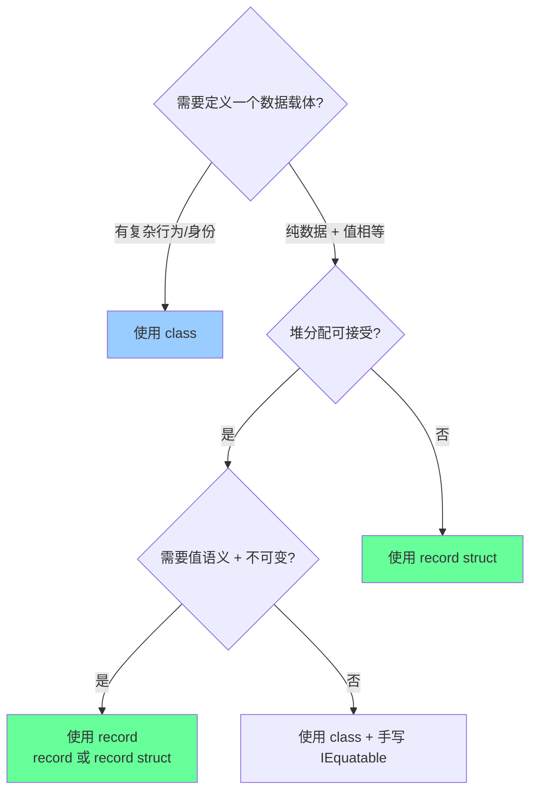
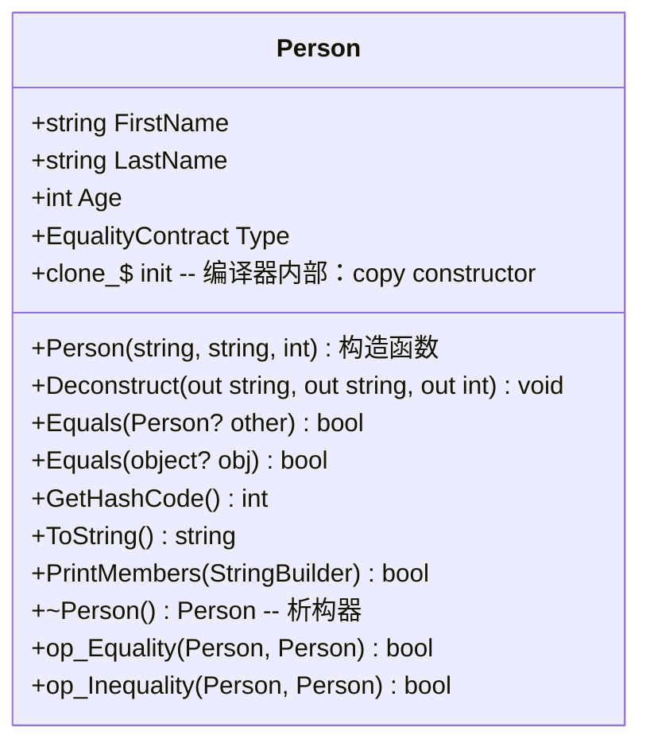

# `record` / `with` 深度剖析

> 深度等级: 第 7 层（完整 7 层剖析）
> 关联学习计划: [[csharp-lazy-t|C# 深度专题]]
> 分析日期: 2026-06-08
> 源码版本: Roslyn C# 12 / .NET 8

---

## 第 1 层: 直觉理解

### `record` — "按内容比较的类"

> 一句话：**`record` 是一种类，但它不 care 对象的"身份证"，只 care "肚子里装的是什么"。**

**类比**：
- `class` 就像**银行账户** —— 即使两个账户余额一样，它们也是不同的账户（不同卡号、不同身份）
- `record` 就像**人民币** —— 两张 100 元的钞票，内容完全相同，就认为它们是"一样的"（值相等）

```csharp
class PointClass  { public int X; public int Y; }
record PointRecord(int X, int Y);

var a = new PointClass  { X = 1, Y = 2 };
var b = new PointClass  { X = 1, Y = 2 };
var c = new PointRecord(1, 2);
var d = new PointRecord(1, 2);

a == b; // false — class 比较的是引用（内存地址）
c == d; // true  — record 比较的是内容（值相等）
```

### `with` — "复印 + 局部修改"

> 一句话：**`with` 先用复印机把整张纸原样复印一份，然后只在你指定的地方用红笔修改。**

**类比**：
- 你有了一份合同草稿 `v1`
- 客户说："内容都同意，但把付款期限从 30 天改成 60 天"
- `with` 就是：**原稿不动**，复印出 `v2`，只改付款期限那一行

```csharp
var v1 = new Contract("甲方", "乙方", PaymentDays: 30);
var v2 = v1 with { PaymentDays = 60 };

// v1 还是 30 天，v2 是 60 天
// 原对象未被修改 — 这就是「非破坏性修改」
```

> [!tip] 为什么叫 "非破坏性修改"
> "Non-destructive mutation" 直译。mutation = 修改，non-destructive = 不破坏原对象。这是函数式编程的核心概念之一。

---

## 第 2 层: 使用场景

### `record` — 什么时候用

| 场景 | 为什么适合 record | 示例 |
|------|------------------|------|
| **API DTO / 请求响应模型** | 数据载体，不做业务逻辑，比较时看内容 | `LoginRequest(string Username, string Password)` |
| **领域驱动设计 — 值对象** | 「值对象」的定义就是：两个值对象内容相同则它们相等 | `Money(int Amount, string Currency)` |
| **配置/选项对象** | 大量属性，经常复制+微调 | `AppOptions(int Port, int Timeout, LogLevel Level)` |
| **不可变状态快照** | Redux 风格的状态管理，每次状态变化产生新对象 | `AppState(User user, List<Todo> todos)` |
| **模式匹配 + 解构** | 编译器自动生成 `Deconstruct`，配合 switch 表达式很舒服 | `shape is Circle(double r)` |

### `record` — 什么时候**不用**

| 场景 | 用 class / struct 更好 | 原因 |
|------|----------------------|------|
| **Entity（实体）** | `class` | 实体有身份（数据库主键），即使内容相同也是不同实体 |
| **Repository / Service** | `class` | 有行为、有生命周期、有依赖注入，不适合 record |
| **UI 控件 / GameObject** | `class` | 需要引用相等，需要可变状态，需要继承 |
| **需要深可变引用** | `class` | record 默认是「浅不可变」，引用字段仍可变，容易踩坑 |
| **性能敏感的密集计算** | `struct` | record 是引用类型（`record class`），有堆分配 GC 压力 |

### `with` — 什么时候用

| 场景 | 示例 |
|------|------|
| **基于默认值生成配置** | `var prod = devConfig with { ConnectionString = prodCs };` |
| **Redux / 状态更新** | `state = state with { Count = state.Count + 1 };` |
| **并发安全地修改共享数据** | 读取旧值 → `with` 出新值 → CAS 替换 |
| **测试数据工厂** | `var user2 = baseUser with { Name = "Alice", Age = 25 };` |

### 决策流程



---

## 第 3 层: API 层

### `record` 声明方式

C# 9+ 提供两种声明风格（可以同时混用）：

#### 方式 A: 位置参数声明（Positional/Syntactic Sugar）

```csharp
// C# 9 — 编译器自动生成 init-only 属性 + 构造函数 + 解构器
public record Person(string FirstName, string LastName, int Age);
```

编译器自动生成：
- 属性 `FirstName { get; init; }`，`LastName { get; init; }`，`Age { get; init; }`
- 构造函数 `Person(string FirstName, string LastName, int Age)`
- 解构方法 `Deconstruct(out string FirstName, out string LastName, out int Age)`

#### 方式 B: 标准属性声明（Nominal）

```csharp
public record Person
{
    public string FirstName { get; init; } = string.Empty;
    public string LastName  { get; init; } = string.Empty;
    public int Age          { get; set; }  // 注意：set 也可以
}
```

#### 混合声明

```csharp
public record Person(string FirstName, string LastName)
{
    // 额外手动添加的属性
    public int Age { get; init; }
    public string FullName => $"{FirstName} {LastName}";
}
```

### `record class` vs `record struct`

| 特性 | `record` (= `record class`) | `record struct` (C# 10+) |
|------|----------------------------|--------------------------|
| 类型 | 引用类型（堆分配） | 值类型（栈分配 / 内联） |
| 默认相等 | 值相等（比较内容） | 值相等（比较内容） |
| 可空性 | 可为 `null` | 不可为 `null`（可用可空版本 `Person?`） |
| 继承 | **支持**（只能继承 record） | **不支持**（值类型不能继承） |
| `with` 行为 | 创建新堆对象 | 创建新栈值 |
| `==` 行为 | 值相等 | 值相等（注意：普通 struct 的 `==` 需要重载，但 record struct 自动有） |
| 用途 | 复杂值对象、需要继承的场景 | 小型值对象、性能敏感场景 |

> [!warning] 易混淆点
> 普通 `struct` 默认**不**生成 `==` 运算符，但 `record struct` **会**自动生成。这让 `record struct` 比手写 struct + `IEquatable<T>` 省力得多。

### `with` 表达式

```csharp
// 基本语法
var newPerson = person with { FirstName = "Alice", Age = 30 };

// 计算表达式
var older = person with { Age = person.Age + 1 };

// 只改一个字段
var renamed = person with { FirstName = "Bob" };

// 什么都不改 = 纯复制
var clone = person with { };
```

### 编译器生成的成员（一览表）



> [!note] `clone_$`
> 编译器生成的 copy constructor 是 `protected` 的，命名带 `$` 后缀（如 `<Clone>$`），正常代码不应直接调用 — 用 `with` 即可。

---

## 第 4 层: 行为契约

### 值相等语义

```csharp
record Point(int X, int Y);

var p1 = new Point(1, 2);
var p2 = new Point(1, 2);
var p3 = new Point(2, 3);

p1 == p2;        // true  — 值相等
p1.Equals(p2);   // true  — 值相等
ReferenceEquals(p1, p2); // false — 引用不同
p1 == p3;        // false — 值不同
```

**相等比较的实现逻辑**（编译器生成）：
1. 如果 `other == null`，返回 `false`
2. 如果 `ReferenceEquals(this, other)`，返回 `true`
3. 比较 `EqualityContract`（确保是同一个 record 类型，防止子类错判）
4. 逐个比较每个字段（用 `EqualityComparer<T>.Default.Equals`）

### `with` 的行为契约

1. **先复制**：调用编译器生成的 copy constructor，把原对象所有字段原样拷贝
2. **后修改**：按 `with { ... }` 中的对象初始化器，逐一修改指定成员
3. **返回新对象**：原对象**绝对不变**

```csharp
record Person(string Name, List<string> Tags);

var alice = new Person("Alice", new List<string> { "dev", "csharp" });
var bob = alice with { Name = "Bob" };

// alice.Name == "Alice"  ✓ 没变
// bob.Name   == "Bob"    ✓ 新值
// BUT:
// bob.Tags 和 alice.Tags 指向**同一个 List 对象**！⚠️
bob.Tags.Add("lead");
alice.Tags.Contains("lead"); // true — 浅拷贝陷阱！
```

> [!danger] 浅拷贝陷阱
> `with` 只复制字段值（对于引用类型，复制的是**引用地址**，不是深克隆）。如果你有一个 `record` 内嵌可变引用（如 `List<T>`、数组），`with` 出来的新对象会共享同一个引用。

### 继承规则（record class 特有）

| 规则 | 说明 |
|------|------|
| record 只能继承 record | `record A : class B` ❌ 非法 |
| record 不能继承 class | `record A : SomeClass` ❌ 非法 |
| record 不能继承 struct | `record A : SomeStruct` ❌ 非法 |
| class 不能继承 record | `class A : SomeRecord` ❌ 非法 |
| record 可多层继承 | `record B : A`，`record C : B` ✅ |
| 密封 record | `sealed record A(...)` ✅（C# 10+） |
| 位置参数的继承 | 子类必须显式调用父类构造函数 |

```csharp
public record Person(string Name);
public record Student(string Name, string School) : Person(Name);

var s = new Student("Alice", "MIT");
s.Name;   // "Alice" — 从 Person 继承
s.School; // "MIT"
```

### 相等与继承的微妙行为

```csharp
record A(int X);
record B(int X) : A(X);

var a = new A(1);
var b = new B(1);

a == b; // false — 虽然字段相同，但 EqualityContract 不同
```

> [!info] `EqualityContract`
> 编译器在每个 record 中生成一个 `protected virtual Type EqualityContract => typeof(ThisType);`。相等的最后一关是检查两个对象的 `EqualityContract` 是否相同。这防止了「父类对象和子类对象内容相同但类型不同却被判相等」的问题。

---

## 第 5 层: 实现原理

### 编译器做了什么

你写的：
```csharp
public record Person(string FirstName, string LastName);
```

编译器实际生成的（核心逻辑伪代码）：

```csharp
public class Person : IEquatable<Person>
{
    // 1. 自动属性（init-only）
    public string FirstName { get; init; }
    public string LastName  { get; init; }

    // 2. 主构造函数
    public Person(string FirstName, string LastName)
    {
        this.FirstName = FirstName;
        this.LastName  = LastName;
    }

    // 3. Copy Constructor — with 的底层支撑
    protected Person(Person original)
    {
        this.FirstName = original.FirstName;
        this.LastName  = original.LastName;
    }

    // 4. Deconstruct（位置参数模式匹配用）
    public void Deconstruct(out string FirstName, out string LastName)
    {
        FirstName = this.FirstName;
        LastName  = this.LastName;
    }

    // 5. 值相等（核心卖点）
    public virtual bool Equals(Person? other)
    {
        if (other is null) return false;
        if (ReferenceEquals(this, other)) return true;
        if (EqualityContract != other.EqualityContract) return false;
        return EqualityComparer<string>.Default.Equals(FirstName, other.FirstName)
            && EqualityComparer<string>.Default.Equals(LastName,  other.LastName);
    }

    public override bool Equals(object? obj) => Equals(obj as Person);
    public override int GetHashCode()
        => HashCode.Combine(EqualityContract, FirstName, LastName);

    // 6. 相等运算符重载
    public static bool operator ==(Person? left, Person? right)
        => left?.Equals(right) ?? right is null;
    public static bool operator !=(Person? left, Person? right)
        => !(left == right);

    // 7. ToString — 类似 JSON 的可读格式
    public override string ToString()
        => $"Person {{ FirstName = {FirstName}, LastName = {LastName} }}";

    // 8. 类型契约（用于区别子类实例）
    protected virtual Type EqualityContract => typeof(Person);

    // 9. 编译器内部 clone 方法
    internal Person <Clone>$() => new Person(this);
}
```

### `with` 表达式的编译过程

你写的：
```csharp
var bob = alice with { FirstName = "Bob" };
```

编译器翻译为：
```csharp
// 第一步：调用 copy constructor
Person __newPerson = new Person(alice);
// 第二步：调用 init accessor 修改指定属性
__newPerson.FirstName = "Bob";
// 第三步：赋值
Person bob = __newPerson;
```

### 为什么编译器生成 `init` accessor 而不是 `set`？

| accessor | 语义 | record 默认行为 |
|----------|------|----------------|
| `get; init;` | 只能在对象初始化器中赋值，构造完成后不可变 | **默认**（位置参数声明） |
| `get; set;` | 随时可变 | 手写属性时可用，但不推荐 |

`init` 的属性只能在以下时机赋值：
1. 构造函数内
2. 对象初始化器（`new Person { FirstName = "x" }`）
3. `with` 表达式内（特殊编译器处理）

---

## 第 6 层: 源码分析

### Roslyn 编译器源码 — RecordDeclaration 处理
> 来源: [dotnet/roslyn — SourceMemberContainerSymbol.cs](https://github.com/dotnet/roslyn/blob/main/src/Compilers/CSharp/Portable/Symbols/Source/SourceMemberContainerSymbol.cs)

Roslyn 在解析 `record` 声明时，填充以下合成成员：

```csharp
// Roslyn 内部对 record 的合成成员列表（整理后）
// 文件: Records/SynthesizedRecordClone.cs 等相关合成器

// 1. SynthesizedRecordConstructor — 主构造函数
// 2. SynthesizedRecordCopyCtor   — copy constructor (protected)
// 3. SynthesizedRecordEquals     — IEquatable<T>.Equals(T? other)
// 4. SynthesizedRecordObjEquals  — override Equals(object?)
// 5. SynthesizedRecordGetHashCode — override GetHashCode()
// 6. SynthesizedRecordToString   — override ToString() + PrintMembers()
// 7. SynthesizedRecordDeconstruct — Deconstruct(out ...)
// 8. SynthesizedRecordEqualityContract — virtual Type EqualityContract
// 9. SynthesizedRecordEqualityOperators — == 和 !=
// 10. SynthesizedRecordCloneMethod   — <Clone>$() => new T(this)
```

### `with` 表达式的 Lowering

> 来源: [dotnet/roslyn — LocalRewriter_WithExpression.cs](https://github.com/dotnet/roslyn/blob/main/src/Compilers/CSharp/Portable/Lowering/LocalRewriter/LocalRewriter_WithExpression.cs)

```csharp
// Roslyn 内部处理 with 表达式的核心 lowering 逻辑（概念代码）
// 文件: LocalRewriter_WithExpression.cs

private BoundExpression RewriteWithExpression(BoundWithExpression node)
{
    // 1. 获取 receiver（with 左边的表达式）
    var receiver = VisitExpression(node.Receiver);

    // 2. 生成 copy constructor 调用: new T((T)receiver)
    var cloneMethod = GetCloneMethod(node.Type);  // <Clone>$(T) 或 new T(T)
    var clone = BoundCall(cloneMethod, receiver);

    // 3. 生成对象初始化器：逐个设置 with { ... } 中指定的属性
    var initializer = RewriteObjectInitializer(clone, node.Initializer);

    return initializer;
}
```

### 实际编译器输出（通过 IL/spy / sharplab）

将 `public record Person(string FirstName, string LastName);` 反编译：

```csharp
// 反编译输出（ILDASM 风格整理）
.class public auto ansi beforefieldinit Person
    extends [System.Runtime]System.Object
    implements class [System.Runtime]System.IEquatable1<class Person>
{
    // --- 属性 ---
    .property instance string FirstName() { .get ... .set ... }
    .property instance string LastName()  { .get ... .set ... }

    // --- 构造函数 ---
    .method public hidebysig specialname rtspecialname
        instance void .ctor (string FirstName, string LastName) { ... }

    // --- Copy Constructor ---
    .method family hidebysig specialname rtspecialname
        instance void .ctor (class Person original) { ... }

    // --- Equals ---
    .method public hidebysig virtual instance bool Equals (class Person other) { ... }
    .method public hidebysig virtual instance bool Equals (object obj) { ... }

    // --- GetHashCode / ToString ---
    .method public hidebysig virtual instance int32 GetHashCode () { ... }
    .method public hidebysig virtual instance string ToString () { ... }

    // --- 相等运算符 ---
    .method public hidebysig specialname static bool op_Equality (class Person, class Person) { ... }
    .method public hidebysig specialname static bool op_Inequality (class Person, class Person) { ... }

    // --- 编译器内部 Clone ---
    .method assembly hidebysig specialname instance class Person '<Clone>$' () { ... }
}
```

---

## 第 7 层: 对比与边界

### record vs class

| 维度 | `class` | `record` |
|------|---------|----------|
| 类型 | 引用类型 | 引用类型（`record class`）/ 值类型（`record struct`） |
| `==` 默认行为 | 引用相等（同一对象？） | 值相等（内容相同？） |
| 编译器生成代码 | 无 | `Equals`、`GetHashCode`、`ToString`、`Deconstruct`、copy ctor |
| 相等实现 | 手写 `IEquatable<T>` | 自动生成 |
| `with` 支持 | 不支持 | 原生支持 |
| 适合场景 | Entity、Service、有状态的组件 | DTO、ValueObject、不可变配置 |
| 继承限制 | 无 | 只能继承 record |

### record struct vs struct

| 维度 | `struct` | `record struct` |
|------|----------|-----------------|
| `==` / `!=` | 需手写运算符重载 | 编译器自动生成 |
| `Equals`/`GetHashCode` | 逐字段比较（默认行为） | 逐字段比较 + 生成 `IEquatable<T>` |
| `ToString` | 默认类型名 | 生成可读格式 `{ Prop1 = x, Prop2 = y }` |
| `Deconstruct` | 手写 | 自动生成（位置参数时） |
| `with` 支持 | 不支持（C# 10+ 支持） | 原生支持 |
| 堆/栈 | 栈（或可内联） | 栈（或可内联） |

> [!tip] `readonly record struct`
> C# 10 引入 `readonly record struct` — 这比 `record struct` 更严格：所有字段都必须是 `readonly`，`init` accessor 被 `get` + `readonly` 替代。追求极致不可变性时用这个。

### 跨语言对比

| 语言 | 对应概念 | 与 C# record 的区别 |
|------|---------|-------------------|
| **Kotlin** | `data class` | 相似度最高。Kotlin 的 `copy()` ≈ C# `with`。Kotlin 默认 `var`（可变），C# 默认 `init`（构造后可变受限） |
| **Scala** | `case class` | 相似。Scala `copy` 方法 ≈ C# `with`。Scala case class 支持模式匹配更原生 |
| **F#** | `type Person = { Name: string; Age: int }` | F# record **默认完全不可变**（无 `set`），且自动按结构相等比较。C# record 是「浅不可变」 |
| **Java** | `record` (JDK 16+) | Java record 语义更接近 C#：自动构造函数、不可变字段、`equals`/`hashCode`/`toString`。但 Java record 不能 `extends`，也不能 `with` |
| **Rust** | 没有 direct 对应 | Rust `#[derive(Clone, PartialEq, Debug)]` + struct 最接近。显式 clone 对应 C# `with` + `Clone` trait |

### 深克隆方案（解决浅拷贝陷阱）

```csharp
// ❌ 危险 — 引用共享
record Person(string Name, List<string> Tags);
var p2 = p1 with { Name = "Bob" };  // Tags 是同一个 List

// ✅ 方案 1: 深拷贝（手动）
var p2 = p1 with
{
    Name = "Bob",
    Tags = new List<string>(p1.Tags)  // 新建 List
};

// ✅ 方案 2: 只使用不可变集合
record Person(string Name, ImmutableList<string> Tags);
// ImmutableList 的 with 修饰会... 其实 ImmutableList 本身不可变，
// 但 with 仍然是浅拷贝引用。需要用 ImmutableList.CreateRange(p1.Tags)

// ✅ 方案 3: 手写深 clone 辅助方法
public Person DeepClone() =>
    this with
    {
        Tags = new List<string>(Tags),
        // ... 每个引用字段都递归处理
    };
```

### 性能的边界

| 操作 | `record class` | `record struct` | 说明 |
|------|---------------|-----------------|------|
| 创建 | 堆分配 + GC | 栈分配 / 零成本 | struct 小对象性能显著更优 |
| `==` 比较 | O(n) 逐字段 | O(n) 逐字段 | 字段越多越慢；可考虑缓存哈希 |
| `with` 复制 | 新堆对象 + 字段复制 | 新栈值 + 字段复制 | 引用字段仍是浅引用拷贝 |
| `GetHashCode` | 运行时计算 | 运行时计算 | 大量用作 Dictionary key 时考虑缓存 |

---

## 常见面试题

### Q1: `record` 和 `class` 最核心的区别是什么？
> 答：**语义上的值相等 vs 引用相等**。`record` 编译器自动生成基于内容的 `Equals`、`GetHashCode`、`==`、`!=`；`class` 默认比较引用身份。此外 `record` 支持 `with` 表达式实现非破坏性修改。

### Q2: `with` 是深拷贝还是浅拷贝？
> 答：**浅拷贝**。`with` 调用 copy constructor 逐字段复制值。对于值类型字段，复制值本身；对于引用类型字段，**复制引用地址**（两个对象指向同一个引用对象）。嵌套的可变引用类型（如 `List<T>`）需要手动深拷贝。

### Q3: 为什么 `record` 属性默认是 `init` 而不是 `set`？
> 答：为了支持**浅不可变性**。`init` accessor 只能在构造函数或对象初始化器（含 `with`）中赋值，构造完成后外部无法修改。这与 record 作为"值对象"的设计意图一致。但注意：你可以显式写 `get; set;` 来打破这个约束。

### Q4: `record` 能继承 `class` 吗？
> 答：**不能**。`record` 只能继承另一个 `record`（且不能是 `record struct`，因为值类型不支持继承）。`class` 也不能继承 `record`。这是 Roslyn 编译器的硬性约束，保持了类型系统的清晰。

### Q5: `record struct` 和普通 `struct` 有什么区别？
> 答：`record struct` 继承了 record 的**语法糖**：编译器自动生成 `IEquatable<T>`、`Equals`、`GetHashCode`、`ToString`、`==`/`!=` 运算符、`Deconstruct`（位置参数时）和 `with` 支持。普通 `struct` 需要手写这些，且默认没有 `==` 运算符重载。

---

## 延伸主题

- [[csharp-di-container|C# DI 容器]] — 了解 record 在依赖注入中的适用性
- [[csharp-lazy-t|Lazy<T>]] — 延迟初始化与不可变对象的搭配
- **C# `required` 成员**（C# 11）— 与 record init-only 属性的互补
- **C# 模式匹配高级用法** — `is`、`switch` 表达式与 record 解构的深度结合
- **不可变集合库** — `System.Collections.Immutable` 与 record 的完美组合
- **值对象模式（DDD）** — 深入理解为什么 record 是值对象的理想语法糖
