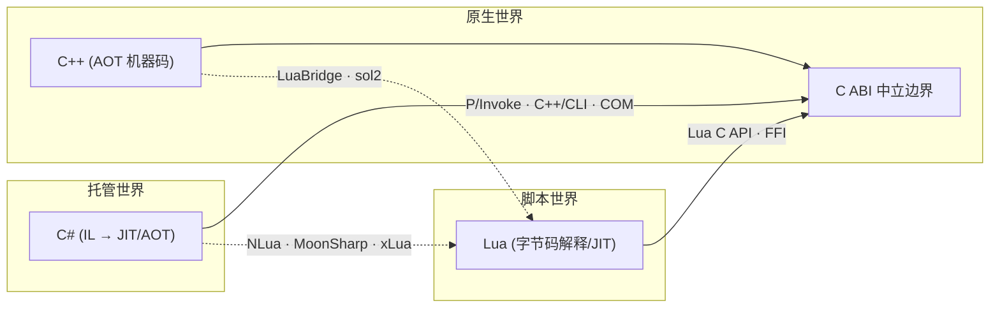

# C 系语言互操作与编译 — 研究简报

> 搜索日期: 2026-06-18
> 来源: Microsoft Learn / dotnet runtime 讨论与源码、Lua 官方手册、LuaBridge/sol2/LuaJIT 文档、xLua/NLua/MoonSharp 仓库与社区文章、Itanium C++ ABI / MSVC ABI 文档
> 用途: 本计划的每一节教程都应以本文档为事实依据。代码示例、机制描述、性能结论必须与本简报一致；若发现矛盾，以官方文档为准并修正本简报。

---

## 0. 一句话全景

> [!important] 跨语言通信的本质
> 所有跨语言调用的底层都是 **机器码函数调用**。不同语言的互操作方案，本质上都在解决同一组问题：**找到符号、按调用约定压栈、转换数据表示、管理内存与生命周期**。C 语言调用约定是事实上的"通用语言"——绝大多数互操作都以 C ABI 为中立边界。



---

## 1. 三种编译模型（理解一切互操作的起点）

| 语言 | 编译产物 | 执行方式 | 内存管理 | 符号可见性 |
|------|----------|----------|----------|-----------|
| C / C++ | 机器码（`.o`/`.obj` → `.dll`/`.so`/`.dylib`/`.exe`） | CPU 直接执行（AOT） | 手动 / RAII | 由 ABI + 导出属性决定 |
| C# / .NET | IL（Intermediate Language，`.dll`/`.exe` 程序集） | CLR JIT 编译为机器码；或 NativeAOT 直接生成本机码 | 托管堆 + GC | 元数据（反射）；NativeAOT 后需显式导出 |
| Lua | 字节码（`.luac`）或直接源码 | Lua 虚拟机解释执行；LuaJIT 可 JIT 编译为机器码 | 增量 GC | 无；一切通过 `lua_State` 栈 |

> [!note] 为什么以 C 为边界
> C 没有名称重整、没有隐式 `this`、没有异常表、对象布局简单（POD）。C++ 编译器导出的 C 函数符号是稳定、可预测的，任何能产生符合 C ABI 调用的语言都能调用它。所以 "C ABI" = 跨语言互操作的通用语。

### 1.1 关键事实

- C# 编译流程：`源码.cs → csc → IL 程序集(.dll) → CLR 加载 → JIT → 机器码`。IL 是平台无关的栈式字节码。
- C++ 编译流程：`源码 → 预处理 → 编译 → 汇编 → 目标文件 → 链接 → 可执行/库`。每一步都可能跨语言。
- Lua 不是独立进程：它以库形式被链接进宿主进程，通过 `lua_State` 与宿主共享地址空间，**没有跨进程开销**。
- NativeAOT（.NET 8+）把 C# 直接编译成本机码，可导出 C 风格函数供 C/C++ 调用——这让 "C# 库被 C++ 调用" 成为可能且高效。

---

## 2. ABI、调用约定与符号导出

### 2.1 调用约定（Calling Convention）

调用约定规定：参数如何传递（寄存器/栈）、谁来清理栈、返回值放哪、寄存器谁保存。

| 约定 | 参数传递 | 栈清理 | 谁用 | 备注 |
|------|----------|--------|------|------|
| `cdecl` | 右→左压栈 | 调用方 | C/C++ 默认（MSVC x86） | 可变参数唯一选择 |
| `stdcall` | 右→左压栈 | 被调用方 | Win32 API（x86） | 函数自己清栈，生成更小代码 |
| `fastcall` | 部分寄存器 + 栈 | 被调用方 | 性能优化（x86） | 寄存器数量因编译器而异 |
| `thiscall` | `this` 在 ECX，其余压栈 | 被调用方 | MSVC x86 成员函数 | C++ 实例方法 |
| **x64 统一约定** | 前 4 个（MS）/6 个（SysV）整型参数走寄存器 | 调用方 | 所有 x64 | MS x64 与 System V AMD64 是两套，但不兼容 |

> [!warning] x64 也有两套
> Windows x64（MS x64，RCX/RDX/R8/R9 + 阴影空间 32 字节）和 Linux/macOS x64（System V AMD64，RDI/RSI/RDX/RCX/R8/R9 + 红区 128 字节）**不兼容**。同一份 C++ 库在 Windows 上叫 `cdecl` 导出的函数，跨平台 P/Invoke 时 C# 侧要写 `CallingConvention.Cdecl`。x64 下 `CallingConvention` 枚举值在 .NET 里实际被忽略（只有一套平台 ABI），但写 `Cdecl` 仍是惯例。

### 2.2 名称重整（Name Mangling）

C++ 支持函数重载、命名空间、模板，必须把签名编码进符号名：

```text
namespace calc { int Add(int,int); }
# MSVC 修饰名:   ?Add@calc@@YAHHH@Z
# Itanium(GCC/Clang): _ZN4calc3AddEii
```

C 不重整：`int Add(int,int)` 导出符号就是 `Add`。

### 2.3 `extern "C"` — 关掉重整

```cpp
// mylib.h —— 头文件必须这样写，C 和 C++ 都能包含
#ifdef __cplusplus
extern "C" {
#endif

__declspec(dllexport) int Add(int a, int b);   // Windows 导出
// 或 Linux/macOS:
// __attribute__((visibility("default"))) int Add(int a, int b);

#ifdef __cplusplus
}
#endif
```

- `extern "C"` 让 C++ 编译器用 C 规则命名（不重整），但**不影响调用约定本身**。
- 导出宏跨平台惯用法：定义 `API` 宏，Windows 用 `__declspec(dllexport)`，GCC/Clang 用 `__attribute__((visibility("default")))`。

### 2.4 查看符号

| 平台 | 工具 | 命令示例 |
|------|------|----------|
| Windows | `dumpbin` | `dumpbin /exports mylib.dll` |
| Windows | `llvm-lib` / `link` | — |
| Linux/macOS | `nm` | `nm -D libmylib.so`、`nm -gU libmylib.dylib` |
| 跨平台 | `objdump -T` | `objdump -T libmylib.so` |

> [!tip] P/Invoke 调不通时第一步
> 用 `dumpbin /exports` 或 `nm -D` 看导出符号名到底叫什么。看到 `?Add@calc@@YAHHH@Z` 就知道你忘了 `extern "C"`。

---

## 3. 内存模型、GC 与封送基础

### 3.1 两座堆

- **托管堆**：CLR GC 管理。GC 会移动对象（压缩），所以原生代码不能长期持有指向托管对象的裸指针。
- **原生堆**：`malloc`/`new`/`Marshal.AllocHGlobal`/`NativeMemory.Alloc`。GC 不管。

### 3.2 Blittable 类型

格式在托管/原生内存中**完全一致**、无需转换的类型：`byte`/`sbyte`/`short`/`ushort`/`int`/`uint`/`long`/`ulong`/`IntPtr`/`float`/`double`，以及只含这些类型的 `struct`（且 `[StructLayout(LayoutKind.Sequential)]`）。

非 blittable：`bool`（C# 1 字节 vs Win32 4 字节）、`char`（看 `CharSet`）、`string`、`decimal`、对象、数组——必须封送转换。

### 3.3 Pinning（固定）

```csharp
byte[] buffer = new byte[1024];
fixed (byte* p = buffer)   // 固定，GC 期间不移动
{
    NativeWrite(p, buffer.Length);
}
```

- P/Invoke 默认会 pin blittable 数组/struct 一段调用时间，调用结束自动解钉。
- `fixed` / `GCHandleType.Pinned` 用于需要长期固定的情况。
- 长期 pinning 阻碍 GC 压缩，影响堆健康，应短时使用。

### 3.4 GCHandle — 跨边界持有托管对象

原生代码无法直接持有托管对象。用 `GCHandle.Alloc(obj)` 换一个 `IntPtr` 句柄传给原生侧；返回时 `GCHandle.FromIntPtr(handle).Target` 取回。`Normal` 类型防 GC 但不防移动，`Pinned` 额外固定地址。

### 3.5 字符串编码

| C# | 原生对应 | 默认封送 |
|----|----------|----------|
| `string` | `char*` (UTF-8) / `wchar_t*` (UTF-16) | Windows 默认 LPStr/LPWideStr；现代推荐 `[MarshalAs(UnmanagedType.LPUTF8Str)]` 或 `LibraryImport` 默认 UTF-8 |
| `StringBuilder` | 可变缓冲 | 已不推荐，改用 `Span<byte>` / 预分配 |

> [!tip] 字符串是互操作最贵的操作之一
> 每次跨边界传 string 都要分配 + 编码转换。热路径优先传 `ReadOnlySpan<byte>`（UTF-8 字节）或预分配缓冲。

---

## 4. P/Invoke（C# 调原生 C/C++）

### 4.1 DllImport（经典，IL Stub JIT 封送）

```csharp
using System.Runtime.InteropServices;

public static class Native
{
    [DllImport("mylib", EntryPoint = "Add")]
    public static extern int Add(int a, int b);
}
```

机制：CLR 第一次调用时，运行时**生成一段 IL stub**，在 stub 里做参数封送（如把 `string` 转 `char*`），再跳进原生函数，返回时反向封送。这段 stub 是 JIT 产生的，有运行时开销。

### 4.2 LibraryImport（.NET 7+，源生成器编译期封送）

```csharp
using System.Runtime.InteropServices;

public static partial class Native
{
    [LibraryImport("mylib", EntryPoint = "Add", StringMarshalling = StringMarshalling.Utf8)]
    public static partial int Add(int a, int b);
}
```

机制：**源生成器在编译期**生成封送代码（C#），无需运行时 IL stub。优点：AOT 友好、封送逻辑可见可优化、启动更快、`partial` 方法。`StringMarshalling = StringMarshalling.Utf8` 默认 UTF-8（跨平台正确）。

> [!important] LibraryImport 不是 DllImport 的替代品
> `LibraryImport` 底层仍依赖 P/Invoke 机制（最终仍调用原生函数）。它替代的是"运行时生成封送 stub"这件事，把它挪到编译期。`DllImport` 不会被废弃（用于反射/动态场景）。新代码优先 `LibraryImport`。

### 4.3 复杂类型封送

| 场景 | C# 声明 | 关键属性 |
|------|---------|----------|
| 结构体 | `[StructLayout(LayoutKind.Sequential)] struct P {int x; int y;}` | `Pack`、`CharSet` |
| 字节数组 | `byte[]`（blittable，自动 pin） | 或 `Span<byte>` |
| 字符串入参 | `string` + `[MarshalAs(...)]` | UTF-8 优先 |
| 字符串出参（原生分配） | `IntPtr` + `Marshal.PtrToStringUTF8` + 释放 | 注意所有权 |
| 原生分配的内存 | `Marshal.AllocHGlobal` / `NativeMemory.Alloc` | 必须配对释放 |
| 二进制兼容指针 | `IntPtr` / `void*`（`unsafe`） | 最高性能 |

### 4.4 错误处理

- C 风格：返回码 + `errno`/`GetLastError()`。C# 用 `[DllImport(..., SetLastError = true)]` 后 `Marshal.GetLastPInvokeError()`。
- C++ 异常**绝不能跨 P/Invoke 边界**——未定义行为，可能崩溃。原生侧必须 `catch(...)` 吞掉异常并返回错误码。

---

## 5. 反向互操作：原生调托管（C++ 调 C#）

### 5.1 委托封送为函数指针

```csharp
public delegate int Callback(int x);

[DllImport("mylib")] static extern void Register(Callback cb);
// 调用时，运行时把委托封送为一个 cdecl 函数指针传给原生侧
```

- 委托实例**必须被保持存活**（赋给字段），否则 GC 回收后原生侧调用悬空指针会崩溃。
- `[UnmanagedFunctionPointer(CallingConvention.Cdecl)]` 控制生成的 thunk 调用约定。

### 5.2 `[UnmanagedCallersOnly]`（.NET 5+，C# 导出原生函数）

```csharp
// .csproj 需启用 UnmanagedCallersOnly，或 NativeAOT 导出
[UnmanagedCallersOnly(EntryPoint = "native_add")]
public static int NativeAdd(int a, int b) => a + b;
```

- 让 C# 方法作为原生函数被 C/C++ 直接调用（通过函数指针或导出符号）。
- 参数/返回必须是 blittable。NativeAOT 下可生成真正的导出符号。
- 这是 "C# 写库给 C++ 用" 的现代正道。

### 5.3 生命周期红线

- 传给原生的回调/委托：用 `GCHandle.Alloc` 或静态字段保持存活。
- 原生持有的托管对象：用 `GCHandle.ToIntPtr` 换句柄，绝不传裸对象指针。

---

## 6. C++/CLI（Windows 混合模式包装器）

### 6.1 是什么

C++/CLI 是 MSVC 扩展（`/clr`），允许同一个 C++ 项目里**同时**编译原生 C++ 和托管 IL。一个 DLL 里可以同时有原生类和 `ref class`，互调零封送成本（编译器在边界自动生成 thunk）。

### 6.2 典型用法

C++/CLI DLL 作为"胶水层"：它 `#include` 原生 C++ 头文件直接用原生对象，同时暴露 `public ref class` 给 C# 当普通托管类用。C# 侧看不到任何 P/Invoke。

### 6.3 何时用 / 何时不用

| 用 C++/CLI | 用 P/Invoke |
|-----------|-------------|
| 原生 API 是面向对象的 C++ 类，难包成 C 接口 | 原生侧已是 C API 或能轻易包一层 |
| 需要在边界频繁转换复杂对象 | 简单函数/数据 |
| Windows only | 跨平台 |

> [!warning] C++/CLI 仅限 Windows + MSVC
> `.NET Core/5+` 的 C++/CLI 只支持 Windows。跨平台（Linux/macOS）项目只能用 P/Invoke。这是选型硬约束。

---

## 7. COM 互操作（了解）

- COM 是二进制标准（基于 vtable，本质是 C++ 抽象类的内存布局）。
- .NET 通过 **RCW**（Runtime Callable Wrapper）让 C# 调 COM 对象；通过 **CCW**（COM Callable Wrapper）让 COM 调 C# 对象。
- 现代场景（非 Office/老 Windows API）很少手写 COM；了解概念即可。.NET 的 `[GeneratedComInterface]`（.NET 8+）源生成 COM 互操作是新做法。

---

## 8. Lua C API 与栈模型（Lua 互操作的根基）

### 8.1 一切都是栈

Lua 与宿主（C/C++/C#）的**所有**数据交换都通过 `lua_State` 的**栈**完成。没有共享内存、没有直接指针传对象。

```c
lua_State* L = luaL_newstate();
luaL_openlibs(L);
// 压入一个数字
lua_pushinteger(L, 42);          // 栈顶 = 42
// 压入一个字符串
lua_pushstring(L, "hello");      // 栈顶 = "hello"
// 读取栈顶
const char* s = lua_tostring(L, -1);
lua_pop(L, 2);                   // 弹出 2 个
lua_close(L);
```

栈索引：正数从底向上（1..），负数从顶向下（-1 = 栈顶）。

### 8.2 C 函数暴露给 Lua

```c
// 签名固定：返回 int（返回值个数），参数只有一个 lua_State*
static int l_add(lua_State* L) {
    int a = (int)luaL_checkinteger(L, 1);   // 读第 1 个参数
    int b = (int)luaL_checkinteger(L, 2);   // 读第 2 个
    lua_pushinteger(L, a + b);              // 压入结果
    return 1;                               // 返回值个数
}

// 注册
static const luaL_Reg mylib[] = {
    {"add", l_add},
    {NULL, NULL}
};
int luaopen_mylib(lua_State* L) {
    luaL_newlib(L, mylib);
    return 1;
}
```

编译成动态库（或静态链接），Lua 里 `require("mylib")` 即可调用 `mylib.add(1,2)`。

### 8.3 关键 API 速查

| 操作 | API |
|------|-----|
| 压入值 | `lua_pushinteger/string/number/boolean/nil/cfunction/lightuserdata` |
| 读取值 | `lua_tointeger/tostring/tonumber`、`luaL_check*`（带类型检查） |
| 弹出 | `lua_pop(L, n)` |
| 表操作 | `lua_newtable`、`lua_gettable/settable`、`lua_rawget/set` |
| 调用 Lua 函数 | `lua_getglobal` → 压参 → `lua_pcall(L, nargs, nresults, msgh)` |
| 错误处理 | `lua_pcall`（受保护调用，异常不跨边界）+ `luaL_error` |

> [!warning] Lua 的"异常"绝不能跨 C 边界
> Lua 的 `error()` 在 C 侧用 `longjmp` 实现。如果 C 代码里有 RAII 析构/栈对象，`longjmp` 会跳过析构导致资源泄漏/UB。永远用 `lua_pcall` 包住 Lua 调用，C 侧不要让 Lua 错误"飞过"含析构对象的栈帧。

---

## 9. Lua 5.4 vs LuaJIT

| 维度 | Lua 5.4（官方） | LuaJIT 2.1 |
|------|----------------|------------|
| 基于版本 | 5.4 | 5.1 语言 + 少量 5.2/5.3 特性 |
| 执行 | 字节码解释 | 字节码解释 + JIT 编译为机器码 |
| 性能 | 基线 | 通常 10–100× 于 PUC Lua（数值密集） |
| FFI | 无 | 有（`ffi.cdef` 直接调 C） |
| 续生 | 活跃 | 维护中（仍广泛用于游戏/嵌入式） |
| 64 位整数 | 原生 `integer` 子类型 | `lua_Number` = double 承载 |

> [!note] 游戏行业现状
> 国内 Unity 热更新方案（xLua/toLua/slua）大多基于 LuaJIT 或 Lua 5.3/5.4。LuaJIT 因 FFI 与 JIT 性能在热路径上仍受欢迎，但 iOS 等禁 JIT 平台会回退解释模式。

---

## 10. 现代 C++ Lua 绑定：LuaBridge 与 sol2

### 10.1 为什么需要绑定库

手写 Lua C API 注册一个 C++ 类（成员函数、继承、生命周期）极其繁琐。绑定库用模板元编程自动生成 `lua_pushcfunction` 样板。

### 10.2 LuaBridge

- 头文件库（header-only），单 `#include` 即用，无依赖。
- API 风格：`luabridge::getGlobalNamespace(L).beginNamespace("ns").beginClass<Foo>("Foo").addConstructor<...>().addFunction("bar", &Foo::bar).endClass().endNamespace();`
- 类型安全、支持多种生命周期模式。
- 适合：想要零依赖、轻量、稳定的项目。

### 10.3 sol2

- 头文件库（依赖 Lua C API），现代 C++（C++14/17）风格，表达式力强。
- API 风格：`sol::state lua; lua.open_libraries(); lua["foo"].setClass(...)`；`lua.new_usertype<Foo>("Foo", "bar", &Foo::bar);`
- 性能优化好、文档详尽、社区活跃。
- 适合：新项目、需要高性能和丰富特性（协程、表操作、overload）。

### 10.4 对比与选型

| 维度 | LuaBridge | sol2 | 手写 C API |
|------|-----------|------|-----------|
| 集成成本 | 最低（一个头） | 低（头 + 配置） | 最高 |
| 表达力 | 够用 | 丰富 | 全手动 |
| 性能 | 好 | 很好（有优化） | 取决于实现 |
| 编译期 | 模板 | 重模板，编译慢 | 无 |
| 适合 | 轻量、稳定 | 新项目、追求表达力 | 学习、极致控制 |

---

## 11. LuaJIT FFI：零绑定调用 C

```lua
local ffi = require("ffi")
ffi.cdef[[
    int printf(const char* fmt, ...);
    typedef struct { int x, y; } Point;
    int dot(Point a, Point b);
]]
ffi.C.printf("Hello %s\n", "world")          -- 直接调 C 库函数
local lib = ffi.load("mylib")                -- 加载自定义库
print(lib.dot({x=1,y=2}, {x=3,y=4}))         -- 调用，Point 自动构造
```

- **无需写任何 C 绑定代码**——在 Lua 侧声明 C 原型即可调用。
- 只能调符合 C ABI 的符号（`extern "C"` 导出），不能直接调 C++ 重整名/成员函数。
- 可被 JIT 编译，跨边界调用几乎零开销——比 C API 绑定快一个数量级。
- 限制：仅 LuaJIT；传递的 C 结构内存在 Lua 侧是"ctype"，GC 由 LuaJIT 的 FFI GC 管理。

---

## 12. Lua ↔ C#（NLua / MoonSharp / xLua / toLua）

### 12.1 NLua

- 原理：通过 P/Invoke 调用 Lua 的 C API（`lua_push*`、`lua_pcall` 等），把 Lua 的栈"搬"到 C# 侧管理。本质 = **C# 对 Lua C ABI 的封装**。
- Lua 数据 ↔ .NET 对象的转换在"桥"层完成：number ↔ double，string ↔ string，table ↔ `LuaTable`，function ↔ `LuaFunction`，userdata ↔ .NET 对象引用。
- 跨 Lua 实现通用（Lua 5.4 / LuaJIT，配合 KopiLua 纯 C# 备选）。
- 适合：通用 .NET 嵌入 Lua，不限定 Unity。

### 12.2 MoonSharp

- 原理：**纯 C# 实现的 Lua 解释器**，不调用任何原生 Lua 库。没有 P/Invoke，跨平台零原生依赖。
- 性能低于真 Lua（尤其 LuaJIT），但部署简单、无 ABI/构建问题。
- 适合：纯托管环境、不想编译原生 Lua、对性能不极致敏感。

### 12.3 xLua / toLua（Unity 游戏热更新）

- **xLua**（腾讯）：核心是 C# ↔ Lua 的**双向桥**。
  - Lua 调 C#：两种模式——**生成模式**（为打了 `[LuaCallCSharp]` 的类型在编辑期生成"Wrap"胶水代码，直接调，最快）和**反射模式**（运行时反射，慢，无需生成，包体小）。
  - C# 调 Lua：通过 `LuaEnv.DoString` / delegate 代理，内部用 Lua C API（P/Invoke）。
  - **Hotfix**：给 C# 类型打 `[Hotfix]` 标签，构建时 **IL 注入**（修改 IL），在方法入口插入"是否被 Lua 替换"判断；运行时用 Lua 函数替换 C# 方法实现——这就是"用 Lua 热修 C# 逻辑"的原理。
  - Lua 侧访问 C# 对象：通过 userdata + GC 桥（`ObjectTranslator`），C# 对象引用挂在桥表里防 GC。
- **toLua**：类似思路，纯反射/生成 + LuaInterface 血统，社区广泛使用。
- 共同要点：**GC 桥**是性能与正确性关键——Lua 侧持有的 C# 对象必须保持存活，Lua 侧释放时通知 C# 解引用。

### 12.4 对比

| 方案 | Lua 实现 | 互操作机制 | 适合 |
|------|----------|-----------|------|
| NLua | 真 Lua (P/Invoke) | C API 封装 | 通用 .NET 嵌入 |
| MoonSharp | 纯 C# 解释器 | 无 P/Invoke | 无原生依赖 |
| xLua | LuaJIT/Lua53 | 代码生成 + 反射 + IL 注入 | Unity 热更新（国内主流） |
| toLua | LuaJIT/Lua | 反射 + 生成 | Unity 热更新 |

---

## 13. 编译与构建（端到端）

### 13.1 C++ + Lua 的 CMake 构建

```cmake
cmake_minimum_required(VERSION 3.15)
project(mylib C CXX)
set(CMAKE_CXX_STANDARD 17)

# 让导出符号默认隐藏（GNU），显式标记的才导出
set(CMAKE_CXX_VISIBILITY_PRESET hidden)
set(CMAKE_VISIBILITY_INLINES_HIDDEN ON)

add_library(mylib SHARED src/mylib.cpp)
target_include_directories(mylib PRIVATE include lua_include)

# 链接 Lua：静态或动态
# find_package(Lua) 或自定义
```

Windows 编译器用 MSVC（`cl`），Linux/macOS 用 GCC/Clang。导出宏跨平台化是关键。

### 13.2 C# 调原生库的路径解析

- `DllImport("mylib")`：Windows 找 `mylib.dll`，Linux 找 `libmylib.so`，macOS 找 `libmylib.dylib`。
- 搜索顺序：应用目录（`.runtimeconfig.json` 指定的 `nativeAssets`）/ `runtimes/<rid>/native/` / 系统路径。
- NuGet 的 `Microsoft.NETCore.Platforms` + `runtimes/<rid>/native/` 是分发跨平台原生库的标准做法。
- `NativeLibrary.SetDllImportResolver` / `AssemblyLoadContext` 可自定义解析（运行时按平台加载正确文件名）。

### 13.3 Lua 的静态/动态链接

- 静态链接 Lua：宿主可执行文件自包含，体积大，但不能运行时 `require` 外部 C 模块（除非也静态链）。
- 动态链接 Lua：宿主与 `lua53.dll`/`liblua5.3.so` 分离，可加载第三方 C 模块；部署需带 Lua 运行库。

---

## 14. 性能与陷阱总结

### 14.1 性能要点

- 跨边界调用本身有成本（封送 + thunk）。热路径应**批量化**：一次调用处理一个数组/一段数据，不要每元素一次调用。
- Blittable 类型零封送，优先用。
- 字符串、bool、非 blittable struct 每次都转换——能免则免。
- LuaJIT FFI 调 C 几乎零开销，远快于 Lua C API 绑定。
- xLua 生成模式比反射模式快一个数量级——发布构建务必生成代码。

### 14.2 致命陷阱

- C++ 异常跨 P/Invoke/Lua 边界 → UB/崩溃。原生侧 `catch(...)`。
- Lua `error` 跨 C 边界（`longjmp`）跳过析构 → 用 `lua_pcall`。
- 传给原生/Lua 的托管委托/对象被 GC 回收 → 悬空调用。保持存活。
- 忘 `extern "C"` → 符号被重整，P/Invoke/FFI 找不到。
- 调用约定不匹配（x86 cdecl vs stdcall）→ 栈损坏崩溃。
- 原生分配的内存用 C# GC 管或反之 → 内存错误。所有权清晰。

---

## 15. 关键参考链接

- [.NET Native interop overview](https://learn.microsoft.com/dotnet/standard/native-interop/)
- [LibraryImport source generator](https://learn.microsoft.com/dotnet/standard/native-interop/pinvoke-source-generation)
- [NativeAOT + UnmanagedCallersOnly](https://learn.microsoft.com/dotnet/core/deploying/native-aot/)
- [Lua 5.4 Reference Manual](https://www.lua.org/manual/5.4/manual.html)
- [LuaJIT FFI documentation](https://luajit.org/ext_ffi.html)
- [LuaBridge Reference Manual](https://vinniefalco.github.io/LuaBridge/Manual.html)
- [sol2 documentation](https://sol2.readthedocs.io/)
- [NLua (GitHub)](https://github.com/NLua/NLua)
- [MoonSharp (GitHub)](https://github.com/moonsharp-devs/moonsharp)
- [xLua (GitHub)](https://github.com/Tencent/xLua)
- [Itanium C++ ABI](https://itanium-cxx-abi.github.io/cxx-abi/abi.html)
- [C++ name mangling 概览](https://en.wikipedia.org/wiki/Name_mangling)
