# 跨语言通信全景与三种编译模型

> 所属计划: [[plan|C 系语言互操作与编译学习计划]]
> 预计耗时: 60 min
> 前置知识: 无

---

## 1. 概念讲解

跨语言通信不是“把两个程序粘在一起”，而是在**同一份地址空间**里，让不同编译模型产出的代码互相调用函数。C#、C/C++、Lua 的编译产物和运行方式完全不同，但它们的函数调用最终都会落到同一套 CPU 指令上。理解这三者的编译模型，是后续所有互操作技术的地基。

### 为什么需要这个？

如果你只想“让 C# 调一段 C 代码”，照抄 `[DllImport]` 示例也能跑起来。但一遇到下面这些问题就会卡壳：

- 为什么 C++ 函数加了 `[DllImport]` 却报“找不到入口点”？
- 为什么 .NET 程序需要 `dotnet` 运行时，而 C++ 程序直接双击就能跑？
- 为什么 Lua 是“嵌进”宿主进程，而不是像 Web API 一样单独启动一个进程？
- 为什么所有互操作文档都在谈 C ABI，而不是 C++ ABI？

这些问题的答案都藏在编译模型里。本节先把三种语言的编译链路、执行方式、内存管理差异讲清楚，再用一个能跑的最小例子建立信心。

### 核心思想

#### 1.1 三种编译模型对比

| 语言 | 编译产物 | 执行方式 | 内存管理 | 符号可见性 |
|------|----------|----------|----------|-----------|
| C / C++ | 机器码（`.o`/`.obj` → `.dll`/`.so`/`.dylib`/`.exe`） | CPU 直接执行（AOT） | 手动 / RAII | 由 ABI + 导出属性决定 |
| C# / .NET | IL（Intermediate Language，`.dll`/`.exe` 程序集） | CLR JIT 编译为机器码；或 NativeAOT 直接生成本机码 | 托管堆 + GC | 元数据（反射）；NativeAOT 后需显式导出 |
| Lua | 字节码（`.luac`）或直接源码 | Lua 虚拟机解释执行；LuaJIT 可 JIT 编译为机器码 | 增量 GC | 无；一切通过 `lua_State` 栈 |

#### 1.2 编译与执行链路

```mermaid
flowchart TD
    subgraph C/C++
        CSource[源码 .c/.cpp] --> CPre[预处理]
        CPre --> CCompile[编译]
        CCompile --> CAsm[汇编]
        CAsm --> CObj[目标文件 .obj/.o]
        CObj --> CLink[链接]
        CLink --> COut[可执行文件 / 动态库]
        COut --> CCPU[CPU 直接执行]
    end

    subgraph CSharp
        CsSource[源码 .cs] --> CSC[csc 编译器]
        CSC --> IL[IL 程序集 .dll]
        IL --> CLR[CLR 加载]
        CLR --> JIT[JIT 编译]
        JIT --> CsCPU[机器码执行]
        IL -.->|NativeAOT| AOT[本机编译器]
        AOT --> CsNative[本机可执行文件]
    end

    subgraph Lua
        LuaSource[源码 .lua] --> LuaParser[语法分析]
        LuaParser --> LuaByte[字节码 .luac 或内存字节码]
        LuaByte --> VM[Lua 虚拟机解释执行]
        VM --> LuaCPU[按指令分派执行]
        LuaByte -.->|LuaJIT| LuaJITCompile[JIT 编译]
        LuaJITCompile --> LuaJITCPU[机器码执行]
    end
```



三条链路最终都产生 CPU 能执行的指令，但路径差异巨大：

- **C/C++ 是 AOT（Ahead-of-Time）**：编译期就把源码翻译成机器码，运行时没有任何翻译开销。
- **C# 默认走 JIT（Just-in-Time）**：先编译成与平台无关的 IL，运行时再按需编译成本机码。IL 是栈式字节码，携带大量元数据，这也是反射的基础。
- **Lua 默认是解释执行**：源码先翻译成 Lua 字节码，虚拟机一条一条解释执行。LuaJIT 在热点路径上会把字节码 JIT 成机器码，性能接近原生。

#### 1.3 为什么以 C ABI 为跨语言通用语

跨语言调用的本质是：调用方按一种约定好的方式找到函数地址、压参数、取返回值。这个约定就是 **ABI（Application Binary Interface）**。C 语言之所以成为事实上的通用边界，是因为它的 ABI 最简单、最稳定：

- **无名称重整（No Name Mangling）**：C 函数 `int Add(int, int)` 导出的符号就是 `Add`。C++ 为了支持重载、命名空间、模板，会把签名编码进符号名（如 `?Add@calc@@YAHHH@Z` 或 `_ZN4calc3AddEii`），不同编译器规则还不一样。
- **无隐式 `this`**：C++ 成员函数默认带一个 `this` 指针，调用约定与自由函数不同；C 函数没有这种隐藏状态。
- **无异常表**：C++ 异常跨动态库边界传递是未定义行为，C 函数只用返回码表达错误。
- **对象布局简单**：C 的 `struct` 是 POD（Plain Old Data），内存布局清晰可预测；C++ 类有虚表、继承、访问控制，布局由编译器决定。

所以，几乎所有语言都把“调用 C 函数”作为互操作的起点。C# 用 P/Invoke，Lua 用 C API / FFI，Python 用 `ctypes` / `cffi`，Rust 用 `extern "C"`——它们最终都在调用同一个东西：**符合 C ABI 的函数**。

#### 1.4 本计划主线预告

本章结束时，你会完成一个最小端到端链路：

```text
C# 控制台程序 --[DllImport]--> mylib.dll / libmylib.so --extern "C"--> C 函数
```

这是本计划的第一块拼图。后续章节会逐步扩展：

- 第 `02` 节深入 ABI、调用约定、符号导出与名称重整。
- 第 `03` 节讲解托管堆 / 原生堆、GC 压缩、blittable 类型与封送。
- 第 `04` 节用 P/Invoke 处理结构体、字符串、数组。
- 第 `05` 节用 `LibraryImport` 源生成器做编译期封送优化。
- 第 `08` 节起进入 Lua C API 与栈模型。

---

## 2. 代码示例

### 示例 1：最小 C 动态库

下面是一个跨平台的最小 C 库，只导出一个函数 `cinterop_add(int, int)`。头文件同时兼容 C 和 C++ 包含，并通过宏处理 Windows 与 Linux/macOS 的导出符号差异。

**文件：`mylib.h`**

```c
#ifndef MYLIB_H
#define MYLIB_H

#ifdef __cplusplus
extern "C" {
#endif

/* 跨平台导出宏 */
#if defined(_WIN32)
    #ifdef MYLIB_BUILD
        #define MYLIB_API __declspec(dllexport)
    #else
        #define MYLIB_API __declspec(dllimport)
    #endif
#else
    #define MYLIB_API __attribute__((visibility("default")))
#endif

MYLIB_API int cinterop_add(int a, int b);

#ifdef __cplusplus
}
#endif

#endif /* MYLIB_H */
```

**文件：`mylib.c`**

```c
#define MYLIB_BUILD
#include "mylib.h"

int cinterop_add(int a, int b)
{
    return a + b;
}
```

**文件：`CMakeLists.txt`**

```cmake
cmake_minimum_required(VERSION 3.10)
project(mylib C)

set(CMAKE_C_STANDARD 11)

add_library(mylib SHARED mylib.c)

# 定义导出宏
target_compile_definitions(mylib PRIVATE MYLIB_BUILD)

# Linux/macOS 上控制符号可见性
set_target_properties(mylib PROPERTIES
    C_VISIBILITY_PRESET hidden
    VISIBILITY_INLINES_HIDDEN ON
)
```

**运行方式（CMake，跨平台）：**

```bash
# 1. 在项目根目录创建构建目录
mkdir build && cd build

# 2. 配置并编译
cmake ..
cmake --build .
```

Windows 上产出 `build/Debug/mylib.dll`（或 `build/Release/mylib.dll`），Linux 上产出 `build/libmylib.so`。

**运行方式（Windows MSVC 命令行）：**

```bash
# 环境：Visual Studio 2022 开发者命令提示符 / x64 Native Tools Command Prompt
cl /W4 /EHsc /DMYLIB_BUILD /Femylib.dll /LD mylib.c
```

`/LD` 表示生成动态链接库，产出 `mylib.dll` 和 `mylib.lib`（导入库）。

**运行方式（Linux GCC 命令行）：**

```bash
# 环境：GCC 11+，bash
 gcc -shared -fPIC -fvisibility=hidden -DMYLIB_BUILD -o libmylib.so mylib.c
```

`-shared -fPIC` 生成位置无关的动态库，`-fvisibility=hidden` 隐藏未显式导出的符号。

**验证导出符号：**

```bash
# Windows：用 dumpbin 查看导出表
dumpbin /exports mylib.dll
```

预期输出片段（符号名是干净未重整的）：

```text
 ordinal hint RVA      name
       1    0 00001000 cinterop_add = @ILT+0(_cinterop_add)
```

```bash
# Linux：用 nm 查看动态符号
nm -D libmylib.so
```

预期输出片段：

```text
0000000000001119 T cinterop_add
```

> [!tip]
> 如果看到 `?cinterop_add@@YAHHH@Z`（MSVC）或 `_Z14cinterop_addii`（GCC/Clang），说明头文件里忘了 `extern "C"`，C++ 编译器按 C++ 规则重整了符号名。

---

### 示例 2：C# 通过 P/Invoke 调用 C 库

这是本计划第一个能跑起来的“跨语言调用”。C# 侧用 `[DllImport]` 声明原生函数，运行时会在原生库搜索路径里找到 `mylib` 并生成调用 stub。

**文件：`Program.cs`**

```csharp
using System;
using System.Runtime.InteropServices;

class Program
{
    // EntryPoint 显式指定 C 侧的函数名；CallingConvention.Cdecl 是跨平台惯例
    [DllImport("mylib", EntryPoint = "cinterop_add", CallingConvention = CallingConvention.Cdecl)]
    private static extern int Add(int a, int b);

    static void Main(string[] args)
    {
        int x = 3;
        int y = 4;
        int result = Add(x, y);
        Console.WriteLine($"{x} + {y} = {result}");
    }
}
```

**创建并运行项目：**

```bash
# 1. 创建 .NET 8 控制台项目
dotnet new console -n CInteropDemo -f net8.0
cd CInteropDemo

# 2. 把示例 1 编译出的原生库复制到输出目录
# Windows：
copy ..\mylib.dll .\bin\Debug\net8.0\
# 或直接在项目根目录放一份，并在 .csproj 里配置自动复制

# Linux：
cp ../libmylib.so ./bin/Debug/net8.0/

# 3. 运行
dotnet run
```

**预期输出：**

```text
3 + 4 = 7
```

**可选：在 `.csproj` 中自动复制原生库（Windows 示例）**

```xml
<Project Sdk="Microsoft.NET.Sdk">
  <PropertyGroup>
    <OutputType>Exe</OutputType>
    <TargetFramework>net8.0</TargetFramework>
    <Nullable>enable</Nullable>
  </PropertyGroup>

  <ItemGroup>
    <Content Include="../mylib.dll" Condition="$([MSBuild]::IsOSPlatform('Windows'))">
      <CopyToOutputDirectory>PreserveNewest</CopyToOutputDirectory>
    </Content>
    <Content Include="../libmylib.so" Condition="$([MSBuild]::IsOSPlatform('Linux'))">
      <CopyToOutputDirectory>PreserveNewest</CopyToOutputDirectory>
    </Content>
  </ItemGroup>
</Project>
```

> [!note]
> `[DllImport("mylib")]` 在 Windows 上寻找 `mylib.dll`，在 Linux 上寻找 `libmylib.so`，在 macOS 上寻找 `libmylib.dylib`。库文件必须位于应用程序基目录、系统 PATH（Windows）或 `LD_LIBRARY_PATH`（Linux）中，否则运行时抛出 `DllNotFoundException`。

---

## 3. 练习

### 练习 1: 基础 —— 自己编译库并从 C# 调用

重复示例 1 和示例 2 的完整流程，在你的机器上完成一次端到端调用。要求：

1. 用 CMake 或命令行编译出 `mylib.dll` / `libmylib.so`。
2. 用 `dumpbin /exports` 或 `nm -D` 确认导出符号名为 `cinterop_add`。
3. 新建 .NET 8 控制台项目，用 `[DllImport]` 调用并打印 `5 + 7 = 12`。

### 练习 2: 进阶 —— 故意去掉 `extern "C"`，观察符号变化

在 `mylib.h` 中临时注释掉 `extern "C"` 块（保留导出宏和函数声明），重新编译库，再用符号查看工具对比差异：

- Windows：用 `dumpbin /exports mylib.dll` 记录符号名。
- Linux：用 `nm -D libmylib.so` 记录符号名。

回答：

1. 去掉 `extern "C"` 后符号名变成了什么？
2. 如果 C# 侧仍然写 `[DllImport("mylib", EntryPoint = "cinterop_add")]`，运行时会报什么错？
3. 有什么办法可以在去掉 `extern "C"` 的情况下仍然调用成功？（提示：`EntryPoint` 可以写什么？）

### 练习 3: 挑战 —— 分析 Lua 的进程模型

Lua 与 C/C++/C# 的互操作通常以**库形式**把 Lua 链接进宿主进程，而不是让 Lua 作为一个独立进程通过 socket / pipe 与宿主通信。请分析：

1. 同进程互操作相比跨进程通信，在**数据传递**、**调用延迟**、**内存共享**、**错误隔离**四个方面各有什么优劣？
2. 为什么游戏引擎通常选择把 Lua 嵌进主进程，而不是做成独立脚本服务？
3. 什么场景下你会主动选择跨进程方案（如 gRPC、socket）而不是同进程 Lua 嵌入？

---

## 3.5 参考答案

> 参考答案不是唯一解——如果你的实现通过了测试或达到了题目要求，就是正确的。

> [!tip]- 练习 1 参考答案
> 完整流程要点：
>
> 1. 确保 `mylib.h` 包含 `extern "C"` 和导出宏，编译命令与示例 1 一致。
> 2. 验证符号：
>
> > ```bash
> > # Windows
> > dumpbin /exports mylib.dll
> > # 应看到  ordinal hint RVA      name
> > #          1    0 00001000 cinterop_add
> >
> > # Linux
> > nm -D libmylib.so
> > # 应看到 0000000000001119 T cinterop_add
> > ```
>
> 3. C# 代码：
>
> > ```csharp
> > using System;
> > using System.Runtime.InteropServices;
> >
> > class Program
> > {
> >     [DllImport("mylib", EntryPoint = "cinterop_add", CallingConvention = CallingConvention.Cdecl)]
> >     private static extern int Add(int a, int b);
> >
> >     static void Main()
> >     {
> >         Console.WriteLine($"5 + 7 = {Add(5, 7)}");
> >     }
> > }
> > ```
>
> 4. 运行方式：`dotnet run`，预期输出 `5 + 7 = 12`。

> [!tip]- 练习 2 参考答案
> 去掉 `extern "C"` 后，C++ 编译器会按 C++ 名称重整规则编码函数签名。
>
> Windows（MSVC x64）示例：
>
> > ```text
> > ?cinterop_add@@YAHHH@Z
> > ```
>
> Linux（GCC/Clang）示例：
>
> > ```text
> > _Z14cinterop_addii
> > ```
>
> 1. C# 仍用 `EntryPoint = "cinterop_add"` 会报 `EntryPointNotFoundException`，因为 DLL/so 里根本没有叫 `cinterop_add` 的导出符号。
> 2. 如果坚持使用去掉 `extern "C"` 的 C++ 库，可以把 `EntryPoint` 改成重整后的完整符号名：
>
> > ```csharp
> > // Windows MSVC
> > [DllImport("mylib", EntryPoint = "?cinterop_add@@YAHHH@Z")]
> > private static extern int Add(int a, int b);
> >
> > // Linux GCC
> > [DllImport("mylib", EntryPoint = "_Z14cinterop_addii")]
> > private static extern int Add(int a, int b);
> > ```
>
> 3. 但强烈不建议这样做：重整规则依赖编译器和平台，跨项目极易断裂。正确做法是保留 `extern "C"`。

> [!tip]- 练习 3 参考答案
> 同进程嵌入 vs 跨进程通信对比：
>
> | 维度 | 同进程嵌入（如 Lua 进 C++） | 跨进程通信（如 socket / gRPC） |
> |------|---------------------------|-------------------------------|
> | 数据传递 | 直接压栈、共享地址空间，无需序列化 | 必须序列化 / 反序列化，有拷贝开销 |
> | 调用延迟 | 纳秒到微秒级，接近普通函数调用 | 毫秒级或更高，受网络/IPC 栈影响 |
> | 内存共享 | 可以共享堆、直接传指针 | 进程隔离，不能传裸指针 |
> | 错误隔离 | 脚本崩溃可能拖垮整个进程 | 单个进程崩溃不影响其他进程 |
>
> 游戏引擎把 Lua 嵌进主进程，是因为游戏逻辑需要每帧高频调用脚本，且要直接操作引擎对象（如 `transform.position`）。同进程嵌入能把延迟压到最低，也避免大量序列化。
>
> 适合跨进程方案的场景：
>
> - 脚本来源不可信，需要沙箱隔离和权限控制。
> - 脚本可能崩溃或死循环，不能影响主程序稳定性。
> - 不同语言/服务部署在不同机器或容器上。
> - 需要利用多核 CPU 真正并行执行，而 GIL/VM 锁限制了同进程并发。

---

## 4. 扩展阅读

- [Microsoft Learn: P/Invoke 简介](https://learn.microsoft.com/dotnet/standard/native-interop/pinvoke)
- [Microsoft Learn: DllImportAttribute](https://learn.microsoft.com/dotnet/api/system.runtime.interopservices.dllimportattribute)
- [Microsoft Learn: .NET 中的 NativeAOT](https://learn.microsoft.com/dotnet/core/deploying/native-aot/)
- [Lua 5.4 官方手册：Lua 与 C 的交互](https://www.lua.org/manual/5.4/manual.html#4)
- [LuaJIT 官方文档：FFI 教程](http://luajit.org/ext_ffi_tutorial.html)
- [Wikipedia: Name mangling](https://en.wikipedia.org/wiki/Name_mangling)
- [System V AMD64 ABI](https://gitlab.com/x86-psABIs/x86-64-ABI)
- [Microsoft x64 Calling Convention](https://learn.microsoft.com/cpp/build/x64-calling-convention)

---

## 常见陷阱

- **忘加 `extern "C"`**：C++ 头文件默认会重整符号名，导致 C# 的 `[DllImport]` 找不到入口点。正确做法：头文件里用 `#ifdef __cplusplus` 包裹 `extern "C" { }`，让所有跨语言导出的函数都按 C ABI 编译。
- **库路径找不到**：`DllImport` 加载失败最常见的原因是原生库不在搜索路径里。Windows 上把 `mylib.dll` 放到可执行文件同目录或系统 PATH；Linux 上把 `libmylib.so` 放到可执行文件同目录，或设置 `LD_LIBRARY_PATH`，或安装到 `/usr/local/lib` 后执行 `ldconfig`。
- **导出宏写反方向**：Windows 上编译库时需要 `__declspec(dllexport)`，使用库时需要 `__declspec(dllimport)`。正确做法：定义一个 `MYLIB_BUILD` 宏，只在编译库时定义，头文件里根据它切换 `dllexport` / `dllimport`。
- **Linux 上忘记 `-fPIC`**：把目标文件链接成共享库时，必须使用位置无关代码。正确做法：`gcc -shared -fPIC ...`。
- **混淆 C ABI 与 C++ ABI**：C++ 的虚表布局、thiscall、异常传播都没有统一标准，不能作为跨语言边界。正确做法：把需要导出的功能包装成 C 风格函数，数据用 POD `struct` 或裸指针传递。
- **在 P/Invoke 中传复杂 C++ 类**：C# 无法直接理解 C++ 类布局，传对象指针往往导致崩溃或内存损坏。正确做法：C++ 侧提供创建/销毁/操作对象的 C API，C# 侧只持有 `IntPtr` 句柄。
