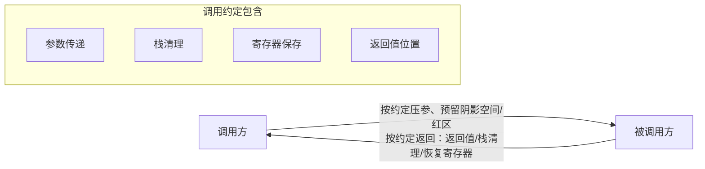

# ABI、调用约定与符号导出

> 所属计划: [[plan|C 系语言互操作与编译学习计划]]
> 预计耗时: 75 min
> 前置知识: [[01-compilation-models|第 01 节 跨语言通信全景与三种编译模型]]

---

## 1. 概念讲解

[[01-compilation-models|第 01 节]] 把“为什么以 C ABI 为通用边界”讲清楚了：C 没有名称重整、没有隐式 `this`、没有异常表、对象布局简单。但“C ABI”到底包含哪些具体规则？为什么同样是 x86，不同调用约定导出的符号名会不一样？为什么 C++ 重载函数不能直接给 P/Invoke 用？本节把这些细节落地。

### 为什么需要这个？

写互操作代码时，下面任何一条都会让你调试到怀疑人生：

- C# 侧 `[DllImport]` 写了函数名，运行时却报“找不到入口点”——其实 C++ 编译器把函数名改成了 `?Add@calc@@YAHHH@Z`。
- 同一个库在 Windows x64 上正常，复制到 Linux x64 就崩溃——因为两套 x64 ABI 的参数寄存器约定不同。
- 你写了 `__stdcall`，x64 编译后符号装饰却消失了——因为 x64 只有一种平台 ABI，`__stdcall` 被忽略。
- GCC 默认 `-fvisibility=hidden`，导出函数在 `nm -D` 里根本看不到——因为忘记给符号加可见性属性或导出宏。

这些问题都指向同一个底层主题：**ABI（Application Binary Interface）**与**符号导出**。理解它们是后续 P/Invoke、`LibraryImport`、反向互操作的地基。

### 核心思想

#### 1.1 ABI 是什么

ABI 是编译器与链接器之间的二进制契约，决定了一段机器码如何被另一段机器码调用。它至少包含：

| 维度 | 说明 | 典型问题 |
|------|------|---------|
| **参数传递** | 参数放寄存器还是栈？前几个放寄存器？ | x64 Windows 前 4 个整型参数用 `RCX/RDX/R8/R9`；System V AMD64 用 `RDI/RSI/RDX/RCX/R8/R9`。 |
| **栈清理** | 调用完成后，由调用方还是被调用方恢复栈指针？ | `cdecl` 调用方清栈，`stdcall` 被调用方清栈。 |
| **返回值** | 小值放寄存器（`RAX`/`XMM0`），大结构体可能通过栈隐藏参数返回。 | 返回大 `struct` 时需要在栈上分配临时对象。 |
| **寄存器保存** | 哪些寄存器由调用方保存（volatile），哪些由被调用方保存（non-volatile）？ | 回调函数若破坏 callee-saved 寄存器会随机崩溃。 |
| **对象布局** | `struct`/`class` 的字段顺序、对齐、虚表指针位置。 | C# `[StructLayout]` 与 C++ 不一致会导致字段错位。 |
| **异常处理** | 异常表、栈展开（unwinding）规则。 | C++ 异常**绝不能**跨 P/Invoke 边界抛出，否则未定义行为。 |

> [!note]
> 调用约定（calling convention）是 ABI 的子集，主要规定参数传递、栈清理、返回值和寄存器保存。日常说的“C ABI”通常就指 C 调用约定 + C 的符号命名规则 + POD 数据布局。

#### 1.2 调用约定对比

下表中的 `__cdecl`、`__stdcall`、`__fastcall`、`__thiscall` 是 **x86（32 位）**概念。进入 x64 后，平台只剩一套约定：Windows 用 MS x64，Linux/macOS 用 System V AMD64，两者**不兼容**。

| 约定 | 参数传递 | 栈清理 | 谁用 | 备注 |
|------|----------|--------|------|------|
| `__cdecl` | 右→左压栈 | 调用方 | C/C++ 默认（MSVC x86） | 可变参数唯一选择；导出符号可能带前导下划线 |
| `__stdcall` | 右→左压栈 | 被调用方 | Win32 API（x86） | 函数自己清栈；x86 MSVC 下符号形如 `_Func@N` |
| `__fastcall` | 前若干参数放寄存器（`ECX/EDX`），其余压栈 | 被调用方 | 性能优化（x86） | 寄存器数量因编译器而异 |
| `__thiscall` | `this` 放 `ECX`，其余压栈 | 被调用方 | MSVC x86 成员函数 | C++ 实例方法默认约定 |
| **MS x64** | 前 4 个整型参数用 `RCX/RDX/R8/R9`，调用方分配 32 字节阴影空间 | 调用方 | Windows x64 | 与 System V AMD64 **不兼容** |
| **System V AMD64** | 前 6 个整型参数用 `RDI/RSI/RDX/RCX/R8/R9`，有 128 字节红区 | 调用方 | Linux / macOS x64 | 与 MS x64 **不兼容** |

> [!warning] x64 也有两套 ABI
> Windows x64（MS x64）和 Linux/macOS x64（System V AMD64）的参数寄存器、阴影空间/红区、栈对齐要求都不同。同一份 C++ 库跨平台 P/Invoke 时，C# 侧统一写 `CallingConvention.Cdecl` 即可；x64 下 `CallingConvention` 枚举值在 .NET 里实际被忽略（平台只有一套 ABI），但写 `Cdecl` 仍是惯例。

#### 1.3 名称重整（Name Mangling）

C++ 支持函数重载、命名空间、模板，编译器必须把“函数签名”编码进符号名，才能在链接阶段区分同名函数。C 不做这件事，所以 C 符号是稳定的。

```cpp
namespace calc {
    int Add(int a, int b);
}
```

| 编译器 | 重整后符号名 |
|--------|-------------|
| MSVC | `?Add@calc@@YAHHH@Z` |
| Itanium ABI（GCC / Clang） | `_ZN4calc3AddEii` |

同一个函数在两套 ABI 下完全不同。这正是 `extern "C"` 存在的理由：它告诉 C++ 编译器“按 C 规则命名”，从而得到稳定的 `Add` 符号。

#### 1.4 `extern "C"` 关掉重整

```cpp
#ifdef __cplusplus
extern "C" {
#endif

__declspec(dllexport) int Add(int a, int b);   // Windows 导出
// Linux/macOS:
// __attribute__((visibility("default"))) int Add(int a, int b);

#ifdef __cplusplus
}
#endif
```

注意：`extern "C"` 只影响**符号名**，不影响调用约定。如果你写 `extern "C"` + `__stdcall`，x86 MSVC 仍然会产生 `_Add@8` 这样的装饰名。

#### 1.5 跨平台导出宏惯用法

把平台差异藏进一个 `API` 宏，头文件一份即可：

```cpp
#ifdef MYLIB_BUILD
    #ifdef _WIN32
        #define MYLIB_API __declspec(dllexport)
    #else
        #define MYLIB_API __attribute__((visibility("default")))
    #endif
#else
    #ifdef _WIN32
        #define MYLIB_API __declspec(dllimport)
    #else
        #define MYLIB_API
    #endif
#endif
```

构建动态库时定义 `MYLIB_BUILD`，消费方不定义。Windows 侧区分导出/导入，Linux/macOS 侧用可见性属性控制符号是否导出。

#### 1.6 查看符号的工具

P/Invoke 调不通时，第一步永远是看导出表，确认符号名到底叫什么。

| 平台 | 工具 | 命令示例 |
|------|------|----------|
| Windows | `dumpbin` | `dumpbin /exports mylib.dll` |
| Windows | `link /dump` | `link /dump /exports mylib.dll`（VS 无 dumpbin 时） |
| Linux | `nm` | `nm -D libmylib.so` |
| macOS | `nm` | `nm -gU libmylib.dylib` |
| 跨平台 | `objdump` | `objdump -T libmylib.so` |

> [!tip] P/Invoke 调不通时第一步
> 看到 `?Add@calc@@YAHHH@Z` 就知道你忘了 `extern "C"`；看到 `_Add@8` 就知道 C# 侧 `EntryPoint` 应该写 `_Add@8` 或改用 `.def` 重命名。



---

## 2. 代码示例

### 示例 1：同一函数分别用 `__cdecl` 与 `__stdcall` 导出（x86）

本示例展示 x86 MSVC 下两种调用约定的符号装饰差异。`__stdcall` 会在符号名后追加 `@N`（`N` 是参数占用的字节数），而 `__cdecl` 在导出表中通常不显示 `@N`。

**文件：`conventions.cpp`**

```cpp
// conventions.cpp
// 平台: Windows x86 (32-bit) 为主；Linux x86 可用 GCC 属性版本
// 工具: MSVC 2019+ / Visual Studio 2022；或 GCC 11+（x86，需 multilib）

#if defined(_WIN32)
    #define CDECL     __cdecl
    #define STDCALL   __stdcall
    #define API       __declspec(dllexport)
#else
    #define CDECL     __attribute__((cdecl))
    #define STDCALL   __attribute__((stdcall))
    #define API       __attribute__((visibility("default")))
#endif

extern "C" {

// __cdecl: 调用方清栈，可变参数唯一选择
API int CDECL AddCdecl(int a, int b)
{
    return a + b;
}

// __stdcall: 被调用方清栈，Win32 API 使用
API int STDCALL AddStdcall(int a, int b)
{
    return a + b;
}

} // extern "C"
```

**运行方式（Windows，x86 Native Tools Command Prompt）：**

```bash
# 1. 打开 "x86 Native Tools Command Prompt for VS 2022"
# 2. 进入本文件所在目录
cl /LD /EHsc /Fe:conventions.dll conventions.cpp

# 3. 查看导出符号
dumpbin /exports conventions.dll
```

**预期输出（Windows）：**

```text
Microsoft (R) COFF/PE Dumper Version 14.44.35222.0
Copyright (C) Microsoft Corporation.  All rights reserved.

Dump of file conventions.dll

File Type: DLL

  Section contains the following exports for conventions.dll

    00000000 characteristics
    FFFFFFFF time date stamp
        0.00 version
           1 ordinal base
           2 number of functions
           2 number of names

    ordinal hint RVA      name

          1    0 00001000 AddCdecl
          2    1 00001010 _AddStdcall@8

  Summary

        2000 .data
        1000 .fptable
        7000 .rdata
        1000 .reloc
        D000 .text
```

> [!note]
> `AddCdecl` 在导出表中显示为无前缀，但在 `.obj` 内部符号是 `_AddCdecl`；`__declspec(dllexport)` 导出时会去掉 cdecl 的前导下划线。`_AddStdcall@8` 中的 `8` 表示两个 `int` 参数共 8 字节。

**运行方式（Linux x86，需 `gcc-multilib`）：**

```bash
g++ -m32 -shared -fPIC -o libconventions.so conventions.cpp
nm -D libconventions.so
```

**预期输出（Linux，具体前缀取决于 GCC 版本）：**

```text
00000000 T AddCdecl
00000000 T AddStdcall@8
```

> [!warning]
> 现代 Linux 发行版默认是 x64，`__attribute__((stdcall))` 只在 x86 目标下有意义；在 x64 目标上编译本文件会报错或被忽略。本示例重点在观察 Windows/MSVC x86 下的 `_Func@N` 装饰。

---

### 示例 2：跨平台 `API` 宏头文件 + `.def` 模块定义文件改写导出名

有时你不希望 C# 侧用 `_Add@8` 或 C++ 命名空间重整名，而是想给导出一个干净稳定的别名。Windows 上可以用 `.def` 模块定义文件把内部函数名映射成另一个导出符号名。

**文件：`api.h`**

```cpp
#pragma once

#ifdef MYLIB_BUILD
    #ifdef _WIN32
        // Windows: 导出名由 .def 文件控制，这里不标记 dllexport
        #define MYLIB_API
    #else
        #define MYLIB_API __attribute__((visibility("default")))
    #endif
#else
    #ifdef _WIN32
        #define MYLIB_API __declspec(dllimport)
    #else
        #define MYLIB_API
    #endif
#endif

#ifdef __cplusplus
extern "C" {
#endif

MYLIB_API int AddInts(int a, int b);

#ifdef __cplusplus
}
#endif
```

**文件：`mylib.cpp`**

```cpp
#include "api.h"

MYLIB_API int AddInts(int a, int b)
{
    return a + b;
}
```

**文件：`mylib.def`**

```text
EXPORTS
    add_ints = AddInts
```

**运行方式（Windows，x86 或 x64 Native Tools Command Prompt 均可）：**

```bash
cl /LD /EHsc /DMYLIB_BUILD /Fe:mylib.dll mylib.cpp /link /DEF:mylib.def
dumpbin /exports mylib.dll
```

**预期输出（Windows）：**

```text
Microsoft (R) COFF/PE Dumper Version 14.44.35222.0
Copyright (C) Microsoft Corporation.  All rights reserved.

Dump of file mylib.dll

File Type: DLL

  Section contains the following exports for mylib.dll

    00000000 characteristics
    FFFFFFFF time date stamp
        0.00 version
           1 ordinal base
           1 number of functions
           1 number of names

    ordinal hint RVA      name

          1    0 00001000 add_ints

  Summary

        2000 .data
        1000 .fptable
        7000 .rdata
        1000 .reloc
        D000 .text
```

> [!note]
> 内部函数名叫 `AddInts`，但 `.def` 文件把它以 `add_ints` 导出。C# 侧 `EntryPoint = "add_ints"` 即可调用，无需关心 C++ 内部命名。

**运行方式（Linux，不使用 `.def`，直接由宏控制可见性）：**

```bash
g++ -shared -fPIC -DMYLIB_BUILD -o libmylib.so mylib.cpp
nm -D libmylib.so
```

**预期输出（Linux）：**

```text
0000000000001119 T AddInts
```

> [!tip]
> `.def` 是 Windows/MSVC 的模块定义文件。Linux 上若需要别名，可在函数声明处用 `__attribute__((visibility("default"))) int AddInts(int, int) __asm__("add_ints");`，或使用链接器 version script。

---

## 3. 练习

### 练习 1: 基础 —— 列出第 01 节库的全部导出符号

用 [[01-compilation-models|第 01 节]] 构建出的 `mylib.dll`（Windows）或 `libmylib.so`（Linux），分别用 `dumpbin /exports` 和 `nm -D` 列出所有导出符号。确认 `cinterop_add` 的导出名是否干净未重整。

### 练习 2: 进阶 —— 观察 C++ 重载函数的 mangled 名

写一个 C++ 动态库，在命名空间 `calc` 中导出两个 `Add` 重载：

```cpp
namespace calc {
    int Add(int a, int b);
    double Add(double a, double b);
}
```

不要加 `extern "C"`。分别用 MSVC 和 GCC/Clang 编译，查看导出符号名。解释：为什么 P/Invoke 不能直接调用重载函数？

### 练习 3: 挑战 —— 用 `.def` 把导出名重命名为 `add_ints`

基于示例 2 的思路，创建一个 C++ 动态库：内部函数名为 `AddInts`，但通过 `.def` 文件只导出 `add_ints`。用 `dumpbin /exports` 验证导出表中只有 `add_ints` 一项。再写一段 C# `[DllImport]` 代码，通过 `EntryPoint = "add_ints"` 调用它并打印结果。

---

## 3.5 参考答案

> 参考答案不是唯一解——如果你的实现通过了测试或达到了题目要求，就是正确的。

> [!tip]- 练习 1 参考答案
> 假设第 01 节生成的库名为 `mylib.dll`（Windows）或 `libmylib.so`（Linux），运行目录与库文件相同。
>
> Windows：
>
> ```bash
> dumpbin /exports mylib.dll
> ```
>
> 典型输出片段：
>
> ```text
>   ordinal hint RVA      name
>         1    0 00001000 cinterop_add
> ```
>
> Linux：
>
> ```bash
> nm -D libmylib.so
> ```
>
> 典型输出片段：
>
> ```text
> 0000000000001119 T cinterop_add
> ```
>
> 如果看到 `?cinterop_add@@YAHHH@Z` 或 `_Z14cinterop_addii`，说明头文件里漏了 `extern "C"`。

> [!tip]- 练习 2 参考答案
> 示例实现（`overload.cpp`）：
>
> ```cpp
> #ifdef _WIN32
>     #define API __declspec(dllexport)
> #else
>     #define API __attribute__((visibility("default")))
> #endif
>
> namespace calc {
>     API int Add(int a, int b) { return a + b; }
>     API double Add(double a, double b) { return a + b; }
> }
> ```
>
> MSVC x64 / x86 下的导出符号：
>
> ```text
> ?Add@calc@@YAHHH@Z
> ?Add@calc@@YANNN@Z
> ```
>
> GCC / Clang（Itanium ABI）下的导出符号：
>
> ```text
> _ZN4calc3AddEii
> _ZN4calc3AddEdd
> ```
>
> 解释：P/Invoke 需要你在 `[DllImport]` 的 `EntryPoint` 中写**一个确切的符号名**。C++ 重载导致两个函数拥有不同的 mangled 名，而 C# 方法名可以任意取，但 `EntryPoint` 只能指向一个 mangled 名，因此你必须为每个重载分别声明一个 P/Invoke 入口。更常见的做法是把重载包装成 `extern "C"` 的独立函数（如 `AddInt`、`AddDouble`），给 C# 提供稳定的 C ABI 入口。

> [!tip]- 练习 3 参考答案
> 文件结构与示例 2 相同：
>
> ```cpp
> // api.h
> #pragma once
>
> #ifdef MYLIB_BUILD
>     #ifdef _WIN32
>         #define MYLIB_API
>     #else
>         #define MYLIB_API __attribute__((visibility("default")))
>     #endif
> #else
>     #ifdef _WIN32
>         #define MYLIB_API __declspec(dllimport)
>     #else
>         #define MYLIB_API
>     #endif
> #endif
>
> #ifdef __cplusplus
> extern "C" {
> #endif
>
> MYLIB_API int AddInts(int a, int b);
>
> #ifdef __cplusplus
> }
> #endif
> ```
>
> ```cpp
> // mylib.cpp
> #include "api.h"
>
> MYLIB_API int AddInts(int a, int b)
> {
>     return a + b;
> }
> ```
>
> ```text
> ; mylib.def
> EXPORTS
>     add_ints = AddInts
> ```
>
> 构建与验证（Windows）：
>
> ```bash
> cl /LD /EHsc /DMYLIB_BUILD /Fe:mylib.dll mylib.cpp /link /DEF:mylib.def
> dumpbin /exports mylib.dll
> ```
>
> 导出表应仅包含：
>
> ```text
>   ordinal hint RVA      name
>         1    0 00001000 add_ints
> ```
>
> C# 调用端：
>
> ```csharp
> using System;
> using System.Runtime.InteropServices;
>
> class Program
> {
>     [DllImport("mylib", EntryPoint = "add_ints", CallingConvention = CallingConvention.Cdecl)]
>     static extern int Add(int a, int b);
>
>     static void Main()
>     {
>         Console.WriteLine(Add(3, 4)); // 输出 7
>     }
> }
> ```
>
> 运行前确保 `mylib.dll` 在 C# 输出目录中，然后 `dotnet run`。

---

## 4. 扩展阅读

- [Microsoft Learn: x64 调用约定](https://learn.microsoft.com/en-us/cpp/build/x64-calling-convention)
- [Microsoft Learn: 参数传递和命名约定](https://learn.microsoft.com/en-us/cpp/cpp/argument-passing-and-naming-conventions)
- [System V AMD64 ABI 文档](https://gitlab.com/x86-psABIs/x86-64-ABI)
- [Itanium C++ ABI 名称重整规范](https://itanium-cxx-abi.github.io/cxx-abi/abi.html#mangling)
- [Microsoft Learn: 模块定义文件（.def）](https://learn.microsoft.com/en-us/cpp/build/reference/module-definition-dot-def-files)
- [C++ name mangling 概览](https://en.wikipedia.org/wiki/Name_mangling)

---

## 常见陷阱

- **x64 也有两套 ABI 不兼容**：Windows x64（MS x64，参数寄存器 `RCX/RDX/R8/R9` + 32 字节阴影空间）与 Linux/macOS x64（System V AMD64，参数寄存器 `RDI/RSI/RDX/RCX/R8/R9` + 128 字节红区）参数传递规则不同。同一份 C++ 源码跨平台 P/Invoke 时，C# 侧统一写 `CallingConvention.Cdecl` 即可；x64 下 `CallingConvention` 实际被忽略，但写 `Cdecl` 仍是惯例。

- **忘写导出宏导致符号默认隐藏**：GCC / Clang 在 CMake 里经常配置 `C_VISIBILITY_PRESET hidden` 或编译时带 `-fvisibility=hidden`。没有 `__attribute__((visibility("default")))` 或导出宏的函数不会进入动态符号表，`nm -D` 里看不到，P/Invoke 会报找不到入口点。正确做法：头文件里统一用跨平台导出宏，构建时定义 `MYLIB_BUILD`。

- **`extern "C"` 不能用于 C++ 重载**：`extern "C"` 要求符号名唯一，而重载函数需要不同的 mangled 名。正确做法：为每个重载提供独立的 `extern "C"` 包装函数（如 `add_int`、`add_double`），或只用 C++ 命名空间函数并在 C# 侧写 mangled 名（不推荐，维护性差）。

- **在 x64 下写 `__stdcall` 期望得到 `_Func@N`**：x64 平台只有一套 ABI，`__stdcall` 关键字被忽略，符号不会带 `@N` 后缀。如果你确实需要观察 `_Func@N`，必须在 **x86（32 位）**下用 MSVC 编译。

- **`.def` 文件与 `__declspec(dllexport)` 同时使用时产生两个导出**：如果函数已标记 `dllexport`，`.def` 里的 `new_name = old_name` 会额外创建一个别名而不是替换。想要只导出 `add_ints`，应在 Windows 构建侧把导出宏置空，完全由 `.def` 控制导出。

- **用 `dumpbin` 或 `nm` 检查对象文件时看到下划线差异**：x86 MSVC 的对象文件中 cdecl 符号是 `_Add`，但 `dumpbin /exports` 导出表可能显示为 `Add`；`__stdcall` 对象文件和导出表都是 `_Add@N`。不要混淆“对象文件符号”与“DLL 导出符号”。
