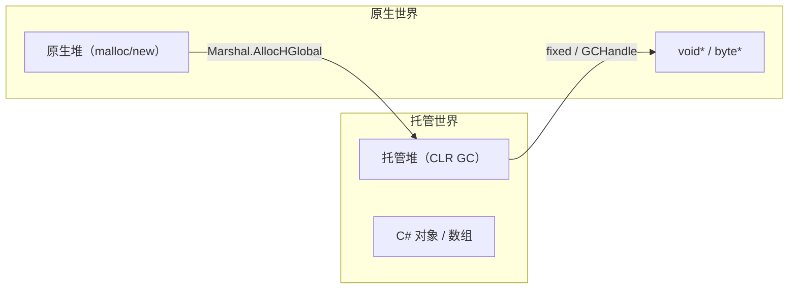

# 内存模型、GC 与封送基础

> 所属计划: [[plan|C 系语言互操作与编译学习计划]]
> 预计耗时: 75 min
> 前置知识: [[01-compilation-models|01 跨语言通信全景与三种编译模型]]

---

## 1. 概念讲解

跨语言调用的真正难点，往往不在"怎么调用"，而在**数据怎么放、由谁管、能不能安全地传递指针**。C# 生活在托管堆上，对象可以被 GC 压缩移动；C/C++ 生活在原生堆上，指针一旦给出就不该再变。两者的内存世界由"封送（Marshalling）"这条边界连接。理解本章概念，是后续 P/Invoke、LibraryImport、反向互操作的基础。

### 为什么需要这个？

如果直接把一个 C# 对象的地址塞进原生函数，你可能会遇到三类问题：

- **地址会变**：GC 为了整理碎片会移动托管堆上的对象。原生代码拿到指针后，对象可能已经被搬走了。
- **格式不同**：C# 的 `bool` 是 1 字节，Win32 `BOOL` 是 4 字节；`char` 在 C# 是 2 字节 UTF-16，C 的 `char` 通常是 1 字节 ASCII/UTF-8。
- **生命周期错配**：C# 的内存由 GC 回收，C 的内存由 `free`/`delete` 释放。把原生指针交给 GC，或者把托管内存交给原生 `free`，都会崩溃或泄漏。

不搞清楚这些，后面写 `DllImport` 时出现的"偶尔崩溃""内存泄漏""随机 AccessViolation"会非常难排查。

### 核心思想

#### 1.1 两座堆：托管堆 vs 原生堆



| 特性 | 托管堆 | 原生堆 |
|------|--------|--------|
| 管理者 | CLR GC | 程序员 / CRT |
| 是否可能移动对象 | 是，GC 压缩时会移动 | 否，地址固定 |
| 典型分配方式 | `new`、数组字面量 | `malloc`/`new`、`Marshal.AllocHGlobal`、`NativeMemory.Alloc` |
| 释放方式 | 自动 GC | 必须显式 `free`/`delete`/`Marshal.FreeHGlobal` |
| 跨边界传递 | 需要 pin 或复制到原生内存 | 可直接传递指针 |

> [!note]
> `NativeMemory.Alloc` 是 .NET 6+ 提供的跨平台原生内存分配 API，功能与 `Marshal.AllocHGlobal` 类似，但更贴近 C 标准并支持对齐参数。本章示例仍多用 `Marshal.AllocHGlobal`，因为它在旧版 .NET 中也可用。

#### 1.2 Blittable：无需转换就能共享内存布局的类型

**Blittable** 指托管内存布局与原生 C 内存布局完全一致的类型，P/Invoke 可以直接 pin 指针传递，无需复制或转换。

Blittable 类型清单：

- 整数：`byte`、`sbyte`、`short`、`ushort`、`int`、`uint`、`long`、`ulong`
- 指针/句柄：`IntPtr`、`UIntPtr`
- 浮点：`float`、`double`
- 结构体：只含上述类型，并且显式标注 `[StructLayout(LayoutKind.Sequential)]` 的结构体

非 blittable 类型：

| 类型 | 为什么不 blittable | 典型封送行为 |
|------|-------------------|-------------|
| `bool` | C# 是 1 字节，C 常见 `int`/`BOOL` 是 4 字节 | 默认按 4 字节 `BOOL` 封送，可改成 1 字节 `bool` |
| `char` | C# 是 2 字节 UTF-16，C `char` 是 1 字节 | 取决于 `CharSet` |
| `string` | 引用类型、变长、编码相关 | 分配原生缓冲并编码转换 |
| `decimal` | 内部布局 16 字节，原生无默认对应 | 需要特殊结构体映射或手动转换 |
| 对象/数组 | 引用类型、GC 会移动 | 需要 pin 或特殊封送 |

> [!tip]
> 判断一个 `struct` 是否 blittable 的最简单方法：调用 `Marshal.SizeOf<T>()`。如果成功返回且等于 C 侧 `sizeof(T)`，通常就是 blittable。

#### 1.3 Pinning：让 GC 暂时不要移动对象

当把托管数组的地址传给原生代码时，必须保证在原生代码使用期间对象不被 GC 移动。`fixed` 和 `GCHandleType.Pinned` 就是做这件事的。

```csharp
byte[] buffer = new byte[1024];
fixed (byte* p = buffer)   // 进入 fixed 块后，GC 不移动 buffer
{
    NativeWrite(p, buffer.Length);
}                           // 离开 fixed 块，自动解钉
```

`fixed` 适合**短时、局部**的 pin，块结束自动释放。如果需要更长时间（例如把句柄存到原生侧，稍后再用），用 `GCHandle.Alloc(buffer, GCHandleType.Pinned)`，用完必须手动 `Free()`。

> [!warning] 长期 pinning 损害 GC 堆健康
> 被 pin 的对象不能被移动。如果大量对象被长期 pin，GC 无法压缩堆，会导致堆碎片化、老年代对象无法晋升，最终影响分配效率和整体吞吐量。尽量缩短 pinning 时间，热路径优先使用原生分配的缓冲。

#### 1.4 `GCHandle`：让原生侧"持有"托管对象

原生代码不能直接保存托管对象引用，因为对象会被 GC 移动或回收。`GCHandle.Alloc(obj, GCHandleType.Normal)` 给对象一个句柄，返回的 `IntPtr` 可以安全地传给原生侧。原生侧把这个 `IntPtr` 当作不透明的 `void*` 保存，等需要再用时传回 C#。

```csharp
GCHandle handle = GCHandle.Alloc(myObj, GCHandleType.Normal);
IntPtr ptr = GCHandle.ToIntPtr(handle);
// 把 ptr 传给 C
// ...
object recovered = GCHandle.FromIntPtr(ptr).Target;
handle.Free();
```

> [!important] `Normal` vs `Pinned`
> - `GCHandleType.Normal`：防止对象被 GC 回收，但**不阻止 GC 移动**它。原生侧只能保存句柄值，不能解引用为对象地址。
> - `GCHandleType.Pinned`：既防止回收，也固定内存地址。可以把对象地址作为裸指针传给原生代码，但应尽量避免长期使用。

#### 1.5 字符串编码：跨边界最昂贵的操作之一

| C# 侧 | 原生侧对应 | 默认封送 | 推荐做法 |
|--------|-----------|---------|---------|
| `string` | `char*` | 与 `CharSet` 有关，Windows 默认可能走 ANSI/UTF-16 | 现代跨平台优先用 UTF-8 |
| `string` | `wchar_t*` | `CharSet.Unicode` → UTF-16 | Windows 专属 API 可用 |
| `string` | `char*` UTF-8 | `[MarshalAs(UnmanagedType.LPUTF8Str)]` | Linux/macOS 与现代 Windows API 首选 |
| `StringBuilder` | 可变缓冲 | 已不推荐 | 改用 `Span<byte>` 或预分配 `byte[]` |

> [!warning] 字符串每次跨边界都要分配 + 编码转换
> 传 `string` 进原生函数时，CLR 需要分配原生内存、把 .NET UTF-16 字符串编码成目标编码；返回时又要反向转换。如果在每帧调用的热路径上频繁传字符串，开销会非常明显。热路径优先传 `ReadOnlySpan<byte>`（UTF-8 字节）或预分配并复用 `byte[]` 缓冲。

#### 1.6 所有权原则：谁分配谁释放

这是跨语言内存管理的第一原则：

- **GC 分配的内存**（`new`、`数组`）只能由 GC 回收，绝不能传给原生侧 `free`。
- **原生分配的内存**（`malloc`、`Marshal.AllocHGlobal`、`NativeMemory.Alloc`）只能由原生侧释放，绝不能交给 GC。
- 如果原生函数返回了一个它自己 `malloc` 的指针，调用方必须负责 `free`；如果文档说"调用方释放"，那就必须释放。

混淆两者是互操作代码中最隐蔽也最常见的 bug。

---

## 2. 代码示例

### 示例 1：用 `fixed` 钉住 `byte[]` 并调用 C 函数

这个示例展示如何用 `fixed` 把 C# `byte[]` 的地址零拷贝地传给 C 函数，C 函数计算前 N 个字节的和并打印。

**C 原生库**（`native-lib.c`）：

```c
#include <stdio.h>

#ifdef _WIN32
    #define API __declspec(dllexport)
#else
    #define API __attribute__((visibility("default")))
#endif

API int sum_first_n_bytes(const unsigned char* p, int n)
{
    int sum = 0;
    for (int i = 0; i < n; i++)
    {
        sum += p[i];
    }
    printf("C: sum of first %d bytes = %d\n", n, sum);
    return sum;
}
```

**C# 程序**（`Program.cs`）：

```csharp
using System;
using System.Runtime.InteropServices;

class Program
{
    [DllImport("native-lib", CallingConvention = CallingConvention.Cdecl)]
    static extern unsafe int sum_first_n_bytes(byte* p, int n);

    static unsafe void Main()
    {
        byte[] buffer = new byte[] { 1, 2, 3, 4, 5, 6, 7, 8, 9, 10 };

        fixed (byte* p = buffer)
        {
            int sum = sum_first_n_bytes(p, buffer.Length);
            Console.WriteLine($"C#: received sum = {sum}");
        }
    }
}
```

**项目文件**（`FixedByteArray.csproj`）：

```xml
<Project Sdk="Microsoft.NET.Sdk">
  <PropertyGroup>
    <OutputType>Exe</OutputType>
    <TargetFramework>net8.0</TargetFramework>
    <AllowUnsafeBlocks>true</AllowUnsafeBlocks>
  </PropertyGroup>
</Project>
```

**运行方式：**

Windows（MSVC + .NET 8 SDK）：

```bash
# 1. 编译 C 动态库
cl /LD native-lib.c /Fe:native-lib.dll

# 2. 运行 C# 程序（native-lib.dll 需在可执行文件同级目录或 PATH 中）
dotnet run
```

Linux（GCC + .NET 8 SDK）：

```bash
# 1. 编译 C 动态库
gcc -shared -fPIC -o libnative-lib.so native-lib.c

# 2. 运行 C# 程序（libnative-lib.so 需在 LD_LIBRARY_PATH 或项目输出目录）
dotnet run
```

> [!note]
> 在 Windows 上，`DllImport("native-lib")` 会查找 `native-lib.dll`；在 Linux 上会查找 `libnative-lib.so`。如果运行时找不到库，会抛出 `DllNotFoundException`。最简单的方式是把编译好的库复制到 `dotnet run` 的输出目录（如 `bin/Debug/net8.0/`）。

**预期输出：**

```text
C: sum of first 10 bytes = 55
C#: received sum = 55
```

### 示例 2：用 `GCHandle` 把托管对象句柄传给原生侧并取回

这个示例演示 `GCHandleType.Normal` 的用法：把托管对象包装成句柄，传给 C 函数再传回来，C# 侧通过句柄取回原对象。它保证对象不被 GC 回收，但**不保证对象地址不变**。

**C 原生库**（`native-lib.c`，可与示例 1 合并）：

```c
#include <stdio.h>
#include <stdint.h>

#ifdef _WIN32
    #define API __declspec(dllexport)
#else
    #define API __attribute__((visibility("default")))
#endif

API void* echo_handle(void* handle)
{
    printf("C: received handle = %p\n", (void*)handle);
    return handle;
}
```

**C# 程序**（`Program.cs`）：

```csharp
using System;
using System.Runtime.InteropServices;

class Program
{
    [DllImport("native-lib", CallingConvention = CallingConvention.Cdecl)]
    static extern IntPtr echo_handle(IntPtr handle);

    class Payload
    {
        public int Value;
    }

    static void Main()
    {
        Payload obj = new Payload { Value = 42 };

        // Normal 只防止回收，不固定地址
        GCHandle handle = GCHandle.Alloc(obj, GCHandleType.Normal);
        try
        {
            IntPtr ptr = GCHandle.ToIntPtr(handle);
            IntPtr returned = echo_handle(ptr);

            GCHandle recoveredHandle = GCHandle.FromIntPtr(returned);
            Payload recovered = (Payload)recoveredHandle.Target;

            Console.WriteLine($"C#: recovered Value = {recovered.Value}");
        }
        finally
        {
            handle.Free();  // 必须释放，否则对象被终身钉住/泄漏
        }
    }
}
```

**运行方式：**

与示例 1 相同，先编译 C 动态库，再执行 `dotnet run`。`AllowUnsafeBlocks` 在本示例中不是必须的，但保留也无妨。

**预期输出：**

```text
C: received handle = 0x00000123456789AB
C#: recovered Value = 42
```

> [!note]
> 打印出的句柄地址会因运行而异。关键点是：C 侧拿到并回传的是一个不透明 `void*`，C# 侧把它还原为 `GCHandle` 后访问 `Target`，而不是在 C 侧解引用这个指针。

---

## 3. 练习

### 练习 1: 判断 Blittable

给出以下类型清单，判断哪些是 blittable，哪些不是，并说明原因：

- `int`
- `bool`
- `string`
- `struct Point { public int X; public float Y; }`
- `int[]`
- `decimal`

### 练习 2: 用 `fixed` 零拷贝传递 `int[]`

写一个 C 函数 `sum_ints(const int* arr, int len)`，返回数组元素之和。然后在 C# 中用 `fixed (int* p = values)` 把 `int[]` 的地址传过去，打印返回值。要求给出完整 C 代码、C# 代码、构建命令和预期输出。

### 练习 3: 分析委托生命周期 bug

下面这段代码注册了一个 C# 委托作为原生回调。运行一段时间后程序偶尔崩溃，请解释原因并给出两种修复方案（静态字段保持引用 / `GCHandle`）。

```csharp
using System;
using System.Runtime.InteropServices;

class Program
{
    public delegate void OnEventCallback(int code);

    [DllImport("native-lib", CallingConvention = CallingConvention.Cdecl)]
    static extern void register_callback(OnEventCallback cb);

    static void Main()
    {
        register_callback(MyHandler);
        // 程序继续运行，等待原生侧触发回调...
        Console.ReadLine();
    }

    static void MyHandler(int code) => Console.WriteLine($"Event: {code}");
}
```

---

## 3.5 参考答案

> 参考答案不是唯一解——如果你的实现通过了测试或达到了题目要求，就是正确的。

> [!tip]- 练习 1 参考答案
> | 类型 | 是否 blittable | 原因 |
> |------|---------------|------|
> | `int` | 是 | 4 字节有符号整数，与 C `int32_t` 布局一致 |
> | `bool` | 否 | C# 内部是 1 字节，但封送默认常按 4 字节 `BOOL` 处理，需显式指定或自定义结构体 |
> | `string` | 否 | 引用类型、变长、需要编码转换，每次跨边界都要分配原生缓冲 |
> | `struct Point { int X; float Y; }` | 是 | 只含 blittable 字段，且 .NET 默认对 `struct` 使用 `Sequential` 布局（含 `Pack=0` 时与 C 一致） |
> | `int[]` | 否 | 数组是引用类型，元素 blittable 但数组对象本身会被 GC 移动，需要 pin 或封送 |
> | `decimal` | 否 | 16 字节内部结构，原生没有默认对应类型，需自定义结构体映射 |
> 
> 想验证某个 `struct` 是否 blittable，可以在 C# 中调用 `Marshal.SizeOf<Point>()`，看结果是否与 C 侧 `sizeof(Point)` 一致。

> [!tip]- 练习 2 参考答案
> **C 原生库**（`sum-lib.c`）：
> ```c
> #include <stdio.h>
> 
> #ifdef _WIN32
>     #define API __declspec(dllexport)
> #else
>     #define API __attribute__((visibility("default")))
> #endif
> 
> API int sum_ints(const int* arr, int len)
> {
>     int sum = 0;
>     for (int i = 0; i < len; i++)
>     {
>         sum += arr[i];
>     }
>     printf("C: sum of %d ints = %d\n", len, sum);
>     return sum;
> }
> ```
> 
> **C# 程序**（`Program.cs`）：
> ```csharp
> using System;
> using System.Runtime.InteropServices;
> 
> class Program
> {
>     [DllImport("sum-lib", CallingConvention = CallingConvention.Cdecl)]
>     static extern unsafe int sum_ints(int* arr, int len);
> 
>     static unsafe void Main()
>     {
>         int[] values = new int[] { 10, 20, 30, 40, 50 };
> 
>         fixed (int* p = values)
>         {
>             int result = sum_ints(p, values.Length);
>             Console.WriteLine($"C#: result = {result}");
>         }
>     }
> }
> ```
> 
> **构建命令**（Windows）：
> ```bash
> cl /LD sum-lib.c /Fe:sum-lib.dll
> dotnet run
> ```
> 
> **构建命令**（Linux）：
> ```bash
> gcc -shared -fPIC -o libsum-lib.so sum-lib.c
> dotnet run
> ```
> 
> **预期输出：**
> ```text
> C: sum of 5 ints = 150
> C#: result = 150
> ```

> [!tip]- 练习 3 参考答案
> **崩溃原因**：`register_callback(MyHandler)` 这一句把方法组 `MyHandler` 隐式转换成一个**临时的** `OnEventCallback` 委托实例。该委托在调用结束后不再被任何根对象引用，GC 随时可能回收它。一旦回收，原生侧保存的函数指针就变成悬空指针，下次触发回调时访问无效内存，导致偶发崩溃。
> 
> **修复方案 1：用静态字段保持委托存活**
> ```csharp
> using System;
> using System.Runtime.InteropServices;
> 
> class Program
> {
>     public delegate void OnEventCallback(int code);
> 
>     [DllImport("native-lib", CallingConvention = CallingConvention.Cdecl)]
>     static extern void register_callback(OnEventCallback cb);
> 
>     // 静态字段让委托在程序整个生命周期内被根引用
>     static OnEventCallback s_callback;
> 
>     static void Main()
>     {
>         s_callback = MyHandler;
>         register_callback(s_callback);
>         Console.ReadLine();
>     }
> 
>     static void MyHandler(int code) => Console.WriteLine($"Event: {code}");
> }
> ```
> 
> **修复方案 2：用 `GCHandle.Alloc` 显式固定委托**
> ```csharp
> using System;
> using System.Runtime.InteropServices;
> 
> class Program
> {
>     public delegate void OnEventCallback(int code);
> 
>     [DllImport("native-lib", CallingConvention = CallingConvention.Cdecl)]
>     static extern void register_callback(OnEventCallback cb);
> 
>     static OnEventCallback s_callback;
>     static GCHandle s_callbackHandle;
> 
>     static void Main()
>     {
>         s_callback = MyHandler;
>         s_callbackHandle = GCHandle.Alloc(s_callback);  // 防止被 GC 回收
>         try
>         {
>             register_callback(s_callback);
>             Console.ReadLine();
>         }
>         finally
>         {
>             s_callbackHandle.Free();
>         }
>     }
> 
>     static void MyHandler(int code) => Console.WriteLine($"Event: {code}");
> }
> ```
> 
> 在大多数业务代码中，**方案 1（静态字段）更简单、更不容易忘记释放**。`GCHandle` 方案适合需要动态增删回调、或需要把句柄也传给原生侧的场景。

---

## 4. 扩展阅读

- [Microsoft Learn: Blittable and Non-Blittable Types](https://learn.microsoft.com/en-us/dotnet/framework/interop/blittable-and-non-blittable-types)
- [Microsoft Learn: Copying and Pinning](https://learn.microsoft.com/en-us/dotnet/framework/interop/copying-and-pinning)
- [Microsoft Learn: GCHandle Struct](https://learn.microsoft.com/en-us/dotnet/api/system.runtime.interopservices.gchandle)
- [Microsoft Learn: MarshalAsAttribute](https://learn.microsoft.com/en-us/dotnet/api/system.runtime.interopservices.marshalasattribute)
- [Microsoft Learn: NativeMemory.Alloc](https://learn.microsoft.com/en-us/dotnet/api/system.runtime.interopservices.nativememory.alloc)
- [dotnet/runtime: Interop Best Practices](https://github.com/dotnet/runtime/blob/main/docs/coding-guidelines/interop-pinvokes.md)
- [C# 高性能互操作：Span、Memory 与 UTF-8](https://learn.microsoft.com/en-us/dotnet/standard/memory-and-spans/)

---

## 常见陷阱

- **`bool` 大小差异**：C# `bool` 是 1 字节，但 Win32 `BOOL` 和默认 P/Invoke 封送都是 4 字节。如果 C 侧结构体里用的是 `int`/`BOOL`，C# 侧应声明为 `int` 或显式指定 `[MarshalAs(UnmanagedType.U1)]`/`[MarshalAs(UnmanagedType.Bool)]`。

- **长期 pinning**：`fixed` 语句块越短越好；`GCHandleType.Pinned` 用完后必须立即 `Free`。被长期 pin 的对象会阻止 GC 压缩，造成堆碎片和性能衰退。

- **字符串每次跨边界都分配 + 编码转换**：`string` 是互操作里最昂贵的类型之一。热路径上不要把字符串作为高频参数传递，改用 `ReadOnlySpan<byte>` 或预分配并复用的 `byte[]` 缓冲。

- **原生内存交给 GC，或反之**：`malloc`/`Marshal.AllocHGlobal` 得到的指针必须配对释放，绝不能传给 GC；C# `new` 出来的对象也不能传给原生 `free`。混淆两者轻则泄漏，重则立即崩溃。

- **临时委托被 GC 回收后原生仍调用**：把委托传给原生回调时，必须用静态字段、`GCHandle` 或其他根引用保持委托存活，否则会出现偶发 AccessViolation。
