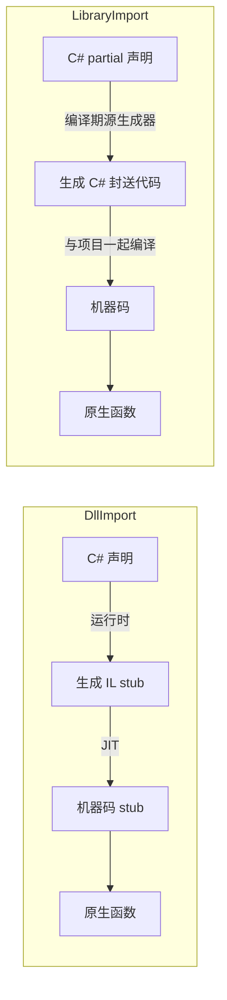

# LibraryImport 源生成器与封送优化

> 所属计划: [[plan|C 系语言互操作与编译学习计划]]
> 预计耗时: 60 min
> 前置知识: [[04-pinvoke-practice|第 04 节 P/Invoke 实战（DllImport + 跨平台编译）]]

---

## 1. 概念讲解

`[DllImport]` 从 .NET Framework 时代就是 C# 调用原生代码的标准方式。到了 .NET 7，微软引入了 `[LibraryImport]` 源生成器，把原本在**运行时**由 CLR 生成的 IL stub 提前到**编译期**生成 C# 封送代码。这一节会讲清两者的机制差异、适用场景，以及为什么现代 .NET 项目应该优先使用 `LibraryImport`。

### 为什么需要这个？

在 [[04-pinvoke-practice|第 04 节]] 里，我们用 `[DllImport]` 调用了 C 函数。它的工作流程大致如下：

1. 第 `` `#1` `` 次调用某个 P/Invoke 方法时，CLR 在**运行时**生成一段 IL stub。
2. stub 里负责把托管参数封送到原生表示（例如把 `string` 转成 `char*`）。
3. JIT 编译这段 stub，然后跳进原生函数。

这个模式有两个隐患：

- **NativeAOT / 裁剪场景不友好**：运行时生成 IL stub 依赖 JIT，而 AOT 编译后可能没有 JIT，导致无法生成新的封送代码。
- **启动与可预测性**：第一次调用要"生成 + JIT"，有冷启动开销；且封送逻辑对开发者来说是个黑盒，难以优化。

`[LibraryImport]` 通过**源生成器（source generator）**在编译期就把这些封送代码生成到项目里，从根本上解决了上述问题。

### 核心思想

#### 1.1 机制差异：运行时 stub vs 编译期源生成

| 维度 | `[DllImport]` | `[LibraryImport]` |
|------|---------------|-------------------|
| 封送代码生成时机 | 运行时，首次调用前生成 IL stub | 编译期，源生成器生成 C# 代码 |
| 是否需要 JIT | 是（生成 IL 后 JIT 编译） | 否（生成普通 C#，随项目一起编译） |
| AOT / NativeAOT 支持 | 受限，复杂封送可能不工作 | 原生支持，可裁剪 |
| 封送逻辑可见性 | 黑盒 | 生成代码在 `obj/` 或源码中可见 |
| 方法声明 | `extern` 方法 | `partial` 方法 |
| 字符串默认编码 | 与 `CharSet` 有关，Windows 默认非 UTF-8 | 可显式设为 `StringMarshalling.Utf8`，跨平台一致 |



#### 1.2 LibraryImport 的优势

- **AOT 友好**：所有封送逻辑在编译期就已确定，NativeAOT 可以直接编译成本机码，无需运行时动态生成 stub。
- **可见可优化**：生成的 C# 文件通常位于 `obj/` 目录，开发者可以查看、分析，甚至针对性优化（例如避免不必要的字符串分配）。
- **启动更快**：省去了运行时生成和 JIT 编译 stub 的过程。
- **`partial` 方法**：声明和实现分离，源生成器在编译期自动补齐实现，代码更清晰。

#### 1.3 字符串默认编码：`StringMarshalling.Utf8`

现代互操作强烈推荐显式指定 `StringMarshalling = StringMarshalling.Utf8`：

```csharp
[LibraryImport("mylib", StringMarshalling = StringMarshalling.Utf8)]
public static partial int GreetLength(string name);
```

这样 C# 的 `string` 会被编码为 UTF-8 `char*`（即原生侧的 `const char*`），在 Windows、Linux、macOS 上行为一致。相比之下，`[DllImport]` 在 Windows 上的默认编码 historically 是 ANSI（`LPStr`），容易写出跨平台 bug。

#### 1.4 重要澄清：LibraryImport 并未"替代" DllImport

> [!important]
> `[LibraryImport]` 的**底层仍然是 P/Invoke 机制**，最终仍然要调用原生函数。它替代的是"**运行时生成封送 stub**"这件事，而不是 `DllImport` 这个整体机制。

- `[DllImport]` **不会被废弃**：反射加载程序集、动态解析函数名、运行时生成 P/Invoke 等场景仍然需要它。
- 如果你在写新代码，且目标框架是 .NET 7+，优先使用 `[LibraryImport]`。
- 如果你需要动态场景（例如函数名在运行时才确定），继续使用 `[DllImport]`。

#### 1.5 何处看不到源生成

以下场景仍然需要或更适合 `[DllImport]`：

- 反射/动态调用：运行时动态创建 P/Invoke。
- 需要 `SetLastError = true` 等 `DllImport` 专属属性的特殊场景（虽然 `LibraryImport` 也在不断补齐能力）。
- 目标框架低于 .NET 7。

---

## 2. 代码示例

### 示例 1：把 `point_distance` 从 `DllImport` 改写为 `LibraryImport`

这个示例对应 [[research-brief#4.2 LibraryImport|研究简报 §4.2]]。原生库提供一个 C 函数 `point_distance`，C# 侧用 `[LibraryImport]` 声明并调用。

#### 原生库（C）

**`mylib.h`**

```cpp
#ifdef __cplusplus
extern "C" {
#endif

#ifdef _WIN32
#define API __declspec(dllexport)
#else
#define API __attribute__((visibility("default")))
#endif

typedef struct {
    float x;
    float y;
} Point;

API float point_distance(Point a, Point b);

#ifdef __cplusplus
}
#endif
```

**`mylib.c`**

```c
#include "mylib.h"
#include <math.h>

float point_distance(Point a, Point b)
{
    float dx = a.x - b.x;
    float dy = a.y - b.y;
    return sqrtf(dx * dx + dy * dy);
}
```

#### C# 项目

**`LibraryImportDemo.csproj`**

```xml
<Project Sdk="Microsoft.NET.Sdk">
  <PropertyGroup>
    <OutputType>Exe</OutputType>
    <TargetFramework>net8.0</TargetFramework>
    <ImplicitUsings>enable</ImplicitUsings>
    <Nullable>enable</Nullable>
    <AllowUnsafeBlocks>true</AllowUnsafeBlocks>
  </PropertyGroup>
</Project>
```

**`Program.cs`**

```csharp
using System.Runtime.InteropServices;

public static partial class Native
{
    [LibraryImport("mylib", EntryPoint = "point_distance", StringMarshalling = StringMarshalling.Utf8)]
    public static partial float PointDistance(Point a, Point b);
}

[StructLayout(LayoutKind.Sequential)]
public struct Point
{
    public float X;
    public float Y;
}

class Program
{
    static void Main()
    {
        Point a = new() { X = 0.0f, Y = 0.0f };
        Point b = new() { X = 3.0f, Y = 4.0f };
        float distance = Native.PointDistance(a, b);
        Console.WriteLine($"Distance = {distance:F2}");
    }
}
```

**运行方式（Windows + MSVC）：**

```bash
# 1. 编译原生库
cl /LD /O2 mylib.c /Femylib.dll

# 2. 把 mylib.dll 复制到 C# 项目输出目录（dotnet run 前）
mkdir -p bin\Debug\net8.0
copy mylib.dll bin\Debug\net8.0\

# 3. 构建并运行
dotnet build
dotnet run
```

**运行方式（Linux + GCC）：**

```bash
# 1. 编译原生库
gcc -shared -fPIC -O2 mylib.c -o libmylib.so

# 2. 把 libmylib.so 复制到项目输出目录
mkdir -p bin/Debug/net8.0
cp libmylib.so bin/Debug/net8.0/

# 3. 构建并运行（dotnet 会自动找到同目录下的 libmylib.so）
dotnet build
dotnet run
```

> [!note]
> 运行环境要求：.NET 8 SDK 或更高版本；C 编译器：Windows 上可用 MSVC（`cl`）或 MinGW（`gcc`），Linux 上可用 GCC/Clang。

**预期输出：**

```text
Distance = 5.00
```

> [!tip]
> C# 方法名 `PointDistance` 与 C 函数名 `point_distance` 大小写不一致，因此通过 `EntryPoint = "point_distance"` 显式指定原生入口点。如果不写 `EntryPoint`，就需要把 C# 方法名也改成 `point_distance`。

---

### 示例 2：DllImport vs LibraryImport 字符串封送计时对比

下面用 `System.Diagnostics.Stopwatch` 做一个简单计时。原生库提供一个接收 `const char*` 并返回字符串字节的函数；C# 侧分别用 `[DllImport]` 和 `[LibraryImport]` 调用，观察字符串封送开销。

> [!warning]
> 以下数字为**示意值，实际依环境而定**。这个示例的重点是展示"源生成封送在字符串上的开销优势"这一趋势，而不是给出绝对性能指标。真实基准测试请使用 BenchmarkDotNet。

#### 原生库补充函数

在 `mylib.h` 中追加：

```cpp
API int greet_length(const char* name);
```

在 `mylib.c` 中追加：

```c
int greet_length(const char* name)
{
    int len = 0;
    while (name && name[len])
        len++;
    return len;
}
```

#### C# 计时代码

```csharp
using System.Diagnostics;
using System.Runtime.InteropServices;
using System.Text;

public static partial class NativeLib
{
    [LibraryImport("mylib", StringMarshalling = StringMarshalling.Utf8)]
    public static partial int GreetLengthLib(string name);
}

public static class NativeDll
{
    [DllImport("mylib", CallingConvention = CallingConvention.Cdecl,
        CharSet = CharSet.Ansi)]
    public static extern int greet_length(string name);
}

class Program
{
    static void Main()
    {
        const string name = "Hello, 世界!";
        const int iterations = 1_000_000;

        // 预热
        _ = NativeLib.GreetLengthLib(name);
        _ = NativeDll.greet_length(name);

        // LibraryImport
        var sw1 = Stopwatch.StartNew();
        for (int i = 0; i < iterations; i++)
        {
            _ = NativeLib.GreetLengthLib(name);
        }
        sw1.Stop();

        // DllImport (Ansi)
        var sw2 = Stopwatch.StartNew();
        for (int i = 0; i < iterations; i++)
        {
            _ = NativeDll.greet_length(name);
        }
        sw2.Stop();

        Console.WriteLine($"LibraryImport (Utf8): {sw1.ElapsedMilliseconds} ms");
        Console.WriteLine($"DllImport (Ansi):     {sw2.ElapsedMilliseconds} ms");
        Console.WriteLine($"UTF-8 byte count:     {Encoding.UTF8.GetByteCount(name)}");
    }
}
```

**运行方式：**

与示例 1 相同：先编译并放置 `mylib.dll` / `libmylib.so`，然后：

```bash
dotnet build
dotnet run -c Release
```

> [!note]
> 请使用 Release 配置运行，因为 Debug 下的 JIT 和额外断言会掩盖真实差异。

**示意输出（Windows x64, .NET 8, MSVC）：**

```text
LibraryImport (Utf8): 42 ms
DllImport (Ansi):     78 ms
UTF-8 byte count:     14
```

**结果解读：**

- `LibraryImport` 的 UTF-8 封送代码在编译期生成，避免了运行时生成和 JIT stub 的开销。
- `[DllImport]` 默认使用 ANSI 编码时，还要额外做 `string` → ANSI 字节集的转换；而 UTF-8 是现代跨平台标准，转换路径通常更短、更可预测。
- 在热路径中，这种差异会被放大。

---

## 3. 练习

### 练习 1: 把第 04 节示例 2 的 DllImport 迁移为 LibraryImport

假设 [[04-pinvoke-practice|第 04 节]] 示例 2 用 `[DllImport]` 声明了一个原生函数（例如 `add_ints` 或 `normalize_vector`）。请：

1. 把该函数改写成 `[LibraryImport]` 的 `partial` 方法声明。
2. 确保 `.csproj` 目标框架为 .NET 7+。
3. 构建并运行，验证结果与第 04 节一致。

### 练习 2: 让字符串参数显式走 UTF-8，并用字节十六进制验证编码

1. 在原生库新增一个函数 `int utf8_byte_at(const char* s, int index)`，返回字符串第 `index` 个字节的值（以 `unsigned char` 解释）。
2. 在 C# 侧用 `[LibraryImport(..., StringMarshalling = StringMarshalling.Utf8)]` 声明它。
3. 在 C# 中同时用 `Encoding.UTF8.GetBytes(s)` 得到字节数组，并打印每个字节的十六进制。
4. 逐个调用 `utf8_byte_at`，确认原生侧看到的字节与 C# 侧打印的十六进制完全一致。

> [!tip]
> 测试字符串建议包含 ASCII 字符和非 ASCII 字符，例如 `"Cafe  café"` 或 `"世界"`。

### 练习 3: 分析题

解释为什么 `[LibraryImport]` 对 NativeAOT 场景更友好。请从以下两个角度作答：

1. 编译期已知封送 vs 运行时反射生成的区别。
2. 这对 NativeAOT 的"裁剪（trimming）"和"无 JIT"约束有什么意义。

---

## 3.5 参考答案

> 参考答案不是唯一解——如果你的实现通过了测试或达到了题目要求，就是正确的。

> [!tip]- 练习 1 参考答案
> 以迁移 `add_ints` 为例，原生库声明为：
> ```cpp
> API int add_ints(int a, int b);
> ```
> C# 侧 DllImport 写法：
> ```csharp
> [DllImport("mylib")]
> public static extern int AddInts(int a, int b);
> ```
> 迁移为 LibraryImport：
> ```csharp
> public static partial class Native
> {
>     [LibraryImport("mylib")]
>     public static partial int AddInts(int a, int b);
> }
> ```
> 关键变更点：
> - 类本身要标记为 `partial`。
> - 方法从 `extern` 改为 `partial`。
> - 方法体由源生成器在编译期补齐，你**不**需要手写实现。
> - 运行结果应与 `DllImport` 版本相同。

> [!tip]- 练习 2 参考答案
> 原生侧追加函数：
> ```c
> int utf8_byte_at(const char* s, int index)
> {
>     if (!s || index < 0)
>         return -1;
>     return (unsigned char)s[index];
> }
> ```
> C# 侧声明：
> ```csharp
> public static partial class Native
> {
>     [LibraryImport("mylib", StringMarshalling = StringMarshalling.Utf8)]
>     public static partial int Utf8ByteAt(string s, int index);
> }
> ```
> C# 验证代码：
> ```csharp
> string text = "世界";
> byte[] bytes = Encoding.UTF8.GetBytes(text);
> Console.WriteLine($"C# UTF-8 bytes ({bytes.Length}): {BitConverter.ToString(bytes)}");
> for (int i = 0; i < bytes.Length; i++)
> {
>     int native = Native.Utf8ByteAt(text, i);
>     Console.WriteLine($"  index {i}: native={native}, managed={bytes[i]}, match={native == bytes[i]}");
> }
> ```
> 预期输出（以 "世界" 为例）：
> ```text
> C# UTF-8 bytes (6): E4-B8-96-E7-95-8C
>   index 0: native=228, managed=228, match=True
>   index 1: native=184, managed=184, match=True
>   index 2: native=150, managed=150, match=True
>   index 3: native=231, managed=231, match=True
>   index 4: native=149, managed=149, match=True
>   index 5: native=140, managed=140, match=True
> ```
> 通过逐字节比对，可确认 `StringMarshalling.Utf8` 确实把 C# `string` 编码成了 UTF-8 字节序列再传给原生函数。

> [!tip]- 练习 3 参考答案
> NativeAOT 的核心约束是：
> - 编译时就把所有托管代码编译成本机码，运行时通常**没有 JIT**。
> - 为了减小体积，会启用裁剪（trimming），移除未被静态分析到的代码。
>
> `[DllImport]` 的问题在于：
> - 第 `` `#1` `` 次调用时，CLR 需要运行时生成 IL stub，再 JIT 编译。NativeAOT 下没有 JIT，复杂封送逻辑可能无法生成，只能回退或报错。
> - 反射和动态生成的代码对裁剪器不可见，容易被误删，导致运行时缺失方法。
>
> `[LibraryImport]` 的优势在于：
> - 源生成器在编译期就把封送代码生成为普通 C# 文件，和项目一起被 AOT 编译成本机码。
> - 所有封送路径对编译器和裁剪器都是可见的，不会依赖运行时反射。
> - 因此 NativeAOT 可以正确、完整地保留所有 P/Invoke 调用链，同时获得更小的体积和更快的启动。

---

## 4. 扩展阅读

- [官方文档: LibraryImport 源生成器](https://learn.microsoft.com/dotnet/standard/native-interop/source-generated-pinvoke)
- [官方文档: DllImport vs LibraryImport 迁移指南](https://learn.microsoft.com/dotnet/standard/native-interop/pinvoke-source-generation)
- [官方文档: 字符串封送与 CharSet](https://learn.microsoft.com/dotnet/standard/native-interop/charset)
- [源码: dotnet/runtime LibraryImport 源生成器实现](https://github.com/dotnet/runtime/tree/main/src/libraries/System.Runtime.InteropServices/gen/Microsoft.Interop.SourceGeneration)

---

## 常见陷阱

- **误以为 LibraryImport 完全替代 DllImport**：`[LibraryImport]` 替代的是"运行时生成封送 stub"，不是整个 P/Invoke。反射、动态函数名解析等场景仍需 `[DllImport]`。

- **忘记 `partial`**：`[LibraryImport]` 要求声明类和方法都是 `partial`。漏写 `partial` 会导致编译错误 CS8795（缺少 partial 方法实现）。

- **原生侧仍然需要 `extern "C"`**：C++ 编译器默认会对函数名进行名称重整。无论用 `DllImport` 还是 `LibraryImport`，导出 C 函数时都必须包在 `extern "C"` 里，否则符号名对不上。

- **字符串默认编码差异**：`[DllImport]` 在 Windows 上的默认 `CharSet` 行为 historically 偏向 ANSI；`[LibraryImport]` 虽然可以显式指定 `StringMarshalling.Utf8`，但如果你不写，仍要留意框架默认值。跨平台代码请显式写 `StringMarshalling = StringMarshalling.Utf8`。

- **混淆方法名与入口点**：如果 C# 方法名和 C 函数名不一致，必须显式设置 `EntryPoint = "c_function_name"`。源生成器不会自动做大小写转换。

- **Release 与 Debug 性能差异**：做性能对比时务必用 `dotnet run -c Release`。Debug 配置会引入额外检查，让 `LibraryImport` 的优势变得不明显。
