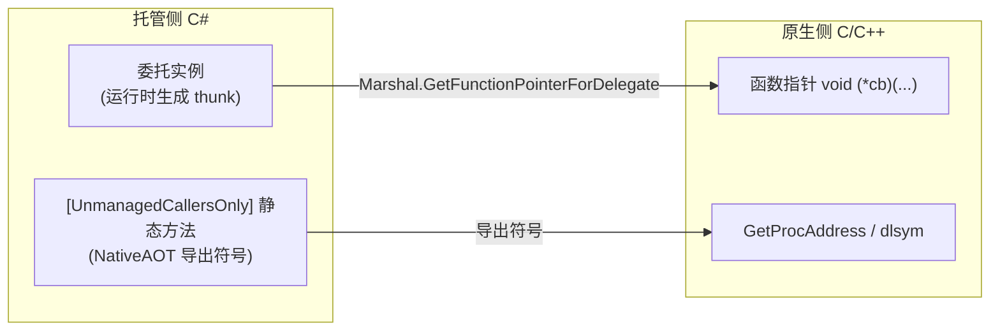

# 反向互操作：原生调托管

> 所属计划: [[plan|C 系语言互操作与编译学习计划]]
> 预计耗时: 75 min
> 前置知识: [[04-pinvoke-practical|第 04 节 P/Invoke 实战]]

---

## 1. 概念讲解

前几节讨论的都是**托管 → 原生**的单向调用：C# 通过 P/Invoke 调用 C/C++ 库。但很多场景需要反方向：C/C++ 在执行过程中回调 C# 代码，例如游戏引擎的事件系统、异步 IO 完成通知、排序比较器、插件架构等。这就是**反向互操作（reverse interop）**——让原生代码调用托管代码。

### 为什么需要这个？

- **事件与回调**：原生引擎注册一个 C# 回调，在特定时机（如物理碰撞、文件加载完成）触发。
- **可扩展架构**：C++ 核心暴露扩展点，由 C# 层注入业务逻辑（插件、模组、脚本绑定）。
- **复用托管实现**：已有的 C# 算法或业务规则需要被原生代码直接调用。

如果不理解反向互操作，你会写出"本地代码注册完回调就崩溃"、"Release 版比 Debug 版更不稳定"等难以排查的 bug。本章内容以 [[research-brief|研究简报]] §5 为事实依据。

### 核心思想

.NET 提供两条主要路径让原生代码调用 C#：

| 方式 | 机制 | 适用场景 | 关键约束 |
|------|------|----------|----------|
| **委托 → 函数指针** | CLR 运行时把委托实例封送为原生函数指针（thunk） | 任意 .NET Framework/Core/5+，需要运行时存在 | 委托实例必须被保持存活，否则 GC 回收后原生调用悬空指针 |
| **`[UnmanagedCallersOnly]`** | C# 方法直接声明为可被原生调用的导出函数 | .NET 5+；NativeAOT 下可生成真正导出符号 | 参数/返回必须是 blittable；不能抛异常跨边界 |



#### 1.1 委托封送为函数指针

当把 C# 委托传给原生 API 时，CLR 会创建一个**thunk**：一段原生机器码，它按指定调用约定接收原生参数，再跳转到托管委托目标。可以用 `[UnmanagedFunctionPointer(CallingConvention.Cdecl)]` 控制 thunk 的调用约定。

```csharp
[UnmanagedFunctionPointer(CallingConvention.Cdecl)]
public delegate int Callback(int x);
```

> [!warning] 生命周期红线
> 委托实例**必须**被长期保持存活（静态字段、`GCHandle.Alloc`、或确保在原生使用期间不被回收的对象字段）。如果委托只是局部变量，方法返回后 GC 可能回收它，原生侧再调用时就变成了**悬空指针（dangling pointer）**，表现为崩溃、随机数据或时好时坏。

#### 1.2 `[UnmanagedCallersOnly]` 导出原生函数

`.NET 5+` 引入 `[UnmanagedCallersOnly(EntryPoint = "...")]`，让 C# 静态方法像 C 函数一样被原生代码调用。在 NativeAOT 模式下，它会生成真正的 DLL 导出符号；在普通 CoreCLR 下，可以通过函数指针获取其入口地址。

```csharp
[UnmanagedCallersOnly(EntryPoint = "native_add")]
public static int NativeAdd(int a, int b) => a + b;
```

约束：

- 方法必须是 `static`。
- 参数/返回类型必须是 **blittable**（`int`、`IntPtr`、只含 blittable 的 `struct` 指针等）。`string`、`bool`、托管对象引用都不行。
- 方法体内不能抛异常到原生侧，否则行为未定义。

#### 1.3 GCHandle：原生长期持有托管对象

原生代码不能直接保存托管对象引用，因为 GC 会移动对象。需要把对象交给 `GCHandle.Alloc` 拿到句柄，再把句柄（`IntPtr`）传给原生侧。返回时用 `GCHandle.FromIntPtr(handle).Target` 取回，并在适当时机 `Free()`。

```csharp
var handle = GCHandle.Alloc(myObject);
IntPtr ptr = GCHandle.ToIntPtr(handle);
// 把 ptr 传给原生代码保存
```

这是"原生持有托管对象"的生命周期红线。

---

## 2. 代码示例

### 示例 1：委托回调（C++ 注册回调，C# 提供实现）

本示例展示最经典的反向调用：C++ 库暴露 `register_callback` 保存一个函数指针，之后 `trigger` 调用该指针；C# 侧用委托提供实现，并把它存到静态字段防止 GC 回收。

**文件结构：**

```text
callback-demo/
├── mylib.cpp          # C++ 动态库
├── CallbackDemo.csproj
└── Program.cs         # C# 宿主
```

**mylib.cpp**

```cpp
#ifdef _WIN32
    #define API __declspec(dllexport)
#else
    #define API __attribute__((visibility("default")))
#endif

extern "C" {
    typedef int (*callback_t)(int);

    API void register_callback(callback_t cb);
    API int trigger(int x);
}

static callback_t g_cb = nullptr;

API void register_callback(callback_t cb)
{
    g_cb = cb;
}

API int trigger(int x)
{
    return g_cb ? g_cb(x) : -1;
}
```

**Program.cs**

```csharp
using System;
using System.Runtime.InteropServices;

class Program
{
    // 明确指定调用约定，确保 C++ 与 C# 一致
    [UnmanagedFunctionPointer(CallingConvention.Cdecl)]
    delegate int Map(int x);

    [DllImport("mylib", CallingConvention = CallingConvention.Cdecl)]
    static extern void register_callback(Map cb);

    [DllImport("mylib", CallingConvention = CallingConvention.Cdecl)]
    static extern int trigger(int x);

    // 生命周期红线：把委托存到静态字段，避免方法返回后被 GC 回收
    static readonly Map s_double = x => x * 2;

    static void Main()
    {
        register_callback(s_double);
        int result = trigger(10);
        Console.WriteLine($"trigger(10) = {result}");
    }
}
```

**CallbackDemo.csproj**

```xml
<Project Sdk="Microsoft.NET.Sdk">
  <PropertyGroup>
    <OutputType>Exe</OutputType>
    <TargetFramework>net8.0</TargetFramework>
    <AllowUnsafeBlocks>true</AllowUnsafeBlocks>
  </PropertyGroup>
</Project>
```

**运行方式（Windows + MSVC）：**

```bash
# 1. 编译 C++ 动态库
cl /LD mylib.cpp /Femylib.dll

# 2. 创建并进入 C# 项目
dotnet new console -n CallbackDemo --force
cd CallbackDemo

# 3. 把动态库复制到项目根目录（运行目录）
copy ..\mylib.dll .

# 4. 替换 Program.cs 和 csproj 内容后运行
dotnet run
```

**运行方式（Linux + GCC）：**

```bash
# 1. 编译 C++ 动态库
g++ -shared -fPIC -o libmylib.so mylib.cpp

# 2. 创建并进入 C# 项目
dotnet new console -n CallbackDemo --force
cd CallbackDemo

# 3. 复制动态库
cp ../libmylib.so .

# 4. 运行（如找不到 so，可显式指定 LD_LIBRARY_PATH）
LD_LIBRARY_PATH=. dotnet run
```

**预期输出：**

```text
trigger(10) = 20
```

> [!note]
> 如果把 `s_double` 改成 `Main` 里的局部变量，`register_callback` 调用本身可能暂时成功，但一旦 `Main` 继续执行并触发 GC，后续 `trigger` 调用就可能崩溃。这是本示例最重要的结论，也是生产环境最常见的反互操作 bug。

---

### 示例 2：`[UnmanagedCallersOnly]` 导出 C# 函数给 C++ 调用

本示例用 NativeAOT 把 C# 项目编译成原生共享库，C++ 程序通过 `GetProcAddress` / `dlsym` 获取函数指针并调用。这是".NET 写库给 C++ 用"的现代方案。

**文件结构：**

```text
native-aot-demo/
├── NativeMath.csproj
├── NativeMath.cs      # C# 导出的原生函数
├── main.cpp           # C++ 调用方
└── build.bat / build.sh
```

**NativeMath.cs**

```csharp
using System;
using System.Runtime.InteropServices;

public static class NativeMath
{
    // NativeAOT 下会生成真正的导出符号 native_add
    [UnmanagedCallersOnly(EntryPoint = "native_add")]
    public static int NativeAdd(int a, int b) => a + b;
}
```

**NativeMath.csproj**

```xml
<Project Sdk="Microsoft.NET.Sdk">
  <PropertyGroup>
    <TargetFramework>net8.0</TargetFramework>
    <PublishAot>true</PublishAot>
    <NativeLib>Shared</NativeLib>
  </PropertyGroup>
</Project>
```

**main.cpp**

```cpp
#include <iostream>

#ifdef _WIN32
    #include <windows.h>
#else
    #include <dlfcn.h>
#endif

typedef int (*native_add_t)(int, int);

int main()
{
#ifdef _WIN32
    HMODULE h = LoadLibraryA("NativeMath.dll");
    if (!h) { std::cerr << "LoadLibrary failed\n"; return 1; }
    auto add = reinterpret_cast<native_add_t>(GetProcAddress(h, "native_add"));
#else
    void* h = dlopen("./libNativeMath.so", RTLD_NOW);
    if (!h) { std::cerr << "dlopen failed: " << dlerror() << "\n"; return 1; }
    auto add = reinterpret_cast<native_add_t>(dlsym(h, "native_add"));
#endif

    if (!add) { std::cerr << "symbol not found\n"; return 1; }

    std::cout << "native_add(3, 4) = " << add(3, 4) << std::endl;
    return 0;
}
```

**运行方式（Windows + MSVC + .NET 8 SDK）：**

```bash
# 1. 发布 NativeAOT 共享库
dotnet publish -c Release -r win-x64

# 2. 编译 C++ 调用方（假设输出在 publish 目录）
cl main.cpp /Fe:main.exe

# 3. 把 NativeMath.dll 放到 main.exe 同目录
copy bin\Release\net8.0\win-x64\publish\NativeMath.dll .

main.exe
```

**运行方式（Linux + GCC + .NET 8 SDK）：**

```bash
# 1. 发布 NativeAOT 共享库
dotnet publish -c Release -r linux-x64

# 2. 编译 C++ 调用方
g++ -o main main.cpp -ldl

# 3. 复制共享库
cp bin/Release/net8.0/linux-x64/publish/libNativeMath.so .

# 4. 运行
LD_LIBRARY_PATH=. ./main
```

**预期输出：**

```text
native_add(3, 4) = 7
```

> [!tip]
> 如果不想用 NativeAOT，普通 CoreCLR 也可以通过 C# 函数指针把 `[UnmanagedCallersOnly]` 方法的地址取出来传给 C++，但 C++ 侧必须保证调用发生在 .NET 运行时仍然加载、且该 AppDomain 仍然存活时。NativeAOT 共享库方案最贴近"C# 作为原生库"的语义，推荐用于新设计。

---

## 3. 练习

### 练习 1: 基础 —— C# 委托实现 C++ 排序比较器

C++ 库暴露如下接口：

```cpp
extern "C" {
    typedef int (*compare_t)(int a, int b);
    API void sort_ints(int* arr, int n, compare_t cmp);
}
```

要求在 C# 中实现一个 `compare_t` 比较器（升序），把它传给 `sort_ints`，对数组 `[3, 1, 4, 1, 5, 9, 2, 6]` 排序并打印结果。

> 提示：把委托存到静态字段；`arr` 用 `int[]` 直接传即可，blittable 数组在 P/Invoke 调用期间会被自动 pin。

### 练习 2: 进阶 —— 诊断委托被 GC 回收导致的崩溃

下面这段代码看起来能工作，但运行一段时间或在高 GC 压力下会崩溃。请解释原因并给出修复。

```csharp
using System;
using System.Runtime.InteropServices;

class Program
{
    [UnmanagedFunctionPointer(CallingConvention.Cdecl)]
    delegate int Map(int x);

    [DllImport("mylib", CallingConvention = CallingConvention.Cdecl)]
    static extern void register_callback(Map cb);

    static void Setup()
    {
        Map local = x => x * 2;   // 局部委托
        register_callback(local);
    }

    static void Main()
    {
        Setup();
        // 假设这里 C++ 稍后调用 trigger(...)
    }
}
```

### 练习 3: 挑战 —— 用 `[UnmanagedCallersOnly]` 暴露字符串长度函数

用 NativeAOT 写一个 C# 共享库，暴露一个 `managed_strlen_utf8` 函数，C++ 传入一个 UTF-8 字符串指针，C# 返回其长度（字节数，不含终止符）。

> 提示：`[UnmanagedCallersOnly]` 的参数必须是 blittable。托管 `string` 不是 blittable，应使用 `byte*` 指针在 C# 中遍历到 `0` 终止符。

---

## 3.5 参考答案

> 参考答案不是唯一解——如果你的实现通过了测试或达到了题目要求，就是正确的。

> [!tip]- 练习 1 参考答案
> C++ 侧实现一个简单插入排序即可，重点是 C# 侧保持委托存活。
>
> ```cpp
> // sortlib.cpp
> #ifdef _WIN32
>     #define API __declspec(dllexport)
> #else
>     #define API __attribute__((visibility("default")))
> #endif
>
> extern "C" {
>     typedef int (*compare_t)(int a, int b);
>     API void sort_ints(int* arr, int n, compare_t cmp);
> }
>
> API void sort_ints(int* arr, int n, compare_t cmp)
> {
>     for (int i = 1; i < n; ++i)
>     {
>         int key = arr[i];
>         int j = i - 1;
>         while (j >= 0 && cmp(arr[j], key) > 0)
>         {
>             arr[j + 1] = arr[j];
>             --j;
>         }
>         arr[j + 1] = key;
>     }
> }
> ```
>
> ```csharp
> using System;
> using System.Runtime.InteropServices;
>
> class Program
> {
>     [UnmanagedFunctionPointer(CallingConvention.Cdecl)]
>     delegate int Compare(int a, int b);
>
>     [DllImport("sortlib", CallingConvention = CallingConvention.Cdecl)]
>     static extern void sort_ints(int[] arr, int n, Compare cmp);
>
>     // 生命周期红线：静态字段保持委托存活
>     static readonly Compare s_asc = (a, b) => a.CompareTo(b);
>
>     static void Main()
>     {
>         int[] data = { 3, 1, 4, 1, 5, 9, 2, 6 };
>         sort_ints(data, data.Length, s_asc);
>         Console.WriteLine(string.Join(", ", data));
>     }
> }
> ```
>
> **预期输出：**
>
> ```text
> 1, 1, 2, 3, 4, 5, 6, 9
> ```

> [!tip]- 练习 2 参考答案
> **问题原因：** `Map local` 是 `Setup()` 方法的局部变量。方法返回后，该委托实例不再被任何根对象引用，GC 可以在下次回收时将其清理。CLR 传给原生代码的函数指针指向的是与该委托关联的 thunk 内存，委托被回收后这块内存可能失效或复用，因此 C++ 后续调用 `trigger` 会触发悬空调用（dangling call），表现为崩溃或随机值。
>
> **修复：** 把委托提升到静态字段或实例字段，确保在原生使用期间一直有根引用。
>
> ```csharp
> class Program
> {
>     [UnmanagedFunctionPointer(CallingConvention.Cdecl)]
>     delegate int Map(int x);
>
>     [DllImport("mylib", CallingConvention = CallingConvention.Cdecl)]
>     static extern void register_callback(Map cb);
>
>     // 静态字段让委托长期存活
>     static readonly Map s_double = x => x * 2;
>
>     static void Setup()
>     {
>         register_callback(s_double);
>     }
>
>     static void Main()
>     {
>         Setup();
>         // 后续 C++ 调用 trigger 时，s_double 仍然有效
>     }
> }
> ```
>
> 如果委托需要动态替换或释放，可用 `GCHandle.Alloc(delegate, GCHandleType.Normal)` 手动固定生命周期，并在不再需要时调用 `Free()`。

> [!tip]- 练习 3 参考答案
> `[UnmanagedCallersOnly]` 不支持 `string` / `[MarshalAs]` 等自动封送，因此用 `byte*` 直接遍历 UTF-8 字节。
>
> ```csharp
> using System;
> using System.Runtime.InteropServices;
>
> public static class NativeStrings
> {
>     [UnmanagedCallersOnly(EntryPoint = "managed_strlen_utf8")]
>     public static unsafe int ManagedStrLenUtf8(byte* s)
>     {
>         if (s == null) return 0;
>         int len = 0;
>         while (s[len] != 0) ++len;
>         return len;
>     }
> }
> ```
>
> ```xml
> <!-- NativeStrings.csproj -->
> <Project Sdk="Microsoft.NET.Sdk">
>   <PropertyGroup>
>     <TargetFramework>net8.0</TargetFramework>
>     <PublishAot>true</PublishAot>
>     <NativeLib>Shared</NativeLib>
>     <AllowUnsafeBlocks>true</AllowUnsafeBlocks>
>   </PropertyGroup>
> </Project>
> ```
>
> C++ 调用方示例：
>
> ```cpp
> typedef int (*managed_strlen_utf8_t)(const char* s);
>
> int main()
> {
> #ifdef _WIN32
>     HMODULE h = LoadLibraryA("NativeStrings.dll");
>     auto fn = reinterpret_cast<managed_strlen_utf8_t>(
>         GetProcAddress(h, "managed_strlen_utf8"));
> #else
>     void* h = dlopen("./libNativeStrings.so", RTLD_NOW);
>     auto fn = reinterpret_cast<managed_strlen_utf8_t>(
>         dlsym(h, "managed_strlen_utf8"));
> #endif
>     std::cout << "len(\"hello\") = " << fn("hello") << std::endl;
>     return 0;
> }
> ```
>
> **预期输出：**
>
> ```text
> len("hello") = 5
> ```
>
> 注意：如果需要返回字符串给 C++，推荐让 C++ 预先分配缓冲并传入长度，而不是让 C# 分配内存后让 C++ 猜测释放方式。

---

## 4. 扩展阅读

- [Microsoft Learn: 从本机代码调用 .NET 函数](https://learn.microsoft.com/dotnet/standard/native-interop/expose-components-to-com)
- [Microsoft Learn: UnmanagedCallersOnlyAttribute](https://learn.microsoft.com/dotnet/api/system.runtime.interopservices.unmanagedcallersonlyattribute)
- [Microsoft Learn: 使用 NativeAOT 编译为本机库](https://learn.microsoft.com/dotnet/core/deploying/native-aot/libraries)
- [Microsoft Learn: GCHandle 结构](https://learn.microsoft.com/dotnet/api/system.runtime.interopservices.gchandle)
- [.NET Runtime 源码：UnmanagedCallersOnly 实现相关](https://github.com/dotnet/runtime/tree/main/src/coreclr/vm)
- [Mono 文档：反向 P/Invoke](https://www.mono-project.com/docs/advanced/pinvoke/#reverse-pinvoke)

---

## 常见陷阱

- **委托被 GC 回收导致悬空调用**：把委托作为局部变量传给 `register_callback` 后方法返回，GC 回收委托，原生调用时崩溃。**正确做法**：用静态字段、`GCHandle.Alloc` 或确保生命周期覆盖原生使用期的实例字段保持委托存活。
- **`[UnmanagedCallersOnly]` 参数非 blittable**：使用 `string`、`bool`、托管对象引用等类型会导致运行时异常或无法编译。**正确做法**：参数/返回使用 `int`、`IntPtr`、blittable `struct` 指针、`byte*` / `char*` 等；字符串通过指针手工遍历或预分配缓冲交换。
- **x86 下调用约定不匹配**：`cdecl` 与 `stdcall` 在参数清理方上不同，混用会导致栈损坏。**正确做法**：C++ 导出函数、C# `[DllImport]`、`[UnmanagedFunctionPointer]` 三处调用约定保持一致；x64 下统一平台 ABI，但仍建议显式写 `Cdecl`。
- **回调里抛异常跨边界**：在委托或 `[UnmanagedCallersOnly]` 方法中抛出异常并让它逃逸到原生侧，可能引发未定义行为、进程崩溃或状态损坏。**正确做法**：回调方法内部用 `try/catch` 捕获所有异常，转换为错误码或日志；需要错误信息时通过预分配缓冲返回给 C++。
- **用 NativeAOT 共享库但忘记 `<NativeLib>Shared`**：只启用 `<PublishAot>true</PublishAot>` 会生成可执行文件而不是 DLL / `.so`。**正确做法**：生成原生库时必须同时设置 `<NativeLib>Shared</NativeLib>`。
- **长期 pinning 阻塞 GC**：为把托管数组地址交给原生长期保存而使用 `GCHandleType.Pinned` 且不释放，会导致堆碎片和 GC 效率下降。**正确做法**：优先传 blittable 数组的临时指针或复制到原生缓冲；必须长期固定时记得在生命周期结束时 `Free()`。
