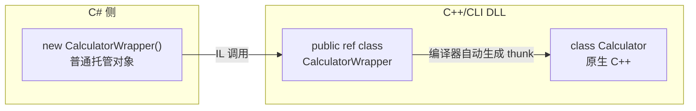
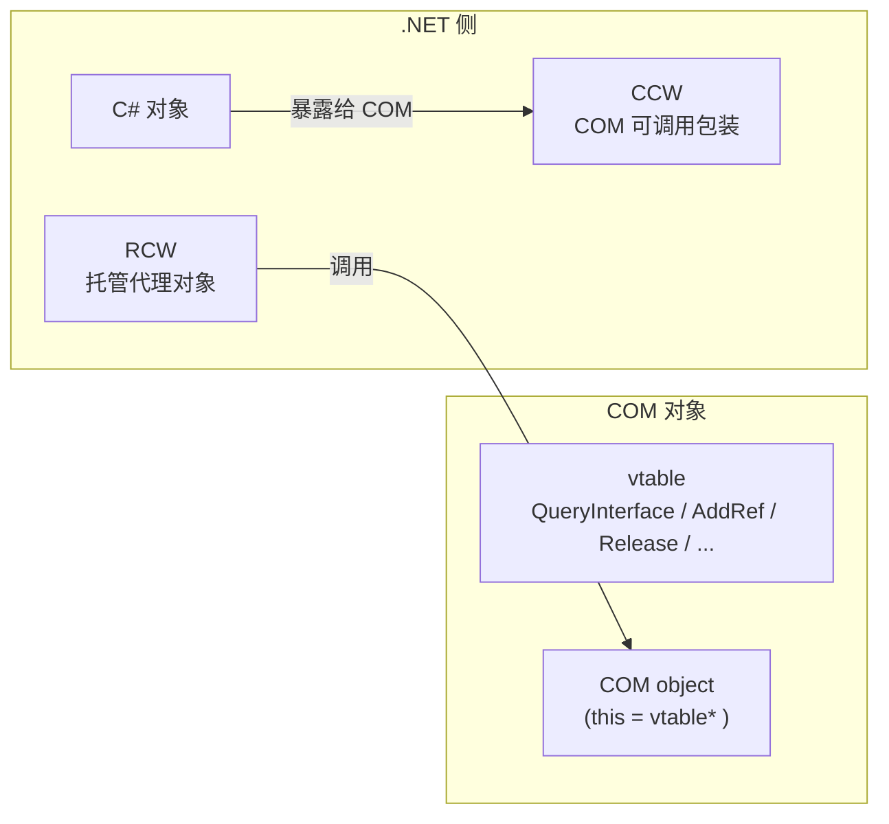
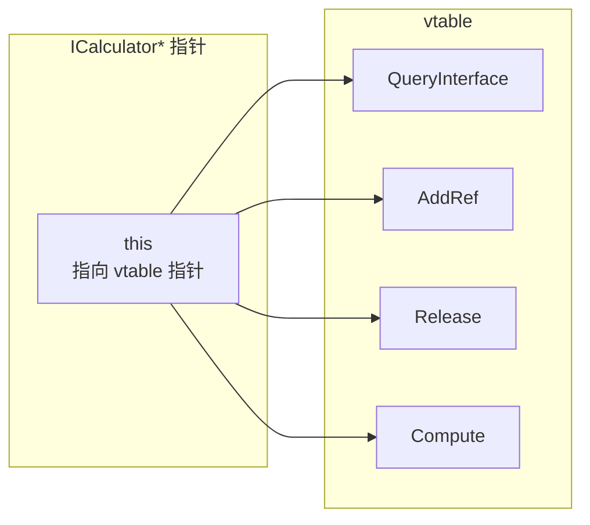

# C++/CLI 包装器与 COM 互操作（进阶）

> 所属计划: [[plan|C 系语言互操作与编译学习计划]]
> 预计耗时: 60 min
> 前置知识: [[04-pinvoke-practical|第 04 节 P/Invoke 实战]]、[[06-reverse-interop|第 06 节 反向互操作]]
> 本节类型: 进阶 / 可选

---

## 1. 概念讲解

前面的章节已经用 P/Invoke、委托、`[UnmanagedCallersOnly]` 在 C# 与 C/C++ 之间架起了桥。但当原生侧是**面向对象的 C++ API**（类、继承、模板容器、异常、RAII）时，把这些东西逐一手动包成 C API 会非常痛苦。C++/CLI 正是为了解决这个问题而生的：它让**同一份 DLL 里同时存在原生 C++ 机器码和托管 IL**，编译器自动在两者之间生成 thunk，C# 侧看到的只是一个普通的托管类。

### 为什么需要这个？

假设你有一个大型 C++ 引擎核心，接口形态是：

```cpp
class PhysicsWorld {
public:
    PhysicsWorld(const Config& cfg);
    ~PhysicsWorld();
    RigidBody* CreateBody(const Vec3& pos, float mass);
    void Step(float dt);
};
```

如果要用 P/Invoke 暴露给 C#，你需要：

1. 把所有方法改成 `extern "C"` 的 C 函数。
2. 把 `Vec3`、`Config` 等 C++ 类型重新声明为 C# `struct`。
3. 自己管理 `PhysicsWorld*` 和 `RigidBody*` 的句柄与生命周期。
4. 处理 C++ 异常、RAII、STL 容器等"翻译"成本。

这些工作 C++/CLI 可以帮你做掉大半——它允许你在托管类里直接 `#include` 原生头文件、调用原生构造函数和析构函数，编译器会生成托管/原生之间的转换代码。

### 核心思想

#### 1.1 C++/CLI 是什么

C++/CLI 是 MSVC 的 `/clr` 编译器扩展，它不是标准 C++，而是一种"混合语言"。它的关键能力：

- **同一项目、同一 DLL** 里可以同时编译原生 C++（生成机器码）和托管 C++（生成 IL）。
- 原生对象和托管对象可以**直接互调**，编译器在编译期生成两者之间的 thunk。
- 对 C# 来说，C++/CLI 暴露的 `public ref class` 就是一个普通的 .NET 类，**看不到任何 P/Invoke**。



> [!warning] 硬约束
> C++/CLI **仅 Windows + MSVC**。`.NET Core/5+` 的 C++/CLI 只支持 Windows，不支持 Linux/macOS。跨平台项目必须退回 P/Invoke。这是不可协商的选型前提。

#### 1.2 典型用法：胶水层

C++/CLI 最常见的用法是"胶水 DLL"：

1. 在 C++/CLI 项目里 `#include` 原生 C++ 头文件。
2. 创建 `public ref class`，内部持有原生对象指针（`NativeClass* _native`）。
3. 在托管构造函数里 `new NativeClass()`，在析构函数里 `delete _native`。
4. C# 引用这个 DLL，像用普通 C# 类一样使用它。

#### 1.3 C++/CLI vs P/Invoke 选型对比

| 维度 | C++/CLI | P/Invoke |
|------|---------|----------|
| 原生 API 形态 | 面向对象 C++ 类、STL、模板 | C API 或容易包成 C 接口的 C++ |
| 跨平台 | **仅 Windows + MSVC** | 跨平台 |
| 封送复杂度 | 编译器自动生成 thunk，零手写封送 | 需要手动声明结构体、字符串、回调 |
| 复杂对象转换 | 高频转换时优势明显 | 每次跨边界都要显式处理 |
| 部署 | 需要 MSVC 运行时，二进制与架构绑定 | 纯 C 动态库，跨平台分发更简单 |
| 学习/维护成本 | 混合语法特殊，调试复杂 | 标准 P/Invoke，资料更多 |

**选型建议**：

- 如果原生侧已经是 C API 或能低成本包成 C API → **用 P/Invoke**。
- 如果原生侧是大型 C++ 类库、频繁转换复杂对象、且项目确定只在 Windows 上跑 → **用 C++/CLI**。
- 如果需要 Linux/macOS → **不能用 C++/CLI，只能 P/Invoke**。

#### 1.4 COM 互操作概念（了解）

COM（Component Object Model）是比 C++/CLI 更古老、更底层的二进制接口标准：

- COM 对象的本质是**指向 vtable 的指针**，vtable 里是一组函数指针。
- 任何能按 COM 规范布局 vtable 的语言都可以互调，不依赖 C++ 名称重整。
- .NET 通过 **RCW（Runtime Callable Wrapper）** 让 C# 调用 COM 对象；通过 **CCW（COM Callable Wrapper）** 让 COM 调用 C# 对象。



现代 .NET 8+ 推荐用 `[GeneratedComInterface]` 源生成器声明 COM 接口，编译器会生成符合 COM 规范的 vtable 和 RCW/CCW，避免手写 COM 封送代码。非 Office / 老 Windows API 的新项目已很少手写 COM，但了解 RCW/CCW/vtable 概念对阅读 Windows 文档和旧代码仍有帮助。

---

## 2. 代码示例

### 示例 1：C++/CLI 包装原生 `Calculator` 类

这个示例包含三个部分：原生 C++ 类、`C++/CLI` 包装 DLL、C# 控制台程序。

#### 第 `` `#1` `` 步：原生 C++ 头文件

```cpp
// Calculator.h
#pragma once

class Calculator {
public:
    Calculator();
    ~Calculator();
    int Compute(int x);

private:
    int _factor;
};
```

```cpp
// Calculator.cpp
#include "Calculator.h"

Calculator::Calculator() : _factor(2) {}
Calculator::~Calculator() = default;

int Calculator::Compute(int x) {
    return x * _factor + 1;
}
```

#### 第 `` `#2` `` 步：C++/CLI 包装类

创建 **"CLR 类库 (.NET Core)"** 项目（仅 Visual Studio Windows），把 `Calculator.h`/`Calculator.cpp` 加入项目，然后添加包装文件：

```cpp
// CalculatorWrapper.h
#pragma once

#include "Calculator.h"

namespace CalcInterop {

    public ref class CalculatorWrapper {
    public:
        CalculatorWrapper();
        ~CalculatorWrapper();   // IDisposable::Dispose
        !CalculatorWrapper();   // 终结器（Finalizer）

        int Compute(int x);

    private:
        Calculator* _native;
    };

}
```

```cpp
// CalculatorWrapper.cpp
#include "CalculatorWrapper.h"

using namespace CalcInterop;

CalculatorWrapper::CalculatorWrapper() {
    _native = new Calculator();
}

CalculatorWrapper::~CalculatorWrapper() {
    this->!CalculatorWrapper();
}

CalculatorWrapper::!CalculatorWrapper() {
    if (_native != nullptr) {
        delete _native;
        _native = nullptr;
    }
}

int CalculatorWrapper::Compute(int x) {
    return _native->Compute(x);
}
```

#### 第 `` `#3` `` 步：C# 控制台程序

```csharp
// Program.cs
using CalcInterop;

class Program
{
    static void Main(string[] args)
    {
        using (var calc = new CalculatorWrapper())
        {
            int result = calc.Compute(5);
            Console.WriteLine($"Compute(5) = {result}");
        }
    }
}
```

**运行方式（Windows + Visual Studio 2022）：**

1. 打开 Visual Studio 2022，确保安装了"使用 C++ 的桌面开发"和".NET 桌面开发"工作负载。
2. 创建解决方案，添加三个项目：
   - `NativeLib`："静态库"或"动态库"项目，包含 `Calculator.h` / `Calculator.cpp`。
   - `CalcInterop`："CLR 类库 (.NET Core)"项目，目标框架选 `.NET 8.0`。
     - 在"项目属性 → 高级"中确认"公共语言运行时支持"为 `/clr`。
     - 添加对 `NativeLib` 的引用。
     - 添加 `CalculatorWrapper.h` / `CalculatorWrapper.cpp`。
   - `CsApp`："控制台应用"项目，目标框架 `.NET 8.0`。
     - 添加对 `CalcInterop` 的项目引用。
3. 确保 `CsApp` 的平台目标与 `CalcInterop` 一致（x64 或 x86，推荐 x64）。
4. 设置 `CsApp` 为启动项目，按 `F5` 运行。

**命令行构建方式（Windows + MSVC）：**

```bash
# 1) 编译原生静态库
cl /c /EHsc /O2 Calculator.cpp
lib /OUT:NativeLib.lib Calculator.obj

# 2) 编译 C++/CLI DLL（需 Visual Studio 2022 Developer Command Prompt）
cl /clr /LD /EHsc /O2 CalculatorWrapper.cpp NativeLib.lib /Fe:CalcInterop.dll

# 3) 编译并运行 C# 程序
dotnet new console -n CsApp
cd CsApp
# 将 CalcInterop.dll 复制到项目输出目录，或添加项目引用
dotnet add reference ../CalcInterop/CalcInterop.csproj
dotnet run
```

> [!note]
> C++/CLI 项目不能直接用 `dotnet build` 驱动，通常由 Visual Studio 的 MSBuild 或 MSVC `cl /clr` 编译。命令行方式仅作示意，实际推荐用 VS 项目模板。

**预期输出：**

```text
Compute(5) = 11
```

> [!tip]
> `~CalculatorWrapper()` 是确定性析构（对应 `IDisposable.Dispose`），在 `using` 结束或显式调用 `delete` 时执行；`!CalculatorWrapper()` 是非确定性终结器，由 GC 在对象被回收时兜底调用。两者共享同一份 `delete _native` 逻辑，避免双重释放。

---

### 示例 2：COM vtable 布局与 `[GeneratedComInterface]`

本示例偏概念示意：先用 C 语言展示 COM 接口的二进制 vtable 布局，再用 .NET 8+ 的源生成器声明同一个接口。

#### C 语言视角下的 COM vtable

```c
// com_iface_concept.c
// 概念示意：COM 接口本质上是一个指向 vtable 的指针。
#include <stdio.h>
#include <stdint.h>

typedef struct ICalculatorVtbl ICalculatorVtbl;
typedef struct ICalculator {
    const ICalculatorVtbl* lpVtbl;
} ICalculator;

struct ICalculatorVtbl {
    // IUnknown 三个方法
    int32_t (*QueryInterface)(ICalculator* self, void* riid, void** ppv);
    uint32_t (*AddRef)(ICalculator* self);
    uint32_t (*Release)(ICalculator* self);
    // 自定义方法
    int32_t (*Compute)(ICalculator* self, int32_t x, int32_t* result);
};

// 概念上的调用（非真实 COM）
int32_t CallCompute(ICalculator* calc, int32_t x) {
    int32_t result = 0;
    calc->lpVtbl->Compute(calc, x, &result);
    return result;
}

int main(void) {
    printf("COM 接口大小：sizeof(ICalculator*) = %zu\n", sizeof(ICalculator*));
    return 0;
}
```



#### .NET 8+ 的 `[GeneratedComInterface]`

```csharp
// ICalculator.cs
// 运行环境: .NET 8+ / Windows
using System.Runtime.InteropServices;
using System.Runtime.InteropServices.Marshalling;

[GeneratedComInterface]
[Guid("12345678-1234-1234-1234-1234567890AB")]
public partial interface ICalculator
{
    int Compute(int x);
}
```

```csharp
// Program.cs
using System.Runtime.InteropServices;

class Program
{
    static void Main(string[] args)
    {
        // 假设已通过 CoCreateInstance 或某种方式获取到 COM 对象指针
        // 以下仅展示 RCW 的使用形态
        ICalculator calc = GetCalculatorFromCom(); // 伪代码
        int result = calc.Compute(5);
        Console.WriteLine($"Compute(5) = {result}");
    }

    static ICalculator GetCalculatorFromCom()
    {
        // 真实代码需用 ComImport / CoCreateInstance / 类型库导入
        throw new NotImplementedException("此处仅作接口形态示意");
    }
}
```

**运行方式：**

- 需要 Windows + .NET 8 SDK。
- `ICalculator.cs` 与 `Program.cs` 放在同一项目。
- 由于示例未注册真实 COM 组件，`GetCalculatorFromCom()` 只是形态展示，**无法直接运行**。实际使用时需替换为 `Activator.CreateInstance(Type.GetTypeFromCLSID(...))` 或 P/Invoke 调用 `CoCreateInstance`。

**预期输出（如果接上真实 COM 对象）：**

```text
Compute(5) = 11
```

---

## 3. 练习

### 练习 1: 基础 —— 给 `Vec3` 写 C++/CLI 包装

原生 C++ 类定义如下：

```cpp
class Vec3 {
public:
    Vec3(float x, float y, float z);
    Vec3 Add(const Vec3& other) const;
    float Length() const;
private:
    float _x, _y, _z;
};
```

请写一个 C++/CLI 包装类 `Vec3Wrapper`，并写一段 C# 代码创建两个 `Vec3Wrapper`，调用 `Add` 和 `Length`，最后打印结果。

### 练习 2: 进阶 —— P/Invoke 还是 C++/CLI？

列出至少 **3 条"该用 P/Invoke"** 的场景和至少 **3 条"该用 C++/CLI"** 的场景。每条需说明具体原因（不是简单罗列）。

### 练习 3: 挑战 —— 为什么 C++/CLI 不能跨平台？

解释为什么 C++/CLI 无法移植到 Linux/macOS，以及跨平台项目为什么只能退回 P/Invoke。需要从编译器、运行时、调用约定/ABI 至少两个角度说明。

---

## 3.5 参考答案

> 参考答案不是唯一解——如果你的实现通过了测试或达到了题目要求，就是正确的。

> [!tip]- 练习 1 参考答案
> 原生实现：
>
> ```cpp
> // Vec3.h
> #pragma once
>
> class Vec3 {
> public:
>     Vec3(float x, float y, float z);
>     Vec3 Add(const Vec3& other) const;
>     float Length() const;
>
>     float X() const { return _x; }
>     float Y() const { return _y; }
>     float Z() const { return _z; }
> private:
>     float _x, _y, _z;
> };
> ```
>
> ```cpp
> // Vec3.cpp
> #include "Vec3.h"
> #include <cmath>
>
> Vec3::Vec3(float x, float y, float z) : _x(x), _y(y), _z(z) {}
>
> Vec3 Vec3::Add(const Vec3& other) const {
>     return Vec3(_x + other._x, _y + other._y, _z + other._z);
> }
>
> float Vec3::Length() const {
>     return std::sqrt(_x * _x + _y * _y + _z * _z);
> }
> ```
>
> C++/CLI 包装：
>
> ```cpp
> // Vec3Wrapper.h
> #pragma once
> #include "Vec3.h"
>
> namespace MathInterop {
>     public ref class Vec3Wrapper {
>     public:
>         Vec3Wrapper(float x, float y, float z);
>         ~Vec3Wrapper();
>         !Vec3Wrapper();
>
>         property float X { float get(); }
>         property float Y { float get(); }
>         property float Z { float get(); }
>
>         Vec3Wrapper^ Add(Vec3Wrapper^ other);
>         float Length();
>
>     private:
>         Vec3* _native;
>     };
> }
> ```
>
> ```cpp
> // Vec3Wrapper.cpp
> #include "Vec3Wrapper.h"
>
> using namespace MathInterop;
>
> Vec3Wrapper::Vec3Wrapper(float x, float y, float z) {
>     _native = new Vec3(x, y, z);
> }
>
> Vec3Wrapper::~Vec3Wrapper() {
>     this->!Vec3Wrapper();
> }
>
> Vec3Wrapper::!Vec3Wrapper() {
>     if (_native != nullptr) {
>         delete _native;
>         _native = nullptr;
>     }
> }
>
> float Vec3Wrapper::X::get() { return _native->X(); }
> float Vec3Wrapper::Y::get() { return _native->Y(); }
> float Vec3Wrapper::Z::get() { return _native->Z(); }
>
> Vec3Wrapper^ Vec3Wrapper::Add(Vec3Wrapper^ other) {
>     Vec3 result = _native->Add(*other->_native);
>     return gcnew Vec3Wrapper(result.X(), result.Y(), result.Z());
> }
>
> float Vec3Wrapper::Length() {
>     return _native->Length();
> }
> ```
>
> C# 调用：
>
> ```csharp
> using MathInterop;
>
> var a = new Vec3Wrapper(1.0f, 2.0f, 3.0f);
> var b = new Vec3Wrapper(4.0f, 5.0f, 6.0f);
> var c = a.Add(b);
> Console.WriteLine($"Length = {c.Length():F2}");
> ```
>
> 预期输出约为 `Length = 8.77`。

> [!tip]- 练习 2 参考答案
> **该用 P/Invoke 的场景：**
>
> 1. **原生侧已是 C API 或能低成本包成 C API**：P/Invoke 是 .NET 原生支持的跨语言机制，无需引入 MSVC 专属的混合编译。
> 2. **项目需要跨平台（Linux/macOS）**：C++/CLI 仅 Windows + MSVC，Linux/macOS 没有 `/clr` 编译器和 CLR 混合运行时支持。
> 3. **调用边界简单、数据多为 blittable 类型**：简单函数、结构体、数组用 P/Invoke 足够高效，维护成本低于学习 C++/CLI 混合语法。
> 4. **需要 AOT 部署或 NativeAOT 导出**：P/Invoke 与 `[LibraryImport]` 对 AOT 更友好；C++/CLI 依赖混合模式 CLR，AOT 受限。
>
> **该用 C++/CLI 的场景：**
>
> 1. **原生 API 是大型面向对象 C++ 类库**：手动把所有类包成 C 接口工作量巨大，C++/CLI 可以直接 `#include` 头文件、调用构造函数。
> 2. **边界需要频繁转换复杂对象**：STL 容器、模板、C++ 异常等难以用 P/Invoke 直接表达，C++/CLI 由编译器自动处理 thunk。
> 3. **Windows 独占项目且团队熟悉 MSVC 工具链**：此时 C++/CLI 的开发效率高于手写大量 C 胶水代码。
> 4. **需要把原生 C++ 对象生命周期映射到托管 `IDisposable`**：C++/CLI 的 `~` / `!` 析构模型天然对应确定性释放与 GC 兜底。

> [!tip]- 练习 3 参考答案
> C++/CLI 不能跨平台到 Linux/macOS 的核心原因：
>
> 1. **编译器层面**：`/clr` 是 MSVC 的私有扩展，GCC 和 Clang 不支持把 C++ 代码编译成混合 IL + 机器码的 DLL。没有编译器，就无法产生 C++/CLI 所需的"同一程序集里同时含托管 IL 和原生机器码"产物。
>
> 2. **运行时层面**：C++/CLI 需要 CLR 对原生对象指针、托管引用、`gcnew` / `delete` 的混合支持。Mono 和 .NET Core 在 Linux/macOS 上从未实现对 C++/CLI 的完整承载，官方也明确声明仅 Windows 支持。
>
> 3. **ABI 与调用约定层面**：C++/CLI 自动生成的 thunk 依赖 Windows x64 调用约定和 MSVC C++ ABI（如 `thiscall`、异常处理表、对象内存布局）。Linux/macOS 使用 System V AMD64 ABI 和 Itanium C++ ABI，原生 C++ 类的二进制布局不同，thunk 无法直接复用。
>
> 因此，跨平台项目必须退回以 **C ABI** 为中立边界的 P/Invoke：C ABI 在所有平台都有稳定、可预测的符号和调用约定，C# 可以通过 `[DllImport]` 或 `[LibraryImport]` 调用，不依赖任何编译器私有扩展。

---

## 4. 扩展阅读

- [Microsoft Learn: C++/CLI 概述](https://learn.microsoft.com/zh-cn/cpp/dotnet/dotnet-programming-with-cpp-cli-visual-cpp)
- [Microsoft Learn: 如何创建 C++/CLI CLR 类库](https://learn.microsoft.com/zh-cn/cpp/dotnet/walkthrough-compiling-a-cpp-cli-program-on-the-command-line)
- [Microsoft Learn: .NET 8+ 的 COM 源生成器](https://learn.microsoft.com/zh-cn/dotnet/standard/native-interop/comwrappers-source-generation)
- [Microsoft Learn: GeneratedComInterfaceAttribute](https://learn.microsoft.com/zh-cn/dotnet/api/system.runtime.interopservices.marshalling.generatedcominterfaceattribute)
- [Microsoft Learn: 运行时可调用包装器 RCW](https://learn.microsoft.com/zh-cn/dotnet/standard/native-interop/runtime-callable-wrapper)
- [COM 规范：The Component Object Model Specification (Microsoft)](https://learn.microsoft.com/zh-cn/windows/win32/com/the-component-object-model)
- [GitHub: dotnet/runtime 中 C++/CLI 与 COM 互操作讨论](https://github.com/dotnet/runtime/discussions)

---

## 常见陷阱

- **误以为 C++/CLI 跨平台**：C++/CLI 是 MSVC `/clr` 扩展，`.NET Core/5+` 的 C++/CLI 仅支持 Windows。跨平台项目只能用 P/Invoke。
- **混淆 `~` 与 `!` 析构函数**：`~Class()` 是确定性析构（`IDisposable.Dispose`，`using` 结束或显式 `delete` 时调用），`!Class()` 是非确定性终结器（GC 回收时兜底）。正确做法是共享释放逻辑，并确保不会双重释放。
- **混合模式调试配置错误**：C++/CLI 项目默认只启用"托管"或"原生"一种调试器。正确做法是在 Visual Studio 项目属性中勾选"启用本机代码调试" + "启用托管代码调试"，否则断点可能打不进去或看不到完整调用栈。
- **`ref class` 里混用原生指针导致悬空或泄漏**：把 `NativeClass*` 直接当字段持有时，必须确保在 `~` 和 `!` 里都正确 `delete`。如果原生对象内部持有托管句柄，还要用 `gcroot<T>` 或 `GCHandle` 正确桥接生命周期。
- **COM 注册/注册表依赖**：传统 COM 需要组件注册（`regsvr32`、CLSID 写入注册表）才能通过 `CoCreateInstance` 创建。正确做法是在部署文档中明确注册步骤，或改用无需注册的 Registration-Free COM；现代 .NET 8+ 的 `[GeneratedComInterface]` 则尽量减少手写注册。
- **C++/CLI 项目目标框架与 C# 项目不一致**：C++/CLI 项目引用的 `.NET` 版本必须与引用它的 C# 项目匹配（如都用 `.NET 8.0`），否则会出现程序集加载失败或类型解析错误。
