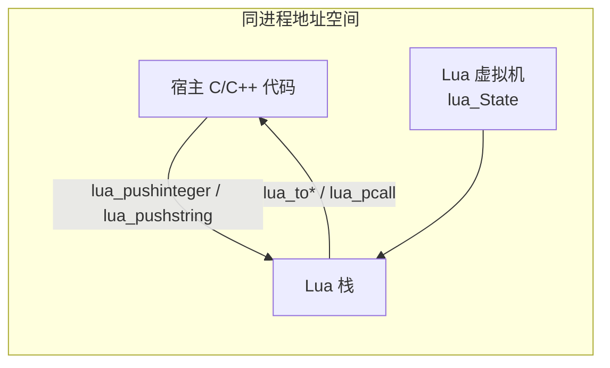

# Lua C API 与栈模型

> 所属计划: [[plan|C 系语言互操作与编译学习计划]]
> 预计耗时: 90 min
> 前置知识: [[01-compilation-models|第 01 节：跨语言通信全景与三种编译模型]]、[[02-abi-calling-conventions|第 02 节：ABI、调用约定与符号导出]]

---

## 1. 概念讲解

Lua 与 C/C++/C# 等宿主的互操作，全部建立在 **Lua C API** 之上。它是一套 C 语言头文件/库接口（`lua.h`、`lauxlib.h`、`lualib.h`），宿主进程通过它创建并驱动一个 Lua 虚拟机实例 `lua_State*`。

本节事实依据见 [[research-brief|研究简报]] §8（Lua C API 与栈模型）与 §9（Lua 5.4 vs LuaJIT）。

### 为什么需要这个？

游戏、嵌入式系统和工具链经常把 Lua 当作**可热更的配置/逻辑层**：把不变的核心算法放在 C/C++ 里追求性能，把会频繁调整的业务规则、AI 行为、UI 事件流写成 Lua 脚本，运行时动态加载。

要让宿主“听得懂”Lua、让 Lua“调得到”宿主函数，就需要一座严格定义的桥梁。Lua C API 就是这座桥——它规定了：

- 宿主如何创建 Lua 状态机、加载标准库、执行脚本；
- 如何把 C 函数注册成 Lua 可以调用的模块；
- 如何在两种语言的内存模型之间安全地传递数据。

不理解这座桥，后续学习 LuaBridge、sol2、xLua、LuaJIT FFI 时，只会停留在“调 API”的层面，无法排查栈泄漏、`longjmp` 崩溃、GC 桥失效等真实问题。

### 核心思想

#### 1.1 一切都是栈

Lua 与宿主**共享同一个进程地址空间**，但**不共享对象指针或直接内存视图**。所有跨语言数据交换都通过 `lua_State*` 的**栈**完成：宿主把值压入栈，Lua 从栈读取；Lua 把返回值压入栈，宿主从栈读取。

可以把栈理解为一个“通用转换台”：C 的 `int`、指针、字符串，Lua 的 number、string、function、table，都必须先放到台上，才能被另一端取走。



栈索引有两种约定：

| 索引 | 方向 | 说明 |
|------|------|------|
| 正数 `1..n` | 自底向上 | `1` 是栈底（第一个压入的元素），`n` 是栈顶 |
| 负数 `-1` | 自顶向下 | `-1` 永远是栈顶，`-2` 是栈顶倒数第二个 |

例如，压入 `42` 再压入 `"hello"` 后：

| 索引（正） | 索引（负） | 值 |
|-----------|-----------|-----|
| 1 | -2 | `42` |
| 2 | -1 | `"hello"` |

> [!tip]
> 读取参数时常用正索引（因为参数顺序固定），读取结果时常用 `-1`（因为返回值总在栈顶）。

#### 1.2 压入、读取、弹出

Lua C API 提供了一组对称操作。下面是与基础类型相关的常用函数：

| 操作 | API |
|------|-----|
| 压入整数 | `lua_pushinteger(L, v)` |
| 压入浮点数 | `lua_pushnumber(L, v)` |
| 压入字符串 | `lua_pushstring(L, s)` / `lua_pushlstring(L, s, len)` |
| 压入布尔值 | `lua_pushboolean(L, v)` |
| 压入 nil | `lua_pushnil(L)` |
| 压入 C 函数 | `lua_pushcfunction(L, f)` |
| 压入 light userdata | `lua_pushlightuserdata(L, p)` |
| 读取值 | `lua_tointeger(L, i)`、`lua_tonumber(L, i)`、`lua_tostring(L, i)` |
| 带类型检查读取 | `luaL_checkinteger(L, i)`、`luaL_checkstring(L, i)` 等 |
| 弹出栈顶 | `lua_pop(L, n)` |

`lua_to*` 在类型不匹配时返回默认值（例如 `lua_tointeger` 返回 `0`），但不会报错；`luaL_check*` 在类型错误时会抛出 Lua 错误，因此**只能在受保护调用（`lua_pcall`）内部或被 Lua 主动调用的 C 函数里使用**。

#### 1.3 把 C 函数暴露给 Lua

C 函数想被 Lua 调用，必须满足固定签名：

```c
int function_name(lua_State* L);
```

- 参数只有 `L`；
- 通过 `luaL_check*` 读取栈上的参数；
- 通过 `lua_push*` 把返回值压回栈；
- `return N` 表示向 Lua 返回 `N` 个值（Lua 支持多返回值）。

注册方式通常用 `luaL_Reg` 数组 + `luaL_newlib`：

```c
static int l_add(lua_State* L) {
    lua_Integer a = luaL_checkinteger(L, 1);
    lua_Integer b = luaL_checkinteger(L, 2);
    lua_pushinteger(L, a + b);
    return 1;
}

static const luaL_Reg mymath_lib[] = {
    {"add", l_add},
    {NULL, NULL}
};

int luaopen_mymath(lua_State* L) {
    luaL_newlib(L, mymath_lib);
    return 1;
}
```

编译成动态库后，Lua 里执行 `local m = require("mymath"); print(m.add(3, 4))` 即可调用。`luaopen_mymath` 是 `require` 寻找的入口函数名，规则为 `luaopen_<模块名>`。

#### 1.4 从 C 调用 Lua 函数

基本流程是：把函数压栈 → 压入参数 → 用 `lua_pcall` 受保护调用。

```c
lua_getglobal(L, "foo");      // 把全局函数 foo 压栈
lua_pushinteger(L, 10);       // 参数 #1
lua_pushinteger(L, 20);       // 参数 #2
int rc = lua_pcall(L, 2, 1, 0); // 2 个参数，1 个返回值，无错误处理函数
if (rc != LUA_OK) {
    fprintf(stderr, "error: %s\n", lua_tostring(L, -1));
    lua_pop(L, 1);
}
```

`lua_pcall` 的四个参数分别是：状态机、参数个数、返回值个数、消息处理函数在栈中的索引。返回值 `rc` 为 `LUA_OK` 表示成功，否则栈顶是一个错误字符串。

#### 1.5 红线：Lua `error()` 与 `longjmp`

> [!danger] 绝不能让 Lua 错误飞过含 C++ 析构的栈帧
> Lua 的 `error()` 在 C 侧通常用 `longjmp` 实现。`longjmp` 会**跳过中间所有 C++ 栈对象的析构函数**，导致资源泄漏、RAII 失效，行为未定义。因此从 C/C++ 调用 Lua 时，**永远使用 `lua_pcall`**，把错误捕获在 Lua 侧，不要让 `longjmp` 跳到上层 C++ 栈帧。

同样，C++ 异常也**不能**抛过 Lua 边界。如果 C 扩展函数里抛出了 C++ 异常，而 Lua 是用 C 编译/以 `longjmp` 处理错误的，程序可能直接崩溃。

#### 1.6 Lua 5.4 vs LuaJIT 简表

| 维度 | Lua 5.4（官方 PUC Lua） | LuaJIT 2.1 |
|------|------------------------|------------|
| 基于语言版本 | 5.4 | 5.1 + 少量 5.2/5.3 特性 |
| 执行方式 | 字节码解释 | 字节码解释 + JIT 编译为机器码 |
| 性能 | 基线 | 数值密集场景通常快 10–100 倍 |
| FFI | 无 | 有，通过 `ffi.cdef` / `ffi.load` 直接调 C |
| 维护状态 | 活跃 | 维护中，游戏/嵌入式仍大量使用 |
| 64 位整数 | 原生 `integer` 子类型 | 由 `lua_Number`（`double`）承载 |

> [!note]
> 国内 Unity 热更新方案（xLua / toLua / slua）通常基于 LuaJIT 或 Lua 5.3/5.4。iOS 等禁止 JIT 的平台会回退到解释模式。

---

## 2. 代码示例

### 示例 1：C 宿主内嵌 Lua

下面的 `embed_lua.c` 创建一个 Lua 状态机，执行 `return 6 * 7`，然后从栈顶读取整数结果。

```c
// embed_lua.c
// 运行环境：Lua 5.3 / 5.4（PUC Lua）
#include <stdio.h>
#include <lua.h>
#include <lualib.h>
#include <lauxlib.h>

int main(void)
{
    lua_State* L = luaL_newstate();
    if (!L) {
        fprintf(stderr, "failed to create Lua state\n");
        return 1;
    }

    luaL_openlibs(L);

    const char* script = "return 6 * 7";
    int rc = luaL_dostring(L, script);
    if (rc != LUA_OK) {
        fprintf(stderr, "Lua error: %s\n", lua_tostring(L, -1));
        lua_pop(L, 1);
        lua_close(L);
        return 1;
    }

    // 返回值在栈顶 (-1)
    lua_Integer result = lua_tointeger(L, -1);
    printf("Result: %lld\n", (long long)result);

    lua_pop(L, 1);
    lua_close(L);
    return 0;
}
```

**运行方式：**

Windows（MSVC，VS 2022 x64 Native Tools Command Prompt，假设 Lua 安装在 `C:\lua54`）：

```bash
cl embed_lua.c /I C:\lua54\include /link C:\lua54\lib\lua54.lib
embed_lua.exe
```

Linux（GCC，Debian/Ubuntu 已安装 `liblua5.4-dev`）：

```bash
gcc -o embed_lua embed_lua.c -I/usr/include/lua5.4 -llua5.4 -lm -ldl
./embed_lua
```

> [!note]
> 如果使用 Lua 5.3，把命令中的 `lua5.4` 替换为 `lua5.3`，并把 `lua54.lib` 替换为对应的 5.3 库文件名。

**预期输出：**

```text
Result: 42
```

### 示例 2：C 扩展模块

下面实现一个最小的 C 扩展 `mymath`，向 Lua 暴露 `add(a, b)`。

```c
// l_mymath.c
#include <lua.h>
#include <lauxlib.h>

static int l_add(lua_State* L)
{
    lua_Integer a = luaL_checkinteger(L, 1);
    lua_Integer b = luaL_checkinteger(L, 2);
    lua_pushinteger(L, a + b);
    return 1; // 返回 1 个值
}

static const luaL_Reg mymath_lib[] = {
    {"add", l_add},
    {NULL, NULL}
};

int luaopen_mymath(lua_State* L)
{
    luaL_newlib(L, mymath_lib);
    return 1;
}
```

```cmake
# CMakeLists.txt
# 运行环境：CMake 3.15+，MSVC 或 GCC/Clang，Lua 5.3/5.4

cmake_minimum_required(VERSION 3.15)
project(mymath C)
set(CMAKE_C_STANDARD 11)

set(LUA_INCLUDE_DIR "" CACHE PATH "Lua headers directory")
set(LUA_LIBRARY "" CACHE PATH "Lua import library (Windows) or shared library")

add_library(mymath SHARED l_mymath.c)
target_include_directories(mymath PRIVATE ${LUA_INCLUDE_DIR})
target_link_libraries(mymath PRIVATE ${LUA_LIBRARY})

# Linux 默认会加 lib 前缀，但 require("mymath") 期望 mymath.so
set_target_properties(mymath PROPERTIES
    PREFIX ""
    POSITION_INDEPENDENT_CODE ON
)
```

```lua
-- test.lua
local mymath = require("mymath")
print(mymath.add(3, 4))
```

**运行方式：**

Windows：

```bash
mkdir build && cd build
cmake .. -A x64 -DLUA_INCLUDE_DIR=C:\lua54\include -DLUA_LIBRARY=C:\lua54\lib\lua54.lib
cmake --build . --config Release
cd ..
set LUA_CPATH=build\Release\?.dll
lua test.lua
```

Linux：

```bash
mkdir build && cd build
cmake .. -DLUA_INCLUDE_DIR=/usr/include/lua5.4 -DLUA_LIBRARY=/usr/lib/x86_64-linux-gnu/liblua5.4.so
cmake --build .
cd ..
export LUA_CPATH="build/?.so;;"
lua test.lua
```

> [!note]
> `LUA_CPATH` 里的 `?` 会被模块名替换，`;;` 保留默认路径。Windows 上如果 `mymath.dll` 与 `test.lua` 在同一目录，也可以不设置 `LUA_CPATH`，直接 `lua test.lua`。

**预期输出：**

```text
7
```

---

## 3. 练习

### 练习 1: C 宿主加载 Lua 文件并调用多返回值函数

创建一个 `add.lua`，里面定义一个函数：

```lua
function add_and_stats(a, b)
    return a + b, a - b
end
```

然后写一个 C 程序 `call_lua.c`，加载该文件，调用 `add_and_stats(10, 3)`，并用 `lua_pcall` 安全地取出两个返回值打印。要求使用 `lua_pcall`，并在出错时打印错误信息。

### 练习 2: 暴露返回多个值的 C 函数

在 `l_mymath.c` 的基础上新增一个 `minmax(a, b)` 函数：当 `a < b` 时返回 `a, b`，否则返回 `b, a`。把它注册到 `mymath` 模块中，然后写 Lua 脚本 `test_minmax.lua` 验证 `mymath.minmax(7, 2)` 输出 `2 7`。

### 练习 3: 分析 `longjmp` 与 RAII 的冲突

下面这段 C++ 代码试图直接调用 Lua 函数，存在什么风险？请解释为什么会产生资源泄漏或未定义行为，并给出使用 `lua_pcall` 修复后的版本。

```cpp
#include <lua.hpp>
#include <cstdio>
#include <memory>

struct Resource {
    Resource()  { std::puts("Resource acquired"); }
    ~Resource() { std::puts("Resource released"); }
};

void call_boom(lua_State* L)
{
    Resource r;                 // C++ 栈对象
    lua_getglobal(L, "boom");   // 压入 Lua 函数
    lua_call(L, 0, 0);          // 未受保护调用
}

int main()
{
    lua_State* L = luaL_newstate();
    luaL_openlibs(L);
    luaL_dostring(L, "function boom() error('boom!') end");
    call_boom(L);
    lua_close(L);
    return 0;
}
```

---

## 3.5 参考答案

> 参考答案不是唯一解——如果你的实现通过了测试或达到了题目要求，就是正确的。

> [!tip]- 练习 1 参考答案
> ```c
> // call_lua.c
> #include <stdio.h>
> #include <lua.h>
> #include <lualib.h>
> #include <lauxlib.h>
>
> int main(void)
> {
>     lua_State* L = luaL_newstate();
>     luaL_openlibs(L);
>
>     if (luaL_loadfile(L, "add.lua") != LUA_OK || lua_pcall(L, 0, 0, 0) != LUA_OK) {
>         fprintf(stderr, "load error: %s\n", lua_tostring(L, -1));
>         lua_pop(L, 1);
>         lua_close(L);
>         return 1;
>     }
>
>     lua_getglobal(L, "add_and_stats");
>     lua_pushinteger(L, 10);
>     lua_pushinteger(L, 3);
>
>     int rc = lua_pcall(L, 2, 2, 0); // 2 参数，2 返回值
>     if (rc != LUA_OK) {
>         fprintf(stderr, "call error: %s\n", lua_tostring(L, -1));
>         lua_pop(L, 1);
>         lua_close(L);
>         return 1;
>     }
>
>     // 先压入的返回值在 -2，后压入的在 -1
>     lua_Integer sum  = lua_tointeger(L, -2);
>     lua_Integer diff = lua_tointeger(L, -1);
>     printf("sum = %lld, diff = %lld\n", (long long)sum, (long long)diff);
>
>     lua_pop(L, 2);
>     lua_close(L);
>     return 0;
> }
> ```
> 编译运行后预期输出：
> ```text
> sum = 13, diff = 7
> ```

> [!tip]- 练习 2 参考答案
> ```c
> // l_mymath.c（新增 minmax）
> #include <lua.h>
> #include <lauxlib.h>
>
> static int l_add(lua_State* L)
> {
>     lua_Integer a = luaL_checkinteger(L, 1);
>     lua_Integer b = luaL_checkinteger(L, 2);
>     lua_pushinteger(L, a + b);
>     return 1;
> }
>
> static int l_minmax(lua_State* L)
> {
>     lua_Integer a = luaL_checkinteger(L, 1);
>     lua_Integer b = luaL_checkinteger(L, 2);
>     if (a < b) {
>         lua_pushinteger(L, a);
>         lua_pushinteger(L, b);
>     } else {
>         lua_pushinteger(L, b);
>         lua_pushinteger(L, a);
>     }
>     return 2; // 返回 2 个值
> }
>
> static const luaL_Reg mymath_lib[] = {
>     {"add", l_add},
>     {"minmax", l_minmax},
>     {NULL, NULL}
>};
>
> int luaopen_mymath(lua_State* L)
> {
>     luaL_newlib(L, mymath_lib);
>     return 1;
> }
> ```
> ```lua
> -- test_minmax.lua
> local mymath = require("mymath")
> local lo, hi = mymath.minmax(7, 2)
> print(lo, hi)
> ```
> 运行 `lua test_minmax.lua` 预期输出：
> ```text
> 2	7
> ```

> [!tip]- 练习 3 参考答案
> 这段代码在 `call_boom` 里创建了一个 C++ 栈对象 `Resource r`。随后 `lua_call(L, 0, 0)` 调用 Lua 函数 `boom`，而 `boom` 内部调用了 `error('boom!')`。在官方 Lua 中，`error()` 对 C 代码的实现方式是 `longjmp`——它会直接跳回到上层的 `lua_pcall` / `lua_pcallk` 恢复点，或者如果没有保护点，就调用 panic 函数并终止程序。
>
> 因为 `longjmp` 不遵循 C++ 的栈展开语义，`Resource` 的析构函数**不会执行**，`"Resource released"` 不会被打印，导致资源泄漏甚至更严重的未定义行为。
>
> 修复方案：把 `lua_call` 改成 `lua_pcall`，在 C++ 侧捕获 Lua 错误，让 `longjmp` 的目标点仍然停留在 `call_boom` 内部或更上层但**不跨越含 RAII 对象的栈帧**。修改后的 `call_boom` 如下：
> ```cpp
> void call_boom(lua_State* L)
> {
>     Resource r;
>     lua_getglobal(L, "boom");
>     int rc = lua_pcall(L, 0, 0, 0);
>     if (rc != LUA_OK) {
>         fprintf(stderr, "caught Lua error: %s\n", lua_tostring(L, -1));
>         lua_pop(L, 1);
>     }
> }
> ```
> 此时即使 `boom` 出错，`lua_pcall` 会在 Lua 虚拟机内部完成 `longjmp` 恢复，然后以错误码形式返回；C++ 函数正常返回，`Resource` 的析构函数正确执行。

---

## 4. 扩展阅读

- [Lua 5.4 Reference Manual](https://www.lua.org/manual/5.4/manual.html) —— 官方 C API 文档，权威参考
- [Programming in Lua（第 4 版）- C API 章节](https://www.lua.org/pil/) —— Roberto Ierusalimschy 的经典教材
- [LuaJIT FFI documentation](https://luajit.org/ext_ffi.html) —— LuaJIT 零绑定调用 C 的文档
- [LuaBridge Reference Manual](https://vinniefalco.github.io/LuaBridge/Manual.html) —— 下一节会涉及的现代 C++ 绑定库
- [sol2 documentation](https://sol2.readthedocs.io/) —— 另一款流行的现代 C++ Lua 绑定库
- [xLua GitHub](https://github.com/Tencent/xLua) —— Unity C# ↔ Lua 热更新方案源码
- [NLua GitHub](https://github.com/NLua/NLua) —— .NET 对 Lua C API 的 P/Invoke 封装

---

## 常见陷阱

- **忘用 `lua_pcall`，让 Lua `error()` 跨过 C++ 析构栈帧**。正确做法：所有从 C/C++ 发起的 Lua 调用都用 `lua_pcall` 包起来，捕获错误码和错误信息，绝不让 `longjmp` 越过 RAII 对象。

- **栈不平衡：压入值后忘记 `lua_pop`**。C 扩展函数返回前、读取完返回值后，都要保证栈回到预期高度。正确做法：养成“每有一个 `push` 就规划好何时 `pop`”的习惯，复杂逻辑可用 `lua_gettop` / `lua_settop` 辅助检查。

- **C++ 异常跨 Lua 边界**。如果在 `lua_CFunction` 里抛出 C++ 异常，而 Lua 使用 C 错误处理机制，会导致未定义行为或崩溃。正确做法：C 扩展函数内部捕获所有 C++ 异常，转换成 Lua 错误（`luaL_error`）或错误码。

- **Lua 5.4 整数子类型与 LuaJIT `double` 的语义差异**。在 Lua 5.4 中 `lua_Integer` 是独立的 64 位整数类型，整数运算不会丢失精度；LuaJIT 的 number 本质是 `double`，64 位整数超过 2^53 时会有精度问题。正确做法：热更新/跨 Lua 实现共享的代码中，不要把超过 2^53 的大整数当作 number 传递。

- **`require` 找不到模块**。Windows 下 `?.dll`、Linux 下 `?.so` 的路径需要与 `LUA_CPATH` 匹配，且模块入口函数必须严格命名为 `luaopen_<模块名>`。正确做法：先用 `package.cpath` 确认搜索路径，再用 `nm` / `dumpbin /exports` 检查动态库导出符号。
