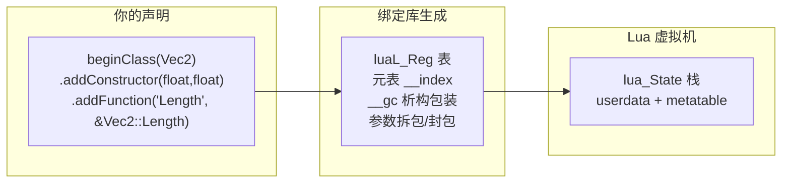

# 现代 C++ Lua 绑定：LuaBridge 与 sol2

> 所属计划: [[plan|C 系语言互操作与编译学习计划]]
> 预计耗时: 75 min
> 前置知识: [[08-lua-c-api-stack|第 08 节：Lua C API 与栈模型]]

---

## 1. 概念讲解

[[research-brief|研究简报]] §10 把 LuaBridge 与 sol2 定位为"现代 C++ Lua 绑定"的两个主流方案。它们都站在 `lua_State` 栈模型之上，用 C++ 模板把手工注册代码压缩成一行声明。本节先理解为什么需要这层包装，再对比两者的风格与适用场景。

### 为什么需要这个？

用纯 Lua C API 把一个 C++ 类暴露给 Lua，需要手写大量样板：

- 为构造函数写一个 `lua_CFunction`，手动读参数、调 `new`、把 userdata 挂到栈上。
- 为每个成员函数写一个 thunk，手动拆 `this` 指针、转换参数、压回返回值。
- 处理继承、常量、运算符重载、GC 析构时，样板呈指数增长。
- 一旦参数类型写错，Lua 侧的 `nil` 或字符串可能被 `reinterpret_cast` 成错误类型，导致未定义行为。

绑定库解决的核心问题是：**用声明式 API 替代手写 `lua_pushcfunction` 样板**，让编译器在编译期生成这些 thunk。

### 核心思想

绑定库本质上是一个"代码生成器"——它用 C++ 模板元编程读取你的类签名，自动产出符合 Lua C API 的注册表、元方法（`__index`、`__gc`、`__tostring` 等）和调用转发函数。



对宿主语言来说，Lua 仍然只看到 userdata 和 metatable；绑定库只是帮你把 C++ 的类、函数、命名空间映射成 Lua 能消费的表和调用约定。

### LuaBridge

LuaBridge 是 header-only、单 `#include` 即可使用的轻量库，零额外依赖（只需要 Lua 头文件和库）。它的典型用法是链式调用：

```cpp
luabridge::getGlobalNamespace(L)
    .beginNamespace("math")
        .beginClass<Vec2>("Vec2")
            .addConstructor<void(*)(float, float)>()
            .addFunction("Length", &Vec2::Length)
            .addFunction("Add",    &Vec2::Add)
        .endClass()
    .endNamespace();
```

Lua 侧即可：

```lua
local v = math.Vec2(3, 4)
print(v:Length())   -- 5
```

特点：

- 单头文件（`LuaBridge.h`），集成成本最低。
- API 风格稳定、保守，适合不想被现代 C++ 特性绑架的项目。
- 支持类、继承、函数重载、属性、命名空间、多种生命周期策略。

### sol2

sol2 是更现代的绑定库，依赖 C++14/17，表达力极强。它把整个 Lua 状态封装成 `sol::state`：

```cpp
sol::state lua;
lua.open_libraries(sol::lib::base);

lua.new_usertype<Vec2>("Vec2",
    sol::constructors<Vec2(float, float)>(),
    "Length", &Vec2::Length,
    "Add",    &Vec2::Add
);
```

特点：

- 支持 overload、coroutine、表操作、异常桥接、模块系统等高级特性。
- 文档详尽，社区活跃，性能优化好。
- 模板元编程更重，编译时间明显比 LuaBridge 长。
- 适合新项目、需要丰富表达能力或对性能有较高要求的场景。

### 对比与选型

| 维度 | LuaBridge | sol2 | 手写 C API |
|------|-----------|------|-----------|
| 集成成本 | 最低（一个头） | 低（头 + 配置） | 最高 |
| 表达力 | 够用 | 丰富 | 全手动 |
| 性能 | 好 | 很好（有优化） | 取决于实现 |
| 编译期 | 模板 | 重模板，编译慢 | 无 |
| 适合场景 | 轻量、稳定 | 新项目、追求表达力 | 学习、极致控制 |

> [!note]
> 本表与 [[research-brief|研究简报]] §10.4 一致。选型没有绝对优劣：想要"下载一个头就能编译"选 LuaBridge；想要 lambda、overload、coroutine 等现代特性选 sol2。

---

## 2. 代码示例

下面两个示例都暴露同一个 `Vec2` 类，运行同一行 Lua 代码，方便你直接对比两种库的写法。

```cpp
// Vec2.hpp —— 两个示例共用
#pragma once
#include <cmath>

class Vec2 {
public:
    float x, y;

    Vec2(float x_, float y_) : x(x_), y(y_) {}

    float Length() const {
        return std::sqrt(x * x + y * y);
    }

    Vec2 Add(const Vec2& other) const {
        return Vec2(x + other.x, y + other.y);
    }
};
```

### 示例 1：用 LuaBridge 暴露 `Vec2`

#### 完整代码

```cpp
// main_luabridge.cpp
#include <iostream>
#include <lua.hpp>                       // Lua 5.4 C API
#include <LuaBridge/LuaBridge.h>         // LuaBridge 头文件
#include "Vec2.hpp"

int main() {
    lua_State* L = luaL_newstate();
    luaL_openlibs(L);

    using namespace luabridge;

    getGlobalNamespace(L)
        .beginClass<Vec2>("Vec2")
            .addConstructor<void(*)(float, float)>()
            .addFunction("Length", &Vec2::Length)
            .addFunction("Add",    &Vec2::Add)
        .endClass();

    const char* script = R"lua(
        v = Vec2(3, 4)
        print(v:Length())
    )lua";

    if (luaL_dostring(L, script) != LUA_OK) {
        std::cerr << "Lua error: " << lua_tostring(L, -1) << std::endl;
        lua_pop(L, 1);
    }

    lua_close(L);
    return 0;
}
```

#### 项目文件

```cmake
# CMakeLists.txt (LuaBridge)
cmake_minimum_required(VERSION 3.20)
project(lua_bridge_luabridge CXX)
set(CMAKE_CXX_STANDARD 17)

# 1. 找到系统 Lua 5.4
find_package(Lua 5.4 REQUIRED)

# 2. 下载 LuaBridge（header-only）
include(FetchContent)
FetchContent_Declare(
    LuaBridge
    GIT_REPOSITORY https://github.com/vinniefalco/LuaBridge.git
    GIT_TAG        3.0
)
FetchContent_MakeAvailable(LuaBridge)

add_executable(demo_luabridge main_luabridge.cpp Vec2.hpp)
target_link_libraries(demo_luabridge PRIVATE ${LUA_LIBRARIES})
target_include_directories(demo_luabridge PRIVATE ${LUA_INCLUDE_DIR} ${luabridge_SOURCE_DIR}/Source)
```

#### 运行方式

**环境要求**：CMake 3.20+、C++17 编译器、Lua 5.4 开发库、网络（首次下载 LuaBridge）。

**Windows（Visual Studio 2022 + vcpkg）**：

```bash
vcpkg install lua:x64-windows
mkdir build && cd build
cmake .. -DCMAKE_TOOLCHAIN_FILE=C:/vcpkg/scripts/buildsystems/vcpkg.cmake
cmake --build . --config Release
.\Release\demo_luabridge.exe
```

**Linux（Ubuntu/Debian）**：

```bash
sudo apt update
sudo apt install liblua5.4-dev build-essential cmake
mkdir build && cd build
cmake ..
cmake --build .
./demo_luabridge
```

#### 预期输出

```text
5
```

---

### 示例 2：用 sol2 暴露 `Vec2`

#### 完整代码

```cpp
// main_sol2.cpp
#include <iostream>
#include <sol/sol.hpp>   // sol2 头文件
#include "Vec2.hpp"

int main() {
    sol::state lua;
    lua.open_libraries(sol::lib::base);

    lua.new_usertype<Vec2>("Vec2",
        sol::constructors<Vec2(float, float)>(),
        "Length", &Vec2::Length,
        "Add",    &Vec2::Add
    );

    const char* script = R"lua(
        v = Vec2(3, 4)
        print(v:Length())
    )lua";

    sol::protected_function_result result = lua.safe_script(script);
    if (!result.valid()) {
        sol::error err = result;
        std::cerr << "Lua error: " << err.what() << std::endl;
    }

    return 0;
}
```

#### 项目文件

```cmake
# CMakeLists.txt (sol2)
cmake_minimum_required(VERSION 3.20)
project(lua_bridge_sol2 CXX)
set(CMAKE_CXX_STANDARD 17)

# 1. 找到系统 Lua 5.4
find_package(Lua 5.4 REQUIRED)

# 2. 下载 sol2
include(FetchContent)
FetchContent_Declare(
    sol2
    GIT_REPOSITORY https://github.com/ThePhD/sol2.git
    GIT_TAG        v3.3.1
)
FetchContent_MakeAvailable(sol2)

add_executable(demo_sol2 main_sol2.cpp Vec2.hpp)
target_link_libraries(demo_sol2 PRIVATE sol2::sol2 ${LUA_LIBRARIES})
target_include_directories(demo_sol2 PRIVATE ${LUA_INCLUDE_DIR} ${sol2_SOURCE_DIR}/include)
```

#### 运行方式

**环境要求**：与示例 1 相同；sol2 也只需要 Lua 5.4 和标准 C++17。

**Windows（Visual Studio 2022 + vcpkg）**：

```bash
vcpkg install lua:x64-windows
mkdir build && cd build
cmake .. -DCMAKE_TOOLCHAIN_FILE=C:/vcpkg/scripts/buildsystems/vcpkg.cmake
cmake --build . --config Release
.\Release\demo_sol2.exe
```

**Linux（Ubuntu/Debian）**：

```bash
sudo apt update
sudo apt install liblua5.4-dev build-essential cmake
mkdir build && cd build
cmake ..
cmake --build .
./demo_sol2
```

#### 预期输出

```text
5
```

> [!tip]
> 两个示例的运行方式几乎一致，区别只在 C++ 侧注册代码。这正体现了绑定库的价值：宿主工程结构和 Lua 脚本可以复用，只需切换 C++ 胶水层。

---

## 3. 练习

### 练习 1: 用 LuaBridge 暴露 `Player` 类

定义一个 `Player` 类：

```cpp
class Player {
public:
    std::string name;
    int hp;

    Player(std::string name_, int hp_) : name(name_), hp(hp_) {}

    void Move(float dx, float dy);
    void Hit(int damage);
    std::string Print() const;
};
```

要求：

1. 用 LuaBridge 把 `Player` 注册到 Lua 全局命名空间（类名 `Player`）。
2. 暴露构造函数 `Player(name, hp)`、成员函数 `Move`、`Hit`、`Print`，以及成员变量 `name`、`hp`。
3. 在 C++ 宿主中执行一段 Lua 脚本：创建一名玩家、调用 `Move`、调用 `Hit`、打印 `Print()` 的结果。

### 练习 2: 用 sol2 重做练习 1

把练习 1 的绑定层改成 sol2，保持 `Player` 类定义和 Lua 脚本不变。对比两种库的代码量与可读性。

### 练习 3: 分析绑定库的类型安全风险

下面是一段 LuaBridge 风格的注册代码（示意）：

```cpp
getGlobalNamespace(L)
    .beginClass<Weapon>("Weapon")
        .addFunction("Damage", &Weapon::Damage)   // C++ 侧签名: int Damage(int)
    .endClass();
```

Lua 脚本误写为：

```lua
w = Weapon()
print(w:Damage(nil))   -- 传了 nil，但 C++ 期望 int
```

请分析：

1. 绑定库通常为什么不在这里做运行时类型检查？
2. 这会导致什么后果（从 `lua_tointeger`、`reinterpret_cast`、UB 角度说明）？
3. 如果确实需要校验，应该在哪儿加、用什么风格（`luaL_check*` 风格）？

---

## 3.5 参考答案

> 参考答案不是唯一解——如果你的实现通过了测试或达到了题目要求，就是正确的。

> [!tip]- 练习 1 参考答案
> ```cpp
> // Player.hpp
> #pragma once
> #include <string>
>
> class Player {
> public:
>     std::string name;
>     int hp;
>
>     Player(std::string name_, int hp_) : name(name_), hp(hp_) {}
>
>     void Move(float dx, float dy) {
>         // 仅作演示：记录移动
>         (void)dx;
>         (void)dy;
>     }
>
>     void Hit(int damage) {
>         hp -= damage;
>         if (hp < 0) hp = 0;
>     }
>
>     std::string Print() const {
>         return name + ": HP = " + std::to_string(hp);
>     }
> };
> ```
> ```cpp
> // main_player_luabridge.cpp
> #include <iostream>
> #include <lua.hpp>
> #include <LuaBridge/LuaBridge.h>
> #include "Player.hpp"
>
> int main() {
>     lua_State* L = luaL_newstate();
>     luaL_openlibs(L);
>
>     using namespace luabridge;
>     getGlobalNamespace(L)
>         .beginClass<Player>("Player")
>             .addConstructor<void(*)(std::string, int)>()
>             .addFunction("Move",  &Player::Move)
>             .addFunction("Hit",   &Player::Hit)
>             .addFunction("Print", &Player::Print)
>             .addData("name", &Player::name)
>             .addData("hp",   &Player::hp)
>         .endClass();
>
>     const char* script = R"lua(
>         p = Player("Hero", 100)
>         p:Move(1.0, 2.0)
>         p:Hit(25)
>         print(p:Print())
>         print("Name:", p.name)
>     )lua";
>
>     if (luaL_dostring(L, script) != LUA_OK) {
>         std::cerr << "Lua error: " << lua_tostring(L, -1) << std::endl;
>         lua_pop(L, 1);
>     }
>
>     lua_close(L);
>     return 0;
> }
> ```
> **预期输出：**
> ```text
> Hero: HP = 75
> Name:	Hero
> ```
> CMake 与示例 1 相同，只需把源文件换成 `main_player_luabridge.cpp` 和 `Player.hpp`。

> [!tip]- 练习 2 参考答案
> ```cpp
> // main_player_sol2.cpp
> #include <iostream>
> #include <sol/sol.hpp>
> #include "Player.hpp"
>
> int main() {
>     sol::state lua;
>     lua.open_libraries(sol::lib::base);
>
>     lua.new_usertype<Player>("Player",
>         sol::constructors<Player(std::string, int)>(),
>         "Move",  &Player::Move,
>         "Hit",   &Player::Hit,
>         "Print", &Player::Print,
>         "name",  &Player::name,
>         "hp",    &Player::hp
>     );
>
>     const char* script = R"lua(
>         p = Player("Hero", 100)
>         p:Move(1.0, 2.0)
>         p:Hit(25)
>         print(p:Print())
>         print("Name:", p.name)
>     )lua";
>
>     sol::protected_function_result result = lua.safe_script(script);
>     if (!result.valid()) {
>         sol::error err = result;
>         std::cerr << "Lua error: " << err.what() << std::endl;
>     }
>
>     return 0;
> }
> ```
> CMake 与示例 2 相同，只需把源文件换成 `main_player_sol2.cpp` 和 `Player.hpp`。
> **代码量对比要点：**
> - LuaBridge 需要显式 `getGlobalNamespace(L).beginClass<...>().endClass()` 链式收尾；
> - sol2 用逗号分隔的 `new_usertype` 参数列表，更短，也更接近"声明即绑定"；
> - sol2 默认提供 `safe_script`，错误处理更一体化。

> [!tip]- 练习 3 参考答案
> **1. 为什么绑定库通常不做运行时类型检查？**
> 绑定库的核心设计目标是在**编译期**把 C++ 函数签名转换成 Lua C API 调用，从而最小化运行期开销。如果在每次调用时都插入 `lua_type` 检查，会显著降低脚本调用原生函数的密度优势。因此 LuaBridge、sol2 等库通常依赖 C++ 静态类型匹配，只在转换失败或 Lua 值无法转换时抛出异常/报错，而不是对每个参数都做完整校验。
>
> **2. 传 `nil` 给期望 `int` 的参数会发生什么？**
> 在底层，绑定库生成的 thunk 会调用类似 `lua_tointeger(L, idx)` 的函数读取栈上值。`lua_tointeger` 在栈顶不是数字时**不会报错**，而是返回 `0`（或根据 Lua 规则转换）。绑定库拿到这个 `0` 后，可能通过 `static_cast` 或位等价转换传给 `Weapon::Damage(int)`。
>
> 如果绑定实现更激进地直接按 `int*` 读取栈数据（例如 `reinterpret_cast`），`nil` 的内部表示（通常是一个特殊的 tag 值）会被解释成整数，导致完全不可预期的结果。这就是 [[research-brief|研究简报]] §14.2 提到的"签名不匹配导致 UB"的典型场景。
>
> **3. 如何缓解？**
> 在需要强校验的入口，使用 `luaL_checkinteger(L, idx)` 风格：
>
> ```cpp
> static int l_Weapon_Damage(lua_State* L) {
>     Weapon* w = /* 取出 userdata */;
>     int dmg = (int)luaL_checkinteger(L, 2);  // 不是整数则抛出 Lua 错误
>     lua_pushinteger(L, w->Damage(dmg));
>     return 1;
> }
> ```
>
> 在绑定库层面，可以：
> - 对关键函数不用自动绑定，而是手写一个包装函数做 `luaL_check*`；
> - 在 sol2 中利用 `sol::readonly`、`sol::property`、自定义 `sol::as_args` 等机制做前置校验；
> - 在 Lua 侧加类型断言（`assert(type(x) == 'number')`），作为开发期防线；
> - 单元测试覆盖 `nil`、错误类型、边界值。

---

## 4. 扩展阅读

- [LuaBridge Reference Manual](https://vinniefalco.github.io/LuaBridge/Manual.html) —— LuaBridge 官方手册，包含类、继承、属性、生命周期策略。
- [sol2 documentation](https://sol2.readthedocs.io/) —— sol2 完整文档，覆盖 usertype、overload、coroutine、异常处理。
- [Lua 5.4 Reference Manual](https://www.lua.org/manual/5.4/manual.html) —— 绑定库的底层仍然是 Lua C API。
- [LuaBridge GitHub 仓库](https://github.com/vinniefalco/LuaBridge) —— 源码与示例。
- [sol2 GitHub 仓库](https://github.com/ThePhD/sol2) —— 源码、tests、benchmarks。

---

## 常见陷阱

- **签名不匹配导致 UB**：绑定库大多不在运行期检查参数类型。Lua 侧传 `nil`、字符串或数量错误的参数，可能被 `reinterpret_cast` 成错误类型，触发崩溃或静默错误。**正确做法**：对关键函数手写 `luaL_check*` 包装，或在 Lua 侧做类型断言。

- **C++ 对象生命周期与 Lua GC 的协调**：绑定到 Lua 的 C++ 对象通常以 userdata 形式存在，Lua GC 会在不可达时调用 `__gc`。如果 C++ 对象持有文件句柄、网络连接、渲染资源，必须确保 `__gc` 能正确释放；同时避免在 C++ 侧提前 `delete` 一个仍被 Lua 持有的对象。**正确做法**：让绑定库管理所有权（`new`/`delete` 配对），或在 C++ 侧用 `std::shared_ptr` 包装后再暴露给 Lua。

- **sol2 重模板导致编译变慢**：sol2 的 `new_usertype` 会实例化大量模板代码，每个新类型都会增加编译单元体积。**正确做法**：把绑定代码集中到少数 `.cpp` 文件，不要在每个头文件里展开 `sol::state` 绑定；对编译时间敏感的场景考虑预编译头或 LuaBridge。

- **头文件包含路径错误**：LuaBridge 要求 `#include <LuaBridge/LuaBridge.h>`，sol2 要求 `#include <sol/sol.hpp>`。如果 `FetchContent` 后路径没设置对，会报找不到头文件。**正确做法**：用 `target_include_directories` 显式添加 `${luabridge_SOURCE_DIR}/Source` 或链接 `sol2::sol2` 目标；首次构建前先确认 FetchContent 下载目录。

- **Lua 异常飞过 C++ 栈帧**：绑定库内部可能触发 Lua `error()`（例如 sol2 的异常桥接）。如果 C++ 侧有栈对象或 RAII 资源，被 `longjmp` 跳过会导致泄漏或 UB。**正确做法**：用 `lua_pcall` 或 `sol::protected_function_result` / `safe_script` 包住所有 Lua 调用，绝不让 Lua 错误直接飞过含 C++ 对象的栈帧。
