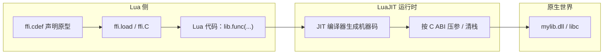

# LuaJIT FFI：零绑定调用 C

> 所属计划: [[plan|C 系语言互操作与编译学习计划]]
> 预计耗时: 60 min
> 前置知识: [[08-lua-c-api-stack|Lua C API 与栈模型]]

---

## 1. 概念讲解

LuaJIT 的 FFI（Foreign Function Interface）让 Lua 代码**直接在脚本侧声明 C 函数原型**，然后调用 C 函数或操作 C 数据结构——不需要写任何 C 绑定代码、不需要编译 Lua C 模块、不需要手动压栈出栈。它把"跨语言调用"的门槛降到了最低：只要目标库导出符合 C ABI 的符号，LuaJIT 就能在运行时把它桥接到 Lua 世界。

### 为什么需要这个？

在 [[08-lua-c-api-stack|Lua C API]] 风格中，要把一个 C 函数暴露给 Lua，需要：

1. 写一个签名固定的 `lua_Cfunction` 包装器，手动从 `lua_State*` 取参数、压结果。
2. 用 `luaL_Reg` 注册函数表。
3. 编译成动态库并放到 Lua 的模块搜索路径。
4. 在 Lua 里 `require("mylib")` 才能调用。

这套流程对大量简单函数来说非常机械，而且每次调用都要经过虚拟机栈的转换。FFI 的解决思路是：**把 C 的原型声明直接搬到 Lua 里**，由 LuaJIT 在 JIT 编译时生成最符合 C 调用约定的机器码调用——跨边界开销几乎为零。

> [!note] 与 [[09-cpp-lua-bindings|LuaBridge / sol2]] 的关系
> 绑定库帮你用 C++ 模板生成 Lua C API 代码；FFI 则跳过 C API 这层，直接让 JIT 生成原生调用。两者不冲突：复杂对象/生命周期管理仍可用绑定库，简单热路径可用 FFI 加速。

### 核心思想

#### 1.1 FFI 调用链

FFI 的核心流程只有三步：

```lua
local ffi = require("ffi")                     -- 步骤 1：加载 FFI 模块
ffi.cdef[[ int printf(const char* fmt, ...); ]] -- 步骤 2：声明 C 原型
ffi.C.printf("Hello %s!\n", "FFI")             -- 步骤 3：像调用 Lua 函数一样调 C
```

| 步骤 | 函数/语法 | 作用 |
|------|-----------|------|
| 加载 FFI | `local ffi = require("ffi")` | 获取 FFI 表，提供 `cdef`、`load`、`C` 等入口 |
| 声明原型 | `ffi.cdef[[ ... ]]` | 在 LuaJIT 内部建立 ctype / C 函数签名 |
| 调用系统库 | `ffi.C.xxx(...)` | 解析器宿主进程的 C 标准库符号（`printf`、`strlen`、`malloc` 等） |
| 加载自定义库 | `ffi.load("mylib")` | 打开 `mylib.dll` / `libmylib.so`，返回库命名空间表 |



#### 1.2 C ABI 是唯一的接口语言

FFI 只能调用**符合 C ABI 的符号**。这意味着：

- 函数必须按 C 调用约定导出（Windows 上 `__declspec(dllexport)` + `extern "C"`，Linux/macOS 上 `__attribute__((visibility("default")))` + `extern "C"`）。
- **不能直接调用 C++ 成员函数**：C++ 会重整函数名（mangling），并且成员函数需要隐式 `this` 指针、可能使用 `thiscall`，还有虚函数表（vtable）带来的间接跳转。这些都不在 C ABI 范围内。
- 如果必须调 C++ 类，先在 C++ 里包一层 `extern "C"` 的 C 接口，再由 FFI 调用。

> [!warning] FFI 不认识 C++ 名称重整
> 在 `dumpbin /exports mylib.dll` 或 `nm -D libmylib.so` 里看到 `?Add@calc@@YAHHH@Z` 或 `_ZN4calc3AddEii`，就说明符号被 C++ 重整了。FFI 无法按你写的 `lib.Add(1,2)` 找到它。

#### 1.3 ctype 与 GC 管理

`ffi.cdef` 声明的结构体、联合体、枚举、typedef 在 LuaJIT 内部会变成 **ctype**。用 ctype 构造出来的对象是"FFI 值"，由 LuaJIT 的 GC 管理其生命周期；当你把结构体传给 C 函数时，LuaJIT 会分配一块与 C 布局兼容的内存，并在不再使用时回收。

```lua
ffi.cdef[[
    typedef struct { int x, y; } Point;
    int dot(Point a, Point b);
]]
local lib = ffi.load("mylib")
print(lib.dot({x=1, y=2}, {x=3, y=4}))  -- {x=..., y=...} 自动转成 Point
```

> [!tip] 内存安全
> ctype 的内存布局由 `ffi.cdef` 里的声明决定。如果声明和真实 C 结构不一致（例如字段类型、顺序、对齐），会导致未定义行为甚至段错误。 FFI 不会替你检查，"你声明什么样，它就按什么样解释内存"。

#### 1.4 JIT 加速与平台限制

FFI 最大的优势是**可被 JIT 编译**。当一段 Lua 代码被 LuaJIT 的 tracing JIT 编译成机器码后，FFI 调用会内联为普通的 C 函数调用——几乎没有跨语言开销。这也是 FFI 比 Lua C API 绑定快一个数量级的原因。

但这也带来限制：

- **仅 LuaJIT 可用**。标准 Lua 5.4（PUC-Rio Lua）没有 FFI；在 Lua 5.4 里要调 C 只能用 Lua C API 或外部桥接库。
- **iOS 等平台禁止 JIT**。LuaJIT 在这些平台会回退到解释模式，FFI 仍然可用，但不再有 JIT 带来的零开销加速。

---

## 2. 代码示例

### 示例 1：用 `ffi.C` 调用系统库 `printf`

下面是最小可运行示例，直接在 LuaJIT 里声明并调用 C 标准库的 `printf`。

```lua
-- hello_ffi.lua
-- 运行环境：LuaJIT 2.1（Windows / Linux / macOS）

local ffi = require("ffi")

ffi.cdef[[
    int printf(const char* fmt, ...);
]]

ffi.C.printf("Hello %s!\n", "FFI")
ffi.C.printf("PI = %.4f\n", 3.1415926)
```

**运行方式：**

```bash
luajit hello_ffi.lua
```

> [!note] Windows 环境
> 在 Windows 上，请使用官方 LuaJIT 2.1 构建的 `luajit.exe`。如果 `luajit` 命令不存在，可尝试 `luajit-2.1.0-beta3.exe` 或把 LuaJIT 安装目录加入 `PATH`。

**预期输出：**

```text
Hello FFI!
PI = 3.1416
```

### 示例 2：自定义库 + FFI 与 Lua C API 性能对比

本示例包含一个 C 函数 `vec_dot`，分别用两种方式调用：

1. **FFI 方式**：`ffi.load("mylib")` 后直接调用 `vec_dot`。
2. **Lua C API 方式**：把同一个函数包装成 Lua 模块，通过 `require("mylib")` 调用。

两段 Lua 脚本各循环 `1e6` 次，比较耗时。

#### C 源码

```c
// mylib.c
// 编译为 mylib.dll（Windows）或 mylib.so（Linux）

#include <lua.h>
#include <lauxlib.h>

#ifdef _WIN32
#define API __declspec(dllexport)
#else
#define API __attribute__((visibility("default")))
#endif

#ifdef __cplusplus
extern "C" {
#endif

// 核心计算函数：导出为 C ABI 符号
API int vec_dot(int ax, int ay, int bx, int by) {
    return ax * bx + ay * by;
}

// Lua C API 包装：把 vec_dot 暴露给 Lua
static int l_vec_dot(lua_State* L) {
    int ax = (int)luaL_checkinteger(L, 1);
    int ay = (int)luaL_checkinteger(L, 2);
    int bx = (int)luaL_checkinteger(L, 3);
    int by = (int)luaL_checkinteger(L, 4);
    int r = ax * bx + ay * by;
    lua_pushinteger(L, r);
    return 1;
}

API int luaopen_mylib(lua_State* L) {
    static const luaL_Reg funcs[] = {
        {"vec_dot", l_vec_dot},
        {NULL, NULL}
    };
    luaL_newlib(L, funcs);
    return 1;
}

#ifdef __cplusplus
}
#endif
```

**编译方式（Windows，MSVC）：**

```bash
# 假设 LuaJIT 头文件在 C:\LuaJIT\include，导入库在 C:\LuaJIT\lib\lua51.lib
cl /O2 /LD /Fe:mylib.dll mylib.c /I"C:\LuaJIT\include" /link "C:\LuaJIT\lib\lua51.lib"
```

**编译方式（Windows，MinGW-w64）：**

```bash
gcc -O2 -shared -o mylib.dll mylib.c -I"/c/LuaJIT/include" -L"/c/LuaJIT" -llua51
```

**编译方式（Linux，GCC）：**

```bash
gcc -O2 -fPIC -shared -o mylib.so mylib.c -I/usr/include/luajit-2.1
```

> [!note] macOS
> macOS 上把输出名改为 `mylib.dylib`，并添加 `-undefined dynamic_lookup` 以解析 Lua 符号：`gcc -O2 -dynamiclib -o mylib.dylib mylib.c -I/usr/local/include/luajit-2.1 -undefined dynamic_lookup`。

#### FFI 调用版本

```lua
-- bench_ffi.lua
local ffi = require("ffi")

ffi.cdef[[
    int vec_dot(int ax, int ay, int bx, int by);
]]

local mylib = ffi.load("mylib")

local function bench(n)
    local start = os.clock()
    local r = 0
    for i = 1, n do
        r = mylib.vec_dot(i, i + 1, i + 2, i + 3)
    end
    return r, os.clock() - start
end

local r, t = bench(1e6)
print(string.format("FFI: result=%d time=%.4f s", r, t))
```

**运行方式：**

```bash
luajit bench_ffi.lua
```

#### Lua C API 调用版本

```lua
-- bench_capi.lua
local mylib = require("mylib")

local function bench(n)
    local start = os.clock()
    local r = 0
    for i = 1, n do
        r = mylib.vec_dot(i, i + 1, i + 2, i + 3)
    end
    return r, os.clock() - start
end

local r, t = bench(1e6)
print(string.format("C API: result=%d time=%.4f s", r, t))
```

**运行方式：**

```bash
luajit bench_capi.lua
```

**预期输出（Windows 11 / LuaJIT 2.1 / x64，示意数值）：**

```text
FFI: result=9999000000 time=0.0021 s
C API: result=9999000000 time=0.0310 s
```

> [!tip] 结果解读
> FFI 版本通常比 Lua C API 版本快一个数量级，因为循环体可以被 LuaJIT 的 tracing JIT 编译，FFI 调用被内联成普通机器码调用；而 Lua C API 版本每次调用都要经过 `lua_State` 栈的入栈、类型检查、出栈。具体倍数受平台、编译器、CPU 频率影响，但 FFI 显著更快这一结论稳定。

---

## 3. 练习

### 练习 1: 用 FFI 调用标准 C 库

用 `ffi.C` 调用 `strlen` 和 `toupper`：

1. 声明 `size_t strlen(const char* s);` 和 `int toupper(int c);`。
2. 对一个 Lua 字符串 `"Hello FFI"` 调用 `strlen`，验证返回值等于字符串长度。
3. 用 `toupper` 把 `"hello ffi"` 的每个字符转成大写并打印。

> [!note] 提示
> `toupper` 的入参和返回都是 `int`。Lua 字符串按字节处理时可以用 `s:byte(i)` 得到整数。

### 练习 2: 性能基准

写一个 benchmark：

1. 在 C 里写一个函数 `int add(int a, int b)`，编译成动态库。
2. 用 FFI 调用该函数循环 `1e6` 次。
3. 再写一个纯 Lua 函数做同样加法，循环 `1e6` 次。
4. 分别计时并解释：为什么 FFI 版本（在 JIT 生效时）接近原生速度，而纯 Lua 版本（即使被 JIT 编译）做纯整数加法其实也很快，但 FFI 在**真正做 C 工作**时仍有优势？

### 练习 3: 分析题

解释为什么 LuaJIT FFI **不能直接调用 C++ 的成员函数**。需要从以下三点展开：

1. **名称重整**：C++ 编译器如何处理重载、命名空间、类作用域。
2. **`this` 指针与调用约定**：成员函数与普通函数在参数传递上的区别。
3. **虚函数表**：调用虚成员函数为什么比调用普通 C 函数多一层间接性。

并说明：如果必须在 Lua 中调用 C++ 类，正确做法是什么？

---

## 3.5 参考答案

> 参考答案不是唯一解——如果你的实现通过了测试或达到了题目要求，就是正确的。

> [!tip]- 练习 1 参考答案
> ```lua
> -- exercise_01.lua
> local ffi = require("ffi")
>
> ffi.cdef[[
>     size_t strlen(const char* s);
>     int toupper(int c);
> ]]
>
> local s = "Hello FFI"
> print("strlen =", ffi.C.strlen(s))  -- 9
>
> local t = {}
> for i = 1, #s do
>     local c = s:byte(i)
>     table.insert(t, string.char(ffi.C.toupper(c)))
> end
> print("upper =", table.concat(t))  -- HELLO FFI
> ```
> 运行：`luajit exercise_01.lua`。
>
> 关键注意点：`toupper` 接收 `int`，所以直接把 `s:byte(i)` 的整数传进去即可；`ffi.C.strlen` 会按 C 字符串的 `\0` 终止规则计数，对普通 Lua 字符串结果与 `#s` 一致。

> [!tip]- 练习 2 参考答案
> C 库源码（只保留 `add`）：
> ```c
> #ifdef _WIN32
> #define API __declspec(dllexport)
> #else
> #define API __attribute__((visibility("default")))
> #endif
>
> #ifdef __cplusplus
> extern "C" {
> #endif
>
> API int add(int a, int b) { return a + b; }
>
> #ifdef __cplusplus
> }
> #endif
> ```
> FFI 测试脚本：
> ```lua
> -- exercise_02.lua
> local ffi = require("ffi")
> ffi.cdef[[ int add(int a, int b); ]]
> local lib = ffi.load("mylib")
>
> local function lua_add(a, b) return a + b end
>
> local function time(fn, n)
>     local start = os.clock()
>     local r = 0
>     for i = 1, n do r = fn(i, i + 1) end
>     return r, os.clock() - start
> end
>
> local r1, t1 = time(lib.add, 1e6)
> local r2, t2 = time(lua_add, 1e6)
> print(string.format("FFI add:  result=%d time=%.4f s", r1, t1))
> print(string.format("Lua add:  result=%d time=%.4f s", r2, t2))
> ```
> 解释：
> - 如果 C 函数只是做简单整数加法，FFI 与纯 Lua 的差距不会很大——因为 LuaJIT 对纯 Lua 热循环也能做很好的 JIT 优化。
> - FFI 的优势体现在 C 函数做"真正工作"时：例如访问硬件、调用系统 API、做密集数学运算、操作大块内存。这些工作一旦进入 C，就绕开了 Lua 虚拟机栈、类型检查、GC 压力。
> - 热路径应尽量减少 FFI 调用次数，一次调用处理一批数据，而不是每元素一次调用。

> [!tip]- 练习 3 参考答案
> 1. **名称重整（Name Mangling）**
>    C++ 支持函数重载、命名空间、类成员，编译器会把签名信息编码进符号名。例如 `int calc::Add(int,int)` 在 MSVC 下导出为 `?Add@calc@@YAHHH@Z`，在 Itanium ABI（GCC/Clang）下为 `_ZN4calc3AddEii`。FFI 按 C 规则查找符号 `Add`，找不到这些重整名。
>
> 2. **`this` 指针与调用约定**
>    非静态成员函数隐含一个 `this` 指针。在 MSVC x86 上常用 `thiscall`（`this` 放 `ECX`，其余参数压栈）；x64 上虽然统一了调用约定，但 `this` 仍要作为首个参数传递。FFI 声明里根本没有 `this`，无法构造正确的调用序列。
>
> 3. **虚函数表（vtable）**
>    虚函数通过对象首地址处的 vtable 指针间接跳转。调用哪个函数取决于运行时对象类型，不是固定的导出符号。FFI 无法凭一个函数声明就完成"取 vtable → 取函数指针 → 调函数"这一系列操作。
>
> 正确做法：在 C++ 里写一层 `extern "C"` 的 C 接口，把 C++ 对象的生命周期、方法调用封装成纯 C 函数，再由 FFI 调用。例如：
> ```cpp
> extern "C" API Calculator* calc_create() { return new Calculator(); }
> extern "C" API void calc_destroy(Calculator* c) { delete c; }
> extern "C" API int calc_add(Calculator* c, int a, int b) { return c->add(a, b); }
> ```
> Lua 侧用 `ffi.cdef` 声明这三个函数，并在 Lua 表中封装成对象即可。

---

## 4. 扩展阅读

- [LuaJIT FFI 官方文档](https://luajit.org/ext_ffi.html)
- [LuaJIT 2.1 性能与 FFI 设计论文](https://luajit.org/performance.html)
- [Lua 5.4 Reference Manual — C API](https://www.lua.org/manual/5.4/manual.html#4)
- [[research-brief|C 系语言互操作与编译 — 研究简报]] §11、§14
- [[08-lua-c-api-stack|Lua C API 与栈模型]]
- [[09-cpp-lua-bindings|现代 C++ Lua 绑定：LuaBridge 与 sol2]]

---

## 常见陷阱

- **仅 LuaJIT 可用**：标准 Lua 5.4 没有 FFI。如果代码需要在 PUC-Rio Lua 上运行，必须使用 Lua C API 或外部桥接库。
- **只能调 C ABI 符号**：忘记 `extern "C"` 会导致符号被 C++ 重整，FFI 找不到函数，运行时报错或崩溃。
- **声明与真实原型不一致**：`ffi.cdef` 里的签名必须和库里的真实签名完全一致。字段顺序、类型宽度、指针层级、调用约定任一错误都可能造成内存损坏。
- **在禁 JIT 的平台上无加速**：iOS 等系统禁止内存页可写可执行，LuaJIT 会回退到解释模式。FFI 仍然可以工作，但跨边界调用不再有 JIT 零开销。
- **可变参数要声明完整原型**：`printf` 必须声明为 `int printf(const char* fmt, ...);`，不能只写 `int printf(const char* fmt);`，否则 FFI 无法正确压入可变参数。
