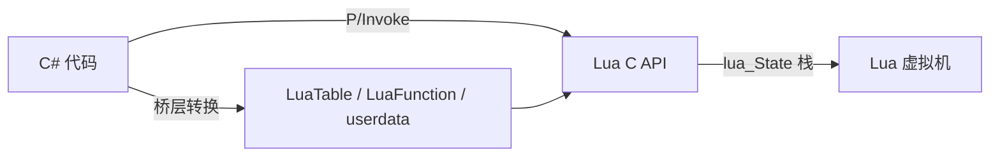

# Lua ↔ C# 通信原理与 GC 桥（NLua / MoonSharp）

> 所属计划: [[plan|C 系语言互操作与编译学习计划]]
> 预计耗时: 90 min
> 前置知识: [[04-pinvoke-in-practice|04]]、[[08-lua-c-api-stack|08]]

---

## 1. 概念讲解

把 Lua 脚本嵌进 C# 项目，最常见的问题是：脚本与宿主如何交换数据？对象生命周期由谁管理？发布时是否需要携带原生运行库？

### 为什么需要这个？

游戏、工具、自动化测试里经常需要一种轻量、可热更的脚本层；Lua 体积小、语法简单，是嵌入宿主的首选。C# 侧通过桥接库把 Lua 虚拟机纳入进程，既能让策划/用户写脚本，又能让脚本直接驱动 .NET 对象。

### 核心思想

#### 1.1 NLua：Lua C API 的 C# 封装

NLua 不重新实现 Lua 虚拟机，而是直接通过 **P/Invoke 调用 Lua 的 C API**（`lua_push*`、`lua_pcall`、`lua_tostring` 等），把 `lua_State` 的栈操作"搬"到 C# 侧管理。本质上是 **C# 对 Lua C ABI 的封装**。

数据转换在桥层完成：

| Lua 类型 | C# 侧表示 | 说明 |
|----------|-----------|------|
| number | `double` | Lua 默认数值类型为 double |
| string | `string` | 编码由 `lua.State.Encoding` 控制 |
| table | `LuaTable` | 可索引、可遍历 |
| function | `LuaFunction` | 可调用的 Lua 函数句柄 |
| userdata | .NET 对象引用 | C# 对象以 userdata 形式暴露给 Lua |

因为底层是真 Lua（5.4 / LuaJIT 等），所以行为与原生 Lua 一致，适合需要兼容现有 Lua 库或追求 LuaJIT 性能的场景。



#### 1.2 MoonSharp：纯 C# 实现的 Lua 解释器

MoonSharp 是 **100% 托管代码** 实现的 Lua 5.2 解释器，不调用任何原生 Lua 库，因此：

- **零原生依赖**：不需要 `lua54.dll`、`liblua.so` 或 KeraLua 运行时。
- **跨平台零构建成本**：只要 .NET 能跑，MoonSharp 就能跑。
- **性能低于真 Lua**：解释执行 + 额外封送层，比原生 Lua（尤其 LuaJIT）慢。

适合对部署简单性要求高、性能不极致敏感的场景，例如工具脚本、编辑器扩展、教学原型。

#### 1.3 双向互操作

两种方案都支持两个方向：

- **Lua 调 C#**：把 .NET 对象/方法注册到 Lua 全局表，Lua 脚本像调用普通表成员一样调用它们。
- **C# 调 Lua**：C# 执行 Lua 字符串（`DoString`），或获取 `LuaFunction` / `DynValue` 进行回调。

NLua 中 Lua 调用 .NET 实例方法用冒号语法 `obj:Method()`（自动传 `self`）；MoonSharp 中则需要在 C# 侧注册类型后，用点语法 `obj.Method()` 调用。

#### 1.4 方案对比

来源：[[research-brief#12.4 对比|研究简报 §12.4]]

| 方案 | Lua 实现 | 互操作机制 | 适合 |
|------|----------|-----------|------|
| NLua | 真 Lua (P/Invoke) | C API 封装 | 通用 .NET 嵌入，需要真 Lua/LuaJIT |
| MoonSharp | 纯 C# 解释器 | 无 P/Invoke | 无原生依赖、部署简单 |
| xLua | LuaJIT / Lua 5.3 | 代码生成 + 反射 + IL 注入 | Unity 热更新 |
| toLua | LuaJIT / Lua | 反射 + 生成 | Unity 热更新 |

> [!note]
> 本节聚焦 NLua 与 MoonSharp，帮助理解"真 Lua + P/Invoke"与"纯托管解释器"两条路线的差异。xLua / toLua 及其热更新机制见 [[12-xlua-hotfix|第 12 节]]。

---

## 2. 代码示例

### 示例 1：NLua 嵌入 Lua 并调用 C# 对象

下面创建一个控制台项目，用 NLua 把 `Calc` 对象注册给 Lua，然后在 Lua 脚本里调用 `Square`。

**运行环境：** .NET 8 SDK + NLua 1.7.x（NuGet 包 `NLua` 会自动拉取 `KeraLua` 及对应平台的原生 Lua 运行库）。

```xml
<!-- NLuaCalc.csproj -->
<Project Sdk="Microsoft.NET.Sdk">
  <PropertyGroup>
    <OutputType>Exe</OutputType>
    <TargetFramework>net8.0</TargetFramework>
    <Nullable>enable</Nullable>
    <ImplicitUsings>enable</ImplicitUsings>
  </PropertyGroup>

  <ItemGroup>
    <PackageReference Include="NLua" Version="1.7.3" />
  </ItemGroup>
</Project>
```

```csharp
// Program.cs
using System.Text;
using NLua;

public class Calc
{
    public int Square(int x) => x * x;
}

class Program
{
    static void Main(string[] args)
    {
        using (var lua = new Lua())
        {
            // 显式设置编码，避免 Windows 下中文乱码
            lua.State.Encoding = Encoding.UTF8;

            // 把 C# 对象注册到 Lua 全局变量 "calc"
            lua["calc"] = new Calc();

            // Lua 用冒号语法调用实例方法
            lua.DoString("print(calc:Square(6))");
        }
    }
}
```

**运行方式：**

```bash
# Windows / Linux / macOS 通用
dotnet new console -n NLuaCalc -o NLuaCalc
cd NLuaCalc
dotnet add package NLua --version 1.7.3
# 替换 Program.cs 与 csproj 后执行
dotnet run
```

> [!tip]
> NLua 需要原生 Lua 运行库。NuGet 包 `NLua` 依赖 `KeraLua`，后者包含 Windows、Linux、macOS 的预编译二进制；发布时请选择 `<RID>`（如 `dotnet publish -r win-x64 --self-contained true`）以确保原生库被打包。

**预期输出：**

```text
36
```

---

### 示例 2：MoonSharp 嵌入 Lua 并调用 C# 对象

同样实现 `Calc`，这次使用 MoonSharp。注意 MoonSharp 需要先注册类型，再用点语法调用。

**运行环境：** .NET 8 SDK + MoonSharp 2.0.x（NuGet 包 `MoonSharp`）。

```xml
<!-- MoonSharpCalc.csproj -->
<Project Sdk="Microsoft.NET.Sdk">
  <PropertyGroup>
    <OutputType>Exe</OutputType>
    <TargetFramework>net8.0</TargetFramework>
    <Nullable>enable</Nullable>
    <ImplicitUsings>enable</ImplicitUsings>
  </PropertyGroup>

  <ItemGroup>
    <PackageReference Include="MoonSharp" Version="2.0.0" />
  </ItemGroup>
</Project>
```

```csharp
// Program.cs
using MoonSharp.Interpreter;

public class Calc
{
    public int Square(int x) => x * x;
}

class Program
{
    static void Main(string[] args)
    {
        // 注册类型，允许 Lua 访问该类型的成员
        UserData.RegisterType<Calc>();

        var script = new Script();

        // 把 C# 对象注册到 Lua 全局变量 "calc"
        script.Globals["calc"] = new Calc();

        // MoonSharp 用点语法调用实例方法
        script.DoString("print(calc.Square(6))");
    }
}
```

**运行方式：**

```bash
dotnet new console -n MoonSharpCalc -o MoonSharpCalc
cd MoonSharpCalc
dotnet add package MoonSharp --version 2.0.0
# 替换 Program.cs 与 csproj 后执行
dotnet run
```

**预期输出：**

```text
36
```

#### 部署差异对比

| 项目 | NLua | MoonSharp |
|------|------|-----------|
| 原生依赖 | 需要（Lua 运行库） | 无 |
| 发布 `RID` | 建议指定，确保原生库正确复制 | 无需特殊处理 |
| 平台支持 | 依赖原生库是否提供对应平台二进制 | 任何 .NET 支持的平台 |
| 与标准 Lua 行为一致性 | 高（真 Lua） | 接近，但存在细微差异 |
| 性能 | 接近原生 Lua | 低于真 Lua，尤其低于 LuaJIT |

> [!note]
> 两个示例的最终输出都是 `36`，但部署工作量差异明显：NLua 需要关心原生库，`MoonSharp` 只需要一个 NuGet 包。

---

## 3. 练习

### 练习 1: 基础 —— 用 NLua 读取 C# `List<int>` 并求和

在 NLua 中创建一个 `List<int>`，里面放 `1, 2, 3, 4, 5`，把它注册到 Lua 全局变量 `nums`，然后在 Lua 脚本里遍历并打印总和。

要求：

1. 使用 `System.Collections.Generic.List<int>`。
2. Lua 脚本使用 `for` 循环与 `nums.Count` 访问元素。
3. 输出格式：`sum = 15`。

### 练习 2: 进阶 —— 用 MoonSharp 重做练习 1 并对比 API

用 MoonSharp 实现同样的 `List<int>` 求和，注意以下差异：

1. 必须注册 `List<int>` 类型。
2. MoonSharp 访问实例方法/属性用点语法 `.` 而非冒号语法 `:`。
3. 在注释里写出 NLua 与 MoonSharp 在对象注册、方法调用语法上的两处不同。

### 练习 3: 挑战 —— 分析 GC 桥的工作方式

当 NLua 在 Lua 侧持有 C# 对象（例如把 `Calc` 或 `List<int>` 赋给 Lua 变量）时，为什么需要"GC 桥"？请描述：

1. 问题的根源（Lua GC 与 .NET GC 的关系）。
2. 如果不做桥接，会出现哪两类错误（提前回收 / 泄漏）。
3. 桥接层的基本工作方式（用什么数据结构/句柄保持引用、如何释放）。

---

## 3.5 参考答案

> 参考答案不是唯一解——如果你的实现通过了测试或达到了题目要求，就是正确的。

> [!tip]- 练习 1 参考答案
> ```csharp
> // Program.cs
> using System.Text;
> using System.Collections.Generic;
> using NLua;
>
> class Program
> {
>     static void Main(string[] args)
>     {
>         using (var lua = new Lua())
>         {
>             lua.State.Encoding = Encoding.UTF8;
>
>             var nums = new List<int> { 1, 2, 3, 4, 5 };
>             lua["nums"] = nums;
>
>             lua.DoString(@"
>                 local sum = 0
>                 -- C# List 是 0 基索引，所以循环从 0 开始
>                 for i = 0, nums.Count - 1 do
>                     sum = sum + nums[i]
>                 end
>                 print('sum = ' .. sum)
>             ");
>         }
>     }
> }
> ```
>
> **关键说明：**
>
> - `nums.Count` 访问 C# 属性；`nums[i]` 访问 C# 索引器。
> - Lua 循环变量 `i` 在 C# 侧被转换为整数索引，因此从 `0` 开始而不是 Lua 习惯的 `1`。

> [!tip]- 练习 2 参考答案
> ```csharp
> // Program.cs
> using System.Collections.Generic;
> using MoonSharp.Interpreter;
>
> class Program
> {
>     static void Main(string[] args)
>     {
>         // 必须先注册类型，否则 MoonSharp 无法识别 List<int> 的成员
>         UserData.RegisterType<List<int>>();
>
>         var script = new Script();
>         var nums = new List<int> { 1, 2, 3, 4, 5 };
>         script.Globals["nums"] = nums;
>
>         script.DoString(@"
>             local sum = 0
>             for i = 0, nums.Count - 1 do
>                 sum = sum + nums[i]
>             end
>             print('sum = ' .. sum)
>         ");
>     }
> }
> ```
>
> **NLua 与 MoonSharp 的 API 差异：**
>
> | 项目 | NLua | MoonSharp |
> |------|------|-----------|
> | 类型注册 | 无需显式注册，直接赋值即可 | 必须调用 `UserData.RegisterType<T>()` |
> | 实例方法调用语法 | `obj:Method()`（冒号） | `obj.Method()`（点） |
> | 创建解释器 | `new Lua()` | `new Script()` |
> | 注册全局变量 | `lua["name"] = value` | `script.Globals["name"] = value` |
> | 底层实现 | 真 Lua + P/Invoke | 纯 C# 解释器 |

> [!tip]- 练习 3 参考答案
> **问题的根源**
>
> Lua 和 .NET 各有一套独立的垃圾回收器（GC）：
>
> - .NET GC 管理托管堆上的 C# 对象。
> - Lua GC 管理 Lua 虚拟机内部的 Lua 值（table、userdata、function 等）。
>
> 当 C# 对象被包装成 Lua 的 userdata 交到 Lua 侧时，Lua 看到的是一块 userdata，它不知道 userdata 背后其实是 .NET 对象；.NET GC 也看不到 Lua 侧是否还在引用这个对象。
>
> **不做桥接会出现的两类错误**
>
> 1. **提前回收（use-after-free / NullReferenceException）**：
>    C# 代码把对象赋给 Lua 后，如果 C# 侧没有保留任何引用，.NET GC 可能认为对象已不可达并回收它。此时 Lua 再访问 userdata 就会拿到无效引用。
>
> 2. **内存泄漏**：
>    C# 侧为了"保险"一直强引用对象，但 Lua 已经释放 userdata 不再使用它。由于 .NET 侧引用还在，对象永远不会被回收。
>
> **桥接层的基本工作方式**
>
> 桥接层通常维护一张表（例如 `Dictionary<int, GCHandle>` 或 `ObjectTranslator`），把 Lua userdata 与 C# 对象关联起来：
>
> 1. C# 对象传入 Lua 时，调用 `GCHandle.Alloc(obj, GCHandleType.Normal)` 获得一个句柄，阻止 .NET GC 回收该对象。
> 2. 把这个句柄存入桥接表，并把句柄或索引放进 Lua userdata。
> 3. Lua 使用对象时，通过 userdata 中的索引从桥接表取回真实 C# 对象。
> 4. 当 Lua GC 回收 userdata 时，触发 `__gc` 元方法，桥接层从表中移除对应句柄并调用 `GCHandle.Free()`，解除对 .NET 对象的强引用。
>
> 这样两边 GC 都"知道"对方的存在：Lua 释放时通知 .NET 解引用；.NET 侧只要桥接表还在引用，对象就不会被提前回收。

---

## 4. 扩展阅读

- [NLua GitHub 仓库](https://github.com/NLua/NLua)
- [KeraLua GitHub 仓库](https://github.com/NLua/KeraLua)
- [MoonSharp 官方文档](https://www.moonsharp.org/)
- [MoonSharp GitHub 仓库](https://github.com/moonsharp-devs/moonsharp)
- [Lua 5.4 参考手册 — Lua C API](https://www.lua.org/manual/5.4/manual.html#4)
- [Microsoft Learn — 使用 P/Invoke 调用原生函数](https://learn.microsoft.com/zh-cn/dotnet/standard/native-interop/pinvoke)
- [[research-brief|C 系语言互操作与编译 — 研究简报]]
- [[12-xlua-hotfix|第 12 节：xLua / toLua 与热更新原理]]

---

## 常见陷阱

- **C# 对象生命周期管理不当**：把 C# 对象交给 Lua 后，如果桥接层没有正确保持引用，.NET GC 可能提前回收，导致 Lua 访问时报错或崩溃。正确做法是依赖 NLua / MoonSharp / xLua 内置的 GC 桥机制，不要手动传裸指针。

- **NLua 原生库部署失败**：发布项目时忘记带上对应平台的 `lua54.dll` / `liblua.so` / `liblua.dylib`，运行时报 `DllNotFoundException`。正确做法是使用 `dotnet publish -r <RID>` 或确保 `KeraLua` 的原生二进制被正确复制到输出目录。

- **混淆 NLua 与 MoonSharp 的方法调用语法**：NLua 中 .NET 实例方法用 `obj:Method()`（冒号传 self），MoonSharp 用 `obj.Method()`（点）。写混会导致运行时找不到方法。

- **MoonSharp 性能预期错误**：MoonSharp 是纯 C# 解释器，CPU 密集型脚本比真 Lua / LuaJIT 慢。正确做法是只在脚本调用频率不高、对部署简单性要求高的场景使用 MoonSharp；热路径仍用 NLua + LuaJIT 或 xLua。

- **字符编码问题（NLua）**：NLua 默认编码可能不是 UTF-8，Windows 下传中文字符串容易出现乱码。正确做法是在创建 `Lua` 实例后显式设置 `lua.State.Encoding = Encoding.UTF8;`。

- **MoonSharp 与标准 Lua 的语义差异**：MoonSharp 实现了 Lua 5.2 的大部分特性，但在位运算、标准库、协程等细节上可能与 PUC-Rio Lua 有出入。正确做法是：如果项目依赖特定 Lua 库或脚本，先在 MoonSharp 下跑一遍回归测试。

- **类型忘记注册（MoonSharp）**：直接把 `List<int>` 等泛型集合赋给 `script.Globals` 却不调用 `UserData.RegisterType<List<int>>()`，Lua 侧无法访问 `Count`、`Item` 等成员。正确做法是：暴露任何非基元类型前都先注册。
