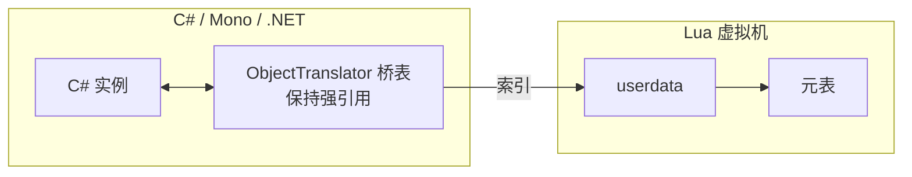

# xLua / toLua 与热更新原理

> 所属计划: [[plan|C 系语言互操作与编译学习计划]]
> 预计耗时: 75 min
> 前置知识: [[11-lua-csharp-bridge|11. Lua ↔ C# 通信原理与 GC 桥（NLua / MoonSharp）]]

---

## 1. 概念讲解

Unity 项目一旦用 IL2CPP 把 C# 编译成本机码，C# 逻辑就**无法像普通 .dll 那样被热更新替换**。于是国内 Unity 生态诞生了一条主流路线：**把可变逻辑写在 Lua 里，通过 Lua 虚拟机解释执行；需要热修时只下发新的 Lua 资源**。xLua、toLua、slua 都是这一路线上的代表方案。其中 xLua 因支持「用 Lua 替换 C# 方法实现」的 Hotfix 能力而独树一帜，是本章的核心。

> [!note] 另一条路线：HybridCLR
> HybridCLR（原 huatuo）走的是「原生 C# 热更新」路线：让 IL2CPP 运行时保留解释执行 IL 的能力，从而直接加载新的 C# 程序集。它与 xLua 不是替代关系，而是互补关系。本节只在与 xLua 对比时提及，不展开。

### 为什么需要这个？

- **iOS / 主流渠道限制**：App Store 对可执行代码更新有严格限制，但更新脚本/资源文件通常被允许。Lua 脚本天然属于「资源」。
- **IL2CPP 无中间层**：IL2CPP 把 IL 翻译成 C++ 再编译成本机码，最终包里不再有可替换的 IL 程序集。
- **业务迭代压力大**：上线后修复数值公式、UI 流程、活动逻辑时，发整包成本高；Lua 热修可以只下发一个补丁包。

不学这个，就无法理解国内大部分 Unity 手游的架构底色：哪些逻辑放 C#、哪些放 Lua、热修边界怎么画、性能怎么权衡。

### 核心思想

xLua 的核心是 **C# ↔ Lua 双向桥** 加 **IL 注入热修**。用一句话概括：

> xLua 先把 C# 的类型/对象/方法桥接到 Lua 虚拟机里，让 Lua 能调用 C#；再通过编译期 IL 注入，让 C# 方法在运行时「先问 Lua 有没有替换」，从而实现用 Lua 热修 C# 逻辑。

下面按组件拆开。

#### 1.1 Lua 调 C#：生成模式 vs 反射模式

xLua 把 C# 的类型暴露给 Lua 时有两条路径：

| 维度 | 生成模式（Generate） | 反射模式（Reflection） |
|------|----------------------|------------------------|
| 触发方式 | 给类型打 `[LuaCallCSharp]`，编辑器菜单点击 **Generate Code** | 不打标签或未生成时，运行时自动反射 |
| 产物 | 生成大量「Wrap」胶水 C# 文件 | 无额外文件 |
| 性能 | 直接调用，快一个数量级 | 反射慢，热路径开销大 |
| 包体 | 代码量增加、包体变大 | 包体更小 |
| 开发体验 | 改标签/签名后需重新生成 | 即写即用 |
| 发布要求 | **必须** | 不可作为发布默认 |

> [!warning] 发布构建必须生成代码
> 生成模式把 `CS.UnityEngine.GameObject` 这类访问变成了静态 Wrap 函数的直接调用；反射模式每次访问都要走 `System.Reflection`。按 [[research-brief|研究简报]] §14.1 的结论，xLua 生成模式比反射模式快一个数量级，因此发布构建必须生成代码，否则线上性能会崩。

生成模式下，xLua 编辑器会为每个标记类型生成类似下面的 Wrap 代码（简化示意）：

```csharp
// xLua 自动生成的伪 Wrap 代码（概念性，非真实源码）
public class MathfWrap
{
    public static void __Register(IntPtr L)
    {
        // 在 Lua 全局表 CS 下挂接 Mathf
        // 并注册 Add 等方法的静态入口
    }

    [MonoPInvokeCallback(typeof(LuaCSFunction))]
    static int _m_Add(IntPtr L)
    {
        int a = LuaAPI.xlua_tointeger(L, 1);
        int b = LuaAPI.xlua_tointeger(L, 2);
        int ret = Mathf.Add(a, b);
        LuaAPI.xlua_pushinteger(L, ret);
        return 1;
    }
}
```

#### 1.2 C# 调 Lua：`LuaEnv.DoString` 与 Delegate 代理

C# 侧通过 `LuaEnv` 与 Lua 交互。典型写法：

```csharp
using XLua;

var lua = new LuaEnv();
lua.DoString("print('hello from lua')");
```

内部流程：

1. `LuaEnv` 初始化时加载 LuaJIT/Lua 53 原生库，通过 P/Invoke 拿到 `lua_State*`。
2. `DoString` 把 Lua 字符串编译成字节码，压入栈并 `lua_pcall` 执行。
3. 调用 Lua 函数时可以用 delegate 做代理——xLua 会把 C# delegate 转成 Lua 函数 userdata，调用时反向走 Lua C API。


#### 1.3 Hotfix 原理：IL 注入

这是 xLua 最独特的机制。给 C# 类打 `[Hotfix]` 后，xLua 的构建后处理会在该类型的**每个方法入口**注入一段 IL 伪代码：

```csharp
// 注入前（用户写的 C#）
public int Add(int a, int b)
{
    return a + b;
}

// 注入后等价伪代码
public int Add(int a, int b)
{
    // 新插入：先查 Lua 有没有替换这个方法
    if (HotfixDelegates.TryGetValue(
            this.GetType().GetMethod("Add"),
            out var luaFunc))
    {
        return luaFunc(this, a, b);   // 转调 Lua 实现
    }
    return a + b;                     // 原逻辑
}
```

真实注入后的 IL 更紧凑，但语义一致：方法入口多了一次「是否有 Lua 补丁」的判断。运行时只要把一个 Lua 函数注册到对应 method 的替换槽里，后续调用就会走 Lua。

> [!important] 注入发生在构建期，不是运行时
> IL 注入是 xLua 的编辑器/构建工具链完成的。它先修改 IL 程序集，再由 IL2CPP/Mono 继续编译。运行时只剩一个轻量判断，不会有反射或 Emit 开销。

#### 1.4 Lua 侧访问 C# 对象：userdata + GC 桥

Lua 没有 C# 对象的概念。xLua 把 C# 对象包装成 **userdata**，并把真实引用保存在 `ObjectTranslator` 维护的一张桥表里：

- C# 对象传入 Lua → xLua 在桥表里加一条强引用（防 GC），同时把一个带元表的 userdata 压到 Lua 栈。
- Lua 侧对 userdata 做 `:Foo()` 调用 → 元表指向 Wrap 方法，从 userdata 取出桥表索引，再拿到真实 C# 对象。
- Lua 侧 userdata 被 GC → `__gc` 元方法通知桥表移除引用，C# 对象才能被 .NET GC 回收。



这条 GC 桥是双向的：

- C# 对象活着 → Lua 侧访问不会拿到悬空指针。
- Lua 不再引用 → 桥表释放 → C# 对象恢复普通 GC 生命周期。

#### 1.5 toLua 简介

toLua 是另一条 Unity Lua 热更新路线，源自 LuaInterface 的血统：

- 同样走「反射 + 生成 Wrap」的路线。
- 社区生态广，文档与第三方教程丰富。
- 没有 xLua 的 IL 注入 Hotfix 能力；热更新通常依赖「把业务逻辑写在 Lua，C# 只做薄壳」。

#### 1.6 方案对比

| 方案 | Lua 实现 | 互操作机制 | 适合 |
|------|----------|-----------|------|
| NLua | 真 Lua（P/Invoke） | C API 封装 | 通用 .NET 嵌入 |
| MoonSharp | 纯 C# 解释器 | 无 P/Invoke | 无原生依赖 |
| xLua | LuaJIT / Lua 5.3 | 代码生成 + 反射 + IL 注入 | Unity 热更新（国内主流） |
| toLua | LuaJIT / Lua | 反射 + 生成 | Unity 热更新 |

---

## 2. 代码示例

> [!warning] 环境声明
> 以下示例均为**概念性最小示例**，真实运行需要 Unity 2021.3 LTS 或更高版本 + xLua 包。代码块中保留完整逻辑，方便理解；没有 Unity 环境的读者请把重点放在「运行方式」和「预期输出」所描述的行为上。

### 示例 1：xLua 基本用法（Lua 调 C#）

这个示例展示如何把 C# 静态类暴露给 Lua，并在 Lua 脚本里调用。

```csharp
// Assets/Scripts/MathfXLua.cs
// 运行环境：Unity 2021.3 LTS + xLua 包（ Tencent/xLua release ）
using UnityEngine;
using XLua;

[LuaCallCSharp]
public static class MathfXLua
{
    public static int Add(int a, int b) => a + b;
}
```

```csharp
// Assets/Scripts/XLuaRunner.cs
using UnityEngine;
using XLua;

public class XLuaRunner : MonoBehaviour
{
    void Start()
    {
        LuaEnv luaenv = new LuaEnv();

        // 在 Lua 中，CS 是 xLua 注入的全局命名空间
        luaenv.DoString("print(CS.MathfXLua.Add(3, 4))");

        luaenv.Dispose();
    }
}
```

**运行方式：**

1. 在 Unity Hub 中新建 3D 项目（推荐 2021.3 LTS 或更高）。
2. 下载 xLua 发布包（GitHub: `Tencent/xLua` → Releases），把 `Assets/XLua` 文件夹拖入项目。
3. 在 `Assets/Scripts/` 下创建上面两个 `.cs` 文件。
4. 选中 `MathfXLua.cs`，确认类或方法已打 `[LuaCallCSharp]`。
5. 菜单栏选择 **XLua → Generate Code**，等待生成 Wrap 文件（位于 `Assets/XLua/Gen/`）。
6. 在场景中创建空 GameObject，挂载 `XLuaRunner.cs`。
7. 点击 Play，查看 Console。

> [!note] 关于 IL2CPP
> 如果目标平台使用 IL2CPP，需要在构建前执行 **XLua → Generate Code**，并在 `Assets/` 下放置 `link.xml` 防止 IL2CPP 裁剪掉被 Lua 调用的类型。详见「常见陷阱」最后一条。

**预期输出：**

```text
7
```

如果未生成代码，Editor 下会回退到反射模式，输出同样是 `7`，但调用会更慢；发布到 IL2CPP 后若未生成代码，则极有可能崩溃或无法调用。

### 示例 2：Hotfix IL 注入前后对照

这个示例不依赖 Unity 运行，而是用 C# 源码与「注入后等价伪代码」对比，说明 IL 注入到底改了什么。

```csharp
// 用户原始 C#（注入前）
using XLua;

[Hotfix]
public class Calculator
{
    public int Add(int a, int b)
    {
        return a + b;
    }
}
```

xLua 构建工具链处理后的等价伪代码：

```csharp
// 注入后等价伪代码（xLua 实际修改的是 IL，不是源码）
using XLua;

[Hotfix]
public class Calculator
{
    public int Add(int a, int b)
    {
        // ===== 注入开始 =====
        // 用方法签名在全局替换表中查找 Lua 补丁
        if (HotfixDelegates.TryGetValue(
                typeof(Calculator).GetMethod("Add"),
                out var luaReplacement))
        {
            // 把 this、a、b 传给 Lua 函数，返回 Lua 的结果
            return luaReplacement.Invoke(this, a, b);
        }
        // ===== 注入结束 =====

        return a + b;   // 原方法体
    }
}
```

运行时替换逻辑写在 Lua 里：

```lua
-- 热修补丁（概念性 Lua 代码）
-- 假设 xLua 已提供 util.hotfix_ex 或类似 API
local util = require 'xlua.util'

xlua.hotfix(CS.Calculator, 'Add', function(self, a, b)
    print('Hotfix Add called with', a, b)
    return a + b + 100   -- 临时修正：先加 100 便于验证
end)
```

**运行方式：**

1. 在 Unity 中创建 `Calculator.cs` 并给类打 `[Hotfix]`。
2. 创建 C# 宿主脚本，用 `LuaEnv.DoString` 加载上面的 Lua 补丁。
3. 构建时确保 xLua 的 **Hotfix Inject** 流程已执行（通常由编辑器脚本自动触发，或手动执行菜单命令）。
4. 运行场景，`Calculator.Add(1, 2)` 会输出 `102` 而不是 `3`。

**预期输出：**

```text
Hotfix Add called with	1	2
102
```

> [!note] 为什么这能热修
> 原方法的本机码在构建后已经固定，但 IL 注入在构建**之前**往入口加了一个「分发器」。这个分发器在运行时查询一张可以被 Lua 改写的表，于是逻辑行为变了，而原生方法体本身没被替换。

---

## 3. 练习

### 练习 1: 描述题

列出 xLua「生成模式」与「反射模式」在性能、包体、开发体验上的取舍，并说明为什么发布构建必须生成代码。

### 练习 2: 画图题

用 Mermaid `flowchart` 画出 `[Hotfix]` 方法 IL 注入前后入口判断的流程。要求包含：原始方法体、替换表查询、Lua 函数调用、回退原逻辑四个节点。

### 练习 3: 分析题

解释 `ObjectTranslator` GC 桥为何是必须的（考虑 Lua 与 Mono/.NET 两套独立 GC），并描述一条「Lua 侧忘释放导致 C# 对象无法回收」的泄漏路径。

---

## 3.5 参考答案

> 参考答案不是唯一解——如果你的实现通过了测试或达到了题目要求，就是正确的。

> [!tip]- 练习 1 参考答案
> **性能**：生成模式直接调用 Wrap 胶水代码，接近普通 C# 方法调用；反射模式每次都要走 `System.Reflection` 查类型、查方法、转换参数，按 [[research-brief|研究简报]] §14.1 的说法慢一个数量级。
>
> **包体**：生成模式会在 `Assets/XLua/Gen/` 下生成大量 C# 文件，最终编译进程序集，包体增大；反射模式没有这些文件，包体更小。
>
> **开发体验**：生成模式改标签或改签名后需要重新点击 **Generate Code**，否则会报错或回退反射；反射模式即写即用，适合原型。
>
> **发布必须生成代码的原因**：移动设备热路径上不能承受反射开销；IL2CPP 下未生成的类型在 IL 被翻译成 C++ 后，元数据可能被裁剪，导致反射找不到方法。xLua 官方推荐发布构建前必须执行生成。

> [!tip]- 练习 2 参考答案
> ```mermaid
> flowchart TD
>     Start["进入 Add 方法"] --> Check{"替换表中\n是否有该方法的\nLua 补丁？"}
>     Check -->|是| CallLua["调用 Lua 函数\n并返回其结果"]
>     Check -->|否| Original["执行原方法体\n返回原结果"]
>     CallLua --> End1["方法返回"]
>     Original --> End1
> ```
> 说明：`Check` 节点就是 IL 注入插入的分发逻辑；`Original` 是用户原本的 C# 方法体；`CallLua` 代表把 `this` 与参数传给 Lua 函数并拿回返回值。

> [!tip]- 练习 3 参考答案
> **为什么 GC 桥必须存在**：Lua 的对象生命周期由 Lua GC 管理，C# 对象由 Mono / .NET GC 管理，两者互不知情。Lua 侧拿到 C# 对象时，如果只是一个裸指针，C# GC 可能随时移动或回收它；xLua 用 `ObjectTranslator` 桥表保存 C# 对象的强引用，保证在 Lua 引用期间 C# 对象一定存活。Lua 侧 userdata 被 GC 时，通过 `__gc` 元方法通知桥表释放引用，C# 对象才能被回收。
>
> **泄漏路径**：
> 1. C# 创建一个对象 `O`，并把它传给 Lua，保存到全局表或某张长期存在的 Lua 表里。
> 2. Lua 逻辑中不再使用 `O`，但**没有把它从全局表 / 长期表中移除**，也没有触发 userdata 的 `__gc`。
> 3. 桥表里对 `O` 的强引用一直存在。
> 4. .NET GC 无法回收 `O`，造成托管堆泄漏。
>
> **正确做法**：及时把 Lua 侧不再使用的 C# 对象引用置为 `nil`，或避免把大对象长期挂在 Lua 全局命名空间里。

---

## 4. 扩展阅读

- [xLua 官方 GitHub](https://github.com/Tencent/xLua)
- [xLua 官方文档：XLua 教程](https://github.com/Tencent/xLua/blob/master/Assets/XLua/Doc/faq.md)
- [xLua Hotfix 原理与实践（社区文章）](https://github.com/Tencent/xLua/blob/master/Assets/XLua/Doc/hotfix.md)
- [toLua# 仓库](https://github.com/topameng/tolua)
- [HybridCLR 官方文档](https://hybridclr.doc.code-philosophy.com/)
- 本计划相关章节：[[11-lua-csharp-bridge|11. Lua ↔ C# 通信原理与 GC 桥]]、[[08-lua-c-api|08. Lua C API 与栈模型]]、[[research-brief|研究简报]]

---

## 常见陷阱

- **发布构建忘生成 Wrap 代码**：Editor 下反射模式能跑，发布到 IL2CPP 后轻则变慢，重则类型被裁剪导致调用失败。正确做法：每次发布前执行 **XLua → Generate Code**，并把生成目录纳入版本控制。

- **Hotfix 漏打 `[Hotfix]` 标签或忘注入**：只有打了 `[Hotfix]` 的类，构建工具链才会为其方法注入分发逻辑。正确做法：需要热修的类统一标注，并在 CI 中增加注入检查（如对比注入前后程序集大小或运行自动化冒烟测试）。

- **GC 桥泄漏**：Lua 侧把 C# 对象长期挂在全局表或不释放 userdata，导致桥表强引用永不解除。正确做法：显式把 Lua 引用置 `nil`，并对大对象/高频创建对象做泄漏监控。

- **xLua 与 Unity 版本兼容**：xLua 的本地库需要针对目标 Unity 版本和脚本后端（Mono / IL2CPP）编译。升级 Unity 后应重新拉取或编译对应二进制。正确做法：升级 Unity 后先跑通 xLua 示例项目，再合并到主线。

- **IL2CPP 下类型被 Stripping**：被 Lua 反射或热修访问的类型如果没有被 C# 显式引用，可能被 IL2CPP 裁剪。正确做法：在 `Assets/link.xml` 中保留这些类型，例如：

```xml
<!-- Assets/link.xml -->
<linker>
  <assembly fullname="Assembly-CSharp">
    <type fullname="Calculator" preserve="all" />
    <type fullname="MathfXLua" preserve="all" />
  </assembly>
</linker>
```

