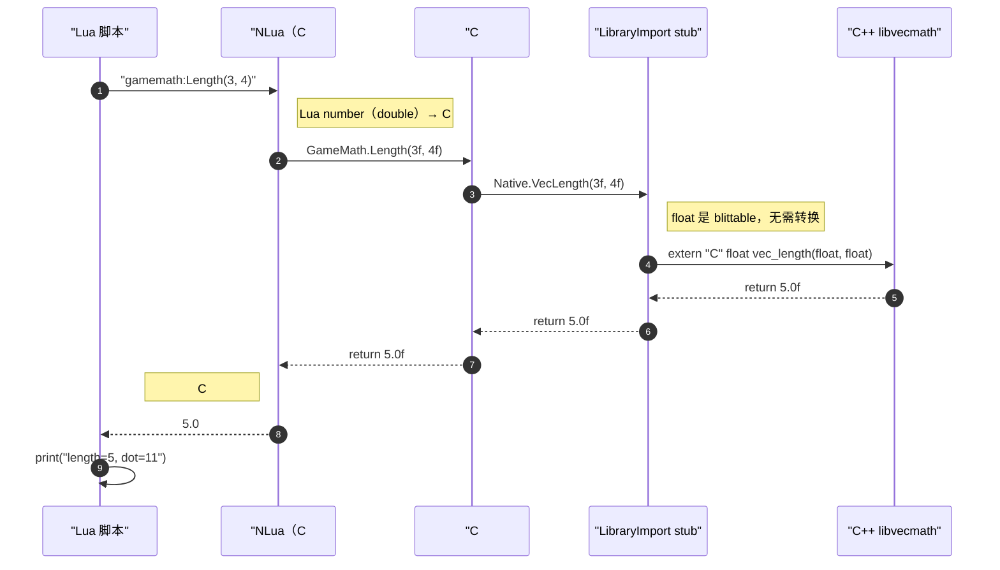
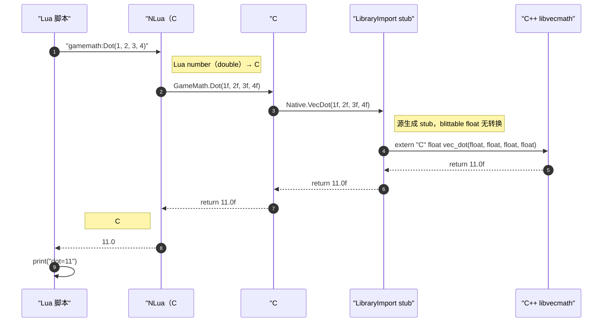

# 综合项目：C++ 核心 + C# 宿主 + Lua 脚本三层互通

> 所属计划: [[plan|C 系语言互操作与编译学习计划]]
> 预计耗时: 120 min
> 前置知识: 全部

---

## 1. 概念讲解

前面各章分别讲了 C# 调 C++、C++ 调 C#、Lua C API、LuaJIT FFI、xLua / NLua 等机制。本章把它们串成一个**最小但完整**的三层系统：

- **C++ 核心层**：高性能数学库，只暴露 C ABI。
- **C# 宿主层**：控制台应用，通过 `[LibraryImport]` 调用 C++，再通过 NLua 嵌入 Lua。
- **Lua 脚本层**：编写业务逻辑，回调 C# 对象，C# 对象内部又调回 C++。

形成一个 **Lua → C# → C++ → 返回 → C# → Lua** 的闭环。

### 为什么需要这个？

真实项目里很少只涉及两种语言。游戏、引擎、工业软件常见组合是：

- 用 **C++** 写计算密集型核心（物理、图形、数学）。
- 用 **C#** 写宿主框架、工具链、服务层（.NET 生态丰富）。
- 用 **Lua** 写可热更的业务逻辑、配置、AI 行为树。

如果只会两两互操作，遇到这种三角组合就会卡壳：Lua 脚本怎么触发 C++ 核心？C# 在中间该承担什么角色？数据在各层之间怎么传？生命周期怎么管？本章用一个端到端项目回答这些问题。

### 核心思想

#### 1.1 三层架构与 C ABI 边界

| 层级 | 职责 | 互操作边界 | 关键机制 |
|------|------|------------|----------|
| Lua 脚本 | 业务逻辑、配置 | Lua C API | NLua 把 `lua_State` 桥接到 .NET |
| C# 宿主 | 胶水、服务编排 | P/Invoke / `[LibraryImport]` | 调用 C++ 的 `extern "C"` 函数 |
| C++ 核心 | 数值计算、原生算法 | `extern "C"` 导出 | 关掉名称重整，保持 C ABI 兼容 |

所有跨语言边界的公共接口都走 **C ABI**：

- C++ 侧用 `extern "C"` 导出函数，并加上平台相关的导出宏。
- C# 侧用 `[LibraryImport]` 声明函数，参数/返回使用 blittable 类型。
- Lua 侧通过 NLua 间接操作 `lua_State`，对 C# 对象发起调用。

> [!note] 为什么 C ABI 是最佳中立边界
> C 没有名称重整、没有 `this` 指针、没有异常表，对象布局简单。任何能发出 C 调用的语言（C#、LuaJIT FFI、C++、Rust 等）都能消费它。详细说明见 [[research-brief|研究简报]] 第 `2` 节。

#### 1.2 端到端调用链

下面的时序图展示了从 Lua 脚本发起一次调用，到最终返回 Lua 的完整路径。



同一次 `demo.lua` 还会调用 `gamemath:Dot(...)`，路径完全一致，只是最终进入 C++ 的 `vec_dot`。

#### 1.3 设计要点

**统一错误处理**

- C++ 异常**绝对不能跨 P/Invoke 边界**。原生侧必须把异常吞掉并转成返回码或日志。
- Lua 的 `error()` 在 C 侧用 `longjmp` 实现，跨 C 边界会跳过析构。C# 侧用 `DoString` 时 NLua 已经默认走 `lua_pcall`，但手写 C 扩展时务必自己包 `lua_pcall`。

**数据封送与生命周期**

- 本例只传 `float`，属于 **blittable**，封送成本最低。
- 如果需要传字符串，统一用 **UTF-8**，并在 C# 侧声明 `StringMarshalling = StringMarshalling.Utf8`。
- 注册给 Lua 的 C# 对象由 NLua 的 GC 桥保持引用，脚本运行期间不会被 .NET GC 回收。

#### 1.4 性能剖析

| 跨语言边 | 开销来源 | 优化方向 |
|----------|----------|----------|
| Lua ↔ C#（NLua） | Lua 栈操作、反射查方法、托管/脚本类型转换 | 热路径少传字符串，批量传数组；缓存 Lua 函数引用 |
| C# ↔ C++（P/Invoke） | IL stub / 源生成 stub、寄存器约定切换、阴影空间/红区 | 优先 blittable；批量处理数组而非逐元素调用 |
| C++ 函数本身 | 纯原生执行 | 通常最快，避免在边界内做复杂对象转换 |

> [!tip] 批量化胜过单次调用
> 跨边界本身有固定开销。如果 Lua 要处理 1000 个向量，不要在循环里每次调 C# 再调 C++；应一次性把数组传给 C#，C# 一次性传给 C++ 处理，再一次性返回。

---

## 2. 代码示例

### 示例 1：完整三层互通项目

项目结构如下：

```text
three-tier-demo/
├── core/
│   ├── vecmath.h
│   ├── vecmath.cpp
│   └── CMakeLists.txt
├── host/
│   ├── Host.csproj
│   └── Program.cs
└── scripts/
    └── demo.lua
```

#### `core/vecmath.h`

```cpp
#ifndef VECMATH_H
#define VECMATH_H

#ifdef _WIN32
    #ifdef VECMATH_EXPORTS
        #define VECMATH_API __declspec(dllexport)
    #else
        #define VECMATH_API __declspec(dllimport)
    #endif
#else
    #define VECMATH_API __attribute__((visibility("default")))
#endif

#ifdef __cplusplus
extern "C" {
#endif

VECMATH_API float vec_length(float x, float y);
VECMATH_API float vec_dot(float ax, float ay, float bx, float by);

#ifdef __cplusplus
}
#endif

#endif // VECMATH_H
```

#### `core/vecmath.cpp`

```cpp
#include "vecmath.h"
#include <cmath>

extern "C" {

float vec_length(float x, float y)
{
    return std::sqrt(x * x + y * y);
}

float vec_dot(float ax, float ay, float bx, float by)
{
    return ax * bx + ay * by;
}

} // extern "C"
```

#### `core/CMakeLists.txt`

```cmake
cmake_minimum_required(VERSION 3.15)
project(VecMathCore CXX)

set(CMAKE_CXX_STANDARD 17)
set(CMAKE_CXX_STANDARD_REQUIRED ON)

# GNU/Clang 默认隐藏符号，只有显式导出的才可见
set(CMAKE_CXX_VISIBILITY_PRESET hidden)
set(CMAKE_VISIBILITY_INLINES_HIDDEN ON)

add_library(vecmath SHARED vecmath.cpp)

target_include_directories(vecmath PUBLIC
    ${CMAKE_CURRENT_SOURCE_DIR}
)

target_compile_definitions(vecmath PRIVATE VECMATH_EXPORTS)

set_target_properties(vecmath PROPERTIES
    RUNTIME_OUTPUT_DIRECTORY ${CMAKE_BINARY_DIR}/bin
    LIBRARY_OUTPUT_DIRECTORY ${CMAKE_BINARY_DIR}/bin
    ARCHIVE_OUTPUT_DIRECTORY ${CMAKE_BINARY_DIR}/bin
)
```

#### `host/Host.csproj`

```xml
<Project Sdk="Microsoft.NET.Sdk">

  <PropertyGroup>
    <OutputType>Exe</OutputType>
    <TargetFramework>net8.0</TargetFramework>
    <Nullable>enable</Nullable>
    <ImplicitUsings>enable</ImplicitUsings>
    <AllowUnsafeBlocks>true</AllowUnsafeBlocks>
    <RootNamespace>ThreeTierHost</RootNamespace>
  </PropertyGroup>

  <ItemGroup>
    <PackageReference Include="NLua" Version="1.7.9" />
  </ItemGroup>

</Project>
```

#### `host/Program.cs`

```csharp
using System.Runtime.InteropServices;
using NLua;

// C# 侧通过 LibraryImport 调用 C++ 的 C ABI 函数
public static partial class Native
{
    [LibraryImport("vecmath", EntryPoint = "vec_length")]
    public static partial float VecLength(float x, float y);

    [LibraryImport("vecmath", EntryPoint = "vec_dot")]
    public static partial float VecDot(float ax, float ay, float bx, float by);
}

// 普通 C# 类，不需要任何 `[LuaCallCSharp]` 之类的标签（那是 Unity/xLua 的概念）
public class GameMath
{
    public float Length(float x, float y) => Native.VecLength(x, y);

    public float Dot(float ax, float ay, float bx, float by) =>
        Native.VecDot(ax, ay, bx, by);
}

class Program
{
    static void Main(string[] args)
    {
        using var lua = new Lua();

        // 把 C# 实例注册为 Lua 全局变量 gamemath
        lua["gamemath"] = new GameMath();

        // 运行 Lua 脚本
        lua.DoString(File.ReadAllText("scripts/demo.lua"));
    }
}
```

#### `scripts/demo.lua`

```lua
local len = gamemath:Length(3, 4)
local dot = gamemath:Dot(1, 2, 3, 4)

print(string.format("length=%d, dot=%d", len, dot))
```

#### 运行方式

> [!note] 环境要求
> - CMake `3.15+`
> - Windows：Visual Studio 2022 / Build Tools（MSVC）
> - Linux：GCC 9+ 或 Clang 10+
> - .NET 8 SDK
> - NLua 会通过 NuGet 自动还原
> - `Host.csproj` 中已开启 `<AllowUnsafeBlocks>true</AllowUnsafeBlocks>`，`[LibraryImport]` 源生成器需要它

**Windows（PowerShell）**

```powershell
# 1. 构建 C++ 核心库
cmake -S core -B build-core -DCMAKE_BUILD_TYPE=Release
cmake --build build-core --config Release

# 2. 把动态库复制到 C# 宿主输出目录
New-Item -ItemType Directory -Force -Path host/bin/Debug/net8.0 | Out-Null
Copy-Item build-core/bin/Release/vecmath.dll host/bin/Debug/net8.0/vecmath.dll

# 3. 运行 C# 宿主
cd host
dotnet run
```

**Linux（Bash）**

```bash
# 1. 构建 C++ 核心库
cmake -S core -B build-core -DCMAKE_BUILD_TYPE=Release
cmake --build build-core

# 2. 把动态库复制到 C# 宿主输出目录
mkdir -p host/bin/Debug/net8.0
cp build-core/bin/libvecmath.so host/bin/Debug/net8.0/libvecmath.so

# 3. 运行 C# 宿主
cd host
dotnet run
```

**预期输出**

```text
length=5, dot=11
```

### 示例 2：调用链时序图

把示例 1 中 `gamemath:Dot(1, 2, 3, 4)` 的完整调用链用 `sequenceDiagram` 展开：



---

## 3. 练习

### 练习 1: 跑通端到端项目

把示例 1 的完整项目复制到本地，按「运行方式」编译 C++ 库并运行 C# 宿主，确认输出为 `length=5, dot=11`。

### 练习 2: 扩展归一化与组合计算

给 C++ 核心增加一个 `vec_normalize` 函数：输入 `(x, y)`，返回归一化后的 `(ox, oy)`。由于 C ABI 不支持多返回值，请用**输出参数**实现。

要求：

1. C++ 侧新增 `void vec_normalize(float x, float y, float* ox, float* oy)`。
2. C# 侧用 `[LibraryImport]` 声明它，并在 `GameMath` 中封装一个更友好的 `Normalize(x, y) -> (float, float)`。
3. 在 `demo.lua` 中实现：`先归一化 (3,4)，再与 (1,0) 求点积`，并打印结果。

### 练习 3: 画出扩展调用链（可选）

用 Mermaid `sequenceDiagram` 画出练习 2 的完整调用链：

`Lua 脚本 → C# GameMath.Normalize → LibraryImport → C++ vec_normalize → 返回 → C# GameMath.Dot → C++ vec_dot → 返回 → Lua 打印`

并在每条跨语言边上标注：

- 参数/返回的封送类型。
- 该边的主要开销来源。

---

## 3.5 参考答案

> 参考答案不是唯一解——如果你的实现通过了测试或达到了题目要求，就是正确的。

> [!tip]- 练习 1 参考答案
> 
> 步骤（Windows）：
> 
> ```powershell
> cmake -S core -B build-core -DCMAKE_BUILD_TYPE=Release
> cmake --build build-core --config Release
> New-Item -ItemType Directory -Force -Path host/bin/Debug/net8.0 | Out-Null
> Copy-Item build-core/bin/Release/vecmath.dll host/bin/Debug/net8.0/vecmath.dll
> cd host
> dotnet run
> ```
> 
> 步骤（Linux）：
> 
> ```bash
> cmake -S core -B build-core -DCMAKE_BUILD_TYPE=Release
> cmake --build build-core
> mkdir -p host/bin/Debug/net8.0
> cp build-core/bin/libvecmath.so host/bin/Debug/net8.0/libvecmath.so
> cd host
> dotnet run
> ```
> 
> 预期输出：
> 
> ```text
> length=5, dot=11
> ```

> [!tip]- 练习 2 参考答案
> 
> 1. 在 `vecmath.h` 中新增声明：
> 
> ```cpp
> VECMATH_API void vec_normalize(float x, float y, float* ox, float* oy);
> ```
> 
> 2. 在 `vecmath.cpp` 中实现：
> 
> ```cpp
> void vec_normalize(float x, float y, float* ox, float* oy)
> {
>     float len = vec_length(x, y);
>     if (len > 0.0f)
>     {
>         *ox = x / len;
>         *oy = y / len;
>     }
>     else
>     {
>         *ox = 0.0f;
>         *oy = 0.0f;
>     }
> }
> ```
> 
> 3. 在 `Program.cs` 的 `Native` 类中新增：
> 
> ```csharp
> [LibraryImport("vecmath", EntryPoint = "vec_normalize")]
> public static partial void VecNormalize(float x, float y, out float ox, out float oy);
> ```
> 
> 4. 在 `GameMath` 中封装：
> 
> ```csharp
> public (float X, float Y) Normalize(float x, float y)
> {
>     Native.VecNormalize(x, y, out float ox, out float oy);
>     return (ox, oy);
> }
> ```
> 
> 5. 修改 `demo.lua`：
> 
> ```lua
> local nx, ny = gamemath:Normalize(3, 4)
> local result = gamemath:Dot(nx, ny, 1, 0)
> print(string.format("normalize=(%.4f, %.4f), dot=%.4f", nx, ny, result))
> ```
> 
> 预期输出（约）：
> 
> ```text
> normalize=(0.6000, 0.8000), dot=0.6000
> ```

> [!tip]- 练习 3 参考答案
> 
> ```mermaid
> sequenceDiagram
>     autonumber
>     participant L as "Lua 脚本"
>     participant N as "NLua（C# 桥）"
>     participant C as "C# GameMath"
>     participant P as "LibraryImport stub"
>     participant X as "C++ libvecmath"
> 
>     L->>N: "nx, ny = gamemath:Normalize(3, 4)"
>     Note right of N: Lua number（double）→ C# float<br/>开销：栈操作 + 反射查方法
>     N->>C: GameMath.Normalize(3f, 4f)
>     C->>P: Native.VecNormalize(3f, 4f, out ox, out oy)
>     Note right of P: float / out float 均 blittable<br/>开销：stub + 调用约定切换
>     P->>X: extern "C" void vec_normalize(float, float, float*, float*)
>     X-->>P: *ox=0.6f, *oy=0.8f
>     P-->>C: (0.6f, 0.8f)
>     C-->>N: (0.6f, 0.8f)
>     Note left of N: C# ValueTuple → Lua 多返回值<br/>开销：类型转换 + 栈压入
>     N-->>L: nx=0.6, ny=0.8
> 
>     L->>N: "gamemath:Dot(nx, ny, 1, 0)"
>     Note right of N: 4 个 Lua number → C# float
>     N->>C: GameMath.Dot(0.6f, 0.8f, 1f, 0f)
>     C->>P: Native.VecDot(...)
>     P->>X: extern "C" float vec_dot(...)
>     X-->>P: return 0.6f
>     P-->>C: return 0.6f
>     C-->>N: return 0.6f
>     N-->>L: 0.6
>     L->>L: print("dot=0.6000")
> ```

---

## 4. 扩展阅读

- [.NET Native interop overview](https://learn.microsoft.com/dotnet/standard/native-interop/)
- [LibraryImport source generator](https://learn.microsoft.com/dotnet/standard/native-interop/pinvoke-source-generation)
- [Lua 5.4 Reference Manual](https://www.lua.org/manual/5.4/manual.html)
- [NLua GitHub 仓库](https://github.com/NLua/NLua)
- [KeraLua GitHub 仓库](https://github.com/nlua/KeraLua)（NLua 的 Lua C API 封装）
- [xLua GitHub 仓库](https://github.com/Tencent/xLua)
- [LuaJIT FFI documentation](https://luajit.org/ext_ffi.html)

---

## 常见陷阱

- **C++ 异常跨 P/Invoke 边界**：原生函数里抛出异常，C# 侧会未定义行为甚至崩溃。正确做法是在 C++ 入口用 `try/catch(...)` 捕获，返回错误码或记录日志。

- **Lua `error` 跨 C 边界**：Lua 的 `error()` 在 C 侧用 `longjmp` 实现，会跳过 C++ 栈对象的析构。正确做法是所有 Lua 调用都用 `lua_pcall`（NLua 的 `DoString` 已经默认这样做）。

- **注册给 Lua 的 C# 对象被 GC 回收**：如果 C# 没有保持对注册对象的引用，.NET GC 可能回收它，Lua 后续调用会崩溃。正确做法是像示例一样把对象存到 `lua["gamemath"]`，由 NLua 的 GC 桥保持存活。

- **忘记 `extern "C"`**：C++ 默认会重整函数名，C# `[LibraryImport]` 找不到符号。正确做法是头文件里用 `extern "C"` 包裹导出函数。

- **原生库路径解析失败**：`[LibraryImport("vecmath")]` 在 Windows 找 `vecmath.dll`，在 Linux 找 `libvecmath.so`。正确做法是把库复制到宿主输出目录，或用 NuGet 的 `runtimes/<rid>/native/` 目录结构分发。

- **x86 调用约定不匹配**：x86 上 `cdecl` 与 `stdcall` 栈清理方不同，混用会导致栈损坏。x64 平台 ABI 统一，但写 `[LibraryImport]` 时仍建议显式 `CallingConvention = CallingConvention.Cdecl`。

- **字符串编码不统一**：C# `string` 默认可能按 ANSI/UTF-16 封送。正确做法是统一用 UTF-8，即 `[LibraryImport(..., StringMarshalling = StringMarshalling.Utf8)]`。

- **Linux 上符号默认隐藏**：CMake 里设置 `CMAKE_CXX_VISIBILITY_PRESET hidden` 后，只有加了 `__attribute__((visibility("default")))` 的函数才会导出。忘记加导出宏会导致 `nm -D` 看不到符号。
