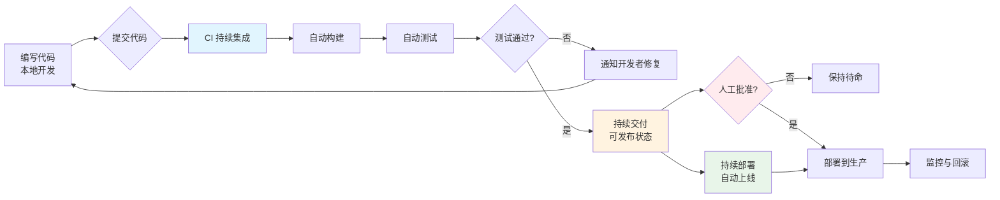

# CI/CD 与 DevOps 全景

> 所属计划: [[plan|CI/CD 完整学习计划]]
> 预计耗时: 60min
> 前置知识: 无

---

## 1. 概念讲解

### 1.1 先用一个类比理解“自动化交付”

想象一家生意火爆的餐厅。顾客下单后，厨房需要完成一系列动作：洗菜、切配、烹饪、摆盘、上菜。如果每一步都靠厨师长大声喊、服务员来回跑，高峰期几乎肯定会出错——有的菜重复做了，有的菜忘做了，有的菜端到桌上才发现盐放多了。

现代餐厅会怎么做？它会用订单系统把流程串起来：

1. 前台收到订单，自动打印出票。
2. 冷菜、热菜、甜品按顺序进入各自工位。
3. 每道菜完成后按灯提示，服务员统一取走。
4. 顾客投诉时，可以追溯是哪一桌、哪一位厨师、哪一个环节出的问题。

软件开发里的 **CI/CD（Continuous Integration / Continuous Delivery or Deployment）** 做的就是类似的事：把“写代码 → 检查代码 → 测试 → 打包 → 部署 → 验证”这条长长的链路，用自动化流水线串起来，让软件像餐厅出菜一样稳定、可预期、可追溯。

> 流水线不是魔法，它只是把人工重复执行的步骤，变成机器 repeatable 执行的步骤。

本计划全程使用的示例项目是 `quote-api`：一个返回随机名言的 TypeScript + Node.js HTTP API。虽然现在它还没有出现，但你只需要记住，我们最终要让它“提交代码后自动测试、自动构建、自动部署”。

---

### 1.2 核心辨析：CI、持续交付、持续部署

这是本节最重要的概念。三个词长得很像，但边界非常清晰。

#### CI（Continuous Integration，持续集成）

**定义**：开发人员频繁地把代码合并到主干分支（通常是 `main`），每次合并都自动触发构建和测试，以便尽早发现集成冲突。

关键词是 **频繁合并** 和 **自动验证**。它的目标是避免“集成地狱”——每个人都在自己的分支上开发两周，最后合并时发现冲突多到无法解决。

#### Continuous Delivery（持续交付）

**定义**：在 CI 的基础上，代码变更经过自动化测试后，始终保持在“可以随时部署到生产环境”的状态，但**是否真正部署到生产环境由人工决定**。

关键词是 **随时可发布** 和 **人工审批**。持续交付给业务保留了“决定什么时候上线”的权力。

#### Continuous Deployment（持续部署）

**定义**：在持续交付的基础上，代码变更通过所有自动化检查后**自动部署到生产环境**，不需要人工审批。

关键词是 **全自动上线**。它对自动化测试、监控、回滚能力的要求最高。

下面的流程图展示了从写代码到上线的连续光谱：



| 维度 | CI | 持续交付 | 持续部署 |
|------|----|----------|----------|
| 核心目标 | 频繁合并、尽早发现问题 | 随时可发布 | 自动发布 |
| 是否自动测试 | 是 | 是 | 是 |
| 是否自动部署到生产 | 否 | 否（自动到类生产环境） | 是 |
| 是否有人工审批 | 否 | **有** | **无** |
| 对测试成熟度要求 | 中等 | 高 | 极高 |

很多团队嘴上说自己做“CI/CD”，其实只做到了 CI；真正区分水平的，是能不能稳定做到持续交付，以及有没有条件进入持续部署。

---

### 1.3 DevOps 是文化，不是工具

CI/CD 经常被和 DevOps 混为一谈，但它们不是一回事。

- **CI/CD 是一套工程实践和工具链**，回答“怎么自动化地交付软件”。
- **DevOps 是一种组织文化和工作方式**，回答“开发（Dev）和运维（Ops）怎么协作才能更快、更稳地交付价值”。

在传统模式下，开发写完代码“扔给”运维部署；出了问题互相甩锅。DevOps 则强调：

- 开发和运维共同对服务的可用性负责。
- 通过自动化减少人工交接和等待。
- 用共享的指标和数据驱动改进。

一个常用的模型是 **CAMS**：

- **Culture（文化）**：信任、协作、共同目标，而不是部门墙。
- **Automation（自动化）**：把重复、容易出错的步骤交给机器，CI/CD 就在这里发挥作用。
- **Measurement（度量）**：用数据说话，比如后面会讲的 DORA 指标。
- **Sharing（共享）**：共享知识、工具、责任和反馈。

> 如果只买工具、不改流程、不打破部门墙，那不是 DevOps，只是“买了几个 DevOps 工具”。

---

### 1.4 为什么需要 CI/CD：手动交付的痛苦

如果你所在的项目还在手动交付，下面这些场景可能很熟悉：

- **集成地狱**：多个开发者在各自分支上工作，合并前一周才发现冲突，重构成本巨大。
- **“周五不敢部署”**：部署步骤复杂、文档老旧，周五下午改线上 bug 像拆炸弹。
- **不可复现的故障**：本地能跑，测试环境能跑，到了生产就崩，最后发现是某人手动改了服务器配置。
- **上线仪式漫长**：每次发版要填表单、发邮件、拉群、半夜值班，人的注意力成为瓶颈。

CI/CD 带来的收益正好对应这些痛点：

| 手动交付的问题 | CI/CD 的收益 |
|----------------|--------------|
| 集成冲突发现晚 | 小步快跑、频繁合并、问题早发现 |
| 部署步骤依赖个人记忆 | 流水线代码化，任何人都能复现 |
| 环境差异导致故障 | 统一制品 + 一致环境（容器化） |
| 回滚靠手工敲命令 | 一键回滚到上一个稳定版本 |
| 反馈周期长 | 几分钟内知道代码是否可用 |

---

### 1.5 DORA 指标：衡量 CI/CD 做得好不好

怎么判断一个团队的 CI/CD 是否健康？DORA（DevOps Research and Assessment）团队提出了四个关键指标。本节只做预告，第 16 节 [[16-observability-dora]] 会深入讲解如何采集和解读。

1. **部署频率（Deployment Frequency）**：单位时间内向生产环境部署的次数。越高说明交付越顺畅。
2. **变更前置时间（Lead Time for Changes）**：从代码提交到正式上线所需的时间。越短说明流水线越快。
3. **平均恢复时间（Mean Time to Restore，MTTR）**：生产故障发生后，服务恢复正常所需的平均时间。越短说明可观测性和回滚能力越强。
4. **变更失败率（Change Failure Rate）**：每次变更导致生产故障的比例。越低说明质量和测试越可靠。

这四个指标是“尺子”。不要一开始就追求全部满分，而是先建立度量，再逐步改进。

---

### 1.6 流水线全景图

下图是一张端到端的 CI/CD 流水线。后续每一节都会拆开讲其中的某一段：

```mermaid
flowchart LR
    subgraph SRC[源代码]
        A[Git 仓库<br/>main / feature 分支]
    end

    subgraph CI[CI 阶段]
        B[检出代码] --> C[安装依赖]
        C --> D[代码检查 lint]
        D --> E[单元测试]
        E --> F[构建]
    end

    subgraph ART[制品]
        G[编译产物 / Docker 镜像]
    end

    subgraph CD[CD 阶段]
        H[部署到 Staging] --> I[集成测试 / E2E]
        I --> J{人工审批}
        J -->|通过| K[部署到 Production]
    end

    subgraph OBS[运维]
        L[日志] --> M[指标]
        M --> N[告警]
        N --> O[回滚]
    end

    A --> B
    F --> G
    G --> H
    K --> L

    style SRC fill:#e3f2fd
    style CI fill:#e8f5e9
    style ART fill:#fff3e0
    style CD fill:#fce4ec
    style OBS fill:#f3e5f5
```



对应后续章节的映射：

- 源代码与分支策略 → [[02-version-control-branching]]
- 流水线核心概念（触发器、运行器、审批） → [[03-pipeline-core-concepts]]
- GitHub Actions 入门 → [[04-github-actions-intro]]
- 变量、Secrets、条件、矩阵 → [[05-secrets-conditions-matrix]]
- 可复用工作流与 Composite Actions → [[06-reusable-composite-actions]]
- CI 中的测试策略 → [[07-testing-in-ci]]
- 缓存、制品与依赖管理 → [[08-cache-artifacts-deps]]
- Docker 容器化 → [[09-docker-containerization]]
- 容器镜像仓库 → [[10-container-registry]]
- 部署策略 → [[11-deployment-strategies]]
- 渐进式交付 → [[12-progressive-delivery-flags]]
- GitLab CI/CD 对照 → [[13-gitlab-cicd]]
- 发布管理与 SemVer → [[14-release-semver]]
- DevSecOps 安全 → [[15-devsecops]]
- DORA 与可观测性 → [[16-observability-dora]]
- 综合项目 → [[17-capstone-project]]

你现在不需要记住所有细节，只要对“一张完整的图长什么样”有印象即可。

---

## 2. 代码示例

本节虽然偏概念，但我们还是用一个极简的 Bash 脚本，让你体会“流水线其实就是一串按顺序执行的自动化步骤”。

下面的脚本模拟了一个本地 CI 流水线：先检查代码风格（lint），再跑测试（test），最后构建（build）。每一步都用 `echo` 模拟真实命令的输出。

```bash
#!/bin/bash
set -e

echo "==> Step 1: lint"
echo "Running linter... OK"

echo "==> Step 2: test"
echo "Running tests... 12 passed, 0 failed"

echo "==> Step 3: build"
echo "Building project... OK"

echo "==> Pipeline completed successfully."
```

**运行方式：**

```bash
cd quote-api
chmod +x local-pipeline.sh
./local-pipeline.sh
```

> 如果你的项目目录下还没有 `quote-api`，可以直接把上面的脚本保存为 `local-pipeline.sh` 运行。它不会真的修改任何文件。

**预期输出：**

```text
==> Step 1: lint
Running linter... OK
==> Step 2: test
Running tests... 12 passed, 0 failed
==> Step 3: build
Building project... OK
==> Pipeline completed successfully.
```

这就是流水线的本质：把原本需要人手动敲的三条命令，按顺序、可重复地跑完。真正复杂的不是“顺序执行”，而是每一步的可靠性、失败处理、环境一致性、并发、缓存、制品传递——这些我们会在后续章节逐一拆解。

---

## 3. 练习

### 练习 1: 基础

用自己的话写出 CI、持续交付、持续部署三者的区别（每点 2-3 句话）。

### 练习 2: 进阶

列举你当前项目或你想象中的项目里，哪些环节是“手动且重复”的。对每个环节，判断它应该进入流水线的哪一个阶段：构建、测试、制品、部署、监控？

### 练习 3: 挑战（可选）

为你理想中的项目画一张 CI/CD 全景 mermaid 图，包含至少：源代码提交、CI 检查、Staging 部署、Production 部署、监控回环。

---

## 3.5 参考答案

> [!tip]- 练习 1 参考答案
> - **CI（持续集成）**：开发者频繁把代码合并到主干，每次合并都自动构建和测试，目的是尽早发现集成冲突。
> - **持续交付**：在 CI 的基础上，代码始终保持“随时可发布到生产”的状态，但**是否发布由人工审批决定**。
> - **持续部署**：比持续交付更进一步，代码通过所有自动化检查后**自动部署到生产环境**，无需人工批准。
> - 简单记忆：CI 解决“能不能合”；持续交付解决“能不能发”；持续部署解决“自动发”。

> [!tip]- 练习 2 参考答案
> 以下是一个 Web 项目的示例清单：
>
> | 手动且重复的环节 | 应进入的流水线阶段 |
> |------------------|--------------------|
> | 每次合并前手动跑 `npm run lint` | CI 阶段的代码检查 |
> | 手动把 dist 文件夹上传到服务器 | 制品阶段 + 部署阶段 |
> | 手动改生产环境配置再重启服务 | 部署阶段（应通过配置管理/容器化避免） |
> | 发布后在群里喊“大家帮忙点点” | 测试阶段增加 E2E + 监控阶段增加健康检查 |
> | 上线后手动看日志有没有报错 | 监控阶段（日志告警） |
> | 发现 bug 后手动回滚 | 部署阶段需要一键回滚能力 |

> [!tip]- 练习 3 参考答案（可选）
> 下面是一个参考图：
>
> ```mermaid
> flowchart LR
>     A[开发者提交 PR] --> B[CI 流水线<br/>lint / test / build]
>     B --> C{测试通过?}
>     C -->|否| D[修复后重新提交]
>     C -->|是| E[合并到 main]
>     E --> F[构建 Docker 镜像]
>     F --> G[推送到镜像仓库]
>     G --> H[部署到 Staging]
>     H --> I[运行 E2E 测试]
>     I --> J{人工审批}
>     J -->|通过| K[部署到 Production]
>     K --> L[监控与告警]
>     L -->|异常| M[自动回滚]
> ```

> [!note] 答案使用方式
> 先独立完成练习，再展开查看参考答案。参考答案不是唯一解——如果你的实现通过了测试或达到了题目要求，就是正确的。

---

## 4. 扩展阅读

- [Martin Fowler: Continuous Integration](https://martinfowler.com/articles/continuousIntegration.html)
- [Martin Fowler: Continuous Delivery](https://martinfowler.com/bliki/ContinuousDelivery.html)
- [DORA: The 2019 Accelerate State of DevOps Report](https://cloud.google.com/devops/state-of-devops)
- [Gene Kim 等著: The DevOps Handbook](https://itrevolution.com/product/the-devops-handbook-second-edition/)
- [Nicole Forsgren 等著: Accelerate](https://itrevolution.com/product/accelerate/)
- [Octopus Deploy: What is CI/CD?](https://octopus.com/devops/ci-cd/)
- [GitHub Docs: About continuous integration](https://docs.github.com/en/actions/automating-builds-and-tests/about-continuous-integration)

---

## 5. 常见陷阱

- **把 CI/CD 当成“装个工具就完事”**：GitHub Actions、GitLab CI、Jenkins 只是工具。没有文化转变、流程改进和团队共识，工具只会把混乱自动化得更快。

- **混淆持续交付与持续部署**：持续交付保留人工发布审批，适合需要合规或业务节奏控制的场景；持续部署全自动，对测试和监控的要求极高。不要为了“看起来先进”而跳过审批。

- **一上来就想全自动部署生产**：在还没有可靠的自动化测试、监控和回滚机制时，直接做持续部署等于把故障自动推到线上。应该先做到稳定的持续交付，再评估是否进入持续部署。

- **忽视本地开发体验**：如果本地跑不通测试，开发者就会绕过 CI，把问题推到流水线里才发现。CI/CD 的健康度，很大程度上取决于本地开发流程是否顺畅。

- **没有度量就谈优化**：不知道自己部署频率、失败率、恢复时间的团队，很难判断改进措施是否有效。先建立 DORA 指标基线，再迭代。
