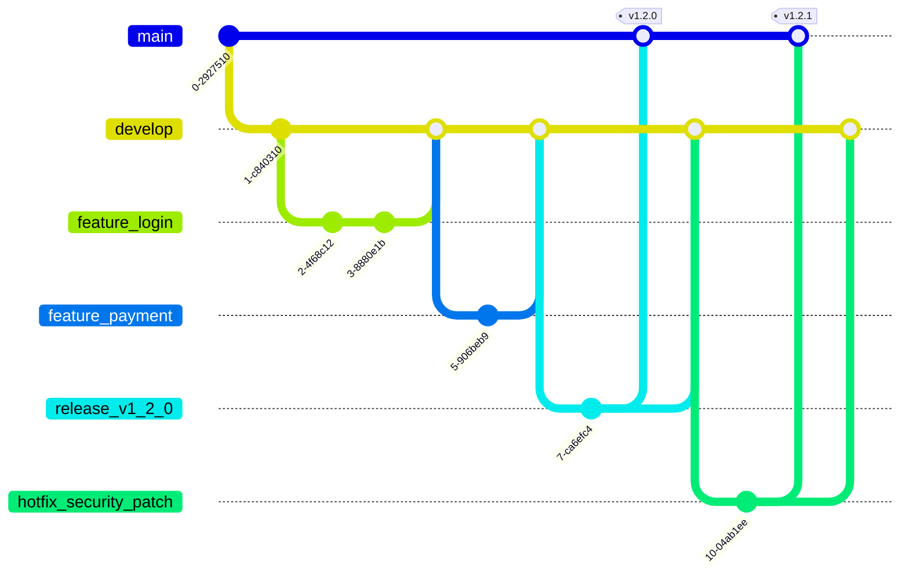
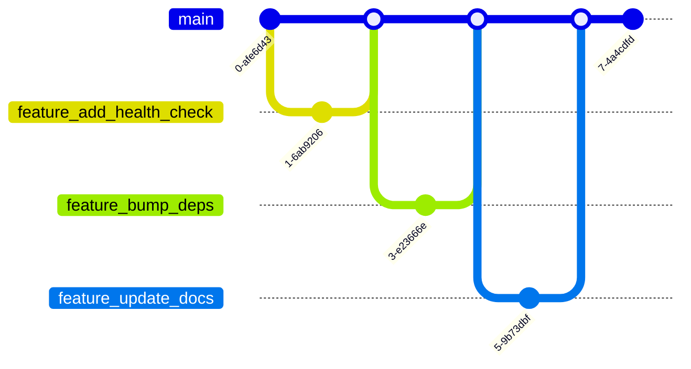
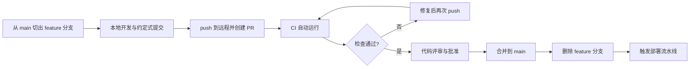

# 版本控制与分支策略

> 所属计划: [[plan|CI/CD 完整学习计划]]
> 预计耗时: 60min
> 前置知识: [[01-ci-cd-devops-overview]]

---

## 1. 概念讲解

如果把 CI/CD 流水线比作一条高速公路，那么分支策略就是高速公路的入口匝道和红绿灯。它决定了什么样的代码可以进入主线、什么时候可以进入、以及进入之前必须经过哪些检查。分支策略没想清楚，CI/CD 再花哨也只是把混乱自动化得更快而已。

### 为什么分支策略是 CI/CD 的地基

CI 的核心理念是“频繁集成”。频繁集成的前提是：每个人都能把改动安全地合并到同一条主线上。分支策略回答了两个问题：

1. **代码在哪里集成？** 通常就是 `main` 分支。
2. **什么时候集成？** 是每天一次、每次 PR 一次，还是等到版本发布前才合并？

`main` 分支必须始终处于**可发布（可部署）**状态。这是 CI/CD 世界的一条铁律。它的意思是：任何时刻从 `main` 切出的代码都应该能构建、能通过测试、能部署到生产环境。如果 `main` 长期处于“半吊子”状态，CI/CD 的自动化部署就失去了意义——你不敢真的把它自动推到线上。

分支策略直接影响 CI 的痛苦程度：

- 分支活得越久，合并时冲突越多，集成越痛苦。
- 直接往 `main` push 代码，等于绕过了所有自动化检查和人工评审。
- 提交消息写得太随意，后续生成版本号和变更日志时只能手动整理。

所以，分支策略不是 Git 的细枝末节，而是 CI/CD 能不能真正跑起来的地基。

### 两大主流模型对比：GitFlow vs Trunk-Based Development

#### GitFlow：多长期分支的发布型模型

GitFlow 由 Vincent Driessen 提出，适合**按版本发布**的软件产品，比如桌面客户端、移动 App、嵌入式固件。它的特点是长期存在多条分支：

- `main`：只保留已发布的稳定版本。
- `develop`：日常开发的集成分支。
- `feature/*`：从 `develop` 切出，开发新功能。
- `release/*`：从 `develop` 切出，进入版本冻结和回归测试。
- `hotfix/*`：从 `main` 切出，紧急修复线上问题。



GitFlow 的好处是职责清晰：新功能、版本发布、紧急修复各有各的航道。坏处也很明显：分支多、流程重、合并路径长。如果团队追求的是**持续部署**，GitFlow 会把节奏拖慢。

#### Trunk-Based Development：短命分支的持续集成模型

Trunk-Based Development（基于主干的开发，简称 TBD）主张几乎所有开发都在 `main`（trunk）上进行。功能分支必须**短命**，通常几小时到一两天，合并前通过 CI 和代码评审验证。



TBD 的精髓是：

- 每个开发者每天都向 `main` 合并多次。
- 功能未完成的代码可以通过**特性开关（feature flag）**隐藏在主线上，而不是藏在长期分支里。
- CI 必须极快，否则频繁合并会被阻塞。

TBD 适合**持续部署的 SaaS、Web 后端、API 服务**。它要求团队纪律性强、自动化测试完善。如果测试覆盖不足，频繁合并会把缺陷直接带进 `main`。

#### 选型参考

| 场景 | 推荐模型 | 理由 |
|------|----------|------|
| 每两周/每月发版的移动 App、桌面客户端 | GitFlow | 需要版本冻结、回归测试、热修复通道 |
| 持续部署的 Web 服务、API、SaaS | Trunk-Based | 发布节奏快，功能通过特性开关控制 |
| 初创团队、个人项目、学习项目 | GitHub Flow（TBD 的简化版） | 流程最轻，最容易落地 |

### GitHub Flow：本计划推荐的分支模型

本计划面向 CI/CD 初学者，推荐使用 **GitHub Flow**。它是 Trunk-Based Development 的简化版，只有两条分支：

- `main`：唯一长期分支，始终可部署。
- `feature/*`：短命功能分支，用完即删。

整个流程如下图所示：



GitHub Flow 的规则非常简单：

1. `main` 上的任何内容都是可部署的。
2. 新功能从 `main` 切出分支，命名清晰，如 `feature/add-quote-filter`。
3. 在本地完成开发并通过测试后，push 到远程并创建 Pull Request。
4. PR 触发 CI 流水线（lint、test、构建等）。
5. 必须有至少一名 reviewer 批准，且 CI 全部通过，才能合并。
6. 合并后立刻删除 feature 分支，保持仓库整洁。

本节的代码示例会完整演示一次 GitHub Flow 循环。

### Pull Request 工作流：协作仪式与 CI 触发点

Pull Request（PR，合并请求）不仅仅是一个 Git 技术操作，它是现代软件团队的**协作仪式**。一次完整的 PR 工作流包含：

1. **创建 PR**：说明改动目的、影响范围、测试方式。一个好的 PR 描述能节省 reviewer 大量时间。
2. **CI 自动运行**：PR 创建或更新时，GitHub Actions 等 CI 工具会自动运行流水线。这是 CI 的主要触发点之一，详情见 [[04-github-actions-intro]]。
3. **代码评审（Code Review）**：同事检查代码逻辑、命名、边界情况、安全风险。
4. **讨论与修改**：根据反馈 push 新的 commit，CI 会再次运行。
5. **合并（Merge）**：CI 通过且 reviewer 批准后，将代码合并到 `main`。
6. **删除分支**：合并后删除 feature 分支，避免仓库里堆满僵尸分支。

PR 的价值在于把集成从“个人行为”变成“团队共识”。没有经过 PR 的代码不应该进入 `main`，这是一条必须被工具强制执行的规则，而不是靠自觉。

### 约定式提交：让提交消息成为机器可读的数据

**约定式提交（Conventional Commits）** 是一种提交消息的书写规范。它的格式如下：

```text
<type>[optional scope]: <description>

[optional body]

[optional footer(s)]
```

常见的 `type` 有：

- `feat`：新功能。
- `fix`：修复 bug。
- `docs`：仅文档改动。
- `style`：不影响代码含义的格式改动（空格、分号、缩进）。
- `refactor`：重构，既不修复 bug 也不添加功能。
- `perf`：性能优化。
- `test`：增加或修正测试。
- `chore`：构建过程、辅助工具、依赖升级等杂项。

如果改动包含不兼容的变更，需要在 footer 中标注 `BREAKING CHANGE:`，例如：

```text
feat(api): 返回 JSON 对象替代纯文本

BREAKING CHANGE: `/quote` 端点现在返回 `{ "quote": "..." }`，不再返回纯字符串。
```

约定式提交的价值在于：

- **自动生成版本号**：`feat` 通常触发次版本号升级，`fix` 触发修订号升级，`BREAKING CHANGE` 触发主版本号升级。
- **自动生成变更日志**：工具可以根据 `type` 把提交归类到“新增功能”、“Bug 修复”、“破坏性变更”等章节。
- **提高可读性**：任何人扫一眼提交历史，就能快速判断改动性质。

自动版本号和变更日志的具体实现会在 [[14-release-semver]] 中深入讲解。

### 保护分支：让 CI 规则真正生效

如果 `main` 分支允许任何人直接 push，那么前面说的所有规则都会形同虚设。**分支保护规则（Branch Protection Rules）** 是 GitHub/GitLab 等平台的强制机制，用来把“最佳实践”变成“无法违反的规则”。

推荐为 `main` 开启以下保护规则：

- **禁止直接 push**：所有改动必须通过 PR 合并。
- **必须至少 1 人 review 批准**：不能自己合并自己的 PR。
- **必须解决所有 conversation**：确保 reviewer 提出的问题被处理。
- **必须状态检查通过**：CI 流水线（如 `lint`、`test`、`build`）必须全部绿色。
- **要求分支最新才能合并**：合并前必须和 `main` 保持同步，防止“本地通过、线上挂掉”。
- **限制谁能推送**：只有特定成员或团队可以合并到 `main`。
- **删除分支后自动清理**：虽然这不属于分支保护，但建议在仓库设置中开启“合并后删除 head 分支”。

保护分支是 CI 生效的最后防线。没有它，CI 只是“建议”；有了它，CI 才是“门禁”。

---

## 2. 代码示例

下面以贯穿本计划的 `quote-api` 项目为例，演示一次完整的 GitHub Flow 循环。假设本地已经克隆了仓库 `your-username/quote-api`，并且当前在 `main` 分支。

**运行方式:**

```bash
# 1. 确保本地 main 分支是最新的
#    这是 GitHub Flow 的起点：main 必须时刻可部署。
git checkout main
git pull origin main

# 2. 从 main 切出一个短命 feature 分支
#    分支名要语义清晰，通常用 feature/、fix/、docs/ 等前缀。
git checkout -b feature/add-health-check

# 3. 修改代码，例如新增 /health 端点
#    这里只示意修改了 src/index.ts
echo '// 新增 /health 端点的示意代码' >> src/index.ts

# 4. 暂存改动
git add src/index.ts

# 5. 使用约定式提交书写提交消息
#    feat: 表示新功能；括号内是作用域（scope），可选。
git commit -m "feat(api): 新增 /health 健康检查端点"

# 6. 将 feature 分支推送到远程
#    -u 参数建立本地分支与远程分支的关联，后续可直接 git push。
git push -u origin feature/add-health-check

# 7. 在 GitHub 上创建 Pull Request
#    实际工作中打开浏览器，访问 https://github.com/your-username/quote-api/pull/new/feature/add-health-check
#    填写标题和描述，发起 PR。
#    PR 创建后会自动触发 CI 流水线（下一节 [[04-github-actions-intro]] 会详细配置）。

# 8. 根据 review 反馈继续修改并再次 push
#    这里假设 reviewer 建议补充测试。
git add tests/quotes.test.ts
git commit -m "test(api): 补充 /health 端点的单元测试"
git push

# 9. CI 全部通过、reviewer 批准后，在 PR 页面点击 "Merge pull request"
#    合并策略通常选择 "Create a merge commit" 或 "Squash and merge"。
#    合并完成后，切回 main 并同步远程最新代码。
git checkout main
git pull origin main

# 10. 删除本地和远程的 feature 分支，保持仓库整洁
#     远程分支通常由 GitHub 在合并后自动删除；本地分支需要手动清理。
git branch -d feature/add-health-check
git push origin --delete feature/add-health-check
```

**预期输出:**

```text
Switched to branch 'main'
Your branch is up to date with 'origin/main'.
Already up to date.
Switched to a new branch 'feature/add-health-check'
[feature/add-health-check abc1234] feat(api): 新增 /health 健康检查端点
 1 file changed, 1 insertion(+)
Enumerating objects: 5, done.
Counting objects: 100% (5/5), done.
Delta compression using up to 8 threads
Compressing objects: 100% (3/3), done.
Writing objects: 100% (3/3), 312 bytes | 312.00 KiB/s, done.
Total 3 (delta 2), reused 0 (delta 0), pack-reused 0
remote: Resolving deltas: 100% (2/2), completed with 2 local objects.
To https://github.com/your-username/quote-api.git
 * [new branch]      feature/add-health-check -> feature/add-health-check
branch 'feature/add-health-check' set up to track 'origin/feature/add-health-check'.
Switched to branch 'main'
Your branch is up to date with 'origin/main'.
Deleted branch feature/add-health-check (was abc1234).
 - [deleted]         feature/add-health-check
```

### 约定式提交消息示例库

下面是 `quote-api` 项目可能用到的一组约定式提交消息，覆盖常见类型和破坏性变更：

```text
feat(api): 新增按作者过滤名言的查询参数

fix(quotes): 修复空数组时 getRandomQuote 抛出的越界异常

docs(readme): 补充本地启动和测试说明

chore(deps): 升级 express 到 5.x

refactor(server): 将服务器启动逻辑抽取到独立的 server.ts

perf(quotes): 使用 Map 缓存作者索引，提升查询效率

test(quotes): 为 getQuoteCount 添加边界值测试

feat(api)!: 将 /quote 返回值改为 JSON 格式

BREAKING CHANGE: 客户端需要从解析纯文本改为解析 JSON。
```

---

## 3. 练习

### 练习 1: [基础] 写 5 条约定式提交消息

请为 `quote-api` 项目中的以下场景写出符合 Conventional Commits 规范的提交消息。场景分别为：

1. 新增一个返回所有名言列表的接口。
2. 修复某个接口在特殊字符输入下崩溃的 bug。
3. 更新 README 中的安装说明。
4. 升级 `vitest` 依赖版本。
5. 修改 API 响应结构，导致旧客户端必须同步改造（破坏性变更）。

### 练习 2: [进阶] 设计一份分支保护规则清单

假设你是 `quote-api` 项目的维护者，请为 `main` 分支设计一份“PR 合并前必须满足的条件”清单。至少包含 5 条规则，并说明每条规则防止了什么问题。

### 练习 3: [挑战]（可选）为移动 App 选型分支策略

某移动 App 团队每两周发布一个版本到应用商店，版本发布前需要 3 天回归测试，且线上 bug 需要快速热修复。请对比 GitFlow 和 Trunk-Based Development，为该团队选择一种分支策略并说明理由。如果推荐 GitFlow，请说明如何安排 `release` 分支；如果推荐 Trunk-Based，请说明如何弥补“版本冻结”的缺失。

---

## 3.5 参考答案

> [!tip]- 练习 1 参考答案
> 以下只是示例，只要符合 `type(scope): description` 格式即可：
>
> 1. `feat(api): 新增 GET /quotes 返回全部名言列表`
> 2. `fix(api): 处理特殊字符输入导致的接口崩溃`
> 3. `docs(readme): 更新安装说明和系统要求`
> 4. `chore(deps): 升级 vitest 到最新版本`
> 5. `feat(api)!: 将 /quotes 返回结构改为嵌套 JSON`
>    `BREAKING CHANGE: 旧客户端需适配新的 { quotes: [...] } 响应格式。`

> [!tip]- 练习 2 参考答案
> 参考的 `main` 分支保护规则清单：
>
> 1. **禁止直接 push 到 `main`**：强制所有改动走 PR，保留评审和 CI 记录。
> 2. **必须至少 1 名 reviewer 批准**：防止单人决策，提升代码质量。
> 3. **必须 CI 状态检查通过**：确保 lint、test、build 全部绿色才能合并。
> 4. **要求分支在合并前与 `main` 同步**：避免 reviewer 批准的是旧代码，合并后才暴露冲突或失败。
> 5. **必须解决所有 review conversation**：防止 reviewer 提出的问题被忽略。
> 6. **限制合并权限到核心维护者**：降低误操作和被入侵账户造成破坏的风险。

> [!tip]- 练习 3 参考答案（可选）
> **推荐 GitFlow。**
>
> 理由：
> - 移动 App 每两周发版，发布前需要版本冻结和回归测试，正好对应 GitFlow 的 `release/*` 分支。
> - 线上 bug 需要热修复，GitFlow 的 `hotfix/*` 分支提供了从 `main` 直接修复并回合并到 `main` 和 `develop` 的通道。
> - Trunk-Based 强调每天多次合并到 `main` 并持续部署，但应用商店审核和版本发布的“批次感”与持续部署节奏不匹配。
>
> 实施要点：
> - `develop` 作为日常开发集成分支。
> - 发版前一周从 `develop` 切出 `release/vX.Y.Z`，只接受 bug 修复，不再合并新功能。
> - 回归测试完成后，`release/vX.Y.Z` 合并到 `main` 并打 tag；同时合并回 `develop`。
> - 线上紧急 bug 从 `main` 切出 `hotfix/*`，修复后同时合并回 `main`（打 tag）和 `develop`。
> - 新功能开发仍然使用短命 `feature/*` 分支，但目标分支是 `develop` 而不是 `main`。

> [!note] 答案使用方式
> 先独立完成练习，再展开查看参考答案。参考答案不是唯一解——如果你的实现通过了测试或达到了题目要求，就是正确的。

---

## 4. 扩展阅读

- [Trunk-Based Development 官网](https://trunkbaseddevelopment.com/)
- [Conventional Commits 官方规范](https://www.conventionalcommits.org/)
- [GitHub 文档：关于受保护分支](https://docs.github.com/en/repositories/configuring-branches-and-merges-in-your-repository/managing-protected-branches/about-protected-branches)

---

## 常见陷阱

- **feature 分支活太久**：几天甚至几周都不合并，最终陷入“合并地狱”。正确做法是：分支生命周期尽量控制在 1–2 天内，功能太大就拆小或用特性开关。
- **直接 push `main`，绕过 CI**：即使改动很小，也应该走 PR。正确做法是：为 `main` 开启保护规则，禁止直接 push。
- **提交消息随意**：只写“fix”、“update”、“改 bug”，无法自动生成变更日志。正确做法是：采用约定式提交，让提交历史成为机器可读的数据。
- **合并后忘记删除 feature 分支**：远程仓库会堆积大量僵尸分支，既混乱又影响性能。正确做法是：开启 GitHub 的“合并后删除 head 分支”选项，并定期清理本地分支。
- **忽视 PR 描述**：一个只有标题没有描述的 PR 会让 reviewer 无从下手。正确做法是：说明改动背景、做了什么、如何测试、潜在风险。
