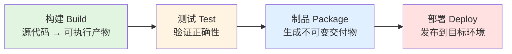
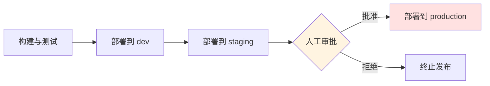

# 流水线核心概念

> 所属计划: [[plan|CI/CD 完整学习计划]]
> 预计耗时: 60min
> 前置知识: [[01-ci-cd-devops-overview]]

---

## 1. 概念讲解

### 1.1 流水线是什么

想象一座汽车制造厂：车身、发动机、座椅、轮胎在不同的工位上按固定顺序移动，每个工位只做一件事，最后从厂房另一端开出一辆完整的汽车。软件交付的**流水线（Pipeline）**也是类似的装置——它把一行行源代码，按照预定的顺序和依赖关系，经过编译、测试、打包、部署等工序，最终变成用户可以使用的软件。

更正式地说：

> **流水线是一组按顺序或依赖关系执行的自动化阶段（stage），它们将源代码转换成可交付的产物，并尽可能地减少人工干预。**

在 [[01-ci-cd-devops-overview]] 中我们已经看到，CI/CD 的目标是让软件交付变得可靠、快速、可重复。流水线正是实现这一目标的核心机制。没有流水线，每次发布都要靠某个工程师在本地手动执行一长串命令，既容易出错，也难以追溯。

### 1.2 四大核心阶段

尽管不同团队、不同技术栈的流水线千差万别，但绝大多数流水线都可以归纳为四个核心阶段：

**构建（Build）→ 测试（Test）→ 制品/打包（Package/Artifact）→ 部署（Deploy）**

这四个阶段的关系可以用下面这张图表示：



下面逐个拆开来看。

#### 构建（Build）

- **输入**：源代码仓库中的文件（TypeScript、C#、Lua 等）。
- **工作**：安装依赖、编译/转译、链接、生成中间文件。
- **输出**：可以直接运行的字节码、二进制文件或前端 `dist/` 目录。
- **关键词**：编译、依赖安装、`npm install`、`dotnet build`。

以贯穿本计划的 `quote-api` 项目为例，构建阶段会把 `src/index.ts`、`src/quotes.ts` 等 TypeScript 文件编译成 Node.js 可以运行的 JavaScript。

#### 测试（Test）

- **输入**：构建阶段产生的可运行产物。
- **工作**：运行单元测试、集成测试，甚至静态检查（lint、类型检查）。
- **输出**：测试报告、覆盖率数据、通过/失败的状态。
- **关键词**：`vitest`、`jest`、`xUnit`、覆盖率、lint。

测试阶段是流水线的“质量闸门”。如果测试失败，流水线应该立即停止，避免把有问题的代码继续往下传。

#### 制品/打包（Package / Artifact）

- **输入**：通过测试的构建产物。
- **工作**：把产物打包成适合分发和部署的形式。
- **输出**：JAR 包、NuGet 包、Docker 镜像、前端 `dist` 压缩包等。
- **关键词**：`docker build`、镜像标签、版本化产物。

制品阶段解决的是“拿什么去部署”的问题。一个好的制品应该是**不可变**的：一旦生成，就不应该被再次修改，只能被部署到不同环境。

#### 部署（Deploy）

- **输入**：制品阶段生成的交付物。
- **工作**：把制品安装到目标环境并启动服务。
- **输出**：运行中的应用程序、可访问的 URL、健康检查报告。
- **关键词**：`kubectl apply`、蓝绿部署、金丝雀发布。

部署阶段本身可以拆成多个子阶段，例如先部署到 `staging` 环境，再部署到 `production`。下一小节会专门讲环境分层与审批。

下表总结了四个阶段的输入、输出和典型工具（仅作示意）：

| 阶段 | 输入 | 输出 | 典型动作 |
|------|------|------|----------|
| 构建 | 源代码 | 可执行产物 | 安装依赖、编译 |
| 测试 | 构建产物 | 测试报告/状态 | 单元测试、lint |
| 制品 | 通过测试的产物 | 不可变交付物 | 打包、生成 Docker 镜像 |
| 部署 | 制品 | 运行中的服务 | 推送到环境、健康检查 |

### 1.3 流水线即代码（Pipeline as Code, PaC）

在 CI/CD 早期，很多工具（例如老版本的 Jenkins）需要在网页界面上点击按钮、填写表单来配置流水线。这种配置方式存在几个问题：

- **无法版本控制**：配置保存在数据库里，出了问题很难知道是谁改的、改了什么。
- **难以评审**：没有 PR 机制，变更未经同事 review 就可能上线。
- **难以复现**：本地无法复现服务器上的配置，调试困难。
- **回滚困难**：一旦配置改坏，恢复很麻烦。

**流水线即代码（Pipeline as Code, PaC）** 改变了这一切。它的核心思想是：

> **把流水线的定义写成文本文件（通常是 YAML），和源代码一起放在版本控制仓库里。**

这样做的好处是：

- 流水线的变更也有 `git log`，可以追溯到每一次修改。
- 修改流水线可以通过 Pull Request 进行评审，和代码变更一样规范。
- 任何人都可以在本地阅读和理解流水线的完整定义。
- 需要回滚时，直接 `git revert` 即可。

在本计划中，GitHub Actions 的 `ci.yml`、GitLab CI/CD 的 `.gitlab-ci.yml` 都是 PaC 的典型实现。它是现代 CI/CD 最重要的概念之一，也是区分“现代流水线”和“老式手动配置”的关键标志。

### 1.4 触发器（Triggers）

流水线不会无缘无故地运行，它需要一个**触发器（Trigger）**来启动。常见的触发方式包括：

- **Push**：开发者推送代码到某个分支时触发。例如 `main` 分支收到新提交后运行完整 CI。
- **Pull Request（PR）**：有人发起合并请求时触发，用于在合并前验证代码。
- **Tag / Release**：给代码打标签（如 `v1.2.0`）时触发，通常用于发布。
- **定时触发（Cron）**：按计划周期运行，例如每天凌晨跑一遍端到端测试。
- **手动触发**：工程师在界面上点击“Run workflow”，常用于调试或紧急发布。
- **上游仓库变更**：某个依赖仓库更新后，自动触发下游项目重新构建。
- **Webhook**：外部系统（如代码审查工具、安全扫描平台）通过 HTTP 请求触发流水线。

不同的触发器适合不同的阶段。例如：

- PR 触发适合“构建 + 测试”，确保合并前代码没问题。
- `main` 分支的 push 触发适合“构建 + 测试 + 制品”。
- Tag 推送或手动触发适合“部署到生产环境”。

### 1.5 运行器 / 执行器（Runner / Agent）

流水线的每一个任务最终都要在某种计算机上执行，这台计算机就叫做**运行器（Runner）**或**执行器（Agent）**。根据归属方式，运行器通常分为两类：

#### 托管运行器（Hosted Runner）

由 CI/CD 平台提供，例如：

- GitHub Actions 的 GitHub-hosted runners。
- GitLab CI/CD 的 GitLab SaaS runners。
- Azure Pipelines 的 Microsoft-hosted agents。

优点：开箱即用、维护成本低、可按需扩展。
缺点：环境固定、可能有网络限制、对私有网络或特殊硬件支持有限。

#### 自托管运行器（Self-hosted Runner）

由团队自己搭建和维护，运行在自有服务器、虚拟机或 Kubernetes 集群中。

优点：可以使用私有网络、安装特殊软件、长期缓存依赖、控制成本。
缺点：需要自行维护安全补丁、清理磁盘、监控可用性。

无论哪种运行器，现代 CI/CD 都有一个重要原则：**每次运行尽量从一个干净、可复现的环境开始。** 这意味着：

- 每次构建不会受到上一次构建残留文件的污染。
- 依赖不会被默认保留，需要显式声明和缓存。
- 结果更可靠，也更方便排查问题。

> 注意：干净环境和“缓存依赖”并不矛盾。缓存是为了提速，但缓存应该是显式、可控的，而不是运行器上随机留下的旧文件。

### 1.6 环境与审批（Environments & Approvals）

部署不是一次性把代码丢到生产环境，而是按照环境分层逐步推进。常见的环境有：

- **dev / 开发环境**：开发者验证功能，经常重置，稳定性要求低。
- **staging / 测试环境 / 预发布环境**：尽量模拟生产，用于 QA、集成测试、演示。
- **production / 生产环境**：面向真实用户，要求最高稳定性。



环境和审批的结合，是区分**持续交付（Continuous Delivery）**和**持续部署（Continuous Deployment）**的关键：

- **持续交付**：流水线自动把制品准备好，但部署到生产环境需要人工审批。
- **持续部署**：只要代码通过所有自动化验证，就自动部署到生产环境，无需人工干预。

两者没有绝对的优劣，取决于业务对发布速度和安全性的要求。对于金融、医疗等高风险场景，生产环境通常必须设置审批门禁，防止误触上线。

### 1.7 制品（Artifact）

**制品**是流水线构建阶段的输出物，也是部署阶段的输入物。它可以是：

- 编译后的二进制文件或 JAR 包。
- 前端项目的 `dist/` 目录压缩包。
- Docker 镜像。
- 安装包、Helm chart、Terraform 配置等。

制品最重要的属性是**不可变性**：

> **一次构建，到处部署（build once, deploy many）。**

也就是说，同一个制品应该原封不动地从 `staging` 部署到 `production`，而不是每个环境重新构建一次。这样做的好处我们会在练习里进一步讨论。

为了保证可追溯，制品通常还需要：

- 与某一次代码提交（commit SHA）绑定。
- 有明确的版本号或镜像标签。
- 在仓库或制品库中保留一段时间，方便回滚。

### 1.8 为下一节做铺垫

理解了流水线、阶段、触发器、运行器、环境和制品之后，下一节 [[04-github-actions-intro]] 会把这些概念映射到 GitHub Actions 的具体术语上：

| 本节概念 | GitHub Actions 对应 |
|----------|----------------------|
| 流水线 | Workflow（工作流） |
| 阶段 | Job（任务） |
| 步骤 | Step（步骤） |
| 运行器 | Runner（运行器） |
| 触发器 | `on:` 事件 |
| 制品 | `actions/upload-artifact` / `actions/download-artifact` |

这些对应关系你现在不需要背下来，混个眼熟即可。

---

## 2. 代码示例

下面是一个**概念性的流水线骨架**，用 YAML 描述 `quote-api` 项目可能经历的阶段。这不是真实可运行的 GitHub Actions 语法，而是为了帮你建立“阶段 → 任务 → 步骤”的心智模型。

```yaml
# pipeline-skeleton.yml
# 注意：这是抽象骨架，不是真正的 GitHub Actions 语法！
# 真实可运行的版本会在 [[04-github-actions-intro]] 中给出。

project: quote-api
version: "1.0.0"

# 触发器：哪些事件会启动这条流水线
triggers:
  - push: [main]
  - pull_request: [main]

# 流水线分为四个阶段
stages:
  - name: build
    jobs:
      - name: compile-and-install
        runner: ubuntu-latest
        steps:
          - checkout-source-code
          - run: npm ci          # 安装依赖
          - run: npm run build   # 编译 TypeScript

  - name: test
    needs: [build]               # 依赖 build 阶段完成
    jobs:
      - name: unit-tests
        runner: ubuntu-latest
        steps:
          - checkout-source-code
          - run: npm ci
          - run: npm run build
          - run: npm run test    # 跑单元测试
          - run: npm run lint    # 静态检查

  - name: package
    needs: [test]                # 依赖 test 阶段通过
    jobs:
      - name: docker-image
        runner: ubuntu-latest
        steps:
          - checkout-source-code
          - run: docker build -t quote-api:1.0.0 .
          - run: docker push ghcr.io/your-username/quote-api:1.0.0

  - name: deploy
    needs: [package]
    environment: staging         # 目标环境
    approval: false              # staging 不需要人工审批
    jobs:
      - name: deploy-to-staging
        runner: ubuntu-latest
        steps:
          - run: kubectl set image deployment/quote-api quote-api=ghcr.io/your-username/quote-api:1.0.0

  - name: deploy-production
    needs: [deploy]
    environment: production
    approval: true               # 生产环境需要人工审批
    jobs:
      - name: deploy-to-production
        runner: ubuntu-latest
        steps:
          - run: kubectl set image deployment/quote-api quote-api=ghcr.io/your-username/quote-api:1.0.0
```

**运行方式：**

```bash
# 本文件仅为概念示例，不能直接在本地运行。
# 它的作用是帮助你理解“阶段 → 任务 → 步骤”的层级关系。
# 第 04 节会提供可在 GitHub Actions 中真实运行的 ci.yml。
```

**预期执行顺序：**

```text
触发：push 到 main 分支
│
├─ [build] compile-and-install
│   ├─ checkout
│   ├─ npm ci
│   └─ npm run build
│
├─ [test] unit-tests  （依赖 build 成功）
│   ├─ npm run build
│   ├─ npm run test
│   └─ npm run lint
│
├─ [package] docker-image  （依赖 test 成功）
│   └─ docker build / push
│
├─ [deploy] deploy-to-staging  （依赖 package 成功）
│   └─ kubectl set image
│
└─ [deploy-production] deploy-to-production  （依赖 staging 成功 + 人工审批）
    └─ kubectl set image
```

这个骨架体现了本节最核心的几条原则：阶段之间有依赖、测试失败会阻断后续阶段、同一个制品被部署到不同环境、生产环境需要审批。

---

## 3. 练习

### 练习 1: [基础] 给流水线的步骤排序

下面这五个动作是一个 `quote-api` 类型的项目常见的 CI/CD 步骤：

1. 拉取依赖并编译
2. 跑单元测试
3. 打包 Docker 镜像
4. 部署到测试环境
5. 部署到生产环境

请把它们组织成合理的流水线阶段顺序，并说明理由。

### 练习 2: [进阶] 为什么“一次构建，到处部署”

有人说：“每个环境都重新 `docker build` 一次，不是更灵活吗？反正代码一样。”

请从**一致性**和**可追溯性**两个角度解释，为什么 CI/CD 最佳实践强调“build once, deploy many”。

### 练习 3: [挑战]（可选）设计 TypeScript Web 项目的三环境部署门禁

假设你正在维护一个 TypeScript 前端项目（例如用 Vite 构建的 SPA），需要支持 `dev`、`staging`、`production` 三个环境。请设计一套部署门禁策略，要求：

- `dev` 环境可以自动部署，方便开发者验证。
- `staging` 环境在合并到 `main` 分支后自动部署。
- `production` 环境必须人工审批，并且只能使用 `staging` 验证过的同一批制品。

请用流程图或文字描述你的设计。

---

## 3.5 参考答案

> [!tip]- 练习 1 参考答案
> 合理顺序如下：
>
> 1. **拉取依赖并编译**（构建阶段）
> 2. **跑单元测试**（测试阶段）
> 3. **打包 Docker 镜像**（制品阶段）
> 4. **部署到测试环境**（部署阶段：staging）
> 5. **部署到生产环境**（部署阶段：production，通常需要审批）
>
> **理由**：必须先有编译产物才能测试；测试通过才能确保制品值得保存；有了制品才能部署；生产环境应该最后部署，并且加上人工审批。这个顺序体现了“质量前置、风险后置”的流水线思想。

> [!tip]- 练习 2 参考答案
> “一次构建，到处部署”的核心价值在于保证**可重复性**和**可追溯性**：
>
> - **一致性**：如果每个环境重新构建，构建工具的缓存、网络状态、依赖解析的时序、基础镜像的更新都可能导致产物不同。典型结果是“staging 测试通过，production 却起不来”。
> - **可追溯性**：一个不可变的制品可以与唯一的 commit SHA、流水线编号、镜像标签绑定。出问题的时候可以精确回滚到上一个已知良好的制品，而不是重新跑一遍构建再祈祷结果一样。
> - **信心**：团队可以确信“我在 staging 验证过的就是这个镜像，原封不动地搬到 production”，而不是“代码看起来一样，但构建产物可能不一样”。
>
> 因此，正确做法是：在流水线中生成一个制品，把它上传到制品库，然后在不同环境中下载同一个制品进行部署。

> [!tip]- 练习 3 参考答案（可选）
> 一种可行的设计：
>
> - **`dev` 环境**：开发者向 `feature/*` 或 `dev` 分支 push 时，触发流水线跑 lint + test + build，成功后自动部署到 `dev` 环境。目的是快速反馈。
> - **`staging` 环境**：PR 合并到 `main` 分支后，触发完整流水线。构建产物（例如 `dist/` 压缩包或 Docker 镜像）被打上基于 commit SHA 的标签，自动部署到 `staging` 环境，供 QA 和集成测试使用。
> - **`production` 环境**：只有当 `staging` 验证通过，并且由产品经理或值班工程师在 CI/CD 平台上点击“批准”后，才把**同一个**制品部署到 `production`。不允许在 production 阶段重新构建。
>
> 触发条件总结：
>
> | 环境 | 触发条件 | 审批 |
> |------|----------|------|
> | dev | push 到 dev/feature 分支 | 否 |
> | staging | PR 合并到 main | 否 |
> | production | staging 验证通过 + 手动触发 | 是 |
>
> 这样可以兼顾开发效率和发布安全。

> [!note] 答案使用方式
> 先独立完成练习，再展开查看参考答案。参考答案不是唯一解——如果你的实现通过了测试或达到了题目要求，就是正确的。

---

## 4. 扩展阅读

- [Martin Fowler: DeploymentPipeline](https://martinfowler.com/bliki/DeploymentPipeline.html) —— 流水线概念的经典定义。
- [Continuous Delivery: Pipeline Patterns](https://continuousdelivery.com/implementing/patterns/) —— Jez Humble 关于持续交付与流水线的深入资料。
- [GitHub Docs: 关于 GitHub-hosted runners](https://docs.github.com/en/actions/using-github-hosted-runners/about-github-hosted-runners) —— 官方对托管运行器的说明。
- [GitHub Docs: 使用环境进行部署](https://docs.github.com/en/actions/deployment/targeting-different-environments/using-environments-for-deployment) —— 关于环境、审批和保护规则的官方指南。

---

## 常见陷阱

- **每个环境重新构建，导致“测试通过但生产挂了”**。正确做法是在一个阶段生成不可变制品，之后所有环境都部署同一个制品。
- **流水线定义散落在 CI 工具网页里，无法 review 也无法回滚**。正确做法是把流水线写成 YAML 文件，和代码一起纳入版本控制（Pipeline as Code）。
- **生产部署没有审批门禁，一个误触就上线**。正确做法是为 `production` 环境配置人工审批或保护规则，并限制有权限的人员范围。
- **把“环境”和“分支”混为一谈**。分支是代码版本概念，环境是运行实例概念；同一份制品可以从 `main` 分支生成，也可以部署到 `staging` 或 `production`。
- **忽略运行器的“干净环境”假设**。如果步骤依赖上一次运行留下的文件，流水线就会变得不稳定。所有依赖和状态都应该显式声明。

---

**下一节**：[[04-github-actions-intro]] —— 把这些概念对应到 GitHub Actions 的真实语法上。

相关深入内容：

- 制品与缓存：[[08-cache-artifacts-deps]]
- 部署策略：[[11-deployment-strategies]]
