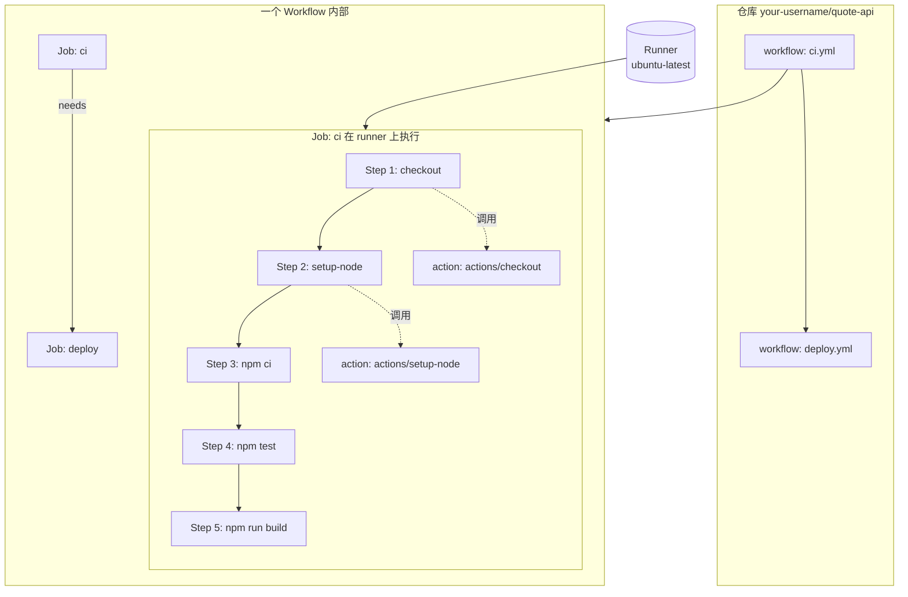

# GitHub Actions 入门

> 所属计划: [[plan|CI/CD 完整学习计划]]
> 预计耗时: 75min
> 前置知识: [[03-pipeline-core-concepts]]

---

## 1. 概念讲解

### 为什么需要这个？

在前一节 [[03-pipeline-core-concepts]] 中，我们把流水线抽象成「触发器 → 构建 → 测试 → 制品 → 部署」这样一条自动化生产线。但生产线不会凭空出现，需要有一个具体平台把它描述出来、调度执行、并把结果展示给你看。

如果你把代码存在 GitHub，最自然的选择就是 **GitHub Actions**。它是 GitHub 内置的 CI/CD 平台：你只要在仓库里放几个 YAML 文件，GitHub 就会在合适的时间（比如 `push`、PR、定时任务）启动虚拟机，自动运行你写好的脚本。你不需要自己买服务器、装 Jenkins、配插件，甚至连运行环境都是 GitHub 准备好的。

不学 GitHub Actions（或等价平台如 GitLab CI、Azure DevOps）的后果是：所有「自动化」都停留在概念层。你依然要手动本地跑测试、手动打包、手动上传，进度慢且容易出错。

### 核心思想

**流水线即代码（Pipeline as Code）** 再次登场：在 GitHub Actions 里，一条流水线就是一个 YAML 文件，放在 `.github/workflows/` 目录下。Git 提交这个文件后，GitHub 立刻就知道该怎么运行你的流水线。

你可以把它想象成一份「自动化菜谱」：

- 菜谱什么时候启用？—— 由触发器决定（`on`）。
- 菜谱分几道菜？—— 由 `job` 决定。
- 每道菜分几步做？—— 由 `step` 决定。
- 在哪个厨房里做？—— 由 `runner` 决定。
- 有没有现成调料包可以偷懒？—— 由 `action` 决定。

### GitHub Actions 是什么

GitHub Actions 是 GitHub 提供的托管 CI/CD 服务。它的核心职责是：

1. 监听仓库事件（`push`、`pull_request`、手动触发、定时等）。
2. 根据 `.github/workflows/*.yml` 中的定义创建流水线实例。
3. 在 GitHub 托管或自托管的运行器（runner）上按顺序执行步骤。
4. 把日志、状态、报告反馈回 PR 或仓库界面。

因为是 GitHub 原生集成，所以权限、代码拉取、PR 状态检查、发布 Release 这些操作都做得非常顺滑。对于个人项目、开源项目和小团队，它几乎是无脑首选。

### 五大核心概念

下面这张图把五个核心概念的层次关系画了出来。注意：**一个仓库可以有多个 workflow；一个 workflow 可以有多个 job；一个 job 可以有多个 step；每个 job 跑在一个 runner 上；step 可以调用现成的 action**。



#### Workflow（工作流）

一个 YAML 文件对应一条流水线。文件名可以随便取，比如 `ci.yml`、`deploy.yml`、`nightly-test.yml`。只要放在 `.github/workflows/` 下，GitHub 就会自动识别。

一个 workflow 里通常包含：

- `name`：流水线在人类界面上的显示名字。
- `on`：触发条件。
- `jobs`：具体要执行的工作单元。

#### Job（任务）

Job 是 workflow 内的一组步骤，跑在同一个 runner 上。一个 workflow 里的多个 job 默认 **并行** 执行；如果你想让某个 job 等另一个 job 跑完，可以用 `needs` 指定依赖。

例如：先跑 `build`，再跑 `deploy`，那么 `deploy` 的 `needs: [build]`。

#### Step（步骤）

Step 是 job 里的最小执行单元，按顺序从上到下执行。每个 step 可以是：

- 一条 shell 命令（`run: npm test`）。
- 调用一个 action（`uses: actions/checkout@v4`）。

Step 之间共享同一个文件系统和环境变量，因此你在 step 1 里 `npm ci` 装好的依赖，step 2 里可以直接用。

#### Runner（运行器）

Runner 是真正执行 job 的机器。GitHub 提供最常见的三种托管运行器：

- `ubuntu-latest`：Linux，最常用，免费额度最友好。
- `windows-latest`：Windows Server。
- `macos-latest`：macOS，适合构建 iOS / macOS 应用。

你也可以搭自己的 `self-hosted runner`，在自己的服务器上跑流水线。本节只使用 `ubuntu-latest`。

#### Action（动作）

Action 是可复用的步骤单元。GitHub 官方维护了很多常用 action，比如：

- `actions/checkout@v4`：把仓库代码拉取到 runner。
- `actions/setup-node@v4`：安装指定版本的 Node.js 并配置缓存。
- `actions/upload-artifact@v4`：把构建产物上传到 GitHub 供后续 job 下载。

社区把这些 action 发布到 **GitHub Marketplace**。用别人写好的 action 能省很多事，但要注意供应链安全——尽量使用官方或经过验证的 action，避免用 stars 少、多年不更新的第三方 action。第 15 节 [[15-devsecops]] 会再深入讲这个风险。

### 触发器 `on`

`on` 字段决定 workflow 什么时候运行。最常用的触发器有：

| 触发器 | 含义 | 示例场景 |
|--------|------|----------|
| `push` | 有代码被推送到指定分支 | 每次提交都跑 CI |
| `pull_request` | 有 PR 被创建、更新、同步 | PR 检查必须通过才能合并 |
| `workflow_dispatch` | 手动在 Actions 标签页点击运行 | 临时调试、手动发布 |
| `schedule` | 按 cron 表达式定时触发 | 每晚跑集成测试、依赖健康检查 |

最常见的组合写法如下：

```yaml
on:
  push:
    branches: [main]
  pull_request:
    branches: [main]
  workflow_dispatch:
```

这表示：只要往 `main` 分支 push、或者对 `main` 分支发 PR、或者手动点击运行，都会触发这条流水线。

### 与第 03 节概念的映射

如果你已经理解了 [[03-pipeline-core-concepts]] 里的通用流水线术语，可以按下面这张表把概念对应到 GitHub Actions：

| 第 03 节通用概念 | GitHub Actions 对应 | 说明 |
|------------------|---------------------|------|
| Pipeline（流水线） | Workflow | 一个 YAML 文件就是一条流水线 |
| Stage（阶段） | Job | 同一类任务的集合，可并行或串行 |
| Task（任务） | Step | 单个命令或 action 调用 |
| Executor（执行器） | Runner | 实际执行 job 的机器 |
| Trigger（触发器） | `on` 字段 | 决定何时启动流水线 |
| Artifact（制品） | `actions/upload-artifact` | 把产物保存下来供后续使用 |

这套映射对学习 GitLab CI、Azure DevOps 等其他平台也很有帮助——核心概念大同小异，只是 YAML 关键字不同。

### Actions Marketplace 简介

GitHub Marketplace 是一个 action 集市，你可以在上面搜索别人封装好的步骤，比如 `docker/build-push-action`、`codecov/codecov-action`、`softprops/action-gh-release` 等。

选择 action 时的安全 checklist：

- 优先使用 `actions/` 命名空间下的官方 action。
- 其次选择带有「蓝色对勾」的 Verified Creator（如 `docker/`、`microsoft/`）。
- 看最近更新时间，超过一年没更新要警惕。
- 看使用量和 issue 数量，冷门 action 风险更高。
- 如果只需要跑一条简单命令，直接写 `run:`，不必为了用 action 而用 action。

---

## 2. 代码示例

本节所有示例都围绕贯穿计划的示例项目 `quote-api`（TypeScript + Node.js 极简 HTTP API）展开。

### quote-api/package.json 关键字段

下面是 `quote-api/package.json` 的核心部分。它定义了项目脚本和开发依赖，后续 CI 会调用 `npm run lint`、`npm test`、`npm run build`。

```json
{
  "name": "quote-api",
  "version": "1.0.0",
  "description": "一个返回随机名言的极简 HTTP API",
  "type": "module",
  "scripts": {
    "dev": "tsx src/index.ts",
    "lint": "eslint src tests --ext .ts",
    "test": "vitest run",
    "build": "tsc"
  },
  "devDependencies": {
    "@types/express": "^4.17.21",
    "@types/node": "^20.11.0",
    "@typescript-eslint/eslint-plugin": "^6.19.0",
    "@typescript-eslint/parser": "^6.19.0",
    "eslint": "^8.56.0",
    "express": "^4.18.2",
    "tsx": "^4.7.0",
    "typescript": "^5.3.3",
    "vitest": "^1.2.0"
  }
}
```

关键说明：

- `"type": "module"` 表示使用 ES Module。
- `"lint"` 用 ESLint 检查 `src/` 和 `tests/` 下的 TypeScript 文件。
- `"test"` 使用 `vitest run` 以非交互模式跑一次所有测试。
- `"build"` 调用 `tsc` 把 TypeScript 编译到 `dist/`。
- `devDependencies` 里没有放运行时依赖（`express` 严格来说属于运行时依赖，这里为了简化演示放在 devDependencies；真实项目请根据情况区分）。

### 第一个 CI 工作流：.github/workflows/ci.yml

在仓库根目录创建 `.github/workflows/ci.yml`，内容如下：

```yaml
# .github/workflows/ci.yml
# 这是 quote-api 的持续集成流水线：每次 push 或 PR 都跑 lint + test + build

name: CI

# 触发器：push 和 pull_request 都触发，另外支持手动运行
on:
  push:
    branches: [main]
  pull_request:
    branches: [main]
  workflow_dispatch:

# 权限最小化：默认只读仓库内容
permissions:
  contents: read

jobs:
  # 定义一个名为 ci 的 job
  ci:
    # 在 GitHub 托管的 Ubuntu 最新版运行器上执行
    runs-on: ubuntu-latest

    steps:
      # Step 1: 把仓库代码 checkout 到 runner
      - name: Checkout repository
        uses: actions/checkout@v4

      # Step 2: 安装 Node.js 20，并启用 npm 依赖缓存
      - name: Setup Node.js
        uses: actions/setup-node@v4
        with:
          node-version: 20
          cache: npm
          cache-dependency-path: quote-api/package-lock.json

      # Step 3: 按 package-lock.json 严格安装依赖
      - name: Install dependencies
        working-directory: quote-api
        run: npm ci

      # Step 4: 运行代码检查
      - name: Run linter
        working-directory: quote-api
        run: npm run lint

      # Step 5: 运行单元测试
      - name: Run tests
        working-directory: quote-api
        run: npm test

      # Step 6: 编译 TypeScript
      - name: Build project
        working-directory: quote-api
        run: npm run build
```

逐行注释说明：

- `name: CI`：在 GitHub Actions 页面显示为「CI」。
- `on: ...`：触发条件。`push` 和 `pull_request` 限定在 `main` 分支；`workflow_dispatch` 允许你手动点运行。
- `permissions: contents: read`：遵循最小权限原则，只给读取代码的权限。
- `jobs: ci:`：定义一个 id 为 `ci` 的 job，名字默认就是 id。
- `runs-on: ubuntu-latest`：指定运行器。
- `uses: actions/checkout@v4`：调用官方 checkout action，把当前仓库的代码放到 runner 工作目录。
- `uses: actions/setup-node@v4`：安装 Node.js 20，`cache: npm` 会自动缓存 `~/.npm`，加速下次安装。
- `cache-dependency-path: quote-api/package-lock.json`：告诉缓存 action 锁文件在哪里。因为项目放在 `quote-api/` 子目录，所以要显式指定。
- `working-directory: quote-api`：让后续 `run` 命令在 `quote-api/` 子目录下执行。
- `run: npm ci`：在 CI 环境中，**永远用 `npm ci` 而不是 `npm install`**。它会严格按 `package-lock.json` 安装，保证可复现性。
- `run: npm run lint` / `npm test` / `npm run build`：依次执行检查、测试、构建。

> [!note] 关于项目子目录
> 本计划的示例项目 `quote-api` 在仓库中可能以子目录形式存在（比如仓库根目录下有一个 `quote-api/` 文件夹）。如果你的仓库就是 `quote-api` 本身，请去掉所有 `working-directory: quote-api` 和 `cache-dependency-path` 里的 `quote-api/` 前缀。

### 运行方式

1. 在本地创建 `.github/workflows/ci.yml` 文件，内容如上。
2. 确保 `quote-api/package.json` 和 `quote-api/package-lock.json` 已提交到 Git。
3. 把改动推送到 GitHub：

```bash
git add .github/workflows/ci.yml quote-api/
git commit -m "ci: add initial GitHub Actions workflow"
git push origin main
```

4. 打开 GitHub 仓库页面，点击顶部 **Actions** 标签。
5. 你应该能看到名为 **CI** 的工作流正在运行。点击进去可以查看每个 step 的实时日志。
6. 如果你发了一个 PR，CI 运行结果也会显示在 PR 页面底部的检查列表里。

### 预期输出

一次成功运行的日志摘要看起来类似下面这样。每个 step 左侧都会有一个绿色对勾，右侧显示耗时：

```text
CI
└─ ci (ubuntu-latest)
   ├─ Checkout repository                  0s  ✓
   ├─ Setup Node.js                        4s  ✓
   │    Found in cache @ /opt/hostedtoolcache/node/20.11.0/x64
   ├─ Install dependencies                 8s  ✓
   │    added 142 packages in 7s
   ├─ Run linter                           3s  ✓
   │    > quote-api@1.0.0 lint
   │    > eslint src tests --ext .ts
   ├─ Run tests                            5s  ✓
   │    > quote-api@1.0.0 test
   │    > vitest run
   │    Test Files  1 passed (1)
   │         Tests  3 passed (3)
   │      Duration  1.24s
   └─ Build project                        6s  ✓
        > quote-api@1.0.0 build
        > tsc

CI passed · 26s
```

如果某个 step 失败（比如测试没通过），那个 step 会显示红色叉号，展开后能看到具体错误。这是 GitHub Actions 最友好的地方之一：定位问题非常快。

---

## 3. 练习

### 练习 1：基础

在你自己的 `quote-api` 仓库中添加上面示例里的 `ci.yml`，推送到 GitHub，然后观察 Actions 标签页的运行结果。如果日志全部变绿，说明你的第一条 CI 流水线跑通了。

### 练习 2：进阶

让 CI 只在 `src/` 或 `tests/` 目录有改动时才运行。想一想：如果这次提交只改了 `README.md`，是不是没必要跑 `npm test`？

### 练习 3：挑战（可选）

给工作流加一个手动触发入口（`workflow_dispatch`），并在运行时使用 `git rev-parse --short HEAD` 打印当前提交的短 SHA。这个练习会用到 shell 命令和 GitHub 环境变量，答案给出完整 YAML 片段。

---

## 3.5 参考答案

> [!tip]- 练习 1 参考答案
> 操作步骤：
> 1. 在仓库根目录创建 `.github/workflows/ci.yml`，复制上方完整示例。
> 2. 根据你的项目是否在子目录，调整 `working-directory` 和 `cache-dependency-path`。
> 3. 提交并 push 到 `main`。
> 4. 进入 GitHub 仓库 → **Actions** → 点击最新的 **CI** 运行记录。
>
> 日志解读要点：
> - 顶部显示触发事件（`push` / `pull_request` / `workflow_dispatch`）和提交 SHA。
> - 左侧列表展开后是 `ci` job 的 6 个 step。
> - 每个 step 先打印名字，再执行命令。
> - 绿色对勾 = 成功；黄色圆点 = 运行中；红色叉 = 失败。
> - 如果全部通过，页面会显示绿色大勾和 "All checks have passed"。
>
> 注意：只要日志全绿就是对的，截图不是唯一验证方式，你也可以在 PR 页面看到检查通过状态。

> [!tip]- 练习 2 参考答案
> 在 `on.push` 和 `on.pull_request` 下加上 `paths` 过滤即可：
>
> ```yaml
> on:
>   push:
>     branches: [main]
>     paths:
>       - 'quote-api/src/**'
>       - 'quote-api/tests/**'
>       - 'quote-api/package*.json'
>       - '.github/workflows/ci.yml'
>   pull_request:
>     branches: [main]
>     paths:
>       - 'quote-api/src/**'
>       - 'quote-api/tests/**'
>       - 'quote-api/package*.json'
>       - '.github/workflows/ci.yml'
>   workflow_dispatch:
> ```
>
> 这里还把 `package*.json` 和 `ci.yml` 本身也纳入触发范围，因为依赖变化或 CI 配置变化都可能影响构建结果。

> [!tip]- 练习 3 参考答案（可选）
> 在 `on` 里已经加上 `workflow_dispatch` 的前提下，新增一个 step 打印短 SHA：
>
> ```yaml
> jobs:
>   ci:
>     runs-on: ubuntu-latest
>     steps:
>       - name: Checkout repository
>         uses: actions/checkout@v4
>
>       - name: Print short SHA
>         run: |
>           echo "Current commit SHA: $(git rev-parse --short HEAD)"
>           echo "GITHUB_SHA from env: ${GITHUB_SHA::7}"
> ```
>
> 说明：
> - `git rev-parse --short HEAD` 使用本地 Git 命令获取短 SHA（前提是你已经 checkout）。
> - `${GITHUB_SHA::7}` 使用 Bash 参数展开，截取 GitHub 注入的环境变量 `GITHUB_SHA` 前 7 位。
> - 手动触发方式：进入仓库 **Actions** → 选择 **CI** → 点击右上角 **Run workflow** → 选择分支 → **Run workflow**。

> [!note] 答案使用方式
> 先独立完成练习，再展开查看参考答案。参考答案不是唯一解——如果你的实现通过了测试或达到了题目要求，就是正确的。

---

## 4. 扩展阅读

- [官方文档: GitHub Actions Quickstart](https://docs.github.com/en/actions/quickstart)
- [官方文档: Workflow syntax for GitHub Actions](https://docs.github.com/en/actions/using-workflows/workflow-syntax-for-github-actions)
- [actions/checkout README](https://github.com/actions/checkout)
- [actions/setup-node README](https://github.com/actions/setup-node)
- [GitHub Actions Marketplace](https://github.com/marketplace?type=actions)
- [npm ci vs npm install 官方说明](https://docs.npmjs.com/cli/v10/commands/npm-ci)

---

## 常见陷阱

- **忘记 `actions/checkout`**
  runner 启动时工作目录是空的，没有你的代码。如果不先 `uses: actions/checkout@v4`，后续 `npm ci` 会因为找不到 `package.json` 而失败。

- **在 CI 里用 `npm install` 而非 `npm ci`**
  `npm install` 会根据 `package.json` 重新计算依赖版本，可能生成新的 `package-lock.json`，导致 CI 结果和本地不一致。CI 环境要严格执行锁文件，所以用 `npm ci`。

- **把 secrets 明文写进 YAML**
  不要在 workflow 里写密码、API Key、Token。正确做法是用 `${{ secrets.XXX }}` 并在仓库 Settings → Secrets 中配置。第 05 节 [[05-secrets-conditions-matrix]] 会详细讲。

- **使用未维护的第三方 action**
   Marketplace 里有很多「看起来能用」的 action，但多年不更新、代码质量未知，可能带来供应链攻击风险。优先用官方或已验证的 action。第 15 节 [[15-devsecops]] 会进一步讲如何加固。

- **忽略 `working-directory` 导致命令跑错位置**
  如果项目不在仓库根目录，记得给 `run` 步骤加 `working-directory`，否则 `npm ci` 会找不到 `package.json`。

---

## 下节预告

本节我们让 `quote-api` 跑通了最基础的 CI。下一节 [[05-secrets-conditions-matrix]] 会深入讲解环境变量、Secrets、条件判断和矩阵构建，让你的流水线更灵活、更安全。后续还会涉及可复用工作流 [[06-reusable-composite-actions]]、CI 中的测试策略 [[07-testing-in-ci]]、缓存与制品 [[08-cache-artifacts-deps]]。
