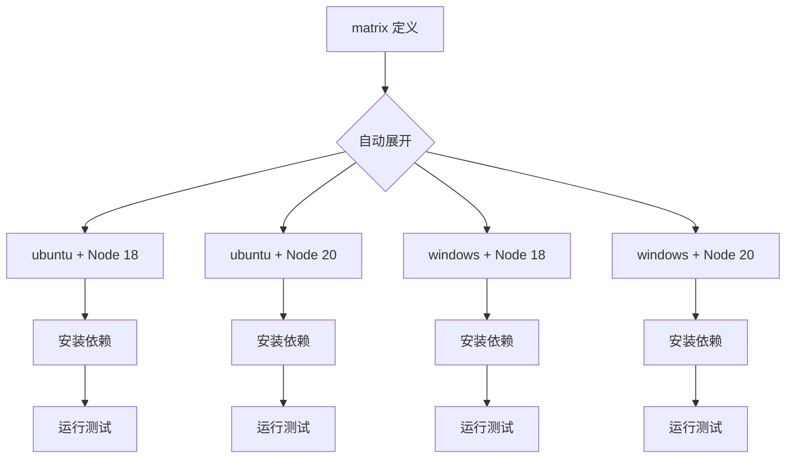

# 变量、Secrets、条件与矩阵

> 所属计划: [[plan|CI/CD 完整学习计划]]
> 预计耗时: 75min
> 前置知识: [[04-github-actions-intro]]

---

## 1. 概念讲解

### 为什么需要这个？

上一节，我们已经让 `quote-api` 跑通了 lint 和 test。但真实项目远比这复杂：

- 同一套测试要在 Node.js 18、20、22 三个版本上都跑一遍；
- 发布 npm 包时需要登录令牌，但令牌不能写进代码；
- 只有 `main` 分支才部署到生产环境，PR 只跑 CI；
- `build` 完成后 `test` 才能开始，但 lint 和 test 可以并行；
- 构建出来的镜像 tag 要传给下游部署 job 使用。

这些需求分别对应五个 GitHub Actions 进阶能力：**变量 `env`**、**加密机密 `secrets`**、**条件 `if`**、**依赖 `needs`** 与 **矩阵 `matrix`**。掌握它们，才能把一条简单的"串行脚本"升级为灵活、安全、可扩展的流水线。

### 环境变量层次

在 GitHub Actions 里，变量可以在三个层级声明，作用范围逐级收紧：

1. **Workflow 级**：整个 workflow 内的所有 job/step 都能读；
2. **Job 级**：仅该 job 内的 step 能读；
3. **Step 级**：仅该 step 能读。

当同名变量冲突时，**作用域越小优先级越高**。例如 workflow 级定义了 `NODE_VERSION: 18`，某 step 里又定义了 `NODE_VERSION: 20`，那该 step 读到的是 `20`。

除了自己声明的 `env`，GitHub 还提供若干**默认环境变量**，例如：

- `GITHUB_REF`：触发此次运行的分支或 tag，如 `refs/heads/main`；
- `GITHUB_SHA`：触发提交的完整 SHA；
- `GITHUB_RUN_ID`：本次 workflow 运行的唯一 ID。

这些变量可以用 shell 风格读取，例如 `$GITHUB_REF` 或 `${GITHUB_REF}`。但更推荐在表达式里使用 **`${{ }}`** 语法访问 GitHub 提供的**上下文（context）**，例如 `${{ github.ref }}`。

还有一个特殊文件 `$GITHUB_ENV`：在 step 里把 `KEY=VALUE` 写进去，后续 step 就能把它当作普通环境变量读取。它解决的是"动态生成变量"的问题——例如根据 git SHA 生成一个镜像 tag。

### Secrets 与加密机密

Secrets 是用来存放敏感数据的地方：npm 发布令牌、Docker Hub 密码、云厂商 API Key、数据库连接字符串等。GitHub 提供三级 secrets：

- **仓库级（Repository secrets）**：只对该仓库可见；
- **环境级（Environment secrets）**：只对特定部署环境（如 `production`）可见；
- **组织级（Organization secrets）**：组织下多个仓库共享，可限定哪些仓库能访问。

GitHub 会对 secrets 做**加密存储**，并在日志中**自动脱敏**。只要值被当作 secret 输出，流水日志里会显示为 `***`。底层机制上，Actions 运行器调用 `::add-mask::VALUE` 把 secret 值注册到掩码列表，任何后续输出中出现该值都会被替换。

与 secrets 对应的是 **Variables（变量）**，用于存放非敏感配置，例如 API 基础地址、功能开关、默认区域等。Variables 不会脱敏，可以被直接打印出来调试。

> [!warning]
> Secrets 永远不能 `echo`、不能写进代码、不能通过 job 输出传给不信任的下游。泄露 secret 后必须**立即轮换**（revoke 并重新生成），因为日志一旦生成就无法撤回。

### 条件 if

`if` 用来控制 job 或 step 是否执行。它的表达式直接写在 YAML 字符串里，**不需要再包一层 `${{ }}`**——因为 `if` 字段本身就已经处于表达式上下文。

常见写法：

- `if: github.ref == 'refs/heads/main'` —— 只在 `main` 分支执行；
- `if: github.event_name == 'pull_request'` —— 只在 PR 触发时执行；
- `if: failure()` —— 当前面有步骤失败时执行，常用于发送通知；
- `if: always()` —— 无论前面成败都执行，常用于清理资源；
- `if: needs.build.result == 'success'` —— 依赖的 build job 成功才执行。

注意 `if` 默认在 step 级别还有一个隐式行为：如果 job 被跳过，它下面的 step 自然也不会跑。如果显式写了 `if: always()`，即使 job 整体失败，该 step 也会尝试执行。

### needs 依赖

默认情况下，workflow 里的所有 job 是**并行**运行的。如果某个 job 必须等另一个 job 完成，就要用 `needs`：

```yaml
jobs:
  build:
    runs-on: ubuntu-latest
  test:
    needs: build
    runs-on: ubuntu-latest
```

`test` 会等 `build` 成功后才启动。`needs` 也支持数组，表示等多个 job 都完成：

```yaml
  deploy:
    needs: [build, test]
```

下游 job 可以通过 `needs.<job_id>.result` 读取上游结果，例如 `success`、`failure`、`skipped`、`cancelled`。

### outputs 传递

`needs` 只能表达"等谁完成"，但不能传数据。要传数据，需要用到 job 的 `outputs`：上游 job 在 step 里用 `echo "key=value" >> $GITHUB_OUTPUT`，然后在 job 定义里通过 `outputs` 暴露；下游 job 通过 `needs.<job_id>.outputs.<key>` 读取。

典型场景：

- build job 生成镜像 tag；
- deploy job 读取 tag 并执行部署。

这是 job 之间最安全的"数据通道"，但**不要把 secrets 放进 outputs**，因为 outputs 会被记录在工作流运行记录中。

### matrix 矩阵

矩阵策略让你用一份 YAML 定义，自动展开成多个 job。最常见的是"多版本 × 多操作系统"：

```yaml
strategy:
  matrix:
    node-version: [18, 20, 22]
    os: [ubuntu-latest, macos-latest, windows-latest]
```

这会生成 3 × 3 = 9 个 job，每个组合独立运行。GitHub 会尽量并行调度它们。

相关控制项：

- `fail-fast: true`（默认）：只要一个组合失败，立刻取消其他还没跑完的组合；
- `include`：额外追加特定组合；
- `exclude`：排除某些组合。

下图展示了 `node-version: [18, 20]` × `os: [ubuntu, windows]` 的展开过程：



矩阵能极大减少重复 YAML，但要注意：每个组合都是一次独立的运行，都会消耗 minutes 配额。

---

## 2. 代码示例

以下示例均围绕 `quote-api` 项目，假设仓库地址为 `your-username/quote-api`。

### 示例 1：用 matrix 跑多 Node 版本

这是 `quote-api` 的 CI 片段，一次在 Node 18/20/22 上跑 lint 和 test：

```yaml
# .github/workflows/ci.yml
name: CI

on:
  push:
    branches: [main]
  pull_request:
    branches: [main]

jobs:
  lint-and-test:
    # matrix 会把这个 job 展开成 3 个独立运行
    strategy:
      fail-fast: false
      matrix:
        node-version: [18, 20, 22]

    runs-on: ubuntu-latest

    steps:
      # 1. 检出代码
      - name: Checkout repository
        uses: actions/checkout@v4

      # 2. 安装指定 Node 版本
      - name: Setup Node.js ${{ matrix.node-version }}
        uses: actions/setup-node@v4
        with:
          node-version: ${{ matrix.node-version }}
          cache: npm

      # 3. 安装依赖
      - name: Install dependencies
        run: npm ci

      # 4. 运行 lint
      - name: Run lint
        run: npm run lint

      # 5. 运行测试
      - name: Run tests
        run: npm test
```

**说明：**

- `${{ matrix.node-version }}` 引用矩阵变量；
- `fail-fast: false` 表示即使 Node 18 失败，20 和 22 也会继续跑，便于定位版本相关问题；
- 每个 Node 版本都是一次独立运行，日志里会以不同组合名区分。

### 示例 2：使用 secrets 发布 npm 包

假设 `quote-api` 是一个可发布的 npm 包。首先在仓库设置里添加名为 `NPM_TOKEN` 的 secret：

1. 打开 GitHub 仓库页面 → `Settings` → `Secrets and variables` → `Actions`；
2. 点击 `New repository secret`；
3. Name 填 `NPM_TOKEN`，Value 填从 npm 网站生成的 `publish` token；
4. 点击 `Add secret`。

然后在 workflow 里这样使用：

```yaml
# .github/workflows/release.yml
name: Release to npm

on:
  push:
    tags:
      - 'v*'   # 只有推送 v1.2.3 这类 tag 时才触发

jobs:
  publish:
    runs-on: ubuntu-latest
    steps:
      - name: Checkout repository
        uses: actions/checkout@v4

      - name: Setup Node.js
        uses: actions/setup-node@v4
        with:
          node-version: 20
          registry-url: 'https://registry.npmjs.org'
          cache: npm

      - name: Install dependencies
        run: npm ci

      - name: Build package
        run: npm run build

      # npm publish 需要读取 NODE_AUTH_TOKEN 环境变量
      - name: Publish to npm
        env:
          NODE_AUTH_TOKEN: ${{ secrets.NPM_TOKEN }}
        run: npm publish --access public
```

**说明：**

- `secrets.NPM_TOKEN` 读取仓库级 secret；
- `NODE_AUTH_TOKEN` 通过 step 级 `env` 注入；
- 即使你在脚本里写 `echo "$NODE_AUTH_TOKEN"`，日志里也会显示为 `***`，因为 GitHub 已经把它加入掩码；
- 不要把 token 写成 `"${{ secrets.NPM_TOKEN }}"` 硬编码在 YAML 的 `run` 命令里，否则字符串拼接可能绕过掩码。

### 示例 3：needs + outputs 控制部署

下面展示如何把 build job 生成的版本号传给 deploy job，并且 deploy 只在 `main` 分支执行：

```yaml
# .github/workflows/build-and-deploy.yml
name: Build and Deploy

on:
  push:
    branches: [main, develop]
  pull_request:
    branches: [main]

jobs:
  build:
    runs-on: ubuntu-latest
    # 定义本 job 的输出，供下游 job 使用
    outputs:
      version: ${{ steps.version.outputs.value }}
      image-tag: ${{ steps.docker-tag.outputs.value }}

    steps:
      - name: Checkout repository
        uses: actions/checkout@v4

      # 生成一个基于 git 短 SHA 的版本号
      - name: Generate version
        id: version
        run: |
          SHORT_SHA=$(git rev-parse --short HEAD)
          echo "value=1.0.0-${SHORT_SHA}" >> "$GITHUB_OUTPUT"

      # 生成 Docker 镜像 tag
      - name: Generate image tag
        id: docker-tag
        run: |
          SHORT_SHA=$(git rev-parse --short HEAD)
          echo "value=ghcr.io/your-username/quote-api:${SHORT_SHA}" >> "$GITHUB_OUTPUT"

      - name: Setup Node.js
        uses: actions/setup-node@v4
        with:
          node-version: 20
          cache: npm

      - name: Install and test
        run: |
          npm ci
          npm run build
          npm test

  deploy:
    needs: build
    runs-on: ubuntu-latest
    # 只在 main 分支且 build 成功时执行
    if: github.ref == 'refs/heads/main' && needs.build.result == 'success'

    steps:
      - name: Deploy with version
        env:
          VERSION: ${{ needs.build.outputs.version }}
          IMAGE_TAG: ${{ needs.build.outputs.image-tag }}
        run: |
          echo "Deploying quote-api version ${VERSION}"
          echo "Image: ${IMAGE_TAG}"
          # 这里可以接真实的部署命令
```

**说明：**

- `steps.<step_id>.outputs.value` 通过 `$GITHUB_OUTPUT` 写入；
- job 级 `outputs` 把 step 输出提升为 job 输出；
- `needs.build.outputs.version` 在下游读取；
- `if:` 里同时判断分支和上游结果，且**没有包 `${{ }}`**。

---

## 3. 练习

### 练习 1: 基础

为 `quote-api` 写一个 CI 矩阵，在 `ubuntu-latest`、`macos-latest`、`windows-latest` 三个操作系统上运行测试。要求：

- Node 版本固定为 20；
- 三个系统同时跑；
- 任意一个系统失败不取消其他系统。

### 练习 2: 进阶

修改下面的场景：

- `build` job 负责编译；
- `deploy` job 依赖 `build`；
- `deploy` 只在 `main` 分支且 `build` 成功时运行。

请写出包含 `needs` 和 `if` 的 YAML 片段。

### 练习 3: 挑战（可选）

让 `build` job 用 `git rev-parse --short HEAD` 生成 git 短 SHA，并通过 `outputs` 传给 `deploy` job。`deploy` job 里把短 SHA echo 出来。请写出完整 YAML。

---

## 3.5 参考答案

> [!tip]- 练习 1 参考答案
> ```yaml
> jobs:
>   cross-platform-test:
>     strategy:
>       fail-fast: false
>       matrix:
>         os: [ubuntu-latest, macos-latest, windows-latest]
>     runs-on: ${{ matrix.os }}
>     steps:
>       - uses: actions/checkout@v4
>       - uses: actions/setup-node@v4
>         with:
>           node-version: 20
>           cache: npm
>       - run: npm ci
>       - run: npm test
> ```
> 关键点是 `fail-fast: false`，它确保一个操作系统失败不会立刻取消其他操作系统。

> [!tip]- 练习 2 参考答案
> ```yaml
> jobs:
>   build:
>     runs-on: ubuntu-latest
>     steps:
>       - uses: actions/checkout@v4
>       - uses: actions/setup-node@v4
>         with:
>           node-version: 20
>           cache: npm
>       - run: npm ci
>       - run: npm run build
>       - run: npm test
>
>   deploy:
>     needs: build
>     runs-on: ubuntu-latest
>     if: github.ref == 'refs/heads/main' && needs.build.result == 'success'
>     steps:
>       - run: echo "Deploying quote-api to production"
> ```
> `needs: build` 保证串行，`if` 同时限制分支和上游结果。

> [!tip]- 练习 3 参考答案（可选）
> ```yaml
> jobs:
>   build:
>     runs-on: ubuntu-latest
>     outputs:
>       short-sha: ${{ steps.sha.outputs.value }}
>     steps:
>       - uses: actions/checkout@v4
>       - name: Generate short SHA
>         id: sha
>         run: echo "value=$(git rev-parse --short HEAD)" >> "$GITHUB_OUTPUT"
>       - run: npm ci
>       - run: npm run build
>
>   deploy:
>     needs: build
>     runs-on: ubuntu-latest
>     if: github.ref == 'refs/heads/main'
>     steps:
>       - name: Echo short SHA
>         env:
>           SHORT_SHA: ${{ needs.build.outputs.short-sha }}
>         run: echo "Deploying commit ${SHORT_SHA}"
> ```
> 上游通过 `$GITHUB_OUTPUT` 把变量挂到 step output，再通过 job 级 `outputs` 暴露。下游通过 `needs.build.outputs.short-sha` 读取。

> [!note] 答案使用方式
> 先独立完成练习，再展开查看参考答案。参考答案不是唯一解——如果你的实现通过了测试或达到了题目要求，就是正确的。

---

## 4. 扩展阅读

- [官方文档: Encrypted secrets](https://docs.github.com/en/actions/security-guides/using-secrets-in-github-actions)
- [官方文档: Contexts and expression syntax](https://docs.github.com/en/actions/learn-github-actions/contexts)
- [官方文档: Workflow syntax for GitHub Actions - jobs.<job_id>.strategy.matrix](https://docs.github.com/en/actions/using-workflows/workflow-syntax-for-github-actions#jobsjob_idstrategymatrix)
- [官方文档: Reusing workflows](https://docs.github.com/en/actions/using-workflows/reusing-workflows) — 与下一节 [[06-reusable-composite-actions]] 衔接

---

## 常见陷阱

- **把 secret 直接写进 YAML 或 echo 出来**。任何 token、密码一旦明文出现，即使之后删除，也可能留在 Git 历史或日志存档中。正确做法：存到 `Settings → Secrets and variables` 里，通过 `${{ secrets.NAME }}` 注入。
- **`if` 表达式外层多包一层 `${{ }}`**。`if: ${{ github.ref == 'refs/heads/main' }}` 虽然能工作，但会绕过 GitHub 对 `if` 表达式的安全解析，可能增加注入风险。正确写法：`if: github.ref == 'refs/heads/main'`。
- **matrix 组合过多导致分钟数爆掉**。GitHub 免费额度对每个 job 单独计费，10 个组合 × 10 分钟 = 100 分钟。正确做法：先用最小矩阵验证核心逻辑，再逐步扩展；必要时用 `exclude` 去掉不重要的组合。
- **把 secrets 放进 job outputs**。outputs 会被记录在工作流运行记录中，虽然不会被主动展示，但不应作为 secrets 的传递通道。正确做法：需要 secrets 的 step 直接在当前 job 读取。
- **在 matrix 里混用字符串和数字不加引号**。YAML 会把 `20` 解析为数字，`20.x` 才是字符串。Node 版本建议写成带引号的字符串 `"20"`，避免某些解析器把 `20` 和 `"20.0"` 当成不同值。

---

### 交叉引用

- 可复用工作流如何接收 secrets：[[06-reusable-composite-actions]]
- 部署触发策略与环境切换：[[11-deployment-strategies]]
