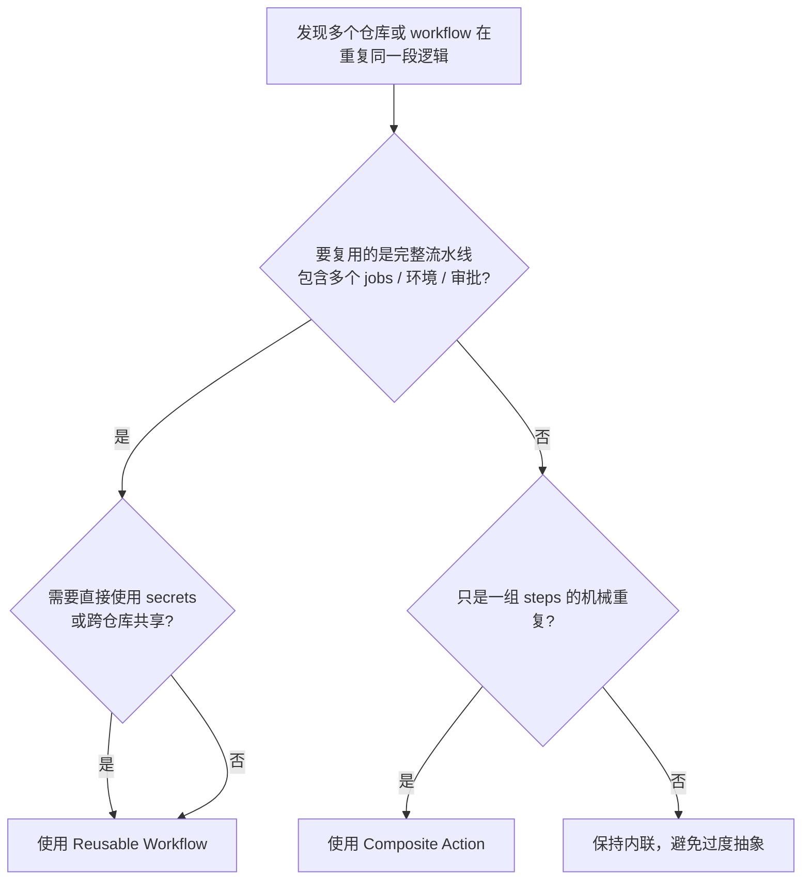

# 可复用工作流与 Composite Actions

> 所属计划: [[plan|CI/CD 完整学习计划]]
> 预计耗时: 75min
> 前置知识: [[05-secrets-conditions-matrix]]

---

## 1. 概念讲解

### 为什么需要复用？

在 [[04-github-actions-intro]] 里，我们为 `quote-api` 写了一个能跑 `lint + test` 的 `ci.yml`。当项目只有一两个仓库时，直接复制粘贴 YAML 似乎并无大碍。但一旦出现以下场景，维护成本就会指数级上升：

- 公司有 30 个 Node.js 微服务，每个仓库都要跑 `setup-node → npm ci → lint → test`。
- 安全团队要求在 CI 开头统一加入“依赖漏洞扫描”。
- 某个 action 版本升级（例如 `actions/setup-node@v4`），需要逐个项目改过去。

这些场景的共同点是：**同一段流水线逻辑在多处重复**。没有复用机制时，任何小改动都会演变成“改 30 个仓库”的灾难，也就是常说的**维护地狱**。

复制粘贴的坏处不仅在于“改起来多”，更在于**不一致**。某个仓库少加了一个扫描步骤，某个仓库用的 action 版本落后半年，某个仓库的 `npm ci` 参数和别人不一样——这些差异会在关键时刻变成安全漏洞或难以排查的构建失败。复用机制的价值，正是把“应该一样的地方”收敛到单一来源。
因此，越早建立复用意识，越能避免流水线层面的技术债积累。

解决思路并不新鲜：把重复的部分抽象成可复用单元，然后在需要的地方引用它。GitHub Actions 提供了两种官方复用机制：

- **Composite Action**：把一组 `steps` 打包成一个 action，像用普通 action 一样用一行 `uses` 调用。
- **Reusable Workflow**：把整条流水线声明为可被调用的工作流，支持多个 `jobs`、矩阵、secrets 转发。

本节的目标不是教你背语法，而是让你能判断：**什么时候该用哪种机制，以及怎么安全地传参**。

### Composite Action 是什么？

Composite Action（复合 action）本质上是一个“步骤集合”。它定义在 `action.yml` 中，通过 `runs.using: composite` 声明，里面可以写多个 `steps`，每个 step 可以是 `run` 命令，也可以是其他 action。

你可以把它理解为“自定义的 action”。在第 04 节你用过 `actions/checkout@v4`、`actions/setup-node@v4` 这些别人写的 action；学完本节，你就能写自己的 action 了。

Composite Action 的特点：

- 轻量，适合把“总是一起出现”的步骤封装成一个动作。
- **不能包含 `jobs`**，只能包含 `steps`。
- **不能直接读取 `secrets` 上下文**，敏感信息必须通过 `inputs` 传进来。
- 调用方式和普通 action 一样，写在某个 job 的 `steps` 里。

### Reusable Workflow 是什么？

Reusable Workflow（可复用工作流）是一个完整的工作流文件，只是它的触发器不是 `push` / `pull_request`，而是 `on: workflow_call`。其他工作流可以通过 `jobs.<job_id>.uses` 来调用它。

它的特点：

- 重量级，适合封装“一整条 CI/CD 流水线”。
- 可以包含多个 `jobs`、矩阵、依赖关系、环境审批。
- 可以声明 `inputs` 和 `secrets`，调用方通过 `with` / `secrets` 传值。
- 调用它时，**调用本身就是一个 job**，不能在同一个 job 里再添加额外 step。

### 两种机制对比

下面这张表是快速决策的“速查卡”。建议保存或截图，遇到重复代码时先看一眼。

| 维度 | Composite Action | Reusable Workflow |
|---|---|---|
| 定义文件 | `action.yml` | `.github/workflows/*.yml` |
| 复用粒度 | 一组 `steps` | 整条流水线（可含多个 `jobs`） |
| 调用位置 | 写在某个 job 的 `steps` 里 | 本身就是一个 job，用 `jobs.xxx.uses` |
| 是否支持 `jobs` | 不支持 | 支持 |
| 是否支持矩阵 | 不支持（但可以在调用它的 job 里写矩阵） | 支持，且可在被调用工作流里再写矩阵 |
| 是否支持 `secrets` 直接访问 | **不支持**，只能通过 `inputs` 传入 | 支持，通过 `secrets` 声明并接收 |
| 是否支持 `outputs` | 支持 | 支持 |
| 能否发布到 Marketplace | 可以 | 不可以 |
| 典型场景 | 封装“setup + install + lint + test”这类步骤序列 | 封装组织级标准 CI/CD 模板 |

> [!note]
> GitHub 官方把这两者的关系总结得很清楚：Composite Action 是“把多个步骤打包成一个步骤”，Reusable Workflow 是“复用整条工作流”。如果忘了区别，就记住这句话。

### 何时用哪个？决策树



简单口诀：

- **封装步骤序列 → Composite Action**。
- **共享完整流水线 / 需要 secrets / 跨仓库 → Reusable Workflow**。
- **只有三五行的简单逻辑 → 保持现状**，不要为了抽象而抽象。

### inputs 与 secrets 传递

两种机制都支持参数化，但语法和适用范围不同。

**Composite Action** 只有 `inputs`：

```yaml
inputs:
  node-version:
    description: 'Node.js 版本'
    required: false
    default: '20'
```

调用方：

```yaml
- uses: ./.github/actions/setup-node-test
  with:
    node-version: '20'
```

如果 Composite Action 需要用到 secret，只能通过 `inputs` 把值传进去：

```yaml
- uses: ./.github/actions/setup-node-test
  with:
    npm-token: ${{ secrets.NPM_TOKEN }}
```

> [!warning]
> 虽然你把 `${{ secrets.NPM_TOKEN }}` 传给了 input，GitHub 仍然会对 secret 值做日志脱敏。但为了让权限边界清晰，**永远不要把整个 secrets 上下文传进 Composite Action**。

**Reusable Workflow** 同时支持 `inputs` 和 `secrets`：

```yaml
on:
  workflow_call:
    inputs:
      node-version:
        required: true
        type: string
    secrets:
      NPM_TOKEN:
        required: false
```

调用方：

```yaml
jobs:
  ci:
    uses: ./.github/workflows/reusable-ci.yml
    with:
      node-version: '20'
    secrets:
      NPM_TOKEN: ${{ secrets.NPM_TOKEN }}
```

如果调用方和被调用工作流在同一组织或仓库，也可以使用 `secrets: inherit` 一次性传入所有 secrets：

```yaml
jobs:
  ci:
    uses: ./.github/workflows/reusable-ci.yml
    with:
      node-version: '20'
    secrets: inherit
```

#### outputs 也能复用

有时被调用的单元不仅要“干活”，还要把结果传回调用方。两种机制都支持 `outputs`，但写法不同。

**Composite Action** 的 outputs 定义在 `action.yml` 里：

```yaml
outputs:
  test-result:
    description: '测试结果摘要'
    value: ${{ steps.test.outputs.summary }}
```

调用方通过 `${{ steps.<step-id>.outputs.test-result }}` 读取。

**Reusable Workflow** 的 outputs 定义在 `on.workflow_call.outputs` 中：

```yaml
on:
  workflow_call:
    outputs:
      build-status:
        description: '构建状态'
        value: ${{ jobs.build.outputs.status }}
```

调用方通过 `${{ needs.<job-id>.outputs.build-status }}` 读取，常用于下游 job 做部署决策。

#### Reusable Workflow 的权限与可见性

跨仓库调用时，被调用仓库必须对调用方可见：

- 如果模板仓库是 **public**，任何 public 仓库都可以调用。
- 如果模板仓库是 **private**，调用方通常需要与模板仓库位于同一组织/企业，或显式被授予访问权限。
- 权限只能“保持或降低”，不能在被调用工作流里提升。例如调用方只给了 `contents: read`，被调用工作流就不能把自己变成 `contents: write`。

此外，Reusable Workflow 最多支持 **10 层嵌套**（caller + 9 层 called），循环调用不被允许。正常业务场景很少触顶，但设计组织级模板库时要避免 A 调用 B、B 又调用 A。

#### 从复制粘贴到复用的迁移路径

1. 先在一个仓库里把流水线跑通，确保逻辑正确。
2. 观察哪些步骤在多个仓库重复出现。
3. 如果只是“同一组 steps”重复，提取成 Composite Action。
4. 如果整个 job（甚至多个 jobs）都重复，提取成 Reusable Workflow。
5. 当需要在组织内统一标准时，把 Reusable Workflow 放到独立的 `cicd-templates` 类仓库，并用 tag 或 commit SHA 固定版本。

遵循这个顺序可以避免“还没跑通就抽象”的陷阱。

> [!tip]
> `secrets: inherit` 很方便，但会让被调用工作流拿到所有 secrets。如果你只传递特定 secret，权限最小化会更安全。

### 与第 04 节的呼应

第 04 节介绍了“action 是别人写好的可复用步骤”。本节你学到的 Composite Action 就是“自己写 action”的入口。至此，你已经能同时站在**消费者**和**生产者**两个角色上使用 GitHub Actions。

---

## 2. 代码示例

下面的示例都围绕贯穿计划的示例项目 `quote-api`。假设它的 `package.json` 中已经定义了 `lint` 和 `test` 脚本：

```json
{
  "scripts": {
    "lint": "eslint src tests",
    "test": "vitest run"
  }
}
```

### 示例 1：Composite Action

把 `checkout → setup-node → npm ci → lint → test` 封装成一个 action。

**文件**: `.github/actions/setup-node-test/action.yml`

```yaml
# .github/actions/setup-node-test/action.yml
name: 'Setup Node and Test'
description: 'Checkout, setup Node, install deps, lint and test for quote-api'

inputs:
  node-version:
    description: 'Node.js 版本'
    required: false
    default: '20'

runs:
  using: 'composite'
  steps:
    - name: Checkout source
      uses: actions/checkout@v4

    - name: Setup Node.js
      uses: actions/setup-node@v4
      with:
        node-version: ${{ inputs.node-version }}
        cache: npm

    - name: Install dependencies
      shell: bash
      run: npm ci

    - name: Run linter
      shell: bash
      run: npm run lint

    - name: Run tests
      shell: bash
      run: npm run test
```

> [!note]
> Composite Action 里的每个 `run` 步骤都必须显式声明 `shell`，这是语法强制要求。

### 示例 2：Reusable Workflow

把同样的逻辑写成可复用工作流，并加入 `secrets` 转发。

**文件**: `.github/workflows/reusable-ci.yml`

```yaml
# .github/workflows/reusable-ci.yml
name: Reusable quote-api CI

on:
  workflow_call:
    inputs:
      node-version:
        description: 'Node.js 版本'
        required: true
        type: string
    secrets:
      NPM_TOKEN:
        description: '私有 npm 仓库 Token'
        required: false

jobs:
  lint-and-test:
    runs-on: ubuntu-latest
    steps:
      - name: Checkout source
        uses: actions/checkout@v4

      - name: Setup Node.js
        uses: actions/setup-node@v4
        with:
          node-version: ${{ inputs.node-version }}
          cache: npm

      - name: Install dependencies
        run: npm ci
        env:
          NODE_AUTH_TOKEN: ${{ secrets.NPM_TOKEN }}

      - name: Lint
        run: npm run lint

      - name: Test
        run: npm run test

      - name: Upload test reports
        uses: actions/upload-artifact@v4
        with:
          name: test-reports-node-${{ inputs.node-version }}
          path: reports/
```

### 示例 3：调用方 workflow

同一个仓库里，可以分别用两种机制调用上面定义的单元。

**文件**: `.github/workflows/ci.yml`

```yaml
# .github/workflows/ci.yml
name: quote-api CI

on:
  push:
    branches: [main]
  pull_request:

jobs:
  # 方式一：用 Composite Action，轻量封装一组 steps
  quick-ci:
    runs-on: ubuntu-latest
    steps:
      - name: Run setup + lint + test
        uses: ./.github/actions/setup-node-test
        with:
          node-version: '20'

  # 方式二：用 Reusable Workflow，整条流水线复用
  full-ci:
    uses: ./.github/workflows/reusable-ci.yml
    with:
      node-version: '20'
    secrets:
      NPM_TOKEN: ${{ secrets.NPM_TOKEN }}
```

**运行方式**:

```bash
# 把三个文件提交到 quote-api 仓库
git add .
git commit -m "ci: add reusable composite action and reusable workflow"
git push origin main
```

然后打开 GitHub 仓库的 **Actions** 标签页，即可看到 `quote-api CI` 工作流被触发。

**预期输出**:

```text
quote-api CI
├── quick-ci
│   └── Run setup + lint + test
│       ├── Checkout source
│       ├── Setup Node.js
│       ├── Install dependencies
│       ├── Run linter
│       └── Run tests
└── full-ci
    ├── lint-and-test
    │   ├── Checkout source
    │   ├── Setup Node.js
    │   ├── Install dependencies
    │   ├── Lint
    │   ├── Test
    │   └── Upload test reports
```

> [!note]
> Composite Action 的日志会把内部步骤折叠在“Run setup + lint + test”这一行下面；而 Reusable Workflow 的每个 job 都会作为独立 job 显示在页面左侧。

---

## 3. 练习

### 练习 1: [基础] 把 lint + test 封装成 Composite Action

为 `quote-api` 创建一个只负责 `lint` 和 `test` 的 Composite Action，路径为 `.github/actions/lint-and-test/action.yml`。然后修改 `.github/workflows/ci.yml`，让它调用这个 action。

要求：

- 必须接收 `node-version` 输入，默认值为 `'20'`。
- 调用方在 `pull_request` 和 `push` 到 `main` 时触发。

### 练习 2: [进阶] 用矩阵调用 Reusable Workflow

写一个 Reusable Workflow `.github/workflows/reusable-test.yml`，接收 `node-version` 输入并运行测试。再写一个调用方 `.github/workflows/matrix-ci.yml`，使用矩阵同时调用三次，分别测试 Node.js `18`、`20`、`22`。

### 练习 3: [挑战] 跨仓库复用 quote-api 的 CI（可选）

把 `quote-api` 的 CI 做成可被其他仓库复用的 Reusable Workflow。假设你将模板集中放在 `your-org/cicd-templates` 仓库，其他仓库只需一行 `uses:` 即可引用。

要求：

- 给出模板仓库中的 YAML。
- 给出 `quote-api` 仓库中的调用方 YAML。
- 说明跨仓库调用时需要注意的版本固定和权限问题。

---

## 3.5 参考答案

> [!tip]- 练习 1 参考答案
> `.github/actions/lint-and-test/action.yml`：
>
> ```yaml
> name: 'Lint and Test quote-api'
> description: 'Run lint and test for the quote-api project'
>
> inputs:
>   node-version:
>     description: 'Node.js 版本'
>     required: false
>     default: '20'
>
> runs:
>   using: 'composite'
>   steps:
>     - uses: actions/checkout@v4
>     - uses: actions/setup-node@v4
>       with:
>         node-version: ${{ inputs.node-version }}
>         cache: npm
>     - run: npm ci
>       shell: bash
>     - run: npm run lint
>       shell: bash
>     - run: npm run test
>       shell: bash
> ```
>
> `.github/workflows/ci.yml`：
>
> ```yaml
> name: quote-api CI
> on:
>   push:
>     branches: [main]
>   pull_request:
>
> jobs:
>   lint-and-test:
>     runs-on: ubuntu-latest
>     steps:
>       - uses: ./.github/actions/lint-and-test
>         with:
>           node-version: '20'
> ```

> [!tip]- 练习 2 参考答案
> `.github/workflows/reusable-test.yml`：
>
> ```yaml
> name: Reusable Test
> on:
>   workflow_call:
>     inputs:
>       node-version:
>         required: true
>         type: string
>
> jobs:
>   test:
>     runs-on: ubuntu-latest
>     steps:
>       - uses: actions/checkout@v4
>       - uses: actions/setup-node@v4
>         with:
>           node-version: ${{ inputs.node-version }}
>           cache: npm
>       - run: npm ci
>       - run: npm run test
> ```
>
> `.github/workflows/matrix-ci.yml`：
>
> ```yaml
> name: Matrix CI
> on:
>   push:
>     branches: [main]
>
> jobs:
>   test-matrix:
>     strategy:
>       matrix:
>         node: ['18', '20', '22']
>     uses: ./.github/workflows/reusable-test.yml
>     with:
>       node-version: ${{ matrix.node }}
> ```

> [!tip]- 练习 3 参考答案（可选）
> 把 Reusable Workflow 放到一个独立的模板仓库，例如 `your-org/cicd-templates`，可以让多个项目共享同一条 CI 流水线。调用时必须使用 `@{ref}` 固定版本，避免供应链风险。
>
> `your-org/cicd-templates/.github/workflows/quote-api-ci.yml`：
>
> ```yaml
> name: quote-api reusable CI
> on:
>   workflow_call:
>     inputs:
>       node-version:
>         required: true
>         type: string
>     secrets:
>       NPM_TOKEN:
>         required: false
>
> jobs:
>   ci:
>     runs-on: ubuntu-latest
>     steps:
>       - uses: actions/checkout@v4
>       - uses: actions/setup-node@v4
>         with:
>           node-version: ${{ inputs.node-version }}
>           cache: npm
>       - run: npm ci
>         env:
>           NODE_AUTH_TOKEN: ${{ secrets.NPM_TOKEN }}
>       - run: npm run lint
>       - run: npm run test
> ```
>
> `quote-api/.github/workflows/ci.yml`：
>
> ```yaml
> name: quote-api CI
> on:
>   push:
>     branches: [main]
>   pull_request:
>
> jobs:
>   ci:
>     uses: your-org/cicd-templates/.github/workflows/quote-api-ci.yml@v1.0.0
>     with:
>       node-version: '20'
>     secrets:
>       NPM_TOKEN: ${{ secrets.NPM_TOKEN }}
> ```
>
> 跨仓库注意事项：
>
> - 被调用仓库必须对调用方可见（公开仓库可被任意公开仓库调用；私有仓库需要在同一组织或配置访问权限）。
> - **务必固定版本**，例如 `@v1.0.0` 或 commit SHA，不要直接使用 `@main`。
> - 如果模板仓库升级导致行为变化，调用方不会自动受影响，这正是我们想要的“可预测升级”。

> [!note] 答案使用方式
> 先独立完成练习，再展开查看参考答案。参考答案不是唯一解——如果你的实现通过了测试或达到了题目要求，就是正确的。

---

## 4. 扩展阅读

- [GitHub Docs: Reusing workflows](https://docs.github.com/en/actions/how-tos/reuse-automations/reuse-workflows)
- [GitHub Docs: Creating a composite action](https://docs.github.com/en/actions/tutorials/create-actions/create-a-composite-action)
- [GitHub Docs: Reusable workflows versus composite actions](https://docs.github.com/en/actions/concepts/workflows-and-actions/reusing-workflow-configurations)
- [GitHub Blog: GitHub Actions: reusable workflows is generally available](https://github.blog/news-insights/product-news/github-actions-reusable-workflows-is-generally-available/)

---

## 常见陷阱

- **Composite Action 误以为能直接读 secrets**。Composite Action 内部没有 `secrets` 上下文，必须显式通过 `inputs` 传入。正确做法是把 `${{ secrets.XXX }}` 作为 input 值传给 action。
- **Reusable Workflow 调用时不带 `@ref`**。跨仓库调用必须固定版本或 commit SHA，例如 `@v1.0.0`；直接写 `@main` 会让你的流水线随时被上游改动破坏，并引入供应链风险。相关安全理念见 [[15-devsecops]]。
- **过度抽象**。如果一段逻辑只有三五行、只在一个仓库用一次，就没必要封装成 action 或 reusable workflow。抽象带来的理解成本和跳转成本可能超过复用收益。
- **在同一 job 里 Reusable Workflow 后追加 steps**。`uses: ./.github/workflows/xxx.yml` 已经占满了一个 job，后面不能再写 `steps`。如果有后续步骤，需要放到另一个 job 并通过 `needs` 依赖。
- **忘记在 Composite Action 的 `run` 步骤写 `shell`**。Composite Action 不会继承默认 shell，每个 `run` 都必须显式声明 `shell: bash` 等。
