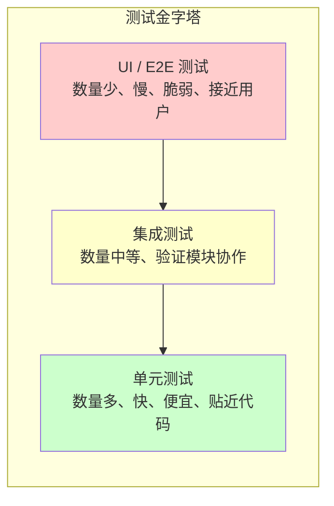
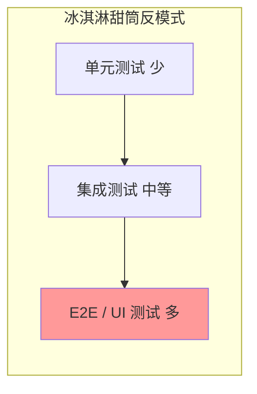
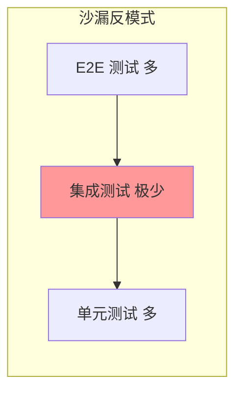
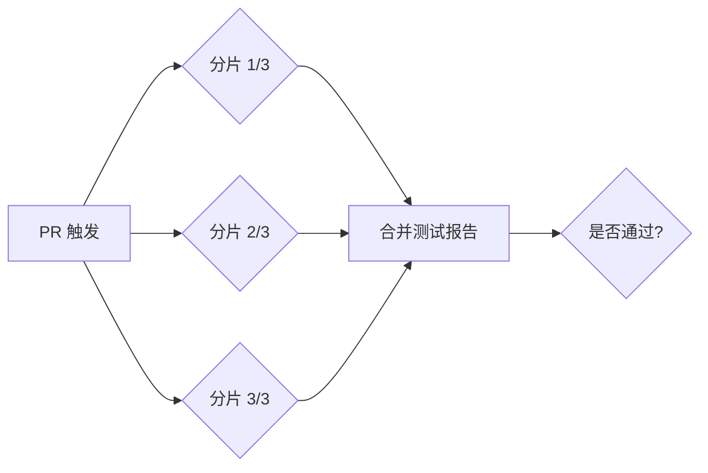
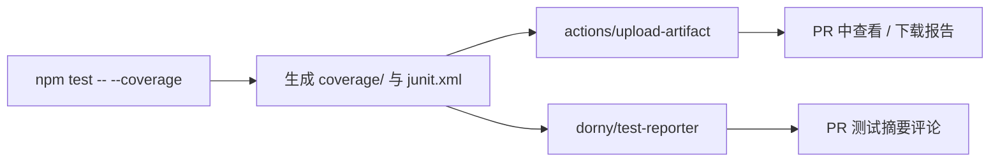
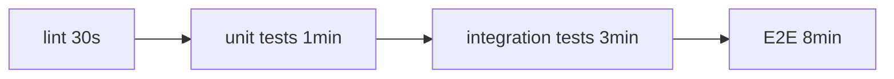

# CI 中的测试策略

> 所属计划: [[plan|CI/CD 完整学习计划]]
> 预计耗时: 75min
> 前置知识: [[04-github-actions-intro]]

---

## 1. 概念讲解

### 为什么需要这个？

在 [[04-github-actions-intro]] 中，我们已经让 quote-api 跑起了 lint 和 test。但 "跑测试" 和 "在 CI 里科学地跑测试" 是两件事。本地开发时，你可以连着真实数据库、靠手动刷新页面验证功能；CI 没有人工干预，也没有你的本地环境，它必须在无人值守的情况下快速、稳定地告诉你 "这版代码能不能合进去"。

如果测试策略设计不好，团队会反复遇到三类问题：

- ** flaky test（不稳定测试）**：同一份代码有时过、有时不过，开发者开始习惯 "重试一下就好了"，CI 失去公信力。
- **反馈太慢**：PR 提交后 20 分钟才出结果，开发节奏被拖垮。
- **覆盖率数字好看，bug 照样漏**：100% 行覆盖率的代码仍然可能把 `+` 写成 `-`，因为没有断言真正验证行为。

本节的目标就是建立一套适合 CI 的测试策略：多而快的单元测试守住基础，少而精的 E2E 守住用户路径，中间用集成测试衔接；同时用并行、分片、覆盖率门槛和测试报告把 CI 变成可靠的 "质量门禁"。

### 核心思想：测试金字塔

测试金字塔（Test Pyramid）是 Mike Cohn 提出、后经 Martin Fowler 推广的经典模型。它的核心思想是：**测试应该分层，数量与成本成反比**。



- **单元测试（Unit Tests）**：针对单个函数、模块或类。例如 quote-api 里的 `getRandomQuote()` 返回的字符串非空且来自预定义列表。它们运行极快（毫秒级）、不依赖外部服务、定位问题精确。
- **集成测试（Integration Tests）**：验证多个模块协作，例如数据库连接池能否正确存取数据、API 路由能否正确调用业务逻辑。比单元测试慢，但能发现接口契约问题。
- **E2E 测试（End-to-End Tests）**：模拟真实用户操作，例如用 Playwright 打开浏览器、调用接口、检查页面文案。最接近业务价值，但最慢、最脆弱，维护成本最高。

金字塔暗示的比例不是死数字，而是一种设计意图：**让便宜的测试承担大部分验证工作，贵的测试只验证最关键的路径**。

#### 反模式

两个常见的反模式会把金字塔翻过来或掐断：

- **冰淇淋甜筒（Ice Cream Cone）**：倒金字塔。E2E 和 UI 测试过多，单元测试很少。结果 CI 跑得慢、失败原因难定位、维护成本高。



- **沙漏（Hourglass）**：单元测试和 E2E 都很多，但集成测试极少。导致 "底层都对" 且 "页面能打开"，但中间层服务拼接时出问题。



要避免这两个反模式，关键是定期审视测试分布：如果 E2E 失败频率明显高于单元测试，或者一次重构要改几十处 E2E，就该把一些 E2E 下沉为集成或单元测试。

### CI 里测试的特殊要求

本地测试可以 "将就"，CI 里不行。CI 中的测试必须满足四条：

| 要求 | 含义 | 错误示范 |
|------|------|----------|
| **可重复（Repeatable）** | 同一份代码、同一个 commit，结果永远一样 | 依赖当前时间、随机种子未固定、依赖外部网络 |
| **无状态（Stateless）** | 每个测试自己准备数据、自己清理，不依赖其他测试 | 测试 A 创建用户，测试 B 假设该用户存在 |
| **快速（Fast）** | 开发者能在咖啡凉掉前拿到反馈 | 每次 CI 都拉取完整真实数据库做 E2E |
| **可隔离（Isolated）** | 失败时能单独重跑，且不影响其他测试 | 共享全局变量、共享文件句柄 |

对比本地：本地你可以启动一个 Postgres Docker 容器跑集成测试，也可以手动点页面做探索性测试；CI 里通常用内存数据库（如 SQLite / in-memory MongoDB）或测试容器（testcontainers）来替代真实数据库，避免网络抖动和状态污染。

### 测试并行与分片

并行是 CI 提速最直接的手段。它分两个层面：

#### 1. 测试框架内部并行

现代测试框架都内置并行能力：

- **Vitest**：默认按文件并行运行，配置 `pool: 'threads'` 或 `pool: 'vmThreads'` 可在文件内进一步并行。
- **pytest**：`pytest -n auto` 配合 `pytest-xdist` 自动按 CPU 核心数并行。

框架并行适合单元测试和轻量集成测试，不需要额外的基础设施。

#### 2. CI runner 分片（Sharding）

当测试套件大到单台 runner 跑不完时，可以用 GitHub Actions 的 `matrix` 把测试拆成多个 runner。例如 Vitest 支持 `--shard=1/3`、`--shard=2/3`、`--shard=3/3`，每个 runner 只跑三分之一测试，最后合并结果。



#### fail-fast 的取舍

GitHub Actions 的 `strategy.fail-fast` 默认是 `true`：一个 matrix job 失败，其他 job 立刻取消。

在 CI 测试里，**我们通常希望关掉 `fail-fast`**，理由有两个：

- 不同 shard 可能暴露不同失败，让一次 CI 把问题全暴露出来，减少反复提交。
- 重跑单个失败的 shard 比重跑整个流水线便宜。

例外场景：如果某一步非常贵（例如 E2E 每分钟都要消耗云资源），可以保留 fail-fast 避免浪费。

### 覆盖率门槛

覆盖率（Coverage）衡量代码被测试执行到的比例，常见指标有：

- **行覆盖率（Line coverage）**：多少比例的源码行被执行过。
- **分支覆盖率（Branch coverage）**：条件分支（`if`、`switch`、`?:`）多少被覆盖。
- **函数覆盖率（Function coverage）**：多少函数被调用过。

Vitest 内置 `@vitest/coverage-v8`，可以在 `vitest.config.ts` 里设置阈值：

```typescript
coverage: {
  reporter: ['text', 'json', 'html'],
  thresholds: {
    lines: 80,
    functions: 80,
    branches: 70,
  },
}
```

当覆盖率低于阈值时，`npm test -- --coverage` 会返回非零退出码，CI 就会失败。这非常适合做 PR 门禁：防止新代码没有任何测试就合进 `main`。

但覆盖率是**必要不充分条件**。一个函数被调用过，并不意味着它的行为被正确断言。要警惕 **coverage fetishism（覆盖率崇拜）**：

- 不要为了 100% 覆盖率写无意义断言。
- 不要只关注行覆盖率而忽视分支覆盖。
- 不要把覆盖率作为唯一质量指标；它更适合作为 "没有测试" 的红线，而不是 "测试很好" 的证明。

### 测试报告作为 artifact

测试失败后，只看 "Error: exit code 1" 是不够的。我们需要：

- **JUnit XML**：结构化结果，可被 GitHub Actions、dorny/test-reporter 等工具解析。
- **HTML 报告**：人类可读的覆盖率明细和测试列表。
- **CI 日志**：保留完整输出便于排查。

把报告上传为 artifact 后，即使 job 失败也能下载查看；配合 `dorny/test-reporter` 还可以在 PR 里直接生成测试摘要评论，Reviewer 不用点开日志就能知道哪些用例挂了。



### 失败快（fail-fast at step level）

"fail-fast" 在 CI 里有两种含义：

- **matrix 层面的 fail-fast**：前面已经讨论，通常关闭。
- **step 层面的 fail-fast**：让最快的检查先跑，慢的靠后。例如：



如果 lint 30 秒就能发现代码风格问题，就没必要等 8 分钟 E2E 跑完再告诉开发者。编排原则是：**先便宜、后昂贵；先精确、后全面**。

---

## 2. 代码示例

本节所有示例基于贯穿计划的 quote-api 项目，测试框架使用 [Vitest](https://vitest.dev/)。

### 2.1 给名言模块写单元测试

假设 `src/quotes.ts` 内容如下：

```typescript
const QUOTES = [
  "代码即文档。 — 当你写不出文档时。",
  "过早优化是万恶之源。 — Knuth",
  "简单是可靠的先决条件。 — Hoare",
];

export function getRandomQuote(): string {
  return QUOTES[Math.floor(Math.random() * QUOTES.length)];
}

export function getQuoteCount(): number {
  return QUOTES.length;
}
```

在 `tests/quotes.test.ts` 中写入：

```typescript
import { describe, it, expect } from 'vitest';
import { getRandomQuote, getQuoteCount } from '../src/quotes';

describe('quotes', () => {
  it('getRandomQuote returns a non-empty string', () => {
    const quote = getRandomQuote();
    expect(typeof quote).toBe('string');
    expect(quote.length).toBeGreaterThan(0);
  });

  it('getRandomQuote returns one of the known quotes', () => {
    const knownQuotes = [
      "代码即文档。 — 当你写不出文档时。",
      "过早优化是万恶之源。 — Knuth",
      "简单是可靠的先决条件。 — Hoare",
    ];
    const quote = getRandomQuote();
    expect(knownQuotes).toContain(quote);
  });

  it('getQuoteCount returns a positive number', () => {
    const count = getQuoteCount();
    expect(typeof count).toBe('number');
    expect(count).toBeGreaterThan(0);
  });
});
```

**注意**：`getRandomQuote` 内部使用了 `Math.random()`，但我们的断言只验证 "返回值是已知列表中的一员"，不依赖具体哪一条。这样即使随机种子不同，测试依然稳定可重复。

### 2.2 配置 Vitest 开启覆盖率

在项目根目录创建 `vitest.config.ts`：

```typescript
import { defineConfig } from 'vitest/config';

export default defineConfig({
  test: {
    globals: false,
    environment: 'node',
    reporters: ['default', 'junit'],
    outputFile: {
      junit: './coverage/junit.xml',
    },
    coverage: {
      provider: 'v8',
      reporter: ['text', 'json', 'html'],
      reportsDirectory: './coverage',
      thresholds: {
        lines: 80,
        functions: 80,
        branches: 70,
      },
    },
  },
});
```

关键字段说明：

- `provider: 'v8'`：使用 Node.js 内置的 V8 覆盖率引擎，无需额外安装。
- `thresholds`：设置覆盖率红线。任一指标低于阈值，Vitest 会以非零码退出。
- `reporters`：除了默认终端输出，还生成 JUnit XML 供 CI 解析。

> [!note]
> Vitest 的 JUnit reporter 是内置的，不需要额外安装。但开启覆盖率需要安装 `@vitest/coverage-v8`。在 `package.json` 的 `devDependencies` 中加入即可：
> ```json
> "@vitest/coverage-v8": "^1.6.0",
> "vitest": "^1.6.0"
> ```

### 2.3 CI 工作流：跑测试、上传报告、生成 PR 评论

在 `.github/workflows/ci.yml` 中添加或更新 `test` job：

```yaml
name: CI

on:
  push:
    branches: [main]
  pull_request:
    branches: [main]

jobs:
  test:
    name: Test and Coverage
    runs-on: ubuntu-latest

    steps:
      - name: Checkout repository
        uses: actions/checkout@v4

      - name: Setup Node.js
        uses: actions/setup-node@v4
        with:
          node-version: '20'
          cache: 'npm'

      - name: Install dependencies
        run: npm ci

      - name: Run lint first
        run: npm run lint

      - name: Run unit tests with coverage
        run: npm test -- --coverage

      - name: Upload coverage report
        if: always()
        uses: actions/upload-artifact@v4
        with:
          name: coverage-report
          path: coverage/
          retention-days: 14

      - name: Publish test results to PR
        if: always() && github.event_name == 'pull_request'
        uses: dorny/test-reporter@v1
        with:
          name: Vitest Tests
          path: coverage/junit.xml
          reporter: java-junit
          fail-on-error: 'false'
```

**几点设计意图**：

- **lint 放在 test 前面**：如果代码风格都不对，先失败，不跑更贵的测试。
- **`npm test -- --coverage`**：双横线把 `--coverage` 传给 `vitest`。`package.json` 里的 `test` 脚本建议写成 `vitest run`（`run` 表示非交互模式，CI 必需）。
- **`if: always()` on upload**：即使测试失败，也上传报告，方便排查。
- **dorny/test-reporter 的 `fail-on-error: 'false'`**：避免报告解析失败本身导致 job 失败；真正让 job 失败的是前面 `npm test` 的退出码。

**运行方式：**

```bash
# 本地验证测试与覆盖率
npm install
npm run lint
npm test -- --coverage
```

**预期输出（节选）：**

```text
 RUN  v1.6.0 /path/to/quote-api

 ✓ tests/quotes.test.ts (3)
   ✓ quotes (3)
     ✓ getRandomQuote returns a non-empty string
     ✓ getRandomQuote returns one of the known quotes
     ✓ getQuoteCount returns a positive number

Test Files  1 passed (1)
     Tests  3 passed (3)

 % Coverage report from v8
----------|---------|----------|---------|---------|-------------------
File      | % Stmts | % Branch | % Funcs | % Lines | Uncovered Line #s
----------|---------|----------|---------|---------|-------------------
All files |     100 |      100 |     100 |     100 |
 quotes.ts|     100 |      100 |     100 |     100 |
----------|---------|----------|---------|---------|-------------------
```

---

## 3. 练习

### 练习 1: [基础] 为 `getRandomQuote` 补 2 个边界用例

在 `tests/quotes.test.ts` 中，为 `getRandomQuote` 再增加两个测试：

1. 验证返回值不包含前后空白（trim 后长度与原长度相等）。
2. 连续调用 50 次，验证每次返回的字符串都非空且都来自已知列表。

请写出完整的测试代码。

### 练习 2: [进阶] 配置 80% 覆盖率阈值并让 CI 在低于时失败

要求：

- 修改 `vitest.config.ts`，让行覆盖率阈值达到 80%，函数覆盖率 80%，分支覆盖率 70%。
- 修改 `.github/workflows/ci.yml`，让 CI 在覆盖率低于阈值时阻止 PR 合并。
- 说明：需要安装哪些 npm 依赖？

### 练习 3: [挑战] 用 matrix 把测试分 2 个 shard 并行跑

要求：

- 使用 GitHub Actions 的 `strategy.matrix`，把 Vitest 测试分成 2 个 shard。
- 每个 shard 单独生成 JUnit XML，文件名要区分 shard（如 `junit-shard-1.xml`）。
- 所有 shard 跑完后，合并上传到 artifact。
- 解释为什么这里要设置 `fail-fast: false`。

---

## 3.5 参考答案

> [!tip]- 练习 1 参考答案
> ```typescript
> import { describe, it, expect } from 'vitest';
> import { getRandomQuote, getQuoteCount } from '../src/quotes';
>
> describe('quotes', () => {
>   it('getRandomQuote returns a non-empty string', () => {
>     const quote = getRandomQuote();
>     expect(typeof quote).toBe('string');
>     expect(quote.length).toBeGreaterThan(0);
>   });
>
>   it('getRandomQuote returns one of the known quotes', () => {
>     const knownQuotes = [
>       "代码即文档。 — 当你写不出文档时。",
>       "过早优化是万恶之源。 — Knuth",
>       "简单是可靠的先决条件。 — Hoare",
>     ];
>     expect(knownQuotes).toContain(getRandomQuote());
>   });
>
>   it('getRandomQuote has no leading or trailing whitespace', () => {
>     const quote = getRandomQuote();
>     expect(quote.trim()).toBe(quote);
>   });
>
>   it('getRandomQuote always returns valid quotes across many calls', () => {
>     const knownQuotes = [
>       "代码即文档。 — 当你写不出文档时。",
>       "过早优化是万恶之源。 — Knuth",
>       "简单是可靠的先决条件。 — Hoare",
>     ];
>     for (let i = 0; i < 50; i++) {
>       const quote = getRandomQuote();
>       expect(quote.length).toBeGreaterThan(0);
>       expect(knownQuotes).toContain(quote);
>     }
>   });
>
>   it('getQuoteCount returns a positive number', () => {
>     const count = getQuoteCount();
>     expect(typeof count).toBe('number');
>     expect(count).toBeGreaterThan(0);
>   });
> });
> ```

> [!tip]- 练习 2 参考答案
>
> `vitest.config.ts`：
> ```typescript
> import { defineConfig } from 'vitest/config';
>
> export default defineConfig({
>   test: {
>     globals: false,
>     environment: 'node',
>     reporters: ['default', 'junit'],
>     outputFile: {
>       junit: './coverage/junit.xml',
>     },
>     coverage: {
>       provider: 'v8',
>       reporter: ['text', 'json', 'html'],
>       reportsDirectory: './coverage',
>       thresholds: {
>         lines: 80,
>         functions: 80,
>         branches: 70,
>       },
>     },
>   },
> });
> ```
>
> `.github/workflows/ci.yml` 中核心步骤：
> ```yaml
>       - name: Run unit tests with coverage
>         run: npm test -- --coverage
> ```
>
> 只要覆盖率低于阈值，Vitest 会返回非零退出码，GitHub Actions 就会将该 job 标记为失败，PR 无法合并（配合分支保护规则）。
>
> 需要安装的依赖：
> ```bash
> npm install --save-dev vitest @vitest/coverage-v8
> ```
>
> `package.json` 示例：
> ```json
> {
>   "scripts": {
>     "test": "vitest run",
>     "lint": "eslint ."
>   },
>   "devDependencies": {
>     "vitest": "^1.6.0",
>     "@vitest/coverage-v8": "^1.6.0"
>   }
> }
> ```

> [!tip]- 练习 3 参考答案（可选）
>
> `.github/workflows/ci.yml`：
> ```yaml
> name: CI
>
> on:
>   pull_request:
>     branches: [main]
>
> jobs:
>   test:
>     name: Test Shard ${{ matrix.shard }}/${{ matrix.totalShards }}
>     runs-on: ubuntu-latest
>     strategy:
>       fail-fast: false
>       matrix:
>         shard: [1, 2]
>         totalShards: [2]
>
>     steps:
>       - uses: actions/checkout@v4
>
>       - uses: actions/setup-node@v4
>         with:
>           node-version: '20'
>           cache: 'npm'
>
>       - run: npm ci
>
>       - name: Run shard
>         run: npm test -- --shard=${{ matrix.shard }}/${{ matrix.totalShards }}
>
>       - name: Rename JUnit report by shard
>         if: always()
>         run: mv coverage/junit.xml coverage/junit-shard-${{ matrix.shard }}.xml
>
>       - name: Upload shard report
>         if: always()
>         uses: actions/upload-artifact@v4
>         with:
>           name: junit-shard-${{ matrix.shard }}
>           path: coverage/junit-shard-${{ matrix.shard }}.xml
>           retention-days: 14
>
>   merge-reports:
>     name: Merge Test Reports
>     needs: test
>     if: always()
>     runs-on: ubuntu-latest
>     steps:
>       - name: Download all shard reports
>         uses: actions/download-artifact@v4
>         with:
>           path: coverage/
>
>       - name: Upload merged reports
>         uses: actions/upload-artifact@v4
>         with:
>           name: merged-test-reports
>           path: coverage/
>           retention-days: 14
> ```
>
> 这里 `fail-fast: false` 的原因：
> - 两个 shard 可能暴露不同的失败用例。如果 shard 1 失败后立刻取消 shard 2，开发者就看不到 shard 2 的问题，需要多次提交才能修完。
> - 每个 shard 独立运行，互不影响；让全部跑完再合并报告，能一次性拿到完整信息。
> - 只有在资源成本极高（例如每次 E2E 都要按分钟计费）时，才值得把 `fail-fast` 重新打开。

> [!note] 答案使用方式
> 先独立完成练习，再展开查看参考答案。参考答案不是唯一解——如果你的实现通过了测试或达到了题目要求，就是正确的。

---

## 4. 扩展阅读

- [Martin Fowler: TestPyramid](https://martinfowler.com/bliki/TestPyramid.html) — 测试金字塔最权威的原文。
- [Vitest 官方文档](https://vitest.dev/guide/) — 测试框架配置、覆盖率、并行运行。
- [Vitest Coverage 配置](https://vitest.dev/config/#coverage) — 覆盖率 provider、reporter、thresholds 细节。
- [Google Testing Blog: Just Say No to More End-to-End Tests](https://testing.googleblog.com/2015/04/just-say-no-to-more-end-to-end-tests.html) — 为什么 Google 建议少写 E2E。
- [GitHub Actions: 使用 matrix 实现工作流变体](https://docs.github.com/en/actions/writing-workflows/choosing-what-your-workflow-does/running-variations-of-jobs-in-a-workflow) — 分片编排的官方指南。
- [dorny/test-reporter](https://github.com/dorny/test-reporter) — 在 PR 里生成测试摘要评论的 Action。

---

## 常见陷阱

- **测试依赖执行顺序或随机种子，导致本地过、CI 挂**
  - 正确做法：每个测试独立准备数据，不依赖全局状态；对随机行为只验证范围/集合成员，不验证具体值。

- **盲目追求 100% 覆盖率，写一堆无意义断言**
  - 正确做法：把覆盖率作为 "没有测试" 的红线，而不是 "测试充分" 的证明；优先保证关键路径的分支覆盖。

- **CI 里跑依赖外部网络或真实数据库的 E2E，又慢又脆**
  - 正确做法：CI 里用内存数据库、mock 服务或 testcontainers 做隔离；真实环境的 E2E 放在 nightly 或预发布环境，而不是每次 PR。

- **把 E2E 放在 lint 之前跑，反馈慢**
  - 正确做法：按 "便宜 → 昂贵" 排序，先 lint / 单元测试，再集成 / E2E。

- **matrix 默认 fail-fast，一次失败丢失其他 shard 的信息**
  - 正确做法：测试分片时通常设置 `fail-fast: false`；资源消耗极大的场景再酌情打开。

- **覆盖率报告没有上传 artifact，失败后无法下载排查**
  - 正确做法：上传步骤加 `if: always()`，确保测试失败也能拿到报告。

---

> 下一节预告：[[08-cache-artifacts-deps]] 会讲如何用 `actions/cache` 和 `actions/upload-artifact` 管理依赖与制品，让 CI 跑得更快、结果更可追溯。
