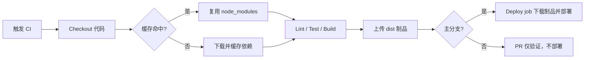

# 缓存、制品与依赖管理

> 所属计划: [[plan|CI/CD 完整学习计划]]
> 预计耗时: 60min
> 前置知识: [[04-github-actions-intro]]

---

## 1. 概念讲解

### 为什么需要这个？

在前面的章节里，我们已经让 `quote-api` 在每次 `push` 或 `pull_request` 时自动跑 lint、test 和 build。但随着项目变大，你可能会发现：

- **每次 CI 都要重新下载 `node_modules`**，npm install 可能花掉 2–3 分钟，而真正跑测试只需要 30 秒；
- **构建产物（`dist/`）只在 build job 里存在**，下一个 deploy job 或手动下载时拿不到；
- **用 `npm install` 安装依赖**，本地和 CI 装到的包版本可能不同，导致"我电脑上明明好好的"式 bug。

缓存、制品与依赖管理就是解决这三个问题的三板斧。它们让流水线既快又稳，也是实现"一次构建、多次部署"的前提。

### 核心思想

把流水线里耗时或需要传递的东西分三类：

| 概念 | 作用 | 典型内容 | 生命周期 | 是否可失效/重建 |
|------|------|----------|----------|----------------|
| **Cache（缓存）** | 加速复用 | `node_modules`、npm 全局缓存、pip 包 | 按 `key` 命中，超时自动清理 | 可失效、可重建 |
| **Artifact（制品）** | 在 job 间传递或供下载 | `dist/`、测试报告、二进制、日志 | 受保留策略限制，默认公开仓库 90 天 | 每次构建重新生成 |
| **Dependencies（依赖）** | 保证安装可复现 | `package-lock.json`、`pnpm-lock.yaml` | 随仓库版本走 | 通过 lockfile 锁定 |

一句话记忆：

- **缓存**让"下载依赖"这一步从 3 分钟降到 30 秒；
- **制品**让"build 一次，deploy 多次"成为可能（呼应 [[03-pipeline-core-concepts]] 里的流水线四阶段）；
- **依赖管理**让"今天装的包"和"明天装的包"是同一个东西。

这其实就是 [[03-pipeline-core-concepts]] 里流水线四阶段在真实项目中的落地：依赖安装属于构建准备，缓存让它更快；构建产物进入制品，部署阶段复用同一个制品。没有缓存，每次 CI 都像第一次那么慢；没有制品，每次部署都要重新构建，既浪费资源又容易引入差异。

下面的 Mermaid 图展示了它们在整个流水线中的位置：



### Cache：把下载好的东西存起来

CI 里的缓存最常见场景是"避免每次重新下载依赖"。GitHub Actions 提供了两种方式：

1. **手写 `actions/cache`**：自由度最高，可以指定 `path`、`key` 和 `restore-keys`。
2. **`actions/setup-node` 的 `cache` 参数**：现代推荐做法，一行 `cache: 'npm'` 就能自动按 `package-lock.json` 的 hash 生成 key。

缓存 key 的设计是关键。一个好的 key 应该：

- **唯一标识当前依赖集合**，通常基于 lockfile 的 hash，例如 `${{ hashFiles('**/package-lock.json') }}`；
- **在 lockfile 不变时命中**，避免无意义重建；
- **在 lockfile 变化时 miss**，从而自动拉取新依赖并写入新缓存。

假设你的 key 只写死了 `my-cache`，无论 `package-lock.json` 怎么变，runner 都会拿回第一次保存的古老缓存。反过来，如果 key 包含每次运行的 commit SHA，缓存永远 miss，等于没有缓存。因此 key 必须“足够敏感又足够稳定”——lockfile 改变时变，lockfile 不变时不变。`restore-keys` 还可以提供一个更宽松的前缀，让精确 key 未命中时仍能复用旧缓存的部分内容，减少下载量。

### 缓存失效与重建

缓存不是一劳永逸的。当你怀疑缓存里的依赖已经损坏，或者想强制重新下载时，可以通过两种办法让它失效：一是修改 lockfile（例如升级一个补丁版本），让 `hashFiles` 生成的 key 改变；二是主动在 key 里加一个可手动递增的版本前缀，例如 `${{ runner.os }}-npm-v1-${{ hashFiles('**/package-lock.json') }}`，需要清缓存时把 `v1` 改成 `v2`。后一种方法在调试缓存相关 bug 时特别好用。

`setup-node` 的 `cache: 'npm'` 已经替你做了这件事，所以新手不必再手写 `actions/cache`。

`setup-node` 实际上在内部调用了 `actions/cache`，只不过它替你选择了最合适的 path（npm 的全局缓存目录）和 key（基于 lockfile hash）。这意味着你可以先享受一行配置带来的便利，等遇到更复杂的缓存需求——比如要同时缓存 `node_modules` 和构建工具的本地缓存——再手写 `actions/cache`。

### Artifact：build 出来的东西怎么传递

一个 workflow 里的多个 job 运行在不同 runner 上，文件系统不共享。如果 `build` job 编译出了 `dist/`，而 `deploy` job 需要它，就必须用 **artifact** 显式上传和下载：

- `actions/upload-artifact@v4`：把本地目录或文件打包上传到 GitHub；
- `actions/download-artifact@v4`：在另一个 job 里按名称取回。

Artifact 和 cache 的另一个区别是**意图**：cache 是为了让同一条流水线下次跑得更快，artifact 是为了把这次运行的产物交给别人使用。除了 `dist/`，你还可以把测试覆盖率报告、E2E 截图、构建日志打包成 artifact。但要注意，artifact 不是长期存储，超过保留期就无法下载；同时单 artifact 体积过大不仅会拖慢上传下载，还可能触发仓库级别的配额限制。建议对非发布类 artifact 设置 `retention-days`，比如 PR 构建保留 3–7 天即可。

注意 artifact 有**保留期**和**大小限制**约束。公开仓库默认保留 90 天（可在仓库设置或 action 参数中调整），超过期限会被自动清理。大文件或敏感文件不应放入 artifact，原因见后面的"常见陷阱"。

### 依赖管理：为什么用 `npm ci`

为什么 lockfile 如此重要？因为 `package.json` 里写的版本号往往是范围（如 `^1.2.3`），npm 在解析时会选择当时最新的兼容版本。今天你本地装到 `1.2.5`，明天 CI 可能拿到 `1.2.7`，两个版本的细微差异就足以让构建失败。lockfile 把范围变成精确值，并把每个包的校验和（integrity hash）也记录下来，确保任何环境下载的都是同一个 tarball。

`npm install` 和 `npm ci` 的区别：

| 命令 | 读取 lockfile | 修改 lockfile | 适用场景 |
|------|---------------|---------------|----------|
| `npm install` | 会读，但允许更新 | 可能修改 `package-lock.json` | 本地开发新增依赖 |
| `npm ci` | 严格按 lockfile 安装 | **绝不写回** | CI / 生产部署 |

有些同学会问：既然 `npm ci` 会删掉 `node_modules` 重新装，为什么它比 `npm install` 快？因为它跳过了依赖解析和 lockfile 写回的步骤，直接按 lockfile 顺序安装；而且 CI 环境配合缓存时，大部分 tarball 已经存在本地缓存，真正下载的只是缓存 miss 的部分。

---

## 2. 代码示例

下面的 `ci.yml` 展示了如何把 `quote-api` 的 lint、test、build 与部署串起来，并使用缓存和制品。

文件位置：`.github/workflows/ci.yml`

```yaml
name: CI with cache and artifacts

on:
  push:
    branches: [main]
  pull_request:
    branches: [main]

jobs:
  build:
    runs-on: ubuntu-latest
    steps:
      - name: Checkout repository
        uses: actions/checkout@v4

      - name: Setup Node.js with npm cache
        uses: actions/setup-node@v4
        with:
          node-version: '20'
          cache: 'npm'

      - name: Install dependencies deterministically
        run: npm ci

      - name: Lint
        run: npm run lint

      - name: Run tests
        run: npm run test

      - name: Build application
        run: npm run build

      - name: Upload dist artifact
        uses: actions/upload-artifact@v4
        with:
          name: quote-api-dist
          path: dist/
          retention-days: 7

  deploy:
    runs-on: ubuntu-latest
    needs: build
    if: github.ref == 'refs/heads/main'
    steps:
      - name: Download dist artifact
        uses: actions/download-artifact@v4
        with:
          name: quote-api-dist
          path: dist/

      - name: Deploy quote-api
        run: |
          echo "Deploying quote-api from dist/"
          # 这里替换为你的真实部署命令，例如：
          # rsync -avz dist/ user@server:/var/www/quote-api/
          # 或 serverless deploy、kubectl apply 等
```

**关键点说明：**

- `setup-node` 的 `cache: 'npm'` 会自动基于 `package-lock.json` 生成缓存 key，无需手写 `actions/cache`；
- `npm ci` 严格按 lockfile 安装，保证 CI 与生产环境一致；
- `build` job 用 `upload-artifact` 把 `dist/` 以 `quote-api-dist` 的名字上传；
- `deploy` job 通过 `needs: build` 声明依赖，再用 `download-artifact` 取回 `dist/`，实现"build once, deploy many"。

- 上传 artifact 时，`path` 支持目录、文件或 glob；下载时如果指定了 `path`，内容会被放到该目录下。`retention-days` 可以按场景设置，避免长期占用存储。
- 注意 `upload-artifact` 和 `download-artifact` 的 `name` 必须完全一致，拼写或大小写不同都会导致下载失败。

**运行方式:**

把上述文件提交到 `quote-api` 仓库的 `.github/workflows/ci.yml`，然后 push 到 `main` 分支或创建一个 PR。

```bash
git add .github/workflows/ci.yml
git commit -m "ci: add npm cache and dist artifact upload/download"
git push origin main
```

打开 GitHub 仓库的 **Actions** 标签页，查看本次运行日志。

**预期输出:**

在 `Setup Node.js with npm cache` 这一步，如果缓存命中，你会看到类似下面的日志：

```text
Run actions/setup-node@v4
  with:
    node-version: 20
    cache: npm
Cache restored from key: Linux-npm-6f8e2c4b9...
npm ci completed in 18s
```

如果是首次运行或 lockfile 已变，缓存会 miss，日志会显示：

```text
Cache not found for input keys: Linux-npm-6f8e2c4b9...
npm ci completed in 2m 14s
Post job: saving cache for key Linux-npm-6f8e2c4b9...
```

下次再跑时，同样的 lockfile 就会命中缓存，CI 时间从几分钟降到一分钟左右。

在 Actions 页面左侧的 **Artifacts** 面板中，你也能看到 `quote-api-dist`，点击即可下载本次构建产物。这对本地排查构建结果非常有用，也是排查构建差异的常用手段之一。
PR 的 Checks 标签页同样会显示 Artifacts 入口，无需登录 runner 就能拿到构建产物。

---

## 3. 练习

### 练习 1: 基础

为 `quote-api` 的 CI 加上 npm 缓存，记录一次缓存未命中和一次缓存命中的耗时差异。

### 练习 2: 进阶

把 `build` job 产出的 `dist/` 作为制品上传，并在另一个 `deploy` job 中下载使用。要求：

- artifact 名称为 `quote-api-dist`；
- `deploy` job 必须等 `build` 成功后再运行；
- 下载后打印 `dist/` 目录内容做验证。

### 练习 3: 挑战（可选）

不借助 `setup-node` 的 `cache` 参数，手写一个基于 `package-lock.json` hash 的 `actions/cache` 缓存步骤，缓存 npm 的全局缓存目录 `~/.npm`。

---

## 3.5 参考答案

> [!tip]- 练习 1 参考答案
>
> 在 `actions/setup-node@v4` 中加上 `cache: 'npm'`：
>
> ```yaml
> - name: Setup Node.js with npm cache
>   uses: actions/setup-node@v4
>   with:
>     node-version: '20'
>     cache: 'npm'
> ```
>
> 查看缓存命中：
> - 打开 Actions 运行日志，找到 `Setup Node.js with npm cache` 这一步；
> - 若显示 `Cache restored from key: ...`，表示命中；
> - 若显示 `Cache not found for input keys: ...`，表示未命中，但运行结束后会保存新缓存。
>
> 比较两次 `npm ci` 的耗时，通常命中后能从 2–3 分钟降到 20–40 秒。

> [!tip]- 练习 2 参考答案
>
> `build` job 里上传：
>
> ```yaml
> - name: Upload dist artifact
>   uses: actions/upload-artifact@v4
>   with:
>     name: quote-api-dist
>     path: dist/
>     retention-days: 7
> ```
>
> `deploy` job 里下载并验证：
>
> ```yaml
> deploy:
>   runs-on: ubuntu-latest
>   needs: build
>   steps:
>     - name: Download dist artifact
>       uses: actions/download-artifact@v4
>       with:
>         name: quote-api-dist
>         path: dist/
>
>     - name: List dist contents
>       run: ls -R dist/
> ```

> [!tip]- 练习 3 参考答案（可选）
>
> 手写 `actions/cache`：
>
> ```yaml
> - name: Cache npm cache manually
>   uses: actions/cache@v4
>   with:
>     path: ~/.npm
>     key: ${{ runner.os }}-npm-${{ hashFiles('**/package-lock.json') }}
>     restore-keys: |
>       ${{ runner.os }}-npm-
> ```
>
> `key` 由操作系统和 lockfile hash 组成；`restore-keys` 允许在精确 key 未命中时回退到同操作系统的前缀缓存，提升部分命中概率。

> [!note] 答案使用方式
>
> 先独立完成练习，再展开查看参考答案。参考答案不是唯一解——如果你的实现通过了测试或达到了题目要求，就是正确的。

---

## 4. 扩展阅读

- [GitHub Docs: Caching dependencies to speed up workflows](https://docs.github.com/en/actions/writing-workflows/choosing-what-your-workflow-does/caching-dependencies-to-speed-up-workflows)
- [GitHub Docs: Storing workflow data as artifacts](https://docs.github.com/en/actions/writing-workflows/choosing-what-your-workflow-does/storing-workflow-data-as-artifacts)
- [npm Docs: npm ci](https://docs.npmjs.com/cli/commands/npm-ci)
- [GitHub Actions: actions/setup-node](https://github.com/actions/setup-node)

---

## 常见陷阱

- **缓存 key 设计不当**：如果 key 永远不变，依赖更新后还会命中旧缓存；如果 key 过于敏感（例如包含 commit SHA），每次都会 miss。正确做法是基于 `package-lock.json` 等 lockfile 的 hash 生成 key。
- **把 secrets 或大文件塞进 artifact**：artifact 默认可被仓库成员下载，不要把 `.env`、私钥、测试数据库 dump 等放进去。正确做法是只上传构建产物和无害的报告。
- **在 CI 里用 `npm install` 而不是 `npm ci`**：`npm install` 可能更新 lockfile，导致 CI 和生产环境依赖不一致。正确做法是在 CI 和部署脚本中固定使用 `npm ci`。
- **忘记声明 `needs`**：如果 `deploy` job 没有 `needs: build`，它可能会和 `build` 并行跑，导致 `download-artifact` 时 artifact 还不存在。
- **artifact 保留期意识不足**：默认保留期结束后 artifact 会被删除，如果需要长期保存测试报告或发布包，应配合 GitHub Release 或对象存储（见 [[10-container-registry]]、[[11-deployment-strategies]]）。测试报告作为 artifact 的用法可参考 [[07-testing-in-ci]]。

- **缓存路径选择错误**：把整个 `node_modules` 目录直接缓存，可能因操作系统或 Node 版本不同导致原生模块（native addon）不兼容。正确做法是缓存包管理器的全局缓存（npm 为 `~/.npm`，pnpm 为 `~/.local/share/pnpm/store`），再由 `npm ci` 或 `pnpm install --frozen-lockfile` 解压到当前目录。
- **lockfile 没有提交到仓库**：`cache: 'npm'` 和 `npm ci` 都依赖 `package-lock.json`。如果它没被提交，CI 会失败。正确做法是把 lockfile 加入版本控制，并在 PR 中审查它的变更。
