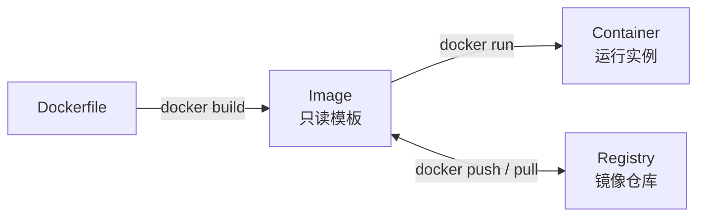
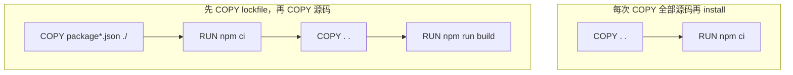
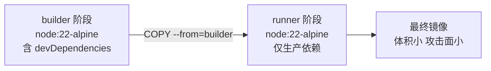

# Docker 与容器化

> 所属计划: [[plan|CI/CD 完整学习计划]]
> 预计耗时: 90min
> 前置知识: [[03-pipeline-core-concepts]]

---

## 1. 概念讲解

### 为什么需要容器？

想象你要把自家厨房里的拿手菜原封不动地搬到朋友家复刻：你家灶具是天然气、锅是铸铁锅、酱油牌子是 A；朋友家是电磁炉、不粘锅、酱油牌子是 B。即使菜谱一样，也很可能做出不一样的味道。软件部署也是同理——开发者在笔记本上跑得好好的 Node.js 服务，到了测试服务器、预发环境或生产机，可能因为 Node 版本不同、系统库缺失、环境变量差异而“在我机器上能跑，在你机器上跑不了”。

容器要解决的正是这个问题：**把应用和它所需的一切依赖（运行时、系统库、配置文件）打包成一个标准、可移植、自包含的运行单元**，无论目标环境是哪位朋友的厨房，都能用同一套“标准炉灶”复现出相同结果。

### 容器 vs 虚拟机

传统思路是用虚拟机（VM）隔离环境：一台物理机通过 Hypervisor 跑多个操作系统，每个 VM 自带完整内核、驱动、系统服务。它的隔离性确实强，但代价是笨重——一个 VM 动辄几 GB，启动要分钟级。

容器则共享宿主机的操作系统内核，只在自己的进程空间里运行应用和依赖。它不需要额外启动一个完整操作系统，因此镜像通常只有几十 MB 到几百 MB，启动是秒级甚至毫秒级。可以把 VM 比作“每个人搬一套精装公寓”，容器比作“把公寓里的一个房间打包成可复用的模块”，密度和启动速度都高得多。

| 对比项 | 虚拟机（VM） | 容器 |
|--------|-------------|------|
| 隔离级别 | 操作系统级 | 进程级 |
| 启动时间 | 分钟级 | 秒级/毫秒级 |
| 镜像大小 | GB 级 | MB 级 |
| 资源占用 | 高 | 低 |
| 适用场景 | 强隔离、异构 OS | 应用打包、微服务、CI/CD |

### 三大核心概念

Docker 的世界里，有三样东西必须分清：**镜像（Image）、容器（Container）、仓库（Registry）**。



- **Image（镜像）**：只读模板，类似 ISO 安装盘或类里的 `class`。它由若干层（layer）叠加而成，包含应用代码、依赖、运行时和文件系统快照。
- **Container（容器）**：镜像的运行实例，类似 `new 出来的对象`。容器在镜像之上加了一层可写层，运行时可以产生日志、写临时文件、监听端口。
- **Registry（仓库）**：存放镜像的远程服务，例如 Docker Hub、GitHub Container Registry（GHCR）、阿里云镜像仓库。CI/CD 里构建完的镜像会被推送到 Registry，部署阶段再拉下来运行。

### Dockerfile 指令速览

Dockerfile 是镜像的“配方书”，每条指令都会在镜像里添加或修改一层。`quote-api` 项目里会用到的核心指令如下：

| 指令 | 作用 |
|------|------|
| `FROM` | 指定基础镜像，例如 `FROM node:22-alpine`。通常放在 Dockerfile 第一行。 |
| `WORKDIR` | 设置容器内的工作目录，后续 `COPY`、`RUN` 都相对它执行。 |
| `COPY` | 把宿主机文件复制到镜像里，例如 `COPY package*.json ./`。 |
| `RUN` | 在镜像构建时执行命令，例如 `RUN npm ci`。 |
| `EXPOSE` | 声明容器会监听哪个端口，只是文档性质，实际映射用 `-p` 参数。 |
| `CMD` | 容器启动时默认执行的命令，可被 `docker run` 后面的参数覆盖。 |
| `ENTRYPOINT` | 容器启动时执行的固定入口命令，`CMD` 可作为它的默认参数。 |

`CMD` 与 `ENTRYPOINT` 的区别初学者容易混淆：

- `CMD ["node", "dist/index.js"]` 更像是默认启动命令，docker run 后面的参数会整体替换它。
- `ENTRYPOINT ["node"]` 则把容器固定成“node 执行器”，docker run 后面的参数会变成传给 node 的脚本路径。

对于简单的 Node.js 服务，单独用 `CMD` 即可；需要把容器当成可复用工具时，才组合 `ENTRYPOINT + CMD`。

### 分层与缓存：Docker 性能的关键

Docker 镜像由若干只读层叠加而成，**一条 Dockerfile 指令通常产生一层**。当某一层的内容没有变化时，Docker 会直接复用缓存，跳过重新执行。这意味着指令的排序会显著影响构建速度。



左侧的问题在于：`COPY . .` 会把所有源码一次性拷进去，一旦任何 `.ts` 文件改动，这一层就失效，导致后续 `RUN npm ci` 必须重新安装全部依赖。右侧的正确做法：

1. 先把 `package.json` 与 `package-lock.json` 拷进去。
2. 运行 `npm ci` 安装依赖（这是变化相对少的层）。
3. 最后再把经常改动的源码拷进去并编译。

这样只要 lockfile 不变，依赖安装层就一直命中缓存，构建速度提升非常明显。这是每一个生产级 Dockerfile 必须遵守的“不变内容前置”原则。

### 多阶段构建（Multi-stage）

TypeScript 项目需要编译：源码 `.ts` 先经过 `tsc` 或 `tsup` 转成 `dist/` 下的 `.js`，同时还需要 `devDependencies` 里的类型定义、测试框架、构建工具。如果把这些编译工具和类型定义全部打包进最终镜像，镜像会又大又危险。

多阶段构建的做法是：先用一个“builder 阶段”完成安装与编译，再把这个阶段的产物（通常是 `dist/`、`node_modules` 里的生产依赖）复制到一个更精简的“runner 阶段”。最终镜像里不会留下源代码、类型定义、编译器和测试框架，体积可以缩小数倍，攻击面也显著降低。



### 基础镜像怎么选？

Node.js 镜像通常有多个变体，挑选原则是：**在满足功能的前提下，越小越安全越好**。

| 镜像 | 说明 | 适用场景 |
|------|------|----------|
| `node:22` | 基于 Debian，工具链最全 | 需要编译原生模块、调试方便 |
| `node:22-slim` | Debian 精简版，去掉大量非必要包 | 通用生产环境，体积与功能平衡 |
| `node:22-alpine` | 基于 Alpine Linux，仅 5MB 左右基础 | 追求小体积，熟悉 musl libc 限制 |
| `gcr.io/distroless/nodejs22` | 只保留运行 Node.js 所需文件，无 shell | 安全要求高的生产环境 |

`quote-api` 没有原生 C++ 依赖，用 `node:22-alpine` 足够；若依赖包含 `bcrypt`、`sharp` 等需要 glibc 或 Python 编译的包，可能需要在 builder 阶段用 `node:22` 编译，runner 阶段再视情况选择 slim 或 alpine。

### .dockerignore

`COPY . .` 虽然方便，但会把 `.git`、`node_modules`、`dist`、`*.log` 甚至本地 `.env` 一并拷进镜像。`.dockerignore` 的作用类似 `.gitignore`，告诉 Docker 哪些文件不要复制。它不仅能减小镜像体积，还能避免把敏感文件或大型缓存塞进镜像。

---

## 2. 代码示例

以下示例都基于 `quote-api` 项目：TypeScript + Express，源码在 `src/`，编译产物输出到 `dist/`。

###  naive 单阶段 Dockerfile（问题版）

```dockerfile
# 问题：把所有内容一次性复制进去，导致缓存几乎无法命中
FROM node:22-alpine

WORKDIR /app

# 错误顺序：源码改动会触发 npm ci 重新执行
COPY . .
RUN npm ci

RUN npm run build

EXPOSE 3000
CMD ["node", "dist/index.js"]
```

这个 Dockerfile 能跑，但有两个明显问题：

1. `COPY . .` 会触发 `.dockerignore` 之外的每次文件变更，导致 `RUN npm ci` 几乎无法复用缓存。
2. 最终镜像里包含了 `devDependencies`、源码、类型定义，体积比实际需要大得多。

###  生产级多阶段 Dockerfile

```dockerfile
# -------- 阶段 1：builder --------
FROM node:22-alpine AS builder

# 在容器内创建并切换到 /app 目录
WORKDIR /app

# 先只复制依赖清单：这两文件变化频率远低于源码，能最大化缓存命中
COPY package*.json ./

# 使用 npm ci 严格按 lockfile 安装，保证可复现性
RUN npm ci

# 再复制源码，这一层变化频繁但只影响编译
COPY . .


# 编译 TypeScript，产物输出到 dist/
RUN npm run build

# 移除 devDependencies，让最终镜像只保留生产依赖
RUN npm prune --omit=dev


# -------- 阶段 2：runner --------
FROM node:22-alpine AS runner

WORKDIR /app

# 声明容器内服务监听 3000 端口（运行时仍需 -p 3000:3000 映射）
EXPOSE 3000

# 只从 builder 阶段复制生产依赖和编译产物
COPY --from=builder /app/node_modules ./node_modules
COPY --from=builder /app/dist ./dist

COPY --from=builder /app/package.json ./package.json

# 容器启动时执行 node dist/index.js
CMD ["node", "dist/index.js"]
```

> [!note] 现代构建后端 BuildKit
> Docker 23.0 及以后默认启用 BuildKit。它支持更高效的缓存、并行构建、secret mounts 和 SSH mounts。如果你的 Docker 版本较老，可以手动开启：`DOCKER_BUILDKIT=1 docker build -t quote-api .`。CI 环境里推荐使用 `docker buildx build`，它是 BuildKit 的 CLI 前端。

逐行解释关键顺序：

1. `FROM node:22-alpine AS builder`：使用 Alpine Linux 版本的 Node.js 镜像，体积小；`AS builder` 给阶段命名，方便后面用 `--from=builder` 引用。
2. `COPY package*.json ./` 在 `COPY . .` 之前：lockfile 不变时，`npm ci` 能命中缓存。
3. `RUN npm ci` 而不是 `npm install`：`npm ci` 会严格按 lockfile 安装并清理 `node_modules`，适合 CI/CD 与容器构建。
4. `RUN npm run build` 放在源码复制之后，只在这一层重新编译。
5. `RUN npm prune --omit=dev` 把 builder 阶段的开发依赖清理掉，runner 阶段复制过去的 `node_modules` 只含生产依赖。
6. 第二阶段只复制 `node_modules`、`dist`、`package.json`，没有源码、没有 `devDependencies`、没有构建工具。

###  .dockerignore

在 `quote-api/` 根目录创建 `.dockerignore`：

```text
# 版本控制
.git
.gitignore

# 依赖（安装命令会重新生成）
node_modules

# 编译产物（构建命令会重新生成）
dist

# 日志与本地环境
*.log
.env
.env.*

# 测试与开发配置
.vscode
coverage
*.test.ts

# CI 与文档（不影响运行）
.github
README.md
```

###  本地构建与运行

**运行方式：**

```bash
# 进入 quote-api 项目根目录
cd quote-api

# 构建镜像，标签为 quote-api
docker build -t quote-api .

# 后台运行容器，把宿主机的 3000 端口映射到容器的 3000 端口
docker run -d -p 3000:3000 --name quote-api quote-api

# 验证服务
curl http://localhost:3000/api/quotes/random
```

**预期输出：**

构建日志会显示每一层的缓存命中情况（`CACHED`）或新执行：

```text
[+] Building 15.2s (16/16) FINISHED
 => [internal] load build definition from Dockerfile
 => => transferring dockerfile: 432B
 => [builder 1/7] FROM docker.io/library/node:22-alpine
 => [builder 2/7] WORKDIR /app
 => [builder 3/7] COPY package*.json ./
 => [builder 4/7] RUN npm ci
 => [builder 5/7] COPY . .
 => [builder 6/7] RUN npm run build
 => [builder 7/7] RUN npm prune --omit=dev
 => [runner 1/7] FROM docker.io/library/node:22-alpine
 => [runner 2/7] WORKDIR /app
 => [runner 3/7] EXPOSE 3000
 => [runner 4/7] COPY --from=builder /app/node_modules ./node_modules
 => [runner 5/7] COPY --from=builder /app/dist ./dist
 => [runner 6/7] COPY --from=builder /app/package.json ./package.json
 => [runner 7/7] CMD ["node" "dist/index.js"]
 => exporting to image
 => => naming to docker.io/library/quote-api:latest
```

服务运行后，`curl` 返回类似：

```json
{
  "quote": "简单是可靠的先决条件。 — Hoare"
}
```

由于 `getRandomQuote()` 是随机返回，你每次刷新可能看到不同的名言。只要返回 JSON 且 HTTP 状态为 200，就说明容器跑通了。

---

## 3. 练习

### 练习 1: 基础

在本地为 `quote-api` 构建多阶段镜像并运行，使用 `curl` 验证接口返回。

### 练习 2: 进阶

把运行阶段从 `node:22-alpine` 换成 `gcr.io/distroless/nodejs22`，重新构建并运行。解释为什么生产环境常这样做。

### 练习 3: 挑战（可选）

用 `docker history` 分析构建出来的 `quote-api` 镜像各层大小，找出最大层并说明如何优化。

---

## 3.5 参考答案

> [!tip]- 练习 1 参考答案
> 在项目根目录执行：
>
> ```bash
> docker build -t quote-api .
> docker run -d -p 3000:3000 --name quote-api quote-api
> curl http://localhost:3000/api/quotes/random
> ```
>
> 预期返回（内容随机）：
>
> ```json
> { "quote": "过早优化是万恶之源。 — Knuth" }
> ```
>
> 若容器未正常启动，可用 `docker logs quote-api` 查看报错。

> [!tip]- 练习 2 参考答案
> 将 runner 阶段改为：
>
> ```dockerfile
> FROM gcr.io/distroless/nodejs22 AS runner
> WORKDIR /app
> EXPOSE 3000
> COPY --from=builder /app/node_modules ./node_modules
> COPY --from=builder /app/dist ./dist
> COPY --from=builder /app/package.json ./package.json
> CMD ["dist/index.js"]
> ```
>
> 好处：
> - 镜像更小：distroless 只包含运行 Node.js 所需的最小文件系统，没有包管理器、shell、额外工具。
> - 攻击面更小：容器内没有 `/bin/sh`，即使入侵者拿到容器权限，也难以执行反弹 shell 或横向移动。
> - 可复现性更强：没有 `latest` 依赖，构建结果更稳定。
>
> 注意：distroless 镜像里无法 `docker exec` 进去调试，调试需在本地或测试镜像完成。

> [!tip]- 练习 3 参考答案（可选）
> 执行：
>
> ```bash
> docker history quote-api
> ```
>
> 输出大致如下（层大小从大到小）：
>
> ```text
> IMAGE          CREATED         CREATED BY                                      SIZE
> abc123         2 minutes ago   CMD ["node" "dist/index.js"]                    0B
> def456         2 minutes ago   COPY --from=builder /app/node_modules ./node…   85MB
> 789ghi         2 minutes ago   COPY --from=builder /app/dist ./dist            12kB
> ...            ...             ...                                             ...
> ```
>
> 通常最大层是 `node_modules`，因为生产依赖里包含大量文件。优化思路：
> - 审查 `dependencies`，移除未使用的包。
> - 使用 `npm ci --omit=dev` 在 builder 阶段只保留生产依赖，再复制到 runner。
> - 若项目支持，可用更小的基础镜像或打包工具（如 esbuild、rollup）把产物打包成单文件，进一步减少 node_modules 依赖。

> [!note] 答案使用方式
> 先独立完成练习，再展开查看参考答案。参考答案不是唯一解——如果你的实现通过了测试或达到了题目要求，就是正确的。

---

## 4. 扩展阅读

- [Docker 官方 Dockerfile reference](https://docs.docker.com/reference/dockerfile/)
- [Docker 官方 Multi-stage builds 文档](https://docs.docker.com/build/building/multi-stage/)
- [Play with Docker：免费在线 Docker 练习环境](https://labs.play-with-docker.com/)
- [Google distroless 项目](https://github.com/GoogleContainerTools/distroless)
- [GitHub Container Registry 官方文档](https://docs.github.com/en/packages/working-with-a-github-packages-registry/working-with-the-container-registry)

---

## 常见陷阱

- **每次都 `COPY . .` 再 `npm install`**：源码轻微改动就会导致依赖安装层缓存失效，构建速度直线下降。正确做法是先复制 `package*.json` 并固定 `npm ci`，再复制源码。
- **使用 `latest` 标签 + `root` 用户运行**：`FROM node:latest` 每次构建可能拿到不同版本，破坏可复现性；容器以 root 运行则一旦漏洞被利用，宿主机面临更高风险。正确做法是使用精确版本标签（如 `node:22-alpine`），并在 Dockerfile 中通过 `USER node` 切换到非 root 用户运行。
- **把密钥或 Secret 通过 `ENV` 或 `ARG` 塞进镜像**：这些值会永久留在镜像历史里，任何能拉取镜像的人都能通过 `docker history` 看到。正确做法是使用 BuildKit 的 secret mounts，例如 `RUN --mount=type=secret,id=npmrc,dst=/root/.npmrc npm ci`，或在运行时通过环境变量注入。
- **忘记 `.dockerignore`**：把 `.git`、`node_modules`、`.env` 拷进镜像会让镜像膨胀并可能泄露敏感信息。正确做法是在项目根目录维护一份精简的 `.dockerignore`。

---

> [!info] 下一步
> 镜像构建完成后，下一步就是把它推送到镜像仓库（如 GHCR 或 Docker Hub），供 CI/CD 流水线和生产环境拉取。相关内容见 [[10-container-registry]]。镜像安全扫描与 DevSecOps 实践见 [[15-devsecops]]；在端到端流水线中构建并部署容器，见 [[17-capstone-project]]。
