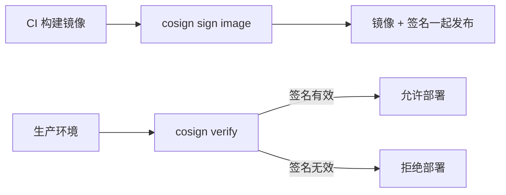

# 容器镜像与镜像仓库

> 所属计划: [[plan|CI/CD 完整学习计划]]
> 预计耗时: 60min
> 前置知识: [[09-docker-containerization]]

---

## 1. 概念讲解

### 为什么需要镜像仓库？

在 [[09-docker-containerization]] 里，我们已经在本地把 `quote-api` 打包成了 Docker 镜像。但本地镜像只能在本机运行，没法直接交给测试环境、预发环境或生产服务器使用。要让镜像像快递包裹一样被分发到不同地方，就需要一个**集中存储和分发镜像的服务**，这就是镜像仓库（Container Registry）。

可以把它类比成你更熟悉的 npm registry：

| 对比项 | npm registry | Docker Registry |
|--------|--------------|-----------------|
| 存储对象 | npm 包（`.tgz`） | 容器镜像（layer 集合） |
| 地址格式 | `registry.npmjs.org/package@version` | `ghcr.io/owner/image:tag` |
| 拉取命令 | `npm install package` | `docker pull image:tag` |
| 发布命令 | `npm publish` | `docker push image:tag` |

CI/CD 的典型流程是：流水线在每次合并后自动构建镜像 → 推送到 Registry → 部署阶段从 Registry 拉取并运行。没有 Registry，构建机器和运行机器之间就少了“交付物中转站”，整个 CD 流程会断裂。

除了标签，Registry 还会为每个镜像生成一个**内容寻址的 digest**（形如 `sha256:abc123...`）。digest 由镜像内容计算得出，只要内容不变就绝对不变，因此比标签更可靠。生产部署脚本可以写成 `ghcr.io/owner/image@sha256:xxx`，这样即使标签被误覆盖或恶意篡改，也不会拉错镜像。

### 常见的镜像仓库

| 仓库 | 所属厂商 | 特点 | 适用场景 |
|------|----------|------|----------|
| Docker Hub | Docker | 公共镜像最多，默认源 | 公开项目、拉取官方基础镜像 |
| GHCR（GitHub Container Registry） | GitHub | 与仓库/Actions 深度集成，用 `GITHUB_TOKEN` 即可认证 | GitHub 项目首选 |
| ACR（Azure Container Registry） | Microsoft | 与 Azure 生态集成，支持地理复制 | Azure 云部署 |
| ECR（Amazon Elastic Container Registry） | AWS | IAM 权限模型，与 ECS/EKS 集成 | AWS 云部署 |
| GCR/GAR（Google Artifact Registry） | Google Cloud | 支持 Docker、npm、maven 等多种制品 | GCP 云部署 |
| Harbor | 开源（CNCF） | 可私有化部署，支持镜像签名、扫描、配额 | 企业内网、合规要求高的环境 |

本节以 **GHCR** 为例，因为它与 GitHub Actions 结合最顺畅，不需要额外管理密码，适合作为学习起点。

### 镜像标签策略：不要只用 `latest`

镜像标签（tag）看似简单，却是生产环境中最容易踩坑的地方之一。很多人习惯打完镜像直接 `docker push myapp:latest`，觉得这代表“最新版”，但 `latest` 是一个**可变指针**：你今天拉的 `latest` 和昨天拉的 `latest` 可能完全不同。

这会带来几个问题：

1. **不可复现**：测试环境昨天还能跑，今天重启后拉了新的 `latest`，行为变了。
2. **回滚困难**：线上出问题时，你不知道上一个稳定的 `latest` 到底对应哪个镜像 digest。
3. **排查混乱**：日志里只看到 `latest`，无法快速定位到具体代码版本。

生产环境推荐采用**组合式标签策略**：

| 标签类型 | 示例 | 作用 | 是否可变 |
|----------|------|------|----------|
| Git SHA | `sha-3a9f1b2` | 不可变、唯一、可追溯到具体提交 | 否 |
| 语义版本 | `v1.2.3`、`v1.2`、`v1` | 人类可读，便于版本管理 | 否（建议发布后不再修改） |
| 分支名 | `main`、`pr-42` | 表示来源分支，适合临时测试 | 是 |
| `latest` | `latest` | 仅作为“当前默认入口”，不推荐用于生产 | 是 |

推荐做法：一次构建同时打上多个标签。例如某个 `main` 分支提交对应的镜像可以被打上：

```text
ghcr.io/your-username/quote-api:sha-3a9f1b2
ghcr.io/your-username/quote-api:main
ghcr.io/your-username/quote-api:latest
```

生产部署时固定使用 `sha-...` 标签，这样即使仓库里其他标签被覆盖，你也能精确知道跑的是哪一行代码的产物。

### GHCR 集成与认证

GHCR 的镜像地址格式为：

```text
ghcr.io/<owner>/<image>:<tag>
```

对于 `quote-api` 项目，如果仓库是 `your-username/quote-api`，则镜像名通常是 `ghcr.io/your-username/quote-api`。

认证方式非常简单：GitHub Actions 自带 `GITHUB_TOKEN`，只要给 workflow 赋予 `packages: write` 权限，就可以用 `docker/login-action` 自动登录 GHCR，无需把个人密码或 PAT 存进 Secrets。

```yaml
permissions:
  contents: read
  packages: write
```

默认情况下，GHCR 推上去的包可能只对仓库私有。如果这是公开项目，需要进入仓库的 **Packages** 页面，找到该镜像，点击 **Package settings**，把 **Package visibility** 改为 **Public**，否则外部用户或部署环境无法 `docker pull`。企业私有项目则保持 Private，并通过 GitHub 组织权限控制谁能读取。

另外，`GITHUB_TOKEN` 的权限只在本次 workflow run 内有效，过期即失效，这比把个人访问令牌（PAT）长期存在 Secrets 里更安全。这是“短期凭证”原则在 CI 里的典型应用。

### docker/build-push-action：现代 CI 推镜像的标准方式

手动写脚本 `docker build` + `docker push` 当然可以工作，但在 CI 里我们更倾向于使用官方 action：`docker/build-push-action`。它相比裸命令有以下优势：

1. **内置 BuildKit 支持**：自动使用 `docker buildx`，支持多架构构建（`linux/amd64`、`linux/arm64`）。
2. **缓存集成**：可直接把 layer 缓存写到 GitHub Actions Cache 或 Registry Cache，跨 workflow run 复用。
3. **metadata 集成**：与 `docker/metadata-action` 配合，自动生成规范化标签。
4. **并发安全**：在 runner 上管理 buildx builder 实例，避免多 job 冲突。

配套常用的 action 如下：

| Action | 作用 |
|--------|------|
| `docker/setup-buildx-action` | 配置 buildx 构建器 |
| `docker/login-action` | 登录镜像仓库 |
| `docker/metadata-action` | 根据 git 事件自动生成标签和注解 |
| `docker/build-push-action` | 构建并推送镜像 |

实际项目中，你还会看到有人直接用 `run: docker build -t ... . && docker push ...`。这种写法在小项目里能跑，但遇到以下场景会吃力：需要构建 `linux/arm64` 镜像以支持 Apple Silicon 服务器、需要把 layer 缓存共享给 fork 出来的 PR、需要把构建摘要导出为 SBOM。`docker/build-push-action` 把这些能力封装成了输入参数，比如 `platforms: linux/amd64,linux/arm64`，显著降低了维护成本。

### BuildKit 缓存：让构建快起来

Docker 的本地缓存只在单次构建内有效，CI runner 是临时的，每次 run 都会清空。如果没有远程缓存，每次 CI 构建都要从 `npm ci` 开始重新安装依赖，非常浪费时间。

BuildKit 支持把缓存导出到外部存储，常见有两种：

| 缓存后端 | 配置 | 特点 |
|----------|------|------|
| GitHub Actions Cache（`gha`） | `type=gha` | 利用 Actions 内置 cache，免费、简单 |
| Registry Cache（`registry`） | `type=registry,ref=...` | 把缓存层也存到镜像仓库，适合多分支共享 |

`gha` 缓存适合入门，只需设置 `cache-from` 和 `cache-to`：

```yaml
cache-from: type=gha
cache-to: type=gha,mode=max
```

`mode=max` 表示缓存所有层（包括中间层），而不仅仅是最终镜像里出现的层。对于多阶段构建，这能显著加速 builder 阶段。

一个需要注意的细节是：`gha` 缓存在 fork 仓库的 PR 中默认不可用（否则可能污染上游缓存），而 `registry` cache 可以让 fork 也复用上游缓存，只是需要正确配置读取权限。如果你团队里有大量外部贡献者，registry cache 往往是更好的长期选择。

此外，缓存并非越多越好。如果 `package.json` 几乎每次提交都变，`npm ci` 层缓存命中率低，导出大量缓存反而会占用 Actions cache 配额（默认 10GB）。建议先观察几次构建日志，确认命中后再决定是否开启 `mode=max`。

### 镜像签名与信任：cosign 简介

镜像推送到仓库后，别人拉取时怎么知道它确实是你构建的、没有被篡改？这就需要**镜像签名**。

cosign 是 Sigstore 项目里的工具，专门用于给容器镜像签名和验签。它的工作流程大致是：



在 CI 中，你可以在 `docker/build-push-action` 之后加一个 cosign 签名步骤；在部署前强制验签，确保只运行来自可信流水线的镜像。这是软件供应链安全的重要一环，第 [[15-devsecops]] 节会深入讲解镜像扫描和 SBOM，与签名配合形成完整防护。

### 本地如何拉取已推送的镜像

推送到 GHCR 后，任何有读取权限的人都可以在本地验证：

```bash
# 1. 用 GitHub 用户名和个人访问令牌（PAT 需要 read:packages）登录
docker login ghcr.io -u your-username

# 2. 拉取特定 sha 标签的镜像
docker pull ghcr.io/your-username/quote-api:sha-3a9f1b2

# 3. 运行容器验证
docker run -d -p 3000:3000 ghcr.io/your-username/quote-api:sha-3a9f1b2
```

CI/CD 里的部署脚本通常不会登录交互式输入密码，而是把 PAT 或云厂商的 pull secret 作为环境变量注入。第 [[17-capstone-project]] 节会展示如何把镜像从 GHCR 部署到实际运行环境。

---

## 2. 代码示例

下面给出 `quote-api` 项目推送到 GHCR 的完整 workflow。它会在 `push` 到 `main` 分支或推送 `v*` 标签时触发，自动构建镜像并推送到 `ghcr.io/your-username/quote-api`。

在 `quote-api/.github/workflows/docker.yml` 创建以下内容：

```yaml
name: Build and Push Docker Image

# 触发条件：main 分支更新，或推送 v 开头的 tag（如 v1.2.3）
on:
  push:
    branches:
      - main
    tags:
      - 'v*'

env:
  # 镜像名统一在这里定义，方便维护
  IMAGE_NAME: quote-api
  REGISTRY: ghcr.io

jobs:
  build-push:
    runs-on: ubuntu-latest

    # 关键权限：packages: write 才能推送到 GHCR
    permissions:
      contents: read
      packages: write
      # 如果后续要签名镜像，还需要 id-token: write 用于 OIDC
      # id-token: write

    steps:
      # 1. 检出代码
      - name: Checkout repository
        uses: actions/checkout@v4

      # 2. 配置 Docker Buildx（启用 BuildKit）
      - name: Set up Docker Buildx
        uses: docker/setup-buildx-action@v3

      # 3. 登录 GHCR，使用仓库自动提供的 GITHUB_TOKEN
      - name: Log in to GHCR
        uses: docker/login-action@v3
        with:
          registry: ${{ env.REGISTRY }}
          username: ${{ github.actor }}
          password: ${{ secrets.GITHUB_TOKEN }}

      # 4. 自动生成镜像标签和 OCI 注解
      #    例如 push main 时生成：sha-xxx, main, latest
      #    push v1.2.3 时生成：sha-xxx, 1.2.3, 1.2, 1, latest
      - name: Extract metadata
        id: meta
        uses: docker/metadata-action@v5
        with:
          images: ${{ env.REGISTRY }}/${{ github.repository_owner }}/${{ env.IMAGE_NAME }}
          tags: |
            type=sha,prefix=sha-,format=short
            type=ref,event=branch
            type=semver,pattern={{version}}
            type=semver,pattern={{major}}.{{minor}}
            type=semver,pattern={{major}}
            type=raw,value=latest,enable={{is_default_branch}}

      # 5. 构建并推送镜像，同时启用 gha 缓存
      - name: Build and push
        uses: docker/build-push-action@v6
        with:
          context: .
          push: true
          tags: ${{ steps.meta.outputs.tags }}
          labels: ${{ steps.meta.outputs.labels }}
          cache-from: type=gha
          cache-to: type=gha,mode=max
```

### 逐行注释

- **`on.push.branches/tags`**：只在 `main` 更新或发版 tag 时触发。PR 里通常不直接推镜像，避免污染仓库。
- **`permissions.packages: write`**：没有这个权限，`docker/login-action` 拿到的 `GITHUB_TOKEN` 就无法往 GHCR 写镜像。
- **`docker/setup-buildx-action`**：在 runner 上初始化 buildx builder，否则 `docker/build-push-action` 的某些高级特性（缓存、多架构）不可用。
- **`docker/login-action`**：`username` 用 `${{ github.actor }}`（触发者），`password` 用 `${{ secrets.GITHUB_TOKEN }}`。这是 GHCR 与 GitHub Actions 集成最优雅的地方。
- **`docker/metadata-action`**：这是最省心的打标签方式。它根据事件类型自动选择哪些 tag 启用：
  - `type=sha,prefix=sha-,format=short` → `sha-3a9f1b2`
  - `type=ref,event=branch` → 在 main 分支 push 时生成 `main`
  - `type=semver,pattern={{version}}` → 在 `v1.2.3` tag 时生成 `1.2.3`
  - `type=raw,value=latest,enable={{is_default_branch}}` → 仅在默认分支（main）时生成 `latest`
- **`cache-from: type=gha` / `cache-to: type=gha,mode=max`**：把 BuildKit 缓存导出到 GitHub Actions Cache，下次构建时优先复用。

### 如何安全地引用这个镜像

在部署脚本里，最稳妥的写法不是用标签，而是用 digest：

```yaml
# 用 digest 部署，确保不可变
image: ghcr.io/your-username/quote-api@sha256:3a9f1b2...
```

不过 digest 不利于人类阅读，所以很多团队会采用“标签用于展示，digest 用于锁定”的折中：CI 输出同时发布标签和 digest，部署时通过 API 查询标签当前对应的 digest，再用 digest 启动容器。这样既能保留 `v1.2.3` 这种可读标签，又能保证实际运行的是不可变内容。

另外，如果你希望同一个 workflow 也能在 PR 中构建但不推送，可以把 `push: true` 改成 `push: ${{ github.event_name != 'pull_request' }}`，并给 PR 加上 `type=ref,event=pr` 标签用于临时测试。这样 PR 构建能验证 Dockerfile 是否正常，但不会污染 GHCR 里的正式镜像。

### 运行方式

1. 把 `docker.yml` 提交到 `quote-api` 仓库的 `.github/workflows/` 目录并 push 到 `main`。
2. 在 GitHub 仓库页进入 **Actions** 标签页，确认 workflow 运行成功。
3. 进入仓库主页的 **Packages** 区域，或在浏览器访问：
   `https://github.com/your-username/quote-api/pkgs/container/quote-api`

### 预期输出

workflow 日志中，构建步骤会显示缓存命中或推送进度：

```text
#1 [internal] load build definition from Dockerfile
#1 transferring dockerfile: 389B done
#1 DONE 0.0s

#2 [internal] load metadata for docker.io/library/node:22-alpine
#2 DONE 0.8s

#4 [builder 4/6] RUN npm ci
#4 CACHED

#9 exporting to image
#9 pushing layers
#9 pushing manifest for ghcr.io/your-username/quote-api:sha-3a9f1b2
#9 DONE 12.3s
```

在 GitHub Packages 页面可以看到类似：

```text
ghcr.io/your-username/quote-api
Tags: sha-3a9f1b2, main, latest
Last pushed: 2 minutes ago
```

---

## 3. 练习

### 练习 1: 基础

为 `quote-api` 编写一个 workflow，在 `main` 分支 push 时构建镜像并推送到 GHCR，只使用 `git sha` 作为标签。要求：在 `tags` 中只保留 sha 标签，不生成 `latest` 和分支名标签；推送到 `ghcr.io/${{ github.repository_owner }}/quote-api`。

### 练习 2: 进阶

使用 `docker/metadata-action`，让同一次构建同时打上 `sha`、语义版本和 `latest` 三个标签（语义版本只在推送 `v*` tag 时启用）。要求：`main` 分支 push 时生成 `sha-xxx` 和 `latest`；推送 `v1.2.3` 时额外生成 `1.2.3`、`1.2`、`1` 和 `sha-xxx`。

### 练习 3: 挑战（可选）

把缓存从 `gha` 切换到 `registry` cache，并对比前后两次 CI 构建时间。要求：缓存镜像存到 `ghcr.io/your-username/quote-api:cache`；在构建日志中说明如何识别 `CACHED` 行；解释为什么 registry cache 在 fork PR 场景下比 `gha` cache 更有优势。

---

## 3.5 参考答案

> [!tip]- 练习 1 参考答案
> 只保留 `type=sha` 标签，即可实现“每次 main push 只打 sha 标签”：
>
> ```yaml
> name: Push quote-api to GHCR with SHA tag
>
> on:
>   push:
>     branches: [main]
>
> env:
>   REGISTRY: ghcr.io
>   IMAGE_NAME: quote-api
>
> jobs:
>   build-push:
>     runs-on: ubuntu-latest
>     permissions:
>       contents: read
>       packages: write
>
>     steps:
>       - uses: actions/checkout@v4
>
>       - name: Set up Docker Buildx
>         uses: docker/setup-buildx-action@v3
>
>       - name: Log in to GHCR
>         uses: docker/login-action@v3
>         with:
>           registry: ${{ env.REGISTRY }}
>           username: ${{ github.actor }}
>           password: ${{ secrets.GITHUB_TOKEN }}
>
>       - name: Build and push
>         uses: docker/build-push-action@v6
>         with:
>           context: .
>           push: true
>           tags: ${{ env.REGISTRY }}/${{ github.repository_owner }}/${{ env.IMAGE_NAME }}:sha-${{ github.sha }}
>           cache-from: type=gha
>           cache-to: type=gha,mode=max
> ```
> `github.sha` 是完整 40 位 commit hash，若想更简短，可用 `${{ github.sha }}` 的前 7 位。

> [!tip]- 练习 2 参考答案
> 在 metadata-action 里组合多种 `type` 即可，不需要自己手写 `if`：
>
> ```yaml
>       - name: Extract metadata
>         id: meta
>         uses: docker/metadata-action@v5
>         with:
>           images: ${{ env.REGISTRY }}/${{ github.repository_owner }}/${{ env.IMAGE_NAME }}
>           tags: |
>             type=sha,prefix=sha-,format=short
>             type=semver,pattern={{version}}
>             type=raw,value=latest,enable={{is_default_branch}}
> ```
>
> 随后 `build-push-action` 使用 `${{ steps.meta.outputs.tags }}` 作为 `tags`。这样：
> - 普通 `main` push 会生成：`sha-xxxxxx`、`latest`
> - 推送 `v1.2.3` tag 会额外生成：`1.2.3`

> [!tip]- 练习 3 参考答案（可选）
> 使用 registry cache 时，缓存本身也存储在镜像仓库中，通常用一个 `:cache` 后缀的“伪镜像”来保存缓存层。
>
> ```yaml
>       - name: Build and push with registry cache
>         uses: docker/build-push-action@v6
>         with:
>           context: .
>           push: true
>           tags: ${{ steps.meta.outputs.tags }}
>           labels: ${{ steps.meta.outputs.labels }}
>           cache-from: type=registry,ref=${{ env.REGISTRY }}/${{ github.repository_owner }}/${{ env.IMAGE_NAME }}:cache
>           cache-to: type=registry,ref=${{ env.REGISTRY }}/${{ github.repository_owner }}/${{ env.IMAGE_NAME }}:cache,mode=max
> ```
>
> **如何判断缓存命中：**
> 1. 第一次运行时，日志里 `RUN npm ci` 等层会显示正常执行，耗时较长。
> 2. 第二次运行且 `package*.json` 未变时，日志会显示 `CACHED`，对应步骤耗时接近 0s。
> 3. 对比两次 workflow 的 `Build and push` 步骤耗时，通常能看到从几十秒降到几秒。

> [!note] 答案使用方式
> 先独立完成练习，再展开查看参考答案。参考答案不是唯一解——如果你的实现通过了测试或达到了题目要求，就是正确的。

---

## 4. 扩展阅读

- [GitHub Docs: Working with the Container Registry](https://docs.github.com/en/packages/working-with-a-github-packages-registry/working-with-the-container-registry)
- [docker/build-push-action README](https://github.com/docker/build-push-action)
- [docker/metadata-action README](https://github.com/docker/metadata-action)
- [cosign 项目主页](https://github.com/sigstore/cosign)
- [Docker BuildKit 缓存后端文档](https://docs.docker.com/build/cache/backends/)

---

## 常见陷阱

- **只用 `latest` tag，无法回滚到特定版本**：`latest` 是可变引用，生产部署应固定使用 `sha-xxx` 或语义版本标签。
- **把 secret 烘焙进镜像层**：永远不要 `COPY .env .` 或 `ARG PASSWORD` 后留在镜像里。应使用运行时环境变量注入，或 BuildKit secret mounts：`RUN --mount=type=secret,id=mysecret ...`。
- **没限制 `packages` 权限**：workflow 必须显式声明 `packages: write`，否则 `GITHUB_TOKEN` 无法推送镜像。同时避免给不需要的 job 授予写权限，遵循最小权限原则。
- **标签策略不统一**：团队里有人用 `latest`、有人用版本号、有人用日期，会导致部署脚本和回滚流程混乱。建议在项目早期约定标签表并写入文档。
- **忽略缓存配置**：每次 CI 都重新安装依赖会显著拖慢反馈。至少开启 `type=gha` 缓存，多分支协作时再考虑 registry cache。
- **镜像包 visibility 未公开导致拉取失败**：公开项目推送到 GHCR 后，默认包可能是 Private，外部或部署环境 `docker pull` 会报 401。需要到 Packages 设置里把 visibility 改为 Public，或给部署环境配置正确的 pull secret。

---

交叉引用：多阶段构建见 [[09-docker-containerization]]；镜像安全扫描见 [[15-devsecops]]；端到端流水线会把本章内容串联起来，见 [[17-capstone-project]]。
