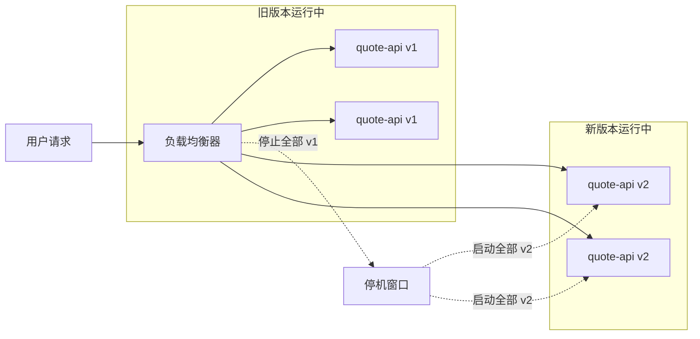
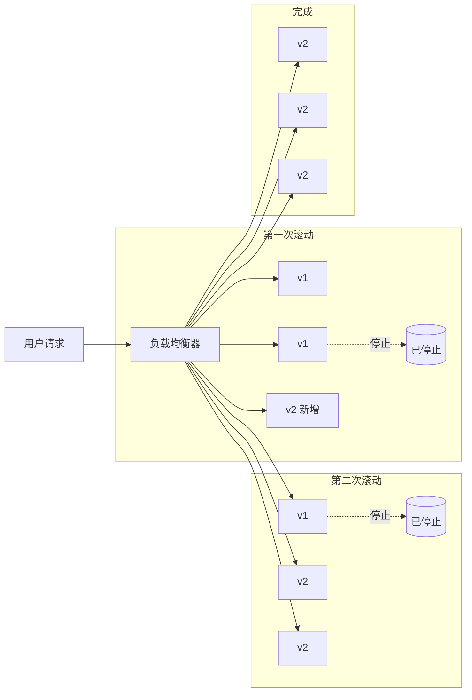
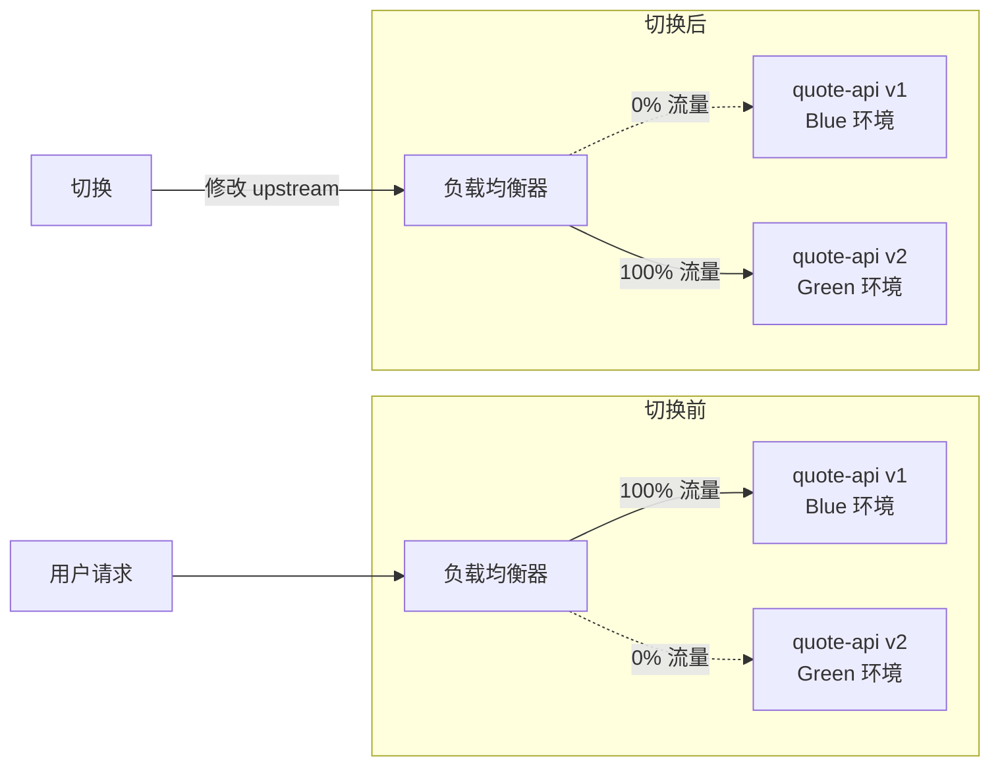
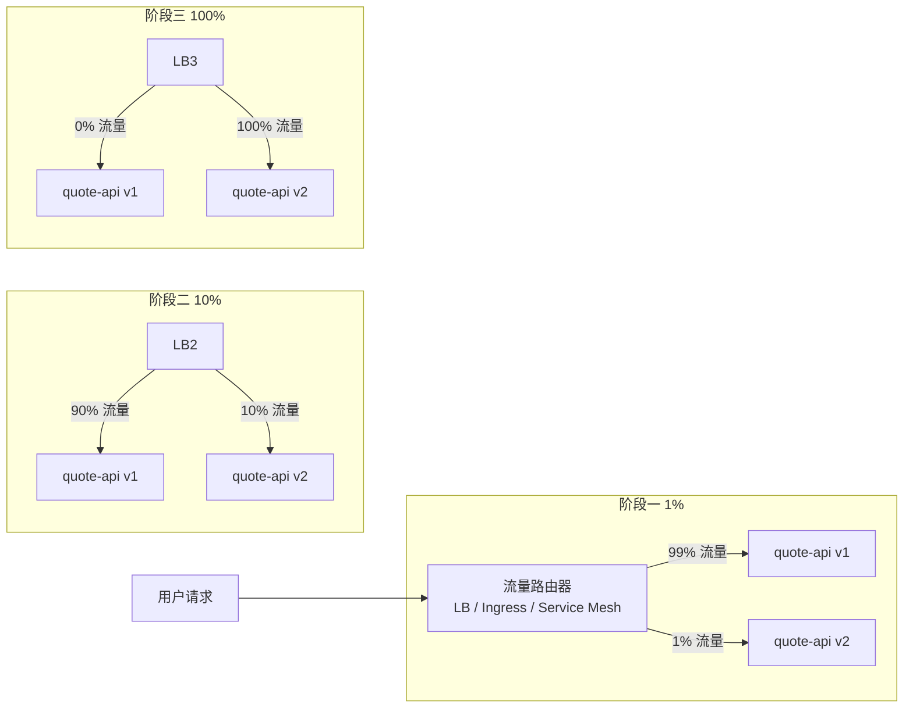

# 部署策略：蓝绿、金丝雀、滚动

> 所属计划: [[plan|CI/CD 完整学习计划]]
> 预计耗时: 75min
> 前置知识: [[08-cache-artifacts-deps]]

---

## 1. 概念讲解

### 为什么需要这个？

把代码合并到 `main` 只是开始，真正的考验在于**如何把新版本安全地交到用户手里**。同样的 `quote-api` 镜像，用不同的部署策略上线，风险可能天差地别：

- 直接停掉旧服务再起新服务，用户会短暂看到 502 错误；
- 慢慢替换实例，用户无感知，但回滚需要逐台替换回去；
- 准备两套环境随时切换，出问题时秒级回滚，但成本翻倍；
- 只把 1% 流量导到新版本观察指标，最安全也最复杂。

部署策略（Deployment Strategy）解决的就是这个问题：**在升级版本的同时，尽量降低停机时间、控制风险、保留回滚能力**。它是 CI/CD 进阶阶段必须掌握的核心能力之一。

### 核心思想

部署策略的本质只有两件事：

1. **新版本的实例怎么替换旧版本的实例？**
2. **流量怎么从旧版本逐步或瞬时迁移到新版本？**

不同的答案组合出不同的策略。下面用 `quote-api` 作为统一例子，逐个讲解四种常见策略。为了便于理解，我们先假设 `quote-api` 运行在一组实例上，前面有一个负载均衡器（Load Balancer，简称 LB）或反向代理负责把用户请求分发给这些实例。

---

### Recreate（重建）：最简单、最有停机

**原理**：先完全停止旧版本的所有实例，然后启动新版本的所有实例。流量先指向旧版实例，旧版全部停止后自然切到新版（中间有停机窗口）。



- **是否停机**：是，有明显的停机窗口。停机时长取决于新版本启动速度。
- **回滚方式**：停止新版，重新启动旧版。回滚速度和重新部署一样慢，且再次停机。
- **适用场景**：开发/测试环境、可接受停机的小型内部服务、单实例部署。
- **前置条件**：几乎无前置条件，单实例也能用。

Recreate 是“最不像 CI/CD”的策略，但它确实简单。如果你的服务只有一个实例、没有负载均衡器，又暂时不想引入复杂基础设施，Recreate 是最现实的选择。它的核心风险是停机窗口内所有请求都会失败，所以生产环境要尽量避免。

---

### Rolling（滚动）：逐步替换、无停机

**原理**：保持总实例数不变，先启动一批新版本实例，再停止一批旧版本实例，循环直到全部替换完成。因为始终有实例在提供服务，所以理论上没有停机。



- **是否停机**：否，前提是至少有两个实例且 LB 健康检查正常。滚动过程中如果新版本有严重 bug，LB 会把失败的实例踢出，但已经导入的请求可能失败。
- **回滚方式**：再执行一次反向滚动——启动旧版实例、停止新版实例。回滚速度比切换流量慢，但不需要重新打包或编译。
- **适用场景**：云原生和 Kubernetes 的默认策略、无状态服务、实例数较多的生产环境。
- **前置条件**：
  - 至少两个实例（否则一停就全停）；
  - 负载均衡器 + 健康检查，能自动把异常实例摘掉；
  - 新版本兼容旧版本的数据库/缓存 schema（滚动期间两个版本会共存）。

滚动是最常见的“默认策略”。Kubernetes 的 `Deployment` 默认就是 RollingUpdate：你可以设置 `maxSurge`（最多多启动几个实例）和 `maxUnavailable`（最多允许多少实例不可用）来控制速度和风险。

---

### Blue-Green（蓝绿）：两套环境、瞬时切换

**原理**：同时维护两套几乎完全一样的环境：蓝色（Blue）运行当前生产版本，绿色（Green）部署新版本但暂不接收流量。验证通过后，一次性把流量从蓝色切到绿色。如果出问题，再一次性切回蓝色。



- **是否停机**：否，切换是瞬时修改 LB/反向代理配置，没有服务启动等待。
- **回滚方式**：把 LB 配置改回指向 Blue 环境，立刻恢复旧版本。这是 Blue-Green 最大的优点。
- **适用场景**：需要秒级回滚的金融/电商核心服务、发布窗口很短的服务、需要预先做冒烟测试的场景。
- **前置条件**：
  - 资源翻倍（两套环境同时存在）；
  - 负载均衡器或反向代理能随时切换 upstream；
  - 两个环境共享同一个外部数据库/缓存时，必须保证 v2 兼容 v1 的数据格式；
  - 切换前需在 Green 环境完成验收（smoke test）。

Blue-Green 的代价是成本：你需要两倍的服务器、容器副本或 Pod。但在高可用要求高的场景里，这点成本换来的回滚能力非常值得。

---

### Canary（金丝雀）：小流量先行、观察再扩大

**原理**：先把极小比例（比如 1%）的流量导入新版本实例，观察错误率、延迟、业务指标等。如果一切正常，再逐步扩大比例（1% → 10% → 50% → 100%）。如果异常，立刻把流量切回旧版。

名字来源于过去煤矿工人带金丝雀下井，鸟对有毒气体更敏感，先死则人知危险。



- **是否停机**：否，流量比例逐步调整。
- **回滚方式**：把流量比例瞬间调回 0%，新版本不再接收请求。回滚速度取决于流量控制机制，通常在秒级。
- **适用场景**：用户量巨大、新版本改动风险高、需要真实用户验证的场景（例如推荐算法、新 UI、支付链路改动）。
- **前置条件**：
  - 能按百分比或用户维度分流的流量路由器（如 NGINX weighted upstream、Kubernetes Ingress、Istio、Linkerd、AWS ALB 等）；
  - 完善的可观测性：日志、指标（Prometheus/Grafana）、告警、业务埋点；
  - 自动或人工的判稳机制：错误率阈值、P99 延迟阈值、业务转化率阈值等；
  - 单实例无法做 Canary，必须先有多实例 + 流量控制能力。

Canary 是最复杂的策略，但它把风险降到了最低：只有 1% 的用户会先碰到 bug，而不是 100%。

---

### 四种策略总对比表

| 策略 | 是否停机 | 回滚速度 | 资源成本 | 复杂度 | 主要前置条件 |
|---|---|---|---|---|---|
| Recreate | 是 | 慢（重新部署） | 低（同一时刻只有一套） | 最低 | 无特殊要求 |
| Rolling | 否 | 中（反向滚动） | 中（临时多几个实例） | 中 | 多实例 + LB + 健康检查 |
| Blue-Green | 否 | 极快（切流量） | 高（两套环境并存） | 中高 | 两套环境 + 可切换 upstream |
| Canary | 否 | 快（调流量比例） | 中（只需少量新版实例） | 最高 | 流量路由 + 可观测性 + 判稳规则 |

选择策略时，问自己三个问题：

1. **能容忍停机吗？** 能 → Recreate；不能 → 看后两个条件。
2. **有多个实例和负载均衡吗？** 没有 → 只能 Recreate。
3. **有可观测性和流量控制能力吗？** 有 → 可以考虑 Canary；暂时不够 → 用 Blue-Green 或 Rolling。

---

### 回滚：CD 的核心价值之一

无论用哪种策略，**回滚都必须是可重复的、低风险的、可自动化的**。CI/CD 不只是“自动发布”，更是让“发布失败”不再是灾难。

各策略的回滚要点：

- **Recreate**：回滚 = 重新部署旧版本镜像。慢，且再次停机。务必保留上一个版本的构建产物（镜像 tag、release 包）。
- **Rolling**：回滚 = 反向滚动。Kubernetes 中执行 `kubectl rollout undo deployment/quote-api` 即可。
- **Blue-Green**：回滚 = 切回 Blue 环境。真正的一键回滚，适合高可用场景。
- **Canary**：回滚 = 把流量比例归零。配合告警可以自动触发。

一个常见的反模式是：回滚靠“紧急改代码 → 重新打包 → 重新部署”。这太慢了。正确做法是**回滚到已验证的上一个版本制品**，而不是现场修代码。这正是 [[03-pipeline-core-concepts]] 里强调的 build-once-deploy-many：同一个镜像可以用在不同环境、不同策略里，回滚时直接用旧镜像即可。

---

### 负载均衡与多实例是前提

滚动、蓝绿、金丝雀都有一个共同前提：**你的服务必须能同时运行多个实例，并且前面有东西能把流量按你的意志分发**。

- **单实例**：只能 Recreate。想上高级策略，先水平扩展成多实例。
- **多实例但无 LB**：实例替换时用户请求可能打到已停止的实例，仍然会出现错误。
- **有 LB 但无健康检查**：新版本启动失败时，LB 仍会把请求发过去，造成部分用户持续报错。

所以，在谈部署策略之前，先确认：

1. 你的服务是无状态的吗？（有状态服务的多实例会更复杂，不在本节展开。）
2. 是否有负载均衡器/反向代理？
3. 健康检查是否配置正确？
4. 数据库 schema 是否向前/向后兼容？（滚动和 Canary 期间会新旧共存。）

如果这四个问题还没解决，不要急着上 Canary。

---

### 螺旋上升：build-once-deploy-many

在 [[03-pipeline-core-concepts]] 中我们说过：CI 阶段构建一次镜像或制品，CD 阶段把同一个制品部署到不同环境。部署策略正是这一思想的具体落地：

- 同一次构建产出的 `quote-api:1.2.3` 镜像，可以用 Recreate 部署到开发环境；
- 用 Rolling 部署到测试环境；
- 用 Blue-Green 部署到预发布环境；
- 用 Canary 部署到生产环境。

镜像不变，变的是“怎么把新版本交给用户”。这就是 CI/CD 的精髓：把“构建什么”和“怎么发布”解耦。

---

## 2. 代码示例

### 示例 1：简化的 Blue-Green 切换脚本

下面的 Bash 脚本模拟在两台服务器上做 Blue-Green 部署。它假设：

- 你有两台服务器 `blue` 和 `green`，分别运行不同版本；
- NGINX 作为反向代理，upstream 配置写在 `/etc/nginx/conf.d/quote-api.conf`；
- 你通过 SSH 可以登录这两台服务器；
- 当前流量指向 `blue`，现在要把流量切到 `green`。

> [!warning] 教学简化版
> 这只是一个演示脚本，用于理解 Blue-Green 切换的核心逻辑。真实生产环境请使用 Kubernetes + Argo Rollouts、AWS CodeDeploy、Spinnaker 等成熟工具。

```bash
#!/usr/bin/env bash
set -euo pipefail

# 配置
NGINX_CONF="/etc/nginx/conf.d/quote-api.conf"
BLUE_HOST="blue.internal"
GREEN_HOST="green.internal"

# 颜色检测：读取当前 upstream 指向谁
current_color=$(grep -oE "server (blue|green)\.internal" "$NGINX_CONF" | head -1 | awk '{print $2}')

echo "当前流量指向: $current_color"

# 决定目标颜色
if [[ "$current_color" == "$BLUE_HOST" ]]; then
    target_color="green"
    target_host="$GREEN_HOST"
else
    target_color="blue"
    target_host="$BLUE_HOST"
fi

echo "目标环境: $target_color ($target_host)"

# 1. 在目标环境部署新版本（这里用 docker pull + run 示意）
echo "在 $target_color 部署新版本..."
ssh "$target_host" "docker pull ghcr.io/your-username/quote-api:1.2.3"
ssh "$target_host" "docker stop quote-api || true"
ssh "$target_host" "docker run -d --rm --name quote-api -p 3000:3000 ghcr.io/your-username/quote-api:1.2.3"

# 2. 对目标环境做健康检查
echo "健康检查..."
for i in {1..10}; do
    if curl -fsS "http://$target_host:3000/health" > /dev/null; then
        echo "健康检查通过"
        break
    fi
    echo "等待健康检查... ($i/10)"
    sleep 2
done

# 3. 切换 NGINX upstream 到目标环境
echo "切换流量到 $target_color..."
sudo sed -i "s/server ${current_color%%.*}\.internal/server ${target_color}.internal/g" "$NGINX_CONF"
sudo nginx -t && sudo nginx -s reload

echo "切换完成，当前流量指向: $target_color"
```

**脚本要点**：

- 先部署到不接收流量的环境；
- 通过 `/health` 端点验证目标环境可用；
- 修改 NGINX 配置并重载，瞬时切流量；
- 旧环境（原来的 Blue）保留，随时可以切回去。

---

### 示例 2：GitHub Actions 部署 job 概念结构

下面的 YAML 展示了如何用 `environment: production` 实现“先自动部署到 staging，再等待人工审批后才能部署到 production”。 approvals 是 GitHub Environments 的内置能力，适合 Blue-Green 或 Canary 发布前的最后把关。

```yaml
# .github/workflows/deploy.yml
name: Deploy quote-api

on:
  push:
    branches: [main]

jobs:
  build:
    runs-on: ubuntu-latest
    steps:
      - uses: actions/checkout@v4

      - name: Build and push Docker image
        run: |
          docker build -t ghcr.io/${{ github.repository }}:${{ github.sha }} .
          docker push ghcr.io/${{ github.repository }}:${{ github.sha }}

  deploy-staging:
    needs: build
    runs-on: ubuntu-latest
    environment: staging
    steps:
      - name: Deploy to staging (rolling update)
        run: |
          echo "kubectl set image deployment/quote-api quote-api=ghcr.io/${{ github.repository }}:${{ github.sha }}"
          echo "kubectl rollout status deployment/quote-api"

  deploy-production:
    needs: deploy-staging
    runs-on: ubuntu-latest
    environment: production
    steps:
      - name: Deploy to production (blue-green / canary)
        run: |
          echo "这里调用蓝绿或金丝雀部署脚本/工具"
          echo "例如：argocd app sync quote-api-prod"
```

**关键点**：

- `needs: build` 保证先完成镜像构建；
- `environment: staging` 和 `environment: production` 会触发 GitHub Environments 的保护规则；
- 在仓库 `Settings > Environments > production` 里可以配置 **Required reviewers**（例如要求 1 名 SRE 审批），这样 `deploy-production` job 会在 staging 部署完成后暂停，等待人工点击 "Approve and deploy"；
- 实际部署命令根据你的基础设施写，可以是 `kubectl`、Argo CD、Terraform、或 Blue-Green 脚本。

---

**运行方式**:

1. 把 Bash 脚本保存为 `switch-blue-green.sh`，赋予执行权限：`chmod +x switch-blue-green.sh`。
2. 准备两台虚拟机或容器分别作为 `blue` 和 `green`，并安装 NGINX。
3. 在 `blue` 上运行 `quote-api:1.2.2`，确认当前流量指向 `blue`。
4. 执行脚本切换到 `green`（运行 `quote-api:1.2.3`）。
5. 切换前后分别执行 `curl http://your-domain/api/quotes` 观察响应。

**预期输出**:

```text
当前流量指向: blue.internal
目标环境: green (green.internal)
在 green 部署新版本...
健康检查...
健康检查通过
切换流量到 green...
切换完成，当前流量指向: green

# 切换前
$ curl http://localhost/api/quotes
{"quote":"代码即文档。 — 当你写不出文档时。"}

# 切换后
$ curl http://localhost/api/quotes
{"quote":"简单是可靠的先决条件。 — Hoare","version":"1.2.3"}
```

---

## 3. 练习

### 练习 1: [基础] 为 quote-api 选一个部署策略并说明理由

假设你的 `quote-api` 当前部署情况如下，请从 Recreate、Rolling、Blue-Green、Canary 中选一个最合适的策略，并说明理由：

- 场景 A：单台 VPS 运行，没有负载均衡器，用户是内部小团队，可接受夜间 1 分钟停机。
- 场景 B：Kubernetes 集群运行 3 个 Pod，前面有 Ingress 控制器，无停机要求。
- 场景 C：运行在云服务器 Auto Scaling Group 中，共 10 台实例，业务高峰期不能停，但成本敏感。
- 场景 D：大型电商平台核心支付服务，任何故障都会直接损失收入，预算充足。

### 练习 2: [进阶] 写出 Blue-Green 部署回滚的步骤

你按照本节的 Bash 脚本把流量从 Blue 切到了 Green。上线 5 分钟后，监控显示 Green 环境的错误率飙升。请写出完整的回滚步骤，要求：

1. 回滚操作本身不能引入新的停机；
2. 说明回滚后 Blue 环境是否还需要保留；
3. 说明如果错误在 30 分钟后才被发现，是否还能用同样的方式回滚。

### 练习 3: [挑战] 设计一个金丝雀发布方案（可选）

为 `quote-api` 设计一个从 1% 到 100% 的金丝雀发布方案。要求包含：

- 每一步的流量比例和观察时长；
- 每一步需要观察哪些指标；
- 什么条件下自动回滚（给出具体阈值）；
- 使用什么工具或机制控制流量比例（可以基于 Kubernetes、NGINX、Service Mesh 或云厂商 LB）。

---

## 3.5 参考答案

> [!tip]- 练习 1 参考答案
> - **场景 A：Recreate**。单实例无 LB，无法做多实例策略；内部小团队可接受短暂停机，Recreate 最简单。
> - **场景 B：Rolling**。K8s 默认支持 RollingUpdate，3 个 Pod 足够滚动，无需额外资源。
> - **场景 C：Rolling 或 Canary**。10 台实例可以滚动；如果改动风险高，也可以做 Canary，只新增 1 台新版实例先接 10% 流量，成本可控。
> - **场景 D：Blue-Green 或 Canary**。支付服务不能停，Blue-Green 提供秒级回滚；如果新版本改动风险高，可先用 Canary 把 1% 真实支付流量导过去，观察核心指标后再全量。两者也可以组合：Canary 验证通过后切到 Green 全量，出问题再回 Blue。

> [!tip]- 练习 2 参考答案
> 1. 立即修改 NGINX upstream 配置，把流量从 `green.internal` 切回 `blue.internal`：
>    ```bash
>    sudo sed -i 's/server green.internal/server blue.internal/g' /etc/nginx/conf.d/quote-api.conf
>    sudo nginx -t && sudo nginx -s reload
>    ```
> 2. 验证回滚：持续 `curl` 接口，确认响应版本回到 v1，错误率下降。
> 3. Blue 环境在回滚后**应该暂时保留**，直到确认 Green 的 bug 根因并修复后，再决定是否销毁或更新 Green。
> 4. 30 分钟后发现错误，只要 Blue 环境没有被修改或销毁，仍然可以秒级切回。如果 Blue 环境已经被更新或释放，则无法快速回滚，只能重新部署旧版本，这就退化成 Recreate 式回滚。因此 Blue-Green 要求旧环境在切换后保持可运行状态一段时间。

> [!tip]- 练习 3 参考答案（可选）
> 以下是一个基于 Kubernetes + NGINX Ingress + Prometheus 的金丝雀方案：
>
> **流量阶段**:
>
> | 阶段 | 流量比例 | 观察时长 | 判稳条件 |
> |---|---|---|---|
> | 1 | 1% | 15 分钟 | HTTP 5xx 比例 `< 0.1%`、P99 延迟 `< 200ms`、Pod 重启次数 `= 0` |
> | 2 | 10% | 30 分钟 | 同上，且 `/api/quotes` 成功率 `> 99.9%` |
> | 3 | 50% | 30 分钟 | 业务指标正常（如 quote 接口 QPS 无明显下跌） |
> | 4 | 100% | 持续观察 | 告警规则保持生效 |
>
> **自动回滚条件**（任一触发即回滚到 0%）：
> - 5xx 错误率 `>= 1%` 持续 2 分钟；
> - P99 延迟 `>= 500ms` 持续 3 分钟；
> - Pod 崩溃重启次数 `>= 3`；
> - `/health` 端点连续失败 `>= 5` 次。
>
> **流量控制工具**：
> - 使用 Argo Rollouts 替代 Kubernetes 原生 Deployment，它内置 Canary 策略、自动流量拆分、Prometheus 指标分析和自动回滚；
> - 或者使用 NGINX Ingress 的 `canary` 注解（`nginx.ingress.kubernetes.io/canary: "true"` + `canary-weight`）按百分比切流量。
>
> **执行命令示例**：
> ```bash
> kubectl argo rollouts promote quote-api
> kubectl argo rollouts abort quote-api   # 手动回滚
> ```

> [!note] 答案使用方式
> 先独立完成练习，再展开查看参考答案。参考答案不是唯一解——如果你的实现通过了测试或达到了题目要求，就是正确的。

---

## 4. 扩展阅读

- [CircleCI: Deployment Strategies](https://circleci.com/blog/deployment-strategies/)
- [Martin Fowler: Blue Green Deployment](https://martinfowler.com/bliki/BlueGreenDeployment.html)
- [Kubernetes Documentation: Deployment Strategies](https://kubernetes.io/docs/concepts/workloads/controllers/deployment/#strategy)
- [Argo Rollouts: Canary Deployment Strategy](https://argoproj.github.io/argo-rollouts/features/canary/)
- [Argo Rollouts: Blue-Green Deployment Strategy](https://argoproj.github.io/argo-rollouts/features/blue-green/)

---

## 常见陷阱

- **单实例服务器想上 Blue-Green / Canary**：做不到。这些策略的前提是至少两个实例和流量分发能力。先解决水平扩展和负载均衡问题。
- **没有可观测性就上 Canary**：Canary 的本质是“用真实流量验证新版本”。如果看不到错误率、延迟、业务指标，就是盲发。先建好监控和告警。
- **回滚靠“重新部署旧代码”而非切流量**：紧急情况下重新打包、编译、部署旧版本太慢，而且容易出错。正确做法是保留上一个版本的制品（镜像 tag），一键回滚到该制品。
- **滚动部署时忽略数据库兼容性**：滚动期间新旧版本会共存，如果新版本的 schema 不兼容旧版本，会导致旧实例读写失败。发布前要做 schema 前向/后向兼容设计。
- **Blue-Green 切换后立刻销毁旧环境**：切换后应保留旧环境一段时间（例如一个发布窗口或 24 小时），以便快速回滚。确认新版本稳定后再释放资源。

---

交叉引用：渐进式交付/特性开关 [[12-progressive-delivery-flags]]；环境与审批 [[03-pipeline-core-concepts]]；部署后监控 [[16-observability-dora]]。
