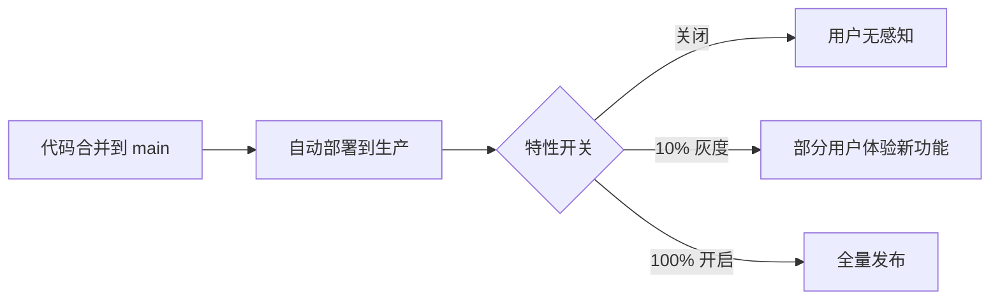
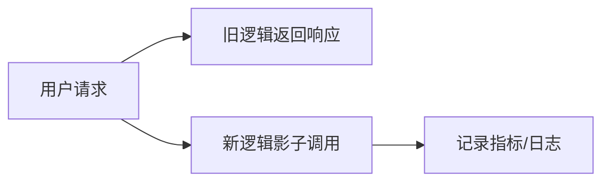
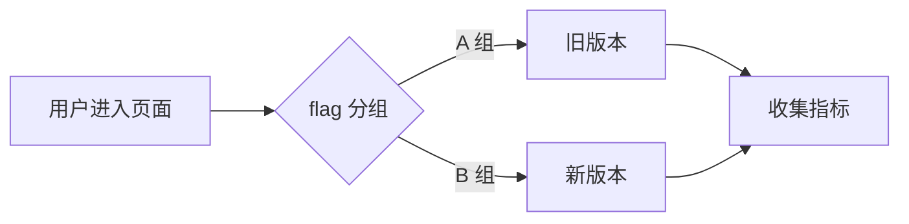

# 渐进式交付与特性开关

> 所属计划: [[plan|CI/CD 完整学习计划]]
> 预计耗时: 60min
> 前置知识: [[11-deployment-strategies]]

---

## 1. 概念讲解

### 为什么需要这个？

在 [[11-deployment-strategies]] 里，我们学了蓝绿、金丝雀、滚动部署等“基础设施层面”的发布技术。它们解决的是：**代码包如何安全地换到生产环境**。但现实中还有另一类风险更高的场景：

- 新功能代码已经合并到 `main`，但你只敢让 1% 的用户先试用；
- 营销活动要零点上线，却不能提前部署代码；
- 某个依赖服务出现故障，你需要秒级关闭新功能，而不是重新跑一遍部署回滚；
- 产品团队想验证“红色按钮”和“绿色按钮”哪个点击率更高。

这些问题的共同点是：**“把代码放上去”和“让用户看到功能”应该是两件事**。传统发布把二者绑在一起——部署即上线，一旦上线就全局生效，回滚成本高。渐进式交付（Progressive Delivery）和特性开关（Feature Flag）正是把这对概念解耦的核心手段。

不学这一节的后果：你的 CD 只能做到“自动化部署”，却做不到“可控发布”。一旦新功能有 bug，要么全量用户受影响，要么连夜回滚整个版本。

### 核心思想

**特性开关**（Feature Flag / Feature Toggle）是一段非常简单的运行时判断：

```typescript
if (featureFlags.newFeatureEnabled) {
  // 新逻辑
} else {
  // 旧逻辑
}
```

它让同一份已部署的代码，在不同时间、不同用户、不同环境下表现出不同行为。换句话说：

> **部署** = 把代码放到服务器上（低风险、可频繁做）。
> **发布** = 通过开关把功能开放给用户（可精确控制、可秒级回滚）。

这是 CI/CD 的进阶武器。没有它，CD 只是“快速把代码推上去”；有了它，CD 才真正变成“快速、安全地把价值交付给用户”。



### 特性开关是什么

特性开关就是一个“运行时配置”，决定某段代码是否执行。它可以存在多个地方：

| 存储位置 | 适合场景 | 优点 | 缺点 |
|---|---|---|---|
| 环境变量 | 小型项目、二值开关 | 简单、无需外部依赖 | 改开关要重新部署 |
| 配置文件（如 JSON/YAML） | 中小型项目 | 易于版本控制 | 动态性差 |
| 数据库 | 需要实时切换 | 无需重启服务 | 自己实现审计较麻烦 |
| 专业 Flag 平台 | 中大型产品、多团队 | 动态规则、审计、分析 | 引入新依赖和成本 |

初学者最常见的误区是以为“特性开关 = 配置文件”。其实开关的关键在于**运行时可控**；至于控多快、控多细，取决于你选择的实现方式。

### 开关类型

不是所有开关都干同一件事。业界通常把它们分为四类：

| 类型 | 用途 | 示例 | 生命周期 |
|---|---|---|---|
| **Release flags**（发布开关） | 灰度、逐步放量 | 新首页对 5% 用户开放 | 短期，全量后删除 |
| **Experiment flags**（实验开关） | A/B 测试、数据驱动决策 | 按钮颜色 A vs B | 随实验结束删除 |
| **Ops flags**（运维开关） | 应急降级、熔断 | 关闭非核心推荐接口 | 可长期保留 |
| **Permission flags**（权限开关） | 按用户角色/套餐开放 | 企业版才能用某功能 | 长期存在 |

分类的意义在于**生命周期管理**。Release 和 Experiment flags 是“临时工”，上线后要尽快清理；Ops 和 Permission flags 是“正式员工”，可以长期存在，但也要有统一登记。

### 发布 vs 部署的解耦

这是特性开关最核心的洞见。

传统流程：


特性开关流程：


在开关流程里，**部署可以提前很多小时甚至很多天完成**，让你在业务真正需要的时刻才“拨开关”发布。一旦发现问题，把开关拨回去即可，不需要重新部署回滚。这种“秒级回滚”能力是高可用系统的关键。

### 灰度发布（Canary via flag）

金丝雀部署是在基础设施层面先切一小部分流量到新版本；而**基于 flag 的灰度发布**则是在同一版本内部，按用户维度逐步放量。

常见灰度规则：

- 按用户百分比（随机或哈希）；
- 按白名单（内部员工、种子用户）；
- 按用户属性（地域、套餐、注册时间）；
- 按时间窗口（白天放量、晚上关闭）。

相比基础设施金丝雀，flag 灰度更灵活：你可以只把“新功能”灰度，而不影响整个进程或容器。

### Dark Launch（暗发布）

暗发布又叫**影子发布**。代码已经部署到生产，但真实用户流量不进入新功能；取而代之的是，系统把一部分真实请求**复制一份**发给新功能，只观察延迟、错误率、资源消耗，不影响用户响应。



暗发布特别适合：

- 重构核心接口，担心性能回退；
- 新依赖上线前做压测；
- 验证新代码在生产环境不会抛出异常。

### A/B 测试

A/B 测试用 flag 把用户分成两组或多组，每组看到不同实现，然后对比业务指标（点击率、转化率、留存等）。



A/B 测试和灰度发布的区别：

- **灰度发布**关注的是“安全地把功能推给所有人”，最终目标通常是 100% 开启；
- **A/B 测试**关注的是“哪一版更好”，最终可能选择保留 A 或 B，甚至两者都下线。

### Flag 管理平台 vs 内嵌实现

小团队可以用最简单的内嵌方式：环境变量、配置文件、数据库字段。但当项目变大，你需要：

- 非技术人员（产品、运营）也能改开关；
- 实时生效，不需要重新部署；
- 细粒度规则（按用户 id、按百分比、按属性）；
- 审计日志（谁改了什么开关，什么时候）；
- 与数据分析平台联动。

这时就值得引入专业平台，例如：

- **Unleash**：开源，可自托管，社区活跃；
- **Flagsmith**：开源，支持 A/B 测试和分段；
- **LaunchDarkly**：商业 SaaS，功能最全面，适合企业级场景。

选择建议：

- 个人/小项目：环境变量或配置文件即可；
- 中型团队、多环境：考虑 Unleash 或 Flagsmith 自托管；
- 大型企业、需要细粒度权限和审计：LaunchDarkly 等商业方案。

### Flag 生命周期：小心 flag 债

每个开关都是技术债。Release 和 Experiment flags 在完成功能后如果不删除，代码里会充斥 `if (flag.xxx)` 分支，导致：

- 代码可读性下降；
- 测试矩阵爆炸；
- 旧分支代码腐烂，没人敢删。

业界把这种现象叫做 **flag 债**（flag debt）。推荐做法：

1. 创建 flag 时就在项目管理工具里登记预期清理日期；
2. 全量开启后观察一个发布周期，确认稳定；
3. 删除 flag 判断代码，把新逻辑变成默认逻辑；
4. 在代码审查中把“是否需要清理旧 flag”作为 checklist 一项。

---

## 2. 代码示例

本节围绕贯穿计划的 `quote-api` 项目展开。假设你已经熟悉它的基本结构：TypeScript + Node.js + Express，核心文件是 `src/quotes.ts` 和 `src/index.ts`。

### 给 quote-api 加一个内嵌特性开关

我们在 `src/quotes.ts` 里加一个 `FEATURES` 配置对象，并通过环境变量覆盖，让“返回大写名言”的功能可以随时开关。

```typescript
// src/quotes.ts
const QUOTES = [
  "代码即文档。 — 当你写不出文档时。",
  "过早优化是万恶之源。 — Knuth",
  "简单是可靠的先决条件。 — Hoare",
];

export const FEATURES = {
  // 环境变量优先级高于默认值
  uppercaseQuotes: process.env.FEATURE_UPPERCASE === "true",
};

export function getRandomQuote(): string {
  const quote = QUOTES[Math.floor(Math.random() * QUOTES.length)];
  return FEATURES.uppercaseQuotes ? quote.toUpperCase() : quote;
}

export function getQuoteCount(): number {
  return QUOTES.length;
}
```

然后在路由里正常使用即可，`index.ts` 不需要关心开关细节：

```typescript
// src/index.ts
import express from "express";
import { getRandomQuote, getQuoteCount } from "./quotes.js";

const app = express();
const PORT = process.env.PORT || 3000;

app.get("/quote", (_req, res) => {
  res.json({ quote: getRandomQuote() });
});

app.get("/count", (_req, res) => {
  res.json({ count: getQuoteCount() });
});

app.listen(PORT, () => {
  console.log(`quote-api listening on port ${PORT}`);
});
```

### 演示一个简单的 A/B：10% 用户看到大写版本

随机灰度最常见的做法不是 `Math.random() > 0.9`，而是**按用户 id 哈希**，保证同一用户每次请求都进入同一组。这里为了演示简单，先用 `Math.random()` 展示随机 10%，后面练习会改成哈希版。

```typescript
// src/quotes.ts
const QUOTES = [
  "代码即文档。 — 当你写不出文档时。",
  "过早优化是万恶之源。 — Knuth",
  "简单是可靠的先决条件。 — Hoare",
];

function isInRollout(userId: string, percentage: number): boolean {
  // 简单随机示例：真实项目请用哈希
  return Math.random() * 100 < percentage;
}

export function getRandomQuote(userId?: string): string {
  const quote = QUOTES[Math.floor(Math.random() * QUOTES.length)];
  const enabledForUser = userId && isInRollout(userId, 10);
  return enabledForUser ? quote.toUpperCase() : quote;
}

export function getQuoteCount(): number {
  return QUOTES.length;
}
```

对应的 `index.ts` 需要把用户标识传进来。这里用查询参数模拟：

```typescript
// src/index.ts
import express from "express";
import { getRandomQuote, getQuoteCount } from "./quotes.js";

const app = express();
const PORT = process.env.PORT || 3000;

app.get("/quote", (req, res) => {
  const userId = req.query.userId as string | undefined;
  res.json({ quote: getRandomQuote(userId) });
});

app.get("/count", (_req, res) => {
  res.json({ count: getQuoteCount() });
});

app.listen(PORT, () => {
  console.log(`quote-api listening on port ${PORT}`);
});
```

> [!warning] 生产环境不要用 `Math.random()` 做灰度
> 随机数会导致同一用户每次请求分组不同，无法保证体验一致性，也无法做准确的实验分析。生产环境应使用用户 id 的确定性哈希，练习 2 会给出参考实现。

### 在 GitHub Actions 里通过环境变量切换 flag

假设你的部署流水线会把 `FEATURE_UPPERCASE` 注入到运行环境，可以在 `.github/workflows/deploy.yml` 里这样写：

```yaml
# .github/workflows/deploy.yml
name: Deploy

on:
  push:
    branches: [main]
  workflow_dispatch:
    inputs:
      feature_uppercase:
        description: "是否开启大写名言特性"
        type: boolean
        default: false

jobs:
  deploy:
    runs-on: ubuntu-latest
    steps:
      - name: Checkout repository
        uses: actions/checkout@v4

      - name: Setup Node.js
        uses: actions/setup-node@v4
        with:
          node-version: 20
          cache: npm
          cache-dependency-path: quote-api/package-lock.json

      - name: Install dependencies
        working-directory: quote-api
        run: npm ci

      - name: Build project
        working-directory: quote-api
        run: npm run build

      - name: Deploy with feature flag
        working-directory: quote-api
        env:
          FEATURE_UPPERCASE: ${{ github.event.inputs.feature_uppercase }}
        run: |
          echo "Deploying quote-api with FEATURE_UPPERCASE=$FEATURE_UPPERCASE"
          # 这里替换为真实部署命令，例如：
          # pm2 restart quote-api --env FEATURE_UPPERCASE=$FEATURE_UPPERCASE
```

这样，手动触发部署时勾选开关，就会向运行环境注入 `FEATURE_UPPERCASE=true`；不勾选则保持 `false`。

### 运行方式

在本地启动项目并切换环境变量观察效果：

```bash
cd quote-api
npm ci
```

开关关闭时：

```bash
npm run dev
# 或：npx tsx src/index.ts
```

另起一个终端测试：

```bash
curl "http://localhost:3000/quote?userId=alice"
```

开关开启时（需要停掉之前的服务，重新设置环境变量再启动）：

```bash
FEATURE_UPPERCASE=true npm run dev
```

### 预期输出

开关关闭：

```text
{"quote":"简单是可靠的先决条件。 — Hoare"}
```

开关开启（或命中 10% 灰度）：

```text
{"quote":"简单是可靠的先决条件。 — HOARE"}
```

多次调用 `/quote?userId=alice`，在哈希灰度下同一用户会稳定得到同一结果；在随机灰度下则可能有时大写、有时原样。

---

## 3. 练习

### 练习 1: [基础]

给 `quote-api` 增加一个特性开关 `FEATURE_COUNT`，控制 `/count` 接口是否额外返回名言数量统计（例如 `{ count: 3, total: 3 }`）。当开关关闭时保持原有 `{ count: 3 }` 响应。

要求：

- 开关默认值写在 `src/quotes.ts` 的 `FEATURES` 对象里；
- 允许通过环境变量 `FEATURE_COUNT` 覆盖；
- 在 `index.ts` 里根据开关返回不同字段。

### 练习 2: [进阶]

把练习或示例中的灰度逻辑改成**按用户 id 哈希**的 10% 灰度。要求同一 `userId` 永远得到同一结果。提示：可以用 Node.js 内置的 `crypto.createHash` 把用户 id 哈希成一个数字，再对 100 取模。

### 练习 3: [挑战]（可选）

设计一个 flag 清理流程：某个 flag 上线 N 周后，自动在 GitHub Issues 或 Slack 提醒团队“该清理了”。给出你的方案，不需要完整实现，但要说清楚触发条件、通知内容、责任人如何确认。

---

## 3.5 参考答案

> [!tip]- 练习 1 参考答案
> ```typescript
> // src/quotes.ts
> const QUOTES = [
>   "代码即文档。 — 当你写不出文档时。",
>   "过早优化是万恶之源。 — Knuth",
>   "简单是可靠的先决条件。 — Hoare",
> ];
>
> export const FEATURES = {
>   uppercaseQuotes: process.env.FEATURE_UPPERCASE === "true",
>   countStats: process.env.FEATURE_COUNT === "true",
> };
>
> export function getRandomQuote(): string {
>   const quote = QUOTES[Math.floor(Math.random() * QUOTES.length)];
>   return FEATURES.uppercaseQuotes ? quote.toUpperCase() : quote;
> }
>
> export function getQuoteCount(): { count: number; total?: number } {
>   if (FEATURES.countStats) {
>     return { count: QUOTES.length, total: QUOTES.length };
>   }
>   return { count: QUOTES.length };
> }
> ```
>
> ```typescript
> // src/index.ts（相关片段）
> app.get("/count", (_req, res) => {
>   res.json(getQuoteCount());
> });
> ```
>
> 运行 `FEATURE_COUNT=true npm run dev` 后访问 `/count`，即可看到 `{ count: 3, total: 3 }`。

> [!tip]- 练习 2 参考答案
> 使用 `crypto.createHash` 把用户 id 映射到 `0-99` 的确定性数字，再和灰度百分比比较：
>
> ```typescript
> // src/quotes.ts
> import { createHash } from "node:crypto";
>
> function isInRollout(userId: string, percentage: number): boolean {
>   const hash = createHash("sha256").update(userId).digest("hex");
>   // 取前 8 位十六进制转成数字
>   const bucket = parseInt(hash.slice(0, 8), 16) % 100;
>   return bucket < percentage;
> }
>
> export function getRandomQuote(userId?: string): string {
>   const quote = QUOTES[Math.floor(Math.random() * QUOTES.length)];
>   const enabledForUser = userId && isInRollout(userId, 10);
>   return enabledForUser ? quote.toUpperCase() : quote;
> }
> ```
>
> 同一个 `userId` 计算出的 `bucket` 永远相同，因此体验稳定。把 `percentage` 从 10 改成 50、100 即可逐步放量。

> [!tip]- 练习 3 参考答案（可选）
> 方案：用一个 scheduled GitHub Actions workflow 每周扫描代码库里的 flag 元数据。
>
> 1. **flag 元数据**：每个 flag 在创建时伴随一个 YAML 文件，例如 `.feature-flags/uppercase-quotes.yml`：
>    ```yaml
>    name: uppercaseQuotes
>    created: "2026-06-23"
>    owner: "@your-team"
>    cleanup_after_weeks: 4
>    status: rollout
>    ```
> 2. **扫描工作流** `.github/workflows/flag-cleanup-reminder.yml`：
>    ```yaml
>    name: Flag Cleanup Reminder
>    on:
>      schedule:
>        - cron: "0 9 * * MON"
>      workflow_dispatch:
>
>    jobs:
>      remind:
>        runs-on: ubuntu-latest
>        steps:
>          - uses: actions/checkout@v4
>          - name: Check flag age
>            run: |
>              # 用 Python/Node 脚本读取 .feature-flags/*.yml，比较 created 日期
>              # 对超过 cleanup_after_weeks 的 flag 创建 GitHub Issue
>              node scripts/flag-cleanup-check.js
>            env:
>              GITHUB_TOKEN: ${{ secrets.GITHUB_TOKEN }}
>    ```
> 3. **脚本逻辑**：计算每个 flag 的创建时间与当前时间的周数差，若超过阈值，调用 GitHub Issues API 创建标题为 `[Flag Cleanup] uppercaseQuotes 已上线 4 周，请确认是否可清理` 的 issue，并 `@owner`。
> 4. **责任人确认**：团队成员在 issue 里回复 `/flag-cleanup uppercaseQuotes`，触发另一个 workflow 自动创建 PR 删除 flag 代码和元数据文件。
>
> 替代方案：把 flag 元数据存在项目管理的自定义字段里（如 Jira、Linear），通过它们的 API 定期提醒。

> [!note] 答案使用方式
> 先独立完成练习，再展开查看参考答案。参考答案不是唯一解——如果你的实现通过了测试或达到了题目要求，就是正确的。

---

## 4. 扩展阅读

- [Martin Fowler: Feature Toggles](https://martinfowler.com/articles/feature-toggles.html)
- [Unleash 官方文档](https://docs.getunleash.io/)
- [Flagsmith 官方文档](https://docs.flagsmith.com/)
- [LaunchDarkly 文档中心](https://docs.launchdarkly.com/)
- [ progressively.com: Progressive Delivery 介绍](https://progressively.app/)

---

## 常见陷阱

- **flag 越开越多不清理，代码里到处 `if` 分支（flag 债）**：每个 release/experiment flag 都要设定清理日期，并在代码审查时检查是否过期。长期存在的 flag 应登记到统一清单。
- **把敏感功能的开关放在客户端可篡改的位置**：例如把 `isAdmin: true` 放在前端 localStorage 或 URL 参数里。敏感判断永远要在服务端完成，客户端只能影响展示层。
- **以为开了 flag 就不用监控**：开关只是降低了发布风险，并不能替代观测。每次放量都要同步观察错误率、延迟、业务指标，并在出现异常时自动告警或自动回滚。
- **灰度规则用随机数导致用户体验不一致**：同一用户每次请求可能命中不同分组，既影响用户感知，也让实验数据失真。请使用基于用户 id 的确定性哈希。
- **开关状态没有审计**：生产事故后需要知道“谁、在什么时间、改了哪个开关”。内嵌开关至少要在日志里记录变更；专业平台自带审计日志。

---

交叉引用：金丝雀部署 [[11-deployment-strategies]]；发布管理 [[14-release-semver]]；监控 [[16-observability-dora]]。
