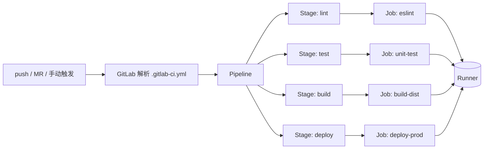

# GitLab CI/CD

> 所属计划: [[plan|CI/CD 完整学习计划]]
> 预计耗时: 75min
> 前置知识: [[04-github-actions-intro]]

---

## 1. 概念讲解

### 为什么需要这个？

在 [[04-github-actions-intro]] 中，你已经用 GitHub Actions 把 `quote-api` 的 lint、test、build 跑了起来。但现实里不是所有团队都用 GitHub：有些公司自建 GitLab 私服，有些项目历史原因就在 GitLab 上，有些团队因为数据主权、权限模型或成本原因更偏好 GitLab。

如果你只懂 GitHub Actions，遇到 GitLab 项目时就会陷入「概念懂一点，YAML 完全不会写」的尴尬。好消息是：**CI/CD 的核心概念是通用的**，触发器、阶段、任务、运行器、制品、缓存这些思想在各个平台大同小异，只是语法和术语不同。

本节的目标就是帮你完成一次「迁移式学习」：用已经熟悉的 GitHub Actions 概念做锚点，快速掌握 GitLab CI/CD。学完你会意识到，工具只是外壳，流水线设计的思维方式才是内核。

### 核心思想

GitLab CI/CD 是 **GitLab 内置的持续集成与持续交付服务**。和 GitHub Actions 类似，它也是「流水线即代码（Pipeline as Code）」：你把 YAML 文件提交到仓库，GitLab 自动识别并执行。

GitLab CI/CD 的配置文件只有一个固定位置：

```text
.gitlab-ci.yml
```

它放在仓库根目录。只要文件存在，GitLab 就会根据其中的定义创建 pipeline、调度 runner、执行 job，并把结果展示在仓库的 **CI/CD → Pipelines** 页面。

你可以把 `.gitlab-ci.yml` 想象成一张「工厂排班表」：

- 整条生产线叫什么？—— Pipeline。
- 生产线分几个大工段？—— Stage（阶段），工段之间串行。
- 每个工段里有多少个并行工位？—— Job（任务），同 stage 的 job 并行跑。
- 每个工位具体做什么？—— Job 里的 `script` 数组。
- 由谁来干活？—— Runner（执行器）。
- 临时零件怎么在同一条生产线内传递？—— Artifact（制品）。
- 常用工具箱能不能跨生产线复用？—— Cache（缓存）。

下面这张图展示了 GitLab CI/CD 的整体流程：



### GitLab CI/CD 是什么

GitLab CI/CD 的核心职责和 GitHub Actions 几乎一致：

1. 监听仓库事件（`push`、Merge Request、手动触发、定时等）。
2. 根据 `.gitlab-ci.yml` 创建 pipeline 实例。
3. 在 GitLab 托管或自托管的 runner 上按 stage 顺序执行 job。
4. 把日志、测试报告、制品、部署状态反馈回 GitLab 界面。

因为是 GitLab 原生集成，权限、代码拉取、MR 状态检查、环境管理、Release 这些操作都无需额外配置。对于已经在使用 GitLab 的团队，它是自然而然的选择。

### GitLab CI/CD 五大核心概念

#### Pipeline（流水线）

一个 `.gitlab-ci.yml` 文件可以定义一条或多条 pipeline。Pipeline 是最高层概念，表示一次完整的 CI/CD 执行过程，从代码触发到所有 job 完成。

对应 GitHub Actions 的 **Workflow**。

#### Stage（阶段）

Stage 是 pipeline 中的逻辑阶段，同一 stage 内的 job 并行执行，不同 stage 之间串行执行。常见 stage 包括：

```yaml
stages:
  - lint
  - test
  - build
  - deploy
```

这意味着：先跑完所有 lint job，再进入 test stage；所有 test job 跑完，再进入 build stage；最后才到 deploy stage。

对应 GitHub Actions 中通过 `needs` 组合起来的 job 层级关系。GitHub Actions 没有显式的 stage 概念，但你可以用多个 job 加 `needs` 实现同样的阶段效果。

#### Job（任务）

Job 是 GitLab CI/CD 的最小调度单元，每个 job 跑在一个 runner 上。一个 job 包含：

- `stage`：属于哪个阶段。
- `script`：具体要执行的命令数组。
- `image`：在哪个 Docker 镜像里跑。
- `rules` / `only` / `except`：什么时候跑。
- `artifacts`：要传递的制品。
- `cache`：要缓存的目录。

对应 GitHub Actions 的 **Job**。但要注意：GitHub Actions 的 job 里包含多个 step，而 GitLab CI/CD 的 job 直接用 `script` 数组表示多个命令，没有显式的 step 概念。

#### Runner（执行器）

Runner 是真正执行 job 的机器。GitLab 的 runner 体系比 GitHub 更丰富，分为三类：

| Runner 类型 | 说明 | 适用场景 |
|-------------|------|----------|
| Shared runner | GitLab SaaS（gitlab.com）提供的公共 runner，按分钟计费有免费额度 | 个人项目、开源项目、小团队 |
| Specific runner | 绑定到单个项目的 runner | 该项目独享资源、需要特殊环境 |
| Group runner | 绑定到某个 group，group 下所有项目共用 | 中大型团队、统一资源池 |

你也可以在自己的服务器上注册 **self-hosted runner**，完全控制执行环境。注册方式通常是安装 `gitlab-runner` 二进制，然后执行 `gitlab-runner register` 并填写 GitLab 提供的 token 和 URL。

Runner 可以通过 `tags` 被精确调度。例如某台 runner 装了特定版本的 GPU 驱动，你可以给它打标签 `gpu`，然后在 job 里写：

```yaml
train-model:
  tags:
    - gpu
  script:
    - python train.py
```

对应 GitHub Actions 的 **Runner**，包括 GitHub 托管运行器（`ubuntu-latest` 等）和 self-hosted runner。

#### Artifact（制品）与 Cache（缓存）

这是初学者最容易混淆的一对概念。

**Artifact** 是 pipeline 内传递数据的机制。例如 build job 生成 `dist/` 目录，通过 `artifacts` 声明后，deploy job 可以下载并使用它。Artifact 的生命周期通常与单个 pipeline 绑定，跑完可以设置保留时间。

**Cache** 是跨 pipeline 复用数据的机制。例如 `node_modules/` 目录，第一次 pipeline 安装后缓存起来，下次 pipeline 直接从缓存恢复，避免重复下载。Cache 的生命周期跨 pipeline，多个 pipeline 可以共享。

对应 GitHub Actions 的 `actions/upload-artifact` / `actions/download-artifact` 和 `actions/cache`。

### 与 GitHub Actions 的概念映射

如果你已经熟悉 GitHub Actions，下面这张表能让你快速建立对应关系：

| GitHub Actions | GitLab CI/CD | 说明 |
|----------------|--------------|------|
| Workflow | Pipeline | 一条完整的流水线 |
| Job | Job | 最小调度单元，跑在 runner 上 |
| Step | `script` 数组中的单个命令 | GitLab 没有显式 step，多个命令按数组顺序执行 |
| Runner | Runner | 执行 job 的机器，GitLab 分 shared/specific/group |
| Cache | Cache | 跨 pipeline 复用数据 |
| Artifact | Artifact | 同 pipeline 内传递数据 |
| Secrets | CI/CD variables（支持 masked） | 敏感配置，支持日志屏蔽 |
| Matrix | `parallel: matrix` | 多版本、多平台并行 |
| Reusable workflow | `include` + hidden job / template | 跨项目/跨文件复用配置 |
| Environment | Environment | 部署目标环境管理 |
| `on` 触发器 | `rules` / `only` / `except` / `workflow: rules` | 控制何时触发/执行 |
| `if` 条件 | `rules:if` | 条件判断语法不同 |
| `needs` 依赖 | `needs` | 显式声明 job 依赖 |

这张表就是本节的「迁移地图」。螺旋上升的意义也在于此：你不需要从零学习 GitLab，只需要把已知概念映射到新语法上。

### Runner 体系深入

GitLab 的 runner 体系是它和 GitHub Actions 最显著的区别之一。

#### Shared runner

GitLab.com 为每个项目提供一定数量的 shared runner 分钟数。免费账户有月度额度，超出后需要购买额外 minute 或改用 self-hosted runner。Shared runner 的优点是「开箱即用」，缺点是资源排队、不可定制。

#### Specific runner

在项目设置里注册一台 runner 并绑定到该项目，这台 runner 只服务于这个项目。适合需要特殊依赖、私有网络访问或高性能机器的场景。

#### Group runner

在 group 级别注册 runner，group 下的所有项目都能使用。适合中大型团队统一 CI 资源池。

#### Self-hosted runner 注册

注册 self-hosted runner 的基本流程：

1. 准备一台 Linux/Windows/macOS 机器。
2. 安装 `gitlab-runner`。
3. 执行 `gitlab-runner register`。
4. 输入 GitLab 实例 URL 和 registration token。
5. 选择 executor（Docker、shell、Kubernetes 等，最常用 Docker）。
6. 可选：给 runner 打 `tags`。

注册完成后，runner 会出现在 **Settings → CI/CD → Runners** 页面。

### `rules` / `only` / `except`

`rules` 是现代 GitLab CI/CD 推荐的条件语法，用于控制 job 何时执行。它对应 GitHub Actions 的 `on` + `if` 组合。

例如，让 deploy job 只在 `main` 分支跑：

```yaml
deploy:
  stage: deploy
  script:
    - echo "Deploying..."
  rules:
    - if: '$CI_COMMIT_BRANCH == "main"'
```

`only` 和 `except` 是旧语法，功能类似但表达能力较弱，官方建议新项目使用 `rules`。

### `include` 与模板

`include` 用于在多个项目或文件之间共享 CI 配置，对应 GitHub Actions 的 reusable workflow。

例如，把通用的 npm 安装步骤抽成模板：

```yaml
include:
  - local: '/templates/npm.yml'
```

也可以引用其他仓库或远程 URL：

```yaml
include:
  - project: 'group/shared-templates'
    file: '/common/npm.yml'
    ref: main
```

被 include 的文件里可以定义 **hidden job**（以 `.` 开头的 job），作为模板被其他 job 继承：

```yaml
# templates/npm.yml
.npm-template:
  image: node:22
  before_script:
    - npm ci
    - npm run lint
```

使用时：

```yaml
include:
  - local: '/templates/npm.yml'

lint:
  extends: .npm-template
  stage: lint
  script:
    - npm run lint
```

`extends` 相当于 GitHub Actions 中调用 reusable workflow 时的参数化复用。

---

## 2. 代码示例

本节把 [[04-github-actions-intro]] 中的 `quote-api` CI 工作流翻译成 `.gitlab-ci.yml`。项目结构和 `package.json` 保持不变，只是在仓库根目录新增 `.gitlab-ci.yml`。

### quote-api 的 .gitlab-ci.yml

```yaml
# .gitlab-ci.yml
# 这是 quote-api 的持续集成流水线：MR 和 main 分支跑 lint + test + build，main 分支额外部署
# 对应 GitHub Actions 中的 .github/workflows/ci.yml

# 定义 pipeline 的四个阶段。stage 之间串行，同 stage 的 job 并行。
# 对应 GitHub Actions：通过多个 job + needs 实现的阶段划分
stages:
  - lint
  - test
  - build
  - deploy

# 默认镜像：所有 job 都在 node:22 容器里运行。
# 对应 GitHub Actions：jobs.<job>.container 或 runs-on + setup-node
image: node:22

# 默认缓存配置：按分支缓存 node_modules，跨 pipeline 复用。
# 对应 GitHub Actions：actions/setup-node 的 cache: npm 或 actions/cache
cache:
  key: ${CI_COMMIT_REF_SLUG}-npm
  paths:
    - quote-api/node_modules/

# 一个 job 对应 GitHub Actions 中的一个 job；script 数组对应 GitHub Actions 中的多个 run step
lint:
  stage: lint
  script:
    # 进入项目子目录；对应 GitHub Actions 的 working-directory
    - cd quote-api
    # 对应 GitHub Actions：run: npm ci
    - npm ci
    # 对应 GitHub Actions：run: npm run lint
    - npm run lint

unit-test:
  stage: test
  script:
    - cd quote-api
    - npm ci
    # 对应 GitHub Actions：run: npm test
    - npm test

build-dist:
  stage: build
  script:
    - cd quote-api
    - npm ci
    # 对应 GitHub Actions：run: npm run build
    - npm run build
  # 把 dist/ 作为制品传递下去；对应 GitHub Actions：actions/upload-artifact
  artifacts:
    name: "dist-$CI_COMMIT_SHORT_SHA"
    paths:
      - quote-api/dist/
    # 制品保留 1 天；GitHub Actions 默认也有保留策略
    expire_in: 1 day

deploy-preview:
  stage: deploy
  # 依赖 build-dist 的 artifacts；对应 GitHub Actions：needs + download-artifact
  needs:
    - job: build-dist
      artifacts: true
  script:
    - echo "Deploying preview for $CI_COMMIT_REF_NAME"
    - ls quote-api/dist/
  rules:
    # Merge Request 时跑；对应 GitHub Actions：if: github.event_name == 'pull_request'
    - if: '$CI_PIPELINE_SOURCE == "merge_request_event"'

deploy-prod:
  stage: deploy
  needs:
    - job: build-dist
      artifacts: true
  script:
    - echo "Deploying to production from $CI_COMMIT_BRANCH"
    - ls quote-api/dist/
  rules:
    # 只在 main 分支跑；对应 GitHub Actions：if: github.ref == 'refs/heads/main'
    - if: '$CI_COMMIT_BRANCH == "main"'
      when: manual
```

逐行对照说明：

- `stages:` 定义 pipeline 阶段。GitHub Actions 没有显式 stage，靠 job 顺序和 `needs` 表达。
- `image: node:22` 指定默认 Docker 镜像。GitHub Actions 里通常用 `runs-on: ubuntu-latest` 加 `actions/setup-node@v4`。
- `cache:` 配置跨 pipeline 缓存。`key: ${CI_COMMIT_REF_SLUG}-npm` 让不同分支有独立缓存；`paths` 指定缓存目录。对应 `actions/cache` 或 `setup-node` 的 cache。
- `lint:` / `unit-test:` / `build-dist:` / `deploy-preview:` / `deploy-prod:` 都是 job 名。GitHub Actions 里对应 `jobs: <job_id>:`。
- `stage:` 指定 job 所属阶段。GitHub Actions 没有 stage，用 `needs` 连接 job。
- `script:` 数组里的每条命令对应 GitHub Actions 中一个 `run` step。
- `artifacts:` 声明要保留的目录，供后续 job 下载。对应 `actions/upload-artifact@v4`。
- `needs:` 声明依赖。GitHub Actions 也有 `needs:`，语义几乎相同。
- `rules:` 控制 job 执行条件。`$CI_PIPELINE_SOURCE == "merge_request_event"` 对应 PR 触发；`$CI_COMMIT_BRANCH == "main"` 对应 main 分支 push。
- `$CI_*` 是 GitLab 预定义变量，和 GitHub Actions 的 `github.*` / `env.*` 上下文类似。

> [!note] 关于项目子目录
> 本计划的示例项目 `quote-api` 在仓库中可能以子目录形式存在。如果你的仓库就是 `quote-api` 本身，请去掉所有 `cd quote-api` 和 `quote-api/` 前缀。

### 运行方式

1. 在仓库根目录创建 `.gitlab-ci.yml`，内容如上。
2. 确保 `quote-api/package.json` 和 `quote-api/package-lock.json` 已提交到 GitLab。
3. 推送代码到 GitLab：

```bash
git add .gitlab-ci.yml
git commit -m "Add GitLab CI pipeline for quote-api"
git push origin main
```

4. 在 GitLab 仓库页面进入 **CI/CD → Pipelines**，可以看到 pipeline 的执行状态。
5. 点击单个 pipeline，可以查看每个 stage 和 job 的日志。

### 预期输出

在 Pipelines 页面，你会看到类似下面的阶段图：

```text
Pipeline #42 passed for main

lint        ● lint           (success)
test        ● unit-test      (success)
build       ● build-dist     (success)
deploy      ● deploy-prod    (success, manual)
```

点击 `unit-test` job，日志末尾应包含：

```text
$ cd quote-api
$ npm ci
$ npm test
 RUN  v1.2.0  /builds/your-group/quote-api/quote-api
 ✓ tests/quotes.test.ts (3)
Test Files  1 passed (1)
     Tests  3 passed (3)
```

---

## 3. 练习

### 练习 1: [基础] 把 quote-api 的 GitHub Actions ci.yml 翻译成 .gitlab-ci.yml

假设 [[04-github-actions-intro]] 中的 `.github/workflows/ci.yml` 如下：

```yaml
name: CI
on:
  push:
    branches: [main]
  pull_request:
    branches: [main]
jobs:
  ci:
    runs-on: ubuntu-latest
    steps:
      - uses: actions/checkout@v4
      - uses: actions/setup-node@v4
        with:
          node-version: 20
          cache: npm
          cache-dependency-path: quote-api/package-lock.json
      - working-directory: quote-api
        run: npm ci
      - working-directory: quote-api
        run: npm run lint
      - working-directory: quote-api
        run: npm test
      - working-directory: quote-api
        run: npm run build
```

请把它改写成 `.gitlab-ci.yml`，要求：

- 使用 `stages: [lint, test, build]`。
- 默认镜像 `node:20`。
- 缓存 `quote-api/node_modules/`。
- 仅在 `main` 分支 push 或 Merge Request 时触发。

### 练习 2: [进阶] 用 rules 控制执行范围

在上题的基础上增加要求：

- `test` job 在 MR 和 `main` 分支都跑。
- `deploy` job 只在 `main` 分支跑，且需要手动触发（`when: manual`）。
- `deploy` job 依赖 `build` job 的 artifacts。

请只写出 `test` 和 `deploy` job 的 `rules` / `needs` 片段。

### 练习 3: [挑战] 用 include 引入共享 npm 模板

把「安装依赖 + 跑 lint」抽成一个共享模板文件 `templates/npm-common.yml`，然后在主 `.gitlab-ci.yml` 中通过 `include` 引入并使用 `extends` 复用。

请写出 `templates/npm-common.yml` 和 `.gitlab-ci.yml` 的对应部分。

---

## 3.5 参考答案

> [!tip]- 练习 1 参考答案
> ```yaml
> stages:
>   - lint
>   - test
>   - build
>
> image: node:20
>
> cache:
>   key: ${CI_COMMIT_REF_SLUG}-npm
>   paths:
>     - quote-api/node_modules/
>
> workflow:
>   rules:
>     - if: '$CI_COMMIT_BRANCH == "main"'
>     - if: '$CI_PIPELINE_SOURCE == "merge_request_event"'
>
> lint:
>   stage: lint
>   script:
>     - cd quote-api
>     - npm ci
>     - npm run lint
>
> test:
>   stage: test
>   script:
>     - cd quote-api
>     - npm ci
>     - npm test
>
> build:
>   stage: build
>   script:
>     - cd quote-api
>     - npm ci
>     - npm run build
>   artifacts:
>     paths:
>       - quote-api/dist/
>     expire_in: 1 day
> ```

> [!tip]- 练习 2 参考答案
> ```yaml
> test:
>   stage: test
>   script:
>     - cd quote-api
>     - npm ci
>     - npm test
>   rules:
>     - if: '$CI_COMMIT_BRANCH == "main"'
>     - if: '$CI_PIPELINE_SOURCE == "merge_request_event"'
>
> deploy:
>   stage: deploy
>   needs:
>     - job: build
>       artifacts: true
>   script:
>     - echo "Deploying from main"
>   rules:
>     - if: '$CI_COMMIT_BRANCH == "main"'
>       when: manual
> ```

> [!tip]- 练习 3 参考答案
> `templates/npm-common.yml`：
> ```yaml
> .npm-common:
>   image: node:22
>   before_script:
>     - cd quote-api
>     - npm ci
> ```
>
> `.gitlab-ci.yml` 的对应部分：
> ```yaml
> include:
>   - local: '/templates/npm-common.yml'
>
> stages:
>   - lint
>   - test
>
> lint:
>   extends: .npm-common
>   stage: lint
>   script:
>     - npm run lint
>
> test:
>   extends: .npm-common
>   stage: test
>   script:
>     - npm test
> ```

> [!note] 答案使用方式
> 先独立完成练习，再展开查看参考答案。参考答案不是唯一解——如果你的实现通过了测试或达到了题目要求，就是正确的。

---

## 4. 扩展阅读

- [GitLab CI/CD .gitlab-ci.yml keyword reference](https://docs.gitlab.com/ee/ci/yaml/)
- [GitLab Runner 官方文档](https://docs.gitlab.com/runner/)
- [GitLab CI/CD variables 预定义变量](https://docs.gitlab.com/ee/ci/variables/predefined_variables.html)
- [GitLab CI/CD 与 GitHub Actions 对比](https://docs.gitlab.com/ee/ci/ci_cd_for_external_repos/github_integration.html)
- [GitHub vs. GitLab CI/CD: A comparison](https://about.gitlab.com/blog/2023/05/17/comparing-github-actions-vs-gitlab-cicd/)

---

## 常见陷阱

- **混淆 cache 与 artifacts**：cache 用于跨 pipeline 复用（如 `node_modules`），artifacts 用于同 pipeline 内传递（如 `dist/`）。把 `dist/` 当成 cache 会导致缓存膨胀，把 `node_modules/` 当成 artifacts 会拖慢单个 pipeline。
- **使用 `only` / `except` 而非现代 `rules`**：`only`/`except` 已逐步被 `rules` 取代，表达能力更弱，官方推荐新项目统一用 `rules`。
- **把 masked variable 当成普通变量 echo**：在 GitLab 里把变量设为 masked 后，日志中会自动屏蔽其值，但如果你用 `echo $VARIABLE` 并通过 base64/转义拼接输出，仍然可能泄露。不要在脚本里对敏感变量做花式打印。
- **忽略 `needs` 的 `artifacts: true`**：如果下游 job 需要使用上游的 artifacts，必须在 `needs` 里显式写 `artifacts: true`，否则 artifacts 不会自动传递。
- **在 `script` 里忘记处理子目录**：如果 `quote-api` 是仓库子目录，而所有命令都期望在项目根目录执行，就会出现「找不到 package.json」的错误。要么统一 `cd quote-api`，要么把 `.gitlab-ci.yml` 放在项目根目录并去掉子目录前缀。
- **误把 `stage` 和 `stages` 写混**：`stages:` 是顶层关键字，定义所有阶段顺序；`stage:` 是 job 级关键字，指定某个 job 属于哪个阶段。

---

交叉引用：GitHub Actions 基础 [[04-github-actions-intro]]；secrets 与条件 [[05-secrets-conditions-matrix]]；缓存与制品 [[08-cache-artifacts-deps]]；可复用工作流 [[06-reusable-composite-actions]]。
