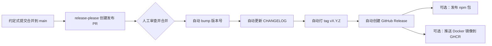

# 发布管理与语义化版本

> 所属计划: [[plan|CI/CD 完整学习计划]]
> 预计耗时: 60min
> 前置知识: [[06-reusable-composite-actions]]

---

## 1. 概念讲解

代码写完了，测试也通过了，镜像也构建好了，接下来该怎么让用户知道“现在可以升级了”？发布管理（Release Management）回答的就是这个问题。它不只是“点一下发布按钮”，而是一套关于**版本号怎么涨、变更怎么记录、发布点怎么标记、发布流程怎么自动化**的完整实践。如果发布管理混乱，消费者会不敢升级，运维人员会找不到回滚目标，团队自己也会陷入“这次到底改了什么”的困境。

### 为什么需要发布管理

想象一下手机上的某个 App：昨天还是 `3.2.1`，今天突然变成 `3.2.2`，过两周又跳到 `4.0.0`。作为用户，你最关心的是：

- `3.2.1 → 3.2.2`：应该是修了几个 bug，可以放心升级。
- `3.2.2 → 4.0.0`：主版本号变了，可能界面或 API 不兼容，升级前得先看看说明。

版本号如果能传递这种“升级风险”，就不需要用户去读完整源码。这就是发布管理的第一价值：**把技术变更翻译成消费者能读懂的信号**。除此之外，发布管理还要解决：

- **可追溯**：任何一次发布都对应一个明确的 Git commit、一个 tag、一份变更记录。
- **可自动化**：从合并代码到生成版本号、写 changelog、打 tag、发 Release，尽量少手工操作。
- **可回滚**：当线上出问题，能迅速定位到上一个稳定版本并回退。

没有发布管理的 CI/CD，就像高速公路没有路标和里程牌——车能跑，但谁也不知道自己开到了哪里。

### 语义化版本 SemVer

**语义化版本（Semantic Versioning，简称 SemVer）** 是目前最广泛使用的版本号规范。一个版本号写成：

```text
MAJOR.MINOR.PATCH
```

例如 `1.4.2`。三位数字各有明确含义：

| 位置 | 名称 | 什么时候递增 | 举例 |
|------|------|--------------|------|
| 第一位 | MAJOR | 出现**不兼容的 API 变更** | 移除旧端点、修改返回结构 |
| 第二位 | MINOR | 添加**向后兼容的新功能** | 新增 `/quotes/search` 接口 |
| 第三位 | PATCH | 进行**向后兼容的问题修复** | 修复随机名言重复出现的 bug |

核心规则只有一句话：**MAJOR 变，消费者要 caution；MINOR 变，消费者可以开心升级；PATCH 变，消费者可以无脑升级**。

版本号递增时还有一条隐含规则：当高位数字增加，低位数字要归零。例如 `1.4.2` 发了一个不兼容变更，下一个版本是 `2.0.0`，而不是 `2.4.2`。

#### 预发布版本与构建元数据

SemVer 还支持额外信息：

- **预发布版本**：`1.0.0-beta.1`、`1.0.0-rc.2`。表示“还没正式-ready，先给测试人员试用”。预发布版本的优先级低于正式版，即 `1.0.0-rc.1 < 1.0.0`。
- **构建元数据**：`1.0.0+20240623.sha.a1b2c3d`。仅用于标识构建来源，不参与版本比较。

一个带预发布和构建元数据的完整例子是 `1.0.0-beta.1+build.123`。

#### 为什么版本号要有语义

版本号如果全凭感觉——今天心情好升个 MAJOR，明天修个 typo 也升 MAJOR——那它就不是信号，而是噪音。SemVer 的价值在于**约定优于配置**：只要大家都遵守同一套规则，依赖管理工具（如 npm、NuGet、Docker 镜像标签）就能自动判断兼容范围，开发者也能据此写出像 `"^1.4.2"` 这样的依赖约束。

> [!note]
> `^1.4.2` 在 npm 中表示“兼容 `1.4.2` 及以上的 `1.x.x`，但不包括 `2.0.0`”。这正是 SemVer 让机器能自动决策的体现。

### 变更日志 CHANGELOG

CHANGELOG 是**给人类看的版本变更记录**。它不是 Git 提交历史的简单复制，而是经过整理、归类、润色的“发布说明”。一份好的 CHANGELOG 能让用户在一分钟内判断：这次升级对我有没有影响？要不要改配置？有没有我需要的新功能？

#### Keep a Changelog 规范

[Keep a Changelog](https://keepachangelog.com/) 是目前最主流的 CHANGELOG 书写规范。它建议按以下结构组织：

- `Added`：新增功能。
- `Changed`：现有功能的变更。
- `Deprecated`：已废弃、未来会移除的功能。
- `Removed`：已移除的功能。
- `Fixed`：bug 修复。
- `Security`：安全相关修复。

每个版本下分门别类列出变更条目，并用链接指向对应的 PR 或 issue。顶部通常保留一个 `[Unreleased]` 区域，用来收集“已经合并但还没发布”的改动。

CHANGELOG 应该由人来审阅，但可以由机器来生成初稿。这就引出了下一节：约定式提交。

### 约定式提交驱动版本

我们在 [[02-version-control-branching]] 中介绍过约定式提交（Conventional Commits）。它的威力在发布管理环节才真正显现：

| 提交类型 | 对应版本位 | 说明 |
|----------|------------|------|
| `fix:` | PATCH | 修复 bug |
| `feat:` | MINOR | 新增功能 |
| `BREAKING CHANGE:`（任意类型的 footer） | MAJOR | 不兼容变更 |

工具可以扫描 `main` 分支上的提交历史，自动判断：从上一个 tag 到现在，最高优先级的变更是什么？如果只有 `fix`，就升 PATCH；如果有 `feat`，升 MINOR；只要出现 `BREAKING CHANGE`，就升 MAJOR。

例如当前版本是 `1.4.2`，合并后新增了：

```text
feat(api): 支持按作者筛选名言
fix(api): 修复重复返回同一句名言的 bug
docs(readme): 补充本地运行说明
```

工具会判断最高级别是 `feat`，于是下一个版本号为 `1.5.0`。

如果提交消息是：

```text
feat(api)!: 返回 JSON 对象替代纯文本字符串

BREAKING CHANGE: `/quote` 端点现在返回 `{ "quote": "..." }`，不再是纯字符串。
```

工具会判断为 MAJOR，下一个版本号就是 `2.0.0`。

### Git tag 与 GitHub Release

#### Git tag：给 commit 贴标签

Git tag 是一个指向特定 commit 的引用，常用于标记“这是一个发布点”。标签分为两类：

- **轻量标签（lightweight）**：只是一个 commit 的别名，没有额外信息。
- **附注标签（annotated）**：包含打标签的人、时间、签名和说明，适合正式发布。

创建附注标签的命令：

```bash
git tag -a v1.4.2 -m "发布 1.4.2：修复随机名言重复问题"
git push origin v1.4.2
```

SemVer 社区推荐标签名以 `v` 开头，例如 `v1.4.2`，但也有人用 `1.4.2`。一个项目内部保持统一即可。

#### GitHub Release：tag 的人类可读包装

GitHub Release 是在 tag 基础上增加了一层界面：你可以写 release notes、上传二进制附件、标记为“预发布（pre-release）”。用户可以在仓库的 Releases 页面直接下载，也可以通过 API 获取。

Release notes 通常就是该版本的 CHANGELOG 节选。手工写 release notes 容易遗漏或出错，因此现代项目普遍使用自动化工具来生成。

### 发布自动化工具对比

目前生态中有三款主流工具，它们都能根据提交历史自动算版本号、写 changelog、打 tag、发 Release，但侧重点不同：

| 工具 | 生态 | 工作方式 | 适合场景 |
|------|------|----------|----------|
| **release-please** | Google 出品，语言无关 | 每次有约定式提交合并到 `main`，自动创建“发布 PR”；合并该 PR 后自动打 tag 并发 Release | 想要“人工把关一次再发布”的团队 |
| **changesets** | npm 生态为主 | 开发者在 PR 里提交 `.changeset/*.md` 文件，描述变更和 bump 类型；合并后统一发版 | 大型 monorepo，需要多人协调版本 |
| **semantic-release** | npm 生态为主 | `main` 每次合并直接自动计算版本、打 tag、发 Release，没有中间 PR | 追求完全自动化的持续部署团队 |

对于 `quote-api` 这样的单仓库、中小项目，**release-please** 是最容易落地的选择：它既实现了自动化，又保留了一个“发布 PR”的人工确认环节，避免 accidentally 发版。

### 发布流水线全景

一条完整的发布流水线通常长这样：



在 [[17-capstone-project]] 中，我们会把这条流水线与 CI、镜像构建、部署串联起来，形成端到端的自动化。

---

## 2. 代码示例

下面所有示例都围绕贯穿本计划的 `quote-api` 项目。假设仓库地址为 `your-username/quote-api`，默认分支是 `main`，并且团队已经采用约定式提交。

### 2.1 release-please 自动发布工作流

在 `.github/workflows/release.yml` 中配置 release-please-action：

```yaml
# .github/workflows/release.yml
# 作用：当 main 分支有新的约定式提交合并时，自动创建发布 PR；
#      发布 PR 被合并后，自动 bump 版本、更新 CHANGELOG、打 tag、发 Release。
name: Release

on:
  push:
    branches:
      - main

permissions:
  contents: write      # 需要创建 Release 和 tag
  pull-requests: write # 需要创建发布 PR

jobs:
  release-please:
    runs-on: ubuntu-latest
    steps:
      # 使用 release-please-action，版本号 v4 是当前稳定版
      - uses: googleapis/release-please-action@v4
        with:
          # GitHub 自动提供的 token，权限由上面的 permissions 控制
          token: ${{ secrets.GITHUB_TOKEN }}
          # release-type 告诉 release-please 这是什么类型的项目。
          # node 表示它会读取 package.json 并更新其中的 version 字段。
          release-type: node
          # package-name 会出现在 PR 标题和 Release 标题中
          package-name: quote-api
```

**配置说明：**

- `on.push.branches: [main]`：只在 `main` 分支有 push 时触发。
- `permissions`：显式授予工作流所需的最小权限，符合最小权限原则。
- `release-type: node`：release-please 支持多种类型（`node`、`python`、`go`、`simple` 等）。对 TypeScript 项目选 `node`。
- 工作流运行后，如果检测到需要发版，会在仓库里创建一个标题类似 `chore(main): release 1.5.0` 的 PR。你审查通过后合并它，release-please 会自动完成后续所有步骤。

### 2.2 Keep a Changelog 格式的 CHANGELOG.md

以下是一份 `quote-api` 的 CHANGELOG 片段，遵循 Keep a Changelog 规范：

```markdown
# Changelog

All notable changes to this project will be documented in this file.

The format is based on [Keep a Changelog](https://keepachangelog.com/en/1.1.0/),
and this project adheres to [Semantic Versioning](https://semver.org/lang/zh-CN/).

## [Unreleased]

## [1.5.0] - 2026-06-23

### Added

- 新增按作者筛选名言的接口 `/quotes?author=Knuth` (#42).

### Fixed

- 修复 `getRandomQuote` 在连续调用时可能返回相同结果的问题 (#38).

## [1.4.2] - 2026-06-20

### Fixed

- 修复 `/health` 端点在高并发下偶发 500 的问题 (#35).

## [1.4.1] - 2026-06-15

### Security

- 升级 `express` 依赖以修复 CVE-2026-xxxx (#31).

## [1.4.0] - 2026-06-10

### Added

- 新增 `/health` 健康检查端点 (#28).

### Changed

- 日志输出格式从纯文本改为 JSON，便于集中化收集 (#25).

## [1.3.0] - 2026-06-01

### Removed

- 移除已废弃的 `/random` 端点，请迁移到 `/quote` (#20).

[Unreleased]: https://github.com/your-username/quote-api/compare/v1.5.0...HEAD
[1.5.0]: https://github.com/your-username/quote-api/compare/v1.4.2...v1.5.0
[1.4.2]: https://github.com/your-username/quote-api/compare/v1.4.1...v1.4.2
[1.4.1]: https://github.com/your-username/quote-api/compare/v1.4.0...v1.4.1
[1.4.0]: https://github.com/your-username/quote-api/compare/v1.3.0...v1.4.0
[1.3.0]: https://github.com/your-username/quote-api/releases/tag/v1.3.0
```

**要点：**

- 顶部固定声明“基于 Keep a Changelog 和 SemVer”。
- `[Unreleased]` 区域收集已合并但未发布的改动。
- 每个版本按 `Added / Changed / Fixed / Security` 等分类。
- 底部用比较链接把版本号与 GitHub 的 compare 页面关联，方便追溯。

### 2.3 给 Docker 镜像打上语义版本标签

在 [[10-container-registry]] 中我们讨论了镜像标签策略。发布时，推荐同时打上多个标签，让消费者既能精确锁定版本，也能享受自动补丁更新：

```yaml
# .github/workflows/publish-image.yml
# 作用：当 release-please 创建新 tag 后，自动构建镜像并推送到 GHCR，
#      同时打上 v1.5.0、v1.5、v1、latest 等多个标签。
name: Publish Docker Image

on:
  release:
    # published 表示 Release 发布（包括从预发布改为正式）时触发
    types: [published]

env:
  REGISTRY: ghcr.io
  IMAGE_NAME: ${{ github.repository }}

jobs:
  build-and-push:
    runs-on: ubuntu-latest
    permissions:
      contents: read
      packages: write
      id-token: write

    steps:
      - name: Checkout
        uses: actions/checkout@v4

      - name: Login to GHCR
        uses: docker/login-action@v3
        with:
          registry: ${{ env.REGISTRY }}
          username: ${{ github.actor }}
          password: ${{ secrets.GITHUB_TOKEN }}

      - name: Extract metadata and semver tags
        id: meta
        uses: docker/metadata-action@v5
        with:
          images: ${{ env.REGISTRY }}/${{ env.IMAGE_NAME }}
          tags: |
            type=semver,pattern={{version}}
            type=semver,pattern={{major}}.{{minor}}
            type=semver,pattern={{major}}
            type=raw,value=latest

      - name: Build and push
        uses: docker/build-push-action@v5
        with:
          context: .
          push: true
          tags: ${{ steps.meta.outputs.tags }}
          labels: ${{ steps.meta.outputs.labels }}
```

**标签语义：**

- `ghcr.io/your-username/quote-api:1.5.0`：精确版本，生产环境推荐。
- `ghcr.io/your-username/quote-api:1.5`：自动接收 `1.5.x` 补丁更新。
- `ghcr.io/your-username/quote-api:1`：自动接收 `1.x.x` 次版本更新。
- `ghcr.io/your-username/quote-api:latest`：始终指向最新发布，适合临时验证，不建议生产使用。

---

## 3. 练习

### 练习 1: 基础

假设 `quote-api` 当前版本为 `1.4.2`。从上一个 tag 到现在，main 分支上出现了以下提交：

```text
feat(api): 支持按作者筛选名言
feat(ui): 新增暗黑模式切换
fix(api): 修复连续调用返回相同名言的问题
docs(readme): 补充 API 文档示例
feat(api)!: 返回结构改为 { quote, author }

BREAKING CHANGE: /quote 端点现在返回 JSON 对象，不再返回纯文本字符串。
```

请问下一个版本号应该是多少？请写出推算过程。

### 练习 2: 进阶

为 `quote-api` 配置 release-please，实现“合并到 main 后自动创建发布 PR，合并发布 PR 后自动打 tag 并发 Release”。请给出：

1. `.github/workflows/release.yml` 的完整内容。
2. 需要开发者遵守的提交消息约定（用项目内简短说明即可）。

### 练习 3: 挑战（可选）

让发布流水线在打 tag 后自动把 Docker 镜像推送到 GHCR，并打上与 Release 一致的语义版本标签（如 `1.5.0`、`1.5`、`1`、`latest`）。请给出 `.github/workflows/publish-image.yml` 的完整内容，并说明触发时机。

---

## 3.5 参考答案

> [!tip]- 练习 1 参考答案
> 下一个版本号应为 **`2.0.0`**。
>
> 推算过程：
> 1. 先看所有提交中的最高“破坏力”。
> 2. 有 3 条 `feat`（按作者筛选、暗黑模式、返回结构变更），按规则应触发 MINOR 升级，得到 `1.5.0`。
> 3. 有 1 条 `fix`，按规则应触发 PATCH 升级，得到 `1.4.3`。
> 4. 有 1 条带 `BREAKING CHANGE` 的提交，按规则应触发 MAJOR 升级。
> 5. MAJOR 升级优先级最高，且会把 MINOR 和 PATCH 归零，因此从 `1.4.2` 直接跳到 **`2.0.0`**。
> 6. `docs` 类型提交不影响版本号。

> [!tip]- 练习 2 参考答案
> 1. `.github/workflows/release.yml`：
>
> ```yaml
> name: Release
>
> on:
>   push:
>     branches:
>       - main
>
> permissions:
>   contents: write
>   pull-requests: write
>
> jobs:
>   release-please:
>     runs-on: ubuntu-latest
>     steps:
>       - uses: googleapis/release-please-action@v4
>         with:
>           token: ${{ secrets.GITHUB_TOKEN }}
>           release-type: node
>           package-name: quote-api
> ```
>
> 2. 提交消息约定（可写入 `CONTRIBUTING.md`）：
>
> - `feat:` 表示新功能，合并后会提升 MINOR 版本。
> - `fix:` 表示 bug 修复，合并后会提升 PATCH 版本。
> - 任何类型提交的 footer 中出现 `BREAKING CHANGE:`，会提升 MAJOR 版本。
> - `docs:`、`style:`、`refactor:`、`test:`、`chore:` 等不直接影响版本号，但会随其他变更一起发布。

> [!tip]- 练习 3 参考答案（可选）
> `.github/workflows/publish-image.yml`：
>
> ```yaml
> name: Publish Docker Image
>
> on:
>   release:
>     types: [published]
>
> env:
>   REGISTRY: ghcr.io
>   IMAGE_NAME: ${{ github.repository }}
>
> jobs:
>   build-and-push:
>     runs-on: ubuntu-latest
>     permissions:
>       contents: read
>       packages: write
>       id-token: write
>
>     steps:
>       - name: Checkout
>         uses: actions/checkout@v4
>
>       - name: Login to GHCR
>         uses: docker/login-action@v3
>         with:
>           registry: ${{ env.REGISTRY }}
>           username: ${{ github.actor }}
>           password: ${{ secrets.GITHUB_TOKEN }}
>
>       - name: Extract metadata
>         id: meta
>         uses: docker/metadata-action@v5
>         with:
>           images: ${{ env.REGISTRY }}/${{ env.IMAGE_NAME }}
>           tags: |
>             type=semver,pattern={{version}}
>             type=semver,pattern={{major}}.{{minor}}
>             type=semver,pattern={{major}}
>             type=raw,value=latest
>
>       - name: Build and push
>         uses: docker/build-push-action@v5
>         with:
>           context: .
>           push: true
>           tags: ${{ steps.meta.outputs.tags }}
>           labels: ${{ steps.meta.outputs.labels }}
> ```
>
> 触发时机：当 release-please 在 `main` 上创建新 Release 时，`release: published` 事件会触发本工作流。`docker/metadata-action` 会自动解析 Release tag（如 `v1.5.0`）并生成多个语义化标签。

> [!note] 答案使用方式
> 先独立完成练习，再展开查看参考答案。参考答案不是唯一解——如果你的实现通过了测试或达到了题目要求，就是正确的。

---

## 4. 扩展阅读

- [Semantic Versioning 2.0.0 中文版](https://semver.org/lang/zh-CN/)
- [Keep a Changelog 1.1.0](https://keepachangelog.com/zh-CN/1.1.0/)
- [Conventional Commits 约定式提交](https://www.conventionalcommits.org/zh-hans/v1.0.0/)
- [release-please-action GitHub 文档](https://github.com/googleapis/release-please-action)
- [release-please 官方文档](https://github.com/googleapis/release-please)
- [changesets 官方文档](https://github.com/changesets/changesets)
- [semantic-release 官方文档](https://semantic-release.gitbook.io/semantic-release/)

---

## 常见陷阱

- **手动改版本号，与提交历史脱节**：有人在本地改了 `package.json` 的 `version` 后直接 push，结果 changelog 和 tag 都对不上。正确做法是使用 release-please 或类似工具，让版本号从约定式提交历史中推导出来。
- **破坏性变更只升 PATCH**：某个 PR 改了 API 返回结构，但作者觉得“改动不大”，只把版本升到 `1.4.3`。这会让依赖方在自动升级时直接崩溃。正确做法是只要存在不兼容变更，就必须升 MAJOR。
- **发了版但没打 tag 或没写 changelog**：没有 tag，回滚时找不到准确的代码快照；没有 changelog，用户不知道能不能升级。正确做法是把“打 tag + 写 changelog + 创建 Release”作为发布流程的必需步骤，并用 CI 自动化。
- **`latest` 标签用于生产**：`latest` 会随每次发布移动，生产环境使用它等于放弃版本锁定。正确做法是在生产部署中明确使用精确版本标签，如 `1.5.0`。
- **发布 PR 长期不合并**：release-please 创建的发布 PR 如果一直不合并，后续 `feat` 和 `fix` 会不断累积，导致一次发布包含过多变更，回滚风险增大。正确做法是定期审查并合并发布 PR，保持发布粒度小。

---

交叉引用：约定式提交详见 [[02-version-control-branching]]；镜像标签策略与 GHCR 详见 [[10-container-registry]]；端到端综合项目会集成发布管理，详见 [[17-capstone-project]]。
