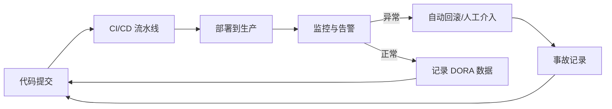

# 可观测性与 DORA 指标

> 所属计划: [[plan|CI/CD 完整学习计划]]
> 预计耗时: 60min
> 前置知识: [[11-deployment-strategies]]

---

## 1. 概念讲解

前面的章节把代码从提交一路送到了生产环境。但“部署成功”只代表流水线跑完了，不代表系统真的健康。本章我们要回答两个问题：**发布得快不快、稳不稳？**以及**出了问题怎么快速知道、快速恢复？**

### 为什么需要这个？

很多团队把 CI/CD 的终点设为“部署完成”，结果：

- 上线后错误率飙升，却要到第二天用户投诉才发现；
- 只追求“每天部署十次”，但每三次就挂一次，实际效率更低；
- 复盘时拿不出数据，只能凭感觉说“这次运气不好”。

可观测性（Observability）和 DORA 指标就是来解决这些问题的：前者让你**看得见系统内部**，后者让你**能量化发布能力**。

### 核心思想

把 CI/CD 从“部署流水线”扩展为“持续反馈闭环”：



### DORA 四个关键指标

DORA（DevOps Research and Assessment）是 Google 旗下长期研究 DevOps 效能的团队。他们发现四个指标能最好地区分高绩效团队与普通团队。这四个指标在 [[01-ci-cd-devops-overview]] 中已经预告过，本章深入讲解。

| 指标 | 英文 | 衡量维度 | 含义 |
|------|------|----------|------|
| 部署频率 | Deployment Frequency | 吞吐 | 单位时间内成功部署到生产的次数 |
| 变更前置时间 | Lead Time for Changes | 吞吐 | 从代码提交到成功上线生产的中位时间 |
| 变更失败率 | Change Failure Rate | 稳定性 | 导致生产事故或需要热修复的部署占比 |
| 平均恢复时间 | Mean Time to Restore，MTTR | 稳定性 | 生产事故从发生到恢复的中位时间 |

前两个指标回答“**有多快**”，后两个回答“**有多稳**”。

#### 1. 部署频率（Deployment Frequency）

**计算方式**：统计一段周期内（通常是一个月或一个季度）成功部署到生产环境的次数。注意只算真正到达生产环境且对用户生效的部署，CI 跑完但没上线的不算。

- 例子：某团队 4 周内部署了 12 次，部署频率就是每周 3 次。
- 例子：每天多次部署的团队，可以说“按需部署（On-demand）”。

#### 2. 变更前置时间（Lead Time for Changes）

**计算方式**：对每一次部署，取 `部署完成时间 - 对应代码首次 commit 时间`，然后取中位数（Median）。用中位数而不是平均值，是为了避免被极端大值拉偏。

- 例子：某次功能从 commit 到上线用了 2 小时，另一次用了 5 天，团队整体 Lead Time 取中位数可能是 1 天。
- 注意：这里的“变更”通常指一次 commit 或一次 PR 合并，而不是整个项目周期。

#### 3. 变更失败率（Change Failure Rate）

**计算方式**：`导致事故的部署次数 / 总部署次数 × 100%`。

什么算“失败”？生产环境出现需要立即处理的问题，例如：回滚、热修复、服务降级、P0/P1 级事故。如果只是测试环境失败或部署后被小 bug 慢慢修掉，通常不算。

- 例子：一个月 30 次部署，其中 2 次导致回滚，失败率 = 2 / 30 ≈ 6.7%。

#### 4. 平均恢复时间（MTTR）

**计算方式**：`所有事故恢复时间的总和 / 事故次数`。恢复指的是服务恢复正常、用户影响消除，而不只是找到根因。

- 例子：一次事故 10 分钟恢复，一次 50 分钟恢复，MTTR = (10 + 50) / 2 = 30 分钟。

#### DORA 分档基准

DORA 每年都会发布报告，下面给出近年报告中的典型分档（仅作参考，不同年份略有波动）：

| 指标 | Elite（精英） | High（高） | Medium（中） | Low（低） |
|------|---------------|------------|--------------|-----------|
| 部署频率 | 按需部署，一天多次 | 每天一次到每周一次 | 每周一次到每月一次 | 每月一次到每季度一次 |
| 变更前置时间 | 小于 1 小时 | 1 天到 1 周 | 1 周到 1 个月 | 1 个月到 6 个月 |
| 变更失败率 | 小于 5% | 5% 到 15% | 16% 到 30% | 大于 30% |
| MTTR | 小于 1 小时 | 1 小时到 1 天 | 1 天到 1 周 | 大于 1 周 |

> [!note]
> 不要机械追求“精英”档。刚开始的团队可以从“高”甚至“中”起步，先建立度量，再逐步优化。

#### 为什么这四个指标？

传统观念认为“快”和“稳”是矛盾的：要稳定就得少发布，要快就容易出错。DORA 的研究恰恰推翻了这一点——**精英团队同时部署得更频繁、失败率更低、恢复得更快**。

原因是：频繁的小步发布降低了每次变更的风险；完善的监控和自动化 rollback 让问题能被快速发现和修复。这四个指标缺一不可：只看部署频率会忽略“经常挂”，只看失败率会忽略“半年才发一次”。

### 如何采集这四个指标

| 指标 | 数据来源 | 采集方式 |
|------|----------|----------|
| 部署频率 | CI/CD 流水线 | 每次部署成功时记录事件 |
| 变更前置时间 | Git commit 时间 + 部署事件 | `部署完成时间 - 首次 commit 时间` |
| 变更失败率 | 事故记录系统 | 标记哪些部署触发了事故 |
| MTTR | 监控告警 + 事故记录 | `恢复时间 - 告警时间` |

最简单的起步方式：在 deploy job 里写一条日志或 artifact，记录 `commit_sha`、`commit_time`、`deploy_time`。后续可以用脚本或 BI 工具汇总。

### 可观测性三支柱

可观测性让我们能通过系统外部输出推断内部状态。它通常被总结为三大支柱：

#### 1. 日志（Logs）

日志是按时间顺序记录的事件文本，适合排查“刚才发生了什么”。

- 工具示例：Loki、ELK Stack（Elasticsearch + Logstash + Kibana）、Splunk、CloudWatch Logs。
- 典型用法：请求日志、错误堆栈、审计日志。
- 注意：日志量容易爆炸，需要设置保留策略和采样。

#### 2. 指标（Metrics）

指标是按时间序列聚合的数值，适合看“趋势”和“异常”。

- 工具示例：Prometheus、Datadog、Grafana Cloud、New Relic。
- 典型指标：请求 QPS、错误率、P99 延迟、CPU/内存使用率。
- Prometheus 使用 pull 模式，应用暴露 `/metrics` 端点，Prometheus 定期抓取。

#### 3. 链路追踪（Distributed Tracing）

链路追踪记录一个请求在多个服务之间的完整路径，适合排查微服务架构中的性能瓶颈。

- 工具示例：OpenTelemetry、Jaeger、Zipkin、AWS X-Ray。
- 典型用法：一次 API 请求经过了网关、用户服务、订单服务、数据库，追踪能画出完整调用链。

这三者不是互斥的，而是互补的：指标发现异常，日志定位细节，追踪理解调用关系。

### 部署后健康监控

部署成功只是开始。真正负责任的做法是：上线后持续观察关键指标，一旦发现异常就回滚。

这种思路与 [[11-deployment-strategies]] 中的金丝雀发布高度相关：先让 1% 流量访问新版本，观察 5-10 分钟，指标正常再逐步放大；异常则自动切回旧版本。

需要重点监控的指标：

- 错误率（HTTP 5xx 比例）
- 延迟（P95/P99 响应时间）
- 吞吐量（QPS 是否骤降）
- 业务指标（下单成功率、登录成功率等）

### SLI / SLO / 错误预算

把“稳定性”从口号变成数字：

- **SLI（Service Level Indicator，服务等级指标）**：具体度量，例如“HTTP 2xx 与 200 状态码请求的比例”。
- **SLO（Service Level Objective，服务等级目标）**：SLI 的目标值，例如“可用性 ≥ 99.9%”。
- **SLA（Service Level Agreement，服务等级协议）**：对外承诺，违反需赔付，通常比 SLO 更严格或一致。
- **错误预算（Error Budget）**：`100% - SLO`，表示一段时间内允许出错的“额度”。

例子：SLO 是月度 99.9% 可用性，意味着月度错误预算 = 0.1% × 30 天 × 24 小时 × 60 分钟 = 43.2 分钟。如果月初已经用了 40 分钟停机额度，本月后续发布就要更谨慎。

错误预算的好处：它把稳定性问题变成产品决策——**还能不能继续发布？**而不是永远争论“要不要暂停”。

---

## 2. 代码示例

### 示例 1：为 quote-api 添加 `/metrics` 端点

我们在 `src/index.ts` 的基础上增加一个 Prometheus 文本格式的指标端点，暴露总请求数和错误请求数。

```typescript
// src/index.ts
import express, { Request, Response } from "express";
import { getRandomQuote } from "./quotes";

const app = express();

let totalRequests = 0;
let errorRequests = 0;

app.use((req: Request, res: Response, next) => {
  totalRequests++;
  res.on("finish", () => {
    if (res.statusCode >= 500) {
      errorRequests++;
    }
  });
  next();
});

app.get("/quote", (req: Request, res: Response) => {
  res.json({ quote: getRandomQuote() });
});

app.get("/metrics", (req: Request, res: Response) => {
  res.set("Content-Type", "text/plain; version=0.0.4");
  res.send(
    `# HELP quote_api_requests_total Total number of HTTP requests\n` +
    `# TYPE quote_api_requests_total counter\n` +
    `quote_api_requests_total ${totalRequests}\n` +
    `\n` +
    `# HELP quote_api_errors_total Total number of HTTP 5xx responses\n` +
    `# TYPE quote_api_errors_total counter\n` +
    `quote_api_errors_total ${errorRequests}\n`
  );
});

const PORT = process.env.PORT || 3000;
app.listen(PORT, () => {
  console.log(`quote-api listening on port ${PORT}`);
});
```

**运行方式:**

```bash
npm install
npm run build
npm start
# 另一个终端
curl http://localhost:3000/quote
curl http://localhost:3000/metrics
```

**预期输出:**

```text
# HELP quote_api_requests_total Total number of HTTP requests
# TYPE quote_api_requests_total counter
quote_api_requests_total 2

# HELP quote_api_errors_total Total number of HTTP 5xx responses
# TYPE quote_api_errors_total counter
quote_api_errors_total 0
```

> [!note]
> 生产环境通常不会自己手写计数器，而是使用 prom-client 这类库，并提供 histogram 来统计延迟分布。

### 示例 2：在 GitHub Actions 中记录部署事件

下面的 step 把部署时间戳和 commit 信息写入 artifact，作为后续计算 DORA 指标的数据源。这是一个概念性实现，真实场景可以写入数据库或专门的指标平台。

```yaml
# .github/workflows/deploy.yml 片段
jobs:
  deploy:
    runs-on: ubuntu-latest
    steps:
      - name: Checkout
        uses: actions/checkout@v4
        with:
          fetch-depth: 0

      - name: Deploy application
        run: ./scripts/deploy.sh

      - name: Record DORA deploy event
        run: |
          mkdir -p dora-events
          echo "commit_sha=${{ github.sha }}" >> dora-events/deploy-$(date +%s).txt
          echo "commit_time=$(git log -1 --format=%cI ${{ github.sha }})" >> dora-events/deploy-$(date +%s).txt
          echo "deploy_time=$(date -Iseconds)" >> dora-events/deploy-$(date +%s).txt
          echo "branch=${{ github.ref_name }}" >> dora-events/deploy-$(date +%s).txt

      - name: Upload DORA event artifact
        uses: actions/upload-artifact@v4
        with:
          name: dora-events-${{ github.run_id }}
          path: dora-events/
```

后续可以用脚本读取这些 artifact，计算部署频率和变更前置时间：

```bash
# 示例：计算最近 30 天部署频率
find dora-events/ -name 'deploy-*.txt' | wc -l
```

---

## 3. 练习

### 练习 1: 基础 — 计算 DORA 指标并定档

某团队在过去 30 天内有以下记录：

- 部署了 5 次；
- 其中 1 次部署导致生产故障，从故障发生到完全恢复耗时 30 分钟；
- 5 次部署对应的变更前置时间分别为：2 小时、4 小时、8 小时、1 天、3 天。

请计算四个 DORA 指标，并根据 DORA 分档表判断该团队在每个指标上处于 Elite / High / Medium / Low 哪一档。

### 练习 2: 进阶 — 设计部署后健康检查

为 quote-api 设计一个部署后健康检查脚本或 workflow step：部署完成后等待 30 秒，然后每 10 秒请求一次 `/quote`，连续失败 3 次则触发告警或回滚。给出具体脚本或 workflow 片段。

### 练习 3: 挑战 — 设计 SLO 与错误预算（可选）

为 quote-api 设计一个可用性 SLO：月度可用性 99.9%。请计算：

1. 一个月的月度错误预算是多少分钟？
2. 如果某月已经发生了 2 次停机，每次 15 分钟，剩余错误预算是多少？
3. 基于剩余预算，本月是否建议继续发布？说明理由。

---

## 3.5 参考答案

> [!tip]- 练习 1 参考答案
> 计算过程：
>
> - 部署频率：30 天 5 次 ≈ 每 6 天一次，落在“每周一次到每月一次”，对应 **Medium**。
> - 变更前置时间：5 个值排序后为 2h、4h、8h、1d、3d，中位数是 **8 小时**，落在“1 小时到 1 天”，对应 **High**。
> - 变更失败率：1 / 5 = **20%**，落在“16% 到 30%”，对应 **Medium**。
> - MTTR：只有 1 次事故，恢复 30 分钟，所以 MTTR = **30 分钟**，落在“1 小时到 1 天”的边界之下，可视为 **High**（部分年份报告 Elite 为 <1 小时，High 为 <1 天，因此 30 分钟属于 High 偏上）。
>
> 结论：该团队“快”的指标较好，但“稳”的指标需要改进，尤其是失败率。

> [!tip]- 练习 2 参考答案
> 下面是一个 Bash 脚本，可嵌入 deploy job 的 step 中：
>
> ```yaml
> - name: Post-deploy health check
>   run: |
>     echo "Waiting for service to warm up..."
>     sleep 30
>     MAX_FAILURES=3
>     failures=0
>     for i in {1..10}; do
>       if curl -fsS http://localhost:3000/quote > /dev/null; then
>         echo "Health check #$i passed"
>         failures=0
>       else
>         echo "Health check #$i failed"
>         failures=$((failures + 1))
>         if [ "$failures" -ge "$MAX_FAILURES" ]; then
>           echo "Continuous health checks failed, triggering rollback..."
>           ./scripts/rollback.sh
>           exit 1
>         fi
>       fi
>       sleep 10
>     done
> ```
>
> 说明：`curl -fsS` 会在 HTTP 错误码时返回非零退出码。连续失败 3 次触发 `./scripts/rollback.sh`，具体回滚逻辑取决于部署方式（如 Kubernetes rollout undo 或切换蓝绿环境）。

> [!tip]- 练习 3 参考答案（可选）
> 1. 月度错误预算：
>    `0.1% × 30 × 24 × 60 = 43.2` 分钟。
> 2. 已用预算：`2 × 15 = 30` 分钟。剩余预算：`43.2 - 30 = 13.2` 分钟。
> 3. 是否继续发布：建议**谨慎发布**。剩余错误预算只有 13.2 分钟，大约是一次小型事故的额度。如果发布窗口内没有高置信度，应优先修复已知风险、增加监控覆盖，或推迟非紧急发布，避免突破 SLO。错误预算的本质是帮助团队做发布决策，而不是禁止发布。

> [!note] 答案使用方式
> 先独立完成练习，再展开查看参考答案。参考答案不是唯一解——如果你的实现通过了测试或达到了题目要求，就是正确的。

---

## 4. 扩展阅读

- [DORA 研究与状态报告](https://cloud.google.com/devops/state-of-devops)
- [Google SRE 书：站点可靠性工程](https://sre.google/sre-book/table-of-contents/)
- [OpenTelemetry 官方文档](https://opentelemetry.io/docs/)
- [Prometheus 文档](https://prometheus.io/docs/introduction/overview/)
- [Grafana Labs：可观测性三支柱](https://grafana.com/blog/2020/02/26/observability-101-the-three-pillars-of-observability/)

---

## 常见陷阱

- **只看部署速度不看失败率**：一天部署十次，如果三次需要回滚，实际交付效率反而更低。要把四个 DORA 指标一起看。
- **部署后不看监控就下班**：发完代码不等于完成任务。建议至少观察一个完整周期（如金丝雀观察期）后再切换上下文。
- **没有事故记录，MTTR/失败率算不出来**：如果没有统一的事故单或告警记录，就无法复盘和改进。最小成本的做法是在部署事件里标记是否触发故障。
- **把 SLO 当 SLA 对外承诺**：SLO 是内部目标，可以动态调整；SLA 通常涉及赔偿，不要轻率对外发布。
- **指标过多反而没人看**：不要一次性收集上百个指标。先聚焦错误率、延迟、吞吐这三个“黄金信号”，再逐步扩展。

---

交叉引用：DORA 预告 [[01-ci-cd-devops-overview]]；金丝雀回滚 [[11-deployment-strategies]]；特性开关需配合监控 [[12-progressive-delivery-flags]]。
