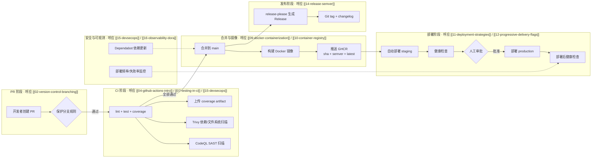

# 综合项目：端到端流水线

> 所属计划: [[plan|CI/CD 完整学习计划]]
> 预计耗时: 150min
> 前置知识: [[01-ci-cd-devops-overview]] ~ [[16-observability-dora]]（全部）

---

## 1. 概念讲解

### 为什么需要端到端项目？

前 16 节我们像拆零件一样学习了 CI/CD 的每一块：Git 分支策略、GitHub Actions 基础、变量与矩阵、可复用工作流、测试策略、缓存与制品、Docker 容器化、镜像仓库、部署策略、特性开关、GitLab CI、语义化版本、DevSecOps、可观测性。每一块都很重要，但真正的价值在于把它们串成一条**可运行、可审计、可回滚**的流水线。

端到端项目要做的，就是回答一个问题："一个功能从开发者脑中冒出想法，到真正抵达用户手中，中间要经过哪些自动化步骤？" 本项目会带你搭建一条完整的流水线，让你亲身体验 PR 触发 CI、合并后自动构建镜像、推送镜像仓库、部署到多环境、自动生成 Release 的全过程。

### 核心思想

把前面所有知识压缩成一句话：

> **任何进入 `main` 分支的代码，都必须是可构建、可测试、可扫描、可部署、可追踪的。**

这不是一句口号，而是由一系列门禁和自动化步骤保证的工程纪律。下面这张图展示了本项目的完整流水线，以及它与前面各节的对应关系。



### 流水线如何映射前面每节

| 流水线环节 | 对应的前置节 | 关键知识点 |
|-----------|-------------|-----------|
| PR 触发与分支保护 | [[02-version-control-branching]] | `main` 可发布、PR 必填检查、约定式提交 |
| CI 触发器/job/step/runner | [[03-pipeline-core-concepts]] / [[04-github-actions-intro]] | 流水线即代码、YAML 结构、运行器 |
| 变量、Secrets、条件、矩阵 | [[05-secrets-conditions-matrix]] | `env`、`secrets.GITHUB_TOKEN`、`if`、`needs` |
| 可复用工作流与 Composite Action | [[06-reusable-composite-actions]] | `workflow_call`、复用构建逻辑 |
| 测试金字塔与覆盖率 | [[07-testing-in-ci]] | vitest、覆盖率门槛、测试报告 artifact |
| 缓存与制品 | [[08-cache-artifacts-deps]] | `actions/cache`、上传下载 artifact |
| Docker 多阶段构建 | [[09-docker-containerization]] | Dockerfile、BuildKit、`.dockerignore` |
| 镜像仓库与标签策略 | [[10-container-registry]] | GHCR、`docker/metadata-action` |
| 部署策略 | [[11-deployment-strategies]] | staging / prod 环境、蓝绿/金丝雀 |
| 特性开关与渐进交付 | [[12-progressive-delivery-flags]] | feature flag、灰度发布 |
| GitLab CI 对比 | [[13-gitlab-cicd]] | 概念映射，了解第二套引擎 |
| 语义化版本与 Release | [[14-release-semver]] | SemVer、release-please、changelog |
| DevSecOps 安全扫描 | [[15-devsecops]] | CodeQL、Trivy、Dependabot |
| 可观测性与 DORA | [[16-observability-dora]] | 部署后健康检查、MTTR、变更失败率 |

### 跟着本节动手的建议路径

端到端项目不是"看完就懂"的节，而是"做完才算会"的节。建议你按以下顺序动手，每完成一步就验证一次，不要跳到下一步：

1. **准备仓库**：把本节的文件复制到你自己的 `your-username/quote-api` 仓库，确保 `package-lock.json` 已提交。
2. **跑通本地**：执行 `npm install`、`npm run lint`、`npm test`、`npm run build`，确认本地能绿。
3. **跑通 CI**：创建一个测试 PR，让 `ci.yml` 全部通过，把 `test` job 设为分支保护规则中的 required check。
4. **接上 GHCR**：合并一个改动到 `main`，确认 `deploy.yml` 的 `build-push` job 把镜像推到了 GHCR。
5. **配置环境**：在 GitHub Settings 里创建 `staging` 和 `production` 两个 environment，给 `production` 加上 required reviewers。
6. **补齐部署脚本**：把 `deploy.yml` 里的 `echo` 占位替换为你真实的部署命令（如 `kubectl set image` 或 `docker compose up`）。
7. **启用 release-please**：合并一个 `feat:` 或 `fix:` 提交，观察 release-please 是否创建了 Release PR。

这条路径的核心思想就是"增量验证"。流水线越复杂，越要分步确认；一次性堆太多配置，出了问题会很难定位。

---

## 2. 代码示例

本节的主体是一份可直接运行的 `quote-api` 项目文件集。建议你先新建一个空仓库，再按下面清单逐个创建文件。每复制完一个文件，就用本地命令或 GitHub Actions 验证它是否工作。注意：本节代码假设仓库根目录就是 `quote-api` 项目本身；如果你的仓库里还有别的项目，需要像 [[04-github-actions-intro]] 里那样调整 `working-directory`。

### 2.1 项目结构

```text
quote-api/
├── .github/
│   ├── dependabot.yml
│   └── workflows/
│       ├── ci.yml
│       ├── deploy.yml
│       └── release.yml
├── src/
│   ├── index.ts
│   ├── quotes.ts
│   └── server.ts
├── tests/
│   └── quotes.test.ts
├── .dockerignore
├── .eslintrc.cjs
├── Dockerfile
├── package.json
├── tsconfig.json
└── README.md
```

### 2.2 package.json

```json
{
  "name": "quote-api",
  "version": "1.0.0",
  "description": "一个返回随机名言的极简 HTTP API（CI/CD 学习计划综合项目）",
  "type": "module",
  "main": "dist/index.js",
  "scripts": {
    "dev": "tsx src/index.ts",
    "lint": "eslint src tests",
    "test": "vitest run",
    "test:coverage": "vitest run --coverage",
    "build": "tsc",
    "start": "node dist/index.js"
  },
  "dependencies": {
    "express": "^4.21.0"
  },
  "devDependencies": {
    "@types/express": "^4.17.21",
    "@types/node": "^20.14.0",
    "@types/supertest": "^6.0.0",
    "@typescript-eslint/eslint-plugin": "^7.0.0",
    "@typescript-eslint/parser": "^7.0.0",
    "@vitest/coverage-v8": "^1.6.0",
    "eslint": "^8.57.0",
    "supertest": "^7.0.0",
    "tsx": "^4.15.0",
    "typescript": "^5.4.0",
    "vitest": "^1.6.0"
  },
  "engines": {
    "node": ">=20"
  }
}
```

> [!note]
> 本节为了"真实可用"，把 `supertest` 等依赖也加了进来。你需要在本地执行 `npm install` 生成 `package-lock.json`，并把 lockfile 一并提交到 Git。CI 中一定要使用 `npm ci`，呼应 [[08-cache-artifacts-deps]] 中的"可复现安装"原则。

### 2.3 tsconfig.json

```json
{
  "compilerOptions": {
    "target": "ES2022",
    "module": "NodeNext",
    "moduleResolution": "NodeNext",
    "outDir": "./dist",
    "rootDir": "./src",
    "strict": true,
    "esModuleInterop": true,
    "skipLibCheck": true,
    "forceConsistentCasingInFileNames": true,
    "resolveJsonModule": true
  },
  "include": ["src/**/*"],
  "exclude": ["node_modules", "dist", "tests"]
}
```

### 2.4 .eslintrc.cjs

```javascript
module.exports = {
  root: true,
  parser: "@typescript-eslint/parser",
  parserOptions: {
    project: true,
    tsconfigRootDir: __dirname,
  },
  plugins: ["@typescript-eslint"],
  extends: [
    "eslint:recommended",
    "plugin:@typescript-eslint/recommended",
  ],
  env: {
    node: true,
    es2022: true,
  },
  rules: {
    "@typescript-eslint/no-unused-vars": "error",
  },
};
```

### 2.5 src/quotes.ts

```typescript
// 名言数据与业务逻辑。保持纯函数，便于单元测试。

const QUOTES = [
  "代码即文档。 — 当你写不出文档时。",
  "过早优化是万恶之源。 — Knuth",
  "简单是可靠的先决条件。 — Hoare",
];

export function getRandomQuote(): string {
  return QUOTES[Math.floor(Math.random() * QUOTES.length)];
}

export function getQuoteCount(): number {
  return QUOTES.length;
}

export function getAllQuotes(): readonly string[] {
  return QUOTES;
}
```

### 2.6 src/server.ts

```typescript
// Express 应用工厂。与 index.ts 分离，让测试可以无需监听端口就能导入 app。

import express, { Request, Response } from "express";
import { getAllQuotes, getQuoteCount, getRandomQuote } from "./quotes.js";

export function createApp() {
  const app = express();

  app.get("/health", (_req: Request, res: Response) => {
    res.json({ status: "ok", uptime: process.uptime() });
  });

  app.get("/api/quotes/random", (_req: Request, res: Response) => {
    res.json({ quote: getRandomQuote() });
  });

  app.get("/api/quotes", (_req: Request, res: Response) => {
    res.json({ count: getQuoteCount(), quotes: getAllQuotes() });
  });

  return app;
}
```

### 2.7 src/index.ts

```typescript
// 入口文件：创建应用并监听端口。容器内默认监听 3000。

import { createApp } from "./server.js";

const PORT = process.env.PORT ?? "3000";

const app = createApp();

app.listen(PORT, () => {
  // eslint-disable-next-line no-console
  console.log(`quote-api is running on port ${PORT}`);
});
```

### 2.8 tests/quotes.test.ts

```typescript
// Vitest 单元测试。覆盖名言核心逻辑与 Express 端点。

import { describe, expect, it } from "vitest";
import request from "supertest";
import { createApp } from "../src/server.js";
import { getAllQuotes, getQuoteCount, getRandomQuote } from "../src/quotes.js";

describe("quotes logic", () => {
  it("returns a non-empty string", () => {
    const quote = getRandomQuote();
    expect(typeof quote).toBe("string");
    expect(quote.length).toBeGreaterThan(0);
  });

  it("count matches array length", () => {
    expect(getQuoteCount()).toBe(getAllQuotes().length);
  });
});

describe("HTTP endpoints", () => {
  const app = createApp();

  it("GET /health returns ok", async () => {
    const res = await request(app).get("/health");
    expect(res.status).toBe(200);
    expect(res.body.status).toBe("ok");
  });

  it("GET /api/quotes/random returns a quote", async () => {
    const res = await request(app).get("/api/quotes/random");
    expect(res.status).toBe(200);
    expect(res.body.quote).toBeTypeOf("string");
  });

  it("GET /api/quotes returns list", async () => {
    const res = await request(app).get("/api/quotes");
    expect(res.status).toBe(200);
    expect(res.body.count).toBeGreaterThan(0);
    expect(Array.isArray(res.body.quotes)).toBe(true);
  });
});
```

### 2.9 Dockerfile（多阶段构建）

呼应 [[09-docker-containerization]]。

```dockerfile
# -------- 阶段 1：builder --------
FROM node:22-alpine AS builder

WORKDIR /app

# 先复制依赖清单，最大化缓存命中
COPY package*.json ./
RUN npm ci

# 再复制源码并编译
COPY . .
RUN npm run build

# -------- 阶段 2：runner --------
FROM node:22-alpine AS runner

WORKDIR /app

# 声明容器内服务监听端口
EXPOSE 3000

# 只复制运行所需的最小集合
COPY --from=builder /app/node_modules ./node_modules
COPY --from=builder /app/dist ./dist
COPY --from=builder /app/package.json ./package.json

# 非 root 用户运行，降低容器内权限
USER node

CMD ["node", "dist/index.js"]
```

### 2.10 .dockerignore

```text
# 版本控制
.git
.gitignore

# 依赖与构建产物
node_modules
dist
coverage

# 本地配置与日志
*.log
.env
.env.*

# 编辑器与开发配置
.vscode
.idea

# 测试与 CI 配置
*.test.ts
tests
.github
.eslintrc.cjs
README.md
```

### 2.11 .github/workflows/ci.yml

PR 触发，包含 lint、test、coverage、CodeQL、Trivy 文件系统扫描，并上传 coverage artifact。呼应 [[04-github-actions-intro]]、[[07-testing-in-ci]]、[[15-devsecops]]、[[08-cache-artifacts-deps]]。

```yaml
# .github/workflows/ci.yml
# 持续集成：每次 PR 到 main 都跑完整检查
name: CI

on:
  pull_request:
    branches: [main]
  push:
    branches: [main]
  workflow_dispatch:

# 最小权限原则
permissions:
  contents: read
  security-events: write  # CodeQL 需要上传扫描结果

jobs:
  # ----------------------------
  # Job 1: lint + test + coverage
  # ----------------------------
  test:
    name: Lint, Test & Coverage
    runs-on: ubuntu-latest

    steps:
      - name: Checkout repository
        uses: actions/checkout@v4

      - name: Setup Node.js 20
        uses: actions/setup-node@v4
        with:
          node-version: 20
          cache: npm

      - name: Install dependencies
        run: npm ci

      - name: Run ESLint
        run: npm run lint

      - name: Run unit tests
        run: npm run test:coverage

      - name: Build TypeScript
        run: npm run build

      - name: Upload coverage artifact
        uses: actions/upload-artifact@v4
        with:
          name: coverage-report
          path: coverage/
          retention-days: 14

  # ----------------------------
  # Job 2: CodeQL SAST 分析
  # ----------------------------
  codeql:
    name: CodeQL Analysis
    runs-on: ubuntu-latest
    needs: [test]  # 先跑基础检查，失败就不再浪费扫描资源

    steps:
      - name: Checkout repository
        uses: actions/checkout@v4

      - name: Initialize CodeQL
        uses: github/codeql-action/init@v3
        with:
          languages: javascript-typescript

      - name: Autobuild
        uses: github/codeql-action/autobuild@v3

      - name: Perform CodeQL Analysis
        uses: github/codeql-action/analyze@v3

  # ----------------------------
  # Job 3: Trivy 文件系统漏洞扫描
  # ----------------------------
  trivy:
    name: Trivy FS Scan
    runs-on: ubuntu-latest
    needs: [test]

    steps:
      - name: Checkout repository
        uses: actions/checkout@v4

      - name: Run Trivy filesystem scanner
        uses: aquasecurity/trivy-action@0.24.0
        with:
          scan-type: "fs"
          scan-ref: "."
          format: "sarif"
          output: "trivy-results.sarif"

      - name: Upload Trivy scan results
        uses: github/codeql-action/upload-sarif@v3
        with:
          sarif_file: "trivy-results.sarif"
```

### 2.12 .github/workflows/deploy.yml

`main` 分支 push 触发，构建并推送 Docker 镜像到 GHCR，部署到 staging，经人工审批后部署 production，最后做健康检查。呼应 [[10-container-registry]]、[[11-deployment-strategies]]、[[05-secrets-conditions-matrix]]、[[16-observability-dora]]。

```yaml
# .github/workflows/deploy.yml
# 持续部署：main 分支更新后自动构建镜像并部署
name: Deploy

on:
  push:
    branches: [main]
  workflow_dispatch:

# 需要写 Packages（GHCR）和部署环境
permissions:
  contents: read
  packages: write
  id-token: write
  deployments: write

env:
  REGISTRY: ghcr.io
  IMAGE_NAME: ${{ github.repository }}

jobs:
  # ----------------------------
  # Job 1: 构建并推送 Docker 镜像
  # ----------------------------
  build-push:
    name: Build & Push Image
    runs-on: ubuntu-latest

    outputs:
      image-tag: ${{ steps.meta.outputs.tags }}
      image-digest: ${{ steps.build.outputs.digest }}

    steps:
      - name: Checkout repository
        uses: actions/checkout@v4

      - name: Set up Docker Buildx
        uses: docker/setup-buildx-action@v3

      - name: Login to GHCR
        uses: docker/login-action@v3
        with:
          registry: ${{ env.REGISTRY }}
          username: ${{ github.actor }}
          password: ${{ secrets.GITHUB_TOKEN }}

      - name: Extract metadata (tags, labels)
        id: meta
        uses: docker/metadata-action@v5
        with:
          images: ${{ env.REGISTRY }}/${{ env.IMAGE_NAME }}
          tags: |
            type=sha,prefix=,suffix=,format=short
            type=semver,pattern={{version}}
            type=raw,value=latest,enable={{is_default_branch}}

      - name: Build and push Docker image
        id: build
        uses: docker/build-push-action@v5
        with:
          context: .
          push: true
          tags: ${{ steps.meta.outputs.tags }}
          labels: ${{ steps.meta.outputs.labels }}
          cache-from: type=gha
          cache-to: type=gha,mode=max

  # ----------------------------
  # Job 2: 自动部署到 staging
  # ----------------------------
  deploy-staging:
    name: Deploy to Staging
    runs-on: ubuntu-latest
    needs: [build-push]
    environment:
      name: staging
      url: https://staging-quote-api.example.com/health

    steps:
      - name: Deploy to staging (placeholder)
        run: |
          echo "Deploying image: ${{ needs.build-push.outputs.image-tag }}"
          # 真实场景中这里调用 kubectl set image、helm upgrade、或 SSH 到服务器执行 docker compose pull
          echo "STAGING_URL=https://staging-quote-api.example.com" >> "$GITHUB_ENV"

      - name: Health check on staging
        run: |
          echo "Running health check against $STAGING_URL/health"
          # curl -fsS "$STAGING_URL/health" || exit 1
          echo "Health check passed (placeholder)"

  # ----------------------------
  # Job 3: 人工审批后部署 production
  # ----------------------------
  deploy-production:
    name: Deploy to Production
    runs-on: ubuntu-latest
    needs: [deploy-staging]
    environment:
      name: production
      url: https://quote-api.example.com/health

    steps:
      - name: Deploy to production (placeholder)
        run: |
          echo "Deploying image: ${{ needs.build-push.outputs.image-tag }}"
          echo "PROD_URL=https://quote-api.example.com" >> "$GITHUB_ENV"

      - name: Post-deploy health check
        run: |
          echo "Running health check against $PROD_URL/health"
          # curl -fsS "$PROD_URL/health" || exit 1
          echo "Production health check passed (placeholder)"
```

> [!warning]
> 上面 `deploy.yml` 的 staging 和 production 部署步骤用 `echo` 占位，这是因为真实部署目标千差万别：有人用 Kubernetes，有人用单台虚拟机，有人用 PaaS。占位步骤保留了三个关键信息：部署的是哪一版镜像（通过 `needs.build-push.outputs.image-tag` 传递）、目标环境的 URL（用于 GitHub environment 展示）、以及部署后的健康检查位置。你只需把 `echo` 替换为自己的命令即可，例如：
>
> ```yaml
> - name: Deploy to staging with kubectl
>   run: |
>     kubectl set image deployment/quote-api \
>       quote-api=${{ env.REGISTRY }}/${{ env.IMAGE_NAME }}@${{ needs.build-push.outputs.image-digest }} \
>       -n staging
>     kubectl rollout status deployment/quote-api -n staging
> ```
>
> 使用 `image-digest` 而不是 `image-tag` 部署，可以彻底避免 tag 被覆盖导致的"部署了错误版本"问题，这是生产环境推荐的做法。关键概念——`environment` 触发 GitHub 审批、镜像 digest 跨 job 传递、`needs` 顺序依赖——已经全部展示清楚。

### 2.13 .github/workflows/release.yml

使用 `release-please` 自动管理 SemVer、生成 changelog、打 tag、发 GitHub Release。呼应 [[14-release-semver]]。

```yaml
# .github/workflows/release.yml
# 自动发布：根据约定式提交生成 changelog 和 GitHub Release
name: Release

on:
  push:
    branches: [main]

permissions:
  contents: write
  pull-requests: write

jobs:
  release-please:
    name: Release Please
    runs-on: ubuntu-latest

    steps:
      - name: Run release-please
        uses: googleapis/release-please-action@v4
        with:
          release-type: node
          package-name: quote-api
```

### 2.14 .github/dependabot.yml

呼应 [[15-devsecops]]，让 GitHub 自动监控依赖漏洞并创建 PR。

```yaml
# .github/dependabot.yml
# 自动依赖更新与安全补丁
version: 2

updates:
  - package-ecosystem: "npm"
    directory: "/"
    schedule:
      interval: "weekly"
    open-pull-requests-limit: 10
    labels:
      - "dependencies"

  - package-ecosystem: "github-actions"
    directory: "/"
    schedule:
      interval: "weekly"
    labels:
      - "github-actions"
```

### 2.15 README.md（最小可用版）

```markdown
# quote-api

CI/CD 学习计划综合项目：一个返回随机名言的 TypeScript + Express API。

## 本地开发

```bash
npm install
npm run dev
```

## 运行测试

```bash
npm test
npm run test:coverage
```

## Docker 本地构建

```bash
docker build -t quote-api .
docker run -p 3000:3000 quote-api
```

## 流水线说明

- PR 触发 `ci.yml`：lint、test、coverage、CodeQL、Trivy。
- 合并 `main` 触发 `deploy.yml`：构建 Docker 镜像 → GHCR → staging → 审批 → prod。
- `release.yml` 自动管理语义化版本和 changelog。
```

---

## 3. 练习

### 练习 1: 基础

fork 这套 `quote-api` 到自己的 GitHub 仓库，提交一个 PR，让 CI 上的所有检查都变绿。

### 练习 2: 进阶

成功把一次改动合并到 `main`，观察：镜像是否出现在 GHCR？`deploy-staging` 是否成功？release-please 是否创建了 Release PR 或 Release？

### 练习 3: 挑战（可选）

在现有流水线中加入一个金丝雀/特性开关环节：让新功能先在 staging 对 10% 流量开放，或者通过一个环境变量开关在 production 控制功能启用。给出增量配置。

---

## 3.5 参考答案

> [!tip]- 练习 1 参考答案
> 一个"全绿"的 PR 应该满足以下检查清单：
>
> - [ ] `test` job 成功：包含 `Run ESLint`、`Run unit tests`、`Build TypeScript` 三个 step。
> - [ ] `codeql` job 成功：CodeQL Initialize → Autobuild → Analyze 无错误。
> - [ ] `trivy` job 成功：扫描完成并上传 SARIF 文件（如果存在高危漏洞，需要先修复依赖或配置 `severity` 过滤）。
> - [ ] `Upload coverage artifact` 成功：在 Actions 页面能看到 `coverage-report` artifact 下载链接。
> - [ ] 分支保护规则中把 `CI` workflow 的 `test` job 设为 required check，确保合并不了未通过 PR。
>
> 排查建议：如果 ESLint 报错，检查 `eslint.config.mjs` 是否与 TypeScript 版本匹配；如果测试失败，先本地执行 `npm test` 复现。

> [!tip]- 练习 2 参考答案
> 合并 `main` 后的验收点：
>
> - [ ] `deploy.yml` 的 `build-push` job 成功，镜像被推送到 `https://github.com/<user>/quote-api/pkgs/container/quote-api`。
> - [ ] 镜像至少包含三个 tag：`sha-<short>`、`latest`、以及当 release-please 生成 tag 后对应的 semver tag（如 `v1.1.0`）。
> - [ ] `deploy-staging` job 成功，并且 GitHub Actions 页面显示 `staging` environment 为绿色。
> - [ ] 进入仓库 Settings → Environments → production，确认设置了 `Required reviewers`（至少 1 人）。
> - [ ] `release.yml` 创建的 Release PR 被合并后，仓库出现新的 Git tag 和 GitHub Release，且 `CHANGELOG.md` 已更新。
> - [ ] （可选）如果你在 placeholder 中接入了真实部署脚本，访问 `/health` 端点返回 `{"status":"ok"}`。

> [!tip]- 练习 3 参考答案（可选）
> 方案 A：通过请求头或查询参数做简单金丝雀（无需外部平台）。
>
> 在 `src/server.ts` 中增加一个灰度接口：
>
> ```typescript
> app.get("/api/quotes/canary", (req: Request, res: Response) => {
>   const canary = req.query.canary === "1" || req.headers["x-canary"] === "1";
>   if (canary) {
>     return res.json({ quote: "这是金丝雀版本的新名言。" });
>   }
>   return res.json({ quote: getRandomQuote() });
> });
> ```
>
> 方案 B：使用环境变量特性开关（呼应 [[12-progressive-delivery-flags]]）。
>
> 在 `deploy.yml` 中给 staging 注入 `FEATURE_NEW_QUOTES=true`，给 production 默认注入 `false`，部署脚本根据环境变量渲染配置：
>
> ```yaml
> - name: Deploy to staging
>   env:
>     FEATURE_NEW_QUOTES: "true"
>   run: |
>     echo "Deploying with FEATURE_NEW_QUOTES=$FEATURE_NEW_QUOTES"
> ```
>
> 方案 C：如果你使用 LaunchDarkly / Unleash / Flagsmith 等特性开关平台，可以在 `src/quotes.ts` 中增加开关判断，把 flag 名称和默认值写入环境变量，流水线只在 staging 开启。

> [!note] 答案使用方式
> 先独立完成练习，再展开查看参考答案。参考答案不是唯一解——如果你的实现通过了测试或达到了题目要求，就是正确的。

---

## 4. 扩展阅读

本节是综合项目，不再引入新的外部资源。学完本节，你已经完成了 CI/CD 学习计划的全部内容。下面是"下一步"方向清单：

- **Kubernetes + ArgoCD GitOps**：把 `deploy.yml` 中的 placeholder 替换为 `kubectl` 或 Helm，再用 ArgoCD 做声明式持续部署，实现"Git 即唯一真相源"。
- **Terraform / Pulumi IaC**：用代码管理运行流水线和部署目标所需的基础设施（EKS、AKS、GKE、VM、网络、IAM）。
- **服务网格（Istio / Linkerd）**：在生产环境实现更精细的金丝雀流量切分、超时、重试和可观测性。
- **DORA 指标落地**：用 GitHub Actions API、部署事件和监控数据计算部署频率、变更前置时间、MTTR、变更失败率。
- **镜像签名与 SBOM**：在 `deploy.yml` 中集成 `cosign` 签名镜像，并用 `syft` 生成 SBOM 作为 Release asset。

前面各节的索引（便于回查）：[[01-ci-cd-devops-overview]]、[[02-version-control-branching]]、[[03-pipeline-core-concepts]]、[[04-github-actions-intro]]、[[05-secrets-conditions-matrix]]、[[06-reusable-composite-actions]]、[[07-testing-in-ci]]、[[08-cache-artifacts-deps]]、[[09-docker-containerization]]、[[10-container-registry]]、[[11-deployment-strategies]]、[[12-progressive-delivery-flags]]、[[13-gitlab-cicd]]、[[14-release-semver]]、[[15-devsecops]]、[[16-observability-dora]]。

---

## 常见陷阱

- **想一次写完所有 workflow 再调试**：建议按"CI 绿 → deploy staging 绿 → release 工作 → 加 prod 审批"的顺序增量验证。一次改太多，报错时很难定位。
- **prod 审批门禁忘了开**：在 GitHub 仓库 Settings → Environments → `production` 中必须勾选 "Required reviewers"，否则 `deploy-production` 会自动通过，失去人工把关意义。
- **镜像 tag 用 `latest` 导致无法对应具体 commit**：`latest` 可以存在，但永远不要只依赖它。每次构建必须同时打上 `sha-<short>` 和 semver tag，部署脚本使用 digest 或 sha tag。
- **把真实部署凭证写进 workflow**：数据库密码、SSH 私钥、kubeconfig 都应该放在 GitHub Secrets 里，通过 `${{ secrets.XXX }}` 注入，呼应 [[05-secrets-conditions-matrix]]。
- **CodeQL / Trivy 报高危漏洞就跳过**：先尝试升级依赖；如果实在无法立即修复，再在扫描配置中设置 `severity` 门槛，并记录到安全 backlog。
- **release-please 看不到 Release PR**：检查提交信息是否符合约定式提交（`feat:`、`fix:`、`chore:` 等）。如果所有提交都是 `chore` 但版本没变化，release-please 不会创建 Release。
