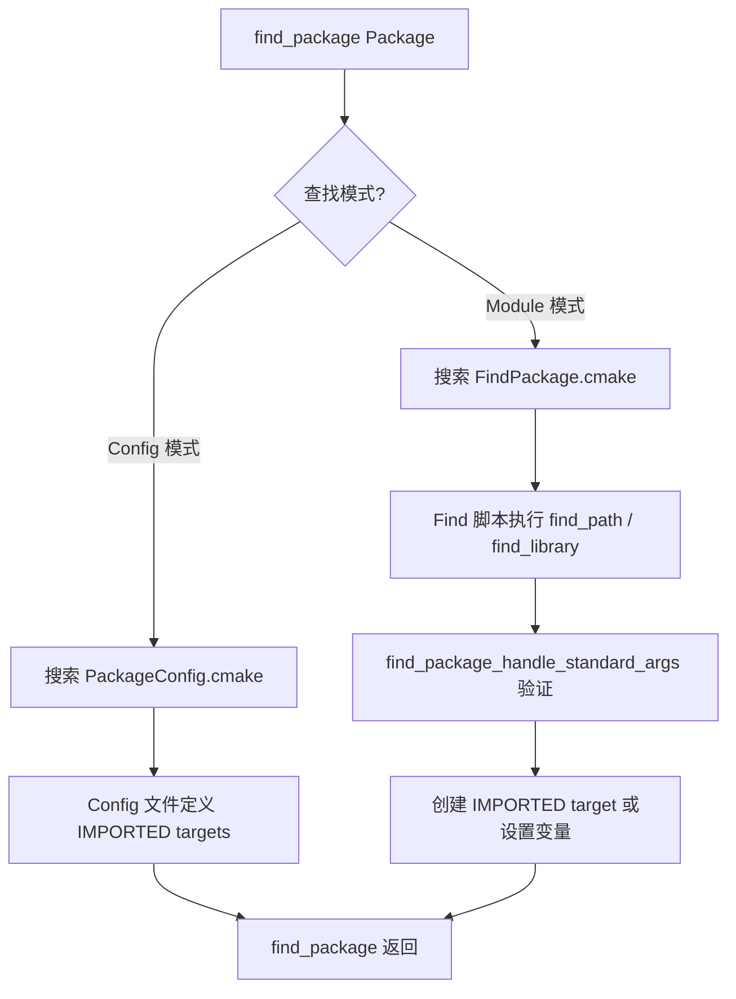

# find_package 与 Find 模块

> 所属计划: [[plan|CMake 深度学习]]
> 预计耗时: 60 分钟
> 前置知识: [[03-targets-and-properties|Target 与属性系统]]、[[07-target-link-libraries-and-transitive-deps|target_link_libraries 与传递依赖]]

---

## 1. 概念讲解

### 为什么需要这个？

真实项目不可能所有代码都写在同一个仓库里。你需要链接系统库（pthread、zlib、OpenSSL）、第三方 SDK（Boost、Qt、Protobuf），或者公司内部的共享组件。`find_package()` 是 CMake 解决"外部依赖怎么找、怎么用"的统一入口——你只需要说"我需要 Threads"，CMake 负责找到它、验证版本、创建可用的 target，你一行 `target_link_libraries` 就完事。

没有 `find_package` 的世界是这样的：

```cmake
# 噩梦模式：手动定位每个依赖
set(THREADS_LIB_PATH "/usr/lib/x86_64-linux-gnu/libpthread.so")
set(THREADS_INCLUDE_PATH "/usr/include")
include_directories(${THREADS_INCLUDE_PATH})
target_link_libraries(my_app ${THREADS_LIB_PATH})
```

每个平台路径不同，每个开发者安装位置不同，每次升级版本号变一次——这是不可维护的。`find_package` 把所有这些差异封装在 Find 模块或 Config 文件里，让你用一致的接口面对所有依赖。

### 核心思想

`find_package()` 有两种工作模式：

**Module 模式（传统）：** CMake 在自己的模块目录或你指定的 `CMAKE_MODULE_PATH` 中搜索 `Find<Package>.cmake`。这个脚本包含手动查找头文件、库文件、验证版本的逻辑。绝大多数系统库（Threads、ZLIB、OpenSSL、CURL）都通过 Module 模式使用。

**Config 模式（现代）：** 依赖库本身随源码发布 `<Package>Config.cmake` 或 `<package>-config.cmake`。CMake 根据 `CMAKE_PREFIX_PATH` 等搜索路径找到这个文件，直接导入其中定义的 targets。这是"包自己告诉你怎么用它"的模式，无需维护额外的 Find 模块。



> [!tip] 模式选择优先级
> CMake 3.24+ 默认行为：先尝试 Module 模式，没找到 `Find<Package>.cmake` 再回退到 Config 模式。你可以用 `find_package(Package CONFIG)` 强制 Config 模式，或用 `find_package(Package MODULE)` 强制 Module 模式。

### 搜索路径详解

**Module 模式搜索顺序：**
1. `CMAKE_MODULE_PATH` 中每个目录下的 `Find<Package>.cmake`
2. CMake 安装目录下的 `Modules/` 目录（内置 Find 模块）

**Config 模式搜索顺序：**
1. `<Package>_ROOT` CMake 变量或环境变量
2. `CMAKE_PREFIX_PATH`、`CMAKE_FRAMEWORK_PATH`、`CMAKE_APPBUNDLE_PATH`
3. 平台默认路径（`/usr/local`、`/usr`、`C:\Program Files` 等）
4. `~/.cmake/packages/` 下的用户包注册表

搜索的文件名包括：`<Package>Config.cmake`、`<package>-config.cmake`（大小写不敏感）。

### find_package() 完整参数签名

```cmake
find_package(<Package> [version] [EXACT] [QUIET] [MODULE|CONFIG]
             [REQUIRED] [[COMPONENTS] [comp1 comp2 ...]]
             [OPTIONAL_COMPONENTS comp3 comp4 ...]
             [NO_POLICY_SCOPE])
```

- **`version`**: 要求的最低版本，如 `1.2.3`
- **`EXACT`**: 精确匹配版本号（不允许更高）
- **`QUIET`**: 找不到时不输出警告信息
- **`REQUIRED`**: 找不到时立即终止配置（FATAL_ERROR）
- **`COMPONENTS`**: 请求特定组件（如 `Boost::filesystem`、`Boost::system`）
- **`OPTIONAL_COMPONENTS`**: 组件可选，找不到不影响成功
- **`MODULE`/`CONFIG`**: 强制指定查找模式

---

## 2. 代码示例

> [!note] 前置条件
> 以下示例需要 CMake 3.24+、支持 C++17 的编译器、以及系统中已安装 pthread（Linux/macOS 自带，Windows 需安装 pthreads-win32 或使用 WSL/MinGW）。

### 示例 1: 使用 find_package(Threads REQUIRED) 链接线程库

这是最简单的 `find_package` 用法——CMake 内置的 FindThreads 模块，跨平台处理 pthread。

**文件结构：**
```
example1/
├── CMakeLists.txt
└── main.cpp
```

**`CMakeLists.txt`:**
```cmake
cmake_minimum_required(VERSION 3.24)
project(ThreadsExample VERSION 1.0 LANGUAGES CXX)

# find_package 查找线程库
# Threads 是 CMake 内置的 Find 模块
# REQUIRED: 找不到就报错退出
find_package(Threads REQUIRED)

add_executable(demo main.cpp)

# Threads::Threads 是 FindThreads 创建的 IMPORTED target
# 它已经封装了正确的头文件路径和链接标志（-pthread / -lpthread）
target_link_libraries(demo PRIVATE Threads::Threads)
```

**`main.cpp`:**
```cpp
#include <chrono>
#include <iostream>
#include <thread>
#include <vector>

void worker(int id) {
    std::cout << "Thread " << id << " started on "
              << std::this_thread::get_id() << '\n';
    std::this_thread::sleep_for(std::chrono::milliseconds(100));
    std::cout << "Thread " << id << " finished\n";
}

int main() {
    constexpr int N = 4;
    std::vector<std::thread> threads;

    for (int i = 0; i < N; ++i)
        threads.emplace_back(worker, i);

    for (auto& t : threads)
        t.join();

    std::cout << "All threads joined.\n";
    return 0;
}
```

**运行方式:**
```bash
cd example1
cmake -B build -S .
cmake --build build
./build/demo
```

**预期输出:**
```text
Thread 0 started on 139912345678912
Thread 1 started on 139912337286208
Thread 2 started on 139912328893504
Thread 3 started on 139912320500800
Thread 0 finished
Thread 1 finished
Thread 2 finished
Thread 3 finished
All threads joined.
```

> [!info] `Threads::Threads` 做了什么？
> 在 Linux 上，`Threads::Threads` 等价于 `-pthread` 编译选项 + 链接 `-lpthread`。在 Windows 上会找到 pthreads-win32 或使用 Windows 原生线程 API。你不需要知道底层细节——这就是 IMPORTED target 的价值。

---

### 示例 2: 编写自定义 FindMyLib.cmake 模块

在这个示例中，我们模拟一个"第三方库"——`MyLib`，它有头文件 `mylib.h` 和库文件 `libmylib.a`（或 `.lib`）。然后编写 `FindMyLib.cmake` 让 CMake 找到它。

**文件结构：**
```
example2/
├── mylib/                    # 模拟"已安装的第三方库"
│   ├── include/
│   │   ├── mylib/
│   │   │   └── mylib.h
│   │   └── mylib/mylib.h
│   │   └── mylib/config.h
│   └── lib/
│       ├── libmylib.a       # 先编译后生成
│       └── libmylib.so      # 或 .dylib / .dll
├── cmake/
│   └── FindMyLib.cmake       # 我们的 Find 模块
├── CMakeLists.txt
└── main.cpp
```

**步骤 1: 先编译 `mylib` 库。**

**`mylib/include/mylib/mylib.h`:**
```cpp
#pragma once

namespace mylib {

int add(int a, int b);
int multiply(int a, int b);

} // namespace mylib
```

**`mylib/include/mylib/config.h`:**
```cpp
#pragma once

#define MYLIB_VERSION_MAJOR 1
#define MYLIB_VERSION_MINOR 0
#define MYLIB_VERSION_PATCH 0
#define MYLIB_VERSION_STRING "1.0.0"
```

**`mylib/src/mylib.cpp`:**
```cpp
#include "mylib/mylib.h"

namespace mylib {

int add(int a, int b) { return a + b; }
int multiply(int a, int b) { return a * b; }

} // namespace mylib
```

**`mylib/CMakeLists.txt`:**
```cmake
cmake_minimum_required(VERSION 3.24)
project(MyLib VERSION 1.0 LANGUAGES CXX)

add_library(mylib STATIC
    src/mylib.cpp
)

target_include_directories(mylib PUBLIC
    $<BUILD_INTERFACE:${CMAKE_CURRENT_SOURCE_DIR}/include>
    $<INSTALL_INTERFACE:include>
)

# 模拟安装到本地目录
install(TARGETS mylib
    ARCHIVE DESTINATION lib
)
install(DIRECTORY include/
    DESTINATION include
)
```

```bash
# 先编译 mylib 并安装到本地前缀目录
cd mylib
cmake -B build -S . -DCMAKE_INSTALL_PREFIX=../install
cmake --build build
cmake --install build
cd ..
```

**步骤 2: 编写 Find 模块。**

**`cmake/FindMyLib.cmake`:**
```cmake
# FindMyLib.cmake
# ---------------
# 查找 MyLib 库的头文件和库文件
#
# 输出变量:
#   MYLIB_FOUND          - 是否找到
#   MYLIB_INCLUDE_DIRS   - 头文件目录
#   MYLIB_LIBRARIES      - 库文件路径
#   MYLIB_VERSION        - 版本号字符串
#
# 输出 IMPORTED target:
#   MyLib::MyLib         - 可供 target_link_libraries 使用

# 1. 查找头文件
find_path(MYLIB_INCLUDE_DIR
    NAMES mylib/mylib.h
    # HINTS 和 PATHS 提供搜索候选位置
    HINTS ${MyLib_ROOT} ENV MyLib_ROOT
    PATHS /usr/local /opt/local
    PATH_SUFFIXES include
)

# 2. 查找库文件
find_library(MYLIB_LIBRARY
    NAMES mylib libmylib
    HINTS ${MyLib_ROOT} ENV MyLib_ROOT
    PATHS /usr/local /opt/local
    PATH_SUFFIXES lib lib64
)

# 3. 检查版本（可选）
set(MYLIB_VERSION "")
if(MYLIB_INCLUDE_DIR)
    # 从 config.h 中解析版本号
    if(EXISTS "${MYLIB_INCLUDE_DIR}/mylib/config.h")
        file(STRINGS "${MYLIB_INCLUDE_DIR}/mylib/config.h"
            _mylib_version_content REGEX "^#define[ \t]+MYLIB_VERSION_(MAJOR|MINOR|PATCH)")
        foreach(_line ${_mylib_version_content})
            string(REGEX REPLACE "^#define[ \t]+MYLIB_VERSION_([A-Z]+)[ \t]+([0-9]+).*"
                "\\1=\\2" _kv "${_line}")
            list(GET _kv 0 _key)
            list(GET _kv 1 _value)
            if(_key STREQUAL "MAJOR")
                set(_major ${_value})
            elseif(_key STREQUAL "MINOR")
                set(_minor ${_value})
            elseif(_key STREQUAL "PATCH")
                set(_patch ${_value})
            endif()
        endforeach()
        set(MYLIB_VERSION "${_major}.${_minor}.${_patch}")
    endif()
endif()

# 4. 使用标准处理器验证结果
include(FindPackageHandleStandardArgs)
find_package_handle_standard_args(MyLib
    REQUIRED_VARS MYLIB_LIBRARY MYLIB_INCLUDE_DIR
    VERSION_VAR MYLIB_VERSION
)

# 5. 如果找到，创建 IMPORTED target（Modern CMake 推荐做法）
if(MyLib_FOUND AND NOT TARGET MyLib::MyLib)
    add_library(MyLib::MyLib UNKNOWN IMPORTED)
    set_target_properties(MyLib::MyLib PROPERTIES
        IMPORTED_LOCATION "${MYLIB_LIBRARY}"
        INTERFACE_INCLUDE_DIRECTORIES "${MYLIB_INCLUDE_DIR}"
    )
    if(MYLIB_VERSION)
        set_target_properties(MyLib::MyLib PROPERTIES
            IMPORTED_SONAME "MyLib"
            VERSION "${MYLIB_VERSION}"
        )
    endif()
endif()

# 6. 隐藏内部变量，只暴露 target
mark_as_advanced(MYLIB_INCLUDE_DIR MYLIB_LIBRARY)
```

**步骤 3: 编写使用方的 CMakeLists.txt。**

**`CMakeLists.txt`:**
```cmake
cmake_minimum_required(VERSION 3.24)
project(FindMyLibDemo VERSION 1.0 LANGUAGES CXX)

# 把我们的 cmake/ 目录加入模块搜索路径
list(APPEND CMAKE_MODULE_PATH "${CMAKE_CURRENT_SOURCE_DIR}/cmake")

# 提示 CMake 去哪里找 MyLib（模拟非标准安装路径）
set(MyLib_ROOT "${CMAKE_CURRENT_SOURCE_DIR}/mylib/install")

# 使用我们的自定义 Find 模块
find_package(MyLib REQUIRED)

add_executable(demo main.cpp)

# 使用 IMPORTED target —— 简洁、跨平台
target_link_libraries(demo PRIVATE MyLib::MyLib)

# 打印找到的信息
message(STATUS "MyLib version: ${MYLIB_VERSION}")
message(STATUS "MyLib include: ${MYLIB_INCLUDE_DIR}")
message(STATUS "MyLib library: ${MYLIB_LIBRARY}")
```

**`main.cpp`:**
```cpp
#include <iostream>
#include "mylib/mylib.h"

int main() {
    std::cout << "add(3, 4) = " << mylib::add(3, 4) << '\n';
    std::cout << "multiply(5, 6) = " << mylib::multiply(5, 6) << '\n';
    std::cout << "MyLib found and linked successfully!\n";
    return 0;
}
```

**运行方式:**
```bash
# 先编译并安装 mylib
cd example2/mylib
cmake -B build -S . -DCMAKE_INSTALL_PREFIX=../install
cmake --build build
cmake --install build
cd ..

# 再编译使用方
cmake -B build -S .
cmake --build build
./build/demo
```

**预期输出:**
```text
-- MyLib version: 1.0.0
-- MyLib include: /path/to/example2/mylib/install/include
-- MyLib library: /path/to/example2/mylib/install/lib/libmylib.a
add(3, 4) = 7
multiply(5, 6) = 30
MyLib found and linked successfully!
```

> [!tip] `find_path` 和 `find_library` 的关键参数
> - **`NAMES`**: 要查找的文件名列表，按顺序尝试
> - **`HINTS`**: 优先搜索的路径（内部使用的缓存变量）
> - **`PATHS`**: 兜底搜索路径（硬编码的默认位置），在 `HINTS` 之后搜索
> - **`PATH_SUFFIXES`**: 在每个搜索路径下附加的子目录列表
> - **`NO_DEFAULT_PATH`**: 跳过所有系统默认路径，只搜索 `HINTS` 和 `PATHS`

---

### 示例 3: Config 模式——创建最小的 Package Config 文件

Config 模式是现代 CMake 推荐的方式：库的作者随安装包发布一个 `<Package>Config.cmake` 文件，使用者只需设置 `CMAKE_PREFIX_PATH` 指向安装目录即可。

**文件结构：**
```
example3/
├── calculator/               # 库项目（会被"安装"到本地目录）
│   ├── include/calculator/
│   │   └── calculator.h
│   ├── src/
│   │   └── calculator.cpp
│   └── CMakeLists.txt       # 含 install(EXPORT) 和 configure_package_config_file
├── app/                      # 使用方
│   ├── CMakeLists.txt
│   └── main.cpp
```

**`calculator/include/calculator/calculator.h`:**
```cpp
#pragma once

namespace calc {

class Calculator {
public:
    static int square(int x);
    static int cube(int x);
};

} // namespace calc
```

**`calculator/src/calculator.cpp`:**
```cpp
#include "calculator/calculator.h"

namespace calc {

int Calculator::square(int x) { return x * x; }
int Calculator::cube(int x) { return x * x * x; }

} // namespace calc
```

**`calculator/CMakeLists.txt`:**
```cmake
cmake_minimum_required(VERSION 3.24)
project(Calculator VERSION 2.0 LANGUAGES CXX)

add_library(calculator STATIC
    src/calculator.cpp
)

# 为库设置公开头文件路径
target_include_directories(calculator PUBLIC
    $<BUILD_INTERFACE:${CMAKE_CURRENT_SOURCE_DIR}/include>
    $<INSTALL_INTERFACE:include>
)

# === 关键: 创建可被 find_package 找到的 Config 文件 ===

# 1. 安装目标本身
install(TARGETS calculator
    EXPORT CalculatorTargets
    ARCHIVE DESTINATION lib
)

# 2. 安装头文件
install(DIRECTORY include/
    DESTINATION include
)

# 3. 导出 targets —— 生成 CalculatorTargets.cmake
install(EXPORT CalculatorTargets
    FILE CalculatorTargets.cmake
    NAMESPACE Calculator::
    DESTINATION lib/cmake/Calculator
)

# 4. 创建并安装版本文件
include(CMakePackageConfigHelpers)
write_basic_package_version_file(
    "${CMAKE_CURRENT_BINARY_DIR}/CalculatorConfigVersion.cmake"
    VERSION ${PROJECT_VERSION}
    COMPATIBILITY SameMajorVersion   # 2.x 都兼容
)

# 5. 创建并安装 Config 文件
configure_package_config_file(
    "${CMAKE_CURRENT_SOURCE_DIR}/CalculatorConfig.cmake.in"
    "${CMAKE_CURRENT_BINARY_DIR}/CalculatorConfig.cmake"
    INSTALL_DESTINATION lib/cmake/Calculator
)

install(FILES
    "${CMAKE_CURRENT_BINARY_DIR}/CalculatorConfig.cmake"
    "${CMAKE_CURRENT_BINARY_DIR}/CalculatorConfigVersion.cmake"
    DESTINATION lib/cmake/Calculator
)
```

**`calculator/CalculatorConfig.cmake.in`:**
```cmake
@PACKAGE_INIT@

# 载入导出的 targets（Calculator::calculator）
include("${CMAKE_CURRENT_LIST_DIR}/CalculatorTargets.cmake")

# 检查用户请求的组件
check_required_components(Calculator)
```

> [!note] 关于 `@PACKAGE_INIT@`
> `configure_package_config_file()` 会替换 `@PACKAGE_INIT@` 为一段初始化代码，包括设置 `PACKAGE_PREFIX_DIR` 变量（指向安装前缀）、处理路径重定位等。这是创建 Config 文件的标准模板。

**`app/CMakeLists.txt`:**
```cmake
cmake_minimum_required(VERSION 3.24)
project(CalculatorApp VERSION 1.0 LANGUAGES CXX)

# 告诉 CMake 去哪里找 Calculator
list(APPEND CMAKE_PREFIX_PATH "${CMAKE_CURRENT_SOURCE_DIR}/../calculator/install")

# Config 模式查找
# CalculatorConfig.cmake 会在 CMAKE_PREFIX_PATH 下被搜索
find_package(Calculator 2.0 REQUIRED CONFIG)

add_executable(demo main.cpp)
target_link_libraries(demo PRIVATE Calculator::calculator)
```

**`app/main.cpp`:**
```cpp
#include <iostream>
#include "calculator/calculator.h"

int main() {
    std::cout << "square(5) = " << calc::Calculator::square(5) << '\n';
    std::cout << "cube(3) = " << calc::Calculator::cube(3) << '\n';
    std::cout << "Config mode find_package works!\n";
    return 0;
}
```

**运行方式:**
```bash
cd example3/calculator
cmake -B build -S . -DCMAKE_INSTALL_PREFIX=../install
cmake --build build
cmake --install build
cd ../app
cmake -B build -S .
cmake --build build
./build/demo
```

**预期输出:**
```text
-- Found Calculator: 2.0 (found ...)
square(5) = 25
cube(3) = 27
Config mode find_package works!
```

> [!tip] Config 模式的搜索路径
> CMake 在 `CMAKE_PREFIX_PATH` 的每个目录下搜索 `lib/cmake/<Package>/<Package>Config.cmake` 等路径。具体搜索模式包括：
> - `<prefix>/lib/cmake/<Package>/<Package>Config.cmake`
> - `<prefix>/share/cmake/<Package>/<Package>Config.cmake`
> - `<prefix>/<Package>*/lib/cmake/<Package>/<Package>Config.cmake`
> 
> 设置 `CMAKE_PREFIX_PATH` 就是把库的安装前缀告诉 CMake 的最直接方式。

---

## 3. 练习

### 练习 1: 使用 find_package 查找 zlib（基础）

**目标:** 用 CMake 内置的 FindZLIB 模块查找系统上的 zlib 并编写压缩/解压程序。

**`CMakeLists.txt`:**
```cmake
cmake_minimum_required(VERSION 3.24)
project(ZlibExercise VERSION 1.0 LANGUAGES C)

# 查找 zlib，无版本限制，找不到就报错
find_package(ZLIB REQUIRED)

add_executable(zlib_demo main.c)

# 注意：FindZLIB 创建的 target 是 ZLIB::ZLIB
target_link_libraries(zlib_demo PRIVATE ZLIB::ZLIB)

# 打印找到的信息
message(STATUS "ZLIB_FOUND:     ${ZLIB_FOUND}")
message(STATUS "ZLIB_VERSION:   ${ZLIB_VERSION_STRING}")
message(STATUS "ZLIB_INCLUDE_DIRS: ${ZLIB_INCLUDE_DIRS}")
message(STATUS "ZLIB_LIBRARIES:    ${ZLIB_LIBRARIES}")
```

**`main.c`:**
```c
#include <stdio.h>
#include <string.h>
#include <zlib.h>

int main() {
    const char* input = "Hello, zlib! This is a test string for compression.";
    uLong src_len = strlen(input) + 1;
    uLong dst_len = compressBound(src_len);

    unsigned char compressed[1024];
    unsigned char decompressed[1024];

    // 压缩
    if (compress(compressed, &dst_len,
                 (const unsigned char*)input, src_len) != Z_OK) {
        fprintf(stderr, "Compression failed!\n");
        return 1;
    }

    printf("Original size:   %lu bytes\n", src_len);
    printf("Compressed size: %lu bytes (%.1f%%)\n",
           dst_len, 100.0 * dst_len / src_len);

    // 解压
    uLong decomp_len = sizeof(decompressed);
    if (uncompress(decompressed, &decomp_len,
                   compressed, dst_len) != Z_OK) {
        fprintf(stderr, "Decompression failed!\n");
        return 1;
    }

    printf("Decompressed:    %s\n", (char*)decompressed);
    printf("zlib version:    %s\n", zlibVersion());

    return 0;
}
```

**问题:**
1. 如果 zlib 安装在非标准路径（如 `/opt/zlib`），如何让 CMake 找到它？（至少给出两种方法）
2. 用 `cmake --graphviz=graph.dot` 生成依赖图，查看 `ZLIB::ZLIB` 的 target 关系。

### 练习 2: 编写 Find 模块（进阶）

**目标:** 模拟一个假设的 `SuperMath` 库，它有一个头文件 `supermath.h`（其中定义了 `SM_VERSION` 宏）和一个库文件 `libsupermath.a`。编写完整的 `FindSuperMath.cmake`。

要求：
1. 使用 `find_path` 和 `find_library` 查找头文件和库文件
2. 从头文件解析版本号（提示：用 `file(STRINGS ... REGEX ...)`）
3. 使用 `find_package_handle_standard_args` 验证结果
4. 创建 IMPORTED target `SuperMath::SuperMath`
5. 支持 `SuperMath_ROOT` 变量和同名环境变量作为搜索提示
6. 支持 `QUIET` 和 `REQUIRED` 参数

**模板框架:**
```cmake
# FindSuperMath.cmake
#

find_path(SUPERMATH_INCLUDE_DIR
    # TODO: 填写头文件名和搜索路径
)

find_library(SUPERMATH_LIBRARY
    # TODO: 填写库名和搜索路径
)

# TODO: 从 supermath.h 解析 SM_VERSION_MAJOR/MINOR/PATCH

include(FindPackageHandleStandardArgs)
# TODO: 调用 find_package_handle_standard_args

if(SUPERMATH_FOUND AND NOT TARGET SuperMath::SuperMath)
    # TODO: 创建 IMPORTED target
endif()
```

**验证方式:** 创建最小 `supermath.h`（含 `#define SM_VERSION_MAJOR 2` 等）和一个空 `libsupermath.a`（用 `ar` 或 `lib` 创建），然后编写 `CMakeLists.txt` 使用 `find_package(SuperMath REQUIRED)`。

### 练习 3: 创建 Package Config 文件（挑战）

**目标:** 创建一个更完整的库项目 `StringUtils`，实现以下功能：

1. 一个 `string_utils` 库（静态库），提供 `to_upper()`、`to_lower()`、`trim()` 函数
2. 一个可选的 `string_utils_advanced` 库（也是静态库），提供 `levenshtein_distance()` 函数
3. `StringUtilsConfig.cmake` 支持 `COMPONENTS` 参数——使用者可以写 `find_package(StringUtils REQUIRED COMPONENTS Advanced)`
4. 版本检查：要求 `VERSION 1.5` 或更高（`SameMajorVersion` 兼容策略）

**提示:**
- 用 `configure_package_config_file()` 和 `write_basic_package_version_file()`
- 在 Config 模板中使用 `check_required_components()` 验证组件请求
- `install(EXPORT ...)` 可以为不同的 target 导出到同一个 targets 文件


## 3.5 参考答案

> [!tip]- 练习 1 参考答案
> **1. 让 CMake 在非标准路径找到 zlib——两种方法：**
>
> **方法 A：设置 `CMAKE_PREFIX_PATH`：**
> ```bash
> cmake -B build -DCMAKE_PREFIX_PATH=/opt/zlib
> ```
> 或在 `CMakeLists.txt` 中：
> ```cmake
> list(APPEND CMAKE_PREFIX_PATH "/opt/zlib")
> find_package(ZLIB REQUIRED)
> ```
>
> **方法 B：设置 `<Package>_ROOT` 变量（CMake 3.12+，更精确）：**
> ```bash
> cmake -B build -DZLIB_ROOT=/opt/zlib
> ```
> 或在 `CMakeLists.txt` 中：
> ```cmake
> set(ZLIB_ROOT "/opt/zlib" CACHE PATH "zlib installation prefix")
> find_package(ZLIB REQUIRED)
> ```
>
> **方法 C：设置 `CMAKE_LIBRARY_PATH` 和 `CMAKE_INCLUDE_PATH`：**
> ```bash
> cmake -B build \
>     -DCMAKE_LIBRARY_PATH=/opt/zlib/lib \
>     -DCMAKE_INCLUDE_PATH=/opt/zlib/include
> ```
>
> **2. 生成依赖图：**
> ```bash
> cmake -B build --graphviz=graph.dot
> dot -Tpng graph.dot -o graph.png
> ```
> `ZLIB::ZLIB` 在图中显示为一个 `IMPORTED` 节点，`zlib_demo` 通过 `PRIVATE` 边指向它。

> [!tip]- 练习 2 参考答案
> **`cmake/FindSuperMath.cmake`：**
> ```cmake
> # FindSuperMath.cmake
> # 查找 SuperMath 库
> #
> # 输出:
> #   SUPERMATH_FOUND        - 是否找到
> #   SUPERMATH_INCLUDE_DIR  - 头文件目录
> #   SUPERMATH_LIBRARY      - 库文件路径
> #   SUPERMATH_VERSION      - 版本号字符串
> #
> # IMPORTED target:
> #   SuperMath::SuperMath
>
> # 1. 查找头文件
> find_path(SUPERMATH_INCLUDE_DIR
>     NAMES supermath.h
>     HINTS ${SuperMath_ROOT} ENV SuperMath_ROOT
>     PATHS /usr/local /opt/local
>     PATH_SUFFIXES include
> )
>
> # 2. 查找库文件
> find_library(SUPERMATH_LIBRARY
>     NAMES supermath libsupermath
>     HINTS ${SuperMath_ROOT} ENV SuperMath_ROOT
>     PATHS /usr/local /opt/local
>     PATH_SUFFIXES lib lib64
> )
>
> # 3. 从头文件解析版本号
> if(SUPERMATH_INCLUDE_DIR AND EXISTS "${SUPERMATH_INCLUDE_DIR}/supermath.h")
>     file(STRINGS "${SUPERMATH_INCLUDE_DIR}/supermath.h" _ver_line
>         REGEX "#define[ \t]+SM_VERSION_MAJOR[ \t]+[0-9]+")
>     if(_ver_line MATCHES "#define[ \t]+SM_VERSION_MAJOR[ \t]+([0-9]+)")
>         set(SUPERMATH_VERSION_MAJOR "${CMAKE_MATCH_1}")
>     endif()
>     file(STRINGS "${SUPERMATH_INCLUDE_DIR}/supermath.h" _ver_line
>         REGEX "#define[ \t]+SM_VERSION_MINOR[ \t]+[0-9]+")
>     if(_ver_line MATCHES "#define[ \t]+SM_VERSION_MINOR[ \t]+([0-9]+)")
>         set(SUPERMATH_VERSION_MINOR "${CMAKE_MATCH_1}")
>     endif()
>     file(STRINGS "${SUPERMATH_INCLUDE_DIR}/supermath.h" _ver_line
>         REGEX "#define[ \t]+SM_VERSION_PATCH[ \t]+[0-9]+")
>     if(_ver_line MATCHES "#define[ \t]+SM_VERSION_PATCH[ \t]+([0-9]+)")
>         set(SUPERMATH_VERSION_PATCH "${CMAKE_MATCH_1}")
>     endif()
>     set(SUPERMATH_VERSION
>         "${SUPERMATH_VERSION_MAJOR}.${SUPERMATH_VERSION_MINOR}.${SUPERMATH_VERSION_PATCH}")
> endif()
>
> # 4. 验证
> include(FindPackageHandleStandardArgs)
> find_package_handle_standard_args(SuperMath
>     REQUIRED_VARS SUPERMATH_LIBRARY SUPERMATH_INCLUDE_DIR
>     VERSION_VAR   SUPERMATH_VERSION
> )
>
> # 5. 创建 IMPORTED target
> if(SUPERMATH_FOUND AND NOT TARGET SuperMath::SuperMath)
>     add_library(SuperMath::SuperMath UNKNOWN IMPORTED)
>     set_target_properties(SuperMath::SuperMath PROPERTIES
>         IMPORTED_LOCATION "${SUPERMATH_LIBRARY}"
>         INTERFACE_INCLUDE_DIRECTORIES "${SUPERMATH_INCLUDE_DIR}"
>     )
> endif()
>
> mark_as_advanced(SUPERMATH_INCLUDE_DIR SUPERMATH_LIBRARY)
> ```
>
> **验证：** 创建 `supermath.h`（含 `#define SM_VERSION_MAJOR 2` 等）、空的 `libsupermath.a`（用 `ar rcs libsupermath.a` 或用 CMake 构建），然后在 `CMakeLists.txt` 中：
> ```cmake
> list(APPEND CMAKE_MODULE_PATH "${CMAKE_SOURCE_DIR}/cmake")
> find_package(SuperMath REQUIRED)
> target_link_libraries(my_app PRIVATE SuperMath::SuperMath)
> ```

> [!tip]- 练习 3 参考答案
> **项目结构关键文件：**
>
> **顶层 `CMakeLists.txt`：**
> ```cmake
> cmake_minimum_required(VERSION 3.24)
> project(StringUtils VERSION 2.0.0 LANGUAGES CXX)
>
> add_library(string_utils STATIC src/to_upper.cpp src/to_lower.cpp src/trim.cpp)
> target_include_directories(string_utils PUBLIC
>     $<BUILD_INTERFACE:${CMAKE_CURRENT_SOURCE_DIR}/include>
>     $<INSTALL_INTERFACE:include>
> )
>
> option(BUILD_ADVANCED "Build advanced string utilities" ON)
> if(BUILD_ADVANCED)
>     add_library(string_utils_advanced STATIC src/levenshtein.cpp)
>     target_include_directories(string_utils_advanced PUBLIC
>         $<BUILD_INTERFACE:${CMAKE_CURRENT_SOURCE_DIR}/include>
>         $<INSTALL_INTERFACE:include>
>     )
> endif()
>
> # 导出 targets
> install(TARGETS string_utils string_utils_advanced
>     EXPORT StringUtilsTargets
>     ARCHIVE DESTINATION lib
>     LIBRARY DESTINATION lib
> )
> install(DIRECTORY include/ DESTINATION include)
>
> # 生成 Config 文件
> include(CMakePackageConfigHelpers)
> write_basic_package_version_file(
>     "${CMAKE_CURRENT_BINARY_DIR}/StringUtilsConfigVersion.cmake"
>     VERSION ${PROJECT_VERSION}
>     COMPATIBILITY SameMajorVersion
> )
> configure_package_config_file(
>     "${CMAKE_CURRENT_SOURCE_DIR}/cmake/StringUtilsConfig.cmake.in"
>     "${CMAKE_CURRENT_BINARY_DIR}/StringUtilsConfig.cmake"
>     INSTALL_DESTINATION lib/cmake/StringUtils
> )
> install(FILES
>     "${CMAKE_CURRENT_BINARY_DIR}/StringUtilsConfig.cmake"
>     "${CMAKE_CURRENT_BINARY_DIR}/StringUtilsConfigVersion.cmake"
>     DESTINATION lib/cmake/StringUtils
> )
> install(EXPORT StringUtilsTargets
>     FILE StringUtilsTargets.cmake
>     NAMESPACE StringUtils::
>     DESTINATION lib/cmake/StringUtils
> )
> ```
>
> **`cmake/StringUtilsConfig.cmake.in`：**
> ```cmake
> @PACKAGE_INIT@
>
> include("${CMAKE_CURRENT_LIST_DIR}/StringUtilsTargets.cmake")
>
> check_required_components(StringUtils)
> ```
>
> **关键设计：** `check_required_components(StringUtils)` 自动检查所有通过 `find_package(StringUtils REQUIRED COMPONENTS Advanced)` 请求的组件是否都存在于 targets 文件中。

> [!note] 答案使用方式
> 先独立完成练习，再展开查看参考答案。参考答案不是唯一解——如果你的实现通过了测试或达到了题目要求，就是正确的。
---

## 4. 扩展阅读

### CMAKE_PREFIX_PATH —— 最常用的搜索提示

```cmake
# 单个路径
list(APPEND CMAKE_PREFIX_PATH "/opt/custom-libs")

# 多个路径
set(CMAKE_PREFIX_PATH "/opt/qt6;/opt/boost;/opt/protobuf"
    CACHE PATH "Prefix paths for find_package")

# 命令行传入
# cmake -B build -DCMAKE_PREFIX_PATH="/opt/qt6;/opt/boost"
```

`CMAKE_PREFIX_PATH` 是 Config 模式搜索时最先检查的路径之一（排在 `<Package>_ROOT` 之后）。它是告诉 CMake "我的依赖装在非标准位置"的标准方式。

### `<Package>_ROOT` —— 精确控制单个包的搜索

```cmake
# 只影响 find_package(OpenSSL)
set(OpenSSL_ROOT "/opt/openssl-3.0")

# 也可以通过环境变量设置（CMake 3.12+）
# export OpenSSL_ROOT=/opt/openssl-3.0
```

`<Package>_ROOT` 是 CMake 3.12+ 引入的机制，比 `CMAKE_PREFIX_PATH` 更精确——它只影响名为 `<Package>` 的包的搜索。搜索顺序在 `CMAKE_PREFIX_PATH` 之前。

### CMAKE_FIND_ROOT_PATH 与交叉编译

交叉编译时，你不希望 CMake 找到宿主机的库。`CMAKE_FIND_ROOT_PATH` 及其相关变量控制"系统根"：

```cmake
# 工具链文件中典型设置
set(CMAKE_FIND_ROOT_PATH /path/to/sysroot)

# 控制各类 find_* 命令是否只在 sysroot 中搜索
set(CMAKE_FIND_ROOT_PATH_MODE_PROGRAM NEVER)   # 程序去宿主机找
set(CMAKE_FIND_ROOT_PATH_MODE_LIBRARY ONLY)    # 库只在 sysroot 中找
set(CMAKE_FIND_ROOT_PATH_MODE_INCLUDE ONLY)    # 头文件只在 sysroot 中找
set(CMAKE_FIND_ROOT_PATH_MODE_PACKAGE ONLY)    # 包只在 sysroot 中找
```

- **`NEVER`**: 永远不在 sysroot 中搜索（去宿主机找）
- **`ONLY`**: 只在 sysroot 中搜索（交叉编译的库所在地）
- **`BOTH`**: 先搜 sysroot，再搜宿主机

### FetchContent 作为 find_package 的 fallback

CMake 3.24+ 支持 `FetchContent_Declare` 的 `FIND_PACKAGE_ARGS` 参数，让依赖管理更灵活：优先使用系统已安装的包，找不到再从源码下载：

```cmake
include(FetchContent)

FetchContent_Declare(
    fmt
    GIT_REPOSITORY https://github.com/fmtlib/fmt.git
    GIT_TAG 10.2.1
    FIND_PACKAGE_ARGS   # 先尝试 find_package(fmt)
)

# 如果系统没找到 fmt，FetchContent 会从源码下载编译
FetchContent_MakeAvailable(fmt)

# 无论来源，直接用 target
target_link_libraries(my_app PRIVATE fmt::fmt)
```

> [!important] FIND_PACKAGE_ARGS 的作用
> 当指定了 `FIND_PACKAGE_ARGS`，CMake 会先用 `find_package(fmt)` 搜索。如果找到了（版本满足要求），`FetchContent_MakeAvailable` 直接跳过，使用系统版本。如果没找到，才从 Git 下载。这实现了"系统包优先，源码 fallback"的模式。

### 常用内置 Find 模块一览

| 模块 | 创建的 Target | 用途 |
|------|--------------|------|
| FindThreads | `Threads::Threads` | 多线程支持 |
| FindZLIB | `ZLIB::ZLIB` | 压缩/解压 |
| FindOpenSSL | `OpenSSL::SSL`, `OpenSSL::Crypto` | TLS/加密 |
| FindCURL | `CURL::libcurl` | HTTP 客户端 |
| FindJPEG | `JPEG::JPEG` | JPEG 图像 |
| FindPNG | `PNG::PNG` | PNG 图像 |
| FindPython | `Python::Python`, `Python::Module` 等 | Python 嵌入/扩展 |
| FindOpenGL | `OpenGL::GL`, `OpenGL::GLU` | 图形渲染 |
| FindVulkan | `Vulkan::Vulkan` | 图形 API |
| FindBoost | `Boost::boost`, `Boost::filesystem` 等 | Boost 库 |

> [!warning] Boost 的 Find 模块历史的教训
> `FindBoost.cmake` 是 CMake 最复杂的内置模块（数千行）。它长期使用 `BOOST_INCLUDE_DIRS` 等旧式变量，直到 CMake 3.5+ 才提供 `Boost::boost` 等 IMPORTED target。新的项目应该使用 `find_package(Boost REQUIRED COMPONENTS filesystem system)` 然后直接 `target_link_libraries(... Boost::filesystem Boost::system)`，而不是用 `${Boost_INCLUDE_DIRS}`。

### 从 Find 模块到 Config 模式的演变

CMake 社区正在经历从 Find 模块到 Config 模式的转变：

**Find 模块的痛点：**
- 每个使用者都要维护 Find 脚本，CMake 自带的数量有限
- 版本解析脆弱（依赖头文件中的宏格式）
- 平台差异处理困难（静态库 vs 动态库、Debug vs Release）
- 传递依赖需要手动处理

**Config 模式的优势：**
- 库作者维护，最了解自己的库怎么用
- 直接导出 targets，包含所有编译选项和传递依赖
- 支持多配置（`IMPORTED_LOCATION_DEBUG` / `IMPORTED_LOCATION_RELEASE`）
- 支持组件 (COMPONENTS) 和互操作

**现状：**
- vcpkg 和 Conan 等包管理器默认生成 Config 文件
- 几乎所有现代 C++ 库（fmt、spdlog、nlohmann_json、grpc）都自带 Config 文件
- Find 模块仍然用于系统库（pthread、zlib、OpenSSL）——这些库本身不带 CMake 集成

---

## 常见陷阱

### 陷阱 1: 忘记 REQUIRED，静默失败

```cmake
# ❌ 危险：找不到 zlib 也不会报错，ZLIB_FOUND 为 FALSE
find_package(ZLIB)
# 后续代码可能使用空的 ZLIB_LIBRARIES，编译到链接阶段才失败

# ✅ 正确：找不到立即终止配置，给出明确错误
find_package(ZLIB REQUIRED)
```

### 陷阱 2: 使用旧式变量而非 IMPORTED target

```cmake
# ❌ 旧式写法：直接使用变量（不推荐）
find_package(ZLIB REQUIRED)
include_directories(${ZLIB_INCLUDE_DIRS})
target_link_libraries(my_app ${ZLIB_LIBRARIES})

# ✅ Modern CMake：使用 IMPORTED target
find_package(ZLIB REQUIRED)
target_link_libraries(my_app PRIVATE ZLIB::ZLIB)
# ZLIB::ZLIB 已经包含了正确的头文件路径、库文件路径和编译选项
```

IMPORTED target 不仅更简洁，还自动处理 `INTERFACE_INCLUDE_DIRECTORIES` 和 `INTERFACE_COMPILE_DEFINITIONS` 等传递属性。

### 陷阱 3: 没有设置 CMAKE_PREFIX_PATH

```cmake
# ❌ 库安装在 /opt/my-libs，但 CMake 找不到
find_package(CustomLib REQUIRED CONFIG)
# Error: Could not find a package configuration file...

# ✅ 告诉 CMake 去哪里找
list(APPEND CMAKE_PREFIX_PATH "/opt/my-libs")
find_package(CustomLib REQUIRED CONFIG)
```

### 陷阱 4: Config 模式和 Module 模式混用导致意外行为

```cmake
# 你写了 FindMyPkg.cmake 在 CMAKE_MODULE_PATH 中，
# 但库也安装了 MyPkgConfig.cmake 在 CMAKE_PREFIX_PATH 下。
# 不带模式参数时，CMake 默认优先 Module 模式，
# 可能使用了你过时的 Find 脚本而非库自带的 Config 文件。

# ✅ 明确意图
find_package(MyPkg CONFIG)   # 只用 Config 模式
find_package(MyPkg MODULE)   # 只用 Module 模式
```

### 陷阱 5: find_package 的版本参数与 Config 模式

```cmake
# Config 模式下，版本文件（<Package>ConfigVersion.cmake）
# 负责验证版本。如果库只提供了 1.0 的版本文件：
find_package(Lib 2.0 REQUIRED CONFIG)
# 错误: version mismatch —— 但错误信息可能不直观

# 检查兼容策略：库的版本文件可能使用 SameMajorVersion、
# AnyNewerVersion、ExactVersion 等策略
```

### 陷阱 6: IMPORTED target 的可见性问题

```cmake
# ❌ find_package 在一个目录的 CMakeLists.txt 中调用，
# 其创建的 IMPORTED target 是全局可见的（这是 IMORTED target 的特性），
# 但 CMake 变量（如 MYLIB_INCLUDE_DIR）不是。
# 这意味着你需要在每个需要这些变量的 scope 中重复 find_package。
# ✅ 这就是为什么要创建 IMPORTED target：
# 一旦创建，整个项目都可以 target_link_libraries(... MyLib::MyLib)
```

### 陷阱 7: 交叉编译时 find_package 找到宿主机的库

```cmake
# ❌ 交叉编译 ARM Linux 程序，但找到的是 x86_64 宿主机上的 zlib
find_package(ZLIB REQUIRED)

# ✅ 在工具链文件中正确设置 CMAKE_FIND_ROOT_PATH_MODE_*
set(CMAKE_FIND_ROOT_PATH_MODE_LIBRARY ONLY)
set(CMAKE_FIND_ROOT_PATH_MODE_INCLUDE ONLY)
set(CMAKE_FIND_ROOT_PATH_MODE_PACKAGE ONLY)
```
