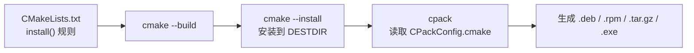
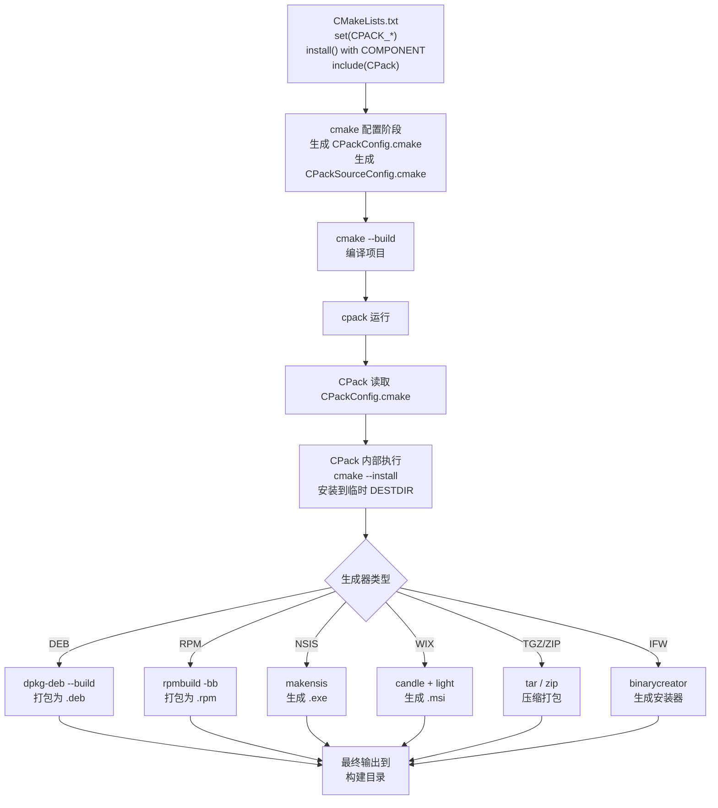

# CPack 打包分发

> 前置教程: [[11-install-and-export-targets]]
> 预计时间: 50min

---

## 第 1 层: 直觉理解

**CPack 就是把构建产物打包成可分发的安装包。**

你写好 CMake 项目，编译出二进制文件。现在要把 `myapp` 发给用户——你不能让他们自己跑 `cmake --build`。你需要一个 `.tar.gz`、一个 `.deb`、一个 Windows 安装器 `.exe`，或者 macOS 的 `.dmg`。

想象一家面包工坊：

| 步骤 | 面包工坊 | CMake + CPack |
|------|---------|---------------|
| 配方 | 面包配方 | `CMakeLists.txt` |
| 烘烤 | 烤箱 | `cmake --build` |
| 挑选 | 选出哪些面包装箱 | `install()` 规则 |
| 包装 | 装盒、贴标签、选包装形式 | CPack 生成器 |
| 出货 | 交给物流 | 分发给用户 |

CPack 是 CMake 自带的**打包工具**，它不编译代码——它读取你的 `install()` 规则，把已经安装好的文件按指定格式打包。

核心流程：



> [!tip] 关键洞察
> CPack 不是独立的打包工具——它本质上是 CMake 配置阶段生成的 `CPackConfig.cmake` 的读取器，配合 `install()` 规则工作。你配置 CMake 变量，CPack 替你调用系统工具（`tar`、`dpkg-deb`、`rpmbuild`、`makensis` 等）。

---

## 第 2 层: 使用场景与生成器选择

### 什么时候需要 CPack？

1. **开源项目分发** — 一个 `cmake --build` + `cpack` 产出 `.tar.gz` 和 `.zip`，用户下载解压即用。
2. **Linux 生态** — 生成 `.deb`（Debian/Ubuntu）或 `.rpm`（RHEL/Fedora），用户 `apt install ./myapp.deb`。
3. **Windows 桌面软件** — NSIS 生成 `.exe` 安装向导，WIX 生成 `.msi`（企业部署）。
4. **macOS 分发** — DragNDrop 生成 `.dmg` 拖拽安装，Bundle 生成 `.app`。
5. **跨平台商业软件** — Qt Installer Framework (IFW) 提供统一的跨平台安装体验。

### 生成器决策树

```
你需要什么格式？
├─ Linux
│   ├─ Debian/Ubuntu (.deb)          → CPACK_GENERATOR = DEB
│   ├─ RHEL/Fedora (.rpm)            → CPACK_GENERATOR = RPM
│   ├─ 通用压缩包 (.tar.gz/.tar.xz)  → CPACK_GENERATOR = TGZ / TXZ
│   └─ 也兼容其他格式
├─ Windows
│   ├─ GUI 安装向导 (.exe)            → CPACK_GENERATOR = NSIS
│   ├─ MSI 企业部署 (.msi)            → CPACK_GENERATOR = WIX
│   └─ 压缩包 (.zip)                  → CPACK_GENERATOR = ZIP
├─ macOS
│   ├─ 拖拽安装 (.dmg)               → CPACK_GENERATOR = DragNDrop
│   ├─ .app Bundle                   → CPACK_GENERATOR = Bundle
│   └─ 也兼容 TGZ
└─ 跨平台统一安装器
    └─ Qt Installer Framework         → CPACK_GENERATOR = IFW
```

> [!warning] 生成器依赖
> DEB 需要 `dpkg-deb`，RPM 需要 `rpmbuild`，NSIS 需要 `makensis`，WIX 需要 `candle`/`light`，IFW 需要 Qt IFW 工具链。这些工具**不会**随 CMake 安装——需要单独安装。

---

## 第 3 层: API 层 — 变量与命令全集

### 3.1 入口命令

```cmake
include(CPack)
```

> [!important] `include(CPack)` 必须放在最后
> `include(CPack)` 生成 `CPackConfig.cmake` 时会快照**当前位置之前**的 `CPACK_*` 变量。所有 CPack 配置变量必须**在这行之前**设置。

#### 组件支持

```cmake
include(CPackComponent)                    # 加载组件模块
cpack_add_component(NAME ...)              # 定义一个组件
cpack_add_component_group(GROUP ...)       # 定义一个组件组
```

### 3.2 通用包元数据变量

| 变量 | 说明 | 示例 |
|------|------|------|
| `CPACK_PACKAGE_NAME` | 包名 | `"MyApp"` |
| `CPACK_PACKAGE_VERSION` | 版本号 | `"2.1.0"` |
| `CPACK_PACKAGE_DESCRIPTION` | 简短描述 | `"A sample application"` |
| `CPACK_PACKAGE_VENDOR` | 提供商/组织 | `"MyCompany Inc."` |
| `CPACK_PACKAGE_CONTACT` | 维护者联系人 | `"dev@example.com"` |
| `CPACK_PACKAGE_HOMEPAGE_URL` | 项目主页 | `"https://example.com"` |
| `CPACK_PACKAGE_FILE_NAME` | 自定义文件名 | `"${CPACK_PACKAGE_NAME}-${CPACK_PACKAGE_VERSION}-${CMAKE_SYSTEM_NAME}-${CMAKE_SYSTEM_PROCESSOR}"` |
| `CPACK_PACKAGE_ICON` | 包图标路径 | `"${CMAKE_SOURCE_DIR}/icon.png"` |
| `CPACK_PACKAGE_CHECKSUM` | 校验和算法 | `"SHA256"` |
| `CPACK_RESOURCE_FILE_LICENSE` | 许可证文件 | `"${CMAKE_SOURCE_DIR}/LICENSE"` |
| `CPACK_RESOURCE_FILE_README` | README 文件 | `"${CMAKE_SOURCE_DIR}/README.md"` |
| `CPACK_RESOURCE_FILE_WELCOME` | 欢迎文本 | `"${CMAKE_SOURCE_DIR}/WELCOME.txt"` |

### 3.3 生成器选择

```cmake
set(CPACK_GENERATOR "TGZ;ZIP")              # 生成多个格式（分号分隔）
set(CPACK_SOURCE_GENERATOR "TGZ;ZIP")       # 源码包生成器
```

`CPACK_GENERATOR` 可以是分号分隔的列表，`cpack` 会为每个生成器各产出一份包。

可用的生成器（取决于平台安装的工具）：

| 生成器 | 产出格式 | 平台 |
|--------|---------|------|
| `TGZ` | `.tar.gz` | 所有 |
| `TXZ` | `.tar.xz` | 所有 |
| `TZ` | `.tar.Z` | 所有 |
| `TBZ2` | `.tar.bz2` | 所有 |
| `ZIP` | `.zip` | 所有 |
| `DEB` | `.deb` | Linux (需 `dpkg-deb`) |
| `RPM` | `.rpm` | Linux (需 `rpmbuild`) |
| `NSIS` | `.exe` (NSIS 安装器) | Windows (需 `makensis`) |
| `NSIS64` | `.exe` (64-bit) | Windows |
| `WIX` | `.msi` | Windows (需 WiX Toolset) |
| `DragNDrop` | `.dmg` | macOS |
| `Bundle` | `.app` Bundle | macOS |
| `productbuild` | `.pkg` | macOS |
| `IFW` | Qt Installer Framework | 跨平台 |
| `NuGet` | `.nupkg` | 跨平台 |
| `External` | 自定义外部脚本 | 所有 |

### 3.4 组件系统

组件可以将一个项目拆分为多个**逻辑子包**——类似 Debian 的 `libfoo`、`libfoo-dev`、`libfoo-doc`。

#### 定义组件

```cmake
include(CPackComponent)

cpack_add_component(Runtime
    DISPLAY_NAME  "Runtime Libraries"
    DESCRIPTION   "Shared libraries needed to run the application."
    REQUIRED                           # 必选组件（用户不能取消）
    HIDDEN                             # 隐藏（不在交互式安装器中显示，但会安装）
    GROUP RuntimeGroup                  # 所属组
)

cpack_add_component(Development
    DISPLAY_NAME  "Development Headers"
    DESCRIPTION   "Header files and CMake configs for development."
    DEPENDS Runtime                    # 依赖 Runtime 组件
    GROUP DevelGroup
)

cpack_add_component(Documentation
    DISPLAY_NAME  "Documentation"
    DESCRIPTION   "User manual and API reference."
    DISABLED                           # 默认不选（用户可手动勾选）
)
```

#### 组件变量

| 变量 | 说明 |
|------|------|
| `CPACK_COMPONENTS_ALL` | 要打包的组件列表（分号分隔） |
| `CPACK_COMPONENT_<NAME>_DEPENDS` | 组件 `<NAME>` 的依赖组件 |
| `CPACK_COMPONENT_<NAME>_DISPLAY_NAME` | 在安装器 UI 中显示的名称 |
| `CPACK_COMPONENT_<NAME>_DESCRIPTION` | 组件描述 |
| `CPACK_COMPONENT_<NAME>_GROUP` | 所属组名 |
| `CPACK_COMPONENT_<NAME>_REQUIRED` | 是否必选（`ON`/`OFF`） |
| `CPACK_COMPONENT_<NAME>_HIDDEN` | 是否隐藏（`ON`/`OFF`） |
| `CPACK_COMPONENT_<NAME>_DISABLED` | 默认是否禁用（`ON`/`OFF`） |
| `CPACK_COMPONENTS_ALL_IN_ONE_PACKAGE` | 所有组件打包到一个文件（`ON`/`OFF`） |
| `CPACK_COMPONENTS_GROUPING` | 打包方式: `IGNORE` / `ONE_PER_GROUP` / `ALL_COMPONENTS_IN_ONE` |

#### 组件与 `install()` 的关联

```cmake
# install() 中的 COMPONENT 关键字直接对应 CPack 组件名
install(TARGETS mylib
    COMPONENT Runtime         # ← 这个组件名
    LIBRARY DESTINATION lib
)
install(DIRECTORY include/
    COMPONENT Development     # ← 必须和 cpack_add_component 名字一致
    DESTINATION include
)
```

> [!important] 组件名必须一致
> `install(TARGETS ... COMPONENT Foo)` 中的 `Foo` 必须与 `cpack_add_component(Foo ...)` 的 `Foo` 严格匹配。大小写敏感。

### 3.5 DEB 生成器变量

| 变量 | 说明 | 示例 |
|------|------|------|
| `CPACK_DEBIAN_PACKAGE_MAINTAINER` | 维护者 | `"John <john@example.com>"` |
| `CPACK_DEBIAN_PACKAGE_DEPENDS` | 运行时依赖 | `"libc6 (>= 2.17), libssl3"` |
| `CPACK_DEBIAN_PACKAGE_SECTION` | 分类 | `"libs"`, `"devel"`, `"utils"`, `"net"` |
| `CPACK_DEBIAN_PACKAGE_PRIORITY` | 优先级 | `"optional"`, `"required"`, `"standard"` |
| `CPACK_DEBIAN_PACKAGE_HOMEPAGE` | 项目主页 | `"https://example.com"` |
| `CPACK_DEBIAN_PACKAGE_SHLIBDEPS` | 自动检测 .so 依赖 | `ON` / `OFF` |
| `CPACK_DEBIAN_PACKAGE_GENERATE_SHLIBS` | 生成 shlibs 文件 | `ON` / `OFF` |
| `CPACK_DEBIAN_PACKAGE_CONTROL_EXTRA` | 额外 control 脚本 | `"${CMAKE_SOURCE_DIR}/debian/postinst;${CMAKE_SOURCE_DIR}/debian/prerm"` |
| `CPACK_DEBIAN_PACKAGE_CONTROL_STRICT_PERMISSION` | 严格检查 control 文件权限 | `ON` / `OFF` |
| `CPACK_DEBIAN_PACKAGE_ARCHITECTURE` | 架构（默认自动检测） | `"amd64"`, `"arm64"`, `"all"` |

#### DEB 组件级变量

```cmake
# 仅对 Runtime 组件的 deb 包生效
set(CPACK_DEBIAN_RUNTIME_PACKAGE_NAME       "libmyapp5")
set(CPACK_DEBIAN_RUNTIME_PACKAGE_DEPENDS    "libc6 (>= 2.17)")
set(CPACK_DEBIAN_RUNTIME_PACKAGE_SECTION    "libs")
```

模式: `CPACK_DEBIAN_<COMPONENT>_PACKAGE_<VAR>`，其中 `<COMPONENT>` 是 `cpack_add_component()` 的名称转为大写。

### 3.6 RPM 生成器变量

| 变量 | 说明 | 示例 |
|------|------|------|
| `CPACK_RPM_PACKAGE_LICENSE` | 许可证 | `"MIT"`, `"GPLv3"` |
| `CPACK_RPM_PACKAGE_REQUIRES` | 运行时依赖 | `"glibc >= 2.17, openssl-libs"` |
| `CPACK_RPM_PACKAGE_RELEASE` | 发布号 | `"1"` (默认 `"1"`) |
| `CPACK_RPM_PACKAGE_GROUP` | 分类组 | `"Development/Libraries"` |
| `CPACK_RPM_PACKAGE_URL` | 项目 URL | `"https://example.com"` |
| `CPACK_RPM_PACKAGE_AUTOREQ` | 自动检测依赖 | `ON` / `OFF` |
| `CPACK_RPM_PACKAGE_AUTOPROV` | 自动检测 Provides | `ON` / `OFF` |
| `CPACK_RPM_PRE_INSTALL_SCRIPT_FILE` | preinst 脚本 | `"${CMAKE_SOURCE_DIR}/scripts/preinst.sh"` |
| `CPACK_RPM_POST_INSTALL_SCRIPT_FILE` | postinst 脚本 | `"${CMAKE_SOURCE_DIR}/scripts/postinst.sh"` |
| `CPACK_RPM_PRE_UNINSTALL_SCRIPT_FILE` | prerm 脚本 | `"${CMAKE_SOURCE_DIR}/scripts/prerm.sh"` |
| `CPACK_RPM_POST_UNINSTALL_SCRIPT_FILE` | postrm 脚本 | `"${CMAKE_SOURCE_DIR}/scripts/postrm.sh"` |
| `CPACK_RPM_CHANGELOG_FILE` | Changelog 文件 | `"${CMAKE_SOURCE_DIR}/CHANGELOG.md"` |

### 3.7 NSIS 生成器变量

| 变量 | 说明 | 示例 |
|------|------|------|
| `CPACK_NSIS_INSTALL_ROOT` | 默认安装目录 | `"$PROGRAMFILES64\\MyApp"` |
| `CPACK_NSIS_ENABLE_UNINSTALL_BEFORE_INSTALL` | 安装前卸载旧版 | `ON` / `OFF` |
| `CPACK_NSIS_MUI_ICON` | 安装器图标 | `"${CMAKE_SOURCE_DIR}/icon.ico"` |
| `CPACK_NSIS_MUI_UNIICON` | 卸载器图标 | `"${CMAKE_SOURCE_DIR}/unicon.ico"` |
| `CPACK_NSIS_MENU_LINKS` | 开始菜单链接 | `"https://example.com" "MyApp Homepage"` |
| `CPACK_NSIS_CREATE_ICONS_EXTRA` | 额外 NSIS 命令（创建快捷方式） | 见示例 |
| `CPACK_NSIS_DELETE_ICONS_EXTRA` | 额外 NSIS 命令（删除快捷方式） | 见示例 |
| `CPACK_NSIS_DISPLAY_NAME` | 显示名称 | `"My Application"` |
| `CPACK_NSIS_PACKAGE_NAME` | NSIS 包名 | `"MyApp"` |
| `CPACK_NSIS_INSTALLER_ICON` | 安装器 .exe 图标 | `"${CMAKE_SOURCE_DIR}/installer.ico"` |

### 3.8 WIX 生成器变量

| 变量 | 说明 |
|------|------|
| `CPACK_WIX_UPGRADE_GUID` | **升级 GUID**（关键——同产品多版本共享此 GUID 才能升级） |
| `CPACK_WIX_PRODUCT_GUID` | 产品 GUID（每个版本不同——通常留空让 CPack 自动生成） |
| `CPACK_WIX_LICENSE_RTF` | RTF 格式许可证文件路径 |
| `CPACK_WIX_PRODUCT_ICON` | 产品图标 |
| `CPACK_WIX_UI_BANNER` | 安装器横幅图片 |
| `CPACK_WIX_UI_DIALOG` | 安装器背景图片 |

### 3.9 macOS 生成器变量

#### DragNDrop (.dmg)

| 变量 | 说明 |
|------|------|
| `CPACK_DMG_VOLUME_NAME` | DMG 卷标名称 |
| `CPACK_DMG_BACKGROUND_IMAGE` | DMG 背景图 |
| `CPACK_DMG_DS_STORE` | 预定义的 `.DS_Store` (控制图标位置) |

#### Bundle (.app)

| 变量 | 说明 |
|------|------|
| `CPACK_BUNDLE_NAME` | Bundle 显示名称 |
| `CPACK_BUNDLE_PLIST` | 自定义 `Info.plist` 路径 |
| `CPACK_BUNDLE_ICON` | `.icns` 图标 |
| `CPACK_BUNDLE_STARTUP_COMMAND` | 启动脚本 |

### 3.10 安装前/后脚本

除了 RPM 的专用变量外，DEB 和通用组件也支持 pre/post 脚本。

#### DEB maintainer 脚本

```cmake
set(CPACK_DEBIAN_PACKAGE_CONTROL_EXTRA
    "${CMAKE_SOURCE_DIR}/debian/postinst"
    "${CMAKE_SOURCE_DIR}/debian/prerm"
    "${CMAKE_SOURCE_DIR}/debian/postrm"
)
```

这些文件会被直接复制到 DEB 的 `control.tar.gz` 中，必须遵循 Debian Policy 规范且具有可执行权限。

#### 通用 pre/post 脚本

```cmake
# 安装前执行的 CMake 脚本
set(CPACK_INSTALL_SCRIPT "${CMAKE_SOURCE_DIR}/CPackPreInstall.cmake")

# 组件级脚本
set(CPACK_COMPONENT_RUNTIME_PRE_INSTALL_SCRIPT  "${CMAKE_SOURCE_DIR}/pre-runtime.cmake")
set(CPACK_COMPONENT_RUNTIME_POST_INSTALL_SCRIPT "${CMAKE_SOURCE_DIR}/post-runtime.cmake")
```

### 3.11 Qt Installer Framework (IFW)

```cmake
set(CPACK_GENERATOR "IFW")
set(CPACK_IFW_ROOT "/path/to/QtIFW-4.x")   # IFW 安装路径

cpack_ifw_configure_component(Runtime
    NAME "runtime"
    DISPLAY_NAME "Runtime"
    DESCRIPTION "Core runtime"
    VERSION "2.1.0"
    RELEASE_DATE "2026-06-10"
    SCRIPT "${CMAKE_SOURCE_DIR}/installscript.qs"
)

cpack_ifw_configure_component_group(MyGroup
    NAME "mygroup"
    DISPLAY_NAME "My Group"
)
```

### 3.12 命令行接口

```bash
# 在构建目录下运行，产出配置的 CPACK_GENERATOR 所有格式
cpack

# 指定生成器（覆盖 CMakeLists.txt 中的设置）
cpack -G DEB
cpack -G "TGZ;ZIP"

# 指定构建配置（Debug/Release，影响安装哪些文件）
cpack -C Release

# 指定输出目录
cpack -B ./packages

# 查看所有可用生成器
cpack --help

# 使用自定义配置文件
cpack --config ./MyCPackConfig.cmake

# 源码打包
cpack --config CPackSourceConfig.cmake -G TGZ

# 详细输出
cpack -V
```

---

## 第 4 层: 内部机制 — CPack 如何工作

### 4.1 完整流水线



### 4.2 关键文件

构建目录下的 CPack 产物：

| 文件 | 作用 |
|------|------|
| `CPackConfig.cmake` | 二进制包配置——`cpack` 默认读取此文件 |
| `CPackSourceConfig.cmake` | 源码包配置——`cpack --config CPackSourceConfig.cmake` |
| `_CPack_Packages/` | CPack 工作目录（临时安装 + 中间文件） |
| `CPackConfig-<Generator>.cmake` | 生成器特定配置 |
| `<package>.deb` / `.tar.gz` / `.exe` 等 | **最终产出** |

### 4.3 `CPackConfig.cmake` 的生成

当你写 `include(CPack)` 时，CMake 内部执行：

1. 收集当前作用域中所有 `CPACK_*` 变量
2. 收集所有 `cpack_add_component()` 定义
3. 将 `install()` 规则（已通过 `COMPONENT` 分组的）映射到 CPack 组件
4. 把这些信息序列化写入 `CPackConfig.cmake`

> [!warning] 时机很重要
> `include(CPack)` 必须放在 CPack 变量设置的**最后一行**。它之后的 `set(CPACK_*)` 不会被写入 `CPackConfig.cmake`。一个常见错误是 `include(CPack)` 后面还设置了 CPack 变量。

### 4.4 组件打包的安装过程

对于组件化打包，CPack 的流程是：

```
对每个组件 C:
    1. cpack 内部调用 cmake --install <dir> --component C --prefix /tmp/CPack_xxx
    2. 这个命令只安装 COMPONENT C 的文件
    3. 文件安装在临时目录中
    4. 生成器将临时目录打包为 C 对应的包
```

这就是为什么 `install(TARGETS ... COMPONENT Runtime)` 中的组件名必须和 `cpack_add_component(Runtime ...)` 严格一致——CPack 把组件名传给 `cmake --install --component <name>`。

### 4.5 生成器感知与回退

CPack 在配置阶段检测系统工具：

```cmake
# CMake 自动检测可用的生成器
# 如果 makensis 未安装，NSIS 生成器不可用
# 如果 dpkg-deb 未安装，DEB 生成器不可用
```

可用生成器列表存储在 `CPACK_BINARY_<GENERATOR>` 变量中（如 `CPACK_BINARY_DEB`、`CPACK_BINARY_NSIS`）。

---

## 第 5 层: 代码示例

### 示例 1: 基础 TGZ/ZIP 打包

本示例展示最简单的 CPack 用法——构建一个命令行工具并打包为 `.tar.gz` 和 `.zip`。

#### 项目结构

```
example1/
├── CMakeLists.txt
├── src/
│   └── main.cpp
├── README.md
└── LICENSE
```

#### `src/main.cpp`

```cpp
#include <iostream>

int main() {
    std::cout << "Hello from myapp v1.0.0!" << std::endl;
    return 0;
}
```

#### `CMakeLists.txt`

```cmake
cmake_minimum_required(VERSION 3.24)
project(MyApp VERSION 1.0.0 DESCRIPTION "A simple command-line tool")

# ---- 构建 ----
add_executable(myapp src/main.cpp)

# ---- 安装规则 ----
install(TARGETS myapp
    RUNTIME DESTINATION bin
)
install(FILES README.md LICENSE
    DESTINATION share/doc/myapp
)

# ---- CPack 配置 ----
# 必须在 include(CPack) 之前设置
set(CPACK_PACKAGE_NAME            "myapp")
set(CPACK_PACKAGE_VERSION         ${PROJECT_VERSION})
set(CPACK_PACKAGE_DESCRIPTION     ${PROJECT_DESCRIPTION})
set(CPACK_PACKAGE_VENDOR          "MyCompany")
set(CPACK_PACKAGE_CONTACT         "dev@mycompany.com")
set(CPACK_PACKAGE_HOMEPAGE_URL    "https://mycompany.com/myapp")

# 自定义包文件名为 myapp-1.0.0-Linux-x86_64.tar.gz 格式
set(CPACK_PACKAGE_FILE_NAME
    "${CPACK_PACKAGE_NAME}-${CPACK_PACKAGE_VERSION}-${CMAKE_SYSTEM_NAME}-${CMAKE_SYSTEM_PROCESSOR}"
)

# 生成 TGZ 和 ZIP 两种格式
set(CPACK_GENERATOR "TGZ;ZIP")

# 许可证和 README 嵌入包内
set(CPACK_RESOURCE_FILE_LICENSE  "${CMAKE_SOURCE_DIR}/LICENSE")
set(CPACK_RESOURCE_FILE_README   "${CMAKE_SOURCE_DIR}/README.md")

# CRITICAL: include(CPack) 必须放在最后
include(CPack)
```

#### 运行步骤

```bash
# 1. 配置项目
cmake -B build -DCMAKE_BUILD_TYPE=Release

# 2. 构建
cmake --build build

# 3. 打包（在构建目录下运行 cpack）
cd build
cpack -G TGZ -C Release

# 4. 查看产物
ls *.tar.gz *.zip
# 输出:
# myapp-1.0.0-Linux-x86_64.tar.gz
# myapp-1.0.0-Linux-x86_64.zip

# 5. 验证包内容
tar tzf myapp-1.0.0-Linux-x86_64.tar.gz
# 输出:
# bin/myapp
# share/doc/myapp/README.md
# share/doc/myapp/LICENSE
```

---

### 示例 2: 组件化打包 — Runtime vs Development

本示例展示如何将库项目拆分为两个组件包：运行时库 + 开发文件。

#### 项目结构

```
example2/
├── CMakeLists.txt
├── include/
│   └── mylib/
│       └── mylib.h
├── src/
│   └── mylib.cpp
└── LICENSE
```

#### `include/mylib/mylib.h`

```cpp
#pragma once

namespace mylib {
    int add(int a, int b);
}
```

#### `src/mylib.cpp`

```cpp
#include "mylib/mylib.h"

namespace mylib {
    int add(int a, int b) {
        return a + b;
    }
}
```

#### `CMakeLists.txt`

```cmake
cmake_minimum_required(VERSION 3.24)
project(MyLib VERSION 2.1.0 DESCRIPTION "Math utility library")

# ---- 构建 ----
add_library(mylib SHARED
    src/mylib.cpp
)
target_include_directories(mylib
    PUBLIC
        $<BUILD_INTERFACE:${CMAKE_CURRENT_SOURCE_DIR}/include>
        $<INSTALL_INTERFACE:include>
)
set_target_properties(mylib PROPERTIES
    VERSION   ${PROJECT_VERSION}
    SOVERSION ${PROJECT_VERSION_MAJOR}
)

# ---- 导出目标 ----
install(TARGETS mylib
    EXPORT MyLibTargets
    COMPONENT Runtime                   # ← Runtime 组件
    LIBRARY  DESTINATION lib
    ARCHIVE  DESTINATION lib
    RUNTIME  DESTINATION bin
    INCLUDES DESTINATION include
)

install(DIRECTORY include/
    COMPONENT Development               # ← Development 组件
    DESTINATION include
)

install(EXPORT MyLibTargets
    COMPONENT Development               # ← Development 组件
    DESTINATION lib/cmake/MyLib
    NAMESPACE MyLib::
    FILE MyLibTargets.cmake
)

# ---- 包版本文件 ----
include(CMakePackageConfigHelpers)
write_basic_package_version_file(
    "${CMAKE_CURRENT_BINARY_DIR}/MyLibConfigVersion.cmake"
    VERSION ${PROJECT_VERSION}
    COMPATIBILITY SameMajorVersion
)
configure_package_config_file(
    "${CMAKE_CURRENT_SOURCE_DIR}/Config.cmake.in"
    "${CMAKE_CURRENT_BINARY_DIR}/MyLibConfig.cmake"
    INSTALL_DESTINATION lib/cmake/MyLib
)

install(FILES
    "${CMAKE_CURRENT_BINARY_DIR}/MyLibConfig.cmake"
    "${CMAKE_CURRENT_BINARY_DIR}/MyLibConfigVersion.cmake"
    COMPONENT Development               # ← Development 组件
    DESTINATION lib/cmake/MyLib
)

# ---- CPack 组件定义 ----
include(CPackComponent)

cpack_add_component(Runtime
    DISPLAY_NAME  "Runtime Libraries"
    DESCRIPTION   "Shared libraries (.so/.dll) required to run applications linked with MyLib."
    REQUIRED                            # 用户不能取消
)

cpack_add_component(Development
    DISPLAY_NAME  "Development Files"
    DESCRIPTION   "C++ headers, CMake package config, and import targets for developing with MyLib."
    DEPENDS Runtime                     # Development 依赖 Runtime
)

# ---- CPack 配置 ----
set(CPACK_PACKAGE_NAME            "mylib")
set(CPACK_PACKAGE_VERSION         ${PROJECT_VERSION})
set(CPACK_PACKAGE_DESCRIPTION     ${PROJECT_DESCRIPTION})
set(CPACK_PACKAGE_VENDOR          "MyLibOrg")
set(CPACK_PACKAGE_CONTACT         "mylib@example.org")

set(CPACK_COMPONENTS_ALL Runtime Development)
set(CPACK_GENERATOR "TGZ;ZIP")

set(CPACK_RESOURCE_FILE_LICENSE "${CMAKE_SOURCE_DIR}/LICENSE")

include(CPack)
```

#### `Config.cmake.in`

```cmake
@PACKAGE_INIT@

include("${CMAKE_CURRENT_LIST_DIR}/MyLibTargets.cmake")

check_required_components(MyLib)
```

#### 运行步骤

```bash
# 1. 配置
cmake -B build -DCMAKE_BUILD_TYPE=Release

# 2. 构建
cmake --build build

# 3. 组件化打包
cd build
cpack -G TGZ -C Release

# 4. 查看产物（两个独立包）
ls *.tar.gz
# 输出:
# mylib-2.1.0-Linux-x86_64.tar.gz              ← 包含所有组件
# mylib-2.1.0-Linux-x86_64-Runtime.tar.gz       ← 仅 Runtime
# mylib-2.1.0-Linux-x86_64-Development.tar.gz   ← 仅 Development

# 5. 验证组件隔离
tar tzf mylib-2.1.0-Linux-x86_64-Runtime.tar.gz
# 输出: lib/libmylib.so  lib/libmylib.so.2 ...

tar tzf mylib-2.1.0-Linux-x86_64-Development.tar.gz
# 输出: include/mylib/mylib.h  lib/cmake/MyLib/...
```

---

### 示例 3: 平台特定打包 — DEB + NSIS + DragNDrop

本示例扩展示例 2，根据当前平台自动选择最佳打包格式。

#### `CMakeLists.txt`（在示例 2 基础上扩展）

```cmake
cmake_minimum_required(VERSION 3.24)
project(MyLib VERSION 2.1.0 DESCRIPTION "Cross-platform math library")

# ---- [构建部分与示例 2 完全相同，此处省略] ----
# ... (add_library, install with COMPONENT, export, version files 同示例 2)

include(CPackComponent)

cpack_add_component(Runtime
    DISPLAY_NAME  "Runtime Libraries"
    DESCRIPTION   "Shared libraries needed at runtime."
    REQUIRED
)

cpack_add_component(Development
    DISPLAY_NAME  "Development Files"
    DESCRIPTION   "Headers and CMake config for development."
    DEPENDS Runtime
)

# ---- CPack 公共配置 ----
set(CPACK_PACKAGE_NAME            "mylib")
set(CPACK_PACKAGE_VERSION         ${PROJECT_VERSION})
set(CPACK_PACKAGE_DESCRIPTION     ${PROJECT_DESCRIPTION})
set(CPACK_PACKAGE_VENDOR          "MyLibOrg")
set(CPACK_PACKAGE_CONTACT         "mylib@example.org")
set(CPACK_COMPONENTS_ALL           Runtime Development)
set(CPACK_RESOURCE_FILE_LICENSE    "${CMAKE_SOURCE_DIR}/LICENSE")

# ---- 平台特定打包配置 ----
if(CMAKE_SYSTEM_NAME STREQUAL "Linux")
    # Debian/Ubuntu → DEB 包
    if(EXISTS "/etc/debian_version")
        set(CPACK_GENERATOR "DEB")

        # 公共 DEB 设置
        set(CPACK_DEBIAN_PACKAGE_MAINTAINER  "mylib@example.org")
        set(CPACK_DEBIAN_PACKAGE_HOMEPAGE    "https://example.org/mylib")
        set(CPACK_DEBIAN_PACKAGE_SHLIBDEPS   ON)

        # Runtime 组件的 DEB 包设置
        set(CPACK_DEBIAN_RUNTIME_PACKAGE_NAME     "libmylib2")
        set(CPACK_DEBIAN_RUNTIME_PACKAGE_SECTION  "libs")
        set(CPACK_DEBIAN_RUNTIME_PACKAGE_DEPENDS  "libc6 (>= 2.17), libstdc++6 (>= 5)")

        # Development 组件的 DEB 包设置
        set(CPACK_DEBIAN_DEVELOPMENT_PACKAGE_NAME     "libmylib-dev")
        set(CPACK_DEBIAN_DEVELOPMENT_PACKAGE_SECTION  "libdevel")
        set(CPACK_DEBIAN_DEVELOPMENT_PACKAGE_DEPENDS  "libmylib2 (= ${PROJECT_VERSION}), libc6-dev")

        # postinst 脚本：安装后运行 ldconfig
        set(CPACK_DEBIAN_RUNTIME_PACKAGE_CONTROL_EXTRA
            "${CMAKE_SOURCE_DIR}/debian/postinst"
        )

    elseif(EXISTS "/etc/redhat-release")
        # RHEL/Fedora → RPM 包
        set(CPACK_GENERATOR "RPM")

        set(CPACK_RPM_PACKAGE_LICENSE "MIT")
        set(CPACK_RPM_PACKAGE_RELEASE "1")
        set(CPACK_RPM_RUNTIME_PACKAGE_REQUIRES "glibc >= 2.17, libstdc++ >= 5")
        set(CPACK_RPM_DEVELOPMENT_PACKAGE_REQUIRES "mylib = ${PROJECT_VERSION}")
        set(CPACK_RPM_POST_INSTALL_SCRIPT_FILE "${CMAKE_SOURCE_DIR}/scripts/postinst.sh")

    else()
        # 其他 Linux → 通用 TGZ
        set(CPACK_GENERATOR "TGZ")
    endif()

elseif(WIN32)
    # Windows → NSIS 安装器 (.exe)
    set(CPACK_GENERATOR "NSIS")

    set(CPACK_NSIS_INSTALL_ROOT "$PROGRAMFILES64\\MyLib")
    set(CPACK_NSIS_DISPLAY_NAME "MyLib Library ${PROJECT_VERSION}")
    set(CPACK_NSIS_ENABLE_UNINSTALL_BEFORE_INSTALL ON)
    set(CPACK_NSIS_MENU_LINKS
        "https://example.org/mylib" "MyLib Homepage"
    )

    # 创建桌面和开始菜单快捷方式的额外 NSIS 指令
    set(CPACK_NSIS_CREATE_ICONS_EXTRA
        "CreateShortCut '$SMPROGRAMS\\\\$STARTMENU_FOLDER\\\\MyLib Homepage.lnk' '$INSTDIR\\\\bin\\\\mylib.exe'"
    )
    set(CPACK_NSIS_DELETE_ICONS_EXTRA
        "Delete '$SMPROGRAMS\\\\$STARTMENU_FOLDER\\\\MyLib Homepage.lnk'"
    )

    # 如果需要 MSI，取消下面注释并安装 WiX Toolset:
    # set(CPACK_GENERATOR "WIX")
    # set(CPACK_WIX_UPGRADE_GUID "E8F3C4A1-2B9D-4F7A-8C3E-1D2B5A6F7E8C")

elseif(APPLE)
    # macOS → DragNDrop (.dmg)
    set(CPACK_GENERATOR "DragNDrop")
    set(CPACK_DMG_VOLUME_NAME "MyLib ${PROJECT_VERSION}")

    # 如需 .app Bundle，改用:
    # set(CPACK_GENERATOR "Bundle")
    # set(CPACK_BUNDLE_NAME "MyLib")
endif()

# ---- 自定义包文件名（覆盖默认） ----
set(CPACK_PACKAGE_FILE_NAME
    "${CPACK_PACKAGE_NAME}-${CPACK_PACKAGE_VERSION}-${CMAKE_SYSTEM_NAME}-${CMAKE_SYSTEM_PROCESSOR}"
)

# CRITICAL: 最后一行
include(CPack)
```

#### `debian/postinst`（Debian post-install 脚本）

```bash
#!/bin/sh
set -e

# 更新动态链接器缓存
ldconfig

# 可选：注册到系统
if [ "$1" = "configure" ]; then
    echo "MyLib ${DPKG_MAINTSCRIPT_PACKAGE_VERSION} has been installed."
fi

exit 0
```

#### `scripts/postinst.sh`（RPM post-install 脚本）

```bash
#!/bin/sh
ldconfig
echo "MyLib has been installed successfully."
exit 0
```

#### 运行步骤

```bash
# Linux (Debian/Ubuntu)
cmake -B build -DCMAKE_BUILD_TYPE=Release
cmake --build build
cd build
cpack -G DEB -C Release

# 验证 DEB 包
dpkg --info libmylib2-2.1.0-Linux-x86_64.deb
dpkg --info libmylib-dev-2.1.0-Linux-x86_64.deb

# 安装测试（需 root）
sudo dpkg -i libmylib2-2.1.0-Linux-x86_64.deb
sudo dpkg -i libmylib-dev-2.1.0-Linux-x86_64.deb

# Windows (需要安装 NSIS)
# cmake -B build
# cmake --build build --config Release
# cd build
# cpack -G NSIS -C Release
# → 生成 mylib-2.1.0-Windows-x86_64.exe 安装器

# macOS
# cmake -B build -DCMAKE_BUILD_TYPE=Release
# cmake --build build
# cd build
# cpack -G DragNDrop -C Release
# → 生成 mylib-2.1.0-Darwin-x86_64.dmg
```

---

## 第 6 层: 练习

### 练习 1: 制作一个完整的 .deb 包

**任务**：改进示例 1 的命令行工具 `myapp`，使其能生成一个规范且可安装的 `.deb` 包。

**要求**：
1. 设置 `CPACK_DEBIAN_PACKAGE_MAINTAINER` 和 `CPACK_DEBIAN_PACKAGE_DEPENDS`
2. 添加一个 `postinst` 脚本，安装后打印欢迎信息
3. 使用 `CPACK_DEBIAN_PACKAGE_SECTION` 设置为 `"utils"`
4. 运行 `dpkg --info` 验证依赖和控制字段正确
5. 运行 `sudo dpkg -i` 安装，验证 `myapp` 能正常运行

**提示**：
```cmake
set(CPACK_DEBIAN_PACKAGE_CONTROL_EXTRA
    "${CMAKE_SOURCE_DIR}/debian/postinst"
)
```

---

### 练习 2: 组件化安装器——拆分为三个组件

**任务**：在示例 2 的基础上增加第三个组件 `Documentation`，实现 Runtime / Development / Documentation 三组件打包。

**要求**：
1. 新建 `docs/` 目录，包含一个 `index.html` 和 `manual.pdf`
2. 添加对应的 `install(DIRECTORY docs/ COMPONENT Documentation ...)`
3. 使用 `CPACK_COMPONENT_<NAME>_DISPLAY_NAME` 设置显示名
4. Documentation 组件设为 `DISABLED`（默认不安装）
5. 设置 `CPACK_COMPONENT_<NAME>_GROUP` 把 Development 和 Documentation 放在 `"Optional"` 组
6. 验证 `cpack` 产生三个独立的 `.tar.gz` 包

---

### 练习 3: 多格式并行输出

**任务**：在同一项目配置中同时输出 ZIP 和 DEB（Linux）或 ZIP 和 NSIS（Windows）。

**要求**：
1. 使用 CMake 条件判断当前平台
2. 在 Linux 上设置 `CPACK_GENERATOR "TGZ;DEB"`
3. 在 Windows 上设置 `CPACK_GENERATOR "ZIP;NSIS"`
4. 运行 `cpack`（不带 `-G` 参数），验证一次性产出所有格式
5. 使用 `cpack -V` 查看详细打包日志，理解每个生成器的执行过程

**提示**：
```cmake
if(UNIX AND NOT APPLE)
    set(CPACK_GENERATOR "TGZ;DEB")
    # ... DEB 配置
elseif(WIN32)
    set(CPACK_GENERATOR "ZIP;NSIS")
    # ... NSIS 配置
endif()
```

---

## 第 7 层: 扩展阅读

### 7.1 源码打包

CPack 也可以打包源代码（生成 source tarball）：

```cmake
set(CPACK_SOURCE_GENERATOR "TGZ;ZIP")
set(CPACK_SOURCE_PACKAGE_FILE_NAME "myapp-${PROJECT_VERSION}-src")
set(CPACK_SOURCE_IGNORE_FILES
    "/build/"
    "/.git/"
    "/.vscode/"
    "\\\\.swp$"
    "\\\\.o$"
)
```

然后运行：
```bash
cpack --config CPackSourceConfig.cmake -G TGZ
```

### 7.2 External 生成器——完全自定义打包

当内置生成器不够用，可以用 `External` 生成器执行任意脚本：

```cmake
set(CPACK_GENERATOR "External")
set(CPACK_EXTERNAL_ENABLE_STAGING ON)
set(CPACK_EXTERNAL_PACKAGE_SCRIPT "${CMAKE_SOURCE_DIR}/cmake/Flatpak.cmake")
```

CPack 会先执行安装步骤将文件安装到临时目录，然后调用你的脚本——脚本内可以访问 `CPACK_TEMPORARY_DIRECTORY` 等变量。

### 7.3 NuGet 包

```cmake
set(CPACK_GENERATOR "NuGet")
set(CPACK_NUGET_PACKAGE_NAME "MyLib")
set(CPACK_NUGET_PACKAGE_VERSION "${PROJECT_VERSION}")
set(CPACK_NUGET_PACKAGE_AUTHORS "MyCompany")
set(CPACK_NUGET_PACKAGE_DESCRIPTION "Math utility library")
```

### 7.4 productbuild (macOS .pkg)

```cmake
set(CPACK_GENERATOR "productbuild")
set(CPACK_PRODUCTBUILD_IDENTIFIER "com.mycompany.mylib")
```

### 7.5 调试技巧

```bash
# 查看所有可用生成器（当前平台）
cpack --help

# 只看配置，不实际打包（dry run）
cpack -V 2>&1 | head -20

# 保留 CPack 临时目录以检查中间文件
cpack --preserve

# 使用自定义的安装目录
cpack -D CPACK_INSTALL_PREFIX=/opt/myapp

# 检查 CPack 配置是否正确
cmake -LAH build | grep CPACK
```

### 7.6 与 CD/CI 集成

```yaml
# GitHub Actions 示例片段
- name: Package
  run: |
    cd build
    cpack -G DEB -C Release
- name: Upload artifact
  uses: actions/upload-artifact@v4
  with:
    name: debian-package
    path: build/*.deb
```

### 7.7 推荐阅读

- [CMake 官方 CPack 文档](https://cmake.org/cmake/help/latest/manual/cpack.1.html)
- [CPack 生成器列表](https://cmake.org/cmake/help/latest/manual/cpack-generators.7.html)
- [CPackComponent 模块文档](https://cmake.org/cmake/help/latest/module/CPackComponent.html)
- [Debian Policy Manual](https://www.debian.org/doc/debian-policy/)
- [NSIS 用户手册](https://nsis.sourceforge.io/Docs/)
- [WiX Toolset 文档](https://wixtoolset.org/docs/)

---

## 第 8 层: 常见陷阱

### 陷阱 1: `include(CPack)` 放错位置

```cmake
# ❌ 错误: include(CPack) 后面的变量不会被写入 CPackConfig.cmake
include(CPack)
set(CPACK_GENERATOR "TGZ")   # 无效！

# ✅ 正确: include(CPack) 必须是 CPack 配置的最后一行
set(CPACK_GENERATOR "TGZ")
set(CPACK_PACKAGE_NAME "myapp")
# ... 所有 CPACK_* 变量
include(CPack)
```

> [!danger] 这是最常见的错误
> `include(CPack)` 生成配置文件时只快照**当前已经设置**的 `CPACK_*` 变量。之后设置的变量不会生效，且**不会报错**——包会被生成，但配置不对。

### 陷阱 2: 忘记设置 `CPACK_PACKAGE_VERSION`

```cmake
# ❌ 没有显式设置版本
set(CPACK_PACKAGE_NAME "myapp")
include(CPack)

# ✅ 显式设置
set(CPACK_PACKAGE_VERSION ${PROJECT_VERSION})
set(CPACK_PACKAGE_NAME "myapp")
include(CPack)
```

CPack 可能从 `project(VERSION ...)` 自动推导，但**不可靠**——尤其是子目录项目或未使用 `VERSION` 参数时。显式设置永远安全。

### 陷阱 3: `CPACK_GENERATOR` 未设置或设置错误

```cmake
# ❌ 未设置 CPACK_GENERATOR——CPack 不知道产生什么格式
# ❌ 拼写错误
set(CPACK_GENERATOR "DEBIAN")  # 应是 "DEB"
set(CPACK_GENERATOR "TGZ, ZIP") # 分号分隔，不是逗号
set(CPACK_GENERATOR "deb")     # 大小写敏感——应是大写 "DEB"

# ✅ 正确
set(CPACK_GENERATOR "TGZ;ZIP;DEB")
```

### 陷阱 4: DEB/RPM 缺少运行时依赖

```cmake
# ❌ DEB 包可以安装，但运行时找不到 .so
set(CPACK_GENERATOR "DEB")
# 没有设置 CPACK_DEBIAN_PACKAGE_DEPENDS

# ✅ 必须显式声明运行时依赖
set(CPACK_DEBIAN_PACKAGE_DEPENDS "libc6 (>= 2.17), libssl3")
set(CPACK_DEBIAN_PACKAGE_SHLIBDEPS ON)  # 可选：自动检测 .so 依赖
```

> [!warning] `SHLIBDEPS` 不是银弹
> `CPACK_DEBIAN_PACKAGE_SHLIBDEPS ON` 只检测打包文件中对系统 `.so` 的 DT_NEEDED 依赖。它不会检测运行时通过 `dlopen()` 加载的库，也不会检测版本化符号的需求。关键依赖仍需手动声明。

### 陷阱 5: 组件名不一致

```cmake
# ❌ install() 和 cpack_add_component() 名字不匹配
install(TARGETS mylib COMPONENT Runtime ...)
cpack_add_component(runtime ...)  # 大小写不一致！

# ✅ 严格一致
install(TARGETS mylib COMPONENT Runtime ...)
cpack_add_component(Runtime ...)
```

### 陷阱 6: 忘记确保工具链可用

```bash
# DEB: 需要 dpkg-deb
which dpkg-deb || sudo apt install dpkg-dev

# RPM: 需要 rpmbuild
which rpmbuild || sudo apt install rpm

# NSIS: 需要 makensis
# 下载: https://nsis.sourceforge.io/Download
"C:\Program Files (x86)\NSIS\makensis.exe" /VERSION

# WIX: 需要 candle + light
# 安装 WiX Toolset: https://wixtoolset.org/
```

### 陷阱 7: 在错误目录运行 `cpack`

```bash
# ❌ 在源码目录运行 cpack
cd /path/to/source
cpack -G TGZ
# 错误: CPackConfig.cmake 在构建目录！

# ✅ 在构建目录运行 cpack
cd /path/to/build
cpack -G TGZ
```

### 陷阱 8: 源码打包和二进制打包混淆

```cmake
# 源码打包用 CPACK_SOURCE_GENERATOR，二进制打包用 CPACK_GENERATOR
set(CPACK_SOURCE_GENERATOR "TGZ")  # 源码 tar.gz
set(CPACK_GENERATOR "DEB")         # 二进制 .deb

# 运行源码打包:
# cpack --config CPackSourceConfig.cmake -G TGZ
# 运行二进制打包:
# cpack
```

### 陷阱 9: `CPACK_PACKAGE_FILE_NAME` 覆盖导致文件重名

```cmake
# ❌ 多生成器但文件名不含生成器标识——后生成的覆盖首先生成的
set(CPACK_GENERATOR "TGZ;ZIP")
set(CPACK_PACKAGE_FILE_NAME "myapp-${CPACK_PACKAGE_VERSION}")
# → 产生 myapp-1.0.0.tar.gz 和 myapp-1.0.0.zip（可能冲突/覆盖）

# ✅ 包含系统信息以避免冲突
set(CPACK_PACKAGE_FILE_NAME
    "${CPACK_PACKAGE_NAME}-${CPACK_PACKAGE_VERSION}-${CMAKE_SYSTEM_NAME}"
)
```

### 陷阱 10: INSTALL PREFIX 与包内路径不一致

```cmake
# ❌ 安装到 /usr/local，但 .deb 的标准是 /usr
install(TARGETS mylib DESTINATION lib)  # 相对路径，受 CMAKE_INSTALL_PREFIX 影响

# .deb 默认 CPACK_INSTALL_PREFIX=/usr
# .tar.gz 默认 CPACK_INSTALL_PREFIX 可能不同

# ✅ 用 CPACK_INSTALL_PREFIX 显式控制
set(CPACK_INSTALL_PREFIX "/usr")
# 或使用 CPACK_PACKAGING_INSTALL_PREFIX 按生成器设置
set(CPACK_PACKAGING_INSTALL_PREFIX "/usr")
```

### 陷阱 11: NSIS 路径中的反斜杠

```cmake
# ❌ CMake 中反斜杠是转义字符
set(CPACK_NSIS_INSTALL_ROOT "C:\Program Files\MyApp")

# ✅ 使用正斜杠或双反斜杠
set(CPACK_NSIS_INSTALL_ROOT "C:/Program Files/MyApp")
set(CPACK_NSIS_INSTALL_ROOT "C:\\\\Program Files\\\\MyApp")
# 或用 $PROGRAMFILES64 变量
set(CPACK_NSIS_INSTALL_ROOT "$PROGRAMFILES64\\\\MyApp")
```

---

## 总结

```
                     CMakeLists.txt
                          │
          ┌───────────────┼───────────────┐
          │               │               │
    install() 规则    CPACK_* 变量    cpack_add_component()
          │               │               │
          └───────────────┼───────────────┘
                          │
                    include(CPack)
                          │
                    CPackConfig.cmake
                          │
                        cpack
                          │
          ┌───────────────┼───────────────┐
          │               │               │
        .deb / .rpm    .tar.gz / .zip    .exe / .dmg
```

CPack 的核心哲学：**它不编译，它只包装**。你通过 `install()` 告诉 CMake 文件应该装到哪里，通过 `CPACK_*` 变量告诉 CPack 包应该长什么样，通过 `cpack` 命令按下"打包"按钮。组件系统让你像搭积木一样把安装文件分到不同包中——和 Linux 发行版的 `foo`、`foo-dev`、`foo-doc` 包拆分如出一辙。

掌握了 CPack，`cmake --build` + `cpack` 就是一条完整的"构建→打包→分发"流水线。
