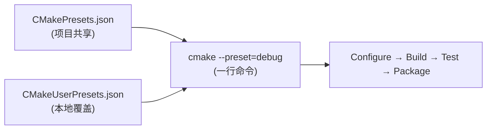
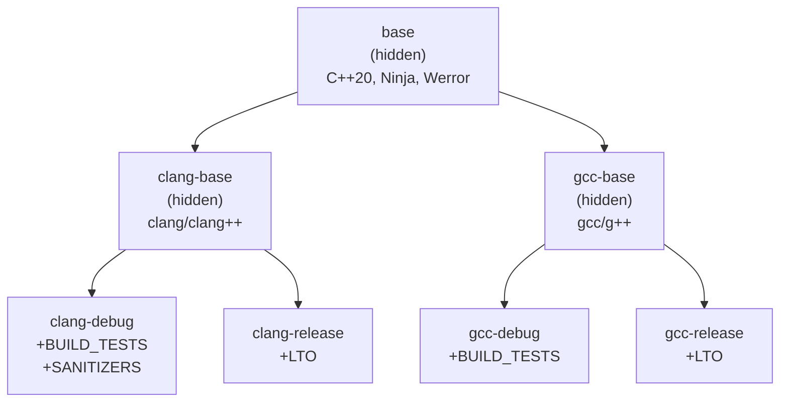

# CMakePresets.json — 标准化构建配置

> 所属计划: [[plan|CMake 深度学习计划]]
> 预计耗时: 45 分钟
> 前置知识: [[04-variables-cache-and-scope|04 变量、缓存与作用域]]、[[08-generator-expressions|08 生成器表达式]]

---

## 1. 概念讲解

### 问题：CMake 命令行参数地狱

在没有 Presets 之前，一个典型的 CMake 配置命令长这样：

```bash
cmake -S . -B build/debug \
  -G "Ninja Multi-Config" \
  -DCMAKE_C_COMPILER=clang \
  -DCMAKE_CXX_COMPILER=clang++ \
  -DCMAKE_BUILD_TYPE=Debug \
  -DBUILD_TESTS=ON \
  -DENABLE_SANITIZERS=ON \
  -DCMAKE_EXPORT_COMPILE_COMMANDS=ON
```

每次切换配置都要记住所有参数。团队协作时，不同成员可能使用不同的参数组合，导致"在我机器上能构建"的问题。

### 什么是 CMakePresets.json？

CMake Presets 系统（CMake 3.19+）通过 JSON 文件将构建配置**声明式地**记录下来。同一个 `CMakePresets.json` 文件可以被团队共享、被 CI 系统解析、被 IDE 读取。

核心理念：**配置即代码**——构建配置和源代码一起存入版本控制，消除"记不住命令行参数"和"团队成员构建方式不一致"的问题。



### 两类 Preset 文件

| 文件 | 用途 | 版本控制 | 优先级 |
|------|------|----------|--------|
| `CMakePresets.json` | 项目级共享配置 | 提交到 Git | 低（被 User 覆盖） |
| `CMakeUserPresets.json` | 开发者本地配置 | `.gitignore` | 高（覆盖项目预设） |

> [!warning] 务必忽略 User Presets
> `CMakeUserPresets.json` **必须**加入 `.gitignore`。它包含开发者本地的路径、密钥、个人偏好——不应该提交到仓库。

CMake 在搜索 Preset 文件时，会依次向上遍历目录树（从当前目录到根目录），找到的第一个 `CMakePresets.json` 就是项目级预设。`CMakeUserPresets.json` 必须与 `CMakePresets.json` 位于同一目录。

### 一个最简单的例子

```json
{
  "version": 10,
  "cmakeMinimumRequired": {
    "major": 3,
    "minor": 24,
    "patch": 0
  },
  "configurePresets": [
    {
      "name": "default",
      "displayName": "默认配置",
      "description": "使用系统默认编译器的 Debug 构建",
      "binaryDir": "${sourceDir}/build/${presetName}",
      "cacheVariables": {
        "CMAKE_BUILD_TYPE": "Debug"
      }
    }
  ]
}
```

使用方式：

```bash
# 列出所有可用的 preset
cmake --list-presets

# 使用指定 preset 进行配置
cmake --preset=default

# 构建
cmake --build --preset=default
```

> [!tip] 一行替代一堆参数
> `cmake --preset=default` 替代了 `-S`、`-B`、`-G`、`-D` 等所有参数——全部由 preset 定义。

---

### Preset 版本历史

CMake Presets 的 schema 版本从 v1 演进到 v10，每个版本新增了重要特性。`"version"` 字段告诉 CMake 你依赖的最高版本特性：

| 版本 | CMake 要求 | 新增特性 |
|:-----|:-----------|:---------|
| 1 | 3.19 | 基础 `configurePresets`：`name`、`binaryDir`、`generator`、`cacheVariables`、`environment` |
| 2 | 3.20 | `buildPresets`、`testPresets`、`inherits`（继承）、宏展开 `${sourceDir}` 等 |
| 3 | 3.21 | `condition`（条件启用）、`toolchainFile` |
| 4 | 3.23 | `include`（跨文件引用）、`vendor`（IDE 扩展） |
| 5 | 3.24 | `packagePresets`、条件中的 `matches` 和 `inList` |
| 6 | 3.25 | `workflowPresets`（工作流预设） |
| 7 | 3.26 | 配置预设中支持 `trace`、`warnings`、`debugOutput` 字段 |
| 8 | 3.27 | Build preset 中 `jobs` 字段、test preset 中 `stopOnFailure` |
| 9 | 3.28 | `$comment` 字段支持（JSON 注释）、宏展开 `${hostSystemName}` |
| 10 | 3.29 | 测试预设 `execution` 对象增强、`filter` 中 `includeLabel`/`excludeLabel` |

> [!note] 关于 `$comment`（v10 实际是 v9 引入）
> `$comment` 字段在 v9（CMake 3.28）引入。由于 JSON 标准不支持注释，CMake 通过特殊的 `$comment` key 实现"文档化注释"——它是一个在任何对象中合法但被 CMake 忽略的字符串字段。

`"cmakeMinimumRequired"` 字段独立于 `"version"`：它指定运行这些 preset 所需的最低 CMake 版本。

---

## 2. 核心概念详解

### 2.1 Configure Presets（配置预设）

Configure Preset 是最核心的预设类型，定义如何**配置**项目（即 `cmake -S . -B build <...>` 的参数化）。

#### 基础字段

```json
{
  "version": 10,
  "configurePresets": [
    {
      "name": "my-preset",
      "displayName": "我的配置",
      "description": "一段描述性文字，显示在 --list-presets 中",
      "generator": "Ninja",
      "binaryDir": "${sourceDir}/build/my-preset",
      "cacheVariables": {
        "CMAKE_BUILD_TYPE": "Release",
        "CMAKE_CXX_STANDARD": "20",
        "BUILD_SHARED_LIBS": "ON"
      },
      "environment": {
        "CC": "clang",
        "CXX": "clang++"
      }
    }
  ]
}
```

| 字段 | 类型 | 说明 |
|------|------|------|
| `name` | string (必填) | 预设唯一标识，用于 `--preset=<name>` |
| `displayName` | string | 人类可读名称，显示在 IDE 和 `--list-presets` 输出中 |
| `description` | string | 详细描述文本 |
| `generator` | string | CMake 生成器：`"Ninja"`、`"Unix Makefiles"`、`"Visual Studio 17 2022"`、`"Xcode"` 等 |
| `binaryDir` | string | 构建目录路径，支持宏展开 |
| `cacheVariables` | object | 等价于 `-D` 参数传递给 CMake 的缓存变量 |
| `environment` | object | 配置阶段的环境变量 |
| `inherits` | string/array | 继承其他 preset 的配置 |
| `condition` | object | 条件对象，决定该 preset 是否在当前平台上可用 |
| `toolchainFile` | string | 工具链文件路径 |
| `vendor` | object | IDE 特定扩展数据 |

> [!warning] `binaryDir` 不能省略
> 每个 configure preset 必须指定 `binaryDir`（或从继承链中获得）。没有它，CMake 不知道把构建输出放在哪里。

#### 多配置生成器 vs 单配置生成器

多配置生成器（Visual Studio、Xcode、Ninja Multi-Config）在一个构建目录中同时支持 Debug / Release / RelWithDebInfo：

```json
{
  "name": "vs2022",
  "generator": "Visual Studio 17 2022",
  "binaryDir": "${sourceDir}/build/vs2022",
  "cacheVariables": {
    "CMAKE_CXX_STANDARD": "20"
  }
}
```

单配置生成器（Ninja、Unix Makefiles）则每个 preset 一个构建目录，通过 `CMAKE_BUILD_TYPE` 区分：

```json
{
  "name": "ninja-debug",
  "generator": "Ninja",
  "binaryDir": "${sourceDir}/build/ninja-debug",
  "cacheVariables": {
    "CMAKE_BUILD_TYPE": "Debug"
  }
}
```

### 2.2 Build Presets（构建预设）

Build Preset 定义如何**构建**已配置的项目（即 `cmake --build <dir> <...>` 的参数化），并关联到某个 configure preset：

```json
{
  "buildPresets": [
    {
      "name": "debug-build",
      "displayName": "构建 Debug",
      "configurePreset": "debug",
      "configuration": "Debug",
      "targets": ["my_app", "my_tests"],
      "nativeToolOptions": ["-j8"]
    }
  ]
}
```

| 字段 | 说明 |
|------|------|
| `configurePreset` | 关联的 configure preset（不指定则使用上一个 configure 的 preset） |
| `configuration` | 多配置生成器时指定要构建的配置（如 `"Debug"`） |
| `targets` | 要构建的 target 名称列表（等价于 `cmake --build . --target <t1> <t2>`） |
| `nativeToolOptions` | 传递给原生构建工具的参数（如 `-j8` 给 Ninja/make） |
| `jobs` (v8+) | 并行编译任务数，等价于 `--parallel <N>` |
| `cleanFirst` (v6+) | 构建前先清理 |

使用方式：

```bash
# 先用 configure preset 配置
cmake --preset=debug
# 再用 build preset 构建
cmake --build --preset=debug-build
```

> [!tip] Build preset 不指定 configurePreset 时
> 如果不指定，CMake 使用上一次 `cmake --preset=<name>` 时使用的 configure preset。但**显式指定总是更可靠**。

### 2.3 Test Presets（测试预设）

Test Preset 定义如何**运行测试**（即 `ctest <...>` 的参数化）：

```json
{
  "testPresets": [
    {
      "name": "debug-tests",
      "configurePreset": "debug",
      "output": {
        "outputOnFailure": true,
        "verbosity": "default"
      },
      "execution": {
        "stopOnFailure": false,
        "parallel": 4
      },
      "filter": {
        "include": {
          "name": "integration"
        },
        "exclude": {
          "label": "slow"
        }
      }
    }
  ]
}
```

| 字段 | 说明 |
|------|------|
| `output.outputOnFailure` | 测试失败时输出详细信息 |
| `execution.parallel` | 并行运行测试的进程数 |
| `execution.stopOnFailure` (v8+) | 第一个失败后停止 |
| `filter.include.name` | 按名称正则匹配包含的测试 |
| `filter.include.label` (v10+) | 按标签匹配包含的测试 |
| `filter.exclude.name` / `exclude.label` | 按名称/标签排除 |

使用方式：

```bash
ctest --preset=debug-tests
```

### 2.4 Package Presets（打包预设）

Package Preset 定义如何**打包**项目（即 `cpack <...>` 的参数化），在 CMake 3.24 (v5) 中引入：

```json
{
  "packagePresets": [
    {
      "name": "release-package",
      "configurePreset": "release",
      "generators": ["TGZ", "DEB"],
      "packageName": "myapp",
      "packageVersion": "1.0.0",
      "variables": {
        "CPACK_DEBIAN_PACKAGE_MAINTAINER": "team@example.com"
      }
    }
  ]
}
```

| 字段 | 说明 |
|------|------|
| `generators` | CPack 生成器列表：`"TGZ"`、`"DEB"`、`"RPM"`、`"NSIS"` 等 |
| `packageName` | 包名称，等价于 `CPACK_PACKAGE_NAME` |
| `packageVersion` | 包版本，等价于 `CPACK_PACKAGE_VERSION` |
| `variables` | 额外的 CPack 变量 |

使用方式：

```bash
cpack --preset=release-package
```

### 2.5 Workflow Presets（工作流预设）

Workflow Preset（v6, CMake 3.25+）将 configure → build → test → package 串联为一条流水线：

```json
{
  "workflowPresets": [
    {
      "name": "ci-pipeline",
      "displayName": "CI 完整流水线",
      "steps": [
        { "type": "configure", "name": "debug" },
        { "type": "build", "name": "debug-build" },
        { "type": "test", "name": "debug-tests" },
        { "type": "package", "name": "debug-package" }
      ]
    }
  ]
}
```

| `type` | 说明 |
|--------|------|
| `"configure"` | 运行一个 configure preset |
| `"build"` | 运行一个 build preset |
| `"test"` | 运行一个 test preset |
| `"package"` | 运行一个 package preset |

使用方式：

```bash
cmake --workflow --preset=ci-pipeline
```

> [!tip] Workflow 的任何步骤失败会立即终止
> 这是 CI 场景下的预期行为——如果配置失败，后续的构建和测试没有意义。

---

### 2.6 Preset 继承 (`inherits`)

继承是 Preset 系统中最强大的设计模式。一个 preset 可以继承一个或多个父 preset 的设置：

```json
{
  "configurePresets": [
    {
      "name": "base",
      "hidden": true,
      "generator": "Ninja",
      "binaryDir": "${sourceDir}/build/${presetName}",
      "cacheVariables": {
        "CMAKE_CXX_STANDARD": "20",
        "CMAKE_EXPORT_COMPILE_COMMANDS": "ON"
      }
    },
    {
      "name": "debug",
      "inherits": "base",
      "displayName": "Debug 构建",
      "cacheVariables": {
        "CMAKE_BUILD_TYPE": "Debug",
        "ENABLE_SANITIZERS": "ON"
      }
    },
    {
      "name": "release",
      "inherits": "base",
      "displayName": "Release 构建",
      "cacheVariables": {
        "CMAKE_BUILD_TYPE": "Release",
        "CMAKE_INTERPROCEDURAL_OPTIMIZATION": "ON"
      }
    }
  ]
}
```

继承规则：
- 子 preset 的字段**合并**父 preset 的同名字段（对象深度合并，数组拼接）
- 子 preset 的同名 key **覆盖**父 preset 的值
- 可以继承多个 preset：`"inherits": ["base", "clang-toolchain"]`
- 通过设置 `"hidden": true` 将 base preset 隐藏——它只是内部模板，不出现在 `--list-presets` 中

### 2.7 条件对象 (`condition`)

Condition（v3, CMake 3.21+）让 preset 根据平台/环境决定是否可用：

```json
{
  "name": "linux-clang",
  "condition": {
    "type": "equals",
    "lhs": "${hostSystemName}",
    "rhs": "Linux"
  }
}
```

| 条件类型 | 说明 | 示例 |
|----------|------|------|
| `equals` | 左值等于右值 | 平台判断 |
| `notEquals` | 左值不等于右值 | 非 Windows 平台 |
| `matches` (v5+) | 正则匹配 | `"lhs": "${hostSystemName}", "rhs": "^(Windows|Darwin)$"` |
| `inList` (v5+) | 左值在列表中 | `"lhs": "${hostSystemName}", "rhs": ["Linux", "Darwin"]` |

可用的条件变量：
- `${hostSystemName}` — 操作系统名：`"Windows"`、`"Linux"`、`"Darwin"`
- `${hostSystemProcessor}` — 处理器架构：`"AMD64"`、`"ARM64"`
- `${hostSystemVersion}` — 操作系统版本号
- `$env{<VAR>}` — 环境变量值
- `const` — 内置常量字符串

复杂的条件示例——只在 macOS ARM64 上启用：

```json
{
  "name": "macos-arm64",
  "condition": {
    "type": "allOf",
    "conditions": [
      {
        "type": "equals",
        "lhs": "${hostSystemName}",
        "rhs": "Darwin"
      },
      {
        "type": "equals",
        "lhs": "${hostSystemProcessor}",
        "rhs": "ARM64"
      }
    ]
  }
}
```

条件组合算子：
- `"allOf"` — 所有子条件都满足（AND）
- `"anyOf"` — 任一子条件满足（OR）
- `"not"` — 对子条件取反

> [!warning] 条件不满足的 preset 不会显示
> 在 macOS 上运行 `cmake --list-presets` 时，带 `"condition": { "equals": "${hostSystemName}", "Linux" }` 的 preset 不会出现。这不是 bug——它对该平台不可用，所以不应展示。

### 2.8 宏展开

Preset 中以下宏会被动态替换：

| 宏 | 展开为 | 示例值 |
|----|--------|--------|
| `${sourceDir}` | 源代码根目录（`CMakePresets.json` 所在目录） | `/home/user/project` |
| `${sourceDirName}` | 源代码根目录的名称部分 | `project` |
| `${presetName}` | 当前 preset 的 `name` 字段 | `debug` |
| `${generator}` | 当前 preset 的生成器名称 | `Ninja` |
| `${hostSystemName}` | 操作系统名称 | `Windows`、`Linux`、`Darwin` |
| `${hostSystemProcessor}` | 处理器架构 | `AMD64`、`ARM64` |
| `${hostSystemVersion}` | 操作系统版本 | `10.0.26100` |
| `$env{<VAR>}` | 环境变量值 | `$env{HOME}` → `/home/user` |
| `$penv{<VAR>}` | 缓存变量值（仅在特定上下文中可用） | `$penv{PATH}` |

典型用法：

```json
{
  "binaryDir": "${sourceDir}/build/${presetName}",
  "toolchainFile": "${sourceDir}/cmake/toolchains/${hostSystemName}.cmake",
  "cacheVariables": {
    "USER_HOME": "$env{HOME}"
  }
}
```

> [!tip] `$penv{}` 的使用场景
> `$penv{PATH}` 用于在 Windows 上引用 program-files 环境变量（`ProgramFiles(x86)` 或 `ProgramW6432`），而 `$env{PATH}` 引用进程自身的 PATH。普通场景用 `$env{}` 就够了。

### 2.9 `include` — 拆分大型 Preset 文件

Include（v4, CMake 3.23+）允许将一个 `CMakePresets.json` 拆分为多个文件：

```json
{
  "version": 10,
  "include": [
    "cmake/presets/configure.json",
    "cmake/presets/build.json",
    "cmake/presets/test.json",
    "cmake/presets/workflow.json"
  ]
}
```

被引用的文件**只包含对应类型的数组**（如 `"configurePresets"`），不需要外层 wrapper。CMake 会将所有 include 文件的内容合并到主文件中。

> [!warning] Include 的文件路径相对于主文件所在目录
> 而且被 include 的文件不能再使用 `include`——不支持嵌套。

### 2.10 `vendor` — IDE 特定扩展

Vendor 字段（v4, CMake 3.23+）是 IDE 厂商注入自定义元数据的命名空间：

```json
{
  "vendor": {
    "microsoft.com/VisualStudioSettings/CMake/1.0": {
      "intelliSenseMode": "linux-clang-x64",
      "hostOS": ["Linux"]
    },
    "jetbrains.com/CLion/1.0": {
      "buildBeforeRun": true
    }
  }
}
```

- 键名按约定使用 `域名/产品名/版本` 格式
- CMake 本身**不解析** vendor 内容——它只是透传给 IDE
- Visual Studio、VS Code、CLion 等 IDE 通过 vendor 读取项目特定的 IDE 设置

---

## 3. 代码示例

### 示例 1：完整的 Debug/Release Preset 配置

创建一个可运行的多配置项目。项目结构：

```
example1/
├── CMakeLists.txt
├── CMakePresets.json
├── src/
│   └── main.cpp
└── tests/
    └── test_main.cpp
```

**CMakeLists.txt**：

```cmake
cmake_minimum_required(VERSION 3.24)
project(PresetDemo VERSION 1.0.0 LANGUAGES CXX)

# 默认 C++ 标准
set(CMAKE_CXX_STANDARD 20)
set(CMAKE_CXX_STANDARD_REQUIRED ON)

# 主程序
add_executable(demo_app src/main.cpp)

# 测试（可选）
option(BUILD_TESTS "Build tests" OFF)
if(BUILD_TESTS)
    enable_testing()
    add_executable(demo_tests tests/test_main.cpp)
    add_test(NAME DemoTest COMMAND demo_tests)
endif()

# Sanitizers（可选）
option(ENABLE_SANITIZERS "Enable address sanitizer" OFF)
if(ENABLE_SANITIZERS)
    add_compile_options(-fsanitize=address -fno-omit-frame-pointer)
    add_link_options(-fsanitize=address)
endif()
```

**CMakePresets.json**：

```json
{
  "version": 10,
  "cmakeMinimumRequired": {
    "major": 3,
    "minor": 24,
    "patch": 0
  },
  "configurePresets": [
    {
      "name": "debug",
      "displayName": "Debug 配置",
      "description": "Debug 构建，启用测试和 Address Sanitizer",
      "generator": "Ninja",
      "binaryDir": "${sourceDir}/build/debug",
      "cacheVariables": {
        "CMAKE_BUILD_TYPE": "Debug",
        "BUILD_TESTS": "ON",
        "ENABLE_SANITIZERS": "ON",
        "CMAKE_EXPORT_COMPILE_COMMANDS": "ON"
      }
    },
    {
      "name": "release",
      "displayName": "Release 配置",
      "description": "Release 构建，启用 LTO 优化",
      "generator": "Ninja",
      "binaryDir": "${sourceDir}/build/release",
      "cacheVariables": {
        "CMAKE_BUILD_TYPE": "Release",
        "CMAKE_INTERPROCEDURAL_OPTIMIZATION": "ON",
        "CMAKE_EXPORT_COMPILE_COMMANDS": "ON"
      }
    }
  ],
  "buildPresets": [
    {
      "name": "debug-build",
      "displayName": "构建 Debug",
      "configurePreset": "debug",
      "targets": ["demo_app", "demo_tests"]
    },
    {
      "name": "release-build",
      "displayName": "构建 Release",
      "configurePreset": "release",
      "targets": ["demo_app"]
    }
  ],
  "testPresets": [
    {
      "name": "debug-tests",
      "displayName": "运行 Debug 测试",
      "configurePreset": "debug",
      "output": {
        "outputOnFailure": true
      },
      "execution": {
        "parallel": 4
      }
    }
  ]
}
```

运行方式：

```bash
# 查看所有 preset
cmake --list-presets

# Debug: 配置 → 构建 → 测试
cmake --preset=debug
cmake --build --preset=debug-build
ctest --preset=debug-tests

# Release: 配置 → 构建
cmake --preset=release
cmake --build --preset=release-build
```

> [!tip] 为什么用 `--build --preset` 而不是 `--build build/debug`
> 使用 build preset 时，CMake 自动推断二进制目录，且可以使用 preset 中定义的 `targets`、`configuration`、`nativeToolOptions` 等设置。直接传路径会丢失这些元数据。

### 示例 2：Preset 继承 — Base Preset 模式

这是生产项目中最常用的模式——定义一个"模板"base preset，其他 preset 通过继承只声明差异：

**CMakePresets.json**：

```json
{
  "version": 10,
  "cmakeMinimumRequired": {
    "major": 3,
    "minor": 24,
    "patch": 0
  },
  "configurePresets": [
    {
      "name": "base",
      "hidden": true,
      "generator": "Ninja",
      "binaryDir": "${sourceDir}/build/${presetName}",
      "cacheVariables": {
        "CMAKE_CXX_STANDARD": "20",
        "CMAKE_CXX_STANDARD_REQUIRED": "ON",
        "CMAKE_EXPORT_COMPILE_COMMANDS": "ON",
        "CMAKE_COMPILE_WARNING_AS_ERROR": "ON"
      }
    },
    {
      "name": "clang-base",
      "hidden": true,
      "inherits": "base",
      "cacheVariables": {
        "CMAKE_C_COMPILER": "clang",
        "CMAKE_CXX_COMPILER": "clang++"
      }
    },
    {
      "name": "gcc-base",
      "hidden": true,
      "inherits": "base",
      "cacheVariables": {
        "CMAKE_C_COMPILER": "gcc",
        "CMAKE_CXX_COMPILER": "g++"
      }
    },
    {
      "name": "clang-debug",
      "inherits": "clang-base",
      "displayName": "Clang Debug",
      "cacheVariables": {
        "CMAKE_BUILD_TYPE": "Debug",
        "BUILD_TESTS": "ON",
        "ENABLE_SANITIZERS": "ON"
      }
    },
    {
      "name": "clang-release",
      "inherits": "clang-base",
      "displayName": "Clang Release",
      "cacheVariables": {
        "CMAKE_BUILD_TYPE": "Release",
        "CMAKE_INTERPROCEDURAL_OPTIMIZATION": "ON"
      }
    },
    {
      "name": "gcc-debug",
      "inherits": "gcc-base",
      "displayName": "GCC Debug",
      "cacheVariables": {
        "CMAKE_BUILD_TYPE": "Debug",
        "BUILD_TESTS": "ON"
      }
    },
    {
      "name": "gcc-release",
      "inherits": "gcc-base",
      "displayName": "GCC Release",
      "cacheVariables": {
        "CMAKE_BUILD_TYPE": "Release",
        "CMAKE_INTERPROCEDURAL_OPTIMIZATION": "ON"
      }
    }
  ],
  "buildPresets": [
    {
      "name": "build-base",
      "hidden": true,
      "nativeToolOptions": ["-j8"]
    },
    {
      "name": "clang-debug-build",
      "inherits": "build-base",
      "configurePreset": "clang-debug"
    },
    {
      "name": "clang-release-build",
      "inherits": "build-base",
      "configurePreset": "clang-release"
    },
    {
      "name": "gcc-debug-build",
      "inherits": "build-base",
      "configurePreset": "gcc-debug"
    },
    {
      "name": "gcc-release-build",
      "inherits": "build-base",
      "configurePreset": "gcc-release"
    }
  ],
  "$comment": "演示 Preset 继承模式。base/clang-base/gcc-base 都是 hidden 的模板预设"
}
```

继承链可视化：



`cmake --list-presets` 输出（hidden preset 不显示）：

```
Available configure presets:

  "clang-debug"   - Clang Debug
  "clang-release" - Clang Release
  "gcc-debug"     - GCC Debug
  "gcc-release"   - GCC Release
```

### 示例 3：条件 Presets — 跨平台适配

根据不同操作系统自动选择编译器或平台特性：

**CMakePresets.json**：

```json
{
  "version": 10,
  "cmakeMinimumRequired": {
    "major": 3,
    "minor": 24,
    "patch": 0
  },
  "configurePresets": [
    {
      "name": "cross-platform-base",
      "hidden": true,
      "binaryDir": "${sourceDir}/build/${presetName}",
      "cacheVariables": {
        "CMAKE_CXX_STANDARD": "20",
        "CMAKE_EXPORT_COMPILE_COMMANDS": "ON"
      }
    },
    {
      "name": "default",
      "inherits": "cross-platform-base",
      "displayName": "默认配置（自动检测平台）",
      "description": "根据当前 OS 自动选择最佳编译器",
      "condition": {
        "type": "equals",
        "lhs": "${hostSystemName}",
        "rhs": "Linux"
      },
      "generator": "Ninja",
      "cacheVariables": {
        "CMAKE_BUILD_TYPE": "Debug",
        "CMAKE_C_COMPILER": "gcc",
        "CMAKE_CXX_COMPILER": "g++"
      }
    },
    {
      "name": "default",
      "inherits": "cross-platform-base",
      "displayName": "默认配置（自动检测平台）",
      "description": "根据当前 OS 自动选择最佳编译器",
      "condition": {
        "type": "equals",
        "lhs": "${hostSystemName}",
        "rhs": "Darwin"
      },
      "generator": "Ninja",
      "cacheVariables": {
        "CMAKE_BUILD_TYPE": "Debug",
        "CMAKE_C_COMPILER": "clang",
        "CMAKE_CXX_COMPILER": "clang++"
      }
    },
    {
      "name": "default",
      "inherits": "cross-platform-base",
      "displayName": "默认配置（自动检测平台）",
      "description": "使用 Visual Studio 构建",
      "condition": {
        "type": "equals",
        "lhs": "${hostSystemName}",
        "rhs": "Windows"
      },
      "generator": "Visual Studio 17 2022",
      "architecture": {
        "value": "x64",
        "strategy": "set"
      }
    },
    {
      "name": "ci-coverage",
      "inherits": "cross-platform-base",
      "displayName": "CI 覆盖率构建",
      "description": "Linux GCC 覆盖率专用",
      "condition": {
        "type": "allOf",
        "conditions": [
          {
            "type": "equals",
            "lhs": "${hostSystemName}",
            "rhs": "Linux"
          },
          {
            "type": "equals",
            "lhs": "$env{CI}",
            "rhs": "true"
          }
        ]
      },
      "generator": "Ninja",
      "cacheVariables": {
        "CMAKE_BUILD_TYPE": "Debug",
        "ENABLE_COVERAGE": "ON",
        "BUILD_TESTS": "ON"
      }
    },
    {
      "name": "wasm",
      "inherits": "cross-platform-base",
      "displayName": "WebAssembly 构建",
      "description": "Emscripten 目标，仅在工具链可用时显示",
      "condition": {
        "type": "notEquals",
        "lhs": "$env{EMSDK}",
        "rhs": ""
      },
      "toolchainFile": "$env{EMSDK}/upstream/emscripten/cmake/Modules/Platform/Emscripten.cmake",
      "generator": "Ninja",
      "cacheVariables": {
        "CMAKE_BUILD_TYPE": "Release"
      }
    }
  ],
  "$comment": "跨平台示例：同名 preset 'default' 在不同平台上展示不同配置；ci-coverage 仅在 CI 环境中显示"
}
```

关键观察：
- 三个同名的 `"default"` preset 各有不同的 `condition`——在 Linux 上显示 GCC 版本，在 macOS 上显示 Clang 版本，在 Windows 上显示 Visual Studio 版本。同一时刻只有一个可用。
- `"ci-coverage"` 使用 `"allOf"` 确保 `$env{CI}` 环境变量存在时才显示
- `"wasm"` 检查 Emscripten SDK 环境变量，避免在不支持 WASM 的机器上出现

---

## 4. 练习

### 练习 1：创建 Debug / Release / RelWithDebInfo 配置

创建以下目录结构和一个完整的 `CMakeLists.txt` + `CMakePresets.json`：

```
project/
├── CMakeLists.txt
├── CMakePresets.json
└── src/
    └── main.cpp
```

要求：
1. `CMakePresets.json` 包含三个 configure preset：`debug`、`release`、`relwithdebinfo`
2. 使用 `inherits` 从一个 `base`（hidden）preset 继承通用设置
3. `binaryDir` 使用 `${sourceDir}/build/${presetName}` 模式
4. Debug 启用 Address Sanitizer，Release 启用 LTO
5. Debug 和 RelWithDebInfo 启用测试构建
6. 对应的 build preset 和 test preset

> [!tip] 提示
> 从示例 2 的 base preset 模式开始，只需修改 `CMAKE_BUILD_TYPE` 和特性开关。

### 练习 2：CMakeUserPresets.json 本地覆盖

在上一个练习的基础上，创建 `CMakeUserPresets.json`：

1. 添加一个 user-specific preset，指定你本机的编译器路径（如 `"CMAKE_CXX_COMPILER": "/usr/local/bin/g++-14"`）
2. 覆盖 debug preset 的 `binaryDir` 到你偏好的路径（如 `/tmp/build/${presetName}`）
3. 确保 user preset 的优先级高于 project preset

思考：哪些字段适合放在 `CMakeUserPresets.json` 中？

### 练习 3：Workflow Preset 串联流水线

在练习 1 的项目基础上，添加一个 `ci-pipeline` workflow preset：

1. 步骤顺序：configure → build → test
2. 使用 debug 配置
3. 添加第二个 workflow：`release-package-pipeline`，顺序：configure → build → test → package
4. 在 package 步骤中指定生成 `TGZ` 格式的包

思考：如果一个步骤失败，workflow 会如何处理？

---

## 5. 扩展阅读

- [CMake 官方文档 — cmake-presets(7)](https://cmake.org/cmake/help/latest/manual/cmake-presets.7.html) — preset schema 的权威参考
- [CMake 官方博客 — CMake Presets 介绍](https://kitware.com/cmake-presets/) — Kitware 的原始介绍文章
- [Craig Scott — Professional CMake (第 24 章)](https://crascit.com/professional-cmake/) — 这本书的 preset 章节是最详尽的第三方资料
- [Microsoft — 在 Visual Studio 中配置 CMake Presets](https://learn.microsoft.com/en-us/cpp/build/cmake-presets-vs) — VS 的 vendor 字段使用指南
- [CLion — CMake Presets 支持](https://www.jetbrains.com/help/clion/cmake-presets.html) — JetBrains IDE 的 preset 集成

---

## 常见陷阱

- **Version 设置过低**。如果你的 `CMakePresets.json` 用了 build presets 但 `"version": 1`，CMake 会报 unknown field 错误。**解决**：始终将 `"version"` 设为你实际用到的最高特性版本（至少 5 用于 build/test preset，6 用于 workflow，9 用于 `$comment`）。

- **忘记 `.gitignore` 中的 `CMakeUserPresets.json`**。一旦提交到版本控制，其他开发者的 IDE 可能加载你的本地路径造成混乱。**解决**：在项目 `.gitignore` 中明确添加 `CMakeUserPresets.json`。

- **Preset 和 `-D` 参数混用**。`cmake --preset=debug -DCMAKE_BUILD_TYPE=Release` 会导致缓存变量冲突——preset 设置的 `Debug` 又被命令行覆盖。**解决**：如果你用 preset，就让 preset 完全控制配置。需要临时覆盖时，使用 `CMakeUserPresets.json` 继承原 preset 并修改需要改的变量。

- **`binaryDir` 忘记用 `${presetName}`**。所有 preset 写到同一个 `build/` 目录会导致不同配置互相覆盖。**解决**：始终使用 `${sourceDir}/build/${presetName}` 模式。

- **认为 `displayName` 不重要**。当有 20 个 preset 时，`--list-presets` 的输出如果没有清晰的 `displayName`，团队会困惑。**解决**：每个 preset 至少有 `displayName`，描述它是什么配置。`description` 则提供更多上下文。

- **条件预设可访问性误区**。在 Linux 上创建了一个 `"condition": { "type": "equals", "lhs": "${hostSystemName}", "rhs": "Windows" }` 的 preset，然后找不到它——这不是 bug。**解决**：理解 condition 会让不满足条件的 preset 完全不可见。跨平台项目应该为每个目标平台创建对应的 preset（可用同名+不同 condition）。

- **Include 路径写错**。`"include": ["presets/build.json"]` 的路径是相对于 `CMakePresets.json` 所在目录的，不是相对于 CMake 的工作目录。**解决**：始终以 `CMakePresets.json` 的位置为基准写路径。

- **Inherits 循环依赖**。A inherits B, B inherits A——CMake 会检测并报错。**解决**：保持继承链为 DAG（有向无环图），base preset 永远在最底层。

- **JSON 语法错误导致整个文件被忽略**。一个逗号位置错误或缺少引号，整个 preset 系统静默失效。**解决**：使用 JSON schema 验证（大多数编辑器支持），或在 CI 中运行 `cmake --list-presets` 并检查返回值。
