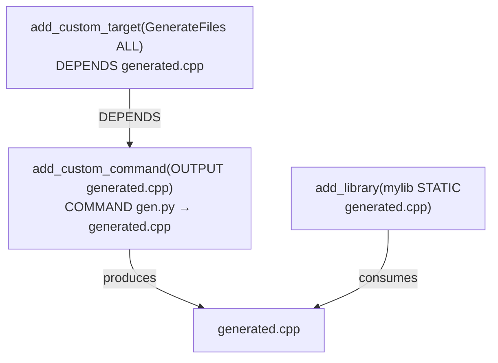

> 所属计划: [[plan|CMake 深度学习计划]]
> 预计耗时: 50 分钟
> 前置知识: [[02-cmakelists-structure-and-commands|CMakeLists.txt 结构与核心命令]], [[08-generator-expressions|生成器表达式]]

---

## 1. 概念讲解

### 为什么需要自定义命令？

CMake 的核心职责是**描述构建规则**——哪些源文件编译成哪些 target。但实际项目中总有 CMake 内置抽象覆盖不到的场景：

- 编译前需要从一个模板生成 `.cpp` 文件（如 protobuf 的 `.proto` → `.pb.cc`）
- 构建完成后需要执行后处理（如拷贝 DLL、对二进制签名、运行打包脚本）
- 需要调用 Python、shell 脚本或其他外部工具作为构建流程的一部分
- 需要在特定时机触发任意操作：链接前、编译前、构建后

CMake 提供了三个核心工具来解决这些问题：

| 命令 | 时机 | 用途 |
|------|------|------|
| `add_custom_command(OUTPUT ...)` | 构建时 | 生成文件（其他 target 可以依赖这些文件） |
| `add_custom_command(TARGET ...)` | 构建时 | 在 target 构建的特定时间点执行操作 |
| `add_custom_target()` | 构建时 | 创建一个总是"过期"的逻辑 target，用于驱动自定义命令 |

此外，`configure_file()` 和 `file(GENERATE ...)` 在**配置/生成阶段**处理文件生成，属于另一个时间维度——我们也会在本教程中覆盖。

### 核心思想

CMake 构建流程分为三个阶段：


- **配置阶段**：CMake 读取 `CMakeLists.txt`，填充变量和属性，执行 `configure_file()` 和 `execute_process()`
- **生成阶段**：CMake 将内部构建图写成本地构建工具（Make/Ninja/MSBuild）的输入文件，此时 `file(GENERATE ...)` 和生成器表达式求值
- **构建阶段**：实际的编译、链接和 `add_custom_command`/`add_custom_target` 执行

混淆这三个阶段的执行时机是最常见的坑——我们会在常见陷阱中详细展开。

---

### `add_custom_command()` 的两种形式

#### 形式一：OUTPUT —— 生成文件

```cmake
add_custom_command(
    OUTPUT  output1 [output2 ...]
    COMMAND command1 [ARGS] [args1...]
    [COMMAND command2 [ARGS] [args2...] ...]
    [MAIN_DEPENDENCY depend]
    [DEPENDS [depends...]]
    [BYPRODUCTS [files...]]
    [IMPLICIT_DEPENDS <lang1> dependfile1 ...]
    [WORKING_DIRECTORY dir]
    [COMMENT comment]
    [DEPFILE depfile]
    [JOB_POOL pool_name]
    [VERBATIM] [APPEND] [USES_TERMINAL]
    [COMMAND_EXPAND_LISTS]
)
```

这是**定义一条生成规则**：当 OUTPUT 指定的文件不存在或过期时，执行 COMMAND 来生成它们。这条规则本身不创建任何 target——它只是一个"配方"。

**关键点**：OUTPUT 指定的文件必须被某个 target（或另一个 custom_command）作为依赖引用，否则这条规则永远不会被执行。CMake 不会无缘无故地执行它。

> [!tip] 类比
> 把 `add_custom_command(OUTPUT)` 想象成 Makefile 中的模式规则：它说"如果你需要 `output.h`，这样做就能得到它"，但只有有人需要 `output.h` 时才会执行。

#### 形式二：TARGET —— 构建事件

```cmake
add_custom_command(
    TARGET <target>
    PRE_BUILD | PRE_LINK | POST_BUILD
    COMMAND command1 [ARGS] [args1...]
    [COMMAND command2 [ARGS] [args2...] ...]
    [BYPRODUCTS [files...]]
    [WORKING_DIRECTORY dir]
    [COMMENT comment]
    [VERBATIM] [USES_TERMINAL]
    [COMMAND_EXPAND_LISTS]
)
```

这是**在已有 target 的构建过程中插入操作**：

- `PRE_BUILD`：在 target 的任何编译发生之前执行（Visual Studio 生成器会将其映射为 PreBuildEvent；Makefile/Ninja 生成器中它在所有编译之前执行，但仅当 target 需要构建时）
- `PRE_LINK`：在所有源文件编译完成之后、链接之前执行。适合需要修改目标文件或生成链接器脚本的场景
- `POST_BUILD`：在链接完成之后（或者对于没有链接步骤的 target，在所有编译完成后）执行。最常用的形式

> [!warning] PRE_BUILD 与 Ninja 的微妙之处
> 在 Ninja 生成器中，`PRE_BUILD` 只在 target 确实需要重新构建时才运行。如果所有源文件都是最新的，`PRE_BUILD` 不会触发。如果你需要**无条件**执行一个操作，请使用 `add_custom_target()`。

---

### `add_custom_target()` —— 总是过期的目标

```cmake
add_custom_target(
    Name [ALL]
    [command1 [ARGS] [args1...]]
    [COMMAND command2 [ARGS] [args2...] ...]
    [DEPENDS [depends...]]
    [BYPRODUCTS [files...]]
    [WORKING_DIRECTORY dir]
    [COMMENT comment]
    [JOB_POOL pool_name]
    [VERBATIM] [USES_TERMINAL]
    [COMMAND_EXPAND_LISTS]
    [SOURCES src1 [src2...]]
)
```

`add_custom_target()` 创建一个**自定义 target**，它：

1. **总是被视为过期**（out-of-date）：每次执行 `cmake --build . --target <name>` 时都会运行
2. 除非指定了 `ALL` 关键字，否则不会被默认构建（`cmake --build .` 不会构建它，需要显式指定 target 名）
3. 通过 `DEPENDS` 可以依赖文件或其他 target

**典型用途**：

- 驱动一组 `add_custom_command(OUTPUT)` 规则（自定义 target 依赖这些 OUTPUT 文件，从而触发它们生成）
- 执行不需要产生文件的批量任务（如运行代码格式化、文档生成、清理）
- 作为 `all` target 的依赖（加 `ALL` 关键字），确保每次构建都执行

---

### 依赖链：custom_target → custom_command(OUTPUT) → 消费 target

这是代码生成的标准模式：



工作流程：

1. `mylib` 需要 `generated.cpp` 来编译
2. CMake 发现 `generated.cpp` 是由 `add_custom_command(OUTPUT ...)` 生成的
3. CMake 在编译 `mylib` 的源文件之前，先执行 custom_command 来生成 `generated.cpp`
4. `GenerateFiles` 这个 custom_target 直接依赖 `generated.cpp`，所以构建它也会触发生成

**不需要显式的 `add_custom_target`**！只要某个 library/executable 的源文件列表里包含了 OUTPUT 文件，CMake 就会自动建立依赖关系。`add_custom_target` 主要用于提供可显式调用的构建入口。

---

### DEPENDS 关键字：显式文件依赖

`DEPENDS` 告诉 CMake：当指定的文件发生变化时，命令需要重新执行。

```cmake
add_custom_command(
    OUTPUT generated.cpp
    COMMAND python ${CMAKE_SOURCE_DIR}/scripts/gen_code.py
            -i ${CMAKE_SOURCE_DIR}/schema.json
            -o generated.cpp
    DEPENDS ${CMAKE_SOURCE_DIR}/scripts/gen_code.py
            ${CMAKE_SOURCE_DIR}/schema.json
)
```

依赖类型：

- **文件路径**：当文件的时间戳变化时触发重新生成
- **CMake target 名**：自动解析为 target 的输出文件（如可执行文件、库文件）。这相当于依赖 target 的产物
- **另一个 custom_command 的 OUTPUT**：形成命令链

> [!tip] MAIN_DEPENDENCY vs DEPENDS
> `MAIN_DEPENDENCY` 可以指定一个"主要"依赖文件。它在 Visual Studio 中会被用来设置源文件的"Custom Build Tool"属性，使 IDE 能正确显示依赖关系。对于 Makefile/Ninja 生成器，`MAIN_DEPENDENCY` 和 `DEPENDS` 行为相同。

---

### VERBATIM 和 COMMAND_EXPAND_LISTS

这两个选项解决了自定义命令中最常见的跨平台问题。

#### VERBATIM —— 正确的参数引用

**绝大多数自定义命令都应该使用 `VERBATIM`**。

不加 `VERBATIM` 时，CMake 使用**旧版**的参数处理方式：它会尝试用平台特定的 shell 语法来转义参数。这在不同平台和生成器上行为不一致。

加了 `VERBATIM` 后，CMake 使用 CMake 自己的引用机制，保证参数在所有平台和生成器上正确传递。

```cmake
# 不可靠：路径中的空格、特殊字符在不同平台上行为不同
add_custom_command(
    OUTPUT out.txt
    COMMAND ${PYTHON_EXECUTABLE} script.py --input="${INPUT_DIR}/file.dat"
    # 没有 VERBATIM -- 引号处理依赖平台
)

# 可靠：CMake 负责所有转义
add_custom_command(
    OUTPUT out.txt
    COMMAND ${PYTHON_EXECUTABLE} script.py --input "${INPUT_DIR}/file.dat"
    VERBATIM
)
```

原则：**总是加 `VERBATIM`，除非你有明确的理由不加**（这几乎只存在于遗留代码中）。

#### COMMAND_EXPAND_LISTS —— 列表扩展

CMake 的列表变量用分号分隔（如 `"a;b;c"`）。在 COMMAND 中引用列表变量时，默认行为是将其作为**一个参数**传递（包含分号）。

`COMMAND_EXPAND_LISTS` 告诉 CMake：将列表展开为多个参数。

```cmake
set(EXTRA_FLAGS "-DFOO=1" "-DBAR=2")  # 这是一个列表

# 没有 COMMAND_EXPAND_LISTS：传递一个参数 "-DFOO=1;-DBAR=2"
add_custom_command(
    OUTPUT out.txt
    COMMAND my_tool ${EXTRA_FLAGS}
    VERBATIM
)

# 有 COMMAND_EXPAND_LISTS：传递两个参数 "-DFOO=1" "-DBAR=2"
add_custom_command(
    OUTPUT out.txt
    COMMAND my_tool ${EXTRA_FLAGS}
    VERBATIM
    COMMAND_EXPAND_LISTS
)
```

---

### WORKING_DIRECTORY, COMMENT, JOB_POOL

这三个选项让自定义命令更加可控：

#### WORKING_DIRECTORY

设置命令执行的工作目录：

```cmake
add_custom_command(
    OUTPUT generated.cpp
    COMMAND python ../scripts/gen.py
    WORKING_DIRECTORY ${CMAKE_BINARY_DIR}
    VERBATIM
)
```

默认工作目录是 `CMAKE_CURRENT_BINARY_DIR`。当脚本期望在特定目录下运行时使用此选项。

#### COMMENT

在构建日志中打印一条消息，替代默认的命令行回显：

```cmake
add_custom_command(
    OUTPUT generated.cpp
    COMMAND python gen.py
    COMMENT "Generating C++ code from schema..."
    VERBATIM
)
```

输出效果：

```text
[ 42%] Generating C++ code from schema...
```

#### JOB_POOL

限制自定义命令的并发度。需要先在项目层级定义 job pool：

```cmake
# 在顶层 CMakeLists.txt 中定义
set_property(GLOBAL PROPERTY JOB_POOLS compile_pool=4 link_pool=2)

add_custom_command(
    OUTPUT generated.cpp
    COMMAND heavy_codegen_tool ...
    JOB_POOL compile_pool
    VERBATIM
)
```

Ninja 生成器原生支持 job pool；Makefile 生成器只在 CMake 3.15+ 的 `Makefile` 和 `Unix Makefiles` 中有部分支持。

---

### BYPRODUCTS 关键字 —— Ninja 的副产品

当自定义命令生成的文件**超出 OUTPUT 列表**时（即"副产品"），需要声明 `BYPRODUCTS`。这对 Ninja 生成器至关重要。

```cmake
add_custom_command(
    OUTPUT generated.pb.cc generated.pb.h
    COMMAND protoc --cpp_out=. schema.proto
    BYPRODUCTS generated.pb.h
    # 即使 generated.pb.h 不在 OUTPUT 中作为主要产物，
    # 声明 BYPRODUCTS 让 Ninja 知道这个文件也会被生成，
    # 从而正确处理依赖和清理
)
```

> [!warning] 没有 BYPRODUCTS 的后果
> Ninja 使用"restat"规则来确定命令是否需要重新运行。如果 command 生成了 BYPRODUCTS 但未声明，Ninja 可能在 restat 时看到这些文件"凭空出现"而做出错误的增量构建决策——最常见的问题是：修改了输入，但 Ninja 认为 output 无需重建。

**实践规则**：如果你的命令生成 N 个文件，N-1 个在 `OUTPUT` 中，剩下的那个放在 `BYPRODUCTS` 中（也可以全部放 `OUTPUT`，这是最安全的方式）。

---

### `file(GENERATE)` —— 生成阶段的文件生成

```cmake
file(GENERATE
    OUTPUT output-file
    INPUT input-file | CONTENT content
    [CONDITION expression]
    [TARGET target]
    [NO_SOURCE_PERMISSIONS]
    [FILE_PERMISSIONS perms...]
    [NEWLINE_STYLE style]
)
```

`file(GENERATE)` 在 CMake 的**生成阶段**（而非构建阶段）创建文件。这意味着：

1. 生成器表达式（`$<...>`）此时已经被求值
2. 每个构建配置（Debug/Release）可以生成不同的内容
3. 不需要外部工具的参与——内容由 CMake 自身提供

```cmake
# 为每个配置生成不同的头文件
file(GENERATE
    OUTPUT ${CMAKE_BINARY_DIR}/generated/config.h
    CONTENT "
#pragma once
#define BUILD_TYPE \"$<CONFIG>\"
#define IS_DEBUG $<BOOL:$<CONFIG:Debug>>
"
)
```

`CONDITION` 参数可以使用生成器表达式来控制此规则是否生效。

`TARGET` 参数将生成的文件与特定 target 关联，使文件路径可以用 `$<TARGET_OBJECTS:target>` 等表达式来引用。

---

### `configure_file()` —— 配置阶段的模板替换

```cmake
configure_file(
    <input> <output>
    [NO_SOURCE_PERMISSIONS | USE_SOURCE_PERMISSIONS | FILE_PERMISSIONS <perms>...]
    [COPYONLY] [ESCAPE_QUOTES] [@ONLY]
    [NEWLINE_STYLE style]
)
```

`configure_file()` 在**配置阶段**执行，将输入文件中的 CMake 变量引用替换为实际值，然后写入输出文件。

- `@VAR@` 形式：替换 `@VAR@` 或 `${VAR}` 为变量值
- `@ONLY`：仅替换 `@VAR@` 形式，`${VAR}` 保持不变（适合生成 CMake 脚本时使用）
- `COPYONLY`：完全不进行替换，仅复制文件
- `ESCAPE_QUOTES`：对替换值中的双引号进行反斜杠转义

典型用途：生成 `config.h` 头文件，将 CMake 中探测到的配置信息传递给 C/C++ 代码。

```cmake
# config.h.in
# define PROJECT_VERSION "@PROJECT_VERSION@"
# define PROJECT_VERSION_MAJOR @PROJECT_VERSION_MAJOR@

configure_file(
    ${CMAKE_SOURCE_DIR}/config.h.in
    ${CMAKE_BINARY_DIR}/generated/config.h
    @ONLY
)
```

> [!tip] 本主题的深入内容
> `configure_file()` 的高级用法（如 `#cmakedefine`、`#cmakedefine01`、`[[protect]]` 块、`NEWLINE_STYLE` 的跨平台影响）将在 [[18-configure-file-and-code-generation|教程 18：configure_file 与代码生成]] 中详细讲解。

---

### `add_custom_command(APPEND)` —— 追加命令

当多个 `CMakeLists.txt` 文件（通过 `add_subdirectory`）或多次调用需要为同一个 OUTPUT 追加命令时：

```cmake
# 在 subdir1/CMakeLists.txt 中
add_custom_command(
    OUTPUT generated.cpp
    COMMAND echo "// part 1" > generated.cpp
    VERBATIM
)

# 在 subdir2/CMakeLists.txt 中
add_custom_command(
    OUTPUT generated.cpp
    COMMAND echo "// part 2" >> generated.cpp
    APPEND
    VERBATIM
)
```

`APPEND` 告诉 CMake：这不是一个新的规则，而是为已有的 OUTPUT 规则追加 COMMAND。注意先后次序取决于 `add_subdirectory` 的调用顺序。

---

### 生成器表达式在自定义命令中的使用

自定义命令中可以使用生成器表达式，这使得构建逻辑可以感知当前配置和目标属性。最常用的几个：

| 表达式 | 含义 | 示例场景 |
|--------|------|----------|
| `$<TARGET_FILE:tgt>` | target 的完整输出文件路径 | POST_BUILD 拷贝 DLL |
| `$<TARGET_FILE_DIR:tgt>` | target 输出文件所在目录 | 设置命令的工作目录 |
| `$<TARGET_FILE_NAME:tgt>` | target 输出文件的文件名部分 | 日志输出 |
| `$<CONFIG>` | 当前构建配置（Debug/Release） | 选择不同的脚本参数 |
| `$<BOOL:...>` | 将条件转为 `1` 或 `0` | 传递给脚本 |
| `$<TARGET_PROPERTY:tgt,prop>` | target 的任意属性值 | 读取自定义属性 |

```cmake
# POST_BUILD 示例：将 DLL 拷贝到可执行文件旁边
add_custom_command(
    TARGET my_app POST_BUILD
    COMMAND ${CMAKE_COMMAND} -E copy_if_different
        $<TARGET_FILE:mylib>
        $<TARGET_FILE_DIR:my_app>
    COMMENT "Copying mylib.dll next to my_app"
    VERBATIM
)
```

生成器表达式的详细用法参见 [[08-generator-expressions|教程 08：生成器表达式]]。

---

### 运行 Python/脚本作为构建步骤

CMake 可以通过 `add_custom_command` 和 `add_custom_target` 执行任意可执行文件。最常见的场景是运行 Python 脚本来做代码生成。

**寻找 Python 解释器**：

```cmake
find_package(Python3 REQUIRED COMPONENTS Interpreter)

add_custom_command(
    OUTPUT generated.cpp
    COMMAND Python3::Interpreter ${CMAKE_SOURCE_DIR}/scripts/gen.py
            -i schema.json -o generated.cpp
    DEPENDS ${CMAKE_SOURCE_DIR}/scripts/gen.py schema.json
    VERBATIM
)
```

> [!tip] `Python3::Interpreter` 的工作原理
> `find_package(Python3)` 导入的 `Python3::Interpreter` 是一个 IMPORTED target。在 COMMAND 中引用它时，CMake 自动展开为 Python 解释器的可执行文件路径。这比直接使用 `${Python3_EXECUTABLE}` 变量更可靠，因为它也携带了依赖信息。

---

### `execute_process()` vs `add_custom_command()` —— 两种执行时机

这是一个非常容易混淆的概念。两者都能"执行命令"，但时机关键不同：

| 特性 | `execute_process()` | `add_custom_command()` |
|------|---------------------|------------------------|
| 执行阶段 | **配置阶段**（CMake 运行时） | **构建阶段**（make/ninja 运行时） |
| 每次运行 cmake 配置时执行？ | 是 | 否——只在构建时且需要时执行 |
| 能使用生成器表达式？ | 否（配置阶段它们尚未求值） | 是 |
| 输出可被 target 使用？ | 是（输出文件在配置时已存在） | 是（输出文件在构建时生成） |
| 适合场景 | 探测系统信息、下载依赖、预处理 | 代码生成、构建后处理、文件转换 |

```cmake
# execute_process：配置时运行 git 获取版本号
execute_process(
    COMMAND git describe --tags --always --dirty
    WORKING_DIRECTORY ${CMAKE_SOURCE_DIR}
    OUTPUT_VARIABLE GIT_VERSION
    OUTPUT_STRIP_TRAILING_WHITESPACE
    ERROR_QUIET
)
# 结果立即在变量 GIT_VERSION 中可用，可以在 configure_file() 中使用

# add_custom_command：构建时生成文件
add_custom_command(
    OUTPUT version.cpp
    COMMAND ${CMAKE_COMMAND} -D SRC_DIR=${CMAKE_SOURCE_DIR}
            -D OUT_FILE=version.cpp
            -P ${CMAKE_SOURCE_DIR}/cmake/gen_version.cmake
    DEPENDS ${CMAKE_SOURCE_DIR}/cmake/gen_version.cmake
    VERBATIM
)
```

> [!warning] 常见反模式
> 用 `execute_process()` 来执行构建期才应该做的事情——比如在配置阶段调用编译器或者链接器。这会导致：
> 1. 每次 `cmake` 配置都重新执行（即使输入没有变化）
> 2. 无法被 Make/Ninja 的增量构建机制管理
> 3. 在 IDE 中打开 CMake 项目时会意外触发重操作

---

## 2. 代码示例

### 示例 1：从模板生成 `.cpp` 文件

**场景**：有一个 JSON schema 文件，需要在构建时用 Python 脚本生成对应的 C++ 代码。

**项目结构**：

```text
example1/
├── CMakeLists.txt
├── scripts/
│   └── gen_from_template.py
├── schema.json
└── main.cpp
```

**`scripts/gen_from_template.py`**：

```python
#!/usr/bin/env python3
"""
Generate a C++ source file from a JSON schema.
Usage: python gen_from_template.py -i <input.json> -o <output.cpp>
"""
import argparse, json, os, sys

TEMPLATE = '''// Auto-generated from {input_name} — DO NOT EDIT
#include <string>
#include <unordered_map>

namespace schema {{

const std::unordered_map<std::string, std::string> kFieldTypes = {{
{entries}
}};

}}  // namespace schema
'''

def main():
    parser = argparse.ArgumentParser()
    parser.add_argument('-i', '--input', required=True)
    parser.add_argument('-o', '--output', required=True)
    args = parser.parse_args()

    with open(args.input) as f:
        schema = json.load(f)

    entries = []
    for field_name, field_type in schema.get('fields', {}).items():
        entries.append(f'    {{"{field_name}", "{field_type}"}},')

    content = TEMPLATE.format(
        input_name=os.path.basename(args.input),
        entries='\n'.join(entries) if entries else '    // no fields'
    )

    os.makedirs(os.path.dirname(args.output) or '.', exist_ok=True)

    # Only write if content actually changed — prevents unnecessary rebuilds
    if os.path.exists(args.output):
        with open(args.output) as f:
            if f.read() == content:
                return 0

    with open(args.output, 'w') as f:
        f.write(content)
    print(f'Generated: {args.output}')
    return 0

if __name__ == '__main__':
    sys.exit(main())
```

**`schema.json`**：

```json
{
    "fields": {
        "player_id": "int32",
        "player_name": "string",
        "score": "float"
    }
}
```

**`main.cpp`**：

```cpp
#include <iostream>
#include "generated/schema_data.cpp"  // 直接 include 生成的 .cpp

int main() {
    for (const auto& [name, type] : schema::kFieldTypes) {
        std::cout << name << " : " << type << '\n';
    }
    return 0;
}
```

**`CMakeLists.txt`**：

```cmake
cmake_minimum_required(VERSION 3.24)
project(Example1CodeGen LANGUAGES CXX)

# Find Python for code generation
find_package(Python3 REQUIRED COMPONENTS Interpreter)

# Custom command: generate schema_data.cpp from schema.json
set(GENERATED_FILE ${CMAKE_CURRENT_BINARY_DIR}/generated/schema_data.cpp)

add_custom_command(
    OUTPUT ${GENERATED_FILE}
    COMMAND
        Python3::Interpreter
        ${CMAKE_CURRENT_SOURCE_DIR}/scripts/gen_from_template.py
        -i ${CMAKE_CURRENT_SOURCE_DIR}/schema.json
        -o ${GENERATED_FILE}
    DEPENDS
        ${CMAKE_CURRENT_SOURCE_DIR}/scripts/gen_from_template.py
        ${CMAKE_CURRENT_SOURCE_DIR}/schema.json
    COMMENT "Generating C++ code from schema.json"
    VERBATIM
)

# The executable depends on the generated file
add_executable(example1 main.cpp ${GENERATED_FILE})
target_include_directories(example1 PRIVATE ${CMAKE_CURRENT_BINARY_DIR}/generated)
```

**运行**：

```bash
# 配置
cmake -B build -S example1
# 构建——custom_command 会在编译 main.cpp 之前自动运行
cmake --build build
# 运行
./build/example1
```

**预期输出**：

```text
player_id : int32
player_name : string
score : float
```

> [!tip] 为何 include `.cpp` 而不是 `.h`
> 示例中使用了 `#include "generated/schema_data.cpp"` 这种简洁模式，适合小型代码生成场景。对于大型项目，通常生成 `.h` + `.cpp` 对，将 `.cpp` 添加到 target 源文件列表，将 `.h` 通过 `target_include_directories` 暴露。

---

### 示例 2：构建时运行 Python 脚本生成多个源文件

**场景**：一个 Python 脚本读取 `messages.txt` 中的协议定义，批量生成 `.h` 和 `.cpp` 文件。

**项目结构**：

```text
example2/
├── CMakeLists.txt
├── scripts/
│   └── gen_messages.py
├── messages.txt
└── main.cpp
```

**`scripts/gen_messages.py`**：

```python
#!/usr/bin/env python3
"""
Generate C++ message classes from a simple IDL file.
Usage: python gen_messages.py <idl_file> <output_dir>
"""
import os, sys, textwrap

def generate_files(idl_path, output_dir):
    os.makedirs(output_dir, exist_ok=True)
    generated_files = []

    current_msg = None
    fields = []

    def flush_message():
        if not current_msg:
            return
        header = os.path.join(output_dir, f'{current_msg}.h')
        source = os.path.join(output_dir, f'{current_msg}.cpp')

        h_content = textwrap.dedent(f'''\
        // Auto-generated from {os.path.basename(idl_path)}
        #pragma once
        #include <cstdint>
        #include <string>
        #include <vector>

        struct {current_msg} {{
        ''')
        for fname, ftype in fields:
            h_content += f'    {ftype} {fname};\n'
        h_content += '};\n'

        cpp_content = f'#include "{current_msg}.h"\n'

        with open(header, 'w') as f:
            f.write(h_content)
        with open(source, 'w') as f:
            f.write(cpp_content)

        generated_files.extend([header, source])

    with open(idl_path) as f:
        for line in f:
            line = line.strip()
            if not line or line.startswith('//'):
                continue
            if line.startswith('message '):
                flush_message()
                current_msg = line.split()[1]
                fields = []
            elif ':' in line and current_msg:
                ftype, fname = line.split(':', 1)
                fields.append((ftype.strip(), fname.strip()))
    flush_message()

    # Write a stamp file for CMake to track
    stamp_path = os.path.join(output_dir, 'gen_timestamp')
    with open(stamp_path, 'w') as f:
        f.write('\n'.join(generated_files))
    return generated_files

if __name__ == '__main__':
    files = generate_files(sys.argv[1], sys.argv[2])
    for f in files:
        print(f'  Generated: {f}')
```

**`messages.txt`**：

```text
// Simple message IDL
message PlayerMove
    float: x
    float: y
    float: z

message ChatMessage
    std::string: sender
    std::string: text
```

**`main.cpp`**：

```cpp
#include <iostream>
#include "PlayerMove.h"
#include "ChatMessage.h"

int main() {
    PlayerMove m{1.0f, 2.0f, 3.0f};
    std::cout << "PlayerMove: (" << m.x << ", " << m.y << ", " << m.z << ")\n";

    ChatMessage c{"Alice", "Hello, world!"};
    std::cout << "Chat: [" << c.sender << "] " << c.text << '\n';

    return 0;
}
```

**`CMakeLists.txt`**：

```cmake
cmake_minimum_required(VERSION 3.24)
project(Example2MultiFiles LANGUAGES CXX)

find_package(Python3 REQUIRED COMPONENTS Interpreter)

set(GEN_DIR ${CMAKE_CURRENT_BINARY_DIR}/generated)

# List all expected outputs
set(GENERATED_SOURCES
    ${GEN_DIR}/PlayerMove.h     ${GEN_DIR}/PlayerMove.cpp
    ${GEN_DIR}/ChatMessage.h    ${GEN_DIR}/ChatMessage.cpp
)

add_custom_command(
    OUTPUT ${GENERATED_SOURCES}
    COMMAND
        Python3::Interpreter
        ${CMAKE_CURRENT_SOURCE_DIR}/scripts/gen_messages.py
        ${CMAKE_CURRENT_SOURCE_DIR}/messages.txt
        ${GEN_DIR}
    DEPENDS
        ${CMAKE_CURRENT_SOURCE_DIR}/scripts/gen_messages.py
        ${CMAKE_CURRENT_SOURCE_DIR}/messages.txt
    COMMENT "Generating message classes from IDL"
    VERBATIM
    COMMAND_EXPAND_LISTS
)

add_executable(example2
    main.cpp
    ${GENERATED_SOURCES}
)
target_include_directories(example2 PRIVATE ${GEN_DIR})
```

> [!warning] `COMMAND` 的参数传递
> 注意我们在 `COMMAND` 中将 `${GEN_DIR}` 作为一个独立的参数传递（而非嵌入字符串）。加 `VERBATIM` 后这很重要：路径中的空格和特殊字符才能被正确处理。`COMMAND_EXPAND_LISTS` 确保 `${GENERATED_SOURCES}` 被展开为多个 OUTPUT 参数。

---

### 示例 3：POST_BUILD 命令——拷贝 DLL 到可执行文件旁边

**场景**：Windows 上，动态库 `mylib.dll` 和可执行文件 `my_app.exe` 在不同的构建目录中。需要在构建后将 DLL 拷贝到可执行文件旁边。

**项目结构**：

```text
example3/
├── CMakeLists.txt
├── mylib/
│   ├── CMakeLists.txt
│   ├── mylib.h
│   └── mylib.cpp
└── app/
    ├── CMakeLists.txt
    └── main.cpp
```

**根 `CMakeLists.txt`**：

```cmake
cmake_minimum_required(VERSION 3.24)
project(Example3PostBuild LANGUAGES CXX)

add_subdirectory(mylib)
add_subdirectory(app)
```

**`mylib/CMakeLists.txt`**：

```cmake
add_library(mylib SHARED
    mylib.cpp
)
target_include_directories(mylib PUBLIC ${CMAKE_CURRENT_SOURCE_DIR})

# On Windows, shared libraries need explicit export/import annotations
target_compile_definitions(mylib PRIVATE MYLIB_EXPORTS)
```

**`mylib/mylib.h`**：

```cpp
#pragma once

#ifdef _WIN32
  #ifdef MYLIB_EXPORTS
    #define MYLIB_API __declspec(dllexport)
  #else
    #define MYLIB_API __declspec(dllimport)
  #endif
#else
  #define MYLIB_API
#endif

namespace mylib {
    MYLIB_API int compute(int a, int b);
}
```

**`mylib/mylib.cpp`**：

```cpp
#include "mylib.h"

namespace mylib {
    int compute(int a, int b) { return a * b + a + b; }
}
```

**`app/CMakeLists.txt`**：

```cmake
add_executable(my_app main.cpp)
target_link_libraries(my_app PRIVATE mylib)

# POST_BUILD: Copy the shared library next to the executable
# Uses $<TARGET_FILE:...> generator expression for robust path resolution
add_custom_command(
    TARGET my_app POST_BUILD
    COMMAND ${CMAKE_COMMAND} -E copy_if_different
        $<TARGET_FILE:mylib>
        $<TARGET_FILE_DIR:my_app>
    COMMENT "Copying mylib shared library next to my_app"
    VERBATIM
    COMMAND_EXPAND_LISTS
)

# Alternative Windows-specific: also copy PDB for debugging
if(MSVC)
    add_custom_command(
        TARGET my_app POST_BUILD
        COMMAND ${CMAKE_COMMAND} -E copy_if_different
            $<TARGET_PDB_FILE:mylib>
            $<TARGET_FILE_DIR:my_app>
        COMMENT "Copying mylib.pdb for debugging"
        VERBATIM
    )
endif()
```

**`app/main.cpp`**：

```cpp
#include <iostream>
#include "mylib.h"

int main() {
    int result = mylib::compute(3, 4);
    std::cout << "mylib::compute(3, 4) = " << result << '\n';
    std::cout << "Expected: 3*4 + 3 + 4 = 19\n";
    return 0;
}
```

**运行**：

```bash
# 配置并构建
cmake -B build -S example3
cmake --build build --config Release

# 检查 DLL 是否已被拷贝
# Windows:
dir build\app\Release\mylib.dll

# Linux/macOS:
ls build/app/libmylib.*
```

**关键点**：

- `$<TARGET_FILE:mylib>` 展开为 `mylib.dll`（Windows）、`libmylib.so`（Linux）或 `libmylib.dylib`（macOS）的完整路径
- `$<TARGET_FILE_DIR:my_app>` 展开为 `my_app` 可执行文件所在的目录
- `copy_if_different` 只在文件内容实际不同时才复制，避免不必要的时间戳更新
- `COMMAND_EXPAND_LISTS` 确保路径中的空格被正确处理

---

### 代码生成模式总结

以下是几种常见的代码生成模式及其推荐的 CMake 实现方式：

#### Protobuf 模式

```cmake
find_package(Protobuf REQUIRED)

# protobuf_generate_cpp 内部使用 add_custom_command(OUTPUT)
protobuf_generate_cpp(PROTO_SRCS PROTO_HDRS ${CMAKE_CURRENT_SOURCE_DIR}/schema.proto)

add_library(myproto ${PROTO_SRCS} ${PROTO_HDRS})
target_include_directories(myproto PUBLIC ${CMAKE_CURRENT_BINARY_DIR})
target_link_libraries(myproto PUBLIC protobuf::libprotobuf)
```

#### Shader 编译模式

```cmake
# GLSL → SPIR-V using glslc (part of Vulkan SDK / shaderc)
add_custom_command(
    OUTPUT ${CMAKE_CURRENT_BINARY_DIR}/shaders/vert.spv
    COMMAND glslc -fshader-stage=vert
            ${CMAKE_CURRENT_SOURCE_DIR}/shaders/shader.vert
            -o ${CMAKE_CURRENT_BINARY_DIR}/shaders/vert.spv
    DEPENDS ${CMAKE_CURRENT_SOURCE_DIR}/shaders/shader.vert
    COMMENT "Compiling vertex shader to SPIR-V"
    VERBATIM
)

# The application target depends on the compiled shader
add_custom_target(CompileShaders ALL
    DEPENDS ${CMAKE_CURRENT_BINARY_DIR}/shaders/vert.spv
)
```

#### Flex/Bison 模式

```cmake
find_package(BISON REQUIRED)
find_package(FLEX REQUIRED)

bison_target(MyParser parser.y ${CMAKE_CURRENT_BINARY_DIR}/parser.tab.cpp)
flex_target(MyScanner scanner.l ${CMAKE_CURRENT_BINARY_DIR}/scanner.cpp)

add_flex_bison_dependency(MyScanner MyParser)

add_library(parser_lib
    ${BISON_MyParser_OUTPUTS}
    ${FLEX_MyScanner_OUTPUTS}
)
```

---

## 3. 练习

### 练习 1：从 `git describe` 生成 `version.cpp`

**目标**：创建一个自定义命令，在构建时执行 `git describe --tags --always --dirty`，将结果写入 `version.cpp`。

**要求**：

1. 使用 `add_custom_command(OUTPUT ...)` 生成 `version.cpp`，内容类似于：

   ```cpp
   // Auto-generated version info
   #include <string>
   namespace build {
       const std::string kGitVersion = "v1.2.3-14-gabcdef";
   }
   ```

2. 使用 `execute_process()` 在配置阶段检测是否在 git 仓库中，如果是则启用 `GIT_FOUND` 缓存变量
3. 如果不在 git 仓库中（或 git 不可用），`version.cpp` 应包含 fallback 版本字符串 `"unknown"`
4. 主程序用 CMake 脚本模式（`cmake -P`）作为 COMMAND，而非手动写一个新脚本
5. 使用 `VERBATIM` 和 `WORKING_DIRECTORY` 保证在任意目录结构下正确工作

**提示**：

- CMake 脚本模式允许用 `cmake -P script.cmake` 执行独立的 CMake 脚本
- 在 CMake 脚本中，`execute_process()` 可以在"构建时"（由 Make/Ninja 触发）运行
- 把 git 检测结果存入变量，传给 CMake 脚本作为 `-D` 参数

**验收**：

- 在 git 仓库中构建，程序输出 git 版本号
- 将源码拷贝到非 git 目录构建，程序输出 `"unknown"`
- 修改源码后只需一次 `cmake --build`，版本号自动更新

---

### 练习 2：构建代码生成管道

**目标**：实现一个完整的代码生成管道：custom_command 生成 `.h` → library target 依赖该 `.h`。

**场景**：有一个文本文件 `registers.txt`，每行定义一个硬件寄存器：

```text
STATUS  0x00  RO  32
CONTROL 0x04  RW  32
DATA    0x08  RW  64
```

编写一个 Python 脚本 `gen_regs.py`，读取此文件并生成一个 `registers.h` 头文件，包含每个寄存器的地址宏和读写属性注释。

**要求**：

1. 使用 `add_custom_command(OUTPUT registers.h ...)` 定义生成规则
2. 创建一个 `add_library(hwregs INTERFACE)` 作为消费者，通过 `target_include_directories` 暴露生成目录
3. 不需要 `add_custom_target`——library 的源文件列表引用生成的头文件即可驱动依赖
4. 使用 `MAIN_DEPENDENCY` 指定 `registers.txt` 为主要依赖
5. 正确处理 `BYPRODUCTS`（如果脚本生成了额外文件）
6. 主程序 `main.cpp` 使用 `#include "registers.h"` 并打印所有寄存器定义

**验收**：

- 修改 `registers.txt` 并重新构建，头文件正确更新
- 删除 build 目录后重新配置并构建，一切正常
- `cmake --build build`（不修改任何文件）不触发重新生成

---

### 练习 3：POST_BUILD 打印文件大小

**目标**：为可执行文件添加 POST_BUILD 步骤，在构建日志中打印输出文件的大小。

**要求**：

1. 使用 `add_custom_command(TARGET ... POST_BUILD ...)` 实现
2. 使用 CMake 内置的 `cmake -E` 命令（如 `cat`、`echo`）和平台无关的方式获取文件大小
3. 使用 `$<TARGET_FILE:...>` 生成器表达式获取可执行文件路径
4. 添加 `COMMENT` 使构建日志清晰可读
5. **额外挑战**：在 Linux/macOS 上使用 `wc -c` 或 `stat`，在 Windows 上使用等效方法，用生成器表达式 `$<PLATFORM_ID>` 选择不同命令

**提示**：

- `cmake -E echo` 可以在构建日志中输出文本
- 跨平台获取文件大小可以通过组合 `cmake -E cat` 管道（不推荐，不同平台管道语法不同）或使用 CMake 脚本模式（`cmake -P`）执行带 `file(SIZE ...)` 的脚本
- CMake 脚本模式是实现复杂 POST_BUILD 逻辑的最佳选择

**验收**：

- 每次构建后，日志中打印可执行文件的大小
- 在 Windows 和 Linux 上都能正常工作（如果只有单一平台，至少保证该平台正确）


## 3.5 参考答案

> [!tip]- 练习 1 参考答案
> **`CMakeLists.txt`：**
> ```cmake
> cmake_minimum_required(VERSION 3.24)
> project(GitVersion VERSION 1.0 LANGUAGES CXX)
>
> # 配置阶段：检测是否有 git
> execute_process(
>     COMMAND git rev-parse --is-inside-work-tree
>     WORKING_DIRECTORY ${CMAKE_SOURCE_DIR}
>     RESULT_VARIABLE GIT_NOT_FOUND
>     OUTPUT_QUIET ERROR_QUIET
> )
>
> if(GIT_NOT_FOUND EQUAL 0)
>     set(GIT_FOUND TRUE CACHE BOOL "Git repository detected")
> else()
>     set(GIT_FOUND FALSE CACHE BOOL "Git repository not detected")
> endif()
>
> # 生成 version.cpp 的 CMake 脚本
> file(WRITE "${CMAKE_CURRENT_BINARY_DIR}/gen_version.cmake"
>     "set(GIT_FOUND \"${GIT_FOUND}\")\n"
>     "if(GIT_FOUND)\n"
>     "    execute_process(\n"
>     "        COMMAND git describe --tags --always --dirty\n"
>     "        WORKING_DIRECTORY \"${CMAKE_SOURCE_DIR}\"\n"
>     "        OUTPUT_VARIABLE GIT_VERSION\n"
>     "        OUTPUT_STRIP_TRAILING_WHITESPACE\n"
>     "    )\n"
>     "else()\n"
>     "    set(GIT_VERSION \"unknown\")\n"
>     "endif()\n"
>     "configure_file(\"${CMAKE_CURRENT_SOURCE_DIR}/version.cpp.in\"\n"
>     "               \"${CMAKE_CURRENT_BINARY_DIR}/version.cpp\" @ONLY)\n"
> )
>
> set(VERSION_CPP "${CMAKE_CURRENT_BINARY_DIR}/version.cpp")
>
> add_custom_command(
>     OUTPUT ${VERSION_CPP}
>     COMMAND ${CMAKE_COMMAND} -P "${CMAKE_CURRENT_BINARY_DIR}/gen_version.cmake"
>     DEPENDS
>         "${CMAKE_CURRENT_BINARY_DIR}/gen_version.cmake"
>         "${CMAKE_CURRENT_SOURCE_DIR}/version.cpp.in"
>     WORKING_DIRECTORY ${CMAKE_CURRENT_BINARY_DIR}
>     COMMENT "Generating version.cpp from git describe"
>     VERBATIM
> )
>
> add_executable(version_app main.cpp ${VERSION_CPP})
> ```
>
> **`version.cpp.in`（模板）：**
> ```cpp
> // Auto-generated version info
> #include <string>
> namespace build {
>     const std::string kGitVersion = "@GIT_VERSION@";
> }
> ```
>
> **`main.cpp`：**
> ```cpp
> #include <iostream>
> namespace build { extern const std::string kGitVersion; }
> int main() {
>     std::cout << "Git version: " << build::kGitVersion << "\n";
>     return 0;
> }
> ```
>
> **验证：** 在 git 仓库中构建输出 `v1.2.3-14-gabcdef`；拷贝到非 git 目录构建输出 `unknown`。

> [!tip]- 练习 2 参考答案
> **`registers.txt`：**
> ```text
> STATUS  0x00  RO  32
> CONTROL 0x04  RW  32
> DATA    0x08  RW  64
> ```
>
> **`gen_regs.py`：**
> ```python
> #!/usr/bin/env python3
> import sys
>
> def generate(input_file, output_file):
>     with open(input_file) as f:
>         lines = [l.strip() for l in f if l.strip()]
>
>     with open(output_file, 'w') as out:
>         out.write('// Auto-generated register definitions\n')
>         out.write('#pragma once\n\n')
>         out.write('// Address offsets\n')
>         for line in lines:
>             parts = line.split()
>             name, addr, access, width = parts
>             out.write(f'#define REG_{name}_ADDR  {addr}  // {access}, {width}-bit\n')
>
>     print(f"Generated {output_file} with {len(lines)} registers")
>
> if __name__ == '__main__':
>     generate(sys.argv[1], sys.argv[2])
> ```
>
> **`CMakeLists.txt`：**
> ```cmake
> cmake_minimum_required(VERSION 3.24)
> project(HwRegs VERSION 1.0 LANGUAGES CXX)
>
> set(REGISTERS_TXT "${CMAKE_CURRENT_SOURCE_DIR}/registers.txt")
> set(REGISTERS_H   "${CMAKE_CURRENT_BINARY_DIR}/registers.h")
>
> find_package(Python3 REQUIRED COMPONENTS Interpreter)
>
> add_custom_command(
>     OUTPUT ${REGISTERS_H}
>     COMMAND ${Python3_EXECUTABLE} "${CMAKE_CURRENT_SOURCE_DIR}/gen_regs.py"
>             "${REGISTERS_TXT}" "${REGISTERS_H}"
>     MAIN_DEPENDENCY ${REGISTERS_TXT}
>     COMMENT "Generating register definitions from registers.txt"
>     VERBATIM
> )
>
> # INTERFACE 库暴露生成目录
> add_library(hwregs INTERFACE)
> target_include_directories(hwregs INTERFACE ${CMAKE_CURRENT_BINARY_DIR})
>
> # 可执行文件使用 registers.h
> add_executable(hw_app main.cpp)
> target_link_libraries(hw_app PRIVATE hwregs)
> # main.cpp #include "registers.h" → CMake 自动触发生成命令
> ```
>
> **`main.cpp`：**
> ```cpp
> #include "registers.h"
> #include <iostream>
> int main() {
>     std::cout << "STATUS:  " << REG_STATUS_ADDR  << "\n";
>     std::cout << "CONTROL: " << REG_CONTROL_ADDR << "\n";
>     std::cout << "DATA:    " << REG_DATA_ADDR    << "\n";
>     return 0;
> }
> ```
>
> **关键点：** 不需要 `add_custom_target`——`hw_app` 的源文件列表虽然没有直接列出 `registers.h`（它是通过 `#include` 间接依赖的），但 CMake 会通过依赖扫描自动发现依赖，当 `registers.txt` 修改后重新构建会触发生成和重新编译。

> [!tip]- 练习 3 参考答案
> **CMake 脚本模式方案（跨平台最可靠）：**
>
> **`print_size.cmake`：**
> ```cmake
> # 用法: cmake -P print_size.cmake <file-path> <target-name>
> if(CMAKE_ARGC LESS 5)
>     message(FATAL_ERROR "Usage: cmake -P print_size.cmake <file> <target>")
> endif()
> set(FILE_PATH "${CMAKE_ARGV3}")
> set(TARGET_NAME "${CMAKE_ARGV4}")
> file(SIZE "${FILE_PATH}" FILE_SIZE)
> math(EXPR SIZE_KB "${FILE_SIZE} / 1024")
> message("  [POST_BUILD] ${TARGET_NAME}: ${FILE_SIZE} bytes (${SIZE_KB} KB)")
> ```
>
> **`CMakeLists.txt`：**
> ```cmake
> cmake_minimum_required(VERSION 3.24)
> project(PostBuildSize VERSION 1.0 LANGUAGES CXX)
>
> add_executable(my_app main.cpp)
>
> add_custom_command(TARGET my_app POST_BUILD
>     COMMAND ${CMAKE_COMMAND} -P "${CMAKE_CURRENT_SOURCE_DIR}/print_size.cmake"
>             "$<TARGET_FILE:my_app>" "my_app"
>     COMMENT "Printing binary size"
>     VERBATIM
> )
> ```
>
> **`main.cpp`**（最小示例）：
> ```cpp
> #include <iostream>
> int main() { std::cout << "Hello!\n"; return 0; }
> ```
>
> **平台特定方案（使用生成器表达式选命令）：**
> ```cmake
> add_custom_command(TARGET my_app POST_BUILD
>     COMMAND ${CMAKE_COMMAND} -E echo "Binary: $<TARGET_FILE:my_app>"
>     COMMAND
>         $<$<PLATFORM_ID:Linux,Darwin>:$<TARGET_FILE:my_app> | wc -c>
>         $<$<PLATFORM_ID:Windows>:$<TARGET_FILE:my_app> | find /v /c "">
>     COMMENT "File size of my_app"
>     VERBATIM
> )
> ```
> 注意：生成器表达式选不同命令跨平台可行，但管道语法在不同 shell 间不一致。CMake 脚本模式方案更可靠。

> [!note] 答案使用方式
> 先独立完成练习，再展开查看参考答案。参考答案不是唯一解——如果你的实现通过了测试或达到了题目要求，就是正确的。
---

## 4. 扩展阅读

- [CMake 官方文档：add_custom_command](https://cmake.org/cmake/help/latest/command/add_custom_command.html)
- [CMake 官方文档：add_custom_target](https://cmake.org/cmake/help/latest/command/add_custom_target.html)
- [CMake 官方文档：file(GENERATE)](https://cmake.org/cmake/help/latest/command/file.html#generate)
- [CMake 官方文档：configure_file](https://cmake.org/cmake/help/latest/command/configure_file.html)
- [CMake 官方文档：execute_process](https://cmake.org/cmake/help/latest/command/execute_process.html)
- [Craig Scott — Professional CMake (第 19 章：Custom Commands and Targets)](https://crascit.com/professional-cmake/)
- [[18-configure-file-and-code-generation|教程 18：configure_file 与代码生成]]
- [[08-generator-expressions|教程 08：生成器表达式]]

---

## 5. 常见陷阱

### 陷阱 1：`add_custom_command(OUTPUT)` 没有任何 target 依赖该 OUTPUT

```cmake
# 错误：生成了 generated.cpp，但没有任何 target 使用它
add_custom_command(
    OUTPUT generated.cpp
    COMMAND python gen.py -o generated.cpp
    VERBATIM
)
# 这条命令永远不会被执行！
```

**根本原因**：CMake 的构建图是由 target 驱动的。如果没有任何 target 将 `generated.cpp` 作为源文件，也没有 custom_target 显式依赖它，CMake 不会要求 Make/Ninja 生成它。

**修复**：确保 OUTPUT 出现在某个 target 的源文件列表中，或被某个 `add_custom_target(DEPENDS ...)` 引用。

---

### 陷阱 2：不加 `VERBATIM` 导致路径含空格时构建失败

```cmake
# 危险：路径 "C:/Program Files/MyTool/tool.exe" 会被错误解析
add_custom_command(
    OUTPUT out.txt
    COMMAND ${MY_TOOL} --out=out.txt
    # 缺少 VERBATIM
)
```

在不同平台上，未加 `VERBATIM` 的命令会被不同方式转义。在 Windows 上可能因为路径中的空格而失败，在 Linux 上可能因为特殊字符而行为异常。

**修复**：始终添加 `VERBATIM` 关键字。

---

### 陷阱 3：用 `execute_process()` 做构建期的事情

```cmake
# 反模式：在配置阶段运行代码生成
execute_process(
    COMMAND python ${CMAKE_SOURCE_DIR}/scripts/gen_code.py
    # ...
)
```

**问题**：

1. 每次 `cmake` 配置都重新生成（即使输入未改变），导致 IDE 打开项目时卡顿
2. 无法利用 Make/Ninja 的增量构建——修改输入后需要手动重新运行 `cmake`
3. 生成的文件不在构建系统的依赖图中，并行构建可能出问题

**修复**：代码生成应该用 `add_custom_command(OUTPUT ...)`，让构建系统管理依赖和增量。

> [!tip] `execute_process()` 的正确用途
> 配置阶段的探测操作（如检测编译器特性、查找工具版本、读取系统信息）才适合 `execute_process()`。这些操作的结果会存入 CMake 变量或缓存，且通常只需在配置时运行一次。

---

### 陷阱 4：忘了 `BYPRODUCTS` 导致 Ninja 增量构建错误

```cmake
add_custom_command(
    OUTPUT generated.pb.cc      # 只声明了 .cc
    COMMAND protoc --cpp_out=. schema.proto
    # protoc 实际还会生成 generated.pb.h，但没有声明 BYPRODUCTS
    VERBATIM
)
```

在 Ninja 下，未声明的 `generated.pb.h` 可能导致：
- Ninja 的 restat 规则认为命令没有产生预期输出
- 增量构建时跳过必要的重新生成
- `ninja -t clean` 不会清理这些文件

**修复**：要么将 `.h` 也加入 `OUTPUT` 列表，要么声明 `BYPRODUCTS generated.pb.h`。

---

### 陷阱 5：混淆 `add_custom_command(TARGET)` 的三种时机

```cmake
# PRE_BUILD 在 Visual Studio 中每次构建都执行，
# 但在 Ninja 中只在 target 需要重新编译时才执行
add_custom_command(
    TARGET my_app PRE_BUILD
    COMMAND ${CMAKE_COMMAND} -E echo "Pre-build step"
    VERBATIM
)
```

**问题**：不同生成器对 `PRE_BUILD` 的语义略有不同。Makefile/Ninja 将其视为"在所有编译依赖之前执行"——如果 target 的所有源文件都是最新的，`PRE_BUILD` 不会被触发。

**修复**：如果需要在每次构建时**无条件**执行，使用 `add_custom_target()` 并加 `ALL` 关键字，或使用 `add_custom_command(TARGET ... POST_BUILD)`（POST_BUILD 的语义在所有生成器中更加一致）。

---

### 陷阱 6：在 `add_custom_command` 的 COMMAND 中使用未展开的生成器表达式

```cmake
# 错误：在 execute_process() 中使用生成器表达式
execute_process(
    COMMAND ${CMAKE_COMMAND} -E echo "Config is $<CONFIG>"
)
# $<CONFIG> 不会被求值——配置阶段还没有"当前配置"的概念
```

**修复**：生成器表达式只能用在构建阶段执行的上下文中——`add_custom_command` 和 `add_custom_target` 的 COMMAND 参数（以及 `file(GENERATE)`）。在 `execute_process()` 和 `configure_file()` 的输入内容中不能使用生成器表达式。

---

### 陷阱 7：`add_custom_target` 缺少 `ALL` 或不显式构建它

```cmake
add_custom_target(GenerateDocs
    COMMAND doxygen Doxyfile
    VERBATIM
)
# 执行 cmake --build build 不会运行 GenerateDocs！
```

**问题**：不带 `ALL` 的 custom_target 不是默认构建目标。`cmake --build build`（等价于 `make all`）不会构建它。

**修复**：要么加 `ALL`（`add_custom_target(GenerateDocs ALL ...)`），要么用 `cmake --build build --target GenerateDocs` 显式调用。

---

### 陷阱 8：依赖 target 名而非 target 的输出文件

```cmake
# 不够健壮
add_custom_command(
    OUTPUT generated.cpp
    COMMAND ...
    DEPENDS mylib             # 依赖 target 名——可以工作，但语义模糊
    VERBATIM
)
```

CMake 会将 target 名解析为该 target 的所有输出文件。这在大多数情况下可行，但不如显式依赖输出文件清晰。当 target 有多个输出（如 `.so` + `.so.1` + `.so.1.0`）时，依赖 target 名意味着依赖所有输出文件。

更精确的做法是使用生成器表达式：

```cmake
# 更精确
add_custom_command(
    OUTPUT generated.cpp
    COMMAND ...
    DEPENDS $<TARGET_FILE:mylib>
    VERBATIM
)
```

不过注意：生成器表达式在 `DEPENDS` 中的支持是从 CMake 3.20 开始完善的。

---

### 陷阱 9：将生成的文件放在源目录中

```cmake
# 坏习惯：污染源目录
add_custom_command(
    OUTPUT ${CMAKE_CURRENT_SOURCE_DIR}/generated.cpp
    COMMAND ...
)
```

**问题**：

1. 源目录应该是只读的（尤其是在 CI 或版本控制中）
2. 多配置生成器（如 Xcode、Visual Studio）在源目录中生成文件会导致配置冲突
3. `make clean` 或其他清理机制不会清理源目录中的文件

**修复**：始终将生成的文件放在 `CMAKE_CURRENT_BINARY_DIR`（或其子目录）中：

```cmake
add_custom_command(
    OUTPUT ${CMAKE_CURRENT_BINARY_DIR}/generated/generated.cpp
    COMMAND ...
)
```

---

### 陷阱 10：`configure_file` 输出路径与 `add_custom_command` 输出路径冲突

```cmake
# 两者都尝试生成同一个文件——配置阶段 vs 构建阶段的竞争
configure_file(config.h.in ${CMAKE_BINARY_DIR}/config.h @ONLY)

add_custom_command(
    OUTPUT ${CMAKE_BINARY_DIR}/config.h
    COMMAND python gen_config.py -o ${CMAKE_BINARY_DIR}/config.h
    VERBATIM
)
```

`configure_file` 在配置阶段就已经创建了 `${CMAKE_BINARY_DIR}/config.h`。之后在构建阶段，`add_custom_command` 可能会覆盖它。如果构建系统认为 `config.h` 在配置阶段已经是最新的（因为文件已存在），甚至不会触发 custom_command。

**修复**：一个文件要么由配置阶段生成，要么由构建阶段生成，不要两者都尝试。选择原则：
- 内容基于 CMake 变量（配置时已知） → `configure_file()`
- 内容基于构建产物或需要外部工具 → `add_custom_command(OUTPUT ...)`
