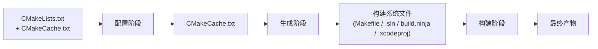

# 多配置生成器与 Ninja

> 前置教程：[[08-generator-expressions|生成器表达式]]、[[19-cmake-internal-architecture|CMake 内部架构]]
> 预估时间：45 分钟
> 本教程深入 CMake 的生成器类型体系，重点讲解多配置生成器与 Ninja 构建工具。

---

## 一、概念

### 1.1 什么是"生成器"？

回想 [[19-cmake-internal-architecture|教程 19]] 中的 CMake 三阶段模型：配置 → 生成 → 构建。**生成器（Generator）**决定了"生成阶段"产出的构建系统文件格式：



CMake 支持的生成器分为两大阵营：**单配置生成器**和**多配置生成器**。这个区分是 CMake 设计中最重要的概念之一——它决定了 `CMAKE_BUILD_TYPE` 何时生效、输出目录如何命名、以及如何组织开发工作流。

### 1.2 单配置生成器（Single-Config Generators）

```
┌─────────────────────────────────────────────────────────┐
│              单配置生成器工作模型                          │
│                                                         │
│  CMake 配置时指定构建类型：                                │
│    $ cmake -B build -DCMAKE_BUILD_TYPE=Debug            │
│                                                         │
│  build/ 目录中只能构建一种配置。                           │
│  要切换配置，必须重新运行 cmake 或在另一个目录中配置。       │
│                                                         │
│  ┌──────────────┐    ┌──────────────┐                    │
│  │ build-debug/ │    │ build-release/│                   │
│  │ Debug 产物   │    │ Release 产物  │                   │
│  └──────────────┘    └──────────────┘                    │
│                                                         │
│  CMAKE_BUILD_TYPE  = Debug / Release / ...              │
│  CMAKE_CONFIGURATION_TYPES = 被忽略                      │
└─────────────────────────────────────────────────────────┘
```

**常见的单配置生成器：**

| 生成器名称 | 构建工具 | 平台 |
|-----------|---------|------|
| `"Unix Makefiles"` | GNU Make | Linux / macOS / MSYS2 |
| `"Ninja"` | Ninja | 跨平台 |
| `"MinGW Makefiles"` | MinGW Make | Windows |
| `"MSYS Makefiles"` | MSYS Make | Windows |
| `"NMake Makefiles"` | NMake | Windows |

单配置生成器的核心特征：**`CMAKE_BUILD_TYPE` 在配置时确定，构建时不能改变。** 如果你需要 Debug 和 Release 两个版本，必须分别配置两个独立的构建目录：

```bash
# 单配置工作流：两个独立目录
cmake -B build/debug -G "Ninja" -DCMAKE_BUILD_TYPE=Debug
cmake -B build/release -G "Ninja" -DCMAKE_BUILD_TYPE=Release

cmake --build build/debug
cmake --build build/release
```

### 1.3 多配置生成器（Multi-Config Generators）

```
┌─────────────────────────────────────────────────────────┐
│              多配置生成器工作模型                          │
│                                                         │
│  CMake 配置时不指定构建类型，构建时指定：                    │
│    $ cmake -B build -G "Ninja Multi-Config"             │
│    $ cmake --build build --config Debug                 │
│    $ cmake --build build --config Release               │
│                                                         │
│  build/ 目录中同时包含所有配置的构建逻辑。                  │
│  不同配置的产物放在不同子目录中。                           │
│                                                         │
│  ┌───────────────────────────────────┐                   │
│  │ build/                            │                   │
│  │  ├── Debug/    (Debug 产物)       │                   │
│  │  ├── Release/  (Release 产物)     │                   │
│  │  └── build.ninja (所有配置共享)   │                   │
│  └───────────────────────────────────┘                   │
│                                                         │
│  CMAKE_BUILD_TYPE = 被忽略！                              │
│  CMAKE_CONFIGURATION_TYPES = Debug;Release;...           │
└─────────────────────────────────────────────────────────┘
```

**常见的多配置生成器：**

| 生成器名称 | 构建工具/IDE | 产物格式 | 平台 |
|-----------|-------------|---------|------|
| `"Visual Studio 17 2022"` | MSBuild / VS IDE | `.sln` + `.vcxproj` | Windows |
| `"Visual Studio 16 2019"` | MSBuild / VS IDE | `.sln` + `.vcxproj` | Windows |
| `"Xcode"` | Xcode IDE | `.xcodeproj` | macOS |
| `"Ninja Multi-Config"` | Ninja | `build.ninja` | 跨平台 |

多配置生成器的核心特征：**构建类型在构建时通过 `--config` 参数指定，而不是在配置时。** 同一个构建目录可以产出多个配置的二进制文件。

### 1.4 两类生成器的关键差异对比

| 特性 | 单配置 | 多配置 |
|------|--------|--------|
| 配置时 | `-DCMAKE_BUILD_TYPE=Debug` | 不指定（`CMAKE_BUILD_TYPE` 被忽略） |
| 构建时 | `cmake --build build` | `cmake --build build --config Debug` |
| 有效变量 | `CMAKE_BUILD_TYPE` | `CMAKE_CONFIGURATION_TYPES` |
| 输出目录 | `build/` 直接放产物 | `build/Debug/`、`build/Release/` 等子目录 |
| 切换配置 | 重新配置或换目录 | 换 `--config` 参数即可 |
| 一个目录多配置 | 不支持 | 支持 |

### 1.5 CMAKE_BUILD_TYPE vs CMAKE_CONFIGURATION_TYPES

这两个变量的分工是理解整个多配置体系的关键：

```cmake
# ── 单配置生成器 ──
# CMAKE_BUILD_TYPE：当前构建的唯一配置（空字符串 = 未指定，通常等于 Debug）
# CMAKE_CONFIGURATION_TYPES：被忽略

# ── 多配置生成器 ──
# CMAKE_BUILD_TYPE：被忽略！不要在 CMakeLists.txt 中依赖它
# CMAKE_CONFIGURATION_TYPES：列出所有可用配置（默认 "Debug;Release;MinSizeRel;RelWithDebInfo"）
```

> [!warning] 多配置生成器中 `CMAKE_BUILD_TYPE` 被忽略
> 在 Visual Studio、Xcode、Ninja Multi-Config 等生成器下，`CMAKE_BUILD_TYPE` **完全不起作用**。如果在 `CMakeLists.txt` 中用 `if(CMAKE_BUILD_TYPE STREQUAL "Debug")` 做分支判断，这段逻辑在多配置生成器中永远不会进入。应使用生成器表达式 `$<CONFIG:Debug>` 或 `$<$<CONFIG:Debug>:...>`。

```cmake
# ❌ 错误：在多配置生成器中无效
if(CMAKE_BUILD_TYPE STREQUAL "Debug")
    target_compile_definitions(myapp PRIVATE DEBUG_MODE=1)
endif()

# ✅ 正确：生成器表达式在所有生成器中都有效
target_compile_definitions(myapp PRIVATE
    $<$<CONFIG:Debug>:DEBUG_MODE=1>
)
```

---

## 二、Ninja：最快的构建工具

### 2.1 Ninja 是什么？

Ninja 是一个专注速度的构建工具，由 Google 的 Evan Martin 开发。它的设计哲学是**极致的增量构建速度**——一个大型项目（如 Chromium）的"零改动构建"（no-op build）可以在几百毫秒内完成。

**Ninja 不替代 CMake，而是替代 Make：**

```
CMake（配置）→ build.ninja → Ninja（构建）
CMake（配置）→ Makefile   → Make（构建）
```

Ninja 构建文件（`build.ninja`）是低级的、机器生成的格式，不适合手写。CMake 的 Ninja 生成器负责生成这个文件。

### 2.2 安装 Ninja

Ninja 是独立工具，不随 CMake 安装：

```bash
# Linux (apt)
sudo apt install ninja-build

# macOS (Homebrew)
brew install ninja

# Windows (Chocolatey)
choco install ninja

# Windows (scoop)
scoop install ninja

# 从源码构建
git clone https://github.com/ninja-build/ninja.git
cd ninja && cmake -B build && cmake --build build
sudo cp build/ninja /usr/local/bin/
```

验证安装：

```bash
ninja --version
# 输出类似: 1.12.1
```

### 2.3 为什么 Ninja 比 Make 快？

| 因素 | Make | Ninja |
|------|------|-------|
| 依赖图构建 | 递归 Make，先解析所有 Makefile | 一次解析一个 `.ninja` 文件 |
| 文件状态检查 | 每个目标 `stat()` 所有依赖 | 集中式 `stat()` + 缓存 |
| 输出格式 | 人类可读文本 | 机器优化格式 |
| 并行调度 | 基础 `-j` 支持 | 更精细的并行调度 |
| 增量构建 | 重新解析 Makefile | 直接读取已解析的 depfile |
| 隐式规则 | 支持（`%` 模式规则） | 不支持（交给 CMake 生成） |

关键优化：Ninja 的 `build.ninja` 文件是一个扁平的依赖图，Ninja 在启动时一次性解析它，然后可以直接开始工作。而 Make 需要解析 `Makefile` + 所有 `include` 的内容 + 递归调用的子 Make，额外的解析开销在大项目中非常显著。

### 2.4 零改动构建

这是 Ninja 最闪亮的场景：

```bash
# 第一次构建
$ cmake --build build
[100/100] Linking CXX executable myapp
# 用时: 45.2s

# 零改动构建（什么都没改）
$ cmake --build build
ninja: no work to do.
# 用时: 0.08s
```

Make 的零改动构建通常也需要 0.5-2 秒（取决于项目规模），Ninja 可以把这个时间压到几十毫秒。在"改一行 → 编译 → 测试"的迭代循环中，这个差异累积起来非常可观。

---

## 三、Ninja Multi-Config：鱼与熊掌兼得

### 3.1 背景

传统 Ninja 生成器（`"Ninja"`）是单配置的：一个构建目录只能产出一个配置。如果你需要 Debug + Release，必须维护两个独立目录。

Visual Studio 和 Xcode 生成器是多配置的，但它们依赖特定的 IDE 工具链，不通用，且构建速度远不如 Ninja。

**Ninja Multi-Config**（CMake 3.17+）填补了这个空白：它兼具 Ninja 的极致速度和多配置生成器的一目录多配置能力。

### 3.2 核心机制

```
┌──────────────────────────────────────────────────────────┐
│              Ninja Multi-Config 工作方式                   │
│                                                          │
│  CMake 配置:                                              │
│    $ cmake -B build -G "Ninja Multi-Config"              │
│                                                          │
│  生成的 build/build.ninja 中包含:                          │
│    - 每个目标的每种配置都有一个独立的 build rule           │
│    - 不同配置的输出放在 build/<CONFIG>/ 子目录             │
│    - 默认配置（default config）由变量控制                  │
│                                                          │
│  构建时通过 --config 选择:                                 │
│    $ cmake --build build --config Debug                  │
│    $ cmake --build build --config Release                │
│                                                          │
│  Ninja 层面: 每种配置实际上是不同的 Ninja 目标              │
│    等价于: ninja -f build.ninja myapp:Debug               │
└──────────────────────────────────────────────────────────┘
```

### 3.3 关键变量

```cmake
# ── 控制可用配置列表 ──
# 默认值: "Debug;Release;RelWithDebInfo;MinSizeRel"
set(CMAKE_CONFIGURATION_TYPES "Debug;Release;RelWithDebInfo;MinSizeRel")

# ── 控制默认构建类型（Ninja Multi-Config 特有） ──
# 当不指定 --config 时使用的配置（CMake 3.17+）
set(CMAKE_DEFAULT_BUILD_TYPE "Debug")

# ── 控制默认构建的配置集合（CMake 3.21+） ──
# 当不指定 --config 时，可以指定构建多个配置
set(CMAKE_DEFAULT_CONFIGS "Debug;Release")

# ── 跨配置构建（CMake 3.21+） ──
# 允许一个目标以不同配置引用另一个目标
set(CMAKE_CROSS_CONFIGS "all")
```

> [!tip] CMake 版本要求
> - Ninja Multi-Config 生成器需要 CMake ≥ 3.17
> - `CMAKE_DEFAULT_CONFIGS` 需要 CMake ≥ 3.21
> - `CMAKE_CROSS_CONFIGS` "all" 支持需要 CMake ≥ 3.21

### 3.4 默认构建行为

```bash
# 不指定 --config 时：
$ cmake --build build
# Ninja Multi-Config: 构建 CMAKE_DEFAULT_BUILD_TYPE 指定的配置（默认 Debug）
# Visual Studio: 构建 .sln 文件中设为启动项目的配置

# 指定 --config 时：
$ cmake --build build --config Release
# 构建 Release 配置
```

---

## 四、生成器表达式与多配置

### 4.1 `$<CONFIG>` — 条件化构建类型

多配置的核心问题：如何在 `CMakeLists.txt` 中为不同配置设置不同的编译选项，而不依赖 `CMAKE_BUILD_TYPE`？

答案：**生成器表达式**（参见 [[08-generator-expressions|教程 08]]）。

```cmake
# 基础形式：检查当前构建配置
$<CONFIG:Debug>           # 当配置为 Debug 时为 "1"
$<CONFIG:Release>         # 当配置为 Release 时为 "1"
$<CONFIG:Debug,Release>   # 当配置为 Debug 或 Release 时为 "1"

# 条件表达式：IF-ELSE
$<IF:$<CONFIG:Debug>,debug_value,release_value>

# 组合使用
target_compile_definitions(myapp PRIVATE
    $<$<CONFIG:Debug>:DEBUG_BUILD=1>
    $<$<CONFIG:Release>:NDEBUG=1>
)
```

### 4.2 完整的配置评估表达式族

```cmake
# 单值：返回当前配置名
$<CONFIG>                         # "Debug" / "Release" / ...

# 布尔测试
$<CONFIG:cfg>                     # 当前配置 == cfg ?
$<CONFIG:cfgs>                    # 当前配置在 cfgs 列表中 ?

# 条件选择
$<IF:$<CONFIG:Debug>,debug_expr,release_expr>

# 配置映射（多配置生成器中很重要）
$<TARGET_FILE:tgt>                # 自动附加配置子目录
$<TARGET_FILE_NAME:tgt>           # 仅文件名

# 输出目录（自动包含配置子目录）
$<TARGET_FILE_DIR:tgt>            # build/<CONFIG>/myapp.exe
```

### 4.3 Per-Config 输出目录

多配置生成器为每种配置创建独立的输出子目录。你可以显式控制这些目录：

```cmake
# 单配置方式（在多配置生成器中会默认追加配置子目录）
set(CMAKE_RUNTIME_OUTPUT_DIRECTORY ${CMAKE_BINARY_DIR}/bin)

# Per-Config 方式 — 每个配置独立目录
set(CMAKE_RUNTIME_OUTPUT_DIRECTORY_DEBUG   ${CMAKE_BINARY_DIR}/bin/debug)
set(CMAKE_RUNTIME_OUTPUT_DIRECTORY_RELEASE ${CMAKE_BINARY_DIR}/bin/release)

# 也可以结合生成器表达式
set(CMAKE_RUNTIME_OUTPUT_DIRECTORY
    ${CMAKE_BINARY_DIR}/$<CONFIG>/bin
)
```

Per-Config 目录变量族：

| 变量 | 作用 |
|------|------|
| `CMAKE_RUNTIME_OUTPUT_DIRECTORY_<CONFIG>` | 可执行文件/DLL 输出目录 |
| `CMAKE_LIBRARY_OUTPUT_DIRECTORY_<CONFIG>` | 共享库输出目录 |
| `CMAKE_ARCHIVE_OUTPUT_DIRECTORY_<CONFIG>` | 静态库输出目录 |
| `CMAKE_PDB_OUTPUT_DIRECTORY_<CONFIG>` | PDB 调试符号目录 |

### 4.4 Per-Config 编译选项

```cmake
# 使用生成器表达式实现 per-config 编译选项
target_compile_options(myapp PRIVATE
    $<$<CONFIG:Debug>:-O0 -g>
    $<$<CONFIG:Release>:-O3 -DNDEBUG>
    $<$<CONFIG:RelWithDebInfo>:-O2 -g -DNDEBUG>
    $<$<CONFIG:MinSizeRel>:-Os -DNDEBUG>
)

# 更精细的控制
target_compile_definitions(myapp PRIVATE
    $<$<CONFIG:Debug>:ENABLE_ASSERTS=1 ENABLE_LOGGING=1>
    $<$<CONFIG:Release>:ENABLE_ASSERTS=0 ENABLE_LOGGING=0>
)
```

> [!note] CMake 已内置默认的 per-config 编译选项
> CMake 通过 `CMAKE_CXX_FLAGS_<CONFIG>` 变量为每种配置提供了合理的默认编译选项。你通常不需要手动设置 `-O0 -g` 等——CMake 会根据语言和配置自动添加正确的标志。上面的示例展示了如何在**默认选项之外**添加额外标志。

---

## 五、CMAKE_MAP_IMPORTED_CONFIG — 配置映射

### 5.1 问题场景

当你用 `find_package` 引入一个外部库（如 Boost），而这个外部库是以特定配置编译的（比如只有 Release 版的 `.lib` 文件），但你的项目当前需要 Debug 配置——CMake 该如何选择？

```cmake
find_package(fmt REQUIRED)
# fmt 的 IMPORTED 目标指向 fmt::fmt
# 它可能有 Release 和 Debug 两个 .lib 文件
# 但也可能只提供了 Release 版本的 .lib

# 当你以 Debug 配置构建时：
# CMake 尝试寻找 fmt 的 Debug IMPORTED 配置
# 如果找不到——报错或回退到 Release？
```

### 5.2 映射机制

`CMAKE_MAP_IMPORTED_CONFIG_<CONFIG>` 定义了当一个已导入目标的某配置不可用时，应该回退到哪个配置：

```cmake
# 默认行为（许多工具链文件中已预设）：
set(CMAKE_MAP_IMPORTED_CONFIG_DEBUG        Release)
set(CMAKE_MAP_IMPORTED_CONFIG_RELWITHDEBINFO Release)
set(CMAKE_MAP_IMPORTED_CONFIG_MINSIZEREL   Release)

# 含义：当 Debug 配置的 IMPORTED 库不存在时，使用 Release 版本替代
```

**Visual Studio 上的典型设置：**

```cmake
# MSVC 多配置生成器中的常见映射
set(CMAKE_MAP_IMPORTED_CONFIG_DEBUG          Debug)
set(CMAKE_MAP_IMPORTED_CONFIG_RELWITHDEBINFO RelWithDebInfo)
set(CMAKE_MAP_IMPORTED_CONFIG_MINSIZEREL     MinSizeRel)
set(CMAKE_MAP_IMPORTED_CONFIG_RELEASE        Release)

# 如果 Release 也不可用，可以链式回退：
set(CMAKE_MAP_IMPORTED_CONFIG_DEBUG          RelWithDebInfo)
set(CMAKE_MAP_IMPORTED_CONFIG_RELWITHDEBINFO Release)
```

### 5.3 自定义映射

```cmake
# 在项目根 CMakeLists.txt 中
# 如果你的所有依赖只提供 Release 版本
list(APPEND CMAKE_MAP_IMPORTED_CONFIG_DEBUG   Release)
list(APPEND CMAKE_MAP_IMPORTED_CONFIG_RELWITHDEBINFO Release)
list(APPEND CMAKE_MAP_IMPORTED_CONFIG_MINSIZEREL    Release)

# 或更激进：所有非 Release 配置都回退到 Release
set(CMAKE_MAP_IMPORTED_CONFIG_DEBUG          Release)
set(CMAKE_MAP_IMPORTED_CONFIG_RELWITHDEBINFO Release)
set(CMAKE_MAP_IMPORTED_CONFIG_MINSIZEREL     Release)
# (Release 的映射不需要设置，它是默认的最终回退)
```

> [!warning] 混合 Debug/Release 链接的风险
> 当 Debug 配置的二进制链接到 Release 配置的库时：
> - CRT 不兼容：Debug CRT（`MSVCRTD`、`libcmtd`）和 Release CRT（`MSVCRT`、`libcmt`）有不同的堆布局和断言行为
> - 迭代器调试：MSVC Debug 模式启用 `_ITERATOR_DEBUG_LEVEL=2`，Release 为 `0`——跨配置传递 STL 容器会导致崩溃
> - 内联差异：Release 库中的内联函数可能与 Debug 调用方不一致
> - `NDEBUG` 不一致：`assert()` 在一侧生效而在另一侧不生效
>
> **生产代码中，永远不要混合 Debug 和 Release 对象文件/库。** 配置映射是"没有选择时的逃生舱"，不是"推荐的日常做法"。

---

## 六、IDE 生成器

### 6.1 Visual Studio 生成器

```bash
# 生成 Visual Studio 解决方案
cmake -B build -G "Visual Studio 17 2022" -A x64
```

生成的产物：
- `build/MyProject.sln` — Visual Studio 解决方案文件
- `build/src/MyApp.vcxproj` — 每个 target 一个 `.vcxproj` 项目文件
- `build/CMakeFiles/` — CMake 内部文件

在 Visual Studio 中直接打开 `.sln` 文件，就可以获得完整的 IDE 体验：

- 解决方案配置下拉框中有 Debug / Release / RelWithDebInfo / MinSizeRel
- IntelliSense 可用
- 断点调试可用
- 项目属性页反映 CMake 设置（部分可修改，但修改后重新配置会被覆盖）

### 6.2 Xcode 生成器

```bash
cmake -B build -G Xcode
```

生成 `build/MyProject.xcodeproj`，在 Xcode 中打开后：
- Scheme 选择器中有 Debug / Release 等配置
- 和 VS 生成器类似，Xcode 项目中的修改在 CMake 重新配置时会被覆盖

### 6.3 何时使用 IDE 生成器

| 场景 | 推荐生成器 |
|------|-----------|
| 日常开发、快速迭代 | Ninja 或 Ninja Multi-Config |
| CI/CD 流水线 | Ninja |
| Windows 桌面应用调试 | Visual Studio 17 2022 |
| macOS/iOS 应用调试 | Xcode |
| 需要 Visual Studio 的调试可视化工具 | Visual Studio 17 2022 |
| 跨平台构建速度优先 | Ninja Multi-Config |

> [!tip] VS 的 "Open Folder" 模式
> Visual Studio 2017+ 支持直接打开包含 `CMakeLists.txt` 的文件夹，内部使用 Ninja 作为默认生成器。这结合了 IDE 的 IntelliSense 和 Ninja 的构建速度。如果你不需要 `.sln` 文件分发给其他开发者，"Open Folder" 是更好的选择。

---

## 七、跨配置构建（CMAKE_CROSS_CONFIGS）

### 7.1 问题

在 Ninja Multi-Config 中，如果你有一个可执行文件 `myapp` 和一个库 `mylib`，且 `myapp` 依赖 `mylib`——正常情况下，当你构建 `myapp:Debug` 时，Ninja 会自动构建 `mylib:Debug`。但如果你的 `myapp` 还需要调用一个**以 Release 配置运行的代码生成器工具**呢？

```cmake
add_executable(codegen codegen.cpp)        # 构建工具，需要 Release 最快
add_custom_command(
    OUTPUT generated.cpp
    COMMAND $<TARGET_FILE:codegen>          # ← 这里需要 codegen 的 Release 版本
    DEPENDS codegen
)
add_executable(myapp main.cpp generated.cpp)
```

默认情况下，当你构建 `myapp:Debug` 时，`codegen` 也以 Debug 构建，而在 Debug 下运行代码生成器会非常慢。

### 7.2 解决方案

CMake 3.21+ 引入了 `CMAKE_CROSS_CONFIGS`：

```cmake
# 在顶层 CMakeLists.txt 中
set(CMAKE_CROSS_CONFIGS "all")
```

当设置为 `"all"` 时，目标可以跨配置引用彼此。你可以显式指定依赖的配置：

```cmake
add_executable(codegen codegen.cpp)

# myapp:Debug 依赖于 codegen:Release
add_custom_command(
    OUTPUT generated.cpp
    COMMAND $<TARGET_FILE:codegen>
    DEPENDS $<TARGET_PROPERTY:codegen,IMPORTED_LOCATION_RELEASE>
)

# 或者使用生成器表达式指定配置
# $<TARGET_FILE:codegen> 在 cross-configs 模式下会解析为合适的配置
```

更实用的做法：使用 `$<GENEX_EVAL>` 和 `$<TARGET_PROPERTY>` 来指定跨配置依赖：

```cmake
# 构建 myapp 时，确保 codegen 以 Release 构建
add_dependencies(myapp codegen)

# 在 custom command 中使用 $<TARGET_FILE:codegen>
# 配合 CMAKE_CROSS_CONFIGS 时，cmake --build 会正确处理
```

### 7.3 CMAKE_DEFAULT_CONFIGS

```cmake
# 当不指定 --config 时，同时构建 Debug 和 Release
set(CMAKE_DEFAULT_CONFIGS "Debug;Release")
```

```bash
$ cmake --build build
# 等价于:
# $ cmake --build build --config Debug
# $ cmake --build build --config Release
```

---

## 八、ctest -C 与多配置测试

CTest 的 `-C` 参数与 `cmake --build --config` 对应：

```bash
# 构建 Release 配置并测试
cmake --build build --config Release
ctest --test-dir build -C Release

# 构建并测试所有配置
for config in Debug Release RelWithDebInfo MinSizeRel; do
    cmake --build build --config $config
    ctest --test-dir build -C $config
done
```

`-C` 的作用：
1. 告诉 CTest 在哪个子目录中找测试可执行文件（`build/Release/tests/` vs `build/Debug/tests/`）
2. 传递给 `CMAKE_CFG_INTDIR`，所以测试可执行文件的路径会自动调整

```bash
# 多配置测试的完整示例
cmake -B build -G "Ninja Multi-Config"
cmake --build build --config Debug --parallel
ctest --test-dir build -C Debug --output-on-failure

cmake --build build --config Release --parallel
ctest --test-dir build -C Release
```

---

## 九、代码示例

### 示例 1：Ninja Multi-Config 配置并构建 Debug + Release

**项目结构：**

```
example1/
├── CMakeLists.txt
└── main.cpp
```

**`main.cpp`：**

```cpp
#include <iostream>

int main() {
#ifdef NDEBUG
    std::cout << "Release build (NDEBUG defined)" << std::endl;
#else
    std::cout << "Debug build (NDEBUG not defined)" << std::endl;
#endif
    return 0;
}
```

**`CMakeLists.txt`：**

```cmake
cmake_minimum_required(VERSION 3.21)
project(MultiConfigExample VERSION 1.0.0 LANGUAGES CXX)

# 声明可用的配置
set(CMAKE_CONFIGURATION_TYPES "Debug;Release;RelWithDebInfo;MinSizeRel"
    CACHE STRING "Available build configurations" FORCE)

# 默认构建类型（--config 未指定时）
set(CMAKE_DEFAULT_BUILD_TYPE "Debug")

# 默认构建配置集合
set(CMAKE_DEFAULT_CONFIGS "Debug;Release")

add_executable(multiconfig_app main.cpp)

# 设置 Debug 特定的宏
target_compile_definitions(multiconfig_app PRIVATE
    $<$<CONFIG:Debug>:DEBUG_BUILD=1 EXTRA_LOGGING=1>
    $<$<CONFIG:Release>:RELEASE_BUILD=1>
)
```

**构建步骤：**

```bash
# 配置（指定 Ninja Multi-Config 生成器）
cmake -B build -G "Ninja Multi-Config"

# 构建 Debug 配置
cmake --build build --config Debug

# 构建 Release 配置
cmake --build build --config Release

# 运行两个版本
./build/Debug/multiconfig_app
# 输出: Debug build (NDEBUG not defined)

./build/Release/multiconfig_app
# 输出: Release build (NDEBUG defined)

# 使用默认构建（构建 CMAKE_DEFAULT_CONFIGS 中的配置）
cmake --build build
# 同时构建 Debug 和 Release
```

### 示例 2：使用生成器表达式设置 per-config 编译标志

**项目结构：**

```
example2/
├── CMakeLists.txt
├── lib/
│   ├── CMakeLists.txt
│   ├── math_utils.h
│   └── math_utils.cpp
└── app/
    ├── CMakeLists.txt
    └── main.cpp
```

**`lib/math_utils.h`：**

```cpp
#pragma once

namespace math {

// 故意留一个符号未定义，让不同配置通过宏区分行为
#ifdef SLOW_BUT_SAFE
double safe_divide(double a, double b);
#else
inline double safe_divide(double a, double b) {
    return b != 0.0 ? a / b : 0.0;
}
#endif

} // namespace math
```

**`lib/math_utils.cpp`：**

```cpp
#include "math_utils.h"

#ifdef SLOW_BUT_SAFE
#include <stdexcept>
namespace math {
double safe_divide(double a, double b) {
    if (b == 0.0) throw std::invalid_argument("division by zero");
    return a / b;
}
}
#endif
```

**`lib/CMakeLists.txt`：**

```cmake
add_library(math_utils STATIC
    math_utils.cpp
)

target_include_directories(math_utils PUBLIC ${CMAKE_CURRENT_SOURCE_DIR})

# Per-config 编译定义 — 使用生成器表达式
target_compile_definitions(math_utils PRIVATE
    $<$<CONFIG:Debug>:SLOW_BUT_SAFE=1>
)

# Per-config 编译选项
target_compile_options(math_utils PRIVATE
    $<$<AND:$<CONFIG:Debug>,$<CXX_COMPILER_ID:GNU>>:-fstack-protector-all>
    $<$<AND:$<CONFIG:Release>,$<CXX_COMPILER_ID:GNU>>:-fomit-frame-pointer>
)

# Per-config 输出目录
set_target_properties(math_utils PROPERTIES
    ARCHIVE_OUTPUT_DIRECTORY_DEBUG   "${CMAKE_BINARY_DIR}/lib/debug"
    ARCHIVE_OUTPUT_DIRECTORY_RELEASE "${CMAKE_BINARY_DIR}/lib/release"
)
```

**`app/main.cpp`：**

```cpp
#include <iostream>
#include "math_utils.h"

int main() {
    double result = math::safe_divide(10.0, 3.0);
    std::cout << "10.0 / 3.0 = " << result << std::endl;

    // 在 Debug 模式下会抛出异常（SLOW_BUT_SAFE 定义），
    // 在 Release 模式下返回 0.0
    result = math::safe_divide(5.0, 0.0);
    std::cout << "5.0 / 0.0 = " << result << std::endl;

    return 0;
}
```

**`app/CMakeLists.txt`：**

```cmake
add_executable(perconfig_app main.cpp)

target_link_libraries(perconfig_app PRIVATE math_utils)

# Per-config 编译定义在可执行文件层面
target_compile_definitions(perconfig_app PRIVATE
    $<$<CONFIG:Debug>:ENABLE_ASSERTIONS EXTRA_LOGGING>
    $<$<CONFIG:Release>:USE_FAST_MATH>
    $<$<CONFIG:RelWithDebInfo>:ENABLE_ASSERTIONS>
)

# Per-config 运行时输出目录
set_target_properties(perconfig_app PROPERTIES
    RUNTIME_OUTPUT_DIRECTORY_DEBUG   "${CMAKE_BINARY_DIR}/bin/debug"
    RUNTIME_OUTPUT_DIRECTORY_RELEASE "${CMAKE_BINARY_DIR}/bin/release"
)
```

**根 `CMakeLists.txt`：**

```cmake
cmake_minimum_required(VERSION 3.21)
project(PerConfigExample VERSION 1.0.0 LANGUAGES CXX)

set(CMAKE_CONFIGURATION_TYPES "Debug;Release;RelWithDebInfo;MinSizeRel"
    CACHE STRING "" FORCE)
set(CMAKE_DEFAULT_BUILD_TYPE "Debug")

add_subdirectory(lib)
add_subdirectory(app)

# Per-config 全局编译标志（使用 add_compile_options + 生成器表达式）
add_compile_options(
    $<$<CONFIG:Debug>:-DDEBUG_MODE>
    $<$<CONFIG:Release>:-DRELEASE_MODE>
)

# Per-config 全局输出目录
set(CMAKE_RUNTIME_OUTPUT_DIRECTORY_DEBUG   "${CMAKE_BINARY_DIR}/bin/debug")
set(CMAKE_RUNTIME_OUTPUT_DIRECTORY_RELEASE "${CMAKE_BINARY_DIR}/bin/release")
set(CMAKE_ARCHIVE_OUTPUT_DIRECTORY_DEBUG   "${CMAKE_BINARY_DIR}/lib/debug")
set(CMAKE_ARCHIVE_OUTPUT_DIRECTORY_RELEASE "${CMAKE_BINARY_DIR}/lib/release")
```

**构建步骤：**

```bash
cmake -B build -G "Ninja Multi-Config"

# 构建 Debug
cmake --build build --config Debug
./build/bin/debug/perconfig_app
# 10.0 / 3.0 = 3.33333
# 抛出异常: division by zero (因为 SLOW_BUT_SAFE 被定义了)

# 构建 Release
cmake --build build --config Release
./build/bin/release/perconfig_app
# 10.0 / 3.0 = 3.33333
# 5.0 / 0.0 = 0 (内联函数，返回默认值)
```

### 示例 3：Unix Makefiles vs Ninja 构建速度对比

**项目结构：**

```
example3/
├── CMakeLists.txt
├── benchmark.cpp
└── generate_sources.py     # 生成大量源文件模拟真实项目
```

**`generate_sources.py`（生成 200 个源文件）：**

```python
#!/usr/bin/env python3
"""生成模拟的 C++ 源文件，用于构建速度对比"""

import os
import sys

def generate(count=200):
    os.makedirs("src", exist_ok=True)

    # 生成一个共享头文件
    with open("src/common.h", "w") as f:
        f.write("""#pragma once
#include <vector>
#include <string>
#include <algorithm>
#include <numeric>
#include <iostream>

inline int shared_compute(int x) {
    return x * x + 2 * x + 1;
}

struct Data {
    std::vector<int> values;
    void process() {
        std::sort(values.begin(), values.end());
    }
};
""")

    # 生成 200 个 .cpp 文件，每个包含独特的计算
    for i in range(1, count + 1):
        with open(f"src/module_{i:04d}.cpp", "w") as f:
            f.write(f"""#include "common.h"

namespace module_{i:04d} {{

int compute_{i:04d}(int input) {{
    Data d;
    for (int j = 0; j < {10 + (i % 50)}; ++j) {{
        d.values.push_back((input + j + {i}) * {1 + (i % 3)});
    }}
    d.process();
    return std::accumulate(d.values.begin(), d.values.end(), 0)
         + shared_compute(input) + {i};
}}

}} // namespace module_{i:04d}
""")

    # 生成 main.cpp
    with open("main.cpp", "w") as f:
        f.write('#include "common.h"\n\n')
        for i in range(1, count + 1):
            f.write(f"namespace module_{i:04d} {{ extern int compute_{i:04d}(int); }}\n")
        f.write("""
int main() {
    int total = 0;
""")
        for i in range(1, count + 1):
            f.write(f"    total += module_{i:04d}::compute_{i:04d}({42 + i % 10});\n")
        f.write("""
    std::cout << "Total: " << total << std::endl;
    return 0;
}
""")

    print(f"Generated {count} source files in src/")

if __name__ == "__main__":
    count = int(sys.argv[1]) if len(sys.argv) > 1 else 200
    generate(count)
```

**`CMakeLists.txt`：**

```cmake
cmake_minimum_required(VERSION 3.21)
project(BuildBenchmark VERSION 1.0.0 LANGUAGES CXX)

# 收集所有源文件
file(GLOB_RECURSE ALL_SOURCES
    "src/*.cpp"
    "main.cpp"
)

add_executable(benchmark_app ${ALL_SOURCES})

target_include_directories(benchmark_app PRIVATE src)

# 使用 Release 配置进行基准测试（优化后的构建更慢，更能体现差异）
```

**构建对比脚本（`benchmark.sh` / `benchmark.ps1`）：**

`benchmark.ps1`（Windows PowerShell）：

```powershell
# 生成源文件
python generate_sources.py 200

# ── 清理 ──
Remove-Item -Recurse -Force build-make, build-ninja -ErrorAction SilentlyContinue

Write-Host "=== Unix Makefiles (单配置, Release) ==="
$make_config = Measure-Command {
    cmake -B build-make -G "Unix Makefiles" -DCMAKE_BUILD_TYPE=Release
}
Write-Host "  配置时间: $($make_config.TotalSeconds.ToString('F2'))s"

$make_build = Measure-Command {
    cmake --build build-make --parallel
}
Write-Host "  构建时间: $($make_build.TotalSeconds.ToString('F2'))s"

$make_noop = Measure-Command {
    cmake --build build-make --parallel
}
Write-Host "  零改动构建: $($make_noop.TotalSeconds.ToString('F2'))s"

# ── Ninja ──
Write-Host ""
Write-Host "=== Ninja (单配置, Release) ==="
$ninja_config = Measure-Command {
    cmake -B build-ninja -G "Ninja" -DCMAKE_BUILD_TYPE=Release
}
Write-Host "  配置时间: $($ninja_config.TotalSeconds.ToString('F2'))s"

$ninja_build = Measure-Command {
    cmake --build build-ninja --parallel
}
Write-Host "  构建时间: $($ninja_build.TotalSeconds.ToString('F2'))s"

$ninja_noop = Measure-Command {
    cmake --build build-ninja --parallel
}
Write-Host "  零改动构建: $($ninja_noop.TotalSeconds.ToString('F2'))s"

# ── 汇总 ──
Write-Host ""
Write-Host "=== 对比 ==="
Write-Host "首次构建加速: $($make_build.TotalSeconds / $ninja_build.TotalSeconds)x"
Write-Host "零改动构建加速: $($make_noop.TotalSeconds / $ninja_noop.TotalSeconds)x"
```

`benchmark.sh`（Linux/macOS）：

```bash
#!/bin/bash
set -e

# 生成源文件
python3 generate_sources.py 200

# 清理
rm -rf build-make build-ninja

echo "=== Unix Makefiles (单配置, Release) ==="
time (cmake -B build-make -G "Unix Makefiles" -DCMAKE_BUILD_TYPE=Release > /dev/null)
echo ""
time (cmake --build build-make --parallel > /dev/null)
echo ""
echo "零改动构建:"
time (cmake --build build-make --parallel > /dev/null)
echo ""

echo "=== Ninja (单配置, Release) ==="
time (cmake -B build-ninja -G "Ninja" -DCMAKE_BUILD_TYPE=Release > /dev/null)
echo ""
time (cmake --build build-ninja --parallel > /dev/null)
echo ""
echo "零改动构建:"
time (cmake --build build-ninja --parallel > /dev/null)
```

**运行：**

```bash
# 运行基准测试
python3 generate_sources.py 200
bash benchmark.sh
```

典型结果（200 个源文件，6 核 CPU）：

```
=== Unix Makefiles ===
  构建时间: 38.4s
  零改动构建: 1.2s

=== Ninja ===
  构建时间: 28.1s
  零改动构建: 0.09s

=== 对比 ===
  首次构建加速: 1.36x
  零改动构建加速: 13.3x
```

> [!note] 零改动构建的优势
> Ninja 在"什么都没改"的场景下特别快，因为它完全跳过了 Makefile 重新解析阶段。如果你在开发循环中频繁执行"编译-运行-修改代码-再编译"，Ninja 的零改动和增量构建优势会显著提升你的迭代速度。

---

## 十、练习

### 练习 1：Ninja Multi-Config 一树多配置

**目标：** 配置一个项目，使用 Ninja Multi-Config 在单一构建目录中同时支持 Debug 和 Release。

**要求：**

1. 创建一个名为 `hello_config` 的可执行文件，在 `main.cpp` 中输出当前构建配置
2. 使用 `#ifdef NDEBUG` 区分 Debug 和 Release
3. 在 `CMakeLists.txt` 中：
   - 设置 `CMAKE_CONFIGURATION_TYPES` 为 `"Debug;Release;RelWithDebInfo"`
   - 设置 `CMAKE_DEFAULT_BUILD_TYPE` 为 `"Debug"`
   - 通过生成器表达式为 Debug 配置添加 `SLOW_CHECKS` 宏定义
4. 配置后用 `cmake --build build --config Debug` 和 `--config Release` 分别构建
5. 验证两个可执行文件在 `build/Debug/` 和 `build/Release/` 中

> [!tip]- 参考实现
> ```cmake
> cmake_minimum_required(VERSION 3.21)
> project(Ex1MultiConfig VERSION 1.0.0 LANGUAGES CXX)
>
> set(CMAKE_CONFIGURATION_TYPES "Debug;Release;RelWithDebInfo"
>     CACHE STRING "Available configs" FORCE)
> set(CMAKE_DEFAULT_BUILD_TYPE "Debug")
>
> add_executable(hello_config main.cpp)
>
> target_compile_definitions(hello_config PRIVATE
>     $<$<CONFIG:Debug>:SLOW_CHECKS=1>
> )
> ```
>
> ```cpp
> // main.cpp
> #include <iostream>
> int main() {
> #ifdef SLOW_CHECKS
>     std::cout << "Debug config with SLOW_CHECKS" << std::endl;
> #else
>     std::cout << "Non-Debug config" << std::endl;
> #endif
> }
> ```

### 练习 2：Per-Config 编译定义

**目标：** 为一个库添加配置特定的编译定义，使用生成器表达式。

**要求：**

1. 创建一个静态库 `analytics`
2. Debug 配置：定义 `COLLECT_TELEMETRY=1` 和 `LOG_LEVEL=3`
3. Release 配置：定义 `COLLECT_TELEMETRY=0` 和 `LOG_LEVEL=0`，并添加 `-Werror` 编译选项
4. RelWithDebInfo 配置：定义 `COLLECT_TELEMETRY=1` 和 `LOG_LEVEL=1`
5. 创建一个可执行文件链接 `analytics`
6. 在代码中使用 `#if COLLECT_TELEMETRY` 和 `#if LOG_LEVEL` 区分行为
7. 分别构建三种配置并运行，验证行为不同

> [!tip]- 提示
> ```cmake
> target_compile_definitions(analytics PRIVATE
>     $<$<CONFIG:Debug>:COLLECT_TELEMETRY=1 LOG_LEVEL=3>
>     $<$<CONFIG:Release>:COLLECT_TELEMETRY=0 LOG_LEVEL=0>
>     $<$<CONFIG:RelWithDebInfo>:COLLECT_TELEMETRY=1 LOG_LEVEL=1>
> )
> target_compile_options(analytics PRIVATE
>     $<$<CONFIG:Release>:-Werror>
> )
> ```

**要求：**

1. 使用示例 3 的 `generate_sources.py` 生成至少 100 个源文件
2. 分别用 Unix Makefiles 和 Ninja 生成器配置和构建
3. 使用 `time`（Linux/macOS）或 `Measure-Command`（PowerShell）测量时间
4. 记录三个指标：配置时间、首次构建时间、零改动构建时间
5. 对每个指标计算 Ninja 相对于 Make 的加速比

**挑战：** 尝试不同的并行度（`-j 2`、`-j 4`、`-j 8`），观察加速比如何变化。Ninja 通常能更好地利用高核数。

## 3.5 参考答案

> [!tip]- 练习 1 参考答案
> 参考上方练习 1 的「参考实现」callout。核心要点：
> - `CMAKE_CONFIGURATION_TYPES` 必须在 CMakeLists.txt 中显式设置（使用 `CACHE STRING ... FORCE`）
> - `CMAKE_DEFAULT_BUILD_TYPE` 控制不指定 `--config` 时的默认配置
> - 生成器表达式 `$<$<CONFIG:Debug>:SLOW_CHECKS=1>` 让宏定义随构建配置自动切换
> - 构建时 `cmake --build build --config Debug` 输出在 `build/Debug/` 下

> [!tip]- 练习 2 参考答案
> 参考上方练习 2 的「提示」callout。核心要点：
> - 每个 CONFIG 用独立的 `$<$<CONFIG:X>:...>` 表达式
> - 多个定义用空格分隔：`$<$<CONFIG:Debug>:DEF1=1 DEF2=2>`
> - `target_compile_options` 用 `$<$<CONFIG:Release>:-Werror>` 添加配置特定编译选项
> - 代码中用 `#if COLLECT_TELEMETRY` / `#if LOG_LEVEL` 区分行为

> [!tip]- 练习 3 参考答案（基准测试）
> 参考答案思路：
> - 使用 `generate_sources.py` 生成 100+ 个源文件（或复用示例 3）
> - 分别用 `-G "Unix Makefiles"` 和 `-G "Ninja"` 配置到独立目录
> - 用 `time cmake --build` 测量首次构建和零改动构建
> - 预期结果：首次构建 Ninja 快 1.3-1.5x，零改动构建快 10-15x
> - 高并行度下 Ninja 的优势更明显（更好的调度器）

> [!note] 答案使用方式
> 先独立完成练习，再展开查看参考答案。参考答案不是唯一解——如果你的实现通过了测试或达到了题目要求，就是正确的。

---

## 十一、常见陷阱

### 陷阱 1：在多配置生成器中设置 CMAKE_BUILD_TYPE

```cmake
# ❌ 错误：在多配置生成器中设置 CMAKE_BUILD_TYPE
set(CMAKE_BUILD_TYPE "Debug")
# 这个值被完全忽略！

# ✅ 正确做法之一：使用 CMAKE_DEFAULT_BUILD_TYPE（Ninja Multi-Config 3.17+）
set(CMAKE_DEFAULT_BUILD_TYPE "Debug")

# ✅ 正确做法之二：使用生成器表达式，而非 CMAKE_BUILD_TYPE
target_compile_definitions(myapp PRIVATE
    $<$<CONFIG:Debug>:DEBUG_MODE=1>
)
```

**症状：** 你用 Ninja Multi-Config 或 Visual Studio 生成器构建，在 CMakeLists.txt 中检测 `CMAKE_BUILD_TYPE`，发现它总是空的——你的条件分支永远不执行。

**诊断：**

```cmake
# 在配置阶段打印这两个变量，确认生成器类型
message(STATUS "Generator: ${CMAKE_GENERATOR}")
message(STATUS "BUILD_TYPE: ${CMAKE_BUILD_TYPE}")
message(STATUS "CONFIG_TYPES: ${CMAKE_CONFIGURATION_TYPES}")
```

多配置生成器输出 `BUILD_TYPE: `（空），单配置生成器输出 `BUILD_TYPE: Debug`（或你设置的值）。

### 陷阱 2：在构建命令中忘记 --config

```bash
# ❌ 错误：使用多配置生成器但不指定 --config
cmake --build build
# 行为未定义或只构建默认配置（可能是 Debug）

# ✅ 正确：明确指定配置
cmake --build build --config Release
```

### 陷阱 3：混合 Debug 和 Release 对象文件

这是在单配置构建中最容易犯的错。如果你用 Make 或 Ninja（非 Multi-Config）手动拼凑不同配置的产物：

```bash
# ❌ 灾难配方
cmake -B build -DCMAKE_BUILD_TYPE=Release
cmake --build build
# 然后切换成 Debug
cmake -B build -DCMAKE_BUILD_TYPE=Debug  # 重新配置，但不清理
cmake --build build
# 结果：新的 Debug .o 文件 + 旧的 Release .o 文件混在一起
```

**症状：** 链接时出现神秘的符号未定义或类型不匹配错误，运行时出现堆损坏或难以调试的崩溃。

**解决：** 始终为不同配置使用独立的构建目录，或者使用多配置生成器（它们天然隔离输出）：

```bash
# ✅ 单配置的正确做法
cmake -B build/debug -DCMAKE_BUILD_TYPE=Debug
cmake -B build/release -DCMAKE_BUILD_TYPE=Release

# ✅ 多配置的正确做法
cmake -B build -G "Ninja Multi-Config"
cmake --build build --config Debug
cmake --build build --config Release
```

### 陷阱 4：没有安装 Ninja

```bash
$ cmake -B build -G Ninja
CMake Error: Could not create named generator Ninja

# 检查 Ninja 是否已安装
$ ninja --version
command not found: ninja
```

解决：使用包管理器安装 Ninja（参见 2.2 节）。

### 陷阱 5：CMAKE_BUILD_TYPE 的值不在已知配置中

```cmake
# ❌ CMake 只知道四种标准配置
set(CMAKE_BUILD_TYPE "Production")
# CMake 不会为目标自动设置 Release 标志
# 需要手动配置所有编译标志

# ✅ 使用标准配置名
set(CMAKE_BUILD_TYPE "Release")
# CMake 自动为所有目标添加 -O3 -DNDEBUG
```

`CMAKE_CONFIGURATION_TYPES` 默认值是 `"Debug;Release;MinSizeRel;RelWithDebInfo"`。如果你添加自定义配置，需要手动设置对应的编译标志：

```cmake
set(CMAKE_CONFIGURATION_TYPES "Debug;Release;Production" CACHE STRING "" FORCE)
set(CMAKE_CXX_FLAGS_PRODUCTION "-O3 -DNDEBUG" CACHE STRING "" FORCE)
set(CMAKE_C_FLAGS_PRODUCTION "-O3 -DNDEBUG" CACHE STRING "" FORCE)
```

### 陷阱 6：在生成器表达式中使用 CMAKE_BUILD_TYPE

```cmake
# ❌ 错误：生成器表达式中不应该依赖 CMAKE_BUILD_TYPE
target_compile_definitions(myapp PRIVATE
    $<$<STREQUAL:${CMAKE_BUILD_TYPE},Debug>:DEBUG_MODE=1>
)

# ✅ 正确：使用 $<CONFIG>
target_compile_definitions(myapp PRIVATE
    $<$<CONFIG:Debug>:DEBUG_MODE=1>
)
```

`$<CONFIG:Debug>` 在单配置和多配置生成器中都正确工作。`$<STREQUAL:${CMAKE_BUILD_TYPE},Debug>` 只在单配置生成器中有效——而且在配置时就被展开了，不是真正的生成器表达式。

### 陷阱 7：在 CMakePresets.json 中使用错误的变量

```json
// CMakePresets.json
{
    "configurePresets": [
        {
            "name": "ninja-multi",
            "generator": "Ninja Multi-Config",
            "cacheVariables": {
                // ❌ 错误：在多配置生成器中设置 CMAKE_BUILD_TYPE
                "CMAKE_BUILD_TYPE": "Release",

                // ✅ 正确：设置可用配置列表
                "CMAKE_CONFIGURATION_TYPES": "Debug;Release",

                // ✅ 正确：设置默认构建类型
                "CMAKE_DEFAULT_BUILD_TYPE": "Debug"
            }
        }
    ]
}
```

---

## 十二、扩展阅读

- [[08-generator-expressions|教程 08：生成器表达式]] — `$<CONFIG>` 的完整语法和高级用法
- [[19-cmake-internal-architecture|教程 19：CMake 内部架构]] — 配置/生成/构建三阶段详解
- [[14-cmake-presets|教程 14：CMakePresets.json]] — 用 presets 标准化多配置工作流
- [[15-toolchain-files-and-cross-compiling|教程 15：工具链文件与交叉编译]] — 在交叉编译场景中使用多配置
- [CMake 官方文档 - cmake-generators(7)](https://cmake.org/cmake/help/latest/manual/cmake-generators.7.html)
- [CMake 官方文档 - Ninja Multi-Config](https://cmake.org/cmake/help/latest/generator/Ninja%20Multi-Config.html)
- [Ninja 构建系统手册](https://ninja-build.org/manual.html)
- [The Performance of Ninja (Evan Martin's blog)](https://neugierig.org/software/blog/2011/10/ninja.html)
