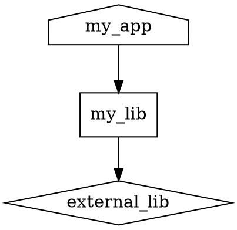

# 21 — IDE 集成与调试技巧

> 前置教程: [[14-cmake-presets]]、[[19-cmake-internal-architecture]]
> 预计耗时: 45 分钟
> 阶段: 第五阶段 — 精通

---

## 概念

### 为什么 IDE 集成很重要？

CMake 是纯命令行工具，但大多数工程师在 IDE 中工作。IDE 集成让你：

1. **无需离开编辑器**: 配置、构建、调试在同一个界面完成
2. **智能感知**: IDE 理解你的项目结构后能提供准确的代码补全和跳转
3. **团队标准化**: `CMakePresets.json` 让全团队用同样的构建配置，避免"在我机器上能跑"
4. **可视化调试**: 断点、调用栈、变量检查直接作用于 CMake 构建的目标

### IDE 与 CMake 的三种交互模型

不同 IDE 用三种根本不同的方式理解 CMake 项目：

| 模型 | IDE 代表 | 原理 |
|------|---------|------|
| **直接解析** | CLion、Qt Creator | IDE 内建 CMake 解析引擎，直接读取 `CMakeLists.txt` 并在内存中模拟配置 |
| **生成器模式** | Visual Studio (完整生成)、Xcode | CMake 生成 `.sln`/`.xcodeproj`，IDE 像对待手写项目一样打开 |
| **文件 API 模式** | VS Code (CMake Tools)、VS 2017+ (Open Folder) | CMake 运行配置后通过 file-api 输出 JSON 描述文件，IDE 读取这些文件 |

> [!tip] 文件 API 是最通用的模式
> 几乎所有现代 IDE 集成最终都依赖 file-api。理解它的工作原理能帮你诊断大多数 IDE 集成问题。

---

## CMake file-api: IDE 如何"读懂"你的项目

### 原理

CMake 配置完成后，在 `build/.cmake/api/v1/` 目录生成一系列 JSON 文件：

```
build/
└── .cmake/
    └── api/
        └── v1/
            ├── reply/
            │   ├── codemodel-v2-<hash>.json    # 目标、源文件、编译选项
            │   ├── cache-v2-<hash>.json         # 缓存变量
            │   ├── cmakeFiles-v1-<hash>.json    # 所有 CMakeLists.txt 路径
            │   └── toolchains-v1-<hash>.json    # 工具链信息
            └── query/                           # IDE 发起的查询
                └── client-<ide>-query.json      # 空文件，声明需要的 API 版本
```

IDE 发起查询的方式：在配置前创建一个空的 query 文件 `query/client-<name>-query.json`，声明需要的 reply 类型。CMake 在配置完成后生成对应的 reply。

### file-api reply 示例

一个典型的 `codemodel-v2` reply 对每个 target 描述：

```json
{
  "configurations": [{
    "targets": [{
      "name": "my_app",
      "type": "EXECUTABLE",
      "sourceDirectory": "/path/to/src",
      "buildDirectory": "/path/to/build",
      "compileGroups": [{
        "sourceIndexes": [0, 1, 2],
        "compileCommandFragments": [
          { "fragment": "-std=c++17" },
          { "fragment": "-O2" }
        ]
      }],
      "link": {
        "commandFragments": [
          { "fragment": "-lfoo" }
        ]
      }
    }]
  }]
}
```

IDE 从中提取每个目标的源文件列表、编译选项、链接选项，用于智能感知和代码导航。

> [!note] 你很少需要直接操作 file-api
> 但理解它的存在有助于诊断"IDE 不识别我的新文件"这类问题——通常清理并重新配置即可。

---

## 各 IDE 的 CMake 集成详解

### Visual Studio Code + CMake Tools 扩展

这是最流行的 CMake IDE 方案之一。CMake Tools 扩展（Microsoft 维护）提供完整的 configure → build → debug → test 工作流。

#### 核心功能

```bash
# VS Code 命令行面板 (Ctrl+Shift+P) 中的关键命令：
CMake: Configure          # 运行 cmake 配置
CMake: Build              # 构建当前目标
CMake: Build Target       # 构建指定目标（下拉列表）
CMake: Debug              # 启动调试器
CMake: Run Tests          # 运行 CTest
CMake: Quick Debug        # 不配置直接调试
CMake: Select Configure Preset   # 选择配置预设
CMake: Select Build Preset       # 选择构建预设
CMake: Select Test Preset        # 选择测试预设
CMake: Select Variant            # 选择变体 (Debug/Release/...)
CMake: Select Kit                # 选择工具链
CMake: Clean                     # 清理构建目录
CMake: Reset CMake Tools Extension State  # 重置扩展状态
```

#### CMakePresets.json 在 VS Code 中的表现

当项目根目录存在 `CMakePresets.json` 时，CMake Tools 自动识别：

- **Configure Presets** 出现在底部状态栏的下拉菜单中
- **Build Presets** 在选择 configure preset 后可用
- **Test Presets** 在选择 build preset 后可用

示例 `CMakePresets.json`：

```json
{
  "version": 6,
  "configurePresets": [
    {
      "name": "debug",
      "displayName": "Debug Config",
      "description": "Debug build with address sanitizer",
      "generator": "Ninja",
      "binaryDir": "${sourceDir}/build/debug",
      "cacheVariables": {
        "CMAKE_BUILD_TYPE": "Debug",
        "CMAKE_CXX_FLAGS": "-fsanitize=address"
      }
    },
    {
      "name": "release",
      "displayName": "Release Config",
      "inherits": "debug",
      "binaryDir": "${sourceDir}/build/release",
      "cacheVariables": {
        "CMAKE_BUILD_TYPE": "Release",
        "CMAKE_CXX_FLAGS": ""
      }
    }
  ],
  "buildPresets": [
    {
      "name": "default",
      "configurePreset": "debug"
    },
    {
      "name": "release",
      "configurePreset": "release"
    }
  ]
}
```

在 VS Code 中，`debug` 和 `release` 会作为选项显示在预设选择器中。

#### settings.json 配置

```json
{
  "cmake.configureOnOpen": true,
  "cmake.buildDirectory": "${workspaceFolder}/build/${buildType}",
  "cmake.parallelJobs": 8,
  "cmake.debugConfig": {
    "args": ["--verbose"],
    "cwd": "${workspaceFolder}"
  },
  "cmake.configureArgs": [
    "--log-level=DEBUG",
    "-DCMAKE_EXPORT_COMPILE_COMMANDS=ON"
  ],
  "cmake.copyCompileCommands": "${workspaceFolder}/compile_commands.json",
  "cmake.generator": "Ninja",
  "cmake.sourceDirectory": "${workspaceFolder}"
}
```

关键配置项说明:

| 配置项 | 作用 |
|--------|------|
| `cmake.configureOnOpen` | 打开项目时自动配置 |
| `cmake.copyCompileCommands` | 将 `compile_commands.json` 复制到工作区，供 clangd 使用 |
| `cmake.parallelJobs` | 构建并行度 |
| `cmake.debugConfig` | 传递给调试器的参数 |
| `cmake.configureArgs` | 额外的 CMake 命令行参数 |

#### VS Code 中的构建与调试流程

1. **打开文件夹**: VS Code 检测到 `CMakeLists.txt` 和 `CMakePresets.json`
2. **选择 Kit**: 底部状态栏选择编译器（如 GCC 13.2.0）
3. **选择 Preset**: 选择 configure preset
4. **配置**: CMake Tools 运行 `cmake --preset <name>`
5. **构建**: 点击底部 Build 按钮或 `F7`
6. **选择 Launch Target**: 在 Run and Debug 面板选择 CMake 目标
7. **调试**: `F5` 启动调试，断点、调用栈、变量均可用
8. **测试**: 点击底部 Test 按钮或从测试面板运行

> [!tip] CMake Tools 和 clangd 配合
> 将 `cmake.copyCompileCommands` 设为工作区根目录，配合 clangd 扩展可获得极佳的代码补全和诊断体验。CMake Tools 本身的 IntelliSense 功能可用但不如 clangd 强大。

### CLion (JetBrains)

CLion 使用"直接解析"模型——它在 IDE 进程内解析 `CMakeLists.txt` 并在每次修改后增量重载。

#### CLion 的 CMake 重载策略

```
用户修改 CMakeLists.txt
        │
        ▼
CLion 检测文件变更
        │
        ├─ 文件未保存 → 等待
        │
        └─ 文件已保存
                │
                ▼
        "Auto-Reload" 设置?
        ├─ Always → 立即重新解析
        ├─ On Save → 保存后重新解析
        └─ Never → 用户手动触发 (Tools → CMake → Reload CMake Project)
```

#### CLion 特有功能

- **CMake 缓存编辑器**: Settings → Build → CMake 中可视化编辑所有 CMake 变量，自动生成对应的 `-D` 参数
- **CMake Profiler**: 内置 Profiles 面板显示 CMake 配置阶段的耗时分布
- **Target 选择器**: 顶部工具栏下拉选择构建目标，自动填充 Run/Debug 配置
- **CMake 输出面板**: 实时显示配置输出，支持按日志级别过滤

#### CLion 的 CMakePresets.json 支持

自 CLion 2023.1 起，`CMakePresets.json` 完全支持：

1. Settings → Build → CMake 中，勾选 "Use CMakePresets.json"
2. 每个 configure preset 自动生成为一个 CMake Profile
3. Build preset 与对应的 profile 关联

#### CLion 远程 CMake

CLion 支持通过 SSH 在远程 Linux 机器上运行 CMake 和构建——对嵌入式开发和 WSL 场景极有价值：

```
本地 CLion → SSH → 远程机器 → CMake / GDB / 构建工具
                             └─ 远程 sysroot (头文件、库)
```

### Visual Studio (2017+)

VS 2017 引入了 "Open Folder" 模式，可以直接打开包含 `CMakeLists.txt` 的文件夹而不需要 `.sln` 解决方案文件。

#### VS 的 CMake 支持层级

| VS 版本 | 支持方式 |
|---------|---------|
| VS 2017 | Open Folder + 实验性 CMake 支持 |
| VS 2019 | 完善的 CMake 支持：预设、变量编辑器、目标视图 |
| VS 2022 | 全部功能 + `CMakePresets.json` 深度集成 |

#### VS 中的 CMake 工作流

1. **File → Open → CMake**: 直接打开 `CMakeLists.txt`，VS 自动启动配置
2. **Solution Explorer 切换到 CMake Targets View**: 按目标（而非文件夹）查看项目
3. **顶部工具栏**: 选择 Startup Item（启动目标）
4. **配置下拉**: 选择 x64-Debug、x64-Release 等
5. **CMake Settings Editor**: 图形化编辑 CMake 变量和预设

#### VS 的 CMakeSettings.json vs CMakePresets.json

VS 最初使用 `CMakeSettings.json`（VS 专有格式），VS 2022 开始支持 `CMakePresets.json`。推荐迁移到 `CMakePresets.json` 以实现跨 IDE 兼容。

```json
// CMakeSettings.json (旧格式，仅 VS)
{
  "configurations": [
    {
      "name": "x64-Debug",
      "generator": "Ninja",
      "configurationType": "Debug",
      "buildRoot": "${projectDir}\\build\\${name}",
      "cmakeCommandArgs": "",
      "buildCommandArgs": "",
      "ctestCommandArgs": "",
      "inheritEnvironments": ["msvc_x64_x64"],
      "variables": [
        { "name": "ENABLE_TESTS", "value": "ON", "type": "BOOL" }
      ]
    }
  ]
}
```

> [!warning] 两者共存时的优先级
> 如果项目同时有 `CMakePresets.json` 和 `CMakeSettings.json`，VS 2022 优先使用 `CMakePresets.json`。旧项目逐步迁移时先检查是否被覆盖。

### Qt Creator

Qt Creator 是 Qt 框架的官方 IDE，但其 CMake 支持非常通用。

#### 特性

- **自动检测**: 打开任何包含 `CMakeLists.txt` 的项目，Qt Creator 自动解析
- **Kit 管理**: Tools → Options → Kits 中配置编译器、Qt 版本、调试器组合
- **CMake 变量编辑器**: Projects 模式下可编辑 CMake 变量，支持搜索和批量设置
- **生成器选择**: 支持 Ninja、MinGW Makefiles、NMake、Unix Makefiles

### Xcode (macOS)

使用 Xcode 生成器生成 `.xcodeproj`，然后用 Xcode 打开：

```bash
cmake -G Xcode -B build/xcode .
open build/xcode/MyProject.xcodeproj
```

#### Xcode 生成器的局限

| 限制 | 说明 |
|------|------|
| 单向生成 | 修改 `CMakeLists.txt` 后必须重新运行 `cmake` |
| Scheme 管理 | CMake 自动为每个 target 创建 scheme，但自定义参数需在 Xcode 中手动设置 |
| 编译器标志 | 并非所有 CMake 编译器标志都能 1:1 映射到 Xcode 构建设置 |

---

## 调试 CMake 脚本

CMake 配置阶段发生在你的代码编译之前。当 `CMakeLists.txt` 的行为不符合预期时，需要专门的调试工具。

### --trace 系列参数

这是 CMake 内置的配置阶段追踪器：

```bash
# 追踪所有 CMakeLists.txt 和 .cmake 文件的执行
cmake --trace -B build .

# 只追踪指定文件（可以是多个）
cmake --trace-source=CMakeLists.txt --trace-source=cmake/MyModule.cmake -B build .

# 展开所有变量和表达式显示实际值
cmake --trace-expand -B build .

# 只追踪指定源并展开变量
cmake --trace-source=CMakeLists.txt --trace-expand -B build .
```

#### --trace 输出格式

```
# 未展开版本 --trace:
/Users/me/project/CMakeLists.txt(15):  add_executable(my_app ${APP_SRCS} )

# 展开版本 --trace-expand:
/Users/me/project/CMakeLists.txt(15):  add_executable(my_app src/main.cpp;src/helper.cpp;src/utils.cpp )
```

`--trace-expand` 将变量替换为实际值，这通常是你调试时最需要的。

#### --trace-format=json-v1

CMake 3.27+ 支持 JSON 格式的追踪输出，可被工具解析：

```bash
cmake --trace --trace-format=json-v1 -B build . 2> trace.json
```

JSON 格式输出示例：

```json
{"file":"/path/CMakeLists.txt","line":15,"cmd":"add_executable","args":["my_app","src/main.cpp"],"stack":["CMakeLists.txt"],"source":"main CMakeLists"}
```

每一行是一个 JSON 对象，包含文件名、行号、命令、参数和调用栈。适合编写自定义分析脚本。

### --debug-output 和 --debug-trycompile

```bash
# 显示 cmake 自身的诊断信息（非你的 CMakeLists.txt 执行）
cmake --debug-output -B build .

# 调试 try_compile / try_run 命令
cmake --debug-trycompile -B build .
```

`--debug-trycompile` 特别有用：它保留 `try_compile` 生成的临时项目，让你可以手动进入其构建目录查看失败原因。

### message() 作为调试工具

虽然 `--trace` 是首选，但有时在代码中插入 `message()` 更精确：

```cmake
# 基本用法
message(STATUS "MY_VAR = ${MY_VAR}")

# WARNING 级别 -- 总是显示
message(WARNING "Expected MY_VAR to be defined, got: ${MY_VAR}")

# 多值变量（list）安全输出 -- 用分号分隔查看
message(STATUS "SOURCES: ${SOURCES}")

# 在生成器表达式求值时打印（需要 add_custom_target 间接调试）
add_custom_target(debug_gen
    COMMAND ${CMAKE_COMMAND} -E echo "$<TARGET_PROPERTY:my_app,SOURCES>"
)
```

### CMAKE_MESSAGE_LOG_LEVEL

CMake 3.17+ 引入的日志级别控制变量：

```bash
cmake -DCMAKE_MESSAGE_LOG_LEVEL=DEBUG -B build .
```

或在 `CMakeLists.txt` 中设置：

```cmake
set(CMAKE_MESSAGE_LOG_LEVEL "DEBUG")
```

日志级别从低到高：

| 级别 | 值 | 含义 |
|------|-----|------|
| TRACE | 0 | 极详细，包含内部操作 |
| DEBUG | 1 | 开发者诊断信息 |
| VERIFY | 2 | cmake 内部验证 |
| STATUS | 3 | 默认级别（`message(STATUS ...)` 可见） |
| WARNING | 4 | 警告及以上 |
| ERROR | 5 | 错误及以上 |

### CMAKE_MESSAGE_CONTEXT

CMake 3.17+ 引入的上下文标识，在多级 `include`/`add_subdirectory` 场景极为有用：

```cmake
# 在主 CMakeLists.txt 中设置
list(APPEND CMAKE_MESSAGE_CONTEXT "MyProject")

# 在子目录中追加
list(APPEND CMAKE_MESSAGE_CONTEXT "subdir")

# 输出将包含: [MyProject.subdir] ...
message(STATUS "Processing subdirectory")

# 离开作用域时上下文自动弹出（变量作用域规则）
```

### CMAKE_MESSAGE_INDENT

CMake 3.17+ 引入的缩进控制：

```cmake
list(APPEND CMAKE_MESSAGE_INDENT "  ")

message(STATUS "This will be indented by two spaces")
# 输出:   This will be indented by two spaces

list(APPEND CMAKE_MESSAGE_INDENT "  ")
message(STATUS "Now indented by four spaces")
# 输出:     Now indented by four spaces
```

`CMAKE_MESSAGE_INDENT` 配合 `CMAKE_MESSAGE_CONTEXT` 可以构建层次化的调试输出，精确反映目录嵌套结构。

### variable_watch()

追踪变量何时被修改、由谁修改：

```cmake
variable_watch(MY_VAR)

# 或者带自定义回调
function(my_watch_callback variable access value current_list_file stack)
    message(STATUS "Variable ${variable} was ${access} with value '${value}'")
    message(STATUS "  File: ${current_list_file}")
    message(STATUS "  Stack: ${stack}")
endfunction()

variable_watch(MY_VAR my_watch_callback)
```

回调参数：

| 参数 | 类型 | 含义 |
|------|------|------|
| `variable` | string | 被修改的变量名 |
| `access` | string | 操作类型: `READ_ACCESS`、`UNKNOWN_READ_ACCESS`、`MODIFIED_ACCESS`、`UNKNOWN_MODIFIED_ACCESS`、`REMOVED_ACCESS` |
| `value` | string | 新值（MODIFIED 时）或空（REMOVED 时） |
| `current_list_file` | string | 触发修改的 CMakeLists.txt 或 .cmake 文件路径 |
| `stack` | string | 当前命令的调用栈 |

### 调试生成器表达式

生成器表达式在配置阶段不求值——它们在生成阶段才展开。因此 `--trace` 不会展开它们。

调试方法：

```cmake
# 方法 1: add_custom_target 打印
add_custom_target(debug_ge
    COMMAND ${CMAKE_COMMAND} -E echo "COMPILE_DEFINITIONS = $<TARGET_PROPERTY:my_app,COMPILE_DEFINITIONS>"
    COMMAND ${CMAKE_COMMAND} -E echo "LINK_LIBRARIES = $<TARGET_PROPERTY:my_app,LINK_LIBRARIES>"
    COMMAND ${CMAKE_COMMAND} -E echo "CONFIG = $<CONFIG>"
    VERBATIM
)
# 运行: cmake --build build --target debug_ge

# 方法 2: 使用 file(GENERATE) 写入文件
file(GENERATE OUTPUT "${CMAKE_BINARY_DIR}/genex_debug.txt"
     CONTENT "My value: $<TARGET_PROPERTY:my_app,COMPILE_DEFINITIONS>\n")
# 构建后查看 build/genex_debug.txt
```

---

## cmake --graphviz: 可视化目标依赖

CMake 内置 Graphviz 输出功能，将目标依赖关系导出为 DOT 文件：

```bash
cmake --graphviz=build/deps.dot -B build .
dot -Tpng build/deps.dot -o deps.png
```

生成的 DOT 文件示例：



节点形状含义：

| 形状 | 类型 |
|------|------|
| house | 可执行文件 |
| box | 静态库 |
| ellipse | 动态库 |
| diamond | 外部/导入库 |
| octagon | 自定义目标 |

> [!tip] 大型项目的 graphviz 优化
> 大型项目生成的 DOT 文件可能非常大。你可以用 `--graphviz=output.dot` 只生成外部依赖图（`INTERFACE` 依赖不被展开），或用 `grep`/`awk` 后处理 DOT 文件以过滤特定目标。

---

## CMake 性能分析

### --profiling-output 和 --profiling-format

CMake 3.18+ 支持配置阶段性能分析：

```bash
# 生成 Google Trace 格式的输出
cmake --profiling-output=profile.json --profiling-format=google-trace -B build .

# 在 Chrome 中打开 chrome://tracing，加载 profile.json 查看火焰图
```

输出的 JSON 文件可以被 Chrome 的 `chrome://tracing` 加载，以火焰图形式显示每个 CMake 命令的耗时。

---

## 常见构建错误与诊断

### 配置阶段错误 vs 构建阶段错误

这是最常见的混淆点：

| 阶段 | 典型错误 | 错误前缀 |
|------|---------|---------|
| **配置** | 找不到包、语法错误、变量未定义 | `CMake Error at CMakeLists.txt:N:` |
| **生成** | 生成器表达式错误 | `CMake Error:` (生成器上下文) |
| **构建** | 编译错误、链接错误 | `error:` / `undefined reference to` |

诊断流程：

```
错误发生
    │
    ├─ 错误消息以 "CMake Error at CMakeLists.txt:..." 开头
    │   → 配置阶段错误 → 修改 CMakeLists.txt → 重新配置
    │
    ├─ 错误消息以 "CMake Error:" 开头但没有文件名
    │   → 生成阶段错误 → 检查生成器表达式 → 重新配置
    │
    └─ 错误消息以 "error:"、"undefined reference" 等开头
        → 构建阶段错误 → 修改源代码 → 重新构建
```

### 常见配置阶段错误

```cmake
# 错误 1: 找不到包
# CMake Error at CMakeLists.txt:5 (find_package):
#   Could not find a package configuration file provided by "Foo" ...

# 解决: 设置 CMAKE_PREFIX_PATH 或 Foo_DIR
cmake -DCMAKE_PREFIX_PATH=/path/to/foo -B build .

# 错误 2: 目标不存在
# CMake Error at CMakeLists.txt:10 (target_link_libraries):
#   Cannot specify link libraries for target "bar" which is not built by this project.

# 解决: 确保 target_link_libraries 之前 target 已经用 add_library/add_executable 创建

# 错误 3: 变量未定义
# CMake Error at CMakeLists.txt:8 (if):
#   if given arguments: "MY_VAR" "STREQUAL" "ON"
# 解决: 未定义变量在 if() 中会被当作字符串，用 "${MY_VAR}" 代替
```

### 常见构建阶段错误

```bash
# 错误 4: 未定义引用
# /usr/bin/ld: undefined reference to `foo::bar()'
# 原因: 链接时缺少库 → 检查 target_link_libraries

# 错误 5: 找不到头文件
# fatal error: 'foo/bar.h' file not found
# 原因: 缺少 include 路径 → 检查 target_include_directories

# 错误 6: 多次定义
# multiple definition of `symbol'
# 原因: 同一个源文件或对象文件被链接两次
```

### 诊断工具链

```bash
# 确认 CMake 看到了什么
cmake -B build -LAH .            # 列出所有缓存变量带帮助文本
cmake -B build -N -LAH .         # -N 表示只配置不生成

# 确认构建命令
cmake --build build --verbose    # 显示完整的编译命令

# 支持 compile_commands.json
cmake -DCMAKE_EXPORT_COMPILE_COMMANDS=ON -B build .

# 查看某个目标的所有属性
get_target_property(val my_app SOURCES)
message(STATUS "my_app SOURCES: ${val}")

# 打印所有目标的名称
get_cmake_property(_all_targets BUILDSYSTEM_TARGETS)
message(STATUS "All targets: ${_all_targets}")
```

---

## 代码示例

### 示例 1: 使用 --trace 和 --trace-expand 调试 CMakeLists.txt 执行

这个示例展示如何用 `--trace` 追踪一个有多层 `add_subdirectory` 的项目的配置过程。

**项目结构**:

```
trace-demo/
├── CMakeLists.txt
├── src/
│   └── CMakeLists.txt
└── external/
    └── CMakeLists.txt
```

**根 CMakeLists.txt**:

```cmake
cmake_minimum_required(VERSION 3.24)
project(TraceDemo VERSION 1.0)

message(STATUS "Starting configuration of ${PROJECT_NAME}")

set(COMMON_SOURCES common/util.cpp common/log.cpp)

add_subdirectory(src)
add_subdirectory(external)

message(STATUS "Configuration complete")
```

**src/CMakeLists.txt**:

```cmake
set(SRC_SOURCES main.cpp helper.cpp)

add_executable(trace_app ${SRC_SOURCES} ${COMMON_SOURCES})
target_include_directories(trace_app PRIVATE ${CMAKE_CURRENT_SOURCE_DIR}/include)

message(STATUS "Added executable: trace_app")
```

**external/CMakeLists.txt**:

```cmake
set(EXT_SOURCES extlib/a.cpp extlib/b.cpp)

add_library(ext_lib STATIC ${EXT_SOURCES} ${COMMON_SOURCES})

message(STATUS "Added library: ext_lib")
```

**运行 --trace**:

```bash
# 创建 build 目录和假源文件后：
mkdir -p build src external src/include external/extlib common

# 创建占位源文件
touch common/util.cpp common/log.cpp
touch src/main.cpp src/helper.cpp
touch external/extlib/a.cpp external/extlib/b.cpp

# 追踪整个项目的执行
cmake --trace -B build . 2> trace_output.txt
```

**--trace 输出分析** (关键行):

```
# 根目录开始解析
CMakeLists.txt(1):  cmake_minimum_required(VERSION 3.24 )
CMakeLists.txt(2):  project(TraceDemo VERSION 1.0 )
CMakeLists.txt(4):  message(STATUS Starting configuration of TraceDemo )
CMakeLists.txt(6):  set(COMMON_SOURCES common/util.cpp common/log.cpp )

# 进入 src 子目录
CMakeLists.txt(8):  add_subdirectory(src )
src/CMakeLists.txt(1):  set(SRC_SOURCES main.cpp helper.cpp )
src/CMakeLists.txt(3):  add_executable(trace_app src/main.cpp src/helper.cpp common/util.cpp common/log.cpp )
src/CMakeLists.txt(4):  target_include_directories(trace_app PRIVATE .../trace-demo/src/include )
src/CMakeLists.txt(6):  message(STATUS Added executable: trace_app )

# 进入 external 子目录
CMakeLists.txt(9):  add_subdirectory(external )
external/CMakeLists.txt(1):  set(EXT_SOURCES extlib/a.cpp extlib/b.cpp )
external/CMakeLists.txt(3):  add_library(ext_lib STATIC extlib/a.cpp extlib/b.cpp common/util.cpp common/log.cpp )
external/CMakeLists.txt(5):  message(STATUS Added library: ext_lib )

# 回到根目录
CMakeLists.txt(11):  message(STATUS Configuration complete )
```

**使用 --trace-expand 展开变量**:

```bash
cmake --trace-expand --trace-source=src/CMakeLists.txt -B build .
```

展开后，`${SRC_SOURCES}` 和 `${COMMON_SOURCES}` 显示为实际值：

```
src/CMakeLists.txt(3):  add_executable(trace_app main.cpp;helper.cpp;common/util.cpp;common/log.cpp )
```

**使用 --trace-format=json-v1** (CMake 3.27+):

```bash
cmake --trace --trace-format=json-v1 -B build . 2> trace.json
```

输出 `trace.json` 中每个步骤都是结构化 JSON。

> [!tip] 只追踪关心的文件
> `--trace` 输出可能非常长。用 `--trace-source=<file>` 限定追踪范围，避免被 CMake 内置模块的追踪淹没。

---

### 示例 2: variable_watch() 追踪变量修改

这个示例展示如何用 `variable_watch()` 定位变量被意外修改的位置。

**项目结构**:

```
watch-demo/
├── CMakeLists.txt
├── cmake/
│   └── helpers.cmake
└── src/
    └── CMakeLists.txt
```

**根 CMakeLists.txt**:

```cmake
cmake_minimum_required(VERSION 3.24)
project(WatchDemo VERSION 1.0)

# 自定义回调函数 -- 在修改时捕获调用栈
function(watch_callback variable access value current_list_file stack)
    if(access STREQUAL "MODIFIED_ACCESS")
        message(STATUS
            "[WATCH] ${variable} CHANGED to: ${value}")
        message(STATUS
            "        in file: ${current_list_file}")
        message(STATUS
            "        stack: ${stack}")
    elseif(access STREQUAL "REMOVED_ACCESS")
        message(WARNING
            "[WATCH] ${variable} REMOVED in ${current_list_file}")
    elseif(access STREQUAL "READ_ACCESS")
        # 可选：追踪读操作（可能非常频繁）
        # message(TRACE "[WATCH] ${variable} READ in ${current_list_file}")
    endif()
endfunction()

# 设置初始值并开始监控
set(MY_FLAG "initial_value")
variable_watch(MY_FLAG watch_callback)

# 也会监控未赋值的变量
set(MY_COUNT "0")
variable_watch(MY_COUNT watch_callback)

include(cmake/helpers.cmake)
add_subdirectory(src)

message(STATUS "Final MY_FLAG = ${MY_FLAG}")
message(STATUS "Final MY_COUNT = ${MY_COUNT}")
```

**cmake/helpers.cmake**:

```cmake
# 这个文件"意外地"修改了 MY_FLAG
message(STATUS "[helpers.cmake] About to modify MY_FLAG...")
set(MY_FLAG "changed_by_helpers")
set(MY_COUNT "1")

# 模拟条件修改
if(CMAKE_SYSTEM_NAME STREQUAL "Linux")
    set(MY_FLAG "linux_specific")
endif()
```

**src/CMakeLists.txt**:

```cmake
message(STATUS "[src] MY_FLAG is currently: ${MY_FLAG}")
message(STATUS "[src] MY_COUNT is currently: ${MY_COUNT}")

# 这里的 file() 操作会触发读取
math(EXPR MY_COUNT "${MY_COUNT} + 1")

# 故意制造一次修改
set(MY_FLAG "final_value_from_src")
```

**运行**:

```bash
mkdir -p build cmake src && touch src/main.cpp
cmake -B build .
```

**预期输出**:

```
-- [helpers.cmake] About to modify MY_FLAG...
-- [WATCH] MY_FLAG CHANGED to: changed_by_helpers
--         in file: /path/to/cmake/helpers.cmake
--         stack: cmake/helpers.cmake;CMakeLists.txt
-- [WATCH] MY_COUNT CHANGED to: 1
--         in file: /path/to/cmake/helpers.cmake
--         stack: cmake/helpers.cmake;CMakeLists.txt
-- [src] MY_FLAG is currently: changed_by_helpers
-- [src] MY_COUNT is currently: 1
-- [WATCH] MY_FLAG CHANGED to: final_value_from_src
--         in file: /path/to/src/CMakeLists.txt
--         stack: src/CMakeLists.txt;CMakeLists.txt
-- Final MY_FLAG = final_value_from_src
-- Final MY_COUNT = 2
```

从这个输出可以清晰看到：
1. `MY_FLAG` 在 `helpers.cmake` 中被修改了两次（第二次因为 Linux 条件触发）
2. `MY_FLAG` 在 `src/CMakeLists.txt` 中被最终覆盖
3. `MY_COUNT` 只在 `helpers.cmake` 中被设置一次，后续的 `math(EXPR ...)` 只触发 `READ_ACCESS`

> [!note] variable_watch 的性能影响
> `variable_watch` 会显著减慢配置速度（每次变量访问都触发回调）。仅在调试时使用，生产项目应去掉。

---

### 示例 3: CMAKE_MESSAGE_CONTEXT 和 CMAKE_MESSAGE_INDENT 实现层级日志

这个示例展示如何在深层嵌套的 CMake 项目中构建清晰的层级调试输出。

**项目结构**:

```
context-demo/
├── CMakeLists.txt
├── modules/
│   ├── CMakeLists.txt
│   └── submod/
│       └── CMakeLists.txt
└── libs/
    └── CMakeLists.txt
```

**根 CMakeLists.txt**:

```cmake
cmake_minimum_required(VERSION 3.24)
project(ContextDemo VERSION 1.0)

# 设置根上下文
list(APPEND CMAKE_MESSAGE_CONTEXT "Root")

# 可选设置日志级别 -- 调试时打开 DEBUG
# set(CMAKE_MESSAGE_LOG_LEVEL "DEBUG")

# 封装一个辅助宏，简化上下文+缩进的使用
macro(push_context name)
    list(APPEND CMAKE_MESSAGE_CONTEXT "${name}")
    list(APPEND CMAKE_MESSAGE_INDENT "  ")
    message(DEBUG "Entering: ${name}")
endmacro()

macro(pop_context)
    list(POP_BACK CMAKE_MESSAGE_CONTEXT)
    list(POP_BACK CMAKE_MESSAGE_INDENT)
endmacro()

message(STATUS "=== Configuration Start ===")

push_context("modules")
add_subdirectory(modules)
pop_context()

push_context("libs")
add_subdirectory(libs)
pop_context()

message(STATUS "=== Configuration End ===")
```

**modules/CMakeLists.txt**:

```cmake
message(STATUS "Configuring modules group")

# 创建模块 library
add_library(core_module STATIC dummy.cpp)
message(DEBUG "Created target: core_module")

push_context("submod")
add_subdirectory(submod)
pop_context()

message(STATUS "Modules group done")
```

**modules/submod/CMakeLists.txt**:

```cmake
message(STATUS "Configuring submodule")

add_library(sub_module STATIC dummy.cpp)
message(DEBUG "Created target: sub_module")

# 模拟一个条件检查
if(CMAKE_CXX_COMPILER_ID STREQUAL "GNU")
    message(VERIFY "Compiler is GCC, applying specific flags")
    target_compile_options(sub_module PRIVATE -Wall)
else()
    message(VERIFY "Compiler is not GCC")
endif()

message(STATUS "Submodule done")
```

**libs/CMakeLists.txt**:

```cmake
message(STATUS "Configuring libraries group")

add_library(util_lib STATIC dummy.cpp)
message(DEBUG "Created target: util_lib")

message(STATUS "Libraries group done")
```

**运行**:

```bash
mkdir -p build modules/submod libs && touch modules/dummy.cpp modules/submod/dummy.cpp libs/dummy.cpp

# 默认日志级别 (STATUS)
cmake -B build .

# 以 DEBUG 级别运行 -- 显示所有上下文信息
cmake -DCMAKE_MESSAGE_LOG_LEVEL=DEBUG -B build .

# 以 VERIFY 级别运行 -- 看到条件检查信息
cmake -DCMAKE_MESSAGE_LOG_LEVEL=VERIFY -B build .
```

**DEBUG 级别预期输出**:

```
-- === Configuration Start ===
-- [Root.modules]   Configuring modules group
-- [Root.modules]     Entering: modules
-- [Root.modules]     Created target: core_module
-- [Root.modules.submod]     Configuring submodule
-- [Root.modules.submod]       Entering: submod
-- [Root.modules.submod]       Created target: sub_module
-- [Root.modules.submod]     Submodule done
-- [Root.modules]   Modules group done
-- [Root.libs]   Configuring libraries group
-- [Root.libs]     Entering: libs
-- [Root.libs]     Created target: util_lib
-- [Root.libs]   Libraries group done
-- === Configuration End ===
```

缩进层次清晰显示了 `modules → submod` 的嵌套关系。`[Root.modules.submod]` 上下文前缀精确标识消息来源。

> [!tip] 最佳实践
> 在生产项目的 `CMakeLists.txt` 中使用 `message(DEBUG ...)` 和 `message(VERIFY ...)` 代替 `message(STATUS ...)`。普通用户配置时看到干净的 STATUS 输出；需要诊断时提高日志级别即可看到详细信息。

---

## 练习

### 练习 1: 使用 --trace 和 --trace-expand 调试 CMakeLists.txt 问题

**场景**: 你接手了一个项目，运行时 `target_link_libraries` 报告某个库无法找到，但你明明看到 `find_package` 成功了。使用 `--trace` 定位变量作用域问题。

**步骤**:

1. 创建以下项目结构：

```
exercise1/
├── CMakeLists.txt
├── cmake/
│   └── find_foo.cmake
└── src/
    └── main.cpp
```

**CMakeLists.txt**:

```cmake
cmake_minimum_required(VERSION 3.24)
project(Exercise1)

set(CMAKE_MODULE_PATH "${CMAKE_SOURCE_DIR}/cmake")

# 这个函数在 find_foo.cmake 中定义并设置 FOO_LIBRARY
include(find_foo)

message(STATUS "After include: FOO_LIBRARY = ${FOO_LIBRARY}")

add_executable(exercise1 src/main.cpp)

# 问题：这里 FOO_LIBRARY 是空的
message(STATUS "Before target_link: FOO_LIBRARY = ${FOO_LIBRARY}")
target_link_libraries(exercise1 PRIVATE ${FOO_LIBRARY})
```

**cmake/find_foo.cmake**:

```cmake
message(STATUS "Inside find_foo.cmake")

# 错误：在函数内设置变量，离开函数后不可见！
function(find_foo)
    set(FOO_LIBRARY "${CMAKE_SOURCE_DIR}/libs/libfoo.a" PARENT_SCOPE)
    message(STATUS "Inside function: FOO_LIBRARY = ${FOO_LIBRARY}")
endfunction()

find_foo()
```

2. 运行 `cmake --trace --trace-source=CMakeLists.txt -B build .` 观察执行顺序
3. 观察到 `find_foo()` 函数内的 `FOO_LIBRARY` 没有传递到外层
4. 使用 `--trace-expand` 确认变量在函数外部为空
5. 修复方法：将 `set(... PARENT_SCOPE)` 改为 `set(FOO_LIBRARY ...)` 在函数外设置，或将函数改为宏 (`macro`)

> [!question] 思考题
> 如果你有 10 层 `add_subdirectory` 嵌套，如何快速定位一个变量在第几层被修改？提示：组合使用 `--trace` 和 `grep`/脚本后处理。

### 练习 2: 在 VS Code 中配置 CMake Tools + CMakePresets.json

**目标**: 使用 CMake Tools 扩展完整配置一个项目。

**步骤**:

1. 安装 VS Code 和 CMake Tools 扩展
2. 创建以下项目：

```
exercise2/
├── CMakeLists.txt
├── CMakePresets.json
├── src/
│   └── main.cpp
└── tests/
    └── test_main.cpp
```

**CMakeLists.txt**:

```cmake
cmake_minimum_required(VERSION 3.24)
project(Exercise2 VERSION 1.0)

add_executable(exercise2 src/main.cpp)

# 可选：启用测试
option(BUILD_TESTS "Build tests" ON)
if(BUILD_TESTS)
    enable_testing()
    add_executable(exercise2_test tests/test_main.cpp)
    add_test(NAME exercise2_test COMMAND exercise2_test)
endif()
```

3. 编写 `CMakePresets.json` 包含两种配置（Debug/Release）和一个构建预设
4. 在 VS Code 中用 `Ctrl+Shift+P` → `CMake: Select Configure Preset` 选择预设
5. 观察底部状态栏的预设显示
6. 使用 `F7` 构建、`Ctrl+Shift+P` → `CMake: Run Tests` 运行测试
7. 在 `settings.json` 中添加 `"cmake.copyCompileCommands": "${workspaceFolder}/compile_commands.json"` 并验证文件生成

### 练习 3: 使用 --graphviz 生成依赖图

**目标**: 为一个多目标项目生成依赖关系图。

**步骤**:

1. 创建以下项目：

```
exercise3/
├── CMakeLists.txt
├── core/
│   └── CMakeLists.txt        # add_library(core ...)
├── network/
│   └── CMakeLists.txt        # add_library(network ...) → links core
├── ui/
│   └── CMakeLists.txt        # add_library(ui ...) → links core
├── app/
│   └── CMakeLists.txt        # add_executable(app ...) → links network, ui
└── tests/
    └── CMakeLists.txt        # add_executable(tests ...) → links core, network
```

2. 确保使用 `target_link_libraries` 正确表达依赖关系
3. 运行 `cmake --graphviz=build/deps.dot -B build .`
4. 如果安装了 Graphviz (`dot` 命令)，运行 `dot -Tpng build/deps.dot -o deps.png`
5. 如果没有 Graphviz，直接打开 `deps.dot` 查看文本格式的依赖关系
6. 观察：
   - `app` 是否显示为 house 形状（可执行文件）
   - 间接依赖是否在图中可见（如 `app` → `network` → `core`）
   - 哪个目标依赖最多

> [!tip] 在线查看 DOT 文件
> 如果本地没有 Graphviz，可以将 `deps.dot` 内容粘贴到 [GraphvizOnline](https://dreampuf.github.io/GraphvizOnline/) 或 [Edotor](https://edotor.net/) 在线渲染。

---

## 扩展阅读

### 深入 CMake file-api

- [CMake file-api 官方文档](https://cmake.org/cmake/help/latest/manual/cmake-file-api.7.html) — 完整的 JSON schema 定义
- [cmake-server 模式](https://cmake.org/cmake/help/latest/manual/cmake-server.7.html) (已弃用，被 file-api 取代) — 了解演进历史

### 各 IDE 官方文档

- [VS Code CMake Tools 扩展文档](https://github.com/microsoft/vscode-cmake-tools/blob/main/docs/README.md) — 配置参考、故障排除
- [CLion CMake 支持](https://www.jetbrains.com/help/clion/cmake-support.html) — 重载策略、远程模式
- [Visual Studio CMake 项目](https://learn.microsoft.com/en-us/cpp/build/cmake-projects-in-visual-studio) — Open Folder、预设
- [Qt Creator CMake 支持](https://doc.qt.io/qtcreator/creator-project-cmake.html)

### 调试工具

- [CMake --trace 文档](https://cmake.org/cmake/help/latest/manual/cmake.1.html#options) — 所有追踪选项
- [cmake-lint](https://github.com/cheshirekow/cmake-format) — CMake 代码格式化与 lint
- [cmake-debugger](https://github.com/13pgeiser/cmake-debugger) — 社区开发的 CMake 交互式调试器（实验性）

### 相关教程

- [[08-generator-expressions]] — 生成器表达式详解（调试生成器表达式时的必备知识）
- [[14-cmake-presets]] — `CMakePresets.json` 完整参考
- [[19-cmake-internal-architecture]] — 理解配置/生成/构建三阶段，有助于诊断阶段归属错误
- [[20-multi-config-and-ninja]] — 多配置生成器与 IDE 集成的交互

---

## 常见陷阱

### 陷阱 1: 过度使用 message() 调试

```cmake
# ❌ 不好 — 配置时满屏调试信息，且调试完需要逐行删除
message(STATUS "DEBUG: MY_VAR = ${MY_VAR}")
message(STATUS "DEBUG: Entering function with args: ${ARGN}")
message(STATUS "DEBUG: Conditional branch A taken")

# ✅ 好 — 用 --trace 零代码入侵
cmake --trace-source=CMakeLists.txt --trace-expand -B build .

# ✅ 或使用 CMAKE_MESSAGE_LOG_LEVEL + message(DEBUG)
message(DEBUG "MY_VAR = ${MY_VAR}")
# 正常配置时不显示，需要时加 -DCMAKE_MESSAGE_LOG_LEVEL=DEBUG
```

### 陷阱 2: 修改 CMakeLists.txt 后忘记在 IDE 中重新加载

不同 IDE 的重载机制不同：

| IDE | 重载方式 |
|-----|---------|
| VS Code + CMake Tools | 保存文件后自动重新配置（可配置） |
| CLion | 取决于 Auto-Reload 设置；默认为 "Only if CMakeLists.txt was changed" |
| Visual Studio | 保存文件后自动重新生成 CMake 缓存 |
| Qt Creator | 保存后自动重新配置 |

> [!warning] 关键区别
> IDE 的"重新加载"意味着**重新运行 cmake 配置**。如果你在 IDE 外部（如终端）运行了 `cmake`，IDE 可能不知道配置已变化。此时需要手动触发 "Reload CMake Project" 或 "Configure"。

### 陷阱 3: 混淆配置错误与构建错误

这是新手最常见的困惑。快速区分方法：

```
错误输出以 "CMake Error at CMakeLists.txt:<行号>" 开头
    → 配置阶段错误
    → 问题在你的 CMakeLists.txt 中
    → 修改 CMakeLists.txt 后重新配置即可

错误输出以 "CMake Error:" 开头但没有文件名
    → 生成阶段错误
    → 通常是生成器表达式或某些平台特定逻辑问题

错误输出以 "error:"、"undefined reference"、"fatal error:" 开头
    → 构建阶段错误
    → 问题在你的 C/C++ 代码中
    → 修改源代码后重新构建即可
```

### 陷阱 4: --trace 输出过多

```bash
# ❌ 直接 --trace 输出数万行，淹没在 Find*.cmake 的追踪中
cmake --trace -B build .

# ✅ 限定追踪源文件
cmake --trace-source=CMakeLists.txt --trace-expand -B build .

# ✅ 如果还太多，加 grep 过滤（只过滤关键命令）
cmake --trace -B build . 2>&1 | grep -E "(set\(|add_|target_)"
```

### 陷阱 5: variable_watch 遗漏 PARENT_SCOPE 修改

```cmake
function(modify_var)
    # 这会被 variable_watch 捕获（当前作用域内）
    set(MY_VAR "new_value")
    # 这个修改发生在 PARENT_SCOPE，在当前函数内不会触发 MODIFIED_ACCESS
    set(MY_VAR "parent_value" PARENT_SCOPE)
endfunction()
```

`variable_watch` 只在调用它的作用域内监控。跨作用域修改需要分别在每个作用域设置监控。

### 陷阱 6: IDE 显示的目标与 cmake --build 目标不一致

IDE 可能缓存了旧的目标列表。如果：

1. 你新增或重命名了一个 target
2. IDE 的目标选择器中没有出现新 target

解决方案：清理并重新配置。

```bash
# VS Code CMake Tools
# Ctrl+Shift+P → CMake: Delete Cache and Reconfigure

# CLion
# Tools → CMake → Reset Cache and Reload Project

# Visual Studio
# Project → Delete Cache and Reconfigure

# 终端（通用）
rm -rf build && cmake --preset <your-preset>
```

### 陷阱 7: CMakePresets.json 被 IDE 忽略

常见原因：

| 原因 | 解决方案 |
|------|---------|
| JSON 语法错误 | 用 `python -m json.tool CMakePresets.json` 验证 |
| `version` 字段不兼容 | 检查 CMake 版本是否支持该 schema version |
| 文件不在项目根目录 | `CMakePresets.json` 必须在 `${sourceDir}/CMakePresets.json` |
| IDE 未检测到重载 | 关闭并重新打开项目/文件夹 |
| VS 同时有 `CMakeSettings.json` | VS 可能读取了旧文件，删除或迁移 |
