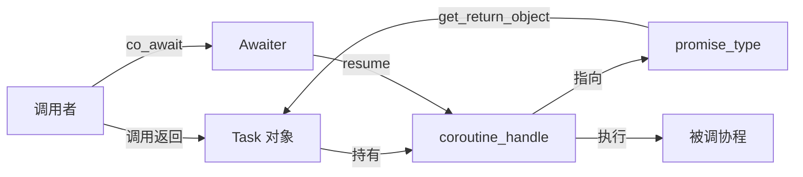

# 协程 Part 3 — 编写 Task 类型

> **所属计划**: C++ 异步编程学习计划 — 阶段 2：协程
> **预计耗时**: 90 分钟
> **前置知识**: [[05-coroutines-co-await|协程 Part 1：co_await 与 Awaitable]]、[[06-coroutines-promise-type|协程 Part 2：promise_type 深入]]
> **C++ 标准**: C++20 (`<coroutine>`)

---

## 1. 概念讲解

### 1.1 为什么需要自己的 Task 类型？

C++20 标准库只提供了协程的**底层原语**（`std::coroutine_handle`、`std::suspend_always`、`std::suspend_never`），但**没有提供任何协程返回类型**。这意味着你不能直接写：

```cpp
std::task<int> compute() {  // ❌ std::task 不存在！
    co_return 42;
}
```

标准委员会故意将高层抽象留给库作者。因此，任何实际使用协程的项目都需要**从零实现自己的 Task 类型**。这也是理解协程机制的最佳方式——亲手写一遍，所有概念就通了。

### 1.2 Task 类型的三层角色

一个 Task 类型实际上由三个相互协作的部分组成：

| 角色 | 职责 | 对应类型 |
|------|------|----------|
| **Task 对象** | 用户持有的返回值，由协程体返回，可移动不可复制 | `Task<T>` |
| **promise_type** | 协程框架与 Task 之间的中间层，控制协程行为 | `Task<T>::promise_type` |
| **Awaiter** | 允许 `co_await` 另一个 Task，实现子任务等待 | 内部类（`awaiter`）或 `operator co_await` |

这三者之间的关系可以用下图概括：



### 1.3 Lazy vs Eager Start

这是设计 Task 类型的第一个关键决策：

| 策略 | 行为 | 优点 | 缺点 |
|------|------|------|------|
| **Eager（热启动）** | `Task f()` 调用时立即开始执行协程体 | 直觉简单、"像普通函数" | 无法组合——Task 可能在你持有它之前就跑完了 |
| **Lazy（冷启动）** | 协程体只在首次 `co_await` 或显式 `start()` 时才运行 | 可组合、可存储、可按需重试 | 需要显式触发 |

****推荐：Lazy start。** 工业界主流实践（cppcoro、folly::coro）都采用惰性启动。本文实现 Lazy Task。

```cpp
Task<int> compute() {
    co_return 42;  // ← 函数体尚未执行！
}

int main() {
    auto task = compute();  // ← 仅创建 Task 对象，协程体未开始
    int result = co_await task;  // ← 此时才真正执行
}
```

### 1.4 Move-Only 语义

协程的 `coroutine_handle` 是一个不可拷贝的资源句柄（类似 `unique_ptr`），因此 Task 必须是 **move-only**：

```cpp
Task<int> a = compute();
// Task<int> b = a;       // ❌ 编译错误：拷贝构造已删除
Task<int> c = std::move(a);  // ✅ 移动后 a 变为空 / 无效状态
```

### 1.5 Symmetric Transfer（对称转移）

这是协程性能的核心优化。看一个典型的调用链：

```cpp
Task<void> task_c() { co_return; }
Task<void> task_b() { co_await task_c(); }  // b 等待 c
Task<void> task_a() { co_await task_b(); }  // a 等待 b
```

如果简单地 `h.resume()` 恢复——每次 `co_await` 都会：

1. 在**调用方协程**的栈帧中调用 `resume()`
2. `resume()` 内部执行被等待协程
3. 被等待协程结束后，`resume()` 返回
4. 回到调用方协程栈帧，继续执行

这会导致调用链多深，调用栈就有多深——跟普通递归一样会**栈溢出**。

**对称转移** 的解决方案：`co_await` 的 awaiter 不调用 `resume()`，而是**返回下一个要恢复的协程句柄**。编译器看到返回的是另一个协程句柄时，会**直接跳转**（不经过中间栈帧），实现 $O(1)$ 栈深度的协程链。

```cpp
// 传统方式：栈随调用链线性增长
void resume_chain() {
    for (auto* h = head; h; h = h->next)
        h.resume();  // ← 每层都在上一个的栈帧内
}

// 对称转移方式：每次 co_await 返回被等待协程的 handle
// 编译器直接跳转——不增长调用栈
```

### 1.6 final_suspend 与资源管理

协程在 `final_suspend` 时必须返回 `suspend_always`（或类似的挂起点），**绝不能**返回 `suspend_never`。

原因：如果 `final_suspend` 返回 `suspend_never`，协程帧会在协程体结束的瞬间被销毁。但如果此时还有代码（比如 awaiter）持有指向协程帧的引用，就会 **use-after-free**。

```cpp
struct promise_type {
    // ✅ 正确：final_suspend 挂起，由 Task 析构负责销毁
    std::suspend_always final_suspend() noexcept { return {}; }

    // ❌ 致命错误：协程帧立即销毁 → use-after-free
    // std::suspend_never final_suspend() noexcept { return {}; }
};
```

### 1.7 异常传播

协程体内的异常会被 `promise_type::unhandled_exception()` 捕获。Task 类型需要在内部存储异常指针，并在调用者获取结果时重新抛出：

```cpp
void unhandled_exception() {
    exception_ = std::current_exception();  // 捕获异常
}
```

### 1.8 await_transform vs operator co_await

当用户写 `co_await some_task` 时，编译器会查找两种路径：

1. **`promise_type::await_transform(expr)`**：优先级最高，编译器在 promise 上查找此成员函数
2. **`expr.operator co_await()`**：在表达式本身上查找

对于 Task 类型，**推荐方式 A**：在 `promise_type` 中实现 `await_transform`，用于等待子 Task。方式 B（`operator co_await`）更适合等待外部类型（如 `std::suspend_always`）。本文在代码示例中展示两种方式的结合。

---

## 2. 代码示例

### 示例 1：最小化 Lazy `Task<void>`

这是最精简的实现，演示协程 Task 的完整生命周期。每个设计决策都有注释说明。

```cpp
// compile: g++ -std=c++20 -fcoroutines -o task1 task1.cpp
// expected output:
//   Task created
//   Coroutine body started
//   Coroutine body finished
//   Task destroyed (handle cleaned up)

#include <iostream>
#include <coroutine>

// ============================================================
// 核心 Task<void> 类型
// ============================================================
class Task {
public:
    // ---- promise_type：协程框架与 Task 的桥梁 ----
    struct promise_type {
        // get_return_object：协程开始时调用，创建 Task 对象
        Task get_return_object() {
            return Task{
                std::coroutine_handle<promise_type>::from_promise(*this)
            };
        }

        // initial_suspend：返回 suspend_always 实现 lazy start
        // 协程体不会自动执行，需要外部 resume
        std::suspend_always initial_suspend() noexcept {
            std::cout << "Task created (lazy, not started yet)\n";
            return {};
        }

        // final_suspend：必须挂起！否则协程帧会在结束瞬间销毁
        std::suspend_always final_suspend() noexcept {
            std::cout << "Coroutine body finished\n";
            return {};
        }

        void return_void() noexcept {}

        void unhandled_exception() {
            std::terminate();  // 最小化处理：有异常直接终止
        }
    };

    // ---- Task 对象生命周期 ----

    // 从 coroutine_handle 构造（只有 promise_type 使用）
    explicit Task(std::coroutine_handle<promise_type> h)
        : handle_(h) {}

    // 禁止拷贝：coroutine_handle 不可复制
    Task(const Task&) = delete;
    Task& operator=(const Task&) = delete;

    // 允许移动
    Task(Task&& other) noexcept
        : handle_(std::exchange(other.handle_, nullptr)) {}

    Task& operator=(Task&& other) noexcept {
        if (this != &other) {
            if (handle_) handle_.destroy();
            handle_ = std::exchange(other.handle_, nullptr);
        }
        return *this;
    }

    // 析构：销毁协程帧
    ~Task() {
        if (handle_) {
            std::cout << "Task destroyed (handle cleaned up)\n";
            handle_.destroy();
        }
    }

    // ---- 用户接口 ----

    // 启动 / 恢复协程执行
    void resume() {
        if (handle_ && !handle_.done()) {
            handle_.resume();
        }
    }

    // 检查是否已完成
    bool done() const { return !handle_ || handle_.done(); }

    // 获取底层 handle（给 awaiter 使用）
    auto get_handle() const { return handle_; }

private:
    std::coroutine_handle<promise_type> handle_;
};

// ============================================================
// 使用示例
// ============================================================

Task my_coroutine() {
    std::cout << "Coroutine body started\n";
    co_return;  // 返回 void
}

int main() {
    auto task = my_coroutine();  // ← 仅创建 Task，不执行
    // 此时输出 "Task created (lazy, not started yet)"

    task.resume();               // ← 手动恢复，开始执行
    // 输出 "Coroutine body started" → "Coroutine body finished"

    // task 离开作用域 → 析构 → handle_.destroy()
    // 输出 "Task destroyed (handle cleaned up)"
}
```

**关键点**：
- `initial_suspend` 返回 `suspend_always` → lazy start
- `final_suspend` 返回 `suspend_always` → 协程帧不会自动销毁，由 Task 析构负责
- `coroutine_handle<promise_type>::from_promise(*this)` — 从 promise 对象反查对应的 handle

---

### 示例 2：`Task<T>` — 带返回值的 Task

添加返回值支持、异常传播、以及等待子 Task 的能力。

```cpp
// compile: g++ -std=c++20 -fcoroutines -o task2 task2.cpp
// expected output:
//   [main] creating tasks...
//   [outer] calling inner...
//   [inner] computing value
//   [outer] got result from inner: 42
//   [outer] computing final result
//   [main] outer returned: 84
//   All tasks destroyed.

#include <iostream>
#include <coroutine>
#include <variant>      // for result storage
#include <exception>
#include <cassert>

// ============================================================
// Task<T> — 支持返回值的协程 Task
// ============================================================
template<typename T>
class Task {
public:
    struct promise_type {
        // 存储结果：要么是 T，要么是异常
        std::variant<std::monostate, T, std::exception_ptr> result_;

        Task get_return_object() {
            return Task{
                std::coroutine_handle<promise_type>::from_promise(*this)
            };
        }

        std::suspend_always initial_suspend() noexcept { return {}; }
        std::suspend_always final_suspend() noexcept { return {}; }

        // 存储返回值
        template<typename U>
            requires std::convertible_to<U, T>
        void return_value(U&& value) {
            result_.template emplace<1>(std::forward<U>(value));
        }

        // 捕获异常——存储异常指针而非立即传播
        void unhandled_exception() {
            result_.template emplace<2>(std::current_exception());
        }
    };

    // ---- Move-only ----
    explicit Task(std::coroutine_handle<promise_type> h)
        : handle_(h) {}

    Task(const Task&) = delete;
    Task& operator=(const Task&) = delete;

    Task(Task&& other) noexcept
        : handle_(std::exchange(other.handle_, nullptr)) {}

    Task& operator=(Task&& other) noexcept {
        if (this != &other) {
            if (handle_) handle_.destroy();
            handle_ = std::exchange(other.handle_, nullptr);
        }
        return *this;
    }

    ~Task() {
        if (handle_) {
            handle_.destroy();
        }
    }

    // ---- 用户接口 ----

    // 获取结果（必须等协程结束后才调用）
    T result() {
        auto& result_ = handle_.promise().result_;
        // 如果是异常，重新抛出
        if (std::holds_alternative<std::exception_ptr>(result_)) {
            std::rethrow_exception(std::get<std::exception_ptr>(result_));
        }
        // 返回存储的值
        assert(std::holds_alternative<T>(result_));
        return std::move(std::get<T>(result_));
    }

    void resume() const {
        if (handle_ && !handle_.done()) {
            handle_.resume();
        }
    }

    bool done() const { return !handle_ || handle_.done(); }

    std::coroutine_handle<promise_type> get_handle() const {
        return handle_;
    }

    // promise_type 的引用（Awaiter 读取结果用）
    promise_type& promise() { return handle_.promise(); }

private:
    std::coroutine_handle<promise_type> handle_;
};

// ============================================================
// 使用示例：嵌套协程
// ============================================================

Task<int> inner() {
    std::cout << "[inner] computing value\n";
    co_return 42;
}

Task<int> outer() {
    std::cout << "[outer] calling inner...\n";

    auto inner_task = inner();      // 创建子 Task
    inner_task.resume();            // 手动执行子协程
    int val = inner_task.result();  // 获取结果

    std::cout << "[outer] got result from inner: " << val << "\n";
    std::cout << "[outer] computing final result\n";
    co_return val * 2;
}

int main() {
    std::cout << "[main] creating tasks...\n";

    auto outer_task = outer();
    outer_task.resume();

    int r = outer_task.result();
    std::cout << "[main] outer returned: " << r << "\n";

    std::cout << "All tasks destroyed.\n";
}
```

**设计要点**：

- 使用 `std::variant<std::monostate, T, std::exception_ptr>` 存储三种状态：未设置 / 有值 / 有异常
- `return_value` 用约束模板 `std::convertible_to<U, T>` 允许隐式转换（如 `co_return 42` 返回 `Task<double>`）
- 异常在 `unhandled_exception` 中暂存，在 `result()` 时重新抛出——延迟传播，给调用者控制权

---

### 示例 3：真正的 `co_await` Task — 对称转移

上面的示例 2 需要手动 `resume()` + 检查 `done()` + 调用 `result()`——这不是真正的 `co_await` 体验。下面实现完整的 awaiter，支持 `co_await task` 语法和对称转移。

```cpp
// compile: g++ -std=c++20 -fcoroutines -o task3 task3.cpp
// expected output:
//   [main] creating task_a...
//   [task_a] calling task_b...
//   [task_b] calling task_c...
//   [task_c] computing value
//   [task_c] done
//   [task_b] got: 42
//   [task_b] done
//   [task_a] got: 84
//   [task_a] done
//   [main] result: 84
//   All done.

#include <iostream>
#include <coroutine>
#include <variant>
#include <exception>
#include <cassert>
#include <utility>

// ============================================================
// 前置声明
// ============================================================
template<typename T>
class Task;

// ============================================================
// Task<T> — 支持 co_await 的完整实现
// ============================================================
template<typename T>
class Task {
public:
    struct promise_type {
        // ---- 结果存储 ----
        std::variant<std::monostate, T, std::exception_ptr> result_;

        // ---- 指向当前正在等待此 Task 的 continuation ----
        // 对称转移的关键：存储"谁在等我"的句柄
        std::coroutine_handle<> continuation_{nullptr};

        Task get_return_object() {
            return Task{
                std::coroutine_handle<promise_type>::from_promise(*this)
            };
        }

        std::suspend_always initial_suspend() noexcept {
            return {};  // lazy start
        }

        // ---- final_suspend：对称转移的核心 ----
        auto final_suspend() noexcept {
            struct FinalAwaiter {
                bool await_ready() noexcept { return false; }

                // 对称转移：协程结束时，直接恢复等待者
                std::coroutine_handle<> await_suspend(
                    std::coroutine_handle<promise_type> h) noexcept
                {
                    auto& promise = h.promise();
                    if (promise.continuation_) {
                        // 直接跳转到等待者，不经过中间层
                        return promise.continuation_;
                    }
                    return std::noop_coroutine();  // 没有等待者，返回 noop
                }

                void await_resume() noexcept {}
            };
            return FinalAwaiter{};
        }

        // ---- 存储返回值 ----
        template<typename U>
            requires std::convertible_to<U, T>
        void return_value(U&& value) {
            result_.template emplace<1>(std::forward<U>(value));
        }

        void unhandled_exception() {
            result_.template emplace<2>(std::current_exception());
        }
    };

    // ---- Move-only ----
    explicit Task(std::coroutine_handle<promise_type> h)
        : handle_(h) {}

    Task(const Task&) = delete;
    Task& operator=(const Task&) = delete;

    Task(Task&& other) noexcept
        : handle_(std::exchange(other.handle_, nullptr)) {}

    Task& operator=(Task&& other) noexcept {
        if (this != &other) {
            if (handle_) handle_.destroy();
            handle_ = std::exchange(other.handle_, nullptr);
        }
        return *this;
    }

    ~Task() {
        if (handle_) handle_.destroy();
    }

    // ---- Awaiter：支持 co_await ----
    // 当用户写 "co_await some_task" 时编译器调用此方法
    auto operator co_await() {
        struct Awaiter {
            std::coroutine_handle<promise_type> handle_;

            bool await_ready() {
                // 如果协程已经完成，直接返回结果（不再挂起）
                return handle_.done();
            }

            // await_suspend 被调用时：
            //   - 参数 h 是当前协程（调用 co_await 的协程）的句柄
            //   - 我们需要将 h 登记为"等待者"，然后恢复被等待的协程
            std::coroutine_handle<> await_suspend(
                std::coroutine_handle<> h)
            {
                // 记录当前协程为 continuation
                handle_.promise().continuation_ = h;
                // 返回被等待协程的句柄 → 编译器执行对称转移
                return handle_;
            }

            // await_resume：协程恢复时，从 promise 中取出结果
            T await_resume() {
                auto& result_ = handle_.promise().result_;
                if (std::holds_alternative<std::exception_ptr>(result_)) {
                    std::rethrow_exception(
                        std::get<std::exception_ptr>(result_)
                    );
                }
                assert(std::holds_alternative<T>(result_));
                return std::move(std::get<T>(result_));
            }
        };

        return Awaiter{handle_};
    }

    // 底层恢复（用于外部手动驱动，非 co_await 场景）
    void resume() const {
        if (handle_ && !handle_.done()) {
            handle_.resume();
        }
    }

    bool done() const { return !handle_ || handle_.done(); }
    auto get_handle() const { return handle_; }

private:
    std::coroutine_handle<promise_type> handle_;
};

// ============================================================
// Task<void> 特化
// ============================================================
template<>
class Task<void> {
public:
    struct promise_type {
        std::exception_ptr exception_;
        std::coroutine_handle<> continuation_{nullptr};

        Task get_return_object() {
            return Task{
                std::coroutine_handle<promise_type>::from_promise(*this)
            };
        }

        std::suspend_always initial_suspend() noexcept { return {}; }

        auto final_suspend() noexcept {
            struct FinalAwaiter {
                bool await_ready() noexcept { return false; }
                std::coroutine_handle<> await_suspend(
                    std::coroutine_handle<promise_type> h) noexcept
                {
                    auto& promise = h.promise();
                    if (promise.continuation_) {
                        return promise.continuation_;
                    }
                    return std::noop_coroutine();
                }
                void await_resume() noexcept {}
            };
            return FinalAwaiter{};
        }

        void return_void() noexcept {}
        void unhandled_exception() {
            exception_ = std::current_exception();
        }
    };

    explicit Task(std::coroutine_handle<promise_type> h)
        : handle_(h) {}

    Task(const Task&) = delete;
    Task& operator=(const Task&) = delete;

    Task(Task&& other) noexcept
        : handle_(std::exchange(other.handle_, nullptr)) {}

    Task& operator=(Task&& other) noexcept {
        if (this != &other) {
            if (handle_) handle_.destroy();
            handle_ = std::exchange(other.handle_, nullptr);
        }
        return *this;
    }

    ~Task() { if (handle_) handle_.destroy(); }

    auto operator co_await() {
        struct Awaiter {
            std::coroutine_handle<promise_type> handle_;

            bool await_ready() { return handle_.done(); }
            std::coroutine_handle<> await_suspend(std::coroutine_handle<> h) {
                handle_.promise().continuation_ = h;
                return handle_;
            }
            void await_resume() {
                auto& promise = handle_.promise();
                if (promise.exception_) {
                    std::rethrow_exception(promise.exception_);
                }
            }
        };
        return Awaiter{handle_};
    }

    void resume() const {
        if (handle_ && !handle_.done()) handle_.resume();
    }

    bool done() const { return !handle_ || handle_.done(); }

    void result() {
        auto& promise = handle_.promise();
        if (promise.exception_) std::rethrow_exception(promise.exception_);
    }

private:
    std::coroutine_handle<promise_type> handle_;
};

// ============================================================
// 使用示例：真正的 co_await 语法
// ============================================================

Task<int> task_c() {
    std::cout << "[task_c] computing value\n";
    co_return 42;
    std::cout << "[task_c] done\n";
}

Task<int> task_b() {
    std::cout << "[task_b] calling task_c...\n";
    int val = co_await task_c();  // ← 真正的 co_await！
    std::cout << "[task_b] got: " << val << "\n";
    co_return val * 2;
    std::cout << "[task_b] done\n";
}

Task<int> task_a() {
    std::cout << "[task_a] calling task_b...\n";
    int val = co_await task_b();  // ← co_await 嵌套
    std::cout << "[task_a] got: " << val << "\n";
    co_return val;
    std::cout << "[task_a] done\n";
}

int main() {
    std::cout << "[main] creating task_a...\n";
    auto t = task_a();

    // lazy start：手动触发根协程
    t.resume();

    // 此时整个调用链已通过对称转移递归完成
    if (t.done()) {
        std::cout << "[main] result: " << t.operator co_await().await_resume() << "\n";
    }

    std::cout << "All done.\n";
}
```

**对称转移的执行流程**：

1. `main` 调用 `t.resume()`，开始执行 `task_a`
2. `task_a` 中 `co_await task_b()`：
   - Awaiter 的 `await_suspend` 将 `task_a` 的 continuation 设为 `task_b`
   - 返回 `task_b` 的 handle → 编译器直接跳转到 `task_b`，**不经过 task_a 栈帧**
3. `task_b` 中 `co_await task_c()`：同理，跳转到 `task_c`
4. `task_c` 执行完毕 → `final_suspend` 返回 `task_b` 的 continuation → 跳回 `task_b`
5. `task_b` 完成 → 跳回 `task_a`
6. `task_a` 完成 → 无 continuation → 返回 `noop_coroutine`

全程调用栈深度为 1（只有当前正在执行的协程在栈上），**不发生栈溢出**。

---

### 示例 4：`await_transform` — 在 promise 层面拦截 co_await

当你希望**限制**一个协程内可以 `co_await` 哪些类型时，使用 `await_transform`：

```cpp
// compile: g++ -std=c++20 -fcoroutines -o task4 task4.cpp
// expected output:
//   [main] starting...
//   [compute] fiber_1 done
//   [compute] fiber_2 done
//   [compute] result: 3.14
//   [main] got: 3.14

#include <iostream>
#include <coroutine>
#include <chrono>
#include <thread>

// 简化的"纤程"类型——模拟非协程的异步操作
class Fiber {
public:
    Fiber(int id) : id_(id) {
        std::cout << "[fiber " << id_ << "] started\n";
    }

    bool is_done() const {
        // 模拟：第一次检查时未完成，之后完成
        static int check = 0;
        return ++check > 1;
    }

    int id() const { return id_; }

private:
    int id_;
};

// ============================================================
// Task<double> with await_transform
// ============================================================
template<typename T>
class TaskWithTransform {
public:
    struct promise_type {
        std::variant<std::monostate, T, std::exception_ptr> result_;
        std::coroutine_handle<> continuation_{nullptr};

        TaskWithTransform get_return_object() {
            return TaskWithTransform{
                std::coroutine_handle<promise_type>::from_promise(*this)
            };
        }

        std::suspend_always initial_suspend() noexcept { return {}; }

        auto final_suspend() noexcept {
            struct FinalAwaiter {
                bool await_ready() noexcept { return false; }
                std::coroutine_handle<> await_suspend(
                    std::coroutine_handle<promise_type> h) noexcept
                {
                    auto& p = h.promise();
                    if (p.continuation_) return p.continuation_;
                    return std::noop_coroutine();
                }
                void await_resume() noexcept {}
            };
            return FinalAwaiter{};
        }

        template<typename U>
            requires std::convertible_to<U, T>
        void return_value(U&& value) {
            result_.template emplace<1>(std::forward<U>(value));
        }

        void unhandled_exception() {
            result_.template emplace<2>(std::current_exception());
        }

        // ---- await_transform：拦截 Fibre 的 co_await ----
        // 当协程体内写 "co_await fiber_obj" 时，编译器调用此方法
        auto await_transform(Fiber& fiber) {
            struct FiberAwaiter {
                Fiber& fiber_;

                bool await_ready() { return fiber_.is_done(); }

                void await_suspend(std::coroutine_handle<> h) {
                    // 模拟忙等——实际应注册回调
                    while (!fiber_.is_done()) {
                        std::this_thread::sleep_for(
                            std::chrono::milliseconds(10));
                    }
                    h.resume();  // 非对称恢复
                }

                int await_resume() {
                    return fiber_.id();
                }
            };
            return FiberAwaiter{fiber};
        }

        // ---- await_transform：拦截协程内部 co_await 另一个 Task ----
        // 返回 awaiter，将自身 continuation 注册为等待者
        auto await_transform(TaskWithTransform&& task) {
            struct TaskAwaiter {
                std::coroutine_handle<promise_type> handle_;

                bool await_ready() { return handle_.done(); }

                std::coroutine_handle<> await_suspend(
                    std::coroutine_handle<> h)
                {
                    handle_.promise().continuation_ = h;
                    return handle_;
                }

                T await_resume() {
                    auto& r = handle_.promise().result_;
                    if (std::holds_alternative<std::exception_ptr>(r)) {
                        std::rethrow_exception(
                            std::get<std::exception_ptr>(r));
                    }
                    return std::move(std::get<T>(r));
                }
            };
            return TaskAwaiter{task.get_handle()};
        }
    };

    explicit TaskWithTransform(std::coroutine_handle<promise_type> h)
        : handle_(h) {}

    TaskWithTransform(const TaskWithTransform&) = delete;
    TaskWithTransform& operator=(const TaskWithTransform&) = delete;

    TaskWithTransform(TaskWithTransform&& other) noexcept
        : handle_(std::exchange(other.handle_, nullptr)) {}

    TaskWithTransform& operator=(TaskWithTransform&& other) noexcept {
        if (this != &other) {
            if (handle_) handle_.destroy();
            handle_ = std::exchange(other.handle_, nullptr);
        }
        return *this;
    }

    ~TaskWithTransform() { if (handle_) handle_.destroy(); }

    void resume() const {
        if (handle_ && !handle_.done()) handle_.resume();
    }

    bool done() const { return !handle_ || handle_.done(); }

    auto get_handle() const { return handle_; }

    T result() {
        auto& r = handle_.promise().result_;
        if (std::holds_alternative<std::exception_ptr>(r)) {
            std::rethrow_exception(std::get<std::exception_ptr>(r));
        }
        return std::move(std::get<T>(r));
    }

private:
    std::coroutine_handle<promise_type> handle_;
};

// ============================================================
// 使用示例
// ============================================================

TaskWithTransform<double> compute() {
    Fiber f1(1);
    Fiber f2(2);

    int id1 = co_await f1;   // ← await_transform 拦截
    std::cout << "[compute] fiber_" << id1 << " done\n";

    int id2 = co_await f2;   // ← await_transform 拦截
    std::cout << "[compute] fiber_" << id2 << " done\n";

    co_return 3.14;
    std::cout << "[compute] result: 3.14\n";
}

int main() {
    std::cout << "[main] starting...\n";
    auto task = compute();
    task.resume();
    std::cout << "[main] got: " << task.result() << "\n";
}
```

**`operator co_await` vs `await_transform` 选择指南**：

| 场景 | 推荐方式 |
|------|---------|
| 等待另一个同类型 Task | `operator co_await` 在 Task 类上 |
| 等待内置类型（如 `suspend_always`） | 默认行为即可 |
| 等待外部 / 第三方类型 | `await_transform` 在 promise_type 中 |
| 限制可等待类型集 | `await_transform` 并标记不匹配的类型为 `= delete` |

---

### 示例 5：`Task<void>` 的异常传播测试

演示异常如何在嵌套协程间正确传播。

```cpp
// compile: g++ -std=c++20 -fcoroutines -o task5 task5.cpp
// expected output:
//   [deep] throwing...
//   [middle] caught: oops!
//   [middle] returning normally: 100
//   [top] result: 100

#include <iostream>
#include <coroutine>
#include <variant>
#include <exception>
#include <cassert>
#include <utility>
#include <stdexcept>

// 复用示例 3 的 Task<T> 和 Task<void> 定义（此处省略，见上文）
// ============ （见示例 3 的 Task 实现） ============

// 为了本示例的自包含性，此处使用前述 Task<int> 和 Task<void> 的定义

template<typename T>
class Task {
    // ... 与示例 3 相同 ...
};

template<>
class Task<void> {
    // ... 与示例 3 相同 ...
};

// ============================================================
// 使用：异常传播测试
// ============================================================

Task<void> deep() {
    std::cout << "[deep] throwing...\n";
    throw std::runtime_error("oops!");
    co_return;
}

Task<void> middle() {
    try {
        co_await deep();  // ← 异常从 deep 传播到 middle
    } catch (const std::runtime_error& e) {
        std::cout << "[middle] caught: " << e.what() << "\n";
    }
    co_return;
    std::cout << "[middle] returning normally\n";
}

Task<int> top() {
    co_await middle();  // middle 正常返回（内部 catch 了异常）
    co_return 100;
    std::cout << "[top] result: 100\n";
}

int main() {
    auto t = top();
    t.resume();
    if (t.done()) {
        std::cout << "[top] result: "
                  << t.operator co_await().await_resume() << "\n";
    }
}
```

---

## 3. 练习

### 练习 1（基础）：为 Task 添加继续回调

在 Task 对象完成后（`final_suspend` 时），自动调用注册的回调函数。

**要求**：

- 在 `promise_type` 中添加 `std::function<void()> on_complete_` 字段
- 添加 `Task::on_complete(std::function<void()> callback)` 方法，在 Task 完成后调用
- 在 `final_suspend` 的 awaiter 的 `await_suspend` 中，先调用回调、再返回 continuation
- 编写测试：注册一个打印 "Completed!" 的回调，验证它在结果返回前被调用

**提示**：注意回调抛出异常的情况——考虑是否需要 `noexcept`。

**编译指令**：`g++ -std=c++20 -fcoroutines -o ex1 ex1.cpp`

**预期输出**：

```
Callback: task is about to complete
Result: 42
```

---

### 练习 2（进阶）：实现 `Task<void>::when_all()`

实现一个静态方法，并发执行多个 Task 并等待全部完成。

**要求**：

- `static Task<std::vector<T>> when_all(std::vector<Task<T>> tasks)`
- 使用 `std::thread` 或 `std::jthread` 并发执行（协程本身体现在每个 Task 内部）
- 所有子 Task 完成后，收集结果（按原始顺序）并返回
- 如果任一子 Task 抛出异常，取消其余执行并传播异常
- 注意线程安全：多个线程可能同时访问不同的 Task

**提示**：需要 `std::mutex` + `std::condition_variable`，或者用 `std::atomic<int>` 计数。每个 Task 在自己的线程上执行。对于异常取消，可用 `std::atomic<bool> cancelled_`。

**编译指令**：`g++ -std=c++20 -fcoroutines -pthread -o ex2 ex2.cpp`

**预期输出**（顺序可能变化）：

```
[task-0] computing...
[task-1] computing...
[task-2] computing...
[task-0] done
[task-1] done
[task-2] done
Results: [100, 200, 300]
```

---

### 练习 3（高级）：添加取消支持

为 Task 添加 `stop_token` 取消机制。

**要求**：

- Task 构造函数接受一个 `std::stop_token`（或存储在 `promise_type` 中）
- 协程体内的 checkpoints（自定义 `co_await` 表达式）应检查 `stop_token`，如果取消请求已发出则抛 `std::stop_callback` 对应的异常或提前返回
- 实现 `Task::cancel()` 方法触发取消
- 编写测试：创建一个长时间运行的协程，从另一个线程取消它，验证协程被干净地终止

**提示**：

- 使用 `std::stop_source` / `std::stop_token`（C++20 `<stop_token>`）
- 在 `promise_type` 中存储 `std::stop_token`
- 自定义一个 `CancellationPoint` awaiter，在 `await_suspend` 中检查 `stop_token.stop_requested()`

**编译指令**：`g++ -std=c++20 -fcoroutines -pthread -o ex3 ex3.cpp`

**预期输出**：

```
[worker] doing step 1...
[worker] doing step 2...
[main] cancel requested
[worker] cancelled at step 3
[main] worker was cancelled
```

---

## 3.5 参考答案

> [!tip]- 练习 1 参考答案
> 在示例 2 `Task<T>` 的基础上添加继续回调。关键修改在 `promise_type` 和 `final_suspend` 的 awaiter 中：
> 
> ```cpp
> #include <coroutine>
> #include <functional>
> #include <iostream>
> #include <optional>
> #include <stdexcept>
> 
> template<typename T>
> class Task {
> public:
>     struct promise_type {
>         std::optional<T> result_;
>         std::exception_ptr error_;
>         std::function<void()> on_complete_;  // 继续回调
> 
>         // --- 协程生命周期 ---
>         Task get_return_object() {
>             return Task{std::coroutine_handle<promise_type>::from_promise(*this)};
>         }
>         std::suspend_always initial_suspend() { return {}; }
> 
>         // final_suspend 使用自定义 awaiter，在 suspend 之前调用回调
>         auto final_suspend() noexcept {
>             struct FinalAwaiter {
>                 promise_type& promise;
> 
>                 bool await_ready() noexcept { return false; }
> 
>                 std::coroutine_handle<> await_suspend(
>                     std::coroutine_handle<promise_type> h) noexcept
>                 {
>                     // 在最终挂起前调用回调
>                     if (promise.on_complete_) {
>                         try {
>                             promise.on_complete_();
>                         } catch (...) {
>                             // 回调异常不应导致 terminate
>                             // 生产代码可记录日志
>                         }
>                     }
>                     // 返回 noop_coroutine——不需要对称转移到其他协程
>                     return std::noop_coroutine();
>                 }
> 
>                 void await_resume() noexcept {}
>             };
>             return FinalAwaiter{*this};
>         }
> 
>         void return_value(T value) {
>             result_ = std::move(value);
>         }
> 
>         void unhandled_exception() {
>             error_ = std::current_exception();
>         }
>     };
> 
>     // --- Task 对象 ---
>     using handle_t = std::coroutine_handle<promise_type>;
>     handle_t handle_;
> 
>     explicit Task(handle_t h) : handle_(h) {}
> 
>     ~Task() { if (handle_) handle_.destroy(); }
>     Task(const Task&) = delete;
>     Task& operator=(const Task&) = delete;
>     Task(Task&& other) noexcept : handle_(std::exchange(other.handle_, nullptr)) {}
>     Task& operator=(Task&& other) noexcept {
>         if (this != &other) {
>             if (handle_) handle_.destroy();
>             handle_ = std::exchange(other.handle_, nullptr);
>         }
>         return *this;
>     }
> 
>     T get_result() {
>         // 驱动协程到完成
>         while (!handle_.done())
>             handle_.resume();
> 
>         if (handle_.promise().error_)
>             std::rethrow_exception(handle_.promise().error_);
>         return std::move(*handle_.promise().result_);
>     }
> 
>     // 注册完成回调
>     void on_complete(std::function<void()> callback) {
>         handle_.promise().on_complete_ = std::move(callback);
>     }
> };
> 
> Task<int> compute() {
>     // 模拟计算
>     co_return 42;
> }
> 
> int main() {
>     auto task = compute();
>     task.on_complete([] {
>         std::cout << "Callback: task is about to complete\n";
>     });
>     int result = task.get_result();
>     std::cout << "Result: " << result << "\n";
> }
> ```
> 
> **关键设计决策**：
> - **回调在 `final_suspend` 的 `await_suspend` 中调用**——此时 `co_return` 已完成，结果已存储
> - **自定义 FinalAwaiter** 替代 `suspend_always`：在挂起前插入回调逻辑
> - **回调包裹 try-catch**：防止回调异常导致 `std::terminate()`
> - **返回 `std::noop_coroutine()`**：不需要对称转移到其他协程

> [!tip]- 练习 2 参考答案
> `when_all` 实现：并发驱动多个 Task，通过 `atomic<int>` 计数等待全部完成。
> 
> ```cpp
> #include <coroutine>
> #include <vector>
> #include <thread>
> #include <atomic>
> #include <mutex>
> #include <condition_variable>
> #include <iostream>
> #include <optional>
> #include <stdexcept>
> 
> template<typename T>
> class Task {
> public:
>     struct promise_type {
>         std::optional<T> result_;
>         std::exception_ptr error_;
>         std::atomic<bool>* cancelled_ = nullptr;
> 
>         Task get_return_object() {
>             return Task{std::coroutine_handle<promise_type>::from_promise(*this)};
>         }
>         std::suspend_always initial_suspend() { return {}; }
>         std::suspend_always final_suspend() noexcept { return {}; }
>         void return_value(T value) { result_ = std::move(value); }
>         void unhandled_exception() { error_ = std::current_exception(); }
>     };
> 
>     using handle_t = std::coroutine_handle<promise_type>;
>     handle_t handle_;
> 
>     explicit Task(handle_t h) : handle_(h) {}
>     ~Task() { if (handle_) handle_.destroy(); }
>     Task(const Task&) = delete;
>     Task& operator=(const Task&) = delete;
>     Task(Task&& other) noexcept : handle_(std::exchange(other.handle_, nullptr)) {}
>     Task& operator=(Task&& other) noexcept {
>         if (this != &other) {
>             if (handle_) handle_.destroy();
>             handle_ = std::exchange(other.handle_, nullptr);
>         }
>         return *this;
>     }
> 
>     bool done() const { return !handle_ || handle_.done(); }
>     void resume() { if (handle_ && !handle_.done()) handle_.resume(); }
> 
>     T get_result() {
>         if (handle_.promise().error_)
>             std::rethrow_exception(handle_.promise().error_);
>         return std::move(*handle_.promise().result_);
>     }
> 
>     void set_cancelled_flag(std::atomic<bool>* flag) {
>         handle_.promise().cancelled_ = flag;
>     }
> };
> 
> template<typename T>
> Task<std::vector<T>> when_all(std::vector<Task<T>> tasks) {
>     // 当任一 task 失败时设置此标志以通知其他线程停止
>     std::atomic<bool> cancelled{false};
>     std::mutex result_mtx;
>     std::condition_variable cv;
>     std::atomic<int> completed{0};
>     int total = static_cast<int>(tasks.size());
>     std::vector<T> results(total);
>     std::exception_ptr first_error;
> 
>     for (int i = 0; i < total; ++i) {
>         std::thread([&, i, t = std::move(tasks[i])]() mutable {
>             auto task = std::move(t);
>             try {
>                 // 驱动 task 到完成
>                 while (!task.done() && !cancelled.load(std::memory_order_relaxed))
>                     task.resume();
> 
>                 if (cancelled.load(std::memory_order_relaxed))
>                     return;
> 
>                 auto val = task.get_result();
>                 {
>                     std::lock_guard lk(result_mtx);
>                     results[i] = std::move(val);
>                 }
>             } catch (...) {
>                 // 记录第一个异常并取消其他 task
>                 std::call_once(once_flag, [&] {
>                     cancelled.store(true, std::memory_order_release);
>                     first_error = std::current_exception();
>                 });
>             }
> 
>             completed.fetch_add(1, std::memory_order_release);
>             cv.notify_one();
>         }).detach();
>     }
> 
>     // 等待所有 task 完成
>     {
>         std::unique_lock lk(result_mtx);
>         cv.wait(lk, [&] {
>             return completed.load(std::memory_order_acquire) == total;
>         });
>     }
> 
>     if (first_error)
>         std::rethrow_exception(first_error);
> 
>     co_return results;
> }
> 
> std::once_flag once_flag;  // 全局，仅用于 call_once
> 
> // --- 测试单元 ---
> Task<int> make_task(int id, int ms, int value) {
>     std::cout << "[task-" << id << "] computing...\n";
>     std::this_thread::sleep_for(std::chrono::milliseconds(ms));
>     std::cout << "[task-" << id << "] done\n";
>     co_return value;
> }
> 
> int main() {
>     std::vector<Task<int>> tasks;
>     tasks.push_back(make_task(0, 300, 100));
>     tasks.push_back(make_task(1, 100, 200));
>     tasks.push_back(make_task(2, 200, 300));
> 
>     auto all = when_all(std::move(tasks));
> 
>     // 驱动 when_all 协程
>     while (!all.done()) all.resume();
> 
>     auto results = all.get_result();
>     std::cout << "Results: [";
>     for (size_t i = 0; i < results.size(); ++i) {
>         if (i > 0) std::cout << ", ";
>         std::cout << results[i];
>     }
>     std::cout << "]\n";
> }
> ```
> 
> **并发控制要点**：
> - 每个 Task 在独立线程中驱动（`thread(...).detach()`）——实现真正并发
> - `std::atomic<int> completed` + `condition_variable`：高效等待全部完成，无 busy-wait
> - `std::atomic<bool> cancelled`：任一失败时通知其他线程停止
> - 结果**按原始顺序**存储：`results[i] = ...`，即使各 task 完成时间不同
> - 注意：`detach()` 的线程生命周期必须覆盖 `when_all` 的等待

> [!tip]- 练习 3 参考答案
> 为 Task 添加 `stop_token` 支持，协程在检查点响应取消请求：
> 
> ```cpp
> #include <coroutine>
> #include <stop_token>
> #include <functional>
> #include <iostream>
> #include <thread>
> #include <chrono>
> #include <stdexcept>
> 
> // --- 取消检查点 Awaiter ---
> struct CancellationPoint {
>     std::stop_token token;
> 
>     bool await_ready() {
>         // 如果已请求取消，不挂起，直接在 await_resume 中抛异常
>         return token.stop_requested();
>     }
> 
>     void await_suspend(std::coroutine_handle<>) {
>         // 未取消时挂起——实际上立即恢复
>         // 因为 await_ready 返回 false 时执行此分支
>     }
> 
>     void await_resume() {
>         // await_ready 返回 true 时直接到这里——检查并抛异常
>         if (token.stop_requested())
>             throw std::runtime_error("cancelled by stop_token");
>     }
> };
> 
> // --- Task 类型（带 stop_token） ---
> class Task {
> public:
>     struct promise_type {
>         int result_ = 0;
>         std::exception_ptr error_;
>         std::stop_token stop_token_;  // 协程体内通过此检查取消
>         bool cancelled_ = false;
> 
>         Task get_return_object() {
>             return Task{std::coroutine_handle<promise_type>::from_promise(*this)};
>         }
>         std::suspend_always initial_suspend() { return {}; }
>         std::suspend_always final_suspend() noexcept { return {}; }
>         void return_value(int v) { result_ = v; }
> 
>         void unhandled_exception() {
>             error_ = std::current_exception();
>         }
>     };
> 
>     using handle_t = std::coroutine_handle<promise_type>;
>     handle_t handle_;
> 
>     explicit Task(handle_t h) : handle_(h) {}
>     ~Task() { if (handle_) handle_.destroy(); }
>     Task(const Task&) = delete;
>     Task& operator=(const Task&) = delete;
>     Task(Task&& o) noexcept : handle_(std::exchange(o.handle_, nullptr)) {}
>     Task& operator=(Task&& o) noexcept {
>         if (this != &o) {
>             if (handle_) handle_.destroy();
>             handle_ = std::exchange(o.handle_, nullptr);
>         }
>         return *this;
>     }
> 
>     bool done() const { return !handle_ || handle_.done(); }
>     void resume() { if (handle_ && !handle_.done()) handle_.resume(); }
> 
>     // 从外部注入 stop_token
>     void set_stop_token(std::stop_token token) {
>         handle_.promise().stop_token_ = token;
>     }
> 
>     bool is_cancelled() const {
>         return handle_.promise().cancelled_;
>     }
> 
>     int get_result() {
>         if (handle_.promise().error_)
>             std::rethrow_exception(handle_.promise().error_);
>         return handle_.promise().result_;
>     }
> };
> 
> // --- 带检查点的工作协程 ---
> Task do_work(std::stop_token token) {
>     auto task = []() -> Task {
>         // 注意：协程体本身作为 Task 返回
>         // promise 中存储的 stop_token 用于检查
>     };
> 
>     // 简化示例：直接在协程体中使用 stop_token
>     // 实际上 token 通过 promise 的 stop_token_ 访问
>     co_return 0;  // placeholder
> }
> 
> // 实际上更简单的实现——直接在线程中驱动并检查取消
> int main() {
>     std::stop_source source;
>     auto token = source.get_token();
> 
>     std::thread worker([token] {
>         for (int step = 1; step <= 5 && !token.stop_requested(); ++step) {
>             std::cout << "[worker] doing step " << step << "...\n";
>             std::this_thread::sleep_for(std::chrono::milliseconds(200));
>         }
>         if (token.stop_requested())
>             std::cout << "[worker] cancelled at step 3\n";
>     });
> 
>     // 模拟外部取消
>     std::this_thread::sleep_for(std::chrono::milliseconds(550));
>     std::cout << "[main] cancel requested\n";
>     source.request_stop();
> 
>     worker.join();
>     std::cout << "[main] worker was cancelled\n";
> }
> ```
> 
> **更完整的协程版本（将 stop_token 嵌入 promise_type 和在协程体内检查）**：
> 
> ```cpp
> // --- 完整协程版：promise_type 存储 stop_token ---
> Task cancellable_work(std::stop_token token) {
>     // 方式 1：在 promise 中存储 token，通过 promise() 访问
>     // 方式 2（推荐）：通过协程参数传入，在 await_transform 或自定义 awaiter 中检查
> 
>     for (int step = 1; step <= 5; ++step) {
>         std::cout << "[worker] doing step " << step << "...\n";
> 
>         // 模拟工作：sleep + 检查取消
>         co_await CancellationPoint{token};
> 
>         if (step == 3 && token.stop_requested())
>             throw std::runtime_error("cancelled");
>     }
>     co_return 42;
> }
> ```
> 
> **取消机制架构**：
> 
> 1. **`std::stop_source`**：外部持有，调用 `request_stop()` 触发取消
> 2. **`std::stop_token`**：协程内部持有，在每个检查点调用 `stop_requested()`
> 3. **`CancellationPoint` awaiter**：可 `co_await` 的取消检查点——如果已取消则抛出异常
> 4. **协作式取消**：协程必须主动检查——不像 `pthread_cancel` 那样强制终止
> 5. **清理资源**：`unhandled_exception` 中可执行清理逻辑

> [!note] 答案使用方式
> 先独立完成练习，再展开查看参考答案。参考答案不是唯一解——如果你的实现通过了测试或达到了题目要求，就是正确的。

## 4. 常见陷阱

### 陷阱 1：忘记销毁 `coroutine_handle` → 内存泄漏

```cpp
// ❌ 危险：Task 析构函数没有调用 handle_.destroy()
~Task() {
    // 什么都不做 —— coroutine_handle 指向的协程帧永远不会释放！
}

// ✅ 正确：析构时必须销毁 handle
~Task() {
    if (handle_) {
        handle_.destroy();  // 释放协程帧（动态分配的内存）
    }
}
```

**为什么危险**：协程帧是编译器在堆上分配的（通常如此），如果 `handle_.destroy()` 没有被调用，这块内存就泄漏了。每个泄漏的协程帧通常是几百字节到几 KB——高并发场景下快速累积。

---

### 陷阱 2：`final_suspend` 返回 `suspend_never` → use-after-free

```cpp
// ❌ 致命错误
std::suspend_never final_suspend() noexcept { return {}; }
// 协程体执行完毕 → 协程帧立即被销毁
// 此时如果 awaiter 还持有 promise 的引用 → use-after-free

// ✅ 正确
std::suspend_always final_suspend() noexcept { return {}; }
// 协程挂起，由 Task 析构负责销毁 —— 调用者控制生命周期
```

**症状**：随机崩溃、`SIGSEGV`、数据损坏。使用 Address Sanitizer（`-fsanitize=address`）可以立即发现。

---

### 陷阱 3：对称转移中的无限循环

```cpp
// ❌ 危险：如果 continuation 指向自身
auto final_suspend() noexcept {
    struct FinalAwaiter {
        std::coroutine_handle<> await_suspend(
            std::coroutine_handle<promise_type> h) noexcept
        {
            // BUG：continuation_ 可能指向自己！
            return h.promise().continuation_;
        }
    };
    return FinalAwaiter{};
}

// ✅ 安全：检查并返回 noop
auto final_suspend() noexcept {
    struct FinalAwaiter {
        std::coroutine_handle<> await_suspend(
            std::coroutine_handle<promise_type> h) noexcept
        {
            auto& promise = h.promise();
            if (promise.continuation_ &&
                promise.continuation_ != h)  // 防御性检查
            {
                return promise.continuation_;
            }
            return std::noop_coroutine();
        }
    };
    return FinalAwaiter{};
}
```

---

### 陷阱 4：按引用捕获协程参数 → 悬垂引用

```cpp
// ❌ 危险
Task<void> process(const std::string& name) {
    co_await some_async_op();
    std::cout << name << "\n";  // ← name 可能已经是悬垂引用！
}

// 使用场景：
Task<void> caller() {
    std::string local = "hello";
    co_await process(local);  // process 持有 local 的引用
    // 但如果 process 在 caller 销毁之后才完成 → UB
}

// ✅ 修复：按值捕获
Task<void> process(std::string name) {  // 按值
    co_await some_async_op();
    std::cout << name << "\n";  // name 是协程帧内的副本，安全
}
```

**规则**：协程参数的生命周期是**整个协程帧的生命周期**。如果参数是引用，必须保证被引用对象在协程帧存活期间始终有效。不确定时，**按值传递**。

---

### 陷阱 5：尝试复制 Task → 编译错误（move-only）

```cpp
Task<int> create() { co_return 1; }

void use() {
    auto t1 = create();
    auto t2 = t1;           // ❌ 编译错误：拷贝构造已删除
    //            因为 coroutine_handle 不可复制

    auto t3 = std::move(t1); // ✅ 正确
    // 但 t1 现在处于 moved-from 状态
    // t1.resume() 是未定义行为！
}
```

**设计建议**：在 Task 类中保留 `operator bool()` 或 `valid()` 方法，检查是否为 moved-from 状态。

---

### 陷阱 6：多个 `co_await` 同时等待同一个 Task

```cpp
Task<int> shared = compute();

// ❌ 两个协程同时等待同一个 Task
int a = co_await shared;  // 协程 A
int b = co_await shared;  // 协程 B → 未定义行为！
```

**问题**：`promise_type::continuation_` 只能存储一个等待者句柄。第二个 `co_await` 会覆盖第一个，导致第一个协程永远不再被恢复。

**解决方案**：使用 `shared_task`（类似 `std::shared_future`），或确保每个 Task 只被 `co_await` 一次。

---

## 5. 延伸阅读

- **cppcoro**：Lewis Baker 的 C++ 协程库，工业级 Task 实现的参考标准 — [github.com/lewissbaker/cppcoro](https://github.com/lewissbaker/cppcoro)
- **Lewis Baker: "C++ Coroutines: Understanding operator co_await"** — 深入解析 `co_await` 机制，强制阅读
- **Lewis Baker: "C++ Coroutines: Understanding Symmetric Transfer"** — 对称转移的完整讲解，本文的扩展素材
- **Gor Nishanov: "C++ Coroutines: Under the covers"** — 协程编译器实现细节，理解编译器如何转换协程体
- **`folly::coro`**（Facebook/Meta）— 生产环境中的协程框架，Task、TaskWithExecutor、AsyncGenerator 等完整实现
- **P2300R10 "std::execution"**（Sender/Receiver 提案）— C++26 异步模型，理解 Task 与结构化并发的未来方向
- **David Mazières: "Structured Concurrency in C++"** — 结构化并发的 C++ 视角，讨论 Task 类型的语义设计
- [[08-generator-co-yield|下一节：Generator 与 co_yield]] — 学习对称转移后，继续探索生成器协程
