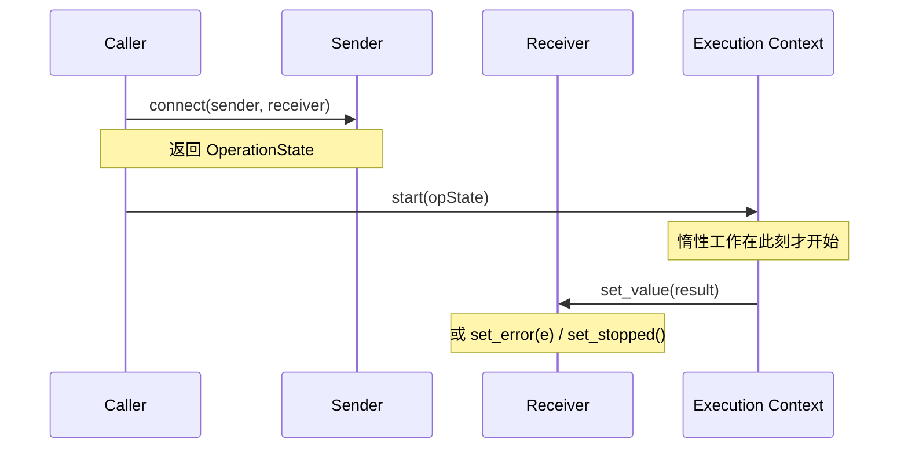
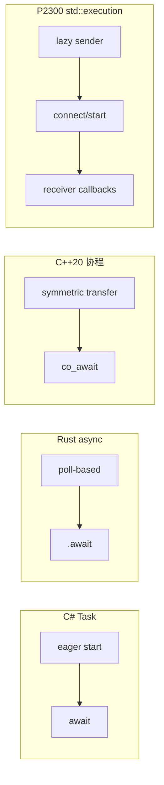

# Sender/Receiver 模型（P2300 / `std::execution`）

> [!abstract] 前置知识
> 本教程假设你已理解 C++20 协程机制（[[07-coroutines-task-type|协程 Part 3：编写 Task 类型]]）和 Boost.Asio 回调模型（[[09-asio-callbacks|Boost.Asio Part 1：io_context 与回调]]）。如果不熟悉协程的 `promise_type` 和 `awaiter` 协议，建议先完成前面的教程。

## 1. 概念解析

### 1.1 问题：异步模型的碎片化

C++ 异步编程的生态长期处于碎片化状态：

| 模型 | 代表 | 问题 |
|------|------|------|
| 回调 (Callbacks) | Boost.Asio, libuv | 回调地狱，错误处理分散 |
| Future/Promise | `std::future`, `folly::Future` | Eager 执行，不可组合 |
| 协程 (Coroutines) | C++20 `co_await` | 依赖具体 Task 类型，不可互操作 |
| 自定义框架 | Seastar, libunifex | 各自设计，无法互通 |

**P2300（C++26 `std::execution`）的目标：提供一个零成本、可组合、与运行时无关的异步操作统一抽象。**

核心思想来自 Eric Niebler 的 **"There is no silver bullet"**——不强制某种模型，而是定义最小化的协议，让所有异步模型可以围绕它互操作。

### 1.2 三个核心概念

P2300 用三个抽象描述所有异步操作：

- **Sender（发送者）**：描述一个**惰性**（lazy）异步操作。Sender 本身不做任何事——它只是描述了"当被启动时，会产生什么样的结果"。类比：一个未执行的 function object。
- **Receiver（接收者）**：定义三个**完成信道**（completion channels）的回调：
  - `set_value(T...)` —— 成功，携带结果值
  - `set_error(E)` —— 失败，携带错误
  - `set_stopped()` —— 被取消/停止
- **Scheduler（调度器）**：表示"在哪里执行工作"。提供一个 `schedule()` 方法返回一个 sender，当该 sender 被启动时，会在指定执行上下文中完成。

这三者通过 **connect → start** 两步协议协作：



关键区别：

> [!important] Sender 是惰性的 (Lazy)
> `connect(sender, receiver)` 只是构建操作状态；**必须调用 `start()` 后，异步工作才开始执行**。这与 `std::future` 的 eager 语义（创建即开始）截然不同。

### 1.3 Completion Signatures（完成签名）

每个 Sender 都有一个编译期可知的完成签名集合，描述了它可能如何完成：

```cpp
// 一个 sender 的完成签名可能是：
//   set_value(int, std::string)   — 成功时传回两个值
//   set_error(std::exception_ptr) — 失败时传回异常
//   set_stopped()                 — 被停止

// 用概念表达：
static_assert(sender_of<decltype(my_sender), set_value_t(int, std::string)>);
```

完成签名是**编译期属性**——编译器在连接 sender 和 receiver 时就能检查：所有可能的完成信道是否都被正确处理。

### 1.4 Sender 代数 (Sender Algebra)

P2300 定义了一套**算法**（algorithms），它们接收 sender，返回新的 sender。这形成了所谓的 "Sender 代数"——像函数式编程的 map/flatMap 一样对异步操作进行变换：

| 算法 | 作用 | 类比 |
|------|------|------|
| `then(sender, fn)` | 对成功结果做变换 | `map` / `.then()` |
| `upon_error(sender, fn)` | 错误恢复 | `catch` |
| `upon_stopped(sender, fn)` | 处理停止信号 | — |
| `let_value(sender, fn)` | 基于结果创建新 sender | `flatMap` / `co_await` |
| `let_error(sender, fn)` | 基于错误创建新 sender | try-catch + 重试 |
| `just(values...)` | 创建一个立即成功的 sender | `std::just` / `Promise.resolve` |
| `just_error(e)` | 创建一个立即失败的 sender | — |
| `just_stopped()` | 创建一个立即停止的 sender | — |
| `schedule(scheduler)` | 在指定调度器上运行 | `co_await scheduler` |
| `transfer(sender, scheduler)` | 转移到指定调度器完成 | — |
| `start_on(scheduler, sender)` | 在指定调度器上启动 | — |
| `split(sender)` | 使 sender 可共享（多 receiver） | `.share()` |

### 1.5 管道操作符 `operator|`

P2300 提供 `operator|` 用于将 sender 和算法串联成管道，极大提升可读性：

```cpp
// 不用管道：
auto s = then(
           upon_error(
             schedule(scheduler) | then([] { return fetch_data(); }),
             [](auto e) { return fallback_value; }
           ),
           [](auto data) { return process(data); }
         );

// 用管道：
auto s = schedule(scheduler)
       | then([] { return fetch_data(); })
       | upon_error([](auto e) { return fallback_value; })
       | then([](auto data) { return process(data); });
```

管道从左到右流动，每个 `|` 将左侧 sender 作为右侧算法的第一个参数。组合规则类似于函数式编程中的 "pipe" 操作。

### 1.6 与其他异步模型对比



| 特性 | C++20 协程 | Rust `async` | C# `Task` | P2300 Sender/Receiver |
|------|-----------|-------------|-----------|----------------------|
| 求值模型 | 惰性 | 惰性 | Eager | **惰性** |
| 组合方式 | `co_await` 链 | `.await` 链 | `await` 链 | **`operator\|` 管道** |
| 错误处理 | `try-catch` | `?` / `Result` | `try-catch` | **`upon_error` 信道** |
| 取消 | `stop_token` | `select!` / drop | `CancellationToken` | **`set_stopped` 信道** |
| 互操作性 | 依赖具体 Task 类型 | 统一 trait | `Task` / `ValueTask` | **通用协议，适配一切** |
| 运行时无关 | 否（依赖调度器实现） | 否 | 否 | **是（核心设计目标）** |

> [!tip] P2300 的独特优势
> 与协程不同，P2300 不需要 `co_await` 关键字——它是**纯库方案**（C++26 进入标准），可以编译为极小的代码。同时，它不绑定任何执行上下文：同一个 sender 管道可以跑在线程池、GPU 调度器、甚至嵌入式裸机上。

---

## 2. 代码示例

> [!info] 使用 NVIDIA stdexec
> 本节示例使用 [NVIDIA stdexec](https://github.com/NVIDIA/stdexec) (v24.09+)——当前最成熟的 P2300 参考实现。编译时需要 `-std=c++20`。核心头文件为 `<stdexec/...>`，所有符号位于 `stdexec::` 命名空间。
>
> 安装方式：
> ```bash
> git clone https://github.com/NVIDIA/stdexec.git
> cd stdexec && cmake -B build && cmake --build build
> ```
>
> 或者通过 vcpkg: `vcpkg install stdexec`

### 2.1 Hello World: `just` + `then` + `schedule`

最基本的 sender 管道：创建一个值，在经过调度器后对其进行变换：

```cpp
// hello_sender.cpp
// 编译: g++ -std=c++20 -I<stdexec>/include hello_sender.cpp -o hello_sender -pthread
// 预期输出: Hello, Sender/Receiver! (answer = 8848)

#include <stdexec/execution.hpp>
#include <cstdio>

int main() {
    // 创建一个立即完成的 scheduler（在当前线程上运行）
    auto sched = stdexec::run_loop{}.get_scheduler();

    // 构建 sender 管道：不执行，只描述
    auto work = stdexec::schedule(sched)
              | stdexec::then([] { return 42; })
              | stdexec::then([](int x) { return x * 100 + 42; });

    // 用 sync_wait 触发执行并等待结果
    auto [result] = stdexec::sync_wait(work).value();
    std::printf("answer = %d\n", result);
    // 输出: answer = 4242
}
```

> [!important] `sync_wait` 是桥接函数
> `sync_wait(sender)` 将 sender/receiver 世界桥接到同步世界：它内部构造一个 receiver，connect + start，然后阻塞当前线程直到 sender 完成。不适合生产代码，但在示例和测试中很实用。

### 2.2 管道链：多步变换与调度切换

更接近真实场景的例子——模拟一个从网络获取数据、解析、再持久化的异步流水线：

```cpp
// pipeline_sender.cpp
// 编译: g++ -std=c++20 -I<stdexec>/include pipeline_sender.cpp -o pipeline_sender -pthread
// 预期输出:
//   [io_thread] fetching data...
//   [compute] parsing...
//   [io_thread] saving to DB...
//   result: Data[id=42, content="parsed:raw_data"]

#include <stdexec/execution.hpp>
#include <iostream>
#include <string>
#include <thread>

using namespace stdexec;

struct Data {
    int id;
    std::string content;
};

// 模拟数据来源
std::string raw_data = "raw_data";

int main() {
    // 使用 static_thread_pool 提供真实的并发调度
    auto io_pool = stdexec::static_thread_pool{2};
    auto cpu_pool = stdexec::static_thread_pool{4};

    auto io_sched = io_pool.get_scheduler();
    auto cpu_sched = cpu_pool.get_scheduler();

    auto pipeline =
        // 第一步：在 IO 线程上执行
        stdexec::starts_on(io_sched, stdexec::just(raw_data))
        | stdexec::then([](const std::string& raw) {
            std::cout << "[io_thread] fetching data..." << std::endl;
            return raw;  // 模拟网络请求
          })
        // 第二步：转移到计算线程池解析
        | stdexec::transfer(cpu_sched)
        | stdexec::then([](const std::string& raw) {
            std::cout << "[compute] parsing..." << std::endl;
            return Data{42, "parsed:" + raw};
          })
        // 第三步：转回 IO 线程池写数据库
        | stdexec::transfer(io_sched)
        | stdexec::then([](Data d) {
            std::cout << "[io_thread] saving to DB..." << std::endl;
            return d;  // 模拟写入
          });

    auto [result] = stdexec::sync_wait(pipeline).value();
    std::cout << "result: Data[id=" << result.id
              << ", content=\"" << result.content << "\"]" << std::endl;
}
```

关键点：

- `starts_on(scheduler, sender)` — 指定 sender 在哪个调度器上启动
- `transfer(scheduler)` — 将执行从当前上下文转移到目标调度器（后续 `then` 在目标调度器上运行）
- `operator|` 使整个过程读起来像数据流 pipeline

### 2.3 错误处理：`upon_error` 与 `let_error`

P2300 的错误处理通过 `set_error` 信道完成，使用 `upon_error` 和 `let_error` 进行恢复：

```cpp
// error_handling_sender.cpp
// 编译: g++ -std=c++20 -I<stdexec>/include error_handling_sender.cpp -o error_handling_sender -pthread
// 预期输出:
//   尝试 1 失败: Network timeout（3 秒后重试）
//   尝试 2 失败: Network timeout（3 秒后重试）
//   尝试 3 成功

#include <stdexec/execution.hpp>
#include <iostream>
#include <string>
#include <thread>
#include <chrono>

using namespace stdexec;
using namespace std::chrono_literals;

int attempt = 0;

// 模拟不稳定的网络调用：前两次失败，第三次成功
auto unstable_fetch() {
    ++attempt;
    std::cout << "尝试 " << attempt;

    if (attempt < 3) {
        std::cout << " 失败: Network timeout（3 秒后重试）" << std::endl;
        std::this_thread::sleep_for(1s); // 模拟延迟
        // 直接用 just_error 构造一个失败的 sender
        // （实际场景中，这是由底层异步操作产生的）
        return stdexec::just_error(std::string("timeout"));
    }

    std::cout << " 成功" << std::endl;
    return stdexec::just(std::string("precious_data"));
}

int main() {
    auto sched = stdexec::run_loop{}.get_scheduler();

    // 使用 let_error 实现重试逻辑
    auto with_retry =
        stdexec::schedule(sched)
        | stdexec::let_value([] { return unstable_fetch(); })
        | stdexec::let_error([](std::string err_msg) {
            std::cout << "  [let_error 收到: " << err_msg << "]" << std::endl;
            // let_error 返回一个新的 sender，替换错误路径
            // 这里简单地返回重试——需要注意递归深度
            return stdexec::just(std::string("fallback_data"));
          });

    auto [result] = stdexec::sync_wait(with_retry).value();
    std::cout << "最终结果: " << result << std::endl;
}
```

**`upon_error` vs `let_error` 的区别：**

| 算法 | 回调返回值 | 用途 |
|------|-----------|------|
| `upon_error(snd, fn)` | 值（`T`） | 错误恢复为正常值——将错误信道闭合为值信道 |
| `let_error(snd, fn)` | Sender（`sender_of<T>`） | 基于错误类型，动态选择一个新的 sender 继续 |

### 2.4 取消（Stopped）处理

P2300 原生支持取消——通过 `set_stopped()` 信道和 `stop_token` 机制实现：

```cpp
// cancellation_sender.cpp
// 编译: g++ -std=c++20 -I<stdexec>/include cancellation_sender.cpp -o cancellation_sender -pthread
// 预期输出:
//   [worker] 开始长时间工作...
//   [main] 发送取消
//   [worker] 检测到取消，停止！
//   任务被取消了

#include <stdexec/execution.hpp>
#include <iostream>
#include <thread>
#include <chrono>

using namespace stdexec;
using namespace std::chrono_literals;

int main() {
    stdexec::inplace_stop_source stop_source;
    auto token = stop_source.get_token();

    // 一个模拟长时间运行的 sender
    auto long_work =
        stdexec::schedule(stdexec::run_loop{}.get_scheduler())
        | stdexec::let_value([&token] {
            std::cout << "[worker] 开始长时间工作..." << std::endl;

            // 模拟可取消的工作
            for (int i = 0; i < 10; ++i) {
                if (token.stop_requested()) {
                    std::cout << "[worker] 检测到取消，停止！" << std::endl;
                    // 返回 stopped sender
                    return stdexec::just_stopped();
                }
                std::this_thread::sleep_for(500ms);
            }
            return stdexec::just(42);
          });

    // 在另一个线程，1 秒后取消
    std::thread cancel_thread([&stop_source] {
        std::this_thread::sleep_for(1s);
        std::cout << "[main] 发送取消" << std::endl;
        stop_source.request_stop();
    });

    auto result = stdexec::sync_wait(long_work);

    if (!result.has_value()) {
        std::cout << "任务被取消了" << std::endl;
    } else {
        auto [val] = result.value();
        std::cout << "结果: " << val << std::endl;
    }

    cancel_thread.join();
}
```

> [!warning] 取消是可选的
> Sender 可以选择是否响应 `stop_token`。不支持取消的 sender 会忽略取消请求。这由 `get_stop_token(env)` 查询在连接时决定。

### 2.5 适配现有异步 API 到 Sender/Receiver

P2300 的真正威力在于**适配任意异步 API**——只需要实现 `connect` 和 `start`。以下适配一个假想的 `async_read` 回调 API：

```cpp
// adapt_async_api_sender.cpp
// 编译: g++ -std=c++20 -I<stdexec>/include adapt_async_api_sender.cpp -o adapt_async_api_sender -pthread
// 预期输出:
//   开始异步读取...
//   异步读取完成: "Hello, from async callback!"
//   收到数据: Hello, from async callback!

#include <stdexec/execution.hpp>
#include <iostream>
#include <string>
#include <thread>
#include <functional>
#include <chrono>

using namespace stdexec;
using namespace std::chrono_literals;

// ============================================
// 模拟一个基于回调的旧式异步 API
// ============================================
using async_callback = std::function<void(std::string, int)>;

void legacy_async_read(const std::string& url, async_callback cb) {
    // 在后台线程模拟异步 IO
    std::thread([url, cb = std::move(cb)]() mutable {
        std::this_thread::sleep_for(500ms); // 模拟网络延迟
        cb("Hello, from async callback!", 200);
    }).detach();
}

// ============================================
// 将回调 API 包装为 Sender
// ============================================

struct read_sender {
    std::string url;

    // completion_signatures 告诉编译器这个 sender 可能的完成方式
    using completion_signatures =
        stdexec::completion_signatures<
            stdexec::set_value_t(std::string, int),   // 成功: 数据和状态码
            stdexec::set_error_t(std::exception_ptr)  // 失败: 异常
        >;

    // connect: 将 sender 和 receiver 绑定，返回 operation_state
    template <typename Receiver>
    struct operation_state {
        std::string url;
        Receiver receiver;

        void start() & {
            std::cout << "开始异步读取..." << std::endl;
            // 调用旧式回调 API
            legacy_async_read(url, [this](std::string data, int code) {
                std::cout << "异步读取完成: \"" << data << "\"" << std::endl;
                // 通知 receiver 完成
                stdexec::set_value(std::move(receiver),
                                   std::move(data), code);
            });
        }
    };

    template <typename Receiver>
    friend auto tag_invoke(stdexec::connect_t, read_sender snd,
                           Receiver rcv) {
        return operation_state<Receiver>{
            std::move(snd.url), std::move(rcv)};
    }
};

int main() {
    read_sender reader{"https://example.com/data"};

    // 可以用 sender 管道组合！
    auto pipeline = reader
                  | stdexec::then([](std::string data, int code) {
                        std::cout << "收到数据: " << data << std::endl;
                        return data.size();
                    });

    auto [size] = stdexec::sync_wait(pipeline).value();
    std::cout << "数据长度: " << size << std::endl;
}
```

适配步骤小结：

1. 定义 sender 类型，包含 `completion_signatures` 成员类型
2. 实现 `tag_invoke(connect_t, sender, receiver)` → 返回 `operation_state`
3. 在 `operation_state::start()` 中调用旧式 API，完成后调用 `set_value` / `set_error` / `set_stopped`
4. 完成——新 sender 可无缝参与 P2300 管道组合

---

## 3. 练习

### 3.1 基础：串联两个异步操作

**目标**：使用 `let_value` 实现两步异步操作——第一步获取用户 ID，第二步根据 ID 获取用户名。

**要求**：
- 使用 `stdexec::just()` 模拟第一步
- 使用 `let_value` 链接第二步
- 用 `sync_wait` 获取结果
- 打印最终结果

<details>
<summary>提示</summary>

`let_value` 的回调需要返回一个新的 sender，类型为 `sender_of<T>`（如 `just(...)`）。

编译命令：
```bash
g++ -std=c++20 -I<stdexec>/include exercise1.cpp -o exercise1 -pthread
```
</details>

### 3.2 中级：为 Sender 添加超时

**目标**：实现一个 `with_timeout(sender, duration, fallback_value)` 组合器，在指定时间内未完成则返回 fallback 值。

**要求**：
- 使用 `inplace_stop_source` 实现超时逻辑
- 如果 sender 在时间内完成，取消超时定时器
- 如果超时先触发，取消 sender 并返回 fallback
- 超时计时在独立线程中运行

<details>
<summary>提示</summary>

可以使用 `std::thread` + `stop_source` + `std::condition_variable` 实现超时检测线程。`sync_wait` 返回 `std::optional<...>`，你可以用 `has_value()` 检查成功与否。

但注意：P2300 的 `sync_wait` 在 sender 完成前会阻塞调用线程。你可以把超时检测放在另一个线程，并使用 `stop_source.request_stop()` 发送取消信号。
</details>

### 3.3 挑战：实现一个简单的线程池 Scheduler

**目标**：从零实现一个满足 P2300 `scheduler` 概念的自定义调度器。

**要求**：
- 实现 `my_thread_pool` 类，包含固定数量的工作线程
- 实现 `schedule()` 方法，返回一个 sender
- 该 sender 被 connect + start 后，将工作提交到线程池
- 使用 `tag_invoke` 机制发现 `schedule` 和 `connect`
- 用 `sync_wait` 验证正确性

<details>
<summary>提示</summary>

```cpp
struct my_thread_pool {
    // 线程池内部：队列 + 工作线程 + mutex + condition_variable
    std::vector<std::thread> workers_;
    std::queue<std::function<void()>> tasks_;
    std::mutex mtx_;
    std::condition_variable cv_;
    bool stop_ = false;

    explicit my_thread_pool(int n); // 启动 n 个线程
    ~my_thread_pool();              // 优雅关闭

    auto get_scheduler();           // 返回一个 scheduler 对象
};
```

Scheduler 的 `schedule()` 方法返回一个 sender，该 sender 的 `connect` 将实际工作入队，`start` 只是标记开始（或者两者合一）。线程池的工作线程从队列中取出任务执行，完成后调 `set_value()`。

`tag_invoke` 签名：
```cpp
friend auto tag_invoke(stdexec::schedule_t, my_scheduler sched);
```
</details>

---

## 4. 常见陷阱

> [!warning] 陷阱 1：Sender 是惰性的，不连接就不执行
>
> ```cpp
> auto s = schedule(sched) | then([] { do_work(); });
> // 此时 do_work() 尚未调用！
> //
> // 必须：
> //   sync_wait(s);          // 阻塞等待
> //   auto op = connect(s, receiver); start(op);  // 手动启动
> ```
>
> 这与 `std::future` 的 eager 语义完全不同。如果你创建了一个 sender 但没有 connect + start，**什么都不会发生**。

> [!warning] 陷阱 2：Scheduler 的生命周期必须覆盖所有操作
>
> ```cpp
> auto make_sender = [&] {
>     stdexec::static_thread_pool pool{4};
>     auto sched = pool.get_scheduler();
>     return schedule(sched) | then([] { do_work(); });
> }; // pool 在此析构！
>
> auto s = make_sender();
> sync_wait(s); // UB！线程池已销毁
> ```
>
> Scheduler 是异步操作的执行场所——它必须在所有从它启动的操作完成之前保持存活。使用 `sync_wait` 时，确保 scheduler 的生命周期覆盖 `sync_wait` 调用。

> [!warning] 陷阱 3：未处理的错误/停止信道会传播
>
> ```cpp
> // 如果 sender 可能 set_error()，但你没有用 upon_error 处理：
> auto s = schedule(sched) | then([] { risky_call(); });
> // risky_call() 抛出异常 → sender 调用 set_error(...)
> // sync_wait 会重新抛出异常（或返回错误码）
> ```
>
> P2300 的完成信道是**穷尽的**——sender 的 `completion_signatures` 声明了它所有可能的完成方式。未处理 `set_error` 时，错误会传播到最终的 consumer（如 `sync_wait` 抛出异常）。在生产代码中，应使用 `upon_error` 处理所有可能的错误信道。

> [!warning] 陷阱 4：Sender 适配器导致类型爆炸（编译时间）
>
> ```cpp
> // 过长的管道链：
> auto s = schedule(sched)
>        | then(f1) | then(f2) | then(f3) | then(f4)
>        | then(f5) | then(f6) | then(f7) | then(f8);
> // s 的类型：then<then<then<...>, f8>, f7>, ...> — 极长
> ```
>
> 每个 `then`、`upon_error` 等适配器都会生成一个新的嵌套类型。长管道会导致：
> - 编译时间显著增长
> - 模板实例化爆炸
> - 错误信息难以阅读
>
> 缓解策略：
> - 将长管道拆分为多个具名中间 sender（通过函数边界切断类型嵌套）
> - 使用 `stdexec::sync_wait` 等 consumer 尽早"消费"中间结果
> - 在关键路径上合并多个 `then` 为一个

> [!warning] 陷阱 5：P2300 是 C++26 标准，当前需使用参考实现
>
> `std::execution` 尚未进入主流编译器的标准库。目前的选择：
>
> | 实现 | 成熟度 | 备注 |
> |------|--------|------|
> | [NVIDIA stdexec](https://github.com/NVIDIA/stdexec) | **生产可用** | 推荐，API 最接近 P2300 R9+ |
> | [libunifex](https://github.com/facebookexperimental/libunifex) | 稳定 | Facebook/Meta，P2300 前身 |
> | [P2300 参考实现](https://github.com/brycelelbach/wg21_p2300_std_execution) | 提案伴随 | 教育/实验用途 |
>
> 当本教程写 "C++26 `std::execution`" 时，实际使用的是 `stdexec::`。标准化后，`stdexec::` 会被 `std::execution::` 替代（命名空间调整）。

> [!warning] 陷阱 6：`let_value` 可能导致无限递归
>
> ```cpp
> auto retry = let_value(sender, [](auto x) {
>     if (failed(x)) return just_error("retry");
>     return just(x);
> });
> // let_value 替换了值信道。如果 sender 永远失败，
> // 且你在 let_error 中又创建了同一个 sender……可能无限递归
> ```
>
> 在使用 `let_value` / `let_error` 进行重试时，务必添加递归深度限制。P2300 不支持尾递归优化——每次 `let_*` 调用都会在堆栈上新增一层。

---

## 5. 扩展阅读

### 规范与提案

- [P2300R10 — `std::execution` (最新修订版)](https://www.open-std.org/jtc1/sc22/wg21/docs/papers/2024/p2300r10.html) — C++26 正式提案的完整规范
- [P3138R0 — `std::execution` 与 C++ 网络库的集成](https://www.open-std.org/jtc1/sc22/wg21/docs/papers/2024/p3138r0.pdf) — Asio 与 Sender/Receiver 的桥接提案

### 参考实现

- [NVIDIA stdexec 仓库](https://github.com/NVIDIA/stdexec) — 推荐的生产级参考实现，含完整文档
- [libunifex (Meta)](https://github.com/facebookexperimental/libunifex) — Sender/Receiver 概念的原型实现，P2300 的起源
- [P2300 参考实现 (Bryce Lelbach)](https://github.com/brycelelbach/wg21_p2300_std_execution) — WG21 提案的伴随实现

### 演讲与文章

- [Eric Niebler — "There Is No Silver Bullet" (C++Now 2019)](https://www.youtube.com/watch?v=h-5sSAgR-bE) — Sender/Receiver 模型的设计动机与哲学
- [Eric Niebler — "ASIO and the Power of Completion Tokens" (CppCon 2022)](https://www.youtube.com/watch?v=CtE7oCN8VYE) — 深度讲解完成令牌和 sender 代数
- [Lewis Baker — "Structured Concurrency — Writing Senders and Receivers" (CppCon 2023)](https://www.youtube.com/watch?v=Z8k_0U4h5Zw) — 手写 sender 类型的实践指导
- [David Hollman — "The Ongoing Saga of Sender/Receiver" (CppCon 2023)](https://www.youtube.com/watch?v=lhBYWLBNtng) — P2300 提案演进与标准化进程

### 相关教程（本学习计划内）

- [[09-asio-callbacks|Boost.Asio Part 1：io_context 与回调]] — 理解回调模型，为 sender/receiver 对比打下基础
- [[12-advanced-patterns|进阶模式：线程池、调度、取消]] — Sender/Receiver 在工业场景中的应用
