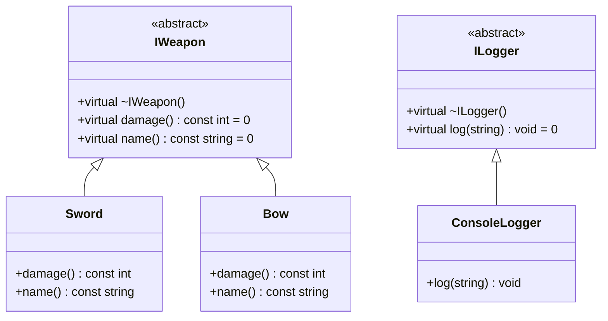

# C++ 的接口：抽象基类与纯虚函数

> 所属计划: [[plan|C++ 依赖注入完整学习计划]]
> 预计耗时: 60min
> 前置知识: [[01-what-is-di-coupling|依赖注入是什么：从紧耦合说起]]

---

## 1. 概念讲解

### 1.1 从“武器槽位”理解接口

想象你在做一款 RPG：角色手上有一个武器槽位。这个槽位不关心具体是剑、弓还是法杖，它只关心“装备必须能造成伤害”。只要满足这个契约，任何武器都可以插进去。

在 C# 里，你会写：

```csharp
public interface IWeapon { int Damage { get; } }
```

但在 C++ 里，**没有 `interface` 关键字**。我们用**抽象基类（Abstract Base Class, ABC）+ 纯虚函数**来模拟接口。这就像游戏里没有专门的“槽位类型”，但你可以约定“所有能插进槽位的武器都必须继承同一个抽象武器类”。

### 1.2 纯虚函数：接口的“契约”

纯虚函数语法：

```cpp
virtual int damage() const = 0;
```

- `virtual`：允许通过基类指针调用派生类实现（动态绑定）。
- `= 0`：表示这个函数没有默认实现，强制派生类覆盖。

任何包含至少一个纯虚函数的类都是抽象类，**不能被实例化**：

```cpp
IWeapon w;       // 编译错误：抽象类不能实例化
Sword s;         // OK
```

### 1.3 虚析构函数：C++ DI 最容易踩的坑

这是本节最重要的点。先看一个错误写法：

```cpp
class IWeapon {
public:
    // 注意：没有 virtual 析构函数！
    virtual int damage() const = 0;
};

class Sword : public IWeapon {
public:
    ~Sword() { std::cout << "Sword 析构\n"; }
    int damage() const override { return 15; }
};

int main() {
    IWeapon* w = new Sword();
    delete w;  // 危险！只调用了 IWeapon 的析构函数，Sword 的析构函数不会执行
}
```

当通过基类指针 `delete` 派生类对象时，如果基类析构函数不是虚函数，C++ 标准称之为**未定义行为（Undefined Behavior, UB）**。实际表现可能是：资源泄漏、部分析构、析构顺序错乱。

正确做法：

```cpp
class IWeapon {
public:
    virtual ~IWeapon() = default;
    virtual int damage() const = 0;
};
```

> [!warning] 凡是设计为“会被多态使用”的基类，析构函数必须是 virtual
> 如果你写的类有纯虚函数，就必须同时给虚析构函数。这是 C++ 依赖注入里最常见的内存泄漏来源之一。

### 1.4 `override` 与 `final`

`override` 不是装饰，它让编译器帮你检查是否真的覆盖了基类虚函数。拼写错误、签名不匹配都会被立即发现：

```cpp
class Bow : public IWeapon {
public:
    int damage() const override { return 12; }  // 正确
    // int damage() override { return 12; }       // 编译错误：签名不匹配
};
```

`final` 则用于禁止进一步继承。例如你有一个 `ConsoleLogger`，不希望有人再派生：

```cpp
class ConsoleLogger final : public ILogger {
    void log(const std::string& msg) override;
};

// class MyLogger : public ConsoleLogger {};  // 编译错误
```

| 关键字 | 作用 | 游戏开发场景 |
|--------|------|--------------|
| `override` | 显式声明覆盖基类虚函数，编译器检查 | 防止武器实现签名写错 |
| `final` | 禁止类被继承，或禁止虚函数被再次覆盖 | 锁定最终实现的 Logger/武器 |

### 1.5 vtable：一笔带过

C++ 通过**虚函数表（vtable）**实现动态分派。每个有虚函数的类都有一个 vtable，对象里藏着一个指向该表的指针（vptr）。调用 `weapon->damage()` 时，程序通过 vptr 找到实际类型的函数地址。

对游戏热循环（每帧调用成千上万次）来说，虚函数调用确实比普通函数调用多一次间接寻址。第 `#8` 节 [[08-templates-static-polymorphism]] 会讲如何用模板实现**零开销**的静态多态。

### 1.6 抽象类不能按值传递

抽象类不能实例化，因此也不能按值传递或按值返回：

```cpp
void equip(IWeapon weapon);       // 编译错误
void equip(IWeapon& weapon);      // OK
void equip(std::unique_ptr<IWeapon> weapon);  // OK
```

这直接决定了 C++ 中依赖注入的主流形式：**指针或引用**。下一节 [[05-constructor-injection-ownership]] 会详细对比引用、指针与所有权的取舍。

### 1.7 类图



---

## 2. 代码示例

下面的代码完整定义了 `IWeapon`、`Sword`、`Bow`、`ILogger`、`ConsoleLogger`，并让 `Hero` 通过引用依赖它们。这是贯穿整个学习计划的统一示例在第 `#4` 节落地的版本。

```cpp
#include <iostream>
#include <memory>
#include <string>

// 武器接口：抽象基类
class IWeapon {
public:
    virtual ~IWeapon() = default;
    virtual int damage() const = 0;
    virtual std::string name() const = 0;
};

// 具体武器：铁剑
class Sword : public IWeapon {
public:
    int damage() const override { return 15; }
    std::string name() const override { return "铁剑"; }
};

// 具体武器：长弓
class Bow : public IWeapon {
public:
    int damage() const override { return 12; }
    std::string name() const override { return "长弓"; }
};

// 日志接口
class ILogger {
public:
    virtual ~ILogger() = default;
    virtual void log(const std::string& msg) = 0;
};

// 控制台日志实现
class ConsoleLogger : public ILogger {
public:
    void log(const std::string& msg) override {
        std::cout << "[log] " << msg << "\n";
    }
};

// 角色：依赖 IWeapon 与 ILogger（引用注入）
class Hero {
public:
    Hero(IWeapon& weapon, ILogger& logger)
        : weapon_(weapon), logger_(logger) {}

    void attack() {
        logger_.log("英雄使用 " + weapon_.name() +
                    " 造成 " + std::to_string(weapon_.damage()) + " 点伤害");
    }

private:
    IWeapon& weapon_;
    ILogger& logger_;
};

int main() {
    Sword sword;
    Bow bow;
    ConsoleLogger logger;

    Hero hero_with_sword(sword, logger);
    Hero hero_with_bow(bow, logger);

    hero_with_sword.attack();
    hero_with_bow.attack();

    return 0;
}
```

**运行方式：**

```bash
g++ -std=c++17 main.cpp -o demo
./demo
```

**预期输出：**

```text
[log] 英雄使用 铁剑 造成 15 点伤害
[log] 英雄使用 长弓 造成 12 点伤害
```

---

## 3. 练习

### 练习 1: 基础

补全下面的 `Staff`（法杖）类，让它继承 `IWeapon`，伤害为 `20`，名字为"橡木法杖"。

```cpp
class Staff : public IWeapon {
public:
    // 请在此实现 damage() 与 name()
};
```

### 练习 2: 进阶

解释：为什么 `IWeapon` 的析构函数必须是 `virtual`？如果去掉它，在什么场景下会出问题？请用文字和一段最小可复现代码说明。

### 练习 3: 挑战（可选）

写一个 `FileLogger`，继承 `ILogger`，把日志写入文件。在 `main()` 中创建两个 `Hero`：一个使用 `ConsoleLogger`，另一个使用 `FileLogger`，并验证文件输出正确。

---

## 3.5 参考答案

> [!tip]- 练习 1 参考答案
> ```cpp
> class Staff : public IWeapon {
> public:
>     int damage() const override { return 20; }
>     std::string name() const override { return "橡木法杖"; }
> };
> ```

> [!tip]- 练习 2 参考答案
> 当通过基类指针 `delete` 派生类对象时，如果基类析构函数不是 `virtual`，只会调用基类析构函数，派生类析构函数不会执行。若派生类持有资源（文件句柄、内存、纹理等），就会导致泄漏或未定义行为。
>
> 最小可复现代码：
> ```cpp
> #include <iostream>
> class BadBase {
> public:
>     // 缺少 virtual！
>     ~BadBase() { std::cout << "BadBase 析构\n"; }
>     virtual void foo() = 0;
> };
> class Derived : public BadBase {
> public:
>     ~Derived() { std::cout << "Derived 析构\n"; }
>     void foo() override {}
> };
> int main() {
>     BadBase* p = new Derived();
>     delete p;  // 危险！通常只会打印 "BadBase 析构"
> }
> ```
> 修复方式：把 `~BadBase()` 改为 `virtual ~BadBase() = default;`。

> [!tip]- 练习 3 参考答案（可选）
> ```cpp
> #include <fstream>
>
> class FileLogger : public ILogger {
> public:
>     explicit FileLogger(const std::string& path) : file_(path) {}
>
>     void log(const std::string& msg) override {
>         if (file_.is_open()) file_ << "[log] " << msg << "\n";
>     }
>
> private:
>     std::ofstream file_;
> };
> ```
> 在 `main()` 中：
> ```cpp
> FileLogger file_logger("battle.log");
> Hero hero_with_file(bow, file_logger);
> hero_with_file.attack();
> ```
> 运行后检查 `battle.log` 是否包含预期日志行。

> [!note] 答案使用方式
> 先独立完成练习，再展开查看参考答案。参考答案不是唯一解——如果你的实现通过了测试或达到了题目要求，就是正确的。

---

## 4. 扩展阅读

- [cppreference: 虚函数](https://en.cppreference.com/w/cpp/language/virtual)
- [cppreference: 抽象类](https://en.cppreference.com/w/cpp/language/abstract_class)
- [C++ Core Guidelines: C.35 - 基类析构函数应为 public 且 virtual，或 protected 且 non-virtual](https://isocpp.github.io/CppCoreGuidelines/CppCoreGuidelines#c35-a-base-class-destructor-should-be-either-public-and-virtual-or-protected-and-nonvirtual)
- 后续章节：
  - [[05-constructor-injection-ownership|构造器注入：引用、指针与所有权]]
  - [[08-templates-static-polymorphism|模板与静态多态：编译期 DI]]

---

## 常见陷阱

- **忘写虚析构函数**：抽象基类如果没有 `virtual` 析构函数，通过基类指针 `delete` 派生类对象会导致未定义行为或资源泄漏。正确做法：`virtual ~IWeapon() = default;`。

- **忘记 `override`**：手写 `int damage() const` 时漏掉 `override`，一旦基类签名改变，编译器不会提醒你“其实没有覆盖”。正确做法：所有覆盖基类虚函数的地方都写 `override`。

- **在析构函数里调用虚函数**：对象析构时，派生类部分已经或即将被销毁，此时调用虚函数会回落到基类版本，容易产生意外行为。正确做法：析构函数里避免调用虚函数，或改用非虚的清理函数。

- **试图按值持有接口**：`IWeapon weapon;` 或 `void equip(IWeapon weapon);` 都会编译失败，因为抽象类不能实例化。正确做法：使用引用 `IWeapon&`、指针 `IWeapon*`，或智能指针 `std::unique_ptr<IWeapon>` / `std::shared_ptr<IWeapon>`。

- **混淆 `= 0` 与 `= default`**：`virtual void f() = 0;` 是纯虚函数（强制覆盖），`virtual ~IWeapon() = default;` 是给虚析构函数一个默认实现。两者写法相似，含义完全不同。
