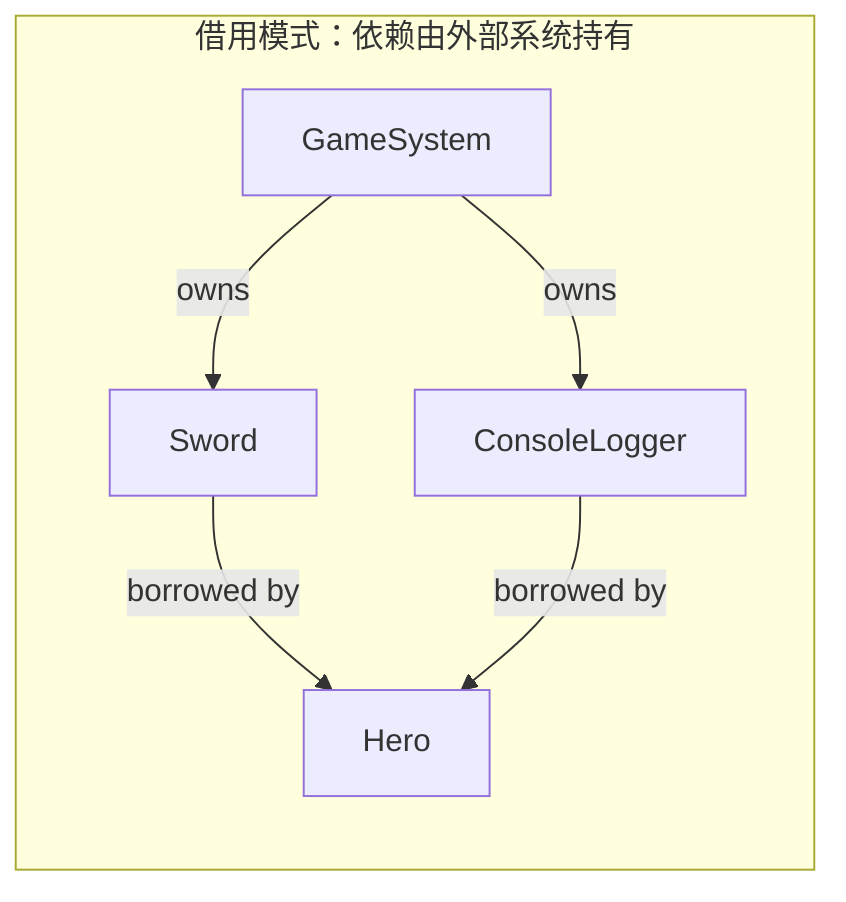

# 构造器注入：引用、指针与所有权

> 所属计划: [[plan|C++ 依赖注入完整学习计划]]
> 预计耗时: 75min
> 前置知识: [[04-cpp-interfaces-abc]]

---

## 1. 概念讲解

### 1.1 从「借装备」还是「带装备」说起

想象一名冒险者 `Hero` 进入地下城。他可以有两种获得武器的方式：

- **借用**：武器由城镇的铁匠铺（游戏系统）保管，`Hero` 只是临时持有一把剑的「引用」。出城期间铁匠铺不能关门销毁这把剑，否则 `Hero` 手里就只剩空气。
- **拥有**：`Hero` 自己背包里带了一把剑，走到哪带到哪，剑的生命周期和 `Hero` 绑定。`Hero` 倒下时，这把剑也随之销毁或被掉落系统接管。

依赖注入里的 **所有权（ownership）** 问题就是：当 `Hero` 通过构造器拿到一个 `IWeapon` 时，它到底是在「借用」这个武器，还是在「拥有」这个武器？C++ 不像 C# 或 Java 有统一的引用语义，它用**引用、指针、智能指针、值**四种不同的传递方式来表达完全不同的生命周期约定。

本节聚焦前三种手动方式：按引用、按裸指针、按值。智能指针拥有的模式会在 [[06-smart-pointers-lifetime]] 中展开。

### 1.2 构造器注入的三种「传参方式」

在 [[03-three-forms-of-di]] 里我们已经知道，构造器注入是最推荐的注入形式：对象所需依赖在出生时就一次性给齐。但在 C++ 里，构造器参数的类型签名直接决定了依赖关系是**借用**还是**拥有**。

#### 按引用注入：`Hero(IWeapon& w, ILogger& l)`

```cpp
class Hero {
public:
    Hero(IWeapon& weapon, ILogger& logger);
private:
    IWeapon& weapon_;
    ILogger& logger_;
};
```

- **所有权**：非拥有（non-owning）。`Hero` 只是在使用外部已经存在的对象。
- **可空？**：不可为 `null`。引用必须绑定到有效对象，调用方不用（也不能）做空校验。
- **前提**：依赖对象的生命周期必须**严格长于** `Hero`，否则会出现悬垂引用（dangling reference），导致未定义行为（UB）。
- **适用场景**：游戏主循环里长期存在的系统对象，例如由 `GameInstance` 或 `SceneManager` 持有的武器库、日志系统、输入管理器。

> 对游戏开发来说，引用注入通常是最快的零开销方案：没有堆分配、没有引用计数、没有间接调用以外的开销。

#### 按裸指针注入：`Hero(IWeapon* w)`

```cpp
class Hero {
public:
    Hero(IWeapon* weapon); // 这是借？还是拥有？
private:
    IWeapon* weapon_;
};
```

- **所有权**：**不明确**。裸指针本身不表达所有权，必须看文档或代码约定。
- **可空？**：可为 `null`，调用方通常需要校验（或在构造后断言）。
- **常见约定**：在 C++ 社区里，裸指针越来越被约定为「非拥有借用指针」，而拥有关系用 `std::unique_ptr` / `std::shared_ptr` 表达。但这不是语言强制，新人很容易误读。
- **适用场景**：可选依赖、可能为空的依赖、或者需要兼容 C 接口 / 旧代码库时。

> [!warning] 裸指针是沟通成本最高的选择
> 如果代码里没有注释或约定，`Hero(IWeapon*)` 会让读者反复猜测：调用方需要 `delete` 吗？`Hero` 会 `delete` 吗？`null` 代表什么意思？在团队协作里，这通常比引用注入更容易埋下 bug。

#### 按值注入：`Hero(IWeapon w)`

```cpp
class Hero {
public:
    Hero(IWeapon weapon); // 编译错误：抽象类不能实例化
};
```

- **不可行**：`IWeapon` 是抽象基类，不能按值创建对象，编译会直接失败。
- **深层原因**：按值传递会触发**对象切片（slicing）**。即使 `weapon` 是具体类型如 `Sword`，传进 `Hero` 后也会被切成基类子对象，丢失派生类数据和多态行为。
- **解决方案**：第 9 节 [[09-type-erasure-std-function]] 会讲类型擦除，它可以在保留多态的同时按值持有依赖。但在传统多态 DI 里，请用引用或指针。

### 1.3 成员初始化列表：引用成员的生命线

引用类型的成员变量**必须在初始化列表中绑定**，不能在构造函数体内再赋值。因为引用一旦绑定就不能重新指向另一个对象。

```cpp
class Hero {
public:
    Hero(IWeapon& weapon, ILogger& logger)
        : weapon_(weapon), logger_(logger)  // 正确：初始化列表绑定引用
    {}

private:
    IWeapon& weapon_;
    ILogger& logger_;
};
```

如果你写成：

```cpp
Hero(IWeapon& weapon, ILogger& logger) {
    weapon_ = weapon;  // 错误：引用不能在函数体内赋值
    logger_ = logger;
}
```

编译器会报错，因为 `weapon_` 和 `logger_` 在进入函数体之前必须已经完成初始化。

### 1.4 `explicit` 关键字：防止单参数构造器隐式转换

当构造器只有一个参数时，C++ 允许隐式类型转换。这可能在 DI 代码里造成意外：

```cpp
class Hero {
public:
    Hero(ILogger& logger); // 单参数构造器
    void attack();
};

ConsoleLogger logger;
Hero hero = logger; // 如果没有 explicit，这句话能通过编译！
```

加了 `explicit` 后，只有显式构造才被允许：

```cpp
class Hero {
public:
    explicit Hero(ILogger& logger);
};

ConsoleLogger logger;
// Hero hero = logger; // 编译错误：explicit 禁止隐式转换
Hero hero(logger);     // OK
```

> 一个简单规则：**凡是单参数构造器，只要它不承担「类型转换」的语义，就加 `explicit`**。

### 1.5 悬垂引用：借用模式的最大风险

引用注入最大的危险在于：**引用不会延长被引用对象的生命周期**。如果 `Hero` 比它的武器活得更久，武器先析构后，`Hero` 手里的引用就会悬空。



错误示范：

```cpp
Hero* createDanglingHero() {
    Sword sword;           // 局部对象
    ConsoleLogger logger;  // 局部对象
    Hero* hero = new Hero(sword, logger);
    return hero;
}                         // sword 和 logger 在这里析构

int main() {
    Hero* hero = createDanglingHero();
    hero->attack();        // 未定义行为：weapon_ 已悬空
    delete hero;
}
```

这个例子能顺利通过编译，因为 C++ 编译器不会在运行期追踪引用的生命周期。但在运行时，`Hero` 内部的 `weapon_` 已经指向被销毁的 `Sword`，访问它就是未定义行为——可能崩溃、可能输出乱码、也可能看起来「正常」直到发布到玩家机器上才偶尔炸开。

正确做法是让依赖对象的生命周期明显长于 `Hero`：

```cpp
int main() {
    Sword sword;           // 1. 先创建依赖
    ConsoleLogger logger;
    Hero hero(sword, logger); // 2. 再创建 Hero
    hero.attack();         // 3. 安全使用
}                         // 4. Hero 先析构，依赖后析构
```

### 1.6 传参方式对比表

| 传参方式 | 所有权 | 可空 | 适用场景 | 游戏示例 |
|----------|--------|------|----------|----------|
| `IWeapon&` | 非拥有（借用） | 否 | 依赖生命周期确定长于使用者 | `Hero` 借用场景 `GameSystem` 持有的武器库 |
| `IWeapon*` | 不明确（看约定） | 是 | 可选依赖、兼容旧代码 | 可为空的「副手武器」槽位 |
| `IWeapon`（按值） | 拥有（切片后） | 否 | **抽象类不可行** | 不建议用于多态 DI |
| `std::unique_ptr<IWeapon>` | 独占拥有 | 否（语义上） | 依赖与使用者同生共死 | `Hero` 自己背包里的专属武器 |
| `std::shared_ptr<IWeapon>` | 共享拥有 | 否（语义上） | 多个对象共享同一依赖 | 场景内所有敌人共享同一掉落武器数据 |

> `std::unique_ptr` 与 `std::shared_ptr` 会在 [[06-smart-pointers-lifetime]] 详细展开。本节先记住核心区分：**引用 = 借，智能指针 = 拥有**。

---

## 2. 代码示例

### 2.1 引用注入版 Hero（推荐模式）

下面是一个完整可运行的示例：`Hero` 通过引用借用 `Sword` 与 `ConsoleLogger`，二者都在 `main` 中先于 `Hero` 创建，因此生命周期安全。

```cpp
#include <iostream>
#include <string>

// 武器接口（抽象基类）
class IWeapon {
public:
    virtual ~IWeapon() = default;
    virtual int damage() const = 0;
    virtual std::string name() const = 0;
};

// 具体武器
class Sword : public IWeapon {
public:
    int damage() const override { return 15; }
    std::string name() const override { return "铁剑"; }
};

// 日志接口
class ILogger {
public:
    virtual ~ILogger() = default;
    virtual void log(const std::string& msg) = 0;
};

class ConsoleLogger : public ILogger {
public:
    void log(const std::string& msg) override {
        std::cout << "[log] " << msg << "\n";
    }
};

// Hero：通过引用借用依赖
class Hero {
public:
    explicit Hero(IWeapon& weapon, ILogger& logger)
        : weapon_(weapon), logger_(logger) {}

    void attack() {
        logger_.log("Hero 举起 " + weapon_.name() + "，造成 "
                    + std::to_string(weapon_.damage()) + " 点伤害");
    }

private:
    IWeapon& weapon_;
    ILogger& logger_;
};

int main() {
    Sword sword;
    ConsoleLogger logger;

    Hero hero(sword, logger);
    hero.attack();

    return 0;
}
```

**运行方式：**

```bash
g++ -std=c++17 hero_ref_inject.cpp -o hero_ref_inject
./hero_ref_inject
```

**预期输出：**

```text
[log] Hero 举起 铁剑，造成 15 点伤害
```

### 2.2 悬垂引用反例（编译通过，运行 UB）

这个例子刻意展示了引用注入的最坏情况：依赖在 `Hero` 之前被销毁。

```cpp
#include <iostream>
#include <string>

// （IWeapon、Sword、ILogger、ConsoleLogger、Hero 的定义与 2.1 相同，此处省略）

Hero* createDanglingHero() {
    Sword sword;          // 局部对象
    ConsoleLogger logger; // 局部对象
    Hero* hero = new Hero(sword, logger);
    return hero;
}                         // sword 与 logger 在这里析构

int main() {
    Hero* hero = createDanglingHero();
    hero->attack();       // 未定义行为！weapon_ 与 logger_ 已悬空
    delete hero;
    return 0;
}
```

**运行方式：**

```bash
g++ -std=c++17 dangling_ref.cpp -o dangling_ref
./dangling_ref
```

**预期行为：**

这个程序能通过编译，但运行结果是**未定义行为（Undefined Behavior, UB）**。它可能：

- 直接崩溃（segmentation fault）。
- 输出乱码或看似正常的错误日志。
- 在本地测试时「恰好正常」，打包到玩家机器后偶发崩溃。

**如何避免：**

1. 让依赖的生命周期明显长于 `Hero`。
2. 如果依赖生命周期不确定，使用智能指针转移或共享所有权（见 [[06-smart-pointers-lifetime]]）。
3. 在代码审查时，对任何「引用成员」都追问一句：*被引用的对象在哪里创建、在哪里销毁、是否一定晚于当前对象？*

### 2.3 拥有模式预览：`std::unique_ptr<IWeapon>`

为了与「借用」形成对比，这里提前看一眼「拥有」模式的写法。细节会在 [[06-smart-pointers-lifetime]] 展开。

```cpp
#include <memory>
#include <string>

// （IWeapon、Sword、ILogger、ConsoleLogger 的定义与 2.1 相同）

class OwningHero {
public:
    explicit OwningHero(std::unique_ptr<IWeapon> weapon, ILogger& logger)
        : weapon_(std::move(weapon)), logger_(logger) {}

    void attack() {
        logger_.log("Hero 举起 " + weapon_->name() + "，造成 "
                    + std::to_string(weapon_->damage()) + " 点伤害");
    }

private:
    std::unique_ptr<IWeapon> weapon_; // 独占拥有
    ILogger& logger_;                 // 日志通常仍由系统持有
};

int main() {
    auto weapon = std::make_unique<Sword>();
    ConsoleLogger logger;
    OwningHero hero(std::move(weapon), logger);
    hero.attack();
    return 0;
}
```

这里 `OwningHero` **拥有**自己的武器：当 `OwningHero` 析构时，`weapon_` 所指向的 `Sword` 会自动释放。而 `logger_` 仍是引用，因为日志系统通常由游戏主循环长期持有。

---

## 3. 练习

### 练习 1: 基础

把下面这个「裸指针注入」的 `Hero` 改成「引用注入」版本。要求：

1. `weapon_` 使用引用类型。
2. 去掉所有 `nullptr` 检查（引用不可为空）。
3. 在 `main` 中确保武器对象的生命周期长于 `Hero`。

```cpp
class RawPointerHero {
public:
    RawPointerHero(IWeapon* weapon) : weapon_(weapon) {}
    void attack() {
        if (weapon_) weapon_->damage();
    }
private:
    IWeapon* weapon_;
};
```

### 练习 2: 进阶

下面这段代码是否存在悬垂引用风险？如果有，指出是哪一行、为什么；如果没有，说明理由。

```cpp
class GameScene {
public:
    GameScene() {
        Sword sword;
        ConsoleLogger logger;
        hero_ = std::make_unique<Hero>(sword, logger);
    }

    void run() {
        hero_->attack();
    }

private:
    std::unique_ptr<Hero> hero_;
};
```

### 练习 3: 挑战（可选）

设计一个小型地下城场景：

- `Hero` 通过引用注入借用一把 `IWeapon` 和一个 `ILogger`。
- 场景中有一个 `WeaponChest`（宝箱）类，它内部持有一把 `Sword`。
- 编写 `main`，让 `Hero` 在宝箱打开后拿到剑并发起攻击。
- 确保 `Hero` 不会持有悬垂引用：剑必须在 `Hero` 被使用期间有效。

---

## 3.5 参考答案

> [!tip]- 练习 1 参考答案
> ```cpp
> class Hero {
> public:
>     explicit Hero(IWeapon& weapon) : weapon_(weapon) {}
>     void attack() {
>         // 引用无需 nullptr 检查
>         std::cout << "造成 " << weapon_.damage() << " 点伤害\n";
>     }
> private:
>     IWeapon& weapon_;
> };
>
> int main() {
>     Sword sword;          // 依赖先创建
>     Hero hero(sword);     // Hero 后创建
>     hero.attack();
>     return 0;
> }                     // Hero 先析构，sword 后析构
> ```

> [!tip]- 练习 2 参考答案
> **存在悬垂引用风险。**
>
> 问题出在构造器 `GameScene()` 中的局部对象 `sword` 和 `logger`。它们只在构造器作用域内有效；当构造器返回后，`hero_` 内部保存的 `IWeapon&` 和 `ILogger&` 就指向了已经销毁的对象。
>
> 当 `run()` 调用 `hero_->attack()` 时，会访问悬垂引用，触发未定义行为。
>
> **正确做法**：把 `sword` 和 `logger` 提升为 `GameScene` 的成员变量，使它们与 `hero_` 拥有相同的生命周期：
>
> ```cpp
> class GameScene {
> public:
>     GameScene()
>         : sword_(), logger_(), hero_(std::make_unique<Hero>(sword_, logger_)) {}
>
>     void run() { hero_->attack(); }
>
> private:
>     Sword sword_;
>     ConsoleLogger logger_;
>     std::unique_ptr<Hero> hero_;
> };
> ```

> [!tip]- 练习 3 参考答案（可选）
> 关键设计：把 `Sword` 作为 `WeaponChest` 的成员，这样剑的生命周期由宝箱决定；只要宝箱在 `Hero` 使用期间不被销毁，引用就是安全的。
>
> ```cpp
> class WeaponChest {
> public:
>     IWeapon& getWeapon() { return sword_; }
> private:
>     Sword sword_;
> };
>
> int main() {
>     ConsoleLogger logger;
>     WeaponChest chest;              // 宝箱持有剑
>     Hero hero(chest.getWeapon(), logger); // Hero 借用剑
>     hero.attack();
>     return 0;
> }
> ```
>
> 这个模式非常适合「场景级资源」：场景加载时创建武器、角色、日志系统，场景中所有角色通过引用共享这些资源，场景卸载时统一销毁。

> [!note] 答案使用方式
> 先独立完成练习，再展开查看参考答案。参考答案不是唯一解——如果你的实现通过了测试或达到了题目要求，就是正确的。

---

## 4. 扩展阅读

- [C++ Core Guidelines: Prefer passing pointers to referents that cannot be null](https://isocpp.github.io/CppCoreGuidelines/CppCoreGuidelines#Rf-null)
- [C++ Core Guidelines: Use `unique_ptr` or `shared_ptr` to represent ownership](https://isocpp.github.io/CppCoreGuidelines/CppCoreGuidelines#Rr-owner)
- [Bjarne Stroustrup: Object Slicing](https://www.stroustrup.com/glossary.html#Gslice)
- [Microsoft C++ Docs: `explicit` specifier](https://learn.microsoft.com/en-us/cpp/cpp/explicit-cpp)
- [Herb Sutter: GotW #91 Smart Pointer Parameters](https://herbsutter.com/gotw/_91/)

---

## 5. 常见陷阱

- **悬垂引用（Dangling Reference）**：把局部对象或临时对象的引用注入给生命周期更长的 `Hero`。正确做法：确保依赖对象在 `Hero` 存活期间始终有效，或改用智能指针转移所有权。

- **裸指针所有权含糊不清**：在代码里写 `Hero(IWeapon*)` 但不说明调用方是否需要 `delete`。正确做法：要么用引用表达「明确借用」，要么用 `std::unique_ptr` / `std::shared_ptr` 表达「明确拥有」。

- **忘记成员初始化列表**：引用成员如果在构造器函数体内「赋值」会编译失败。正确做法：所有引用成员和 `const` 成员都必须在初始化列表中初始化。

- **抽象类按值传递**：写出 `Hero(IWeapon weapon)` 导致编译错误，或未来把具体类按值传递导致对象切片。正确做法：多态依赖永远通过引用或指针传递。

- **单参数构造器忘记 `explicit`**：导致意外的隐式类型转换，让 `Hero hero = logger;` 这种看起来奇怪的代码通过编译。正确做法：单参数构造器默认加 `explicit`，只有在确实需要隐式转换时才省略。

- **混淆「借用」与「拥有」**：游戏中有些资源（如全局日志、场景武器库）适合借用；有些资源（如角色专属武器、子弹）适合拥有。选错模式会导致 use-after-free 或内存泄漏。
