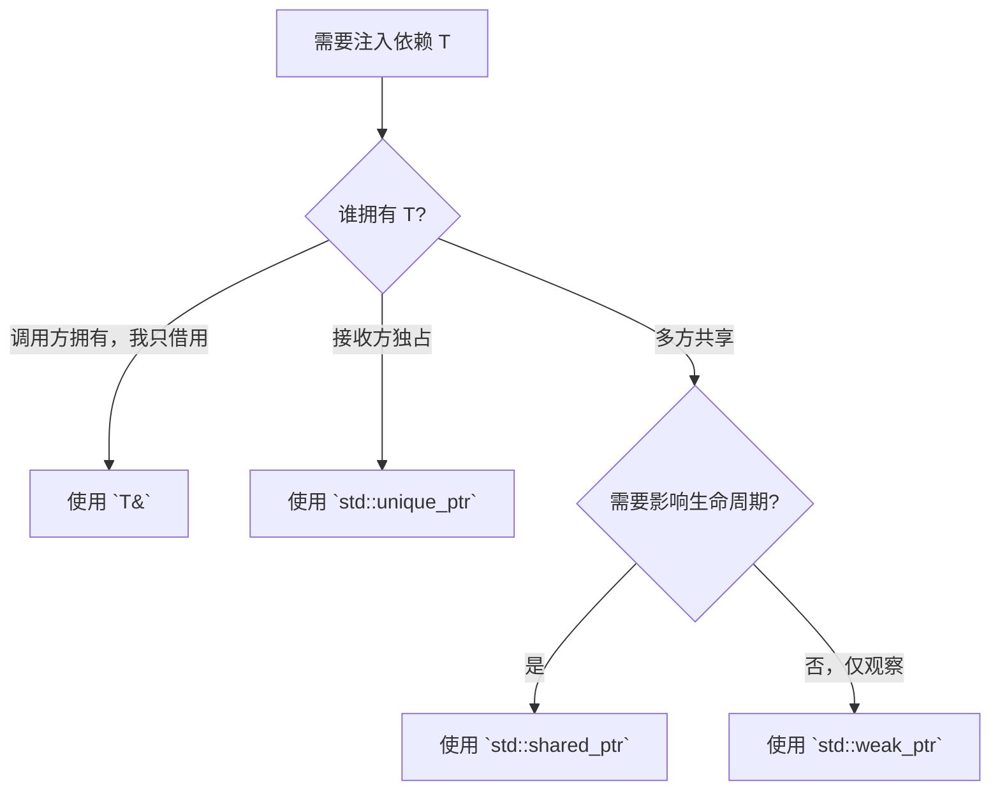

# 智能指针与依赖生命周期

> 所属计划: [[plan|C++ 依赖注入完整学习计划]]
> 预计耗时: 75min
> 前置知识: [[05-constructor-injection-ownership]]

---

## 1. 概念讲解

### 1.1 类比：武器库里的所有权

想象一个 RPG 冒险者公会：

- **专属武器**：每个英雄从铁匠铺领走一把量身定做的剑，签上名字。这把剑只能由这个英雄使用，别人拿了就算偷。英雄阵亡或退役时，这把剑也要被收回销毁——这就是 **独占所有权**。
- **公会公告板**：所有英雄都看得到同一块任务板。某人发布「龙穴已刷新」后，所有订阅者都能收到消息。公告板不属于任何单个英雄，而是由公会（组合根）持有，英雄们只是共享它——这就是 **共享所有权**。

在 C++ 里，这两种关系分别对应 `std::unique_ptr` 与 `std::shared_ptr`。它们把「谁负责释放」「依赖能活多久」这些问题从代码里显式表达出来，让 DI 注入不再依赖猜测。

### 1.2 `std::unique_ptr`：推荐的「拥有依赖」默认选择

`std::unique_ptr<T>` 表示对资源的**独占所有权**：

- 同一时刻只有一个 `unique_ptr` 指向该对象。
- 不能拷贝，只能 `std::move` 转移所有权。
- 离开作用域时自动 `delete`，不需要手写 `delete` 或析构逻辑。

在游戏开发中，`unique_ptr` 非常适合表达「这个对象归我管」的依赖：英雄独占自己的武器、场景节点独占自己的子节点、AI 控制器独占自己的状态机。

典型注入写法：

```cpp
class Hero {
public:
    explicit Hero(std::unique_ptr<IWeapon> weapon)
        : weapon_(std::move(weapon)) {}
private:
    std::unique_ptr<IWeapon> weapon_;
};

int main() {
    Hero h(std::make_unique<Sword>()); // 所有权转移进 Hero
}
```

> [!tip] 为什么是默认选择？
> `unique_ptr` 零额外开销（与裸指针相同大小），语义清晰，还能在编译期防止误拷贝。只要你的依赖真的只归接收方所有，就优先用它。

### 1.3 `std::shared_ptr`：共享所有权与引用计数

`std::shared_ptr<T>` 表示**共享所有权**：

- 多个 `shared_ptr` 可以指向同一个对象。
- 内部维护一个**原子引用计数**，当最后一个 `shared_ptr` 销毁时，对象才被释放。
- 用 `std::make_shared<T>()` 创建，比 `shared_ptr<T>(new T)` 更高效且异常安全。

游戏里适合共享的场景：

- 多个系统共享同一个 `EventBus`（战斗事件、UI 事件、任务事件）。
- 多个角色共享同一个 `GameConfig` 或 `ILogger` 单例。
- 资源管理器中多个模型共享同一份纹理（虽然游戏引擎通常用句柄 + 引用计数）。

### 1.4 性能代价：热循环里慎用 `shared_ptr`

`shared_ptr` 的引用计数是**原子操作**（`std::atomic`），这意味着：

- 每次拷贝/赋值都要原子地增加计数。
- 每次销毁/重置都要原子地减少计数，减到 `0` 时还要销毁控制块。

在每秒跑 60/120 帧的游戏热循环里，如果你每帧都创建、拷贝、销毁大量 `shared_ptr`，这些原子操作会累积成不可忽视的开销，还可能引发缓存抖动和伪共享（false sharing）。

**建议**：能用引用借用就别用智能指针；必须拥有资源就用 `unique_ptr`；真的需要共享所有权时才用 `shared_ptr`，并且尽量在初始化阶段创建好，热循环里只传递引用或裸指针。

### 1.5 `std::weak_ptr`：非拥有观察者

`std::weak_ptr<T>` 指向一个由 `shared_ptr` 管理的对象，但**不增加引用计数**。它主要用来打破循环引用：

```cpp
struct Hero;
struct Companion {
    std::weak_ptr<Hero> hero; // 不拥有，只是观察
};

struct Hero {
    std::shared_ptr<Companion> companion;
};
```

如果没有 `weak_ptr`，两个对象互相持有 `shared_ptr`，引用计数永远不会归零，内存就泄漏了。游戏里的队友关系、父子 UI 节点、任务链都容易出现这种循环。

### 1.6 引用、`unique_ptr`、`shared_ptr` 的选择决策

上一节 [[05-constructor-injection-ownership]] 讨论了引用与裸指针的所有权。把智能指针加进来后，决策链可以简化为：

| 场景 | 推荐选择 | 理由 |
|------|----------|------|
| 依赖由调用方创建并管理生命周期，接收方只借用 | `T&` | 零开销，语义清晰；调用方保证对象存活 |
| 依赖由接收方独占，生命周期与接收方绑定 | `std::unique_ptr<T>` | 零额外开销，自动释放，防止误拷贝 |
| 多个对象需要共享同一依赖，且不确定谁先释放 | `std::shared_ptr<T>` | 自动引用计数，最后一个持有者负责释放 |
| 需要观察共享对象但不影响其生命周期 | `std::weak_ptr<T>` | 打破循环引用，避免内存泄漏 |

用一句话概括：**默认借用，必须拥有用 `unique_ptr`，真要共享才用 `shared_ptr`**。



---

## 2. 代码示例

下面的示例把两种典型场景放在同一个 `main.cpp` 里：

- 每个 `Hero` **独占**一把武器（`std::unique_ptr<IWeapon>`）。
- 所有 `Hero` **共享**同一个日志器和事件总线（`std::shared_ptr<ILogger>`、`std::shared_ptr<EventBus>`）。

```cpp
#include <functional>
#include <iostream>
#include <memory>
#include <string>
#include <utility>
#include <vector>

// ----- 核心接口（与本计划约定一致） -----
class IWeapon {
public:
    virtual ~IWeapon() = default;
    virtual int damage() const = 0;
    virtual std::string name() const = 0;
};

class Sword : public IWeapon {
public:
    int damage() const override { return 15; }
    std::string name() const override { return "铁剑"; }
};

class Bow : public IWeapon {
public:
    int damage() const override { return 12; }
    std::string name() const override { return "长弓"; }
};

class ILogger {
public:
    virtual ~ILogger() = default;
    virtual void log(const std::string& msg) = 0;
};

class ConsoleLogger : public ILogger {
public:
    void log(const std::string& msg) override {
        std::cout << "[log] " << msg << "\n";
    }
};

// ----- 共享事件总线 -----
class EventBus {
public:
    using Handler = std::function<void(const std::string&)>;

    void subscribe(Handler handler) {
        handlers_.push_back(std::move(handler));
    }

    void post(const std::string& event) const {
        for (const auto& handler : handlers_) {
            handler(event);
        }
    }

private:
    std::vector<Handler> handlers_;
};

// ----- Hero：独占武器，共享日志与事件总线 -----
class Hero {
public:
    Hero(std::string name,
         std::unique_ptr<IWeapon> weapon,
         std::shared_ptr<ILogger> logger,
         std::shared_ptr<EventBus> eventBus)
        : name_(std::move(name))
        , weapon_(std::move(weapon))
        , logger_(std::move(logger))
        , eventBus_(std::move(eventBus)) {}

    void attack() const {
        logger_->log(name_ + " 使用 " + weapon_->name()
                     + " 造成 " + std::to_string(weapon_->damage()) + " 点伤害");
        eventBus_->post(name_ + ".attacked");
    }

    void listen() {
        std::string localName = name_;
        eventBus_->subscribe([localName](const std::string& event) {
            std::cout << "  -> " << localName << " 收到事件: " << event << "\n";
        });
    }

private:
    std::string name_;
    std::unique_ptr<IWeapon> weapon_;
    std::shared_ptr<ILogger> logger_;
    std::shared_ptr<EventBus> eventBus_;
};

int main() {
    // 组合根：创建共享依赖
    auto logger   = std::make_shared<ConsoleLogger>();
    auto eventBus = std::make_shared<EventBus>();

    // 每个 Hero 独占自己的武器
    Hero arthur("Arthur",
                std::make_unique<Sword>(),
                logger,
                eventBus);

    Hero robin("Robin",
               std::make_unique<Bow>(),
               logger,
               eventBus);

    // 两人都订阅事件总线
    arthur.listen();
    robin.listen();

    arthur.attack();
    robin.attack();

    std::cout << "Logger 引用计数: " << logger.use_count() << "\n";
    std::cout << "EventBus 引用计数: " << eventBus.use_count() << "\n";

    return 0;
}
```

**运行方式：**

```bash
g++ -std=c++17 main.cpp -o demo
./demo
```

**预期输出：**

```text
[log] Arthur 使用 铁剑 造成 15 点伤害
  -> Arthur 收到事件: Arthur.attacked
  -> Robin 收到事件: Arthur.attacked
[log] Robin 使用 长弓 造成 12 点伤害
  -> Arthur 收到事件: Robin.attacked
  -> Robin 收到事件: Robin.attacked
Logger 引用计数: 3
EventBus 引用计数: 3
```

> [!note] 关于引用计数
> 输出中的引用计数是 `3`，因为局部变量 `logger`/`eventBus` 各持有一份，`arthur` 和 `robin` 的成员又各持有一份，合计 `3`。如果你再创建第三个 `Hero`，计数会变为 `4`。

---

## 3. 练习

### 练习 1: 基础

把 `main()` 中 `Robin` 的武器从 `Bow` 换成 `Sword`，观察输出变化。体会 `std::unique_ptr<IWeapon>` 是如何让不同 `Hero` 各自独占不同（或相同类型）武器的。

### 练习 2: 进阶

新增一个 `GameConfig` 类，包含一个 `float damageMultiplier`。把它的实例用 `std::shared_ptr<GameConfig>` 共享给两个 `Hero`，并在 `attack()` 中把最终伤害乘以这个倍率。

要求：

- `GameConfig` 在 `main()` 中只创建一次。
- 修改 `GameConfig::damageMultiplier` 后，两个 `Hero` 的输出都要跟着变。

### 练习 3: 挑战（可选）

写一个最小的循环引用示例：

- 定义 `TeamMember`，包含 `std::shared_ptr<TeamMember> partner;`。
- 在 `main()` 里创建两个成员并互相设置 `partner`。
- 运行后观察析构函数没有被调用（可在析构里打印日志）。
- 把 `partner` 改成 `std::weak_ptr<TeamMember>`，再次运行，验证析构正常发生。

---

## 3.5 参考答案

> [!tip]- 练习 1 参考答案
> 只需要把 `std::make_unique<Bow>()` 改成 `std::make_unique<Sword>()`：
>
> ```cpp
> Hero robin("Robin",
>            std::make_unique<Sword>(),
>            logger,
>            eventBus);
> ```
>
> 重新编译运行后，`Robin` 的输出会从「长弓 12 点伤害」变成「铁剑 15 点伤害」。`arthur` 和 `robin` 各自独占自己的武器，互不影响。

> [!tip]- 练习 2 参考答案
> 在 `Hero` 中新增 `std::shared_ptr<GameConfig> config_`，并在 `attack()` 里使用它：
>
> ```cpp
> class GameConfig {
> public:
>     float damageMultiplier = 1.0f;
> };
>
> class Hero {
> public:
>     Hero(std::string name,
>          std::unique_ptr<IWeapon> weapon,
>          std::shared_ptr<ILogger> logger,
>          std::shared_ptr<EventBus> eventBus,
>          std::shared_ptr<GameConfig> config)
>         : name_(std::move(name))
>         , weapon_(std::move(weapon))
>         , logger_(std::move(logger))
>         , eventBus_(std::move(eventBus))
>         , config_(std::move(config)) {}
>
>     void attack() const {
>         int finalDamage = static_cast<int>(weapon_->damage() * config_->damageMultiplier);
>         logger_->log(name_ + " 使用 " + weapon_->name()
>                      + " 造成 " + std::to_string(finalDamage) + " 点伤害");
>         eventBus_->post(name_ + ".attacked");
>     }
>
> private:
>     std::string name_;
>     std::unique_ptr<IWeapon> weapon_;
>     std::shared_ptr<ILogger> logger_;
>     std::shared_ptr<EventBus> eventBus_;
>     std::shared_ptr<GameConfig> config_;
> };
> ```
>
> 在 `main()` 中：
>
> ```cpp
> auto config = std::make_shared<GameConfig>();
> config->damageMultiplier = 1.5f;
> // 把 config 传给两个 Hero
> ```
>
> 修改 `config->damageMultiplier` 后，两个 `Hero` 的最终伤害都会变化，因为它们指向同一个 `GameConfig` 对象。

> [!tip]- 练习 3 参考答案
> 循环引用版本（析构不会打印）：
>
> ```cpp
> #include <iostream>
> #include <memory>
>
> struct TeamMember {
>     std::string name;
>     std::shared_ptr<TeamMember> partner;
>     ~TeamMember() { std::cout << name << " 被销毁\n"; }
> };
>
> int main() {
>     auto a = std::make_shared<TeamMember>("A");
>     auto b = std::make_shared<TeamMember>("B");
>     a->partner = b;
>     b->partner = a;
>     return 0;
> }
> ```
>
> 修复后的版本（把 `partner` 改成 `std::weak_ptr`）：
>
> ```cpp
> struct TeamMember {
>     std::string name;
>     std::weak_ptr<TeamMember> partner;
>     ~TeamMember() { std::cout << name << " 被销毁\n"; }
> };
> ```
>
> 使用 `std::weak_ptr` 后，`A` 和 `B` 的引用计数都不会因为互相引用而永远大于 `0`，程序退出时两者都能正常析构。

> [!note] 答案使用方式
> 先独立完成练习，再展开查看参考答案。参考答案不是唯一解——如果你的实现通过了测试或达到了题目要求，就是正确的。

---

## 4. 扩展阅读

- [cppreference - std::unique_ptr](https://en.cppreference.com/w/cpp/memory/unique_ptr)
- [cppreference - std::shared_ptr](https://en.cppreference.com/w/cpp/memory/shared_ptr)
- [cppreference - std::weak_ptr](https://en.cppreference.com/w/cpp/memory/weak_ptr)
- [cppreference - std::make_unique, std::make_shared](https://en.cppreference.com/w/cpp/memory)
- Scott Meyers, *Effective Modern C++*，第 18–22 条：关于 `std::unique_ptr`、`std::shared_ptr`、`std::weak_ptr` 的深入讨论
- 下一节将把这些智能指针的装配集中到 [[07-composition-root-wiring]] 中讲解
- 关于如何用 DI 替换依赖以编写单元测试，参见 [[14-testing-with-di-mocks]]

---

## 常见陷阱

- **`unique_ptr` 试图拷贝注入**：`std::unique_ptr` 不能拷贝，构造或赋值时必须用 `std::move`。如果函数签名是 `Hero(std::unique_ptr<IWeapon> w)`，调用方要传 `std::make_unique<Sword>()` 或 `std::move(existing)`。
- **对栈对象取 `shared_ptr`**：`std::shared_ptr<int> p(&localInt);` 会在 `shared_ptr` 销毁时 `delete` 栈对象，导致未定义行为。永远用 `std::make_shared<T>()` 或 `std::shared_ptr<T>(new T)` 管理堆对象。
- **`shared_ptr` 循环引用泄漏**：两个对象互相持有 `shared_ptr` 时，引用计数永远不会归零。把其中一方改为 `std::weak_ptr` 即可打破循环。
- **在热循环里滥用 `shared_ptr`**：每次拷贝/销毁 `shared_ptr` 都伴随原子引用计数操作。游戏每帧创建大量临时 `shared_ptr` 会显著增加开销。优先使用引用或 `unique_ptr`，只在真正需要共享且生命周期复杂时才用 `shared_ptr`。
- **误以为 `shared_ptr` 是线程安全对象**：引用计数的增减是原子的，但 `shared_ptr` 指向的对象本身**不是**线程安全的。多线程读写同一个 `EventBus` 仍需要额外同步（如互斥锁）。
